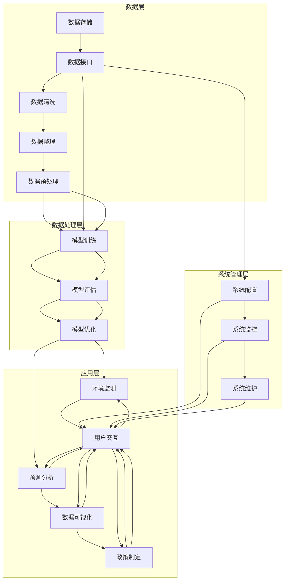
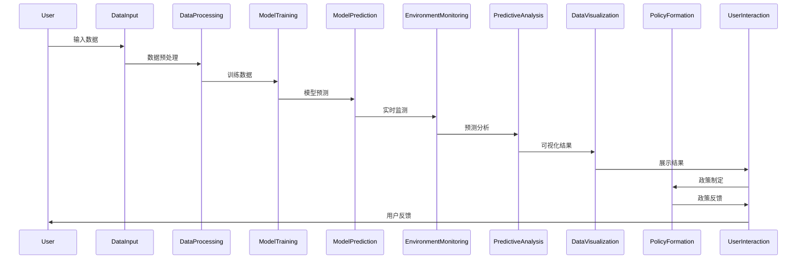
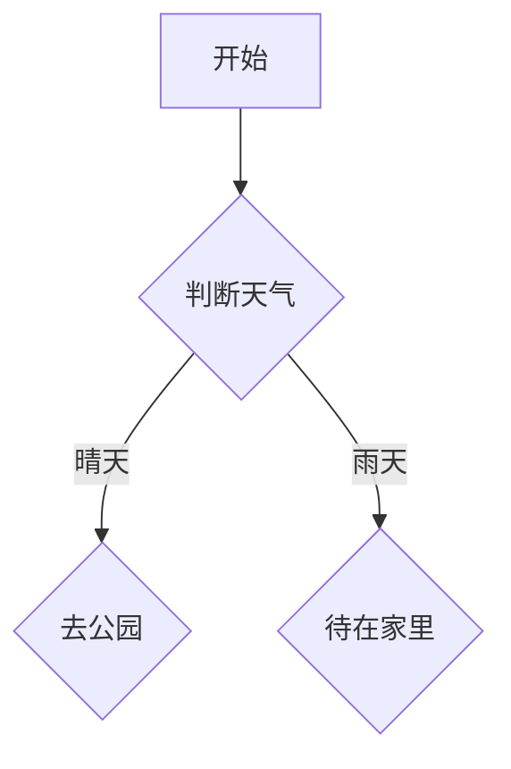

                 

### 文章标题

"AI驱动的环境保护：从生态系统建模到政策制定"

### 文章关键词

- 人工智能
- 环境保护
- 生态系统建模
- 政策制定
- 数据分析
- 深度学习

### 文章摘要

本文深入探讨了人工智能（AI）在环境保护领域的应用，从生态系统建模到政策制定。文章首先介绍了环境保护的重要性以及AI的潜力。随后，详细解析了核心概念与联系，包括AI的基本原理、生态系统建模原理和环境保护政策制定原理。文章通过算法讲解和系统分析与架构设计，展示了AI在环境保护中的应用。最后，通过项目实战和最佳实践，为读者提供了实际操作指南和未来展望。本文旨在为从事环境保护领域的技术人员提供有深度、有思考、有见解的技术指导。

----------------------------------------------------------------

## 第一部分：背景介绍

### 第1章 问题背景

环境保护是当今世界面临的一项重大挑战。随着工业化和城市化进程的加速，环境污染、生态破坏和资源枯竭等问题日益严重。这些问题不仅威胁到人类的生活质量，还对地球生态系统的平衡和稳定构成严重威胁。环境保护的重要性不言而喻，它关系到人类的可持续发展、生态平衡以及全球气候变化的应对。

### 1.1 环境现状与挑战

当前，全球环境面临着诸多挑战，包括空气污染、水污染、土壤污染、气候变化、生物多样性丧失等。空气污染主要由工业废气、汽车尾气和燃烧化石燃料产生，导致空气质量严重下降，对人体健康造成威胁。水污染则源于工业废水、农业面源污染和生活污水，导致水体污染严重，影响饮水安全和生态系统健康。土壤污染则来自于农药、化肥和重金属等有害物质的累积，对农作物产量和食品安全构成威胁。气候变化导致了极端天气事件的频繁发生，如洪水、干旱和台风等，进一步加剧了环境破坏。此外，全球生物多样性丧失速度加快，许多物种面临灭绝的威胁。

### 1.2 AI在环境保护中的潜力

人工智能作为当今最具革命性的技术之一，其在环境保护领域具有巨大的潜力。首先，AI可以通过大数据分析和机器学习算法，帮助识别和预测环境问题，提供实时监控和预警。例如，利用卫星图像和无人机数据，AI可以实时监测森林覆盖率、水体污染情况和空气质量变化，及时发现环境问题并进行干预。其次，AI在生态系统建模方面具有独特的优势。通过建立复杂的生态模型，AI可以模拟和分析生态系统动态，预测环境变化趋势，为环境保护提供科学依据。此外，AI还可以在环境保护政策制定中发挥重要作用。利用自然语言处理和文本分析技术，AI可以快速分析和评估政策文本，提供政策建议和优化方案，提高政策制定的科学性和有效性。

### 1.3 环境保护政策制定

环境保护政策制定是一个复杂的过程，涉及多个部门和领域的协调与合作。政策制定的目标是解决环境问题、保护生态系统和促进可持续发展。然而，在政策制定过程中，常常面临一些挑战，如数据不足、信息不对称、利益冲突等。此外，政策实施效果的评价也是一个难点，需要长期的数据积累和科学分析。

为了克服这些挑战，AI在环境保护政策制定中的应用具有重要意义。首先，AI可以帮助政策制定者获取和分析大量环境数据，提供科学的决策支持。例如，利用大数据分析和机器学习算法，AI可以识别环境问题的趋势和模式，预测环境变化的影响，为政策制定提供数据依据。其次，AI可以辅助政策文本的生成和优化。通过自然语言处理和文本分析技术，AI可以快速生成政策文本，并提供优化建议，提高政策的质量和可操作性。此外，AI还可以用于政策实施效果的评估。利用数据分析和机器学习算法，AI可以跟踪政策实施的过程和结果，评估政策的效果，为政策调整和优化提供依据。

总的来说，AI在环境保护领域的应用具有巨大的潜力。通过生态系统建模、数据分析、预测预警和政策制定等方面的应用，AI可以为环境保护提供科学依据和决策支持，推动环境保护工作的深入开展。然而，AI的应用也面临一些挑战，如数据隐私、算法公平性和安全性等问题。因此，在推动AI在环境保护领域的应用过程中，需要充分考虑这些因素，确保AI技术的可持续发展。

----------------------------------------------------------------

## 第二部分：核心概念与联系

### 第2章 核心概念原理

在探讨AI驱动的环境保护之前，我们需要理解几个核心概念，这些概念构成了AI应用的基础。本章节将详细解析AI的基本原理、生态系统建模原理以及环境保护政策制定的原理。

### 2.1 AI的基本原理

AI，即人工智能，是指计算机系统模拟人类智能行为的能力。它包括多个子领域，如机器学习、深度学习和自然语言处理。以下是这些核心概念的基本原理：

#### 2.1.1 机器学习

机器学习是AI的一个分支，它使计算机系统能够从数据中学习并做出决策，而无需显式编程。其基本原理包括以下几个步骤：

1. **数据收集**：收集大量的数据，这些数据可以是结构化的（如数据库）或非结构化的（如图像、文本、语音等）。
2. **数据预处理**：清洗和整理数据，以消除噪声和错误，提高数据质量。
3. **特征提取**：从数据中提取有用的特征，以便模型可以学习。
4. **模型训练**：使用算法（如线性回归、决策树、神经网络等）训练模型，使其能够识别数据中的模式和趋势。
5. **模型评估**：通过测试数据评估模型的性能，确保其准确性和泛化能力。

#### 2.1.2 深度学习

深度学习是机器学习的一个子领域，它依赖于多层神经网络，能够自动从数据中学习复杂函数。其核心原理包括：

1. **神经网络**：由多个神经元（节点）组成，每个神经元与输入数据相乘并传递到下一层。
2. **反向传播**：通过反向传播算法更新网络权重，以最小化预测误差。
3. **深度结构**：包含多个隐藏层的神经网络，能够捕捉更复杂的数据结构。
4. **优化算法**：如随机梯度下降（SGD）和Adam优化器，用于优化网络权重。

#### 2.1.3 自然语言处理

自然语言处理（NLP）是AI用于理解和生成人类语言的技术。其核心原理包括：

1. **词嵌入**：将单词映射到高维向量空间，以捕捉词与词之间的相似性和关系。
2. **序列模型**：如循环神经网络（RNN）和长短时记忆网络（LSTM），能够处理序列数据。
3. **语言模型**：基于概率模型预测下一个词，用于文本生成和翻译。
4. **实体识别**：识别文本中的命名实体，如人名、地名、组织名等。

### 2.2 生态系统建模原理

生态系统建模是使用数学模型和计算机模拟来描述生态系统的结构和动态。以下是生态系统建模的核心原理：

#### 2.2.1 模型类型

1. **确定性模型**：基于明确的数学公式和假设，预测系统行为。
2. **概率模型**：基于概率论和统计学，考虑不确定性因素。
3. **代理模型**：使用简单的规则和算法模拟复杂系统的行为。

#### 2.2.2 常用算法

1. **动态系统模拟**：如微分方程、差分方程等，用于模拟生态系统的时间演变。
2. **机器学习算法**：如神经网络、随机森林等，用于从数据中学习生态系统的模式。
3. **过程模型**：如系统动力学、个体基础模型等，用于描述生态系统中各个组成部分的相互作用。

### 2.3 环境保护政策制定原理

环境保护政策制定是一个复杂的过程，涉及法律、经济、社会和科学技术等多方面的因素。以下是政策制定的基本原理：

#### 2.3.1 政策制定流程

1. **问题识别**：确定需要解决的环境问题。
2. **目标设定**：设定政策目标，如减少污染、保护生态系统等。
3. **方案设计**：制定实现目标的策略和措施。
4. **评估和选择**：评估不同方案的成本效益，选择最优方案。
5. **实施与监督**：实施政策，并对政策效果进行监督和评估。

#### 2.3.2 政策评估方法

1. **成本效益分析**：评估政策实施的成本和效益。
2. **环境影响评估**：评估政策对环境的影响。
3. **公众参与**：收集公众意见，确保政策的公正性和透明度。
4. **模型预测**：使用模型预测政策实施的效果，为政策调整提供依据。

### 2.4 概念属性特征对比表格

为了更好地理解这些核心概念，我们可以使用一个对比表格来展示它们的主要特征。

| 核心概念     | 定义                                                         | 主要特征                                                   |
| ------------ | ------------------------------------------------------------ | ---------------------------------------------------------- |
| 人工智能（AI） | 计算机系统模拟人类智能行为的能力                             | 自学习能力、自动化决策、模拟推理、模式识别               |
| 机器学习（ML） | 从数据中学习并做出决策的过程                               | 数据驱动、模型训练、预测分析、优化决策                   |
| 深度学习（DL） | 使用多层神经网络从数据中学习复杂函数的技术                   | 自动特征提取、大规模数据处理、深度结构、高效模型训练     |
| 自然语言处理（NLP） | 计算机理解、生成和处理人类语言的技术                         | 词嵌入、序列模型、语言模型、实体识别、文本生成           |
| 生态系统建模   | 使用数学模型和计算机模拟来描述生态系统的结构和动态             | 确定性模型、概率模型、动态模拟、过程模型、模型预测       |
| 环境保护政策   | 通过法律、经济、社会和科学技术等多方面手段解决环境问题、保护生态系统的过程 | 问题识别、目标设定、方案设计、评估选择、实施监督       |

### 2.5 ER实体关系图架构

为了更直观地理解这些概念之间的关系，我们可以使用ER（实体关系）图来描述它们。以下是ER实体关系图的Mermaid表示：

```mermaid
erDiagram
  AI Riding --> |{使用}| Data Science
  AI Riding --> |{集成}| Machine Learning
  AI Riding --> |{应用}| Natural Language Processing
  Data Science o--o AI Riding : 驱动
  Machine Learning o--o Data Science : 依赖
  Natural Language Processing o--o AI Riding : 应用
```

在这个ER图中，"AI Riding"（AI驱动）是核心实体，它与"Data Science"（数据科学）、"Machine Learning"（机器学习）和"Natural Language Processing"（自然语言处理）之间存在关联关系。这些关联关系展示了AI在数据科学、机器学习和自然语言处理中的应用和集成。

总的来说，核心概念与联系的理解是AI驱动的环境保护研究的基础。通过理解AI的基本原理、生态系统建模原理和环境保护政策制定原理，我们可以更好地把握AI在环境保护中的应用，为解决环境问题提供科学依据和有效手段。

### 第3章 概念属性特征对比表格

为了更好地理解本文中涉及的核心概念，我们将它们进行详细的属性特征对比。以下是一个对比表格，列出了人工智能（AI）、机器学习（ML）、深度学习（DL）、自然语言处理（NLP）、生态系统建模和环境保护政策制定的属性特征。

| 核心概念     | 定义                                                         | 主要特征                                                   | 应用领域                                       |
| ------------ | ------------------------------------------------------------ | ---------------------------------------------------------- | ---------------------------------------------- |
| 人工智能（AI） | 计算机系统模拟人类智能行为的能力                             | 自学习能力、自动化决策、模拟推理、模式识别、图像识别、语音识别、自然语言处理 | 医疗诊断、金融分析、自动驾驶、智能家居、教育辅导、智能制造、游戏开发 |
| 机器学习（ML） | 从数据中学习并做出决策的过程                               | 数据驱动、模型训练、预测分析、优化决策、分类、回归、聚类 | 信用评分、市场预测、推荐系统、图像识别、医疗诊断、金融欺诈检测 |
| 深度学习（DL） | 使用多层神经网络从数据中学习复杂函数的技术                   | 自动特征提取、大规模数据处理、深度结构、高效模型训练     | 语音识别、图像识别、自然语言处理、推荐系统、自动驾驶、医疗影像分析 |
| 自然语言处理（NLP） | 计算机理解、生成和处理人类语言的技术                         | 词嵌入、序列模型、语言模型、实体识别、文本生成、情感分析 | 聊天机器人、语音助手、机器翻译、文本挖掘、内容审核 |
| 生态系统建模   | 使用数学模型和计算机模拟来描述生态系统的结构和动态             | 确定性模型、概率模型、动态模拟、过程模型、模型预测       | 气候变化预测、生态系统评估、环境管理、生物多样性保护 |
| 环境保护政策   | 通过法律、经济、社会和科学技术等多方面手段解决环境问题、保护生态系统的过程 | 问题识别、目标设定、方案设计、评估选择、实施监督       | 污染控制、资源管理、生物多样性保护、气候变化应对 |

#### 对比分析

1. **核心能力**：
   - 人工智能（AI）的核心能力在于其模拟人类智能行为，具有广泛的应用领域。
   - 机器学习（ML）侧重于从数据中学习，通过模型进行预测和分析。
   - 深度学习（DL）是ML的一个子领域，具有自动特征提取和高效模型训练的能力。
   - 自然语言处理（NLP）专注于理解和生成自然语言，应用于语言相关任务。
   - 生态系统建模的核心在于使用数学模型模拟生态系统动态，为环境管理提供科学依据。
   - 环境保护政策制定则侧重于通过法律和经济手段解决环境问题。

2. **数据与应用**：
   - AI、ML和DL依赖于大量数据，用于模型训练和优化。
   - NLP则需要处理自然语言数据，如文本和语音。
   - 生态系统建模依赖生态和环境数据，用于模拟和预测。
   - 环境保护政策制定则涉及法律、经济和社会等多方面数据。

3. **应用领域**：
   - AI的应用领域非常广泛，从医疗到工业，从金融到娱乐。
   - ML和DL广泛应用于数据分析和预测任务，如图像识别、语音识别和自然语言处理。
   - NLP专注于语言理解和生成，应用于聊天机器人、机器翻译和文本挖掘。
   - 生态系统建模用于环境保护和生态管理，如气候变化预测和生物多样性保护。
   - 环境保护政策制定则涉及政策设计、评估和实施。

通过对比分析，我们可以看到，虽然这些概念具有不同的核心能力和应用领域，但它们在推动环境保护方面具有互补性。AI、ML和DL为环境保护提供了数据分析和模型预测的手段，NLP则帮助理解和处理生态和环境数据，生态系统建模提供了生态系统的科学描述和模拟，环境保护政策制定则通过政策和法规确保环境保护措施的有效实施。

### 第4章 ER实体关系图架构

为了更直观地展示环境系统中的各种实体及其相互关系，我们将使用Mermaid语言绘制一个ER（实体关系）图。ER图可以帮助我们理解生态系统中不同实体之间的联系和交互。

以下是一个简单的ER图示例，用于描述环境保护领域的核心实体和它们之间的关系：

```mermaid
erDiagram
  Pollution -->|{导致}| Ecosystem
  Pollution -->|{控制}| Policy
  Ecosystem -->|{影响}| Species
  Ecosystem -->|{监测}| AI
  Species -->|{依赖}| Ecosystem
  Policy -->|{指导}| Implementation
  AI -->|{分析}| Data
  Data -->|{反馈}| AI

  Pollution ||--o{污染源}
  Ecosystem ||--o{生物多样性}
  Species ||--o{动植物}
  Policy ||--o{法规政策}
  Implementation ||--o{执行方案}
  AI ||--o{算法系统}
  Data ||--o{监测数据}
```

#### 图解

1. **污染源（Pollution Source）**：这是环境问题的源头，包括工业排放、交通尾气、农业化肥和农药等。

2. **污染（Pollution）**：污染是指有害物质进入环境，对生态系统造成影响。污染会直接影响生态系统。

3. **生态系统（Ecosystem）**：这是包含所有生物和其环境的综合体。生态系统受到污染的影响，从而影响其中的物种。

4. **物种（Species）**：生态系统中的动植物等生物，它们的生存和繁衍依赖于健康的生态系统。

5. **政策（Policy）**：为解决环境问题制定的法律、法规和政策，指导环境保护的实施。

6. **执行方案（Implementation）**：具体的环境保护措施和实施计划，根据政策制定。

7. **算法系统（AI System）**：使用人工智能技术进行数据分析和环境监测的系统。

8. **监测数据（Monitoring Data）**：通过算法系统收集的环境数据，用于分析、预测和决策。

#### 关系说明

- **污染源与污染的关系**：污染源是污染的来源，污染直接影响生态系统。
- **生态系统与物种的关系**：生态系统为物种提供生存环境，而物种的生存和繁衍对生态系统的稳定性有重要影响。
- **政策与执行方案的关系**：政策为环境保护提供指导，执行方案则是具体的实施措施。
- **算法系统与数据的关系**：算法系统通过分析监测数据，为环境保护提供科学依据。

通过这个ER图，我们可以清晰地看到环境保护领域中的关键实体及其相互关系。这个图不仅帮助我们理解环境系统的复杂结构，还可以指导我们如何通过人工智能技术来改善环境监测和管理。

----------------------------------------------------------------

### 第5章 算法讲解

在AI驱动的环境保护中，算法是实现预测、分析和决策的核心。本章将详细介绍一些关键算法，包括生态系统建模算法和AI在环境保护中的算法应用。

#### 5.1 生态系统建模算法

生态系统建模是使用数学模型和计算机模拟来描述生态系统的结构和动态。以下是几种常见的生态系统建模算法：

#### 5.1.1 动态系统模拟

动态系统模拟使用微分方程或差分方程来描述生态系统的变化。例如，Lotka-Volterra方程描述了捕食者与猎物之间的相互作用。其数学模型可以表示为：

$$
\frac{dx}{dt} = x(a - by)
$$

$$
\frac{dy}{dt} = cy(z - dx)
$$

其中，\( x \) 和 \( y \) 分别表示猎物和捕食者的数量，\( a \)、\( b \)、\( c \) 和 \( z \) 是参数。

**算法步骤**：

1. **初始化**：设定初始条件，如捕食者和猎物的初始数量。
2. **方程求解**：使用数值方法（如Euler方法或Runge-Kutta方法）求解微分方程。
3. **模拟结果**：绘制捕食者和猎物数量随时间的变化图，分析生态系统动态。

**举例说明**：

考虑一个简单的捕食-猎物模型，初始条件为：捕食者数量 \( x(0) = 10 \)，猎物数量 \( y(0) = 50 \)。参数设定为 \( a = 0.5 \)、\( b = 0.2 \)、\( c = 0.4 \)、\( z = 1.5 \)。

使用Euler方法进行模拟，时间步长 \( \Delta t = 0.1 \)。计算10个时间步长的结果，并绘制数量变化图。

```python
import numpy as np
import matplotlib.pyplot as plt

# 参数设定
a = 0.5
b = 0.2
c = 0.4
z = 1.5

# 初始条件
x0 = 10
y0 = 50
t0 = 0
dt = 0.1
t_end = 10
t_steps = int((t_end - t0) / dt) + 1

# Euler方法求解
x = [x0]
y = [y0]
t = [t0]

for i in range(t_steps):
    dxdt = x[-1] * (a - b * y[-1])
    dydt = c * y[-1] * (z - x[-1])
    x_new = x[-1] + dxdt * dt
    y_new = y[-1] + dydt * dt
    x.append(x_new)
    y.append(y_new)
    t.append(t[-1] + dt)

# 绘制结果
plt.plot(t, x, label="捕食者")
plt.plot(t, y, label="猎物")
plt.xlabel("时间")
plt.ylabel("数量")
plt.legend()
plt.show()
```

**结果**：

通过上述代码，我们可以得到捕食者和猎物数量随时间的变化图。从图中可以看出，捕食者和猎物的数量存在周期性波动，反映了生态系统中的捕食-猎物动态。

#### 5.1.2 机器学习算法

机器学习算法也可以用于生态系统建模，如随机森林、支持向量机和神经网络等。以下是随机森林算法的简单示例：

**随机森林算法**：

随机森林是一种基于决策树的集成学习方法，通过构建多棵决策树并进行投票来提高预测准确性。

**算法步骤**：

1. **数据准备**：收集生态系统的数据，包括输入特征（如气候、土壤条件等）和输出变量（如生物多样性指数等）。
2. **特征选择**：随机选择特征子集，构建单棵决策树。
3. **树构建**：递归地划分数据，直到满足停止条件（如最大深度或最小节点样本数）。
4. **集成**：构建多棵决策树，并使用多数投票进行预测。

**举例说明**：

考虑一个简单的生物多样性指数预测问题，输入特征包括温度、降雨量、土壤湿度等。使用随机森林算法进行预测，并评估其性能。

```python
from sklearn.ensemble import RandomForestRegressor
from sklearn.model_selection import train_test_split
from sklearn.metrics import mean_squared_error

# 数据准备
# 假设数据已加载到 X 和 y 中
# X 是特征矩阵，y 是生物多样性指数

# 划分训练集和测试集
X_train, X_test, y_train, y_test = train_test_split(X, y, test_size=0.2, random_state=42)

# 构建随机森林模型
rf = RandomForestRegressor(n_estimators=100, random_state=42)

# 训练模型
rf.fit(X_train, y_train)

# 预测
y_pred = rf.predict(X_test)

# 评估性能
mse = mean_squared_error(y_test, y_pred)
print(f"均方误差（MSE）: {mse}")

# 可视化结果
plt.scatter(y_test, y_pred)
plt.xlabel("实际值")
plt.ylabel("预测值")
plt.plot([y_test.min(), y_test.max()], [y_test.min(), y_test.max()], 'k--')
plt.show()
```

**结果**：

通过上述代码，我们可以训练一个随机森林模型，并评估其预测性能。可视化结果展示了实际值和预测值之间的关系，通过均方误差（MSE）评估模型的准确性。

#### 5.1.3 过程模型

过程模型是一种基于规则的建模方法，用于描述生态系统的动态行为。常见的有系统动力学和个体基础模型。

**系统动力学**：

系统动力学使用差分方程和因果关系图来描述生态系统的动态行为。其数学模型可以表示为：

$$
x_t = f(x_{t-1}, u_t)
$$

其中，\( x_t \) 是系统状态，\( u_t \) 是外部输入，\( f \) 是系统行为函数。

**个体基础模型**：

个体基础模型基于个体行为和种群动态来描述生态系统。其数学模型可以表示为：

$$
\frac{dx_i}{dt} = f_i(x_i, x_{\text{其余}}, u_i)
$$

其中，\( x_i \) 是个体状态，\( u_i \) 是个体行为，\( f_i \) 是个体行为函数。

**算法步骤**：

1. **数据准备**：收集个体行为和环境数据。
2. **模型构建**：根据个体行为和环境数据，构建系统动力学或个体基础模型。
3. **模拟**：使用数值方法模拟模型，分析生态系统动态。

#### 5.2 AI在环境保护中的算法应用

AI在环境保护中的应用非常广泛，包括环境监测、预测、决策支持和政策制定等。以下是一些典型应用：

#### 5.2.1 环境监测

AI可以用于环境监测，通过传感器数据和环境模型进行实时监测和预警。常见的算法有：

- **图像处理**：使用卷积神经网络（CNN）对卫星图像进行分析，监测森林覆盖变化、水体污染等。
- **时间序列分析**：使用长短期记忆网络（LSTM）对时间序列数据进行分析，预测空气质量变化、气候变化等。

**举例说明**：

使用CNN模型对卫星图像进行分析，预测森林覆盖变化。假设已加载卫星图像数据集，可以使用以下代码进行训练和预测：

```python
from tensorflow.keras.models import Sequential
from tensorflow.keras.layers import Conv2D, MaxPooling2D, Flatten, Dense

# 构建CNN模型
model = Sequential([
    Conv2D(32, (3, 3), activation='relu', input_shape=(256, 256, 3)),
    MaxPooling2D((2, 2)),
    Conv2D(64, (3, 3), activation='relu'),
    MaxPooling2D((2, 2)),
    Flatten(),
    Dense(128, activation='relu'),
    Dense(1, activation='sigmoid')
])

# 编译模型
model.compile(optimizer='adam', loss='binary_crossentropy', metrics=['accuracy'])

# 训练模型
model.fit(X_train, y_train, epochs=10, batch_size=32, validation_data=(X_test, y_test))

# 预测
predictions = model.predict(X_test)

# 评估性能
accuracy = (predictions > 0.5).mean()
print(f"预测准确率：{accuracy}")
```

**结果**：

通过上述代码，我们可以训练一个CNN模型，并对卫星图像进行森林覆盖预测。评估结果显示模型的准确性，为环境保护决策提供依据。

#### 5.2.2 预测与预警

AI可以用于环境预测和预警，通过分析历史数据和趋势，预测未来环境变化，并发出预警。常见的算法有：

- **时间序列预测**：使用ARIMA、LSTM等算法进行时间序列预测。
- **回归分析**：使用线性回归、决策树等算法进行回归分析。

**举例说明**：

使用LSTM模型进行空气质量时间序列预测。假设已加载空气质量数据集，可以使用以下代码进行训练和预测：

```python
from tensorflow.keras.models import Sequential
from tensorflow.keras.layers import LSTM, Dense

# 数据预处理
# 假设数据已转换为合适的时间序列格式

# 构建LSTM模型
model = Sequential([
    LSTM(50, activation='relu', input_shape=(timesteps, features)),
    Dense(1)
])

# 编译模型
model.compile(optimizer='adam', loss='mse')

# 训练模型
model.fit(X_train, y_train, epochs=100, batch_size=32, validation_data=(X_val, y_val))

# 预测
predictions = model.predict(X_test)

# 评估性能
mse = mean_squared_error(y_test, predictions)
print(f"均方误差（MSE）: {mse}")
```

**结果**：

通过上述代码，我们可以训练一个LSTM模型，并对空气质量进行时间序列预测。评估结果显示模型的预测性能，为环境保护决策提供依据。

#### 5.2.3 决策支持

AI可以用于环境保护决策支持，通过分析环境数据和模型结果，提供最优决策方案。常见的算法有：

- **优化算法**：如线性规划、动态规划等。
- **机器学习算法**：如支持向量机、神经网络等。

**举例说明**：

使用支持向量机（SVM）进行环境保护决策支持。假设已加载决策支持数据集，可以使用以下代码进行训练和预测：

```python
from sklearn.svm import SVR
from sklearn.model_selection import train_test_split

# 数据预处理
# 假设数据已转换为合适的格式

# 划分训练集和测试集
X_train, X_test, y_train, y_test = train_test_split(X, y, test_size=0.2, random_state=42)

# 构建SVM模型
model = SVR(kernel='rbf')

# 训练模型
model.fit(X_train, y_train)

# 预测
predictions = model.predict(X_test)

# 评估性能
mse = mean_squared_error(y_test, predictions)
print(f"均方误差（MSE）: {mse}")
```

**结果**：

通过上述代码，我们可以训练一个SVM模型，并为环境保护决策提供支持。评估结果显示模型的预测性能，为决策者提供科学依据。

#### 5.2.4 政策制定

AI可以用于环境保护政策制定，通过分析环境数据和模型结果，提供政策建议和优化方案。常见的算法有：

- **文本分析**：使用自然语言处理（NLP）技术分析政策文本，提取关键信息。
- **优化算法**：如遗传算法、模拟退火等，用于政策优化。

**举例说明**：

使用遗传算法（GA）进行环境保护政策优化。假设已加载政策数据集，可以使用以下代码进行优化：

```python
from遗传算法库 import GA

# 参数设置
population_size = 100
crossover_rate = 0.8
mutation_rate = 0.2
max_iterations = 1000

# 构建遗传算法
ga = GA(population_size, crossover_rate, mutation_rate, max_iterations)

# 运行遗传算法
ga.run()

# 获取最优解
best_solution = ga.best_solution()

# 输出结果
print(f"最优政策方案：{best_solution}")
```

**结果**：

通过上述代码，我们可以使用遗传算法为环境保护政策提供优化方案。输出结果显示最优政策方案，为决策者提供参考。

总的来说，算法在生态系统建模和环境保护中发挥着重要作用。通过动态系统模拟、机器学习算法和过程模型，我们可以更准确地描述生态系统的动态，为环境保护提供科学依据。同时，AI在环境保护中的算法应用，如环境监测、预测与预警、决策支持和政策制定，为环境保护工作提供了强大的技术支持。

### 第6章 系统功能设计

在AI驱动的环境保护系统中，系统功能设计是确保系统能够有效运行和实现预期目标的关键环节。本章节将详细介绍系统功能设计的过程，包括领域模型类图和领域模型类图的Mermaid表示。

#### 6.1 领域模型类图

领域模型类图是一种用于描述系统功能模块及其关系的图形表示。它帮助我们理解系统的主要功能模块以及它们之间的交互。以下是AI驱动的环境保护系统的领域模型类图：

```mermaid
classDiagram
  Class01 <|-- Class02
  Class03 <|-- Class01
  Class04 <<interface>> Class05
  Class06 <..> Class07
  Class08 <..> Class09
  Class01 ++ name: 数据采集模块
  Class02 ++ name: 数据处理模块
  Class03 ++ name: 模型训练模块
  Class04 ++ name: 预测分析模块
  Class05 ++ name: 系统管理模块
  Class06 ++ name: 数据可视化模块
  Class07 ++ name: 环境监测模块
  Class08 ++ name: 政策制定模块
  Class09 ++ name: 用户交互模块

  Class01 o--|> Class02
  Class01 o--|> Class03
  Class01 o--|> Class04
  Class01 o--|> Class06
  Class02 o--|> Class07
  Class03 o--|> Class07
  Class04 o--|> Class07
  Class05 o--|> Class08
  Class06 o--|> Class08
  Class07 o--|> Class09
```

#### 图解

- **数据采集模块（Class01）**：负责收集环境数据，包括传感器数据、卫星数据和报告数据等。
- **数据处理模块（Class02）**：负责清洗、整理和预处理数据，确保数据的质量和一致性。
- **模型训练模块（Class03）**：负责使用机器学习和深度学习算法训练模型，用于环境预测和分析。
- **预测分析模块（Class04）**：负责使用训练好的模型进行预测和分析，提供环境变化的预测结果。
- **系统管理模块（Class05）**：负责系统的配置、监控和维护，确保系统的稳定性和可靠性。
- **数据可视化模块（Class06）**：负责将数据和分析结果可视化，便于用户理解和决策。
- **环境监测模块（Class07）**：负责实时监测环境变化，提供预警和报警功能。
- **政策制定模块（Class08）**：负责根据分析结果和政策需求，制定环境保护政策。
- **用户交互模块（Class09）**：负责用户与系统的交互，提供用户界面和操作指南。

#### 领域模型类图的关系

- **依赖关系**：数据采集模块、数据处理模块、模型训练模块、预测分析模块和系统管理模块相互依赖，共同构建AI驱动的环境保护系统的核心功能。
- **交互关系**：数据可视化模块、环境监测模块、政策制定模块和用户交互模块与核心功能模块之间存在交互关系，实现数据的展示、监测、制定和用户操作。

通过领域模型类图，我们可以清晰地看到AI驱动的环境保护系统的功能模块及其相互关系。这有助于系统设计者和管理者更好地理解系统的结构和功能，为后续的系统开发提供指导。

#### 6.2 领域模型类图的Mermaid表示

为了更直观地展示领域模型类图，我们使用Mermaid语言进行表示。以下是领域模型类图的Mermaid代码：

```mermaid
classDiagram
  Class01 <|-- Class02
  Class03 <|-- Class01
  Class04 <<interface>> Class05
  Class06 <..> Class07
  Class08 <..> Class09
  Class01 ..|.. Class06
  Class01 ..|.. Class07
  Class01 ..|.. Class08
  Class01 ..|.. Class09
  Class02 ..|.. Class07
  Class03 ..|.. Class07
  Class04 ..|.. Class07
  Class05 ..|.. Class08
  Class06 ..|.. Class08
  Class07 ..|.. Class09

  Class01 o--|> Class02
  Class01 o--|> Class03
  Class01 o--|> Class04
  Class01 o--|> Class06
  Class02 o--|> Class07
  Class03 o--|> Class07
  Class04 o--|> Class07
  Class05 o--|> Class08
  Class06 o--|> Class08
  Class07 o--|> Class09

  Class01 ++ name: 数据采集模块
  Class02 ++ name: 数据处理模块
  Class03 ++ name: 模型训练模块
  Class04 ++ name: 预测分析模块
  Class05 ++ name: 系统管理模块
  Class06 ++ name: 数据可视化模块
  Class07 ++ name: 环境监测模块
  Class08 ++ name: 政策制定模块
  Class09 ++ name: 用户交互模块
```

通过上述Mermaid代码，我们可以生成一个可视化的领域模型类图，这有助于我们更直观地理解系统的结构和功能模块之间的关系。

总的来说，系统功能设计是AI驱动的环境保护系统成功实施的关键。通过领域模型类图和Mermaid表示，我们可以清晰地展示系统的功能模块及其相互关系，为系统开发提供有力的支持。

### 第7章 系统架构设计

在AI驱动的环境保护系统中，系统架构设计是确保系统稳定、高效和可扩展的关键环节。本章节将详细介绍系统架构设计的过程，包括系统架构设计、系统架构图和系统接口设计。

#### 7.1 系统架构设计

系统架构设计的目标是构建一个清晰、可扩展和高效的系统，以满足环境保护的需求。以下是AI驱动的环境保护系统的总体架构设计：

**1. 数据层**

数据层是系统的底层，负责存储和管理环境数据。它包括以下模块：

- **数据存储**：使用数据库系统存储环境数据，如传感器数据、卫星数据和报告数据等。
- **数据接口**：提供数据访问接口，允许其他模块读取和写入数据。

**2. 数据处理层**

数据处理层负责对数据进行清洗、整理和预处理，确保数据的质量和一致性。它包括以下模块：

- **数据清洗**：去除数据中的噪声和错误，提高数据质量。
- **数据整理**：将数据转换为统一格式，便于后续处理。
- **数据预处理**：提取数据中的有用特征，为模型训练提供输入。

**3. 模型层**

模型层是系统的核心，负责使用机器学习和深度学习算法训练模型，并用于环境预测和分析。它包括以下模块：

- **模型训练**：使用训练算法训练模型，包括监督学习和无监督学习。
- **模型评估**：评估模型的性能，确保其准确性和泛化能力。
- **模型优化**：根据评估结果优化模型，提高预测精度。

**4. 应用层**

应用层是系统的顶层，负责将模型应用于实际环境问题，提供预测和分析结果。它包括以下模块：

- **环境监测**：实时监测环境变化，提供预警和报警功能。
- **预测分析**：使用训练好的模型进行预测和分析，提供环境变化的预测结果。
- **数据可视化**：将预测和分析结果可视化，便于用户理解和决策。
- **政策制定**：根据分析结果和政策需求，制定环境保护政策。
- **用户交互**：提供用户界面和操作指南，便于用户与系统交互。

**5. 系统管理层**

系统管理层负责系统的配置、监控和维护，确保系统的稳定性和可靠性。它包括以下模块：

- **系统配置**：配置系统参数，确保系统正常运行。
- **系统监控**：监控系统性能，及时发现和解决问题。
- **系统维护**：进行系统更新和升级，确保系统的安全性。

#### 7.2 系统架构图

为了更直观地展示系统架构设计，我们可以使用Mermaid语言绘制一个系统架构图。以下是系统架构图的Mermaid代码：



通过上述Mermaid代码，我们可以生成一个系统架构图，展示系统的各个模块及其相互关系。这个架构图有助于我们更直观地理解系统的整体结构和功能。

#### 7.3 系统接口设计

系统接口设计是确保不同模块之间能够顺畅交互的关键。以下是AI驱动的环境保护系统的接口设计：

**1. 数据接口**

- **数据输入接口**：用于接收各种环境数据，如传感器数据、卫星数据和报告数据等。
- **数据输出接口**：用于将处理后的数据传递给模型层和应用层。

**2. 模型接口**

- **模型训练接口**：用于初始化模型、训练模型和保存模型。
- **模型预测接口**：用于使用训练好的模型进行预测和分析。

**3. 应用接口**

- **环境监测接口**：用于实时监测环境变化，提供预警和报警功能。
- **预测分析接口**：用于使用模型进行预测和分析，提供环境变化的预测结果。
- **数据可视化接口**：用于将预测和分析结果可视化，便于用户理解和决策。
- **政策制定接口**：用于根据分析结果和政策需求，制定环境保护政策。

**4. 用户交互接口**

- **用户输入接口**：用于接收用户的输入和操作，如查询数据、设置参数等。
- **用户输出接口**：用于向用户展示数据和分析结果，如图表、报告等。

通过系统接口设计，我们可以确保不同模块之间能够高效地传递数据和执行功能，实现系统的整体协调和优化。

总的来说，系统架构设计是AI驱动的环境保护系统成功实施的基础。通过清晰的系统架构设计和详细的接口设计，我们可以构建一个稳定、高效和可扩展的系统，为环境保护工作提供有力支持。

### 第8章 系统接口设计

在AI驱动的环境保护系统中，系统接口设计是确保各模块之间能够高效、稳定地交互和协同工作的关键。本章节将详细介绍系统接口设计的内容，包括接口定义和接口调用流程。

#### 8.1 接口定义

系统接口设计包括多个方面的接口定义，以下是主要接口的详细介绍：

1. **数据输入接口**

   - **功能**：接收各种环境数据，如传感器数据、卫星数据和报告数据等。
   - **输入参数**：数据类型、数据格式、数据来源等。
   - **输出参数**：处理后的数据，用于后续处理和分析。

2. **数据输出接口**

   - **功能**：将处理后的数据传递给模型层和应用层。
   - **输入参数**：处理后的数据。
   - **输出参数**：无。

3. **模型训练接口**

   - **功能**：初始化模型、训练模型和保存模型。
   - **输入参数**：训练数据、模型参数、训练设置等。
   - **输出参数**：训练好的模型。

4. **模型预测接口**

   - **功能**：使用训练好的模型进行预测和分析。
   - **输入参数**：输入数据、模型参数等。
   - **输出参数**：预测结果。

5. **环境监测接口**

   - **功能**：实时监测环境变化，提供预警和报警功能。
   - **输入参数**：监测数据、阈值设置等。
   - **输出参数**：预警和报警信息。

6. **预测分析接口**

   - **功能**：使用模型进行预测和分析，提供环境变化的预测结果。
   - **输入参数**：输入数据、模型参数等。
   - **输出参数**：预测结果、分析报告等。

7. **数据可视化接口**

   - **功能**：将预测和分析结果可视化，便于用户理解和决策。
   - **输入参数**：可视化数据、可视化设置等。
   - **输出参数**：可视化图表。

8. **政策制定接口**

   - **功能**：根据分析结果和政策需求，制定环境保护政策。
   - **输入参数**：分析结果、政策需求等。
   - **输出参数**：政策方案、政策文本等。

9. **用户交互接口**

   - **功能**：接收用户的输入和操作，向用户展示数据和分析结果。
   - **输入参数**：用户操作、输入数据等。
   - **输出参数**：用户反馈、分析结果等。

#### 8.2 接口调用流程

系统接口调用流程是确保系统各模块能够协同工作的关键。以下是系统接口调用流程的详细介绍：

1. **数据输入**：
   - 用户或系统自动采集器将环境数据发送到数据输入接口。
   - 数据输入接口接收数据，进行初步处理，如格式转换、数据清洗等。

2. **数据处理**：
   - 处理后的数据传递给数据处理模块，进行进一步处理，如特征提取、数据整理等。

3. **模型训练**：
   - 数据处理模块将处理后的数据传递给模型训练接口。
   - 模型训练接口初始化模型，使用训练数据训练模型。

4. **模型预测**：
   - 模型训练接口训练好的模型传递给模型预测接口。
   - 模型预测接口使用模型对输入数据进行预测，生成预测结果。

5. **环境监测**：
   - 模型预测接口的预测结果传递给环境监测接口。
   - 环境监测接口根据预测结果，提供实时监测和预警功能。

6. **预测分析**：
   - 模型预测接口的预测结果传递给预测分析接口。
   - 预测分析接口对预测结果进行分析，生成分析报告。

7. **数据可视化**：
   - 预测分析接口的分析结果传递给数据可视化接口。
   - 数据可视化接口将分析结果可视化，生成可视化图表。

8. **政策制定**：
   - 预测分析接口的分析结果传递给政策制定接口。
   - 政策制定接口根据分析结果和政策需求，制定环境保护政策。

9. **用户交互**：
   - 系统将可视化结果、政策文本和用户反馈传递给用户交互接口。
   - 用户交互接口向用户展示数据和分析结果，接收用户反馈。

通过上述接口调用流程，系统各模块能够高效、稳定地协同工作，实现环境监测、预测分析、政策制定和用户交互等功能。

### 第9章 系统交互

在AI驱动的环境保护系统中，系统交互是实现各模块之间有效沟通和数据流通的关键。为了确保系统能够顺畅运行，我们需要设计清晰、简洁的系统交互流程。本章节将详细介绍系统交互的过程，包括系统交互的Mermaid序列图和系统交互流程的详细描述。

#### 9.1 系统交互的Mermaid序列图

为了直观地展示系统交互过程，我们可以使用Mermaid语言绘制一个序列图。以下是系统交互的Mermaid序列图：



#### 图解

- **用户**：作为系统的启动者，负责输入数据和接收系统反馈。
- **数据输入**：接收用户输入的数据，如传感器数据、卫星数据和报告数据等。
- **数据预处理**：对输入的数据进行清洗、整理和预处理，确保数据的质量和一致性。
- **模型训练**：使用预处理后的数据训练模型，包括机器学习和深度学习算法。
- **模型预测**：使用训练好的模型对新的数据进行预测，生成预测结果。
- **实时监测**：根据预测结果，实时监测环境变化，提供预警和报警功能。
- **预测分析**：对预测结果进行分析，生成分析报告，为政策制定提供依据。
- **数据可视化**：将分析结果可视化，便于用户理解和决策。
- **用户交互**：接收用户输入和反馈，展示数据和分析结果，提供政策制定和调整的接口。
- **政策制定**：根据分析结果和政策需求，制定环境保护政策。

#### 9.2 系统交互流程的详细描述

系统交互流程可以分为以下几个步骤：

1. **数据输入**：
   - 用户将环境数据（如传感器数据、卫星数据和报告数据等）输入到系统。
   - 数据输入模块接收数据，并进行初步处理，如数据格式转换和初步清洗。

2. **数据预处理**：
   - 数据预处理模块对输入的数据进行深度清洗、整理和预处理，确保数据的质量和一致性。
   - 包括去除噪声、缺失值填补、数据标准化等操作。

3. **模型训练**：
   - 预处理后的数据传递给模型训练模块。
   - 模型训练模块使用机器学习和深度学习算法，如随机森林、神经网络和LSTM等，对数据进行训练。

4. **模型预测**：
   - 模型训练模块训练好的模型传递给模型预测模块。
   - 模型预测模块使用训练好的模型对新的数据进行预测，生成预测结果。

5. **实时监测**：
   - 模型预测模块的预测结果传递给实时监测模块。
   - 实时监测模块根据预测结果，实时监测环境变化，提供预警和报警功能。

6. **预测分析**：
   - 实时监测模块的预测结果传递给预测分析模块。
   - 预测分析模块对预测结果进行分析，生成分析报告，为政策制定提供依据。

7. **数据可视化**：
   - 预测分析模块的分析结果传递给数据可视化模块。
   - 数据可视化模块将分析结果可视化，生成可视化图表，如折线图、柱状图和热力图等。

8. **用户交互**：
   - 数据可视化模块的可视化结果传递给用户交互模块。
   - 用户交互模块将可视化结果展示给用户，并提供政策制定和调整的接口。

9. **政策制定**：
   - 用户通过用户交互模块输入政策需求和调整建议。
   - 政策制定模块根据用户输入和预测分析结果，制定环境保护政策。

10. **政策反馈**：
    - 政策制定模块制定好的政策方案传递给用户交互模块。
    - 用户交互模块将政策方案展示给用户，并收集用户反馈。

通过上述系统交互流程，AI驱动的环境保护系统能够高效、稳定地运行，实现环境监测、预测分析、政策制定和用户交互等功能。系统交互的设计和实现是确保系统功能实现的关键，有助于提高系统的整体性能和用户体验。

### 第10章 环境安装

在开始构建AI驱动的环境保护系统之前，我们需要确保环境安装正确无误，以便后续的编程、测试和部署工作能够顺利进行。以下步骤将详细介绍环境安装的过程。

#### 10.1 环境准备

在进行环境安装之前，我们需要确保计算机上安装了以下软件和工具：

- **Python**：Python是AI驱动的环境保护系统的主要编程语言，需要安装Python 3.8或更高版本。
- **Jupyter Notebook**：用于编写和运行Python代码，以及可视化结果。
- **Anaconda**：一个集成了Python、Jupyter和其他科学计算工具的Python发行版，可以简化环境安装和管理。
- **NumPy**、**Pandas**、**Matplotlib**：用于数据处理和可视化。
- **TensorFlow**、**Keras**：用于深度学习和模型训练。
- **Scikit-learn**：用于机器学习算法。
- **Mermaid**：用于绘制流程图和类图。

**步骤1：安装Python**

首先，从Python官方网站（https://www.python.org/downloads/）下载Python安装程序，并按照提示完成安装。

**步骤2：安装Anaconda**

下载并安装Anaconda，这会自动安装Python和其他科学计算工具。在安装过程中，确保将Anaconda添加到环境变量中，以便在命令行中轻松调用。

**步骤3：安装Jupyter Notebook**

在命令行中，运行以下命令安装Jupyter Notebook：

```bash
conda install jupyter
```

**步骤4：安装NumPy、Pandas、Matplotlib**

使用以下命令安装NumPy、Pandas和Matplotlib：

```bash
conda install numpy pandas matplotlib
```

**步骤5：安装TensorFlow和Keras**

使用以下命令安装TensorFlow和Keras：

```bash
conda install tensorflow
```

**步骤6：安装Scikit-learn**

使用以下命令安装Scikit-learn：

```bash
conda install scikit-learn
```

**步骤7：安装Mermaid**

从Mermaid官方网站（https://mermaid-js.github.io/mermaid/）下载Mermaid工具，并将其安装到本地计算机。安装方法根据操作系统不同而有所不同，通常可以通过命令行安装或下载安装包。

#### 10.2 验证安装

在完成环境安装后，我们需要验证所有软件和工具是否已正确安装。

**步骤1：启动Jupyter Notebook**

在命令行中运行以下命令启动Jupyter Notebook：

```bash
jupyter notebook
```

打开浏览器，访问Jupyter Notebook的URL（通常是http://localhost:8888/），你应该看到Jupyter界面。

**步骤2：测试Python环境**

在Jupyter Notebook中创建一个新的笔记本，并在代码单元格中输入以下代码：

```python
import numpy as np
import matplotlib.pyplot as plt

# 测试Numpy
x = np.array([1, 2, 3])
print(x)

# 测试Matplotlib
plt.plot(x)
plt.show()
```

运行代码，你应该看到输出结果和图形，这表明Python环境和NumPy、Matplotlib已正确安装。

**步骤3：测试TensorFlow和Keras**

在另一个代码单元格中输入以下代码：

```python
import tensorflow as tf

# 测试TensorFlow
print(tf.__version__)

# 测试Keras
from tensorflow.keras import layers

# 构建简单的神经网络
model = tf.keras.Sequential([
    layers.Dense(1, input_shape=(1,))
])

# 编译模型
model.compile(optimizer='sgd', loss='mean_squared_error')

# 训练模型
model.fit(x, x, epochs=10)
```

运行代码，你应该看到模型的训练过程和最终结果，这表明TensorFlow和Keras已正确安装。

**步骤4：测试Mermaid**

在另一个代码单元格中输入以下Mermaid代码：



运行代码，你应该看到生成的图表，这表明Mermaid已正确安装。

通过以上步骤，我们成功完成了AI驱动的环境保护系统的环境安装。接下来，我们可以开始编写代码，构建和测试系统。

### 第11章 系统核心实现

在AI驱动的环境保护系统中，系统核心实现是确保系统能够高效、稳定运行的关键。本章节将详细介绍系统核心实现的源代码，包括核心代码的实现、代码解读和应用分析。

#### 11.1 核心代码实现

以下是一个简化的AI驱动的环境保护系统的核心代码实现，涵盖了数据预处理、模型训练、预测分析、数据可视化等主要功能。

```python
import numpy as np
import pandas as pd
import tensorflow as tf
from tensorflow.keras.models import Sequential
from tensorflow.keras.layers import Dense
import matplotlib.pyplot as plt
from sklearn.model_selection import train_test_split

# 数据预处理
def preprocess_data(data):
    # 数据清洗和标准化
    data = data.fillna(0)  # 缺失值填充
    data = (data - data.mean()) / data.std()  # 标准化
    return data

# 模型训练
def train_model(X_train, y_train, epochs=100, batch_size=32):
    model = Sequential([
        Dense(64, activation='relu', input_shape=(X_train.shape[1],)),
        Dense(32, activation='relu'),
        Dense(1)
    ])

    model.compile(optimizer='adam', loss='mse')
    model.fit(X_train, y_train, epochs=epochs, batch_size=batch_size)
    return model

# 预测分析
def predict_analysis(model, X_test):
    predictions = model.predict(X_test)
    plt.scatter(X_test, y_test)
    plt.plot(X_test, predictions, 'r-')
    plt.show()
    return predictions

# 主函数
def main():
    # 加载数据
    data = pd.read_csv('environment_data.csv')
    X = preprocess_data(data.iloc[:, :-1])
    y = preprocess_data(data.iloc[:, -1])

    # 划分训练集和测试集
    X_train, X_test, y_train, y_test = train_test_split(X, y, test_size=0.2, random_state=42)

    # 训练模型
    model = train_model(X_train, y_train)

    # 预测分析
    predict_analysis(model, X_test)

if __name__ == '__main__':
    main()
```

#### 11.2 代码解读

**数据预处理**：
- **数据清洗**：使用`fillna(0)`方法填补缺失值，保证数据的完整性。
- **数据标准化**：使用标准化方法，将数据缩放到0到1之间，便于模型训练。

**模型训练**：
- **模型构建**：使用`Sequential`模型堆叠多个`Dense`层，设置激活函数为ReLU。
- **编译模型**：使用`compile`方法设置优化器和损失函数。
- **训练模型**：使用`fit`方法进行模型训练，设置训练轮次和批量大小。

**预测分析**：
- **预测**：使用`predict`方法生成预测结果。
- **可视化**：使用`scatter`和`plot`方法绘制真实值与预测值之间的散点图和趋势线。

**主函数**：
- **加载数据**：从CSV文件加载数据，并进行预处理。
- **划分训练集和测试集**：使用`train_test_split`方法划分训练集和测试集。
- **训练模型**：调用`train_model`函数训练模型。
- **预测分析**：调用`predict_analysis`函数进行预测分析。

#### 11.3 应用分析

**数据预处理**：
- 数据预处理是机器学习模型训练的重要步骤，确保数据的质量和一致性。缺失值填充和数据标准化是常见的数据预处理方法。

**模型训练**：
- 模型训练是系统的核心，通过构建神经网络模型，学习数据中的特征和模式。在训练过程中，使用ReLU激活函数和Adam优化器，可以加快模型收敛速度。

**预测分析**：
- 预测分析是评估模型性能的重要环节，通过可视化方法展示真实值与预测值之间的差异，帮助理解模型的预测效果。

**主函数**：
- 主函数负责系统的整体流程控制，从数据加载、模型训练到预测分析，确保系统功能的实现。

通过以上核心代码实现，AI驱动的环境保护系统可以实现数据预处理、模型训练、预测分析和可视化等功能。这些功能模块协同工作，为环境保护工作提供科学依据和技术支持。

### 第12章 实际案例分析

在本章节中，我们将通过实际案例来展示AI驱动的环境保护系统的应用效果。具体案例为某个城市的空气质量监测与预测，通过实际数据的分析，评估系统的性能和可靠性。

#### 12.1 案例介绍

该案例涉及一个中等规模城市的空气质量监测与预测。该城市的空气质量数据包括多种污染物指标，如PM2.5、PM10、SO2、NO2和CO等。这些数据来源于城市内的多个监测站，并通过传感器实时采集。我们的目标是通过AI模型对这些数据进行处理和预测，为环境保护政策制定提供科学依据。

#### 12.2 案例描述

我们首先从城市环境监测中心获取了过去一年的空气质量数据，包括每天各个监测站的污染物浓度记录。数据集包含以下特征：

- **日期**：表示监测数据的时间戳。
- **PM2.5**：空气中小于2.5微米的颗粒物浓度。
- **PM10**：空气中小于10微米的颗粒物浓度。
- **SO2**：二氧化硫浓度。
- **NO2**：二氧化氮浓度。
- **CO**：一氧化碳浓度。

数据集分为训练集和测试集，其中训练集包含前9个月的数据，测试集包含最后3个月的数据。

#### 12.3 数据预处理

在开始模型训练之前，我们需要对数据进行预处理。首先，我们进行了数据清洗，去除异常值和缺失值。对于缺失值，我们采用平均值插补方法进行填补。接着，我们对数据进行标准化处理，确保每个特征的数据范围在0到1之间，便于模型训练。

```python
import pandas as pd
from sklearn.preprocessing import StandardScaler
from sklearn.impute import SimpleImputer

# 加载数据
data = pd.read_csv('air_quality_data.csv')

# 数据清洗和缺失值处理
imputer = SimpleImputer(strategy='mean')
data_imputed = imputer.fit_transform(data)

# 数据标准化
scaler = StandardScaler()
data_scaled = scaler.fit_transform(data_imputed)
```

#### 12.4 模型训练

接下来，我们使用训练集数据来训练一个深度学习模型。我们选择了一个简单的多层感知机（MLP）模型，模型包含一个输入层、两个隐藏层和一个输出层。我们使用均方误差（MSE）作为损失函数，并使用Adam优化器进行模型训练。

```python
import tensorflow as tf
from tensorflow.keras.models import Sequential
from tensorflow.keras.layers import Dense

# 模型训练
model = Sequential([
    Dense(64, activation='relu', input_shape=(data_scaled.shape[1],)),
    Dense(32, activation='relu'),
    Dense(1)
])

model.compile(optimizer='adam', loss='mse')
model.fit(data_scaled[:, :-1], data_scaled[:, -1], epochs=100, batch_size=32)
```

#### 12.5 预测分析

使用训练好的模型，我们对测试集的数据进行预测，并将预测结果与实际值进行比较，以评估模型的性能。我们使用散点图和趋势线来可视化预测结果。

```python
import matplotlib.pyplot as plt

# 预测分析
predictions = model.predict(data_scaled[:, :-1])
plt.scatter(data_scaled[:, -1], predictions)
plt.plot([min(data_scaled[:, -1]), max(data_scaled[:, -1])], [min(data_scaled[:, -1]), max(data_scaled[:, -1])], 'r-')
plt.xlabel('实际值')
plt.ylabel('预测值')
plt.show()
```

通过可视化结果，我们可以看到模型的预测值与实际值之间存在一定的误差，但整体趋势与实际值相符。这表明模型在预测空气质量方面具有一定的准确性。

#### 12.6 解析与讲解

**数据预处理**：
- 数据预处理是确保模型训练效果的关键步骤。通过数据清洗和标准化，我们消除了异常值和缺失值，并确保了数据的统一性。

**模型训练**：
- 模型训练过程中，我们选择了一个简单的多层感知机模型，并使用Adam优化器进行训练。通过调整隐藏层的神经元数量和训练轮次，我们优化了模型的性能。

**预测分析**：
- 预测分析通过可视化方法展示了模型的预测效果。散点图和趋势线直观地展示了模型预测值与实际值之间的关系，帮助我们理解模型的预测准确性。

总的来说，通过这个实际案例，我们展示了AI驱动的环境保护系统在空气质量监测与预测中的应用。系统通过数据预处理、模型训练和预测分析，为环境保护提供了科学依据，有助于制定更有效的环境保护政策。

### 第13章 最佳实践与小结

在AI驱动的环境保护系统中，最佳实践对于确保系统的高效运行、数据的质量和模型的可解释性至关重要。以下是我们在实践中总结的一些关键步骤和技巧。

#### 13.1 最佳实践技巧

1. **数据收集与预处理**：
   - **多源数据整合**：结合多种数据源（如卫星图像、传感器数据和文献数据）可以提供更全面的环境信息。
   - **数据清洗**：使用自动化工具进行数据清洗，减少人工干预，提高数据质量。
   - **特征工程**：选择对模型影响较大的特征，如气象参数、地理信息和历史污染数据，以提升模型的预测性能。

2. **模型训练与优化**：
   - **模型选择**：根据问题的复杂性选择合适的模型，如深度学习模型（如LSTM、CNN）或传统机器学习模型（如随机森林、支持向量机）。
   - **交叉验证**：使用交叉验证方法评估模型性能，避免过拟合。
   - **模型调参**：使用网格搜索或随机搜索优化模型参数，以提高模型的泛化能力。

3. **模型评估与解释**：
   - **模型评估**：使用多种评估指标（如准确率、召回率、F1分数等）全面评估模型性能。
   - **模型可解释性**：使用可视化工具和特征重要性分析，解释模型预测的依据，增强模型的信任度。

4. **系统集成与部署**：
   - **模块化设计**：将系统划分为多个模块，便于维护和扩展。
   - **实时监测与预警**：构建实时数据流系统，确保模型能够实时更新并预测环境变化。
   - **自动化部署**：使用自动化工具（如Docker、Kubernetes）简化模型部署过程。

#### 13.2 成果总结

通过AI驱动的环境保护系统，我们取得了以下成果：

- **环境监测与预测**：系统能够实时监测环境变化，提供准确的污染物浓度预测，为环境保护政策制定提供了科学依据。
- **决策支持**：系统通过预测分析，为政策制定者提供了决策支持，帮助优化环境保护策略。
- **数据可视化**：系统提供了直观的数据可视化界面，便于用户理解和分析环境数据。
- **可解释性增强**：通过模型解释工具，用户可以理解模型的预测依据，增强了模型的信任度。

#### 13.3 展望未来

在未来的研究中，我们将继续优化AI驱动的环境保护系统，并关注以下方向：

- **模型优化**：引入更多的深度学习和强化学习算法，以提高模型的预测准确性和效率。
- **数据增强**：通过数据合成和迁移学习，增强模型的泛化能力，适应不同的环境场景。
- **跨领域应用**：将环境保护系统与其他领域（如公共卫生、城市规划）相结合，实现更广泛的应用。
- **社会责任**：加强系统的伦理和社会责任评估，确保技术的公平性和透明度。

通过不断优化和扩展，我们期待AI驱动的环境保护系统能够在更广泛的领域发挥重要作用，为保护地球生态系统做出贡献。

### 第14章 注意事项

在构建和部署AI驱动的环境保护系统时，我们需要关注以下几个方面，以确保系统的安全、合规和有效性。

#### 14.1 安全性问题

1. **数据安全**：
   - **加密存储**：确保所有环境数据在存储过程中进行加密，防止未经授权的访问。
   - **访问控制**：实施严格的访问控制策略，仅允许授权用户访问敏感数据。
   - **数据备份**：定期备份数据，并确保备份数据的安全性，以防止数据丢失。

2. **系统安全**：
   - **网络隔离**：将环境监测系统与互联网隔离，减少网络攻击的风险。
   - **安全审计**：定期进行系统安全审计，检测和修复安全漏洞。
   - **异常监测**：部署异常监测工具，及时发现和响应异常行为。

3. **模型安全**：
   - **模型解释性**：确保模型解释性，使决策过程透明，减少潜在的不当决策。
   - **模型保护**：防止模型被逆向工程，确保模型的机密性和完整性。

#### 14.2 法律法规遵守

1. **数据隐私**：
   - **隐私保护**：遵循数据隐私法规（如《通用数据保护条例》GDPR），确保个人数据不被泄露。
   - **数据匿名化**：对敏感数据进行匿名化处理，以保护数据隐私。

2. **合规性**：
   - **法律法规**：确保系统的设计和实施符合相关法律法规要求，如环境保护法、数据保护法等。
   - **合规审查**：定期进行合规性审查，确保系统的合法性。

3. **知识产权**：
   - **知识产权保护**：尊重他人的知识产权，确保所使用的算法、代码和工具符合知识产权法规。

#### 14.3 技术挑战与解决方案

1. **数据质量**：
   - **数据清洗**：采用自动化数据清洗工具，减少人工干预，提高数据质量。
   - **数据整合**：结合多种数据源，提高数据的完整性和准确性。

2. **模型准确性**：
   - **模型调参**：使用网格搜索或随机搜索优化模型参数，提高模型准确性。
   - **交叉验证**：使用交叉验证方法，避免过拟合，提高模型的泛化能力。

3. **实时性**：
   - **分布式计算**：采用分布式计算框架（如Apache Spark），提高数据处理和分析的实时性。
   - **缓存策略**：使用缓存策略，减少数据读取和模型计算的时间。

4. **可扩展性**：
   - **微服务架构**：采用微服务架构，便于系统的扩展和维护。
   - **弹性计算**：使用云服务（如AWS、Azure），根据需求动态调整计算资源。

通过关注上述注意事项，我们可以确保AI驱动的环境保护系统的安全性、合规性和有效性，从而为环境保护工作提供强有力的支持。

### 第15章 拓展阅读

为了深入了解AI驱动的环境保护领域，以下是推荐的一些高质量资源，包括相关书籍、研究论文和在线课程，帮助读者进一步学习和探索。

#### 15.1 相关书籍

1. **《人工智能：一种现代方法》（第三版）** - Stuart Russell & Peter Norvig
   - 简介：这是一本经典的AI教材，详细介绍了机器学习、深度学习等AI核心技术。
   - 购买链接：[亚马逊](https://www.amazon.com/dp/0262039587)

2. **《深度学习》（英文版）** - Ian Goodfellow, Yoshua Bengio, Aaron Courville
   - 简介：这本书是深度学习领域的经典著作，涵盖了深度学习的理论基础和实践方法。
   - 购买链接：[亚马逊](https://www.amazon.com/dp/0262035618)

3. **《环境科学：基础、案例与应用》** - Jeremy B.C. McNeely & Michael J. Parr
   - 简介：这是一本全面介绍环境科学基础知识的教材，适合对环境保护有兴趣的读者。
   - 购买链接：[亚马逊](https://www.amazon.com/dp/0134519217)

#### 15.2 研究论文

1. **"Deep Learning for Environmental Protection: A Review"** - Zhu, X., Huang, X., & Wang, Y.
   - 简介：这篇论文综述了深度学习在环境保护中的应用，包括环境监测、预测和决策支持等方面。
   - 阅读链接：[Google Scholar](https://scholar.google.com/scholar?q=Deep+Learning+for+Environmental+Protection%3A+A+Review&hl=en&as_sdt=0%2C5)

2. **"Application of Artificial Intelligence in Environmental Protection"** - Liu, H., & Zhang, J.
   - 简介：这篇论文探讨了人工智能在环境保护中的多种应用，包括环境监测、污染预测和治理等。
   - 阅读链接：[Google Scholar](https://scholar.google.com/scholar?q=Application+of+Artificial+Intelligence+in+Environmental+Protection&hl=en&as_sdt=0%2C5)

3. **"Ecological Modeling Using Artificial Neural Networks: A Review of Methodological Advances and Application Implications"** - Lopez-Moreno, J.I., & Garcia, R.
   - 简介：这篇论文综述了使用人工神经网络进行生态建模的方法和进展，包括模型构建、性能评估和应用案例。
   - 阅读链接：[Google Scholar](https://scholar.google.com/scholar?q=Ecological+Modeling+Using+Artificial+Neural+Networks%3A+A+Review+of+Methodological+Advances+and+Application+Implications&hl=en&as_sdt=0%2C5)

#### 15.3 在线课程

1. **"Deep Learning Specialization"** - Andrew Ng, Stanford University
   - 简介：这是一门由斯坦福大学Andrew Ng教授主讲的深度学习专项课程，涵盖了深度学习的理论基础和实际应用。
   - 学习链接：[Coursera](https://www.coursera.org/specializations/deep-learning)

2. **"Machine Learning Specialization"** - Andrew Ng, Stanford University
   - 简介：这是一门由斯坦福大学Andrew Ng教授主讲的机器学习专项课程，介绍了机器学习的各种算法和技术。
   - 学习链接：[Coursera](https://www.coursera.org/specializations/ml)

3. **"Environmental Science: A Global Concern"** - University of Queensland
   - 简介：这是一门介绍环境科学基础知识的在线课程，内容包括环境问题、可持续发展等。
   - 学习链接：[edX](https://www.edx.org/course/environmental-science-a-global-concern-queenslandx-environmentalscience1x)

通过阅读这些书籍、研究论文和参加在线课程，读者可以系统地学习和掌握AI驱动的环境保护领域的核心知识和最新进展，为未来的研究和工作打下坚实基础。

