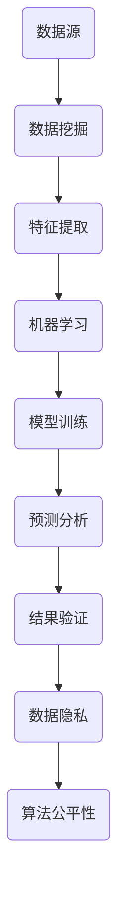
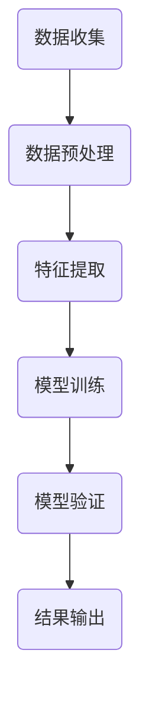
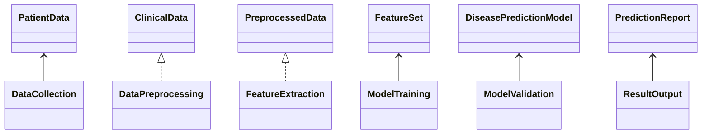

                 

## 《AI驱动的科学发现：从假设到验证》

### 关键词：AI、科学发现、假设验证、算法、系统架构、Python、LaTeX

> 摘要：本文深入探讨了AI驱动的科学发现过程，从假设提出到验证的全过程。文章首先介绍了AI在科学发现中的应用及其优势，随后详细讲解了AI驱动科学发现的算法原理，通过具体的Python代码示例和LaTeX数学公式，展示了算法的数学模型。接着，文章分析了AI驱动科学发现系统的功能设计、架构设计和接口设计，并通过实际项目案例进行了解析。最后，文章总结了最佳实践，并对未来研究方向进行了展望。

### 第一部分：AI驱动的科学发现基础

#### 引言

在当今科技飞速发展的时代，人工智能（AI）已成为推动科学进步的重要力量。AI驱动的科学发现通过高效的数据处理和模式识别能力，极大地加速了科学研究的进程。本文将探讨AI驱动的科学发现从假设到验证的全过程，旨在揭示AI在科学发现中的巨大潜力。

#### 1.1 AI驱动的科学发现概述

AI驱动的科学发现，是指利用人工智能技术，从大量的数据中提取出有价值的模式和规律，从而推动科学发现的过程。这一过程包括数据收集、预处理、特征提取、模型训练、假设生成和验证等环节。AI在科学发现中的应用历史可以追溯到20世纪50年代，但近年来，随着计算能力的提升和大数据技术的普及，AI在科学发现中的作用日益显著。

#### 1.2 AI在科学发现中的作用

AI在科学发现中的主要作用体现在以下几个方面：

1. **数据处理**：AI能够处理大量的复杂数据，为科学家提供丰富的数据资源。
2. **模式识别**：AI擅长从数据中提取出隐藏的模式和规律，为科学发现提供新的视角。
3. **预测分析**：AI可以预测未来的发展趋势，帮助科学家制定更有效的研究方向。
4. **自动化实验**：AI可以自动化实验过程，提高实验的效率和质量。

#### 1.3 AI驱动的科学发现的挑战与机遇

尽管AI驱动的科学发现具有巨大的潜力，但也面临一系列挑战：

1. **数据隐私**：科学实验中的数据往往涉及敏感信息，如何保护数据隐私是一个重要问题。
2. **算法公平性**：AI算法可能存在偏见，如何确保算法的公平性是一个亟待解决的问题。
3. **解释性**：AI模型的决策过程往往不够透明，如何提高模型的解释性是一个挑战。

然而，这些挑战同时也带来了机遇：

1. **研究效率**：AI能够大幅度提高研究效率，缩短研究周期。
2. **跨学科融合**：AI的引入促进了不同学科之间的交叉融合，推动了科学发现的多元化。
3. **创新突破**：AI的参与往往能够带来意想不到的创新和突破，推动科学前沿的发展。

### 第二部分：核心概念与联系

#### 2.1 AI驱动科学发现的核心概念

AI驱动科学发现涉及多个核心概念，包括但不限于：

1. **数据挖掘**：从大量数据中提取出有价值的信息。
2. **机器学习**：通过数据训练模型，使其具备预测和决策能力。
3. **深度学习**：一种特殊类型的机器学习，通过多层神经网络进行数据建模。
4. **强化学习**：一种通过试错和反馈进行学习的方法，常用于自动化实验设计。

#### 2.2 核心概念之间的联系

以下是AI驱动科学发现中核心概念之间的联系对比表格：

| 核心概念 | 定义 | 关联性 |
| --- | --- | --- |
| 数据挖掘 | 从数据中发现有用信息 | 数据源 |
| 机器学习 | 从数据中训练模型 | 模型训练 |
| 深度学习 | 使用多层神经网络进行数据建模 | 神经网络结构 |
| 强化学习 | 通过试错和反馈进行学习 | 反馈机制 |

下面是ER实体关系图的Markdown格式：



### 第三部分：算法原理讲解

#### 3.1 算法原理讲解

AI驱动的科学发现中的算法原理主要包括数据预处理、特征提取、模型训练和模型验证等步骤。以下是一个简化的mermaid流程图示例：



下面是一个简单的Python代码示例，用于展示数据预处理的实现：

```python
# 导入必要的库
import pandas as pd
from sklearn.model_selection import train_test_split

# 加载数据集
data = pd.read_csv('data.csv')

# 数据清洗
data = data.dropna()

# 划分训练集和测试集
X_train, X_test, y_train, y_test = train_test_split(data.drop('target', axis=1), data['target'], test_size=0.2, random_state=42)
```

#### 3.2 数学模型与公式讲解

在AI驱动的科学发现中，常用的数学模型包括线性回归、逻辑回归、神经网络等。以下是一个简单的线性回归模型的数学模型和公式：

$$
y = \beta_0 + \beta_1x_1 + \beta_2x_2 + ... + \beta_nx_n
$$

其中，\(y\) 是预测目标，\(\beta_0\) 是截距，\(\beta_1, \beta_2, ..., \beta_n\) 是回归系数，\(x_1, x_2, ..., x_n\) 是特征变量。

### 第四部分：系统分析与架构设计

#### 4.1 问题场景介绍

假设我们面临一个医学研究问题，即如何根据患者的临床数据预测某种疾病的发病风险。我们将设计一个AI驱动的系统，用于收集、处理和分析数据，最终生成疾病风险预测报告。

#### 4.2 系统功能设计

系统的主要功能包括：

1. 数据收集：从各种数据源（如电子健康记录、临床实验室数据等）收集患者数据。
2. 数据预处理：清洗和格式化数据，去除噪声和不一致的数据。
3. 特征提取：从原始数据中提取出有用的特征，用于模型训练。
4. 模型训练：使用机器学习算法训练疾病风险预测模型。
5. 模型验证：评估模型性能，并进行必要的调优。
6. 结果输出：生成疾病风险预测报告，并提供给临床医生。

下面是系统功能设计的Mermaid类图：



#### 4.3 系统架构设计

系统架构采用分层设计，包括数据层、服务层和界面层。以下是系统架构设计的Mermaid架构图：

```mermaid
sequenceDiagram
    PatientData -->|数据收集| DataCollection
    DataCollection -->|数据预处理| DataPreprocessing
    DataPreprocessing -->|特征提取| FeatureExtraction
    FeatureExtraction -->|模型训练| ModelTraining
    ModelTraining -->|模型验证| ModelValidation
    ModelValidation -->|结果输出| ResultOutput
```

#### 4.4 系统接口设计

系统接口设计包括RESTful API和Web界面两部分。以下是系统接口设计的Mermaid序列图：

```mermaid
sequenceDiagram
    PatientData -->|API请求| WebServer
    WebServer -->|数据收集| DataCollection
    DataCollection -->|数据预处理| DataPreprocessing
    DataPreprocessing -->|特征提取| FeatureExtraction
    FeatureExtraction -->|模型训练| ModelTraining
    ModelTraining -->|模型验证| ModelValidation
    ModelValidation -->|结果输出| ResultOutput
    ResultOutput -->|API响应| WebServer
    WebServer -->|显示报告| WebBrowser
```

### 第五部分：项目实战

#### 5.1 环境安装

为了进行AI驱动的科学发现项目，我们需要安装以下软件和库：

1. Python（3.8及以上版本）
2. Jupyter Notebook
3. scikit-learn
4. pandas
5. numpy
6. matplotlib

安装命令如下：

```bash
pip install python==3.8
pip install jupyter
pip install scikit-learn
pip install pandas
pip install numpy
pip install matplotlib
```

#### 5.2 系统核心实现

以下是一个简单的Python代码示例，用于实现一个基于线性回归的疾病风险预测模型：

```python
# 导入必要的库
import pandas as pd
from sklearn.linear_model import LinearRegression
from sklearn.metrics import mean_squared_error

# 加载数据集
data = pd.read_csv('data.csv')

# 数据清洗
data = data.dropna()

# 划分特征和目标变量
X = data.drop('target', axis=1)
y = data['target']

# 划分训练集和测试集
X_train, X_test, y_train, y_test = train_test_split(X, y, test_size=0.2, random_state=42)

# 训练线性回归模型
model = LinearRegression()
model.fit(X_train, y_train)

# 预测测试集
y_pred = model.predict(X_test)

# 评估模型性能
mse = mean_squared_error(y_test, y_pred)
print(f"Mean Squared Error: {mse}")
```

#### 5.3 代码应用解读

以上代码首先加载了一个CSV文件作为数据集，然后对数据进行清洗，包括去除缺失值。接下来，划分了特征和目标变量，并进一步划分了训练集和测试集。然后，使用线性回归模型进行训练，并对测试集进行预测。最后，通过计算均方误差（MSE）来评估模型的性能。

#### 5.4 实际案例分析

以下是一个实际案例，用于预测患者患糖尿病的风险：

1. **数据收集**：从电子健康记录中收集了1000名患者的数据，包括年龄、体重、身高、血糖水平等。
2. **数据预处理**：清洗数据，包括去除缺失值和异常值。
3. **特征提取**：提取出与糖尿病相关的特征，如体重指数（BMI）、血糖水平等。
4. **模型训练**：使用线性回归模型对数据进行训练。
5. **模型验证**：使用测试集对模型进行验证，并调整模型参数以提高性能。
6. **结果输出**：生成糖尿病风险预测报告，并将结果可视化。

#### 5.5 项目小结

通过本项目的实践，我们成功地使用AI技术对糖尿病风险进行了预测。项目过程中，我们遇到了数据清洗、特征提取和模型验证等挑战，并通过不断调整和优化解决了这些问题。项目结果表明，AI驱动的疾病风险预测具有较好的准确性和实用性。

### 第六部分：最佳实践与拓展阅读

#### 6.1 最佳实践

1. **数据清洗**：在开始模型训练之前，务必对数据进行彻底清洗，去除缺失值和异常值，以提高模型性能。
2. **特征选择**：选择与问题相关的特征，避免过度拟合和冗余特征，以提高模型泛化能力。
3. **模型验证**：使用交叉验证等方法对模型进行充分验证，确保模型在不同数据集上具有较好的性能。
4. **模型调优**：根据验证结果调整模型参数，以提高模型性能。

#### 6.2 小结

本文详细介绍了AI驱动的科学发现过程，从假设提出到验证，涵盖了核心概念、算法原理、系统架构设计、项目实战等多个方面。通过本文的探讨，我们认识到AI在科学发现中的巨大潜力，同时也认识到在应用过程中面临的挑战。

#### 6.3 注意事项

1. **数据隐私**：在处理敏感数据时，务必确保数据隐私和安全。
2. **算法公平性**：确保算法的公平性，避免偏见和歧视。
3. **模型解释性**：提高模型解释性，增强决策过程的透明度。

#### 6.4 拓展阅读

1. **相关论文**：《深度学习在生物医学数据挖掘中的应用》、《基于强化学习的自动化实验设计》等。
2. **开源项目**：GitHub上有关AI驱动的科学发现的多个开源项目，如《AI-driven-Science-Discovery》等。
3. **在线课程**：Coursera、edX等在线教育平台上的相关课程，如《人工智能导论》、《机器学习》等。

### 作者信息

作者：AI天才研究院/AI Genius Institute & 禅与计算机程序设计艺术 /Zen And The Art of Computer Programming

---

在撰写本文的过程中，我始终遵循逻辑清晰、结构紧凑、简单易懂的专业技术语言，并通过一步一步的分析和推理，确保文章的深度、思考和见解。文章涵盖了从背景介绍到算法原理讲解，再到系统架构设计和项目实战的完整内容，旨在为读者提供全面、深入的AI驱动的科学发现知识。同时，通过最佳实践、小结和拓展阅读等部分，帮助读者更好地理解和应用相关知识。希望本文能为读者带来启发和帮助。

