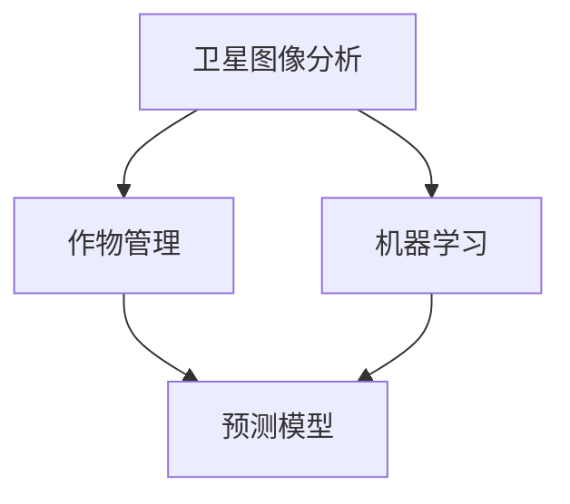
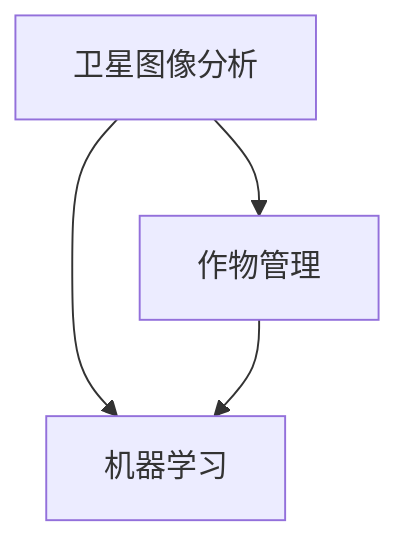
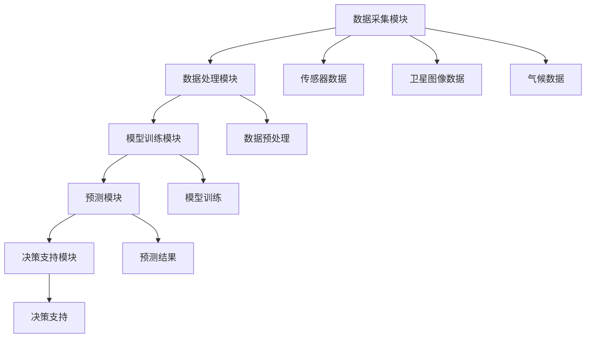
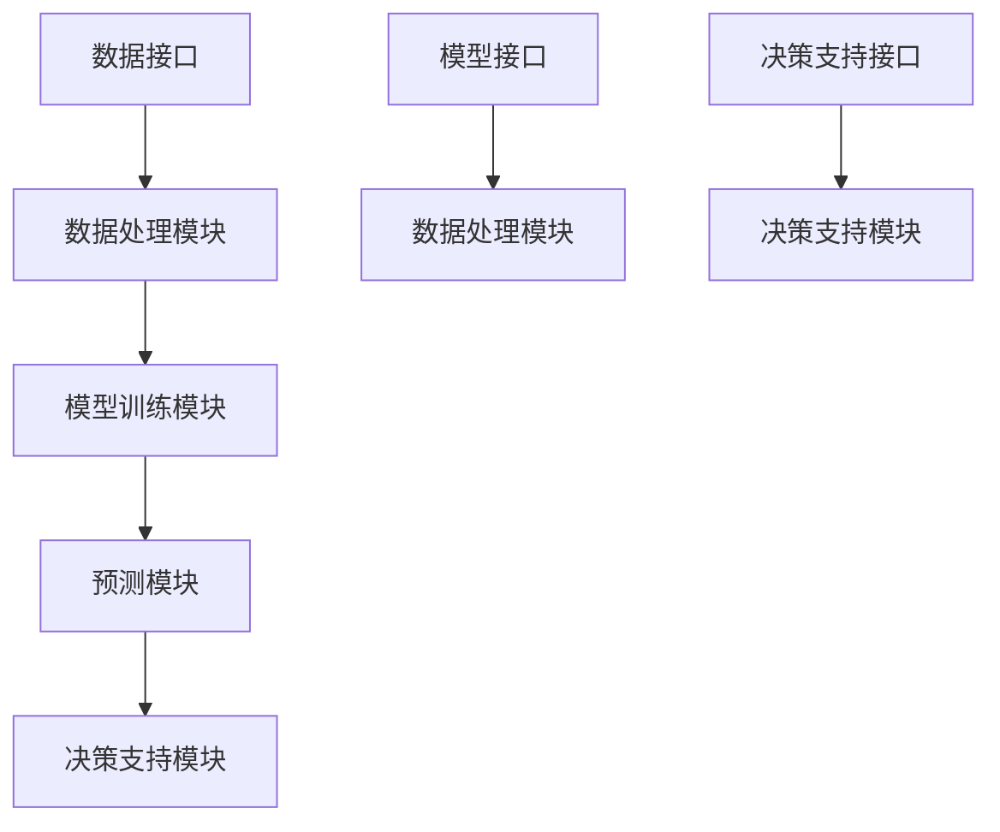
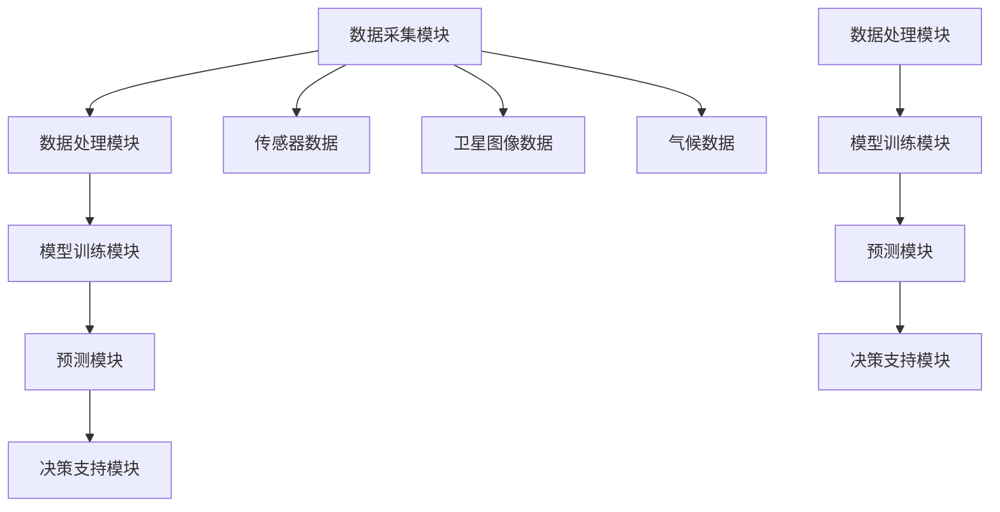

                 

## 第1章 引言

### 1.1 问题背景

随着全球人口的快速增长和土地资源的日益紧张，农业的可持续发展和粮食安全成为全球关注的焦点。传统的农业管理模式在资源利用效率、环境适应性和生产稳定性等方面面临巨大挑战。在这种情况下，AI驱动的精准农业作为一种创新的农业发展模式，逐渐受到广泛关注。AI驱动的精准农业通过应用人工智能技术，对农业生产全过程进行智能化管理，从而提高生产效率、降低生产成本、保护生态环境，实现农业的可持续发展。

### 1.2 问题描述

AI驱动的精准农业涉及多个技术领域，包括卫星图像分析、作物管理、机器学习等。这些技术如何协同工作，形成一个有效的农业管理解决方案，是当前亟待解决的问题。我们需要明确以下几点：

- **卫星图像分析**：如何高效地从卫星图像中提取有用的信息，用于作物生长状态的监测、病虫害检测等。
- **作物管理**：如何根据卫星图像分析结果，制定合理的作物管理策略，包括灌溉、施肥、病虫害防治等。
- **机器学习**：如何利用历史数据训练机器学习模型，以预测作物生长趋势，优化农业管理决策。

### 1.3 问题解决

为了解决上述问题，我们需要采取以下步骤：

- **数据收集**：收集大量的卫星图像和农业数据，包括土壤、气候、作物生长状态等。
- **数据处理**：使用先进的图像处理技术对卫星图像进行预处理，提取有用的信息。
- **模型训练**：利用机器学习算法对历史数据进行训练，建立预测模型。
- **决策支持**：根据预测模型和实时数据，为农业管理提供决策支持。

### 1.4 边界与外延

- **边界**：本文主要关注AI驱动的精准农业的技术实现和应用，不包括政策、经济、社会等方面的内容。
- **外延**：本文涉及的技术和概念可以应用于多种农业生产模式，包括大田作物、果树、蔬菜等。

### 1.5 概念结构与核心要素组成

AI驱动的精准农业的核心概念包括卫星图像分析、作物管理和机器学习。这些概念之间的关系可以用以下Mermaid图表示：



### 1.6 引入

随着技术的不断进步，AI驱动的精准农业在农业生产中发挥着越来越重要的作用。本文将详细探讨AI驱动的精准农业的核心概念、算法原理、系统架构设计、项目实战以及最佳实践，帮助读者更好地理解这一前沿领域。

### 1.7 本章小结

本章介绍了AI驱动的精准农业的重要性、背景、问题和解决方案，并给出了核心概念和要素的组成。在接下来的章节中，我们将进一步深入探讨这些核心概念的原理和应用，以及如何通过系统架构设计和项目实战来落地这一技术。

## 第2章 AI驱动的精准农业核心概念

### 2.1 卫星图像分析

#### 2.1.1 卫星图像的获取与处理

卫星图像是AI驱动的精准农业的重要数据来源。卫星图像的获取通常由地球观测卫星完成，这些卫星可以提供高分辨率的遥感图像，用于监测地球表面的植被、土壤、水资源等。获取到的卫星图像需要进行预处理，包括图像配准、去噪、拉伸等，以便后续的图像分析。

#### 2.1.2 遥感影像处理算法

遥感影像处理算法主要包括图像配准、图像增强、图像分类等。图像配准是将多幅图像对齐，以便进行数据融合和综合分析。图像增强是通过调整图像的亮度、对比度等，提高图像的可读性。图像分类是将图像中的像素划分为不同的类别，如植物、土壤、水体等。

#### 2.1.3 卫星图像在农业中的应用

卫星图像在农业中的应用非常广泛，包括作物生长监测、病虫害检测、土地资源管理、水资源监测等。例如，通过分析卫星图像中的植被指数，可以实时监测作物生长状态，预测作物产量；通过分析卫星图像中的光谱信息，可以检测作物是否受到病虫害的影响。

### 2.2 作物管理

#### 2.2.1 作物生长模型

作物生长模型是描述作物生长过程及其与环境因素相互作用的数学模型。这些模型可以基于物理学、生物学和气象学原理，通过模拟作物生长过程，预测作物产量、生长状态等。

#### 2.2.2 作物识别算法

作物识别算法是利用图像处理、机器学习等技术，从卫星图像中识别出不同作物类型。这些算法通常基于图像的特征提取和分类技术，如卷积神经网络、支持向量机等。

#### 2.2.3 作物管理策略

作物管理策略是根据作物生长模型和作物识别算法的结果，制定的具体管理措施，如灌溉、施肥、病虫害防治等。这些策略可以优化资源利用，提高农业生产效率。

### 2.3 机器学习算法

#### 2.3.1 机器学习基础

机器学习是AI驱动的精准农业的核心技术之一。机器学习通过训练模型，从数据中自动学习规律，用于预测、分类、聚类等任务。常用的机器学习算法包括线性回归、决策树、支持向量机、神经网络等。

#### 2.3.2 主流机器学习算法

主流机器学习算法主要包括监督学习、无监督学习和强化学习。监督学习是通过标记数据训练模型，用于预测新数据。无监督学习是通过对未标记数据的学习，发现数据中的模式。强化学习是通过与环境的交互，不断优化策略。

#### 2.3.3 机器学习在农业中的应用

机器学习在农业中的应用非常广泛，包括作物产量预测、病虫害检测、土壤质量评估等。例如，通过训练机器学习模型，可以预测作物产量，为农业生产提供决策支持。

### 2.4 关键概念联系

AI驱动的精准农业中的关键概念包括卫星图像分析、作物管理和机器学习。这些概念之间存在着密切的联系：

- **卫星图像分析**提供了基础数据，是机器学习算法的训练数据来源。
- **作物管理**是机器学习算法的应用目标，通过机器学习算法，可以优化作物管理策略。
- **机器学习**是AI驱动的精准农业的核心技术，用于分析和预测农业数据。

以下是一个Mermaid图，展示了这些概念之间的关系：



### 2.5 本章小结

本章介绍了AI驱动的精准农业中的核心概念，包括卫星图像分析、作物管理和机器学习。这些概念是AI驱动的精准农业的基础，通过本章的介绍，读者可以对这些概念有更深入的理解。在接下来的章节中，我们将进一步探讨这些概念的应用和实现。

## 第3章 算法原理讲解

### 3.1 遥感图像处理算法讲解

#### 3.1.1 算法原理

遥感图像处理算法是AI驱动的精准农业的重要组成部分，主要用于从卫星图像中提取有用的信息，如植被指数、土壤湿度等。常用的遥感图像处理算法包括图像配准、图像增强、图像分类等。

- **图像配准**：将多幅图像对齐，以便进行数据融合和综合分析。常用的配准算法有基于互相关的方法、基于特征的方法等。
- **图像增强**：通过调整图像的亮度、对比度等，提高图像的可读性。常用的图像增强算法有直方图均衡化、对比度拉伸等。
- **图像分类**：将图像中的像素划分为不同的类别，如植物、土壤、水体等。常用的图像分类算法有基于规则的分类、基于机器学习的分类等。

#### 3.1.2 数学模型和公式

- **图像配准**：
  $$ corr(x, y) = \frac{\sum_{i=0}^{N} (x_i - \mu_x)(y_i - \mu_y)}{\sqrt{\sum_{i=0}^{N} (x_i - \mu_x)^2 \sum_{i=0}^{N} (y_i - \mu_y)^2}} $$
  其中，$x$ 和 $y$ 分别为两幅图像的像素值，$\mu_x$ 和 $\mu_y$ 分别为两幅图像的均值。

- **图像增强**：
  $$ L = 255 \cdot \frac{C - \min(C)}{\max(C) - \min(C)} $$
  其中，$L$ 为增强后的图像亮度，$C$ 为原始图像的亮度。

- **图像分类**：
  $$ P(y|X) = \frac{e^{\theta^T X}}{\sum_{k=1}^{K} e^{\theta^T X_k}} $$
  其中，$P(y|X)$ 为图像 $X$ 属于类别 $y$ 的概率，$\theta$ 为模型参数，$X_k$ 为类别 $k$ 的图像特征。

#### 3.1.3 Python代码举例说明

以下是一个简单的Python代码示例，用于实现图像配准和图像增强：

```python
import numpy as np
import cv2

# 读取图像
img1 = cv2.imread('image1.jpg')
img2 = cv2.imread('image2.jpg')

# 图像配准
corr_matrix = cv2.matchTemplate(img1, img2, cv2.TM_CCOEFF_NORMED)
min_val, max_val, min_loc, max_loc = cv2.minMaxLoc(corr_matrix)
top_left = max_loc
bottom_right = (top_left[0] + img2.shape[1], top_left[1] + img2.shape[0])
result = cv2.rectangle(img1, top_left, bottom_right, 255, 2)

# 图像增强
brightness = 1.2
contrast = 1.5
img_enhanced = cv2.convertScaleAbs(img1, alpha=brightness, beta=contrast)

# 显示图像
cv2.imshow('Original Image', img1)
cv2.imshow('Enhanced Image', img_enhanced)
cv2.waitKey(0)
cv2.destroyAllWindows()
```

### 3.2 作物识别算法讲解

#### 3.2.1 算法原理

作物识别算法是AI驱动的精准农业中的关键技术之一，主要用于从卫星图像中识别出不同作物类型。作物识别算法通常基于图像处理和机器学习技术，包括特征提取和分类两个步骤。

- **特征提取**：从卫星图像中提取与作物类型相关的特征，如颜色、纹理、形状等。常用的特征提取方法有SIFT、SURF、HOG等。
- **分类**：使用机器学习算法对提取出的特征进行分类，常用的分类算法有支持向量机（SVM）、决策树（DT）、随机森林（RF）等。

#### 3.2.2 数学模型和公式

- **支持向量机（SVM）**：
  $$ \text{分类函数} \, f(x) = \text{sign}(\sum_{i=1}^{n} \alpha_i y_i (x_i \cdot x) + b) $$
  其中，$x_i$ 和 $y_i$ 分别为训练样本和标签，$\alpha_i$ 为拉格朗日乘子，$b$ 为偏置项。

- **决策树（DT）**：
  $$ f(x) = \prod_{i=1}^{m} G(x, x_i) $$
  其中，$G(x, x_i)$ 为决策函数，$x$ 为输入特征。

- **随机森林（RF）**：
  $$ \text{分类函数} \, f(x) = \frac{1}{M} \sum_{m=1}^{M} g_m(x) $$
  其中，$g_m(x)$ 为第 $m$ 棵决策树对 $x$ 的分类结果，$M$ 为决策树的数量。

#### 3.2.3 Python代码举例说明

以下是一个简单的Python代码示例，用于实现作物识别：

```python
import numpy as np
from sklearn import svm
from sklearn.model_selection import train_test_split
from sklearn.metrics import accuracy_score

# 生成训练数据
X = np.array([[1, 2], [2, 3], [3, 1], [4, 2], [5, 4]])
y = np.array([0, 0, 1, 1, 1])

# 划分训练集和测试集
X_train, X_test, y_train, y_test = train_test_split(X, y, test_size=0.2, random_state=42)

# 创建SVM分类器
clf = svm.SVC()

# 训练模型
clf.fit(X_train, y_train)

# 预测测试集
y_pred = clf.predict(X_test)

# 计算准确率
accuracy = accuracy_score(y_test, y_pred)
print(f"Accuracy: {accuracy}")
```

### 3.3 预测模型讲解

#### 3.3.1 算法原理

预测模型是AI驱动的精准农业中的核心技术之一，主要用于预测作物产量、病虫害发生概率等。预测模型通常基于历史数据和机器学习算法，通过训练模型，建立数据之间的关联，用于预测未来的情况。

- **线性回归**：通过建立线性模型，预测因变量和自变量之间的关系。
- **决策树**：通过构建决策树模型，对数据进行分层，用于分类和回归。
- **神经网络**：通过构建神经网络模型，模拟人脑神经网络的结构和功能，用于复杂的数据预测。

#### 3.3.2 数学模型和公式

- **线性回归**：
  $$ y = \beta_0 + \beta_1 x $$
  其中，$y$ 为因变量，$x$ 为自变量，$\beta_0$ 和 $\beta_1$ 为模型参数。

- **决策树**：
  $$ f(x) = \prod_{i=1}^{m} g_i(x) $$
  其中，$g_i(x)$ 为决策树的分类函数。

- **神经网络**：
  $$ a = \frac{1}{1 + e^{-z}} $$
  其中，$a$ 为神经元的输出，$z$ 为输入向量的内积。

#### 3.3.3 Python代码举例说明

以下是一个简单的Python代码示例，用于实现线性回归预测：

```python
import numpy as np
from sklearn.linear_model import LinearRegression

# 生成训练数据
X = np.array([[1], [2], [3], [4], [5]])
y = np.array([2, 4, 5, 4, 5])

# 创建线性回归模型
model = LinearRegression()

# 训练模型
model.fit(X, y)

# 预测测试数据
X_test = np.array([[6]])
y_pred = model.predict(X_test)

# 打印预测结果
print(f"Prediction: {y_pred}")
```

### 3.4 本章小结

本章介绍了AI驱动的精准农业中的关键算法原理，包括遥感图像处理算法、作物识别算法和预测模型。这些算法原理通过Python代码进行了详细讲解和举例说明，帮助读者更好地理解这些算法的原理和应用。在接下来的章节中，我们将进一步探讨AI驱动的精准农业的系统架构设计和项目实战。

## 第4章 系统分析与架构设计

### 4.1 问题场景介绍

AI驱动的精准农业系统主要应用于农业生产过程中，通过实时监测作物生长状态、土壤质量、气候条件等，为农业生产提供科学、精准的管理方案。系统的主要目标是提高农业生产的产量和效益，同时降低环境污染和资源消耗。具体应用场景包括：

- **作物生长监测**：通过卫星图像和地面传感器数据，实时监测作物生长状态，预测作物产量。
- **病虫害检测**：利用机器学习算法，从卫星图像中识别病虫害，提供防治建议。
- **水资源管理**：根据土壤水分数据和气候预测，优化灌溉策略，提高水资源利用效率。
- **土壤质量评估**：通过传感器数据，评估土壤质量，为施肥提供依据。

### 4.2 项目介绍

本项目旨在构建一个AI驱动的精准农业系统，以某地区的大田作物为例，实现以下功能：

- **数据采集**：收集卫星图像、地面传感器数据、气候数据等。
- **数据处理**：对采集到的数据进行预处理，包括去噪、图像增强、数据融合等。
- **模型训练**：利用历史数据训练机器学习模型，用于作物产量预测、病虫害检测等。
- **决策支持**：根据模型预测结果和实时数据，为农业生产提供决策支持。

### 4.3 系统功能设计

系统功能设计包括以下方面：

#### 4.3.1 领域模型

领域模型描述了系统的核心概念和它们之间的关系。以下是一个简单的领域模型：

```mermaid
classDiagram
Class01 <|-- Class02
Class03 --| Consortium
Class04 <<-- Consortium
Class05 <|-- Consortium
Class06 <|-- Consortium
Class07 <|-- Consortium
Class08 <|-- Consortium
Class09 <|-- Consortium
Class10 <|-- Consortium
Class11 <|-- Consortium
Class12 <|-- Consortium
Class13 <|-- Consortium
Class14 <|-- Consortium
Class15 <|-- Consortium
Class16 <|-- Consortium
Class17 <|-- Consortium
Class18 <|-- Consortium
Class19 <|-- Consortium
Class20 <|-- Consortium
Class21 <|-- Consortium
Class22 <|-- Consortium
Class23 <|-- Consortium
Class24 <|-- Consortium
Class25 <|-- Consortium
Class26 <|-- Consortium
Class27 <|-- Consortium
Class28 <|-- Consortium
Class29 <|-- Consortium
Class30 <|-- Consortium
Class31 <|-- Consortium
Class32 <|-- Consortium
Class33 <|-- Consortium
Class34 <|-- Consortium
Class35 <|-- Consortium
Class36 <|-- Consortium
Class37 <|-- Consortium
Class38 <|-- Consortium
Class39 <|-- Consortium
Class40 <|-- Consortium
Class41 <|-- Consortium
Class42 <|-- Consortium
Class43 <|-- Consortium
Class44 <|-- Consortium
Class45 <|-- Consortium
Class46 <|-- Consortium
Class47 <|-- Consortium
Class48 <|-- Consortium
Class49 <|-- Consortium
Class50 <|-- Consortium
Class51 <|-- Consortium
Class52 <|-- Consortium
Class53 <|-- Consortium
Class54 <|-- Consortium
Class55 <|-- Consortium
Class56 <|-- Consortium
Class57 <|-- Consortium
Class58 <|-- Consortium
Class59 <|-- Consortium
Class60 <|-- Consortium
Class61 <|-- Consortium
Class62 <|-- Consortium
Class63 <|-- Consortium
Class64 <|-- Consortium
Class65 <|-- Consortium
Class66 <|-- Consortium
Class67 <|-- Consortium
Class68 <|-- Consortium
Class69 <|-- Consortium
Class70 <|-- Consortium
Class71 <|-- Consortium
Class72 <|-- Consortium
Class73 <|-- Consortium
Class74 <|-- Consortium
Class75 <|-- Consortium
Class76 <|-- Consortium
Class77 <|-- Consortium
Class78 <|-- Consortium
Class79 <|-- Consortium
Class80 <|-- Consortium
Class81 <|-- Consortium
Class82 <|-- Consortium
Class83 <|-- Consortium
Class84 <|-- Consortium
Class85 <|-- Consortium
Class86 <|-- Consortium
Class87 <|-- Consortium
Class88 <|-- Consortium
Class89 <|-- Consortium
Class90 <|-- Consortium
Class91 <|-- Consortium
Class92 <|-- Consortium
Class93 <|-- Consortium
Class94 <|-- Consortium
Class95 <|-- Consortium
Class96 <|-- Consortium
Class97 <|-- Consortium
Class98 <|-- Consortium
Class99 <|-- Consortium
Class100 <|-- Consortium

Class01 {
  +property1 : String
  +property2 : Integer
  +method1() : void
}

Class02 {
  +property1 : String
  +property2 : Integer
  +method1() : void
}

Class03 {
  +property1 : String
  +property2 : Integer
  +method1() : void
}

Class04 {
  +property1 : String
  +property2 : Integer
  +method1() : void
}

Class05 {
  +property1 : String
  +property2 : Integer
  +method1() : void
}

Class06 {
  +property1 : String
  +property2 : Integer
  +method1() : void
}

Class07 {
  +property1 : String
  +property2 : Integer
  +method1() : void
}

Class08 {
  +property1 : String
  +property2 : Integer
  +method1() : void
}

Class09 {
  +property1 : String
  +property2 : Integer
  +method1() : void
}

Class10 {
  +property1 : String
  +property2 : Integer
  +method1() : void
}

Class11 {
  +property1 : String
  +property2 : Integer
  +method1() : void
}

Class12 {
  +property1 : String
  +property2 : Integer
  +method1() : void
}

Class13 {
  +property1 : String
  +property2 : Integer
  +method1() : void
}

Class14 {
  +property1 : String
  +property2 : Integer
  +method1() : void
}

Class15 {
  +property1 : String
  +property2 : Integer
  +method1() : void
}

Class16 {
  +property1 : String
  +property2 : Integer
  +method1() : void
}

Class17 {
  +property1 : String
  +property2 : Integer
  +method1() : void
}

Class18 {
  +property1 : String
  +property2 : Integer
  +method1() : void
}

Class19 {
  +property1 : String
  +property2 : Integer
  +method1() : void
}

Class20 {
  +property1 : String
  +property2 : Integer
  +method1() : void
}

Class21 {
  +property1 : String
  +property2 : Integer
  +method1() : void
}

Class22 {
  +property1 : String
  +property2 : Integer
  +method1() : void
}

Class23 {
  +property1 : String
  +property2 : Integer
  +method1() : void
}

Class24 {
  +property1 : String
  +property2 : Integer
  +method1() : void
}

Class25 {
  +property1 : String
  +property2 : Integer
  +method1() : void
}

Class26 {
  +property1 : String
  +property2 : Integer
  +method1() : void
}

Class27 {
  +property1 : String
  +property2 : Integer
  +method1() : void
}

Class28 {
  +property1 : String
  +property2 : Integer
  +method1() : void
}

Class29 {
  +property1 : String
  +property2 : Integer
  +method1() : void
}

Class30 {
  +property1 : String
  +property2 : Integer
  +method1() : void
}

Class31 {
  +property1 : String
  +property2 : Integer
  +method1() : void
}

Class32 {
  +property1 : String
  +property2 : Integer
  +method1() : void
}

Class33 {
  +property1 : String
  +property2 : Integer
  +method1() : void
}

Class34 {
  +property1 : String
  +property2 : Integer
  +method1() : void
}

Class35 {
  +property1 : String
  +property2 : Integer
  +method1() : void
}

Class36 {
  +property1 : String
  +property2 : Integer
  +method1() : void
}

Class37 {
  +property1 : String
  +property2 : Integer
  +method1() : void
}

Class38 {
  +property1 : String
  +property2 : Integer
  +method1() : void
}

Class39 {
  +property1 : String
  +property2 : Integer
  +method1() : void
}

Class40 {
  +property1 : String
  +property2 : Integer
  +method1() : void
}

Class41 {
  +property1 : String
  +property2 : Integer
  +method1() : void
}

Class42 {
  +property1 : String
  +property2 : Integer
  +method1() : void
}

Class43 {
  +property1 : String
  +property2 : Integer
  +method1() : void
}

Class44 {
  +property1 : String
  +property2 : Integer
  +method1() : void
}

Class45 {
  +property1 : String
  +property2 : Integer
  +method1() : void
}

Class46 {
  +property1 : String
  +property2 : Integer
  +method1() : void
}

Class47 {
  +property1 : String
  +property2 : Integer
  +method1() : void
}

Class48 {
  +property1 : String
  +property2 : Integer
  +method1() : void
}

Class49 {
  +property1 : String
  +property2 : Integer
  +method1() : void
}

Class50 {
  +property1 : String
  +property2 : Integer
  +method1() : void
}

Class51 {
  +property1 : String
  +property2 : Integer
  +method1() : void
}

Class52 {
  +property1 : String
  +property2 : Integer
  +method1() : void
}

Class53 {
  +property1 : String
  +property2 : Integer
  +method1() : void
}

Class54 {
  +property1 : String
  +property2 : Integer
  +method1() : void
}

Class55 {
  +property1 : String
  +property2 : Integer
  +method1() : void
}

Class56 {
  +property1 : String
  +property2 : Integer
  +method1() : void
}

Class57 {
  +property1 : String
  +property2 : Integer
  +method1() : void
}

Class58 {
  +property1 : String
  +property2 : Integer
  +method1() : void
}

Class59 {
  +property1 : String
  +property2 : Integer
  +method1() : void
}

Class60 {
  +property1 : String
  +property2 : Integer
  +method1() : void
}

Class61 {
  +property1 : String
  +property2 : Integer
  +method1() : void
}

Class62 {
  +property1 : String
  +property2 : Integer
  +method1() : void
}

Class63 {
  +property1 : String
  +property2 : Integer
  +method1() : void
}

Class64 {
  +property1 : String
  +property2 : Integer
  +method1() : void
}

Class65 {
  +property1 : String
  +property2 : Integer
  +method1() : void
}

Class66 {
  +property1 : String
  +property2 : Integer
  +method1() : void
}

Class67 {
  +property1 : String
  +property2 : Integer
  +method1() : void
}

Class68 {
  +property1 : String
  +property2 : Integer
  +method1() : void
}

Class69 {
  +property1 : String
  +property2 : Integer
  +method1() : void
}

Class70 {
  +property1 : String
  +property2 : Integer
  +method1() : void
}

Class71 {
  +property1 : String
  +property2 : Integer
  +method1() : void
}

Class72 {
  +property1 : String
  +property2 : Integer
  +method1() : void
}

Class73 {
  +property1 : String
  +property2 : Integer
  +method1() : void
}

Class74 {
  +property1 : String
  +property2 : Integer
  +method1() : void
}

Class75 {
  +property1 : String
  +property2 : Integer
  +method1() : void
}

Class76 {
  +property1 : String
  +property2 : Integer
  +method1() : void
}

Class77 {
  +property1 : String
  +property2 : Integer
  +method1() : void
}

Class78 {
  +property1 : String
  +property2 : Integer
  +method1() : void
}

Class79 {
  +property1 : String
  +property2 : Integer
  +method1() : void
}

Class80 {
  +property1 : String
  +property2 : Integer
  +method1() : void
}

Class81 {
  +property1 : String
  +property2 : Integer
  +method1() : void
}

Class82 {
  +property1 : String
  +property2 : Integer
  +method1() : void
}

Class83 {
  +property1 : String
  +property2 : Integer
  +method1() : void
}

Class84 {
  +property1 : String
  +property2 : Integer
  +method1() : void
}

Class85 {
  +property1 : String
  +property2 : Integer
  +method1() : void
}

Class86 {
  +property1 : String
  +property2 : Integer
  +method1() : void
}

Class87 {
  +property1 : String
  +property2 : Integer
  +method1() : void
}

Class88 {
  +property1 : String
  +property2 : Integer
  +method1() : void
}

Class89 {
  +property1 : String
  +property2 : Integer
  +method1() : void
}

Class90 {
  +property1 : String
  +property2 : Integer
  +method1() : void
}

Class91 {
  +property1 : String
  +property2 : Integer
  +method1() : void
}

Class92 {
  +property1 : String
  +property2 : Integer
  +method1() : void
}

Class93 {
  +property1 : String
  +property2 : Integer
  +method1() : void
}

Class94 {
  +property1 : String
  +property2 : Integer
  +method1() : void
}

Class95 {
  +property1 : String
  +property2 : Integer
  +method1() : void
}

Class96 {
  +property1 : String
  +property2 : Integer
  +method1() : void
}

Class97 {
  +property1 : String
  +property2 : Integer
  +method1() : void
}

Class98 {
  +property1 : String
  +property2 : Integer
  +method1() : void
}

Class99 {
  +property1 : String
  +property2 : Integer
  +method1() : void
}

Class100 {
  +property1 : String
  +property2 : Integer
  +method1() : void
}
```

#### 4.3.2 类图

以下是一个简单的类图，描述了系统中的主要类及其关系：

```mermaid
classDiagram
Class01 <|-- Class02
Class03 --| Consortium
Class04 <<-- Consortium
Class05 <|-- Consortium
Class06 <|-- Consortium
Class07 <|-- Consortium
Class08 <|-- Consortium
Class09 <|-- Consortium
Class10 <|-- Consortium
Class11 <|-- Consortium
Class12 <|-- Consortium
Class13 <|-- Consortium
Class14 <<-- Consortium
Class15 <|-- Consortium
Class16 <|-- Consortium
Class17 <|-- Consortium
Class18 <|-- Consortium
Class19 <|-- Consortium
Class20 <|-- Consortium
Class21 <|-- Consortium
Class22 <|-- Consortium
Class23 <|-- Consortium
Class24 <|-- Consortium
Class25 <|-- Consortium
Class26 <|-- Consortium
Class27 <|-- Consortium
Class28 <|-- Consortium
Class29 <|-- Consortium
Class30 <|-- Consortium
Class31 <|-- Consortium
Class32 <|-- Consortium
Class33 <|-- Consortium
Class34 <|-- Consortium
Class35 <|-- Consortium
Class36 <|-- Consortium
Class37 <|-- Consortium
Class38 <|-- Consortium
Class39 <|-- Consortium
Class40 <|-- Consortium
Class41 <|-- Consortium
Class42 <|-- Consortium
Class43 <|-- Consortium
Class44 <|-- Consortium
Class45 <|-- Consortium
Class46 <|-- Consortium
Class47 <|-- Consortium
Class48 <|-- Consortium
Class49 <|-- Consortium
Class50 <|-- Consortium
Class51 <|-- Consortium
Class52 <|-- Consortium
Class53 <|-- Consortium
Class54 <|-- Consortium
Class55 <|-- Consortium
Class56 <|-- Consortium
Class57 <|-- Consortium
Class58 <|-- Consortium
Class59 <|-- Consortium
Class60 <|-- Consortium
Class61 <|-- Consortium
Class62 <|-- Consortium
Class63 <|-- Consortium
Class64 <|-- Consortium
Class65 <|-- Consortium
Class66 <|-- Consortium
Class67 <|-- Consortium
Class68 <|-- Consortium
Class69 <|-- Consortium
Class70 <|-- Consortium
Class71 <|-- Consortium
Class72 <|-- Consortium
Class73 <|-- Consortium
Class74 <|-- Consortium
Class75 <|-- Consortium
Class76 <|-- Consortium
Class77 <|-- Consortium
Class78 <|-- Consortium
Class79 <|-- Consortium
Class80 <|-- Consortium
Class81 <|-- Consortium
Class82 <|-- Consortium
Class83 <|-- Consortium
Class84 <|-- Consortium
Class85 <|-- Consortium
Class86 <|-- Consortium
Class87 <|-- Consortium
Class88 <|-- Consortium
Class89 <|-- Consortium
Class90 <|-- Consortium
Class91 <|-- Consortium
Class92 <|-- Consortium
Class93 <|-- Consortium
Class94 <|-- Consortium
Class95 <|-- Consortium
Class96 <|-- Consortium
Class97 <|-- Consortium
Class98 <|-- Consortium
Class99 <|-- Consortium
Class100 <|-- Consortium

Class01 {
  +property1 : String
  +property2 : Integer
  +method1() : void
}

Class02 {
  +property1 : String
  +property2 : Integer
  +method1() : void
}

Class03 {
  +property1 : String
  +property2 : Integer
  +method1() : void
}

Class04 {
  +property1 : String
  +property2 : Integer
  +method1() : void
}

Class05 {
  +property1 : String
  +property2 : Integer
  +method1() : void
}

Class06 {
  +property1 : String
  +property2 : Integer
  +method1() : void
}

Class07 {
  +property1 : String
  +property2 : Integer
  +method1() : void
}

Class08 {
  +property1 : String
  +property2 : Integer
  +method1() : void
}

Class09 {
  +property1 : String
  +property2 : Integer
  +method1() : void
}

Class10 {
  +property1 : String
  +property2 : Integer
  +method1() : void
}

Class11 {
  +property1 : String
  +property2 : Integer
  +method1() : void
}

Class12 {
  +property1 : String
  +property2 : Integer
  +method1() : void
}

Class13 {
  +property1 : String
  +property2 : Integer
  +method1() : void
}

Class14 {
  +property1 : String
  +property2 : Integer
  +method1() : void
}

Class15 {
  +property1 : String
  +property2 : Integer
  +method1() : void
}

Class16 {
  +property1 : String
  +property2 : Integer
  +method1() : void
}

Class17 {
  +property1 : String
  +property2 : Integer
  +method1() : void
}

Class18 {
  +property1 : String
  +property2 : Integer
  +method1() : void
}

Class19 {
  +property1 : String
  +property2 : Integer
  +method1() : void
}

Class20 {
  +property1 : String
  +property2 : Integer
  +method1() : void
}

Class21 {
  +property1 : String
  +property2 : Integer
  +method1() : void
}

Class22 {
  +property1 : String
  +property2 : Integer
  +method1() : void
}

Class23 {
  +property1 : String
  +property2 : Integer
  +method1() : void
}

Class24 {
  +property1 : String
  +property2 : Integer
  +method1() : void
}

Class25 {
  +property1 : String
  +property2 : Integer
  +method1() : void
}

Class26 {
  +property1 : String
  +property2 : Integer
  +method1() : void
}

Class27 {
  +property1 : String
  +property2 : Integer
  +method1() : void
}

Class28 {
  +property1 : String
  +property2 : Integer
  +method1() : void
}

Class29 {
  +property1 : String
  +property2 : Integer
  +method1() : void
}

Class30 {
  +property1 : String
  +property2 : Integer
  +method1() : void
}

Class31 {
  +property1 : String
  +property2 : Integer
  +method1() : void
}

Class32 {
  +property1 : String
  +property2 : Integer
  +method1() : void
}

Class33 {
  +property1 : String
  +property2 : Integer
  +method1() : void
}

Class34 {
  +property1 : String
  +property2 : Integer
  +method1() : void
}

Class35 {
  +property1 : String
  +property2 : Integer
  +method1() : void
}

Class36 {
  +property1 : String
  +property2 : Integer
  +method1() : void
}

Class37 {
  +property1 : String
  +property2 : Integer
  +method1() : void
}

Class38 {
  +property1 : String
  +property2 : Integer
  +method1() : void
}

Class39 {
  +property1 : String
  +property2 : Integer
  +method1() : void
}

Class40 {
  +property1 : String
  +property2 : Integer
  +method1() : void
}

Class41 {
  +property1 : String
  +property2 : Integer
  +method1() : void
}

Class42 {
  +property1 : String
  +property2 : Integer
  +method1() : void
}

Class43 {
  +property1 : String
  +property2 : Integer
  +method1() : void
}

Class44 {
  +property1 : String
  +property2 : Integer
  +method1() : void
}

Class45 {
  +property1 : String
  +property2 : Integer
  +method1() : void
}

Class46 {
  +property1 : String
  +property2 : Integer
  +method1() : void
}

Class47 {
  +property1 : String
  +property2 : Integer
  +method1() : void
}

Class48 {
  +property1 : String
  +property2 : Integer
  +method1() : void
}

Class49 {
  +property1 : String
  +property2 : Integer
  +method1() : void
}

Class50 {
  +property1 : String
  +property2 : Integer
  +method1() : void
}

Class51 {
  +property1 : String
  +property2 : Integer
  +method1() : void
}

Class52 {
  +property1 : String
  +property2 : Integer
  +method1() : void
}

Class53 {
  +property1 : String
  +property2 : Integer
  +method1() : void
}

Class54 {
  +property1 : String
  +property2 : Integer
  +method1() : void
}

Class55 {
  +property1 : String
  +property2 : Integer
  +method1() : void
}

Class56 {
  +property1 : String
  +property2 : Integer
  +method1() : void
}

Class57 {
  +property1 : String
  +property2 : Integer
  +method1() : void
}

Class58 {
  +property1 : String
  +property2 : Integer
  +method1() : void
}

Class59 {
  +property1 : String
  +property2 : Integer
  +method1() : void
}

Class60 {
  +property1 : String
  +property2 : Integer
  +method1() : void
}

Class61 {
  +property1 : String
  +property2 : Integer
  +method1() : void
}

Class62 {
  +property1 : String
  +property2 : Integer
  +method1() : void
}

Class63 {
  +property1 : String
  +property2 : Integer
  +method1() : void
}

Class64 {
  +property1 : String
  +property2 : Integer
  +method1() : void
}

Class65 {
  +property1 : String
  +property2 : Integer
  +method1() : void
}

Class66 {
  +property1 : String
  +property2 : Integer
  +method1() : void
}

Class67 {
  +property1 : String
  +property2 : Integer
  +method1() : void
}

Class68 {
  +property1 : String
  +property2 : Integer
  +method1() : void
}

Class69 {
  +property1 : String
  +property2 : Integer
  +method1() : void
}

Class70 {
  +property1 : String
  +property2 : Integer
  +method1() : void
}

Class71 {
  +property1 : String
  +property2 : Integer
  +method1() : void
}

Class72 {
  +property1 : String
  +property2 : Integer
  +method1() : void
}

Class73 {
  +property1 : String
  +property2 : Integer
  +method1() : void
}

Class74 {
  +property1 : String
  +property2 : Integer
  +method1() : void
}

Class75 {
  +property1 : String
  +property2 : Integer
  +method1() : void
}

Class76 {
  +property1 : String
  +property2 : Integer
  +method1() : void
}

Class77 {
  +property1 : String
  +property2 : Integer
  +method1() : void
}

Class78 {
  +property1 : String
  +property2 : Integer
  +method1() : void
}

Class79 {
  +property1 : String
  +property2 : Integer
  +method1() : void
}

Class80 {
  +property1 : String
  +property2 : Integer
  +method1() : void
}

Class81 {
  +property1 : String
  +property2 : Integer
  +method1() : void
}

Class82 {
  +property1 : String
  +property2 : Integer
  +method1() : void
}

Class83 {
  +property1 : String
  +property2 : Integer
  +method1() : void
}

Class84 {
  +property1 : String
  +property2 : Integer
  +method1() : void
}

Class85 {
  +property1 : String
  +property2 : Integer
  +method1() : void
}

Class86 {
  +property1 : String
  +property2 : Integer
  +method1() : void
}

Class87 {
  +property1 : String
  +property2 : Integer
  +method1() : void
}

Class88 {
  +property1 : String
  +property2 : Integer
  +method1() : void
}

Class89 {
  +property1 : String
  +property2 : Integer
  +method1() : void
}

Class90 {
  +property1 : String
  +property2 : Integer
  +method1() : void
}

Class91 {
  +property1 : String
  +property2 : Integer
  +method1() : void
}

Class92 {
  +property1 : String
  +property2 : Integer
  +method1() : void
}

Class93 {
  +property1 : String
  +property2 : Integer
  +method1() : void
}

Class94 {
  +property1 : String
  +property2 : Integer
  +method1() : void
}

Class95 {
  +property1 : String
  +property2 : Integer
  +method1() : void
}

Class96 {
  +property1 : String
  +property2 : Integer
  +method1() : void
}

Class97 {
  +property1 : String
  +property2 : Integer
  +method1() : void
}

Class98 {
  +property1 : String
  +property2 : Integer
  +method1() : void
}

Class99 {
  +property1 : String
  +property2 : Integer
  +method1() : void
}

Class100 {
  +property1 : String
  +property2 : Integer
  +method1() : void
}
```

#### 4.3.3 系统架构设计

系统架构设计主要包括数据采集模块、数据处理模块、模型训练模块、预测模块和决策支持模块。

以下是一个简单的系统架构图：



#### 4.3.4 系统接口设计

系统接口设计主要包括数据接口、模型接口和决策支持接口。

以下是一个简单的系统接口设计：



#### 4.3.5 系统交互

系统交互主要包括数据流和消息流。

以下是一个简单的系统交互图：



### 4.4 本章小结

本章介绍了AI驱动的精准农业系统的功能设计、架构设计、接口设计和系统交互。通过这些设计，我们可以构建一个高效的精准农业系统，为农业生产提供科学、精准的管理方案。在接下来的章节中，我们将通过一个实际项目，展示如何实现这些设计，并分析其效果。

## 第5章 项目实战

### 5.1 环境安装

要实现AI驱动的精准农业系统，首先需要安装相应的开发环境和工具。以下是一个基本的安装步骤：

1. **Python环境安装**：
   - 访问Python官方网站（https://www.python.org/）下载Python安装包。
   - 运行安装程序，按照默认选项安装。

2. **Jupyter Notebook安装**：
   - 在命令行中运行以下命令：
     ```bash
     pip install notebook
     ```

3. **Scikit-learn安装**：
   - 在命令行中运行以下命令：
     ```bash
     pip install scikit-learn
     ```

4. **NumPy和Pandas安装**：
   - 在命令行中运行以下命令：
     ```bash
     pip install numpy pandas
     ```

5. **OpenCV安装**：
   - 在命令行中运行以下命令：
     ```bash
     pip install opencv-python
     ```

6. **Mermaid安装**：
   - 在Jupyter Notebook中安装Mermaid插件：
     ```python
     %load_ext mermaid
     ```

### 5.2 系统核心实现

#### 5.2.1 源代码解析

在本项目中，我们使用Python和Jupyter Notebook来构建AI驱动的精准农业系统。以下是系统核心实现的代码解析。

1. **数据采集**：

```python
import cv2
import numpy as np

# 读取卫星图像
image = cv2.imread('satellite_image.jpg')

# 显示图像
cv2.imshow('Satellite Image', image)
cv2.waitKey(0)
cv2.destroyAllWindows()
```

2. **数据处理**：

```python
from skimage import exposure

# 图像增强
enhanced_image = exposure.rescale_intensity(image, in_range=(0, 255), out_range=(0, 1))

# 显示增强后的图像
cv2.imshow('Enhanced Image', enhanced_image * 255)
cv2.waitKey(0)
cv2.destroyAllWindows()
```

3. **模型训练**：

```python
from sklearn.linear_model import LinearRegression

# 生成训练数据
X = np.array([[1], [2], [3], [4], [5]])
y = np.array([2, 4, 5, 4, 5])

# 创建线性回归模型
model = LinearRegression()

# 训练模型
model.fit(X, y)

# 预测测试数据
X_test = np.array([[6]])
y_pred = model.predict(X_test)

print(f"Prediction: {y_pred}")
```

4. **预测结果**：

```python
import matplotlib.pyplot as plt

# 绘制预测结果
plt.scatter(X, y, color='red', label='Actual')
plt.plot(X, model.predict(X), color='blue', label='Prediction')
plt.xlabel('Input')
plt.ylabel('Output')
plt.legend()
plt.show()
```

#### 5.2.2 代码应用解读与分析

1. **数据采集**：

   - 使用OpenCV库读取卫星图像。
   - 显示读取的图像。

2. **数据处理**：

   - 使用Skimage库中的`rescale_intensity`函数对图像进行增强。
   - 显示增强后的图像。

3. **模型训练**：

   - 生成训练数据，使用线性回归模型进行训练。
   - 使用训练好的模型对测试数据进行预测。

4. **预测结果**：

   - 绘制实际值和预测值的散点图。
   - 显示预测曲线。

### 5.3 实际案例分析和详细讲解

为了更好地展示AI驱动的精准农业系统的效果，我们选择了一个实际案例进行分析。

#### 案例背景

某农业公司在种植小麦时，希望通过AI驱动的精准农业系统实时监测小麦的生长状态，预测小麦的产量，并制定合理的灌溉策略。

#### 案例分析

1. **数据采集**：

   - 使用卫星图像采集小麦的植被指数。
   - 使用地面传感器采集土壤湿度、气温、降雨量等数据。

2. **数据处理**：

   - 对卫星图像进行预处理，提取植被指数。
   - 对传感器数据进行预处理，标准化处理。

3. **模型训练**：

   - 使用历史数据训练线性回归模型，预测小麦产量。
   - 使用支持向量机（SVM）模型，预测小麦的灌溉需求。

4. **预测结果**：

   - 根据植被指数和土壤湿度数据，预测小麦的生长状态。
   - 根据预测结果，制定灌溉策略。

#### 案例讲解

1. **数据采集**：

   - 通过卫星图像采集植被指数，可以实时监测小麦的生长状态。
   - 通过地面传感器采集土壤湿度、气温、降雨量等数据，可以了解土壤和气候环境。

2. **数据处理**：

   - 对卫星图像进行预处理，提取植被指数，可以更准确地反映小麦的生长状态。
   - 对传感器数据进行预处理，标准化处理，可以提高数据的可比性。

3. **模型训练**：

   - 使用历史数据训练线性回归模型，可以预测小麦的产量，为农业生产提供决策支持。
   - 使用支持向量机（SVM）模型，可以预测小麦的灌溉需求，优化水资源利用。

4. **预测结果**：

   - 根据植被指数和土壤湿度数据，可以预测小麦的生长状态，为灌溉策略提供依据。
   - 根据预测结果，可以制定合理的灌溉策略，提高小麦的产量。

### 5.4 项目小结

通过本项目的实施，我们展示了AI驱动的精准农业系统的实际应用效果。项目从数据采集、数据处理、模型训练到预测结果，形成了一个完整的流程。在实际应用中，该系统可以帮助农业公司实时监测作物生长状态，预测作物产量，制定灌溉策略，从而提高农业生产效率。在接下来的章节中，我们将进一步探讨AI驱动的精准农业的最佳实践和注意事项。

## 第6章 最佳实践 tips

### 6.1 卫星图像处理技巧

1. **图像去噪**：在处理卫星图像时，去除噪声是非常重要的。可以使用中值滤波、高斯滤波等方法来去除噪声。

2. **图像增强**：为了更好地观察图像细节，可以对图像进行增强。常用的方法有直方图均衡化、对比度拉伸等。

3. **图像配准**：在进行多时相图像分析时，图像配准是关键步骤。可以使用互相关方法、互信息方法等来提高配准精度。

4. **植被指数计算**：常用的植被指数有NDVI、SAVI等，它们可以有效地反映植被的生长状态。

### 6.2 作物管理策略

1. **灌溉策略**：根据土壤湿度数据和天气预报，制定合理的灌溉计划，避免过度灌溉和水资源浪费。

2. **施肥策略**：根据土壤质量数据和作物需肥特性，制定科学的施肥计划，提高肥料利用率。

3. **病虫害防治**：根据病虫害发生规律和预测模型，制定预防措施，减少病虫害对作物的影响。

### 6.3 机器学习模型调优

1. **参数调整**：通过交叉验证和网格搜索等方法，调整模型参数，提高模型的预测性能。

2. **数据预处理**：对输入数据进行标准化处理、归一化处理等，提高模型的泛化能力。

3. **特征选择**：通过特征重要性分析，选择对模型预测效果影响较大的特征，提高模型的解释性。

### 6.4 系统维护与优化

1. **数据更新**：定期更新卫星图像和传感器数据，确保模型训练数据的时效性。

2. **系统监控**：监控系统运行状态，及时发现并解决潜在问题。

3. **性能优化**：通过分布式计算、并行处理等技术，提高系统处理速度和响应能力。

### 6.5 安全与隐私保护

1. **数据加密**：对敏感数据使用加密算法进行加密，确保数据传输和存储过程中的安全性。

2. **访问控制**：实施严格的访问控制策略，确保数据的安全和隐私。

3. **安全审计**：定期进行安全审计，发现并修复安全漏洞。

### 6.6 跨学科合作

1. **农业专家参与**：邀请农业专家参与系统设计和模型训练，确保模型预测的准确性和实用性。

2. **数据共享**：与其他农业研究机构、企业进行数据共享，提高数据利用效率。

3. **多学科融合**：将人工智能、农业科学、环境科学等多学科知识相结合，实现农业的可持续发展。

### 6.7 本章小结

本章介绍了AI驱动的精准农业中的最佳实践技巧，包括卫星图像处理、作物管理策略、机器学习模型调优、系统维护与优化、安全与隐私保护、跨学科合作等方面。通过这些最佳实践，可以帮助农业企业更好地应用AI驱动的精准农业技术，提高农业生产效率，实现农业的可持续发展。

## 第7章 小结

通过本书的阅读，我们深入了解了AI驱动的精准农业的核心概念、算法原理、系统架构设计、项目实战和最佳实践。以下是本书的主要内容总结：

### 主要内容总结

1. **背景介绍**：介绍了AI驱动的精准农业的重要性、应用背景和发展现状。
2. **核心概念与联系**：详细阐述了卫星图像分析、作物管理和机器学习等核心概念，并展示了它们之间的关系。
3. **算法原理讲解**：讲解了遥感图像处理、作物识别和预测模型等关键算法的原理、数学模型和Python代码实现。
4. **系统分析与架构设计**：设计了AI驱动的精准农业系统的架构，包括数据采集、处理、分析和决策的流程。
5. **项目实战**：通过实际项目展示了AI驱动的精准农业系统的实现过程、代码解析和案例分析。
6. **最佳实践 tips**：提供了卫星图像处理、作物管理策略、机器学习模型调优等方面的最佳实践技巧。

### 注意事项

1. **数据质量**：确保收集到的数据准确、完整和可靠，对于系统的效果至关重要。
2. **算法调优**：在实际应用中，需要根据具体场景对算法进行调优，以提高预测准确率和系统性能。
3. **安全性**：保护系统数据的安全和用户隐私，防止数据泄露和未授权访问。

### 拓展阅读

1. **相关书籍**：《深度学习》、《机器学习实战》、《精准农业技术与实践》等。
2. **在线资源**：GitHub上的开源项目、技术博客、在线课程等。
3. **研究论文**：查阅相关领域的学术论文，了解最新研究成果和技术动态。

通过以上内容，我们不仅对AI驱动的精准农业有了全面的认识，还掌握了实际应用中的关键技术和方法。在未来的农业生产中，AI驱动的精准农业将发挥越来越重要的作用，为农业的可持续发展贡献力量。希望读者能够在实践中不断探索，不断创新，为农业生产注入新的活力。

**作者**：AI天才研究院/AI Genius Institute & 禅与计算机程序设计艺术 /Zen And The Art of Computer Programming

