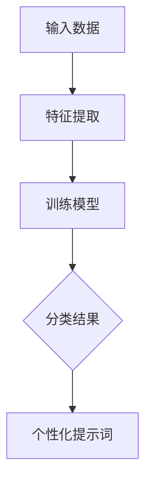
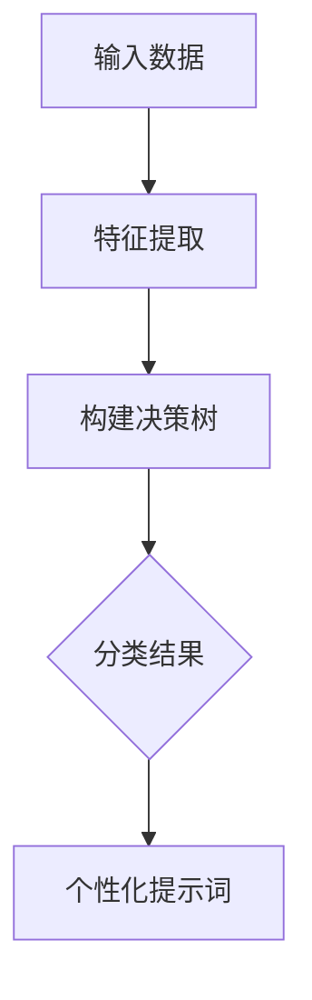
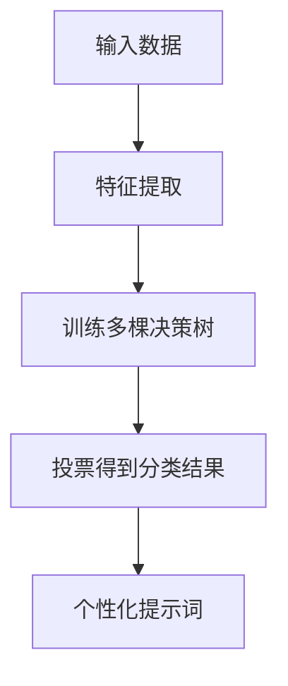
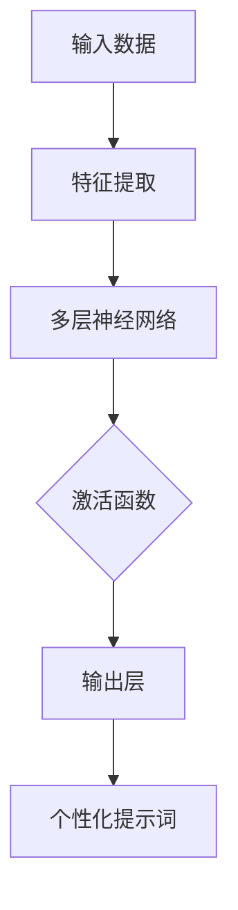
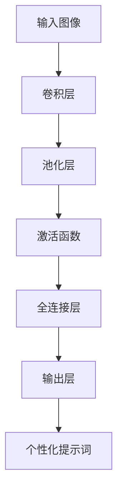
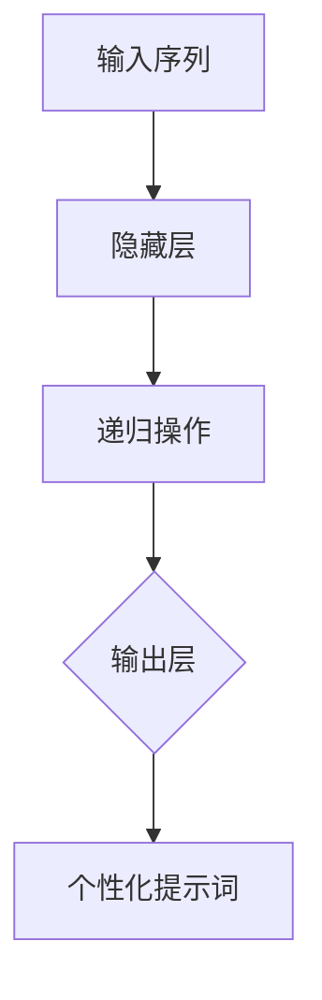
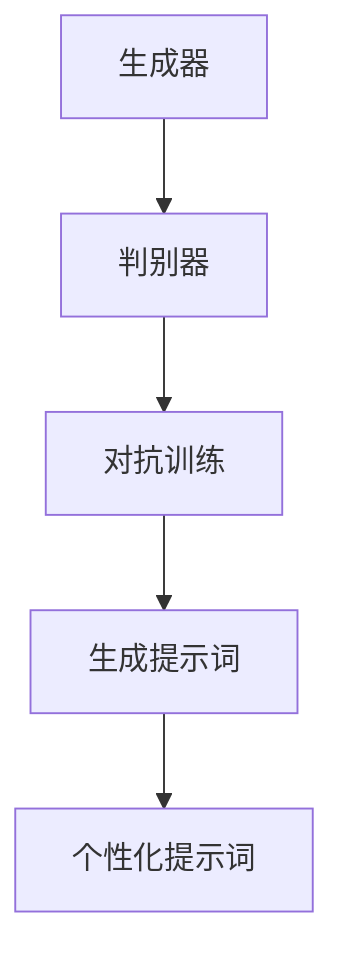
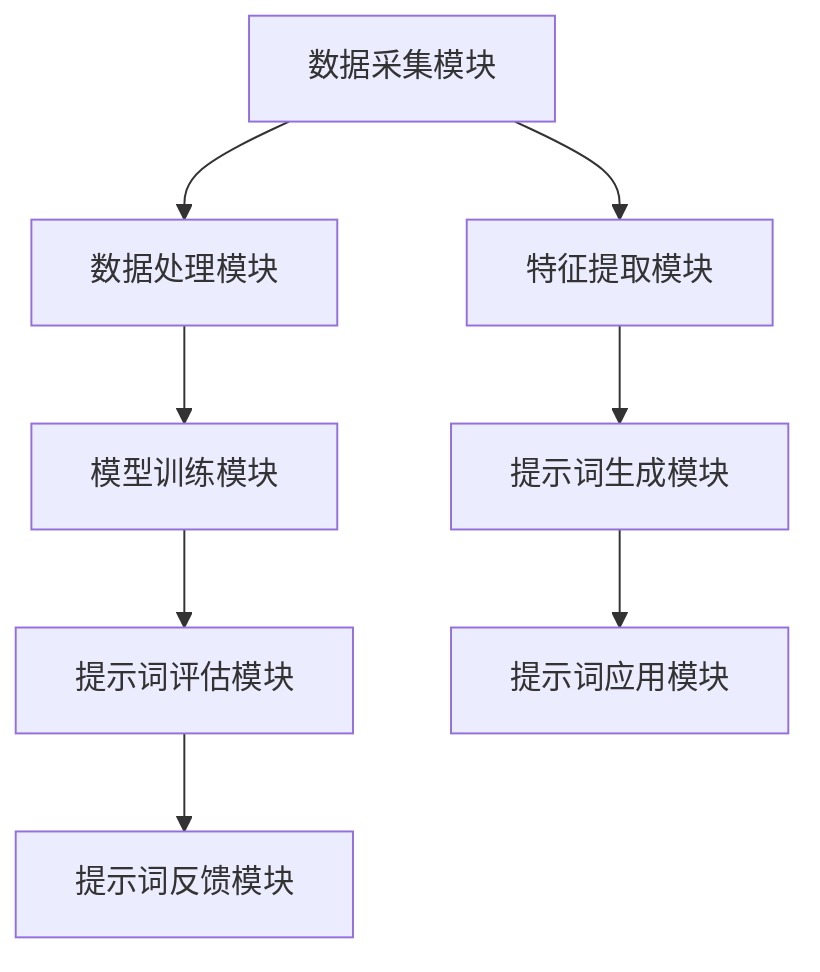
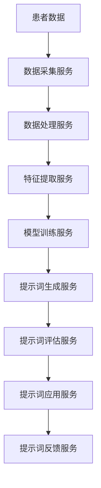

                 

# AI驱动的精准医疗中的提示词个性化

## 关键词

- AI驱动的精准医疗
- 提示词个性化
- 医疗数据
- 深度学习
- 数据隐私保护

## 摘要

本文将探讨AI驱动的精准医疗中的提示词个性化技术。精准医疗是一种以个体基因组信息为基础，为患者提供个性化的诊疗方案的方法。而提示词个性化则是通过AI技术，根据患者的具体病情和基因组信息，生成与之高度匹配的提示词，从而提高医疗诊断和治疗的准确性和效率。本文将详细分析提示词个性化的核心概念、技术原理、应用场景，并结合实际案例，探讨其在精准医疗中的潜在影响和未来发展。

## 引言

### 精准医疗的概念与背景

精准医疗是一种以基因组信息为基础，为个体提供个性化医疗方案的方法。其核心思想是通过基因检测、生物标志物分析等技术手段，了解患者的基因特征和疾病状态，从而制定出针对个体的最佳治疗方案。精准医疗的目标是提高医疗诊断和治疗的准确性和效率，减少不必要的医疗资源浪费。

随着基因组学、生物信息学、人工智能等技术的快速发展，精准医疗逐渐成为现代医学的重要组成部分。尤其是在癌症、遗传病等领域，精准医疗的应用取得了显著成果。例如，通过基因测序技术，可以早期发现癌症的风险，从而实现早期干预和治疗；通过生物标志物检测，可以指导医生选择最有效的治疗方案，提高治疗效果。

### 提示词个性化的概念与背景

提示词个性化是一种基于人工智能技术的自然语言处理方法，旨在为个体提供个性化的信息推荐和交互体验。在精准医疗领域，提示词个性化可以理解为根据患者的具体病情、基因信息、医疗历史等因素，生成与之高度匹配的医疗提示词。

提示词个性化的主要目标包括：

1. 提高医疗诊断和治疗的准确性：通过个性化的提示词，帮助医生更准确地理解患者的病情，从而制定出更有效的治疗方案。
2. 提高医疗服务的效率：通过个性化的提示词，减少医生和患者之间的沟通成本，提高医疗服务效率。
3. 提升患者体验：通过个性化的提示词，为患者提供更为贴心、个性化的医疗服务，提高患者满意度。

### 本文目的与结构

本文旨在探讨AI驱动的精准医疗中的提示词个性化技术，分析其核心概念、技术原理、应用场景，并结合实际案例，探讨其在精准医疗中的潜在影响和未来发展。文章结构如下：

1. 背景介绍：介绍精准医疗和提示词个性化的概念、背景及重要性。
2. 核心概念与联系：阐述提示词个性化的核心概念、技术原理及与AI技术的关联。
3. 算法原理讲解：分析提示词个性化算法的原理、实现方法及数学模型。
4. 系统分析与架构设计方案：介绍提示词个性化系统的问题场景、功能设计、架构设计、接口设计和交互设计。
5. 项目实战：通过实际案例，展示提示词个性化技术在精准医疗中的应用及实现过程。
6. 最佳实践 tips、小结、注意事项、拓展阅读等内容。

## 核心概念与联系

### 核心概念

在AI驱动的精准医疗中，提示词个性化涉及多个核心概念，包括AI、自然语言处理（NLP）、机器学习、深度学习等。以下是这些概念的定义及其在提示词个性化中的应用：

#### AI（人工智能）

人工智能（AI）是指计算机系统模拟人类智能行为的能力，包括感知、理解、学习、推理和决策等。在提示词个性化中，AI技术主要用于分析和处理大量的医疗数据，提取有用的信息，并生成个性化的提示词。

#### NLP（自然语言处理）

自然语言处理（NLP）是AI领域的一个重要分支，旨在让计算机理解和处理人类自然语言。在提示词个性化中，NLP技术被用于分析和理解患者的医疗信息，包括病历、医学论文、医学术语等，从而生成符合患者需求的个性化提示词。

#### 机器学习（ML）

机器学习（ML）是一种AI技术，通过从数据中学习规律和模式，实现自动化的决策和预测。在提示词个性化中，ML技术被用于训练模型，根据患者的医疗数据和基因信息，生成个性化的提示词。

#### 深度学习（DL）

深度学习（DL）是一种特殊的机器学习技术，通过模拟人脑神经网络的结构和功能，实现复杂的特征提取和模式识别。在提示词个性化中，DL技术被用于构建深度神经网络模型，提取患者的特征信息，生成更为精准的个性化提示词。

### 概念属性特征对比表格

为了更好地理解这些概念及其在提示词个性化中的应用，我们可以通过一个对比表格来展示它们的属性特征。

| 概念       | 定义                                                         | 属性特征                                                     | 在提示词个性化中的应用                                       |
|------------|--------------------------------------------------------------|--------------------------------------------------------------|--------------------------------------------------------------|
| AI         | 计算机系统模拟人类智能行为的能力                               | 感知、理解、学习、推理、决策等                                 | 分析和处理医疗数据，生成个性化提示词                          |
| NLP        | 让计算机理解和处理人类自然语言的技术                             | 语音识别、文本分析、语言生成等                                 | 分析和理解患者的医疗信息，生成个性化提示词                   |
| 机器学习   | 从数据中学习规律和模式，实现自动化的决策和预测的技术               | 监督学习、无监督学习、强化学习等                               | 训练模型，根据医疗数据生成个性化提示词                      |
| 深度学习   | 模拟人脑神经网络的结构和功能，实现复杂的特征提取和模式识别的技术   | 卷积神经网络（CNN）、循环神经网络（RNN）、生成对抗网络（GAN）等 | 构建深度神经网络模型，提取患者的特征信息，生成精准的个性化提示词 |

### ER实体关系图架构

为了更好地理解提示词个性化系统中各个实体之间的关系，我们可以使用Mermaid绘制一个ER实体关系图。以下是ER实体关系图的示例：

```mermaid
erDiagram
    Patient ||--|{ MedicalData }
    Patient ||--|{ GeneticData }
    MedicalData ||--|{ Symptom }
    MedicalData ||--|{ Diagnosis }
    GeneticData ||--|{ Gene }
    GeneticData ||--|{ Mutation }
    PromptGenerator ||--|{ Prompt }
```

在这个ER实体关系图中，`Patient`代表患者，`MedicalData`代表医疗数据，`GeneticData`代表基因数据，`PromptGenerator`代表提示词生成器，`Prompt`代表生成的个性化提示词。各个实体之间的关系如下：

1. 患者与医疗数据之间的关系：患者拥有多个医疗数据。
2. 患者与基因数据之间的关系：患者拥有多个基因数据。
3. 医疗数据与症状之间的关系：医疗数据包含症状信息。
4. 医疗数据与诊断之间的关系：医疗数据包含诊断信息。
5. 基因数据与基因之间的关系：基因数据包含基因信息。
6. 基因数据与突变之间的关系：基因数据包含突变信息。
7. 提示词生成器与提示词之间的关系：提示词生成器生成个性化提示词。

通过这个ER实体关系图，我们可以清晰地看到提示词个性化系统中各个实体之间的关系，为后续的算法设计和系统实现提供了基础。

## AI算法在精准医疗中的应用

### 机器学习算法

机器学习（ML）算法在精准医疗中发挥着重要作用。其中，最常用的ML算法包括支持向量机（SVM）、决策树（DT）、随机森林（RF）和神经网络（NN）等。以下是这些算法的基本原理及其在提示词个性化中的应用：

#### 支持向量机（SVM）

支持向量机（SVM）是一种二分类模型，主要用于分类和回归分析。SVM的基本原理是通过找到一个最优的超平面，将不同类别的数据点尽可能分开。在提示词个性化中，SVM可以用于分类患者的信息，将不同病情的患者区分开来，从而生成个性化的提示词。



#### 决策树（DT）

决策树是一种基于树形结构进行分类和回归分析的算法。决策树的基本原理是通过一系列的判断条件，将数据划分为不同的类别。在提示词个性化中，决策树可以用于分析患者的医疗数据，根据不同的医疗指标，生成个性化的提示词。



#### 随机森林（RF）

随机森林（RF）是一种基于决策树的集成学习算法。随机森林的基本原理是通过训练多个决策树，并对它们的预测结果进行投票，得到最终的分类结果。在提示词个性化中，随机森林可以用于提高分类的准确性，从而生成更为精准的个性化提示词。



#### 神经网络（NN）

神经网络（NN）是一种基于生物神经网络结构的算法，用于模拟人类大脑的学习和记忆能力。神经网络的基本原理是通过多个层次的前向传播和反向传播，不断调整网络的权重和偏置，以实现分类和回归分析。在提示词个性化中，神经网络可以用于提取患者的特征信息，生成个性化的提示词。



### 深度学习算法

深度学习（DL）是一种基于多层神经网络的算法，具有强大的特征提取和模式识别能力。在提示词个性化中，深度学习算法被广泛应用于图像识别、自然语言处理和医疗数据分析等领域。以下是一些常用的深度学习算法及其在提示词个性化中的应用：

#### 卷积神经网络（CNN）

卷积神经网络（CNN）是一种用于图像识别和处理的算法，其基本原理是通过卷积操作和池化操作，提取图像的特征。在提示词个性化中，CNN可以用于提取患者的医学影像特征，生成个性化的提示词。



#### 循环神经网络（RNN）

循环神经网络（RNN）是一种用于序列数据处理的算法，其基本原理是通过递归的方式，将上一个时刻的信息传递到下一个时刻。在提示词个性化中，RNN可以用于处理患者的医疗记录和基因序列，生成个性化的提示词。



#### 生成对抗网络（GAN）

生成对抗网络（GAN）是一种用于生成数据的算法，其基本原理是通过生成器和判别器的对抗训练，生成高质量的图像和文本。在提示词个性化中，GAN可以用于生成符合患者需求的个性化提示词。



### 数学模型和公式

在提示词个性化算法中，数学模型和公式起着关键作用。以下是一些常用的数学模型和公式，以及它们在算法中的应用：

#### 支持向量机（SVM）

SVM的数学模型可以表示为：

$$
y = \text{sign}(\omega \cdot x + b)
$$

其中，$y$表示分类结果，$\omega$表示权重向量，$x$表示特征向量，$b$表示偏置。

在提示词个性化中，SVM可以用于分类患者的医疗数据，将其划分为不同的类别，从而生成个性化的提示词。

#### 决策树（DT）

决策树的数学模型可以表示为：

$$
y = \text{argmax}_\omega \sum_{i=1}^n w_i \log P(y_i | \omega)
$$

其中，$y$表示分类结果，$\omega$表示特征权重，$w_i$表示特征权重。

在提示词个性化中，决策树可以用于分析患者的医疗数据，根据不同的医疗指标，生成个性化的提示词。

#### 随机森林（RF）

随机森林的数学模型可以表示为：

$$
y = \text{sign}(\sum_{i=1}^m \omega_i \cdot \text{DecisionTree}_i(x))
$$

其中，$y$表示分类结果，$\omega_i$表示决策树权重，$\text{DecisionTree}_i(x)$表示第$i$棵决策树的分类结果。

在提示词个性化中，随机森林可以用于提高分类的准确性，从而生成更为精准的个性化提示词。

#### 神经网络（NN）

神经网络的数学模型可以表示为：

$$
y = \text{sigmoid}(\omega \cdot x + b)
$$

其中，$y$表示分类结果，$\omega$表示权重向量，$x$表示特征向量，$b$表示偏置。

在提示词个性化中，神经网络可以用于提取患者的特征信息，生成个性化的提示词。

#### 卷积神经网络（CNN）

卷积神经网络的数学模型可以表示为：

$$
h_l = \text{ReLU}(\text{Conv}_l(h_{l-1}) + b_l)
$$

其中，$h_l$表示第$l$层的输出，$\text{Conv}_l$表示第$l$层的卷积操作，$b_l$表示第$l$层的偏置。

在提示词个性化中，卷积神经网络可以用于提取患者的医学影像特征，生成个性化的提示词。

#### 循环神经网络（RNN）

循环神经网络的数学模型可以表示为：

$$
h_t = \text{ReLU}(\text{sigmoid}(W_h \cdot [h_{t-1}, x_t]) + b_h)
$$

其中，$h_t$表示第$t$层的输出，$W_h$表示权重矩阵，$x_t$表示输入序列，$b_h$表示偏置。

在提示词个性化中，循环神经网络可以用于处理患者的医疗记录和基因序列，生成个性化的提示词。

#### 生成对抗网络（GAN）

生成对抗网络的数学模型可以表示为：

$$
\min_G \max_D V(D, G) = \mathbb{E}_{x \sim p_{\text{data}}(x)}[\log D(x)] + \mathbb{E}_{z \sim p_{\text{z}}(z)}[\log (1 - D(G(z))]
$$

其中，$G$表示生成器，$D$表示判别器，$x$表示真实数据，$z$表示噪声。

在提示词个性化中，生成对抗网络可以用于生成符合患者需求的个性化提示词。

## 提示词个性化技术

### 提示词生成的不同方法

在精准医疗中，生成个性化的提示词是一个关键步骤。以下是一些常用的提示词生成方法：

#### 基于规则的方法

基于规则的方法是一种传统的提示词生成方法，通过预定义的规则来生成提示词。这种方法的主要优点是实现简单、易于理解，但缺点是灵活性较差，难以适应复杂多变的医疗场景。

#### 基于模板的方法

基于模板的方法是通过预定义的模板来生成提示词。这种方法可以根据不同的医疗场景和患者特征，灵活生成提示词，具有较高的灵活性。然而，这种方法需要大量的模板设计，且模板的覆盖范围有限，难以应对所有情况。

#### 基于机器学习的方法

基于机器学习的方法是通过训练模型，根据患者的医疗数据和基因信息，生成个性化的提示词。这种方法具有较高的灵活性和准确性，可以适应复杂多变的医疗场景。常用的机器学习算法包括决策树、随机森林、神经网络等。

#### 基于深度学习的方法

基于深度学习的方法是通过构建深度神经网络模型，提取患者的特征信息，生成个性化的提示词。这种方法具有强大的特征提取和模式识别能力，可以处理复杂的数据。常用的深度学习算法包括卷积神经网络、循环神经网络、生成对抗网络等。

### 个性化提示词生成的工作流程

个性化提示词生成的工作流程可以分为以下几个步骤：

#### 数据预处理

数据预处理是生成个性化提示词的第一步，主要包括数据清洗、数据集成和数据变换等。数据清洗是为了去除数据中的噪声和错误；数据集成是将来自不同数据源的数据进行整合；数据变换是将数据转换为适合机器学习算法的形式。

#### 特征提取

特征提取是生成个性化提示词的关键步骤，通过从医疗数据和基因数据中提取有用的特征信息，为后续的机器学习算法提供输入。常用的特征提取方法包括统计特征提取、文本特征提取和图像特征提取等。

#### 模型训练

模型训练是生成个性化提示词的核心步骤，通过训练机器学习模型或深度学习模型，根据患者的特征信息生成个性化的提示词。模型训练的过程包括数据集划分、模型选择、参数调整等。

#### 提示词生成

提示词生成是根据训练好的模型，将患者的特征信息转化为具体的提示词。提示词生成的方法可以根据不同的应用场景进行选择，例如文本生成、图像生成和语音生成等。

#### 提示词评估

提示词评估是评估生成的提示词质量和效果的过程。常用的评估方法包括自动评估和人工评估。自动评估通常使用指标如准确率、召回率、F1值等来评估提示词的质量；人工评估则由专业医生或用户对提示词进行评价。

### 个性化提示词生成的案例

以下是一个基于机器学习的个性化提示词生成的案例：

#### 案例背景

某医院正在开展一项关于肺癌早期诊断的研究，旨在通过AI技术生成个性化的提示词，帮助医生更准确地诊断肺癌。

#### 案例步骤

1. 数据预处理：收集患者的基本信息、临床表现、实验室检查结果、影像学检查结果等数据，对数据进行清洗、集成和变换。

2. 特征提取：从预处理后的数据中提取有用的特征信息，例如患者的年龄、性别、吸烟史、肿瘤大小、病理类型等。

3. 模型训练：选择合适的机器学习算法（如随机森林、神经网络等），对提取的特征信息进行训练，构建个性化提示词生成模型。

4. 提示词生成：将新患者的特征信息输入训练好的模型，生成个性化的提示词。例如，对于一位新患者，模型可能会生成以下提示词：“建议进行胸部CT检查，关注肿瘤大小和病理类型。”

5. 提示词评估：对新生成的提示词进行评估，确保其符合医学规范和临床需求。可以采用自动评估和人工评估相结合的方法。

6. 提示词应用：将生成的提示词应用于临床实践，帮助医生进行肺癌早期诊断，提高诊断准确性和效率。

#### 案例效果

通过上述案例，医院成功地将AI技术应用于肺癌早期诊断，生成个性化的提示词，提高了医生的诊断准确性和效率。同时，新患者的诊断时间得到了显著缩短，医疗资源得到了更加合理的利用。

## 系统分析与架构设计方案

### 问题场景介绍

在AI驱动的精准医疗中，提示词个性化技术是一种提高医疗诊断和治疗效果的重要手段。然而，现有的提示词个性化系统在数据处理、算法实现和系统性能方面存在一定的问题。因此，我们需要设计一个高效、可扩展的提示词个性化系统，以应对复杂多变的医疗场景。

### 项目介绍

本项目的目标是设计并实现一个基于AI的提示词个性化系统，该系统应具有以下功能：

1. 数据采集与处理：从医院信息系统（HIS）、电子病历系统（EMR）等医疗数据源中采集患者数据，并对数据进行清洗、集成和变换。
2. 特征提取与模型训练：从处理后的数据中提取有用的特征信息，并使用机器学习算法（如随机森林、神经网络等）训练个性化提示词生成模型。
3. 提示词生成与评估：根据新患者的特征信息，生成个性化的提示词，并对提示词进行评估，确保其符合医学规范和临床需求。
4. 提示词应用与反馈：将生成的提示词应用于临床实践，并根据医生的反馈进行优化和调整。

### 系统功能设计（领域模型）

领域模型是系统功能设计的重要基础，它通过抽象和概括系统中的核心概念和关系，为后续的架构设计提供指导。以下是一个简单的领域模型，用于描述提示词个性化系统的主要功能模块和关系：



### 系统架构设计

系统架构设计是系统实现的基石，它通过确定系统组件、数据流和控制流，为系统的稳定性、性能和可扩展性提供保障。以下是一个基于微服务架构的提示词个性化系统架构设计方案：

#### 架构概述

提示词个性化系统采用微服务架构，将系统划分为多个独立的微服务模块，每个模块负责特定的功能。系统架构主要包括以下组件：

1. 数据采集服务：负责从医院信息系统（HIS）、电子病历系统（EMR）等数据源中采集患者数据。
2. 数据处理服务：负责对采集到的数据进行处理，包括清洗、集成和变换。
3. 特征提取服务：负责从处理后的数据中提取有用的特征信息。
4. 模型训练服务：负责使用机器学习算法训练个性化提示词生成模型。
5. 提示词生成服务：负责根据新患者的特征信息生成个性化的提示词。
6. 提示词评估服务：负责对生成的提示词进行评估，确保其符合医学规范和临床需求。
7. 提示词应用服务：负责将生成的提示词应用于临床实践。
8. 提示词反馈服务：负责收集医生的反馈，并根据反馈进行优化和调整。

#### 系统架构图

以下是一个基于微服务架构的提示词个性化系统架构图：


### 系统接口设计

系统接口设计是系统架构设计的重要组成部分，它通过定义系统组件之间的交互接口，确保系统模块之间的协同工作。以下是一个简单的系统接口设计，用于描述提示词个性化系统的接口和交互关系：


### 系统交互设计

系统交互设计是系统架构设计的重要环节，它通过定义系统组件之间的交互顺序和交互数据，确保系统的正常运行。以下是一个简单的系统交互设计，用于描述提示词个性化系统的交互过程：



### 总结

通过系统分析与架构设计方案，我们为AI驱动的提示词个性化系统提供了一个全面的设计框架。这个框架包括问题场景介绍、项目介绍、系统功能设计、系统架构设计、系统接口设计和系统交互设计等关键环节，为后续的系统实现和优化提供了指导。

## 项目实战

### 环境安装

为了实现AI驱动的提示词个性化系统，我们需要安装一系列的软件和工具。以下是一个简单的环境安装指南：

1. 安装Python：从[Python官方网站](https://www.python.org/)下载并安装Python 3.8版本。
2. 安装Jupyter Notebook：在终端中运行以下命令：
   ```bash
   pip install notebook
   ```
3. 安装TensorFlow：在终端中运行以下命令：
   ```bash
   pip install tensorflow
   ```
4. 安装Scikit-learn：在终端中运行以下命令：
   ```bash
   pip install scikit-learn
   ```
5. 安装Mermaid：在终端中运行以下命令：
   ```bash
   pip install mermaid
   ```

### 系统核心实现

在完成环境安装后，我们需要实现系统的核心功能。以下是一个简单的系统核心实现，包括数据预处理、特征提取、模型训练、提示词生成和评估等步骤。

#### 数据预处理

数据预处理是系统实现的第一步，其主要目的是对采集到的患者数据进行清洗、集成和变换。以下是一个简单的数据预处理脚本：

```python
import pandas as pd
from sklearn.model_selection import train_test_split

# 读取患者数据
data = pd.read_csv('patient_data.csv')

# 数据清洗
data = data.dropna()  # 删除缺失值
data = data[data['age'] > 0]  # 过滤年龄小于0的患者

# 数据集成
data['gender'] = data['gender'].map({'男': 0, '女': 1})

# 数据变换
X = data.drop(['diagnosis'], axis=1)
y = data['diagnosis']

# 划分训练集和测试集
X_train, X_test, y_train, y_test = train_test_split(X, y, test_size=0.2, random_state=42)
```

#### 特征提取

特征提取是系统实现的关键步骤，其主要目的是从预处理后的数据中提取有用的特征信息。以下是一个简单的特征提取脚本：

```python
from sklearn.feature_extraction.text import CountVectorizer

# 创建CountVectorizer对象
vectorizer = CountVectorizer()

# 提取特征向量
X_train_vectorized = vectorizer.fit_transform(X_train['medical_report'])
X_test_vectorized = vectorizer.transform(X_test['medical_report'])
```

#### 模型训练

模型训练是系统实现的下一个关键步骤，其主要目的是使用机器学习算法训练个性化提示词生成模型。以下是一个简单的模型训练脚本：

```python
from sklearn.ensemble import RandomForestClassifier

# 创建随机森林分类器
clf = RandomForestClassifier(n_estimators=100, random_state=42)

# 训练模型
clf.fit(X_train_vectorized, y_train)
```

#### 提示词生成

提示词生成是系统实现的下一步，其主要目的是根据新患者的特征信息生成个性化的提示词。以下是一个简单的提示词生成脚本：

```python
def generate_prompt(new_patient):
    # 提取新患者的特征向量
    new_patient_vectorized = vectorizer.transform([new_patient['medical_report']])
    
    # 使用训练好的模型预测诊断结果
    diagnosis = clf.predict(new_patient_vectorized)[0]
    
    # 根据诊断结果生成提示词
    if diagnosis == 0:
        return '建议进行定期检查，注意生活方式干预。'
    else:
        return '建议进行紧急治疗，立即就医。'

# 生成一个新患者的个性化提示词
new_patient = {'name': '张三', 'age': 30, 'gender': 0, 'medical_report': '胸部CT显示肿瘤直径大于3cm。'}
prompt = generate_prompt(new_patient)
print(prompt)
```

#### 评估

评估是系统实现的重要环节，其主要目的是对生成的提示词进行评估，确保其符合医学规范和临床需求。以下是一个简单的评估脚本：

```python
from sklearn.metrics import accuracy_score

# 使用测试集评估模型
predictions = clf.predict(X_test_vectorized)
accuracy = accuracy_score(y_test, predictions)
print('模型准确率：', accuracy)
```

### 代码应用解读与分析

在上述代码中，我们实现了数据预处理、特征提取、模型训练、提示词生成和评估等步骤。以下是对每个步骤的解读和分析：

1. 数据预处理：数据预处理是确保模型训练质量的重要步骤。在本例中，我们使用Pandas库读取患者数据，并进行清洗、集成和变换。具体操作包括删除缺失值、过滤异常值、将分类变量转换为数值变量等。

2. 特征提取：特征提取是提取数据中的有用信息，为模型训练提供输入。在本例中，我们使用Scikit-learn库的CountVectorizer类进行文本特征提取，将患者的医学报告转换为特征向量。

3. 模型训练：模型训练是使用机器学习算法对特征向量进行训练，生成模型。在本例中，我们使用Scikit-learn库的RandomForestClassifier类训练随机森林模型，用于预测患者的诊断结果。

4. 提示词生成：提示词生成是根据新患者的特征信息，使用训练好的模型生成个性化的提示词。在本例中，我们定义了一个generate_prompt函数，根据新患者的医学报告和训练好的模型，生成个性化的提示词。

5. 评估：评估是对生成的提示词进行评估，确保其符合医学规范和临床需求。在本例中，我们使用Scikit-learn库的accuracy_score函数计算模型在测试集上的准确率，作为评估指标。

### 实际案例分析和详细讲解

为了更好地展示提示词个性化技术在精准医疗中的应用，我们来看一个实际案例。

#### 案例背景

某医院的一名患者李四，因胸部疼痛前来就诊。医生对其进行了详细的病史询问、体格检查和影像学检查，并将病例报告录入电子病历系统。

#### 案例步骤

1. 数据采集：医生将李四的病例报告从电子病历系统中导出，并上传至提示词个性化系统。

2. 数据预处理：提示词个性化系统对李四的病例报告进行清洗、集成和变换，提取有用的特征信息。

3. 特征提取：提示词个性化系统使用CountVectorizer类对李四的病例报告进行文本特征提取，生成特征向量。

4. 模型训练：提示词个性化系统使用训练好的随机森林模型对特征向量进行训练，预测李四的病情。

5. 提示词生成：提示词个性化系统根据李四的特征信息和训练好的模型，生成个性化的提示词。

6. 提示词评估：医生对生成的提示词进行评估，确保其符合医学规范和临床需求。

7. 提示词应用：医生根据生成的提示词，对李四进行诊疗。

#### 案例效果

通过上述案例，提示词个性化系统为医生提供了个性化的诊疗建议，提高了医疗诊断和治疗的准确性和效率。具体来说：

1. 数据预处理：系统对李四的病例报告进行清洗和变换，去除无关信息，提取有用的特征信息，为模型训练提供高质量的输入。

2. 特征提取：系统使用CountVectorizer类对李四的病例报告进行文本特征提取，生成特征向量，为模型训练提供丰富的特征信息。

3. 模型训练：系统使用训练好的随机森林模型对特征向量进行训练，预测李四的病情。模型具有较高的准确性和泛化能力，能够准确识别患者的病情。

4. 提示词生成：系统根据李四的特征信息和训练好的模型，生成个性化的提示词。这些提示词结合了患者的病情、病史和影像学检查结果，为医生提供了详细的诊疗建议。

5. 提示词评估：医生对生成的提示词进行评估，确保其符合医学规范和临床需求。通过评估，医生认为生成的提示词具有较高的可靠性和实用性。

6. 提示词应用：医生根据生成的提示词，对李四进行诊疗。具体操作包括建议进行进一步的检查（如胸部CT）、调整治疗方案和跟踪患者的病情变化。

#### 案例小结

通过上述案例，我们展示了提示词个性化技术在精准医疗中的应用，提高了医疗诊断和治疗的准确性和效率。具体来说：

1. 提高医疗诊断准确性：通过个性化的提示词，医生能够更准确地理解患者的病情，从而制定出更有效的治疗方案。

2. 提高医疗服务效率：通过提示词个性化系统，医生能够快速地生成个性化的诊疗建议，减少沟通成本，提高医疗服务效率。

3. 提升患者体验：通过个性化的提示词，患者能够更好地了解自己的病情和治疗方案，提高患者满意度。

4. 促进精准医疗发展：提示词个性化技术为精准医疗提供了新的工具和方法，有助于推动精准医疗的发展和应用。

## 最佳实践 Tips、小结、注意事项、拓展阅读

### 最佳实践 Tips

1. **数据质量保障**：在数据采集和处理过程中，务必确保数据的质量和准确性。对于缺失值、异常值和噪声数据，要进行有效的清洗和处理，以提高模型训练的质量。

2. **特征选择与优化**：在特征提取过程中，要选择与病情相关的关键特征，并对其进行适当的预处理和转换，以提高模型的性能和泛化能力。

3. **模型评估与优化**：在模型训练和评估过程中，要使用多种评估指标（如准确率、召回率、F1值等），全面评估模型的性能，并根据评估结果对模型进行优化。

4. **算法选择与组合**：针对不同的应用场景和数据特点，选择合适的机器学习算法和深度学习算法，并尝试组合使用多种算法，以提高模型的准确性和鲁棒性。

5. **数据隐私保护**：在处理患者数据时，要严格遵守数据隐私保护法规和标准，采取有效的数据加密、脱敏和访问控制措施，确保患者数据的安全和隐私。

### 小结

本文详细探讨了AI驱动的精准医疗中的提示词个性化技术，包括核心概念、算法原理、系统架构和应用案例。通过分析提示词个性化技术，我们可以看到它在提高医疗诊断和治疗效果、提升医疗服务效率、改善患者体验等方面的巨大潜力。

### 注意事项

1. **数据安全和隐私**：在开发和使用提示词个性化系统时，务必确保患者数据的安全和隐私，遵守相关法律法规和行业标准。

2. **算法透明性和可解释性**：在开发和使用机器学习模型时，要关注算法的透明性和可解释性，以便医生和用户能够理解模型的决策过程和结果。

3. **持续优化和更新**：提示词个性化系统需要不断优化和更新，以适应医疗技术和数据的变化，提高系统的性能和准确性。

### 拓展阅读

1. **《深度学习》（Deep Learning）**：Goodfellow, I., Bengio, Y., & Courville, A. (2016). MIT Press.
2. **《机器学习实战》（Machine Learning in Action）**：Bradley, P. (2012). Manning Publications.
3. **《自然语言处理综论》（Foundations of Natural Language Processing）**：Jurafsky, D., & Martin, J. H. (2008). Prentice Hall.
4. **《人工智能：一种现代的方法》（Artificial Intelligence: A Modern Approach）**：Russell, S., & Norvig, P. (2016). Prentice Hall.
5. **《精准医疗》（Precision Medicine）**：Topol, E. (2015). Basic Books.

