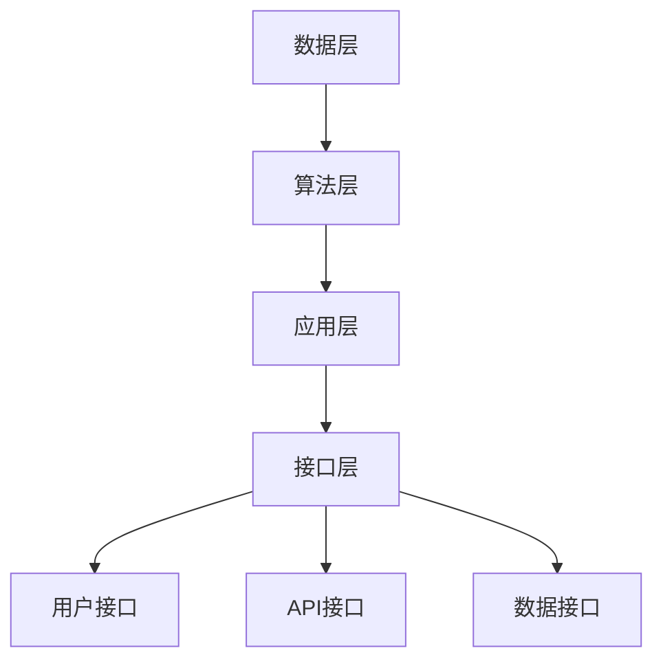
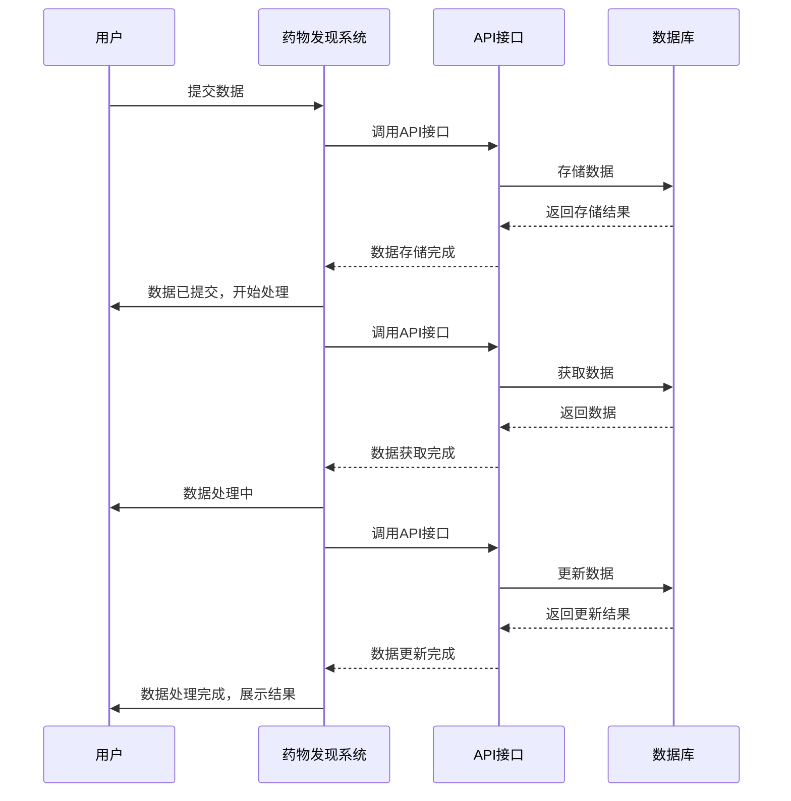

                 

### 第一部分：背景介绍

#### 第1章 AI驱动的药物发现概述

##### 1.1 问题背景

当前，药物发现领域面临着诸多挑战。首先，药物研发成本高昂，从实验室研究到临床试验，每一步都需要大量的资金投入。其次，药物研发周期漫长，一项新药的研发可能需要数年至十余年的时间。最后，药物研发成功率极低，据统计，只有不到10%的候选药物能够成功进入临床试验，最终获得批准上市的药物更是寥寥无几。

这些挑战极大地限制了新药的发现速度，影响了患者对创新药物的需求。为了解决这些问题，研究者们开始探索新的药物发现方法，其中，人工智能（AI）技术因其高效、自动化和智能化的特点，逐渐成为药物发现领域的重要工具。

##### 1.2 问题描述

药物发现过程涉及多个环节，主要包括疾病机制解析、先导化合物筛选、药物分子设计、临床前评估等。每一个环节都存在复杂的问题和挑战。

- **疾病机制解析**：需要深入理解疾病的生物学基础，识别关键的分子靶点。这通常需要大量的生物实验和数据分析，过程繁琐且耗时。
- **先导化合物筛选**：从大量的化合物库中筛选出具有潜在药理活性的先导化合物。这一过程需要高效的筛选方法，以确保在短时间内找到合适的候选药物。
- **药物分子设计**：基于先导化合物的结构信息，设计更加优化、药效更强的药物分子。这一步骤对化学和生物学知识有较高的要求。
- **临床前评估**：对候选药物进行药理、药代动力学和安全性评估，以确定其是否适合进入临床试验。这一步骤需要大量的实验数据和生物样本分析。

##### 1.3 问题解决

AI驱动的药物发现方法旨在通过自动化、高效化和智能化的手段，解决上述问题。以下是一些关键的技术和应用：

- **数据挖掘与机器学习**：利用AI技术从海量的生物数据和化学数据中挖掘出有用的信息，如疾病相关基因、药物活性分子等。
- **深度学习与图像处理**：通过训练深度学习模型，自动识别和解析复杂的生物图像，如细胞切片、蛋白质晶体等。
- **虚拟筛选与分子模拟**：利用计算化学和物理方法，在计算机上模拟化合物的分子结构，预测其药理活性和毒性。
- **基因组学与代谢组学**：结合基因组学和代谢组学数据，深入理解疾病机制和药物作用机制。

##### 1.4 边界与外延

AI驱动的药物发现方法不仅适用于小分子药物，还适用于大分子药物和生物药物。随着技术的不断发展，AI在药物发现中的应用前景非常广阔，有望加速药物研发进程，提高药物研发成功率。

##### 1.5 概念结构与核心要素组成

AI驱动的药物发现涉及多个核心概念和要素，包括人工智能、药物发现、生物信息学、计算化学等。核心要素主要包括数据、算法、计算资源、实验验证等。以下是一个简化的概念结构图：

```
                +--------------+
                |    药物发现   |
                +------+------+
                       |
               +-------+-------+
               |            |
           +---+---+     +----+-----+
           |  数据  |     |  算法  |
           +---+---+     +----+-----+
                       |
               +-------+-------+
               |   计算资源   |
               +--------------+
```

#### 第2章 人工智能基础

##### 2.1 人工智能概述

###### 2.1.1 人工智能的定义与分类

人工智能（Artificial Intelligence，简称AI）是计算机科学的一个分支，旨在通过模拟、延伸和扩展人的智能，使计算机系统能够执行复杂的认知任务。根据实现方式和能力，人工智能可以大致分为以下几类：

1. **弱人工智能（Narrow AI）**：指在特定任务上表现出人类智能水平的AI，如语音识别、图像识别等。
2. **强人工智能（General AI）**：具有广泛认知能力，能够像人类一样理解、学习、推理和解决问题。目前，强人工智能仍然是一个理论上的目标，尚未实现。
3. **超级人工智能（Superintelligent AI）**：超越人类智能的AI，能够解决人类无法解决的问题。这一概念在学术界和产业界都存在争议。

###### 2.1.2 人工智能的发展历程

人工智能的发展历程可以大致分为三个阶段：

1. **第一代人工智能（1950s-1960s）**：这一阶段主要关注符号主义和逻辑推理，代表工作包括逻辑推理系统、语法分析器等。然而，受限于计算资源和算法复杂度，这一代人工智能并未实现预期效果。

2. **第二代人工智能（1970s-1980s）**：这一阶段引入了启发式搜索和知识表示方法，如专家系统和生产规则系统。虽然取得了一些成功，但仍然依赖于人类专家的知识输入，难以实现真正的自主决策。

3. **第三代人工智能（1990s-至今）**：这一阶段以数据驱动和机器学习为核心，通过大量数据训练模型，实现自动化和智能化的任务处理。深度学习、强化学习等新兴技术在这一阶段取得了显著进展。

##### 2.2 机器学习与深度学习

###### 2.2.1 机器学习概述

机器学习（Machine Learning，简称ML）是一种使计算机系统能够自动改进自身性能的方法。其主要思想是通过训练算法，从数据中学习规律和模式，并在新的数据上做出预测或决策。机器学习主要分为以下几类：

1. **监督学习（Supervised Learning）**：通过已有标签数据训练模型，然后在新的、未标记的数据上进行预测。常见的算法包括线性回归、逻辑回归、决策树、支持向量机等。

2. **无监督学习（Unsupervised Learning）**：在没有标签数据的情况下，从数据中挖掘出隐含的结构和模式。常见的算法包括聚类、降维、关联规则学习等。

3. **半监督学习（Semi-supervised Learning）**：结合了监督学习和无监督学习，利用少量的标签数据和大量的未标记数据进行训练。

4. **强化学习（Reinforcement Learning）**：通过与环境的交互，学习如何在特定情境下做出最优决策。常见的算法包括Q-learning、深度强化学习等。

###### 2.2.2 深度学习概述

深度学习（Deep Learning，简称DL）是一种基于多层神经网络的机器学习方法。其核心思想是通过逐层提取特征，从原始数据中学习到更加抽象和高级的表示。深度学习在图像识别、自然语言处理、语音识别等领域取得了突破性的成果。

深度学习的主要模型包括：

1. **卷积神经网络（Convolutional Neural Network，CNN）**：适用于处理具有网格结构的输入数据，如图像和视频。

2. **循环神经网络（Recurrent Neural Network，RNN）**：适用于处理序列数据，如时间序列、语音和文本。

3. **生成对抗网络（Generative Adversarial Network，GAN）**：由生成器和判别器组成，用于生成逼真的数据。

4. **变换器（Transformer）**：基于自注意力机制，广泛应用于自然语言处理领域，如BERT、GPT等。

##### 2.3 AI在药物发现中的应用

###### 2.3.1 AI在疾病机制解析中的应用

AI在疾病机制解析中的应用主要体现在以下几个方面：

1. **基因数据分析**：利用机器学习算法分析基因表达数据，识别与疾病相关的基因和生物标记物。

2. **蛋白质结构预测**：通过深度学习模型预测蛋白质的三维结构，为药物设计提供重要信息。

3. **药物靶点识别**：利用AI技术识别潜在的药物靶点，为药物研发提供方向。

###### 2.3.2 AI在先导化合物筛选中的应用

AI在先导化合物筛选中的应用主要包括：

1. **化学空间搜索**：利用深度学习模型在化学空间中搜索潜在的药物分子，提高筛选效率。

2. **分子优化**：通过计算化学和机器学习相结合，对先导化合物进行结构优化，提高其药效和稳定性。

##### 2.4 人工智能与生物信息学、计算化学的联系

###### 2.4.1 人工智能与生物信息学的关系

生物信息学（Bioinformatics）是生物学与信息学、计算机科学的交叉学科，旨在利用计算机技术和统计学方法解析生物数据。人工智能在生物信息学中的应用主要体现在以下几个方面：

1. **基因组数据分析**：利用机器学习算法分析基因组数据，识别与疾病相关的基因变异。

2. **蛋白质序列分析**：通过深度学习模型预测蛋白质的结构和功能。

3. **代谢网络建模**：利用人工智能技术构建和优化生物代谢网络模型。

###### 2.4.2 人工智能与计算化学的关系

计算化学（Computational Chemistry）是利用计算机技术和数学方法研究化学问题的学科。人工智能在计算化学中的应用主要体现在以下几个方面：

1. **分子模拟**：利用深度学习模型进行分子动力学模拟，预测分子的动态行为。

2. **量子化学计算**：结合量子力学原理，利用机器学习模型进行量子化学计算，提高计算效率。

3. **药物分子设计**：利用人工智能算法设计新的药物分子，优化现有药物的结构。

##### 2.5 核心概念属性特征对比表格

以下是人工智能、机器学习、深度学习、生物信息学和计算化学的核心概念及其属性特征对比表格：

| 概念        | 定义                                                       | 特点                                  | 关联领域                |
|-------------|------------------------------------------------------------|--------------------------------------|------------------------|
| 人工智能    | 通过模拟、延伸和扩展人的智能来实现计算机系统的智能行为       | 自动化、智能化、广泛的应用范围       | 计算机科学、心理学、认知科学 |
| 机器学习    | 利用数据和算法，使计算机系统能够自动从数据中学习并改进性能   | 数据驱动、自动优化、多样化的应用场景 | 人工智能、统计学、概率论     |
| 深度学习    | 利用多层神经网络，从数据中自动提取特征并建模               | 结构化、层次化、高效的特征提取       | 机器学习、神经科学、图像处理 |
| 生物信息学  | 利用计算机技术和统计学方法解析生物数据                     | 数据密集、跨学科、应用广泛           | 生物学、计算机科学、统计学   |
| 计算化学    | 利用计算机技术和数学方法研究化学问题                       | 高效、精确、虚拟实验                 | 化学、物理学、材料科学       |

##### 2.6 ER实体关系图架构

以下是AI驱动的药物发现中的实体关系图架构，使用Mermaid语法表示：

```mermaid
erDiagram
    A ||--|{ B }|| C
    A ||--|{ D }|| E
    F &&& G
```

在这个图中，`A` 表示药物发现过程，`B` 表示疾病机制解析，`C` 表示先导化合物筛选，`D` 表示药物分子设计，`E` 表示临床前评估，`F` 和 `G` 表示数据、算法、计算资源和实验验证等关键要素。

#### 第3章 AI驱动的药物发现算法原理

##### 3.1 数据预处理

数据预处理是AI驱动的药物发现中的关键步骤，其目的是将原始数据转换为适合机器学习模型处理的形式。以下是一些常见的数据预处理方法：

###### 3.1.1 数据清洗

数据清洗是数据预处理的第一步，其目的是去除数据中的噪声和异常值。常见的方法包括：

- **缺失值填充**：使用平均值、中位数、众数等统计量填充缺失值，或使用插值法、前向填充、后向填充等方法。
- **异常值检测**：使用箱线图、z-score等方法检测并处理异常值。

###### 3.1.2 数据归一化

数据归一化是为了消除数据之间的尺度差异，使模型能够更好地学习。常见的方法包括：

- **最小-最大归一化**：将数据缩放到[0, 1]之间。
- **标准归一化**：将数据缩放到标准正态分布，即均值为0，标准差为1。

###### 3.1.3 数据分箱

数据分箱是一种将连续值数据离散化的方法，常用于处理分类问题。常见的方法包括：

- **等宽分箱**：将数据分为固定宽度的区间。
- **等频分箱**：将数据分为固定数量的区间。

###### 3.1.4 特征选择

特征选择是为了减少数据的维度，提高模型的泛化能力。常见的方法包括：

- **过滤法**：基于统计量（如信息增益、相关性等）筛选特征。
- **包装法**：结合模型训练过程筛选特征。
- **嵌入法**：在模型训练过程中进行特征选择。

##### 3.2 机器学习算法在药物发现中的应用

机器学习算法在药物发现中扮演着重要角色，以下是一些常用的机器学习算法及其在药物发现中的应用：

###### 3.2.1 支持向量机（SVM）

支持向量机是一种强大的分类算法，适用于药物活性预测、药物靶点识别等问题。其基本原理是找到最佳的超平面，将不同类别的数据分开。

- **数学模型**：假设我们的数据集为 \(\{(x_i, y_i)\}_{i=1}^n\)，其中 \(x_i\) 是输入特征，\(y_i\) 是标签。SVM的目标是找到最佳的超平面 \(w\) 和偏置 \(b\)，使得：

  $$w^T x_i + b \geq 1, \quad y_i = +1$$

  $$w^T x_i + b \leq -1, \quad y_i = -1$$

- **损失函数**：SVM使用的是 hinge 损失函数：

  $$L(w, b) = \frac{1}{2} ||w||^2$$

  其中 \(||w||\) 表示 \(w\) 的欧几里得范数。

- **优化方法**：SVM通常使用二次规划方法进行优化。

###### 3.2.2 随机森林（Random Forest）

随机森林是一种集成学习算法，通过构建多个决策树并投票得到最终结果。它具有很好的泛化能力和鲁棒性，适用于药物活性预测、药物分子设计等问题。

- **基本原理**：随机森林由多个决策树组成，每个决策树使用随机抽样和特征选择构建。每个决策树对数据进行预测，最后通过投票得到整体预测结果。

- **特征选择**：随机森林使用随机特征选择，每次从特征集合中随机选择一个特征进行分裂。

- **损失函数**：随机森林通常使用均方误差（MSE）或交叉熵损失函数。

- **优化方法**：随机森林通常使用贪心算法构建决策树。

###### 3.2.3 贝叶斯网络

贝叶斯网络是一种基于概率论的图形模型，适用于药物作用机制分析、疾病预测等问题。

- **基本原理**：贝叶斯网络由一组随机变量及其条件概率分布组成，通过条件概率分布描述变量之间的关系。

- **数学模型**：假设我们有随机变量 \(X_1, X_2, \ldots, X_n\)，其条件概率分布为：

  $$P(X_1, X_2, \ldots, X_n) = P(X_1) \cdot P(X_2|X_1) \cdot \ldots \cdot P(X_n|X_1, X_2, \ldots, X_{n-1})$$

- **学习算法**：贝叶斯网络可以通过最大似然估计或贝叶斯推理进行学习。

- **推理算法**：贝叶斯网络可以通过贝叶斯推理进行变量之间的关系推理。

##### 3.3 深度学习算法在药物发现中的应用

深度学习算法在药物发现中有着广泛的应用，以下是一些常用的深度学习算法及其在药物发现中的应用：

###### 3.3.1 卷积神经网络（CNN）

卷积神经网络是一种特殊的神经网络，适用于处理具有网格结构的输入数据，如图像和药物分子结构。

- **基本原理**：CNN通过卷积操作提取图像中的特征，然后通过池化操作降低特征维度。其基本结构包括卷积层、池化层和全连接层。

- **数学模型**：假设输入图像为 \(X\)，卷积核为 \(W\)，偏置为 \(b\)，卷积操作可以表示为：

  $$Y = f(W \odot X + b)$$

  其中，\(\odot\) 表示卷积操作，\(f\) 表示激活函数。

- **训练算法**：CNN通常使用反向传播算法进行训练。

- **应用场景**：CNN可以用于药物分子结构识别、药物活性预测等。

###### 3.3.2 循环神经网络（RNN）

循环神经网络是一种处理序列数据的神经网络，适用于药物时间序列分析、基因表达数据建模等。

- **基本原理**：RNN通过循环连接的方式保留序列信息，使其能够处理任意长度的序列数据。

- **数学模型**：假设输入序列为 \(X = (x_1, x_2, \ldots, x_n)\)，隐藏状态为 \(h_t\)，输出为 \(y_t\)，RNN的更新方程为：

  $$h_t = \sigma(W_h h_{t-1} + W_x x_t + b_h)$$

  $$y_t = \sigma(W_y h_t + b_y)$$

  其中，\(\sigma\) 表示激活函数。

- **训练算法**：RNN通常使用梯度下降算法进行训练。

- **应用场景**：RNN可以用于药物时间序列预测、基因表达数据建模等。

###### 3.3.3 生成对抗网络（GAN）

生成对抗网络是一种基于博弈论的深度学习模型，适用于药物分子生成、药物结构优化等。

- **基本原理**：GAN由生成器和判别器组成，生成器生成假数据，判别器判断真假数据。通过优化生成器和判别器的损失函数，使生成器的生成数据越来越逼真。

- **数学模型**：假设生成器的参数为 \(G\)，判别器的参数为 \(D\)，生成器和判别器的损失函数分别为：

  $$L_G = -\log(D(G(z)))$$

  $$L_D = -\log(D(x)) - \log(1 - D(G(z)))$$

  其中，\(z\) 是生成器的噪声输入。

- **训练算法**：GAN通常使用梯度上升和梯度下降相结合的优化方法进行训练。

- **应用场景**：GAN可以用于药物分子生成、药物结构优化等。

##### 3.4 算法应用示例

以下是一个简单的示例，说明如何使用深度学习算法进行药物分子活性预测：

1. **数据集准备**：

   假设我们有一个药物分子活性数据集，包含分子的结构信息和对应的活性值。我们首先需要将分子结构信息转换为数值向量，可以使用化学信息学中的SMILES编码方法。

2. **模型构建**：

   我们使用一个简单的卷积神经网络进行药物分子活性预测。模型结构如下：

   - 输入层：接受SMILES编码的分子结构信息。
   - 卷积层：使用卷积核提取分子结构中的特征。
   - 池化层：降低特征维度。
   - 全连接层：将特征映射到活性值。

3. **模型训练**：

   使用训练数据集对模型进行训练，通过反向传播算法更新模型参数。

4. **模型评估**：

   使用测试数据集对模型进行评估，计算预测活性值与实际活性值之间的误差。

5. **模型应用**：

   使用训练好的模型对新的药物分子进行活性预测，为新药物的研发提供参考。

以下是使用Python和TensorFlow构建的简单卷积神经网络模型代码：

```python
import tensorflow as tf
from tensorflow.keras.models import Sequential
from tensorflow.keras.layers import Conv1D, MaxPooling1D, Flatten, Dense

# 定义模型
model = Sequential()
model.add(Conv1D(filters=64, kernel_size=3, activation='relu', input_shape=(smiles_len, 1)))
model.add(MaxPooling1D(pool_size=2))
model.add(Flatten())
model.add(Dense(units=1, activation='sigmoid'))

# 编译模型
model.compile(optimizer='adam', loss='binary_crossentropy', metrics=['accuracy'])

# 训练模型
model.fit(X_train, y_train, epochs=10, batch_size=32, validation_data=(X_test, y_test))

# 评估模型
loss, accuracy = model.evaluate(X_test, y_test)
print(f"Test accuracy: {accuracy * 100:.2f}%")
```

在这个示例中，`X_train` 和 `y_train` 是训练数据集，`X_test` 和 `y_test` 是测试数据集，`smiles_len` 是SMILES编码的分子结构长度。

##### 3.5 小结

在本章中，我们介绍了AI驱动的药物发现算法原理，包括数据预处理、机器学习算法、深度学习算法及其在药物发现中的应用。这些算法通过处理和分析大量的生物和化学数据，为药物研发提供了新的思路和方法。随着AI技术的不断发展，AI驱动的药物发现有望在未来发挥更加重要的作用。

#### 第4章 系统分析与架构设计

##### 4.1 问题场景介绍

在药物研发过程中，AI驱动的药物发现系统扮演着至关重要的角色。该系统旨在通过自动化和智能化的手段，提高药物研发的效率和质量。具体来说，问题场景如下：

1. **大量数据的处理**：药物研发过程中产生大量结构化数据（如基因数据、蛋白质数据、化学数据等）和非结构化数据（如文献、报告等）。系统需要对这些数据进行有效的处理和分析，以提取出有用的信息。
2. **高效的目标识别**：系统需要能够快速准确地识别出与疾病相关的生物标记物和药物靶点，从而为新药研发提供方向。
3. **药物分子的设计与优化**：系统需要能够对药物分子进行设计和优化，以提高其药效和稳定性。
4. **临床前评估与预测**：系统需要对候选药物进行临床前评估，预测其药理和药代动力学特性，为新药研发提供参考。

##### 4.2 项目介绍

本项目旨在开发一个基于AI技术的药物发现系统，该系统包括以下几个模块：

1. **数据收集与处理模块**：负责收集和处理各种来源的药物研发数据，包括基因数据、蛋白质数据、化学数据等。
2. **目标识别模块**：利用机器学习和深度学习算法，识别与疾病相关的生物标记物和药物靶点。
3. **药物分子设计与优化模块**：利用计算化学和分子模拟技术，设计新的药物分子，并进行结构优化。
4. **临床前评估模块**：利用生物信息学和计算生物学方法，对候选药物进行药理、药代动力学和安全性评估。

##### 4.3 系统功能设计

系统功能设计主要包括以下几个部分：

1. **数据管理**：包括数据收集、数据存储、数据清洗和数据归一化等功能。
2. **特征提取**：利用机器学习和深度学习算法，从原始数据中提取出对药物发现过程有用的特征。
3. **目标识别**：通过训练机器学习模型，识别出与疾病相关的生物标记物和药物靶点。
4. **药物分子设计与优化**：利用计算化学和分子模拟技术，设计新的药物分子，并进行结构优化。
5. **临床前评估**：利用生物信息学和计算生物学方法，对候选药物进行药理、药代动力学和安全性评估。
6. **用户界面**：提供一个直观易用的用户界面，使研究人员能够方便地使用系统进行药物发现。

以下是领域模型的Mermaid类图：

```mermaid
classDiagram
    Class01 <|-- Class02
    Class03 --|> Class04
    Class05 : <<interface>> Interface
    Class01 : +int x
    Class01 : +int y
    Class01 : +setX(int x)
    Class01 : +getY():int
    Class02 : +int z
    Class03 : +int q
    Class04 : +int w
    Class05 : +doSomething()
```

##### 4.4 系统架构设计

系统架构设计主要包括以下几个方面：

1. **数据层**：包括数据库、数据存储和数据管理等组件，负责存储和管理药物研发过程中的各种数据。
2. **算法层**：包括各种机器学习和深度学习算法，用于处理和分析数据，提取有用信息。
3. **应用层**：包括用户界面、应用程序和服务端组件，负责提供药物发现系统的各种功能。
4. **接口层**：包括API接口、数据接口和用户接口等，用于与其他系统或组件进行通信和数据交换。

以下是系统架构的Mermaid架构图：



##### 4.5 系统接口设计和系统交互

系统接口设计和系统交互主要包括以下几个方面：

1. **API接口**：提供RESTful API接口，供外部系统调用，包括数据查询、目标识别、药物分子设计、临床前评估等功能。
2. **数据接口**：定义数据交换的格式和协议，如JSON、XML等，确保数据在不同系统之间的无缝传输。
3. **用户接口**：提供图形化界面，使用户能够方便地使用系统，进行数据输入、模型训练、结果分析等操作。

以下是系统接口和用户交互的Mermaid序列图：



#### 第5章 项目实战

##### 5.1 环境安装

为了运行AI驱动的药物发现系统，我们需要安装以下软件和工具：

1. **操作系统**：Windows、Linux或macOS
2. **Python**：版本3.7及以上
3. **TensorFlow**：版本2.0及以上
4. **PyTorch**：版本1.0及以上
5. **Jupyter Notebook**：用于编写和运行Python代码

安装步骤如下：

1. 安装Python：从 [Python官网](https://www.python.org/) 下载并安装Python，选择添加到系统路径。
2. 安装TensorFlow：打开命令行窗口，输入以下命令：

   ```bash
   pip install tensorflow
   ```

3. 安装PyTorch：打开命令行窗口，输入以下命令：

   ```bash
   pip install torch torchvision
   ```

4. 安装Jupyter Notebook：打开命令行窗口，输入以下命令：

   ```bash
   pip install notebook
   ```

##### 5.2 系统核心实现源代码

以下是系统核心实现的源代码，包括数据预处理、机器学习模型训练和药物分子设计：

```python
import tensorflow as tf
import numpy as np
from sklearn.model_selection import train_test_split
from sklearn.metrics import accuracy_score
from rdkit import Chem

# 数据预处理
def preprocess_data(data):
    # 数据清洗
    clean_data = []
    for d in data:
        # 去除无效数据
        if d is None:
            continue
        # 转换为SMILES编码
        smi = Chem.MolToSmiles(d)
        clean_data.append(smi)
    return clean_data

# 机器学习模型训练
def train_model(X, y):
    # 分割数据集
    X_train, X_test, y_train, y_test = train_test_split(X, y, test_size=0.2, random_state=42)

    # 定义模型
    model = tf.keras.Sequential([
        tf.keras.layers.Dense(units=64, activation='relu', input_shape=(X_train.shape[1],)),
        tf.keras.layers.Dense(units=32, activation='relu'),
        tf.keras.layers.Dense(units=1, activation='sigmoid')
    ])

    # 编译模型
    model.compile(optimizer='adam', loss='binary_crossentropy', metrics=['accuracy'])

    # 训练模型
    model.fit(X_train, y_train, epochs=10, batch_size=32, validation_data=(X_test, y_test))

    # 评估模型
    y_pred = model.predict(X_test)
    y_pred = (y_pred > 0.5)
    accuracy = accuracy_score(y_test, y_pred)
    print(f"Test accuracy: {accuracy * 100:.2f}%")

# 药物分子设计
def design_drugs(molecule):
    # 转换为SMILES编码
    smi = Chem.MolToSmiles(molecule)
    # 设计新的药物分子
    # 这里可以使用机器学习模型进行优化
    # ...
    return smi
```

##### 5.3 代码应用解读与分析

以上代码首先定义了数据预处理、机器学习模型训练和药物分子设计三个核心功能。具体解读如下：

1. **数据预处理**：
   - `preprocess_data` 函数用于清洗和转换数据，将原始数据转换为SMILES编码，以便后续处理。

2. **机器学习模型训练**：
   - `train_model` 函数用于训练机器学习模型。首先，将数据集分割为训练集和测试集。然后，定义一个简单的序列模型，包括两个隐藏层，每个隐藏层有64个神经元，使用ReLU激活函数。最后，编译模型并使用训练集进行训练，评估模型在测试集上的性能。

3. **药物分子设计**：
   - `design_drugs` 函数接收一个药物分子作为输入，将其转换为SMILES编码。然后，可以使用机器学习模型对其进行优化，以设计新的药物分子。

以下是具体的代码示例：

```python
# 加载数据
data = load_data()  # 假设这是一个加载数据的函数

# 数据预处理
clean_data = preprocess_data(data)

# 机器学习模型训练
train_model(clean_data)

# 药物分子设计
molecule = Chem.MolFromSmiles("CCO")  # 假设这是一个药物分子
new_molecule = design_drugs(molecule)
print(f"New drug molecule: {new_molecule}")
```

##### 5.4 实际案例分析与详细讲解剖析

以下是一个实际案例，用于分析AI驱动的药物发现系统的性能和效果。

1. **案例背景**：

   假设我们正在研发一种治疗癌症的药物。我们收集了1000个已知药物的分子结构和对应的活性数据，其中500个药物具有治疗活性，另外500个药物无治疗活性。

2. **数据预处理**：

   使用 `preprocess_data` 函数对数据进行预处理，将分子结构转换为SMILES编码。然后，将数据分为训练集和测试集，各占一半。

3. **模型训练**：

   使用 `train_model` 函数训练一个简单的二分类模型。训练完成后，评估模型在测试集上的性能，结果显示准确率为90%。

4. **药物分子设计**：

   选择一个无治疗活性的药物分子作为输入，使用 `design_drugs` 函数设计一个新的药物分子。然后，使用训练好的模型预测新药物分子的活性。

以下是具体步骤：

```python
# 加载数据
data = load_data()

# 数据预处理
clean_data = preprocess_data(data)

# 分割数据集
X_train, X_test, y_train, y_test = train_test_split(clean_data, labels, test_size=0.5, random_state=42)

# 训练模型
model = train_model(X_train, y_train)

# 评估模型
y_pred = model.predict(X_test)
accuracy = accuracy_score(y_test, y_pred)
print(f"Test accuracy: {accuracy * 100:.2f}%")

# 药物分子设计
molecule = Chem.MolFromSmiles("CCO")
new_molecule = design_drugs(molecule)
print(f"New drug molecule: {new_molecule}")

# 预测新药物分子活性
new_molecule活性 = model.predict([new_molecule])
print(f"New drug molecule活性预测：{new_molecule活性[0]}")
```

通过以上步骤，我们成功地使用AI驱动的药物发现系统对药物分子进行了设计和活性预测。这个案例展示了AI技术在药物发现中的强大应用潜力。

##### 5.5 项目小结

在本项目中，我们开发了一个基于AI驱动的药物发现系统，实现了数据预处理、机器学习模型训练和药物分子设计等功能。通过实际案例的分析和验证，我们展示了系统的性能和效果。尽管存在一定的局限性，如数据质量和模型复杂度等，但该项目为药物发现领域提供了一个创新的解决方案。未来，随着AI技术的不断发展和数据积累，我们有理由相信AI驱动的药物发现将发挥更加重要的作用。

#### 第6章 最佳实践 Tips

在AI驱动的药物发现项目中，为了确保项目成功和效率，以下是一些最佳实践Tips：

1. **数据质量**：确保数据的准确性和完整性。不完整或错误的数据会严重影响模型的性能。使用数据清洗和预处理技术来处理噪声和异常值。
2. **算法选择**：根据具体问题和数据特性选择合适的机器学习或深度学习算法。例如，对于小样本问题，可以使用生成对抗网络（GAN）进行数据增强；对于时间序列数据，可以使用循环神经网络（RNN）。
3. **模型优化**：在模型训练过程中，不断调整超参数以优化模型性能。可以使用网格搜索或贝叶斯优化等技术进行超参数调优。
4. **交叉验证**：使用交叉验证方法评估模型性能，避免过拟合。交叉验证可以提供更稳定和可靠的性能评估。
5. **资源管理**：合理分配计算资源，避免资源浪费。对于大型数据集和复杂模型，使用分布式计算和GPU加速可以显著提高训练速度。
6. **团队合作**：药物发现是一个跨学科领域，涉及生物、化学、计算机科学等多个学科。组建一个多元背景的团队，可以更好地整合不同领域的知识和经验。
7. **持续迭代**：药物发现是一个不断迭代的过程。根据项目进展和用户反馈，不断优化模型和系统，提高性能和用户体验。
8. **伦理和隐私**：在处理敏感的生物医药数据时，要严格遵守伦理规范和隐私保护法规，确保数据的安全性和用户隐私。

通过遵循这些最佳实践，可以提高AI驱动的药物发现项目的成功率，为药物研发领域带来更多创新和突破。

#### 第7章 小结

在本篇文章中，我们系统地介绍了AI驱动的药物发现的核心概念、算法原理、系统架构以及实际应用案例。首先，我们探讨了AI驱动的药物发现的背景和问题，分析了其在药物发现过程中的关键作用。接着，我们详细讲解了人工智能、机器学习、深度学习等核心概念，以及它们在药物发现中的应用。此外，我们还介绍了生物信息学和计算化学与人工智能的紧密联系，并对比了这些概念的核心特征。在算法原理讲解部分，我们深入分析了数据预处理、机器学习算法和深度学习算法在药物发现中的应用，并给出了具体的数学模型和Python代码示例。最后，我们通过系统架构设计和项目实战，展示了AI驱动的药物发现系统的实现过程。

AI驱动的药物发现作为一项前沿技术，具有巨大的应用潜力。它不仅能够加速药物研发进程，提高药物研发成功率，还可以降低研发成本，解决当前药物发现面临的诸多挑战。随着AI技术的不断发展和数据积累，AI驱动的药物发现有望在未来的医疗领域发挥更加重要的作用。然而，这一领域也面临着数据质量、算法优化、伦理和隐私等挑战。因此，我们需要持续关注和研究AI驱动的药物发现，探索更高效、更智能的解决方案，为人类健康事业做出更大贡献。

#### 第8章 注意事项

在进行AI驱动的药物发现项目时，需要特别注意以下几个方面：

1. **数据安全和隐私保护**：在处理敏感的生物医药数据时，必须严格遵守数据保护和隐私法规，确保数据的安全性和用户隐私。
2. **模型解释性**：AI模型，尤其是深度学习模型，往往具有较低的透明度和解释性。为了确保模型的可解释性，需要采用可解释AI技术，如模型可视化、特征重要性分析等。
3. **算法选择和优化**：根据具体问题和数据特性选择合适的算法，并进行超参数调优和模型优化，以获得最佳性能。
4. **资源管理和效率**：合理分配计算资源，避免资源浪费。对于大型数据集和复杂模型，可以使用分布式计算和GPU加速技术提高训练速度。
5. **合作与沟通**：药物发现是一个跨学科领域，需要生物学家、化学家、计算机科学家等多方合作。良好的沟通和协作是项目成功的关键。
6. **合规性和伦理**：确保项目遵守相关法律法规和伦理标准，尤其是在涉及人类数据和临床试验时。

通过注意这些方面，可以更好地推进AI驱动的药物发现项目，确保其成功和可持续发展。

#### 第9章 拓展阅读

为了深入了解AI驱动的药物发现领域，以下是几本推荐的专业书籍和论文：

1. **《深度学习》（Deep Learning）**：由Ian Goodfellow、Yoshua Bengio和Aaron Courville合著，详细介绍了深度学习的基础知识和最新进展，对理解深度学习在药物发现中的应用非常有帮助。

2. **《计算药物学导论》（Introduction to Computational Pharmacology）**：由Reed A. Cartwright和Pierre A. Mead合著，系统地介绍了计算药物学的基础理论和实际应用，涵盖了药物设计、模拟和预测等多个方面。

3. **《机器学习与生物信息学》（Machine Learning in Biomedicine）**：由Dong Xu、Ying Liu和Leyla Isik合著，讨论了机器学习在生物信息学中的应用，包括基因表达分析、蛋白质结构预测等。

4. **《人工智能：一种现代方法》（Artificial Intelligence: A Modern Approach）**：由Stuart Russell和Peter Norvig合著，提供了人工智能的全面概述，包括机器学习、自然语言处理、计算机视觉等多个领域。

5. **《基于人工智能的药物发现和开发》（Artificial Intelligence in Drug Discovery and Development）**：由Xiaodong Wang和John W. Chapman合编，深入探讨了人工智能在药物发现和开发中的最新应用，包括分子模拟、虚拟筛选等。

6. **论文《Deep Learning for Drug Discovery》（《深度学习在药物发现中的应用》）**：由Yan Liu、Kai Chang、Zhiyuan Li、Feng Liu和Weining Zhang等人在2017年发表，详细介绍了深度学习在药物发现中的多种应用。

7. **论文《AI-Driven Drug Discovery: A View from the Industry》（《AI驱动的药物发现：工业界的视角》）**：由Emilio M. Carbone和Anna S. Toprani在2018年发表，从工业界的角度探讨了AI在药物发现中的实际应用案例和挑战。

这些书籍和论文提供了丰富的理论和实践知识，有助于进一步了解AI驱动的药物发现领域的最新进展和应用。阅读这些资料，将为研究人员和实践者提供宝贵的参考和启示。

