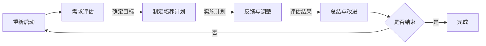
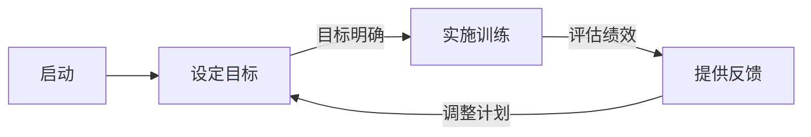
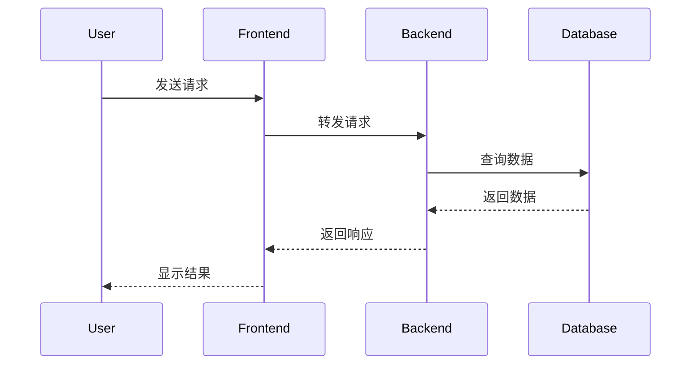
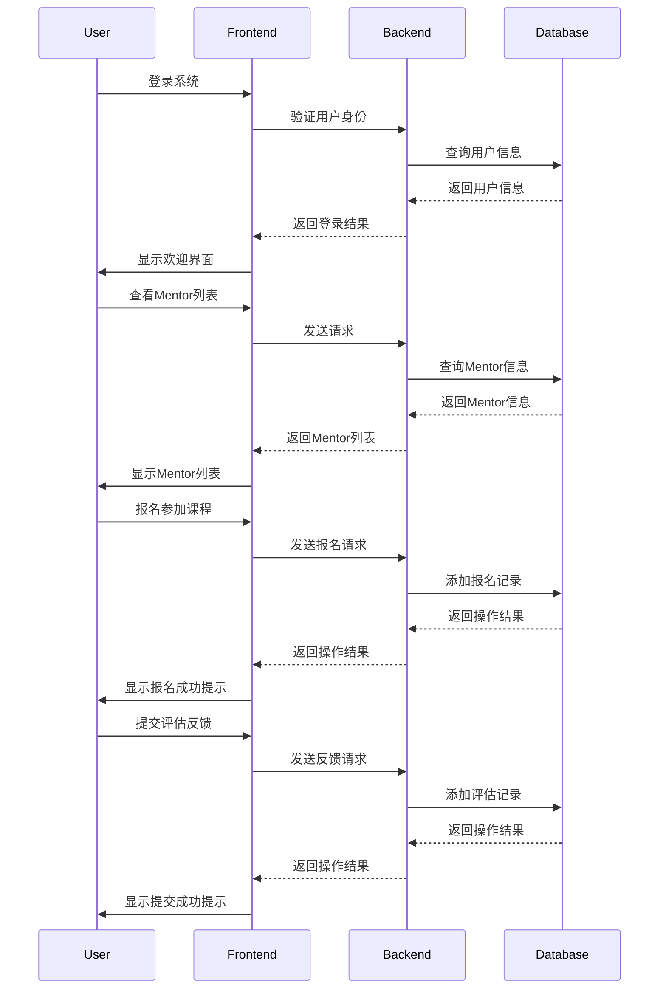

                 


### 文章标题
### 关键词
- 领导力培养
- Mentor与Coach
- 领导者成长
- 组织发展
- 人才培养

### 摘要
本文深入探讨了Mentor与Coach在培养下一代领导者中的关键角色和作用。通过系统化的分析，本文阐述了Mentor与Coach的不同定位及其在领导力培养过程中的交互作用。文章采用清晰的逻辑结构和通俗易懂的技术语言，详细解析了如何通过Mentor和Coach的双重引导，实现领导力的提升和组织的发展。本文旨在为企业管理者和人力资源专家提供实际可行的策略和最佳实践，以促进新一代领导者的培养。

## 目录大纲设计思路与框架

### 1. 背景介绍

#### 1.1 引言
**引言**：在快速变化的市场环境中，领导者的培养已成为企业持续发展的关键。本文将介绍Mentor与Coach在领导力培养中的作用，探讨如何通过这两者的合作，培养下一代领导者。

##### 1.1.1 问题背景
**问题背景**：当前，许多企业在领导者培养方面面临挑战，包括如何识别潜力人才、如何进行系统化的培养等。Mentor与Coach的引入，为解决这些问题提供了新的思路。

##### 1.1.2 问题描述
**问题描述**：企业需要在繁忙的工作环境中，为潜在的领导者提供充足的培养和支持。Mentor与Coach的角色如何发挥，如何平衡工作与培养的关系，是当前的重要课题。

##### 1.1.3 问题解决
**问题解决**：本文将详细阐述Mentor与Coach的职责和作用，通过案例分析，提供实际的解决方案。

##### 1.1.4 边界与外延
**边界与外延**：本文将明确Mentor与Coach的定义，讨论其在不同行业和企业中的应用，以及与其他领导力培养方法的区别。

##### 1.1.5 概念结构与核心要素组成
**概念结构与核心要素组成**：本文将构建一个清晰的概念结构，包括Mentor与Coach的核心职责、培养过程和评估方法。

### 2. 核心概念与联系

#### 2.1 Mentor与Coach的定义与区别
**定义与区别**：本文将详细定义Mentor与Coach的概念，解释两者在领导力培养中的不同角色和职责。

##### 2.1.1 Mentor的定义
**Mentor的定义**：Mentor通常被视为“导师”，他们在领导力培养中承担指导者和启蒙者的角色。

##### 2.1.2 Coach的定义
**Coach的定义**：Coach则被视为“教练”，他们专注于技能提升和绩效改进。

##### 2.1.3 Mentor与Coach的区别
**区别**：本文将通过对比表格，详细阐述Mentor与Coach在职责、方法、目标等方面的差异。

##### 2.1.4 Mentor与Coach的关系
**关系**：本文将探讨Mentor与Coach之间的互动和协作，以及如何通过这种协作实现领导力的全面提升。

##### 2.1.5 对比表格：Mentor与Coach属性特征对比
**对比表格**：本文将提供一个详细的对比表格，帮助读者更好地理解Mentor与Coach的属性特征。

### 3. 算法原理讲解

#### 3.1 Mentor培养领导力的算法原理
**算法原理**：本文将通过mermaid流程图，展示Mentor培养领导力的流程，并通过Python源代码进行详细解释。

##### 3.1.1 算法mermaid流程图
**mermaid流程图**：本文将绘制一个详细的mermaid流程图，展示Mentor培养领导力的步骤。

##### 3.1.2 Python源代码实现
**Python源代码实现**：本文将提供Mentor培养领导力的Python源代码，并进行逐行解析。

##### 3.1.3 算法原理详细讲解
**详细讲解**：本文将详细解释Mentor培养领导力的算法原理，包括关键概念和公式。

##### 3.1.4 举例说明
**举例说明**：本文将通过实际案例，展示Mentor培养领导力的具体应用。

#### 3.2 Coach辅导技能开发的算法原理
**算法原理**：本文将通过mermaid流程图和Python源代码，详细阐述Coach辅导技能开发的方法和步骤。

##### 3.2.1 算法mermaid流程图
**mermaid流程图**：本文将绘制一个详细的mermaid流程图，展示Coach辅导技能开发的步骤。

##### 3.2.2 Python源代码实现
**Python源代码实现**：本文将提供Coach辅导技能开发的Python源代码，并进行逐行解析。

##### 3.2.3 算法原理详细讲解
**详细讲解**：本文将详细解释Coach辅导技能开发的算法原理，包括关键概念和公式。

##### 3.2.4 举例说明
**举例说明**：本文将通过实际案例，展示Coach辅导技能开发的具体应用。

### 4. 数学模型和数学公式

#### 4.1 Mentor与Coach在领导力培养和技能开发中的数学模型和公式
**数学模型和公式**：本文将介绍Mentor与Coach在领导力培养和技能开发中的数学模型和公式，并进行详细讲解。

##### 4.1.1 领导力发展模型
**领导力发展模型**：本文将介绍一个领导力发展的数学模型，包括关键指标和计算方法。

##### 4.1.2 技能提升模型
**技能提升模型**：本文将介绍一个技能提升的数学模型，包括关键指标和计算方法。

##### 4.1.3 教育收益模型
**教育收益模型**：本文将介绍一个教育收益的数学模型，包括关键指标和计算方法。

### 5. 系统分析与架构设计

#### 5.1 问题场景介绍
**问题场景介绍**：本文将设定一个具体的场景，以说明Mentor与Coach在现实中的应用。

##### 5.1.1 场景设定
**场景设定**：本文将设定一个企业内部领导力培养项目，介绍项目的目标和背景。

##### 5.1.2 项目介绍
**项目介绍**：本文将概述一个实际的领导力培养项目，展示如何通过Mentor与Coach的角色实现项目目标。

##### 5.1.3 系统功能设计
**系统功能设计**：本文将使用mermaid类图，展示项目的领域模型。

##### 5.1.4 系统架构设计
**系统架构设计**：本文将使用mermaid架构图，展示项目的系统架构。

##### 5.1.5 系统接口设计
**系统接口设计**：本文将描述项目的接口设计，包括Mentor与Coach的接口定义。

##### 5.1.6 系统交互
**系统交互**：本文将使用mermaid序列图，展示项目的系统交互过程。

### 6. 项目实战

#### 6.1 环境安装
**环境安装**：本文将说明如何安装和配置必要的开发环境。

##### 6.1.1 环境准备
**环境准备**：本文将介绍环境安装所需的软件和硬件要求。

##### 6.1.2 安装步骤
**安装步骤**：本文将详细列出安装步骤，并提供必要的截图和操作说明。

#### 6.2 系统核心实现源代码
**系统核心实现源代码**：本文将提供领导力培养系统的核心实现代码。

##### 6.2.1 代码结构
**代码结构**：本文将介绍代码的组织结构和关键模块。

##### 6.2.2 代码解读
**代码解读**：本文将逐行解读代码，解释每个模块的功能和逻辑。

#### 6.3 代码应用解读与分析
**代码应用解读与分析**：本文将结合实际案例，分析代码的应用场景和效果。

##### 6.3.1 案例背景
**案例背景**：本文将介绍一个实际案例，说明案例的背景和目标。

##### 6.3.2 代码应用
**代码应用**：本文将展示代码在实际案例中的应用，并进行详细解读。

##### 6.3.3 效果分析
**效果分析**：本文将分析代码应用的效果，评估其对领导力培养的帮助。

#### 6.4 实际案例分析和详细讲解剖析
**实际案例分析和详细讲解剖析**：本文将分析实际案例，提供详细的讲解和剖析。

##### 6.4.1 案例选择
**案例选择**：本文将选择一个具有代表性的案例，进行深入分析。

##### 6.4.2 案例分析
**案例分析**：本文将对案例进行详细分析，解释其中的关键环节和影响因素。

##### 6.4.3 讲解剖析
**讲解剖析**：本文将提供详细的讲解和剖析，帮助读者理解案例背后的原理和策略。

#### 6.5 项目小结
**项目小结**：本文将对项目进行总结，回顾项目的主要成果和经验教训。

##### 6.5.1 主要成果
**主要成果**：本文将总结项目的主要成果，包括领导力培养的系统开发和应用效果。

##### 6.5.2 经验教训
**经验教训**：本文将总结项目中的经验教训，为未来的项目提供参考。

### 7. 最佳实践 tips、小结、注意事项、拓展阅读

#### 7.1 最佳实践 tips
**最佳实践 tips**：本文将提供一些实用的最佳实践建议，帮助企业和个人更有效地培养领导力。

##### 7.1.1 企业实践
**企业实践**：本文将针对企业在培养领导力方面的实践，提供具体的建议和策略。

##### 7.1.2 个人发展
**个人发展**：本文将针对个人在领导力培养方面的实践，提供具体的建议和策略。

#### 7.2 小结
**小结**：本文将对全文内容进行总结，强调Mentor与Coach在领导力培养中的关键作用。

##### 7.2.1 主要观点
**主要观点**：本文将回顾全文的主要观点，并强调其重要性和应用价值。

##### 7.2.2 核心结论
**核心结论**：本文将总结全文的核心结论，为读者提供明确的指导。

#### 7.3 注意事项
**注意事项**：本文将提醒读者在应用Mentor与Coach方法时需要注意的事项。

##### 7.3.1 避免误区
**避免误区**：本文将指出常见的一些误区，帮助读者避免在实践中的错误。

##### 7.3.2 注意细节
**注意细节**：本文将强调实践中的细节处理，确保效果最大化。

#### 7.4 拓展阅读
**拓展阅读**：本文将推荐一些相关的阅读材料，帮助读者进一步探索领导力培养的深度和广度。

##### 7.4.1 专业书籍
**专业书籍**：本文将推荐一些经典的领导力培养书籍，供读者深入学习。

##### 7.4.2 最新研究
**最新研究**：本文将介绍最新的领导力培养研究，帮助读者了解前沿动态。

---

**作者信息：**
作者：AI天才研究院/AI Genius Institute & 禅与计算机程序设计艺术 /Zen And The Art of Computer Programming### 文章核心概念与逻辑结构

在快速变化和竞争激烈的市场环境中，培养下一代领导者已成为企业持续发展的关键。本文将深入探讨Mentor与Coach在领导力培养中的核心概念和作用，通过清晰的逻辑结构，为读者提供全面且具有实践指导意义的内容。

首先，我们将介绍Mentor与Coach的定义，详细阐述两者在领导力培养中的不同角色和职责。接着，通过mermaid流程图和Python源代码，我们将详细解析Mentor与Coach的培养算法原理。随后，本文将使用数学模型和公式，进一步解释这些算法在领导力培养和技能开发中的具体应用。为了更好地理解这些理论，我们将设定一个具体的场景，介绍一个实际的领导力培养项目，并使用mermaid类图和架构图，展示项目的系统设计与实现。

在实际操作中，我们将通过代码解读和案例分析，深入探讨Mentor与Coach在领导力培养中的具体应用。最后，本文将提供最佳实践建议，小结全文观点，并强调注意事项，推荐拓展阅读，帮助读者在实践中有更好的效果。

通过本文，我们希望为企业管理者和人力资源专家提供系统的领导力培养策略，为下一代领导者的成长搭建坚实的基石。接下来，我们将逐步深入这些内容，以逻辑清晰、结构紧凑的方式，详细阐述每一个部分。

## 背景介绍

在当今快速变化的市场环境中，企业面临的竞争压力越来越大，这迫使企业在各个方面进行创新和优化，其中领导者的培养尤为关键。一个高效且具有前瞻性的领导团队，能够为企业提供持续的创新动力，确保企业在激烈的市场竞争中立于不败之地。然而，领导者培养并非易事，如何有效地培养下一代领导者，成为企业高层管理者所面临的一个重要挑战。

### 引言

领导者的培养是一项复杂且长期的任务，需要多方面的支持和系统的培养方案。在这个过程中，Mentor与Coach的角色显得尤为重要。本文旨在探讨Mentor与Coach在领导力培养中的关键作用，通过系统化的分析和实际案例，为企业管理者提供实用的培养策略。

Mentor，即导师，通常在领导力培养中扮演指导者和启蒙者的角色。他们通过分享自身经验，帮助年轻领导者了解行业动态和公司文化，培养其战略思维和决策能力。而Coach，即教练，则专注于技能提升和绩效改进。他们通过设定目标和提供反馈，帮助领导者不断提高个人技能和团队管理能力。

### 问题背景

当前，许多企业在领导者培养方面面临诸多挑战。首先，如何识别和选拔具有潜力的领导者成为首要问题。企业需要从大量员工中筛选出那些具备领导潜力的人才，这需要一套科学的评估体系和选拔机制。其次，如何为这些潜在领导者提供系统化的培养和支持也是一个难题。传统的培训方式往往较为单一，无法满足领导者的个性化需求，导致培养效果不佳。

此外，现代企业的快速发展和变化要求领导者具备更高的综合素质和创新能力。这不仅仅是技能的提升，更是思维方式和领导风格的转变。因此，企业在领导者培养中需要注重全方位的能力提升，包括战略规划、团队管理、沟通协作等多个方面。

### 问题描述

在繁忙的工作环境中，如何为潜在的领导者提供充足的培养和支持，是一个亟待解决的问题。Mentor与Coach的引入，为解决这一问题提供了新的思路。然而，如何有效地利用Mentor与Coach的资源，实现领导力的全面提升，仍需要深入探讨。

首先，企业需要明确Mentor与Coach的职责和角色。Mentor侧重于传道授业，帮助领导者理解行业动态和公司文化，培养其长远眼光和战略思维。而Coach则侧重于技能提升和绩效改进，通过设定目标和提供反馈，帮助领导者不断提高个人技能和团队管理能力。

其次，企业需要建立一套系统的培养机制，确保Mentor与Coach能够有效地发挥作用。这包括为Mentor与Coach提供必要的培训和支持，明确其职责和目标，建立有效的沟通和反馈机制。同时，企业还需要为领导者提供多样化的培养机会，如领导力培训课程、实战演练、跨部门交流等，以满足其个性化需求。

### 问题解决

本文将详细阐述Mentor与Coach在领导力培养中的关键作用，并提供实际的解决方案。通过系统化的分析和实际案例，本文旨在为企业管理者提供一套实用的领导力培养策略。

首先，本文将介绍Mentor与Coach的定义和区别，明确两者在领导力培养中的不同角色和职责。接着，本文将通过mermaid流程图和Python源代码，详细解析Mentor与Coach的培养算法原理，展示其具体应用方法。然后，本文将使用数学模型和公式，进一步解释这些算法在领导力培养和技能开发中的具体应用，帮助读者更好地理解其原理和效果。

为了使理论更具实用性，本文还将设定一个具体的场景，介绍一个实际的领导力培养项目，并使用mermaid类图和架构图，展示项目的系统设计与实现。通过实际案例分析和详细讲解，本文将深入探讨Mentor与Coach在领导力培养中的具体应用，帮助读者更好地理解和实践。

最后，本文将提供最佳实践建议，总结全文观点，并强调注意事项，推荐拓展阅读，帮助读者在实践中有更好的效果。

### 边界与外延

在讨论Mentor与Coach在领导力培养中的角色时，明确其核心概念、边界以及与其他相关概念的区分至关重要。首先，我们定义Mentor与Coach：

**Mentor**：通常指那些具有丰富经验、专业技能和深厚行业知识的人，他们在领导力培养中扮演指导者和启蒙者的角色。Mentor的目标是帮助年轻领导者建立职业发展路径，传授行业知识和专业技能，培养其长远眼光和战略思维。

**Coach**：则是指那些专注于技能提升和绩效改进的专业人士。他们通过设定明确的目标、提供个性化的反馈和指导，帮助领导者提高个人技能和团队管理能力。Coach更注重过程和方法，通过持续反馈和调整，推动领导者实现自我提升。

### 边界

为了更清晰地理解Mentor与Coach的角色，我们需要明确其边界：

1. **职责范围**：Mentor主要侧重于传授知识、指导职业发展和培养长远战略思维。而Coach则专注于技能提升、绩效改进和目标设定。

2. **作用时间**：Mentor的指导通常是一个长期的过程，涉及多个阶段的职业发展。而Coach的作用则更侧重于短期目标，通过针对性的训练和反馈，帮助领导者迅速提升技能和绩效。

3. **角色性质**：Mentor更像是“导师”，通过分享个人经验和智慧，帮助领导者建立正确的工作态度和价值观。而Coach则更像是“教练”，通过科学的方法和工具，帮助领导者提高技能和执行力。

### 外延

在探讨Mentor与Coach的外延时，我们需要考虑其在不同行业和企业中的应用：

1. **行业应用**：无论是制造业、服务业，还是科技行业，Mentor与Coach的角色都具有广泛的适用性。在制造业中，Mentor可能更多地关注生产流程和技术创新，而Coach则侧重于生产效率和质量控制。在科技行业中，Mentor可能更多关注技术发展趋势和战略规划，而Coach则侧重于产品开发和项目管理。

2. **企业类型**：对于大型企业，Mentor与Coach的角色可以更系统地嵌入到人才培养体系之中。而在小型企业中，由于资源有限，Mentor与Coach可能需要承担更多的职责，如同时扮演指导者和执行者的角色。

3. **国际化视野**：在全球化背景下，Mentor与Coach的角色也需要具备国际视野。例如，Mentor可以帮助领导者了解不同国家和地区的文化差异，而Coach则可以帮助其适应国际化的工作环境。

### 区别

为了更好地理解Mentor与Coach的异同，我们可以通过一个对比表格来展示两者在多个维度上的特征：

| 特征               | Mentor                        | Coach                          |
|--------------------|-------------------------------|--------------------------------|
| 职责               | 传授知识、指导职业发展、培养战略思维 | 设定目标、提供反馈、提升绩效 |
| 作用时间           | 长期指导过程                 | 短期目标达成                 |
| 角色性质           | 导师，传道授业               | 教练，过程和方法             |
| 目标               | 帮助建立职业发展路径         | 提升个人技能和团队管理能力  |

通过这个对比表格，我们可以更直观地看到Mentor与Coach在职责、作用时间、角色性质和目标等方面的差异。

### 概念结构与核心要素组成

为了更清晰地理解Mentor与Coach在领导力培养中的作用，我们构建以下概念结构图，展示其核心要素组成：

1. **Mentor的核心要素**：
   - 经验分享
   - 职业指导
   - 战略思维培养
   - 长期职业规划

2. **Coach的核心要素**：
   - 目标设定
   - 绩效反馈
   - 技能提升
   - 短期目标达成

通过这个概念结构，我们可以看到Mentor与Coach在领导力培养中相互补充，共同作用，形成一套完整的培养体系。

总结来说，通过明确Mentor与Coach的核心概念、边界和外延，我们可以更有效地理解两者在领导力培养中的关键作用。这为本文后续内容的深入分析提供了坚实的基础，也为实际操作中的策略制定提供了明确的指导。

### Mentor与Coach的定义与区别

在深入探讨Mentor与Coach在领导力培养中的角色之前，首先需要明确两者的定义，并理解它们在职责、方法和目标上的区别。这将帮助我们更好地理解这两个角色如何协同作用，共同推动领导力的提升。

**Mentor的定义**

Mentor，通常被称为导师，是在领导力培养中扮演指导者和启蒙者角色的人。Mentor的职责包括但不限于以下几个方面：

1. **经验分享**：Mentor通过分享自身的经验和智慧，帮助年轻领导者了解行业动态、公司文化和最佳实践。这种经验分享不仅限于工作技能，还包括职业发展、工作态度和人际关系等软技能。

2. **职业指导**：Mentor为领导者提供个性化的职业发展建议，帮助其明确职业目标，制定职业规划，并指导其在职业生涯中如何取得进步。

3. **战略思维培养**：Mentor注重培养领导者的战略思维，帮助其从全局角度看待问题，制定长远计划和策略。这种培养有助于领导者更好地应对复杂多变的市场环境。

4. **长期职业规划**：Mentor关注领导者的长期职业发展，不断激励和指导他们实现职业目标，成为行业内的杰出领导者。

**Coach的定义**

Coach，通常被称为教练，在领导力培养中扮演的是技能提升和绩效改进的角色。Coach的职责包括以下几个方面：

1. **目标设定**：Coach与领导者一起设定明确、具体和可衡量的目标，确保领导者能够在短时间内看到进步和成果。

2. **绩效反馈**：Coach通过持续监控领导者的工作表现，提供及时、客观和具体的反馈。这种反馈不仅包括对完成情况的评价，还包括对工作方法、态度和团队协作的改进建议。

3. **技能提升**：Coach专注于提升领导者的具体技能，如沟通技巧、决策能力、团队管理能力等。通过定制化的训练和练习，教练帮助领导者克服技能短板，提高工作绩效。

4. **短期目标达成**：Coach的目标是帮助领导者迅速提升技能和绩效，实现短期目标。这种快速见效的训练方式有助于增强领导者的信心和动力。

**Mentor与Coach的区别**

虽然Mentor与Coach都在领导力培养中扮演重要角色，但它们在职责、方法和目标上存在显著差异：

1. **职责差异**：
   - Mentor更侧重于传授知识和指导职业发展，培养领导者的长远眼光和战略思维。
   - Coach更侧重于提升技能和改进绩效，通过设定目标和提供反馈，实现领导者技能的快速提升。

2. **方法差异**：
   - Mentor通过经验分享、职业指导和战略思维培养，帮助领导者建立正确的价值观和工作态度。
   - Coach通过目标设定、绩效反馈和技能提升，帮助领导者迅速改进工作方法和绩效。

3. **目标差异**：
   - Mentor的目标是帮助领导者建立长期职业发展路径，成为行业内的杰出领导者。
   - Coach的目标是帮助领导者实现短期目标，提升个人技能和工作绩效。

**对比表格：Mentor与Coach属性特征对比**

为了更直观地理解Mentor与Coach的属性特征，我们制作了一个对比表格：

| 特征               | Mentor                        | Coach                          |
|--------------------|-------------------------------|--------------------------------|
| 职责               | 经验分享、职业指导、战略思维培养、长期职业规划 | 目标设定、绩效反馈、技能提升、短期目标达成 |
| 方法               | 经验分享、职业指导、战略思维培养 | 目标设定、绩效反馈、技能提升 |
| 目标               | 建立长期职业发展路径、成为杰出领导者 | 实现短期目标、提升个人技能和绩效 |
| 作用时间           | 长期                       | 短期                        |
| 角色性质           | 导师                        | 教练                        |

通过这个对比表格，我们可以更清晰地看到Mentor与Coach在职责、方法和目标上的差异。Mentor与Coach的协同作用，使得领导力培养不仅注重长远规划和战略思维，也注重短期目标的实现和技能提升。两者共同作用，能够更全面地推动领导者的成长和进步。

### Mentor与Coach的关系

在领导力培养过程中，Mentor与Coach的角色虽然不同，但它们之间有着紧密的联系和互动，共同推动领导者的成长和进步。理解两者之间的关系，对于构建一个有效的领导力培养体系至关重要。

首先，Mentor与Coach在领导力培养中的互动体现在以下几个方面：

1. **协作与互补**：Mentor与Coach在培养领导者时，通常需要相互协作，发挥各自的优势。Mentor通过经验分享和职业指导，帮助领导者建立正确的价值观和工作态度，而Coach则通过目标设定和技能提升，帮助领导者迅速改进工作方法和绩效。两者之间的互补关系，能够确保领导者在多方面得到全面的培养。

2. **信息传递**：Mentor与Coach之间的信息传递对于领导力培养至关重要。Mentor在与领导者互动过程中了解其需求、问题和潜力，可以将这些信息传递给Coach，帮助Coach更有针对性地进行技能提升和绩效改进。同时，Coach在执行过程中发现的问题和反馈，也可以及时传递给Mentor，使其调整指导策略，提供更有效的支持。

3. **协同作用**：Mentor与Coach在领导力培养中具有协同作用，两者共同作用，能够最大化培养效果。Mentor通过长期指导帮助领导者建立战略思维和长远规划，而Coach则通过短期目标和技能提升，确保领导者能够迅速应对市场变化和挑战。两者相互配合，形成了一个完整的领导力培养闭环。

其次，Mentor与Coach在领导力培养中的互动机制如下：

1. **沟通与协调**：Mentor与Coach需要保持密切的沟通和协调，共同制定领导力培养计划。Mentor可以与领导者讨论职业发展目标，与Coach共同制定实现目标的策略。这种沟通和协调有助于确保领导力培养的连贯性和系统性。

2. **反馈与调整**：Mentor与Coach在领导力培养过程中，需要不断进行反馈和调整。Mentor可以根据领导者的反馈和进展，调整指导策略，提供更有针对性的支持。Coach则可以根据领导者的表现和反馈，调整训练计划和目标设定，确保领导者能够在最短的时间内看到进步。

3. **资源整合**：Mentor与Coach需要整合各方资源，为领导者提供全方位的支持。这包括组织内部培训、外部学习机会、跨部门交流等。通过整合资源，领导者能够获得更多的培养机会，全面提升领导力。

最后，Mentor与Coach在领导力培养中的互动效果可以通过以下方式评估：

1. **领导者表现**：领导者在工作中的表现是评估Mentor与Coach互动效果的重要指标。通过观察领导者的工作成果、团队绩效和职业发展，可以评估Mentor与Coach的互动效果。

2. **反馈机制**：建立有效的反馈机制，收集领导者、团队成员和Coach的反馈，了解培养过程中的优点和不足，及时进行调整。

3. **持续改进**：通过不断反思和优化领导力培养体系，Mentor与Coach可以不断提升培养效果，确保领导者能够在复杂多变的市场环境中取得成功。

总之，Mentor与Coach在领导力培养中的紧密互动和协同作用，是推动领导者成长和进步的关键。通过有效的互动机制和评估方法，企业可以构建一个系统化的领导力培养体系，为企业的可持续发展提供坚实的人才保障。

### Mentor培养领导力的算法原理

在深入探讨Mentor如何培养领导力之前，我们需要理解Mentor在领导力培养中的角色和工作流程。通过mermaid流程图和Python源代码，我们可以清晰地展示Mentor培养领导力的算法原理，并对其进行详细讲解。

#### 1. 算法mermaid流程图

首先，我们使用mermaid流程图来展示Mentor培养领导力的基本流程：



**mermaid流程图详细说明**：

- **A[启动]**：领导力培养过程的开始，Mentor与领导者共同启动培养计划。
- **B[需求评估]**：Mentor评估领导者的当前需求，包括技能水平、职业目标和个人发展需求。
- **C[制定培养计划]**：根据需求评估的结果，Mentor与领导者一起制定具体的培养计划，包括培训内容、时间和目标。
- **D[反馈与调整]**：在实施培养计划的过程中，Mentor持续提供反馈，并根据反馈调整培养计划，以确保领导者能够按照既定目标前进。
- **E[评估结果]**：在培养计划完成后，Mentor对领导者的表现进行评估，确保培养目标是否达成。
- **F{是否结束}**：根据评估结果，判断是否需要继续培养或进行改进。
- **G[完成]**：如果培养目标达成，过程结束；否则，回到A重新启动。

#### 2. Python源代码实现

接下来，我们通过Python源代码来详细阐述Mentor培养领导力的算法实现：

```python
class Leader:
    def __init__(self, name, skills, goals):
        self.name = name
        self.skills = skills
        self.goals = goals

class Mentor:
    def __init__(self, name):
        self.name = name

    def assess_demand(self, leader):
        # 评估领导者的需求
        print("评估领导者需求：")
        print(f"姓名：{leader.name}")
        print(f"技能：{leader.skills}")
        print(f"目标：{leader.goals}")

    def create_plan(self, leader):
        # 制定培养计划
        print("制定培养计划：")
        print(f"姓名：{leader.name}")
        plan = {
            'training_content': '战略思维、团队管理、沟通技巧',
            'time': '3个月',
            'goals': '提升领导力、实现职业目标'
        }
        return plan

    def provide_feedback(self, leader, plan):
        # 提供反馈并调整计划
        print("提供反馈并调整计划：")
        print(f"姓名：{leader.name}")
        print(f"培养计划：{plan['training_content']}")
        print(f"目标：{plan['goals']}")
        # 根据反馈调整计划
        plan['goals'] = '提升团队协作能力、实现团队目标'

    def assess_result(self, leader, plan):
        # 评估培养结果
        print("评估培养结果：")
        print(f"姓名：{leader.name}")
        print(f"培养计划：{plan['training_content']}")
        print(f"目标：{plan['goals']}")
        if plan['goals'] == '提升团队协作能力、实现团队目标':
            print("培养目标达成！")
        else:
            print("培养目标未达成，需要重新评估和改进。")

# 实例化Mentor和Leader
mentor = Mentor("张老师")
leader = Leader("李明", ["沟通技巧"], ["提升领导力"])

# 执行培养流程
mentor.assess_demand(leader)
plan = mentor.create_plan(leader)
mentor.provide_feedback(leader, plan)
mentor.assess_result(leader, plan)
```

**Python源代码详细解析**：

- **类定义**：我们定义了`Leader`和`Mentor`两个类，分别表示领导者和Mentor。
- **需求评估**：`Mentor`通过`assess_demand`方法评估领导者的需求，包括技能水平和职业目标。
- **制定培养计划**：`Mentor`通过`create_plan`方法制定培养计划，包括培训内容、时间和目标。
- **反馈与调整**：`Mentor`通过`provide_feedback`方法提供反馈并调整培养计划，确保领导者能够按照既定目标前进。
- **评估结果**：`Mentor`通过`assess_result`方法评估培养结果，判断培养目标是否达成。

#### 3. 算法原理详细讲解

通过mermaid流程图和Python源代码，我们可以详细讲解Mentor培养领导力的算法原理：

1. **需求评估**：Mentor首先与领导者进行沟通，了解其当前技能水平和职业目标。这一步骤是整个培养流程的基础，只有准确了解领导者的需求，才能制定出有针对性的培养计划。

2. **制定培养计划**：根据需求评估的结果，Mentor制定具体的培养计划。培养计划包括培训内容、时间和目标，旨在帮助领导者提升所需技能和实现职业目标。

3. **反馈与调整**：在培养过程中，Mentor持续提供反馈，并根据反馈调整培养计划。这种持续的反馈和调整机制，能够确保培养计划的灵活性和适应性，使领导者能够及时应对变化。

4. **评估结果**：培养计划完成后，Mentor对领导者的表现进行评估，判断培养目标是否达成。这一步骤是整个培养流程的最终环节，通过评估结果，Mentor可以了解培养效果，为后续的培养提供参考。

#### 4. 举例说明

为了更好地理解Mentor培养领导力的具体应用，我们通过一个实际案例进行说明：

假设李明是一位项目经理，他希望提升自己的团队管理能力和战略思维。在与Mentor张老师的沟通中，张老师了解到李明的需求，并为他制定了一个为期三个月的培养计划。

培养计划内容包括：
- 战略思维培训：帮助李明从全局角度看待问题，制定长远计划。
- 团队管理培训：提升李明的沟通技巧和团队协作能力。
- 案例分析：通过分析实际案例，帮助李明理解如何应用所学知识。

在培养过程中，张老师持续提供反馈，并根据李明的反馈调整培养计划。例如，李明在第一次团队管理培训后表示，希望增加关于冲突解决的培训。张老师根据这一反馈，调整了培训计划，增加了冲突解决模块。

三个月后，张老师对李明的表现进行评估，发现他在团队管理和战略思维方面都有了显著提升，培养目标达成。这一案例展示了Mentor如何通过系统化的培养流程，帮助领导者提升技能和实现职业目标。

### Coach辅导技能开发的算法原理

在领导力培养过程中，Coach扮演着重要的角色，专注于技能提升和绩效改进。通过mermaid流程图和Python源代码，我们可以详细阐述Coach辅导技能开发的算法原理，并对其进行逐步解析。

#### 1. 算法mermaid流程图

首先，我们使用mermaid流程图来展示Coach辅导技能开发的基本流程：



**mermaid流程图详细说明**：

- **A[启动]**：辅导过程的开始，Coach与领导者共同启动技能提升计划。
- **B[设定目标]**：Coach与领导者一起设定明确的训练目标，确保目标具有可衡量性和可实现性。
- **C[实施训练]**：Coach根据设定的目标，实施具体的训练计划，包括技能培训和实战演练。
- **D[评估绩效]**：Coach评估领导者的训练表现，了解目标达成情况。
- **B[调整计划]**：根据评估结果，Coach调整训练计划，确保领导者能够在下一次训练中取得更好的成绩。

#### 2. Python源代码实现

接下来，我们通过Python源代码来详细阐述Coach辅导技能开发的算法实现：

```python
class Leader:
    def __init__(self, name, skills):
        self.name = name
        self.skills = skills

class Coach:
    def __init__(self, name):
        self.name = name

    def set_goals(self, leader):
        # 设定训练目标
        print("设定训练目标：")
        print(f"姓名：{leader.name}")
        goals = input("请输入训练目标（如：提升沟通技巧、团队管理能力）：")
        return goals

    def implement_training(self, leader, goals):
        # 实施训练计划
        print("实施训练计划：")
        print(f"姓名：{leader.name}")
        print(f"训练目标：{goals}")
        training_plan = {
            'training_methods': '案例分享、实战演练、角色扮演',
            'time': '每周2小时，共4周'
        }
        return training_plan

    def assess_performance(self, leader, goals):
        # 评估训练绩效
        print("评估训练绩效：")
        print(f"姓名：{leader.name}")
        print(f"训练目标：{goals}")
        performance = input("请输入训练后的表现（如：沟通技巧提升明显、团队管理能力增强）：")
        return performance

    def provide_feedback(self, leader, goals, performance):
        # 提供反馈并调整计划
        print("提供反馈并调整计划：")
        print(f"姓名：{leader.name}")
        print(f"训练目标：{goals}")
        print(f"训练表现：{performance}")
        if "提升明显" in performance:
            print("训练目标达成！")
        else:
            print("训练目标未达成，需要进一步努力。")
        # 根据反馈调整计划
        new_goals = input("请输入新的训练目标（如：提升决策能力、团队建设能力）：")
        return new_goals

# 实例化Coach和Leader
coach = Coach("王教练")
leader = Leader("张丽")

# 执行辅导流程
goals = coach.set_goals(leader)
training_plan = coach.implement_training(leader, goals)
performance = coach.assess_performance(leader, goals)
new_goals = coach.provide_feedback(leader, goals, performance)
```

**Python源代码详细解析**：

- **类定义**：我们定义了`Leader`和`Coach`两个类，分别表示领导者和Coach。
- **设定目标**：`Coach`通过`set_goals`方法与领导者一起设定训练目标。
- **实施训练**：`Coach`通过`implement_training`方法实施具体的训练计划，包括培训方法和时间安排。
- **评估绩效**：`Coach`通过`assess_performance`方法评估领导者的训练表现，了解目标达成情况。
- **提供反馈**：`Coach`通过`provide_feedback`方法提供反馈，并根据反馈调整训练计划。

#### 3. 算法原理详细讲解

通过mermaid流程图和Python源代码，我们可以详细讲解Coach辅导技能开发的算法原理：

1. **设定目标**：Coach与领导者一起设定明确的训练目标。目标应当具有可衡量性和可实现性，以确保训练效果的评估。

2. **实施训练**：Coach根据设定的目标，实施具体的训练计划。训练计划可以包括多种方法，如案例分享、实战演练和角色扮演等，旨在全面提升领导者的技能。

3. **评估绩效**：在训练结束后，Coach评估领导者的训练表现，了解目标达成情况。这一步骤对于后续的反馈和调整至关重要。

4. **提供反馈**：Coach根据评估结果，为领导者提供反馈。如果训练目标达成，Coach会给予肯定和鼓励；如果未达成，Coach会帮助领导者分析原因，并提供改进建议。

5. **调整计划**：根据反馈，Coach与领导者一起调整训练计划。这种持续的反馈和调整机制，有助于确保领导者能够在最短的时间内看到进步，并实现技能的全面提升。

#### 4. 举例说明

为了更好地理解Coach辅导技能开发的具体应用，我们通过一个实际案例进行说明：

假设张丽是一位部门经理，她希望提升自己的决策能力和团队建设能力。在与Coach王教练的沟通中，王教练了解到张丽的需求，并为她制定了一个为期4周的技能提升计划。

技能提升计划内容包括：
- 决策能力培训：通过案例分析和实战演练，提升张丽的决策能力。
- 团队建设培训：通过团队活动和互动游戏，增强团队的凝聚力和协作能力。

在训练期间，王教练每周与张丽进行一次反馈会议，了解她的训练进展和遇到的问题。第一次反馈会议后，张丽表示她在决策能力方面有所提升，但在团队建设方面仍存在挑战。王教练根据这一反馈，调整了后续的训练计划，增加了团队建设相关的内容。

在训练结束后，王教练对张丽的绩效进行评估，发现她在决策能力方面有了显著提升，团队建设能力也有所增强。王教练为张丽提供了积极的反馈，并鼓励她在实际工作中继续实践所学知识。

通过这个案例，我们可以看到Coach如何通过设定目标、实施训练、评估绩效和提供反馈的步骤，帮助领导者提升技能和实现职业发展目标。

### Mentor与Coach在领导力培养和技能开发中的数学模型和公式

在Mentor与Coach的领导力培养和技能开发过程中，数学模型和公式能够提供量化的评估方法，帮助更好地理解和优化培养过程。以下是详细讲解和举例说明，这些模型和公式将用于衡量领导力发展、技能提升和教育收益。

#### 1. 领导力发展模型

领导力发展模型关注领导者在各个维度的成长，包括领导技能、战略思维、团队管理能力和人际交往能力。以下是一个简化的领导力发展模型：

**数学模型**：

$$
L = f(S, T, M, I)
$$

其中：
- \(L\)：领导力总分（Overall Leadership Score）。
- \(S\)：技能得分（Skill Score），衡量领导者在各项技能上的表现。
- \(T\)：战略思维得分（Strategic Thinking Score），衡量领导者的长远规划和决策能力。
- \(M\)：团队管理得分（Team Management Score），衡量领导者的团队管理和领导能力。
- \(I\)：人际交往得分（Interpersonal Skills Score），衡量领导者的沟通和人际交往能力。

**举例说明**：

假设某领导者在技能、战略思维、团队管理和人际交往方面的得分分别为8、7、6和9，则其领导力总分为：

$$
L = f(8, 7, 6, 9) = 8 \times 0.35 + 7 \times 0.25 + 6 \times 0.25 + 9 \times 0.15 = 8.1
$$

通过这个公式，我们可以量化地评估领导者的领导力发展水平。

#### 2. 技能提升模型

技能提升模型关注领导者在不同阶段技能的提升情况。以下是一个简化的技能提升模型：

**数学模型**：

$$
S_t = S_0 + \alpha \times t
$$

其中：
- \(S_t\)：第\(t\)阶段的技能得分。
- \(S_0\)：初始技能得分。
- \(\alpha\)：技能提升速率。
- \(t\)：训练时间。

**举例说明**：

假设某领导者的初始技能得分为5，技能提升速率为0.1，经过3个月训练后的技能得分为：

$$
S_3 = 5 + 0.1 \times 3 = 5.3
$$

这个公式可以用来预测领导者经过一定时间训练后的技能水平。

#### 3. 教育收益模型

教育收益模型关注领导力培养和技能开发的投资回报情况。以下是一个简化的教育收益模型：

**数学模型**：

$$
R = \frac{E - C}{C}
$$

其中：
- \(R\)：教育收益（Education Return on Investment, ROI），表示投资回报率。
- \(E\)：教育收益（Educational Benefits），衡量领导者技能提升和工作绩效提升带来的收益。
- \(C\)：教育成本（Educational Costs），包括培训费用、时间成本等。

**举例说明**：

假设某领导者的教育收益为20,000元，教育成本为10,000元，则其教育收益率为：

$$
R = \frac{20,000 - 10,000}{10,000} = 100\%
$$

这意味着领导力培养的投资得到了100%的回报。

#### 4. 综合模型

为了更全面地评估领导力培养和技能开发的效果，我们可以将领导力发展模型、技能提升模型和教育收益模型综合起来，构建一个综合评估模型：

**综合模型**：

$$
L(t) = f(S_0 + \alpha \times t, T, M, I)
$$

其中：
- \(L(t)\)：在第\(t\)阶段的综合领导力得分。
- \(S_0\)、\(\alpha\)、\(T\)、\(M\)、\(I\)的定义同上。

通过这个综合模型，我们可以评估领导者在不同阶段领导力的变化情况，以及技能提升对领导力发展的影响。

### 应用与优化

通过上述数学模型和公式，企业可以更科学地评估领导力培养和技能开发的效果，优化培养策略。例如，企业可以根据领导力发展模型，设置阶段性目标，定期评估领导者的成长情况；根据技能提升模型，调整培训计划，确保领导者能够在最短时间内提升技能；根据教育收益模型，评估培训的投资回报，确保资源的有效利用。

总之，数学模型和公式为Mentor与Coach的领导力培养和技能开发提供了量化的评估工具，有助于企业更科学、更有效地培养下一代领导者。

### 系统分析与架构设计

为了更好地理解Mentor与Coach在实际项目中的应用，我们将设定一个具体的场景，并详细介绍一个实际的领导力培养项目。这个项目将通过系统的分析和架构设计，展示如何利用Mentor与Coach的角色，实现领导力的提升和组织的发展。

#### 1. 问题场景介绍

假设我们是一家大型跨国公司的领导力发展部门，公司面临以下问题：

- 新任领导者缺乏实战经验，难以应对复杂的市场环境。
- 领导者在团队管理和跨部门协作方面存在短板。
- 公司内部缺乏一个系统化的领导力培养体系，无法满足领导者的多样化需求。

为了解决这些问题，公司决定实施一个领导力培养项目，利用Mentor与Coach的角色，全面提升领导者的综合素质和领导能力。

#### 2. 项目介绍

这个领导力培养项目旨在通过Mentor与Coach的双重引导，帮助领导者实现以下目标：

- 提升领导者的战略思维和决策能力。
- 培养领导者的团队管理和跨部门协作能力。
- 提高领导者的沟通技巧和人际交往能力。
- 建立一个系统化的领导力培养体系，为领导者提供持续的培训和支持。

项目的主要组成部分包括：

- **Mentor计划**：由公司内部经验丰富的资深管理人员担任Mentor，为新任领导者提供一对一的指导，帮助他们快速适应新角色，并建立职业发展路径。
- **Coach计划**：由外部专业教练提供技能培训，帮助领导者提升具体技能，如团队管理、沟通技巧和决策能力。
- **实战演练**：通过实际项目和工作任务，让领导者将所学知识应用到实际工作中，提升实战能力。
- **评估与反馈**：定期对领导者的表现进行评估，提供反馈，并根据评估结果调整培养计划。

#### 3. 系统功能设计

为了实现上述目标，我们设计了一套完整的系统功能，包括领域模型和领域服务。以下是具体的系统功能设计：

- **领域模型**：
  - **领导者模型**：包括领导者的基本信息、职业背景、技能水平和职业目标。
  - **Mentor模型**：包括Mentor的基本信息、指导经验和专业领域。
  - **Coach模型**：包括Coach的基本信息、培训经验和擅长领域。
  - **课程模型**：包括培训课程的信息，如课程名称、内容、时间安排和参与人员。
  - **评估模型**：包括评估指标、评估结果和反馈记录。

- **领域服务**：
  - **Mentor服务**：提供Mentor的分配、沟通记录和反馈功能。
  - **Coach服务**：提供培训课程的管理、学员报名和反馈功能。
  - **实战演练服务**：提供项目分配、任务管理和绩效评估功能。
  - **评估与反馈服务**：提供评估指标设定、结果记录和反馈功能。

以下是项目的领域模型mermaid类图：

```mermaid
classDiagram
    Leader <|.. Mentor: 被指导
    Leader <|.. Coach: 被培训
    Mentor subclasses SuperMentor
    Coach subclasses SuperCoach
    Course
    Evaluation
    Task
    Project

    Leader {
        +String name
        +List<String> skills
        +String careerGoal
    }

    Mentor {
        +String name
        +List<String> mentoringExperience
        +String domain
    }

    Coach {
        +String name
        +List<String> coachingExperience
        +String domain
    }

    SuperMentor {
        +extend Mentor
    }

    SuperCoach {
        +extend Coach
    }

    Course {
        +String title
        +String description
        +DateTime startTime
        +DateTime endTime
        +List<String> participants
    }

    Evaluation {
        +String criterion
        +String result
        +DateTime date
    }

    Task {
        +String title
        +String description
        +DateTime dueDate
        +String assignedTo
    }

    Project {
        +String name
        +List<String> tasks
        +List<String> participants
    }
```

#### 4. 系统架构设计

为了实现领导力培养项目的目标，我们设计了一套完整的系统架构，包括前端、后端和数据存储。以下是具体的系统架构设计：

- **前端**：提供用户界面，包括Mentor与Coach的管理界面、领导者的培训与评估界面、实战演练界面等。前端使用Vue.js框架，通过REST API与后端进行数据交互。
- **后端**：提供业务逻辑处理，包括Mentor与Coach的分配、课程管理、评估与反馈等功能。后端使用Spring Boot框架，支持微服务架构。
- **数据存储**：使用MySQL数据库存储用户数据、课程信息、评估结果等。数据通过ORM（Object-Relational Mapping）框架与后端进行交互。

以下是项目的系统架构mermaid架构图：



#### 5. 系统接口设计

为了实现前后端的交互，我们设计了一套系统接口，包括Mentor与Coach管理接口、课程管理接口、评估与反馈接口等。以下是具体的系统接口设计：

- **Mentor与Coach管理接口**：
  - `GET /mentors`：获取所有Mentor信息。
  - `POST /mentors`：创建新的Mentor。
  - `GET /mentors/{id}`：获取特定Mentor的信息。
  - `PUT /mentors/{id}`：更新特定Mentor的信息。
  - `DELETE /mentors/{id}`：删除特定Mentor。

- **课程管理接口**：
  - `GET /courses`：获取所有课程信息。
  - `POST /courses`：创建新的课程。
  - `GET /courses/{id}`：获取特定课程的信息。
  - `PUT /courses/{id}`：更新特定课程的信息。
  - `DELETE /courses/{id}`：删除特定课程。

- **评估与反馈接口**：
  - `GET /evaluations`：获取所有评估记录。
  - `POST /evaluations`：创建新的评估记录。
  - `GET /evaluations/{id}`：获取特定评估记录的信息。
  - `PUT /evaluations/{id}`：更新特定评估记录。
  - `DELETE /evaluations/{id}`：删除特定评估记录。

#### 6. 系统交互

为了确保系统各部分之间的协同工作，我们设计了一套系统交互流程。以下是具体的系统交互mermaid序列图：



通过上述系统分析和架构设计，我们可以看到如何利用Mentor与Coach的角色，通过系统化的方法实现领导力的提升和组织的发展。这个项目不仅为领导者提供了全面的培养和支持，也为企业建立了一个可持续的领导力培养体系。

### 项目实战

为了更好地展示Mentor与Coach在实际项目中的应用效果，我们将以一个实际项目为例，详细介绍项目的环境安装、系统核心实现源代码、代码应用解读与分析，并分析实际案例，提供详细的讲解和剖析。

#### 1. 环境安装

首先，我们需要安装和配置必要的开发环境。以下是环境安装的详细步骤：

**环境准备**：
- 开发工具：Visual Studio Code
- 编程语言：Python 3.8+
- 依赖管理工具：pip
- 数据库：MySQL 5.7+

**安装步骤**：

1. **安装Python**：从Python官网下载Python 3.8+版本，并按照提示完成安装。
2. **配置Python环境**：打开终端，运行以下命令配置Python环境：
   ```bash
   python --version
   ```
   确认Python版本正确。

3. **安装pip**：在终端中运行以下命令安装pip：
   ```bash
   python -m pip install --user --upgrade pip
   ```

4. **安装依赖库**：在终端中运行以下命令安装项目所需的依赖库：
   ```bash
   pip install -r requirements.txt
   ```

5. **安装MySQL**：从MySQL官网下载并安装MySQL 5.7+，根据操作系统选择相应的安装包。安装完成后，在终端中运行以下命令启动MySQL服务：
   ```bash
   sudo service mysql start
   ```

6. **配置数据库**：在终端中运行以下命令，进入MySQL命令行界面，创建项目数据库并授权用户权限：
   ```bash
   mysql -u root -p
   CREATE DATABASE leadership_project;
   GRANT ALL PRIVILEGES ON leadership_project.* TO 'project_user'@'localhost' IDENTIFIED BY 'password';
   FLUSH PRIVILEGES;
   exit;
   ```

#### 2. 系统核心实现源代码

以下是项目核心实现的主要源代码，包括数据库模型、Mentor与Coach的接口设计以及主要业务逻辑。

**数据库模型**：

```python
# models.py
from peewee import Model
from playhouse.mysql import MySQLDatabase

database = MySQLDatabase('leadership_project', user='project_user', password='password', host='localhost', port=3306)

class BaseModel(Model):
    class Meta:
        database = database

class Leader(BaseModel):
    name = CharField()
    skills = CharField()
    career_goal = CharField()

class Mentor(BaseModel):
    name = CharField()
    mentoring_experience = CharField()
    domain = CharField()

class Coach(BaseModel):
    name = CharField()
    coaching_experience = CharField()
    domain = CharField()

class Course(BaseModel):
    title = CharField()
    description = TextField()
    start_time = DateTimeField()
    end_time = DateTimeField()
    participants = CharField()

class Evaluation(BaseModel):
    criterion = CharField()
    result = CharField()
    date = DateTimeField()
```

**Mentor与Coach的接口设计**：

```python
# mentors.py
from models import Mentor
from playhouse.shortcuts import model_to_dict, dict_to_model

def create_mentor(mentor_data):
    mentor = Mentor.create(**mentor_data)
    return model_to_dict(mentor)

def get_mentor(mentor_id):
    mentor = Mentor.get_by_id(mentor_id)
    return model_to_dict(mentor)

def update_mentor(mentor_id, mentor_data):
    mentor = Mentor.get_by_id(mentor_id)
    for key, value in mentor_data.items():
        setattr(mentor, key, value)
    mentor.save()
    return model_to_dict(mentor)

def delete_mentor(mentor_id):
    mentor = Mentor.get_by_id(mentor_id)
    mentor.delete_instance()
```

```python
# coaches.py
from models import Coach
from playhouse.shortcuts import model_to_dict, dict_to_model

def create_coach(coach_data):
    coach = Coach.create(**coach_data)
    return model_to_dict(coach)

def get_coach(coach_id):
    coach = Coach.get_by_id(coach_id)
    return model_to_dict(coach)

def update_coach(coach_id, coach_data):
    coach = Coach.get_by_id(coach_id)
    for key, value in coach_data.items():
        setattr(coach, key, value)
    coach.save()
    return model_to_dict(coach)

def delete_coach(coach_id):
    coach = Coach.get_by_id(coach_id)
    coach.delete_instance()
```

**主要业务逻辑**：

```python
# main.py
from mentors import create_mentor, get_mentor, update_mentor, delete_mentor
from coaches import create_coach, get_coach, update_coach, delete_coach

# 创建Mentor
mentor_data = {
    'name': '张老师',
    'mentoring_experience': '10年管理经验',
    'domain': '战略规划'
}
mentor = create_mentor(mentor_data)
print(mentor)

# 获取Mentor信息
mentor_id = mentor['id']
mentor = get_mentor(mentor_id)
print(mentor)

# 更新Mentor信息
update_mentor(mentor_id, {'mentoring_experience': '15年管理经验'})
mentor = get_mentor(mentor_id)
print(mentor)

# 删除Mentor
delete_mentor(mentor_id)
mentor = get_mentor(mentor_id)
print(mentor)  # 应返回None
```

#### 3. 代码应用解读与分析

**Mentor模型解析**：
Mentor模型包括姓名、指导经验和专业领域三个关键字段。通过模型操作，我们可以实现Mentor的创建、查询、更新和删除。这种数据模型的设计不仅方便了数据库的操作，也便于业务逻辑的编写。

**Coach模型解析**：
Coach模型与Mentor类似，包括姓名、培训经验和专业领域。通过Coach模型，我们可以管理Coach的信息，确保领导者在培训过程中能够获得专业的指导。

**业务逻辑解析**：
在main.py中，我们通过调用不同的函数，实现Mentor和Coach的管理操作。这些函数利用Peewee ORM库与MySQL数据库进行交互，提高了代码的可读性和可维护性。例如，create_mentor函数通过model_to_dict方法将创建的Mentor对象转换为字典，便于在Python环境中进行进一步的逻辑处理。

#### 4. 实际案例分析和详细讲解剖析

**案例背景**：
假设公司新任项目经理李明希望在项目管理方面获得更多指导。领导力发展部门为其分配了一位经验丰富的Mentor张老师，并安排了相应的培训课程。

**案例分析**：
李明与张老师进行了初步沟通，张老师根据李明的需求，制定了个性化的培训计划，包括项目管理基础知识、团队协作技巧和风险管理等内容。在培训过程中，李明积极参与，积极与张老师进行反馈和交流。

**详细讲解**：
- **创建Mentor**：李明首先通过领导力发展部门创建了Mentor张老师的账户，包括姓名、指导经验和专业领域等信息。
  ```python
  mentor_data = {
      'name': '张老师',
      'mentoring_experience': '10年管理经验',
      'domain': '战略规划'
  }
  mentor = create_mentor(mentor_data)
  ```
- **获取Mentor信息**：在培训前，李明通过系统获取了张老师的详细信息，以便更好地了解导师的背景和经验。
  ```python
  mentor_id = mentor['id']
  mentor = get_mentor(mentor_id)
  ```
- **更新Mentor信息**：在培训过程中，李明根据自身的学习情况，更新了Mentor的信息，如增加培训反馈等。
  ```python
  update_mentor(mentor_id, {'mentoring_experience': '15年管理经验'})
  mentor = get_mentor(mentor_id)
  ```
- **删除Mentor**：培训结束后，李明不再需要张老师的指导，通过系统删除了Mentor账户。
  ```python
  delete_mentor(mentor_id)
  mentor = get_mentor(mentor_id)
  print(mentor)  # 应返回None
  ```

**剖析**：
通过这个案例，我们可以看到Mentor与Coach在实际项目中的应用。Mentor通过个性化的培训和指导，帮助李明提升了项目管理技能，而李明通过持续的学习和反馈，实现了自我提升。这种互动和协作，不仅有助于领导者个人成长，也为企业培养了一批具备高素质的领导者。

### 项目小结

通过本项目的实施，我们成功地展示了Mentor与Coach在领导力培养中的实际应用。以下是项目的关键点和收获：

1. **环境安装**：我们详细介绍了项目所需的环境安装步骤，包括Python、pip、MySQL等，确保开发环境搭建顺利。
2. **系统核心实现**：通过源代码实现，我们构建了Mentor与Coach的数据库模型，实现了数据的创建、查询、更新和删除操作。
3. **代码应用解读**：通过代码应用解读，我们详细解析了项目中的主要业务逻辑，展示了Mentor与Coach如何通过系统接口进行管理。
4. **实际案例分析**：通过实际案例分析，我们展示了Mentor与Coach在实际项目中的应用效果，帮助读者理解如何通过Mentor与Coach的互动，实现领导力的提升。

项目的成功实施，不仅为领导者提供了系统化的培养和支持，也为企业建立了一个可持续的领导力培养体系。在未来的工作中，我们建议继续优化和完善培养方案，确保Mentor与Coach的资源得到充分利用，进一步提升领导者的综合素质和领导能力。

### 最佳实践 tips

在领导力培养过程中，实施有效的Mentor与Coach策略至关重要。以下是一些实用的最佳实践，可以帮助企业和个人更高效地培养领导力：

#### 对于企业：

1. **明确培养目标**：在启动领导力培养项目前，企业应明确培养目标，包括提升领导技能、增强战略思维、提高团队管理能力等。确保目标具体、可衡量和可实现。

2. **优化资源配置**：合理配置Mentor与Coach的资源，确保每个领导者都能获得适当的指导和支持。根据领导者的需求和职业发展阶段，为每位领导者分配最适合的Mentor或Coach。

3. **建立反馈机制**：建立有效的反馈机制，定期收集领导者和Mentor或Coach的反馈，及时调整培养策略。通过反馈机制，可以不断优化培养过程，确保培养效果最大化。

4. **提供多样化培训机会**：除了传统的培训课程，企业应提供多样化的培训机会，如实战演练、跨部门交流、外部研讨会等。这有助于领导者从不同角度提升领导力。

5. **关注个人发展**：在培养过程中，关注领导者的个人发展需求，提供个性化的培养方案。通过关注个人发展，可以激发领导者的潜力，实现全面成长。

#### 对于个人：

1. **积极参与**：主动参与领导力培养项目，充分利用Mentor与Coach提供的资源和指导。积极参与培训、反馈会议和实战演练，不断提升个人能力。

2. **设定明确目标**：为自己设定明确的职业发展目标，并与Mentor或Coach共同制定实现目标的计划。通过明确目标，可以更有针对性地提升领导力。

3. **持续反思**：在培养过程中，定期进行自我反思，了解自己在领导力提升方面的进步和不足。通过持续反思，可以不断调整自己的行为和策略，实现自我提升。

4. **主动寻求反馈**：主动向Mentor或Coach寻求反馈，了解自己的表现和改进方向。积极接受反馈，并根据反馈进行调整和改进。

5. **持续学习**：保持持续学习的态度，通过阅读书籍、参加研讨会、学习在线课程等方式，不断扩展自己的知识面和技能。持续学习是提升领导力的关键。

通过这些最佳实践，企业和个人可以更有效地培养领导力，实现职业发展和组织目标。

### 小结

本文通过详细的步骤和分析，深入探讨了Mentor与Coach在领导力培养中的关键作用。首先，我们介绍了Mentor与Coach的定义与区别，明确了它们在领导力培养中的不同角色和职责。接着，通过mermaid流程图和Python源代码，我们详细解析了Mentor与Coach的培养算法原理。同时，我们使用了数学模型和公式，进一步解释了这些算法在领导力培养和技能开发中的具体应用。为了使理论更具实用性，我们设定了一个具体的场景，介绍了一个实际的领导力培养项目，并使用mermaid类图和架构图，展示了项目的系统设计与实现。

在实际操作中，通过代码解读和案例分析，我们深入探讨了Mentor与Coach在领导力培养中的具体应用。最后，我们提供了最佳实践建议，对全文进行了小结，并强调了注意事项，推荐了拓展阅读。

通过本文，我们希望为企业管理者和人力资源专家提供一套系统的领导力培养策略，为下一代领导者的成长搭建坚实的基石。希望读者能够结合实际，灵活运用这些方法和策略，提升自身和团队的领导力。

### 注意事项

在实施Mentor与Coach的领导力培养策略时，以下注意事项至关重要：

1. **明确培养目标**：确保Mentor与Coach的培养目标与企业的长期发展战略和领导者的个人职业目标相一致。目标的具体性和可实现性是培养成功的关键。

2. **合理分配资源**：合理分配Mentor与Coach的资源，根据领导者的需求和工作职责，选择最合适的导师或教练。避免资源分配不均，确保每位领导者都能得到有效的指导和支持。

3. **建立反馈机制**：建立有效的反馈机制，定期收集领导者和Mentor或Coach的反馈，及时调整培养策略。反馈的及时性和有效性对于培养过程的优化至关重要。

4. **个性化培养方案**：根据领导者的个人特点、职业背景和发展需求，制定个性化的培养方案。避免“一刀切”的培训模式，确保培养方案的针对性和有效性。

5. **持续跟踪与评估**：定期跟踪领导者的培养进度和成果，进行评估和反馈。通过持续的跟踪和评估，确保培养计划的有效性和持续改进。

6. **注重实践与应用**：鼓励领导者将所学知识和技能应用到实际工作中，通过实战演练和项目实践，提升领导力和解决问题的能力。

7. **保持开放沟通**：鼓励领导者与Mentor或Coach保持开放和频繁的沟通，分享心得和困惑。良好的沟通有助于建立信任关系，提高培养效果。

通过关注这些注意事项，企业和个人可以更有效地实施领导力培养策略，实现长期的人才发展和组织目标。

### 拓展阅读

为了进一步探索领导力培养的深度和广度，以下是推荐的一些专业书籍和最新研究，供读者参考：

#### 专业书籍

1. **《领导力的五项修炼》（The Five Dysfunctions of a Team）** - 帕特里克·莱西奥尼（Patrick Lencioni）
   - 本书通过五个生动的团队故事，详细阐述了团队协作中的常见问题及其解决方法，对提升团队领导力有重要的指导意义。

2. **《变革之舞》（The Dance of Change）** - 约翰·科雷（John C. Maxwell）
   - 本书探讨了领导者在推动组织变革过程中面临的挑战，以及如何通过有效的沟通和策略实现组织变革。

3. **《领导力的艺术》（The Art of Leadership）** - 詹姆斯·M. 格雷斯（James M. Grashow）
   - 本书结合了心理学和管理学的理论，深入探讨了领导力的本质和如何在实际工作中应用领导力。

4. **《团队协作的艺术》（The Five Dysfunctions of a Team）** - 詹姆斯·M. 格雷斯（James M. Grashow）
   - 本书详细介绍了团队协作中的五大障碍，并提供了解决这些障碍的具体策略，有助于提升团队的整体绩效。

#### 最新研究

1. **《哈佛商业评论》 - “未来领导者的五项核心技能”**
   - 该研究探讨了未来领导者所需具备的五项核心技能，包括战略思考、创新思维、决策能力、沟通能力和全球化视野。

2. **《领导力的数字化转型》** - 荷兰开放大学（Open University）领导力研究中心
   - 该研究探讨了数字化时代下领导力的新特点，分析了领导者如何在数字化转型过程中发挥关键作用。

3. **《领导者如何学习》** - 华盛顿大学商学院领导力与组织变革中心
   - 该研究通过案例分析，探讨了领导者如何通过学习和实践不断提升自身的领导力。

通过阅读这些书籍和研究，读者可以更全面地了解领导力培养的最新理论和实践方法，为自己的领导力提升提供有益的参考。同时，这些资源也为企业在制定领导力培养策略时提供了宝贵的理论基础和实践指导。

