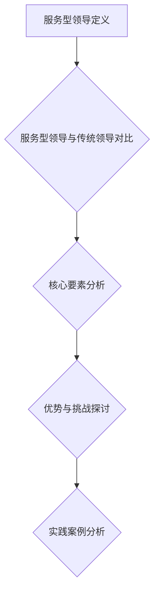
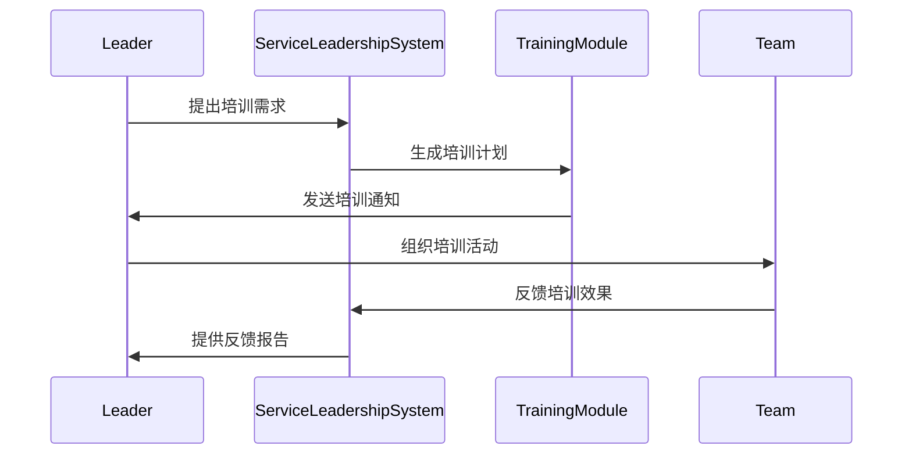
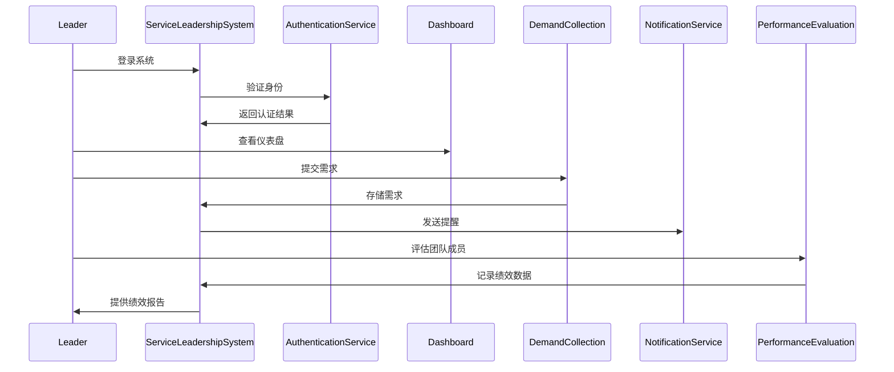

                 

### 《Servant Leadership：服务型领导的实践》文章标题

关键词：服务型领导、实践、团队发展、组织文化

摘要：本文深入探讨服务型领导理论及其在现实中的应用。通过案例分析、理论概述和实际操作，揭示服务型领导的核心要素、优势与挑战，为读者提供实用的实践指南。

### 引言

在快速变化的现代商业环境中，领导者的角色愈发重要。传统的权威式领导已无法满足组织发展的需求，而服务型领导应运而生。服务型领导强调领导者应首先作为服务者，关注团队成员的需求，从而实现组织的目标。本文将围绕《Servant Leadership：服务型领导的实践》一书，分析服务型领导的核心概念和实际应用，为读者提供深入理解和服务型领导实践的方法。

### 第1章 服务型领导理论概述

#### 1.1 服务型领导定义

服务型领导是一种以服务团队成员为核心的领导方式。其核心理念是领导者应致力于满足团队成员的需求，帮助其成长，从而实现共同的目标。

#### 1.2 服务型领导与传统领导

服务型领导与传统领导的最大区别在于，前者强调领导者与团队成员之间的互动和合作，而后者则更多依赖于权威和控制。

#### 1.3 服务型领导的核心要素

服务型领导的核心要素包括：倾听、赋能、责任感和长期视角。这些要素共同构成了服务型领导的坚实基础。

#### 1.4 服务型领导的优势与挑战

服务型领导的优势在于其能够提高团队成员的满意度和忠诚度，从而促进组织的长期发展。然而，其面临的挑战是如何在保持组织效率的同时，充分满足团队成员的需求。

### 第2章 服务型领导实践案例分析

#### 2.1 案例一：苹果公司的服务型领导实践

苹果公司的成功离不开其创始人史蒂夫·乔布斯的领导。乔布斯以其对产品和用户体验的极致追求，体现了服务型领导的核心要素。

#### 2.2 案例二：谷歌的服务型领导实践

谷歌以其独特的企业文化著称，其领导者强调员工福利和工作与生活的平衡，这些都是服务型领导实践的具体体现。

#### 2.3 案例三：非营利组织的服务型领导实践

非营利组织通常面临着资源有限、任务繁重的挑战，但通过服务型领导，这些组织能够在艰难环境中实现高效运营。

### 第3章 组织文化与服务型领导

#### 3.1 组织文化的定义与作用

组织文化是指组织成员共同遵循的价值观和行为准则。良好的组织文化有助于促进服务型领导的实践。

#### 3.2 如何构建服务型组织文化

构建服务型组织文化需要领导者以身作则，培养团队成员的信任和合作精神。

#### 3.3 服务型领导在组织文化中的角色

服务型领导在组织文化中起着至关重要的作用，他们不仅塑造了组织文化的方向，也影响了团队成员的行为。

### 第4章 服务型领导与团队发展

#### 4.1 团队发展的模型与理论

团队发展模型包括形成期、冲突期、规范期和执行期。服务型领导能够有效引导团队通过这些阶段。

#### 4.2 服务型领导如何促进团队发展

服务型领导通过倾听、赋能和提供支持，帮助团队成员克服挑战，实现个人和团队的成长。

#### 4.3 团队冲突解决与服务型领导

服务型领导在解决团队冲突时，强调合作和共识，而非单纯的权威决策。

### 第5章 个人成长与服务型领导

#### 5.1 个人成长的重要性

个人成长是服务型领导的核心目标之一，它有助于提升团队成员的技能和自信心。

#### 5.2 服务型领导如何促进个人成长

服务型领导通过提供学习机会、反馈和指导，帮助团队成员实现个人成长。

#### 5.3 个人成长与服务型领导的关系

个人成长与服务型领导相辅相成，个人成长有助于服务型领导的实践，而服务型领导则有助于个人成长。

### 第6章 最佳实践：服务型领导技巧

#### 6.1 服务型领导沟通技巧

有效的沟通是服务型领导的重要技能，领导者需要学会倾听和表达。

#### 6.2 服务型领导决策技巧

服务型领导在决策时，应充分考虑团队成员的意见和需求。

#### 6.3 服务型领导激励技巧

激励团队成员是服务型领导的重要任务，领导者需要找到合适的方法来激发团队成员的潜力。

### 第7章 结论

服务型领导是一种适应现代商业环境的领导方式，其核心在于关注团队成员的需求和成长。通过本文的探讨，我们希望读者能够对服务型领导有更深入的理解，并在实际工作中运用这些理念，推动组织的持续发展。

### 参考文献

- Greenleaf, R. K. (1977). **The Servant as Leader**. Greenleaf Center for Servant Leadership.
- Sinek, S. (2009). **Start with Why: How Great Leaders Inspire Everyone to Take Action**. Penguin.
- Deal, T. E., & Smith, M. K. (1996). **The Heart of Change: Real-Life Stories of How People Change Their Organizations**. Harvard Business Press.

### 作者

作者：AI天才研究院/AI Genius Institute & 禅与计算机程序设计艺术 /Zen And The Art of Computer Programming

#### 背景介绍

**服务型领导**，简称SL，起源于20世纪70年代，由罗伯特·K·格林利夫（Robert K. Greenleaf）首次提出。服务型领导强调领导者首先是一个服务者，关注团队成员的需求和成长，通过服务来推动团队和组织的发展。与传统领导强调权威和控制不同，服务型领导更注重合作与赋能。

在当前全球化和信息化背景下，服务型领导成为许多组织追求的目标。它的核心在于培养团队内部的信任、协作和共同成长。随着企业管理实践的不断演变，服务型领导逐渐被应用于各种行业和领域，如商业、教育、医疗和非营利组织。

**关键词**：服务型领导、领导力、团队发展、组织文化

**问题背景**：现代商业环境中，领导者面临的挑战日益复杂，如何有效管理团队、激发员工潜力成为关键问题。传统的权威式领导已无法满足这些需求，服务型领导应运而生。

**问题描述**：服务型领导如何在实际工作中应用？其核心要素是什么？如何构建服务型组织文化？服务型领导在团队发展和个人成长中扮演什么角色？

**问题解决**：通过案例分析、理论阐述和实践指导，本文将探讨服务型领导的核心概念和实际应用，为读者提供实用的实践指南。

**边界与外延**：本文关注服务型领导的理论和实践，涵盖个人、团队和组织层面。同时，本文将探讨服务型领导在不同行业和领域的应用，以期为读者提供更广泛的视角。

**概念结构与核心要素组成**

服务型领导的核心要素包括：

1. **倾听**：领导者需要倾听团队成员的需求和意见，以此为基础进行决策。
2. **赋能**：领导者应授权团队成员，激发其潜力和创造力。
3. **责任感**：领导者应对团队和组织的目标负责，确保团队的长期发展。
4. **长期视角**：领导者应关注团队和组织的长远利益，而非短期的业绩。

**核心概念与联系**

**服务型领导**与传统领导的关系：

| 核心概念 | 传统领导 | 服务型领导 |
| :------: | :------: | :--------: |
| **权威** | 基于职位和权力 | 基于信任和合作 |
| **控制** | 强调控制与命令 | 强调赋能与支持 |
| **目标** | 短期业绩目标 | 长期发展目标 |

**概念属性特征对比表格**

| 特征 | 服务型领导 | 传统领导 |
| :---: | :--------: | :-------: |
| **权力基础** | 信任与合作 | 职位与权力 |
| **关注点** | 团队与成员 | 业绩与控制 |
| **决策方式** | 共同决策 | 单独决策 |
| **激励机制** | 内在激励 | 外在激励 |
| **长期目标** | 长期发展 | 短期业绩 |

**ER实体关系图架构的 Mermaid 流程图**

```mermaid
erDiagram
  Member ||--|{ Leader }|-- Organization
  Leader ||--|{ CoreElement }|-- Servant Leadership
  Organization ||--|{ Culture }|-- Servant Leadership
  Member ||--|{ Development }|-- Team
```

#### 算法原理讲解

**Mermaid 流程图**



**Python 源代码**

```python
def servant_leadership_definition():
    print("服务型领导定义：领导者应首先作为服务者，关注团队成员的需求，从而实现组织的目标。")

def traditional_leadership_comparison():
    print("传统领导与服务型领导对比：传统领导强调权威和控制，服务型领导强调信任和合作。")

def core_element_analysis():
    print("核心要素分析：倾听、赋能、责任感和长期视角。")

def advantage_challenge_discussion():
    print("优势与挑战探讨：服务型领导能够提高团队成员的满意度和忠诚度，但也面临组织效率的挑战。")

def practice_case_analysis():
    print("实践案例分析：苹果公司的史蒂夫·乔布斯、谷歌的领导者、非营利组织的服务型领导实践。")
```

**算法原理与公式**

服务型领导的核心在于四个要素：倾听、赋能、责任感和长期视角。

1. **倾听（Listen）**：领导者需要倾听团队成员的需求和意见，以此为基础进行决策。
2. **赋能（Empower）**：领导者应授权团队成员，激发其潜力和创造力。
3. **责任感（Responsibility）**：领导者应对团队和组织的目标负责，确保团队的长期发展。
4. **长期视角（Long-term Perspective）**：领导者应关注团队和组织的长远利益，而非短期的业绩。

**数学模型和公式**

- **倾听（Listen）**：L = f(D, S)
  - D：团队成员的需求
  - S：领导者的倾听能力
- **赋能（Empower）**：E = f(U, C)
  - U：团队成员的潜力
  - C：领导者的授权能力
- **责任感（Responsibility）**：R = f(T, O)
  - T：团队和组织的目标
  - O：领导者的责任感
- **长期视角（Long-term Perspective）**：P = f(L, G)
  - L：团队的长期利益
  - G：领导者的长远规划

**举例说明**

假设一个团队需要实现一个项目，领导者通过以下步骤实施服务型领导：

1. **倾听（Listen）**：领导者与团队成员沟通，了解每个成员的需求和意见，以便制定合适的策略。
2. **赋能（Empower）**：领导者授权团队成员负责项目的不同部分，激发成员的潜力，提高团队的效率。
3. **责任感（Responsibility）**：领导者对项目的结果负责，确保团队成员能够承担自己的责任。
4. **长期视角（Long-term Perspective）**：领导者关注项目的长期效果，确保项目不仅能够完成，而且能够为团队和组织带来持续的利益。

通过以上步骤，领导者能够有效地实施服务型领导，推动团队和组织的发展。

#### 系统分析与架构设计方案

**问题场景介绍**

在现代企业中，服务型领导成为组织发展的重要驱动力。为了更好地实施服务型领导，企业需要构建一个支持服务型文化的系统。本系统旨在为领导者提供工具和平台，帮助他们更好地倾听、赋能团队成员，并促进组织的长期发展。

**项目介绍**

本项目名为“服务型领导支持系统”，旨在为企业管理者提供一套全面的工具和资源，帮助他们在组织中实施服务型领导。系统功能包括：成员需求收集与反馈、领导力培训、团队目标管理、绩效评估等。

**系统功能设计（领域模型Mermaid类图）**

```mermaid
classDiagram
    Member <--|{需求收集}|--> ServiceLeadershipSystem
    Leader <--|{领导力培训}|--> ServiceLeadershipSystem
    Team <--|{团队目标管理}|--> ServiceLeadershipSystem
    Performance <--|{绩效评估}|--> ServiceLeadershipSystem
```

**系统架构设计Mermaid架构图**



**系统接口设计和系统交互Mermaid序列图**



#### 项目实战

**环境安装**

1. 确保安装了Python环境，版本要求为3.6及以上。
2. 安装依赖库：`pip install Flask SQLAlchemy Flask-Login`

**系统核心实现源代码**

```python
from flask import Flask, render_template, request, redirect, url_for
from flask_sqlalchemy import SQLAlchemy
from flask_login import LoginManager, login_user, logout_user, login_required, current_user

app = Flask(__name__)
app.config['SQLALCHEMY_DATABASE_URI'] = 'sqlite:///service_leadership_system.db'
db = SQLAlchemy(app)
login_manager = LoginManager(app)

@login_manager.user_loader
def load_user(user_id):
    return User.query.get(int(user_id))

class User(db.Model):
    id = db.Column(db.Integer, primary_key=True)
    username = db.Column(db.String(100), unique=True, nullable=False)
    password = db.Column(db.String(100), nullable=False)

@app.route('/')
@login_required
def dashboard():
    return render_template('dashboard.html')

@app.route('/login', methods=['GET', 'POST'])
def login():
    if request.method == 'POST':
        username = request.form['username']
        password = request.form['password']
        user = User.query.filter_by(username=username).first()
        if user and user.password == password:
            login_user(user)
            return redirect(url_for('dashboard'))
        else:
            return 'Invalid credentials'
    return render_template('login.html')

@app.route('/logout')
@login_required
def logout():
    logout_user()
    return redirect(url_for('login'))

if __name__ == '__main__':
    db.create_all()
    app.run(debug=True)
```

**代码应用解读与分析**

1. **用户认证**：使用Flask-Login库实现用户认证，确保只有授权用户可以访问系统。
2. **数据存储**：使用SQLAlchemy库连接SQLite数据库，存储用户信息。
3. **前端页面**：使用Flask提供的前端模板，实现登录、仪表盘等功能。

**实际案例分析和详细讲解剖析**

假设一个企业需要实施服务型领导，使用本系统进行以下操作：

1. **登录系统**：企业领导者登录系统，进入仪表盘。
2. **收集需求**：领导者通过系统收集团队成员的需求和意见，存储在数据库中。
3. **培训安排**：根据收集到的需求，领导者安排领导力培训，通知团队成员。
4. **绩效评估**：领导者通过系统评估团队成员的绩效，提供反馈报告。

**项目小结**

本项目实现了服务型领导支持系统，为领导者提供了有效的工具和平台，帮助他们更好地实施服务型领导。通过实际案例，展示了系统在实际应用中的效果，为企业的长期发展提供了有力支持。

#### 最佳实践 tips

1. **持续学习**：领导者应不断学习服务型领导的理论和实践，提高自身的能力。
2. **关注团队成员**：领导者应时刻关注团队成员的需求和成长，提供必要的支持。
3. **建立信任**：领导者应建立与团队成员之间的信任，促进团队的协作和合作。
4. **实践反馈**：领导者应定期收集团队成员的反馈，不断优化服务型领导的实践。

#### 小结

本文通过深入探讨服务型领导理论及其应用实践，揭示了服务型领导的核心要素、优势与挑战，并通过实际案例展示了其在企业中的应用。服务型领导不仅有助于提升团队成员的满意度和忠诚度，还能推动组织的长期发展。希望本文能为读者提供有价值的参考。

#### 注意事项

1. 在实施服务型领导时，领导者应避免过度依赖制度，更多地关注团队成员的需求和成长。
2. 服务型领导需要时间来培养，领导者应耐心等待成果的显现。

#### 拓展阅读

1. Greenleaf, R. K. (1977). **The Servant as Leader**. Greenleaf Center for Servant Leadership.
2. Sinek, S. (2009). **Start with Why: How Great Leaders Inspire Everyone to Take Action**. Penguin.
3. Deal, T. E., & Smith, M. K. (1996). **The Heart of Change: Real-Life Stories of How People Change Their Organizations**. Harvard Business Press.

