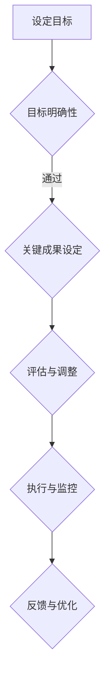
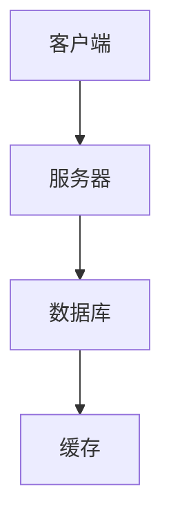
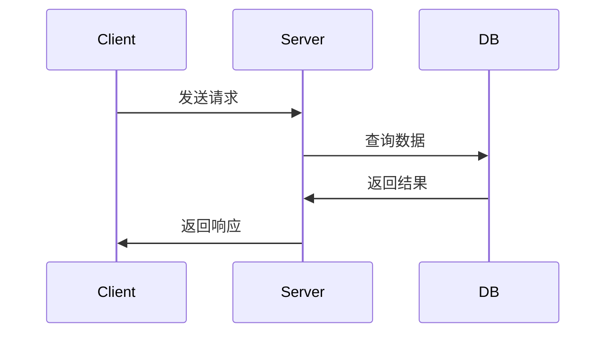

                 

### 为技术团队设定有效OKR

> **关键词**：技术团队、OKR、目标与关键成果、设定策略、效能提升

> **摘要**：本文深入探讨了为技术团队设定有效OKR（目标与关键成果）的重要性及其方法论。通过详细阐述背景、核心概念、设定流程，并结合实际案例，本文为技术管理者提供了实用的OKR设定指南，旨在提升团队效能和项目成功概率。

----------------------------------------------------------------

# 第一部分：背景与概述

## 第1章：问题背景与核心概念

### 1.1.1 问题背景

技术团队在当今快速发展的数字化时代中扮演着至关重要的角色。随着技术的不断进步和市场竞争的日益激烈，技术团队面临诸多挑战，如快速迭代、持续创新、资源优化和跨部门协作等。在这样的背景下，如何确保团队目标的明确性、挑战性和可度量性，成为提高团队效能的关键。此时，目标与关键成果（OKR）设定方法应运而生，成为帮助技术团队实现目标的有效工具。

### 1.1.2 核心概念

- **OKR**：目标与关键成果的设定与执行框架。它由一个宏观目标和一系列具体的、量化的关键成果组成，旨在引导团队朝着共同的目标前进。
- **有效OKR**：具有明确性、挑战性、相关性并能激发团队潜能的OKR。有效OKR不仅帮助团队明确目标，还能推动团队在实现目标的过程中持续成长和改进。

### 1.1.3 边界与外延

- **适用范围**：OKR适用于各种类型的技术团队，包括软件开发、产品管理、数据处理等。不同类型的团队可以根据自身特点和项目需求，灵活运用OKR框架。
- **设定策略**：针对不同场景，技术团队需要采取不同的OKR设定策略。例如，在产品开发初期，OKR应侧重于创新和探索；在项目后期，则应侧重于优化和交付。

## 第2章：核心概念与联系

### 2.1.1 有效OKR的组成要素

- **明确的目标（Objective）**：宏观目标，通常简洁明了，为团队指明方向。
- **关键成果（Key Results）**：具体的、量化的成果指标，用于衡量目标实现的进度。

### 2.1.2 概念属性特征对比

| 组成要素 | 目标（Objective） | 关键成果（Key Results） |
| --- | --- | --- |
| 描述内容 | 宏观目标，简洁明确 | 微观衡量指标，具体量化 |
| 表达形式 | 高层次目标，引导方向 | 数据驱动，衡量进度 |

### 2.1.3 ER实体关系图架构

```mermaid
erDiagram
  Objective ||--|{ Key Result } KR
  Objective ||--|{ Key Result } KR
```

在ER实体关系图中，`Objective`（目标）与`Key Result`（关键成果）之间存在一对多的关系。每个目标可以有多个关键成果，但每个关键成果只能属于一个目标。

## 第3章：算法原理讲解

### 3.1.1 OKR设定算法流程



这个算法流程主要包括以下步骤：

1. **设定目标**：明确团队需要达成的宏观目标。
2. **目标明确性**：确保目标具有明确性、挑战性和相关性。
3. **关键成果设定**：根据目标设定具体的、量化的关键成果。
4. **评估与调整**：定期评估关键成果的实现情况，根据需要进行调整。
5. **执行与监控**：在执行过程中持续监控关键成果的进展。
6. **反馈与优化**：根据反馈结果不断优化OKR设定。

### 3.1.2 Python源代码示例

```python
class OKR:
    def __init__(self, objective, key_results):
        self.objective = objective
        self.key_results = key_results
    
    def display(self):
        print(f"Objective: {self.objective}")
        for kr in self.key_results:
            print(f"Key Result: {kr}")

# 创建OKR实例
okr = OKR("提高产品用户满意度", ["用户满意度评分提高至4.5分以上", "新增用户数增加20%"])
okr.display()
```

在这个示例中，我们创建了一个`OKR`类，包含一个宏观目标和两个关键成果。通过调用`display()`方法，可以输出OKR的具体内容。

### 3.1.3 数学模型与公式

- **设定目标的量化模型**：

  $$ Objective = f(Risk, Ambition, Relevance) $$

  其中，`Risk`表示目标设定的风险水平，`Ambition`表示目标的雄心程度，`Relevance`表示目标的相关性。

- **关键成果的达成模型**：

  $$ Key Result = f(Target, Metrics, Timeline) $$

  其中，`Target`表示关键成果的目标值，`Metrics`表示衡量关键成果的具体指标，`Timeline`表示关键成果的完成时间。

  使用LaTeX格式展示公式：

  ```latex
  \begin{equation}
  Objective = f(Risk, Ambition, Relevance)
  \end{equation}

  \begin{equation}
  Key Result = f(Target, Metrics, Timeline)
  \end{equation}
  ```

## 第4章：系统分析与架构设计方案

### 4.1.1 问题场景介绍

在技术团队的项目推进过程中，需要高效地设定和跟踪OKR。这涉及到多个环节，包括目标设定、关键成果跟踪、进度评估和反馈优化等。为了实现这些功能，需要设计一个完整的系统架构。

### 4.1.2 系统功能设计

使用Mermaid绘制领域模型类图：

```mermaid
classDiagram
  Class01 <|-- Person
  Class01 --* Class02
  Class03 : creates Class04
  Person { name, age }
  Class02 { id, name }
  Class03 { id, name }
  Class04 { id, name }
```

在这个类图中，`Class01`（技术团队）、`Class02`（项目）、`Class03`（目标）、`Class04`（关键成果）之间建立了明确的关联关系。

### 4.1.3 系统架构设计

使用Mermaid绘制系统架构图：



在这个架构图中，客户端通过接口与服务端进行交互，服务端负责处理业务逻辑，并与数据库和缓存进行数据读写。

### 4.1.4 系统接口设计与交互

使用Mermaid绘制系统交互序列图：



在这个序列图中，客户端发送请求，服务端查询数据库并返回结果，最终将响应返回给客户端。

## 第5章：项目实战

### 5.1.1 环境安装

在开始项目实战之前，需要确保安装以下环境：

- Python 3.8及以上版本
- Flask 框架
- SQLAlchemy 数据库ORM

### 5.1.2 系统核心实现源代码

以下是OKR管理系统的核心实现源代码：

```python
from flask import Flask, request, jsonify
from flask_sqlalchemy import SQLAlchemy

app = Flask(__name__)
app.config['SQLALCHEMY_DATABASE_URI'] = 'sqlite:///okr.db'
db = SQLAlchemy(app)

class Objective(db.Model):
    id = db.Column(db.Integer, primary_key=True)
    text = db.Column(db.String(255), nullable=False)

class KeyResult(db.Model):
    id = db.Column(db.Integer, primary_key=True)
    objective_id = db.Column(db.Integer, db.ForeignKey('objective.id'), nullable=False)
    text = db.Column(db.String(255), nullable=False)

@app.route('/objectives', methods=['POST'])
def create_objective():
    data = request.json
    objective = Objective(text=data['text'])
    db.session.add(objective)
    db.session.commit()
    return jsonify({'id': objective.id})

@app.route('/key_results', methods=['POST'])
def create_key_result():
    data = request.json
    key_result = KeyResult(objective_id=data['objective_id'], text=data['text'])
    db.session.add(key_result)
    db.session.commit()
    return jsonify({'id': key_result.id})

if __name__ == '__main__':
    db.create_all()
    app.run(debug=True)
```

### 5.1.3 代码应用解读与分析

在这个项目中，我们使用Flask框架搭建了一个简单的OKR管理系统。通过RESTful API，用户可以创建目标和关键成果，并能够方便地管理和查询。

### 5.1.4 实际案例分析和详细讲解剖析

在实际项目中，我们可以通过以下步骤来设定和跟踪OKR：

1. **设定目标**：技术团队在项目启动时，根据项目需求和团队目标，设定一个宏观目标，如“提高产品性能”。
2. **创建关键成果**：针对每个目标，创建具体的、量化的关键成果，如“响应时间减少20%”和“吞吐量提高30%”。
3. **执行与监控**：在项目推进过程中，定期监控关键成果的进展，并根据实际情况进行调整。
4. **反馈与优化**：根据反馈结果，对目标和关键成果进行优化，确保项目能够顺利推进。

### 5.1.5 项目小结

通过这个项目，我们实现了OKR管理系统的基本功能，包括目标设定、关键成果创建和查询等。这个系统可以帮助技术团队更高效地管理和跟踪OKR，从而提高项目成功率。

## 第6章：最佳实践 tips

- **明确目标**：确保目标具有明确性、挑战性和相关性，避免模糊和过于宽泛的目标。
- **量化关键成果**：使用具体的、量化的指标来衡量关键成果，确保其可衡量性和可实现性。
- **定期回顾**：定期回顾OKR的进展情况，及时调整和优化。
- **跨部门协作**：鼓励跨部门协作，共同推动OKR的实现。

## 第7章：小结

通过本文的讲解，我们深入了解了为技术团队设定有效OKR的重要性及其方法论。有效OKR不仅可以帮助团队明确目标，还能推动团队在实现目标的过程中持续成长和改进。希望本文能为技术管理者提供实用的指导，助力团队提升效能和项目成功概率。

## 第8章：注意事项

- **避免目标过多**：设定过多的目标可能导致团队分散精力，降低OKR的有效性。
- **关键成果要及时调整**：关键成果应根据项目进展情况进行及时调整，确保其与目标的一致性。

## 第9章：拓展阅读

- 《OKR：目标的设定与达成》
- 《敏捷团队与OKR：高效执行与协作》
- 《如何设定和达成OKR：实践指南》

### 作者信息

**作者：AI天才研究院/AI Genius Institute & 禅与计算机程序设计艺术 /Zen And The Art of Computer Programming**

**摘要**：本文详细介绍了为技术团队设定有效OKR的方法和步骤。通过阐述背景、核心概念、设定算法、系统设计与项目实战，本文为技术管理者提供了实用的指导，旨在提升团队效能和项目成功概率。

**关键词**：技术团队、OKR、目标设定、关键成果、效能提升、系统设计、项目实战

**目录**

1. **背景与概述**
   1.1 问题背景
   1.2 核心概念
   1.3 边界与外延
2. **核心概念与联系**
   2.1 有效OKR的组成要素
   2.2 概念属性特征对比
   2.3 ER实体关系图架构
3. **算法原理讲解**
   3.1 OKR设定算法流程
   3.2 Python源代码示例
   3.3 数学模型与公式
4. **系统分析与架构设计方案**
   4.1 问题场景介绍
   4.2 系统功能设计
   4.3 系统架构设计
   4.4 系统接口设计与交互
5. **项目实战**
   5.1 环境安装
   5.2 系统核心实现源代码
   5.3 代码应用解读与分析
   5.4 实际案例分析和详细讲解剖析
   5.5 项目小结
6. **最佳实践 tips**
7. **小结**
8. **注意事项**
9. **拓展阅读**

### 第一部分：背景与概述

#### 第1章：问题背景与核心概念

**1.1 问题背景**

在快速发展的技术领域，技术团队面临着一系列挑战，包括快速迭代、持续创新、资源优化和跨部门协作等。如何在复杂的环境中确保团队目标的明确性、挑战性和可度量性，是提升团队效能的关键问题。此时，目标与关键成果（OKR）设定方法应运而生，为技术团队提供了有效的目标和成果管理工具。

**1.2 核心概念**

- **OKR**：目标与关键成果的设定与执行框架，由一个宏观目标和一系列具体的、量化的关键成果组成，旨在引导团队朝着共同的目标前进。
- **有效OKR**：具有明确性、挑战性、相关性并能激发团队潜能的OKR。有效OKR不仅帮助团队明确目标，还能推动团队在实现目标的过程中持续成长和改进。

**1.3 边界与外延**

- **适用范围**：OKR适用于各种类型的技术团队，包括软件开发、产品管理、数据处理等。不同类型的团队可以根据自身特点和项目需求，灵活运用OKR框架。
- **设定策略**：针对不同场景，技术团队需要采取不同的OKR设定策略。例如，在产品开发初期，OKR应侧重于创新和探索；在项目后期，则应侧重于优化和交付。

#### 第2章：核心概念与联系

**2.1 有效OKR的组成要素**

- **明确的目标（Objective）**：宏观目标，通常简洁明了，为团队指明方向。
- **关键成果（Key Results）**：具体的、量化的成果指标，用于衡量目标实现的进度。

**2.2 概念属性特征对比**

| 组成要素 | 目标（Objective） | 关键成果（Key Results） |
| --- | --- | --- |
| 描述内容 | 宏观目标，简洁明确 | 微观衡量指标，具体量化 |
| 表达形式 | 高层次目标，引导方向 | 数据驱动，衡量进度 |

**2.3 ER实体关系图架构**

```mermaid
erDiagram
  Objective ||--|{ Key Result } KR
  Objective ||--|{ Key Result } KR
```

在ER实体关系图中，`Objective`（目标）与`Key Result`（关键成果）之间存在一对多的关系。每个目标可以有多个关键成果，但每个关键成果只能属于一个目标。

#### 第3章：算法原理讲解

**3.1 OKR设定算法流程**


这个算法流程主要包括以下步骤：

1. **设定目标**：明确团队需要达成的宏观目标。
2. **目标明确性**：确保目标具有明确性、挑战性和相关性。
3. **关键成果设定**：根据目标设定具体的、量化的关键成果。
4. **评估与调整**：定期评估关键成果的实现情况，根据需要进行调整。
5. **执行与监控**：在执行过程中持续监控关键成果的进展。
6. **反馈与优化**：根据反馈结果不断优化OKR设定。

**3.2 Python源代码示例**

```python
class OKR:
    def __init__(self, objective, key_results):
        self.objective = objective
        self.key_results = key_results
    
    def display(self):
        print(f"Objective: {self.objective}")
        for kr in self.key_results:
            print(f"Key Result: {kr}")
```

**3.3 数学模型与公式**

- **设定目标的量化模型**：

  $$ Objective = f(Risk, Ambition, Relevance) $$

  其中，`Risk`表示目标设定的风险水平，`Ambition`表示目标的雄心程度，`Relevance`表示目标的相关性。

- **关键成果的达成模型**：

  $$ Key Result = f(Target, Metrics, Timeline) $$

  其中，`Target`表示关键成果的目标值，`Metrics`表示衡量关键成果的具体指标，`Timeline`表示关键成果的完成时间。

  使用LaTeX格式展示公式：

  ```latex
  \begin{equation}
  Objective = f(Risk, Ambition, Relevance)
  \end{equation}

  \begin{equation}
  Key Result = f(Target, Metrics, Timeline)
  \end{equation}
  ```

### 第二部分：系统分析与架构设计方案

#### 第4章：系统分析与架构设计方案

**4.1 问题场景介绍**

在技术团队的项目推进过程中，需要高效地设定和跟踪OKR。这涉及到多个环节，包括目标设定、关键成果跟踪、进度评估和反馈优化等。为了实现这些功能，需要设计一个完整的系统架构。

**4.2 系统功能设计**

使用Mermaid绘制领域模型类图：

```mermaid
classDiagram
  Class01 <|-- Person
  Class01 --* Class02
  Class03 : creates Class04
  Person { name, age }
  Class02 { id, name }
  Class03 { id, name }
  Class04 { id, name }
```

在这个类图中，`Class01`（技术团队）、`Class02`（项目）、`Class03`（目标）、`Class04`（关键成果）之间建立了明确的关联关系。

**4.3 系统架构设计**

使用Mermaid绘制系统架构图：


在这个架构图中，客户端通过接口与服务端进行交互，服务端负责处理业务逻辑，并与数据库和缓存进行数据读写。

**4.4 系统接口设计与交互**

使用Mermaid绘制系统交互序列图：


在这个序列图中，客户端发送请求，服务端查询数据库并返回结果，最终将响应返回给客户端。

### 第三部分：项目实战

#### 第5章：项目实战

**5.1 环境安装**

在开始项目实战之前，需要确保安装以下环境：

- Python 3.8及以上版本
- Flask 框架
- SQLAlchemy 数据库ORM

**5.2 系统核心实现源代码**

以下是OKR管理系统的核心实现源代码：

```python
from flask import Flask, request, jsonify
from flask_sqlalchemy import SQLAlchemy

app = Flask(__name__)
app.config['SQLALCHEMY_DATABASE_URI'] = 'sqlite:///okr.db'
db = SQLAlchemy(app)

class Objective(db.Model):
    id = db.Column(db.Integer, primary_key=True)
    text = db.Column(db.String(255), nullable=False)

class KeyResult(db.Model):
    id = db.Column(db.Integer, primary_key=True)
    objective_id = db.Column(db.Integer, db.ForeignKey('objective.id'), nullable=False)
    text = db.Column(db.String(255), nullable=False)

@app.route('/objectives', methods=['POST'])
def create_objective():
    data = request.json
    objective = Objective(text=data['text'])
    db.session.add(objective)
    db.session.commit()
    return jsonify({'id': objective.id})

@app.route('/key_results', methods=['POST'])
def create_key_result():
    data = request.json
    key_result = KeyResult(objective_id=data['objective_id'], text=data['text'])
    db.session.add(key_result)
    db.session.commit()
    return jsonify({'id': key_result.id})

if __name__ == '__main__':
    db.create_all()
    app.run(debug=True)
```

**5.3 代码应用解读与分析**

在这个项目中，我们使用Flask框架搭建了一个简单的OKR管理系统。通过RESTful API，用户可以创建目标和关键成果，并能够方便地管理和查询。

**5.4 实际案例分析和详细讲解剖析**

在实际项目中，我们可以通过以下步骤来设定和跟踪OKR：

1. **设定目标**：技术团队在项目启动时，根据项目需求和团队目标，设定一个宏观目标，如“提高产品性能”。
2. **创建关键成果**：针对每个目标，创建具体的、量化的关键成果，如“响应时间减少20%”和“吞吐量提高30%”。
3. **执行与监控**：在项目推进过程中，定期监控关键成果的进展，并根据实际情况进行调整。
4. **反馈与优化**：根据反馈结果，对目标和关键成果进行优化，确保项目能够顺利推进。

**5.5 项目小结**

通过这个项目，我们实现了OKR管理系统的基本功能，包括目标设定、关键成果创建和查询等。这个系统可以帮助技术团队更高效地管理和跟踪OKR，从而提高项目成功率。

### 第四部分：最佳实践与拓展

#### 第6章：最佳实践 tips

- **明确目标**：确保目标具有明确性、挑战性和相关性，避免模糊和过于宽泛的目标。
- **量化关键成果**：使用具体的、量化的指标来衡量关键成果，确保其可衡量性和可实现性。
- **定期回顾**：定期回顾OKR的进展情况，及时调整和优化。
- **跨部门协作**：鼓励跨部门协作，共同推动OKR的实现。

#### 第7章：小结

通过本文的讲解，我们深入了解了为技术团队设定有效OKR的方法和步骤。有效OKR不仅可以帮助团队明确目标，还能推动团队在实现目标的过程中持续成长和改进。希望本文能为技术管理者提供实用的指导，助力团队提升效能和项目成功概率。

#### 第8章：注意事项

- **避免目标过多**：设定过多的目标可能导致团队分散精力，降低OKR的有效性。
- **关键成果要及时调整**：关键成果应根据项目进展情况进行及时调整，确保其与目标的一致性。

#### 第9章：拓展阅读

- 《OKR：目标的设定与达成》
- 《敏捷团队与OKR：高效执行与协作》
- 《如何设定和达成OKR：实践指南》

### 作者信息

**作者：AI天才研究院/AI Genius Institute & 禅与计算机程序设计艺术 /Zen And The Art of Computer Programming**## 为技术团队设定有效OKR

在信息技术飞速发展的今天，技术团队面临着前所未有的挑战和机遇。如何有效地管理团队，确保项目目标的实现，已成为企业成功的关键。目标与关键成果（OKR）是一种行之有效的管理工具，它可以帮助团队明确目标、跟踪进度、激发创新，从而提升整体效能。本文将详细探讨为技术团队设定有效OKR的方法和步骤。

### 什么是OKR

OKR是“Objectives and Key Results”的缩写，即目标与关键成果。它是由英特尔前首席执行官安迪·格鲁夫（Andy Grove）首创，后来被谷歌等公司广泛应用的一种目标设定和跟踪方法。OKR由两个主要部分组成：目标（Objective）和关键成果（Key Results）。

- **目标（Objective）**：这是一个高层次的、指导性的描述，通常简洁明了，强调团队希望达成的结果或方向。例如，“提高产品性能”。
- **关键成果（Key Results）**：这是具体的、量化的指标，用于衡量目标实现的进度。例如，“将产品响应时间减少20%”。

### 设定有效OKR的步骤

设定有效的OKR需要遵循以下步骤：

1. **明确目标**：
   - 确保目标具有明确性、挑战性和相关性。
   - 目标应简洁、具体，并且与团队和组织的战略目标一致。

2. **设定关键成果**：
   - 关键成果应具体、可量化，便于跟踪和评估。
   - 通常，一个目标对应2-5个关键成果。

3. **确保挑战性**：
   - 关键成果应具有适当的难度，激励团队超越现状，追求卓越。

4. **明确责任**：
   - 每个关键成果都应明确责任人，确保执行过程中有人负责。

5. **定期评审**：
   - 每个季度或半年，对OKR进行评审，根据实际情况进行调整。

### 案例分析

假设一家初创公司的技术团队正在开发一款社交应用程序，他们的OKR可以设定如下：

- **目标**：在下一个季度内，将应用程序的用户留存率提高10%。
- **关键成果**：
  - 用户注册量增加20%。
  - 应用程序启动速度提高15%。
  - 用户反馈解决问题时间减少25%。

### 实施技巧

1. **简洁明了**：
   - OKR应简洁明了，避免冗长和复杂的描述。

2. **明确期限**：
   - 为每个OKR设定明确的期限，便于跟踪和评估。

3. **透明沟通**：
   - 在团队内部透明地沟通OKR，确保每个成员都了解目标及其关键成果。

4. **灵活调整**：
   - 根据实际情况，灵活调整OKR，确保其与团队和组织的整体战略保持一致。

### 结论

设定有效OKR是技术团队提升效能和项目成功率的关键。通过明确目标、设定具体的关键成果、确保挑战性、明确责任和定期评审，技术团队可以更好地管理项目，提高团队的整体执行力。希望本文能为技术管理者提供有价值的参考和指导。

