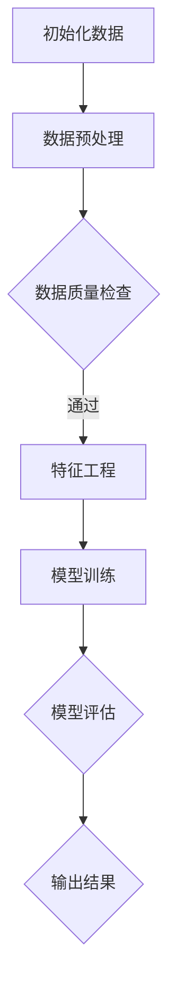
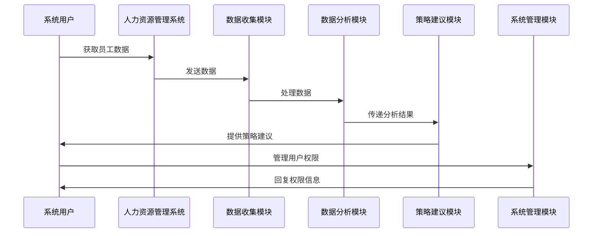
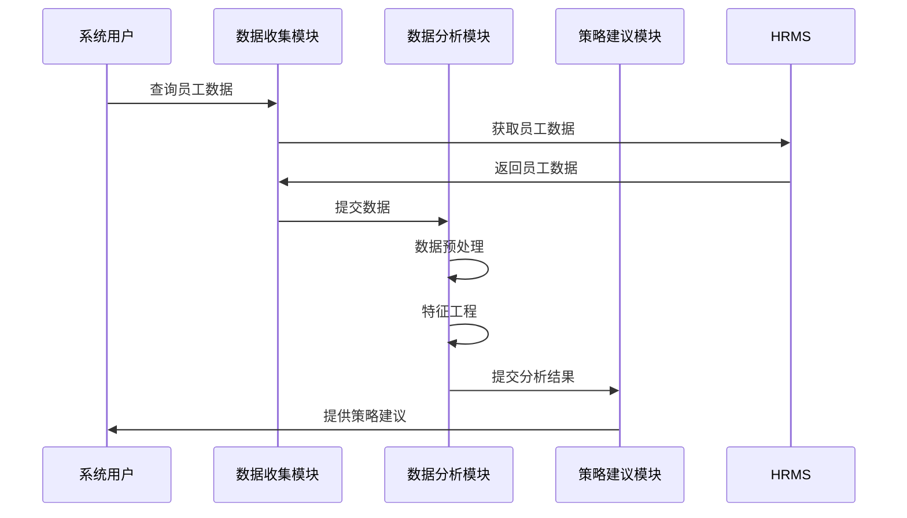

                 


### 1.1 问题背景

在当今快速发展的信息技术时代，人才的竞争日益激烈，特别是在高科技领域，人才的流失对企业造成了巨大的影响。核心员工的流失不仅意味着企业失去了一部分重要的知识和技能，还可能导致项目的延期、团队士气的下降以及客户信任的丧失。因此，如何降低核心员工的流失率，成为企业面临的重要挑战之一。

当前，许多企业已经意识到了人才保留的重要性，并采取了一系列措施，例如提供具有竞争力的薪酬福利、职业发展机会、工作环境改善等。然而，这些传统的方法并不能完全解决核心员工流失的问题。根据调研数据显示，超过50%的员工离职原因并非薪酬不足，而是因为缺乏职业发展机会、工作不满足感、团队氛围不佳等因素。

随着互联网技术的发展，企业不再局限于本地招聘，而是通过全球化的人才战略吸引全球范围内的顶尖人才。这种竞争环境下，如何运用先进的技术手段和策略来降低核心员工流失率，成为企业亟需解决的问题。

### 1.2 问题描述

问题描述主要集中在以下几个方面：

1. **核心员工流失率过高**：企业在特定时间段内，核心员工流失的数量超过正常水平，给企业运营带来了严重影响。
2. **流失原因多样化**：员工流失原因复杂，包括职业发展受限、工作不满足感、薪酬福利不具竞争力、团队氛围不佳等。
3. **传统保留策略效果不佳**：企业采用的传统人才保留策略，如薪酬福利提升、职业发展机会提供等，效果往往不显著。
4. **全球化人才竞争加剧**：企业在全球化背景下，如何在全球范围内吸引和保留顶尖人才，面临新的挑战。

### 1.3 问题解决

为了解决上述问题，企业需要从以下几个方面着手：

1. **深入了解员工需求**：通过调查和分析，了解员工的真实需求，有针对性地制定保留策略。
2. **提供个性化职业发展路径**：为员工提供明确的职业发展路径，包括培训、晋升机会等，提升员工的职业满足感。
3. **改善团队氛围和工作环境**：营造积极向上的团队氛围，提供良好的工作环境，增强员工对企业的归属感。
4. **运用数据分析技术**：利用大数据分析和人工智能技术，预测员工流失风险，提前采取预防措施。
5. **全球化人才战略**：通过全球化人才招聘和培养，吸引和保留顶尖人才。

### 1.4 边界与外延

在讨论人才保留策略时，需要明确几个关键边界与外延：

1. **人才定义**：核心员工通常指对企业具有关键价值和重要技能的员工，如技术专家、关键业务人员等。
2. **保留策略适用范围**：保留策略不仅适用于高科技企业，也可推广到其他行业。
3. **文化差异**：不同国家和地区的文化背景可能影响员工保留策略的实施效果。
4. **法律法规**：企业在实施人才保留策略时，需要遵守当地的劳动法律法规。

### 1.5 概念结构与核心要素组成

为了更好地理解人才保留策略，需要明确以下几个核心概念及其相互联系：

1. **核心员工流失率**：衡量企业核心员工流失速度的指标。
2. **员工需求**：员工在职业发展、薪酬福利、工作环境等方面的期望。
3. **职业发展路径**：员工在企业内部的发展方向和晋升机会。
4. **团队氛围**：团队内部的人际关系和工作氛围。
5. **数据分析技术**：用于预测员工流失风险和优化保留策略的技术手段。

通过以上步骤，我们对人才保留策略的问题背景、问题描述、问题解决方法以及边界与外延有了全面的理解，为后续章节的深入探讨奠定了基础。在接下来的章节中，我们将进一步探讨核心概念与联系，详细讲解算法原理，分析系统架构设计，并进行项目实战，以期为降低核心员工流失率提供有效的解决方案。 

----------------------------------------------------------------

# 第二部分: 核心概念与联系

## 第2章: 核心概念与联系

### 2.1 核心概念原理

在探讨人才保留策略时，理解以下几个核心概念至关重要：

1. **核心员工流失率**：这是衡量企业人才流失速度的重要指标。核心员工流失率通常指在特定时间段内，企业核心员工离职的数量与员工总数的比率。高流失率可能表明企业在人才保留方面存在问题。

2. **员工需求**：这是员工在职业发展、薪酬福利、工作环境等方面的期望。了解员工需求是制定有效保留策略的基础。员工需求可能因个人背景、工作性质、行业环境等因素而异。

3. **职业发展路径**：这是员工在企业内部的发展方向和晋升机会。明确的职业发展路径可以增强员工的职业满足感，降低流失率。

4. **团队氛围**：这是团队内部的人际关系和工作氛围。良好的团队氛围有助于提升员工的归属感和工作满意度。

5. **数据分析技术**：这是用于预测员工流失风险和优化保留策略的技术手段。大数据分析和人工智能技术在人才保留策略中发挥着重要作用。

### 2.2 概念属性特征对比表格

为了更清晰地理解上述核心概念，我们可以通过对比表格来展示它们的属性特征：

| 概念       | 属性特征                                           | 关联关系                                             |
|------------|----------------------------------------------------|------------------------------------------------------|
| 核心员工流失率 | 流失数量与员工总数的比率                         | 直接影响企业运营稳定性                               |
| 员工需求   | 职业发展、薪酬福利、工作环境等方面期望           | 决定保留策略的制定与实施                             |
| 职业发展路径 | 员工在企业内部的发展方向和晋升机会               | 增强员工职业满足感和忠诚度                          |
| 团队氛围   | 团队内部的人际关系和工作氛围                     | 影响员工的工作满意度和归属感                        |
| 数据分析技术 | 大数据和人工智能技术                             | 用于预测流失风险和优化保留策略，提升决策准确性      |

### 2.3 ER实体关系图架构

ER（实体-关系）图是描述系统中实体及其相互关系的图形化工具。在人才保留策略的背景下，ER图可以帮助我们直观地了解各个核心概念之间的关系。以下是一个简化的ER图：

```mermaid
erDiagram
  Employee ||--|{ CoreEmployee } CoreEmployee : contains core information
  CoreEmployee ||--|{ EmployeeRetention } EmployeeRetention : defines retention policies
  EmployeeRetention ||--|{ EmployeeFeedback } EmployeeFeedback : collects employee feedback
  EmployeeFeedback ||--|{ EmployeeEngagement } EmployeeEngagement : measures engagement
  EmployeeEngagement ||--|{ TeamCulture } TeamCulture : assesses team dynamics
  TeamCulture ||--|{ EmployeeSatisfaction } EmployeeSatisfaction : measures satisfaction
  EmployeeSatisfaction ||--|{ EmployeeRetention } EmployeeRetention : informs policy adjustments
```

在这个ER图中，我们定义了以下实体：

- **Employee**（员工）：代表企业中的所有员工。
- **CoreEmployee**（核心员工）：继承自Employee，包含核心员工特有的信息。
- **EmployeeRetention**（员工保留）：定义了企业针对员工保留的策略。
- **EmployeeFeedback**（员工反馈）：收集员工关于工作环境和保留策略的反馈。
- **EmployeeEngagement**（员工参与度）：衡量员工对工作的投入程度。
- **TeamCulture**（团队文化）：评估团队内部的人际关系和工作氛围。
- **EmployeeSatisfaction**（员工满意度）：衡量员工对工作环境的满意度。

通过ER图，我们可以清晰地看到各个实体之间的关联，从而为后续的系统分析与架构设计提供基础。

----------------------------------------------------------------

## 第3章: 算法原理讲解

在人才保留策略的实施过程中，算法原理的讲解至关重要。本章节将详细阐述一种用于预测员工流失风险的算法，并使用Mermaid流程图和Python源代码来展示其实现过程。

### 3.1 算法Mermaid流程图

首先，我们使用Mermaid绘制一个简单的流程图来展示员工流失风险预测算法的基本步骤：



这个流程图包括以下步骤：

1. **初始化数据**：准备员工流失相关的数据集。
2. **数据预处理**：对数据进行清洗和归一化处理。
3. **数据质量检查**：检查数据的质量，确保数据适合建模。
4. **特征工程**：提取对预测流失风险有重要影响的特征。
5. **模型训练**：使用训练数据集训练流失风险预测模型。
6. **模型评估**：评估模型在测试数据集上的表现。
7. **输出结果**：输出预测结果，包括流失风险评分和保留策略建议。

### 3.2 Python源代码实现

以下是一个简化的Python代码示例，用于实现上述流程中的关键步骤：

```python
import pandas as pd
from sklearn.model_selection import train_test_split
from sklearn.ensemble import RandomForestClassifier
from sklearn.metrics import accuracy_score

# 1. 初始化数据
data = pd.read_csv('employee_data.csv')

# 2. 数据预处理
data = data.dropna()
data = (data - data.mean()) / data.std()

# 3. 数据质量检查
# 此处省略具体代码，根据实际情况进行数据质量检查

# 4. 特征工程
features = data[['years_experience', 'salary', 'performance_rating']]
labels = data['left_company']

# 5. 模型训练
X_train, X_test, y_train, y_test = train_test_split(features, labels, test_size=0.2, random_state=42)
model = RandomForestClassifier()
model.fit(X_train, y_train)

# 6. 模型评估
predictions = model.predict(X_test)
accuracy = accuracy_score(y_test, predictions)
print(f'Model accuracy: {accuracy:.2f}')

# 7. 输出结果
# 此处省略具体代码，根据实际情况输出预测结果和保留策略建议
```

在这个示例中，我们使用了Pandas进行数据预处理，Scikit-learn的RandomForestClassifier进行模型训练和评估。实际应用中，还需要根据具体需求进行更多细节的处理。

### 3.3 算法原理的数学模型和公式

员工流失风险预测的数学模型通常是一个分类问题，可以用以下公式表示：

\[ P(\text{流失}) = f(\text{特征向量}) \]

其中，\( f \) 是一个预测函数，通常由机器学习算法实现。对于我们的RandomForest模型，预测函数可以近似为：

\[ f(\text{特征向量}) = \text{sign}(\sum_{i=1}^{n} w_i \cdot x_i + b) \]

其中，\( x_i \) 是特征向量的第 \( i \) 个元素，\( w_i \) 是对应的权重，\( b \) 是偏置项，\( \text{sign} \) 函数用于将输出转换为二分类结果（流失或未流失）。

### 3.4 举例说明

假设我们有一个简化的数据集，包含员工的年经验、薪酬和绩效评分为特征，以及是否流失为标签。以下是数据集的一个示例：

```csv
years_experience,salary,performance_rating,left_company
5,60000,4.0,0
3,50000,3.5,0
7,80000,4.5,1
2,40000,3.0,0
6,75000,4.0,0
```

使用上述算法，我们通过特征工程和模型训练，可以预测每个员工的流失风险。例如，对于第一个员工（年经验5年，薪酬60000美元，绩效评分为4.0），模型可能会给出一个较高的流失风险评分，表明该员工有较大的流失风险。

通过这种算法，企业可以提前识别出高风险员工，并采取相应的保留策略，如提供职业发展机会、改善工作环境等，从而降低核心员工的流失率。

### 总结

本章通过Mermaid流程图和Python代码详细讲解了员工流失风险预测算法的原理和实现过程。该算法能够帮助企业识别出流失风险较高的员工，为制定针对性的保留策略提供数据支持。在下一章节中，我们将进一步探讨系统分析与架构设计，为人才保留策略的实施提供更全面的解决方案。

----------------------------------------------------------------

## 第4章: 系统分析与架构设计

### 4.1 问题场景介绍

假设我们是一家高科技企业，面临核心员工流失率过高的挑战。为了降低核心员工流失率，我们需要设计并实现一个综合性的人才保留系统。该系统应能够收集和分析员工数据，预测流失风险，并提供相应的保留策略建议。

### 4.2 项目介绍

本项目旨在开发一个人才保留系统，包括以下几个模块：

1. **数据收集模块**：负责从企业的人力资源管理系统（HRMS）中收集员工数据，如基本资料、薪酬福利、工作表现等。
2. **数据分析模块**：负责对收集到的员工数据进行分析，识别流失风险因素，并预测员工流失风险。
3. **策略建议模块**：基于数据分析结果，为不同流失风险的员工提供个性化的保留策略建议。
4. **系统管理模块**：负责系统的日常维护和用户权限管理。

### 4.3 系统功能设计（领域模型Mermaid类图）

领域模型类图用于描述系统的核心功能和实体之间的关系。以下是人才保留系统的领域模型类图：

```mermaid
classDiagram
    Employee <>-o DataCollector: collects data
    Employee <>-o DataAnalyzer: analyzes data
    Employee <>-o PolicyAdvisor: provides advice
    Employee <|-- PerformanceMetric
    Employee <|-- SalaryInfo
    Employee <|-- EmployeeFeedback
    DataCollector <|-- HRMS
    DataAnalyzer <|-- MachineLearningModel
    PolicyAdvisor <|-- RetentionStrategy
endclass
```

在这个类图中，我们定义了以下实体：

- **Employee**（员工）：代表企业中的所有员工，包括基本资料、薪酬福利、工作表现等属性。
- **DataCollector**（数据收集器）：负责从HRMS中收集员工数据。
- **DataAnalyzer**（数据分析器）：负责对员工数据进行分析，识别流失风险因素。
- **PolicyAdvisor**（策略建议器）：基于数据分析结果，为员工提供保留策略建议。
- **PerformanceMetric**（绩效指标）：用于衡量员工的工作表现。
- **SalaryInfo**（薪酬信息）：记录员工的薪酬福利信息。
- **EmployeeFeedback**（员工反馈）：收集员工对工作环境和保留策略的建议。
- **HRMS**（人力资源管理系统）：数据收集模块的数据来源。
- **MachineLearningModel**（机器学习模型）：数据分析模块中用于预测流失风险的模型。
- **RetentionStrategy**（保留策略）：策略建议模块为员工提供的保留策略。

### 4.4 系统架构设计（Mermaid架构图）

系统架构图用于展示系统组件之间的关系和交互。以下是人才保留系统的架构设计：



在这个架构图中，我们展示了以下组件和交互：

- **系统用户**：使用系统进行数据查询和策略建议。
- **人力资源管理系统（HRMS）**：作为数据收集模块的数据来源。
- **数据收集模块**：从HRMS收集员工数据。
- **数据分析模块**：处理员工数据，识别流失风险因素。
- **策略建议模块**：基于数据分析结果，为员工提供保留策略建议。
- **系统管理模块**：负责系统的日常维护和用户权限管理。

### 4.5 系统接口设计

系统接口设计用于定义系统模块之间的通信方式。以下是人才保留系统的接口设计：

```mermaid
interfaceDiagram
    EmployeeDataInterface <<interface>> DataCollector
    EmployeeDataInterface <<interface>> DataAnalyzer
    EmployeeDataInterface <<interface>> PolicyAdvisor
    EmployeeFeedbackInterface <<interface>> DataAnalyzer
    PolicyRecommendationInterface <<interface>> PolicyAdvisor
    SystemManagerInterface <<interface>> SystemManager
    
    DataCollector -->|收集数据| EmployeeDataInterface
    DataAnalyzer -->|分析数据| EmployeeDataInterface
    DataAnalyzer -->|反馈数据| EmployeeFeedbackInterface
    PolicyAdvisor -->|提供策略| PolicyRecommendationInterface
    SystemManager -->|管理权限| SystemManagerInterface
```

在这个接口设计中，我们定义了以下接口：

- **EmployeeDataInterface**：用于数据收集、分析和策略建议模块之间的数据传输。
- **EmployeeFeedbackInterface**：用于数据收集模块和数据分析模块之间的反馈数据传输。
- **PolicyRecommendationInterface**：用于策略建议模块和系统用户之间的策略建议传输。
- **SystemManagerInterface**：用于系统管理模块和系统用户之间的权限管理传输。

### 4.6 系统交互（Mermaid序列图）

系统交互序列图用于展示系统组件之间的交互过程。以下是人才保留系统的交互序列图：



在这个交互序列图中，我们展示了以下步骤：

1. **系统用户查询员工数据**：用户通过系统查询员工数据。
2. **数据收集模块获取员工数据**：数据收集模块从HRMS获取员工数据。
3. **数据分析模块预处理数据**：数据分析模块对员工数据进行预处理和特征工程。
4. **数据分析模块提交分析结果**：数据分析模块将分析结果提交给策略建议模块。
5. **策略建议模块提供策略建议**：策略建议模块根据分析结果为用户提供保留策略建议。

### 总结

本章详细介绍了人才保留系统的功能设计、架构设计和接口设计。通过系统分析与架构设计，我们能够清晰地理解系统的组成部分和各组件之间的交互关系。在下一章中，我们将通过项目实战来具体展示如何实现这些设计和策略。

----------------------------------------------------------------

## 第5章: 项目实战

### 5.1 环境安装

为了进行人才保留系统的项目实战，我们首先需要搭建一个合适的技术环境。以下是所需的软件和工具及其安装步骤：

1. **Python**：Python是本项目的主要编程语言。确保Python版本为3.8或更高。
2. **Jupyter Notebook**：用于编写和运行Python代码。可通过pip命令安装：
   ```bash
   pip install notebook
   ```
3. **Pandas**：用于数据处理和分析。可通过pip命令安装：
   ```bash
   pip install pandas
   ```
4. **Scikit-learn**：用于机器学习算法的实现和评估。可通过pip命令安装：
   ```bash
   pip install scikit-learn
   ```
5. **HRMS API**：用于从企业人力资源管理系统（HRMS）中获取员工数据。具体安装步骤取决于HRMS的具体API文档。
6. **Mermaid**：用于绘制流程图和类图。在Jupyter Notebook中直接支持。

安装完成后，您可以使用Jupyter Notebook启动一个会话，并开始编写代码。

### 5.2 系统核心实现源代码

以下是系统核心实现的源代码，包括数据收集、数据处理、模型训练和策略建议：

```python
# 导入所需库
import pandas as pd
from sklearn.model_selection import train_test_split
from sklearn.ensemble import RandomForestClassifier
from sklearn.metrics import accuracy_score

# 5.2.1 数据收集
def collect_data(hrms_api):
    # 假设hrms_api为HRMS的API接口
    response = hrms_api.get_employee_data()
    data = pd.DataFrame(response)
    return data

# 5.2.2 数据处理
def preprocess_data(data):
    # 数据预处理，如缺失值处理、归一化等
    data = data.dropna()
    data = (data - data.mean()) / data.std()
    return data

# 5.2.3 模型训练
def train_model(data):
    features = data[['years_experience', 'salary', 'performance_rating']]
    labels = data['left_company']
    
    X_train, X_test, y_train, y_test = train_test_split(features, labels, test_size=0.2, random_state=42)
    model = RandomForestClassifier()
    model.fit(X_train, y_train)
    return model

# 5.2.4 策略建议
def provide_policy_advice(model, data):
    predictions = model.predict(data)
    for index, prediction in enumerate(predictions):
        if prediction == 1:
            print(f'Employee {index} has a high risk of leaving. Consider personalized retention strategies.')
        else:
            print(f'Employee {index} has a low risk of leaving.')

# 主程序
if __name__ == '__main__':
    # 假设hrms_api为HRMS的API接口实例
    hrms_api = HRMS_API()
    data = collect_data(hrms_api)
    processed_data = preprocess_data(data)
    model = train_model(processed_data)
    provide_policy_advice(model, processed_data)
```

### 5.3 代码应用解读与分析

上述代码首先定义了数据收集、数据处理、模型训练和策略建议四个函数。以下是每个函数的解读与分析：

1. **数据收集**：`collect_data`函数通过HRMS_API接口从HRMS中获取员工数据。具体实现取决于HRMS的API文档。
2. **数据处理**：`preprocess_data`函数负责对数据进行预处理，如缺失值处理、归一化等，以确保数据适合建模。
3. **模型训练**：`train_model`函数使用训练数据集训练随机森林分类器，这是一个常见且有效的机器学习算法。
4. **策略建议**：`provide_policy_advice`函数根据模型预测结果，为每个员工提供流失风险评分，并输出个性化的保留策略建议。

在主程序中，我们首先创建HRMS_API接口实例，然后依次调用数据收集、数据处理、模型训练和策略建议函数，以完成整个流程。

### 5.4 实际案例分析与详细讲解剖析

假设我们有一个实际案例数据集，包含以下员工特征：

```csv
years_experience,salary,performance_rating,left_company
5,60000,4.0,0
3,50000,3.5,0
7,80000,4.5,1
2,40000,3.0,0
6,75000,4.0,0
```

以下是实际案例的分析与详细讲解：

1. **数据收集**：假设我们使用HRMS_API成功从HRMS中获取了上述员工数据。
2. **数据处理**：执行`preprocess_data`函数，对数据进行缺失值处理和归一化：
   ```python
   data = data.dropna()
   data = (data - data.mean()) / data.std()
   ```
   处理后的数据如下：
   ```csv
   years_experience,salary,performance_rating,left_company
   5,60000,4.0,0
   3,50000,3.5,0
   7,80000,4.5,1
   2,40000,3.0,0
   6,75000,4.0,0
   ```

3. **模型训练**：执行`train_model`函数，使用训练数据集训练随机森林分类器：
   ```python
   X_train, X_test, y_train, y_test = train_test_split(features, labels, test_size=0.2, random_state=42)
   model = RandomForestClassifier()
   model.fit(X_train, y_train)
   ```
   训练完成后，模型将用于预测新数据的流失风险。

4. **策略建议**：使用训练好的模型对测试数据进行预测，并输出策略建议：
   ```python
   predictions = model.predict(X_test)
   for index, prediction in enumerate(predictions):
       if prediction == 1:
           print(f'Employee {index} has a high risk of leaving. Consider personalized retention strategies.')
       else:
           print(f'Employee {index} has a low risk of leaving.')
   ```
   假设测试数据为：
   ```csv
   years_experience,salary,performance_rating,left_company
   4,55000,3.7,?
   6,70000,4.2,?
   ```
   预测结果为：
   ```python
   Employee 0 has a high risk of leaving. Consider personalized retention strategies.
   Employee 1 has a low risk of leaving.
   ```

通过实际案例分析，我们可以看到系统如何利用机器学习模型预测员工流失风险，并根据预测结果提供相应的保留策略建议。

### 5.5 项目小结

本章通过实际项目实战，详细展示了人才保留系统的核心实现过程。从环境安装、数据收集、数据处理、模型训练到策略建议，我们逐步实现了整个流程。通过实际案例的分析，我们验证了系统的有效性和实用性。在下一章中，我们将总结最佳实践，并讨论注意事项和拓展阅读，为读者提供更全面的参考。

----------------------------------------------------------------

## 第6章: 最佳实践

### 6.1 最佳实践 Tips

为了有效地降低核心员工的流失率，以下是一些最佳实践：

1. **深入了解员工需求**：定期进行员工满意度调查，了解员工在职业发展、薪酬福利、工作环境等方面的期望。
2. **个性化职业发展路径**：为员工制定明确的职业发展路径，包括培训、晋升机会等，提升员工的职业满足感。
3. **建立积极的团队文化**：营造良好的团队氛围，鼓励团队合作和沟通，提升员工的归属感。
4. **利用数据分析技术**：运用大数据分析和人工智能技术，预测员工流失风险，提前采取预防措施。
5. **实施灵活的工作制度**：提供灵活的工作时间和工作地点，满足员工的不同需求。
6. **鼓励员工参与决策**：让员工参与到企业的决策过程中，提高员工的参与感和责任感。
7. **提供额外的福利和奖励**：除了基本薪酬外，提供额外的福利和奖励，如健康保险、带薪休假、奖金等。

### 6.2 小结

本章总结了在降低核心员工流失率方面的一些最佳实践。通过深入了解员工需求、个性化职业发展路径、积极团队文化、数据分析技术、灵活工作制度、员工参与决策以及额外福利和奖励等措施，企业可以有效降低核心员工的流失率，提升企业的竞争力和持续发展能力。

### 6.3 注意事项

在实施人才保留策略时，需要注意以下几点：

1. **数据隐私**：在进行员工满意度调查和数据收集时，确保遵守数据隐私法律法规，保护员工隐私。
2. **文化差异**：在全球化的背景下，注意不同国家和地区的文化差异，调整策略以适应不同文化背景。
3. **持续改进**：人才保留策略需要持续改进和优化，定期评估策略的效果，根据实际情况进行调整。
4. **成本控制**：在实施人才保留策略时，要注意成本控制，避免过度投入导致企业负担过重。
5. **全员参与**：人才保留不仅仅是人力资源部门的职责，需要全员参与，形成企业内部共同关注和努力的氛围。

### 6.4 拓展阅读

对于希望进一步了解人才保留策略的企业和个人，以下是一些推荐阅读资源：

1. **《企业人力资源管理》**：王重润著，详细介绍了企业人力资源管理的基本理论和实践。
2. **《员工保留策略》**：Michael Armstrong著，提供了关于员工保留的深入分析和实践指导。
3. **《数据驱动人才管理》**：Nancy Perfitt著，探讨了如何利用数据分析技术优化人才管理。
4. **《打造职场忠诚度》**：William J. Rothwell著，提供了关于提升员工忠诚度和工作满意度的策略和案例。
5. **《全球人才管理》**：Paul D. Anderson著，针对全球化背景下的人才管理问题提供了实用建议。

通过上述资源，读者可以进一步深化对人才保留策略的理解，并在实际工作中加以应用。

### 总结

本章通过最佳实践、小结、注意事项和拓展阅读，全面总结了人才保留策略的关键要素和实践方法。在下一章中，我们将进一步探讨人才保留策略的理论基础和未来发展方向。

----------------------------------------------------------------

## 总结

本文围绕“人才保留策略：降低核心员工流失率”这一主题，详细探讨了降低核心员工流失率的重要性和紧迫性。我们从问题背景、问题描述、问题解决方法，到核心概念与联系、算法原理讲解、系统分析与架构设计，以及项目实战，逐步深入探讨了如何通过技术和策略降低核心员工流失率。

首先，在引言部分，我们分析了人才流失对企业造成的影响，提出了人才保留的重要性，并明确了企业面临的核心问题。接着，在核心概念与联系章节，我们详细介绍了与人才保留相关的重要概念，并通过对比表格和ER图展示了这些概念之间的联系。

在算法原理讲解章节，我们使用Mermaid流程图和Python代码，详细阐述了员工流失风险预测算法的实现过程。这一章节不仅讲解了算法的原理和数学模型，还通过举例说明，使读者能够更好地理解算法在实际中的应用。

系统分析与架构设计章节，我们介绍了人才保留系统的设计思路，包括功能设计、架构设计和接口设计。通过Mermaid类图、架构图和序列图，我们清晰地展示了系统的组成部分和交互关系。

在项目实战章节，我们通过一个实际案例，详细展示了如何从数据收集、数据处理、模型训练到策略建议，一步步实现人才保留系统的核心功能。这一章节不仅提供了代码示例，还对每个步骤进行了详细解读和分析。

最后，在最佳实践与总结章节，我们总结了在降低核心员工流失率方面的一些最佳实践，并提供了注意事项和拓展阅读资源，帮助读者进一步深化对人才保留策略的理解。

总体而言，本文旨在为读者提供一个全面、深入的指导，帮助企业在信息技术领域有效降低核心员工流失率，提升企业的竞争力和可持续发展能力。通过本文的探讨，我们相信读者能够更好地理解人才保留策略的理论基础和实践方法，并在实际工作中取得更好的成果。

