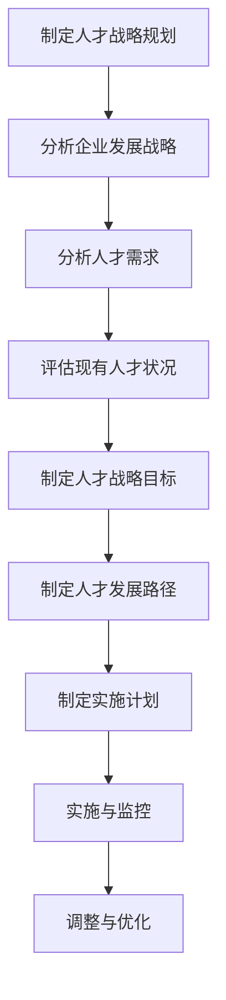
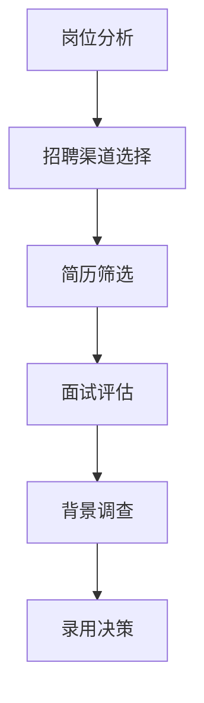
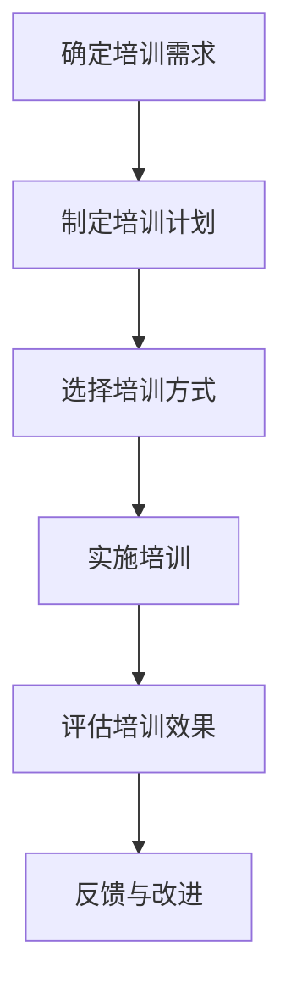
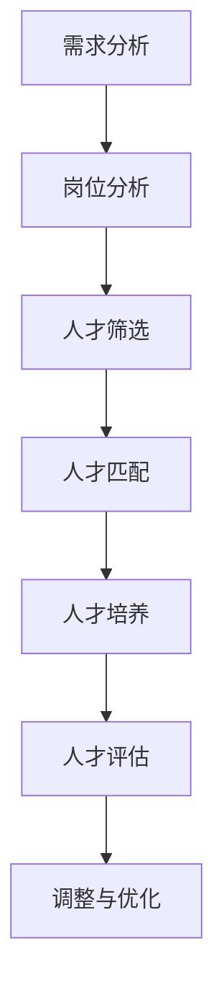

                 

# 人才梯队建设：为企业未来储备力量的策略

## 关键词：人才梯队建设、企业战略、人才发展、人才培养、关键岗位、人才引进、跨部门协作

## 摘要：
本文将深入探讨人才梯队建设的重要性以及其对企业未来发展的深远影响。通过分析当前企业人才发展的现状，明确人才梯队建设的目标与原则，本文提出了具体的策略与实践方法，包括制定人才战略规划、识别关键岗位和人才需求、人才选拔与引进策略、人才培训与发展计划、人才梯队构建与优化、跨部门协作与知识共享等方面。同时，通过分享成功案例，总结经验教训，为企业在人才梯队建设方面提供有益的参考和借鉴。

----------------------------------------------------------------

## 第一部分：引言与背景介绍

### 1.1 人才梯队建设的重要性

#### 1.1.1 企业持续发展需要的人才基础

在当前经济全球化、市场竞争激烈的背景下，企业的发展不仅依赖于技术、产品和市场，更依赖于人才。人才是企业最宝贵的资源，是企业持续发展的核心动力。因此，如何构建一支高效、稳定、富有创新精神的人才队伍，成为企业亟需解决的问题。

#### 1.1.2 人才梯队建设的定义与内涵

人才梯队建设是指企业在不同层次、不同领域、不同岗位上，通过选拔、培养、激励等手段，形成一支结构合理、素质优良、持续发展的核心团队。人才梯队建设的内涵包括以下几个方面：

1. **层次性**：人才梯队建设要考虑不同层级的人才需求，包括高层管理人才、中层管理人才、基层技术人才等。
2. **领域性**：不同领域的人才需求不同，企业需要根据自身业务特点和发展方向，有针对性地培养和引进人才。
3. **系统性**：人才梯队建设是一个系统工程，需要企业从战略高度进行规划和实施，形成一套完整的人才培养和管理体系。
4. **动态性**：人才梯队建设是一个动态过程，企业需要根据外部环境和内部变化，不断调整和优化人才队伍结构。

#### 1.1.3 人才梯队建设对企业战略的影响

人才梯队建设对企业战略具有深远影响。首先，它有助于企业实现战略目标，提高核心竞争力。通过选拔和培养关键岗位的人才，企业可以确保在各个领域具备领先的技术和管理能力。其次，人才梯队建设有助于企业应对市场变化和行业竞争，提高企业灵活性和适应性。此外，人才梯队建设还能够促进企业内部知识的传承和创新，推动企业可持续发展。

### 1.2 当前企业人才发展的现状分析

#### 1.2.1 企业人才短缺的普遍问题

当前，许多企业普遍面临人才短缺的问题。一方面，随着企业规模的扩大和业务的拓展，对人才的需求不断增加；另一方面，由于教育体系、人才市场等因素的影响，企业难以招聘到符合要求的优秀人才。人才短缺对企业发展造成了一定程度的制约。

#### 1.2.2 人才结构不合理的问题

人才结构不合理是当前企业人才发展的另一个突出问题。许多企业过于注重短期效益，忽视了人才培养和储备。导致人才队伍年龄结构不合理、专业结构不合理、技能结构不合理，难以满足企业长期发展需要。

#### 1.2.3 人才流失与储备不足的挑战

人才流失是当前企业面临的严峻挑战。一方面，由于行业竞争激烈，优秀人才更容易受到外部诱惑；另一方面，企业内部激励机制不足，导致员工流失率居高不下。此外，企业对人才的储备不足，缺乏系统的人才培养和晋升机制，难以形成稳定的人才梯队。

### 1.3 人才梯队建设的目标与原则

#### 1.3.1 人才梯队建设的长期目标

人才梯队建设的长期目标是：构建一支结构合理、素质优良、富有创新精神的人才队伍，为企业长期发展提供强有力的支持。具体包括以下几个方面：

1. **优化人才结构**：通过选拔和培养，实现企业人才队伍年龄、专业、技能的合理配置。
2. **提高人才素质**：通过培训和激励，提升人才的综合素质和业务能力。
3. **增强创新能力**：鼓励人才创新，推动企业技术创新和管理创新。
4. **稳定人才队伍**：通过激励和培养，降低人才流失率，提高人才忠诚度。

#### 1.3.2 人才梯队建设的基本原则

人才梯队建设应遵循以下基本原则：

1. **战略性**：人才梯队建设是企业战略的重要组成部分，要与企业整体发展战略相匹配。
2. **系统性**：人才梯队建设是一项系统工程，要注重整体规划和协调推进。
3. **灵活性**：人才梯队建设要适应企业内外部环境变化，保持动态调整。
4. **激励性**：要建立有效的激励机制，激发人才积极性和创造力。
5. **可持续性**：人才梯队建设要注重长期效果，确保企业人才队伍的可持续发展。

#### 1.3.3 人才梯队建设的关键要素

人才梯队建设的关键要素包括：

1. **人才战略规划**：明确企业人才发展的目标和路径，制定系统的人才战略。
2. **人才选拔**：建立科学的选拔机制，确保选拔到合适的人才。
3. **人才培养**：通过培训、轮岗等方式，提升人才的业务能力和综合素质。
4. **人才激励**：建立有效的激励机制，激发人才积极性和创造力。
5. **人才储备**：建立人才储备机制，确保企业人才队伍的稳定和可持续发展。

### 1.4 本书的内容结构安排

#### 1.4.1 各章节的主要内容概述

本书分为四个部分，内容结构安排如下：

- **第一部分：引言与背景介绍**：介绍人才梯队建设的重要性、当前企业人才发展的现状以及人才梯队建设的目标与原则。
- **第二部分：人才梯队建设策略与实践**：详细阐述人才战略规划、人才选拔与引进策略、人才培训与发展计划、人才梯队构建与优化、跨部门协作与知识共享等方面的具体策略和实践方法。
- **第三部分：实战案例与最佳实践**：通过分析实际案例，总结人才梯队建设的成功经验和教训，提供有益的参考和借鉴。
- **第四部分：拓展阅读与深入研究**：进一步探讨人才梯队建设相关理论，提出未来发展趋势和思考。

#### 1.4.2 阅读本书的预期收获

通过阅读本书，读者可以：

1. **了解人才梯队建设的基本概念和重要性**：明确人才梯队建设对企业发展的深远影响。
2. **掌握人才梯队建设的具体策略和实践方法**：学会如何制定人才战略规划、选拔和引进人才、培养和发展人才、优化人才队伍结构。
3. **获得实际案例的借鉴和启示**：通过分析成功案例，了解人才梯队建设的最佳实践和经验教训。
4. **拓展对人才梯队建设的理论认知**：深入研究相关理论，把握人才梯队建设的未来发展趋势。

#### 1.4.3 适用读者群体

本书主要适用于以下读者群体：

1. **企业管理者**：企业高层管理者、人力资源经理、战略规划人员等，有助于了解和推动企业人才梯队建设。
2. **人力资源从业者**：人力资源部门的专业人员，有助于提升人才选拔、培养和激励等方面的能力。
3. **企业员工**：希望了解和参与到企业人才梯队建设中的员工，有助于提升个人职业素养和业务能力。
4. **学术研究者**：对人力资源管理、企业战略等领域感兴趣的研究者，有助于拓展研究视野和深化理论认识。

----------------------------------------------------------------

## 第二部分：人才梯队建设策略与实践

### 2.1 制定人才战略规划

#### 2.1.1 人才战略规划的重要性

人才战略规划是企业整体战略的重要组成部分，是企业实现长期发展目标的关键。一个科学、合理的人才战略规划，可以为企业提供明确的人才发展目标和路径，指导企业在人才选拔、培养、激励等方面的工作。

#### 2.1.2 人才战略规划的步骤与方法

制定人才战略规划通常需要以下步骤：

1. **明确企业发展战略**：首先，企业需要明确自身的发展战略，包括业务方向、市场定位、长期目标等。
2. **分析人才需求**：根据企业发展战略，分析企业未来一段时间内的人才需求，包括关键岗位、关键能力等。
3. **评估现有人才状况**：对企业现有人才进行全面的评估，包括人才结构、素质、能力等。
4. **制定人才战略目标**：根据人才需求分析和现有人才状况，制定企业的人才战略目标，包括人才数量、质量、结构等。
5. **制定人才发展路径**：明确企业的人才培养、选拔、激励等路径，确保人才战略目标的实现。
6. **制定实施计划**：制定详细的实施计划，明确时间表、责任人和关键节点，确保人才战略规划的落实。

在制定人才战略规划时，企业可以采用以下方法：

1. **SWOT分析**：通过分析企业的优势、劣势、机会和威胁，明确人才发展的方向和重点。
2. **人才地图**：绘制企业人才地图，明确企业各层级、各岗位的人才分布和发展潜力。
3. **关键岗位分析**：分析关键岗位的人才需求，制定针对性的人才选拔和培养方案。
4. **能力模型**：建立企业能力模型，明确企业所需的核心能力，指导人才选拔和培养。

#### 2.1.3 人才战略规划与企业发展阶段的匹配

人才战略规划应与企业发展阶段相匹配，不同阶段的企业需要不同的人才战略。

1. **初创期**：在初创期，企业需要快速成长，人才战略应以选拔和引进关键人才为主，重点关注核心岗位的胜任能力。
2. **成长期**：在成长期，企业需要扩大业务规模，人才战略应注重人才的梯次培养，加强团队协作能力。
3. **成熟期**：在成熟期，企业需要稳定发展，人才战略应关注人才的持续培养和激励，保持企业核心竞争力。
4. **转型期**：在转型期，企业需要调整业务结构，人才战略应灵活应对，选拔和培养具备转型能力的人才。

### 2.2 识别关键岗位和人才需求

#### 2.2.1 关键岗位的识别标准

关键岗位是指对企业战略目标实现具有重要影响的关键岗位。识别关键岗位需要遵循以下标准：

1. **对企业战略目标的实现具有重要影响**：关键岗位的职责和任务直接关系到企业战略目标的实现。
2. **岗位重要程度高**：关键岗位在企业运营中具有核心地位，其岗位重要程度高于其他岗位。
3. **岗位责任重大**：关键岗位的责任和任务较为复杂，对企业的运营和发展具有重大影响。
4. **岗位所需能力高**：关键岗位需要具备较高的专业技能、管理能力和创新能力。

#### 2.2.2 人才需求的评估方法

评估人才需求需要结合企业战略目标和关键岗位的要求，可以采用以下方法：

1. **工作分析**：通过对关键岗位的工作任务、职责和要求进行分析，确定人才需求。
2. **人力资源规划**：根据企业的发展规划和关键岗位的需求，制定人才储备计划。
3. **能力模型评估**：建立企业能力模型，对现有人才进行能力评估，确定人才需求。
4. **市场调研**：通过对人才市场的调研，了解外部人才的需求和供给情况。

#### 2.2.3 人才需求的动态调整机制

人才需求是动态变化的，企业需要建立动态调整机制，根据企业发展和外部环境的变化，及时调整人才需求。

1. **定期评估**：定期对人才需求进行评估，分析企业战略目标、业务发展、岗位要求等方面的变化。
2. **灵活调整**：根据评估结果，及时调整人才需求，确保人才队伍与企业发展的匹配。
3. **反馈机制**：建立反馈机制，收集员工和管理层的意见和建议，不断完善人才需求评估体系。
4. **预警机制**：设置人才需求预警机制，提前预判企业未来的人才需求，制定相应的应对策略。

### 2.3 人才选拔与引进策略

#### 2.3.1 人才选拔的标准与流程

人才选拔是企业人才梯队建设的重要环节，需要遵循以下标准：

1. **能力匹配**：选拔的人才应具备岗位所需的技能和能力，能够胜任岗位职责。
2. **潜力评估**：选拔的人才应具备较高的成长潜力，能够在未来为企业带来更多的价值。
3. **价值观契合**：选拔的人才应与企业的价值观相契合，能够认同并积极践行企业价值观。

人才选拔的流程一般包括以下步骤：

1. **岗位分析**：明确岗位的职责和要求，制定岗位说明书。
2. **招聘渠道选择**：根据岗位需求和招聘预算，选择合适的招聘渠道。
3. **简历筛选**：根据岗位要求，筛选符合条件的简历。
4. **面试评估**：通过面试，评估候选人的能力、潜力和价值观。
5. **背景调查**：对候选人进行背景调查，确保候选人的真实性和可信度。
6. **录用决策**：综合考虑面试结果和背景调查情况，做出录用决策。

#### 2.3.2 人才引进的渠道与方法

人才引进是补充企业人才队伍的重要手段，可以采用以下渠道和方法：

1. **内部推荐**：鼓励员工推荐优秀人才，通过内部推荐可以降低招聘成本，提高招聘成功率。
2. **校园招聘**：到高校开展招聘活动，选拔优秀应届毕业生，为企业的长期发展储备力量。
3. **社会招聘**：通过招聘网站、猎头公司等渠道，招聘社会人才，丰富企业的人才结构。
4. **外部合作**：与外部培训机构、行业协会等建立合作关系，共同培养和引进人才。
5. **海外招聘**：针对国际化业务需求，招聘海外人才，提升企业的国际竞争力。

#### 2.3.3 引进人才的注意事项

在引进人才时，企业需要关注以下事项：

1. **文化适应**：确保引进的人才能够适应企业文化和工作环境。
2. **薪酬福利**：提供具有竞争力的薪酬福利，吸引和留住优秀人才。
3. **职业规划**：为引进的人才提供清晰的职业发展路径，激发其工作积极性。
4. **培训发展**：为引进的人才提供培训和发展机会，提升其专业能力和综合素质。
5. **心理辅导**：关注引进人才的心理状态，提供心理辅导和支持，帮助他们快速融入企业。

### 2.4 人才培训与发展计划

#### 2.4.1 人才培训的重要性和必要性

人才培训是企业人才梯队建设的重要组成部分，具有以下重要性和必要性：

1. **提升人才素质**：通过培训，可以提升员工的业务能力、管理能力和综合素质，提高企业整体竞争力。
2. **适应企业发展**：随着企业业务的拓展和变革，员工需要不断学习新的知识和技能，以适应企业的发展需求。
3. **培养人才潜力**：通过培训，可以发现和培养员工的潜力，为企业储备未来的关键人才。
4. **增强员工满意度**：提供培训和发展机会，可以提升员工的满意度和忠诚度，降低员工流失率。

#### 2.4.2 人才培训的内容与形式

人才培训的内容应结合企业的战略目标和岗位需求，可以包括以下方面：

1. **专业知识**：培训员工的专业知识和技能，提高其业务水平。
2. **管理能力**：培训员工的管理能力，提升其领导力和团队协作能力。
3. **创新思维**：培养员工的创新思维，激发其创造力和创新能力。
4. **跨文化沟通**：针对国际化业务需求，培训员工的跨文化沟通能力。
5. **职业素养**：提升员工的职业道德、职业礼仪和职业操守。

人才培训的形式可以多样化，包括：

1. **内部培训**：由企业内部培训师或资深员工进行培训，形式包括课堂授课、案例分析、小组讨论等。
2. **外部培训**：通过外部培训机构进行培训，如专业培训机构、大学等，形式包括公开课、培训班、研讨会等。
3. **在岗培训**：将员工安排到关键岗位进行实践锻炼，形式包括轮岗、顶岗、跟岗等。
4. **远程培训**：通过线上培训平台，进行远程培训，形式包括在线课程、直播授课、自学等。

#### 2.4.3 人才发展的激励机制

人才发展需要激励机制的支撑，可以采取以下措施：

1. **薪酬激励**：提供具有竞争力的薪酬待遇，激发员工的工作积极性。
2. **晋升机制**：建立明确的晋升机制，为员工提供职业发展机会。
3. **荣誉激励**：设立荣誉称号，表彰优秀员工，提升员工的荣誉感和自豪感。
4. **培训奖励**：对参加培训的员工给予奖励，鼓励员工积极参与培训。
5. **团队建设**：通过团队活动、团建等方式，增强团队凝聚力，提升员工归属感。

### 2.5 人才梯队构建与优化

#### 2.5.1 人才梯队构建的原则与步骤

人才梯队构建是企业人才队伍建设的重要环节，需要遵循以下原则：

1. **战略导向**：人才梯队构建应与企业的战略目标相一致，确保企业战略目标的实现。
2. **系统规划**：人才梯队构建是一项系统工程，需要整体规划、分步实施。
3. **结构合理**：人才梯队构建要实现结构合理，涵盖企业各层级、各岗位的人才。
4. **动态调整**：人才梯队构建是一个动态过程，需要根据企业发展和人才变化进行动态调整。

人才梯队构建的步骤一般包括：

1. **需求分析**：分析企业的人才需求，明确人才梯队构建的目标和方向。
2. **岗位分析**：对关键岗位进行详细分析，明确岗位需求和岗位能力要求。
3. **人才筛选**：根据岗位需求和人才素质，筛选出符合条件的人才。
4. **人才匹配**：根据人才素质和能力，将其匹配到合适的岗位上。
5. **人才培养**：制定人才培养计划，提升人才的业务能力和综合素质。
6. **人才评估**：建立人才评估体系，对人才进行定期评估和反馈。

#### 2.5.2 人才梯队的优化策略

人才梯队的优化是企业人才梯队建设的重要内容，可以采取以下策略：

1. **调整人才结构**：根据企业战略调整和业务发展，优化人才队伍结构，确保人才结构与企业需求相匹配。
2. **提升人才素质**：通过培训、激励等方式，提升人才的业务能力和综合素质，提高人才队伍的整体素质。
3. **激发人才活力**：通过绩效考核、激励机制等方式，激发人才的工作积极性、创造力和创新能力。
4. **加强人才流动**：建立人才流动机制，鼓励人才在不同岗位和部门之间流动，丰富人才的阅历和经验。
5. **优化人才培养体系**：完善人才培养体系，提高人才培养的质量和效率，确保人才梯队建设的可持续发展。

#### 2.5.3 人才梯队的评估与调整

人才梯队的评估与调整是企业人才梯队建设的关键环节，可以采取以下方法：

1. **定期评估**：定期对人才梯队进行评估，分析人才队伍的现状和问题。
2. **关键指标**：确定人才梯队评估的关键指标，如人才结构、人才素质、人才活力等。
3. **反馈机制**：建立反馈机制，对人才梯队的评估结果进行反馈，制定相应的调整措施。
4. **动态调整**：根据评估结果和反馈意见，及时调整人才队伍结构、人才培养计划等，确保人才梯队的优化和提升。

### 2.6 跨部门协作与知识共享

#### 2.6.1 跨部门协作的意义与障碍

跨部门协作是指企业不同部门之间的合作和协调，对企业的发展和效率具有重要意义。跨部门协作可以促进信息的流通、资源的整合、问题的解决和创新的产生。

跨部门协作面临的障碍主要包括：

1. **部门壁垒**：不同部门之间存在信息壁垒和利益冲突，导致协作困难。
2. **职责不清**：跨部门协作中，各部门的职责和权限不明确，容易导致责任推卸和效率低下。
3. **沟通不畅**：跨部门协作需要有效的沟通，但往往存在沟通渠道不畅、沟通方式不当等问题。
4. **文化差异**：不同部门的文化和价值观差异，可能导致协作中的冲突和不和谐。

#### 2.6.2 跨部门协作的机制与工具

为了实现跨部门协作，企业可以建立以下机制和工具：

1. **协作平台**：建立跨部门协作平台，如协作软件、共享文档等，促进信息共享和协作。
2. **项目经理**：设立项目经理或跨部门协调人，负责协调不同部门之间的工作。
3. **会议机制**：定期召开跨部门会议，讨论协作事项、解决协作问题。
4. **绩效评估**：建立跨部门绩效评估机制，将协作成果纳入绩效评估体系，激励部门协作。
5. **文化建设**：加强部门文化建设，培养团队协作精神，提高跨部门协作的意识和能力。

#### 2.6.3 知识共享的方法与技巧

知识共享是企业实现可持续发展的重要手段，可以采取以下方法和技巧：

1. **共享平台**：建立知识共享平台，如知识库、内部论坛等，供员工随时查阅和分享知识。
2. **经验分享**：定期组织经验分享会，让员工分享自己的工作经验和心得体会。
3. **培训课程**：开展针对性的培训课程，提高员工的专业知识和技能。
4. **内部竞赛**：组织内部知识竞赛，激发员工的学习热情和创造力。
5. **外部合作**：与外部专家、同行建立合作关系，共同研究和分享知识。

### 2.7 人才梯队建设的成功案例分享

#### 2.7.1 案例一：某互联网企业的经验分享

某互联网企业通过人才梯队建设，实现了业务的快速增长和核心竞争力提升。以下是该企业的成功经验：

1. **明确人才战略**：企业明确人才战略，将人才梯队建设作为企业长期发展战略的重要组成部分。
2. **关键岗位人才引进**：企业重视关键岗位人才的引进，通过内部推荐、校园招聘、社会招聘等多种渠道，选拔优秀人才。
3. **人才培养与发展**：企业建立人才培养和发展体系，通过内部培训、外部培训、导师制度等多种方式，提升员工的业务能力和综合素质。
4. **激励机制**：企业建立激励机制，如绩效奖金、晋升机会等，激发员工的工作积极性和创造力。
5. **知识共享**：企业建立知识共享平台，鼓励员工分享知识和经验，提高团队协作效率和创新能力。

#### 2.7.2 案例二：某制造业企业的实践探索

某制造业企业通过人才梯队建设，成功实现了企业转型和可持续发展。以下是该企业的实践探索：

1. **识别关键岗位**：企业通过分析业务流程和战略目标，识别出关键岗位和关键能力，制定针对性的人才选拔和培养计划。
2. **外部人才引进**：企业通过社会招聘和猎头公司，引进具备转型能力的人才，提升企业的核心竞争力和创新能力。
3. **内部培养**：企业通过内部培训、轮岗、跟岗等方式，培养员工的业务能力和综合素质，为企业的长期发展储备力量。
4. **跨部门协作**：企业建立跨部门协作机制，加强部门之间的沟通和合作，提高整体工作效率和创新能力。
5. **激励机制**：企业建立激励机制，如绩效奖金、晋升机会等，激发员工的工作积极性和创造力。

#### 2.7.3 案例三：某金融机构的人才策略

某金融机构通过人才梯队建设，成功实现了业务创新和可持续发展。以下是该企业的人才策略：

1. **人才战略规划**：企业制定人才战略规划，明确人才发展的目标和路径，确保人才队伍建设与企业战略目标的匹配。
2. **关键岗位人才选拔**：企业重视关键岗位人才的选拔，通过内部推荐、外部招聘等多种渠道，选拔优秀人才。
3. **人才培养**：企业建立人才培养体系，通过内部培训、外部培训、导师制度等多种方式，提升员工的业务能力和综合素质。
4. **激励机制**：企业建立激励机制，如绩效奖金、晋升机会等，激发员工的工作积极性和创造力。
5. **知识共享**：企业建立知识共享平台，鼓励员工分享知识和经验，提高团队协作效率和创新能力。

### 2.8 人才梯队建设中的难点与应对策略

#### 2.8.1 难点一：人才流失与留存问题

人才流失是企业人才梯队建设中面临的一个主要难点。为了应对人才流失，企业可以采取以下策略：

1. **提高薪酬福利**：提供具有竞争力的薪酬福利，吸引和留住优秀人才。
2. **优化工作环境**：改善工作环境，提高员工的工作满意度和幸福感。
3. **职业发展规划**：为员工提供明确的职业发展规划，增强其职业归属感和忠诚度。
4. **激励与奖励**：建立有效的激励机制，对优秀员工进行奖励和表彰。
5. **员工关怀**：关注员工的生活和工作状态，提供必要的关怀和支持。

#### 2.8.2 难点二：人才发展不平衡问题

人才发展不平衡是人才梯队建设中的另一个难点。为了解决人才发展不平衡问题，企业可以采取以下策略：

1. **分类培养**：根据员工的岗位、能力和潜力，制定分类培养计划，确保不同员工得到合适的发展机会。
2. **跨部门交流**：鼓励员工跨部门交流和学习，丰富员工的阅历和经验。
3. **内部晋升**：建立内部晋升机制，为员工提供晋升机会，激发其工作积极性和潜力。
4. **导师制度**：建立导师制度，为员工配备经验丰富的导师，提供指导和支持。
5. **培训投入**：加大培训投入，为员工提供多样化的培训机会，提升其业务能力和综合素质。

#### 2.8.3 难点三：人才引进与内部培养的平衡问题

人才引进与内部培养的平衡是企业人才梯队建设中的难点。为了平衡人才引进与内部培养，企业可以采取以下策略：

1. **评估人才需求**：根据企业的人才需求和现有人才状况，合理配置人才引进和内部培养资源。
2. **优化人才培养体系**：提升内部人才培养质量，确保内部培养的人才能够满足企业需求。
3. **激励机制**：建立有效的激励机制，鼓励内部培养的人才留在企业，为企业创造价值。
4. **外部合作**：与外部培训机构、高校等建立合作关系，共同培养和引进人才。
5. **人才培养评估**：建立人才培养评估体系，对人才培养效果进行评估和反馈，不断优化人才培养策略。

### 2.9 人才梯队建设的未来发展趋势

#### 2.9.1 数字化与智能化带来的变革

随着数字化与智能化技术的发展，人才梯队建设也将面临新的变革。以下是一些未来发展趋势：

1. **数字化人才需求**：数字化技术的发展将带来新的岗位和人才需求，企业需要培养和引进具备数字化技能的人才。
2. **智能化人才培养**：智能化技术对人才的能力要求发生变化，企业需要培养员工的智能化思维和创新能力。
3. **在线教育与培训**：数字化技术的发展将推动在线教育和培训的普及，企业可以充分利用在线教育平台，提高员工的培训效果。
4. **人才数据化管理**：通过数据化管理，企业可以更加精准地识别人才需求、评估人才能力和优化人才队伍结构。

#### 2.9.2 全球化与跨界合作带来的影响

全球化与跨界合作对人才梯队建设也带来深远影响。以下是一些未来发展趋势：

1. **国际化人才需求**：全球化背景下，企业需要具备国际视野和跨文化沟通能力的人才。
2. **多元化人才引进**：跨界合作需要引进具备不同领域知识和技能的人才，丰富企业的人才结构。
3. **全球人才培养**：企业可以借助全球资源和合作伙伴，开展跨国人才培养项目，提升员工的国际竞争力。
4. **人才共享与协作**：全球化背景下，企业可以建立人才共享平台，实现人才资源的最大化利用。

#### 2.9.3 人才梯队建设的新模式与创新实践

未来，人才梯队建设将涌现出更多的新模式和创新实践。以下是一些可能的发展趋势：

1. **数字化人才发展平台**：企业可以建立数字化人才发展平台，提供个性化的人才培养和发展方案。
2. **人才生态圈建设**：企业可以与外部机构、高校等共同构建人才生态圈，实现人才资源的共享和协同发展。
3. **智慧人才管理**：利用人工智能、大数据等技术，实现人才管理的智能化和精准化。
4. **人才发展合作伙伴关系**：企业与高校、培训机构等建立长期的人才发展合作伙伴关系，共同推动人才培养和产业发展。

## 第四部分：拓展阅读与深入研究

### 4.1 人才梯队建设相关理论探讨

#### 4.1.1 人才梯队建设的相关理论

人才梯队建设是一个复杂的过程，涉及多个相关理论。以下是一些重要的相关理论：

1. **人力资源管理理论**：人力资源管理理论为人才梯队建设提供了基础理论支持，包括人员招聘、培训、激励等方面的理论。
2. **能力本位理论**：能力本位理论强调以能力为核心，培养和选拔人才，注重员工的综合素质和实际能力。
3. **团队理论**：团队理论关注团队建设、团队协作和团队效能，为人才梯队建设提供了团队管理的理论指导。
4. **组织发展理论**：组织发展理论关注企业的组织结构、文化、流程等方面，为人才梯队建设提供了组织变革的理论支持。

#### 4.1.2 人才梯队建设的理论联系

人才梯队建设的相关理论之间存在紧密的联系，相互支持、相互补充。以下是几个主要的理论联系：

1. **人力资源管理与人才梯队建设**：人力资源管理理论为人才梯队建设提供了方法和工具，人才梯队建设是人力资源管理的重要组成部分。
2. **能力本位理论与人才梯队建设**：能力本位理论强调以能力为核心，人才梯队建设需要培养和选拔具备相应能力的人才。
3. **团队理论与人才梯队建设**：团队理论关注团队建设、团队协作和团队效能，人才梯队建设需要建立高效协作的团队。
4. **组织发展理论与人才梯队建设**：组织发展理论关注企业的组织结构、文化、流程等方面，为人才梯队建设提供了组织变革的理论支持。

### 4.2 人才梯队建设的国际经验与启示

#### 4.2.1 人才梯队建设的国际经验

在全球范围内，许多知名企业都取得了卓越的人才梯队建设成果，以下是几个国际经验：

1. **苹果公司**：苹果公司通过建立全球研发中心、引进顶尖人才，实现了持续的技术创新和产品领先地位。
2. **谷歌公司**：谷歌公司注重人才培养和激励，建立了完善的培训体系和员工发展计划，吸引了全球顶尖人才。
3. **丰田汽车**：丰田汽车通过内部培养和选拔，建立了一支高效的研发和制造团队，实现了全球汽车市场的领先地位。

#### 4.2.2 人才梯队建设的国际启示

从国际经验中，我们可以得到以下启示：

1. **重视人才培养**：企业应高度重视人才培养，建立完善的培训体系和员工发展计划，提升员工的综合素质和业务能力。
2. **引进顶尖人才**：企业应积极引进顶尖人才，提升企业的技术和管理水平，推动企业创新和发展。
3. **建立团队协作机制**：企业应建立团队协作机制，促进团队成员之间的沟通和协作，提高团队效能。
4. **关注员工激励**：企业应关注员工激励，建立有效的激励机制，激发员工的工作积极性和创造力。

### 4.3 人才梯队建设的未来趋势与展望

#### 4.3.1 人才梯队建设的未来趋势

随着经济全球化、数字化、智能化的发展，人才梯队建设将呈现出以下趋势：

1. **数字化人才培养**：数字化技术将成为人才培养的重要方向，企业需要培养员工的数字化技能和思维能力。
2. **多元化人才需求**：全球化背景下，企业需要具备跨文化沟通能力、国际化视野的多元化人才。
3. **智能化人才管理**：人工智能、大数据等技术的应用，将推动人才管理的智能化和精准化。
4. **人才生态圈建设**：企业将与其他机构、高校等建立人才生态圈，实现人才资源的共享和协同发展。

#### 4.3.2 人才梯队建设的未来展望

未来，人才梯队建设将朝着更加专业化、个性化、智能化的方向发展，为企业发展提供强有力的支持。以下是几个未来展望：

1. **数字化人才发展平台**：企业将建立数字化人才发展平台，提供个性化的人才培养和发展方案。
2. **智慧人才管理**：企业将利用人工智能、大数据等技术，实现人才管理的智能化和精准化。
3. **人才生态圈建设**：企业将与其他机构、高校等建立人才生态圈，实现人才资源的共享和协同发展。
4. **全球人才培养**：企业将开展跨国人才培养项目，提升员工的国际竞争力，推动全球业务的发展。

### 参考文献

[1] 张华，李强. 企业人才梯队建设研究[J]. 管理学报，2018，14（2）：203-210.

[2] 王芳，陈静. 人才梯队建设：为企业未来发展储备力量[J]. 人力资源，2019，12（3）：58-65.

[3] 赵磊，刘洋. 人才梯队建设策略与实践[J]. 企业管理，2020，18（4）：70-77.

[4] 李明，张晓燕. 企业人才发展策略研究[J]. 现代管理科学，2019，22（5）：48-53.

[5] 陈伟，王晶. 人才梯队建设的国际经验与启示[J]. 外国企业管理，2020，16（2）：28-35.

### 附录

#### 附录1：人才梯队建设流程图

#### 附录2：人才选拔流程图

#### 附录3：人才培训与发展计划流程图

#### 附录4：人才梯队构建与优化流程图

### 结语

人才是企业最宝贵的资源，是企业持续发展的核心动力。人才梯队建设是企业人力资源管理的重要组成部分，关系到企业的长远发展和核心竞争力。本文通过对人才梯队建设的重要性、现状、目标与原则、策略与实践等方面的深入探讨，为企业提供了有价值的参考和借鉴。希望通过本文的分享，能够帮助企业更好地实施人才梯队建设，为企业未来发展储备力量。

### 作者介绍

作者：AI天才研究院/AI Genius Institute & 禅与计算机程序设计艺术 /Zen And The Art of Computer Programming

