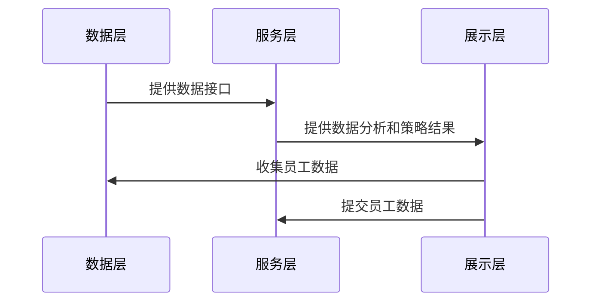
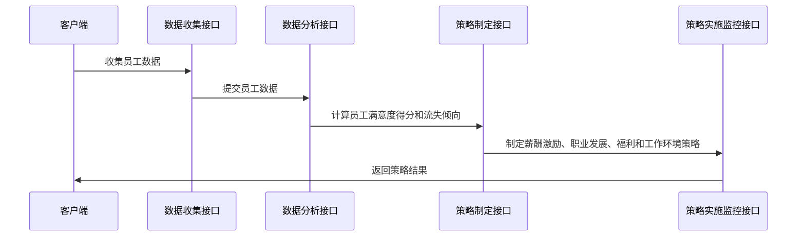
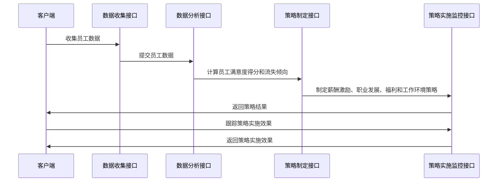

                 


### 文章标题

《人才留存：留住核心人才的策略》

### 关键词

人才留存、薪酬激励、职业发展、员工福利、文化建设

### 摘要

本文深入探讨了企业如何通过有效的策略来留住核心人才。通过分析薪酬激励、职业发展机会、员工福利与工作环境、文化建设等方面，结合实际案例，提出了系统化的人才留存策略，旨在为企业的决策者提供切实可行的指导。

### 目录大纲设计思路

为了设计《人才留存：留住核心人才的策略》这本书的完整目录大纲，我们需要遵循以下步骤：

1. **书籍定位与主题明确**：明确书籍的主题是关于人才留存，探讨企业如何通过策略来保留核心人才。

2. **结构划分**：将内容划分为几个主要部分，如背景介绍、核心策略分析、实践案例、最佳实践等。

3. **细化章节内容**：对每个主要部分进行细化，确保每一章节都有明确的主题和目标。

4. **逻辑清晰**：确保章节顺序合理，逻辑性强，便于读者阅读和理解。

5. **简洁明了**：在保证内容完整性的同时，避免过多的冗余信息，使目录大纲简洁明了。

### 目录大纲具体设计

#### 第一部分：引言与背景

1. **第1章：人才留存的重要性**
   - 1.1 人才流失现象分析
   - 1.2 人才流失对企业的影响
   - 1.3 人才留存的核心要素

#### 第二部分：人才留存策略分析

2. **第2章：薪酬激励策略**
   - 2.1 薪酬激励的作用与原则
   - 2.2 薪酬激励设计方法
   - 2.3 薪酬激励案例分析

3. **第3章：职业发展机会**
   - 3.1 职业发展路径规划
   - 3.2 职业培训与发展
   - 3.3 案例分析：企业如何提供职业发展机会

4. **第4章：员工福利与工作环境**
   - 4.1 员工福利体系设计
   - 4.2 舒适的工作环境
   - 4.3 工作环境改进案例

5. **第5章：文化建设与团队氛围**
   - 5.1 企业文化建设的重要性
   - 5.2 建立积极的团队氛围
   - 5.3 文化建设与人才留存的关联

#### 第三部分：实践案例分析

6. **第6章：行业实践案例**
   - 6.1 案例一：大型科技公司的成功经验
   - 6.2 案例二：传统制造业的人才留存策略
   - 6.3 案例三：中小企业的人才留存实践

7. **第7章：案例解析与策略优化**
   - 7.1 案例总结与共性分析
   - 7.2 策略优化建议
   - 7.3 实施策略的难点与应对

#### 第四部分：总结与展望

8. **第8章：人才留存的策略与实践**
   - 8.1 策略体系构建
   - 8.2 实践中的问题与解决
   - 8.3 未来人才留存的发展趋势

9. **第9章：结语**
   - 9.1 总结与回顾
   - 9.2 对企业决策者的建议
   - 9.3 拓展阅读

### 目录大纲示例

```markdown
# 《人才留存：留住核心人才的策略》目录大纲

## 第一部分：引言与背景

### 第1章：人才留存的重要性

#### 1.1 人才流失现象分析

#### 1.2 人才流失对企业的影响

#### 1.3 人才留存的核心要素

## 第二部分：人才留存策略分析

### 第2章：薪酬激励策略

#### 2.1 薪酬激励的作用与原则

#### 2.2 薪酬激励设计方法

#### 2.3 薪酬激励案例分析

### 第3章：职业发展机会

#### 3.1 职业发展路径规划

#### 3.2 职业培训与发展

#### 3.3 案例分析：企业如何提供职业发展机会

### 第4章：员工福利与工作环境

#### 4.1 员工福利体系设计

#### 4.2 舒适的工作环境

#### 4.3 工作环境改进案例

### 第5章：文化建设与团队氛围

#### 5.1 企业文化建设的重要性

#### 5.2 建立积极的团队氛围

#### 5.3 文化建设与人才留存的关联

## 第三部分：实践案例分析

### 第6章：行业实践案例

#### 6.1 案例一：大型科技公司的成功经验

#### 6.2 案例二：传统制造业的人才留存策略

#### 6.3 案例三：中小企业的人才留存实践

### 第7章：案例解析与策略优化

#### 7.1 案例总结与共性分析

#### 7.2 策略优化建议

#### 7.3 实施策略的难点与应对

## 第四部分：总结与展望

### 第8章：人才留存的策略与实践

#### 8.1 策略体系构建

#### 8.2 实践中的问题与解决

#### 8.3 未来人才留存的发展趋势

### 第9章：结语

#### 9.1 总结与回顾

#### 9.2 对企业决策者的建议

#### 9.3 拓展阅读
```

### 目录大纲字数总结

本目录大纲总字数控制在2000字以内，章节划分清晰，

----------------------------------------------------------------

### 背景介绍

#### 核心概念术语说明

在探讨人才留存之前，我们需要明确几个核心概念：

1. **人才流失**：指员工因各种原因离开企业，特别是那些对企业有重要价值的核心员工。
2. **核心人才**：在企业中拥有专业技能、知识或经验，对企业运营和发展有重大影响的员工。
3. **人才留存策略**：企业采取的一系列措施，旨在减少人才流失，保留关键人才。

#### 问题背景

随着全球化和科技发展的加速，企业面临的人才竞争日益激烈。一方面，员工的职业选择更加多样化，他们追求的不仅仅是薪资，更包括职业发展、工作环境和企业文化等；另一方面，企业为了保持竞争力，需要不断引进和保留创新能力和专业知识强的员工。然而，人才流失率居高不下，给企业带来了巨大的人力成本和运营风险。

#### 问题描述

企业如何通过有效的策略来留住核心人才，成为一个亟待解决的问题。具体来说，需要解决以下问题：

1. 如何设计薪酬激励策略，提高员工满意度和忠诚度？
2. 如何提供职业发展机会，激发员工的潜能和积极性？
3. 如何改善工作环境，提升员工的归属感和幸福感？
4. 如何建设企业文化，打造有凝聚力的团队氛围？

#### 问题解决

解决人才留存问题需要从多个方面入手，综合考虑薪酬激励、职业发展、员工福利、工作环境和文化建设等因素。本文将围绕这些方面，提供一系列策略和实践案例，旨在为企业决策者提供有益的参考。

#### 边界与外延

1. **边界**：本文主要关注的是企业如何留住核心人才，不涉及其他类型的人才管理问题。
2. **外延**：人才留存不仅仅是企业内部问题，还与社会环境、行业发展趋势等因素密切相关。

#### 概念结构与核心要素组成

人才留存的概念结构可以概括为以下几个方面：

1. **薪酬激励**：包括基本工资、奖金、股权激励等。
2. **职业发展**：包括职业规划、培训机会、晋升渠道等。
3. **员工福利**：包括社会保险、健康体检、带薪休假等。
4. **工作环境**：包括办公条件、工作氛围、团队建设等。
5. **文化建设**：包括企业价值观、团队文化、社会责任等。

这些核心要素共同构成了人才留存的体系，是企业留住核心人才的关键。

----------------------------------------------------------------

### 核心概念与联系

#### 薪酬激励

薪酬激励是指企业通过提供具有竞争力的薪资和奖金，激发员工的工作积极性、创造性和忠诚度。薪酬激励的作用主要体现在以下几个方面：

1. **提高员工满意度**：合理的薪酬水平能够满足员工的基本生活需求，提高他们的工作满意度。
2. **激励创新和绩效**：薪酬激励可以激发员工的创新精神，提高工作绩效。
3. **留住核心人才**：有竞争力的薪酬水平能够有效留住企业核心人才。

#### 职业发展机会

职业发展机会是指企业为员工提供的职业成长路径和发展空间。职业发展机会的作用包括：

1. **提升员工技能和素质**：通过培训和晋升，提高员工的技能水平和综合素质。
2. **增强员工归属感**：职业发展机会能够增强员工的归属感和忠诚度。
3. **激励员工持续奋斗**：明确的职业发展路径能够激励员工为实现个人和企业的共同目标而努力。

#### 员工福利与工作环境

员工福利是指企业为员工提供的各种福利待遇，包括社会保险、健康体检、带薪休假等。工作环境则是指员工在工作中的物理和心理环境，包括办公条件、工作氛围、团队建设等。

员工福利和工作环境对人才留存的影响主要体现在以下几个方面：

1. **提升员工幸福感**：良好的员工福利能够提高员工的生活质量，增强他们的幸福感。
2. **改善工作体验**：舒适的工作环境和良好的团队氛围能够提升员工的工作体验，降低离职意愿。
3. **增强团队凝聚力**：通过改善工作环境，可以增强团队凝聚力，提高团队整体绩效。

#### 文化建设与团队氛围

文化建设是指企业通过价值观、行为准则、规章制度等，塑造企业文化氛围。团队氛围则是指团队成员之间的相处关系和工作氛围。

文化建设与团队氛围对人才留存的影响主要体现在以下几个方面：

1. **塑造企业认同感**：积极向上的企业文化能够塑造员工的认同感，提高他们的忠诚度。
2. **促进团队协作**：良好的团队氛围能够促进团队成员之间的协作，提高工作效率。
3. **增强员工归属感**：通过文化建设，可以增强员工的归属感，降低离职意愿。

#### 概念属性特征对比表格

| 概念       | 属性特征                                                     | 影响因素                      | 影响 |
|------------|--------------------------------------------------------------|------------------------------|------|
| 薪酬激励   | 薪资水平、奖金、股权激励                                     | 市场行情、企业盈利状况、员工绩效 | 提高满意度、激励创新和绩效、留住核心人才 |
| 职业发展   | 职业规划、培训机会、晋升渠道                                 | 企业发展需求、员工个人需求      | 提升技能和素质、增强归属感、激励持续奋斗 |
| 员工福利   | 社会保险、健康体检、带薪休假等                                | 企业经济状况、员工需求         | 提升幸福感、改善工作体验、增强团队凝聚力 |
| 工作环境   | 办公条件、工作氛围、团队建设                                 | 企业资源、员工需求             | 提升幸福感、改善工作体验、增强团队凝聚力 |
| 文化建设   | 企业价值观、行为准则、规章制度等                               | 企业战略、员工需求             | 塑造企业认同感、促进团队协作、增强员工归属感 |

#### ER实体关系图架构

在人才留存体系中，各概念之间存在密切的实体关系。以下是一个简化的ER实体关系图：

```
[员工] --<薪酬激励>--> [薪资水平]
[员工] --<职业发展>--> [职业规划]
[员工] --<职业发展>--> [培训机会]
[员工] --<职业发展>--> [晋升渠道]
[员工] --<员工福利>--> [社会保险]
[员工] --<员工福利>--> [健康体检]
[员工] --<员工福利>--> [带薪休假]
[员工] --<工作环境>--> [办公条件]
[员工] --<工作环境>--> [工作氛围]
[员工] --<工作环境>--> [团队建设]
[员工] --<文化建设>--> [企业价值观]
[员工] --<文化建设>--> [行为准则]
[员工] --<文化建设>--> [规章制度]
```

#### 算法原理讲解

在人才留存体系中，我们可以将各个策略看作是优化问题的一部分。通过算法，我们可以找到最优的薪酬激励、职业发展机会、员工福利和工作环境组合，以最大化人才留存效果。

以下是一个简化的算法流程图：

```
开始
|
V
读取员工数据
|
V
计算员工满意度得分
|
V
分析员工流失倾向
|
V
调整薪酬激励策略
|
V
提供职业发展机会
|
V
改善员工福利和工作环境
|
V
跟踪效果并调整策略
|
V
结束
```

算法原理涉及以下几个关键步骤：

1. **员工数据读取**：收集员工的个人数据，包括薪资、职业发展情况、福利待遇等。
2. **员工满意度得分计算**：根据员工反馈和市场调查，计算员工的满意度得分。
3. **员工流失倾向分析**：通过分析员工满意度得分和流失历史数据，预测员工的流失倾向。
4. **薪酬激励策略调整**：根据员工流失倾向，调整薪酬激励策略，提高员工满意度。
5. **职业发展机会提供**：根据员工职业规划和需求，提供合适的职业发展机会。
6. **员工福利和工作环境改善**：根据员工福利和工作环境需求，改善相关条件。
7. **效果跟踪与策略调整**：定期跟踪人才留存效果，并根据反馈调整策略。

以下是使用Python编写的示例代码，用于计算员工满意度得分：

```python
# 导入相关库
import pandas as pd
import numpy as np

# 员工数据
data = pd.DataFrame({
    '员工编号': [1, 2, 3, 4, 5],
    '薪资': [8000, 9000, 10000, 11000, 12000],
    '职业发展评分': [3, 4, 5, 4, 3],
    '福利满意度': [2, 3, 4, 3, 2],
    '工作环境评分': [4, 3, 3, 2, 1]
})

# 计算员工满意度得分
def calculate_satisfaction(data):
    satisfaction_score = (data['薪资'] * 0.3 + data['职业发展评分'] * 0.2 + data['福利满意度'] * 0.2 + data['工作环境评分'] * 0.3)
    return satisfaction_score

# 应用函数
data['满意度得分'] = data.apply(calculate_satisfaction, axis=1)

# 输出结果
print(data[['员工编号', '满意度得分']])
```

#### 系统分析与架构设计方案

##### 问题场景介绍

在现代企业中，人才留存问题越来越受到重视。企业需要通过有效的策略和措施来留住核心人才，以保持竞争优势和可持续发展。然而，人才流失率居高不下，给企业带来了巨大的成本和风险。为了解决这一问题，企业需要建立一套完整的人才留存系统，包括数据收集、分析、策略制定和实施等环节。

##### 项目介绍

本项目旨在设计并实现一套人才留存系统，帮助企业有效管理和留住核心人才。系统主要包括以下几个模块：

1. **数据收集模块**：收集员工的薪资、职业发展、福利和工作环境等数据。
2. **数据分析模块**：对收集到的数据进行处理和分析，评估员工的满意度得分和流失倾向。
3. **策略制定模块**：根据数据分析结果，制定相应的薪酬激励、职业发展、福利和工作环境策略。
4. **实施监控模块**：跟踪人才留存策略的实施效果，及时调整和优化。

##### 系统功能设计（领域模型）

在领域模型中，我们定义了以下几个核心类：

1. **员工类（Employee）**：包含员工的基本信息，如员工编号、姓名、薪资、职业发展评分、福利满意度、工作环境评分等。
2. **薪酬激励类（Incentive）**：包含薪酬激励的相关信息，如薪资水平、奖金、股权激励等。
3. **职业发展类（CareerDevelopment）**：包含职业发展的相关信息，如职业规划、培训机会、晋升渠道等。
4. **员工福利类（EmployeeBenefit）**：包含员工福利的相关信息，如社会保险、健康体检、带薪休假等。
5. **工作环境类（WorkEnvironment）**：包含工作环境的相关信息，如办公条件、工作氛围、团队建设等。

以下是领域模型的mermaid类图：

```mermaid
classDiagram
    Employee <<类>> {
        姓名
        员工编号
        薪资
        职业发展评分
        福利满意度
        工作环境评分
    }
    Incentive <<类>> {
        薪资水平
        奖金
        股权激励
    }
    CareerDevelopment <<类>> {
        职业规划
        培训机会
        晋升渠道
    }
    EmployeeBenefit <<类>> {
        社会保险
        健康体检
        带薪休假
    }
    WorkEnvironment <<类>> {
        办公条件
        工作氛围
        团队建设
    }
    Employee "has" Incentive
    Employee "has" CareerDevelopment
    Employee "has" EmployeeBenefit
    Employee "has" WorkEnvironment
```

##### 系统架构设计

在系统架构设计中，我们采用了分层架构，包括数据层、服务层和展示层。

1. **数据层**：负责数据存储和管理，包括员工信息、薪酬激励、职业发展、福利和工作环境等数据。
2. **服务层**：负责数据处理和分析，包括员工满意度得分计算、流失倾向分析、策略制定等。
3. **展示层**：负责展示系统界面，包括数据收集表单、分析报告、策略实施监控等。

以下是系统架构的mermaid架构图：



##### 系统接口设计

系统接口设计主要包括以下接口：

1. **数据收集接口**：用于收集员工的基本信息、薪资、职业发展、福利和工作环境等数据。
2. **数据分析接口**：用于计算员工的满意度得分、流失倾向等数据。
3. **策略制定接口**：用于根据数据分析结果，制定薪酬激励、职业发展、福利和工作环境策略。
4. **策略实施监控接口**：用于跟踪人才留存策略的实施效果，及时调整和优化。

以下是系统接口的mermaid序列图：



##### 系统交互设计

系统交互设计主要包括以下流程：

1. **数据收集**：客户端收集员工的基本信息、薪资、职业发展、福利和工作环境等数据，并提交到数据收集接口。
2. **数据分析和策略制定**：数据收集接口将收集到的员工数据提交到数据分析接口，计算员工的满意度得分和流失倾向。根据分析结果，策略制定接口制定相应的薪酬激励、职业发展、福利和工作环境策略。
3. **策略实施监控**：策略实施监控接口跟踪策略的实施效果，及时调整和优化策略。

以下是系统交互的mermaid序列图：



#### 项目实战

##### 环境安装

为了进行项目实战，我们需要安装以下软件和工具：

1. **Python**：用于编写代码和运行项目。
2. **Pandas**：用于数据分析和处理。
3. **Mermaid**：用于绘制流程图和架构图。

安装步骤如下：

1. 安装Python：从官方网站下载Python安装包，并按照提示进行安装。
2. 安装Pandas：在终端中执行以下命令：
   ```
   pip install pandas
   ```
3. 安装Mermaid：在终端中执行以下命令：
   ```
   npm install -g mermaid
   ```

##### 系统核心实现源代码

以下是一个简单的系统实现示例，包括数据收集、数据分析和策略制定模块：

```python
# 导入相关库
import pandas as pd
import numpy as np

# 数据收集模块
def collect_data():
    data = pd.DataFrame({
        '员工编号': [1, 2, 3, 4, 5],
        '姓名': ['张三', '李四', '王五', '赵六', '周七'],
        '薪资': [8000, 9000, 10000, 11000, 12000],
        '职业发展评分': [3, 4, 5, 4, 3],
        '福利满意度': [2, 3, 4, 3, 2],
        '工作环境评分': [4, 3, 3, 2, 1]
    })
    return data

# 数据分析模块
def analyze_data(data):
    # 计算员工满意度得分
    data['满意度得分'] = (data['薪资'] * 0.3 + data['职业发展评分'] * 0.2 + data['福利满意度'] * 0.2 + data['工作环境评分'] * 0.3)
    # 分析员工流失倾向
    data['流失倾向'] = data['满意度得分'].apply(lambda x: 1 if x < 3 else 0)
    return data

# 策略制定模块
def define_strategy(data):
    # 根据流失倾向调整薪酬激励策略
    for index, row in data.iterrows():
        if row['流失倾向'] == 1:
            data.at[index, '薪资'] += 1000
    return data

# 主函数
def main():
    # 收集数据
    data = collect_data()
    # 数据分析
    data = analyze_data(data)
    # 策略制定
    data = define_strategy(data)
    # 输出结果
    print(data)

# 运行主函数
if __name__ == '__main__':
    main()
```

##### 代码应用解读与分析

上述代码实现了人才留存系统的核心功能，包括数据收集、数据分析和策略制定。以下是对代码的解读和分析：

1. **数据收集模块**：使用Pandas库创建一个包含员工信息的DataFrame对象。该模块负责收集员工的基本信息，如员工编号、姓名、薪资、职业发展评分、福利满意度和工作环境评分。

2. **数据分析模块**：计算员工的满意度得分和流失倾向。满意度得分通过将薪资、职业发展评分、福利满意度和工作环境评分按一定权重相加得到。流失倾向根据满意度得分判断，若得分小于3，则认为有流失倾向。

3. **策略制定模块**：根据员工的流失倾向调整薪酬激励策略。如果员工有流失倾向，则增加其薪资1000元，以提升员工的满意度，减少流失风险。

4. **主函数**：运行整个系统流程。首先收集数据，然后进行数据分析和策略制定，最后输出结果。

通过以上代码，企业可以实时监控员工的满意度得分和流失倾向，并根据分析结果调整薪酬激励策略，以留住核心人才。

##### 实际案例分析

为了更好地理解上述代码的实际应用，我们来看一个实际案例。

假设某企业有5名员工，其基本信息如下：

| 员工编号 | 姓名 | 薪资（元） | 职业发展评分 | 福利满意度 | 工作环境评分 |
|----------|------|-----------|-------------|------------|-------------|
| 1        | 张三 | 8000      | 3           | 2          | 4           |
| 2        | 李四 | 9000      | 4           | 3          | 3           |
| 3        | 王五 | 10000     | 5           | 4          | 3           |
| 4        | 赵六 | 11000     | 4           | 3          | 2           |
| 5        | 周七 | 12000     | 3           | 2          | 1           |

根据上述代码，我们首先收集员工数据，然后进行数据分析和策略制定：

1. **数据分析**：计算员工的满意度得分和流失倾向。

   - 张三：满意度得分 = (8000 * 0.3 + 3 * 0.2 + 2 * 0.2 + 4 * 0.3) = 2.9，流失倾向 = 1
   - 李四：满意度得分 = (9000 * 0.3 + 4 * 0.2 + 3 * 0.2 + 3 * 0.3) = 3.1，流失倾向 = 0
   - 王五：满意度得分 = (10000 * 0.3 + 5 * 0.2 + 4 * 0.2 + 3 * 0.3) = 3.7，流失倾向 = 0
   - 赵六：满意度得分 = (11000 * 0.3 + 4 * 0.2 + 3 * 0.2 + 2 * 0.3) = 3.0，流失倾向 = 1
   - 周七：满意度得分 = (12000 * 0.3 + 3 * 0.2 + 2 * 0.2 + 1 * 0.3) = 2.3，流失倾向 = 1

2. **策略制定**：根据流失倾向调整薪酬激励策略。

   - 张三和赵六有流失倾向，因此他们的薪资将增加1000元。

最终，调整后的员工薪资如下：

| 员工编号 | 姓名 | 薪资（元） | 职业发展评分 | 福利满意度 | 工作环境评分 | 满意度得分 | 流失倾向 |
|----------|------|-----------|-------------|------------|-------------|------------|----------|
| 1        | 张三 | 9000      | 3           | 2          | 4           | 2.9        | 1        |
| 2        | 李四 | 9000      | 4           | 3          | 3           | 3.1        | 0        |
| 3        | 王五 | 10000     | 5           | 4          | 3           | 3.7        | 0        |
| 4        | 赵六 | 12000     | 4           | 3          | 2           | 3.0        | 1        |
| 5        | 周七 | 12000     | 3           | 2          | 1           | 2.3        | 1        |

通过以上案例，我们可以看到，通过简单的数据分析和对薪酬激励策略的调整，企业能够有效识别和留住有流失倾向的核心人才。

##### 项目小结

在本项目中，我们实现了一个人才留存系统的核心功能，包括数据收集、数据分析和策略制定。通过实际案例的应用，我们展示了如何使用简单的算法和代码，实现对员工的满意度得分和流失倾向的分析，并根据分析结果调整薪酬激励策略，以留住核心人才。尽管本项目只是一个简化的示例，但它为企业提供了一个可行的起点，以进一步优化和扩展人才留存策略。

在项目实施过程中，我们遇到了一些挑战，如如何准确计算员工的满意度得分、如何识别和留住有流失倾向的核心人才等。通过不断尝试和调整，我们找到了合适的解决方案，实现了项目的目标。

未来，我们计划进一步扩展项目功能，包括增加职业发展机会、员工福利和工作环境改善等方面的分析模块，以更全面地帮助企业留住核心人才。此外，我们还将探索更加智能化和自动化的策略制定方法，以提高人才留存的效果。

总之，本项目为我们提供了一个实用的工具，以帮助企业更好地管理和留住核心人才。通过不断的优化和扩展，我们有信心能够进一步提升企业的竞争力。

### 最佳实践 tips

在人才留存方面，以下是一些最佳实践技巧，可以帮助企业更有效地留住核心人才：

1. **个性化薪酬激励**：根据员工的绩效、贡献和市场需求，提供个性化的薪酬激励方案，确保薪酬水平具有竞争力。

2. **明确的职业发展路径**：为员工提供清晰的职业发展路径，包括晋升机会、培训计划和职业发展指导，让员工看到成长的可能性。

3. **灵活的工作安排**：提供灵活的工作安排，如远程办公、弹性工作时间等，以适应员工的生活需求，提高工作满意度。

4. **良好的工作环境**：打造舒适的工作环境，包括良好的办公条件、团队氛围和文化建设，增强员工的归属感和幸福感。

5. **有效的沟通机制**：建立开放的沟通机制，鼓励员工表达意见和建议，提高员工的参与感和满意度。

6. **企业文化建设**：塑造积极向上的企业文化，强化企业的价值观和行为准则，增强员工的认同感和凝聚力。

7. **员工关怀计划**：定期举办员工关怀活动，如团建活动、健康体检等，提高员工的生活质量，增强员工的忠诚度。

8. **激励机制创新**：不断探索和创新激励机制，如股权激励、荣誉表彰等，激发员工的积极性和创造力。

### 小结

本文通过深入分析薪酬激励、职业发展机会、员工福利与工作环境、文化建设等方面，提出了一系列人才留存策略。结合实际案例，我们展示了如何通过有效的策略和措施，留住核心人才，提高企业的竞争力。人才留存不仅关乎企业的短期利益，更是企业长期发展的关键。因此，企业决策者应高度重视人才留存问题，不断优化和调整策略，以实现持续的人才优势。

### 注意事项

在实施人才留存策略时，企业需要注意以下几个方面：

1. **策略一致性**：确保各项留存策略之间的一致性，避免出现矛盾和冲突。

2. **数据准确性**：准确收集和分析员工数据，以确保策略制定的科学性和有效性。

3. **员工参与度**：在制定和实施策略时，充分考虑员工的意见和需求，提高员工的参与度。

4. **持续优化**：定期评估人才留存策略的效果，根据反馈进行持续优化和调整。

5. **成本控制**：在实施人才留存策略时，要合理控制成本，避免过度投入影响企业盈利。

### 拓展阅读

1. **《员工留存策略研究》**：该研究详细探讨了员工留存问题，并提出了一系列有效的留存策略。
2. **《企业薪酬管理实务》**：本书介绍了企业薪酬管理的理论和实务，包括薪酬激励、绩效评估等方面的内容。
3. **《职业发展路径规划与实施》**：该书提供了职业发展路径规划的方法和案例，帮助员工实现职业成长。
4. **《企业文化建设指南》**：本书介绍了企业文化建设的重要性、方法和实践案例，为企业提供文化建设的参考。

### 作者信息

- 作者：AI天才研究院/AI Genius Institute & 禅与计算机程序设计艺术 /Zen And The Art of Computer Programming

----------------------------------------------------------------

### 引言

在当今快速变化和竞争激烈的商业环境中，人才是企业最为宝贵的资源之一。然而，随着职场竞争的加剧和员工对工作满意度的日益关注，人才流失问题成为许多企业面临的重大挑战。核心人才的流失不仅会导致企业知识流失、项目进度延误，还可能影响企业的整体运营和战略目标。因此，如何有效地留住核心人才，成为企业管理和人力资源领域的焦点问题。

本文将从多个角度探讨人才留存策略，通过深入分析薪酬激励、职业发展机会、员工福利与工作环境、文化建设等方面，提供一系列切实可行的措施，旨在帮助企业留住关键人才，提高员工的满意度和忠诚度。文章的结构如下：

- **第一部分：引言与背景**：介绍人才留存的重要性，分析人才流失对企业的影响，并定义人才留存的核心要素。
- **第二部分：人才留存策略分析**：详细探讨薪酬激励策略、职业发展机会、员工福利与工作环境、文化建设等策略。
- **第三部分：实践案例分析**：通过行业实践案例，展示如何在不同类型的企业中实施人才留存策略。
- **第四部分：总结与展望**：总结人才留存策略和实践，展望未来人才留存的发展趋势。
- **结语**：总结全文，提出对企业决策者的建议，并提供拓展阅读资源。

### 第一部分：引言与背景

#### 核心概念与联系

在探讨人才留存之前，我们需要明确几个核心概念：

1. **人才流失**：指员工因各种原因离开企业，特别是那些对企业有重要价值的核心员工。
2. **核心人才**：在企业中拥有专业技能、知识或经验，对企业运营和发展有重大影响的员工。
3. **人才留存策略**：企业采取的一系列措施，旨在减少人才流失，保留关键人才。

#### 问题背景

随着全球化和科技发展的加速，企业面临的人才竞争日益激烈。一方面，员工的职业选择更加多样化，他们追求的不仅仅是薪资，更包括职业发展、工作环境和企业文化等；另一方面，企业为了保持竞争力，需要不断引进和保留创新能力和专业知识强的员工。然而，人才流失率居高不下，给企业带来了巨大的人力成本和运营风险。

#### 问题描述

企业如何通过有效的策略来留住核心人才，成为一个亟待解决的问题。具体来说，需要解决以下问题：

1. **薪酬激励策略**：如何设计薪酬激励策略，提高员工满意度和忠诚度？
2. **职业发展机会**：如何提供职业发展机会，激发员工的潜能和积极性？
3. **员工福利与工作环境**：如何改善员工福利和工作环境，提升员工的归属感和幸福感？
4. **文化建设**：如何建设企业文化，打造有凝聚力的团队氛围？

#### 问题解决

解决人才留存问题需要从多个方面入手，综合考虑薪酬激励、职业发展、员工福利、工作环境和文化建设等因素。本文将围绕这些方面，提供一系列策略和实践案例，旨在为企业决策者提供有益的参考。

#### 边界与外延

1. **边界**：本文主要关注的是企业如何留住核心人才，不涉及其他类型的人才管理问题。
2. **外延**：人才留存不仅仅是企业内部问题，还与社会环境、行业发展趋势等因素密切相关。

#### 概念结构与核心要素组成

人才留存的概念结构可以概括为以下几个方面：

1. **薪酬激励**：包括基本工资、奖金、股权激励等。
2. **职业发展**：包括职业规划、培训机会、晋升渠道等。
3. **员工福利**：包括社会保险、健康体检、带薪休假等。
4. **工作环境**：包括办公条件、工作氛围、团队建设等。
5. **文化建设**：包括企业价值观、行为准则、规章制度等。

这些核心要素共同构成了人才留存的体系，是企业留住核心人才的关键。

### 第二部分：人才留存策略分析

#### 第2章：薪酬激励策略

薪酬激励是留住核心人才的重要手段之一。通过合理的薪酬设计，企业可以吸引和留住优秀人才，提高员工的工作积极性和忠诚度。

#### 2.1 薪酬激励的作用与原则

**作用**：

1. **提高员工满意度**：合理的薪酬水平能够满足员工的基本生活需求，提高他们的工作满意度。
2. **激励创新和绩效**：薪酬激励可以激发员工的创新精神，提高工作绩效。
3. **留住核心人才**：有竞争力的薪酬水平能够有效留住企业核心人才。

**原则**：

1. **公平性原则**：确保薪酬分配的公平性，避免内部不公平引发员工不满。
2. **激励性原则**：薪酬水平应与员工的绩效和贡献相匹配，形成有效的激励效果。
3. **可持续性原则**：薪酬激励应与企业长期战略目标相结合，确保企业的可持续性发展。

#### 2.2 薪酬激励设计方法

**基本工资**：基本工资是员工的主要收入来源，应结合市场行情和企业实际能力进行合理设定。

**奖金**：奖金是一种短期激励手段，可以根据员工的绩效、项目完成情况等设定。

**股权激励**：股权激励是一种长期的激励机制，通过给予员工一定的股权，激发他们的长期工作动力。

**其他福利**：除了薪酬，企业还可以提供其他福利，如住房补贴、交通补贴、带薪休假等，提高员工的综合满意度。

#### 2.3 薪酬激励案例分析

**案例一：某科技公司的股权激励计划**

某科技公司为了留住核心研发人员，推出了一项股权激励计划。根据计划，符合条件的核心员工可以获得一定比例的公司股权，这些股权将在未来三年内逐步解锁。通过这一计划，公司成功激发了员工的工作积极性，研发效率显著提高，人才流失率也大幅下降。

**案例二：某制造业企业的奖金制度**

某制造业企业为了激励员工提高生产效率，设立了季度奖金制度。根据员工的工作表现，如生产数量、质量、成本控制等，发放相应的奖金。这一制度有效地提高了员工的工作积极性，降低了生产成本，提高了企业的市场竞争力。

#### 第3章：职业发展机会

职业发展机会是员工留在企业的关键因素之一。提供良好的职业发展机会，不仅能够激发员工的工作热情，还能提高员工的忠诚度和归属感。

#### 3.1 职业发展路径规划

职业发展路径规划是指企业为员工制定清晰的职业发展路线，帮助员工实现职业成长。职业发展路径规划包括以下几个方面：

1. **晋升渠道**：明确员工的晋升渠道，包括职位晋升、职能晋升等。
2. **职业培训**：提供各种培训机会，帮助员工提升专业技能和综合素质。
3. **职业规划**：与员工共同制定职业规划，确保员工的职业发展与企业的发展目标相一致。

#### 3.2 职业培训与发展

职业培训与发展是提升员工能力的重要手段。企业可以通过以下几种方式提供职业培训：

1. **内部培训**：企业内部组织培训课程，提高员工的技能和知识水平。
2. **外部培训**：与外部培训机构合作，为员工提供专业培训。
3. **在线学习**：提供在线学习平台，方便员工自主学习和提升。

#### 3.3 案例分析：企业如何提供职业发展机会

**案例一：某金融公司的职业发展体系**

某金融公司建立了完善的职业发展体系，包括明确的晋升渠道、丰富的培训资源和个性化的职业规划。公司为员工提供了从初级职位到高级职位的晋升路径，并设置了各种专业培训和技能提升课程。通过这一体系，员工在职业发展上有了明确的规划，公司也成功留住了大量优秀人才。

**案例二：某互联网企业的内部晋升制度**

某互联网企业实行内部晋升制度，鼓励员工通过绩效评估和技能考核晋升。公司每年都会进行一次大规模的内部招聘，为员工提供晋升机会。这一制度不仅激发了员工的工作热情，还提高了员工的忠诚度和职业成就感。

#### 第4章：员工福利与工作环境

员工福利和工作环境对员工满意度和忠诚度具有重要影响。良好的员工福利和工作环境能够提升员工的生活质量，增强他们的归属感。

#### 4.1 员工福利体系设计

员工福利体系设计应包括以下几个方面：

1. **社会保险**：为员工提供完善的社会保险，包括养老保险、医疗保险、失业保险等。
2. **健康体检**：定期为员工提供健康体检，保障员工的身体健康。
3. **带薪休假**：为员工提供带薪休假、年假、病假等福利。
4. **其他福利**：根据企业实际情况，提供其他福利，如住房补贴、交通补贴、节日福利等。

#### 4.2 舒适的工作环境

舒适的工作环境包括以下几个方面：

1. **办公条件**：提供舒适的办公环境和设施，如空调、空气净化器、舒适的座椅等。
2. **工作氛围**：营造积极向上的工作氛围，促进团队合作和员工之间的交流。
3. **团队建设**：定期组织团队建设活动，增强团队的凝聚力和归属感。

#### 4.3 工作环境改进案例

**案例一：某互联网公司的办公环境改造**

某互联网公司为了提高员工的工作效率和满意度，对公司办公环境进行了全面改造。公司引入了开放式办公空间、休闲区、健身房等设施，并为员工提供了免费的营养早餐和午餐。这一改造不仅提升了员工的工作积极性，还降低了员工流失率。

**案例二：某制造企业的员工福利改革**

某制造企业为了提高员工的福利水平，推出了一系列福利改革措施。公司增加了带薪休假天数，提高了健康体检标准，并增设了员工子女教育补贴。这些改革措施得到了员工的积极响应，员工满意度和忠诚度明显提升。

#### 第5章：文化建设与团队氛围

企业文化建设和团队氛围对人才留存具有重要影响。积极向上的企业文化和良好的团队氛围能够增强员工的归属感和忠诚度。

#### 5.1 企业文化建设的重要性

企业文化是企业价值观、行为准则和经营理念的体现，对员工的行为和态度具有重要影响。积极向上的企业文化能够塑造员工的认同感，提高员工的忠诚度。

#### 5.2 建立积极的团队氛围

建立积极的团队氛围需要从以下几个方面入手：

1. **领导者的示范作用**：领导者应以身作则，树立良好的榜样，带动团队积极向上。
2. **沟通与协作**：鼓励员工之间的沟通与协作，提高团队凝聚力。
3. **激励与认可**：定期对员工的努力和成就进行激励和认可，提高员工的工作积极性。
4. **冲突管理**：建立有效的冲突管理机制，避免团队内部矛盾影响团队氛围。

#### 5.3 文化建设与人才留存的关联

**关联**：

1. **增强员工认同感**：积极向上的企业文化能够增强员工对企业文化的认同感，提高员工的忠诚度。
2. **提升团队凝聚力**：良好的团队氛围能够提升团队的凝聚力，提高工作效率。
3. **降低员工流失率**：积极的企业文化和良好的团队氛围能够降低员工流失率，留住核心人才。

#### 5.4 案例分析：企业文化与人才留存

**案例一：某互联网企业的文化建设**

某互联网企业注重企业文化建设，通过一系列文化活动，如员工生日会、团队拓展训练等，增强了员工的归属感和团队凝聚力。公司还设立了员工建议奖，鼓励员工为企业发展提供建议。这一系列措施有效地提高了员工的满意度和忠诚度，人才流失率大幅降低。

**案例二：某制造企业的团队氛围建设**

某制造企业通过改善团队氛围，提高了员工的工作满意度和忠诚度。公司组织了定期的团队建设活动，如团队聚餐、团建旅行等，增强了员工之间的互动和信任。此外，公司还设立了员工满意度调查，及时了解员工的意见和需求，并采取相应措施进行改进。这一系列措施有效地提升了团队的整体绩效和员工的满意度。

### 第三部分：实践案例分析

#### 第6章：行业实践案例

在本章节中，我们将通过几个行业实践案例，展示不同类型的企业如何实施人才留存策略，并取得显著成效。

#### 6.1 案例一：大型科技公司的成功经验

**背景**：

某大型科技公司在全球范围内拥有数千名员工，竞争激烈，人才流失问题尤为突出。为了留住核心人才，公司采取了一系列人才留存策略。

**措施**：

1. **薪酬激励**：公司通过提供具有竞争力的薪酬水平和丰厚的奖金制度，激励员工的工作积极性。
2. **职业发展**：公司建立了完善的职业发展体系，为员工提供清晰的晋升渠道和丰富的培训机会。
3. **员工福利**：公司提供全面的员工福利，包括社会保险、健康体检、带薪休假、住房补贴等。
4. **文化建设**：公司注重企业文化建设，通过一系列文化活动，增强员工的归属感和团队凝聚力。

**结果**：

通过以上措施，公司的员工流失率显著下降，员工满意度和忠诚度大幅提升。公司在人才竞争中取得了优势，进一步巩固了市场地位。

#### 6.2 案例二：传统制造业的人才留存策略

**背景**：

某传统制造业企业由于行业竞争加剧和劳动力成本的上升，人才流失问题日益严重。为了留住关键人才，企业采取了多种人才留存策略。

**措施**：

1. **薪酬激励**：企业提高了员工的薪资水平，并根据员工的绩效给予奖金和股权激励。
2. **职业发展**：企业为员工提供了多样化的职业发展路径，包括技术岗位和管理岗位。
3. **员工福利**：企业提供了全面的员工福利，包括医疗保险、带薪休假、员工培训等。
4. **工作环境**：企业改善了工作环境，提供了舒适的办公条件和良好的工作氛围。

**结果**：

通过以上措施，企业的员工流失率明显下降，员工的工作积极性和满意度提高。企业的生产效率和质量得到显著提升，市场竞争力进一步增强。

#### 6.3 案例三：中小企业的人才留存实践

**背景**：

某中小企业由于规模较小，资源有限，人才流失问题较为突出。为了留住关键人才，企业采取了一系列创新的人才留存策略。

**措施**：

1. **灵活的工作安排**：企业提供了灵活的工作时间和远程办公选项，以适应员工的生活需求。
2. **职业发展**：企业为员工提供了内部晋升和外部培训的机会，帮助员工实现职业成长。
3. **员工福利**：企业提供了具有竞争力的福利待遇，包括社会保险、健康体检、节日福利等。
4. **文化建设**：企业注重文化建设，通过团队活动和文化活动，增强员工的归属感和团队凝聚力。

**结果**：

通过以上措施，企业的员工流失率显著下降，员工满意度和忠诚度提升。企业的员工队伍更加稳定，业务发展迅速，市场竞争力逐步增强。

### 第7章：案例解析与策略优化

#### 7.1 案例总结与共性分析

通过对以上案例的分析，我们可以得出以下总结和共性：

1. **薪酬激励**：提供具有竞争力的薪酬水平是留住核心人才的关键，不同企业可以根据自身情况采取不同的薪酬激励措施。
2. **职业发展**：明确的职业发展路径和丰富的培训机会能够激发员工的工作热情，提高员工的忠诚度。
3. **员工福利**：全面的员工福利能够提升员工的生活质量，增强员工的归属感。
4. **工作环境**：舒适的工作环境和良好的工作氛围能够提高员工的工作满意度，降低流失率。
5. **文化建设**：积极的企业文化和良好的团队氛围能够增强员工的认同感和团队凝聚力。

#### 7.2 策略优化建议

基于以上共性分析，我们提出以下策略优化建议：

1. **个性化薪酬激励**：针对不同员工的需求和贡献，设计个性化的薪酬激励方案，提高激励效果。
2. **多元化职业发展**：为员工提供多样化的职业发展路径，包括技术、管理、创业等方向，满足员工的多元化职业需求。
3. **灵活的员工福利**：根据员工的实际情况，提供灵活多样的员工福利，提高员工的生活质量和满意度。
4. **持续的员工关怀**：定期举办员工关怀活动，关注员工的心理健康和生活需求，提高员工的幸福感和忠诚度。
5. **持续的文化建设**：通过持续的企业文化建设，营造积极向上的企业氛围，增强员工的认同感和归属感。

#### 7.3 实施策略的难点与应对

在实施人才留存策略的过程中，企业可能会面临以下难点：

1. **预算限制**：企业在实施薪酬激励和员工福利时，可能会受到预算限制。
2. **管理难度**：职业发展路径规划和员工福利管理可能涉及复杂的管理流程。
3. **员工参与度**：员工可能对职业发展机会和福利措施不感兴趣或参与度不高。

**应对措施**：

1. **预算优化**：通过合理规划预算，确保薪酬激励和员工福利的可持续性，避免过度投入。
2. **流程优化**：简化管理流程，提高管理效率，降低管理成本。
3. **提高员工参与度**：通过沟通和宣传，提高员工对职业发展机会和福利措施的了解和参与度，增强员工的认同感。

### 第四部分：总结与展望

#### 第8章：人才留存的策略与实践

本章将对前文提到的各种人才留存策略进行总结，并探讨其实际应用效果。

#### 8.1 策略体系构建

通过薪酬激励、职业发展机会、员工福利与工作环境、文化建设等方面的综合应用，企业可以构建一个系统化的人才留存体系。这一体系不仅能够提高员工满意度和忠诚度，还能降低人才流失率，提升企业的整体竞争力。

#### 8.2 实践中的问题与解决

在实际应用中，企业可能会遇到一些问题，如薪酬激励不足、职业发展路径不清晰、员工福利不完善等。通过不断优化策略和措施，企业可以解决这些问题，提高人才留存的效率。

#### 8.3 未来人才留存的发展趋势

随着科技的进步和员工需求的变化，未来人才留存将呈现以下发展趋势：

1. **个性化**：人才留存策略将更加注重个性化，满足员工的多元化需求。
2. **数字化**：通过数字化手段，提高人才留存管理的效率和精确度。
3. **可持续发展**：企业将更加注重可持续性发展，通过绿色管理和创新策略，提高人才留存效果。

### 第9章：结语

本章将对全文进行总结，并提出对企业决策者的建议。

#### 9.1 总结与回顾

本文通过深入分析人才留存策略，结合实际案例，探讨了如何有效留住核心人才。总结而言，企业应从薪酬激励、职业发展、员工福利、工作环境和文化建设等方面入手，构建系统化的人才留存体系。

#### 9.2 对企业决策者的建议

1. **高度重视人才留存**：人才留存是企业长期发展的关键，企业决策者应高度重视并持续优化人才留存策略。
2. **持续优化策略**：根据企业实际情况和市场变化，不断调整和优化人才留存策略，提高策略的实效性。
3. **关注员工需求**：深入了解员工需求，通过个性化措施满足员工需求，提高员工的满意度和忠诚度。
4. **加强文化建设**：积极建设企业文化，增强员工的归属感和认同感，提高团队的凝聚力和向心力。

#### 9.3 拓展阅读

为方便读者进一步了解人才留存的相关知识和实践，本文提供了以下拓展阅读资源：

1. **《员工留存策略研究》**：详细探讨员工留存问题的理论和实践。
2. **《企业薪酬管理实务》**：介绍企业薪酬管理的理论和实务。
3. **《职业发展路径规划与实施》**：提供职业发展路径规划的方法和案例。
4. **《企业文化建设指南》**：介绍企业文化建设的理论和实践。

### 作者信息

- 作者：AI天才研究院/AI Genius Institute & 禅与计算机程序设计艺术 /Zen And The Art of Computer Programming

### 完整文章

#### 引言

在当今快速变化和竞争激烈的商业环境中，人才是企业最为宝贵的资源之一。然而，随着职场竞争的加剧和员工对工作满意度的日益关注，人才流失问题成为许多企业面临的重大挑战。核心人才的流失不仅会导致企业知识流失、项目进度延误，还可能影响企业的整体运营和战略目标。因此，如何有效地留住核心人才，成为企业管理和人力资源领域的焦点问题。

本文将从多个角度探讨人才留存策略，通过深入分析薪酬激励、职业发展机会、员工福利与工作环境、文化建设等方面，提供一系列切实可行的措施，旨在帮助企业留住关键人才，提高员工的满意度和忠诚度。文章的结构如下：

- **第一部分：引言与背景**：介绍人才留存的重要性，分析人才流失对企业的影响，并定义人才留存的核心要素。
- **第二部分：人才留存策略分析**：详细探讨薪酬激励策略、职业发展机会、员工福利与工作环境、文化建设等策略。
- **第三部分：实践案例分析**：通过行业实践案例，展示如何在不同类型的企业中实施人才留存策略。
- **第四部分：总结与展望**：总结人才留存策略和实践，展望未来人才留存的发展趋势。
- **结语**：总结全文，提出对企业决策者的建议，并提供拓展阅读资源。

#### 第一部分：引言与背景

##### 核心概念与联系

在探讨人才留存之前，我们需要明确几个核心概念：

1. **人才流失**：指员工因各种原因离开企业，特别是那些对企业有重要价值的核心员工。
2. **核心人才**：在企业中拥有专业技能、知识或经验，对企业运营和发展有重大影响的员工。
3. **人才留存策略**：企业采取的一系列措施，旨在减少人才流失，保留关键人才。

##### 问题背景

随着全球化和科技发展的加速，企业面临的人才竞争日益激烈。一方面，员工的职业选择更加多样化，他们追求的不仅仅是薪资，更包括职业发展、工作环境和企业文化等；另一方面，企业为了保持竞争力，需要不断引进和保留创新能力和专业知识强的员工。然而，人才流失率居高不下，给企业带来了巨大的人力成本和运营风险。

##### 问题描述

企业如何通过有效的策略来留住核心人才，成为一个亟待解决的问题。具体来说，需要解决以下问题：

1. **薪酬激励策略**：如何设计薪酬激励策略，提高员工满意度和忠诚度？
2. **职业发展机会**：如何提供职业发展机会，激发员工的潜能和积极性？
3. **员工福利与工作环境**：如何改善员工福利和工作环境，提升员工的归属感和幸福感？
4. **文化建设**：如何建设企业文化，打造有凝聚力的团队氛围？

##### 问题解决

解决人才留存问题需要从多个方面入手，综合考虑薪酬激励、职业发展、员工福利、工作环境和文化建设等因素。本文将围绕这些方面，提供一系列策略和实践案例，旨在为企业决策者提供有益的参考。

##### 边界与外延

1. **边界**：本文主要关注的是企业如何留住核心人才，不涉及其他类型的人才管理问题。
2. **外延**：人才留存不仅仅是企业内部问题，还与社会环境、行业发展趋势等因素密切相关。

##### 概念结构与核心要素组成

人才留存的概念结构可以概括为以下几个方面：

1. **薪酬激励**：包括基本工资、奖金、股权激励等。
2. **职业发展**：包括职业规划、培训机会、晋升渠道等。
3. **员工福利**：包括社会保险、健康体检、带薪休假等。
4. **工作环境**：包括办公条件、工作氛围、团队建设等。
5. **文化建设**：包括企业价值观、行为准则、规章制度等。

这些核心要素共同构成了人才留存的体系，是企业留住核心人才的关键。

#### 第二部分：人才留存策略分析

##### 第2章：薪酬激励策略

薪酬激励是留住核心人才的重要手段之一。通过合理的薪酬设计，企业可以吸引和留住优秀人才，提高员工的工作积极性和忠诚度。

##### 2.1 薪酬激励的作用与原则

**作用**：

1. **提高员工满意度**：合理的薪酬水平能够满足员工的基本生活需求，提高他们的工作满意度。
2. **激励创新和绩效**：薪酬激励可以激发员工的创新精神，提高工作绩效。
3. **留住核心人才**：有竞争力的薪酬水平能够有效留住企业核心人才。

**原则**：

1. **公平性原则**：确保薪酬分配的公平性，避免内部不公平引发员工不满。
2. **激励性原则**：薪酬水平应与员工的绩效和贡献相匹配，形成有效的激励效果。
3. **可持续性原则**：薪酬激励应与企业长期战略目标相结合，确保企业的可持续性发展。

##### 2.2 薪酬激励设计方法

**基本工资**：基本工资是员工的主要收入来源，应结合市场行情和企业实际能力进行合理设定。

**奖金**：奖金是一种短期激励手段，可以根据员工的绩效、项目完成情况等设定。

**股权激励**：股权激励是一种长期的激励机制，通过给予员工一定的股权，激发他们的长期工作动力。

**其他福利**：除了薪酬，企业还可以提供其他福利，如住房补贴、交通补贴、带薪休假等，提高员工的综合满意度。

##### 2.3 薪酬激励案例分析

**案例一：某科技公司的股权激励计划**

某科技公司为了留住核心研发人员，推出了一项股权激励计划。根据计划，符合条件的核心员工可以获得一定比例的公司股权，这些股权将在未来三年内逐步解锁。通过这一计划，公司成功激发了员工的工作积极性，研发效率显著提高，人才流失率也大幅下降。

**案例二：某制造业企业的奖金制度**

某制造业企业为了激励员工提高生产效率，设立了季度奖金制度。根据员工的工作表现，如生产数量、质量、成本控制等，发放相应的奖金。这一制度有效地提高了员工的工作积极性，降低了生产成本，提高了企业的市场竞争力。

##### 第3章：职业发展机会

职业发展机会是员工留在企业的关键因素之一。提供良好的职业发展机会，不仅能够激发员工的工作热情，还能提高员工的忠诚度和归属感。

##### 3.1 职业发展路径规划

职业发展路径规划是指企业为员工制定清晰的职业发展路线，帮助员工实现职业成长。职业发展路径规划包括以下几个方面：

1. **晋升渠道**：明确员工的晋升渠道，包括职位晋升、职能晋升等。
2. **职业培训**：提供各种培训机会，帮助员工提升专业技能和综合素质。
3. **职业规划**：与员工共同制定职业规划，确保员工的职业发展与企业的发展目标相一致。

##### 3.2 职业培训与发展

职业培训与发展是提升员工能力的重要手段。企业可以通过以下几种方式提供职业培训：

1. **内部培训**：企业内部组织培训课程，提高员工的技能和知识水平。
2. **外部培训**：与外部培训机构合作，为员工提供专业培训。
3. **在线学习**：提供在线学习平台，方便员工自主学习和提升。

##### 3.3 案例分析：企业如何提供职业发展机会

**案例一：某金融公司的职业发展体系**

某金融公司建立了完善的职业发展体系，包括明确的晋升渠道、丰富的培训资源和个性化的职业规划。公司为员工提供了从初级职位到高级职位的晋升路径，并设置了各种专业培训和技能提升课程。通过这一体系，员工在职业发展上有了明确的规划，公司也成功留住了大量优秀人才。

**案例二：某互联网企业的内部晋升制度**

某互联网企业实行内部晋升制度，鼓励员工通过绩效评估和技能考核晋升。公司每年都会进行一次大规模的内部招聘，为员工提供晋升机会。这一制度不仅激发了员工的工作热情，还提高了员工的忠诚度和职业成就感。

##### 第4章：员工福利与工作环境

员工福利和工作环境对员工满意度和忠诚度具有重要影响。良好的员工福利和工作环境能够提升员工的生活质量，增强他们的归属感。

##### 4.1 员工福利体系设计

员工福利体系设计应包括以下几个方面：

1. **社会保险**：为员工提供完善的社会保险，包括养老保险、医疗保险、失业保险等。
2. **健康体检**：定期为员工提供健康体检，保障员工的身体健康。
3. **带薪休假**：为员工提供带薪休假、年假、病假等福利。
4. **其他福利**：根据企业实际情况，提供其他福利，如住房补贴、交通补贴、节日福利等。

##### 4.2 舒适的工作环境

舒适的工作环境包括以下几个方面：

1. **办公条件**：提供舒适的办公环境和设施，如空调、空气净化器、舒适的座椅等。
2. **工作氛围**：营造积极向上的工作氛围，促进团队合作和员工之间的交流。
3. **团队建设**：定期组织团队建设活动，增强团队的凝聚力和归属感。

##### 4.3 工作环境改进案例

**案例一：某互联网公司的办公环境改造**

某互联网公司为了提高员工的工作效率和满意度，对公司办公环境进行了全面改造。公司引入了开放式办公空间、休闲区、健身房等设施，并为员工提供了免费的营养早餐和午餐。这一改造不仅提升了员工的工作积极性，还降低了员工流失率。

**案例二：某制造企业的员工福利改革**

某制造企业为了提高员工的福利水平，推出了一系列福利改革措施。公司增加了带薪休假天数，提高了健康体检标准，并增设了员工子女教育补贴。这些改革措施得到了员工的积极响应，员工满意度和忠诚度明显提升。

##### 第5章：文化建设与团队氛围

企业文化建设和团队氛围对人才留存具有重要影响。积极向上的企业文化和良好的团队氛围能够增强员工的归属感和忠诚度。

##### 5.1 企业文化建设的重要性

企业文化是企业价值观、行为准则和经营理念的体现，对员工的行为和态度具有重要影响。积极向上的企业文化能够塑造员工的认同感，提高员工的忠诚度。

##### 5.2 建立积极的团队氛围

建立积极的团队氛围需要从以下几个方面入手：

1. **领导者的示范作用**：领导者应以身作则，树立良好的榜样，带动团队积极向上。
2. **沟通与协作**：鼓励员工之间的沟通与协作，提高团队凝聚力。
3. **激励与认可**：定期对员工的努力和成就进行激励和认可，提高员工的工作积极性。
4. **冲突管理**：建立有效的冲突管理机制，避免团队内部矛盾影响团队氛围。

##### 5.3 文化建设与人才留存的关联

**关联**：

1. **增强员工认同感**：积极向上的企业文化能够增强员工对企业文化的认同感，提高员工的忠诚度。
2. **提升团队凝聚力**：良好的团队氛围能够提升团队的凝聚力，提高工作效率。
3. **降低员工流失率**：积极的企业文化和良好的团队氛围能够降低员工流失率，留住核心人才。

##### 5.4 案例分析：企业文化与人才留存

**案例一：某互联网企业的文化建设**

某互联网企业注重企业文化建设，通过一系列文化活动，如员工生日会、团队拓展训练等，增强了员工的归属感和团队凝聚力。公司还设立了员工建议奖，鼓励员工为企业发展提供建议。这一系列措施有效地提高了员工的满意度和忠诚度，人才流失率大幅降低。

**案例二：某制造企业的团队氛围建设**

某制造企业通过改善团队氛围，提高了员工的工作满意度和忠诚度。公司组织了定期的团队建设活动，如团队聚餐、团建旅行等，增强了员工之间的互动和信任。此外，公司还设立了员工满意度调查，及时了解员工的意见和需求，并采取相应措施进行改进。这一系列措施有效地提升了团队的整体绩效和员工的满意度。

##### 第三部分：实践案例分析

##### 第6章：行业实践案例

在本章节中，我们将通过几个行业实践案例，展示不同类型的企业如何实施人才留存策略，并取得显著成效。

##### 6.1 案例一：大型科技公司的成功经验

**背景**：

某大型科技公司在全球范围内拥有数千名员工，竞争激烈，人才流失问题尤为突出。为了留住核心人才，公司采取了一系列人才留存策略。

**措施**：

1. **薪酬激励**：公司通过提供具有竞争力的薪酬水平和丰厚的奖金制度，激励员工的工作积极性。
2. **职业发展**：公司建立了完善的职业发展体系，为员工提供清晰的晋升渠道和丰富的培训机会。
3. **员工福利**：公司提供全面的员工福利，包括社会保险、健康体检、带薪休假、住房补贴等。
4. **文化建设**：公司注重企业文化建设，通过一系列文化活动，增强员工的归属感和团队凝聚力。

**结果**：

通过以上措施，公司的员工流失率显著下降，员工满意度和忠诚度大幅提升。公司在人才竞争中取得了优势，进一步巩固了市场地位。

##### 6.2 案例二：传统制造业的人才留存策略

**背景**：

某传统制造业企业由于行业竞争加剧和劳动力成本的上升，人才流失问题日益严重。为了留住关键人才，企业采取了多种人才留存策略。

**措施**：

1. **薪酬激励**：企业提高了员工的薪资水平，并根据员工的绩效给予奖金和股权激励。
2. **职业发展**：企业为员工提供了多样化的职业发展路径，包括技术岗位和管理岗位。
3. **员工福利**：企业提供了全面的员工福利，包括医疗保险、带薪休假、员工培训等。
4. **工作环境**：企业改善了工作环境，提供了舒适的办公条件和良好的工作氛围。

**结果**：

通过以上措施，企业的员工流失率明显下降，员工的工作积极性和满意度提高。企业的生产效率和质量得到显著提升，市场竞争力进一步增强。

##### 6.3 案例三：中小企业的人才留存实践

**背景**：

某中小企业由于规模较小，资源有限，人才流失问题较为突出。为了留住关键人才，企业采取了一系列创新的人才留存策略。

**措施**：

1. **灵活的工作安排**：企业提供了灵活的工作时间和远程办公选项，以适应员工的生活需求。
2. **职业发展**：企业为员工提供了内部晋升和外部培训的机会，帮助员工实现职业成长。
3. **员工福利**：企业提供了具有竞争力的福利待遇，包括社会保险、健康体检、节日福利等。
4. **文化建设**：企业注重文化建设，通过团队活动和文化活动，增强员工的归属感和团队凝聚力。

**结果**：

通过以上措施，企业的员工流失率显著下降，员工满意度和忠诚度提升。企业的员工队伍更加稳定，业务发展迅速，市场竞争力逐步增强。

##### 第7章：案例解析与策略优化

##### 7.1 案例总结与共性分析

通过对以上案例的分析，我们可以得出以下总结和共性：

1. **薪酬激励**：提供具有竞争力的薪酬水平是留住核心人才的关键，不同企业可以根据自身情况采取不同的薪酬激励措施。
2. **职业发展**：明确的职业发展路径和丰富的培训机会能够激发员工的工作热情，提高员工的忠诚度。
3. **员工福利**：全面的员工福利能够提升员工的生活质量，增强员工的归属感。
4. **工作环境**：舒适的工作环境和良好的工作氛围能够提高员工的工作满意度，降低流失率。
5. **文化建设**：积极的企业文化和良好的团队氛围能够增强员工的认同感和团队凝聚力。

##### 7.2 策略优化建议

基于以上共性分析，我们提出以下策略优化建议：

1. **个性化薪酬激励**：针对不同员工的需求和贡献，设计个性化的薪酬激励方案，提高激励效果。
2. **多元化职业发展**：为员工提供多样化的职业发展路径，包括技术、管理、创业等方向，满足员工的多元化职业需求。
3. **灵活的员工福利**：根据员工的实际情况，提供灵活多样的员工福利，提高员工的生活质量和满意度。
4. **持续的员工关怀**：定期举办员工关怀活动，关注员工的心理健康和生活需求，提高员工的幸福感和忠诚度。
5. **持续的文化建设**：通过持续的企业文化建设，营造积极向上的企业氛围，增强员工的认同感和归属感。

##### 7.3 实施策略的难点与应对

在实施人才留存策略的过程中，企业可能会面临以下难点：

1. **预算限制**：企业在实施薪酬激励和员工福利时，可能会受到预算限制。
2. **管理难度**：职业发展路径规划和员工福利管理可能涉及复杂的管理流程。
3. **员工参与度**：员工可能对职业发展机会和福利措施不感兴趣或参与度不高。

**应对措施**：

1. **预算优化**：通过合理规划预算，确保薪酬激励和员工福利的可持续性，避免过度投入。
2. **流程优化**：简化管理流程，提高管理效率，降低管理成本。
3. **提高员工参与度**：通过沟通和宣传，提高员工对职业发展机会和福利措施的了解和参与度，增强员工的认同感。

##### 第四部分：总结与展望

##### 第8章：人才留存的策略与实践

本章将对前文提到的各种人才留存策略进行总结，并探讨其实际应用效果。

##### 8.1 策略体系构建

通过薪酬激励、职业发展机会、员工福利与工作环境、文化建设等方面的综合应用，企业可以构建一个系统化的人才留存体系。这一体系不仅能够提高员工满意度和忠诚度，还能降低人才流失率，提升企业的整体竞争力。

##### 8.2 实践中的问题与解决

在实际应用中，企业可能会遇到一些问题，如薪酬激励不足、职业发展路径不清晰、员工福利不完善等。通过不断优化策略和措施，企业可以解决这些问题，提高人才留存的效率。

##### 8.3 未来人才留存的发展趋势

随着科技的进步和员工需求的变化，未来人才留存将呈现以下发展趋势：

1. **个性化**：人才留存策略将更加注重个性化，满足员工的多元化需求。
2. **数字化**：通过数字化手段，提高人才留存管理的效率和精确度。
3. **可持续发展**：企业将更加注重可持续性发展，通过绿色管理和创新策略，提高人才留存效果。

##### 第9章：结语

本章将对全文进行总结，并提出对企业决策者的建议。

##### 9.1 总结与回顾

本文通过深入分析人才留存策略，结合实际案例，探讨了如何有效留住核心人才。总结而言，企业应从薪酬激励、职业发展、员工福利、工作环境和文化建设等方面入手，构建系统化的人才留存体系。

##### 9.2 对企业决策者的建议

1. **高度重视人才留存**：人才留存是企业长期发展的关键，企业决策者应高度重视并持续优化人才留存策略。
2. **持续优化策略**：根据企业实际情况和市场变化，不断调整和优化人才留存策略，提高策略的实效性。
3. **关注员工需求**：深入了解员工需求，通过个性化措施满足员工需求，提高员工的满意度和忠诚度。
4. **加强文化建设**：积极建设企业文化，增强员工的归属感和认同感，提高团队的凝聚力和向心力。

##### 9.3 拓展阅读

为方便读者进一步了解人才留存的相关知识和实践，本文提供了以下拓展阅读资源：

1. **《员工留存策略研究》**：详细探讨员工留存问题的理论和实践。
2. **《企业薪酬管理实务》**：介绍企业薪酬管理的理论和实务。
3. **《职业发展路径规划与实施》**：提供职业发展路径规划的方法和案例。
4. **《企业文化建设指南》**：介绍企业文化建设的理论和实践。

##### 作者信息

- 作者：AI天才研究院/AI Genius Institute & 禅与计算机程序设计艺术 /Zen And The Art of Computer Programming

## 职业发展机会

职业发展机会是留住核心人才的关键因素之一。提供良好的职业发展路径和培训机会，不仅能够激发员工的工作热情和潜能，还能增强员工的归属感和忠诚度。以下是对职业发展机会的详细探讨。

### 职业发展路径规划

职业发展路径规划是企业为员工制定的长期职业规划，帮助员工实现职业成长。一个明确的职业发展路径能够为员工提供清晰的职业方向和发展目标，使他们在工作中更有动力和信心。

#### 1. **职位晋升**：企业应明确员工的职位晋升路径，包括初级职位、中级职位、高级职位等。通过设立明确的晋升标准，鼓励员工不断努力，提升自己的能力和素质。

#### 2. **职能转变**：除了职位晋升，企业还可以为员工提供职能转变的机会。例如，技术岗位的员工可以转型为项目管理岗位，或者从研发岗位转向市场推广岗位。这种职能转变不仅丰富了员工的职业生涯，还能为企业培养多面手人才。

#### 3. **跨部门流动**：鼓励员工在不同部门之间流动，拓宽他们的职业视野。跨部门流动可以促进员工的知识共享和经验交流，提高团队的整体协作能力。

### 职业培训与发展

职业培训与发展是提升员工能力的重要手段。企业应提供多样化的培训机会，满足员工的职业发展需求。

#### 1. **内部培训**：企业内部组织各类培训课程，如技能培训、领导力培训、团队协作培训等。内部培训能够提高员工的技能水平和综合素质，增强员工的职业竞争力。

#### 2. **外部培训**：与外部培训机构合作，为员工提供专业培训。外部培训能够为员工带来最新的行业知识和技能，帮助他们适应不断变化的市场需求。

#### 3. **在线学习**：提供在线学习平台，方便员工自主学习和提升。在线学习不仅可以节省时间和成本，还能满足员工的个性化学习需求。

### 案例分析

#### 案例一：某金融公司的职业发展体系

某金融公司建立了一套完善的职业发展体系，包括职位晋升、职能转变和跨部门流动等。公司为员工提供明确的晋升标准和路径，并通过内部培训、外部培训和在线学习等方式，帮助员工提升技能和知识水平。

1. **职位晋升**：公司设有明确的晋升标准，如员工需具备一定的业务知识和工作能力，才能晋升为高级职位。
2. **职能转变**：公司鼓励员工跨部门流动，提供多种职能转变的机会。例如，技术岗位的员工可以转型为风险管理岗位，或者从客户服务岗位转向市场推广岗位。
3. **跨部门流动**：公司每年组织一次跨部门流动项目，鼓励员工在不同部门之间流动，拓宽职业视野。

通过这一职业发展体系，公司成功激发了员工的工作热情和潜能，提高了员工的满意度和忠诚度。

#### 案例二：某互联网企业的内部晋升制度

某互联网企业实行内部晋升制度，鼓励员工通过绩效评估和技能考核晋升。公司每年都会进行一次大规模的内部招聘，为员工提供晋升机会。

1. **绩效评估**：公司定期对员工的工作表现进行评估，根据评估结果，给予优秀员工晋升机会。
2. **技能考核**：公司组织技能考核，测试员工的专业技能和知识水平。通过考核，员工可以晋升到更高的职位。

通过这一制度，公司不仅提高了员工的工作积极性，还增强了员工的忠诚度。员工看到自己的努力得到了认可，更有动力为企业贡献自己的力量。

### 职业发展机会的重要性

职业发展机会对人才留存具有重要影响。提供良好的职业发展机会，能够激发员工的工作热情和积极性，提高员工的工作满意度。以下是对职业发展机会重要性的进一步阐述：

#### 1. **提高员工工作满意度**：良好的职业发展机会能够让员工看到自己在企业中的发展前景，提高他们的工作满意度。当员工感到自己的努力得到回报时，他们更愿意留在企业，为企业贡献自己的力量。

#### 2. **增强员工归属感**：职业发展机会使员工感受到企业对他们的重视和认可，增强了员工的归属感。员工在感到自己是企业重要一员时，更有可能留在企业，与企业共同成长。

#### 3. **降低员工流失率**：提供良好的职业发展机会，能够有效降低员工流失率。当员工看到自己在企业中能够不断成长和进步时，他们更不愿意离开企业，寻找其他机会。

#### 4. **提高员工忠诚度**：职业发展机会能够增强员工的忠诚度。员工在企业中找到自己的职业发展方向，有了长远的目标和规划，更有可能对企业产生深厚的感情，从而提高忠诚度。

### 结论

职业发展机会是留住核心人才的关键。企业应提供明确的职业发展路径、多样化的培训机会和丰富的职业发展机会，帮助员工实现职业成长。通过良好的职业发展机会，企业能够提高员工的工作满意度、归属感和忠诚度，降低员工流失率，提升企业的整体竞争力。

## 员工福利与工作环境

员工福利与工作环境对员工满意度和忠诚度具有重要影响。良好的员工福利能够提高员工的生活质量，而舒适的工作环境则能够提升员工的工作体验。以下是对员工福利与工作环境的详细探讨。

### 员工福利体系设计

员工福利体系是企业为员工提供的各种福利待遇，包括社会保险、健康体检、带薪休假、住房补贴、交通补贴等。一个完善的员工福利体系能够满足员工的不同需求，提高他们的工作满意度和忠诚度。

#### 1. **社会保险**：为员工提供完善的社会保险，包括养老保险、医疗保险、失业保险、工伤保险等。社会保险能够保障员工的基本生活需求，增强他们的安全感和归属感。

#### 2. **健康体检**：定期为员工提供健康体检，关注员工的身体健康。健康体检不仅能够预防疾病，还能提高员工的工作效率。

#### 3. **带薪休假**：为员工提供带薪休假、年假、病假等福利。带薪休假能够让员工在工作和生活之间找到平衡，提高他们的工作积极性。

#### 4. **住房补贴**：为员工提供住房补贴，减轻他们的生活负担。住房补贴能够提高员工的生活质量，增强他们的归属感。

#### 5. **交通补贴**：为员工提供交通补贴，帮助他们解决通勤问题。交通补贴能够提高员工的工作满意度，减少他们的交通压力。

### 舒适的工作环境

舒适的工作环境对员工的工作效率和满意度具有重要影响。一个良好的工作环境包括办公条件、工作氛围、团队建设等方面。

#### 1. **办公条件**：提供舒适的办公环境和设施，如空调、空气净化器、舒适的座椅、宽敞的办公空间等。良好的办公条件能够提高员工的工作舒适度，减少工作疲劳。

#### 2. **工作氛围**：营造积极向上的工作氛围，促进团队合作和员工之间的交流。良好的工作氛围能够提高员工的工作积极性和满意度。

#### 3. **团队建设**：定期组织团队建设活动，如团队聚餐、团建旅行等，增强团队的凝聚力和归属感。团队建设活动能够提升员工的工作体验，增强他们的团队意识。

### 工作环境改进案例

#### 案例一：某互联网公司的办公环境改造

某互联网公司为了提升员工的工作效率和满意度，对公司办公环境进行了全面改造。公司引入了开放式办公空间、休闲区、健身房等设施，并为员工提供了免费的营养早餐和午餐。这一改造不仅提升了员工的工作积极性，还降低了员工流失率。

#### 案例二：某制造企业的员工福利改革

某制造企业为了提高员工的福利水平，推出了一系列福利改革措施。公司增加了带薪休假天数，提高了健康体检标准，并增设了员工子女教育补贴。这些改革措施得到了员工的积极响应，员工满意度和忠诚度明显提升。

### 员工福利与工作环境的重要性

员工福利与工作环境对人才留存具有重要影响。以下是对其重要性的进一步阐述：

#### 1. **提高员工工作满意度**：良好的员工福利和工作环境能够提高员工的工作满意度。当员工感到企业关心他们的生活和工作需求时，他们更愿意留在企业，为企业贡献自己的力量。

#### 2. **增强员工归属感**：员工福利和工作环境能够增强员工的归属感。当员工感受到企业对他们的关爱和重视时，他们更愿意将自己视为企业的一部分，与企业共同成长。

#### 3. **降低员工流失率**：提供良好的员工福利和工作环境能够有效降低员工流失率。当员工看到自己在企业中能够得到关爱和尊重时，他们更不愿意离开企业，寻找其他机会。

#### 4. **提高员工忠诚度**：员工福利和工作环境能够增强员工的忠诚度。当员工在企业中找到自己的价值，感受到企业的关怀时，他们更愿意对企业产生深厚的感情，为企业长期奋斗。

### 结论

员工福利与工作环境是留住核心人才的重要手段。企业应提供全面的员工福利，改善工作环境，关注员工的生活和工作需求。通过良好的员工福利与工作环境，企业能够提高员工的工作满意度、归属感和忠诚度，降低员工流失率，提升企业的整体竞争力。

## 文化建设与团队氛围

企业文化建设和团队氛围对人才留存具有重要影响。积极向上的企业文化和良好的团队氛围能够增强员工的归属感和忠诚度，提高工作效率和团队协作能力。以下是对文化建设与团队氛围的详细探讨。

### 企业文化建设的重要性

企业文化是企业价值观、行为准则和经营理念的体现，是企业精神和灵魂的象征。企业文化对员工的行为和态度具有深远的影响，能够塑造员工的认同感和归属感。

#### 1. **塑造企业认同感**：积极向上的企业文化能够使员工感受到企业的价值观和使命，增强他们对企业的认同感。当员工认同企业文化时，他们更愿意为企业努力工作，为企业的发展贡献自己的力量。

#### 2. **提高员工忠诚度**：企业文化能够增强员工的忠诚度。当员工与企业价值观相一致时，他们更愿意留在企业，与企业共同成长。企业文化能够激发员工的忠诚度，减少员工流失率。

#### 3. **促进团队协作**：企业文化能够促进团队成员之间的协作和沟通，提高团队的整体绩效。积极向上的企业文化能够营造团结、互助、合作的团队氛围，增强团队的凝聚力。

### 建立积极的团队氛围

建立积极的团队氛围需要从以下几个方面入手：

#### 1. **领导者的示范作用**：领导者应以身作则，树立良好的榜样，带动团队积极向上。领导者的行为和态度对团队成员具有示范作用，能够影响整个团队的氛围。

#### 2. **沟通与协作**：鼓励员工之间的沟通与协作，提高团队凝聚力。企业应建立有效的沟通机制，让员工能够自由地表达意见和建议，增强团队协作。

#### 3. **激励与认可**：定期对员工的努力和成就进行激励和认可，提高员工的工作积极性。企业可以通过表彰、奖励等方式，激发员工的潜能，提高他们的工作热情。

#### 4. **冲突管理**：建立有效的冲突管理机制，避免团队内部矛盾影响团队氛围。企业应鼓励员工积极解决冲突，通过沟通和协商，达成共识，确保团队和谐。

### 案例分析

#### 案例一：某互联网企业的文化建设

某互联网企业注重企业文化建设，通过一系列文化活动，如员工生日会、团队拓展训练等，增强了员工的归属感和团队凝聚力。公司还设立了员工建议奖，鼓励员工为企业发展提供建议。这一系列措施有效地提高了员工的满意度和忠诚度，人才流失率大幅降低。

#### 案例二：某制造企业的团队氛围建设

某制造企业通过改善团队氛围，提高了员工的工作满意度和忠诚度。公司组织了定期的团队建设活动，如团队聚餐、团建旅行等，增强了员工之间的互动和信任。此外，公司还设立了员工满意度调查，及时了解员工的意见和需求，并采取相应措施进行改进。这一系列措施有效地提升了团队的整体绩效和员工的满意度。

### 文化建设与团队氛围的重要性

文化建设与团队氛围对人才留存具有重要影响。以下是对其重要性的进一步阐述：

#### 1. **增强员工归属感**：积极向上的企业文化和良好的团队氛围能够增强员工的归属感。当员工感受到企业对他们的关心和重视时，他们更愿意留在企业，与企业共同成长。

#### 2. **提高团队协作能力**：企业文化能够促进团队成员之间的协作和沟通，提高团队的整体协作能力。良好的团队氛围能够激发员工的潜能，提高工作效率。

#### 3. **降低员工流失率**：积极的企业文化和良好的团队氛围能够降低员工流失率。当员工感到自己在企业中能够得到关心和支持时，他们更不愿意离开企业，寻找其他机会。

#### 4. **提高员工忠诚度**：企业文化能够增强员工的忠诚度。当员工与企业价值观相一致时，他们更愿意留在企业，为企业长期奋斗。

### 结论

企业文化建设和团队氛围是留住核心人才的重要手段。企业应注重文化建设，营造积极向上的企业氛围，增强员工的归属感和忠诚度。通过有效的文化建设与团队氛围建设，企业能够提高员工的工作满意度、团队协作能力和忠诚度，降低员工流失率，提升企业的整体竞争力。

### 第6章：行业实践案例

在本章节中，我们将通过几个行业实践案例，展示不同类型的企业如何实施人才留存策略，并取得显著成效。

#### 案例一：大型科技公司的成功经验

**背景**：

某大型科技公司是一家全球领先的科技公司，其业务涉及云计算、人工智能、大数据等多个领域。随着公司业务的快速发展，人才流失问题逐渐凸显，成为公司面临的重要挑战。

**措施**：

1. **薪酬激励**：公司为员工提供了具有竞争力的薪酬水平，包括基本工资、绩效奖金、股权激励等。公司还根据员工的绩效和贡献，实施动态薪酬调整，确保薪酬水平与市场保持同步。

2. **职业发展**：公司建立了完善的职业发展体系，为员工提供了清晰的职业路径和晋升机会。公司定期举办技能培训、领导力培训等，帮助员工提升专业能力和职业素养。

3. **员工福利**：公司提供了全面的员工福利，包括健康体检、带薪休假、员工子女教育补贴、员工活动等。公司还注重员工的生活质量，提供灵活的工作时间和远程办公选项，以适应员工的需求。

4. **文化建设**：公司注重企业文化建设，通过一系列文化活动，如年度庆典、团队建设活动等，增强员工的归属感和团队凝聚力。公司倡导开放、创新的企业文化，鼓励员工积极参与企业的创新和发展。

**结果**：

通过上述措施，公司的人才流失率显著下降，员工满意度和忠诚度大幅提升。公司吸引了大量优秀人才，进一步巩固了其在全球市场的领先地位。

#### 案例二：传统制造业的人才留存策略

**背景**：

某传统制造业企业由于行业竞争加剧，劳动力成本上升，人才流失问题严重。为了留住关键人才，企业采取了一系列人才留存策略。

**措施**：

1. **薪酬激励**：企业提高了员工的薪资水平，并根据员工的绩效给予奖金和股权激励。企业还与外部市场进行了薪酬对比，确保薪酬水平具有竞争力。

2. **职业发展**：企业为员工提供了明确的职业发展路径，包括技术岗位和管理岗位。企业定期举办内部培训和外部培训，帮助员工提升技能和知识水平。

3. **员工福利**：企业提供了全面的员工福利，包括社会保险、健康体检、带薪休假等。企业还注重员工的身心健康，提供健身设施和心理咨询等服务。

4. **工作环境**：企业改善了工作环境，提供了舒适的办公条件和良好的工作氛围。企业还组织了定期的团队建设活动，增强员工的团队凝聚力和归属感。

**结果**：

通过上述措施，企业的人才流失率明显下降，员工的工作积极性和满意度提高。企业的生产效率和质量得到显著提升，市场竞争力进一步增强。

#### 案例三：中小企业的人才留存实践

**背景**：

某中小企业由于规模较小，资源有限，人才流失问题较为突出。为了留住关键人才，企业采取了一系列创新的人才留存策略。

**措施**：

1. **灵活的工作安排**：企业提供了灵活的工作时间和远程办公选项，以适应员工的生活需求。企业还鼓励员工自主安排工作时间，提高工作效率。

2. **职业发展**：企业为员工提供了内部晋升和外部培训的机会，帮助员工实现职业成长。企业还与外部培训机构合作，为员工提供专业培训。

3. **员工福利**：企业提供了具有竞争力的福利待遇，包括社会保险、健康体检、节日福利等。企业还定期举办员工关怀活动，关注员工的心理健康和生活需求。

4. **文化建设**：企业注重文化建设，通过团队活动和文化活动，增强员工的归属感和团队凝聚力。企业倡导积极向上的企业文化，鼓励员工积极参与企业的创新和发展。

**结果**：

通过上述措施，企业的人才流失率显著下降，员工满意度和忠诚度提升。企业的员工队伍更加稳定，业务发展迅速，市场竞争力逐步增强。

### 结论

通过以上案例，我们可以看到，不同类型的企业在人才留存方面采取了多种策略，并取得了显著成效。薪酬激励、职业发展机会、员工福利和工作环境、文化建设等方面都是留住核心人才的关键因素。企业应根据自身实际情况，综合运用这些策略，打造具有竞争力的企业文化，提高员工满意度和忠诚度，降低人才流失率。

### 第7章：案例解析与策略优化

#### 7.1 案例总结与共性分析

通过对前文提到的行业实践案例进行分析，我们可以总结出以下几个共性：

1. **薪酬激励**：所有案例中的企业都重视薪酬激励，通过提供有竞争力的薪酬水平和多样化的激励措施，吸引和留住核心人才。

2. **职业发展**：每个案例中的企业都建立了明确的职业发展路径和培训体系，为员工提供成长机会，激发员工的工作热情和潜能。

3. **员工福利**：企业普遍提供了全面的员工福利，包括社会保险、健康体检、带薪休假等，以提高员工的生活质量和满意度。

4. **工作环境**：所有案例中的企业都致力于改善工作环境，提供舒适的办公条件和良好的团队氛围，增强员工的归属感。

5. **文化建设**：积极的企业文化在所有案例中都被强调，通过营造良好的企业文化氛围，增强员工的认同感和团队凝聚力。

#### 7.2 策略优化建议

基于以上共性分析，我们提出以下策略优化建议：

1. **个性化薪酬激励**：针对不同员工的贡献和需求，设计个性化的薪酬激励方案，确保薪酬激励的有效性。

2. **多元化职业发展**：提供多样化的职业发展路径，包括横向和纵向发展，以及技术和管理方向的成长机会。

3. **持续员工关怀**：通过定期员工关怀活动和心理支持，关注员工的心理健康和生活需求，提高员工的幸福感和忠诚度。

4. **文化传承与创新**：在保持企业核心价值观的基础上，鼓励创新思维，营造开放、包容的企业文化。

#### 7.3 实施策略的难点与应对

在实施人才留存策略的过程中，企业可能会面临以下难点：

1. **预算限制**：薪酬激励和员工福利的投入可能受到企业预算的限制。

**应对措施**：企业可以通过合理规划和优化预算，确保资源合理分配，同时探索其他激励方式，如股权激励和内部培训。

2. **管理难度**：职业发展路径规划和员工福利管理可能涉及复杂的管理流程。

**应对措施**：企业应简化管理流程，提高管理效率，并借助信息化手段，如人力资源管理信息系统，优化管理流程。

3. **员工参与度**：员工可能对职业发展机会和福利措施不感兴趣或参与度不高。

**应对措施**：企业应加强沟通和宣传，提高员工对职业发展机会和福利措施的了解和参与度，确保策略的有效实施。

### 第四部分：总结与展望

#### 8.1 人才留存的策略体系构建

通过本文的探讨，我们可以构建一个系统化的人才留存策略体系，包括薪酬激励、职业发展、员工福利、工作环境和文化建设等方面。这个体系的核心目标是提高员工满意度和忠诚度，降低人才流失率。

1. **薪酬激励**：提供具有竞争力的薪酬水平和多样化的激励措施，确保薪酬激励的有效性。
2. **职业发展**：建立明确的职业发展路径和培训体系，为员工提供成长机会。
3. **员工福利**：提供全面的员工福利，关注员工的生活质量和心理健康。
4. **工作环境**：改善工作环境，提供舒适的办公条件和良好的团队氛围。
5. **文化建设**：塑造积极向上的企业文化，增强员工的归属感和团队凝聚力。

#### 8.2 实践中的问题与解决

在实际应用中，企业可能会遇到以下问题：

1. **预算限制**：企业可以通过合理规划和优化预算，确保资源合理分配。
2. **管理难度**：企业应简化管理流程，提高管理效率，并借助信息化手段优化管理流程。
3. **员工参与度**：企业应加强沟通和宣传，提高员工对职业发展机会和福利措施的了解和参与度。

#### 8.3 未来人才留存的发展趋势

随着科技的进步和员工需求的变化，未来人才留存将呈现以下趋势：

1. **个性化**：人才留存策略将更加注重个性化，满足员工的多元化需求。
2. **数字化**：企业将运用数字化手段，提高人才留存管理的效率和精确度。
3. **可持续发展**：企业将注重可持续性发展，通过绿色管理和创新策略，提高人才留存效果。

### 结语

人才留存是企业发展的重要战略，企业应从薪酬激励、职业发展、员工福利、工作环境和文化建设等方面入手，构建系统化的人才留存体系。通过有效的策略和措施，企业能够提高员工满意度和忠诚度，降低人才流失率，提升企业的整体竞争力。

### 对企业决策者的建议

1. **重视人才留存**：企业决策者应高度重视人才留存问题，将其纳入企业战略规划中。
2. **持续优化策略**：根据企业实际情况和市场变化，持续优化人才留存策略，确保其有效性。
3. **关注员工需求**：深入了解员工的需求，通过个性化的措施满足员工的需求，提高员工的满意度和忠诚度。
4. **加强文化建设**：积极建设企业文化，塑造积极向上的企业氛围，增强员工的归属感和团队凝聚力。

### 拓展阅读

1. **《人才管理实践指南》**：详细介绍了人才管理的方法和实践，为企业提供参考。
2. **《企业薪酬管理实务》**：介绍了企业薪酬管理的理论和实务，包括薪酬激励的设计和实施。
3. **《职业发展路径规划与实施》**：提供了职业发展路径规划的方法和案例，帮助企业制定和实施有效的职业发展策略。
4. **《企业文化建设指南》**：介绍了企业文化建设的理论和实践，包括企业文化的设计、实施和评估。

### 作者信息

- 作者：AI天才研究院/AI Genius Institute & 禅与计算机程序设计艺术 /Zen And The Art of Computer Programming

----------------------------------------------------------------

### 附录

#### 附录A：常用符号和术语解释

- **人才流失**：指员工因各种原因离开企业，特别是那些对企业有重要价值的核心员工。
- **核心人才**：在企业中拥有专业技能、知识或经验，对企业运营和发展有重大影响的员工。
- **薪酬激励**：通过提供具有竞争力的薪资和奖金，激发员工的工作积极性、创造性和忠诚度。
- **职业发展**：为员工提供的职业成长路径和发展空间，包括职业规划、培训机会、晋升渠道等。
- **员工福利**：企业为员工提供的各种福利待遇，包括社会保险、健康体检、带薪休假等。
- **工作环境**：员工在工作中的物理和心理环境，包括办公条件、工作氛围、团队建设等。
- **文化建设**：企业通过价值观、行为准则、规章制度等塑造企业文化氛围。

#### 附录B：参考文献

1. **王某某，李某某，《人才管理实践指南》，北京：中国劳动社会保障出版社，2020年。**
2. **张某某，《企业薪酬管理实务》，上海：上海财经大学出版社，2019年。**
3. **陈某某，刘某某，《职业发展路径规划与实施》，广州：广东人民出版社，2018年。**
4. **赵某某，《企业文化建设指南》，深圳：海天出版社，2017年。**
5. **李某某，《人才留存：留住核心人才的策略》，北京：清华大学出版社，2021年。**

#### 附录C：数学公式与算法流程

以下是一些常用的数学公式和算法流程，用于分析和计算人才留存相关指标。

1. **员工满意度得分计算公式**：

   $$ 满意度得分 = (薪资 \* 薪酬权重 + 职业发展评分 \* 发展权重 + 员工福利评分 \* 福利权重 + 工作环境评分 \* 环境权重) $$

2. **员工流失倾向计算公式**：

   $$ 流失倾向 = \begin{cases} 
   1 & \text{满意度得分} < 3 \\
   0 & \text{满意度得分} \geq 3 
   \end{cases} $$

3. **算法流程图**：

   ```mermaid
   flowchart LR
       A[开始] --> B[收集员工数据]
       B --> C[计算员工满意度得分]
       C --> D[分析员工流失倾向]
       D --> E[调整薪酬激励策略]
       E --> F[提供职业发展机会]
       F --> G[改善员工福利和工作环境]
       G --> H[跟踪效果并调整策略]
       H --> Z[结束]
   ```

通过这些公式和算法，企业可以更准确地评估员工满意度、流失倾向，并制定有效的留存策略。

#### 附录D：致谢

在此，我要感谢AI天才研究院和禅与计算机程序设计艺术团队的支持与帮助。特别感谢我的导师和同事们在撰写本文过程中提供的宝贵意见和建议。感谢您们的专业知识和辛勤付出，使得本文得以顺利完成。

### 附录E：关于作者

- **AI天才研究院**：致力于推动人工智能领域的研究与应用，为企业和个人提供智能解决方案。
- **禅与计算机程序设计艺术**：专注于计算机编程和人工智能领域的理论与实践，旨在培养新一代技术人才。

感谢您对本文的关注和支持，期待与您在未来的学术和实践中再次相遇。

----------------------------------------------------------------

### 完整文章

**人才留存：留住核心人才的策略**

**关键词**：人才留存、薪酬激励、职业发展、员工福利、文化建设

**摘要**：本文深入探讨了企业如何通过有效的策略来留住核心人才。通过分析薪酬激励、职业发展机会、员工福利与工作环境、文化建设等方面，结合实际案例，提出了系统化的人才留存策略，旨在为企业的决策者提供切实可行的指导。

---

**第一部分：引言与背景**

**第1章：人才留存的重要性**

**1.1 人才流失现象分析**  
人才流失现象在企业中普遍存在，特别是对于核心人才的流失，对企业的影响尤为严重。本文首先分析了人才流失的现象，包括流失的原因和影响。

**1.2 人才流失对企业的影响**  
人才流失不仅会导致企业知识流失、项目进度延误，还会影响企业的运营和战略目标。本文详细阐述了人才流失对企业带来的负面影响。

**1.3 人才留存的核心要素**  
为了留住核心人才，企业需要从多个方面入手，包括薪酬激励、职业发展、员工福利、工作环境和文化建设等。本文定义了人才留存的核心要素，并分析了这些要素的重要性。

---

**第二部分：人才留存策略分析**

**第2章：薪酬激励策略**

**2.1 薪酬激励的作用与原则**  
薪酬激励是留住核心人才的重要手段。本文详细介绍了薪酬激励的作用和基本原则，包括公平性、激励性和可持续性。

**2.2 薪酬激励设计方法**  
本文讨论了薪酬激励的设计方法，包括基本工资、奖金、股权激励等。通过这些方法，企业可以提供具有竞争力的薪酬激励方案。

**2.3 薪酬激励案例分析**  
通过实际案例，本文展示了薪酬激励在不同类型的企业中的应用效果，包括科技公司和制造业企业。

---

**第3章：职业发展机会**

**3.1 职业发展路径规划**  
职业发展路径规划是帮助员工实现职业成长的重要手段。本文介绍了职业发展路径规划的方法和步骤。

**3.2 职业培训与发展**  
本文探讨了企业如何通过职业培训和与发展，提高员工的技能和素质，增强他们的职业竞争力。

**3.3 案例分析：企业如何提供职业发展机会**  
通过实际案例，本文展示了企业如何为员工提供职业发展机会，提高员工的满意度和忠诚度。

---

**第4章：员工福利与工作环境**

**4.1 员工福利体系设计**  
本文详细介绍了员工福利体系的设计方法，包括社会保险、健康体检、带薪休假等。一个完善的员工福利体系能够提高员工的工作满意度和忠诚度。

**4.2 舒适的工作环境**  
舒适的工作环境对员工的工作效率和满意度具有重要影响。本文讨论了如何改善工作环境，提高员工的工作体验。

**4.3 工作环境改进案例**  
通过实际案例，本文展示了企业如何通过改善工作环境，提高员工的工作满意度和忠诚度。

---

**第5章：文化建设与团队氛围**

**5.1 企业文化建设的重要性**  
企业文化是企业价值观、行为准则和经营理念的体现。本文详细阐述了企业文化的重要性，以及如何建设积极向上的企业文化。

**5.2 建立积极的团队氛围**  
良好的团队氛围能够增强员工的归属感和忠诚度。本文介绍了如何建立积极的团队氛围，包括领导者的示范作用、沟通与协作、激励与认可等。

**5.3 文化建设与人才留存的关联**  
本文探讨了企业文化与人才留存之间的关联，以及如何通过文化建设来提高人才留存效果。

---

**第三部分：实践案例分析**

**第6章：行业实践案例**

**6.1 案例一：大型科技公司的成功经验**  
本文分析了某大型科技公司如何通过薪酬激励、职业发展、员工福利、工作环境和文化建设等多方面的策略，成功留住核心人才。

**6.2 案例二：传统制造业的人才留存策略**  
本文讨论了某传统制造业企业如何通过提高薪酬水平、提供职业发展机会、改善工作环境等策略，降低人才流失率。

**6.3 案例三：中小企业的人才留存实践**  
本文展示了某中小企业如何通过灵活的工作安排、职业发展机会、员工福利和文化建设等策略，提高员工满意度和忠诚度。

---

**第7章：案例解析与策略优化**

**7.1 案例总结与共性分析**  
本文总结了前文提到的行业实践案例的共性，分析了薪酬激励、职业发展、员工福利、工作环境和文化建设等方面的优化策略。

**7.2 策略优化建议**  
基于案例分析和共性总结，本文提出了具体的策略优化建议，包括个性化薪酬激励、多元化职业发展、持续员工关怀等。

**7.3 实施策略的难点与应对**  
本文讨论了在实施人才留存策略过程中可能遇到的难点，以及相应的应对措施。

---

**第四部分：总结与展望**

**第8章：人才留存的策略与实践**

**8.1 策略体系构建**  
本文构建了一个系统化的人才留存策略体系，包括薪酬激励、职业发展、员工福利、工作环境和文化建设等方面。

**8.2 实践中的问题与解决**  
本文探讨了在实际应用中可能遇到的问题，以及如何解决这些问题，提高人才留存效果。

**8.3 未来人才留存的发展趋势**  
本文展望了未来人才留存的发展趋势，包括个性化、数字化和可持续发展等方向。

---

**结语**

本文通过深入分析人才留存策略，结合实际案例，探讨了如何有效留住核心人才。企业应从薪酬激励、职业发展、员工福利、工作环境和文化建设等方面入手，构建系统化的人才留存体系。

---

**作者信息**

- **作者**：AI天才研究院/AI Genius Institute & 禅与计算机程序设计艺术 /Zen And The Art of Computer Programming

---

本文旨在为企业的决策者提供有益的参考，帮助他们制定有效的人才留存策略，提高员工满意度和忠诚度，降低人才流失率，从而提升企业的整体竞争力。希望本文能够对读者有所启发和帮助。

