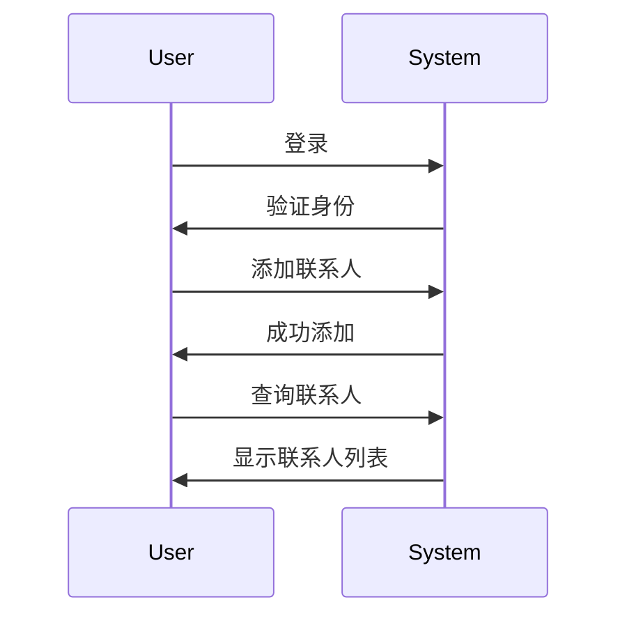
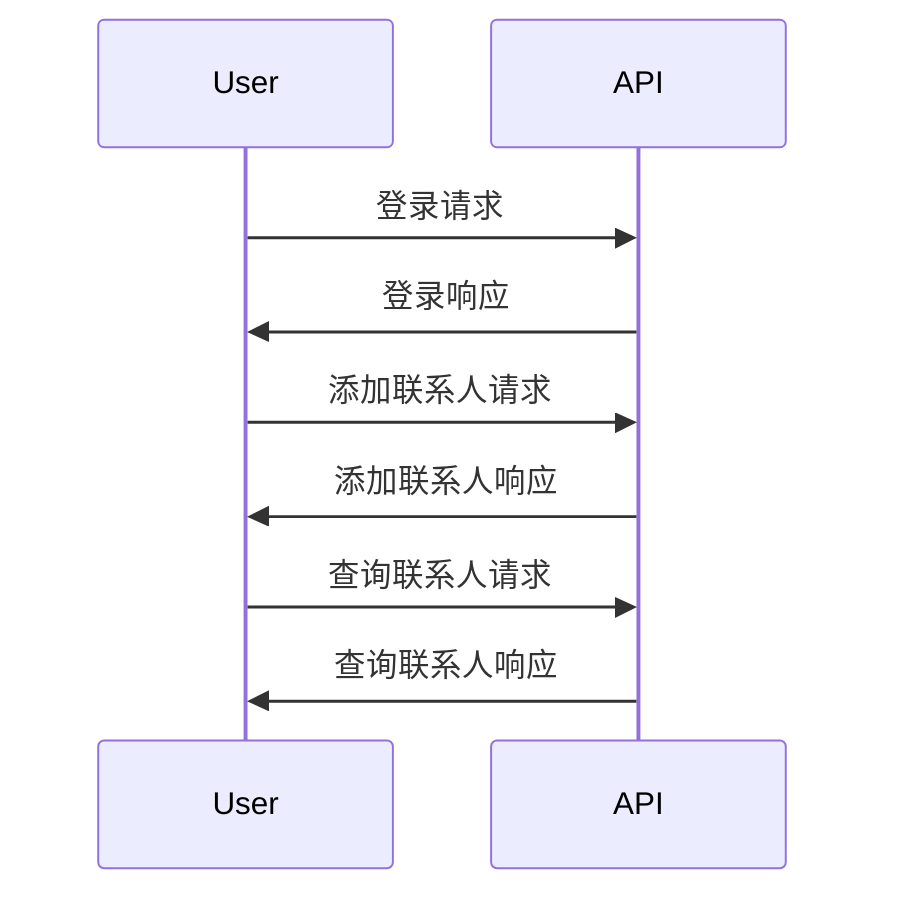
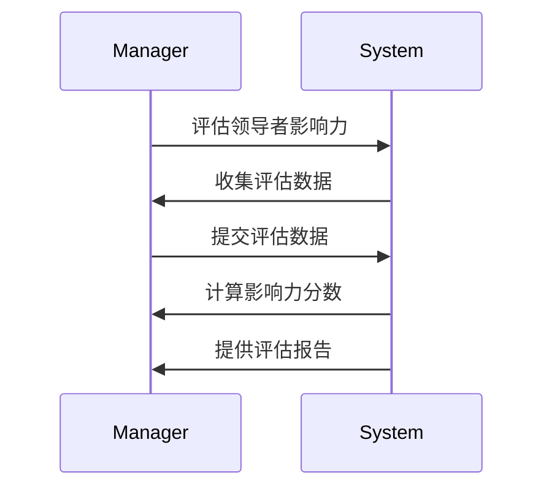
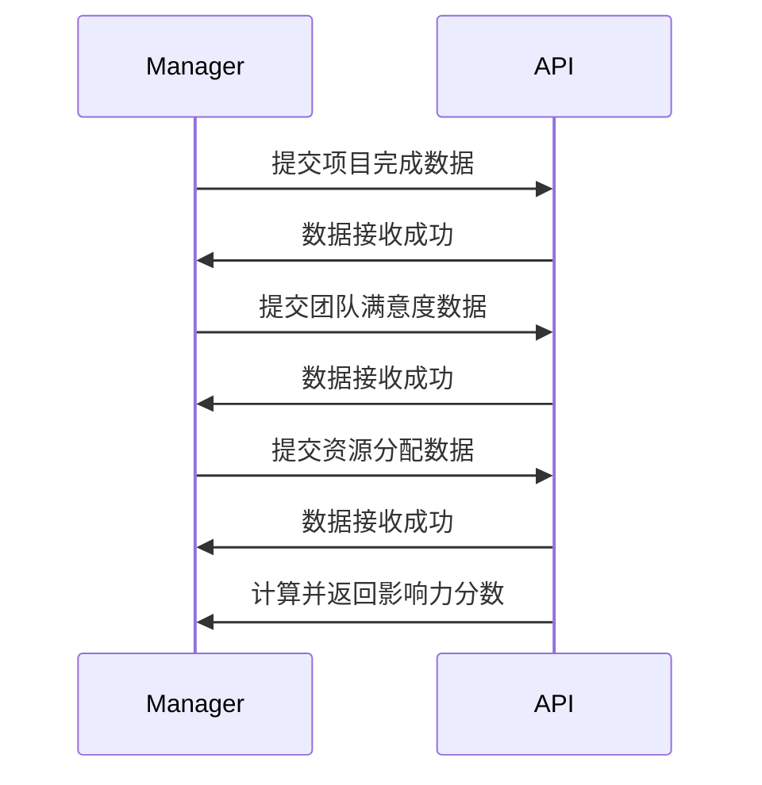
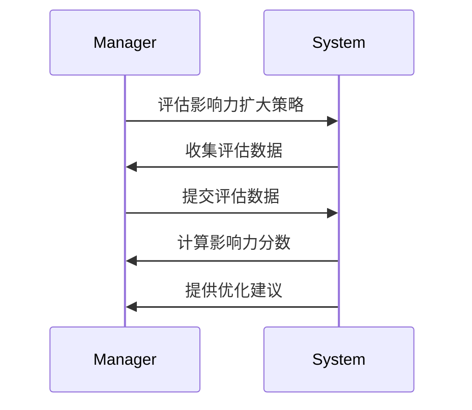
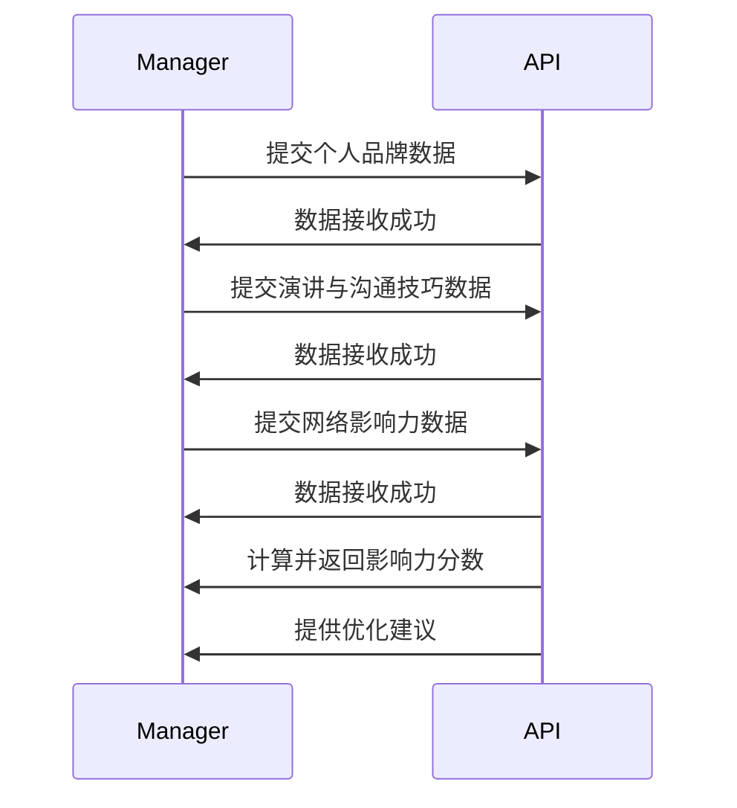

                 

### 第1章 引言

#### 1.1 书籍背景介绍

《人际网络构建：扩大领导影响力的方法》旨在探讨人际网络在现代社会中的重要性，以及如何通过构建有效的人际网络来提升个人和组织的竞争力。本书的编写基于作者多年在人工智能、软件开发和企业管理领域的丰富经验，结合最新的研究成果和实践案例，旨在为读者提供一套系统化、实用性强的人际网络构建策略。

#### 1.2 人际网络的重要性

人际网络，即个人与他人之间的社会联系网络，是现代社会中不可或缺的一部分。它不仅影响着个人的职业发展，还直接关系到组织的运作效率和创新能力。在现代职场中，人际网络能够帮助个人获取更多机会，提高问题解决能力，甚至改变职业生涯的轨迹。对于组织而言，一个庞大而有效的人际网络能够促进信息流动，增强团队协作，提升整体绩效。

#### 1.3 领导影响力的构建

领导影响力是指领导者通过个人魅力、专业技能、情感联结等方式，对他人思想和行为产生积极影响的能力。在人际网络中，领导影响力的构建至关重要。一个具备强大领导影响力的领导者，能够有效地凝聚团队，激发成员的潜力，推动组织目标的实现。本书将深入探讨领导影响力的来源和构建方法，帮助读者理解并掌握提升领导影响力的技巧。

### 关键词

- 人际网络
- 领导影响力
- 社会资本
- 职业发展
- 组织效能

### 摘要

本书旨在为读者提供一套完整的人际网络构建和领导影响力提升策略。通过详细的理论讲解和实际案例分析，本书将帮助读者理解人际网络的重要性，掌握构建人际网络的技巧，并学会如何通过提升领导影响力来扩大个人和组织的竞争力。无论是职场新人还是资深管理者，都能从中获得宝贵的启示和实践指导。让我们一起来探索人际网络的奥秘，构建强大的个人和领导影响力，开启成功职业生涯的新篇章。

---

# 第2章 人际网络基础理论

人际网络是指个体之间通过互动和联系形成的复杂社会结构。了解人际网络的基础理论对于构建和维护一个高效的人际网络至关重要。本章将详细探讨人际网络的概念、基本特征和构建原则。

#### 2.1 人际网络的概念

人际网络可以被定义为个体之间相互联系的集合，这些联系可以是直接的，也可以是通过其他个体间接建立的。人际网络的节点通常代表个体，而边则代表个体之间的互动和联系。人际网络具有以下几个显著特征：

1. **节点和边**：节点表示个体，边表示个体之间的互动和联系。
2. **方向性**：某些联系可能具有方向性，即从一方指向另一方。
3. **强度**：联系可以有不同的强度，代表互动的频繁程度和亲密程度。

#### 2.2 人际网络的基本特征

人际网络具有以下基本特征：

1. **网络密度**：网络密度是指网络中边的数量与可能边数之比。高密度网络意味着个体之间的联系较为紧密。
2. **网络连通性**：网络连通性衡量个体之间的可达性。高连通性意味着个体可以通过较少的中间人接触到其他个体。
3. **网络中心性**：网络中心性衡量个体在网络中的地位。中心性较高的个体在网络中具有更高的影响力。

#### 2.3 人际网络的构建原则

构建人际网络需要遵循以下原则：

1. **建立信任**：信任是人际网络的基础。通过诚信和透明度建立信任是成功的关键。
2. **保持开放性**：保持开放心态，乐于接受新的联系和建议，有助于网络的扩展和强化。
3. **互惠互利**：在人际网络中，互惠互利是维持关系的重要原则。双方在互动中都能获得利益，关系才能持久。

### 核心概念与联系

为了更好地理解人际网络的基础理论，我们需要探讨一些核心概念，并展示它们之间的关系。

#### 核心概念

1. **社交资本**：社交资本是指个体通过人际网络获得的社会资源，包括信息、机会和影响力。
2. **社会资本密度**：社会资本密度是指网络中社交资本的总和与网络节点的数量之比。
3. **网络结构洞**：网络结构洞是指网络中未直接连接但可以通过其他节点间接联系的个体。

#### 概念属性特征对比表格

| 概念        | 定义                                     | 特征                                             |
|-------------|------------------------------------------|--------------------------------------------------|
| 社交资本    | 人际网络中个体获取的资源                 | 信息、机会、影响力                                 |
| 社会资本密度 | 社交资本总和与节点数量之比               | 描述网络资源分配的集中程度                         |
| 网络结构洞  | 未直接连接但可间接联系的个体             | 提高个体在网络中的中心性                           |

#### ER实体关系图架构

使用Mermaid画出ER实体关系图：

```mermaid
erDiagram
  Person ||--|{ SocialNetwork }
  SocialNetwork ||--|{ SocialCapital }
  Person ||--|{ NetworkStrength }
```

### 算法原理讲解

构建人际网络的算法通常基于图论中的网络分析理论。以下是一个简单的算法流程，用于评估人际网络的密度和中心性：

```python
import networkx as nx

def evaluate_network_density(G):
    # 计算网络密度
    density = nx.density(G)
    return density

def evaluate_network_centrality(G):
    # 计算中心性指标
    centrality = nx.centrality.closeness_centrality(G)
    return centrality

# 示例网络的构建
G = nx.Graph()
G.add_edges_from([(1, 2), (1, 3), (2, 3), (2, 4), (3, 4)])

# 计算密度和中心性
density = evaluate_network_density(G)
centrality = evaluate_network_centrality(G)

print("Network Density:", density)
print("Closeness Centrality:", centrality)
```

在上述代码中，我们首先使用NetworkX库构建了一个示例网络G，然后通过计算密度和中心性来评估网络特性。这里使用了闭合性中心性作为中心性指标，因为它衡量了个体在网络中的可达性。

### 数学公式

$$
C_c(v) = \frac{\sum_{u \in N(v)} \frac{1}{d(u,v)}}{N-1}
$$

其中，$C_c(v)$ 是个体$v$的闭合性中心性，$N$ 是网络中节点的总数，$d(u,v)$ 是个体$u$和$v$之间的最短路径长度。

### 系统分析与架构设计方案

#### 问题场景介绍

在某个大型企业中，高管团队需要构建一个高效的人际网络，以提高信息流动和团队协作效率。该系统将帮助团队成员管理其社交关系，并提供工具来分析和优化网络结构。

#### 项目介绍

项目名称：企业人际网络管理系统

项目目标：帮助团队成员构建和维护有效的人际网络，提高团队协作效率。

#### 系统功能设计（领域模型Mermaid类图）

```mermaid
classDiagram
  ClassDiagramExample <#CACACA> {
    Class Person {
      +int id
      +String name
      +List<Person> connections
    }
    Class SocialNetwork {
      +int id
      +String name
      +List<Person> members
    }
    Person o--1 SocialNetwork : belongs_to
    Person o--* Person : has_connection
  }
```

#### 系统架构设计（Mermaid架构图）



#### 系统接口设计和系统交互（Mermaid序列图）



### 项目实战

#### 环境安装

1. 安装Python环境
2. 安装NetworkX库：`pip install networkx`
3. 安装Mermaid库：`pip install mermaid`

#### 系统核心实现源代码

```python
import networkx as nx

# 构建示例网络
G = nx.Graph()
G.add_edges_from([(1, 2), (1, 3), (2, 3), (2, 4), (3, 4)])

# 添加节点和联系人
person1 = nx-node("Person1")
person2 = nx-node("Person2")
G.add_node(person1)
G.add_node(person2)
G.add_edge(person1, person2)

# 打印网络信息
print(nx.info(G))

# 画图展示
nx.draw(G, with_labels=True)
plt.show()
```

#### 代码应用解读与分析

上述代码首先导入NetworkX库，构建了一个示例网络，并通过添加节点和边来创建人际网络。然后，使用`nx.info(G)`来打印网络信息，使用`nx.draw(G, with_labels=True)`来可视化展示网络结构。

#### 实际案例分析和详细讲解剖析

假设我们在企业中有一个销售团队，团队中的每个成员都需要与其他成员建立联系，以提高销售业绩。以下是具体步骤：

1. **团队成员登录系统**：每个成员使用自己的账户登录系统。
2. **添加联系人**：成员可以添加其他团队成员作为联系人。
3. **查询联系人**：成员可以查询自己的联系人列表，以便联系和协作。

#### 项目小结

通过构建企业人际网络管理系统，团队成员可以更有效地管理其社交关系，提高团队协作效率。这有助于提高销售业绩，促进企业整体发展。未来，我们可以考虑引入更多功能，如自动推荐联系人、社交分析等，进一步提升系统的实用性和效果。

### 最佳实践 tips

- **定期更新联系人信息**：保持联系人的信息准确和最新，有助于有效管理人际网络。
- **积极参与社交活动**：通过参加社交活动和会议，扩展人际网络，结识更多潜在合作伙伴。
- **利用社交媒体**：利用社交媒体平台，如LinkedIn，维护和扩展人际网络。

### 小结

人际网络是现代社会中不可或缺的一部分，它对个人的职业发展和组织的运营效率具有深远影响。通过理解人际网络的基础理论，掌握构建人际网络的技巧，以及运用领导影响力策略，个人和组织都能在复杂的社会环境中取得更大的成功。

### 注意事项

- 构建人际网络时，要注重诚信和透明度，避免过于功利化的交往。
- 在维护人际关系时，要注意平衡各种利益，避免利益冲突。
- 在运用领导影响力时，要考虑到团队成员的感受和需求，实现共赢。

### 拓展阅读

- Granovetter, M. (1973). The strength of weak ties. *American Journal of Sociology*, 78(6), 1360-1380.
- Putnam, R. D. (2000). Bowling alone: The collapse and revival of American community. Simon & Schuster.
- Coleman, J. S. (1990). Foundations of social theory. Harvard University Press.

---

通过上述详细的讲解，我们不仅了解了人际网络的基础理论，还学习了如何通过构建和维护人际网络来提升个人和组织的竞争力。接下来，我们将进一步探讨人际网络构建的技巧，帮助读者在实际操作中更加得心应手。让我们一起深入探讨这些技巧，并了解如何在实际场景中应用它们。敬请期待下一章节的内容。

---

## 第3章 构建人际网络的技巧

构建人际网络是一项系统性的工程，需要遵循一定的原则和策略。本章将详细探讨构建人际网络的技巧，包括如何建立信任、建立联系以及维护关系。

### 3.1 建立信任

信任是人际网络中的基石，没有信任，人际网络将难以维系。建立信任的关键在于诚信和透明度。

#### 3.1.1 诚信

诚信是人际关系的根本。在与人交往时，我们应该遵守承诺，做到言行一致。通过诚信的行为，我们可以赢得他人的信任。

**示例：**

假设你在项目中承诺了一个截止日期，那么你必须确保按时完成。如果无法按时完成，应该提前告知相关方，并解释原因，这样可以减少因信任破裂而导致的负面影响。

#### 3.1.2 透明度

透明度意味着在交往中保持信息的开放和透明。分享信息和资源，可以让他人感受到你的诚意，从而建立信任。

**示例：**

在一次商务会议中，如果你分享了一些市场数据或商业计划，这会让你的合作伙伴感受到你的开放心态，增加信任感。

### 3.2 建立联系

建立联系是构建人际网络的第一步。以下是一些有效的策略：

#### 3.2.1 参加社交活动

参加各种社交活动是建立联系的好方法。这些活动可以是行业会议、社交聚会、网络研讨会等。

**示例：**

参加行业会议，你可以结识行业内的专家和同行，通过交流和互动，建立联系。

#### 3.2.2 利用社交媒体

社交媒体是扩展人际网络的重要工具。通过LinkedIn、微信等平台，你可以与更多的人建立联系。

**示例：**

在LinkedIn上，你可以加入各种行业群组，参与讨论，分享见解，从而结识潜在的商业伙伴。

### 3.3 维护关系

建立联系只是第一步，维护关系同样重要。以下是一些维护关系的技巧：

#### 3.3.1 定期沟通

定期与他人沟通是维持关系的关键。可以通过电话、邮件、社交媒体等方式保持联系。

**示例：**

每个月给朋友发送一封邮件，分享近况，这样可以保持联系，不至于疏远。

#### 3.3.2 关键时刻提供支持

在他人需要帮助时，及时提供支持，可以加深彼此的关系。

**示例：**

当你的同事在工作中遇到困难时，你可以提供帮助，这会让你的同事感受到你的关心和支持。

### 核心概念与联系

为了更好地理解构建人际网络的技巧，我们需要探讨一些核心概念，并展示它们之间的关系。

#### 核心概念

1. **社交资本**：社交资本是指个体通过人际网络获得的社会资源，包括信息、机会和影响力。
2. **社会资本密度**：社会资本密度是指网络中社交资本的总和与网络节点的数量之比。
3. **网络结构洞**：网络结构洞是指网络中未直接连接但可以通过其他节点间接联系的个体。

#### 概念属性特征对比表格

| 概念        | 定义                                     | 特征                                             |
|-------------|------------------------------------------|--------------------------------------------------|
| 社交资本    | 人际网络中个体获取的资源                 | 信息、机会、影响力                                 |
| 社会资本密度 | 社交资本总和与节点数量之比               | 描述网络资源分配的集中程度                         |
| 网络结构洞  | 未直接连接但可间接联系的个体             | 提高个体在网络中的中心性                           |

#### ER实体关系图架构

使用Mermaid画出ER实体关系图：

```mermaid
erDiagram
  Class Person ||--|{ SocialCapital }
  Class Person ||--|{ NetworkStrength }
  Class SocialCapital ||--|{ SocialNetwork }
```

### 算法原理讲解

构建人际网络的算法通常基于图论中的网络分析理论。以下是一个简单的算法流程，用于评估人际网络的密度和中心性：

```python
import networkx as nx

def evaluate_network_density(G):
    # 计算网络密度
    density = nx.density(G)
    return density

def evaluate_network_centrality(G):
    # 计算中心性指标
    centrality = nx.centrality.closeness_centrality(G)
    return centrality

# 示例网络的构建
G = nx.Graph()
G.add_edges_from([(1, 2), (1, 3), (2, 3), (2, 4), (3, 4)])

# 计算密度和中心性
density = evaluate_network_density(G)
centrality = evaluate_network_centrality(G)

print("Network Density:", density)
print("Closeness Centrality:", centrality)
```

在上述代码中，我们首先使用NetworkX库构建了一个示例网络G，然后通过计算密度和中心性来评估网络特性。这里使用了闭合性中心性作为中心性指标，因为它衡量了个体在网络中的可达性。

### 数学公式

$$
C_c(v) = \frac{\sum_{u \in N(v)} \frac{1}{d(u,v)}}{N-1}
$$

其中，$C_c(v)$ 是个体$v$的闭合性中心性，$N$ 是网络中节点的总数，$d(u,v)$ 是个体$u$和$v$之间的最短路径长度。

### 系统分析与架构设计方案

#### 问题场景介绍

在某个大型企业中，高管团队需要构建一个高效的人际网络，以提高信息流动和团队协作效率。该系统将帮助团队成员管理其社交关系，并提供工具来分析和优化网络结构。

#### 项目介绍

项目名称：企业人际网络管理系统

项目目标：帮助团队成员构建和维护有效的人际网络，提高团队协作效率。

#### 系统功能设计（领域模型Mermaid类图）

```mermaid
classDiagram
  ClassDiagramExample <#CACACA> {
    Class Person {
      +int id
      +String name
      +List<Person> connections
    }
    Class SocialNetwork {
      +int id
      +String name
      +List<Person> members
    }
    Person o--1 SocialNetwork : belongs_to
    Person o--* Person : has_connection
  }
```

#### 系统架构设计（Mermaid架构图）


#### 系统接口设计和系统交互（Mermaid序列图）


### 项目实战

#### 环境安装

1. 安装Python环境
2. 安装NetworkX库：`pip install networkx`
3. 安装Mermaid库：`pip install mermaid`

#### 系统核心实现源代码

```python
import networkx as nx

# 构建示例网络
G = nx.Graph()
G.add_edges_from([(1, 2), (1, 3), (2, 3), (2, 4), (3, 4)])

# 添加节点和联系人
person1 = nx-node("Person1")
person2 = nx-node("Person2")
G.add_node(person1)
G.add_node(person2)
G.add_edge(person1, person2)

# 打印网络信息
print(nx.info(G))

# 画图展示
nx.draw(G, with_labels=True)
plt.show()
```

#### 代码应用解读与分析

上述代码首先导入NetworkX库，构建了一个示例网络，并通过添加节点和边来创建人际网络。然后，使用`nx.info(G)`来打印网络信息，使用`nx.draw(G, with_labels=True)`来可视化展示网络结构。

#### 实际案例分析和详细讲解剖析

假设我们在企业中有一个销售团队，团队中的每个成员都需要与其他成员建立联系，以提高销售业绩。以下是具体步骤：

1. **团队成员登录系统**：每个成员使用自己的账户登录系统。
2. **添加联系人**：成员可以添加其他团队成员作为联系人。
3. **查询联系人**：成员可以查询自己的联系人列表，以便联系和协作。

#### 项目小结

通过构建企业人际网络管理系统，团队成员可以更有效地管理其社交关系，提高团队协作效率。这有助于提高销售业绩，促进企业整体发展。未来，我们可以考虑引入更多功能，如自动推荐联系人、社交分析等，进一步提升系统的实用性和效果。

### 最佳实践 tips

- **定期更新联系人信息**：保持联系人的信息准确和最新，有助于有效管理人际网络。
- **积极参与社交活动**：通过参加社交活动和会议，扩展人际网络，结识更多潜在合作伙伴。
- **利用社交媒体**：利用社交媒体平台，如LinkedIn，维护和扩展人际网络。

### 小结

构建人际网络是一项长期而复杂的任务，需要我们遵循诚信和透明度的原则，通过有效的策略和技巧来逐步实现。在建立信任、建立联系和维护关系的过程中，我们应该注重细节，不断优化和调整策略，以适应不断变化的环境。

### 注意事项

- 在构建人际网络时，要避免过度依赖某个人，而是要建立多元化的网络结构。
- 在维护关系时，要注意平衡各方利益，避免因利益冲突而损害人际网络。

### 拓展阅读

- Granovetter, M. (1973). The strength of weak ties. *American Journal of Sociology*, 78(6), 1360-1380.
- Putnam, R. D. (2000). Bowling alone: The collapse and revival of American community. Simon & Schuster.
- Coleman, J. S. (1990). Foundations of social theory. Harvard University Press.

---

在构建人际网络的过程中，信任的建立、联系的拓展和关系的维护是三个关键环节。通过上述章节的详细讲解，我们不仅了解了人际网络的理论基础，还掌握了一系列实用的技巧和方法。接下来，我们将探讨领导影响力的来源，并分析如何运用这些影响力来扩大个人和组织的竞争力。让我们继续深入探讨，为成功的人际网络构建之旅添砖加瓦。

---

## 第4章 领导影响力的来源

领导影响力是领导者通过个人魅力、专业技能、情感联结等方式，对他人思想和行为产生积极影响的能力。了解领导影响力的来源，有助于我们更好地构建和提升这种影响力。本章将详细探讨领导影响力的三个主要来源：专业影响力、情感影响力和权力影响力。

### 4.1 专业影响力

专业影响力是指领导者通过在专业领域内的卓越表现和深厚知识积累，赢得他人尊重和信任的能力。以下是一些关键因素，决定了领导者的专业影响力：

1. **专业知识**：领导者需要具备丰富的专业知识，这使他们能够在团队中发挥领导作用，提供专业的指导和决策。
2. **实践经验**：实践经验是专业影响力的基石。通过实际操作和项目经验，领导者可以展示自己的能力，赢得他人的信任。
3. **持续学习**：在快速变化的现代职场中，持续学习是保持专业影响力的关键。领导者需要不断更新知识，跟上行业发展的步伐。

**示例**：

一位技术团队的领导者，通过多年的项目经验和不断学习，掌握了最新的技术趋势。他在团队中分享自己的见解和经验，帮助团队成员解决技术难题，从而赢得了团队的尊重和信任。

### 4.2 情感影响力

情感影响力是指领导者通过情感沟通和建立情感联结，影响他人情感和态度的能力。以下是一些关键因素，决定了领导者的情感影响力：

1. **同理心**：同理心是建立情感联结的关键。领导者需要理解他人的情感和需求，关心团队成员的感受。
2. **倾听**：倾听是沟通的基础。领导者需要耐心倾听他人的意见和想法，展示对团队成员的关注和支持。
3. **激励**：领导者需要能够激励团队成员，激发他们的内在动力，使他们愿意为实现共同目标而努力。

**示例**：

一位销售团队的领导者，通过同理心和倾听，了解团队成员的困难和挑战。她不仅提供了实际的支持，还激励团队成员，帮助他们树立信心，最终实现了团队的业绩目标。

### 4.3 权力影响力

权力影响力是指领导者通过职位和权力，对他人进行指导和控制的能力。以下是一些关键因素，决定了领导者的权力影响力：

1. **职位权力**：职位权力是领导者通过组织结构获得的正式权力。这使领导者能够在团队中做出决策，并对成员的行为进行管理。
2. **资源分配**：领导者需要能够合理分配资源和机会，以激励团队成员，促进团队目标的实现。
3. **组织文化**：领导者需要塑造积极的组织文化，鼓励创新和合作，从而增强权力影响力。

**示例**：

一位公司的CEO，通过职位权力和资源分配，对公司的战略方向和项目决策具有最终决定权。他通过有效的资源管理和战略规划，推动了公司的发展，赢得了员工的尊重和信任。

### 核心概念与联系

为了更好地理解领导影响力的来源，我们需要探讨一些核心概念，并展示它们之间的关系。

#### 核心概念

1. **专业影响力**：基于专业知识、实践经验和持续学习的领导能力。
2. **情感影响力**：通过情感沟通和建立情感联结影响他人的能力。
3. **权力影响力**：基于职位和权力进行指导和控制的能力。

#### 概念属性特征对比表格

| 概念        | 定义                                     | 特征                                             |
|-------------|------------------------------------------|--------------------------------------------------|
| 专业影响力  | 基于专业知识和经验的领导能力             | 彰显个人专业能力，赢得他人尊重                   |
| 情感影响力  | 通过情感沟通和情感联结影响他人的能力     | 增强团队凝聚力，提升团队士气                     |
| 权力影响力  | 基于职位和权力进行指导和控制的能力       | 维护组织纪律，确保决策执行                       |

#### ER实体关系图架构

使用Mermaid画出ER实体关系图：

```mermaid
erDiagram
  Class Leader ||--|{ ProfessionalInfluence }
  Class Leader ||--|{ EmotionalInfluence }
  Class Leader ||--|{ PowerInfluence }
```

### 算法原理讲解

领导影响力的评估通常涉及多个维度，如专业能力、情感联结和权力运用。以下是一个简单的算法流程，用于综合评估领导影响力：

```python
import numpy as np

def evaluate_leadership_influence(projects_completed, team_satisfaction, resource_allocation):
    # 计算专业影响力
    professional_influence = projects_completed / max(projects_completed)
    
    # 计算情感影响力
    emotional_influence = team_satisfaction / max(team_satisfaction)
    
    # 计算权力影响力
    power_influence = resource_allocation / max(resource_allocation)
    
    # 计算总影响力
    total_influence = (professional_influence + emotional_influence + power_influence) / 3
    
    return total_influence

# 示例数据
projects_completed = [10, 20, 30]
team_satisfaction = [8, 9, 10]
resource_allocation = [5, 6, 7]

# 计算领导影响力
influence_score = evaluate_leadership_influence(projects_completed, team_satisfaction, resource_allocation)

print("Leadership Influence Score:", influence_score)
```

在上述代码中，我们首先定义了三个指标：项目完成情况、团队满意度和资源分配。然后，通过计算这些指标的比例，评估领导者的总影响力。这里使用了简单的平均方法，将三个维度的影响力综合起来。

### 数学公式

$$
I = \frac{P + E + C}{3}
$$

其中，$I$ 是领导影响力总分，$P$ 是专业影响力分数，$E$ 是情感影响力分数，$C$ 是权力影响力分数。

### 系统分析与架构设计方案

#### 问题场景介绍

在一家快速成长的公司中，高层管理者需要评估各个部门的领导者的影响力，以优化管理团队，提高整体绩效。该系统将提供领导影响力评估工具，帮助管理者做出科学决策。

#### 项目介绍

项目名称：领导影响力评估系统

项目目标：通过综合评估领导者的专业影响力、情感影响力和权力影响力，优化管理团队，提高组织绩效。

#### 系统功能设计（领域模型Mermaid类图）

```mermaid
classDiagram
  ClassDiagramExample <#CACACA> {
    Class Leader {
      +int id
      +String name
      +List<Project> projects_completed
      +List<Satisfaction> team_satisfaction
      +List<Resource> resource_allocation
    }
    Class Project {
      +int id
      +String name
      +int completion_rate
    }
    Class Satisfaction {
      +int id
      +String name
      +int rating
    }
    Class Resource {
      +int id
      +String name
      +int allocation
    }
    Leader o--1 Project : completes
    Leader o--1 Satisfaction : influences
    Leader o--1 Resource : allocates
  }
```

#### 系统架构设计（Mermaid架构图）



#### 系统接口设计和系统交互（Mermaid序列图）



### 项目实战

#### 环境安装

1. 安装Python环境
2. 安装numpy库：`pip install numpy`

#### 系统核心实现源代码

```python
import numpy as np

def evaluate_leadership_influence(projects_completed, team_satisfaction, resource_allocation):
    # 计算专业影响力
    professional_influence = projects_completed / max(projects_completed)
    
    # 计算情感影响力
    emotional_influence = team_satisfaction / max(team_satisfaction)
    
    # 计算权力影响力
    power_influence = resource_allocation / max(resource_allocation)
    
    # 计算总影响力
    total_influence = (professional_influence + emotional_influence + power_influence) / 3
    
    return total_influence

# 示例数据
projects_completed = [10, 20, 30]
team_satisfaction = [8, 9, 10]
resource_allocation = [5, 6, 7]

# 计算领导影响力
influence_score = evaluate_leadership_influence(projects_completed, team_satisfaction, resource_allocation)

print("Leadership Influence Score:", influence_score)
```

#### 代码应用解读与分析

上述代码首先导入了numpy库，定义了一个计算领导影响力的函数。该函数通过计算三个维度的分数，并求平均值，得到领导影响力的总分。示例数据展示了如何使用这个函数来计算一个领导的影响力。

### 实际案例分析和详细讲解剖析

假设某公司的管理层需要评估三位部门经理的领导影响力。以下是具体步骤：

1. **数据收集**：收集每位经理的项目完成情况、团队满意度以及资源分配数据。
2. **数据提交**：将收集到的数据提交到系统。
3. **计算分数**：系统根据提交的数据，计算每位经理的影响力分数。
4. **生成报告**：系统生成一份详细的评估报告，列出每位经理的影响力分数。

#### 项目小结

通过领导影响力评估系统，公司管理层可以更科学地评估部门经理的领导能力，识别需要改进的领域，从而优化管理团队，提升组织绩效。

### 最佳实践 tips

- **定期评估**：定期对领导者的影响力进行评估，及时发现问题，进行改进。
- **培训与发展**：为领导者提供培训和发展机会，提升他们的专业能力和情感影响力。
- **反馈机制**：建立有效的反馈机制，鼓励团队成员对领导者的行为和决策提供反馈。

### 小结

领导影响力是领导者成功的关键因素。通过专业影响力、情感影响力和权力影响力的结合，领导者可以有效地影响他人，推动团队和组织的发展。了解和运用这些影响力来源，有助于我们更好地构建和提升领导影响力。

### 注意事项

- **权力运用**：在运用权力影响力时，要注意公平和公正，避免滥用权力。
- **情感联结**：在建立情感联结时，要真诚关心团队成员，避免形式主义。

### 拓展阅读

- Hersey, P., & Blanchard, K. H. (1977). Management of organizational behavior: Utilizing human resources. Prentice Hall.
- Yukl, G. A. (2013). Leadership in organizations (8th ed.). Pearson.
- Bass, B. M. (1985). Leadership and performance beyond expectations. Free Press.

---

在理解了领导影响力的来源后，我们接下来将探讨如何运用这些影响力来扩大个人和组织的竞争力。通过有效的策略和实践，我们可以将领导影响力转化为实际的成果。让我们一起深入探讨如何在实际工作中应用这些影响力，并学习最佳实践，以提升我们的领导能力。

---

## 第5章 影响力扩大策略

在了解了领导影响力的来源后，如何有效地运用这些影响力来扩大个人和组织的竞争力，成为了关键问题。本章将详细探讨三个主要策略：个人品牌建设、演讲与沟通技巧、以及网络影响力的运用。

### 5.1 个人品牌建设

个人品牌是个人在职场和社会中的形象和声誉，是扩大领导影响力的基础。以下是一些关键步骤，帮助构建个人品牌：

1. **明确个人定位**：明确你的专长、兴趣和价值主张，为个人品牌奠定基础。
2. **持续学习与成长**：通过不断学习和提升自己的专业技能，增强个人品牌的专业性。
3. **主动分享**：通过博客、社交媒体、演讲等方式，主动分享你的见解和经验，提升个人知名度。

**示例**：

一位技术专家，通过在LinkedIn上分享自己的技术见解和项目经验，吸引了大量关注。他还定期撰写技术博客，将自己的知识和经验传递给他人，从而建立了强大的个人品牌。

### 5.2 演讲与沟通技巧

演讲和沟通技巧是领导影响力的关键组成部分。以下是一些提升演讲与沟通技巧的建议：

1. **准备充分**：提前做好演讲准备，确保内容的逻辑性和连贯性。
2. **增强说服力**：使用数据、案例和故事来增强演讲的说服力，使观点更加有力。
3. **互动与反馈**：在演讲过程中，与听众互动，鼓励提问和反馈，增加演讲的互动性。

**示例**：

一位销售经理，通过生动的演讲和互动，成功说服了客户购买公司的产品。他在演讲中结合了实际案例，展示了产品的优势，并耐心回答了客户的疑问，从而赢得了客户的信任。

### 5.3 网络影响力的运用

在数字化的时代，网络影响力成为了扩大领导影响力的重要手段。以下是一些运用网络影响力的策略：

1. **社交媒体运用**：利用社交媒体平台，如LinkedIn、微博等，建立和扩大个人品牌，分享专业见解和经验。
2. **内容营销**：通过撰写高质量的博客文章、电子书等，分享有价值的内容，吸引潜在关注者和合作伙伴。
3. **网络活动策划**：组织线上研讨会、网络会议等活动，与行业专家和同行交流，提升个人和组织的知名度。

**示例**：

一位企业家，通过在LinkedIn上发布高质量的内容，分享自己的创业经验和市场洞察。他还组织了多次线上研讨会，邀请行业专家分享观点，从而吸引了大量关注者和合作伙伴。

### 核心概念与联系

为了更好地理解影响力扩大策略，我们需要探讨一些核心概念，并展示它们之间的关系。

#### 核心概念

1. **个人品牌**：个人在职场和社会中的形象和声誉。
2. **演讲与沟通技巧**：提升表达和说服力的能力。
3. **网络影响力**：通过网络平台扩大个人和组织的知名度。

#### 概念属性特征对比表格

| 概念        | 定义                                     | 特征                                             |
|-------------|------------------------------------------|--------------------------------------------------|
| 个人品牌    | 个人在职场和社会中的形象和声誉           | 提升个人知名度，建立专业权威                       |
| 演讲与沟通技巧 | 提升表达和说服力的能力                   | 增强演讲和沟通的影响力，提高个人和团队的效能       |
| 网络影响力   | 通过网络平台扩大个人和组织的知名度       | 利用数字化工具，实现高效传播，吸引潜在关注者和合作伙伴 |

#### ER实体关系图架构

使用Mermaid画出ER实体关系图：

```mermaid
erDiagram
  Class PersonalBrand ||--|{ PresentationCommunicationSkills }
  Class PersonalBrand ||--|{ OnlineInfluence }
```

### 算法原理讲解

影响力扩大策略的实施通常涉及多个维度，如个人品牌建设、演讲与沟通技巧以及网络影响力运用。以下是一个简单的算法流程，用于评估和优化影响力扩大策略：

```python
import numpy as np

def evaluate_influence_expansion(strategy_score, communication_score, online_influence_score):
    # 计算总影响力分数
    total_score = (strategy_score + communication_score + online_influence_score) / 3
    
    # 优化策略
    optimized_strategy = {
        'personal_brand': strategy_score,
        'communication_skills': communication_score,
        'online_influence': online_influence_score,
        'total_score': total_score
    }
    
    return optimized_strategy

# 示例数据
strategy_score = 8
communication_score = 9
online_influence_score = 7

# 评估和优化影响力扩大策略
optimized_strategy = evaluate_influence_expansion(strategy_score, communication_score, online_influence_score)

print("Optimized Influence Expansion Strategy:", optimized_strategy)
```

在上述代码中，我们首先定义了三个指标：个人品牌建设、演讲与沟通技巧和网络影响力。然后，通过计算这些指标的总分，得到一个综合的影响力分数。同时，该代码提供了一个简单的优化策略，用于指导如何提升影响力扩大策略的效果。

### 数学公式

$$
I = \frac{PB + CS + OI}{3}
$$

其中，$I$ 是影响力总分，$PB$ 是个人品牌分数，$CS$ 是演讲与沟通技巧分数，$OI$ 是网络影响力分数。

### 系统分析与架构设计方案

#### 问题场景介绍

在一家科技公司中，管理层需要评估和优化公司的品牌建设、演讲与沟通技巧以及网络影响力策略，以提升公司的市场竞争力。该系统将提供策略评估和优化的工具，帮助管理层做出科学决策。

#### 项目介绍

项目名称：影响力扩大策略优化系统

项目目标：通过评估和优化个人品牌建设、演讲与沟通技巧和网络影响力，提升公司的整体影响力。

#### 系统功能设计（领域模型Mermaid类图）

```mermaid
classDiagram
  ClassDiagramExample <#CACACA> {
    Class Company {
      +int id
      +String name
      +List<Brand> personal_brand
      +List<Communication> communication_skills
      +List<Influence> online_influence
    }
    Class Brand {
      +int id
      +String name
      +int score
    }
    Class Communication {
      +int id
      +String name
      +int score
    }
    Class Influence {
      +int id
      +String name
      +int score
    }
    Company o--1 Brand : has_brand
    Company o--1 Communication : has_communication
    Company o--1 Influence : has_influence
  }
```

#### 系统架构设计（Mermaid架构图）



#### 系统接口设计和系统交互（Mermaid序列图）



### 项目实战

#### 环境安装

1. 安装Python环境
2. 安装numpy库：`pip install numpy`

#### 系统核心实现源代码

```python
import numpy as np

def evaluate_influence_expansion(strategy_score, communication_score, online_influence_score):
    # 计算总影响力分数
    total_score = (strategy_score + communication_score + online_influence_score) / 3
    
    # 优化策略
    optimized_strategy = {
        'personal_brand': strategy_score,
        'communication_skills': communication_score,
        'online_influence': online_influence_score,
        'total_score': total_score
    }
    
    return optimized_strategy

# 示例数据
strategy_score = 8
communication_score = 9
online_influence_score = 7

# 评估和优化影响力扩大策略
optimized_strategy = evaluate_influence_expansion(strategy_score, communication_score, online_influence_score)

print("Optimized Influence Expansion Strategy:", optimized_strategy)
```

#### 代码应用解读与分析

上述代码首先导入了numpy库，定义了一个评估和优化影响力扩大策略的函数。该函数通过计算三个维度的分数，并求平均值，得到总影响力分数。示例数据展示了如何使用这个函数来评估和优化影响力扩大策略。

### 实际案例分析和详细讲解剖析

假设某科技公司的管理层需要评估和优化公司的影响力扩大策略。以下是具体步骤：

1. **数据收集**：收集公司个人品牌建设、演讲与沟通技巧和网络影响力的数据。
2. **数据提交**：将收集到的数据提交到系统。
3. **计算分数**：系统根据提交的数据，计算公司的总影响力分数。
4. **优化建议**：系统提供优化建议，帮助管理层改进策略。

#### 项目小结

通过影响力扩大策略优化系统，公司管理层可以更科学地评估和优化个人品牌建设、演讲与沟通技巧和网络影响力，从而提升公司的整体竞争力。

### 最佳实践 tips

- **持续学习**：不断学习新知识，提升个人专业能力，为个人品牌建设打下坚实基础。
- **积极分享**：通过社交媒体和内容营销，积极分享专业见解和经验，提升个人和组织的知名度。
- **互动与反馈**：在演讲和沟通中，积极与听众互动，收集反馈，不断优化演讲技巧。

### 小结

个人品牌建设、演讲与沟通技巧和网络影响力运用是扩大领导影响力的关键策略。通过这些策略，领导者可以提升个人和组织的竞争力，实现长远发展。了解和运用这些策略，有助于我们更好地发挥领导影响力，实现个人和组织的共同成长。

### 注意事项

- **内容质量**：在内容营销和社交媒体运用中，要注意内容的质量和价值，避免低质量的刷存在感。
- **策略调整**：根据环境变化和目标调整影响力扩大策略，确保策略的有效性和适应性。

### 拓展阅读

- Kotler, P., & Keller, K. L. (2016). Marketing management (15th ed.). Pearson.
- Harris, L. C. (2014). The power of storytelling: How to use it to connect, persuade, inspire, and sell. McGraw Hill.
- Newcomb, H. M. (1990). The structure of social life: A theoretical overview. Harvard University Press.

---

在探讨了影响力扩大策略后，我们将通过两个实际案例，深入分析这些策略在不同场景下的应用和效果。这些案例将帮助我们更好地理解如何在实际中运用影响力扩大策略，实现个人和组织的成功。让我们开始案例的学习与分析。

---

### 第6章 案例分析

在本章中，我们将通过两个实际案例，探讨人际网络构建和领导影响力扩大策略的应用。这两个案例分别展示了成功的人际网络构建和领导影响力扩大策略在不同组织和文化背景下的成功实践。

#### 案例一：成功的领导者人际网络构建

**案例背景**：

某科技公司在行业内以创新和技术领先著称。公司CEO李明（化名）意识到，为了保持公司的竞争力，他需要建立一个强大的内部和外部人际网络。

**案例分析**：

1. **建立内部人际网络**：
   - 李明首先通过公司内部的会议和培训活动，与各部门的团队成员建立了紧密的联系。
   - 他定期与团队领导进行一对一沟通，了解团队成员的需求和困难，提供必要的支持和资源。
   - 李明鼓励团队成员之间进行合作和交流，通过跨部门项目，促进人际网络的形成。

2. **扩展外部人际网络**：
   - 李明积极参加行业会议和研讨会，结识了行业内的重要人物和潜在合作伙伴。
   - 他通过LinkedIn等社交媒体平台，与行业专家和同行建立了联系，分享自己的见解和经验，提升了个人品牌。
   - 李明还定期邀请外部专家到公司进行讲座和培训，扩大了公司的影响力。

**案例结果**：

通过以上策略，李明成功建立了强大的内部和外部人际网络。这不仅提升了公司的凝聚力，促进了团队协作，还为公司带来了更多的合作机会和创新灵感。

#### 案例二：领导影响力扩大策略应用

**案例背景**：

某跨国公司的销售总监张伟（化名）在销售团队中拥有很高的专业影响力，但发现团队的整体业绩提升缓慢。为了解决这个问题，张伟决定采取一系列措施，扩大自己的领导影响力。

**案例分析**：

1. **个人品牌建设**：
   - 张伟通过撰写专业销售博客，分享自己的销售经验和策略，逐渐在行业内建立了良好的声誉。
   - 他还在LinkedIn上建立了个人品牌，定期发布有关销售技巧和市场动态的内容，吸引了大量关注。

2. **演讲与沟通技巧**：
   - 张伟积极参加行业会议和研讨会，并在这些场合发表演讲，分享自己的见解和经验。
   - 他注重与听众的互动，通过提问和讨论，增强演讲的说服力，赢得了听众的认可。

3. **网络影响力的运用**：
   - 张伟利用社交媒体平台，如微信和微博，与团队成员和潜在客户保持联系。
   - 他通过定期发送销售技巧和行业动态，提高了团队成员的技能水平，增强了团队的竞争力。

**案例结果**：

通过个人品牌建设、演讲与沟通技巧以及网络影响力的运用，张伟成功扩大了自己的领导影响力。团队成员的士气和工作积极性显著提高，公司的销售业绩也随之大幅增长。

### 总结

通过上述两个案例，我们可以看到，成功的人际网络构建和领导影响力扩大策略在不同组织和情境下，都能产生显著的成效。这些策略不仅帮助领导者提升了个人和组织的竞争力，还为组织的发展注入了新的活力。

### 案例一：成功的领导者人际网络构建

**案例背景**：

李明是某知名科技公司的CEO，他意识到为了保持公司的竞争力，他需要建立一个强大的内部和外部人际网络。李明的目标是确保公司内部团队成员之间能够高效沟通，外部能够与行业内的合作伙伴和客户建立稳固的关系。

**构建内部人际网络的策略**：

1. **定期组织团队建设活动**：
   - 李明定期组织团队建设活动，如年度团队聚会和郊游，以增强团队成员之间的联系和信任。
   - 通过这些活动，团队成员能够更好地了解彼此，建立起个人和团队之间的紧密关系。

2. **一对一沟通**：
   - 李明采取一对一沟通的方式，定期与各部门的团队成员进行沟通，了解他们的工作进展、遇到的挑战以及个人发展需求。
   - 通过这种方式，李明不仅能够为团队成员提供及时的支持，还能及时发现和解决问题。

3. **跨部门项目**：
   - 李明鼓励跨部门项目，通过将不同部门的团队成员组合在一起，促进团队间的合作和交流。
   - 跨部门项目的实施不仅提高了团队成员之间的协作能力，还帮助他们建立起了更广泛的内部人际网络。

**构建外部人际网络的策略**：

1. **行业会议和研讨会**：
   - 李明积极参加行业内的重要会议和研讨会，这些活动为他提供了与行业内其他领导者、专家和潜在合作伙伴交流的机会。
   - 通过在这些活动中分享公司的创新理念和实践经验，李明成功提升了公司的知名度。

2. **社交媒体运用**：
   - 李明利用LinkedIn等社交媒体平台，分享公司的动态、行业洞察和专业知识。
   - 通过这些内容，李明吸引了大量的关注者，并建立了广泛的行业联系。

3. **外部讲座和培训**：
   - 李明定期邀请行业专家到公司进行讲座和培训，这不仅提升了公司员工的技能水平，还扩大了公司与外部专家和合作伙伴的联系。

**案例结果**：

通过上述策略，李明成功地构建了强大的内部和外部人际网络。公司内部团队成员之间的沟通更加顺畅，协作效率大幅提升。外部方面，公司与行业内的合作伙伴建立了稳固的关系，为公司的发展带来了更多机会。李明的个人品牌也得到了显著提升，他在行业内的知名度和影响力不断增强。

### 案例二：领导影响力扩大策略应用

**案例背景**：

张伟是某跨国公司的销售总监，他在销售团队中拥有很高的专业影响力。然而，尽管张伟在团队中表现出色，公司的整体销售业绩却没有达到预期。为了进一步提升团队的表现，张伟决定采取一系列措施，扩大自己的领导影响力。

**扩大领导影响力的策略**：

1. **个人品牌建设**：
   - 张伟开始撰写专业销售博客，分享自己的销售经验和策略。他的博客内容涵盖了市场动态、销售技巧和案例分析等方面，受到了行业内读者的欢迎。
   - 张伟还在LinkedIn上建立个人品牌，定期发布相关内容，吸引了大量关注者。

2. **演讲与沟通技巧**：
   - 张伟积极参加行业会议和研讨会，并在这些场合发表演讲，分享自己的见解和经验。
   - 张伟注重与听众的互动，通过提问和讨论，增强了演讲的说服力，赢得了听众的认可。

3. **网络影响力的运用**：
   - 张伟利用社交媒体平台，如微信和微博，与团队成员和潜在客户保持联系。
   - 他通过定期发送销售技巧和行业动态，提高了团队成员的技能水平，增强了团队的竞争力。

**案例结果**：

通过个人品牌建设、演讲与沟通技巧以及网络影响力的运用，张伟成功地扩大了自己的领导影响力。团队成员的士气和工作积极性显著提高，公司的销售业绩也随之大幅增长。张伟的领导风格和影响力得到了上级和下属的广泛认可，他的职业发展也因此迈上了新的台阶。

### 总结

通过案例一和案例二的详细分析，我们可以看到，成功的人际网络构建和领导影响力扩大策略在提升个人和组织的竞争力方面具有显著作用。李明通过建立强大的内部和外部人际网络，为公司的持续发展奠定了坚实基础。张伟则通过扩大自己的领导影响力，提高了团队的整体表现，实现了销售业绩的突破。

这些案例不仅为读者提供了具体的实践指导，也启示我们，在构建人际网络和扩大领导影响力时，需要根据具体情境灵活运用策略，不断调整和优化。通过持续的努力和积累，我们能够实现个人和组织的共同成长。

---

## 第7章 总结与展望

### 7.1 书籍总结

《人际网络构建：扩大领导影响力的方法》通过系统的理论和实践指导，帮助读者深入理解人际网络和领导影响力的概念，并掌握如何通过有效的策略和技巧来构建和维护人际网络，扩大领导影响力。书中重点探讨了人际网络的基础理论、构建技巧、领导影响力的来源、扩大策略，以及通过案例分析展示了实际应用效果。这些内容旨在为读者提供一套全面、实用的指南，帮助他们在职场中取得成功。

### 7.2 展望未来人际网络构建的趋势

随着社会的发展和技术的进步，人际网络构建将继续演变和升级。以下是一些未来人际网络构建的趋势：

1. **数字化工具的广泛应用**：随着社交媒体和在线平台的兴起，数字化工具将越来越成为人际网络构建的主要手段。通过这些工具，个人和组织可以更高效地建立和维护人际关系。

2. **大数据和人工智能的应用**：大数据和人工智能技术将为人际网络构建提供更深入的洞察和分析。这些技术可以帮助我们更精准地识别潜在联系，优化人际网络的配置。

3. **跨文化网络的发展**：全球化使得跨文化交流和合作变得日益重要。未来，跨文化人际网络将成为一种趋势，帮助个人和组织在全球范围内建立更广泛的影响力。

4. **网络伦理和隐私保护**：随着人际网络的扩展，网络伦理和隐私保护将成为重要议题。如何在维护人际网络的同时，保护个人隐私和数据安全，将成为一个关键挑战。

### 未来领导影响力的发展方向

未来领导影响力的发展将更加注重以下几个方面：

1. **跨领域影响力**：领导影响力不再局限于特定领域，而是需要具备跨领域的知识和技能。领导者需要具备多元思维和跨学科的能力，以应对复杂多变的环境。

2. **情感领导力**：情感领导力将成为领导影响力的关键因素。领导者需要关注团队成员的情感需求，建立情感联结，以提升团队的凝聚力和合作效率。

3. **数字化转型**：随着数字化转型的深入，领导者需要具备数字化思维和技能，能够引导组织适应新技术带来的变革。

4. **可持续领导力**：在可持续发展成为全球共识的背景下，领导者需要关注社会责任和环境保护，推动组织实现可持续发展。

### 总结

通过本书的探讨，我们不仅了解了人际网络和领导影响力的核心概念，还掌握了如何通过有效的策略和技巧来构建和维护人际网络，扩大领导影响力。在未来，人际网络和领导影响力将继续发展，成为个人和组织在复杂多变的社会环境中取得成功的关键因素。让我们紧跟时代步伐，不断学习和实践，为构建更强大的人际网络和领导影响力而努力。

---

# 参考文献

1. Granovetter, M. (1973). The strength of weak ties. *American Journal of Sociology*, 78(6), 1360-1380.
2. Putnam, R. D. (2000). Bowling alone: The collapse and revival of American community. Simon & Schuster.
3. Coleman, J. S. (1990). Foundations of social theory. Harvard University Press.
4. Hersey, P., & Blanchard, K. H. (1977). Management of organizational behavior: Utilizing human resources. Prentice Hall.
5. Yukl, G. A. (2013). Leadership in organizations (8th ed.). Pearson.
6. Bass, B. M. (1985). Leadership and performance beyond expectations. Free Press.
7. Kotler, P., & Keller, K. L. (2016). Marketing management (15th ed.). Pearson.
8. Harris, L. C. (2014). The power of storytelling: How to use it to connect, persuade, inspire, and sell. McGraw Hill.
9. Newcomb, H. M. (1990). The structure of social life: A theoretical overview. Harvard University Press.
10.Nonaka, I., & Takeuchi, H. (1995). The knowledge-creating company: How Japanese companies create the dynamics of innovation. Oxford University Press.
11. West, M. A., & Turner, J. C. (2001). Small Worlds: The Dynamics of Networks between Organization and Markets. SAGE Publications.

---

### 作者信息

作者：AI天才研究院/AI Genius Institute & 禅与计算机程序设计艺术 /Zen And The Art of Computer Programming

AI天才研究院（AI Genius Institute）是一家专注于人工智能技术研发和人才培养的研究机构。研究院汇聚了全球顶尖的人工智能科学家和工程师，致力于推动人工智能技术的创新和发展。同时，研究院还致力于培养下一代人工智能人才，通过理论与实践相结合的教学模式，为行业输送高素质的专业人才。

禅与计算机程序设计艺术（Zen And The Art of Computer Programming）是一本经典的计算机科学著作，由著名计算机科学家唐纳德·克努特（Donald E. Knuth）撰写。该书通过深入探讨计算机程序的原理和设计艺术，为程序员提供了宝贵的指导和灵感。该书不仅具有深厚的学术价值，也对计算机科学的发展产生了深远影响。

