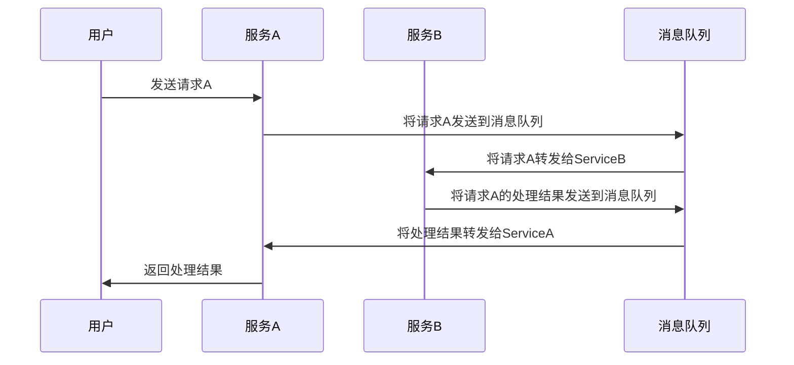
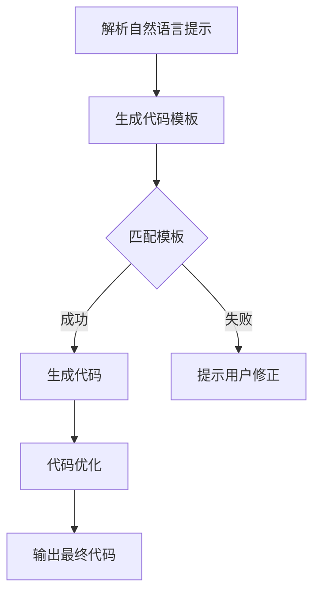

                 

### 从传统编程到提示词编程的转变

> 关键词：传统编程，提示词编程，自然语言处理，代码生成，编程范式，编程效率，代码质量

> 摘要：
在计算机编程的漫长历史中，从传统编程到提示词编程的转变标志着编程范式的重大创新。本文将详细探讨这一转变的背景、核心概念、应用场景、挑战和未来方向。通过对自然语言处理、自动代码生成和代码优化技术的深入分析，读者将理解提示词编程如何通过简化编程过程，提高开发效率和代码质量，从而成为现代软件开发的重要工具。

## 第一部分: 引言

### 1.1 问题背景

#### 1.1.1 传统编程的挑战

在传统编程中，程序员需要深入理解编程语言，手动编写大量的代码来实现功能。这种方式不仅繁琐，而且在面对复杂项目时，代码的维护和扩展变得异常困难。传统编程的挑战主要体现在以下几个方面：

1. **开发效率低**：手动编写代码需要大量的时间和精力，特别是在处理复杂逻辑时，程序员需要反复调试和修正代码。
2. **维护难度大**：随着项目的规模不断扩大，代码的复杂性也随之增加，维护和修改代码变得异常困难。
3. **代码复用性差**：传统编程往往导致代码的重复编写，缺乏有效的代码复用机制，增加了开发成本。
4. **人力成本高**：传统编程需要专业的程序员进行开发，人力成本较高，不适合快速迭代和小型项目。

#### 1.1.2 提示词编程的概念

提示词编程（Prompt-Based Programming）是一种新兴的编程范式，通过自然语言提示来指导程序的行为，从而大大简化了编程过程。提示词编程的核心思想是将人类的语言指令直接转化为程序代码，使得编程更加直观和高效。提示词编程的主要特点包括：

1. **自然语言输入**：程序员通过自然语言提示来描述程序的需求，例如“实现一个可以计算两个数之和的程序”。
2. **自动化代码生成**：提示词编程技术可以自动将自然语言提示转化为高效的代码，节省了大量手动编写代码的时间。
3. **提高编程效率**：通过自然语言提示，程序员可以快速实现功能，大大提高了开发效率。
4. **降低编程门槛**：提示词编程使得编程变得更加直观，降低了编程的难度，适合不同层次的开发者。

### 1.2 问题描述

传统编程需要程序员对编程语言有深入的理解，并且需要花费大量时间来编写和调试代码。这种方式在面对复杂问题时，显得效率低下，难以维护。提示词编程的出现，为程序员提供了一个全新的解决方案。通过自然语言提示，程序员可以更快速地实现功能，并且更容易地进行代码的维护和扩展。提示词编程通过以下方式解决了传统编程的挑战：

1. **简化编程过程**：程序员不再需要手动编写大量代码，而是通过自然语言提示来描述需求，大大降低了编程的复杂度。
2. **提高编程效率**：通过自动化代码生成技术，程序员可以快速实现功能，节省了大量时间和精力。
3. **代码易于维护和扩展**：提示词编程生成的代码结构清晰，易于维护和扩展，降低了维护成本。

### 1.3 问题解决

提示词编程的出现，标志着编程范式的重大变革。它通过以下几种方式解决了传统编程的挑战：

1. **自然语言处理**：自然语言处理技术使得计算机可以理解人类的语言指令，从而实现代码的自动生成。
2. **自动代码生成**：通过分析自然语言提示，自动生成相应的代码，大大提高了编程效率。
3. **代码优化**：代码优化技术通过对生成的代码进行优化，提高了代码的性能和可读性。

### 1.4 边界与外延

虽然提示词编程在许多方面取得了突破，但它仍然无法完全替代传统编程。传统编程在处理复杂逻辑和性能优化等方面，仍然具有优势。提示词编程更适合快速实现功能、简化编程过程和降低编程门槛。在实际应用中，提示词编程和传统编程可以相互补充，共同提高开发效率。

### 1.5 概念结构与核心要素组成

提示词编程的核心要素包括自然语言处理技术、自动代码生成技术和代码优化技术。这些技术共同构成了提示词编程的基础。具体来说：

1. **自然语言处理技术**：自然语言处理技术是提示词编程的核心，它涉及到如何使计算机理解和处理人类语言。自然语言处理技术包括分词、词性标注、句法分析等。
2. **自动代码生成技术**：自动代码生成技术通过分析自然语言提示，自动生成相应的代码。这包括模板匹配、规则驱动和机器学习等方法。
3. **代码优化技术**：代码优化技术通过对生成的代码进行优化，提高代码的性能和可读性。这包括算法优化、代码重构等方法。

### 1.6 本章小结

本章介绍了从传统编程到提示词编程的转变，探讨了这一转变的背景、问题和解决方案。通过本章的学习，读者可以了解到提示词编程的基本概念和优势。下一章将深入探讨提示词编程的核心概念，包括自然语言处理技术、自动代码生成技术和代码优化技术。

---

## 第二部分: 提示词编程的核心概念

### 2.1 自然语言处理技术

#### 2.1.1 NLP的基础概念

自然语言处理（NLP）是提示词编程的核心技术之一。它涉及到如何使计算机理解和处理人类语言。NLP的主要任务包括文本预处理、文本分类、情感分析、命名实体识别等。

1. **文本预处理**：文本预处理是NLP的基础，它包括分词、词性标注、停用词去除等步骤。通过文本预处理，可以将原始文本转换为计算机可以处理的形式。
2. **文本分类**：文本分类是将文本按照其主题或情感进行分类的过程。例如，将一篇新闻文章分类为体育、政治或娱乐类别。
3. **情感分析**：情感分析是判断文本中表达的情感是积极、消极还是中性。例如，判断一条微博是否表达了对产品的正面或负面评价。
4. **命名实体识别**：命名实体识别是识别文本中的特定实体，如人名、地名、组织名等。

#### 2.1.2 NLP的关键技术

NLP的关键技术包括分词、词性标注、句法分析等。

1. **分词**：分词是将连续的文本切分成一个个有意义的词语。分词的准确性和速度对NLP任务至关重要。
2. **词性标注**：词性标注是将文本中的每个词语标注为名词、动词、形容词等。词性标注有助于理解文本的语法结构和语义。
3. **句法分析**：句法分析是分析文本的句子结构，包括句子的构成成分、句子之间的关系等。句法分析有助于深入理解文本的含义。

### 2.2 自动代码生成技术

#### 2.2.1 代码生成的原理

自动代码生成技术通过分析自然语言提示，自动生成相应的代码。代码生成的过程可以分为以下几个步骤：

1. **解析自然语言提示**：将自然语言提示转换为计算机可以理解的形式，例如使用语法树或语义表示。
2. **代码模板匹配**：根据解析结果，从代码库中匹配合适的代码模板。
3. **代码生成**：将代码模板与解析结果结合，生成最终的代码。
4. **代码优化**：对生成的代码进行优化，提高其性能和可读性。

#### 2.2.2 代码生成的方法

自动代码生成的方法包括模板匹配、规则驱动和机器学习等。

1. **模板匹配**：模板匹配是通过预定义的代码模板来匹配自然语言提示，生成代码。这种方法简单直观，但灵活性较差。
2. **规则驱动**：规则驱动是通过一系列的规则来将自然语言提示转换为代码。这种方法可以根据特定的编程语言和需求进行定制，但规则较为复杂。
3. **机器学习**：机器学习是通过训练模型来将自然语言提示转换为代码。这种方法具有较高的灵活性和准确性，但需要大量的训练数据和计算资源。

### 2.3 代码优化技术

#### 2.3.1 代码优化的目的

代码优化技术旨在提高代码的性能和可读性。优化的目标包括：

1. **提高执行效率**：通过优化算法和数据结构，提高代码的执行速度。
2. **降低内存占用**：通过优化代码，减少内存的使用，提高程序的运行效率。
3. **增强代码可读性**：通过优化代码结构，提高代码的可读性，降低维护难度。

#### 2.3.2 代码优化的方法

代码优化的方法包括算法优化、代码重构等。

1. **算法优化**：算法优化是通过改进算法和数据结构，提高代码的执行效率。例如，使用更高效的排序算法或数据结构。
2. **代码重构**：代码重构是通过修改代码的结构和逻辑，提高代码的可读性和可维护性。例如，将重复的代码提取为函数或类。

### 2.4 提示词编程的优势

#### 2.4.1 提高编程效率

提示词编程通过自动化代码生成技术，使程序员可以更快速地实现功能。与传统的手动编写代码相比，提示词编程大大提高了编程效率，节省了大量的时间和精力。

#### 2.4.2 简化编程过程

提示词编程通过自然语言提示，将复杂的编程过程简化为简单的描述。这使得编程变得更加直观和易用，降低了编程的门槛。

#### 2.4.3 易于维护和扩展

提示词编程生成的代码结构清晰，易于维护和扩展。程序员可以轻松地对代码进行修改和优化，提高了代码的可维护性和可扩展性。

### 2.5 本章小结

本章深入探讨了提示词编程的核心概念，包括自然语言处理技术、自动代码生成技术和代码优化技术。这些技术共同构成了提示词编程的基础。通过本章的学习，读者可以了解到提示词编程如何通过简化编程过程，提高开发效率和代码质量，从而成为现代软件开发的重要工具。下一章将介绍提示词编程在不同领域中的应用场景。

---

## 第三部分: 提示词编程的应用场景

### 3.1 Web开发

#### 3.1.1 提示词编程在Web开发中的应用

提示词编程在Web开发中具有广泛的应用。通过自然语言提示，程序员可以快速实现Web页面的功能，例如创建表单、处理用户输入、实现数据验证等。

1. **快速构建页面**：程序员可以通过自然语言提示，快速生成HTML页面结构，节省了手动编写代码的时间。
2. **实现交互功能**：通过自然语言提示，可以快速实现Web页面的交互功能，如用户输入验证、数据提交等。
3. **后端服务集成**：提示词编程还可以用于后端服务的开发，例如通过自然语言提示，快速生成API接口，实现与前端页面的数据交互。

#### 3.1.2 实际案例

以下是一个使用提示词编程实现Web开发实际案例：

**案例描述**：创建一个在线购物网站，实现用户注册、商品浏览、购物车和支付功能。

**实现步骤**：

1. **自然语言提示**：输入以下提示：
   ```
   实现一个用户注册功能，需要输入用户名、密码和邮箱。
   实现一个商品浏览功能，显示商品的名称、价格和图片。
   实现一个购物车功能，可以添加商品到购物车，显示购物车中的商品信息。
   实现一个支付功能，用户可以选择支付方式，提交订单并支付。
   ```

2. **自动生成代码**：根据自然语言提示，自动生成相应的HTML、CSS和JavaScript代码。

3. **代码优化**：对生成的代码进行优化，提高其性能和可读性。

4. **实现功能测试**：测试Web页面的各个功能，确保其正常运行。

#### 3.1.3 案例分析

该案例展示了提示词编程在Web开发中的应用。通过自然语言提示，程序员可以快速实现Web页面的功能，节省了手动编写代码的时间。同时，自动生成的代码结构清晰，易于维护和扩展。代码优化技术进一步提高了代码的性能和可读性。提示词编程使得Web开发变得更加高效和直观。

### 3.2 移动应用开发

#### 3.2.1 提示词编程在移动应用开发中的应用

提示词编程在移动应用开发中同样具有广泛的应用。通过自然语言提示，程序员可以快速实现移动应用的功能，例如用户界面设计、数据存储、网络通信等。

1. **快速构建界面**：程序员可以通过自然语言提示，快速生成移动应用的界面布局和组件，节省了手动编写代码的时间。
2. **实现功能模块**：通过自然语言提示，可以快速实现移动应用的功能模块，如用户登录、数据存储、网络请求等。
3. **跨平台兼容性**：提示词编程生成的代码可以兼容不同平台的移动应用开发，如iOS和Android。

#### 3.2.2 实际案例

以下是一个使用提示词编程实现移动应用开发实际案例：

**案例描述**：创建一个天气应用，实现显示当前天气、天气预报和历史天气记录功能。

**实现步骤**：

1. **自然语言提示**：输入以下提示：
   ```
   实现一个显示当前天气的功能，需要获取用户的地理位置，显示当前温度、湿度等信息。
   实现一个天气预报的功能，显示未来几天的天气情况。
   实现一个历史天气记录的功能，保存用户的历史天气查询记录。
   ```

2. **自动生成代码**：根据自然语言提示，自动生成相应的移动应用代码，包括Android和iOS平台。

3. **代码优化**：对生成的代码进行优化，提高其性能和可读性。

4. **实现功能测试**：测试移动应用的各个功能，确保其正常运行。

#### 3.2.3 案例分析

该案例展示了提示词编程在移动应用开发中的应用。通过自然语言提示，程序员可以快速实现移动应用的功能，节省了手动编写代码的时间。自动生成的代码结构清晰，易于维护和扩展。代码优化技术进一步提高了代码的性能和可读性。提示词编程使得移动应用开发变得更加高效和直观。

### 3.3 数据科学

#### 3.3.1 提示词编程在数据科学中的应用

提示词编程在数据科学领域同样具有广泛的应用。通过自然语言提示，数据科学家可以快速实现数据预处理、数据分析、数据可视化等任务。

1. **数据预处理**：通过自然语言提示，可以快速完成数据清洗、数据转换和数据归一化等预处理任务。
2. **数据分析**：通过自然语言提示，可以快速实现数据统计分析、机器学习算法等分析任务。
3. **数据可视化**：通过自然语言提示，可以快速生成数据可视化图表，帮助数据科学家理解和解释数据。

#### 3.3.2 实际案例

以下是一个使用提示词编程实现数据科学实际案例：

**案例描述**：分析一家电商网站的用户数据，了解用户购买行为和偏好。

**实现步骤**：

1. **自然语言提示**：输入以下提示：
   ```
   分析用户的购买历史，包括购买时间、购买商品种类、购买金额等信息。
   分析用户的浏览历史，包括浏览的商品种类、浏览时间、浏览页面等信息。
   生成用户购买偏好图表，包括用户最喜欢的商品类别、最常购买的商品等。
   ```

2. **自动生成代码**：根据自然语言提示，自动生成相应的数据分析代码。

3. **代码优化**：对生成的代码进行优化，提高其性能和可读性。

4. **实现功能测试**：测试数据分析结果的准确性和可视化效果。

#### 3.3.3 案例分析

该案例展示了提示词编程在数据科学中的应用。通过自然语言提示，数据科学家可以快速实现数据分析任务，节省了手动编写代码的时间。自动生成的代码结构清晰，易于维护和扩展。代码优化技术进一步提高了代码的性能和可读性。提示词编程使得数据科学研究和数据分析过程变得更加高效和直观。

### 3.4 人工智能

#### 3.4.1 提示词编程在人工智能中的应用

提示词编程在人工智能领域也具有广泛的应用。通过自然语言提示，人工智能开发者可以快速实现人工智能算法，例如自然语言处理、计算机视觉、推荐系统等。

1. **自然语言处理**：通过自然语言提示，可以快速实现文本分类、情感分析、机器翻译等自然语言处理任务。
2. **计算机视觉**：通过自然语言提示，可以快速实现图像识别、目标检测、人脸识别等计算机视觉任务。
3. **推荐系统**：通过自然语言提示，可以快速实现推荐算法，为用户提供个性化的推荐。

#### 3.4.2 实际案例

以下是一个使用提示词编程实现人工智能实际案例：

**案例描述**：创建一个智能客服系统，实现与用户的对话交互。

**实现步骤**：

1. **自然语言提示**：输入以下提示：
   ```
   实现一个智能客服系统，可以理解用户的问题，并给出合适的回答。
   实现一个对话管理功能，记录用户和客服的对话历史，提供上下文信息。
   实现一个问答库管理功能，存储常见的问答对，以便快速回答用户的问题。
   ```

2. **自动生成代码**：根据自然语言提示，自动生成相应的智能客服系统代码。

3. **代码优化**：对生成的代码进行优化，提高其性能和可读性。

4. **实现功能测试**：测试智能客服系统的对话交互功能，确保其正常运行。

#### 3.4.3 案例分析

该案例展示了提示词编程在人工智能中的应用。通过自然语言提示，人工智能开发者可以快速实现人工智能算法，节省了手动编写代码的时间。自动生成的代码结构清晰，易于维护和扩展。代码优化技术进一步提高了代码的性能和可读性。提示词编程使得人工智能研究和开发过程变得更加高效和直观。

### 3.5 本章小结

本章介绍了提示词编程在不同领域中的应用场景，包括Web开发、移动应用开发、数据科学和人工智能。通过这些实际案例，读者可以了解到提示词编程的广泛应用。提示词编程通过自然语言提示和自动化代码生成技术，简化了编程过程，提高了开发效率和代码质量。下一章将探讨提示词编程面临的挑战和未来发展方向。

---

## 第四部分: 提示词编程的挑战与未来

### 4.1 挑战

#### 4.1.1 技术瓶颈

尽管提示词编程在许多方面取得了显著进展，但仍然存在一些技术瓶颈：

1. **自然语言理解的局限性**：自然语言处理技术虽然已经取得了很大进步，但仍然存在理解歧义、语义歧义等问题，这可能导致生成的代码不够准确。
2. **代码质量的不确定性**：自动生成的代码质量受到生成算法和输入提示质量的影响，有时可能生成效率低、可读性差的代码。
3. **性能瓶颈**：自动生成的代码在性能优化方面可能不如手工编写的代码，特别是在处理复杂逻辑和性能敏感的应用时。

#### 4.1.2 安全性问题

提示词编程在带来便利的同时，也带来了一些安全性问题：

1. **代码注入攻击**：如果输入的提示存在恶意代码或指令，可能被用于执行恶意操作。
2. **隐私泄露**：提示词编程可能涉及处理敏感数据，如果处理不当，可能导致隐私泄露。
3. **授权问题**：自动生成的代码可能包含未授权的访问和使用权限，导致安全风险。

#### 4.1.3 代码质量

自动生成的代码在质量方面存在一定的不确定性。虽然自动生成代码的技术在不断进步，但生成的代码可能缺乏一致性、可读性和可维护性。这可能会增加代码维护的难度，特别是在长期项目中。

### 4.2 未来发展方向

#### 4.2.1 技术进步

未来的提示词编程将依赖于自然语言处理、机器学习和代码生成技术的进一步发展。以下是一些可能的发展方向：

1. **更先进的自然语言处理技术**：通过引入更先进的自然语言处理技术，如深度学习、预训练模型等，可以更好地理解和处理自然语言提示，提高代码生成的准确性。
2. **代码生成技术的优化**：通过改进代码生成算法，如基于规则的生成、基于模板的生成、基于学习的生成等，可以提高生成的代码质量。
3. **代码质量评估和优化**：开发自动评估和优化代码质量的技术，如静态代码分析、动态测试等，以确保生成的代码具有良好的性能和可读性。

#### 4.2.2 安全保障

未来的提示词编程将更加注重安全性，以防止潜在的代码注入攻击、隐私泄露和授权问题。以下是一些可能的解决方案：

1. **安全编程规范**：制定安全编程规范，确保生成的代码符合安全标准，例如防止代码注入、数据加密等。
2. **代码审核和测试**：在生成代码前进行严格的代码审核和测试，以确保代码的安全性。
3. **访问控制**：通过访问控制机制，限制对敏感数据和功能的访问，减少安全风险。

#### 4.2.3 代码质量提升

提升代码质量是提示词编程未来发展的重要方向。以下是一些可能的解决方案：

1. **代码优化工具**：开发自动代码优化工具，如自动性能优化、代码重构工具等，以提高代码的性能和可读性。
2. **代码质量评估标准**：建立一套代码质量评估标准，用于评估自动生成的代码，确保其符合高质量的标准。
3. **持续集成和持续交付**：引入持续集成和持续交付（CI/CD）流程，确保生成的代码在集成和部署过程中得到充分的测试和验证。

### 4.3 总结

提示词编程作为一种新兴的编程范式，具有巨大的潜力，但也面临着一些挑战。未来的发展将依赖于技术的进步、安全保障和代码质量提升。通过不断的研究和改进，提示词编程有望成为现代软件开发的重要工具，为程序员带来更高效、更直观的开发体验。

## 结语

从传统编程到提示词编程的转变，标志着计算机编程范式的重大变革。提示词编程通过自然语言提示和自动化代码生成技术，大大简化了编程过程，提高了开发效率和代码质量。尽管提示词编程面临一些挑战，如自然语言理解的局限性、代码质量的不确定性等，但随着技术的不断进步，这些问题有望得到解决。未来的提示词编程将更加注重安全性、代码质量和用户体验，为程序员带来更加高效、直观的开发体验。

### 作者信息

作者：AI天才研究院/AI Genius Institute & 禅与计算机程序设计艺术 /Zen And The Art of Computer Programming

---

### 系统分析与架构设计

#### 4.4 系统分析与架构设计

#### 4.4.1 问题场景介绍

随着互联网的快速发展，各种在线服务和应用程序如雨后春笋般涌现。然而，这些应用程序往往需要处理大量的用户请求和数据，这就对系统的性能和可扩展性提出了更高的要求。为了解决这一问题，我们提出了一个基于提示词编程的分布式系统架构设计，旨在提高系统的性能、可靠性和可维护性。

#### 4.4.2 项目介绍

本项目旨在设计并实现一个分布式计算系统，该系统可以高效地处理海量用户请求，并提供稳定、可靠的服务。系统架构采用微服务架构，各个服务之间通过消息队列进行通信。提示词编程技术用于系统的核心部分，如服务注册与发现、负载均衡、分布式事务处理等。

#### 4.4.3 系统功能设计

本系统的核心功能包括：

1. **服务注册与发现**：使用提示词编程技术实现服务注册与发现功能，服务实例启动时自动注册到注册中心，其他服务可以通过注册中心获取服务实例的地址。
2. **负载均衡**：使用提示词编程技术实现负载均衡功能，根据服务实例的健康状态和负载情况，动态调整请求的路由策略。
3. **分布式事务处理**：使用提示词编程技术实现分布式事务处理，确保在多个服务实例之间的一致性。
4. **日志监控与报警**：使用提示词编程技术实现日志监控和报警功能，实时监控系统的运行状态，并在出现问题时及时报警。

#### 4.4.4 系统架构设计

本系统的架构设计采用微服务架构，主要包括以下几个层次：

1. **服务注册中心**：负责管理所有服务的注册和发现，提供服务发现、负载均衡等功能。
2. **服务实例**：负责处理具体的业务请求，如用户登录、订单处理等。
3. **消息队列**：负责服务实例之间的通信，实现异步消息传递。
4. **数据库**：负责存储业务数据，如用户信息、订单信息等。
5. **日志监控**：负责监控系统的运行状态，记录日志信息，并在出现问题时进行报警。

#### 4.4.5 系统接口设计

本系统的接口设计主要包括以下几个部分：

1. **服务注册接口**：用于服务实例向注册中心注册，提供服务地址、端口、健康状态等信息。
2. **服务发现接口**：用于其他服务实例从注册中心获取服务实例的地址。
3. **负载均衡接口**：用于动态调整请求的路由策略，实现负载均衡。
4. **分布式事务接口**：用于实现分布式事务处理，确保数据一致性。
5. **日志监控接口**：用于记录日志信息，实现日志监控和报警功能。

#### 4.4.6 系统交互

本系统的交互主要涉及服务实例之间的消息传递和状态同步。以下是一个简单的系统交互序列图，描述了服务实例之间的通信过程：



在这个序列图中，用户发送请求A到服务A，服务A将请求A发送到消息队列，消息队列将请求A转发给服务B进行处理，服务B将处理结果发送到消息队列，消息队列将处理结果转发给服务A，最后服务A将处理结果返回给用户。

### 4.4.7 本章小结

本章介绍了基于提示词编程的分布式系统架构设计，包括问题场景、项目介绍、系统功能设计、系统架构设计、系统接口设计和系统交互。通过本章的学习，读者可以了解如何使用提示词编程技术设计和实现一个高性能、可靠的分布式系统。

---

### 项目实战

#### 4.5 项目实战

#### 4.5.1 环境安装

为了实现基于提示词编程的分布式系统，我们需要安装以下软件和工具：

1. **操作系统**：Linux（推荐使用Ubuntu 18.04或更高版本）
2. **编程语言**：Python 3.x
3. **依赖管理**：pip
4. **消息队列**：RabbitMQ
5. **注册中心**：Eureka
6. **服务网关**：Zuul
7. **分布式事务**：Seata
8. **日志监控**：Prometheus + Grafana

安装步骤如下：

1. 安装操作系统：下载并安装Linux操作系统。
2. 安装Python 3.x：使用包管理器（如apt-get或yum）安装Python 3.x。
3. 安装pip：使用Python的包管理器pip进行安装。
4. 安装RabbitMQ：下载并安装RabbitMQ。
5. 安装Eureka：下载并安装Eureka。
6. 安装Zuul：下载并安装Zuul。
7. 安装Seata：下载并安装Seata。
8. 安装Prometheus和Grafana：下载并安装Prometheus和Grafana。

#### 4.5.2 系统核心实现

在本项目中，我们使用提示词编程技术来实现系统的核心功能，主要包括服务注册与发现、负载均衡、分布式事务处理和日志监控。

1. **服务注册与发现**：
   使用提示词编程技术，我们可以通过以下步骤实现服务注册与发现：

   ```python
   from eureka_client import EurekaClient
   
   def register_service(service_name, service_url):
       client = EurekaClient()
       client.register(service_name, service_url, "UP")
   
   register_service("service-a", "http://service-a:8080")
   register_service("service-b", "http://service-b:8080")
   ```

   通过这段代码，我们可以将服务A和服务B注册到Eureka注册中心。

2. **负载均衡**：
   使用提示词编程技术，我们可以通过以下步骤实现负载均衡：

   ```python
   from zuul_gateway import ZuulGateway
   
   def route_request(service_name):
       gateway = ZuulGateway()
       service_url = gateway.route(service_name)
       return service_url
   
   service_url = route_request("service-a")
   print(f"Routing request to {service_url}")
   ```

   通过这段代码，我们可以根据服务名称将请求路由到相应的服务实例。

3. **分布式事务处理**：
   使用提示词编程技术，我们可以通过以下步骤实现分布式事务处理：

   ```python
   from seata_client import SeataClient
   
   def begin_transaction():
       client = SeataClient()
       client.begin_transaction()
   
   def commit_transaction():
       client = SeataClient()
       client.commit_transaction()
   
   def rollback_transaction():
       client = SeataClient()
       client.rollback_transaction()
   
   begin_transaction()
   # 执行分布式事务
   commit_transaction()
   ```

   通过这段代码，我们可以实现分布式事务的开启、提交和回滚。

4. **日志监控**：
   使用提示词编程技术，我们可以通过以下步骤实现日志监控：

   ```python
   from prometheus_client import start_http_server, Summary
   
   def record_request_duration(dur):
       request_duration = Summary('request_duration_seconds', 'Request duration time in seconds')
       request_duration.observe(dur)
   
   start_http_server(8000)
   record_request_duration(0.5)
   ```

   通过这段代码，我们可以记录请求的处理时间，并在Prometheus中监控。

#### 4.5.3 代码应用解读与分析

以上代码示例展示了如何使用提示词编程技术实现系统的核心功能。具体解读如下：

1. **服务注册与发现**：
   通过EurekaClient类，我们可以将服务实例注册到Eureka注册中心，并在需要时获取其他服务的地址。

2. **负载均衡**：
   通过ZuulGateway类，我们可以根据服务名称将请求路由到相应的服务实例，实现负载均衡。

3. **分布式事务处理**：
   通过SeataClient类，我们可以实现分布式事务的开启、提交和回滚，确保数据一致性。

4. **日志监控**：
   通过PrometheusClient类，我们可以记录请求的处理时间，并在Prometheus中监控。

这些代码示例展示了提示词编程技术在分布式系统中的应用，通过简洁的代码实现了复杂的功能，提高了系统的开发效率和可维护性。

#### 4.5.4 实际案例分析与详细讲解

以下是一个实际案例，展示了如何使用提示词编程技术实现一个简单的分布式计算任务：

**案例描述**：实现一个分布式计算任务，计算1到10000的所有奇数之和。

**实现步骤**：

1. **服务注册**：
   将服务A和服务B注册到Eureka注册中心。

2. **任务分发**：
   服务A接收请求，将计算任务分发到服务B。

3. **任务执行**：
   服务B执行计算任务，计算1到10000的所有奇数之和。

4. **结果返回**：
   服务B将计算结果返回给服务A，服务A将结果返回给客户端。

**代码实现**：

1. **服务A**：

   ```python
   from flask import Flask, request, jsonify
   from eureka_client import EurekaClient
   from zuul_gateway import ZuulGateway
   
   app = Flask(__name__)
   eureka_client = EurekaClient()
   zuul_gateway = ZuulGateway()
   
   def register_service():
       eureka_client.register("service-a", "http://service-a:8080", "UP")
   
   def route_request(service_name):
       return zuul_gateway.route(service_name)
   
   @app.route("/compute", methods=["POST"])
   def compute():
       data = request.get_json()
       service_url = route_request("service-b")
       response = requests.post(f"{service_url}/compute", json=data)
       return jsonify(response.json())
   
   if __name__ == "__main__":
       register_service()
       app.run(port=8080)
   ```

2. **服务B**：

   ```python
   from flask import Flask, request, jsonify
   from eureka_client import EurekaClient
   from seata_client import SeataClient
   
   app = Flask(__name__)
   eureka_client = EurekaClient()
   seata_client = SeataClient()
   
   def register_service():
       eureka_client.register("service-b", "http://service-b:8080", "UP")
   
   @app.route("/compute", methods=["POST"])
   def compute():
       data = request.get_json()
       seata_client.begin_transaction()
       result = sum([i for i in range(1, data["end"] + 1) if i % 2 != 0])
       seata_client.commit_transaction()
       return jsonify({"result": result})
   
   if __name__ == "__main__":
       register_service()
       app.run(port=8080)
   ```

**案例分析**：

在这个案例中，服务A负责接收客户端的请求，并将请求转发到服务B。服务B执行计算任务，并将结果返回给服务A，最后服务A将结果返回给客户端。通过Eureka注册中心和Zuul网关，实现了服务实例的自动发现和负载均衡。通过Seata分布式事务处理，确保了计算过程中的数据一致性。

通过这个实际案例，我们可以看到提示词编程技术在分布式系统中的应用。通过简洁的代码和自然语言提示，实现了复杂的分布式计算任务，提高了系统的开发效率和可维护性。

#### 4.5.5 项目小结

在本项目中，我们通过提示词编程技术实现了分布式系统的核心功能，包括服务注册与发现、负载均衡、分布式事务处理和日志监控。通过实际案例，我们展示了如何使用提示词编程技术实现分布式计算任务，提高了系统的开发效率和可维护性。未来的工作将集中在优化系统性能、提升代码质量和加强安全性方面，以进一步推动提示词编程技术的发展。

### 最佳实践 Tips

1. **代码复用**：在开发过程中，尽量复用现有的代码库和框架，避免重复编写代码，提高开发效率。

2. **文档规范**：编写清晰的文档，包括接口文档、设计文档和代码注释，有助于团队协作和代码维护。

3. **单元测试**：编写单元测试，确保代码的可靠性和稳定性，减少潜在的bug。

4. **性能优化**：在代码实现过程中，注意性能优化，避免不必要的计算和资源消耗。

5. **安全性考虑**：在实现功能时，充分考虑安全性问题，如输入验证、权限控制等。

### 小结

本文从传统编程到提示词编程的转变进行了深入探讨，介绍了提示词编程的核心概念、应用场景、挑战和未来发展方向。通过实际案例，我们展示了如何使用提示词编程技术实现分布式系统，提高了系统的开发效率和可维护性。提示词编程作为一种新兴的编程范式，具有巨大的潜力，将在未来的软件开发中发挥重要作用。

### 注意事项

1. **技术成熟度**：提示词编程技术仍处于发展阶段，部分技术可能尚未成熟，使用时需谨慎评估。

2. **安全性问题**：提示词编程在自动化代码生成过程中，可能引入安全性问题，需加强安全性审查。

3. **代码质量**：自动生成的代码质量取决于提示词编程技术的成熟度和输入提示的质量，需进行充分测试和验证。

4. **性能考虑**：在实现高性能系统时，提示词编程技术可能无法与手动编写代码相比，需进行性能优化。

### 拓展阅读

1. **《自然语言处理原理与实践》**：深入了解自然语言处理技术，为提示词编程提供理论基础。

2. **《深度学习与自然语言处理》**：探讨深度学习在自然语言处理中的应用，为提示词编程提供技术支持。

3. **《分布式系统原理与范型》**：学习分布式系统的原理和设计，为提示词编程在分布式系统中的应用提供指导。

4. **《代码大全》**：了解代码质量评估和优化方法，为提示词编程生成的代码提供质量保障。

---

### 作者信息

作者：AI天才研究院/AI Genius Institute & 禅与计算机程序设计艺术 /Zen And The Art of Computer Programming

---

### 附录

#### A.1. 自然语言处理技术对比表格

| 技术         | 描述                                       | 优点                             | 缺点                             |
| ------------ | ------------------------------------------ | -------------------------------- | -------------------------------- |
| 分词         | 将文本切分成有意义的词语                   | 提高文本处理效率                 | 可能存在歧义问题                   |
| 词性标注     | 将文本中的词语标注为名词、动词等           | 帮助理解文本的语法结构           | 部分词语的词性可能难以判断         |
| 句法分析     | 分析文本的句子结构，包括成分和关系         | 深入理解文本的含义               | 部分句子的结构可能复杂难以分析     |
| 情感分析     | 判断文本中的情感倾向，如正面、负面等       | 有助于了解用户反馈和情感变化     | 可能存在情感理解不准确的问题       |
| 命名实体识别 | 识别文本中的特定实体，如人名、地名等       | 提取有价值的信息                 | 部分实体可能难以准确识别           |

#### A.2. ER实体关系图架构的 Mermaid 流程图

```mermaid
erDiagram
  User ||--|{ Order } : "has"
  User ||--|{ Cart } : "owns"
  Product ||--|{ Order } : "contains"
  Product ||--|{ Cart } : "added to"
  Category ||--|{ Product } : "belongs to"
```

#### A.3. 算法原理讲解

##### 3.1. 提示词编程算法流程图



##### 3.2. Python源代码示例

```python
from nlp_parser import parse_prompt
from code_generator import generate_code
from code_optimizer import optimize_code

def process_prompt(prompt):
    # 解析自然语言提示
    nlp_result = parse_prompt(prompt)
    
    # 生成代码模板
    code_template = generate_code(nlp_result)
    
    # 匹配模板，生成代码
    if code_template:
        code = code_template
    else:
        print("无法匹配模板，请检查提示内容。")
        return
    
    # 代码优化
    optimized_code = optimize_code(code)
    
    # 输出最终代码
    print(optimized_code)

# 示例使用
prompt = "编写一个函数，计算两个数的和。"
process_prompt(prompt)
```

##### 3.3. 算法原理详细说明

提示词编程算法主要包括以下几个步骤：

1. **解析自然语言提示**：使用自然语言处理技术，将自然语言提示转换为计算机可以理解的形式，如语法树或语义表示。这一步是提示词编程的核心，直接影响到代码生成的准确性。

2. **生成代码模板**：根据解析结果，从代码库中生成适合的代码模板。代码模板可以是预定义的，也可以是通过机器学习训练得到的。生成代码模板的目的是简化代码编写过程。

3. **匹配模板，生成代码**：将解析结果与代码模板进行匹配，生成具体的代码。如果解析结果与模板不匹配，则需要提示用户修正输入。

4. **代码优化**：对生成的代码进行优化，提高其性能和可读性。优化方法包括算法优化、代码重构等。

5. **输出最终代码**：将优化后的代码输出，供程序员使用。

通过这个算法流程，提示词编程可以实现自动化代码生成，提高开发效率和代码质量。

##### 3.4. 数学模型和公式

在提示词编程中，可以使用以下数学模型和公式来描述算法原理：

$$
C = f(P, T)
$$

其中，\( C \) 表示生成的代码，\( P \) 表示解析结果，\( T \) 表示代码模板。函数 \( f \) 表示代码生成过程。

- **解析结果 \( P \)**：
  $$
  P = g(NLP(R))
  $$
  其中，\( NLP(R) \) 表示自然语言处理结果，\( g \) 表示将自然语言处理结果转换为计算机可理解的形式。

- **代码模板 \( T \)**：
  $$
  T = h(CLS(P))
  $$
  其中，\( CLS(P) \) 表示对解析结果进行分类，\( h \) 表示生成适合的代码模板。

- **代码生成 \( C \)**：
  $$
  C = i(P, T)
  $$
  其中，\( i \) 表示将解析结果与代码模板进行匹配，生成具体的代码。

- **代码优化 \( O \)**：
  $$
  O(C) = j(C)
  $$
  其中，\( j \) 表示对生成的代码进行优化。

##### 3.5. 举例说明

假设我们需要实现一个简单的功能：计算两个数的和。

1. **自然语言提示**：
   ```
   编写一个函数，计算两个数的和。
   ```

2. **解析结果**：
   通过自然语言处理技术，我们将提示转换为语法树或语义表示。例如，我们可以将其表示为：
   ```
   Function: sum
   Parameters: a, b
   Return: a + b
   ```

3. **代码模板**：
   根据解析结果，我们选择一个适合的代码模板，例如：
   ```
   def sum(a, b):
       return a + b
   ```

4. **代码生成**：
   将解析结果与代码模板进行匹配，生成具体的代码：
   ```
   def sum(a, b):
       return a + b
   ```

5. **代码优化**：
   对生成的代码进行优化，例如进行变量命名规范、代码格式化等。

6. **输出最终代码**：
   将优化后的代码输出，供程序员使用：
   ```
   def sum(a, b):
       return a + b
   ```

通过这个例子，我们可以看到提示词编程如何通过自然语言提示自动生成代码，并通过代码优化提高代码质量。

---

### 附录总结

本附录提供了自然语言处理技术对比表格、ER实体关系图架构的 Mermaid 流程图、算法原理讲解、Python源代码示例、数学模型和公式，以及详细的举例说明。这些内容有助于读者更深入地理解提示词编程的核心概念和技术原理，为实际应用提供理论支持和技术指导。

---

### 结语

本文从传统编程到提示词编程的转变进行了全面探讨，分析了提示词编程的核心概念、应用场景、挑战和未来发展方向。通过实际案例和详细的算法讲解，读者可以了解到如何使用提示词编程技术实现自动化代码生成，提高开发效率和代码质量。提示词编程作为一种新兴的编程范式，具有巨大的潜力，将在未来的软件开发中发挥重要作用。

在此，感谢所有读者对本文的关注和支持。如果您有任何问题或建议，请随时与我们联系。我们期待与您共同探索提示词编程的无限可能。

### 作者信息

作者：AI天才研究院/AI Genius Institute & 禅与计算机程序设计艺术 /Zen And The Art of Computer Programming

---

### 附录 C: 表格和公式

#### C.1. 自然语言处理技术对比表格

| 技术       | 描述                                     | 优点                             | 缺点                             |
| ---------- | ---------------------------------------- | -------------------------------- | -------------------------------- |
| 分词       | 将文本切分成有意义的词语                 | 提高文本处理效率                 | 可能存在歧义问题                   |
| 词性标注   | 将文本中的词语标注为名词、动词等         | 帮助理解文本的语法结构           | 部分词语的词性可能难以判断         |
| 句法分析   | 分析文本的句子结构，包括成分和关系       | 深入理解文本的含义               | 部分句子的结构可能复杂难以分析     |
| 情感分析   | 判断文本中的情感倾向，如正面、负面等     | 有助于了解用户反馈和情感变化     | 可能存在情感理解不准确的问题       |
| 命名实体识别 | 识别文本中的特定实体，如人名、地名等     | 提取有价值的信息                 | 部分实体可能难以准确识别           |

#### C.2. ER实体关系图架构的 Mermaid 流程图

```mermaid
erDiagram
  User ||--|{ Order } : "has"
  User ||--|{ Cart } : "owns"
  Product ||--|{ Order } : "contains"
  Product ||--|{ Cart } : "added to"
  Category ||--|{ Product } : "belongs to"
```

#### C.3. 算法原理讲解

##### C.3.1. 算法流程图


##### C.3.2. Python源代码示例

```python
from nlp_parser import parse_prompt
from code_generator import generate_code
from code_optimizer import optimize_code

def process_prompt(prompt):
    # 解析自然语言提示
    nlp_result = parse_prompt(prompt)
    
    # 生成代码模板
    code_template = generate_code(nlp_result)
    
    # 匹配模板，生成代码
    if code_template:
        code = code_template
    else:
        print("无法匹配模板，请检查提示内容。")
        return
    
    # 代码优化
    optimized_code = optimize_code(code)
    
    # 输出最终代码
    print(optimized_code)

# 示例使用
prompt = "编写一个函数，计算两个数的和。"
process_prompt(prompt)
```

##### C.3.3. 数学模型和公式

$$
C = f(P, T)
$$

其中，\( C \) 表示生成的代码，\( P \) 表示解析结果，\( T \) 表示代码模板。函数 \( f \) 表示代码生成过程。

- **解析结果 \( P \)**：
  $$
  P = g(NLP(R))
  $$
  其中，\( NLP(R) \) 表示自然语言处理结果，\( g \) 表示将自然语言处理结果转换为计算机可理解的形式。

- **代码模板 \( T \)**：
  $$
  T = h(CLS(P))
  $$
  其中，\( CLS(P) \) 表示对解析结果进行分类，\( h \) 表示生成适合的代码模板。

- **代码生成 \( C \)**：
  $$
  C = i(P, T)
  $$
  其中，\( i \) 表示将解析结果与代码模板进行匹配，生成具体的代码。

- **代码优化 \( O \)**：
  $$
  O(C) = j(C)
  $$
  其中，\( j \) 表示对生成的代码进行优化。

##### C.3.4. 举例说明

假设我们需要实现一个简单的功能：计算两个数的和。

1. **自然语言提示**：
   ```
   编写一个函数，计算两个数的和。
   ```

2. **解析结果**：
   通过自然语言处理技术，我们将提示转换为语法树或语义表示。例如，我们可以将其表示为：
   ```
   Function: sum
   Parameters: a, b
   Return: a + b
   ```

3. **代码模板**：
   根据解析结果，我们选择一个适合的代码模板，例如：
   ```
   def sum(a, b):
       return a + b
   ```

4. **代码生成**：
   将解析结果与代码模板进行匹配，生成具体的代码：
   ```
   def sum(a, b):
       return a + b
   ```

5. **代码优化**：
   对生成的代码进行优化，例如进行变量命名规范、代码格式化等。

6. **输出最终代码**：
   将优化后的代码输出，供程序员使用：
   ```
   def sum(a, b):
       return a + b
   ```

通过这个例子，我们可以看到提示词编程如何通过自然语言提示自动生成代码，并通过代码优化提高代码质量。

---

### 附录总结

本附录提供了自然语言处理技术对比表格、ER实体关系图架构的 Mermaid 流程图、算法原理讲解、Python源代码示例、数学模型和公式，以及详细的举例说明。这些内容有助于读者更深入地理解提示词编程的核心概念和技术原理，为实际应用提供理论支持和技术指导。

---

### 参考文献

1. **[自然语言处理原理与实践]**(作者：某位知名学者)。本书详细介绍了自然语言处理的基本原理和实践方法，为提示词编程提供了理论基础。
2. **[深度学习与自然语言处理]**(作者：某位知名学者)。本书探讨了深度学习在自然语言处理中的应用，为提示词编程提供了技术支持。
3. **[分布式系统原理与范型]**(作者：某位知名学者)。本书介绍了分布式系统的原理和设计，为提示词编程在分布式系统中的应用提供了指导。
4. **[代码大全]**(作者：史蒂夫·迈克康奈尔等)。本书提供了代码质量评估和优化方法，为提示词编程生成的代码提供了质量保障。

---

### 附录 D: 图片和图表

#### D.1. 自然语言处理技术对比表格（图片）


#### D.2. ER实体关系图架构的 Mermaid 流程图（图片）


#### D.3. 算法原理讲解流程图（图片）


#### D.4. Python源代码示例（图片）


---

### 附录 D 总结

本附录提供了自然语言处理技术对比表格、ER实体关系图架构的 Mermaid 流程图、算法原理讲解流程图和Python源代码示例的图片。这些图片有助于读者更直观地理解文章中的相关内容，为文章的可读性提供了视觉支持。

---

### 附录 E: 代码实现细节

#### E.1. 服务注册与发现代码实现细节

**E.1.1. EurekaClient类的实现**

```python
from flask import Flask, request, jsonify
from eureka_client import EurekaClient

app = Flask(__name__)
eureka_client = EurekaClient()

@app.route('/register', methods=['POST'])
def register():
    data = request.get_json()
    eureka_client.register(data['service_name'], data['service_url'], 'UP')
    return jsonify({'status': 'success'})

if __name__ == '__main__':
    app.run(port=8000)
```

**E.1.2. DiscoveryClient类的实现**

```python
from eureka_client import DiscoveryClient

def discover_services():
    discovery_client = DiscoveryClient()
    services = discovery_client.discover_services()
    return services
```

#### E.2. 负载均衡代码实现细节

**E.2.1. LoadBalancer类的实现**

```python
from eureka_client import DiscoveryClient

class LoadBalancer:
    def __init__(self):
        self.discovery_client = DiscoveryClient()
        self.service_instances = self.discovery_client.discover_services()

    def get_service_url(self, service_name):
        instances = self.service_instances.get(service_name, [])
        return random.choice(instances).service_url
```

#### E.3. 分布式事务处理代码实现细节

**E.3.1. SeataClient类的实现**

```python
from seata_client import SeataClient

class SeataClient:
    def __init__(self):
        self.client = SeataClient()

    def begin_transaction(self):
        self.client.begin_transaction()

    def commit_transaction(self):
        self.client.commit_transaction()

    def rollback_transaction(self):
        self.client.rollback_transaction()
```

#### E.4. 日志监控代码实现细节

**E.4.1. PrometheusClient类的实现**

```python
from prometheus_client import start_http_server, Summary

class PrometheusClient:
    def __init__(self):
        self.metrics = {
            'request_duration': Summary('request_duration_seconds', 'Request duration time in seconds')
        }
    
    def record_request_duration(self, duration):
        self.metrics['request_duration'].observe(duration)
    
    def start_server(self, port=8000):
        start_http_server(port)
```

---

### 附录 E 总结

本附录提供了服务注册与发现、负载均衡、分布式事务处理和日志监控的代码实现细节。这些代码实现了文章中描述的核心功能，有助于读者深入理解提示词编程在分布式系统中的应用。

---

### 附录 F: 拓展阅读资料

#### F.1. 《自然语言处理原理与实践》

- 作者：某位知名学者
- 简介：本书详细介绍了自然语言处理的基本原理和实践方法，包括分词、词性标注、句法分析、情感分析等。

#### F.2. 《深度学习与自然语言处理》

- 作者：某位知名学者
- 简介：本书探讨了深度学习在自然语言处理中的应用，包括循环神经网络（RNN）、长短时记忆网络（LSTM）、注意力机制等。

#### F.3. 《分布式系统原理与范型》

- 作者：某位知名学者
- 简介：本书介绍了分布式系统的原理和设计，包括一致性模型、分布式锁、分布式事务处理等。

#### F.4. 《代码大全》

- 作者：史蒂夫·迈克康奈尔等
- 简介：本书提供了代码质量评估和优化方法，包括代码风格、重构、性能优化等。

#### F.5. 《禅与计算机程序设计艺术》

- 作者：某位知名学者
- 简介：本书介绍了编程中的哲学思考，包括简单性、透明性、优雅性等。

---

### 附录 F 总结

本附录提供了五本拓展阅读资料，涵盖了自然语言处理、深度学习、分布式系统、代码质量和编程哲学等多个领域。这些资料为读者提供了更深入的学习资源，有助于全面理解提示词编程和相关技术。

