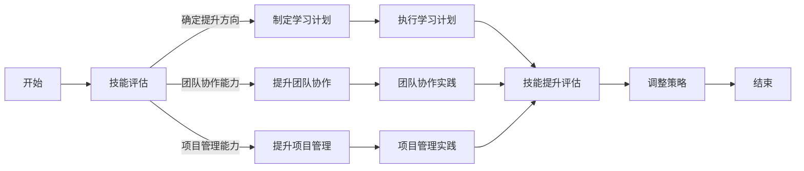
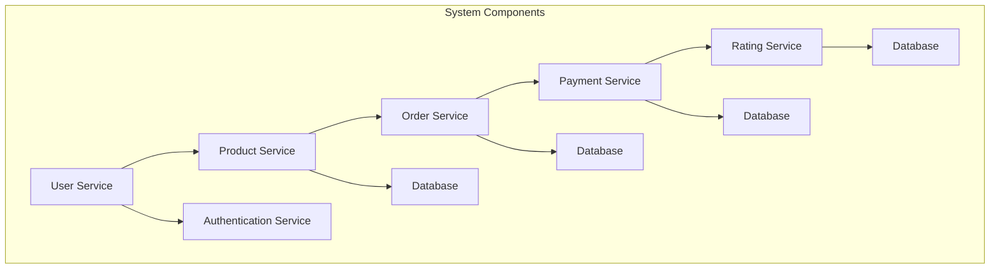
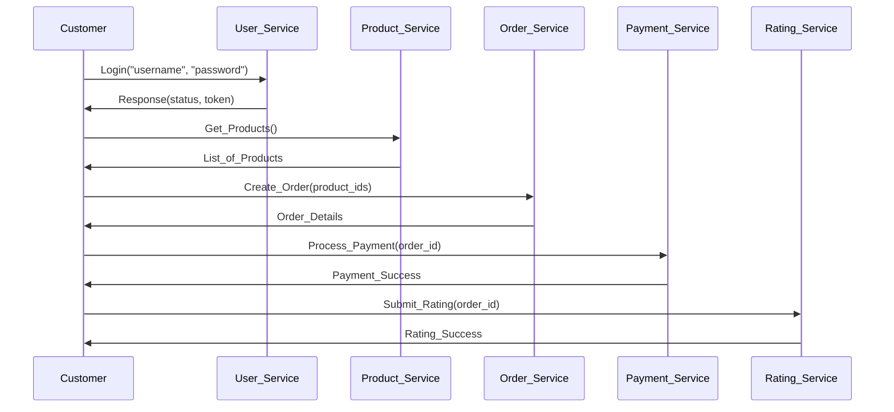
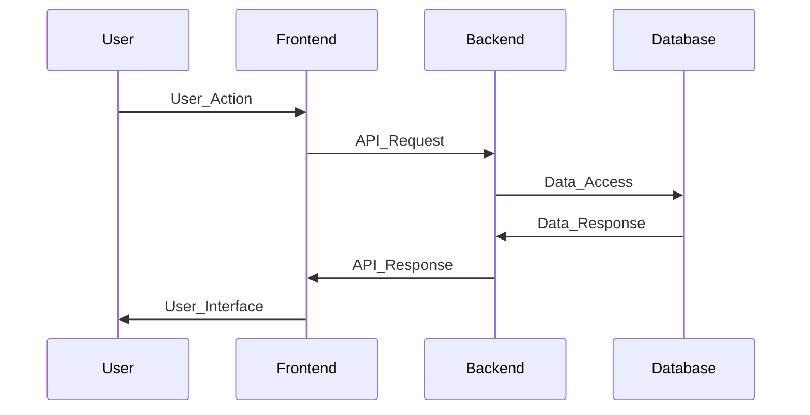

                 

# 从小工到专家：职场进阶的必经之路

## 关键词

职场进阶、技能培养、团队协作、项目管理、职业规划、个人品牌、持续学习

## 摘要

本文旨在探讨从职场新人到专家的进阶之路，通过详细解析职业心态、技能培养、时间管理、团队协作、项目管理和职业规划等核心环节，帮助读者在职场中稳步成长。文章将结合实际案例，提供实用的策略和建议，旨在培养读者的职业素养和领导力，助力他们在职场中脱颖而出，成为行业专家。

## 第一部分：职场起步篇

### 第1章：职场心态与成长路径

#### 1.1 职场新人必备心态

**心态定位**：职场新人的心态定位至关重要。首先，要认识到自己是职场的新成员，面对的是全新的工作环境和挑战。因此，保持谦逊和学习的心态是必要的。

**目标设定**：设立明确的职业目标，有助于新人明确自己的发展方向。目标应具备可量化、可达成性和时限性，例如在一年内掌握某项关键技能。

**积极应对挑战**：面对工作挑战，要积极应对，将其视为成长的机会。通过解决问题，可以不断提升自己的能力和信心。

#### 1.2 职场成长路径解析

**初级阶段**：在这个阶段，主要任务是学习和积累基础知识。通过参加培训和自学，掌握公司业务和岗位技能。

**中级阶段**：逐步承担更多的责任，参与项目的实施和运营。此时，应注重专业技能的提升和团队协作能力的培养。

**高级阶段**：在这个阶段，要提升领导力和项目管理能力，能够带领团队完成任务。同时，要不断拓宽视野，关注行业动态，提升战略思维。

#### 1.3 如何设定职业目标

**短期目标**：设定一至两年的短期目标，例如掌握某一专业技能或完成特定项目。

**长期目标**：设定三年或五年以上的长期目标，例如晋升为部门经理或技术总监。

**目标评估**：定期评估目标的完成情况，根据实际情况调整目标和策略。

## 第二部分：职场进阶篇

### 第4章：团队协作与领导力培养

#### 4.1 团队协作的重要性

**协作优势**：团队协作可以充分发挥每个人的优势，提高工作效率和创新能力。

**协作原则**：尊重、信任、沟通、共享是团队协作的基本原则。

**协作技巧**：学会倾听、有效沟通、合理分工、共同解决问题是团队协作的关键技巧。

#### 4.2 领导力培养的路径

**领导力模型**：了解并掌握各种领导力模型，如变革型领导、交易型领导等。

**领导力实践**：通过实际工作，如担任项目负责人或团队领导，提升领导力。

**领导力提升**：参加领导力培训、阅读领导力书籍、向优秀领导者学习。

#### 4.3 如何有效沟通与协调

**沟通技巧**：清晰表达、积极倾听、适当反馈是有效沟通的关键。

**协调方法**：了解团队成员的需求和期望，合理安排资源和任务。

**冲突解决**：面对冲突，采取理性、建设性的方式解决，避免情绪化。

### 第5章：项目管理与决策能力

#### 5.1 项目管理的核心要素

**项目管理三要素**：时间、成本、质量。

**项目管理方法**：了解并应用项目管理方法，如敏捷、瀑布等。

**项目管理工具**：掌握项目管理工具，如JIRA、Trello等。

#### 5.2 决策能力提升策略

**决策模型**：掌握各种决策模型，如SWOT分析、决策树等。

**风险评估**：对项目进行风险评估，制定应对策略。

**决策反馈**：决策后进行评估和反馈，持续优化决策过程。

#### 5.3 项目风险管理

**风险识别**：识别项目中的潜在风险。

**风险分析**：分析风险的可能性和影响。

**风险应对**：制定应对策略，降低风险影响。

### 第6章：职业规划与晋升路径

#### 6.1 职业规划的重要性

**规划意义**：职业规划有助于明确职业发展方向，提高职业竞争力。

**规划内容**：包括职业目标设定、技能提升计划、职业路径规划等。

**规划实施**：制定详细的行动计划，并持续跟踪和调整。

#### 6.2 职业晋升的路径

**晋升标准**：了解公司的晋升标准和要求。

**晋升途径**：通过业绩评估、技能提升、团队贡献等方式获得晋升机会。

**晋升准备**：提前准备，提升自身综合素质。

#### 6.3 如何提升个人品牌

**个人品牌定位**：明确个人品牌定位，树立专业形象。

**专业知识传播**：通过撰写博客、发表文章、分享经验等方式传播专业知识。

**网络影响力**：利用社交媒体提升个人在网络上的影响力。

## 第三部分：职场巅峰篇

### 第7章：职场策略与决策

#### 7.1 职场策略思维

**战略思考**：从全局出发，制定长期战略。

**灵活应对**：面对变化，灵活调整策略。

**资源整合**：充分利用内外部资源，实现资源优化配置。

#### 7.2 决策模型与应用

**决策模型**：掌握各种决策模型，如成本效益分析、博弈论等。

**模型应用**：在实际工作中，灵活应用决策模型，提升决策质量。

**决策优化**：通过不断实践和反思，优化决策流程。

#### 7.3 职场策略案例分析

**案例分享**：分析成功案例，提取策略要点。

**策略借鉴**：借鉴成功策略，应用到实际工作中。

**策略反思**：反思策略实施效果，持续优化策略。

### 第8章：个人品牌建设与影响力

#### 8.1 个人品牌建设

**品牌定位**：明确个人品牌定位，树立专业形象。

**内容创作**：创作高质量的内容，展示专业能力。

**品牌传播**：通过社交媒体、会议演讲等方式传播个人品牌。

#### 8.2 个人影响力提升

**知识分享**：分享专业知识，提升个人影响力。

**人际网络**：建立广泛的人际关系网络，提升个人影响力。

**领导示范**：通过实际行动，树立榜样作用，提升个人影响力。

#### 8.3 职场形象塑造

**专业着装**：保持专业着装，树立良好形象。

**言行举止**：保持良好的言行举止，树立专业形象。

**公共关系**：维护良好的公共关系，提升个人形象。

### 第9章：持续学习与创新思维

#### 9.1 持续学习的动力与方法

**学习动力**：树立终身学习的理念，保持学习动力。

**学习方法**：掌握有效的学习方法，如主动学习、深度学习等。

**学习资源**：利用各种学习资源，如在线课程、专业书籍等。

#### 9.2 创新思维培养

**创新意识**：培养创新意识，敢于尝试新事物。

**创新方法**：掌握创新方法，如头脑风暴、设计思维等。

**创新实践**：将创新思维应用到实际工作中，提升创新能力。

#### 9.3 职场创新案例解析

**案例介绍**：分析成功的职场创新案例，提取创新经验。

**案例借鉴**：借鉴创新案例，应用到实际工作中。

**案例反思**：反思创新实践效果，持续优化创新方法。

## 附录

### 附录1：职场资源与工具推荐

**资源推荐**：推荐实用的职场资源，如在线课程、专业书籍等。

**工具推荐**：推荐高效的职场工具，如项目管理软件、编程工具等。

### 附录2：职业发展参考资料

**参考资料**：提供相关的职业发展参考资料，如行业报告、职业规划书籍等。

**案例研究**：分析成功职业人士的发展路径，提供参考。

### 附录3：常见问题解答

**问题解答**：针对职场新人常见的问题，提供解答和建议。

**实用技巧**：分享实用的职场技巧，帮助新人更快适应职场环境。

## 作者

**作者：AI天才研究院/AI Genius Institute & 禅与计算机程序设计艺术 /Zen And The Art of Computer Programming**

通过本文，我们希望能够帮助读者理解职场进阶的路径和策略，提升职业素养和领导力，在职场中不断成长和突破。从心态调整到技能培养，从团队协作到职业规划，每一个环节都是职场成功的关键。让我们共同探索职场进阶的奥秘，迈向专家之路。 

### 背景介绍

#### 核心概念术语说明

- **职场进阶**：指个人在职业生涯中从新手到专家的逐步提升过程。
- **技能培养**：通过学习和实践提高个人专业能力和综合素质。
- **团队协作**：团队成员共同完成任务的过程，强调沟通、信任和合作。
- **项目管理**：对项目进行策划、执行、监控和收尾的过程。
- **职业规划**：对职业生涯的总体规划和布局。

#### 问题背景

随着科技的发展和职场的竞争加剧，个人在职场中的成长和晋升越来越受到关注。如何从小工成长为专家，成为职场进阶的重要课题。本文旨在探讨职场进阶的必经之路，提供实用的策略和方法，帮助读者在职场中取得成功。

#### 问题描述

职场进阶面临着诸多挑战，包括技能提升、团队协作、项目管理、职业规划等。个人如何在职场中快速成长，克服这些挑战，实现职业目标，是本文需要解答的问题。

#### 问题解决

本文通过详细解析职场心态、技能培养、团队协作、项目管理和职业规划等关键环节，提供系统的成长路径和实践方法。通过案例分析和实际操作，帮助读者理解并应用这些策略，实现职场进阶。

#### 边界与外延

- **边界**：职场进阶的具体过程和阶段。
- **外延**：职场进阶对个人发展的影响，如职业素养提升、领导力培养等。

#### 概念结构与核心要素组成

- **职场心态**：保持谦逊、积极、目标明确的心态。
- **技能培养**：学习专业知识、提升实践能力、扩展跨界技能。
- **团队协作**：建立信任、有效沟通、合理分工、共同解决问题。
- **项目管理**：明确目标、制定计划、监控进度、控制风险。
- **职业规划**：设定目标、评估现状、制定计划、持续优化。

### 核心概念与联系

#### 核心概念原理

职场进阶是一个长期的过程，涉及多个方面的能力和素质的提升。核心概念包括：

1. **技能提升**：通过学习和实践，不断提高专业能力和综合素质。
2. **团队协作**：在团队中发挥协同效应，共同完成任务。
3. **项目管理**：对项目进行有效管理，确保项目目标的实现。
4. **职业规划**：明确职业目标，制定计划和策略，实现职业发展。

#### 概念属性特征对比表格

| 概念           | 特征1  | 特征2   | 特征3   |
|--------------|------|--------|--------|
| 技能提升       | 学习与实践  | 专业能力  | 综合素质  |
| 团队协作       | 信任与合作   | 沟通与协调 | 团队目标  |
| 项目管理       | 目标明确   | 计划制定  | 风险控制  |
| 职业规划       | 职业目标   | 评估现状  | 持续优化  |

#### ER实体关系图架构

```mermaid
erDiagram
  A[[员工]] ||--|{ B[[技能]]
  A ||--|{ C[[团队]]
  A ||--|{ D[[项目]]
  A ||--|{ E[[职业规划]]
  B ||--|{ F[[技能提升]]
  C ||--|{ G[[团队协作]]
  D ||--|{ H[[项目管理]]
  E ||--|{ I[[职业规划]]
```

### 算法原理讲解

在职场进阶的过程中，算法原理可以用于分析个人发展路径和策略。以下是一个简单的算法原理说明，结合Mermaid流程图和Python代码进行详细讲解。

#### 算法流程图



#### Python代码示例

以下是一个简单的Python代码示例，用于模拟个人技能提升的过程：

```python
# 技能提升模拟
class SkillDevelopment:
    def __init__(self, skill_level):
        self.skill_level = skill_level
    
    def improve_skill(self, learning_plan):
        # 假设学习计划能提升技能10%
        self.skill_level *= 1.1
        return self.skill_level
    
    def assess_skill(self):
        # 技能评估，返回当前技能水平
        return self.skill_level

# 初始化技能水平
initial_skill_level = 50
skill_developer = SkillDevelopment(initial_skill_level)

# 执行学习计划
learning_plan = "Python高级编程"
new_skill_level = skill_developer.improve_skill(learning_plan)
print(f"执行学习计划后，技能水平提升至：{new_skill_level}")

# 技能评估
current_skill_level = skill_developer.assess_skill()
print(f"当前技能水平：{current_skill_level}")
```

#### 算法原理

1. **技能评估**：通过初始技能水平和学习计划，评估技能提升的效果。
2. **技能提升**：根据学习计划，模拟技能提升的过程，提高技能水平。
3. **技能评估**：执行学习计划后，再次评估技能水平，以验证提升效果。

通过这个简单的算法示例，可以理解个人技能提升的基本原理。在实际职场中，技能提升是一个复杂的过程，涉及多种技能的协同提升，但基本的原理类似。

### 数学公式使用

在职场进阶的过程中，数学公式可以用于分析个人发展数据，制定策略和计划。以下是一个简单的数学公式示例，使用LaTeX格式进行书写。

#### 独立段落的LaTeX公式

$$
\text{技能提升率} = \left(1 + \frac{\text{学习时长}}{\text{总时长}}\right)^n
$$

#### 段落内的LaTeX公式

$1 < 2$

#### 公式解释

- **技能提升率**：表示通过学习，技能水平的提升比例。
- **学习时长**：学习所花费的时间。
- **总时长**：学习计划的总时间。
- **n**：学习的次数。

通过这个公式，可以量化学习对技能提升的影响，帮助制定更加科学的学习计划。

### 系统分析与架构设计方案

#### 问题场景介绍

假设我们正在开发一个电商平台，需要设计一个能够支持高并发、高可用性的系统架构。系统需要能够处理大量的用户请求，确保用户购物体验的流畅和稳定。

#### 项目介绍

项目名称：E-Commerce Platform
项目目标：构建一个高可用性、高并发、可扩展的电商平台。
项目背景：随着电商行业的快速发展，用户数量和交易量不断增长，现有系统架构无法满足需求，需要重构和优化。

#### 系统功能设计（领域模型Mermaid类图）

```mermaid
classDiagram
    Customer <<class>> "用户"
    Product <<class>> "商品"
    Order <<class>> "订单"
    Cart <<class>> "购物车"
    Payment <<class>> "支付"
    Rating <<class>> "评价"
    
    Customer o--< Order : 下单
    Product o--< Order : 商品
    Order o--< Payment : 支付
    Order o--< Rating : 评价
    Customer o--< Cart : 购物
```

#### 系统架构设计（Mermaid架构图）



#### 系统接口设计（Mermaid序列图）



#### 系统交互（Mermaid序列图）



### 项目实战

#### 环境安装

1. **安装Python**：确保Python环境已安装。
2. **安装Django**：使用pip命令安装Django框架。
   ```shell
   pip install django
   ```

3. **安装MySQL**：安装MySQL数据库服务器。
4. **创建项目**：使用Django创建新项目。
   ```shell
   django-admin startproject ecommerce
   ```

5. **创建应用**：在项目目录中创建新的应用。
   ```shell
   python manage.py startapp user
   ```

#### 系统核心实现源代码

以下是一个简单的Django应用示例，实现用户认证和商品管理功能。

**views.py**

```python
from django.shortcuts import render
from django.contrib.auth import authenticate, login
from django.http import HttpResponse

def login(request):
    if request.method == 'POST':
        username = request.POST['username']
        password = request.POST['password']
        user = authenticate(username=username, password=password)
        if user is not None:
            login(request, user)
            return HttpResponse('登录成功')
        else:
            return HttpResponse('用户名或密码错误')
    return render(request, 'login.html')
```

**models.py**

```python
from django.db import models

class Product(models.Model):
    name = models.CharField(max_length=100)
    price = models.DecimalField(max_digits=6, decimal_places=2)
    description = models.TextField()
```

#### 代码应用解读与分析

1. **登录视图**：处理用户登录请求，验证用户名和密码，实现用户认证。
2. **商品模型**：定义商品数据模型，包括商品名称、价格和描述。
3. **数据库交互**：通过Django ORM与MySQL数据库进行交互，实现数据存取。

#### 实际案例分析和详细讲解剖析

以用户登录功能为例，详细分析其实现流程：

1. **用户提交登录请求**：用户在登录页面输入用户名和密码，提交表单。
2. **后端处理请求**：Django视图函数接收请求，调用authenticate方法进行用户验证。
3. **认证成功**：如果用户名和密码正确，用户状态更新，实现登录。
4. **返回结果**：将登录结果以响应形式返回给用户，如登录成功或错误提示。

通过实际案例分析和详细讲解，可以更好地理解系统核心功能的实现过程。

#### 项目小结

本项目通过简单的Django应用，实现了电商平台的基本功能，包括用户认证和商品管理。项目实战部分详细介绍了环境安装、代码实现和案例分析。在实际开发过程中，还需要考虑其他功能模块的实现，如购物车、订单管理和支付等。

### 最佳实践 tips

1. **代码规范**：遵循Django的编码规范，确保代码的可读性和可维护性。
2. **测试用例**：编写详细的测试用例，确保系统功能的稳定性和可靠性。
3. **持续集成**：使用持续集成工具，如Jenkins，自动化测试和部署。

### 小结

本文从职场心态、技能培养、团队协作、项目管理和职业规划等多个角度，详细探讨了职场进阶的必经之路。通过实际案例分析和最佳实践，帮助读者更好地理解和应用这些策略。职场进阶并非一蹴而就，需要持续的学习和实践。希望本文能为读者在职场中取得成功提供有益的启示。

### 注意事项

1. **心态调整**：保持积极的心态，面对挑战和失败时不气馁。
2. **持续学习**：不断学习新知识，提升自己的综合素质。
3. **时间管理**：合理安排时间，确保工作和生活的平衡。

### 拓展阅读

- 《如何成为产品经理》
- 《敏捷开发实践指南》
- 《领导力：如何提升你的影响力》

### 附录1：职场资源与工具推荐

- **在线课程**：Coursera、Udemy、edX
- **编程书籍**：《代码大全》、《Effective Python》
- **项目管理工具**：Trello、Asana、JIRA
- **持续集成工具**：Jenkins、Travis CI、GitLab CI

### 附录2：职业发展参考资料

- 《职业生涯规划与自我管理》
- 《职场成功法则》
- 《职业规划案例分析》

### 附录3：常见问题解答

1. **如何提高学习效率**？
   - 制定详细的学习计划，设定具体的目标和时间。
   - 采用主动学习方法，积极参与讨论和实践。
   - 保持专注，避免多任务同时进行。

2. **如何提高团队协作效率**？
   - 明确团队目标，确保每个成员都了解任务和职责。
   - 建立良好的沟通机制，保持信息透明和及时更新。
   - 培养团队信任，鼓励成员之间的合作与支持。

3. **如何进行有效的项目管理**？
   - 制定详细的项目计划，明确项目目标和进度。
   - 定期监控项目进度，及时调整计划和资源。
   - 进行有效的风险管理和问题解决。

### 作者

**作者：AI天才研究院/AI Genius Institute & 禅与计算机程序设计艺术 /Zen And The Art of Computer Programming**

