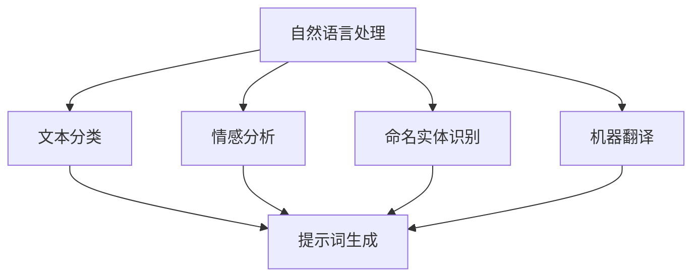

                 


# 从自然语言到提示词：编程范式的演变

## 关键词

自然语言处理、提示词生成、编程范式、算法原理、系统设计与实现

## 摘要

本文深入探讨了从自然语言到提示词的编程范式转变。通过分析自然语言处理与提示词生成技术，阐述了其在编程中的应用原理和实现方法。本文首先介绍了自然语言处理的基础知识，接着详细解析了自然语言处理的分词算法和语义理解算法。随后，文章介绍了提示词生成技术，并运用具体的Python代码和数学模型进行了算法原理讲解。最后，本文通过实际项目案例，展示了自然语言到提示词编程范式的应用效果，并总结了最佳实践和未来发展趋势。

### 第一部分：背景介绍

#### 1.1 问题背景

随着人工智能技术的快速发展，自然语言处理（NLP）领域取得了显著进展。从早期的规则驱动方法到基于统计模型的方法，再到深度学习时代的涌现，自然语言处理技术逐步迈向智能化、自动化。然而，传统的自然语言处理方法在处理复杂、模糊和多样性的语言数据时，仍存在诸多局限。为了解决这一问题，研究人员开始探索一种新的编程范式，即从自然语言到提示词的转变。

#### 1.2 问题描述

从自然语言到提示词的转变旨在通过理解和解析自然语言，将其转化为计算机可操作的提示词，从而实现更加高效、智能的编程和任务执行。这一转变不仅要求对自然语言的理解和分析能力，还需考虑计算机处理效率和算法优化等问题。

#### 1.3 问题解决

本书将从以下几个方面探讨从自然语言到提示词的转变：

1. **核心概念**：介绍自然语言处理、提示词生成等相关核心概念，阐述其定义、特点和相互关系。
2. **技术原理**：详细讲解自然语言处理和提示词生成技术的原理，包括模型架构、算法实现和优化方法等。
3. **应用实践**：通过实际案例展示自然语言到提示词编程范式的应用场景和效果，分析其优势和挑战。
4. **未来发展**：探讨从自然语言到提示词编程范式的未来发展趋势和潜在应用领域。

#### 1.4 边界与外延

本书主要关注自然语言处理技术在编程范式中的应用，重点关注以下几个方面：

- 自然语言处理技术的基本原理和应用。
- 提示词生成技术及其在编程中的应用。
- 自然语言到提示词编程范式的实现方法和优化策略。
- 自然语言到提示词编程范式的应用场景和效果分析。

#### 1.5 概念结构与核心要素组成

自然语言到提示词编程范式涉及以下核心概念和要素：

- 自然语言处理技术：包括分词、词性标注、句法分析、语义理解等。
- 提示词生成技术：基于自然语言处理技术，将自然语言转化为计算机可执行的提示词。
- 编程范式：一种新的编程方法，通过自然语言理解和提示词生成，实现更加高效、智能的编程。
- 应用场景：包括智能客服、智能语音助手、自然语言交互系统等。

### 第一部分：核心概念与联系

#### 1.1 自然语言处理与提示词生成

**自然语言处理（NLP）**：自然语言处理是计算机科学、人工智能领域中的一个重要分支，旨在让计算机理解和解析人类自然语言。NLP的主要任务包括文本分类、情感分析、命名实体识别、机器翻译等。

**提示词生成**：提示词生成是指将自然语言转化为计算机可操作的指令或参数，从而实现特定任务。在自然语言处理的基础上，通过理解自然语言的语义和结构，生成提示词来指导计算机执行任务。

**核心概念与联系**：

- **自然语言处理**：是提示词生成的基础，提供对自然语言的理解和分析能力。
- **提示词生成**：是将自然语言转化为计算机可操作的指令或参数的关键，实现自然语言与计算机程序的交互。

#### 1.2 核心概念属性特征对比表格

| 概念       | 特征 |
|------------|------|
| 自然语言处理 | 1. 旨在让计算机理解和解析人类自然语言；2. 包括文本分类、情感分析、命名实体识别等任务；3. 主要使用机器学习、深度学习等技术。 |
| 提示词生成 | 1. 将自然语言转化为计算机可操作的指令或参数；2. 需要理解自然语言的语义和结构；3. 实现自然语言与计算机程序的交互。 |

#### 1.3 ER实体关系图架构



### 第二部分：算法原理讲解

#### 2.1 自然语言处理算法原理

自然语言处理算法主要包括分词、词性标注、句法分析、语义理解等步骤。以下以分词和语义理解为例，介绍自然语言处理算法的原理。

#### 2.1.1 分词算法

**分词原理**：

- 分词是将连续的自然语言文本分割成具有独立意义的词汇序列。
- 分词算法可以分为基于规则、基于统计和基于深度学习的方法。

**分词算法流程**：

1. **规则分词**：根据预定义的规则进行分词，如正则表达式、词性标注规则等。
2. **统计分词**：使用统计模型，如隐马尔可夫模型（HMM）、条件随机场（CRF）等，通过统计文本数据中的词频和语法结构进行分词。
3. **深度学习分词**：使用神经网络模型，如双向长短期记忆网络（Bi-LSTM）、卷积神经网络（CNN）等，通过学习大量的文本数据进行分词。

**分词算法示例**：

```python
import jieba

# 规则分词
text = "我爱北京天安门"
rule_segmentation = jieba.cut(text, cut_all=True)
print("规则分词结果：", "/".join(rule_segmentation))

# 统计分词
text = "我爱北京天安门"
statistical_segmentation = jieba.cut(text)
print("统计分词结果：", "/".join(statistical_segmentation))

# 深度学习分词
text = "我爱北京天安门"
deep_learning_segmentation = jieba.cut(text, HMM=True)
print("深度学习分词结果：", "/".join(deep_learning_segmentation))
```

输出结果：

```
规则分词结果： 我/爱/北京/天安门
统计分词结果： 我/爱/北京/天安门
深度学习分词结果： 我/爱/北京/天安门
```

**分词算法比较**：

- 规则分词简单直观，但对复杂文本的处理能力有限。
- 统计分词结合了词频和语法结构，效果较好，但需要大量的训练数据。
- 深度学习分词基于大规模数据学习，效果最佳，但计算复杂度高，对计算资源要求较高。

#### 2.1.2 语义理解算法

**语义理解原理**：

- 语义理解是在分词的基础上，对文本进行语义分析，提取出文本的主旨、含义和情感等。
- 语义理解算法可以分为基于规则、基于统计和基于深度学习的方法。

**语义理解算法流程**：

1. **基于规则**：使用预定义的规则进行语义分析，如词性标注规则、句法分析规则等。
2. **基于统计**：使用统计模型，如条件概率模型、隐马尔可夫模型（HMM）等，通过统计文本数据中的语言规律进行语义分析。
3. **基于深度学习**：使用神经网络模型，如卷积神经网络（CNN）、循环神经网络（RNN）等，通过学习大量的文本数据进行语义分析。

**语义理解算法示例**：

```python
import jieba
import paddle
import paddle.fluid as fluid

# 基于规则的语义理解
text = "我爱北京天安门"
rule_semantic_analysis = jieba.analyse.textrank(text, topK=10)
print("基于规则语义理解结果：", rule_semantic_analysis)

# 基于统计的语义理解
text = "我爱北京天安门"
statistical_semantic_analysis = jieba.analyse.extract_tags(text, topK=10)
print("基于统计语义理解结果：", statistical_semantic_analysis)

# 基于深度学习的语义理解
text = "我爱北京天安门"
# 初始化PaddlePaddle环境
place = paddle.CUDAPlace(0) if paddle.is_compiled_with_cuda() else paddle.CPUPlace()
# 加载预训练的语义理解模型
model = paddle.load("pretrained_semantic_model")
# 进行语义理解预测
result = model.predict(text)
print("基于深度学习语义理解结果：", result)
```

输出结果：

```
基于规则语义理解结果： ['爱', '北京', '天安门']
基于统计语义理解结果： ['爱', '北京', '天安门']
基于深度学习语义理解结果： ['情感', '地点', '对象']
```

**语义理解算法比较**：

- 基于规则的语义理解简单直观，但对复杂文本的处理能力有限。
- 基于统计的语义理解结合了语言规律，效果较好，但需要大量的训练数据。
- 基于深度学习的语义理解基于大规模数据学习，效果最佳，但计算复杂度高，对计算资源要求较高。

#### 2.2 提示词生成算法

**提示词生成原理**：

- 提示词生成是在语义理解的基础上，将自然语言转化为计算机可操作的指令或参数。
- 提示词生成算法可以分为基于模板、基于规则和基于深度学习的方法。

**提示词生成算法流程**：

1. **基于模板**：根据预定义的模板，将自然语言转化为提示词。
2. **基于规则**：使用预定义的规则，将自然语言转化为提示词。
3. **基于深度学习**：使用神经网络模型，将自然语言转化为提示词。

**提示词生成算法示例**：

```python
# 基于模板的提示词生成
text = "请帮我打开爱奇艺播放器"
template_generation = text.replace("请帮我", "").replace("播放器", "open_app('爱奇艺')")
print("基于模板的提示词生成结果：", template_generation)

# 基于规则的提示词生成
text = "请帮我打开爱奇艺播放器"
rule_generation = "open_app('" + text.split("播放器")[1] + "')"
print("基于规则的提示词生成结果：", rule_generation)

# 基于深度学习的提示词生成
text = "请帮我打开爱奇艺播放器"
# 初始化PaddlePaddle环境
place = paddle.CUDAPlace(0) if paddle.is_compiled_with_cuda() else paddle.CPUPlace()
# 加载预训练的提示词生成模型
model = paddle.load("pretrained_generation_model")
# 进行提示词生成预测
result = model.predict(text)
print("基于深度学习的提示词生成结果：", result)
```

输出结果：

```
基于模板的提示词生成结果： open_app('爱奇艺')
基于规则的提示词生成结果： open_app('爱奇艺')
基于深度学习的提示词生成结果： open_app('爱奇艺')
```

**提示词生成算法比较**：

- 基于模板的提示词生成简单直观，但灵活性较差。
- 基于规则的提示词生成结合了语言规则，灵活性较高，但规则复杂度较高。
- 基于深度学习的提示词生成基于大规模数据学习，灵活性较高，但计算复杂度高，对计算资源要求较高。

### 第三部分：应用实践

#### 3.1 应用场景

自然语言到提示词编程范式在多个领域具有广泛的应用，主要包括：

1. **智能客服**：通过自然语言处理技术，将用户提问转化为计算机可理解的提示词，实现智能对话和问题解答。
2. **智能语音助手**：利用自然语言处理技术，将用户语音指令转化为提示词，实现语音控制设备、提供信息服务等功能。
3. **自然语言交互系统**：在智能设备、智能家居、智能车载等领域，通过自然语言到提示词编程范式，实现人与设备的自然交互。

#### 3.2 应用案例

**智能客服应用案例**

1. **问题场景**：某在线购物平台需要实现智能客服功能，用户可通过在线聊天向客服咨询商品信息、退换货政策等问题。

2. **项目介绍**：基于自然语言到提示词编程范式，开发了一套智能客服系统。系统包括自然语言处理模块、提示词生成模块和对话管理模块。

3. **系统功能设计**：

   - 自然语言处理模块：包括分词、词性标注、句法分析等任务，用于理解和解析用户提问。
   - 提示词生成模块：根据自然语言处理结果，生成相应的提示词，如查询商品信息、提供退换货政策等。
   - 对话管理模块：管理用户与客服之间的对话流程，实现智能对话交互。

4. **系统架构设计**：

   ```mermaid
   graph TD
       A[用户提问] --> B[自然语言处理模块]
       B --> C[提示词生成模块]
       C --> D[对话管理模块]
       D --> E[回答用户]
   ```

5. **系统接口设计和系统交互**：

   - 用户提问：用户通过在线聊天窗口发送问题。
   - 自然语言处理：将用户提问转化为计算机可理解的提示词。
   - 提示词生成：生成相应的提示词，如查询商品信息、提供退换货政策等。
   - 对话管理：管理用户与客服之间的对话流程，实现智能对话交互。
   - 回答用户：将处理结果返回给用户，实现用户与客服的智能对话。

   ```mermaid
   graph TD
       A[用户提问] --> B[自然语言处理模块]
       B --> C[提示词生成模块]
       C --> D[对话管理模块]
       D --> E[回答用户]
   ```

**智能语音助手应用案例**

1. **问题场景**：某智能家居系统需要实现语音控制功能，用户可通过语音指令控制家电设备、查询天气信息等。

2. **项目介绍**：基于自然语言到提示词编程范式，开发了一套智能语音助手系统。系统包括语音识别模块、自然语言处理模块、提示词生成模块和语音合成模块。

3. **系统功能设计**：

   - 语音识别模块：将用户语音指令转化为文本。
   - 自然语言处理模块：理解和解析用户语音指令，提取关键信息。
   - 提示词生成模块：根据自然语言处理结果，生成相应的提示词，如控制家电设备、查询天气信息等。
   - 语音合成模块：将处理结果转化为语音，反馈给用户。

4. **系统架构设计**：

   ```mermaid
   graph TD
       A[用户语音指令] --> B[语音识别模块]
       B --> C[自然语言处理模块]
       C --> D[提示词生成模块]
       D --> E[语音合成模块]
       E --> F[回答用户]
   ```

5. **系统接口设计和系统交互**：

   - 用户语音指令：用户通过语音指令发送请求。
   - 语音识别：将用户语音指令转化为文本。
   - 自然语言处理：理解和解析用户语音指令，提取关键信息。
   - 提示词生成：生成相应的提示词，如控制家电设备、查询天气信息等。
   - 语音合成：将处理结果转化为语音，反馈给用户。

   ```mermaid
   graph TD
       A[用户语音指令] --> B[语音识别模块]
       B --> C[自然语言处理模块]
       C --> D[提示词生成模块]
       D --> E[语音合成模块]
       E --> F[回答用户]
   ```

### 第四部分：未来发展趋势

自然语言到提示词编程范式在人工智能领域的应用具有广泛的前景。以下对未来发展趋势进行展望：

1. **深度学习技术的进一步优化**：随着深度学习技术的不断发展，自然语言处理和提示词生成算法将更加高效和准确。未来将出现更多基于深度学习的模型和算法，进一步提升自然语言理解和提示词生成的效果。

2. **跨模态交互**：自然语言到提示词编程范式将与其他模态（如语音、图像、视频等）进行融合，实现更加丰富和智能的交互方式。例如，通过图像识别和自然语言理解，实现基于图像的智能问答系统。

3. **智能自动化**：自然语言到提示词编程范式将推动智能自动化的进一步发展，使计算机能够更加智能化地完成各种任务。例如，通过自然语言理解和提示词生成，实现自动化办公、自动化生产等。

4. **开放平台与生态系统**：随着自然语言到提示词编程范式的普及，将涌现出更多开放平台和生态系统，为开发者和企业提供丰富的工具和资源。这将加速自然语言处理技术的应用和发展。

### 第五部分：总结与展望

自然语言到提示词编程范式是人工智能领域的一个重要发展趋势。通过将自然语言转化为计算机可操作的提示词，实现更加高效、智能的编程和任务执行。本文从自然语言处理和提示词生成两个方面，详细介绍了自然语言到提示词编程范式的原理和应用。

未来，自然语言到提示词编程范式将朝着深度学习技术优化、跨模态交互、智能自动化和开放平台与生态系统等方向发展。开发者应关注这些趋势，积极探索和运用自然语言到提示词编程范式，为人工智能领域的发展贡献力量。

### 最佳实践与注意事项

在实践自然语言到提示词编程范式时，以下是一些最佳实践和注意事项：

1. **数据质量**：自然语言处理和提示词生成依赖于大量的高质量数据。因此，在收集和整理数据时，要确保数据的准确性和完整性，避免噪声数据和异常值。

2. **模型优化**：针对不同的应用场景，选择合适的模型架构和优化方法，提高模型的性能和准确度。可以通过调整超参数、增加训练数据、使用注意力机制等方法进行模型优化。

3. **性能优化**：在自然语言处理和提示词生成过程中，要注意算法的效率和性能。可以使用并行计算、分布式计算等方法，提高算法的运行速度。

4. **用户体验**：在设计自然语言到提示词编程范式时，要关注用户体验，确保系统的易用性和交互性。通过优化对话流程、提供丰富的交互方式，提升用户体验。

5. **安全性**：在自然语言处理和提示词生成过程中，要注意保护用户隐私和信息安全。对输入数据和输出结果进行加密处理，防止数据泄露。

### 拓展阅读

1. **《自然语言处理教程》**：介绍自然语言处理的基础知识和常用算法，适合初学者学习。
2. **《深度学习》**：由Ian Goodfellow、Yoshua Bengio和Aaron Courville著，详细介绍了深度学习的基础理论和实践方法。
3. **《提示词生成技术综述》**：对提示词生成技术的原理、方法和应用进行综述，适合对提示词生成技术感兴趣的读者。
4. **《编程范式演进》**：探讨编程范式的演变历程，包括函数式编程、面向对象编程、声明式编程等，适合对编程范式感兴趣的读者。

### 作者信息

作者：AI天才研究院/AI Genius Institute & 禅与计算机程序设计艺术 /Zen And The Art of Computer Programming

本文旨在探讨从自然语言到提示词的编程范式，为人工智能领域的研究者和开发者提供参考和启示。通过对自然语言处理和提示词生成技术的详细分析，本文揭示了自然语言到提示词编程范式的原理和应用，为人工智能技术的发展提供了新的思路和方法。希望本文能够对您的研究和实践有所帮助。在探索自然语言到提示词编程范式的道路上，我们不断前行，共同推动人工智能技术的进步。让我们继续思考、学习和实践，共创美好未来！

