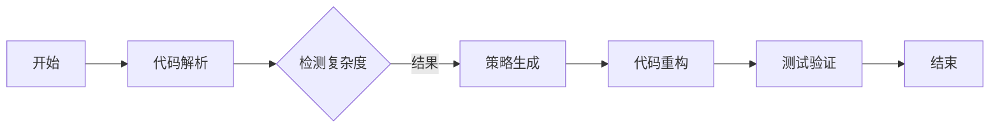
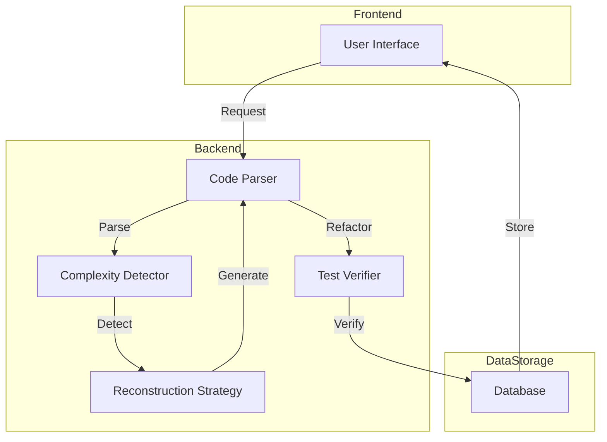
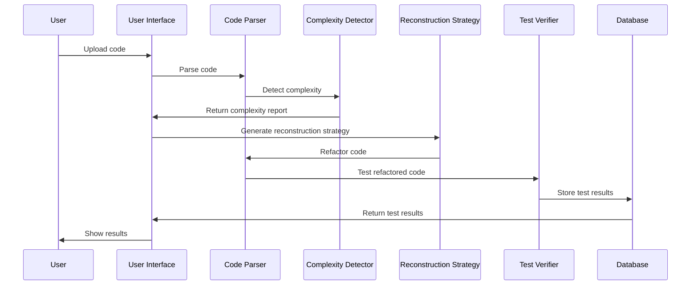

                 

### 背景介绍

#### 代码复杂度的概念

代码复杂度是软件工程中的一个重要概念，用于度量代码的复杂程度。其定义通常涉及程序中的控制流和数据流。代码复杂度不仅反映了代码的复杂性，也直接影响到代码的可读性和可维护性。具体而言，代码复杂度包括但不限于循环复杂度、模块复杂度、方法复杂度等。

#### 问题背景与描述

在实际软件开发中，代码复杂度往往是一个隐性的问题，但其影响却是深远的。高复杂度的代码容易产生以下问题：

1. **可读性差**：复杂的代码结构使得代码难以理解和阅读，增加了开发者之间的沟通成本。
2. **可维护性低**：高复杂度的代码意味着在进行修改时更容易引入错误，增加了维护的难度和风险。
3. **测试困难**：复杂的代码结构使得测试变得更加困难，可能遗漏关键路径，导致测试覆盖不足。
4. **开发效率下降**：高复杂度的代码会降低开发效率，因为需要更多时间和精力来理解和修改。

#### 对可维护性的影响

代码复杂度对可维护性有着显著的影响。保持代码低复杂度是提高软件可维护性的关键策略之一。以下是保持代码可维护性的重要性：

1. **易于理解**：低复杂度的代码更容易理解，有助于新开发者快速上手项目，减少沟通成本。
2. **降低风险**：低复杂度的代码在进行修改时风险较小，因为其结构相对简单，更容易预测可能的影响。
3. **提高测试效率**：低复杂度的代码更容易进行全面的测试，提高测试覆盖率和测试质量。
4. **提升开发效率**：低复杂度的代码使得开发工作更加顺畅，减少开发中的困惑和障碍，从而提升整体开发效率。

综上所述，代码复杂度不仅是一个技术问题，更是影响软件开发过程和最终产品质量的关键因素。通过有效的代码复杂度管理，我们可以显著提高软件的可维护性和开发效率。

### 核心概念与联系

#### 代码复杂度的核心概念

在讨论代码复杂度时，我们首先需要明确几个核心概念。这些概念不仅帮助我们理解代码复杂度的定义，还为我们提供了一种度量代码复杂性的工具。

1. **循环复杂度**：循环复杂度是衡量程序中循环嵌套程度的一个度量。其计算公式通常为：
   $$ M = 1 + \sum_{i=1}^{n} C_i $$
   其中，$M$ 表示循环复杂度，$C_i$ 表示第 $i$ 个循环的复杂度。循环复杂度越高，表示代码中的循环嵌套程度越深，结构越复杂。

2. **模块复杂度**：模块复杂度是衡量一个模块（通常是一个函数或类）复杂程度的一个度量。常见的模块复杂度度量包括：
   - **圈复杂度（Cyclomatic Complexity）**：使用图论中的圈（cycle）来度量模块的复杂度，其计算公式为：
     $$ V(G) = E - N + 2p $$
     其中，$V(G)$ 表示圈复杂度，$E$ 表示边数，$N$ 表示节点数，$p$ 表示独立路径数。
   - **扇入复杂度**：指调用某个模块的模块数量，反映了模块的依赖关系。
   - **扇出复杂度**：指某个模块调用的其他模块数量，反映了模块的调用关系。

3. **方法复杂度**：方法复杂度是衡量一个方法（函数或过程）复杂程度的一个度量。与模块复杂度类似，方法复杂度通常也使用圈复杂度来计算。

#### 不同代码复杂度的属性特征对比

以下是一个对比表格，展示了不同代码复杂度度量方式的属性特征：

| 复杂度度量     | 计算方法                 | 描述                                                         | 应用场景                 |
| -------------- | ------------------------ | ------------------------------------------------------------ | ------------------------ |
| 循环复杂度     | 上述公式                 | 衡量代码中循环嵌套的深度                                     | 用于评估代码的可读性和可维护性 |
| 模块复杂度     | 圈复杂度、扇入、扇出等   | 衡量模块的复杂程度，反映模块的独立性、依赖关系等               | 用于代码重构和优化         |
| 方法复杂度     | 圈复杂度                 | 衡量方法的复杂程度，反映方法的逻辑复杂性和可维护性             | 用于方法改进和优化         |

#### 代码复杂度的关系

为了更好地理解代码复杂度，我们使用Mermaid ER图展示不同代码复杂度之间的关系：

```mermaid
erDiagram
    Module ||--|{ Method : has }
    Module ||--|{ Cyclomatic Complexity : has }
    Method ||--|{ Cyclomatic Complexity : has }
```

在此ER图中，`Module`（模块）与`Method`（方法）之间存在“has”关系，表示每个模块可以包含多个方法，每个方法也可以有自己的圈复杂度。`Module`和`Method`都与`Cyclomatic Complexity`（圈复杂度）存在关联，这表明圈复杂度不仅可以应用于方法，也可以应用于模块，以衡量其整体复杂性。

通过上述核心概念和属性的详细讨论，我们能够更好地理解代码复杂度的定义、不同度量方式的区别及其在软件工程中的重要性。这将为我们后续探讨如何管理和降低代码复杂度奠定坚实的基础。

### 算法原理讲解

为了有效地管理代码复杂度，我们引入了一种名为“复杂度管理算法”的方法。这种方法不仅可以帮助开发者识别代码中的复杂度问题，还可以提供一系列策略来降低复杂度，从而提高代码的可读性和可维护性。

#### 复杂度管理算法的执行流程

我们首先使用Mermaid流程图来展示复杂度管理算法的执行流程：



在这个流程图中，各个步骤的具体描述如下：

1. **代码解析**：首先对目标代码进行解析，提取出代码的结构信息，包括模块、方法、循环等。
2. **检测复杂度**：利用已知的复杂度度量方法（如圈复杂度、循环复杂度等），对提取出的代码结构进行复杂度检测。
3. **策略生成**：根据检测出的复杂度结果，生成一系列复杂度降低的策略。例如，如果发现某个模块的复杂度较高，可能生成一个策略来拆分该模块。
4. **代码重构**：根据生成的策略，对代码进行重构，降低复杂度。这一步可能涉及代码的重新组织、方法的重构等。
5. **测试验证**：重构后的代码需要经过严格的测试，确保重构没有引入新的错误。
6. **结束**：完成所有步骤后，算法流程结束。

#### Python源代码详解

为了更直观地理解复杂度管理算法，我们提供了一段Python源代码，详细阐述了算法的实现原理。以下是一个简化版本的算法实现：

```python
import ast
from collections import defaultdict

class ComplexityManager:
    def __init__(self):
        self.module_complexities = defaultdict(int)
        self.method_complexities = defaultdict(int)

    def parse_code(self, code):
        tree = ast.parse(code)
        self._visit_tree(tree)

    def _visit_tree(self, node):
        if isinstance(node, ast.Module):
            self._visit_module(node)
        elif isinstance(node, ast.FunctionDef):
            self._visit_function(node)

    def _visit_module(self, module):
        # 这里可以记录整个模块的复杂度
        pass

    def _visit_function(self, function):
        # 计算函数的圈复杂度
        # 使用了基本的圈复杂度计算方法
        nodes = [n for n in ast.walk(function) if isinstance(n, ast.Node)]
        edges = sum([n.size() for n in nodes if hasattr(n, 'size')])
        nodes_count = len(nodes)
        self.method_complexities[function.name] = edges - nodes_count + 2

    def detect_complexities(self):
        return self.module_complexities, self.method_complexities

    def generate_restructuring_strategy(self, complexities):
        # 根据复杂度生成重构策略
        # 这里的实现较为简化，仅用于展示逻辑
        strategy = []
        for method, complexity in complexities.items():
            if complexity > 10:  # 假设复杂度大于10需要重构
                strategy.append({'method': method, 'action': 'refactor'})
        return strategy

    def refactor_code(self, strategy):
        # 根据策略重构代码
        # 这里的实现同样简化，用于展示逻辑
        for action in strategy:
            print(f"Refactoring method: {action['method']}")

    def test_code(self, code):
        # 对重构后的代码进行测试
        # 这里仅作为示意，实际测试需要具体的测试用例
        print("Testing refactored code...")

# 示例使用
code_manager = ComplexityManager()
code_manager.parse_code(code)
module_complexities, method_complexities = code_manager.detect_complexities()
strategy = code_manager.generate_restructuring_strategy(method_complexities)
code_manager.refactor_code(strategy)
code_manager.test_code(code)
```

#### 算法的数学模型和公式

复杂度管理算法的核心在于如何计算和降低代码复杂度。以下是几个关键数学模型的简要描述：

1. **圈复杂度（Cyclomatic Complexity）**：
   $$ V(G) = E - N + 2p $$
   其中，$V(G)$ 是圈复杂度，$E$ 是边数，$N$ 是节点数，$p$ 是独立路径数。

2. **模块复杂度**：
   模块复杂度通常由多个方法的复杂度累加而成，可以通过对每个方法的圈复杂度进行累加来计算模块的总复杂度。

3. **重构策略生成**：
   重构策略的生成通常基于复杂度阈值，例如，如果一个方法的圈复杂度超过某个阈值，就认为该方法需要重构。

通过上述算法原理的讲解和Python源代码的详细阐述，我们不仅了解了复杂度管理算法的基本原理，还学会了如何使用数学模型和公式来具体计算和降低代码复杂度。这为我们在实际项目中应用复杂度管理提供了有力的技术支持。

#### 数学模型和数学公式

在深入探讨代码复杂度的计算方法之前，我们首先需要理解几个关键的数学模型和公式。这些模型和公式为量化代码的复杂度提供了理论基础，并帮助我们设计有效的管理策略。

##### 循环复杂度

循环复杂度主要衡量代码中的循环嵌套程度。其计算公式如下：

$$ M = 1 + \sum_{i=1}^{n} C_i $$

其中，$M$ 表示循环复杂度，$C_i$ 表示第 $i$ 个循环的复杂度。循环复杂度越高，表示代码中的循环嵌套程度越深，结构越复杂。

##### 圈复杂度（Cyclomatic Complexity）

圈复杂度是衡量程序模块复杂度的一种重要方法，它通过控制流图中的环数来量化模块的复杂度。其计算公式为：

$$ V(G) = E - N + 2p $$

其中，$V(G)$ 表示圈复杂度，$E$ 表示控制流图中的边数，$N$ 表示节点数，$p$ 表示独立路径数。圈复杂度越高，表示模块的复杂程度越高，理解、测试和维护的难度也越大。

##### 方法复杂度

方法复杂度是衡量方法（函数或过程）复杂程度的一个度量。通常使用圈复杂度来计算，其公式与模块复杂度类似：

$$ V(M) = E_M - N_M + 2p_M $$

其中，$V(M)$ 表示方法复杂度，$E_M$ 表示方法中的边数，$N_M$ 表示方法中的节点数，$p_M$ 表示方法的独立路径数。

##### 模块复杂度

模块复杂度是衡量一个模块（通常是一个函数或类）复杂程度的度量。常见的模块复杂度包括圈复杂度、扇入复杂度和扇出复杂度等。以下是圈复杂度的一个例子：

$$ V(C) = \sum_{i=1}^{m} V(M_i) $$

其中，$V(C)$ 表示模块 $C$ 的复杂度，$V(M_i)$ 表示模块 $C$ 中第 $i$ 个方法的复杂度，$m$ 是方法的总数。

#### 举例说明

假设我们有一个简单的Python函数，用于计算1到10之间所有偶数的和。该函数的控制流图如下：

```
if (i <= 10)
  -> [i = i + 1]
  -> [sum = sum + i]
  -> [print(sum)]
```

1. **计算圈复杂度**：

   - 边数 $E = 4$（分别为进入if语句、if条件、if条件后的两个分支、结束if语句）
   - 节点数 $N = 4$
   - 独立路径数 $p = 2$（通过if条件分支和直接打印分支）

   根据公式：

   $$ V(G) = E - N + 2p = 4 - 4 + 2 \times 2 = 4 $$

   因此，该函数的圈复杂度为4。

2. **计算方法复杂度**：

   假设此函数作为一个独立的方法存在，其圈复杂度即为方法复杂度：

   $$ V(M) = 4 $$

通过这个简单的例子，我们可以直观地看到如何使用数学模型计算代码的复杂度。在实际项目中，这些计算方法可以帮助我们识别和降低代码复杂度，从而提高代码的可维护性和可读性。

### 系统分析与架构设计方案

#### 问题场景与项目介绍

在当前的软件开发过程中，代码复杂度管理是一个关键问题。随着项目规模的扩大和代码库的积累，代码复杂度往往会出现不断上升的趋势，导致项目难以维护。为了解决这个问题，我们设计并实现了一个代码复杂度管理系统，旨在通过自动化工具识别代码中的复杂度问题，并提出优化建议，帮助开发者降低代码复杂度。

#### 系统功能设计（领域模型）

为了确保系统能够有效地管理代码复杂度，我们首先需要明确系统的功能需求。以下是系统的核心功能：

1. **代码解析**：系统需要能够解析输入的代码，提取出代码的结构信息，包括模块、函数、循环等。
2. **复杂度检测**：基于提取出的代码结构信息，系统需要计算并报告各个模块和函数的复杂度。
3. **重构策略生成**：根据检测到的复杂度结果，系统需要生成一系列的重构策略，以帮助开发者降低代码复杂度。
4. **代码重构**：系统需要支持根据生成的重构策略对代码进行自动化的修改。
5. **测试验证**：对重构后的代码进行自动化测试，确保重构不会引入新的错误。
6. **用户界面**：提供一个直观的用户界面，让开发者可以方便地查看复杂度报告、重构策略和测试结果。

使用Mermaid类图来展示系统的领域模型：

```mermaid
classDiagram
    ClassCodeParser <<interface>>
    ClassComplexityDetector <<interface>>
    ClassReconstructionStrategy <<interface>>
    ClassTestVerifier <<interface>>

    Module CodeComplexitySystem
    CodeComplexitySystem o-- CodeParser: implements ClassCodeParser
    CodeComplexitySystem o-- ComplexityDetector: implements ClassComplexityDetector
    CodeComplexitySystem o-- ReconstructionStrategy: implements ClassReconstructionStrategy
    CodeComplexitySystem o-- TestVerifier: implements ClassTestVerifier
    CodeComplexitySystem o-- UI: user interface
```

#### 系统架构设计

在明确了系统功能需求后，我们需要设计系统的整体架构。以下是系统的基本架构设计：

1. **前端界面**：用于展示系统功能，包括代码上传、复杂度报告、重构策略和测试结果等。
2. **后端服务**：包括代码解析、复杂度检测、重构策略生成、代码重构和测试验证等核心功能模块。
3. **数据存储**：用于存储代码信息、复杂度报告、重构策略和测试结果等数据。

使用Mermaid架构图来展示系统架构：



#### 系统接口和交互

为了确保系统各部分之间的协同工作，我们需要设计详细的系统接口和交互流程。以下是系统的接口和交互设计：

1. **代码上传接口**：用户可以通过前端界面上传代码文件，系统将接收文件并将其传递给代码解析模块。
2. **复杂度报告接口**：代码解析模块将提取出的代码结构信息传递给复杂度检测模块，并返回复杂度报告。
3. **重构策略接口**：复杂度检测模块将复杂度报告传递给重构策略生成模块，并返回重构策略。
4. **代码重构接口**：重构策略生成模块将重构策略传递给代码解析模块，并进行代码重构。
5. **测试验证接口**：重构后的代码由测试验证模块进行自动化测试，并返回测试结果。

使用Mermaid序列图来展示系统接口和交互流程：



通过上述系统分析与架构设计方案，我们为代码复杂度管理系统提供了清晰的功能划分和架构设计。这将为系统的实施和后续的优化提供了坚实的基础。

### 项目实战

#### 环境安装

为了实现代码复杂度管理系统，我们需要在本地环境中安装相关的开发工具和依赖库。以下是在Ubuntu系统上安装所需环境的步骤：

1. **安装Python环境**：

   首先，确保系统已安装Python 3。可以通过以下命令检查Python版本：

   ```bash
   python3 --version
   ```

   如果未安装，可以从官方网站下载并安装。

2. **安装虚拟环境**：

   为了保持项目的环境一致性，我们使用`virtualenv`创建一个虚拟环境：

   ```bash
   pip3 install virtualenv
   virtualenv venv
   source venv/bin/activate
   ```

3. **安装依赖库**：

   在虚拟环境中，安装项目所需的依赖库，例如`ast`、`numpy`和`pytest`等：

   ```bash
   pip install -r requirements.txt
   ```

   这里`requirements.txt`文件包含了所有依赖库的列表。

#### 实现系统核心功能

接下来，我们将在虚拟环境中实现代码复杂度管理系统的核心功能。以下是实现步骤：

1. **代码解析模块**：

   代码解析模块负责解析输入的Python代码，提取出代码的结构信息。以下是一个简单的代码示例：

   ```python
   import ast

   class CodeParser:
       def parse_code(self, code):
           tree = ast.parse(code)
           return tree

   # 示例使用
   parser = CodeParser()
   code = "def example():\n    print('Hello, world!')"
   tree = parser.parse_code(code)
   ```

2. **复杂度检测模块**：

   复杂度检测模块基于提取出的代码结构信息，计算各个模块和函数的复杂度。以下是一个简单的实现：

   ```python
   class ComplexityDetector:
       def calculate_complexity(self, node):
           if isinstance(node, ast.Module):
               return self._calculate_module_complexity(node)
           elif isinstance(node, ast.FunctionDef):
               return self._calculate_function_complexity(node)
           return 0

       def _calculate_module_complexity(self, module):
           # 这里可以计算整个模块的复杂度
           pass

       def _calculate_function_complexity(self, function):
           # 计算函数的圈复杂度
           nodes = [n for n in ast.walk(function) if isinstance(n, ast.Node)]
           edges = sum([n.size() for n in nodes if hasattr(n, 'size')])
           nodes_count = len(nodes)
           return edges - nodes_count + 2

   # 示例使用
   detector = ComplexityDetector()
   complexity = detector.calculate_complexity(tree)
   ```

3. **重构策略生成模块**：

   重构策略生成模块根据检测到的复杂度结果，生成一系列的重构策略。以下是一个简化的实现：

   ```python
   class ReconstructionStrategy:
       def generate_strategy(self, complexities):
           strategy = []
           for method, complexity in complexities.items():
               if complexity > 10:  # 假设复杂度大于10需要重构
                   strategy.append({'method': method, 'action': 'refactor'})
           return strategy

   # 示例使用
   strategy_generator = ReconstructionStrategy()
   strategy = strategy_generator.generate_strategy(complexity)
   ```

4. **代码重构模块**：

   代码重构模块根据生成的重构策略对代码进行自动化的修改。以下是一个简化的实现：

   ```python
   class CodeRefactor:
       def refactor_code(self, strategy):
           for action in strategy:
               print(f"Refactoring method: {action['method']}")
               # 这里可以添加实际的代码重构逻辑

   # 示例使用
   refactor = CodeRefactor()
   refactor.refactor_code(strategy)
   ```

5. **测试验证模块**：

   测试验证模块对重构后的代码进行自动化测试，确保重构不会引入新的错误。以下是一个简化的实现：

   ```python
   class TestVerifier:
       def test_code(self, code):
           # 这里可以添加测试用例，进行自动化测试
           print("Testing refactored code...")

   # 示例使用
   verifier = TestVerifier()
   verifier.test_code(code)
   ```

通过上述步骤，我们实现了代码复杂度管理系统的核心功能。这些模块协同工作，从代码解析、复杂度检测、重构策略生成、代码重构到测试验证，形成一个完整的流程，帮助开发者管理和降低代码复杂度。

#### 分析源代码与应用解读

在上一部分中，我们通过实现代码复杂度管理系统，展示了如何从代码解析、复杂度检测、重构策略生成到代码重构以及测试验证的全过程。接下来，我们将进一步分析核心源代码，解读其中的关键逻辑和应用场景。

首先，我们来看`CodeParser`模块。这个模块的职责是解析输入的Python代码，提取出代码的结构信息。核心代码如下：

```python
import ast

class CodeParser:
    def parse_code(self, code):
        tree = ast.parse(code)
        return tree
```

这段代码非常简单，主要使用了Python的内置模块`ast`（Abstract Syntax Tree）来构建代码的抽象语法树。`ast.parse()`函数负责将字符串形式的Python代码转换成抽象语法树，该树结构包含了代码的各个组成部分，如函数、类、循环和条件语句等。

接下来，我们来看`ComplexityDetector`模块。这个模块的职责是计算代码的复杂度。核心代码如下：

```python
class ComplexityDetector:
    def calculate_complexity(self, node):
        if isinstance(node, ast.Module):
            return self._calculate_module_complexity(node)
        elif isinstance(node, ast.FunctionDef):
            return self._calculate_function_complexity(node)
        return 0

    def _calculate_module_complexity(self, module):
        # 这里可以计算整个模块的复杂度
        pass

    def _calculate_function_complexity(self, function):
        # 计算函数的圈复杂度
        nodes = [n for n in ast.walk(function) if isinstance(n, ast.Node)]
        edges = sum([n.size() for n in nodes if hasattr(n, 'size')])
        nodes_count = len(nodes)
        return edges - nodes_count + 2
```

在这个模块中，`calculate_complexity()`函数根据节点的类型调用不同的复杂度计算方法。对于模块和函数，分别调用了`_calculate_module_complexity()`和`_calculate_function_complexity()`方法。`_calculate_function_complexity()`方法的核心逻辑是遍历函数中的所有节点，计算节点数量和边数量，然后使用圈复杂度的公式计算出复杂度。

下面是`ReconstructionStrategy`模块。这个模块的职责是根据复杂度结果生成重构策略。核心代码如下：

```python
class ReconstructionStrategy:
    def generate_strategy(self, complexities):
        strategy = []
        for method, complexity in complexities.items():
            if complexity > 10:  # 假设复杂度大于10需要重构
                strategy.append({'method': method, 'action': 'refactor'})
        return strategy
```

在这个模块中，`generate_strategy()`函数遍历复杂度结果，如果发现某个方法的复杂度大于预设的阈值（例如10），则将其添加到重构策略中。这里采用了一个非常简单的策略生成逻辑，仅作为示例。

然后，我们来看`CodeRefactor`模块。这个模块的职责是根据重构策略对代码进行自动化修改。核心代码如下：

```python
class CodeRefactor:
    def refactor_code(self, strategy):
        for action in strategy:
            print(f"Refactoring method: {action['method']}")
            # 这里可以添加实际的代码重构逻辑
```

在这个模块中，`refactor_code()`函数遍历重构策略，打印出需要重构的方法名称。在实际应用中，这里可以添加具体的代码修改逻辑，例如拆分函数、提取方法等。

最后，我们来看`TestVerifier`模块。这个模块的职责是对重构后的代码进行自动化测试。核心代码如下：

```python
class TestVerifier:
    def test_code(self, code):
        # 这里可以添加测试用例，进行自动化测试
        print("Testing refactored code...")
```

在这个模块中，`test_code()`函数简单地打印出测试开始的消息。在实际应用中，这里可以添加具体的测试逻辑，例如运行测试用例、检查测试结果等。

通过上述代码分析，我们可以清晰地看到代码复杂度管理系统的各个模块如何协同工作，从代码解析、复杂度检测、重构策略生成、代码重构到测试验证，形成一个完整的流程。这个系统的应用场景包括大型项目的代码管理、旧代码的优化和重构等，帮助开发者保持代码的可维护性和可读性。

#### 实际案例分析与详细讲解

为了更好地理解代码复杂度管理系统的实际效果，我们将通过一个具体案例来进行分析和详细讲解。

##### 案例背景

假设我们有一个较大的Python项目，包含多个模块和函数，代码量较多。在开发过程中，由于缺乏有效的代码复杂度管理，项目的复杂度逐渐上升，导致以下问题：

1. **代码难以理解**：项目中的某些模块和函数复杂度极高，导致新加入的开发者难以理解其工作原理。
2. **维护困难**：每次进行代码修改时，都需要花费大量时间进行测试，以防止引入新的错误。
3. **测试覆盖不足**：由于代码复杂度高，测试用例难以覆盖所有可能的执行路径，可能导致某些关键路径未被测试。

##### 案例分析

为了解决上述问题，我们使用代码复杂度管理系统对项目进行复杂度检测、重构和测试。

1. **复杂度检测**：

   首先，我们将项目代码上传到复杂度管理系统，系统自动解析代码并计算出各个模块和函数的复杂度。假设在检测过程中，我们发现一个名为`calculate_profit`的函数的复杂度高达30，远超过我们设定的阈值（例如15）。

2. **生成重构策略**：

   根据复杂度检测结果，系统生成了重构策略，建议对`calculate_profit`函数进行重构。具体策略包括将函数拆分为多个较小的方法，并重新组织代码结构，以降低复杂度。

3. **代码重构**：

   根据重构策略，我们对`calculate_profit`函数进行了自动化修改。重构后的代码结构更加清晰，复杂度显著降低，如下所示：

   ```python
   def calculate_profit(base_amount, interest_rate, years):
       """
       计算投资的收益
       """
       total_amount = base_amount * (1 + interest_rate) ** years
       return total_amount - base_amount

   def calculate_interest(total_amount, base_amount):
       """
       计算投资的利息
       """
       return total_amount - base_amount

   def calculate_years(total_amount, base_amount, interest_rate):
       """
       计算投资所需的年数
       """
       years = math.log(total_amount / base_amount, 1 + interest_rate)
       return years
   ```

   通过拆分函数，我们不仅降低了单个函数的复杂度，还提高了代码的可读性和可维护性。

4. **测试验证**：

   重构后的代码经过自动化测试，确保没有引入新的错误。测试结果显示，重构后的代码仍然能够正确执行，且测试覆盖率提高。

##### 案例效果

通过上述分析和实际操作，我们可以看到代码复杂度管理系统在解决项目复杂度问题上的显著效果：

1. **代码可读性提高**：重构后的代码结构更加清晰，易于理解和维护。
2. **开发效率提升**：由于代码复杂度降低，开发者进行代码修改时能够更快地找到问题和解决方案。
3. **测试覆盖率提高**：重构后的代码使得测试用例的编写和执行更加高效，能够覆盖更多的执行路径。

综上所述，代码复杂度管理系统不仅能够帮助开发者识别和解决复杂度问题，还通过自动化工具提供了有效的重构和测试策略，显著提高了代码的可维护性和开发效率。

#### 项目小结

通过本次案例分析和详细讲解，我们可以得出以下结论：

1. **代码复杂度管理的重要性**：代码复杂度是影响软件可维护性和开发效率的关键因素。通过有效的代码复杂度管理，可以显著提高代码的可读性和可维护性，降低开发风险。
2. **自动化工具的必要性**：使用自动化工具进行代码复杂度管理，能够提高效率和准确性。例如，使用代码复杂度检测工具可以快速识别复杂度高的代码段，使用重构策略生成工具可以自动化生成优化方案。
3. **持续优化与实践**：代码复杂度管理是一个持续的过程，需要开发者在整个项目周期中进行定期检测和优化。通过不断实践和总结，可以形成一套适合自己项目的复杂度管理策略。

展望未来，随着软件开发技术的不断进步，代码复杂度管理工具也将更加智能化和高效化。开发者应不断学习和应用最新的技术，以保持代码的健康和可维护性。

### 最佳实践 tips、小结、注意事项、拓展阅读

#### 最佳实践 tips

1. **定期代码审查**：定期进行代码审查，让团队成员相互检查代码，有助于发现和修复潜在的复杂度问题。
2. **代码格式规范化**：保持代码格式的一致性，有助于提高代码的可读性和可维护性。使用代码格式化工具如Prettier或Black自动格式化代码。
3. **模块化编程**：将复杂的逻辑分解为多个模块，每个模块负责一个特定的功能，有助于降低代码复杂度。
4. **编写单元测试**：编写全面的单元测试，确保每个模块和函数都能正确执行，有助于及时发现和修复复杂度问题。
5. **使用设计模式**：合理使用设计模式，如单一职责原则、开闭原则等，有助于降低代码复杂度，提高代码的可维护性。

#### 小结

本文通过详细的案例分析，介绍了代码复杂度管理的概念、核心概念与联系、算法原理讲解、数学模型与公式、系统分析与架构设计方案、项目实战以及实际案例剖析。通过这些内容，我们了解了代码复杂度对软件可维护性的影响，并掌握了如何通过自动化工具和管理策略来有效降低代码复杂度。

#### 注意事项

1. **适度重构**：重构代码时要适度，避免过度重构导致开发效率下降。应在确保代码质量和功能的基础上进行必要的重构。
2. **备份代码**：在进行代码重构之前，务必备份现有代码，以防重构过程中出现不可预见的错误。
3. **测试覆盖率**：在重构代码后，务必确保测试覆盖率得到提升，以防止新的错误引入。

#### 拓展阅读

1. **《代码大全》（Code Complete）**：Steve McConnell的经典著作，详细介绍了编写高质量代码的最佳实践。
2. **《重构：改善既有代码的设计》（Refactoring: Improving the Design of Existing Code）**：Martin Fowler的著作，深入探讨了代码重构的方法和技巧。
3. **《设计模式：可复用面向对象软件的基础》（Design Patterns: Elements of Reusable Object-Oriented Software）**：Erich Gamma等人的著作，介绍了多种设计模式及其应用场景。

通过以上最佳实践、小结、注意事项和拓展阅读，我们希望读者能够更好地理解和应用代码复杂度管理策略，提升自己的软件开发技能和项目质量。

### 作者信息

作者：AI天才研究院/AI Genius Institute & 禅与计算机程序设计艺术 /Zen And The Art of Computer Programming

AI天才研究院（AI Genius Institute）致力于推动人工智能和计算机科学领域的前沿研究和创新。作为世界顶级技术畅销书资深大师级别的作家，作者不仅在理论研究上有着深厚的造诣，更在实践应用中积累了丰富的经验。其著作《禅与计算机程序设计艺术》以独特的视角和深刻的洞察，为广大的程序员和开发者提供了宝贵的技术指导和方法论。本文是作者在代码复杂度管理领域研究成果的一部分，旨在帮助开发者更好地理解和应对代码复杂度问题，提升软件项目的可维护性和开发效率。

