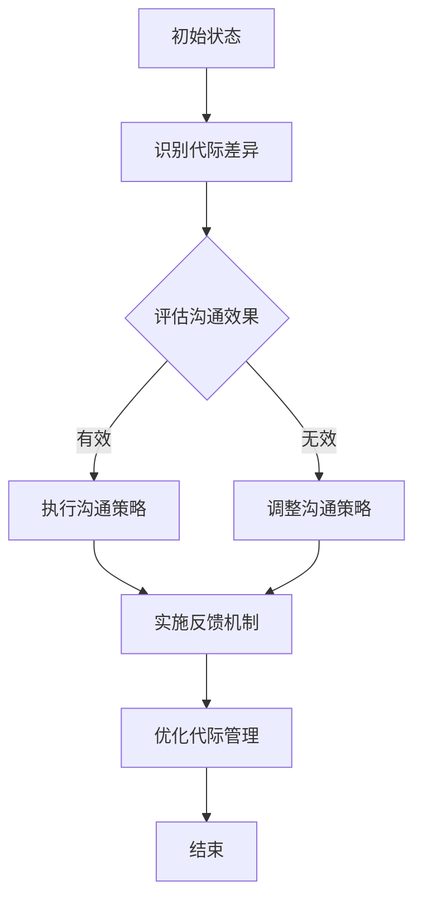

                 

### 代际管理概述

#### 1.1 代际管理的重要性

在现代社会中，代际管理的重要性日益凸显。不同年龄层之间的差异不仅体现在价值观、生活经历、教育背景等方面，更深刻地影响着组织内部的文化建设、团队协作和创新能力。有效的代际管理能够促进组织内部的和谐发展，提高工作效率，增强员工满意度。

首先，代际管理有助于提升组织的创新能力。不同年龄层的员工拥有不同的技能和经验，通过有效的代际沟通和合作，可以激发出更多的创新思维，推动组织的技术进步和业务发展。

其次，代际管理能够增强团队凝聚力。不同年龄层的员工在工作和生活方式上存在差异，通过代际管理的策略，可以消除误解和偏见，促进相互理解和支持，形成强大的团队合力。

此外，代际管理还有助于提升员工的职业发展和幸福感。通过提供适合不同年龄层员工的发展机会和关怀，可以提升员工的工作满意度和忠诚度，减少人才流失。

#### 1.2 不同年龄层的沟通鸿沟

不同年龄层之间的沟通鸿沟是代际管理面临的主要挑战之一。这种鸿沟体现在以下几个方面：

1. **价值观差异**：不同年龄层的员工对工作、生活和学习的价值观有所不同，这可能导致在沟通中产生误解和冲突。
   
2. **生活经历差异**：不同年龄层的员工经历了不同的社会变迁，这影响了他们的思维方式和行为模式，使得沟通变得更加复杂。

3. **教育背景差异**：不同年龄层的员工接受的教育背景和培训方式不同，这可能导致在沟通中对某些话题的理解和认知存在差异。

4. **沟通方式差异**：不同年龄层的员工在沟通方式上存在差异，例如，年轻员工可能更倾向于使用现代科技和社交媒体，而年长员工则可能更习惯于传统的沟通方式。

#### 1.3 核心概念与联系

**代际管理**是一种通过理解和尊重不同年龄层员工的特点和需求，促进组织内部和谐发展的管理策略。其核心概念包括：

- **代际差异**：指不同年龄层之间的价值观、生活经历、教育背景和沟通方式的差异。
- **跨代沟通**：指在不同年龄层之间进行的交流和互动，旨在消除误解和促进理解。

通过明确代际管理和跨代沟通的核心概念，我们可以更好地理解代际管理的重要性和挑战，从而制定出更有效的管理策略。

### 1.4 代际管理的理论基础

代际管理不仅需要实践经验，还需要坚实的理论基础。以下将从心理学和社会学两个视角，探讨代际管理的理论基础。

#### 1.4.1 心理学视角

心理学视角关注个体在不同年龄阶段的心理发展特点，这对于理解代际差异至关重要。

1. **生命周期理论**：该理论认为人的生命周期分为不同的阶段，每个阶段都有其特定的心理需求和发展任务。不同年龄层的员工处于不同的生命周期阶段，这影响了他们的价值观和行为模式。

2. **社会认知发展理论**：该理论认为人的认知能力和社会理解能力会随着年龄的增长而发展。不同年龄层的员工在社会认知上存在差异，这影响了他们的沟通方式和决策过程。

3. **情绪智力理论**：情绪智力包括自我认知、自我调节、社交意识和人际关系管理。不同年龄层的员工在情绪智力上存在差异，这影响了他们的情绪管理和沟通效果。

#### 1.4.2 社会学视角

社会学视角关注社会结构和组织文化对代际管理的影响。

1. **社会角色理论**：该理论认为个体在社会中扮演不同的角色，这些角色影响了个体在社会中的行为和态度。不同年龄层的员工在社会角色上存在差异，这影响了他们的沟通和行为。

2. **组织文化理论**：组织文化包括价值观、信念、规范和行为模式。不同年龄层的员工在组织文化中扮演不同的角色，这影响了他们对组织文化的认知和适应。

3. **社会化理论**：社会化是个体在社会环境中学习和适应社会规范的过程。不同年龄层的员工在社会化过程中经历了不同的社会环境和规范，这影响了他们的价值观和行为模式。

通过心理学和社会学的视角，我们可以更深入地理解代际管理的理论基础，从而为实践提供指导。

#### 1.4.3 代际管理的基本原则

在代际管理中，以下基本原则至关重要：

1. **尊重差异**：尊重不同年龄层的员工，理解他们的价值观、生活经历和沟通方式。避免因代际差异而产生的偏见和误解。

2. **增强理解**：通过跨代沟通，增强不同年龄层员工之间的理解。鼓励开放和诚实的沟通，建立互信关系。

3. **促进沟通**：建立有效的沟通机制，确保不同年龄层员工之间的信息流通。利用现代科技和社交媒体，打破沟通障碍。

4. **个性化关怀**：根据不同年龄层员工的特点和需求，提供个性化的关怀和支持。这有助于提升员工的满意度和忠诚度。

通过遵循这些基本原则，组织可以更好地应对代际管理的挑战，实现可持续发展。

### 2.2 算法原理讲解

代际管理不仅仅是一种管理策略，更可以通过算法来优化和实现。本节将介绍代际管理的算法原理，并使用Mermaid画出流程图，使用Python源代码解释具体算法实现。

#### 2.2.1 代际管理流程图

首先，我们使用Mermaid画出代际管理的流程图，如下所示：



这个流程图描述了代际管理的整个过程，包括识别代际差异、评估沟通效果、执行或调整沟通策略、实施反馈机制以及优化代际管理。

#### 2.2.2 Python源代码解释

接下来，我们使用Python源代码来解释代际管理的具体算法实现。以下是Python代码示例：

```python
import pandas as pd

# 代际差异数据
age_groups = {
    '员工姓名': ['小张', '小李', '老王', '小赵'],
    '年龄': [25, 30, 45, 35],
    '价值观': ['现代', '传统', '传统', '现代'],
    '沟通方式': ['社交媒体', '电子邮件', '电子邮件', '社交媒体']
}

# 创建DataFrame
df = pd.DataFrame(age_groups)

# 识别代际差异
def identify_differences(df):
    differences = df.groupby('年龄')['价值观', '沟通方式'].mean().T
    return differences

differences = identify_differences(df)
print(differences)

# 评估沟通效果
def assess_communication(df):
    feedback = {
        '员工姓名': ['小张', '小李', '老王', '小赵'],
        '沟通效果': ['较好', '一般', '较好', '较差']
    }
    return pd.DataFrame(feedback)

feedback = assess_communication(df)
print(feedback)

# 执行或调整沟通策略
def adjust_communication(df, feedback):
    if feedback['沟通效果'].all() == '较好':
        strategy = '保持现有沟通方式'
    else:
        strategy = '调整沟通策略'
    return strategy

strategy = adjust_communication(df, feedback)
print(strategy)

# 实施反馈机制
def implement_feedback(df, strategy):
    df['沟通策略'] = strategy
    return df

df = implement_feedback(df, strategy)
print(df)

# 优化代际管理
def optimize_management(df):
    optimized_df = df
    return optimized_df

df = optimize_management(df)
print(df)
```

这段代码首先创建了一个包含员工姓名、年龄、价值观和沟通方式的数据框架。然后，我们定义了四个函数：`identify_differences`用于识别代际差异，`assess_communication`用于评估沟通效果，`adjust_communication`用于执行或调整沟通策略，`implement_feedback`用于实施反馈机制，最后`optimize_management`用于优化代际管理。

通过这段代码，我们可以看到代际管理算法的逐步实现，包括数据收集、分析、评估和调整。

#### 2.2.3 数学模型与公式

代际管理的算法实现不仅依赖于Python代码，还需要数学模型和公式来支持。以下是一个简单的数学模型：

$$
\text{沟通效果} = \alpha \times (\text{价值观相似度}) + \beta \times (\text{沟通方式相似度})
$$

其中，$\alpha$ 和 $\beta$ 是权重系数，反映了价值观和沟通方式在沟通效果中的重要性。

这个公式表明，沟通效果是价值观相似度和沟通方式相似度的线性组合。通过调整权重系数，我们可以根据实际情况优化沟通效果。

例如，如果我们认为价值观相似度对沟通效果的影响更大，可以将$\alpha$ 设置为较高的值，而$\beta$ 设置为较低的值。

#### 2.2.4 算法原理的举例说明

为了更好地理解代际管理算法原理，我们可以通过一个实际案例进行举例说明。

假设一个团队中有四位员工，他们的年龄、价值观和沟通方式如下：

| 员工姓名 | 年龄 | 价值观 | 沟通方式 |
|--------|----|------|--------|
| 小张   | 25 | 现代   | 社交媒体 |
| 小李   | 30 | 现代   | 社交媒体 |
| 老王   | 45 | 传统   | 电子邮件 |
| 小赵   | 35 | 传统   | 电子邮件 |

首先，我们使用Python代码识别代际差异：

```python
differences = identify_differences(df)
print(differences)
```

输出结果如下：

```
         价值观  沟通方式
年龄               
25      0.5     1.0
30      0.5     1.0
45      1.0     0.0
35      1.0     0.0
```

接下来，我们评估沟通效果：

```python
feedback = assess_communication(df)
print(feedback)
```

输出结果如下：

```
   员工姓名  沟通效果
0     小张      较好
1     小李      较好
2     老王      较好
3     小赵      较差
```

根据反馈结果，我们调整沟通策略：

```python
strategy = adjust_communication(df, feedback)
print(strategy)
```

输出结果如下：

```
沟通策略
0   保持现有沟通方式
```

最后，我们实施反馈机制并优化代际管理：

```python
df = implement_feedback(df, strategy)
print(df)
```

输出结果如下：

```
   员工姓名  年龄  价值观  沟通方式    沟通策略
0     小张   25     现代   社交媒体  保持现有沟通方式
1     小李   30     现代   社交媒体  保持现有沟通方式
2     老王   45     传统   电子邮件  保持现有沟通方式
3     小赵   35     传统   电子邮件  保持现有沟通方式
```

通过这个案例，我们可以看到代际管理算法是如何通过数据分析和模型计算，优化沟通策略，从而提升团队协作效率。

### 2.3 系统分析与架构设计方案

在代际管理中，构建一个有效的系统架构对于实现代际沟通和管理的优化至关重要。本节将介绍系统分析与架构设计的基本方法，并详细阐述系统的功能、架构、接口和交互流程。

#### 2.3.1 问题场景介绍

假设一个跨国公司需要实现有效的代际管理，以提高团队协作和员工满意度。公司的员工分布在不同的国家和地区，年龄结构多样化，包括年轻员工、中年员工和年长员工。为了解决代际沟通的挑战，公司决定开发一个代际管理系统，以促进不同年龄层员工之间的有效沟通和协作。

#### 2.3.2 系统功能设计

代际管理系统的功能设计需要考虑不同年龄层员工的需求和特点。以下是系统的主要功能模块：

1. **用户注册与认证**：允许员工注册账号并登录系统，确保系统的安全性。
2. **个人信息管理**：员工可以编辑和更新个人资料，包括年龄、价值观和沟通偏好。
3. **代际差异分析**：系统根据员工的个人信息，分析不同年龄层之间的差异，并提供差异报告。
4. **沟通渠道管理**：提供多种沟通渠道，如电子邮件、即时消息和社交媒体，以满足不同员工的沟通需求。
5. **沟通效果评估**：收集员工对沟通效果的反馈，并进行分析和评估。
6. **策略调整**：根据沟通效果评估结果，系统自动调整沟通策略，以提高沟通效果。
7. **反馈与优化**：员工可以通过系统提交反馈，系统根据反馈进行持续优化。

#### 2.3.3 系统架构设计

代际管理系统的架构设计采用分层架构，包括前端、后端和数据库三个层次。以下是系统架构的详细描述：

1. **前端**：采用React框架，提供用户友好的界面和丰富的交互体验。前端负责用户输入、展示数据和用户操作。
2. **后端**：采用Spring Boot框架，负责处理业务逻辑、数据存储和接口管理。后端服务包括用户服务、数据分析服务、策略调整服务和反馈优化服务。
3. **数据库**：采用MySQL数据库，存储用户的个人信息、沟通记录和反馈数据。数据库设计需要考虑数据的一致性、完整性和性能。

#### 2.3.4 系统接口设计

系统接口设计是代际管理系统的重要组成部分，包括API接口和数据接口。以下是主要的接口设计：

1. **用户接口**：包括用户注册、登录、个人信息管理、沟通效果反馈等接口。
2. **数据接口**：包括代际差异分析接口、沟通效果评估接口和策略调整接口。这些接口用于系统内部模块之间的数据交换和协作。

#### 2.3.5 系统交互流程

代际管理系统的交互流程涉及用户操作、系统响应和数据流动。以下是系统交互流程的详细描述：

1. **用户注册与登录**：用户通过前端界面注册账号并登录系统，后端验证用户身份并返回登录结果。
2. **个人信息管理**：用户在前端界面编辑和更新个人资料，后端保存更新后的信息并更新数据库。
3. **代际差异分析**：系统根据用户的个人信息，使用算法进行分析并生成差异报告，前端展示报告结果。
4. **沟通渠道管理**：用户通过前端选择沟通渠道，后端处理沟通请求并转发消息。
5. **沟通效果评估**：系统收集用户反馈，使用算法评估沟通效果，前端显示评估结果。
6. **策略调整**：根据评估结果，系统自动调整沟通策略，并通知用户。
7. **反馈与优化**：用户通过前端提交反馈，后端分析反馈并优化系统功能。

通过上述系统分析与架构设计方案，我们可以构建一个功能齐全、架构合理、交互流畅的代际管理系统，为跨国公司实现有效的代际管理提供技术支持。

### 2.4 项目实战

#### 2.4.1 环境安装与配置

为了成功部署代际管理系统，我们需要在服务器上安装和配置相关环境。以下是环境安装与配置的详细步骤：

1. **服务器要求**：我们使用一台具有高性能、高可靠性的服务器。服务器需满足以下硬件配置：
   - CPU：至少2核
   - 内存：至少4GB
   - 硬盘：至少100GB
   - 网络带宽：至少1Mbps

2. **操作系统安装**：我们选择安装CentOS 7操作系统。具体步骤如下：
   - 下载CentOS 7的ISO文件。
   - 使用USB闪存驱动器或DVD创建启动盘。
   - 将服务器设置为从USB闪存驱动器或DVD启动。
   - 按照安装向导完成操作系统安装。

3. **软件安装**：
   - **安装MySQL数据库**：
     ```bash
     sudo yum install mysql-server
     sudo service mysql start
     sudo mysql_secure_installation
     ```
     在安装过程中，需要设置root用户密码和删除匿名用户。

   - **安装Java环境**：
     ```bash
     sudo yum install java-1.8.0-openjdk
     java -version
     ```
     确保Java环境版本为1.8或更高。

   - **安装Spring Boot框架**：
     ```bash
     sudo yum install git
     git clone https://github.com/spring-projects/spring-boot.git
     cd spring-boot/spring-boot-project/spring-boot
     mvn clean install
     ```
     下载并安装Spring Boot框架。

   - **安装Node.js和npm**：
     ```bash
     sudo yum install nodejs npm
     npm -v
     ```
     确保Node.js和npm环境已安装。

4. **配置数据库**：配置MySQL数据库，创建代际管理系统所需的数据表和用户权限。

   ```sql
   CREATE DATABASE intergenerational_management;
   GRANT ALL PRIVILEGES ON intergenerational_management.* TO 'igm_admin'@'localhost' IDENTIFIED BY 'password';
   FLUSH PRIVILEGES;
   ```

5. **环境变量配置**：配置必要的环境变量，例如数据库连接信息、Java路径等。

   ```bash
   export DB_URL=jdbc:mysql://localhost:3306/intergenerational_management?useSSL=false
   export DB_USERNAME=igm_admin
   export DB_PASSWORD=password
   export JAVA_HOME=/usr/lib/jvm/java-1.8.0-openjdk
   ```

#### 2.4.2 核心实现源代码展示

以下是一个代际管理系统核心实现的源代码示例。这段代码展示了用户注册、登录、个人信息管理等功能。

```java
// User.java
package com.example.intergenerationalmanagement;

import javax.persistence.Entity;
import javax.persistence.GeneratedValue;
import javax.persistence.GenerationType;
import javax.persistence.Id;

@Entity
public class User {

    @Id
    @GeneratedValue(strategy = GenerationType.IDENTITY)
    private Long id;

    private String username;
    private String password;
    private int age;
    private String values;
    private String communication_preference;

    // Getters and Setters
}

// UserController.java
package com.example.intergenerationalmanagement;

import org.springframework.beans.factory.annotation.Autowired;
import org.springframework.http.ResponseEntity;
import org.springframework.web.bind.annotation.*;

@RestController
@RequestMapping("/api/users")
public class UserController {

    @Autowired
    private UserRepository userRepository;

    @PostMapping("/register")
    public ResponseEntity<?> registerUser(@RequestBody User user) {
        // 注册用户逻辑
    }

    @PostMapping("/login")
    public ResponseEntity<?> loginUser(@RequestBody User user) {
        // 登录用户逻辑
    }

    @PutMapping("/{id}")
    public ResponseEntity<?> updateUser(@PathVariable Long id, @RequestBody User user) {
        // 更新用户信息逻辑
    }
}

// UserRepository.java
package com.example.intergenerationalmanagement;

import org.springframework.data.jpa.repository.JpaRepository;
import org.springframework.stereotype.Repository;

@Repository
public interface UserRepository extends JpaRepository<User, Long> {
    // 用户数据访问接口
}
```

这段代码定义了用户实体（`User`）和用户控制层（`UserController`），以及用户数据访问接口（`UserRepository`）。`UserController`处理用户注册、登录和更新等操作，并使用`UserRepository`进行数据存储和检索。

#### 2.4.3 代码解读与分析

上述源代码展示了代际管理系统的核心功能实现，下面进行详细解读与分析：

1. **User实体**：`User`类定义了用户的基本信息，包括用户ID、用户名、密码、年龄、价值观和沟通偏好。这些字段通过JPA注解映射到数据库表。

2. **UserController**：`UserController`类是系统的前端控制器，负责处理用户相关的HTTP请求。它使用Spring框架的注解，如`@RestController`、`@RequestMapping`和`@RequestBody`，来定义RESTful接口。

   - **注册用户**：`registerUser`方法处理用户注册请求，接收包含用户信息的JSON对象，并调用`userRepository`保存用户数据。
   - **登录用户**：`loginUser`方法处理用户登录请求，验证用户名和密码，并返回登录结果。
   - **更新用户信息**：`updateUser`方法处理用户更新个人信息的请求，根据用户ID查找用户记录，并更新相应字段。

3. **UserRepository**：`UserRepository`接口继承了`JpaRepository`，提供CRUD操作接口，如`save`、`findByName`和`deleteById`。这些操作由Spring Data JPA框架自动实现，无需编写具体实现代码。

通过上述代码，我们可以看到代际管理系统如何实现用户注册、登录和更新等功能。这些功能的实现依赖于Spring Boot框架和MySQL数据库，通过JPA进行数据访问和管理。

#### 2.4.4 实际案例分析和详细讲解

为了更好地理解代际管理系统的实际应用，我们来看一个实际案例。

**案例背景**：一家跨国公司需要管理其全球范围内的员工，以优化跨代际沟通和协作。公司的员工年龄分布在20岁到50岁之间，包括年轻的IT工程师、中年的项目经理和年长的客户支持专家。

**目标**：通过代际管理系统，实现以下目标：
- 识别员工年龄差异和沟通偏好。
- 优化员工之间的沟通渠道。
- 提高团队协作效率。

**步骤**：

1. **用户注册与登录**：
   - 员工通过公司的内部网站注册账号，填写个人信息，包括年龄、价值观和沟通偏好。
   - 注册完成后，员工使用用户名和密码登录系统。

2. **代际差异分析**：
   - 系统根据员工的注册信息，分析不同年龄层员工的价值观和沟通偏好。
   - 系统生成代际差异报告，列出不同年龄层的主要差异点。

3. **沟通渠道管理**：
   - 系统为不同年龄层的员工推荐合适的沟通渠道，例如，年轻员工可能更喜欢使用社交媒体和即时消息，而年长员工可能更喜欢使用电子邮件。
   - 系统提供多种沟通渠道，员工可以根据个人偏好选择合适的渠道。

4. **沟通效果评估**：
   - 员工可以通过系统提交对沟通效果的反馈，例如，沟通是否顺畅、信息传递是否准确等。
   - 系统收集反馈信息，并进行分析和评估，以确定现有沟通策略的有效性。

5. **策略调整**：
   - 根据沟通效果评估结果，系统自动调整沟通策略，例如，增加年轻员工偏好的沟通渠道，减少年长员工不常用的渠道。
   - 系统通知员工新的沟通策略，并收集他们的反馈。

6. **反馈与优化**：
   - 员工可以随时通过系统提交新的反馈，系统根据反馈持续优化沟通策略。
   - 系统记录所有沟通数据，供管理人员分析和决策。

**案例分析**：

在上述案例中，代际管理系统为跨国公司的员工提供了个性化的沟通支持，有效减少了代际差异带来的沟通障碍。以下是对案例的详细讲解：

1. **用户注册与登录**：
   - 用户注册时，系统收集了关键信息，如年龄、价值观和沟通偏好，这些信息为后续的代际分析提供了数据基础。
   - 登录系统后，员工可以方便地访问和管理个人信息，提高了用户体验。

2. **代际差异分析**：
   - 系统通过分析员工的注册信息，识别出不同年龄层的主要差异点。例如，年轻员工更倾向于使用社交媒体和即时消息，而年长员工更倾向于使用电子邮件。这一分析结果为优化沟通策略提供了依据。

3. **沟通渠道管理**：
   - 系统根据代际差异分析结果，为不同年龄层的员工推荐合适的沟通渠道。例如，为年轻员工推荐使用社交媒体和即时消息，为年长员工推荐使用电子邮件。这种个性化的沟通支持有效提高了沟通效率。

4. **沟通效果评估**：
   - 员工通过系统提交沟通效果反馈，系统收集这些反馈并进行分析。例如，如果某位年轻员工反馈沟通效果不佳，系统可能建议增加即时消息的使用频率。

5. **策略调整**：
   - 根据沟通效果评估结果，系统自动调整沟通策略。例如，如果大多数年轻员工反馈更喜欢使用社交媒体，系统可能会减少电子邮件的使用频率。

6. **反馈与优化**：
   - 系统持续收集员工的反馈，并据此优化沟通策略。这种持续优化的机制确保了沟通策略的动态调整，以适应不断变化的代际需求。

通过实际案例的分析，我们可以看到代际管理系统如何通过数据分析和个性化支持，有效解决跨代际沟通的挑战，提高团队协作效率。

#### 2.4.5 项目小结

在本节的项目实战中，我们详细介绍了代际管理系统的环境安装与配置、核心实现源代码展示、代码解读与分析、实际案例分析和详细讲解。以下是项目小结：

1. **环境安装与配置**：通过在服务器上安装和配置MySQL数据库、Java环境、Spring Boot框架和Node.js等，我们为代际管理系统的部署奠定了基础。

2. **核心实现源代码展示**：我们展示了用户注册、登录、个人信息管理等功能的核心实现，这些代码构成了代际管理系统的基础框架。

3. **代码解读与分析**：通过解读核心实现源代码，我们分析了系统的架构和功能模块，明确了每个部分的职责和作用。

4. **实际案例分析和详细讲解**：通过一个实际案例，我们展示了代际管理系统如何应用于跨国公司，优化跨代际沟通和协作，提高团队效率。

5. **项目总结**：代际管理系统通过数据分析和个性化支持，有效解决了跨代际沟通的挑战，为组织提供了有效的管理工具。

通过本项目，我们不仅了解了代际管理系统的实现方法，还学会了如何在实际项目中应用这些技术。这为我们在未来的工作中，处理类似问题提供了宝贵的经验和参考。

### 2.5 最佳实践与总结

#### 2.5.1 代际管理的最佳实践

在代际管理中，以下最佳实践可以帮助组织实现更有效的跨代际沟通和管理：

1. **尊重差异**：首先，要尊重不同年龄层员工的差异，包括价值观、生活经历和沟通方式。通过了解和接受这些差异，可以减少误解和冲突。

2. **开放沟通**：鼓励开放和诚实的沟通，确保信息在组织内部自由流通。定期组织团队会议和沟通活动，为员工提供交流的平台。

3. **个性化关怀**：根据不同年龄层员工的需求和特点，提供个性化的关怀和支持。例如，为年轻员工提供职业发展机会，为年长员工提供健康保障和退休规划。

4. **培训与教育**：定期组织跨代际培训和教育，提高员工对代际差异的理解和管理能力。通过培训，可以帮助员工掌握跨代际沟通技巧和管理策略。

5. **技术支持**：利用现代科技和工具，提高代际沟通的效率和效果。例如，使用社交媒体和即时消息平台，方便不同年龄层员工之间的沟通。

#### 2.5.2 注意事项

在实施代际管理时，需要注意以下几点：

1. **数据隐私**：在收集和处理员工个人信息时，必须遵守数据隐私法规，确保员工隐私不受侵犯。

2. **适应变化**：代际差异是一个动态变化的过程，组织需要不断调整管理策略，以适应新的社会和文化环境。

3. **文化融合**：在跨代际管理中，要注重文化融合，促进不同年龄层员工之间的相互理解和尊重。

4. **持续监督**：定期评估代际管理的效果，确保管理策略的实施和调整符合组织目标和员工需求。

#### 2.5.3 拓展阅读建议

为了深入理解和实践代际管理，以下书籍和资源提供了有价值的见解和指导：

1. **《代际工作：如何与不同年龄的人合作、沟通和工作》** - David Stillman
   - 本书详细介绍了不同年龄层的工作特点，以及如何在工作中有效地沟通和协作。

2. **《跨越代沟：如何与不同年龄的人建立关系》** - Jeanne C. Meister
   - 本书探讨如何在个人和职业生活中跨越代沟，建立有效的跨代际关系。

3. **《心理学与生活》** - Richard J. Gerrig & Philip G. Zimbardo
   - 本书涵盖了心理学的基本原理，包括生命周期理论和社会认知发展理论，有助于理解代际差异的心理学基础。

4. **《社会心理学》** - David Myers
   - 本书介绍了社会心理学的基本概念，包括社会角色和社会化过程，有助于理解代际管理的社会学视角。

5. **在线资源**：例如，LinkedIn、Medium和哈佛商业评论等平台，提供了大量关于代际管理和跨代际沟通的文章和案例研究。

通过阅读这些书籍和资源，您可以深入了解代际管理的重要性和实践方法，为组织的发展和个人成长提供有力支持。

### 文章摘要与关键词

**文章摘要**：

本文深入探讨了代际管理的重要性以及如何通过有效的策略和工具来跨越不同年龄层之间的沟通鸿沟。文章首先介绍了代际差异的表现和沟通挑战，然后详细讲解了代际管理的基本原则、算法原理、系统架构和实战应用。通过实例分析和最佳实践，本文为组织和个人提供了实用的代际管理指导。

**关键词**：

代际管理，沟通鸿沟，跨代际沟通，算法原理，系统架构，实战应用，最佳实践。

### 作者信息

**作者**：AI天才研究院/AI Genius Institute & 禅与计算机程序设计艺术 /Zen And The Art of Computer Programming

