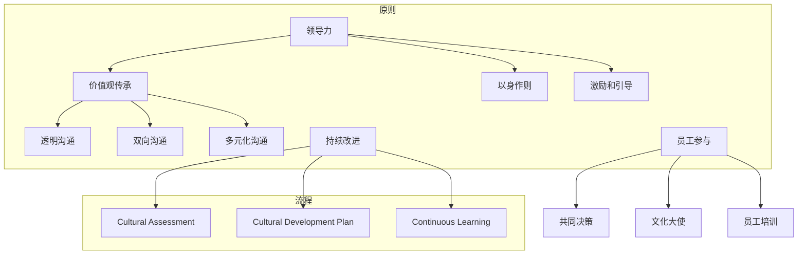

                 

### 文章标题

# 企业文化工程：塑造独特组织氛围的策略

### 文章关键词

- 企业文化
- 组织氛围
- 领导力
- 沟通
- 员工参与

### 摘要

企业文化工程是组织成功的关键要素之一，它通过系统化的策略和措施，塑造出一种独特的组织氛围，激发员工的潜能，提高组织的整体效能。本文旨在探讨企业文化工程的核心理念、构建策略及其实践方法，通过深入分析和实际案例，揭示企业文化工程对组织发展的深远影响。文章将从核心概念的介绍，到实施原则的阐述，再到具体策略的呈现，最终讨论文化工程面临的挑战与解决之道，为组织管理者提供具有操作性的指导。

---

## 引言与背景

在当今快速变化和高度竞争的商业环境中，企业文化的力量愈发显现。企业文化不仅是组织的灵魂，更是推动企业持续成长和发展的动力源泉。企业文化工程，作为一种系统化的方法，致力于通过精心设计和持续优化，塑造出独特的组织氛围，进而提升组织的整体绩效。

### 什么是企业文化？

企业文化，是指一个组织内部共同遵循的价值观、信仰、行为准则和工作方式的总和。它不仅包括明文规定的规章制度，还涵盖了组织成员在长期实践中形成的无形信仰和习惯。企业文化可以细分为多个层次，包括显性文化（如标识、标语和仪式）和隐性文化（如价值观、信仰和共同信念）。

### 企业文化的构成要素

企业文化的构成要素主要包括：

1. **核心价值观**：组织的核心价值观是企业文化的基础，它代表了组织对于何为正确和重要的基本信念。这些价值观通常具有持久性和普遍性，是组织成员共同遵循的准则。

2. **使命和愿景**：使命和愿景是企业的目标和方向，它们为组织提供了明确的发展路径和未来展望。使命通常回答“我们为何而存在？”的问题，而愿景则描绘了组织未来的理想状态。

3. **工作准则和行为规范**：工作准则和行为规范是企业文化中具体的行为指南，它们规定了员工应该如何行动和互动，以确保组织目标的实现。

4. **组织氛围**：组织氛围是指组织内部成员感知到的总体工作环境，包括信任、尊重、开放和协作等元素。一个积极向上的组织氛围可以激发员工的创造力和忠诚度，从而提升组织的整体效能。

### 企业文化对组织绩效的影响

企业文化对组织绩效有着深远的影响，具体体现在以下几个方面：

1. **员工满意度**：企业文化与员工满意度密切相关。一个支持员工成长、提供公平竞争机会、鼓励创新和开放的文化的组织，往往能够吸引和留住优秀的员工。

2. **团队协作**：企业文化可以增强团队协作，通过建立共同的价值观和目标，促进团队成员之间的沟通和合作，从而提高团队的整体效能。

3. **创新和灵活性**：积极的企业文化鼓励创新和灵活性，使组织能够快速适应市场变化，抓住机遇，保持竞争力。

4. **客户满意度**：企业文化也影响客户的满意度和忠诚度。一个以客户为中心的企业文化，能够提供更好的产品和服务，赢得客户的信任和忠诚。

5. **组织绩效**：整体上，企业文化能够提升组织的绩效，通过激发员工的潜能、增强团队协作和推动创新，实现组织的目标。

### 引言总结

企业文化工程是一个系统性工程，它不仅关乎组织内部的价值观和行为规范，更涉及组织氛围的塑造和持续优化。通过企业文化工程，组织可以建立一种独特的文化氛围，激发员工的潜能，提升整体效能，实现持续发展。接下来，本文将深入探讨企业文化工程的核心理念、实施原则和具体策略，为组织管理者提供有价值的指导。

---

## 核心概念与联系

在探讨企业文化工程之前，我们首先需要明确几个核心概念，并理解它们之间的相互关系。以下是企业文化工程中关键概念的介绍和它们之间关系的分析。

### 核心价值观

核心价值观是企业文化的基石，它们代表了组织的基本信念和原则。核心价值观通常包括诚信、责任、创新、客户至上、团队合作等。例如，一家科技公司可能将创新视为核心价值观，鼓励员工不断探索新技术和方法，以提高产品竞争力。

### 使命和愿景

使命是企业存在的根本目的，它回答了“我们为何而存在？”的问题。愿景则描绘了企业未来的理想状态，为组织提供了明确的方向和目标。使命和愿景共同构成了企业的发展蓝图，引导组织走向未来。例如，一家软件公司的使命可能是“通过创新的软件解决方案，帮助客户提升业务效率”，而愿景则可能是“成为全球领先的软件服务提供商”。

### 工作准则和行为规范

工作准则和行为规范是企业文化中具体的行为指南，它们规定了员工应该如何行动和互动，以确保组织目标的实现。这些准则和规范可以是正式的书面文件，也可以是组织长期实践中形成的无形习惯。例如，一家公司的行为规范可能要求员工始终保持诚实守信，遵守职业道德，积极参与团队协作。

### 组织氛围

组织氛围是指组织内部成员感知到的总体工作环境，包括信任、尊重、开放和协作等元素。一个积极向上的组织氛围可以激发员工的创造力和忠诚度，从而提升组织的整体效能。例如，一个高度信任和开放的组织氛围，能够鼓励员工提出创新想法和改进建议，促进团队的协作和合作。

### 关系分析

核心价值观、使命和愿景、工作准则和行为规范、组织氛围这些核心概念之间存在着密切的联系。

- **核心价值观**是组织文化的核心，直接影响着组织的使命和愿景。一个具有创新核心价值观的组织，往往会设定具有创新性的使命和愿景。
- **使命和愿景**为组织提供了明确的发展方向，指导和约束着组织的行为准则和规范。一个明确的使命和愿景，可以帮助组织制定具体的行为规范，以实现其发展目标。
- **工作准则和行为规范**则是实现使命和愿景的具体手段。通过明确的行为规范，组织可以确保员工在实现目标的过程中，遵循统一的价值观和原则。
- **组织氛围**是核心价值观、使命和愿景、工作准则和行为规范的综合体现。一个积极向上的组织氛围，可以强化核心价值观，促进使命和愿景的实现。

### Mermaid ER 图

为了更直观地展示这些核心概念之间的关系，我们可以使用 Mermaid ER 图来表示：

```mermaid
erDiagram
  |--|{核心价值观} : 定义组织的基本信念和原则
  |--|{使命和愿景} : 描述组织的目标和未来方向
  |--|{工作准则和行为规范} : 规定员工应该如何行动和互动
  |--|{组织氛围} : 形成员工的感知和工作环境
  
 核心价值观 <---|{指导}| 使命和愿景
 使命和愿景 <---|{指导}|  工作准则和行为规范
 工作准则和行为规范 <---|{影响}| 组织氛围
 组织氛围 <--|{体现}| 核心价值观
 组织氛围 <--|{体现}| 使命和愿景
 组织氛围 <--|{体现}|  工作准则和行为规范
```

通过以上核心概念和关系的分析，我们可以更好地理解企业文化工程的本质，为后续的讨论打下坚实的基础。

---

## 文化工程的原则

企业文化工程是一个系统化的过程，涉及多个关键原则和要素。这些原则和要素共同作用，帮助组织塑造和优化其独特的文化氛围，以实现组织的战略目标和长期发展。以下是企业文化工程中的核心原则：

### 领导力

领导力在企业文化的塑造中扮演着至关重要的角色。领导者不仅是企业价值观的传递者，更是文化实践的身体力行者。以下是一些关键点：

1. **价值观传承**：领导者需要将企业的核心价值观内化于心，并通过各种方式传递给组织成员。这包括公开演讲、团队会议、培训和日常交流等。
2. **以身作则**：领导者应通过自己的行为示范企业价值观，成为员工的榜样。例如，在诚信和责任感方面，领导者应以身作则，树立良好的道德风范。
3. **激励和引导**：领导者应激励员工积极参与企业文化建设，通过奖励机制和认可制度，鼓励员工践行企业价值观。

### 沟通

沟通是企业文化工程中不可或缺的一环，有效的沟通可以帮助组织成员理解企业文化和战略，促进共识和协同。

1. **透明沟通**：企业应建立透明、开放的沟通机制，确保信息在企业内部的有效传递。这包括定期发布公司业绩、战略规划、市场动态等。
2. **双向沟通**：企业应鼓励员工提出意见和建议，通过定期的员工反馈、问卷调查等方式，收集员工的意见和建议。
3. **多元化沟通**：企业应采用多种沟通方式，如会议、培训、内部刊物、社交媒体等，以满足不同员工的需求和偏好。

### 员工参与

员工参与是企业文化建设的重要组成部分，通过让员工参与企业决策和文化建设，可以增强员工的归属感和参与感。

1. **共同决策**：企业应鼓励员工参与决策过程，特别是在与员工利益相关的问题上，如绩效评估、薪酬调整等。
2. **文化大使**：企业可以设立文化大使或文化委员会，由员工代表组成，负责推广和维护企业价值观。
3. **员工培训**：企业应提供定期的培训和研讨会，帮助员工理解企业文化和战略，提升员工的综合素质。

### 持续改进

企业文化不是一成不变的，而是需要持续优化和改进的。以下是一些持续改进的方法：

1. **文化评估**：企业应定期进行文化评估，通过员工反馈、第三方调查等方式，了解企业文化现状和存在的问题。
2. **文化建设计划**：基于文化评估的结果，企业应制定具体的文化建设计划，包括改进措施、时间表和责任人。
3. **持续学习**：企业应鼓励员工持续学习和成长，通过外部培训、内部知识分享等方式，不断提升员工的能力和素质。

### Mermaid 流程图

为了更直观地展示文化工程的原则和流程，我们可以使用 Mermaid 流程图来表示：



通过以上原则的详细阐述和流程图的展示，我们可以看到企业文化工程是一个系统化、持续性的过程，需要领导层的引领、有效的沟通、员工的积极参与以及持续的改进和优化。这些原则共同作用，帮助组织塑造和维持一种积极向上的文化氛围，从而实现组织的长期发展。

---

## 建立独特组织氛围的策略

在塑造企业文化时，建立独特的组织氛围是一项关键任务。独特的组织氛围不仅能增强员工的归属感和忠诚度，还能提升组织的创新能力和竞争力。以下是一些策略，这些策略可以帮助组织构建和维持其独特的氛围。

### 明确核心价值观

核心价值观是组织文化的基石，它们为组织提供了共同遵循的信念和准则。明确核心价值观并让所有员工都认同这些价值观，是建立独特组织氛围的第一步。

1. **定义核心价值观**：企业需要通过深入讨论和广泛征求意见，定义出符合企业特点的核心价值观。这些价值观应该简洁明了，易于理解，并且能够激励员工。
2. **传播核心价值观**：企业应通过内部沟通渠道，如员工会议、内部刊物、海报和培训等，广泛传播核心价值观。确保所有员工都了解并认同这些价值观。
3. **实践核心价值观**：领导者应以身作则，通过实际行动展示核心价值观。这不仅能树立榜样，还能强化员工的认同感。

### 建立明确的目标和愿景

一个清晰的目标和愿景可以指引组织前进的方向，激励员工共同努力。为了建立独特的组织氛围，企业需要明确其目标和愿景，并让员工了解这些目标是如何与核心价值观相联系的。

1. **设定明确的目标**：企业应设定具体、可衡量的短期和长期目标。这些目标应与企业的核心价值观一致，并能够激励员工为实现这些目标而努力。
2. **传达愿景**：企业应通过明确的沟通，向员工传达其愿景。这可以包括组织的目标、未来的发展方向和愿景实现的途径。
3. **让员工参与目标设定**：鼓励员工参与目标设定过程，这不仅能增强员工的参与感和责任感，还能确保目标与员工的个人兴趣和职业发展相一致。

### 培养积极的工作环境

一个积极的工作环境能够激发员工的创造力和创新能力，是建立独特组织氛围的关键。

1. **鼓励创新和尝试**：企业应鼓励员工创新和尝试新的想法和方法。这可以通过提供实验资金、时间自由和资源支持来实现。
2. **建立开放的沟通文化**：企业应建立开放的沟通文化，鼓励员工表达自己的想法和意见。这可以通过定期的团队会议、匿名反馈渠道和开放的领导风格来实现。
3. **提供职业发展机会**：企业应提供多种职业发展机会，包括培训、晋升和跨部门调岗等。这可以帮助员工实现个人职业目标，并增强他们的忠诚度。

### 强化团队合作和协作

团队合作和协作是建立独特组织氛围的重要组成部分。通过强化团队合作和协作，企业可以提升团队的整体效能。

1. **促进跨部门合作**：企业应鼓励不同部门之间的合作和交流，通过跨部门项目、团队建设活动和定期会议等方式，促进部门间的沟通和协作。
2. **建立团队目标**：企业应设定团队目标，并确保这些目标与组织的目标相一致。这可以帮助团队明确方向，提高协作效率。
3. **提供团队奖励**：企业可以通过提供团队奖励，如奖金、晋升机会和表彰活动，来鼓励团队合作和协作。

### 制定和实施文化策略

制定和实施具体的文化策略，是建立独特组织氛围的关键步骤。以下是一些具体的策略：

1. **文化评估**：定期进行文化评估，了解企业文化现状和存在的问题。这可以通过员工调查、焦点小组讨论和第三方评估来实现。
2. **文化变革计划**：基于文化评估的结果，制定具体的文化变革计划。这包括改进措施、实施步骤和时间表。
3. **持续改进**：企业应持续改进其文化策略，通过定期的评估和反馈，确保文化策略的有效性和适应性。

### 实际案例

为了更好地理解这些策略，我们可以参考一些实际案例：

1. **谷歌**：谷歌以其开放、创新和以人为本的文化而闻名。谷歌通过提供灵活的工作时间、自由的工作空间和丰富的员工福利，鼓励员工创新和尝试。谷歌的文化策略不仅提升了员工的满意度，还增强了公司的竞争力。

2. **特斯拉**：特斯拉强调创新和执行力，通过设立明确的目标和愿景，激励员工为实现这些目标而努力。特斯拉还建立了强大的团队合作文化，通过跨部门项目和团队合作，提高了整体效能。

3. **宜家**：宜家以其独特的家居设计和文化体验而受到消费者的喜爱。宜家通过其开放式的展示空间和互动体验，营造了一个充满创意和乐趣的工作环境。宜家的文化策略不仅提升了员工的创造力，还增强了品牌的影响力。

通过以上策略，企业可以建立独特的组织氛围，激发员工的潜能，提升组织的整体效能。这些策略不仅适用于大型企业，也适用于中小型企业。无论企业的规模如何，通过明确核心价值观、建立目标愿景、培养积极工作环境、强化团队合作和制定具体的文化策略，企业都可以打造出一种独特的文化氛围，推动组织的持续发展。

---

## 文化工程的实际应用：案例分析

为了更好地理解企业文化工程在实际中的应用效果，本文将介绍几个成功的案例，并深入分析这些企业在实施企业文化工程过程中所采取的具体策略、面临的挑战及所取得的成效。

### 案例一：谷歌

谷歌是全球知名的技术公司，以其独特的文化氛围和创新精神闻名。谷歌成功的企业文化工程策略主要包括以下几个方面：

1. **开放和创新的工作环境**：谷歌为员工提供了灵活的工作时间和自由的工作空间，鼓励员工自由探索和创新。这种开放的工作环境不仅激发了员工的创造力，还增强了团队之间的合作。

2. **员工福利和关怀**：谷歌提供了一系列优厚的员工福利，如免费食品、健身房、托儿所、心理健康支持等。这些福利措施不仅提升了员工的满意度，还增强了员工的忠诚度。

3. **领导力培养**：谷歌注重领导力培养，通过提供定期的领导力培训和发展机会，帮助员工成长为优秀的领导者。这种领导力培养策略不仅提升了领导者的管理水平，还强化了企业文化的一致性。

**挑战与解决方案**：

在实施企业文化工程过程中，谷歌面临的主要挑战包括如何维持企业文化的持续创新和如何平衡员工自由与企业的整体目标。为了解决这些挑战，谷歌采取了以下策略：

- **持续创新文化**：谷歌通过设立内部创业孵化器和创新基金，鼓励员工提出创新项目并为其提供必要的资源和支持。这种机制确保了企业文化始终处于创新的前沿。

- **明确目标与价值观**：谷歌通过定期更新和宣传其核心价值观和战略目标，确保员工对企业文化有清晰的理解和认同。这有助于统一员工的行动方向，确保企业目标的实现。

**成效**：

谷歌的企业文化工程策略取得了显著的成效。首先，谷歌在员工满意度、员工保留率和创新能力方面均处于行业领先地位。其次，谷歌的创新文化吸引了大量顶尖人才，为公司的发展提供了强大的动力。最后，谷歌的文化策略帮助公司在市场竞争中保持了持续的竞争优势。

### 案例二：亚马逊

亚马逊是全球最大的电子商务公司之一，以其高效的运营和卓越的客户服务而著称。亚马逊在企业文化工程方面采取了以下策略：

1. **以客户为中心**：亚马逊始终将客户需求放在首位，通过提供优质的客户服务和创新的电子商务解决方案，不断提升客户满意度。

2. **高效和执行文化**：亚马逊强调高效执行和快速决策，通过简化的决策流程和灵活的运营模式，确保企业能够快速响应市场变化。

3. **员工发展**：亚马逊为员工提供了丰富的培训和发展机会，通过定期的培训和绩效评估，帮助员工提升技能和职业发展。

**挑战与解决方案**：

亚马逊在实施企业文化工程过程中面临的主要挑战包括如何平衡快速发展和员工福利、如何在保持高效的同时保持企业文化的多样性。为了解决这些挑战，亚马逊采取了以下策略：

- **员工福利和关怀**：亚马逊提供了一系列员工福利，如灵活的工作时间、远程工作机会、健康保险和职业发展支持。这些福利措施不仅提升了员工的满意度，还增强了员工的忠诚度。

- **文化多样性**：亚马逊通过招聘多元化的员工，并鼓励员工之间的文化交流和合作，促进了企业文化的多样性。这种文化多样性有助于亚马逊在全球化市场中保持竞争力。

**成效**：

亚马逊的企业文化工程策略取得了显著的成效。首先，亚马逊在客户满意度方面取得了卓越的成绩，其客户服务质量和满意度在行业内处于领先地位。其次，亚马逊的高效和执行文化帮助公司快速适应市场变化，保持了持续的增长。最后，亚马逊的文化策略吸引了大量优秀人才，为公司的发展提供了强大的人才支持。

### 案例三：宜家

宜家是一家全球知名的家具和家居用品零售商，以其独特的购物体验和文化氛围而闻名。宜家在企业文化工程方面采取了以下策略：

1. **创新设计**：宜家注重产品设计和用户体验，通过创新的设计理念和优质的家具产品，提升了品牌形象和客户满意度。

2. **员工参与**：宜家鼓励员工参与企业决策和文化建设，通过设立员工代表委员会和定期召开员工会议，确保员工的意见和需求得到重视。

3. **社会责任**：宜家注重企业社会责任，通过实施环保和可持续发展的措施，提升了企业的社会形象和品牌价值。

**挑战与解决方案**：

宜家在实施企业文化工程过程中面临的主要挑战包括如何平衡创新与成本控制、如何在全球化市场中保持一致性。为了解决这些挑战，宜家采取了以下策略：

- **创新与成本控制**：宜家通过优化供应链和制造流程，降低了产品成本，确保了创新产品在市场上的竞争力。

- **全球化一致性**：宜家通过在全球范围内推广统一的品牌形象和企业文化，确保了不同市场的文化一致性。同时，宜家也尊重各地的文化差异，通过本土化的方式满足不同市场的需求。

**成效**：

宜家的企业文化工程策略取得了显著的成效。首先，宜家的创新设计理念赢得了消费者的青睐，提升了品牌知名度和市场占有率。其次，宜家的员工参与策略增强了员工的归属感和责任感，提升了员工的积极性和工作效率。最后，宜家的社会责任措施提升了企业的社会形象，增强了品牌价值。

### 总结

通过以上案例分析，我们可以看到，成功的文化工程策略不仅能够提升企业的绩效和竞争力，还能够增强员工的满意度和忠诚度。无论企业的规模和行业如何，通过明确核心价值观、建立目标愿景、培养积极工作环境、强化团队合作和制定具体的文化策略，企业都可以打造出一种独特的文化氛围，推动组织的持续发展。

---

## 文化工程中的挑战与解决方案

在实施企业文化工程的过程中，组织往往面临多种挑战，这些挑战可能会影响文化工程的顺利进行。以下是企业文化工程中常见的一些挑战以及相应的解决方案。

### 挑战一：缺乏共识

在企业内部，不同部门、不同层级的管理者和员工可能会对企业文化的核心价值观、目标和愿景有不同的理解和期望，导致缺乏共识。这种缺乏共识的情况可能会导致企业文化工程的推进受阻。

**解决方案**：

1. **增强沟通**：通过定期的沟通会议、培训活动和内部讨论，让全体员工深入了解企业文化的核心价值观、目标和愿景，确保员工对企业文化有共同的理解和认同。
2. **建立共识机制**：可以设立跨部门的共识小组，由各部门的代表组成，负责讨论和协调企业文化的相关事宜，确保企业文化的一致性和连贯性。

### 挑战二：领导力不足

企业文化工程的成功很大程度上依赖于领导层的支持和推动。如果领导层对企业文化缺乏重视或执行力不足，文化工程可能会流于形式，难以取得实质性进展。

**解决方案**：

1. **提升领导力**：通过领导力培训和发展项目，提升领导层的文化意识和领导能力。确保领导者能够以身作则，成为企业文化实践和推广的榜样。
2. **明确领导责任**：为领导层设定明确的企业文化职责和目标，确保领导层在文化工程中发挥关键作用。可以通过设立文化专员或文化委员会，专门负责企业文化的工作。

### 挑战三：缺乏系统性

企业文化工程需要系统化的规划和执行，如果缺乏明确的策略和计划，文化工程可能会变得无序和混乱，影响整体效果。

**解决方案**：

1. **制定系统性计划**：在实施企业文化工程之前，制定详细的计划，包括目标、步骤、时间表和责任人。确保文化工程有明确的路径和执行机制。
2. **持续跟踪和评估**：在文化工程实施过程中，定期跟踪和评估文化工程的效果，及时调整策略和计划。通过反馈机制，确保文化工程能够持续改进和优化。

### 挑战四：员工参与不足

企业文化工程的成功不仅依赖于领导层的推动，还需要员工的积极参与。如果员工对企业文化工程缺乏兴趣或参与度不高，文化工程可能难以取得预期效果。

**解决方案**：

1. **鼓励员工参与**：通过定期的员工会议、问卷调查和意见反馈等方式，鼓励员工参与企业文化工程的设计和实施。确保员工感受到自己的意见和建议被重视。
2. **提供培训和支持**：为员工提供相关的培训和资源支持，帮助他们理解和践行企业文化。通过培训，提升员工的文化意识和参与能力。

### 挑战五：外部环境变化

企业文化工程不仅受内部因素影响，还受外部环境变化的影响。如果企业面临市场变化、竞争压力或其他外部因素，可能会影响企业文化工程的实施和效果。

**解决方案**：

1. **适应外部环境**：在制定企业文化工程策略时，考虑外部环境的变化，确保文化工程能够适应外部环境的要求。可以通过定期评估外部环境，及时调整文化策略。
2. **加强灵活性和适应性**：培养企业文化的灵活性和适应性，确保企业能够快速响应外部环境的变化，保持文化工程的连续性和有效性。

通过以上解决方案，企业可以克服文化工程中的各种挑战，确保文化工程能够顺利实施，达到预期效果，从而提升组织的整体绩效和竞争力。

---

## 最佳实践与未来趋势

在企业文化建设的过程中，最佳实践和未来趋势是确保企业文化持续发展和优化的关键。以下是一些最佳实践和未来趋势的讨论，为组织管理者提供有价值的指导。

### 最佳实践

1. **明确核心价值观和目标**：在开始企业文化工程时，首先要明确核心价值观和目标，确保这些价值观和目标与组织的战略愿景一致。通过制定清晰的愿景和使命，为整个组织提供明确的方向。

2. **领导者以身作则**：领导者的行为和态度对员工有深远的影响。领导者应以身作则，通过实际行动展示组织的核心价值观，成为员工模仿的榜样。

3. **强化员工参与**：员工是企业文化的重要组成部分，他们的参与和认同感对文化建设的成功至关重要。通过建立反馈机制和参与渠道，鼓励员工积极参与企业文化建设。

4. **持续培训和沟通**：定期对员工进行文化培训，确保他们对组织的核心价值观和文化有深入理解。同时，通过内部沟通渠道，如内部刊物、会议和社交媒体，保持组织内部的信息流通和沟通。

5. **数据驱动决策**：利用员工满意度调查、文化评估等数据工具，了解企业文化现状和员工反馈。通过数据驱动的决策，不断优化和调整企业文化策略。

### 未来趋势

1. **数字化转型**：随着数字化技术的发展，企业文化的建设也将越来越依赖于数字工具和平台。例如，通过在线培训、虚拟会议和社交媒体，企业可以更有效地传播和强化企业文化。

2. **多样性、公平与包容性**：未来企业文化将更加注重多样性、公平和包容性。通过建立包容性的工作环境，吸引和留住不同背景的员工，企业可以更好地适应多元化市场的需求。

3. **可持续性**：企业社会责任和环境保护将成为企业文化的重要组成部分。未来，企业将更加注重可持续发展的理念，将其融入到企业文化的方方面面。

4. **个性化**：未来企业文化将更加注重个性化，尊重员工的个性和需求。通过提供定制化的职业发展机会和福利方案，企业可以更好地满足员工的个性化需求。

5. **敏捷文化和持续学习**：随着市场变化的加快，企业需要具备敏捷文化和持续学习的能力。通过培养员工的灵活性和学习能力，企业可以更好地应对外部环境的挑战。

### 结论

企业文化是组织的灵魂，它对组织的绩效和员工满意度有着深远的影响。通过实施最佳实践和紧跟未来趋势，企业可以建立和维持一种积极、健康和独特的文化氛围，激发员工的潜能，推动组织的持续发展。未来，企业文化将继续演进，成为企业成功的关键要素。

---

## 结论

企业文化工程是塑造独特组织氛围的关键，它通过系统化的策略和措施，将核心价值观、愿景、目标和行为规范融入到组织的日常运作中，从而提升组织的整体效能和竞争力。本文从核心概念、实施原则、具体策略、实际案例和未来趋势等多个维度，深入探讨了企业文化工程的核心理念和实践方法。

首先，我们明确了企业文化的定义和构成要素，包括核心价值观、使命、愿景、工作准则和行为规范。接着，我们探讨了企业文化工程的核心原则，如领导力、沟通、员工参与和持续改进。然后，我们提出了建立独特组织氛围的策略，如明确核心价值观、建立目标和愿景、培养积极的工作环境、强化团队合作和制定文化策略。

通过实际案例的分析，我们看到了企业文化工程在不同类型企业中的成功实践，这些案例不仅展示了文化工程的策略和成效，还提供了宝贵的经验和教训。此外，我们讨论了企业文化工程中面临的挑战及其解决方案，包括缺乏共识、领导力不足、缺乏系统性和员工参与不足等。

最后，我们提出了企业文化工程的最佳实践和未来趋势，如数字化转型、多样性、公平与包容性、可持续性和个性化等。这些趋势将引领企业文化的发展方向，帮助企业建立和维护一种积极、健康和独特的文化氛围。

总之，企业文化工程不仅关乎组织的内部管理，更关系到组织的长远发展和竞争力。通过系统化、持续性的文化工程，组织可以激发员工的潜能，提升整体效能，实现可持续发展。我们呼吁组织管理者高度重视企业文化工程，积极探索和实践，为组织的成功奠定坚实的基础。

---

## 作者信息

作者：AI天才研究院/AI Genius Institute & 禅与计算机程序设计艺术 /Zen And The Art of Computer Programming

