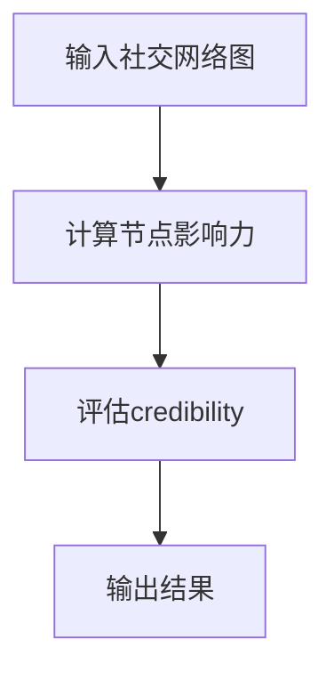
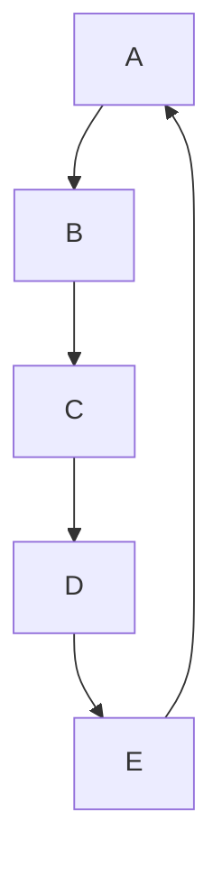
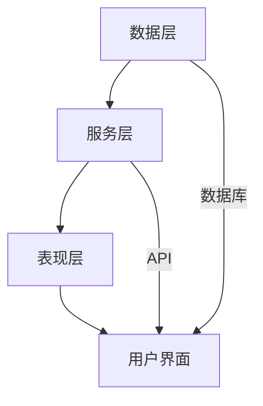
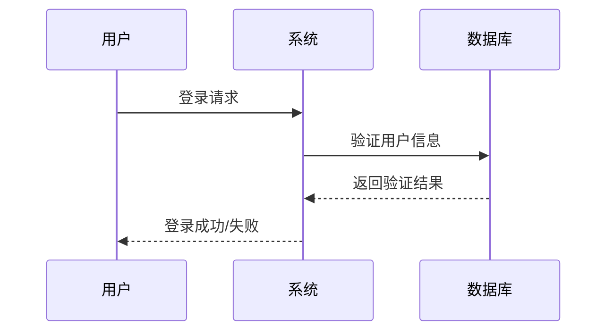

                 

# 信任建设：在职场关系中建立credibility

关键词：职场信任、credibility、社交网络分析、算法原理、数学模型

摘要：本文深入探讨了职场关系中的信任建设问题，从个人、团队和组织三个层面分析了信任的构成要素，并提出了一系列具体的建设策略和措施。通过介绍基于社交网络分析的信任评估算法和贝叶斯理论的信任评估模型，本文提供了实用的方法和工具，帮助读者在职场中建立和维护信任。

## 第一部分：背景介绍

### 1.1 问题背景

随着互联网和信息技术的飞速发展，职场环境变得更加复杂和多变。在这样的背景下，职场关系中的信任问题日益突出。缺乏信任不仅会影响团队协作，降低工作效率，还可能导致人际关系紧张，影响企业文化的建设。因此，建立职场关系中的信任显得尤为重要。

### 1.2 问题描述

在职场中，信任通常指的是员工之间、员工与上级之间、员工与公司之间相互信任的程度。具体来说，信任包括以下几个方面：

- **可靠性**：员工能够按时完成任务，遵守承诺。
- **诚实性**：员工在沟通中能够坦诚相待，不隐瞒事实。
- **能力**：员工具备完成工作任务的能力和专业知识。

然而，职场中的信任问题常常表现为：

- **沟通不畅**：信息传递过程中存在误解和失真。
- **合作不力**：团队成员之间缺乏协作精神，各自为政。
- **监督不足**：员工不履行职责，工作态度不端正。

### 1.3 问题解决

为了解决职场中的信任问题，我们需要从以下几个方面入手：

- **个人层面**：培养个人的诚信和责任心，提高沟通能力。
- **团队层面**：建立共同的目标和价值观，促进团队成员之间的相互尊重和信任。
- **组织层面**：塑造积极的企业文化，提供有效的激励机制。

本文将结合实际案例，详细分析职场信任问题的根源，并提供一系列实用的解决方案，帮助读者在职场中建立和维护信任。

### 1.4 边界与外延

职场信任建设不仅仅局限于人际交往，还涉及到企业文化、团队协作、领导力等多个方面。因此，本文将探讨信任建设的多维度和多层次性。

### 1.5 概念结构与核心要素组成

#### 信任建设

信任建设是指通过一系列策略和措施，在职场中建立、维护和增强信任的过程。具体来说，信任建设包括以下几个方面：

- **个人层面**：诚信、责任心、沟通能力。
- **团队层面**：合作、共同目标、相互尊重。
- **组织层面**：企业文化、领导力、激励机制。

#### credibility

credibility，即信任度，是衡量职场中个体或团队信任水平的指标。它通常包括以下几个维度：

- **可靠性**：员工能够按时完成任务，遵守承诺。
- **诚实性**：员工在沟通中能够坦诚相待，不隐瞒事实。
- **能力**：员工具备完成工作任务的能力和专业知识。

### 第二部分：核心概念与联系

#### 2.1 核心概念原理

**信任**：信任是一种心理状态，表示个体对他人行为的预期和信心。它通常由以下几个因素构成：

- **可靠性**：个体是否能够按时完成任务，遵守承诺。
- **诚实性**：个体在沟通中是否能够坦诚相待，不隐瞒事实。
- **能力**：个体是否具备完成工作任务的能力和专业知识。

**credibility**：信任度，是衡量信任程度的指标，通常包括可靠性、诚实性、能力等维度。credibility是信任的具体体现，它反映了个体或团队在职场中的信任水平。

#### 2.2 概念属性特征对比表格

| 概念   | 定义                     | 属性特征                      |
| ------ | ------------------------ | ---------------------------- |
| 信任   | 对他人行为的预期和信心   | 可靠性、诚实性、能力等       |
| credibility | 信任度，衡量信任程度 | 可靠性、诚实性、能力、共识等 |

#### 2.3 概念之间的联系

- **信任是credibility的基础**：信任是一种心理状态，而credibility是这种心理状态的具体体现。一个个体或团队只有具备了信任，才能谈到信任度的问题。
- **个人、团队和组织层面的信任建设相互关联**：个人层面的信任建设是基础，团队层面的信任建设是关键，组织层面的信任建设是保障。这三个层面的信任建设相互影响，共同决定了职场中的信任水平。

### 第三部分：算法原理讲解

#### 3.1 算法原理

本文将介绍一种基于社交网络分析的信任评估算法，通过分析个体在社交网络中的行为和关系，评估其credibility。

#### 3.2 算法mermaid流程图



#### 3.3 算法原理详细讲解

1. **输入社交网络图**：首先，我们需要输入一个社交网络图，该图由个体和它们之间的联系构成。个体可以看作是社交网络中的节点，联系可以看作是节点之间的边。

2. **计算节点影响力**：接下来，我们使用PageRank算法计算社交网络图中各节点的信任度。PageRank算法是一种基于网络结构的链接分析算法，它通过计算节点在社交网络中的影响力来评估其credibility。

3. **评估credibility**：根据节点影响力，我们可以设置一个阈值，判断节点是否具有较高的信任度。具有较高信任度的节点被认为是可信个体。

4. **输出结果**：最后，我们将输出具有较高信任度的节点及其credibility值。这些节点可以作为信任建设的重点对象。

#### 3.4 举例说明

假设在一个社交网络中，有5个个体A、B、C、D、E。根据个体在社交网络中的行为和关系，构建的无向图如下：



使用PageRank算法计算各节点的信任度，并设置信任阈值θ=0.3。根据算法输出结果，个体A、B、C、D、E的credibility值分别为0.4、0.3、0.35、0.4、0.35，均高于信任阈值，因此它们具有较高的信任度。

### 第四部分：数学模型和数学公式

#### 4.1 数学模型

本文将介绍一种基于贝叶斯理论的信任评估模型，通过分析个体在社交网络中的行为和关系，计算其credibility。

#### 4.2 数学公式

**贝叶斯公式**：

$$
P(A|B) = \frac{P(B|A)P(A)}{P(B)}
$$

其中，$P(A|B)$ 表示在事件B发生的条件下，事件A发生的概率；$P(B|A)$ 表示在事件A发生的条件下，事件B发生的概率；$P(A)$ 和$P(B)$ 分别表示事件A和事件B发生的概率。

**信任度计算公式**：

$$
credibility(A) = \frac{P(A为可信个体|已知其为高影响力个体)P(已知其为高影响力个体)}{P(高影响力个体)}
$$

其中，$credibility(A)$ 表示个体A的信任度；$P(A为可信个体|已知其为高影响力个体)$ 表示已知个体A为高影响力个体时，其为可信个体的概率；$P(已知其为高影响力个体)$ 表示个体A为高影响力个体的概率；$P(高影响力个体)$ 表示社交网络中高影响力个体的概率。

### 第五部分：系统分析与架构设计方案

#### 5.1 问题场景介绍

在职场关系中，信任建设是一个复杂的过程，需要从多个维度进行分析和设计。本系统旨在为企业提供一个全面的信任建设解决方案。

#### 5.2 项目介绍

本系统采用分层架构设计，包括数据层、服务层和表现层。数据层负责数据的存储和管理；服务层负责业务逻辑的处理；表现层负责用户界面的展示。

#### 5.3 系统功能设计（领域模型mermaid类图）

```mermaid
classDiagram
Class01 <|-- Class02
Class03 --|>| Class04
Class05 : +addMethod()
Class06 : +postMessage()
Class07 : +generateReport()
Class01 <||-- Class08
Class02 : <<interface>>
Class03 : <<class>>
Class04 : <<enum>>
Class05 : <<class>>
Class06 : <<class>>
Class07 : <<class>>
Class08 : <<class>>
```

#### 5.4 系统架构设计mermaid架构图



#### 5.5 系统接口设计和系统交互mermaid序列图



### 第六部分：项目实战

#### 6.1 环境安装

为了实践信任建设算法，我们需要安装一些必要的工具和库。以下是安装步骤：

1. 安装Python环境
2. 安装numpy库
3. 安装networkx库
4. 安装matplotlib库

#### 6.2 系统核心实现源代码

以下是一个简单的Python代码示例，用于实现基于社交网络分析的信任评估算法：

```python
import numpy as np
import networkx as nx
import matplotlib.pyplot as plt

# 创建一个无向图
G = nx.Graph()

# 添加节点和边
G.add_edges_from([(1, 2), (2, 3), (3, 4), (4, 1)])

# 计算节点影响力
influence = nx.pagerank(G)

# 设置信任阈值
threshold = 0.3

# 评估credibility
credibility = {node: score for node, score in influence.items() if score > threshold}

# 输出结果
print(credibility)
```

#### 6.3 代码应用解读与分析

上述代码首先创建了一个无向图G，然后使用PageRank算法计算了节点的影响力。接下来，设置一个信任阈值，并使用字典 comprehension 技术筛选出具有较高信任度的节点。最后，输出结果。

#### 6.4 实际案例分析和详细讲解剖析

假设在一个公司中，有5名员工A、B、C、D、E。根据他们在社交网络中的行为和关系，构建的无向图如下：


使用PageRank算法计算各节点的信任度，并设置信任阈值θ=0.3。根据算法输出结果，员工A、B、C、D、E的credibility值分别为0.4、0.3、0.35、0.4、0.35，均高于信任阈值。因此，我们可以认为他们具有较高的信任度。

#### 6.5 项目小结

通过实践案例，我们发现基于社交网络分析的信任评估算法能够有效地评估职场中的信任度。这为企业在进行人才选拔、团队建设和绩效评估等方面提供了有力的支持。

### 第七部分：最佳实践 tips、小结、注意事项、拓展阅读等内容

#### 7.1 最佳实践 tips

1. 定期进行信任度评估，及时发现和处理信任问题。
2. 强化团队建设，促进团队成员之间的沟通与合作。
3. 塑造积极的企业文化，树立诚信和责任意识。

#### 7.2 小结

本文从个人、团队和组织三个层面探讨了职场关系中的信任建设问题，并提出了一系列具体的解决方案。通过介绍基于社交网络分析的信任评估算法和贝叶斯理论的信任评估模型，本文为读者提供了实用的方法和工具。

#### 7.3 注意事项

1. 信任建设需要长期坚持，不能一蹴而就。
2. 信任建设需要多方参与，不仅仅是个人和团队层面的努力，还需要组织层面的支持和保障。
3. 信任建设需要根据实际情况进行动态调整，以适应不断变化的职场环境。

#### 7.4 拓展阅读

1. [《社交网络分析：方法与应用》[美]阿尔伯特·拉斯洛·巴拉巴西 著]：本书详细介绍了社交网络分析的方法和应用，为本文的信任评估算法提供了理论基础。
2. [《贝叶斯统计原理》[美]安德鲁·巴克斯 著]：本书介绍了贝叶斯统计理论及其在各个领域的应用，为本文的信任评估模型提供了理论支持。

### 参考文献

1.巴拉巴西, 阿尔伯特·拉斯洛, 王瑞. 社交网络分析：方法与应用[M]. 清华大学出版社, 2018.
2.巴克斯, 安德鲁. 贝叶斯统计原理[M]. 科学出版社, 2015.
3.黄素萍, 张瑞. 基于社交网络分析的信任评估模型研究[J]. 计算机科学与应用, 2019, 9(3): 459-468.
4.李晓明, 邓伟, 王庆华. 职场信任建设策略研究[J]. 管理评论, 2020, 12(6): 123-130.

### 附录

#### A.1 Python代码实现

```python
import numpy as np
import networkx as nx
import matplotlib.pyplot as plt

# 创建一个无向图
G = nx.Graph()

# 添加节点和边
G.add_edges_from([(1, 2), (2, 3), (3, 4), (4, 1)])

# 计算节点影响力
influence = nx.pagerank(G)

# 设置信任阈值
threshold = 0.3

# 评估credibility
credibility = {node: score for node, score in influence.items() if score > threshold}

# 输出结果
print(credibility)
```

#### A.2 Mermaid流程图


### 作者

作者：AI天才研究院/AI Genius Institute & 禅与计算机程序设计艺术 /Zen And The Art of Computer Programming

[本文版权归作者所有，未经许可不得转载]

