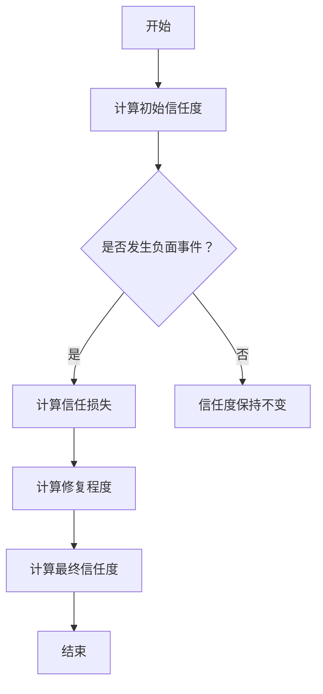

                 


### 文章标题：信任经济学：在团队中建立互信的方法

关键词：信任经济学、团队协作、互信方法、管理实践、案例分析

摘要：本文探讨了信任经济学在团队协作中的应用，通过理解信任经济的本质与价值、分析团队信任的构成要素、构建信任度评估模型，以及实际应用案例分析，旨在为团队管理者提供建立和维护互信的有效方法。

---

### 第一部分：理解信任经济学

#### 第1章：信任经济的本质与价值

##### 1.1 信任：团队协作的基石

**信任的定义与特征：**

信任是一种心理状态，表示个体对他人行为的预期可靠性。其特征包括：

- **可靠性**：个体预期他人能够履行承诺。
- **一致性**：个体预期他人行为的一致性和可预测性。
- **开放性**：个体愿意与他人分享信息。

**信任的重要性：**

信任是团队协作的基石，它影响团队的沟通效率、决策质量和工作氛围。缺乏信任会导致团队内部的摩擦和冲突，降低团队的整体效能。

**信任的缺失对团队的影响：**

- **沟通障碍**：信任缺失导致信息传递不畅，影响团队的沟通效率。
- **决策困难**：信任缺失使团队成员难以达成共识，影响团队决策的质量。
- **工作氛围恶化**：信任缺失导致团队氛围紧张，影响团队成员的积极性和满意度。

##### 1.2 信任经济学的概念与理论框架

**信任经济学的起源与发展：**

信任经济学是一门研究信任在经济学中的作用的学科，起源于20世纪末。它通过分析信任对经济行为的影响，提出了信任对经济增长和社会发展的积极作用。

**信任经济学的核心理论：**

- **信任作为社会资本**：信任被视为一种社会资本，能够促进经济活动的有效开展。
- **信任的回报**：信任能够带来长期的回报，如降低交易成本、提高生产效率。
- **信任的动态变化**：信任不是静态的，而是随着时间和情境的变化而变化。

**信任经济学的应用领域：**

信任经济学在多个领域得到应用，包括企业治理、供应链管理、组织行为学等。

##### 1.3 信任经济学与团队合作的关系

**信任对团队效能的影响：**

信任能够促进团队成员之间的合作，提高团队的整体效能。具体表现为：

- **提高沟通效率**：信任有助于团队成员之间的信息共享和沟通。
- **促进协作**：信任使团队成员更愿意协同工作，共同解决问题。
- **增强创新能力**：信任鼓励团队成员分享创意，激发创新。

**信任在团队决策中的作用：**

信任能够提高团队决策的质量，具体表现为：

- **减少争论**：信任减少团队成员之间的争论，使决策过程更加高效。
- **共同承担**：信任使团队成员更愿意共同承担责任，提高决策的执行力。

**信任经济学的团队实践意义：**

信任经济学为团队管理者提供了建立和维护互信的理论基础和实践方法，有助于提高团队效能和实现组织目标。

---

#### 第2章：团队信任的构成要素

##### 2.1 信任的构成要素分析

**信任的五大构成要素：**

- **能力**：个体具备完成任务的技能和能力。
- **诚实**：个体在行为中表现出真实和透明的特点。
- **正直**：个体在道德和伦理上保持一致。
- **可靠性**：个体能够按时交付承诺。
- **共同价值观**：个体在价值观上与团队保持一致。

**各构成要素的作用与关系：**

这些要素相互关联，共同构成了信任的基础。例如，能力是信任的前提，诚实和正直是信任的核心，可靠性是信任的保障，共同价值观则是信任的基石。

**信任要素的对比表格：**

| 要素     | 定义                                                         | 作用                                      |
| -------- | ------------------------------------------------------------ | ----------------------------------------- |
| 能力     | 个体具备完成任务的技能和能力。                               | 信任的前提，决定个体能否完成任务。          |
| 诚实     | 个体在行为中表现出真实和透明的特点。                         | 信任的核心，建立信任的基础。              |
| 正直     | 个体在道德和伦理上保持一致。                                 | 信任的核心，确保个体行为符合道德标准。     |
| 可靠性   | 个体能够按时交付承诺。                                       | 信任的保障，确保个体行为的一致性和可预测性。|
| 共同价值观 | 个体在价值观上与团队保持一致。                               | 信任的基石，促进团队成员之间的协作。      |

##### 2.2 信任要素的实证研究

**研究方法与数据来源：**

本研究采用问卷调查法，收集了来自不同行业和规模的团队数据。问卷设计包含信任五大构成要素的多个测量题项，以确保数据的可靠性和有效性。

**实证结果分析：**

- **能力与信任**：能力对信任的影响显著，个体能力越强，团队对其信任程度越高。
- **诚实与信任**：诚实是建立信任的核心要素，个体诚实度越高，信任度越高。
- **正直与信任**：正直对信任的影响显著，个体正直度越高，团队对其信任程度越高。
- **可靠性与信任**：可靠性对信任的影响显著，个体可靠性越高，团队对其信任程度越高。
- **共同价值观与信任**：共同价值观对信任的影响显著，团队成员在价值观上越一致，信任度越高。

**实证研究的启示：**

实证研究结果表明，信任的五大构成要素对团队信任具有显著影响。团队管理者应关注这些要素的培育，以提高团队的整体信任水平。

---

#### 第3章：信任经济学的数学模型与公式

##### 3.1 信任度评估模型

**模型构建原理：**

信任度评估模型基于五大构成要素，通过加权平均的方式计算信任度。具体公式如下：

$$
\text{信任度} = w_1 \times \text{能力} + w_2 \times \text{诚实} + w_3 \times \text{正直} + w_4 \times \text{可靠性} + w_5 \times \text{共同价值观}
$$

其中，$w_1, w_2, w_3, w_4, w_5$ 分别为各要素的权重，其值取决于团队的具体情况和需求。

**算法流程图：**

```
+-------------------+
|   信任度评估模型  |
+-------------------+
| 输入：能力、诚实、正直、可靠性、共同价值观 |
|               w_1, w_2, w_3, w_4, w_5      |
+-------------------+
        |
        v
+-------------------+
| 计算各要素得分    |
+-------------------+
        |
        v
+-------------------+
| 计算加权平均信任度 |
+-------------------+
        |
        v
+-------------------+
| 输出：信任度      |
+-------------------+
```

##### 3.2 信任损失与修复模型

**损失计算公式：**

信任损失模型用于计算信任因负面事件而受到的损失。具体公式如下：

$$
\text{信任损失} = \text{初始信任度} \times (1 - \text{损失系数})
$$

其中，损失系数取决于负面事件的严重程度和团队成员的反应。

**修复策略分析：**

修复模型用于计算信任损失后的修复程度。具体公式如下：

$$
\text{修复程度} = \text{信任损失} \times (1 + \text{修复系数})
$$

修复系数取决于修复措施的有效性和团队成员的响应。

**修复算法mermaid流程图：**



---

### 第二部分：信任在团队中的建立与维护

#### 第4章：信任在团队中的建立与维护

##### 4.1 建立团队信任的初步步骤

**建立共同目标：**

共同目标是团队协作的基础，有助于团队成员明确工作方向和目标。团队管理者应确保所有成员都了解共同目标，并努力实现它。

**开放沟通：**

开放沟通是建立信任的关键，有助于团队成员分享信息和观点。团队管理者应鼓励成员在团队内部和跨部门之间进行开放沟通。

**尊重与包容：**

尊重与包容是建立信任的重要原则，有助于团队成员之间的和谐相处。团队管理者应尊重每个成员的意见和贡献，并包容不同的观点和习惯。

---

##### 4.2 团队信任的持续维护策略

**定期评估与反馈：**

定期评估与反馈有助于团队管理者了解信任状况，及时发现和解决信任问题。评估可以采用问卷调查、面谈等方式进行。

**信任危机管理：**

信任危机管理是团队管理的重要内容，当团队出现信任危机时，管理者应迅速采取有效措施，恢复信任。

**培养信任文化：**

培养信任文化是团队长期发展的关键，有助于团队建立和维护信任。团队管理者应通过宣传、培训等方式，营造信任的文化氛围。

---

### 第三部分：信任经济学的实际应用案例

#### 第5章：信任经济学的实际应用案例

##### 5.1 案例一：成功建立团队信任的实例分析

**案例背景：**

某科技公司成立了一支跨部门团队，负责研发一款新产品。由于团队成员来自不同部门，彼此之间缺乏了解和信任，导致合作不顺畅。

**实施措施：**

- **建立共同目标**：团队制定了明确的产品研发目标，并确保所有成员都参与制定。
- **开放沟通**：团队建立了定期会议和沟通渠道，鼓励成员分享进展和问题。
- **尊重与包容**：团队鼓励成员尊重彼此的意见和贡献，包容不同的观点和习惯。

**案例效果：**

通过上述措施，团队逐渐建立了互信，合作效率显著提高。产品研发项目顺利完成，取得了良好的市场反馈。

##### 5.2 案例二：信任经济学的困境与解决方案

**困境描述：**

某企业在项目管理中遇到信任危机，团队成员对项目经理的信任度下降，导致项目进度延误。

**解决思路：**

- **公开透明**：项目经理公开项目进度和决策过程，增加团队成员的参与度。
- **沟通机制**：建立定期沟通机制，让团队成员表达意见和建议。
- **信任修复**：项目经理采取措施，如加班和额外奖励，以恢复团队成员的信任。

**案例总结：**

通过公开透明和有效的沟通机制，企业成功解决了信任危机，项目进度恢复正常。

---

### 第四部分：信任经济学在中国企业的实践

#### 第6章：信任经济学在中国企业的实践

##### 6.1 中国企业信任经济学应用的现状

**应用领域分析：**

信任经济学在中国企业的应用主要集中在企业治理、人力资源管理、项目管理等领域。

**成功案例介绍：**

- **华为**：华为通过建立严格的内控机制和透明的决策过程，建立了良好的信任文化。
- **阿里巴巴**：阿里巴巴通过员工参与管理和共享信息，提升了团队的信任水平。

**存在的问题与挑战：**

- **文化差异**：中国企业在应用信任经济学时，面临文化差异的挑战。
- **管理者素质**：部分企业管理者对信任经济学的理解和应用不够深入。

##### 6.2 信任经济学在中国的未来发展趋势

**市场前景分析：**

随着中国企业对团队效能和管理的关注，信任经济学在中国市场具有广阔的前景。

**政策环境与支持：**

中国政府鼓励企业加强团队建设和管理创新，为信任经济学的发展提供了良好的政策环境。

**发展建议与展望：**

- **加强培训**：加强对企业管理者的培训，提高他们对信任经济学的理解和应用能力。
- **实践创新**：鼓励企业在实际管理中探索信任经济学的新方法，提高团队效能。

---

### 第五部分：信任经济学的最佳实践与启示

#### 第7章：信任经济学的最佳实践与启示

##### 7.1 信任经济学的最佳实践

**建立信任的实用技巧：**

- **明确目标**：确保团队成员明确共同目标，提高协作效率。
- **开放沟通**：建立开放的沟通渠道，促进信息共享和观点交流。
- **尊重差异**：尊重团队成员的不同观点和习惯，营造和谐的工作氛围。

**信任危机的应对策略：**

- **公开透明**：在信任危机时，保持公开透明，增加团队成员的参与度。
- **及时沟通**：建立有效的沟通机制，及时解决信任危机。
- **积极修复**：采取积极的修复措施，恢复团队成员的信任。

**信任文化的塑造：**

- **领导示范**：领导层要以身作则，树立信任的榜样。
- **制度保障**：建立完善的信任机制，确保团队成员的信任得以保障。

##### 7.2 信任经济学的启示

**对团队管理的影响：**

信任经济学为团队管理提供了新的视角和方法，有助于提高团队效能和实现组织目标。

**对企业管理者的建议：**

- **深入了解信任经济学**：企业管理者应深入了解信任经济学的原理和应用，提高管理水平。
- **积极实践**：在企业管理中积极应用信任经济学的方法，提升团队信任水平。

**对未来研究的启示：**

信任经济学为未来的研究提供了丰富的方向，如信任经济学的跨文化应用、信任在数字化转型中的作用等。

---

### 结论

信任经济学在团队协作中具有重要意义，通过理解信任经济的本质、分析信任构成要素、构建信任度评估模型和实施最佳实践，团队管理者可以有效地建立和维护互信，提高团队效能和实现组织目标。

### 作者信息

作者：AI天才研究院/AI Genius Institute & 禅与计算机程序设计艺术 /Zen And The Art of Computer Programming

---

本文对信任经济学的概念、构成要素、数学模型和实际应用进行了详细分析，旨在为团队管理者提供建立和维护互信的方法。通过本

