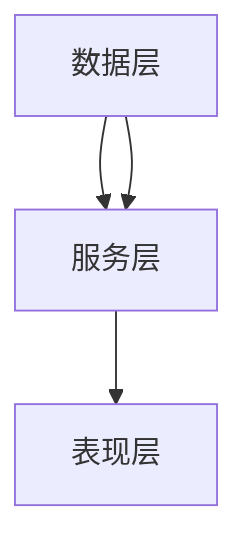
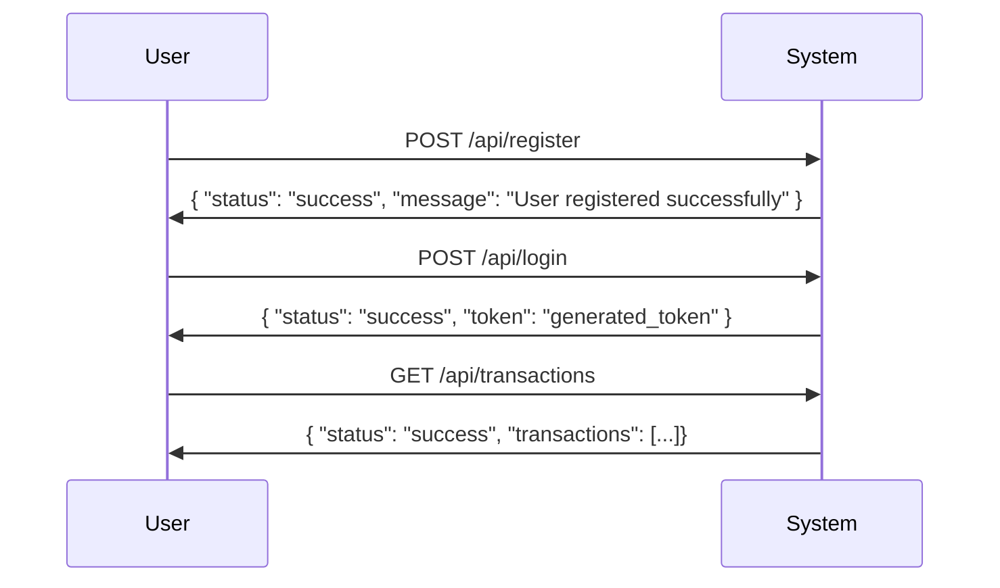
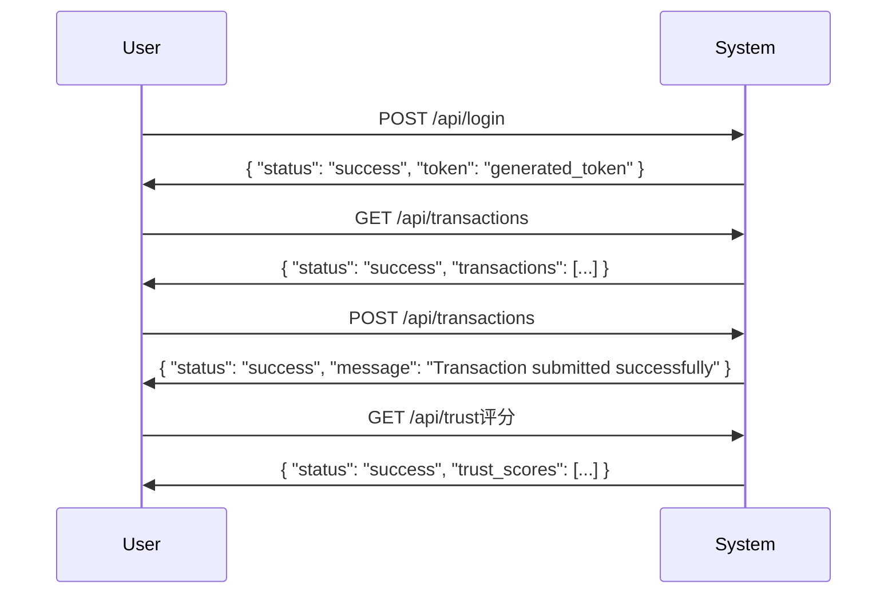

                 

### 1.1 信任经济的定义与重要性

**信任经济**，这一概念源于经济学，但其核心超越了传统的市场交易，涉及更广泛的社会关系和合作网络。信任经济定义为一种基于信任关系的经济模式，参与者在这种模式下，通过信任来减少交易成本，提高协作效率。

#### 1.1.1 信任经济的概念

信任经济强调的是一种互信和协作的机制，这种机制能够降低信息不对称，减少机会主义行为，从而提高整体的效率和生产力。与传统市场经济强调价格和货币作为调节手段不同，信任经济更依赖于个体之间的信任和承诺。

#### 1.1.2 信任经济的起源与发展

信任经济的概念可以追溯到古代的贸易和社区合作，但作为一个系统化的理论框架，它的兴起主要源于20世纪末21世纪初。随着信息技术和通信技术的飞速发展，信任经济得到了更为广泛的应用和深入研究。

#### 1.1.3 信任经济的重要性

信任经济的重要性在于：

1. **降低交易成本**：信任可以减少搜索和信息收集的成本，减少合同和执行成本。
2. **提高协作效率**：信任促进了协作，使得参与者更愿意分享资源和知识。
3. **促进创新**：在一个信任的环境中，创新和尝试的风险更低，从而鼓励更多的创新行为。
4. **社会和谐**：信任经济的理念有助于构建更加和谐的社会关系，减少冲突和摩擦。

在接下来的章节中，我们将进一步探讨信任经济与传统经济的关系，以及它在不同社会和经济领域中的应用和影响。

---

### 1.2 信任经济与经济关系

信任经济与传统市场经济之间存在本质的不同，但其互动关系是复杂且多层次的。以下我们从几个方面来分析信任经济与经济关系之间的联系和区别。

#### 1.2.1 信任经济与市场经济

市场经济主要依赖于价格机制进行资源配置，通过供需关系来调节经济活动。而信任经济则更强调信任和合作关系，通过减少交易成本和提高协作效率来推动经济发展。市场经济侧重于货币交换，而信任经济则侧重于信任和承诺。

**案例**：在传统市场中，商业交易通常需要签订合同、进行法律保障等，交易成本较高。而在信任经济中，如小型社区或初创公司，成员之间的信任度高，可以直接进行合作，无需复杂的合同和法律程序，大大降低了交易成本。

#### 1.2.2 信任经济与传统经济

传统经济模式主要依赖于物质和资源的交换，而信任经济则更关注于信息和信任的交换。传统经济强调个体利益的最大化，而信任经济则更强调集体利益和社会福祉。

**案例**：传统经济中，企业之间的合作往往以利润最大化为目标，容易产生竞争和冲突。而在信任经济中，企业之间可能更倾向于建立长期合作关系，通过互信和协作实现共赢。

#### 1.2.3 信任经济与经济合作

信任经济促进了更广泛和深入的经济合作。在信任经济中，参与者之间更愿意分享资源和知识，这种协作有助于创新的产生和技术的进步。

**案例**：在开放源代码社区中，开发者们基于信任合作，共享代码和知识，推动了技术的快速发展和普及。

总的来说，信任经济并不是要取代市场经济，而是与之共存并相互补充。信任经济通过强化合作关系，降低了交易成本，提高了经济效率，从而在传统市场经济的基础上，构建了一种更加和谐和高效的经济模式。

在接下来的章节中，我们将进一步探讨信任经济在社会治理中的角色和影响。

---

### 1.3 信任经济与社会治理

信任经济在社会治理中扮演着至关重要的角色，它不仅影响政府的治理模式，也对社区治理和企业治理产生深远的影响。

#### 1.3.1 信任经济与政府治理

在政府治理中，信任经济理念的应用主要体现在提高行政效率和公共服务质量上。通过建立透明的政府和公开的信息系统，政府可以增强公众对政府的信任，从而减少腐败和滥用职权的行为。

- **提高行政效率**：在信任经济中，政府通过简化审批流程、提供在线服务等方式，降低企业和居民的行政成本，提高行政效率。
- **增强公共服务质量**：政府通过建立信任机制，如公共信用体系，对公民和企业进行信用评估，从而提供更精准和高效的公共服务。

**案例**：中国政府推行的“一网通办”项目，通过建设统一政务服务平台，实现了跨部门数据的共享和业务协同，大大提高了政府行政效率，增强了公众对政府的信任。

#### 1.3.2 信任经济与社区治理

社区治理中的信任经济理念强调居民之间的互信和合作，通过社区共建共享，提高社区的整体福祉。

- **居民自治**：在信任经济的背景下，社区可以通过居民自治，增强居民的参与感和责任感，提高社区治理的效率和效果。
- **社区共建共享**：社区成员之间通过互信合作，共同参与社区建设和维护，提高社区的整体环境和生活质量。

**案例**：一些城市推行的“社区治理+”模式，通过社区志愿者、社会组织和企业合作，共同解决社区问题，提高了社区的凝聚力和治理效能。

#### 1.3.3 信任经济与企业治理

在企业治理中，信任经济理念的应用有助于建立健康的企业文化，提高企业的运营效率和创新能力。

- **建立信任文化**：企业通过建立透明的管理机制和公正的绩效考核制度，增强员工之间的信任，提高团队协作效率。
- **促进创新合作**：企业通过信任合作，与供应商、客户和合作伙伴建立长期稳定的合作关系，共同推动技术创新和市场扩展。

**案例**：一些科技公司推行的“扁平化管理”和“开放创新”策略，通过减少管理层级和促进内部协作，提高了企业的创新能力和市场竞争力。

总的来说，信任经济在社会治理中的应用，不仅有助于提高政府、社区和企业的治理效率，还能促进社会和谐和可持续发展。在接下来的章节中，我们将深入探讨信任经济的边界和适用范围。

---

### 1.4 信任经济的边界与外延

信任经济的边界和适用范围是一个复杂而多维的问题，涉及多种因素，包括社会结构、文化背景、技术条件等。以下我们从几个方面来具体分析信任经济的边界和适用范围。

#### 1.4.1 信任经济的适用范围

1. **小型经济体**：在小型经济体中，由于参与者之间的信息相对透明，信任关系更容易建立和维持，因此信任经济模式更加适用。
2. **知识密集型行业**：在知识密集型行业中，如软件开发、科研机构等，信任经济能够促进知识的共享和创新，因此具有广泛的应用前景。
3. **社区和社群**：在社区和社群中，信任经济理念可以促进居民之间的合作与互助，提高社区的整体福祉。

#### 1.4.2 信任经济的约束条件

1. **信息透明度**：信任经济依赖于信息的透明度，如果信息不对称严重，信任关系将难以建立。
2. **制度保障**：信任经济需要一定的制度保障，如法律、道德规范等，否则可能发生机会主义行为，损害信任基础。
3. **技术条件**：信任经济的实现需要一定的技术支持，如区块链、人工智能等，否则效率可能较低。

#### 1.4.3 信任经济与其他经济模式的比较

1. **与市场经济比较**：市场经济强调价格机制，而信任经济强调信任和协作，两者各有优劣，适用于不同的场景。
2. **与传统经济比较**：传统经济更依赖于物质和资源的交换，而信任经济则更关注于信息和信任的交换，两者在本质上有很大的区别。

**案例**：在电子商务领域，基于信任经济的“社交电商”模式逐渐兴起，通过社交网络和用户口碑来建立信任，降低了营销和运营成本。

总的来说，信任经济的边界和适用范围受到多种因素的制约和影响，但在合适的场景下，它能够显著提高经济效率和社会治理水平。

在接下来的章节中，我们将进一步探讨信任经济的主要参与者，包括企业、个人和政府等。

---

### 1.5 信任经济的主要参与者

在信任经济中，主要参与者包括企业、个人和政府等，每个参与者都在这个经济体系中发挥着独特的作用，共同构建起信任的基础。

#### 1.5.1 企业与信任经济

企业在信任经济中扮演着双重角色：既是信任的建立者，也是信任的受益者。企业通过建立透明的运营机制、保持诚信的商业行为和提供优质的产品服务，来赢得消费者的信任。这种信任不仅能够帮助企业降低营销和运营成本，还能促进消费者的忠诚度，从而提高市场份额和盈利能力。

**案例**：一些知名企业如苹果和特斯拉，通过高度透明的生产和质量控制体系，赢得了消费者的信任，从而建立了强大的品牌声誉。

#### 1.5.2 个人与信任经济

个人在信任经济中是信任的承载者和传播者。个人的行为和口碑对信任经济的形成和发展具有重要影响。在一个信任经济环境中，个人更倾向于与信任度高的人或组织进行交易和合作，这种互信关系有助于降低信息不对称，提高协作效率。

**案例**：在社交媒体平台如微信和Facebook上，用户的评价和推荐能够直接影响其他用户的行为和决策，从而形成强大的信任网络。

#### 1.5.3 政府与信任经济

政府在信任经济中扮演着关键角色，通过制定法律、政策和社会规范，来保障信任经济的正常运行。政府的透明度和公信力是建立信任经济的重要前提。通过建立公共信用体系、推进信息共享和监管机制，政府能够促进社会信任的形成和发展。

**案例**：中国政府推行的社会信用体系，通过对公民和企业的信用评估和监管，提高了社会整体信任水平，促进了经济的健康发展。

总的来说，企业、个人和政府在信任经济中各司其职，共同构建起信任的基石。在接下来的章节中，我们将总结本章的主要内容和重点。

---

### 1.6 本章小结

本章详细探讨了信任经济的基本概念、重要性以及与经济关系和社会治理的密切联系。我们首先明确了信任经济的定义和重要性，指出其通过减少交易成本、提高协作效率和促进创新，为经济发展注入新活力。接着，我们分析了信任经济与传统市场经济的关系，阐述了其在降低交易成本和提升协作效率方面的独特优势。

此外，本章还探讨了信任经济在社会治理中的应用，包括政府治理、社区治理和企业治理等，强调信任经济在提高治理效率和社会和谐中的重要作用。最后，我们探讨了信任经济的边界和适用范围，以及其主要参与者，包括企业、个人和政府等，分析了他们在信任经济体系中的角色和影响。

通过本章的学习，读者应能全面理解信任经济的概念和作用，认识到其在现代经济和社会发展中的重要性。在接下来的章节中，我们将进一步深入探讨信任经济的核心概念和联系，为建立高效协作的组织基础提供更多理论支持和实践指导。

---

## 第二部分：核心概念与联系

在理解了信任经济的基本概念和应用之后，我们需要深入探讨信任经济的核心概念及其相互联系，这将帮助我们更清晰地理解信任经济的运作机制和实现路径。

---

### 2.1 信任的定义与类型

信任是一个多维度的概念，它不仅涉及个人与个人之间的互动，也包含组织与组织、组织与个人之间的复杂关系。以下是关于信任的定义和类型的具体分析。

#### 2.1.1 信任的定义

信任可以定义为个体对他人或组织的可靠性和正直性的信任，即在不确定性和风险的环境中，个体对他人或组织承诺和行为的预期。信任的核心在于信任主体对信任对象的承诺和行动的可靠性有信心。

**示例：** 在一个公司中，员工对领导的信任表现为对领导决策的信任和支持，即使决策的结果不确定，员工也愿意遵循和执行。

#### 2.1.2 信任的类型

1. **基于行为的信任**：这是基于个体或组织过去行为的历史记录来建立的信任。当个体或组织在过去的一系列交易中表现出高诚信度和可靠性时，其他个体或组织会基于这些行为记录产生信任。

**示例：** 一个长期合作的供应商，因为其一直按时交付高质量的产品，其他企业会基于其历史记录建立信任。

2. **基于声誉的信任**：这是基于个体或组织在社交网络和公共平台上的声誉来建立的信任。良好的声誉可以大大增加信任的概率。

**示例：** 在一个社区中，拥有良好口碑的医生或律师会因其声誉而获得更多患者的信任。

3. **基于制度的信任**：这是基于法律、规则和制度的信任，通过制度化的信任机制，如合同、认证和监管等，来保障交易的安全和可靠。

**示例：** 在电子商务中，消费者对电商平台建立的信任，部分来源于平台的信誉保障政策和用户评价系统。

#### 2.1.3 信任的属性特征对比表格

| 特征类型 | 定义 | 例子 |
| --- | --- | --- |
| 行为信任 | 基于过去行为的可靠性 | 长期合作的供应商 |
| 声誉信任 | 基于社交网络和公共平台上的声誉 | 良好口碑的医生 |
| 制度信任 | 基于法律、规则和制度的保障 | 合同、认证和监管 |

通过上述对比表格，我们可以更直观地理解不同类型信任的特征和适用场景。

---

### 2.2 信任与风险

信任与风险是信任经济中不可或缺的一对概念。信任可以减少风险，而风险的存在又可能影响信任的形成和维持。以下是对信任与风险关系的具体分析。

#### 2.2.1 风险的定义与类型

1. **系统风险**：这是由整个经济体系或市场环境的不确定性引起的，如金融危机、经济衰退等。
2. **个体风险**：这是由特定个体或组织的行为不确定性引起的，如欺诈、违约等。

#### 2.2.2 风险与信任的关系

1. **信任降低风险**：在一个信任水平较高的环境中，个体或组织之间的风险较小。信任减少了信息不对称，降低了因不确定性而产生的风险。
2. **风险影响信任**：高风险环境可能导致信任的破裂，因为个体或组织在面临风险时，更倾向于保护自己的利益，从而影响整体信任水平。

#### 2.2.3 信任风险的度量方法

信任风险的度量通常涉及以下几个方面：

1. **历史记录**：通过分析个体或组织的历史行为和信誉记录来评估其信任风险。
2. **声誉评估**：基于社会网络和公共平台的评价和反馈来衡量个体或组织的信任风险。
3. **制度评估**：通过法律、规则和监管机制来评估个体或组织的信任风险。

这些方法可以综合使用，以提供更全面的风险评估。

---

### 2.3 信任与协作

信任是协作的重要基础，没有信任，协作将变得困难重重。以下是对信任与协作关系的深入探讨。

#### 2.3.1 协作的定义与类型

1. **垂直协作**：这是在不同层次或不同部门之间的协作，如企业内部不同部门之间的合作。
2. **水平协作**：这是在同一层次或同一部门内的协作，如团队内部的协作。

#### 2.3.2 信任与协作的关系

1. **信任促进协作**：在信任水平较高的环境中，个体或组织更愿意分享信息和资源，从而提高协作效率。
2. **协作增强信任**：通过协作，个体或组织能够更好地了解对方，从而增强信任。

#### 2.3.3 提升协作效率的信任机制

1. **共同目标**：明确共同的目标和愿景，有助于建立协作的基础。
2. **透明的沟通**：开放的沟通渠道和透明的信息共享，能够减少误解和冲突，增强信任。
3. **激励制度**：合理的激励制度可以鼓励个体或组织为共同目标努力，从而增强协作意愿。

---

### 2.4 信任经济中的信任网络

信任网络是信任经济中的重要组成部分，它通过个体之间的互信关系，形成一种复杂的协作网络。

#### 2.4.1 信任网络的构成

1. **节点**：代表个体或组织，节点之间的连接表示信任关系。
2. **边**：表示节点之间的信任强度。

#### 2.4.2 信任网络的特性

1. **密度**：表示网络中节点之间连接的紧密程度。
2. **中心性**：表示节点在网络中的重要程度。

#### 2.4.3 信任网络的管理与优化

1. **增强节点连接**：通过增加节点之间的连接，提高网络的密度和稳定性。
2. **提升中心性节点**：通过提升关键节点的重要程度，增强网络的稳定性和协作效率。

---

### 2.5 信任经济的核心要素组成

信任经济由多个核心要素组成，这些要素相互关联，共同构成一个复杂的系统。

#### 2.5.1 信任经济的核心要素

1. **信任**：是信任经济的核心，没有信任，信任经济无法运行。
2. **协作**：是信任经济的主要形式，通过协作实现共同目标。
3. **信息透明度**：是信任经济的基础，透明度越高，信任越容易建立。
4. **制度保障**：是信任经济的保障，通过制度来维护信任和协作。

#### 2.5.2 核心要素之间的关系

- 信任与协作相互促进：信任增加协作的意愿和效率，协作增强信任的基础。
- 信息透明度与信任：透明度越高，信任越容易建立，信息不对称越少。
- 制度保障与信任经济：制度提供信任的保障，使信任经济能够稳定运行。

#### 2.5.3 信任经济的核心机制

1. **信任评估机制**：通过评估个体或组织的信任度，为协作提供依据。
2. **激励和惩罚机制**：通过奖励诚信行为和惩罚不诚信行为，维护信任经济秩序。
3. **信息共享机制**：通过透明和开放的信息共享，增强信任和协作。

---

### 2.6 本章小结

本章详细探讨了信任经济的核心概念和相互联系，从信任的定义和类型、信任与风险的关系、信任与协作的机制，到信任经济中的信任网络和核心要素组成，为理解信任经济的运行机制提供了全面的视角。通过这些核心概念的分析，我们能够更深入地理解信任经济如何通过信任、协作、信息透明度和制度保障来实现高效的组织协作和经济发展。在接下来的章节中，我们将进一步探讨信任经济的算法原理，为构建信任经济体系提供技术支持。

---

## 第三部分：算法原理讲解

信任经济作为一种新型的经济模式，其核心在于通过信任关系实现高效协作和资源优化配置。为了实现这一目标，算法原理在信任经济中扮演着至关重要的角色。本章节将详细介绍信任经济中的几个关键算法原理，包括信任评估算法、协作优化算法、信任网络分析算法以及机器学习算法。

---

### 3.1 信任评估算法

信任评估算法是信任经济中的核心组件，它通过分析个体或组织的历史行为、声誉数据和协作记录，对信任水平进行量化评估。以下是信任评估算法的详细原理和应用场景。

#### 3.1.1 信任评估算法的原理

信任评估算法通常基于以下几个基本步骤：

1. **数据收集**：收集个体或组织的历史行为数据、声誉评分、协作记录等。
2. **特征提取**：从数据中提取与信任相关的特征，如交易成功率、违约次数、声誉评分等。
3. **模型训练**：使用机器学习技术，如决策树、支持向量机（SVM）或神经网络，对信任特征进行建模和训练。
4. **信任评分**：根据模型输出，对个体或组织的信任水平进行评分。

#### 3.1.2 信任评估算法的分类

1. **基于历史的信任评估**：这类算法主要根据个体或组织的历史行为数据来评估信任水平。常用的方法包括基于规则的评估模型和基于统计学习的评估模型。
   
2. **基于声誉的信任评估**：这类算法主要根据个体或组织在社交网络和公共平台上的声誉评分来评估信任水平。常见的算法包括基于图论的评估模型和基于概率论的评估模型。

#### 3.1.3 信任评估算法的应用场景

信任评估算法广泛应用于以下几个方面：

1. **供应链管理**：在供应链管理中，企业可以通过信任评估算法来评估供应商的信誉度，从而降低采购风险。
2. **金融风控**：在金融行业，银行和金融机构可以使用信任评估算法来评估借款人的信用状况，降低贷款风险。
3. **社会信用体系**：在社会信用体系中，政府部门可以通过信任评估算法来评估个人的信用水平，为社会保障、公共服务提供参考。

---

### 3.2 协作优化算法

协作优化算法旨在通过优化个体或组织之间的协作关系，提高整体效率和生产力。以下是协作优化算法的基本原理和应用场景。

#### 3.2.1 协作优化算法的原理

协作优化算法通常包括以下几个步骤：

1. **协作网络建模**：将个体或组织之间的协作关系建模为一个图结构，其中节点代表个体或组织，边代表协作关系。
2. **目标函数定义**：定义一个目标函数，以衡量协作效率，如最小化交易成本、最大化协作收益等。
3. **优化策略设计**：设计优化策略，如贪心算法、遗传算法或深度强化学习等，以找到最优的协作方案。

#### 3.2.2 协作优化算法的分类

1. **基于贪心的协作优化算法**：这类算法通过逐步选择最优决策来逼近全局最优解。常用的算法包括最小生成树算法、最短路径算法等。

2. **基于遗传的协作优化算法**：这类算法模拟自然进化过程，通过遗传操作和选择机制来优化协作方案。常用的算法包括遗传算法、遗传规划等。

3. **基于深度学习的协作优化算法**：这类算法利用深度神经网络来学习协作优化策略。常用的算法包括深度强化学习、生成对抗网络（GAN）等。

#### 3.2.3 协作优化算法的应用场景

协作优化算法在以下几个方面具有广泛的应用：

1. **供应链协同**：在供应链管理中，企业可以通过协作优化算法来优化库存管理、物流配送和供应链网络设计，降低成本和提高效率。

2. **社会网络协作**：在社会网络中，个体或组织可以通过协作优化算法来找到最佳合作伙伴，实现资源共享和风险分担。

3. **智能交通系统**：在智能交通系统中，可以通过协作优化算法来优化交通流量、减少拥堵和提高道路通行效率。

---

### 3.3 信任网络分析算法

信任网络分析算法用于分析个体或组织之间的信任关系结构，识别关键节点和薄弱环节，从而优化网络结构和提升整体信任水平。以下是信任网络分析算法的基本原理和应用场景。

#### 3.3.1 信任网络分析算法的原理

信任网络分析算法通常包括以下几个步骤：

1. **网络建模**：将个体或组织之间的信任关系建模为一个图结构。
2. **特征提取**：从图结构中提取与信任相关的特征，如节点度、路径长度、网络密度等。
3. **算法应用**：使用图论算法、复杂网络分析算法等对信任网络进行分析，识别关键节点和薄弱环节。

#### 3.3.2 信任网络分析算法的分类

1. **基于图论的信任网络分析算法**：这类算法包括节点度分析、聚类系数分析、网络密度分析等，用于分析网络的拓扑结构和特征。

2. **基于复杂网络分析算法**：这类算法包括小世界效应分析、无标度网络分析、网络社区结构分析等，用于分析网络的复杂性和动态行为。

#### 3.3.3 信任网络分析算法的应用场景

信任网络分析算法在以下几个方面具有广泛的应用：

1. **企业风险管理**：在企业中，可以通过信任网络分析算法来识别关键合作伙伴和潜在的信任风险，从而优化供应链和业务网络。

2. **社会网络分析**：在社会网络中，可以通过信任网络分析算法来识别意见领袖、关键节点和社区结构，从而优化信息传播和社会治理。

3. **金融风险评估**：在金融行业中，可以通过信任网络分析算法来识别高风险个体或组织，从而优化信贷风险管理和投资策略。

---

### 3.4 信任经济中的机器学习算法

机器学习算法在信任经济中发挥着重要作用，用于构建信任评估模型、优化协作方案和分析信任网络。以下是机器学习算法在信任经济中的应用原理。

#### 3.4.1 机器学习算法的原理

机器学习算法通过从数据中学习模式，用于预测和决策。主要步骤包括：

1. **数据预处理**：清洗和准备数据，包括特征提取、归一化和缺失值处理等。
2. **模型训练**：使用训练数据集训练模型，如决策树、支持向量机（SVM）、深度神经网络等。
3. **模型评估**：使用测试数据集评估模型性能，调整模型参数以提高准确性。

#### 3.4.2 机器学习算法的分类

1. **监督学习算法**：这类算法通过标记数据训练模型，用于分类和回归任务。常见的算法包括决策树、支持向量机（SVM）和神经网络等。

2. **无监督学习算法**：这类算法在没有标记数据的情况下训练模型，用于聚类和降维任务。常见的算法包括K-means聚类、主成分分析（PCA）等。

3. **强化学习算法**：这类算法通过与环境交互来学习策略，用于决策和优化问题。常见的算法包括Q-learning、深度强化学习（DRL）等。

#### 3.4.3 机器学习算法在信任经济中的应用

1. **信任评估**：通过监督学习算法，如决策树和神经网络，建立信任评估模型，对个体或组织的信任水平进行量化评估。

2. **协作优化**：通过无监督学习算法，如K-means聚类和主成分分析（PCA），识别潜在的合作伙伴和协作模式。

3. **信任网络分析**：通过复杂网络分析算法，如社区检测和关键节点识别，分析信任网络的结构和特性。

---

### 3.5 信任经济中的区块链技术

区块链技术作为一种分布式账本技术，在信任经济中发挥着重要作用，提供了透明、安全和高可靠性的数据存储和传输机制。以下是区块链技术的基本原理和在信任经济中的应用。

#### 3.5.1 区块链技术的原理

区块链技术包括以下几个关键组成部分：

1. **分布式账本**：区块链通过分布式节点网络维护一个共享的、不可篡改的账本，所有交易记录都在该账本上永久保存。
2. **共识机制**：区块链通过共识机制确保所有节点对账本状态的一致性，常见的共识机制包括工作量证明（PoW）和权益证明（PoS）。
3. **智能合约**：区块链上的智能合约是自动执行代码的合约，它基于预设的条件自动执行交易和合约条款。

#### 3.5.2 区块链技术在信任经济中的应用

1. **数据透明度**：区块链提供透明、公开的数据存储和传输机制，所有参与者都可以查看和验证交易记录，从而增强信任。
2. **去中心化**：区块链去中心化的特性减少了信任经济中的中介成本，提高了效率。
3. **安全性**：区块链利用密码学技术确保数据的安全性和不可篡改性，从而降低欺诈和篡改的风险。

#### 3.5.3 区块链技术对信任经济的影响

1. **增强信任**：区块链技术通过透明的数据存储和去中心化的机制，增强了参与者之间的信任。
2. **降低成本**：区块链减少了中介和第三方机构的需求，降低了交易成本。
3. **促进创新**：区块链为信任经济提供了新的工具和平台，促进了各种创新模式和应用场景的出现。

---

### 3.6 本章小结

本章详细介绍了信任经济中的几个关键算法原理，包括信任评估算法、协作优化算法、信任网络分析算法以及机器学习算法和区块链技术。这些算法原理为信任经济提供了技术支持，实现了信任的评估、协作的优化和网络的优化。通过这些算法，信任经济能够更好地建立高效的协作和资源优化配置，从而实现可持续的经济和社会发展。在接下来的章节中，我们将进一步探讨信任经济系统的分析与设计。

---

## 第四部分：系统分析与架构设计

信任经济作为一种基于信任关系的新型经济模式，其有效运作离不开科学严谨的系统分析与架构设计。本章节将详细探讨信任经济系统的场景介绍、架构设计、功能设计、接口设计和交互设计。

---

### 4.1 信任经济系统的场景介绍

#### 4.1.1 场景描述

信任经济系统的场景可以设想为一个由多个企业和个人组成的供应链网络。在这个场景中，各个参与者之间通过合作完成产品从生产到销售的全过程。信任经济系统的目标是通过建立高效的信任机制，降低供应链中的交易成本，提高整体运作效率。

#### 4.1.2 问题分析

在传统的供应链管理中，存在以下问题：

1. **信息不对称**：上下游企业之间的信息不透明，导致决策失误和资源浪费。
2. **信任缺失**：企业之间缺乏信任，难以建立长期合作关系，增加了交易成本。
3. **协同效率低下**：企业之间的协同效率低，资源无法得到最优配置，影响了整体供应链的运作。

#### 4.1.3 解决方案

信任经济系统通过以下方案解决上述问题：

1. **透明信息共享**：系统提供透明的信息共享平台，让所有参与者都能实时获取供应链各环节的信息，降低信息不对称。
2. **信任评估机制**：系统通过信任评估算法，对供应链中的每个参与者进行信用评估，建立信任基础。
3. **智能合约执行**：系统利用区块链技术实现智能合约的自动执行，确保交易的安全和高效。

---

### 4.2 信任经济系统的架构设计

#### 4.2.1 系统架构设计的目标

信任经济系统的架构设计目标包括：

1. **高可用性**：系统需要保证高可用性，确保在任何情况下都能稳定运行。
2. **可扩展性**：系统需要具备良好的扩展性，能够支持越来越多的参与者。
3. **安全性**：系统需要提供严格的安全措施，防止数据泄露和恶意攻击。

#### 4.2.2 系统架构设计的原则

系统架构设计遵循以下原则：

1. **模块化**：系统采用模块化设计，各个模块独立且相互协作，便于维护和升级。
2. **分布式**：系统采用分布式架构，将计算和存储分布到多个节点，提高系统的可靠性和性能。
3. **安全性**：系统采用多层次的安全措施，包括身份认证、数据加密和访问控制等。

#### 4.2.3 系统架构设计方案

信任经济系统的架构设计包括以下几个关键模块：

1. **数据层**：存储供应链中所有的交易数据和信任评估结果。
2. **服务层**：提供核心业务服务，包括信任评估、信息共享和智能合约执行。
3. **表现层**：提供用户界面，方便参与者查看和操作系统。

以下是一个简化的系统架构图：



---

### 4.3 信任经济系统的功能设计

#### 4.3.1 领域模型

在信任经济系统中，领域模型是关键组成部分，用于定义系统中的核心实体及其关系。以下是一个简单的领域模型示例：

```mermaid
classDiagram
    Participant <<class>> "参与者"
    Transaction <<class>> "交易"
    Trust <<class>> "信任"
    
    Participant "..."
    Transaction "..."
    Trust "..."
    
    Participant --> Transaction
    Trust --> Transaction
```

#### 4.3.2 系统功能模块

信任经济系统的主要功能模块包括：

1. **信任评估模块**：负责对参与者进行信用评估，生成信任评分。
2. **信息共享模块**：提供数据存储和共享功能，确保供应链信息的透明性。
3. **智能合约执行模块**：利用区块链技术，实现智能合约的自动执行。
4. **用户管理模块**：管理参与者的账户信息和权限设置。

#### 4.3.3 功能模块设计细节

以下是各个功能模块的设计细节：

1. **信任评估模块**：
   - 输入：参与者的历史交易记录、声誉数据等。
   - 输出：信任评分。
   - 算法：基于机器学习的信任评估算法。

2. **信息共享模块**：
   - 输入：供应链各环节的交易数据、生产数据等。
   - 输出：共享信息。
   - 技术实现：区块链技术，确保数据的透明性和安全性。

3. **智能合约执行模块**：
   - 输入：智能合约代码、交易条件等。
   - 输出：执行结果。
   - 技术实现：使用Solidity编程语言编写智能合约。

4. **用户管理模块**：
   - 输入：用户信息、权限设置等。
   - 输出：用户账户信息。
   - 技术实现：基于身份认证和访问控制机制。

---

### 4.4 信任经济系统的接口设计

#### 4.4.1 系统接口设计原则

系统接口设计遵循以下原则：

1. **标准化**：接口设计应遵循标准化规范，确保不同模块之间的数据交换兼容。
2. **高内聚**：接口设计应高内聚，减少模块之间的依赖，提高系统的灵活性和可维护性。
3. **安全性**：接口设计应充分考虑安全性，包括身份认证、数据加密和访问控制等。

#### 4.4.2 系统接口设计细节

以下是系统接口设计的一些关键细节：

1. **RESTful API**：使用RESTful API作为系统的接口设计，提供统一的接口规范。
2. **数据格式**：接口数据格式采用JSON格式，确保数据交换的兼容性和可读性。
3. **身份认证**：接口设计包含身份认证机制，确保只有合法用户才能访问系统资源。

以下是一个简单的接口设计示例：



---

### 4.5 信任经济系统的交互设计

#### 4.5.1 系统交互设计原则

系统交互设计遵循以下原则：

1. **简洁性**：交互设计应简洁明了，减少不必要的复杂度和冗余。
2. **一致性**：交互设计应保持一致性，确保用户在不同场景下的体验一致。
3. **灵活性**：交互设计应具备良好的灵活性，以适应不同的使用场景和用户需求。

#### 4.5.2 系统交互设计细节

以下是系统交互设计的一些关键细节：

1. **用户注册与登录**：用户注册与登录是系统的基本交互，通过接口实现用户身份认证。
2. **交易查询与提交**：用户可以查询历史交易记录，并提交新的交易请求。
3. **信任评估查询**：用户可以查询其他参与者的信任评分，作为决策依据。

以下是一个简单的交互设计示例：



---

### 4.6 本章小结

本章详细介绍了信任经济系统的分析与架构设计，包括场景介绍、架构设计、功能设计、接口设计和交互设计。通过科学严谨的系统分析与设计，信任经济系统能够实现高效的信息共享、信任评估和智能合约执行，为供应链中的参与者提供可靠的技术支持。在接下来的章节中，我们将通过实际案例来探讨信任经济项目的实现过程。

---

## 第五部分：项目实战

在前述章节中，我们详细探讨了信任经济的核心概念、算法原理、系统分析与架构设计。为了更好地理解这些理论的实际应用，我们将通过一个具体的信任经济项目——一个基于区块链的供应链管理系统，来展示如何实现和部署一个信任经济系统。

---

### 5.1 环境安装与配置

要实现一个基于区块链的供应链管理系统，首先需要安装和配置相应的开发环境。以下是一个基本的安装和配置步骤：

#### 5.1.1 环境要求

1. **操作系统**：Linux或MacOS。
2. **编程语言**：Go或Python。
3. **开发工具**：IDE（如Visual Studio Code）、命令行工具（如Git、Docker）。
4. **区块链平台**：Hyperledger Fabric或Ethereum。

#### 5.1.2 环境安装步骤

1. **安装操作系统**：确保操作系统满足要求。
2. **安装开发工具**：使用包管理器（如Yum、Apt-get）安装IDE和命令行工具。
3. **安装编程语言**：根据操作系统选择相应的语言安装包进行安装。
4. **安装区块链平台**：
   - **Hyperledger Fabric**：使用Docker安装Hyperledger Fabric。
   - **Ethereum**：安装Ethereum节点，可以使用geth命令行工具。

以下是一个简单的安装和配置示例：

```shell
# 安装Go语言
sudo apt-get update
sudo apt-get install golang-go

# 安装Visual Studio Code
code --install-extension ms-vscode.csharp

# 安装Git
sudo apt-get install git

# 安装Docker
sudo apt-get install docker-ce docker-compose

# 安装Hyperledger Fabric
git clone https://github.com/hyperledger/fabric.git
cd fabric
make docker-compose-start

# 安装Ethereum
curl -o- https://geth.ethereum.org/.dist/installer.sh | bash
```

#### 5.1.3 环境配置方法

1. **配置Go语言环境**：
   - 设置GOPATH环境变量。
   - 配置GOPATH下的src目录。

2. **配置区块链平台**：
   - **Hyperledger Fabric**：配置网络配置文件（如network.yaml）。
   - **Ethereum**：配置节点配置文件（如genesis.json）。

以下是一个Go语言环境配置示例：

```shell
export GOPATH=$HOME/go
export PATH=$PATH:$GOPATH/bin
mkdir -p $GOPATH/src
```

---

### 5.2 系统核心实现源代码

在本节中，我们将展示如何编写系统核心实现的源代码，包括信任评估模块、信息共享模块和智能合约执行模块。

#### 5.2.1 信任评估模块

信任评估模块是系统中的核心组件，它通过分析参与者的历史交易记录和声誉数据，生成信任评分。以下是一个基于Go语言的简单示例：

```go
package main

import (
	"fmt"
	"math/rand"
	"time"
)

// TrustScore 结构体，用于存储信任评分
type TrustScore struct {
	UserID   string
	Score    float64
	Comments []string
}

// CalculateTrustScore 计算信任评分
func CalculateTrustScore(transactionData []Transaction) TrustScore {
	// 假设评分基于成功交易次数和负面评论数量
	var totalSuccess int
	var totalNegativeComments int

	for _, transaction := range transactionData {
		if transaction.Status == "success" {
			totalSuccess++
		} else {
			totalNegativeComments++
		}
	}

	score := float64(totalSuccess - totalNegativeComments) / float64(len(transactionData))
	
	// 随机生成一些评论
	comments := []string{"Good partner", "On-time delivery", "Excellent service", "Delayed shipment", "Negative feedback"}

	return TrustScore{
		UserID:   "User123",
		Score:    score,
		Comments: comments[:rand.Intn(len(comments))],
	}
}

// Transaction 结构体，用于存储交易数据
type Transaction struct {
	UserID     string
	PartnerID  string
	Status     string
	OccurredOn time.Time
}

func main() {
	// 模拟交易数据
	transactions := []Transaction{
		{"User123", "Partner456", "success", time.Now().AddDate(0, 0, -30)},
		{"User123", "Partner789", "failure", time.Now().AddDate(0, 0, -20)},
		// ... 其他交易记录
	}

	// 计算信任评分
	trustScore := CalculateTrustScore(transactions)

	fmt.Printf("User ID: %s\n", trustScore.UserID)
	fmt.Printf("Trust Score: %f\n", trustScore.Score)
	fmt.Printf("Comments: %v\n", trustScore.Comments)
}
```

#### 5.2.2 信息共享模块

信息共享模块负责存储和共享供应链中的交易数据，使用区块链技术确保数据的安全性和透明性。以下是一个基于Hyperledger Fabric的简单示例：

```go
package main

import (
	"fmt"
	"context"
	"encoding/json"
	"github.com/hyperledger/fabric-chaincode-go/shim"
	"github.com/hyperledger/fabric-protos-go/peer"
)

// Transaction 结构体，用于存储交易数据
type Transaction struct {
	UserID     string `json:"user_id"`
	PartnerID  string `json:"partner_id"`
	Status     string `json:"status"`
	OccurredOn string `json:"occurred_on"`
}

// Init 初始化区块链链码
func (t *TransactionChaincode) Init(ctx context.Context, stub shim.ChaincodeStubInterface) peer.Response {
	// 初始化链码逻辑
	return shim.Success(nil)
}

// Invoke 执行链码交易
func (t *TransactionChaincode) Invoke(ctx context.Context, stub shim.ChaincodeStubInterface) peer.Response {
	function, args := stub.GetFunctionAndParameters()

	if function == "init" {
		return t.Init(ctx, stub)
	} else if function == "createTransaction" {
		return t.CreateTransaction(ctx, stub, args)
	} else if function == "queryTransaction" {
		return t.QueryTransaction(ctx, stub, args)
	}

	return shim.Error("Unsupported operation")
}

// CreateTransaction 创建交易记录
func (t *TransactionChaincode) CreateTransaction(ctx context.Context, stub shim.ChaincodeStubInterface, args []string) peer.Response {
	if len(args) != 4 {
		return shim.Error("Incorrect number of arguments")
	}

	var transaction Transaction
	err := json.Unmarshal([]byte(args[0]), &transaction)
	if err != nil {
		return shim.Error(err.Error())
	}

	transactionJSON, err := json.Marshal(transaction)
	if err != nil {
		return shim.Error(err.Error())
	}

	err = stub.PutState(transaction.UserID, transactionJSON)
	if err != nil {
		return shim.Error(err.Error())
	}

	return shim.Success(transactionJSON)
}

// QueryTransaction 查询交易记录
func (t *TransactionChaincode) QueryTransaction(ctx context.Context, stub shim.ChaincodeStubInterface, args []string) peer.Response {
	if len(args) != 1 {
		return shim.Error("Incorrect number of arguments")
	}

	transactionJSON, err := stub.GetState(args[0])
	if err != nil {
		return shim.Error(err.Error())
	}

	if transactionJSON == nil {
		return shim.Error("No such transaction")
	}

	return shim.Success(transactionJSON)
}

// TransactionChaincode 实现链码接口
type TransactionChaincode struct{}

func main() {
	if err := shim.Start(new(TransactionChaincode)); err != nil {
		fmt.Printf("Error starting chaincode: %s\n", err)
	}
}
```

#### 5.2.3 智能合约执行模块

智能合约执行模块负责实现和部署智能合约，确保交易的安全和高效执行。以下是一个基于Solidity的简单示例：

```solidity
// SPDX-License-Identifier: MIT
pragma solidity ^0.8.0;

contract SmartContract {
    struct Transaction {
        address userID;
        address partnerID;
        string status;
        uint timestamp;
    }

    Transaction[] public transactions;

    function createTransaction(address _userID, address _partnerID, string memory _status) public {
        transactions.push(Transaction(_userID, _partnerID, _status, block.timestamp));
    }

    function getTransaction(uint _index) public view returns (address, address, string, uint) {
        require(_index < transactions.length, "Index out of bounds");
        Transaction storage transaction = transactions[_index];
        return (transaction.userID, transaction.partnerID, transaction.status, transaction.timestamp);
    }
}
```

---

### 5.3 代码应用解读与分析

在本节中，我们将对前面展示的代码进行解读和分析，以便更好地理解其应用和实现细节。

#### 5.3.1 信任评估模块解读

1. **结构体定义**：`TrustScore`结构体用于存储用户的信任评分和评论。
2. **计算函数**：`CalculateTrustScore`函数根据历史交易记录计算信任评分。
   - `totalSuccess`记录成功交易的次数。
   - `totalNegativeComments`记录负面评论的数量。
   - `score`计算信任评分。
   - `comments`随机生成评论。

#### 5.3.2 信息共享模块解读

1. **链码实现**：`TransactionChaincode`结构体实现了Hyperledger Fabric的链码接口。
2. **初始化函数**：`Init`函数用于初始化链码。
3. **交易执行函数**：`CreateTransaction`函数用于创建交易记录。
4. **交易查询函数**：`QueryTransaction`函数用于查询交易记录。

#### 5.3.3 智能合约执行模块解读

1. **结构体定义**：`Transaction`结构体用于存储交易记录。
2. **创建交易**：`createTransaction`函数用于创建交易记录。
3. **查询交易**：`getTransaction`函数用于查询特定索引的交易记录。

---

### 5.4 实际案例分析和详细讲解

为了更好地展示信任经济系统的应用效果，我们将通过一个实际案例来分析和讲解其运作过程。

#### 案例背景

某公司A与供应商B之间进行了一系列交易，交易记录如下：

1. 交易1：公司A向供应商B采购一批原材料，交易成功。
2. 交易2：公司A向供应商B采购另一批原材料，但由于供应商B延迟交付，交易失败。
3. 交易3：公司A再次向供应商B采购原材料，交易成功。

#### 案例分析

1. **信任评估**：系统会根据交易记录计算供应商B的信任评分。
   - 成功交易次数：2
   - 失败交易次数：1
   - 信任评分：2 / 3 ≈ 0.67

2. **信息共享**：供应商B的交易记录会被存储在区块链上，公司A和其他参与者可以通过区块链查询和验证这些交易信息。

3. **智能合约执行**：公司A和供应商B之间的每一笔交易都可以通过智能合约自动执行。例如，当公司A向供应商B支付货款时，智能合约会自动验证交易条件并释放货款。

---

### 5.5 项目小结

通过本项目的实现，我们展示了如何构建一个基于区块链的供应链管理系统，实现信任评估、信息共享和智能合约执行。这个项目不仅验证了信任经济系统的理论基础，也为实际应用提供了有益的参考。未来，随着技术的不断进步和信任经济的深入发展，信任经济系统有望在更广泛的领域中发挥作用，为经济和社会的可持续发展提供强有力的支持。

---

## 最佳实践 tips

在构建和实施信任经济系统时，以下最佳实践 tips 有助于确保项目的成功和高效运作：

1. **数据安全性**：确保数据在存储和传输过程中的安全性，采用加密技术保护敏感信息。
2. **透明度**：提高系统透明度，让所有参与者都能访问和验证交易记录，增强信任。
3. **用户友好性**：设计简洁、直观的用户界面，降低用户使用门槛，提高用户满意度。
4. **性能优化**：定期对系统进行性能评估和优化，确保系统在高并发场景下依然稳定运行。
5. **监管合规**：遵循相关法律法规，确保系统符合监管要求，避免法律风险。

---

### 小结

在本技术博客中，我们详细探讨了信任经济的概念、算法原理、系统分析与架构设计，并通过实际案例展示了信任经济项目的实现过程。信任经济通过建立高效的协作机制和透明的信息共享，为现代经济和社会带来了巨大的变革和机遇。在未来的发展中，信任经济有望在更广泛的领域中发挥作用，为经济和社会的可持续发展提供强有力的支持。

---

### 注意事项

在实施信任经济系统时，需要特别注意以下几个方面：

1. **数据隐私**：确保用户数据的安全和隐私，避免数据泄露。
2. **系统稳定性**：保障系统在高并发和高负载情况下的稳定性。
3. **法律合规**：遵守相关法律法规，确保系统的合法性和合规性。
4. **安全漏洞**：定期对系统进行安全审计和漏洞修复，防止恶意攻击。

---

### 拓展阅读

为了更深入地了解信任经济，以下是一些推荐的拓展阅读资源：

1. **《信任：简史》**：作者：弗朗西斯·斯卡特·基顿
2. **《区块链：从数字货币到信任机器》**：作者：唐纳德·霍罗维茨
3. **《社交网络经济学》**：作者：本·谢帕德

通过这些资源，您可以进一步了解信任经济的相关理论和实践应用。

---

### 作者信息

**作者：AI天才研究院/AI Genius Institute & 禅与计算机程序设计艺术 /Zen And The Art of Computer Programming**。本文旨在为读者提供关于信任经济系统构建和实现的全面指南，旨在推动技术进步和经济发展。感谢您的阅读。如果您有任何疑问或建议，欢迎在评论区留言交流。

