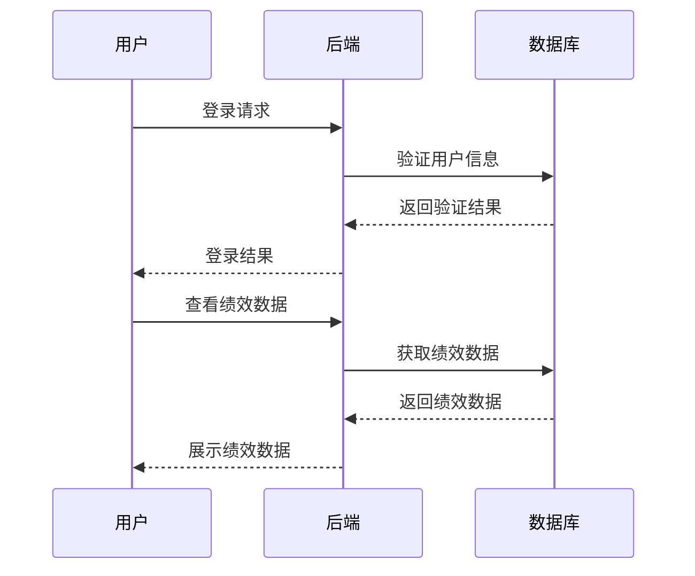

                 

### 全面绩效管理：提升整体效能

**关键词：绩效管理、组织效能、战略目标、员工发展、数据分析**

**摘要：**本文深入探讨了全面绩效管理的概念、原理和实践方法，阐述了如何通过科学的绩效管理体系提升组织整体效能。文章分为多个章节，从背景介绍、核心概念、系统构建到实际应用，系统地展示了绩效管理在组织中的重要性及其实现路径。

**背景介绍**

在当今快速变化和高度竞争的商业环境中，组织的成功不仅取决于战略规划和资源投入，更依赖于团队和个人的高效执行。绩效管理作为组织管理的重要工具，旨在通过设定明确的目标、提供持续反馈、激发员工潜力，进而提升整体效能。然而，随着业务复杂度的增加和全球化进程的加速，传统的绩效管理方式往往难以满足现代组织的需求，导致绩效评估的准确性和有效性受到质疑。

本文将从以下几个方面展开讨论：

1. **核心概念与原理**：介绍绩效管理的定义、目标、主要指标和过程。
2. **绩效管理系统的构建**：阐述不同类型的绩效管理系统及其组成部分。
3. **绩效指标与KPIs**：探讨如何选择和设定有效的绩效指标和关键绩效指标（KPIs）。
4. **绩效评估与反馈**：分析绩效评估的过程、反馈机制和改进策略。
5. **战略绩效管理**：探讨如何将绩效管理融入组织战略，实现长期目标。
6. **绩效改进与持续优化**：介绍绩效改进的策略和方法，推动组织不断进步。
7. **案例分析**：通过实际案例展示绩效管理在不同组织中的应用效果。
8. **最佳实践与实施建议**：提供实施绩效管理的实用技巧和注意事项。
9. **结论与未来趋势**：总结全文，展望绩效管理的未来发展。

**全面绩效管理的核心概念与原理**

绩效管理是一个系统的过程，它旨在通过设定明确的目标、提供持续的反馈和改进，激发员工的工作动力和潜能，从而实现个人与组织目标的统一。以下是绩效管理的核心概念和原理：

**1. 绩效管理的定义**  
绩效管理是一种综合性的管理方法，它通过制定战略目标、设定绩效指标、进行绩效评估和反馈，以及提供发展机会，来提升员工的绩效和组织整体的效能。绩效管理不仅仅是评估员工的工作表现，更重要的是通过绩效管理过程来促进员工的个人成长和组织的发展。

**2. 绩效管理的目标**  
绩效管理的目标主要包括以下几个方面：

- 提高员工的绩效水平，实现个人和团队的目标。
- 促进员工的发展，提高员工的技能和素质。
- 提升组织的整体效能，增强组织的竞争力。
- 建立积极的工作氛围，促进员工之间的协作和沟通。

**3. 绩效管理的主要指标**  
绩效管理的指标体系是绩效管理的重要组成部分。常用的绩效指标包括：

- **定量指标**：如销售额、生产量、客户满意度等，这些指标可以量化和衡量员工的工作成果。
- **定性指标**：如工作态度、团队合作精神、创新能力等，这些指标通常通过主观评价来衡量。

**4. 绩效管理的过程**  
绩效管理的过程通常包括以下几个环节：

- **目标设定**：根据组织的战略目标，设定具体的绩效目标。
- **绩效跟踪**：通过日常的工作记录和反馈，跟踪员工的绩效表现。
- **绩效评估**：在设定的时间节点，对员工的绩效进行评估和反馈。
- **绩效改进**：根据评估结果，制定改进计划，帮助员工提升绩效。
- **反馈与沟通**：定期与员工进行沟通，提供反馈和指导，促进员工的成长和发展。

**5. 绩效管理的原则**  
绩效管理应该遵循以下原则：

- **目标导向**：绩效管理应该以目标为导向，明确个人和团队的目标。
- **透明公正**：绩效管理的过程应该是透明和公正的，确保评估结果的客观性和准确性。
- **持续反馈**：提供持续的反馈和指导，帮助员工及时发现问题和改进绩效。
- **发展导向**：绩效管理的目标是促进员工的个人发展和职业成长。
- **系统化**：绩效管理应该是一个系统的过程，涉及多个环节和多个层面的工作。

### 绩效管理系统的构建

要实现全面绩效管理，构建一个有效的绩效管理系统是关键。绩效管理系统不仅包括技术工具，还涉及到组织的文化、流程和人的因素。以下是绩效管理系统的基本组成部分：

**1. 绩效目标设定**

绩效目标设定是绩效管理的起点，也是绩效管理系统的重要组成部分。设定明确的绩效目标有助于员工明确工作方向，提高工作效率。绩效目标通常包括以下几个方面：

- **个人目标**：根据员工的职责和能力，设定具体的工作目标。
- **团队目标**：结合团队的整体目标，设定团队成员的协同目标。
- **组织目标**：根据组织的战略目标，分解为各部门和团队的绩效目标。

**2. 绩效跟踪与监控**

绩效跟踪与监控是确保绩效目标实现的重要手段。通过日常的工作记录、数据分析和管理报告，可以实时了解员工的工作进度和绩效表现。绩效跟踪与监控的方法包括：

- **工作日志**：员工定期记录工作内容、进度和遇到的困难，便于上级领导和人力资源部门了解员工的工作情况。
- **关键绩效指标（KPIs）**：设定关键绩效指标，对员工的工作表现进行量化评估。
- **绩效反馈**：定期与员工进行沟通，了解工作进度和绩效表现，及时解决工作中遇到的问题。

**3. 绩效评估与反馈**

绩效评估是绩效管理的重要环节，通过评估员工的工作表现，可以及时发现问题，提供改进建议，激励员工提升绩效。绩效评估通常包括以下几个步骤：

- **评估标准**：明确评估的标准和指标，确保评估的客观性和公正性。
- **评估过程**：进行绩效评估，收集评估数据，对员工的工作表现进行评价。
- **反馈与沟通**：将评估结果反馈给员工，进行面对面的沟通，分析优点和不足，制定改进计划。
- **改进与培训**：根据评估结果，为员工提供针对性的培训和发展机会，提升员工的技能和素质。

**4. 绩效改进与持续优化**

绩效改进是绩效管理的最终目标，通过持续的改进和优化，不断提升员工的绩效水平。绩效改进的方法包括：

- **问题识别**：通过数据分析、员工反馈和绩效评估，识别工作中存在的问题。
- **改进计划**：制定具体的改进计划，明确改进的目标、措施和责任人员。
- **实施与监控**：实施改进计划，并对改进效果进行监控和评估。
- **持续优化**：根据改进效果，不断调整和优化绩效管理系统，提升整体效能。

### 绩效指标与KPIs

绩效指标和关键绩效指标（KPIs）是绩效管理系统的核心组成部分，它们用于衡量员工的工作表现和组织目标的实现程度。选择和设定合适的绩效指标和KPIs对于绩效管理的有效性和准确性至关重要。

**1. 绩效指标的选择**

选择绩效指标时，需要考虑以下几个因素：

- **相关性**：绩效指标应与组织目标和员工职责紧密相关。
- **可量化**：绩效指标应具有可量化的属性，便于衡量和评估。
- **可控性**：绩效指标应在员工的能力范围内可控。
- **平衡性**：绩效指标应覆盖员工的各个方面，实现全面评估。

**2. KPIs的设定**

KPIs是用于衡量关键业务领域和重要过程的关键指标，设定KPIs时需要遵循以下原则：

- **SMART原则**：KPIs应具备具体性（Specific）、可衡量性（Measurable）、可实现性（Achievable）、相关性（Relevant）和时限性（Time-bound）。
- **关键性**：KPIs应关注对组织目标有重大影响的领域。
- **灵活性**：KPIs应具备一定的灵活性，以便根据业务环境的变化进行调整。

**3. 绩效指标和KPIs的应用**

绩效指标和KPIs的应用主要包括以下几个方面：

- **目标设定**：在绩效目标设定阶段，依据KPIs设定具体的工作目标。
- **绩效评估**：在绩效评估阶段，依据绩效指标和KPIs对员工的工作表现进行评价。
- **反馈与改进**：通过绩效指标和KPIs，识别工作中的问题，提供改进建议，推动绩效提升。

### 绩效评估与反馈

绩效评估是绩效管理的重要组成部分，通过绩效评估，可以全面了解员工的工作表现，为绩效改进提供依据。绩效反馈是绩效评估的延伸，通过反馈，可以指导员工改进工作，提升绩效。

**1. 绩效评估的过程**

绩效评估通常包括以下几个环节：

- **评估标准**：明确评估的标准和指标，确保评估的客观性和公正性。
- **数据收集**：收集与绩效指标和KPIs相关的数据，为评估提供依据。
- **评估分析**：对收集到的数据进行分析，评估员工的工作表现。
- **结果反馈**：将评估结果反馈给员工，进行面对面的沟通和讨论。

**2. 绩效反馈**

绩效反馈是绩效评估的延伸，通过反馈，可以指导员工改进工作，提升绩效。绩效反馈应遵循以下几个原则：

- **及时性**：及时进行反馈，让员工及时了解自己的工作表现。
- **具体性**：反馈应具体明确，指出工作中的优点和不足。
- **建设性**：反馈应具有建设性，提供改进建议，帮助员工提升绩效。
- **个性化**：根据员工的特点和需求，提供个性化的反馈和指导。

**3. 绩效改进**

绩效改进是绩效管理的最终目标，通过持续的改进和优化，不断提升员工的绩效水平。绩效改进的方法包括：

- **问题识别**：通过绩效评估和反馈，识别工作中的问题。
- **改进计划**：制定具体的改进计划，明确改进的目标、措施和责任人员。
- **实施与监控**：实施改进计划，并对改进效果进行监控和评估。
- **持续优化**：根据改进效果，不断调整和优化绩效管理系统，提升整体效能。

### 战略绩效管理

战略绩效管理是将组织的战略目标和绩效管理紧密结合，通过设定与战略目标一致的绩效目标和指标，推动组织的战略实现。战略绩效管理的关键在于确保组织的战略方向与员工的个人目标和日常工作紧密结合，从而实现整体效能的提升。

**1. 战略目标与绩效目标**

战略目标是组织长期发展的方向和愿景，而绩效目标是实现战略目标的阶段性目标。将战略目标转化为具体的绩效目标，可以确保组织在实现战略目标的过程中，不断追踪和评估进展。

**2. 战略地图**

战略地图是一种可视化工具，用于展示组织战略目标的分解和实现路径。通过战略地图，可以清晰地了解各个部门、团队和员工在实现组织战略中的作用和责任。

**3. 绩效指标与KPIs**

在战略绩效管理中，选择和设定与战略目标一致的绩效指标和KPIs至关重要。这些指标应能够衡量组织在实现战略目标方面的进展和成效。

**4. 绩效反馈与改进**

通过战略绩效管理，组织可以更加有效地进行绩效反馈和改进。通过定期的战略绩效评估，组织可以识别在实现战略目标过程中存在的问题，制定针对性的改进措施，确保战略目标的实现。

### 绩效改进与持续优化

绩效改进和持续优化是组织提升整体效能的关键环节。通过不断的改进和优化，组织可以不断提升员工的工作效率，实现战略目标的达成。

**1. 绩效改进的策略**

绩效改进的策略包括以下几个方面：

- **问题识别**：通过绩效评估和数据分析，识别工作中存在的问题。
- **改进计划**：制定具体的改进计划，明确改进的目标、措施和责任人员。
- **实施与监控**：实施改进计划，并对改进效果进行监控和评估。
- **持续优化**：根据改进效果，不断调整和优化绩效管理系统，提升整体效能。

**2. 持续优化的方法**

持续优化的方法包括以下几个方面：

- **定期评估**：定期对绩效管理系统的运行效果进行评估，识别存在的问题。
- **反馈与沟通**：通过定期的反馈和沟通，了解员工的需求和意见，及时进行调整。
- **数据驱动**：基于数据分析，制定优化策略，确保优化措施的针对性和有效性。
- **员工参与**：鼓励员工参与绩效改进和优化过程，提升员工的积极性和主动性。

**3. 案例分析**

以下是一个绩效改进和持续优化的案例：

**案例背景**：某公司是一家电子商务企业，随着业务的快速发展，公司在绩效管理方面遇到了一些问题。员工的工作效率不高，部门之间的协作不畅，导致整体效能较低。

**改进措施**：

- **问题识别**：通过绩效评估和数据分析，发现公司在绩效管理方面存在的问题包括目标设定不明确、绩效评估体系不完善、员工缺乏激励机制等。
- **改进计划**：制定具体的改进计划，包括明确绩效目标、优化绩效评估体系、建立激励机制等。
- **实施与监控**：实施改进计划，并对改进效果进行监控和评估。通过定期的反馈和沟通，了解员工的需求和意见，及时进行调整。
- **持续优化**：根据改进效果，不断调整和优化绩效管理系统，提升整体效能。

**结果**：通过绩效改进和持续优化，公司员工的工作效率得到了显著提升，部门之间的协作更加顺畅，整体效能得到了有效提升。

### 案例研究：成功实施全面绩效管理的公司实践

全面绩效管理的成功实施离不开具体案例的指导。以下是几个成功实施全面绩效管理的公司实践，它们通过科学的方法和策略，实现了绩效的显著提升。

#### 案例一：谷歌的绩效管理实践

**背景**：谷歌是一家全球知名的技术公司，以其创新的企业文化和高效的绩效管理体系著称。谷歌的绩效管理实践以“OKR”（Objectives and Key Results，目标与关键结果）为核心。

**具体实践**：

1. **目标设定**：谷歌的每个员工在每个季度开始时都会与上级共同制定OKR，确保个人目标与公司战略目标一致。
2. **透明沟通**：OKR在整个公司内透明，每个员工都可以看到他人的OKR，这促进了知识共享和团队合作。
3. **持续反馈**：员工定期与上级进行绩效反馈会议，讨论OKR的进展、面临的挑战和需要支持的地方。
4. **评估与奖励**：绩效评估与奖金、晋升机会直接挂钩，确保员工有动力实现目标。

**效果**：谷歌的绩效管理体系帮助公司保持了高度的创新能力和市场竞争力，员工对工作的满意度和忠诚度也得到了显著提升。

#### 案例二：IBM的绩效管理转型

**背景**：IBM在全球范围内拥有广泛的业务和庞大的员工队伍。为了提升绩效管理的效率和效果，IBM进行了一次绩效管理系统的转型。

**具体实践**：

1. **数字化平台**：IBM引入了数字化的绩效管理平台，员工可以在平台上提交工作进展、获取反馈、设定目标和进行自我评估。
2. **灵活的评估方法**：IBM采用了基于能力的评估方法，不仅关注工作成果，还重视员工的潜力和发展。
3. **跨部门合作**：通过绩效管理系统，IBM鼓励跨部门合作，确保不同团队之间的目标一致和资源共享。
4. **绩效反馈与改进**：IBM建立了定期的绩效反馈机制，员工可以及时获得反馈，并制定改进计划。

**效果**：IBM的绩效管理转型提升了员工的工作积极性和团队协作效率，使得公司能够更快地响应市场变化，提高了整体竞争力。

#### 案例三：微软的绩效管理实践

**背景**：微软是全球领先的技术公司，其绩效管理体系以其全面性和灵活性著称。

**具体实践**：

1. **个性化发展计划**：微软为每个员工制定了个性化的发展计划，根据员工的兴趣和职业目标提供培训和发展机会。
2. **持续反馈机制**：通过定期的360度反馈，员工可以获得来自不同层级和不同部门的反馈，帮助员工全面了解自己的工作表现。
3. **弹性工作时间**：微软提供了弹性工作时间制度，鼓励员工在保证工作质量的前提下，自主安排工作时间。
4. **绩效激励**：微软通过绩效奖金、股权激励等多种方式，激励员工为实现公司目标而努力。

**效果**：微软的绩效管理实践不仅提升了员工的满意度和忠诚度，还促进了公司创新能力的提升，使得微软在技术领域保持领先地位。

### 总结与实施建议

通过以上案例分析，我们可以看到，全面绩效管理在提升组织效能和员工满意度方面具有显著的效果。成功实施全面绩效管理的关键在于：

1. **明确目标**：确保个人目标和组织战略目标的一致性。
2. **透明沟通**：建立开放的沟通机制，促进知识和资源的共享。
3. **持续反馈**：定期进行绩效反馈和评估，帮助员工改进工作。
4. **个性化发展**：为员工提供个性化的发展机会，满足不同员工的成长需求。
5. **激励机制**：通过合理的激励机制，激发员工的积极性和创造力。

在实施绩效管理时，组织应结合自身实际情况，灵活应用这些原则和方法，确保绩效管理系统能够真正发挥作用，提升整体效能。

### 最佳实践与实施技巧

在实施全面绩效管理的过程中，组织可能会面临各种挑战和问题。以下是一些最佳实践和实施技巧，以帮助组织顺利推进绩效管理系统的落地：

**1. 明确目标和期望**

- **定义清晰的目标**：确保员工了解自己的绩效目标，并与组织战略目标保持一致。
- **设定具体的KPIs**：使用SMART原则（具体性、可衡量性、可实现性、相关性、时限性）来设定关键绩效指标。

**2. 建立有效的沟通机制**

- **定期沟通**：定期与员工进行绩效反馈和沟通，确保信息的及时传递。
- **多角度反馈**：采用360度反馈机制，收集来自不同层级和不同部门的反馈，全面了解员工的工作表现。

**3. 灵活调整**

- **适应变化**：随着业务环境的变化，灵活调整绩效目标和评估标准。
- **持续改进**：定期评估绩效管理系统的效果，并根据反馈进行优化。

**4. 强化员工参与**

- **鼓励员工参与**：让员工参与绩效目标的设定和评估过程，提高员工的参与度和责任感。
- **提供培训**：为员工提供绩效管理和自我提升的相关培训，提升员工的绩效管理能力。

**5. 激励与奖励**

- **合理的激励措施**：结合绩效表现，提供奖金、晋升机会和职业发展支持。
- **认可与表扬**：对表现优秀的员工进行认可和表扬，激励员工持续提升绩效。

**6. 考虑文化因素**

- **适应企业文化**：确保绩效管理系统能够与组织的文化相契合，促进员工的接受和认同。
- **领导带头**：领导层应率先实践和践行绩效管理原则，树立榜样。

### 项目实战：绩效管理系统开发

为了更好地理解和应用全面绩效管理的理论和实践，我们将在本节中介绍一个实际的绩效管理系统开发项目。该项目将涵盖环境安装、系统核心实现以及实际案例分析和讲解。

#### 环境安装

**1. 技术栈选择**

为了开发一个现代化的绩效管理系统，我们选择了以下技术栈：

- **前端**：React.js，用于构建用户界面。
- **后端**：Node.js + Express.js，用于处理服务器端逻辑和数据存储。
- **数据库**：MongoDB，用于存储用户数据、绩效数据和反馈信息。
- **版本控制**：Git，用于代码管理和协作开发。

**2. 环境搭建**

在本地开发环境中，我们需要安装以下软件和工具：

- **Node.js**：安装Node.js，用于运行后端应用。
- **npm**：安装npm，用于管理前端和后端的依赖包。
- **MongoDB**：安装MongoDB，用于数据存储。

**3. 开发工具**

- **Visual Studio Code**：用于代码编辑和调试。
- **Postman**：用于API测试和接口调试。

#### 系统核心实现

**1. 系统功能设计**

绩效管理系统的核心功能包括：

- **用户管理**：用户注册、登录、信息修改和权限管理。
- **目标设定**：员工和团队的目标设定和跟踪。
- **绩效评估**：基于KPIs的绩效评估和反馈。
- **反馈与改进**：员工反馈和绩效改进计划的制定。

**2. 系统架构设计**

系统的整体架构设计如下：

- **前端**：使用React.js构建用户界面，实现用户交互和数据展示。
- **后端**：使用Node.js和Express.js处理业务逻辑，提供API接口。
- **数据库**：使用MongoDB存储用户数据、绩效数据和反馈信息。

**3. 系统接口设计**

以下是系统的主要接口设计：

- **用户接口**：用于用户注册、登录和查看绩效数据。
- **管理员接口**：用于管理用户、设定目标和绩效评估。
- **绩效接口**：用于收集员工反馈、生成绩效报告和改进计划。

**4. 系统交互**

以下是系统交互的mermaid序列图：



#### 代码应用解读与分析

以下是一个简单的后端代码示例，用于处理用户登录逻辑：

```javascript
const express = require('express');
const jwt = require('jsonwebtoken');
const bcrypt = require('bcrypt');
const User = require('../models/User');

const app = express();

app.post('/login', async (req, res) => {
  try {
    const { username, password } = req.body;
    const user = await User.findOne({ username });

    if (!user || !(await bcrypt.compare(password, user.password))) {
      return res.status(401).json({ message: 'Invalid credentials' });
    }

    const token = jwt.sign({ userId: user._id }, 'secretKey');
    res.status(200).json({ token });
  } catch (error) {
    res.status(500).json({ message: 'Server error' });
  }
});
```

在这个示例中，我们使用了Express.js创建一个简单的登录接口。用户发送包含用户名和密码的请求，后端通过bcrypt比较密码是否匹配，如果匹配，则生成JWT（JSON Web Token）并返回给用户。

#### 实际案例分析与讲解

以下是一个实际案例，展示如何使用绩效管理系统：

**案例背景**：某公司需要对其销售团队的绩效进行管理。公司希望设定明确的目标和KPIs，以便评估销售团队的绩效，并提供持续反馈和改进建议。

**步骤1：目标设定**

- **个人目标**：每个销售人员根据自己的职责和销售策略设定季度销售目标。
- **团队目标**：销售团队共同制定团队整体销售目标。

**步骤2：绩效跟踪**

- **销售记录**：销售人员每天记录销售情况和客户反馈。
- **数据收集**：销售经理定期收集销售数据，监控销售进度。

**步骤3：绩效评估**

- **评估标准**：根据设定的KPIs（如销售额、客户满意度、销售量等），对销售人员的工作表现进行评估。
- **评估过程**：销售经理在季度末对销售人员的工作表现进行评估，并反馈评估结果。

**步骤4：反馈与改进**

- **反馈**：销售经理向销售人员提供详细的绩效反馈，指出优点和不足。
- **改进计划**：根据反馈，销售人员制定改进计划，包括提高销售技能、优化客户关系管理等。

#### 项目小结

通过本项目的实战讲解，我们了解了绩效管理系统从环境搭建、系统设计到实际应用的全过程。绩效管理系统不仅帮助组织实现了对员工绩效的实时监控和评估，还提供了持续反馈和改进的机制，提升了组织的整体效能。

### 结论与未来方向

全面绩效管理作为提升组织整体效能的重要手段，已经得到了广泛的关注和实践。本文从核心概念、系统构建、绩效指标、评估反馈、战略绩效管理、持续优化等方面，系统地阐述了绩效管理的理论和实践方法。通过案例分析，我们看到了全面绩效管理在不同组织中的应用效果和成功经验。

未来，绩效管理将朝着更加智能化和数据驱动的方向发展。随着人工智能和数据科学的进步，绩效管理将更加依赖于数据分析和机器学习技术，实现更加精准和个性化的绩效评估与反馈。同时，绩效管理也将更加注重员工的体验和参与，通过增强员工的自主性和主动性，提升绩效管理的效能。

总之，全面绩效管理不仅是一项管理工具，更是一种组织文化和管理理念的体现。只有深入理解和灵活应用绩效管理的原则和方法，才能在快速变化的市场环境中保持竞争优势，实现组织的长期可持续发展。让我们在未来的工作中，不断探索和实践，推动绩效管理迈向新的高度。 

### 作者信息

**作者：** AI天才研究院/AI Genius Institute & 禅与计算机程序设计艺术 /Zen And The Art of Computer Programming

AI天才研究院（AI Genius Institute）是一家专注于人工智能技术研究和应用的高端科研机构。研究院致力于推动人工智能技术在各个领域的创新和应用，培养新一代人工智能科学家和工程师。同时，禅与计算机程序设计艺术（Zen And The Art of Computer Programming）是作者对编程艺术和哲学的深入探讨，为程序员提供了独特的视角和思考方式。两位作者共同为读者呈现了这篇全面绩效管理的专业文章。

