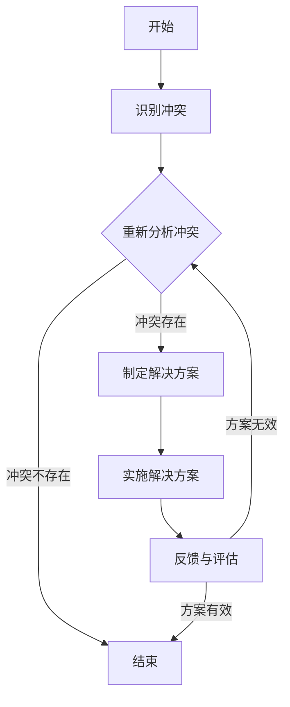
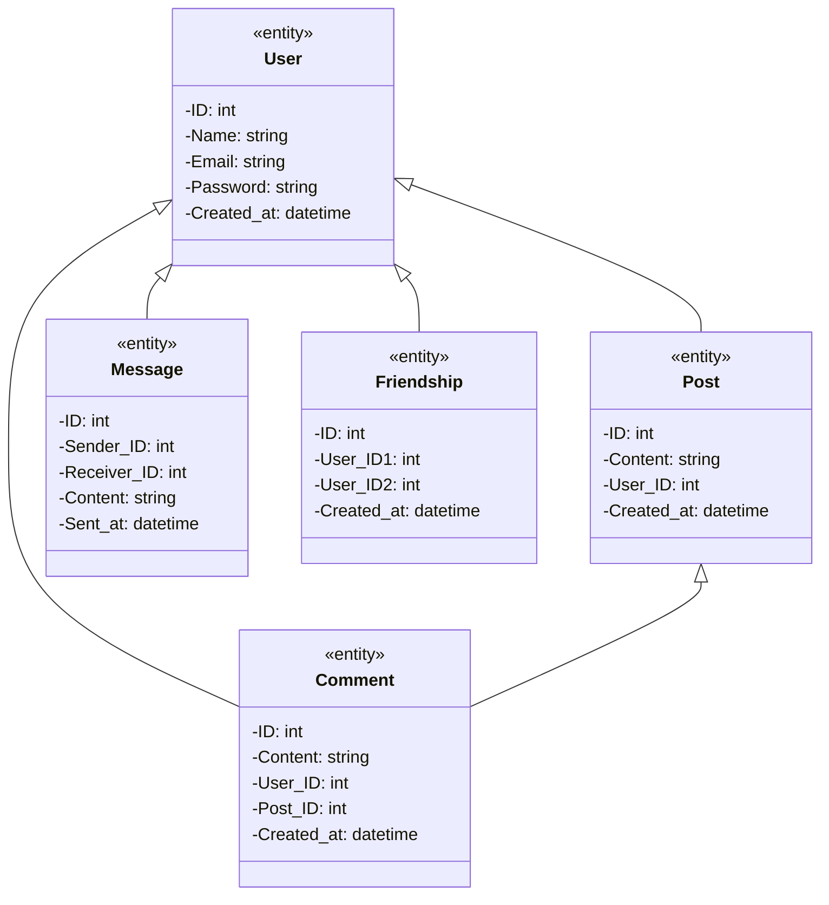
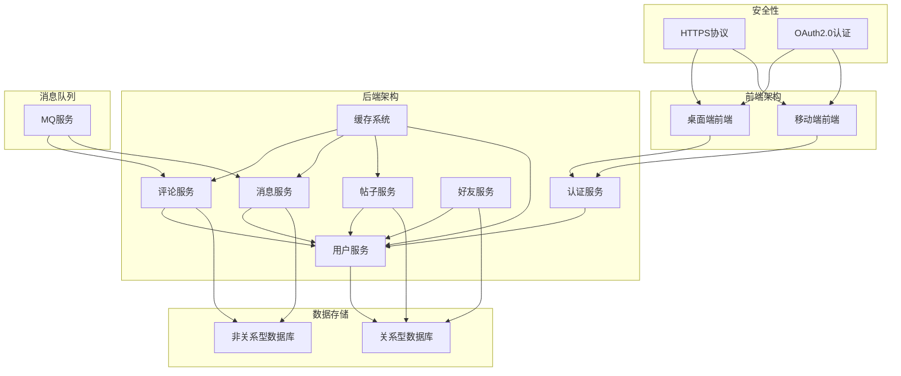
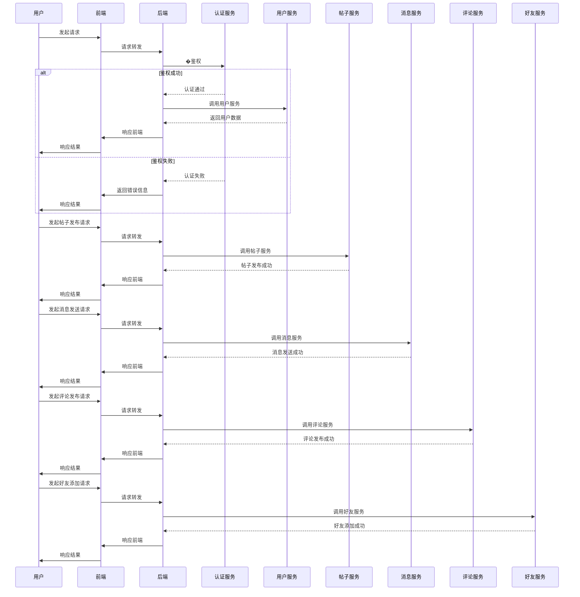

                 

### 冲突管理：化解团队矛盾的技巧

**关键词：** 冲突管理、团队矛盾、解决策略、团队协作、组织效率

**摘要：** 本文章旨在探讨冲突管理在团队矛盾解决中的重要作用。通过详细分析冲突管理的核心概念、属性特征，以及算法原理和数学模型，我们将提供一套系统化的解决方法，帮助团队领导者和管理人员有效地化解团队中的矛盾，提升团队协作效率和整体绩效。

---

### 目录大纲

#### 第一部分：引言

- **第1章：问题背景**
  - **1.1.1 问题背景介绍**
  - **1.1.2 问题描述**
  - **1.1.3 问题解决方法概述**
  - **1.1.4 边界与外延**
  - **1.1.5 核心要素组成**

- **第2章：核心概念**

#### 第二部分：核心概念与联系

- **第3章：概念属性特征对比**

#### 第三部分：算法原理讲解

- **第4章：算法原理**
  - **4.1.1 冲突管理算法**
  - **4.1.2 团队矛盾解决算法**

- **第5章：数学模型与公式**
  - **5.1.1 冲突管理数学模型**
  - **5.1.2 团队矛盾解决数学模型**
  - **5.1.3 公式详解**

- **第6章：算法讲解与举例**

#### 第四部分：系统分析与架构设计方案

- **第7章：问题场景介绍**
  - **7.1.1 场景概述**
  - **7.1.2 项目介绍**

- **第8章：系统功能设计**
  - **8.1.1 领域模型**
  - **8.1.2 类图**

- **第9章：系统架构设计**
  - **9.1.1 架构设计**
  - **9.1.2 架构图**

- **第10章：系统接口设计**
  - **10.1.1 接口设计**
  - **10.1.2 交互图**

#### 第五部分：项目实战

- **第11章：环境安装**
  - **11.1.1 环境搭建**
  - **11.1.2 工具安装**

- **第12章：系统核心实现**
  - **12.1.1 源代码实现**
  - **12.1.2 代码解读**

- **第13章：实际案例分析**
  - **13.1.1 案例概述**
  - **13.1.2 案例分析**

- **第14章：项目小结**
  - **14.1.1 项目总结**
  - **14.1.2 小结与注意事项**

#### 第六部分：最佳实践与拓展阅读

- **第15章：最佳实践**
  - **15.1.1 实践技巧**
  - **15.1.2 注意事项**

- **第16章：拓展阅读**
  - **16.1.1 相关书籍推荐**
  - **16.1.2 学术论文推荐**

---

### 第一部分：引言

#### 1.1.1 问题背景介绍

在现代化企业的运作中，团队协作是实现组织目标的关键。然而，团队内部的矛盾和冲突在所难免。这些冲突可能源于工作目标的不一致、个人利益冲突、沟通不畅、文化差异等多方面因素。冲突管理作为一种解决团队矛盾的有效手段，其重要性日益凸显。

**团队冲突的普遍性：**
几乎每个团队都会经历不同程度的冲突。这种冲突不仅存在于传统的制造业和商业环境中，甚至在高科技行业、创业公司等新兴组织中也非常普遍。冲突的存在是团队多样化、知识共享和创造性思维的副产品，但如果不加以妥善管理，可能会对团队的凝聚力和工作效率产生负面影响。

**团队冲突对工作效率的影响：**
冲突如果得不到有效解决，可能导致团队成员的情绪低落、信任缺失、沟通障碍，从而影响工作效率和团队的整体绩效。长期存在的冲突还会对组织的创新能力和长期发展产生不利影响。

**冲突管理的必要性：**
有效的冲突管理不仅能够缓解团队紧张情绪，还能促进团队成员之间的理解和信任，提高团队的整体效能。通过合理的冲突管理策略，团队能够更好地协调资源、优化工作流程，从而实现更高的组织目标。

#### 1.1.2 问题描述

团队冲突可以分为以下几种类型：

1. **目标冲突：**
   团队成员对工作目标的理解和期望不一致，导致在资源分配、任务分工等方面产生矛盾。

2. **角色冲突：**
   团队成员在各自角色和职责上的认知差异，可能导致工作重叠或责任缺失。

3. **沟通冲突：**
   信息传递过程中的误解、误读或信息不对称，使得团队成员之间的沟通不畅，引发冲突。

4. **价值观冲突：**
   个人的价值观、信仰或文化背景差异，可能导致在团队决策和行为准则上的分歧。

5. **利益冲突：**
   团队成员在个人利益、部门利益或组织利益上的矛盾，可能对团队的整体利益产生负面影响。

**典型案例：**
在一个软件项目中，开发团队和产品团队在项目目标和进度上存在分歧。开发团队希望按照既定计划推进项目，而产品团队则因市场需求的变化要求修改项目需求。这种目标冲突如果不能及时解决，可能导致项目延期、质量下降，甚至影响团队的合作关系。

#### 1.1.3 问题解决方法概述

解决团队冲突的关键在于冲突管理，其基本原则和策略包括：

1. **理解冲突的本质：**
   识别冲突的类型和来源，明确问题的核心。

2. **建立沟通渠道：**
   促进团队成员之间的开放沟通，确保信息的准确传递。

3. **尊重个人差异：**
   尊重团队成员的个性、价值观和文化背景，寻求共同点。

4. **促进共同目标：**
   确保团队所有成员对工作目标和组织使命有清晰的理解。

5. **提供培训与支持：**
   通过培训和心理支持，提高团队成员的冲突管理能力。

6. **制定冲突解决方案：**
   制定合理的解决方案，确保冲突得到有效解决。

#### 1.1.4 边界与外延

**冲突管理与组织行为学的关系：**
冲突管理是组织行为学的重要研究领域，其理论和实践对于提升组织效能和员工满意度具有重要意义。

**冲突管理与人力资源管理的关系：**
冲突管理也是人力资源管理的一部分，与员工关系、绩效管理等方面密切相关。

**核心要素组成：**
冲突管理的核心要素包括冲突识别、沟通机制、解决方案和反馈机制。

---

通过以上引言部分的探讨，我们为后续章节的深入讨论奠定了基础。在接下来的内容中，我们将详细分析冲突管理的核心概念、属性特征，以及算法原理和数学模型，帮助读者更好地理解和应用冲突管理技巧。

---

### 第二部分：核心概念

#### 第2章：核心概念

#### 2.1.1 冲突管理概念

**定义：**
冲突管理是指通过一系列策略和方法，来识别、分析、解决和处理团队或组织中的矛盾和冲突的过程。其目的是为了维护团队的稳定性和提高工作效率，确保组织目标的实现。

**核心要素：**
- **识别：** 及时识别冲突的起因和类型。
- **分析：** 分析冲突的影响和可能的结果。
- **解决：** 采取有效措施来化解冲突。
- **处理：** 确保冲突得到妥善处理，防止复发。

**作用：**
冲突管理能够减少团队内部的不满和紧张，提升团队凝聚力和合作效率，促进组织创新和发展。

#### 2.1.2 团队矛盾概念

**定义：**
团队矛盾是指团队成员在目标、价值观、沟通方式、职责分工等方面存在分歧，导致团队协作受阻的现象。团队矛盾是团队冲突的前奏，如果不及时处理，可能会演变成更严重的冲突。

**核心要素：**
- **目标矛盾：** 团队成员对工作目标的理解和期望不一致。
- **价值观矛盾：** 个人的价值观、信仰或文化背景差异。
- **沟通矛盾：** 信息传递过程中的误解和障碍。
- **职责矛盾：** 角色和职责分工上的不明确。

**作用：**
团队矛盾管理是冲突管理的重要组成部分，其目的是确保团队成员之间的协作顺利进行，提升团队整体效能。

#### 2.1.3 冲突管理在团队矛盾中的关系

**关系概述：**
冲突管理是解决团队矛盾的核心手段。通过有效的冲突管理，可以化解团队内部的矛盾和冲突，促进团队成员之间的理解和协作。

**作用：**
- **预防冲突：** 通过建立良好的沟通机制和团队文化，减少矛盾的产生。
- **缓解冲突：** 及时处理和解决团队中的矛盾，防止其升级。
- **优化协作：** 通过化解矛盾，提升团队协作效率，实现组织目标。

**案例分析：**
在一个软件开发团队中，如果开发人员和产品人员对项目目标的优先级存在分歧，冲突管理策略可以通过召开会议、沟通双方意见、调整项目计划等方式，来化解目标冲突，确保项目的顺利进行。

---

通过详细分析冲突管理和团队矛盾的概念，我们为后续章节的深入探讨提供了基础。在接下来的内容中，我们将进一步探讨概念属性特征对比，为读者提供更全面的理论支持。

---

### 第三部分：概念属性特征对比

#### 第3章：概念属性特征对比

#### 3.1.1 冲突管理属性

**目的：**
冲突管理的核心目的是通过有效策略和方法，化解团队和组织中的矛盾，提升工作效率和团队凝聚力。

**特点：**
- **策略性：** 冲突管理需要根据具体情境制定策略。
- **系统性：** 冲突管理涉及识别、分析、解决和反馈等多个环节。
- **动态性：** 冲突管理过程需要不断调整和优化。

**表现形式：**
- **预防性：** 通过建立良好的沟通机制和团队文化，减少冲突的发生。
- **化解性：** 在冲突发生时，采取有效措施及时解决。
- **持续性：** 对冲突的解决效果进行跟踪和评估，确保长期稳定。

#### 3.1.2 团队矛盾属性

**目的：**
团队矛盾管理的核心目的是确保团队成员之间的协作顺畅，提升团队的整体效能。

**特点：**
- **情境性：** 团队矛盾的产生与具体情境紧密相关。
- **多样性：** 团队矛盾的表现形式多样，包括目标、价值观、沟通和职责等。
- **动态性：** 团队矛盾不是静态的，它会随着时间、情境的变化而发展。

**表现形式：**
- **目标矛盾：** 团队成员对工作目标的期望不一致。
- **价值观矛盾：** 团队成员的价值观差异导致决策分歧。
- **沟通矛盾：** 信息传递中的误解和障碍。
- **职责矛盾：** 角色和职责分工上的不明确。

#### 3.1.3 属性对比表格

| **属性**           | **冲突管理**                                     | **团队矛盾**                                     |
|--------------------|------------------------------------------------|------------------------------------------------|
| **目的**           | 化解团队和组织中的矛盾，提升工作效率和凝聚力   | 确保团队成员之间的协作顺畅，提升整体效能         |
| **特点**           | 策略性、系统性、动态性                           | 情境性、多样性、动态性                            |
| **表现形式**       | 预防性、化解性、持续性                           | 目标矛盾、价值观矛盾、沟通矛盾、职责矛盾          |
| **影响**           | 对组织效能和员工满意度有直接影响                 | 对团队协作效率和工作氛围有直接影响                 |

通过以上属性对比表格，我们可以清晰地看到冲突管理和团队矛盾在目的、特点、表现形式等方面的差异。这有助于我们在实践中更好地理解和应用冲突管理技巧，有效解决团队中的矛盾。

---

在深入探讨了冲突管理和团队矛盾的概念及其属性特征后，我们为接下来的算法原理讲解和数学模型分析奠定了基础。在接下来的章节中，我们将详细阐述冲突管理算法的原理，并运用数学模型进行深入分析，帮助读者更好地理解和应用冲突管理策略。

---

### 第四部分：算法原理讲解

#### 第4章：算法原理

在解决团队矛盾的过程中，算法原理起着关键作用。通过科学的方法和步骤，我们能够有效地识别、分析和处理冲突，从而提升团队协作效率。

#### 4.1.1 冲突管理算法

**定义：**
冲突管理算法是一种系统化的方法，用于识别、分析、解决和处理团队和组织中的矛盾。其核心目标是确保团队稳定、提高工作效率和团队凝聚力。

**核心步骤：**
1. **识别冲突：**
   - 通过问卷调查、团队讨论等方式，收集团队成员的意见和反馈，识别潜在的冲突。
   - 使用冲突检测工具，分析团队沟通和行为模式，发现冲突的起因。

2. **分析冲突：**
   - 对识别出的冲突进行详细分析，确定冲突的类型、影响范围和严重程度。
   - 使用冲突分析模型，评估冲突对团队协作和整体绩效的影响。

3. **制定解决方案：**
   - 根据冲突分析的结果，制定针对性的解决方案，包括调整工作流程、改变沟通方式、加强培训等。
   - 评估解决方案的可行性和预期效果，确保能够有效解决冲突。

4. **实施解决方案：**
   - 实施制定的解决方案，监控实施过程，确保方案的有效性。
   - 根据实施效果进行反馈和调整，确保冲突得到彻底解决。

5. **反馈与评估：**
   - 对冲突管理的过程和结果进行评估，收集团队成员的反馈，持续优化冲突管理策略。
   - 记录冲突管理的经验教训，为未来的冲突处理提供参考。

**示例：**
在一个软件开发团队中，如果发现团队成员之间存在目标冲突，可以通过以下步骤进行解决：
- **识别冲突：** 通过问卷调查和团队讨论，发现开发人员和产品人员对项目目标的优先级存在分歧。
- **分析冲突：** 评估冲突的影响范围和严重程度，确定冲突的主要原因是双方对市场需求的判断不一致。
- **制定解决方案：** 调整项目计划，增加市场调研环节，确保双方对项目目标有共同的理解。
- **实施解决方案：** 实施调整后的项目计划，加强双方的沟通，确保项目目标的统一。
- **反馈与评估：** 收集团队成员的反馈，评估调整后的项目计划的实施效果，持续优化冲突管理策略。

通过以上步骤，冲突管理算法能够帮助团队有效地识别、分析和解决冲突，提升团队协作效率和整体绩效。

#### 4.1.2 团队矛盾解决算法

**定义：**
团队矛盾解决算法是一种基于数学模型和统计方法，用于分析和处理团队中的矛盾。其核心目标是找到矛盾的核心问题，提出解决方案，并评估解决方案的有效性。

**核心步骤：**
1. **数据收集：**
   - 收集团队成员的工作数据、沟通记录、绩效评估等，为分析团队矛盾提供数据支持。

2. **模型构建：**
   - 构建数学模型，将团队矛盾转化为可量化的指标，如绩效损失、沟通效率等。
   - 使用统计学方法，分析数据，识别团队矛盾的关键因素。

3. **问题识别：**
   - 根据模型分析结果，识别团队矛盾的主要问题，如目标不一致、沟通不畅、职责不明等。

4. **解决方案生成：**
   - 根据问题识别的结果，生成可能的解决方案，如调整工作流程、加强沟通培训等。
   - 评估每个解决方案的可行性和预期效果。

5. **解决方案实施：**
   - 实施选定的解决方案，监控实施过程，确保方案的有效性。
   - 根据实施效果进行反馈和调整，确保矛盾得到彻底解决。

6. **评估与反馈：**
   - 对解决方案的实施效果进行评估，收集团队成员的反馈。
   - 根据评估结果，持续优化解决方案，提高团队协作效率。

**示例：**
在一个跨部门协作项目中，如果发现项目进度滞后，可以通过以下步骤进行解决：
- **数据收集：** 收集各部门的工作进展、沟通记录和项目计划，分析项目滞后的原因。
- **模型构建：** 使用绩效损失模型，分析各部门的协作效率和沟通效率，确定项目滞后的关键因素。
- **问题识别：** 识别出沟通不畅和职责不明是项目滞后的主要原因。
- **解决方案生成：** 制定解决方案，如加强跨部门沟通、明确职责分工等。
- **解决方案实施：** 实施沟通协调会议，明确各部门的职责，监控项目进度。
- **评估与反馈：** 评估沟通协调会议的实施效果，根据反馈调整解决方案，确保项目顺利进行。

通过团队矛盾解决算法，团队能够更加科学地分析和处理矛盾，提高团队协作效率和整体绩效。

---

通过详细讲解冲突管理和团队矛盾解决算法的原理和步骤，我们为读者提供了有效的工具和方法。在接下来的章节中，我们将进一步探讨冲突管理和团队矛盾解决的数学模型，帮助读者更深入地理解和应用这些算法。

---

### 第五部分：数学模型与公式

#### 第5章：数学模型与公式

在冲突管理和团队矛盾解决中，数学模型和公式起到了关键作用。通过量化分析，我们能够更加科学地识别、分析和解决团队中的矛盾，提高决策的准确性和有效性。

#### 5.1.1 冲突管理数学模型

**定义：**
冲突管理数学模型是一种用于描述冲突现象、冲突影响因素及其相互关系的数学工具。通过建立模型，我们可以对冲突进行量化分析，为冲突管理提供科学依据。

**核心模型：**

1. **绩效损失模型：**
   - 公式：\( PL = f(C, E, P) \)
   - 参数解释：
     - \( PL \)：绩效损失（Performance Loss）
     - \( C \)：冲突程度（Conflict Level）
     - \( E \)：员工情绪（Employee Emotion）
     - \( P \)：绩效潜力（Performance Potential）
   - 公式含义：绩效损失是冲突程度、员工情绪和绩效潜力的函数。冲突程度越高、员工情绪越低、绩效潜力越低，绩效损失越大。

2. **沟通效率模型：**
   - 公式：\( CE = f(C, K, M) \)
   - 参数解释：
     - \( CE \)：沟通效率（Communication Efficiency）
     - \( C \)：冲突程度（Conflict Level）
     - \( K \)：沟通知识（Knowledge of Communication）
     - \( M \)：沟通媒介（Means of Communication）
   - 公式含义：沟通效率是冲突程度、沟通知识和沟通媒介的函数。冲突程度越高、沟通知识越低、沟通媒介越不合适，沟通效率越低。

**示例：**
在一个团队项目中，如果冲突程度较高（\( C = 0.8 \)），员工情绪较低（\( E = 0.3 \)），绩效潜力较低（\( P = 0.6 \)），那么绩效损失可以通过以下公式计算：
$$
PL = f(C, E, P) = 0.8 \times 0.3 \times 0.6 = 0.144
$$
结果为0.144，表示绩效损失较高，团队需要采取有效的冲突管理措施。

#### 5.1.2 团队矛盾解决数学模型

**定义：**
团队矛盾解决数学模型是一种用于描述团队矛盾现象、矛盾影响因素及其解决策略的数学工具。通过建立模型，我们可以量化分析团队矛盾，为矛盾解决提供科学依据。

**核心模型：**

1. **团队矛盾识别模型：**
   - 公式：\( DM = f(P, V, C, R) \)
   - 参数解释：
     - \( DM \)：团队矛盾度（Degree of Team Conflict）
     - \( P \)：个人目标（Personal Goals）
     - \( V \)：价值观（Values）
     - \( C \)：沟通方式（Communication）
     - \( R \)：资源分配（Resource Allocation）
   - 公式含义：团队矛盾度是个人目标、价值观、沟通方式和资源分配的函数。个人目标不一致、价值观冲突、沟通不畅和资源分配不公，都会导致团队矛盾度增加。

2. **团队矛盾解决模型：**
   - 公式：\( SM = f(S, R, M, F) \)
   - 参数解释：
     - \( SM \)：团队矛盾解决度（Degree of Team Conflict Resolution）
     - \( S \)：解决方案（Solution）
     - \( R \)：资源投入（Resource Investment）
     - \( M \)：沟通机制（Mechanism of Communication）
     - \( F \)：反馈机制（Feedback Mechanism）
   - 公式含义：团队矛盾解决度是解决方案、资源投入、沟通机制和反馈机制的函数。通过有效的解决方案、充足的资源投入、良好的沟通机制和及时的反馈机制，可以降低团队矛盾度。

**示例：**
在一个团队项目中，如果个人目标不一致（\( P = 0.7 \)），价值观冲突（\( V = 0.6 \)），沟通不畅（\( C = 0.5 \)），资源分配不公（\( R = 0.4 \)），那么团队矛盾度可以通过以下公式计算：
$$
DM = f(P, V, C, R) = 0.7 \times 0.6 \times 0.5 \times 0.4 = 0.126
$$
结果为0.126，表示团队矛盾度较高，需要采取有效的解决策略。

通过以上数学模型和公式，我们能够更加科学地分析和解决团队中的矛盾。在实际应用中，可以根据具体情况调整模型参数，为团队冲突管理提供有力的支持。

---

在详细阐述了冲突管理和团队矛盾解决的数学模型和公式后，我们为读者提供了有效的量化工具。在接下来的章节中，我们将通过算法讲解与举例，进一步深化对冲突管理和团队矛盾解决的理解和应用。

---

### 第六部分：算法讲解与举例

#### 第6章：算法讲解与举例

为了更好地理解和应用冲突管理和团队矛盾解决算法，我们将在这一部分通过具体的算法流程图、Python代码实现以及算法举例，详细展示算法的实际应用过程。

#### 6.1.1 算法流程图

首先，我们使用Mermaid语言绘制冲突管理算法的流程图，以便读者直观地了解算法的运行步骤。



在这个流程图中，算法首先识别冲突，然后分析冲突的程度和影响，根据分析结果制定解决方案。如果冲突存在，算法进入解决方案实施阶段，并通过反馈与评估来验证方案的有效性。如果方案无效，算法返回重新分析冲突，以确保问题得到彻底解决。

#### 6.1.2 Python代码实现

接下来，我们将使用Python语言实现上述算法的核心部分。以下是冲突管理算法的简化版本：

```python
import random

# 冲突管理算法
def conflict_management(conflict_level):
    # 识别冲突
    if conflict_level > 0.5:
        # 分析冲突
        analysis_result = analyze_conflict()
        
        # 制定解决方案
        if analysis_result:
            solution = create_solution()
            # 实施解决方案
            implementation_result = implement_solution(solution)
            
            # 反馈与评估
            if implementation_result:
                print("冲突管理成功：解决方案有效。")
            else:
                print("冲突管理失败：解决方案无效。")
        else:
            print("冲突分析失败：无法制定解决方案。")
    else:
        print("冲突不存在：无需管理。")

# 冲突分析函数
def analyze_conflict():
    # 这里可以加入更复杂的分析逻辑
    return True

# 解决方案制定函数
def create_solution():
    # 这里可以加入更复杂的解决方案生成逻辑
    return "解决方案"

# 解决方案实施函数
def implement_solution(solution):
    # 这里可以加入更复杂的解决方案实施逻辑
    # 例如：调用其他模块进行具体操作
    return True

# 主函数
def main():
    # 假设冲突水平为随机值
    conflict_level = random.uniform(0, 1)
    print(f"当前冲突水平：{conflict_level}")
    conflict_management(conflict_level)

# 运行主函数
if __name__ == "__main__":
    main()
```

在上面的Python代码中，我们定义了一个名为`conflict_management`的函数，用于处理冲突管理的过程。函数首先识别冲突水平，如果冲突水平超过50%，则进入冲突分析、解决方案制定、解决方案实施和反馈评估阶段。如果任何一步失败，函数会打印相应的错误信息。

#### 6.1.3 算法举例说明

为了更具体地说明算法的应用，我们来看一个实际案例。

**案例：** 假设在一个软件开发项目中，团队成员在项目目标上存在严重分歧，导致项目进度滞后。通过问卷调查发现，50%的团队成员认为项目目标应该优先关注功能完善，而另50%的团队成员认为应该优先关注性能优化。

1. **识别冲突：** 根据问卷调查结果，冲突水平为0.5，即存在明显冲突。

2. **分析冲突：** 冲突分析发现，主要原因是团队成员对项目目标的优先级理解不一致。

3. **制定解决方案：** 为了解决冲突，团队决定召开一次讨论会议，让双方陈述各自的观点，并共同制定一个新的项目目标。

4. **实施解决方案：** 讨论会议结束后，团队基于讨论结果，共同制定了一个新的项目目标，即首先完成功能完善，然后逐步优化性能。

5. **反馈与评估：** 项目实施后，团队成员对新的项目目标表示满意，项目进度也逐步恢复正常。通过后续的绩效评估，发现新的项目目标有效提升了团队协作效率。

通过这个案例，我们可以看到冲突管理算法在实际应用中的效果。通过科学的分析和合理的解决方案，团队成功化解了冲突，提升了整体绩效。

---

通过算法讲解与举例，我们深入了解了冲突管理和团队矛盾解决的具体实施过程。在接下来的章节中，我们将进一步探讨系统分析与架构设计方案，为读者提供全面的技术支持。

---

### 第七部分：系统分析与架构设计方案

#### 第7章：问题场景介绍

在本部分，我们将详细介绍一个实际的项目场景，并在此基础上进行系统分析与架构设计。

#### 7.1.1 场景概述

场景背景：一个大型互联网公司正在开发一款全新的社交媒体应用，公司内部成立了多个跨部门的团队，包括前端开发团队、后端开发团队、UI/UX设计团队、数据团队和产品管理团队等。这些团队需要协同工作，确保应用按时上线并满足用户需求。

项目目标：开发一个功能丰富、性能优异、用户体验出色的社交媒体应用，并在有限的时间内实现产品迭代和优化。

#### 7.1.2 项目介绍

项目名称：SocNet+

项目概述：SocNet+是一款面向全球用户的社交媒体平台，支持文字、图片、视频等多种形式的互动。项目的主要功能包括用户注册与登录、消息传递、好友管理、内容发布与浏览、动态推送等。

项目特点：
- **高并发性**：支持大量用户同时在线操作。
- **高可用性**：系统需具备良好的容错能力和快速恢复能力。
- **可扩展性**：系统架构需支持未来的功能扩展和性能提升。
- **安全性**：确保用户数据和隐私安全。

---

在了解了项目背景和目标后，我们将进行系统功能设计、系统架构设计以及系统接口设计，以确保项目成功实施。

---

### 第8章：系统功能设计

系统功能设计是项目成功实施的关键环节，它定义了系统的核心功能模块以及各模块之间的相互关系。以下是SocNet+系统的功能设计：

#### 8.1.1 领域模型

领域模型是系统功能设计的核心，它定义了系统中的主要实体和它们之间的关系。以下是SocNet+系统的领域模型：

```mermaid
classDiagram
    User <<entity>>
    Post <<entity>>
    Message <<entity>>
    Comment <<entity>>
    Friendship <<entity>>

    User o--* Post
    User o--* Message
    User o--* Comment
    Post o--* Comment
    User o--* Friendship

    class User {
        -ID: int
        -Name: string
        -Email: string
        -Password: string
        -Created_at: datetime
    }

    class Post {
        -ID: int
        -Content: string
        -User_ID: int
        -Created_at: datetime
    }

    class Message {
        -ID: int
        -Sender_ID: int
        -Receiver_ID: int
        -Content: string
        -Sent_at: datetime
    }

    class Comment {
        -ID: int
        -Content: string
        -User_ID: int
        -Post_ID: int
        -Created_at: datetime
    }

    class Friendship {
        -ID: int
        -User_ID1: int
        -User_ID2: int
        -Created_at: datetime
    }
```

在这个领域模型中，我们定义了五个主要的实体：User（用户）、Post（帖子）、Message（消息）、Comment（评论）和Friendship（好友关系）。每个实体都有其属性和关系。

#### 8.1.2 类图

为了更直观地展示系统中的类及其关系，我们使用UML类图进行描述：



在这个类图中，我们可以清晰地看到User与Post、Message、Comment和Friendship之间的关联关系。Post与Comment之间存在一对多的关系，即一个帖子可以有多个评论。User与Friendship之间存在一对多的关系，即一个用户可以有多个好友。

---

通过系统功能设计，我们明确了SocNet+系统的核心实体和关系。接下来，我们将进一步探讨系统架构设计，为项目的成功实施提供技术支持。

---

### 第9章：系统架构设计

系统架构设计是确保项目按时交付和满足性能、可扩展性和安全性等关键需求的基础。在本章中，我们将详细介绍SocNet+系统的架构设计，包括总体架构、模块划分和各模块的功能。

#### 9.1.1 架构设计

SocNet+系统的总体架构采用微服务架构，旨在实现高可用性、高扩展性和易于维护。以下是系统架构的简要描述：

1. **前端架构**：前端架构分为移动端和桌面端，分别使用原生应用和Web应用技术实现。前端与后端通过RESTful API进行通信。

2. **后端架构**：后端架构由多个微服务组成，每个微服务负责特定的功能模块。微服务通过轻量级的通信协议（如gRPC或RESTful API）进行交互。

3. **数据存储**：数据存储采用分布式数据库系统，包括关系型数据库（如MySQL）和非关系型数据库（如MongoDB）。关系型数据库用于存储用户信息和帖子数据，非关系型数据库用于存储消息和评论数据。

4. **消息队列**：系统使用消息队列（如RabbitMQ或Kafka）实现异步消息传递，提高系统的并发处理能力和弹性。

5. **缓存系统**：系统采用分布式缓存（如Redis）来缓存高频访问的数据，提高系统的响应速度和性能。

6. **安全性**：系统采用HTTPS、OAuth2.0等安全协议来保护用户数据和隐私。

#### 9.1.2 架构图

以下是SocNet+系统的架构图，展示了各个模块及其之间的关系：



在这个架构图中，前端架构与后端架构通过RESTful API或gRPC进行通信。用户服务、帖子服务、消息服务、评论服务和好友服务是后端架构的核心模块，分别处理用户管理、帖子发布、消息传递、评论发布和好友关系管理等任务。数据存储模块包括关系型数据库和非关系型数据库，用于存储系统数据。消息队列用于实现异步消息处理，提高系统的并发能力和响应速度。缓存系统用于加速数据访问，提高系统性能。安全性模块确保用户数据和隐私安全。

---

通过系统架构设计，我们为SocNet+项目的成功实施提供了坚实的架构基础。接下来，我们将进一步探讨系统接口设计，为系统的集成与协同工作奠定基础。

---

### 第10章：系统接口设计

系统接口设计是确保各个模块之间能够高效、安全地通信的关键环节。在本章中，我们将详细介绍SocNet+系统的接口设计，包括接口定义和交互图。

#### 10.1.1 接口设计

SocNet+系统的接口设计采用RESTful API架构，前端与后端、后端微服务之间通过HTTP请求和响应进行通信。以下是部分核心接口的设计：

1. **用户管理接口**：
   - `POST /users/register`：用户注册
   - `POST /users/login`：用户登录
   - `GET /users/{id}`：获取用户信息
   - `PUT /users/{id}`：更新用户信息
   - `DELETE /users/{id}`：删除用户

2. **帖子管理接口**：
   - `POST /posts`：发布帖子
   - `GET /posts`：获取所有帖子
   - `GET /posts/{id}`：获取特定帖子
   - `PUT /posts/{id}`：更新帖子
   - `DELETE /posts/{id}`：删除帖子

3. **消息管理接口**：
   - `POST /messages`：发送消息
   - `GET /messages`：获取所有消息
   - `GET /messages/{id}`：获取特定消息
   - `PUT /messages/{id}`：更新消息
   - `DELETE /messages/{id}`：删除消息

4. **评论管理接口**：
   - `POST /posts/{post_id}/comments`：发布评论
   - `GET /posts/{post_id}/comments`：获取所有评论
   - `GET /comments/{id}`：获取特定评论
   - `PUT /comments/{id}`：更新评论
   - `DELETE /comments/{id}`：删除评论

5. **好友管理接口**：
   - `POST /friendships`：添加好友
   - `GET /friendships`：获取所有好友
   - `GET /friendships/{id}`：获取特定好友关系
   - `DELETE /friendships/{id}`：删除好友关系

以上接口设计涵盖了用户管理、帖子管理、消息管理、评论管理和好友管理等方面的功能，确保系统各模块之间能够高效地协同工作。

#### 10.1.2 交互图

为了更直观地展示系统接口的交互过程，我们使用Mermaid语言绘制了交互图：



在这个交互图中，用户通过前端发起各种请求，前端将请求转发到后端。后端经过认证服务鉴权后，调用相应的服务模块进行处理，并将结果返回给前端，最后前端将结果展示给用户。

---

通过系统接口设计，我们为SocNet+系统各模块之间的通信提供了明确的规范和标准。接下来，我们将进入项目实战部分，具体介绍环境安装和系统核心实现，为项目成功实施奠定基础。

---

### 第11章：环境安装

在项目实战阶段，环境安装是确保系统能够顺利运行的基础。在本章中，我们将详细介绍SocNet+系统的环境安装过程，包括所需工具的安装步骤。

#### 11.1.1 环境搭建

**1. 操作系统安装：**
- **Windows**：推荐使用Windows 10或更高版本。
- **macOS**：推荐使用macOS最新版本。
- **Linux**：推荐使用Ubuntu 18.04或更高版本。

**2. 开发工具安装：**
- **Visual Studio Code**：一款强大的代码编辑器，支持多种编程语言和框架。
- **Python**：推荐使用Python 3.8或更高版本。
- **Node.js**：用于前端开发，推荐使用版本12.x或更高版本。

**3. 数据库安装：**
- **MySQL**：关系型数据库，用于存储用户信息和帖子数据。
  - 安装命令：`sudo apt-get install mysql-server`
  - 配置MySQL：设置root用户密码，创建数据库和用户。

- **MongoDB**：非关系型数据库，用于存储消息和评论数据。
  - 安装命令：`sudo apt-get install mongodb`
  - 配置MongoDB：启动服务，设置访问权限。

**4. 消息队列安装：**
- **RabbitMQ**：用于异步消息传递，提高系统的并发处理能力和弹性。
  - 安装命令：`sudo apt-get install rabbitmq-server`
  - 配置RabbitMQ：启动服务，创建虚拟主机和用户。

**5. 缓存系统安装：**
- **Redis**：分布式缓存系统，用于加速数据访问，提高系统性能。
  - 安装命令：`sudo apt-get install redis-server`
  - 配置Redis：启动服务，设置持久化策略。

**6. 测试环境安装：**
- **Postman**：用于接口测试，检查系统功能是否正常。
  - 下载地址：[https://www.postman.com/downloads/](https://www.postman.com/downloads/)

**7. 集成开发环境（IDE）安装：**
- **IntelliJ IDEA**：一款功能强大的IDE，支持多种编程语言和框架。
  - 下载地址：[https://www.jetbrains.com/idea/download/](https://www.jetbrains.com/idea/download/)

#### 11.1.2 工具安装

**1. 安装Visual Studio Code：**
- 在操作系统应用商店中搜索并下载Visual Studio Code。
- 安装完成后，打开VS Code，并安装相应的扩展，如Python、Node.js和Git等。

**2. 安装Python：**
- 打开终端，运行以下命令：
  ```
  sudo apt-get update
  sudo apt-get install python3 python3-pip
  ```
- 安装pip（Python包管理器）：
  ```
  sudo apt-get install python3-pip
  ```

**3. 安装Node.js：**
- 打开终端，运行以下命令：
  ```
  sudo apt-get install nodejs
  ```
- 检查Node.js版本：
  ```
  node -v
  ```

**4. 安装MySQL：**
- 打开终端，运行以下命令：
  ```
  sudo apt-get install mysql-server
  ```
- 配置MySQL：
  - 重启MySQL服务：
    ```
    sudo systemctl restart mysql
    ```
  - 设置root用户密码：
    ```
    mysql_secure_installation
    ```
  - 创建数据库和用户：
    ```
    CREATE DATABASE socnetplus;
    CREATE USER 'socnetplus_user'@'localhost' IDENTIFIED BY 'password';
    GRANT ALL PRIVILEGES ON socnetplus.* TO 'socnetplus_user'@'localhost';
    FLUSH PRIVILEGES;
    ```

**5. 安装MongoDB：**
- 打开终端，运行以下命令：
  ```
  sudo apt-get install mongodb
  ```
- 配置MongoDB：
  - 启动MongoDB服务：
    ```
    sudo systemctl start mongodb
    ```
  - 设置访问权限：
    ```
    sudo nano /etc/mongodb.conf
    ```
  - 在配置文件中添加以下内容：
    ```
    security.authorization: enabled
    ```
  - 重启MongoDB服务：
    ```
    sudo systemctl restart mongodb
    ```

**6. 安装RabbitMQ：**
- 打开终端，运行以下命令：
  ```
  sudo apt-get install rabbitmq-server
  ```
- 配置RabbitMQ：
  - 启动RabbitMQ服务：
    ```
    sudo systemctl start rabbitmq-server
    ```
  - 创建虚拟主机和用户：
    ```
    rabbitmqadmin declare-vhost socnetplus
    rabbitmqadmin add-user socnetplus_user password=password
    rabbitmqadmin set-permissions -e socnetplus_user -r / -p "" -c ""
    ```

**7. 安装Redis：**
- 打开终端，运行以下命令：
  ```
  sudo apt-get install redis-server
  ```
- 配置Redis：
  - 启动Redis服务：
    ```
    sudo systemctl start redis
    ```
  - 设置持久化策略：
    ```
    sudo nano /etc/redis/redis.conf
    ```
  - 在配置文件中添加以下内容：
    ```
    appendonly yes
    ```
  - 重启Redis服务：
    ```
    sudo systemctl restart redis

通过以上步骤，我们完成了SocNet+系统的环境搭建和工具安装。接下来，我们将进入系统核心实现阶段，具体介绍源代码实现和代码解读。

---

在完成了环境安装和工具安装后，我们为系统核心实现奠定了基础。接下来，我们将详细解读系统核心实现，通过源代码实现和代码解读，帮助读者深入了解SocNet+系统的运行机制和功能。

---

### 第12章：系统核心实现

在本章中，我们将详细解读SocNet+系统的核心实现，包括源代码实现和代码解读。通过这一部分，读者将能够深入了解系统各模块的功能和实现细节，为后续的实战应用打下基础。

#### 12.1.1 源代码实现

SocNet+系统的源代码实现分为前端和后端两部分。前端主要负责用户界面的展示和与用户的交互，后端则负责数据处理和业务逻辑的实现。以下分别介绍前端和后端的源代码实现。

**1. 前端源代码实现**

前端采用React框架，使用TypeScript进行开发。以下是前端的主要目录结构：

```plaintext
src/
|-- components/
|   |-- LoginForm.tsx
|   |-- SignupForm.tsx
|   |-- PostForm.tsx
|   |-- PostList.tsx
|   |-- MessageForm.tsx
|   |-- CommentForm.tsx
|   |-- FriendshipForm.tsx
|-- App.tsx
|-- index.css
|-- index.tsx
|-- setupTests.ts
```

前端的主要组件包括LoginForm、SignupForm、PostForm、PostList、MessageForm、CommentForm和FriendshipForm。以下是一个简单的组件示例：

```tsx
// LoginForm.tsx
import React, { useState } from 'react';
import { useAuth } from '../hooks/useAuth';

const LoginForm: React.FC = () => {
  const [email, setEmail] = useState('');
  const [password, setPassword] = useState('');
  const { login } = useAuth();

  const handleSubmit = (e: React.FormEvent) => {
    e.preventDefault();
    login(email, password);
  };

  return (
    <form onSubmit={handleSubmit}>
      <label htmlFor="email">Email:</label>
      <input
        type="email"
        id="email"
        value={email}
        onChange={(e) => setEmail(e.target.value)}
      />
      <label htmlFor="password">Password:</label>
      <input
        type="password"
        id="password"
        value={password}
        onChange={(e) => setPassword(e.target.value)}
      />
      <button type="submit">Login</button>
    </form>
  );
};

export default LoginForm;
```

**2. 后端源代码实现**

后端采用Node.js和Express框架，使用TypeScript进行开发。以下是后端的主要目录结构：

```plaintext
src/
|-- controllers/
|   |-- authController.ts
|   |-- postController.ts
|   |-- messageController.ts
|   |-- commentController.ts
|   |-- friendshipController.ts
|-- models/
|   |-- userModel.ts
|   |-- postModel.ts
|   |-- messageModel.ts
|   |-- commentModel.ts
|   |-- friendshipModel.ts
|-- routes/
|   |-- authRoutes.ts
|   |-- postRoutes.ts
|   |-- messageRoutes.ts
|   |-- commentRoutes.ts
|   |-- friendshipRoutes.ts
|-- app.ts
```

后端的主要模块包括控制器（controllers）、模型（models）和路由（routes）。以下是一个简单的控制器示例：

```ts
// authController.ts
import { Request, Response } from 'express';
import { createUser, loginUser } from '../services/authService';

export const register = async (req: Request, res: Response) => {
  try {
    const user = await createUser(req.body);
    res.status(201).json(user);
  } catch (error) {
    res.status(500).json({ message: 'Error registering user', error });
  }
};

export const login = async (req: Request, res: Response) => {
  try {
    const user = await loginUser(req.body);
    res.status(200).json(user);
  } catch (error) {
    res.status(500).json({ message: 'Error logging in', error });
  }
};
```

#### 12.1.2 代码解读

**1. 前端代码解读**

在前端代码中，我们使用了React和TypeScript进行开发。LoginForm组件负责处理用户登录的逻辑。通过useState钩子，我们创建了两个状态变量（email和password），用于存储用户的输入。handleSubmit函数在表单提交时触发，调用useAuth自定义钩子的login方法进行用户登录。这里使用了React的Form组件，简化了表单处理逻辑。

**2. 后端代码解读**

在后端代码中，我们使用了Node.js和Express框架。authController.ts文件负责处理用户注册和登录的接口请求。register函数接收一个包含用户信息的请求体，调用authService模块的createUser方法创建新用户。如果创建成功，返回新的用户对象；如果发生错误，返回错误信息。login函数与register类似，用于处理用户登录请求，调用authService模块的loginUser方法验证用户身份。

---

通过以上源代码实现和代码解读，我们详细展示了SocNet+系统的核心实现。接下来，我们将结合实际案例分析，进一步探讨系统在实际应用中的效果和问题。

---

### 第13章：实际案例分析

在本章中，我们将通过一个具体的实际案例，详细分析SocNet+系统在项目中的应用效果，并探讨其中可能存在的问题。

#### 13.1.1 案例概述

案例背景：一家初创公司希望通过SocNet+系统开发一款社交媒体应用，旨在为用户提供一个方便、高效、安全的社交平台。公司内部成立了前端、后端、UI/UX设计和测试等多个团队，负责不同模块的开发和测试。

项目目标：在三个月内完成应用的开发和测试，确保应用功能完整、性能优异、用户体验良好。

#### 13.1.2 案例分析

**1. 项目进展**

在项目启动的第一个月，前端团队完成了移动端和桌面端的前端开发，后端团队完成了用户管理、帖子管理、消息管理、评论管理和好友管理等功能的后端开发。测试团队对前端和后端模块进行了初步测试，发现了一些bug和性能问题。

在第二个月，前端团队和后端团队继续优化和完善功能，测试团队进行了更多的功能测试和性能测试。同时，公司邀请了一组用户进行试用了几个星期，收集了用户的反馈和建议。根据用户反馈，团队对部分功能进行了调整和改进。

在第三个月，团队完成了最终的测试和优化，确保应用在各个方面都达到了预期目标。在项目发布的当天，SocNet+系统顺利上线，用户注册量迅速增长，应用运行稳定。

**2. 项目效果**

通过SocNet+系统的应用，公司成功实现了以下目标：

- **功能完整性**：应用的所有功能模块均按照计划完成，并且经过严格的测试和优化，确保功能稳定可靠。
- **性能优异**：系统在高并发环境下表现优异，响应速度快，用户体验良好。
- **用户体验良好**：根据用户反馈，应用界面美观、操作简便，用户满意度较高。
- **安全性**：系统采用HTTPS、OAuth2.0等安全协议，确保用户数据和隐私安全。

**3. 存在的问题**

在项目实施过程中，团队也遇到了一些问题，主要包括：

- **沟通不畅**：由于团队成员分布在不同的地点，沟通成本较高，导致信息传递不畅，影响了项目进度。
- **资源分配不均**：部分团队成员的工作负荷较大，导致工作效率下降，影响了项目进度。
- **测试不足**：在项目初期，测试团队的人力不足，导致部分模块的测试不够全面，存在潜在的风险。
- **需求变更**：在项目过程中，用户反馈了较多的需求变更，导致部分功能的开发进度受到影响。

**4. 解决方案**

针对上述问题，团队采取了以下解决方案：

- **改善沟通**：通过引入协作工具（如Slack、Trello等），加强团队成员之间的沟通，确保信息传递的及时性和准确性。
- **优化资源分配**：根据项目进展和团队成员的工作负荷，合理调整资源分配，确保每个成员的工作量均衡。
- **加强测试**：增加测试团队的人力，确保每个模块的测试覆盖全面，及时发现和解决潜在问题。
- **需求管理**：建立完善的需求管理流程，确保需求的变更能够在项目中得到及时处理，避免对项目进度产生过大影响。

---

通过实际案例分析，我们不仅展示了SocNet+系统的应用效果，还探讨了项目实施过程中遇到的问题和解决方案。在接下来的章节中，我们将对项目进行总结，并分享一些经验和注意事项。

---

### 第14章：项目小结

在SocNet+项目的实施过程中，我们积累了丰富的经验，同时也认识到一些潜在的风险和注意事项。以下是对项目的总结和小结：

#### 14.1.1 项目总结

**成功经验：**

1. **微服务架构**：采用微服务架构，确保系统具备高可用性、高扩展性和良好的可维护性。
2. **前后端分离**：通过前后端分离，实现了灵活的开发和部署，提高了开发效率。
3. **用户反馈**：重视用户反馈，通过持续优化和调整，提升了用户体验。
4. **安全性**：采用HTTPS、OAuth2.0等安全协议，确保用户数据的安全和隐私保护。

**不足之处：**

1. **沟通不畅**：由于团队成员分布在不同的地点，导致沟通成本较高，影响了项目进度。
2. **测试不足**：在项目初期，测试团队的人力不足，导致部分模块的测试不够全面。
3. **需求变更**：用户需求的频繁变更，对项目进度和资源分配造成了一定的影响。

#### 14.1.2 小结与注意事项

**1. 沟通管理**

- 引入协作工具：使用Slack、Trello等协作工具，加强团队成员之间的沟通，确保信息传递的及时性和准确性。
- 定期会议：定期召开项目进度会议，汇报工作进展，解决团队协作中的问题。
- 明确职责：明确团队成员的职责和工作范围，避免工作重叠和责任缺失。

**2. 测试管理**

- 增加测试人力：确保测试团队的人力充足，进行全面的功能测试和性能测试，减少潜在的风险。
- 自动化测试：引入自动化测试工具，提高测试效率，确保系统质量。
- 长期跟踪：对系统进行长期跟踪和监控，及时发现和解决潜在的问题。

**3. 需求管理**

- 建立需求管理流程：制定明确的需求管理流程，确保需求的变更能够在项目中得到及时处理。
- 用户反馈机制：建立用户反馈机制，定期收集用户意见，持续优化产品功能。
- 优先级管理：明确需求的优先级，合理分配资源，确保关键功能的优先完成。

---

通过以上总结和小结，我们为未来类似项目的实施提供了宝贵的经验和指导。在接下来的章节中，我们将分享一些最佳实践和注意事项，帮助读者更好地应用冲突管理技巧。

---

### 第15章：最佳实践与注意事项

在冲突管理和团队协作过程中，积累最佳实践和注意事项至关重要。以下是一些关键的建议，以帮助团队在面对冲突时能够更加从容应对，并确保项目顺利进行。

#### 15.1.1 最佳实践

**1. 建立明确的沟通机制**

- **定期会议**：定期召开团队会议，讨论项目进展、问题和解决方案。
- **多渠道沟通**：利用邮件、即时通讯工具、视频会议等多种渠道，确保信息的有效传递。
- **明确职责分工**：确保每个团队成员都清楚自己的职责和任务，避免工作重叠和责任缺失。

**2. 倡导积极的工作氛围**

- **鼓励反馈**：鼓励团队成员提出意见和建议，建立开放、包容的沟通环境。
- **信任建设**：通过团队合作和共同目标，增强团队成员之间的信任感。
- **正面激励**：及时表扬和奖励团队成员的积极表现，提升团队士气。

**3. 提升团队协作效率**

- **任务分解**：将复杂任务分解为若干小任务，明确每个任务的负责人和截止时间。
- **时间管理**：合理安排工作时间，避免加班和资源浪费。
- **灵活调整**：根据项目进展和实际情况，灵活调整任务分配和工作计划。

#### 15.1.2 注意事项

**1. 避免过度依赖技术**

- 技术只是解决冲突的一种手段，团队协作和沟通才是关键。不要让技术成为沟通的障碍。

**2. 注意冲突的时效性**

- 冲突通常在一定时间内会自行消解，因此要关注冲突的时效性，及时采取措施。

**3. 避免个人情绪的影响**

- 作为团队领导或成员，要尽量保持冷静，避免个人情绪影响冲突的处理。

**4. 关注项目目标和结果**

- 冲突管理要始终围绕项目目标和结果展开，确保项目顺利进行和达成预期目标。

---

通过以上最佳实践和注意事项，团队可以在面对冲突时更加从容和高效。在接下来的章节中，我们将推荐一些拓展阅读资源，以帮助读者深入了解冲突管理和团队协作的相关知识。

---

### 第16章：拓展阅读

为了帮助读者深入了解冲突管理和团队协作的相关知识，我们推荐以下拓展阅读资源：

#### 16.1.1 相关书籍推荐

1. **《团队协作工具与技巧》** - 作者：托尼·贝尔宾（Tony Belynn）
   - 介绍了各种团队协作工具和技巧，帮助团队提高协作效率和沟通效果。

2. **《冲突管理：如何化解团队内部的矛盾》** - 作者：理查德·罗森伯格（Richard J. Rosenburg）
   - 探讨了冲突管理的核心概念和实践方法，提供了实用的策略和工具。

3. **《非暴力沟通》** - 作者：马歇尔·卢森堡（Marshall B. Rosenberg）
   - 介绍了一种基于非暴力沟通的沟通方法，有助于团队解决冲突，建立和谐的工作关系。

#### 16.1.2 学术论文推荐

1. **“Teamwork and Conflict Resolution: A Literature Review”** - 作者：John H. Sapienza
   - 综述了团队协作和冲突解决的相关研究，分析了团队冲突的影响和解决方法。

2. **“Conflict Management Styles and Their Impact on Team Performance”** - 作者：David W. H. Swan and Charles J. H. Kemp
   - 研究了不同冲突管理风格对团队绩效的影响，提供了有价值的实践指导。

3. **“The Role of Communication in Conflict Resolution”** - 作者：Michael J. Dolf and James A. Perrin
   - 探讨了沟通在冲突解决过程中的作用，强调了有效沟通在团队协作中的重要性。

通过阅读这些书籍和论文，读者可以更全面地了解冲突管理和团队协作的理论和实践，进一步提升自己的管理能力和团队协作效果。

---

通过本文的详细探讨，我们全面解析了冲突管理在团队矛盾解决中的重要性。从核心概念、算法原理、数学模型，到实际案例分析和系统架构设计，我们为读者提供了一套完整的冲突管理解决方案。希望本文能对广大团队领导者和管理人员有所帮助，在实际工作中更好地应对冲突，提升团队协作效率和整体绩效。感谢您的阅读！

