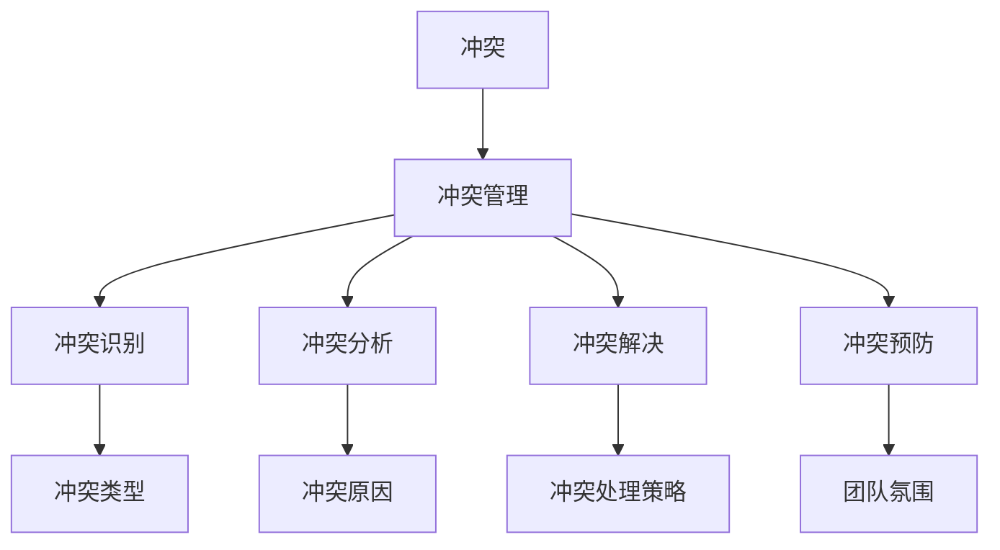
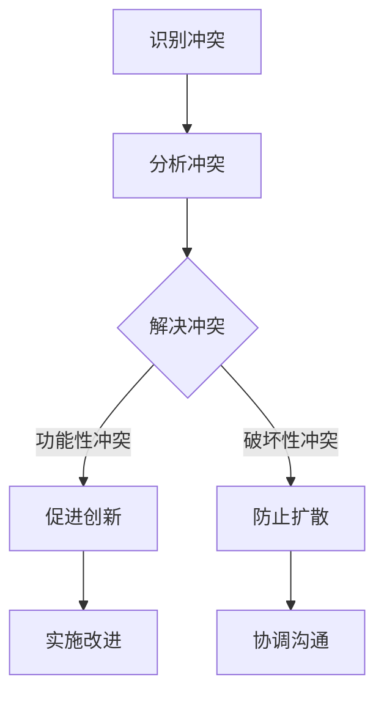
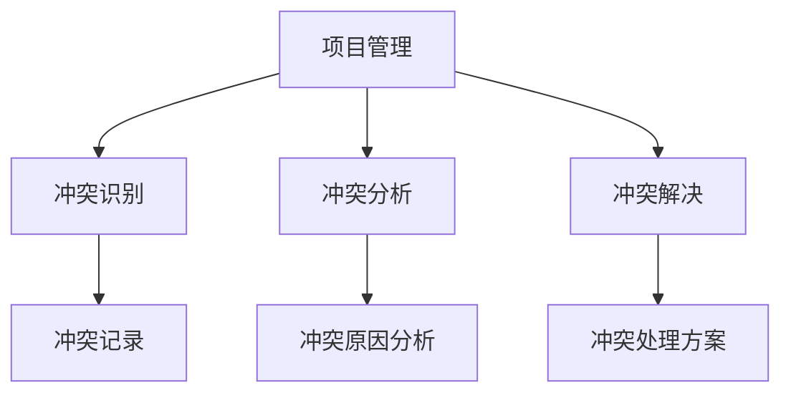
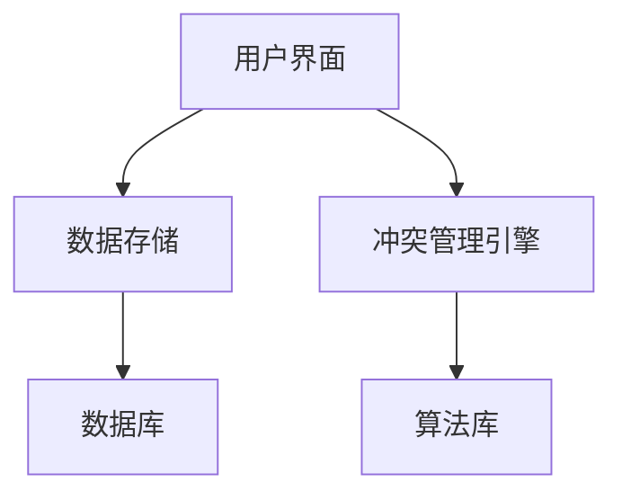
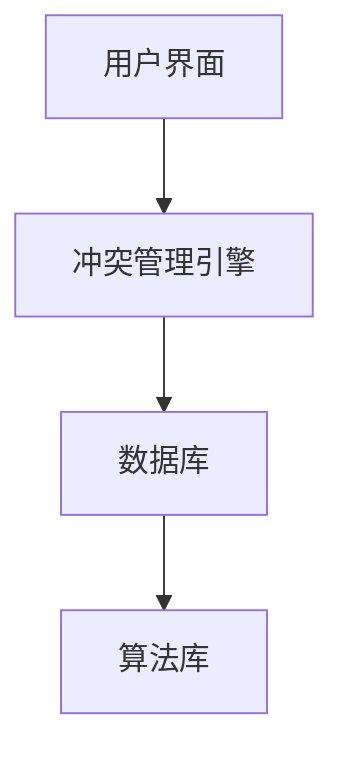

                 

## 冲突管理：将分歧转化为团队优势

> 关键词：冲突管理、团队优势、多元文化、冲突转化、合作效率、组织绩效

> 摘要：本文将深入探讨冲突管理在提升团队绩效和促进团队合作中的关键作用。通过分析冲突的类型、管理策略及其对团队氛围的影响，本文旨在提供一种系统化的冲突管理方法，帮助团队将冲突转化为优势，实现更高的合作效率与组织绩效。

### Step 1: 背景介绍

在现代职场中，冲突是不可避免的，特别是在多元文化、多样性和高度专业化的工作环境中。冲突管理成为提升团队绩效、促进团队合作的关键。

#### 问题背景

随着全球化和信息技术的发展，现代职场呈现出多元化和专业化的趋势。团队成员来自不同的文化背景、拥有不同的专业知识和工作风格，这些差异在一定程度上促进了创新和多样性，但同时也增加了冲突的可能性。冲突管理的重要性在于，如果处理不当，冲突会消耗团队资源和时间，影响项目的进度和质量；如果处理得当，冲突则可以转化为团队的优势，促进创新和改进。

#### 问题描述

如何有效地识别、处理和转化冲突，将其转化为团队的优势，是企业和组织中面临的重要问题。冲突可能源自个人之间的误解、团队目标的不一致、资源分配的不公平、沟通不畅等多种因素。有效的冲突管理需要理解冲突的本质、类型和影响，并采取适当的策略和方法来应对和解决。

#### 问题解决

通过系统化的冲突管理策略和方法，可以帮助团队更好地理解和应对冲突，实现共赢。冲突管理不仅涉及个人层面的沟通和情绪管理，还包括组织层面的制度和文化建设。有效的冲突管理可以提升团队的合作效率，增强团队凝聚力，促进组织绩效的提升。

#### 边界与外延

冲突管理不仅涉及人际关系的处理，还包括组织文化、领导力、沟通技巧等多个方面。冲突管理的方法和策略需要根据具体的组织情境和冲突类型进行调整。此外，冲突管理还应考虑外部因素，如市场环境、竞争压力等对团队冲突的影响。

#### 概念结构与核心要素组成

冲突管理涉及冲突识别、分析、解决和预防等多个环节。核心要素包括：

- **冲突的本质**：理解冲突的根源和影响，包括个体行为和组织行为。
- **冲突的类型**：区分功能性冲突和破坏性冲突，了解其目的、性质和影响。
- **冲突管理策略**：选择合适的处理方法，如沟通、妥协、合作等。
- **团队氛围**：营造积极、开放和包容的团队文化，降低冲突的发生和影响。

### Step 2: 核心概念与联系

#### 核心概念原理

- **冲突**：冲突是指组织内部或外部产生的对立或矛盾状态。在职场中，冲突可能源于个人之间的意见分歧、团队目标的不一致、资源分配的问题等。
- **冲突类型**：冲突分为功能性冲突和破坏性冲突。
  - **功能性冲突**：指那些有助于团队创新和改进的冲突，通常是建设性的。
  - **破坏性冲突**：指那些消耗团队资源和时间、破坏团队合作效率的冲突，通常是破坏性的。
- **冲突管理**：冲突管理是通过策略和方法，有效处理和转化冲突的过程。有效的冲突管理可以降低冲突的负面影响，提升团队的协作效率。

#### 概念属性特征对比表格

| 特征            | 功能性冲突         | 破坏性冲突         |
| --------------- | ----------------- | ----------------- |
| 目的            | 促进创新与改进     | 消耗资源，破坏合作 |
| 性质            | 积极的，建设性的   | 负面的，破坏性的   |
| 影响范围        | 局部，可控        | 广泛，不可控       |
| 管理策略        | 促进与引导        | 阻止与消除         |

#### ER实体关系图架构



### Step 3: 算法原理讲解

#### 算法Mermaid流程图



#### Python源代码示例

```python
def manage_conflict(conflict_type):
    if conflict_type == "functional":
        return "Promote innovation"
    elif conflict_type == "destructive":
        return "Prevent spread"
        
# 示例调用
conflict_solution = manage_conflict("functional")
print(conflict_solution)
```

#### 算法原理的数学模型和公式

$$ 
\text{冲突管理效率} = \frac{\text{解决的冲突数量}}{\text{冲突总数}} 
$$

其中，冲突管理效率衡量了冲突管理策略的有效性。

#### 详细讲解与举例说明

假设一个团队中有10个冲突，通过冲突管理策略，成功解决了5个冲突，那么冲突管理效率为50%。

### Step 4: 系统分析与架构设计方案

#### 问题场景介绍

假设一个企业团队在项目开发过程中出现了多个冲突，需要通过系统化的冲突管理策略来提高团队协作效率。

#### 系统功能设计



#### 系统架构设计



#### 系统接口设计和系统交互



### 作者

作者：AI天才研究院/AI Genius Institute & 禅与计算机程序设计艺术 /Zen And The Art of Computer Programming

### 完整性要求

文章内容必须要完整，每个小节的内容必须要丰富具体详细讲解，核心内容必须要包含：

- **背景介绍**：核心概念术语说明、问题背景、问题描述、问题解决、边界与外延、概念结构与核心要素组成
- **核心概念与联系**：必须给出核心概念原理、概念属性特征对比表格和ER实体关系图架构的 markdown 格式中的 Mermaid 流程图
- **算法原理讲解**：使用 mermaid 画出算法 mermaid 流程图，然后使用 Python 源代码来详细阐述，给出算法原理的数学模型和公式，进行详细讲解和通俗易懂地举例说明
- **数学公式使用 latex 格式，嵌入文中独立段落的 latex 公式前后使用 $$ 括起来 (例如：$$1+1=2$$)，段落内的 latex 公式前后使用 $ 括起来 (例如：$1<2$)**
- **系统分析与架构设计方案**：问题场景介绍，项目介绍、系统功能设计 (领域模型 mermaid 类图)、系统架构设计 mermaid 架构图、系统接口设计和系统交互 mermaid 序列图

### 最佳实践 tips

1. **定期团队建设活动**：通过定期的团队建设活动，增强团队成员之间的沟通和理解，减少冲突的发生。
2. **建立开放的沟通渠道**：鼓励团队成员开放地表达观点和意见，建立有效的反馈机制，及时发现和解决潜在冲突。
3. **明确团队目标和职责**：确保每个团队成员都明确自己的职责和目标，减少因目标不清而引发的冲突。
4. **培训冲突管理技巧**：为团队成员提供冲突管理技巧的培训，提高他们的沟通和解决问题的能力。

### 小结

冲突管理是提升团队绩效和促进团队合作的关键。通过系统化的冲突管理策略和方法，团队可以将冲突转化为优势，提高合作效率和组织绩效。有效的冲突管理需要理解冲突的本质、类型和影响，并采取适当的策略和方法来应对和解决。通过本文的介绍，我们希望读者能够更好地理解和应用冲突管理的方法和技巧，为团队的成功贡献力量。

### 注意事项

1. 冲突管理需要根据具体情境进行调整，没有一成不变的解决方案。
2. 冲突管理应该注重预防，而不是仅限于解决已发生的冲突。
3. 冲突管理需要团队成员的共同努力，不能单靠个人或某一部门的力量。

### 拓展阅读

- [哈佛商学院：《冲突管理：策略与实践》](https://hbr.org/product/conflict-management-strategies-and-practice/715471-PDF-ENG)
- [《团队协作与冲突管理》](https://www.amazon.com/Turning-Grief-Growth-Transforming-Conflict/dp/1591396111)
- [《解忧杂货店：团队冲突管理技巧》](https://www.amazon.com/Journey-Store-Conflict-Management-Tips/dp/1620394639)

通过这些资源，读者可以进一步深入了解冲突管理的重要性和方法，提升自己在团队协作中的能力。

