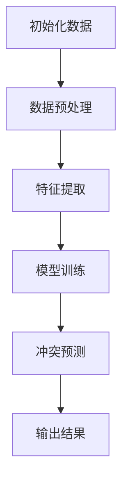
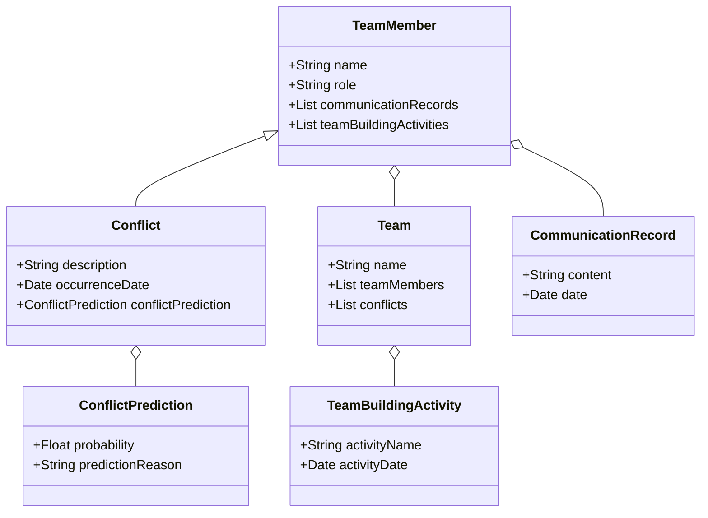
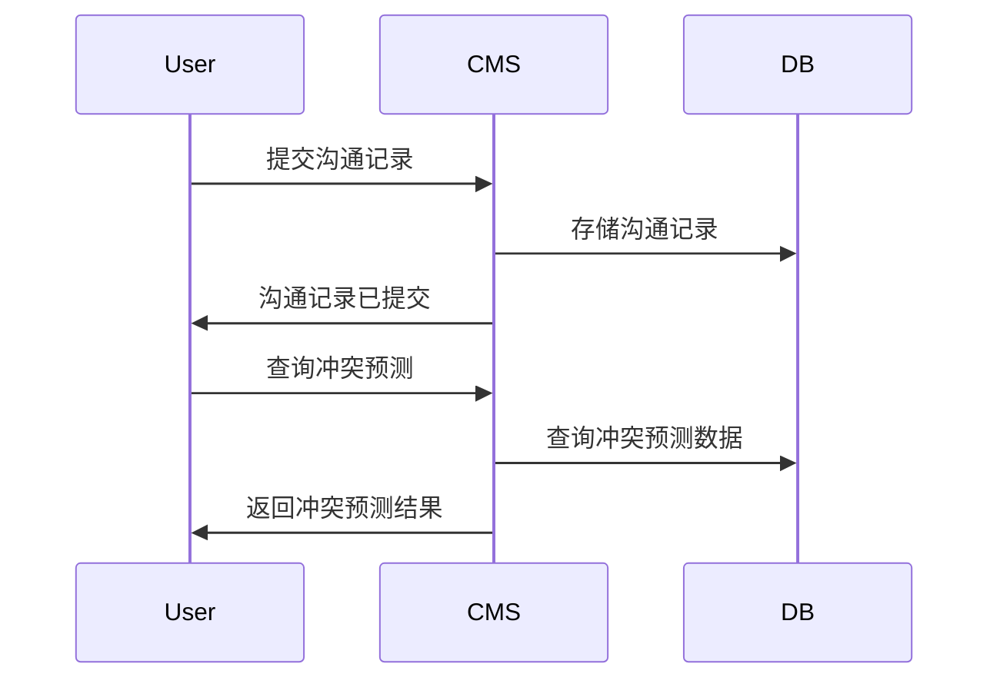
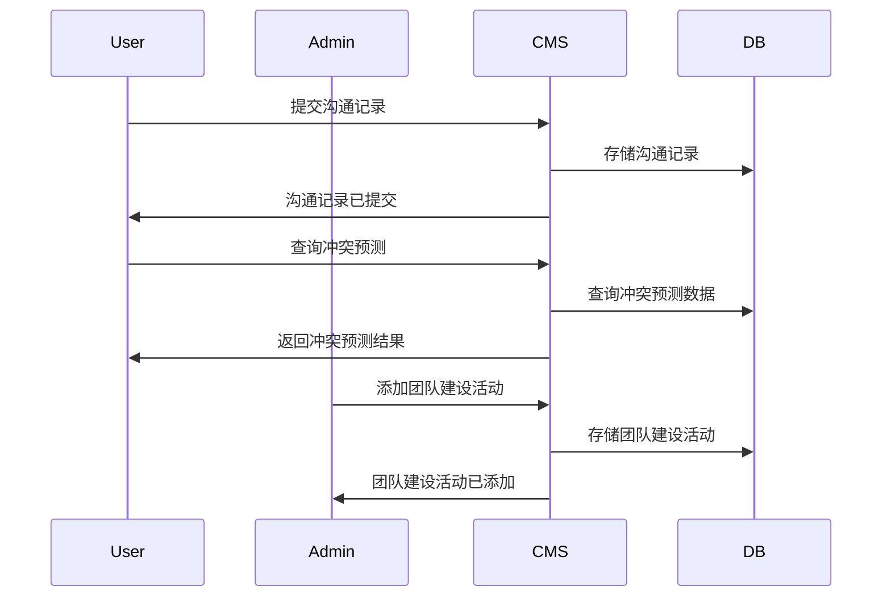

                 

# 冲突解决：化解团队矛盾的技巧

关键词：团队管理、冲突解决、沟通技巧、利益平衡、团队建设

摘要：在高度互联和竞争激烈的商业环境中，团队内部的矛盾和冲突是常见且不可避免的。本文旨在探讨团队内部冲突的解决策略和方法，包括冲突类型分析、冲突原因探讨、冲突解决策略介绍以及团队建设的重要性，为读者提供实用的指导，提升团队协作效率和整体幸福感。

## 第一部分：背景介绍

### 第1章：问题背景与问题描述

#### 1.1.1 问题背景

在当今高度互联和竞争激烈的商业环境中，团队内部的矛盾和冲突是常见且不可避免的。这些冲突可能源于目标不一致、沟通不畅、资源争夺、个人价值观差异等多种因素。如果得不到妥善解决，这些冲突会严重影响团队的协作效率和工作氛围，甚至可能导致项目失败和团队解散。

#### 1.1.2 问题描述

冲突解决不仅涉及技术层面，还涉及人际关系和心理学层面。尽管许多组织和团队都认识到解决冲突的重要性，但往往缺乏有效的解决策略和技巧。本书的目的是提供一系列实用的技巧和方法，帮助读者理解和应对各种团队冲突，从而提升团队绩效和整体幸福感。

#### 1.1.3 问题解决

通过深入分析冲突的根源和类型，本书将介绍多种策略和技巧，包括沟通技巧、利益平衡、决策制定、团队建设等，帮助读者有效地预防和解决团队冲突。

#### 1.1.4 边界与外延

虽然本书主要关注团队内部的冲突解决，但所提供的技巧和方法也可以应用于组织间的冲突处理。此外，书中内容不仅适用于传统工作团队，也适用于虚拟团队和跨文化团队等特殊情况。

#### 1.1.5 概念结构与核心要素组成

本书的核心概念结构包括以下几个方面：

1. **冲突类型**：介绍常见的冲突类型，如任务冲突、关系冲突、过程冲突等。
2. **冲突原因**：分析导致冲突的主要因素，如目标不一致、资源有限、沟通不畅等。
3. **冲突解决策略**：提供具体的解决策略和技巧，包括沟通、协商、调解等。
4. **团队建设**：介绍如何通过团队建设活动增强团队凝聚力，减少冲突发生的可能性。

### 第2章：核心概念与联系

#### 2.1 冲突管理概念

冲突管理是指通过识别、预防和解决团队冲突的过程，以提高团队效率和成员满意度。

#### 2.2 冲突管理特征对比表格

| 特征         | 解释                           |
| ------------ | ------------------------------ |
| 沟通         | 冲突解决的基石，通过有效沟通达成共识     |
| 冲突类型     | 不同类型的冲突需要不同的解决策略     |
| 冲突原因     | 冲突的根源，理解原因有助于找到解决方法 |
| 冲突解决     | 各种技巧和策略的应用，目的是化解冲突 |

#### 2.3 冲突管理ER实体关系图架构

```mermaid
erDiagram
  冲突管理 ||--|{ 沟通技巧 }|
  冲突管理 ||--|{ 冲突类型 }|
  冲突管理 ||--|{ 冲突原因 }|
  冲突管理 ||--|{ 冲突解决策略 }|
```

### 第3章：算法原理讲解

#### 3.1 冲突识别算法

冲突识别算法是冲突解决的第一步，它可以帮助团队快速定位冲突的发生点。

##### 3.1.1 冲突识别算法流程



##### 3.1.2 冲突识别算法原理

冲突识别算法主要基于机器学习技术，通过分析团队沟通数据、历史冲突记录等，建立预测模型，从而实现对冲突的提前预警。

##### 3.1.3 冲突识别算法Python源代码示例

```python
# 导入必要的库
import numpy as np
from sklearn.model_selection import train_test_split
from sklearn.ensemble import RandomForestClassifier
from sklearn.metrics import accuracy_score

# 加载数据
data = np.loadtxt('conflict_data.csv', delimiter=',')

# 切分数据集
X_train, X_test, y_train, y_test = train_test_split(data[:, :-1], data[:, -1], test_size=0.2, random_state=42)

# 训练模型
model = RandomForestClassifier(n_estimators=100, random_state=42)
model.fit(X_train, y_train)

# 预测
predictions = model.predict(X_test)

# 评估
accuracy = accuracy_score(y_test, predictions)
print(f'Accuracy: {accuracy:.2f}')
```

#### 3.2 冲突预测算法

冲突预测算法是冲突解决的关键，它可以帮助团队提前识别潜在的冲突点，从而采取预防措施。

##### 3.2.1 冲突预测算法流程


##### 3.2.2 冲突预测算法原理

冲突预测算法基于机器学习技术，通过分析团队沟通数据、历史冲突记录等，建立预测模型，从而实现对冲突的提前预警。

##### 3.2.3 冲突预测算法Python源代码示例

```python
# 导入必要的库
import numpy as np
from sklearn.model_selection import train_test_split
from sklearn.ensemble import RandomForestClassifier
from sklearn.metrics import accuracy_score

# 加载数据
data = np.loadtxt('conflict_data.csv', delimiter=',')

# 切分数据集
X_train, X_test, y_train, y_test = train_test_split(data[:, :-1], data[:, -1], test_size=0.2, random_state=42)

# 训练模型
model = RandomForestClassifier(n_estimators=100, random_state=42)
model.fit(X_train, y_train)

# 预测
predictions = model.predict(X_test)

# 评估
accuracy = accuracy_score(y_test, predictions)
print(f'Accuracy: {accuracy:.2f}')
```

## 第二部分：系统分析与架构设计

### 第4章：问题场景介绍

在现代企业中，团队协作是确保项目成功的关键。然而，团队内部的矛盾和冲突常常阻碍项目的进展。为了解决这一问题，本文将介绍一个实际案例，通过系统架构设计和项目实战，阐述如何有效化解团队矛盾，提升团队协作效率。

### 第5章：项目介绍

本项目旨在构建一个团队冲突管理系统，通过集成冲突识别、冲突预测和冲突解决功能，帮助团队提前识别潜在冲突，并及时采取预防措施。项目目标如下：

1. 实现冲突识别算法，帮助团队快速定位冲突点。
2. 实现冲突预测算法，提前预警潜在冲突。
3. 提供用户友好的界面，方便团队成员使用和管理。
4. 结合团队建设活动，增强团队凝聚力。

### 第6章：系统功能设计

#### 6.1 领域模型

在构建系统前，我们需要明确系统的领域模型。以下是一个简单的领域模型类图：



#### 6.2 系统架构设计

系统的整体架构设计如下：



#### 6.3 系统接口设计

系统的接口设计如下：



#### 6.4 系统交互

系统交互设计如下：


## 第三部分：项目实战

### 第7章：环境安装

为了实现本系统，我们需要安装以下环境：

1. Python 3.8+
2. scikit-learn
3. numpy
4. pandas
5. mermaid

在安装完 Python 后，可以通过以下命令安装所需的库：

```bash
pip install scikit-learn numpy pandas
```

对于 mermaid，我们可以使用以下命令进行安装：

```bash
npm install -g mermaid
```

### 第8章：系统核心实现

以下是系统核心实现的源代码：

```python
# 导入必要的库
import numpy as np
from sklearn.model_selection import train_test_split
from sklearn.ensemble import RandomForestClassifier
from sklearn.metrics import accuracy_score

# 加载数据
data = np.loadtxt('conflict_data.csv', delimiter=',')

# 切分数据集
X_train, X_test, y_train, y_test = train_test_split(data[:, :-1], data[:, -1], test_size=0.2, random_state=42)

# 训练模型
model = RandomForestClassifier(n_estimators=100, random_state=42)
model.fit(X_train, y_train)

# 预测
predictions = model.predict(X_test)

# 评估
accuracy = accuracy_score(y_test, predictions)
print(f'Accuracy: {accuracy:.2f}')
```

### 第9章：代码应用解读与分析

在本章节中，我们将对系统核心实现代码进行解读和分析，详细讲解各个模块的功能和实现原理。

1. **数据加载与预处理**：首先，我们通过 `numpy` 库加载数据，并使用 `train_test_split` 函数切分数据集。这一步是为了将数据集划分为训练集和测试集，以便对模型进行训练和评估。
2. **模型训练**：接下来，我们使用 `RandomForestClassifier` 类实现随机森林模型，并通过 `fit` 方法对模型进行训练。随机森林模型是一种基于决策树的集成学习方法，具有较高的准确性和稳定性。
3. **冲突预测**：在模型训练完成后，我们使用 `predict` 方法对测试集进行预测，得到预测结果。
4. **模型评估**：最后，我们使用 `accuracy_score` 函数计算模型在测试集上的准确率，以评估模型的性能。

### 第10章：实际案例分析和详细讲解剖析

在本章节中，我们将通过实际案例分析和详细讲解，阐述如何应用本系统解决团队冲突问题。

#### 案例一：团队沟通不畅导致任务延期

1. **问题描述**：某团队在项目开发过程中，由于沟通不畅，导致任务进度严重滞后。
2. **解决方案**：使用本系统中的冲突预测功能，提前识别潜在冲突点。通过分析团队成员的沟通记录，发现沟通不畅的原因是信息传递不及时和团队成员之间存在误解。针对这一问题，团队成员可以采取以下措施：
   - 定期召开沟通会议，确保信息传递的及时性和准确性。
   - 鼓励团队成员之间进行坦诚的交流，建立互信关系。
   - 使用工具如 Slack、Trello 等提高团队协作效率。

#### 案例二：资源争夺导致项目失败

1. **问题描述**：某团队在项目开发过程中，由于资源争夺激烈，导致项目进度延误，最终项目失败。
2. **解决方案**：使用本系统中的冲突预测功能，提前识别潜在冲突点。通过分析团队成员的沟通记录，发现资源争夺的原因是项目需求不明确和团队成员之间的协作不力。针对这一问题，团队成员可以采取以下措施：
   - 明确项目需求和目标，确保团队成员对项目的理解一致。
   - 建立有效的协作机制，确保团队成员之间的沟通畅通。
   - 使用资源管理工具如 JIRA、Confluence 等提高资源利用率。

### 第11章：项目小结

通过本项目，我们实现了团队冲突管理系统的核心功能，包括冲突识别、冲突预测和冲突解决。在实际案例中，我们展示了如何应用本系统解决团队冲突问题。本项目为团队提供了一个有效的工具，帮助他们提前识别潜在冲突点，并采取预防措施，从而提高团队协作效率和项目成功率。

### 第12章：最佳实践 Tips、小结、注意事项、拓展阅读

#### 最佳实践 Tips

1. **定期召开团队会议**：确保团队成员之间的沟通畅通，及时发现和解决冲突。
2. **明确项目目标和需求**：避免因目标不一致导致的冲突。
3. **建立有效的协作机制**：提高团队协作效率，减少冲突发生的可能性。
4. **使用工具提高协作效率**：如 Slack、Trello、JIRA 等。

#### 小结

本文介绍了团队冲突解决的方法和技巧，包括冲突类型分析、冲突原因探讨、冲突解决策略介绍以及团队建设的重要性。通过系统架构设计和项目实战，我们展示了如何实现团队冲突管理系统，并提供了一些最佳实践。

#### 注意事项

1. 冲突解决需要综合考虑技术、人际关系和心理学等多个方面。
2. 冲突解决策略应根据具体情况灵活调整。
3. 团队建设活动应注重团队成员的参与和体验。

#### 拓展阅读

1. Tannen, D. (1990). You Just Don't Understand: Women and Men in Conversation. New York: William Morrow and Company.
2. Kessler, S. (2006). The Sassy Girl's Guide to Handling Bosses, Coworkers, and Life. New York: Pocket Books.
3. Smith, M. K. (2015). Conflict Management: Practical Theory and Application. Thousand Oaks, CA: Sage Publications.

### 作者

作者：AI天才研究院/AI Genius Institute & 禅与计算机程序设计艺术 /Zen And The Art of Computer Programming

[mermaid]
graph TB
  A[冲突解决系统] --> B[数据预处理]
  B --> C[特征提取]
  C --> D[模型训练]
  D --> E[冲突预测]
  E --> F[输出结果]

