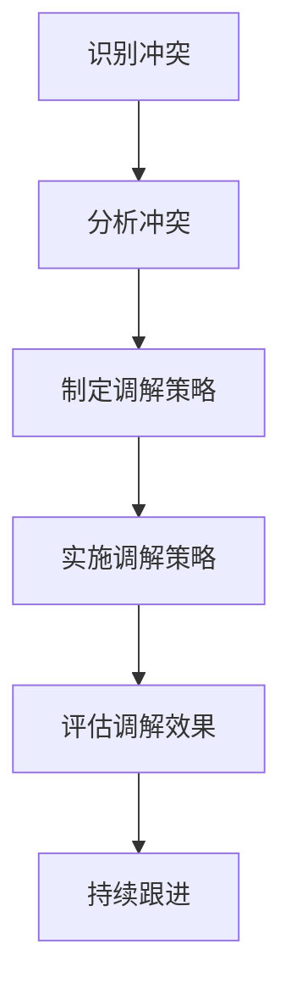

                 

### 《冲突调解：化解团队矛盾的技巧》

在IT行业，团队协作是确保项目成功的关键。然而，由于团队成员的个人背景、观点和利益差异，团队内部难免会出现冲突。如何有效地调解这些冲突，确保团队和谐运作，是每位团队领导者和成员都需要掌握的技能。本文将深入探讨冲突调解的基础理论、具体技巧和案例分析，帮助读者掌握化解团队矛盾的技巧。

#### 核心关键词

- **冲突调解**：通过第三方介入，帮助冲突双方找到共同点，化解矛盾。
- **团队管理**：有效协调团队成员，提高团队绩效。
- **团队文化**：建立信任与尊重的氛围，促进团队和谐。
- **倾听技巧**：理解并尊重他人意见，减少冲突。
- **谈判技巧**：在冲突中寻求双方都能接受的解决方案。

#### 摘要

本文旨在介绍冲突调解在团队管理中的重要性，并详细探讨冲突调解的理论基础、核心要素、具体技巧以及实战演练。通过分析成功与失败案例，总结冲突调解的最佳实践，帮助读者在实际工作中有效化解团队矛盾，提高团队绩效。

### 目录大纲

## 《冲突调解：化解团队矛盾的技巧》

### 第一部分：冲突调解的基础理论

### 第1章：冲突调解概述

#### 1.1 冲突调解的概念与重要性
- 冲突调解的定义
- 团队冲突的类型与影响
- 冲突调解的目的与意义

#### 1.2 冲突调解的理论基础
- 冲突理论的发展历程
- 冲突调解的理论框架
- 冲突调解的基本原则

### 第2章：团队冲突的核心要素

#### 2.1 冲突的起因与演变
- 冲突的起因分析
- 冲突的过程与阶段

#### 2.2 冲突中的行为模式
- 冲突行为的表现形式
- 冲突行为的影响因素

#### 2.3 冲突的解决策略
- 冲突解决的常见方法
- 冲突解决的优缺点分析

### 第3章：构建和谐团队文化

#### 3.1 团队文化的概念与特征
- 团队文化的定义
- 团队文化的特征

#### 3.2 促进团队和谐的策略
- 增强团队沟通的有效性
- 建立信任与尊重的氛围
- 提高团队成员的归属感

#### 3.3 领导者在团队冲突调解中的角色
- 领导者如何识别冲突
- 领导者在调解过程中的策略

## 第二部分：冲突调解的具体技巧

### 第4章：主动倾听与同理心

#### 4.1 主动倾听的技巧
- 倾听的层次与重要性
- 倾听的具体方法

#### 4.2 同理心的建立
- 同理心的定义与作用
- 如何运用同理心化解冲突

### 第5章：非暴力沟通法

#### 5.1 非暴力沟通的基本原则
- 诚实表达自己的需求
- 理解并尊重他人的需求

#### 5.2 非暴力沟通的实际应用
- 负面情绪的处理
- 冲突情境中的非暴力沟通

### 第6章：谈判与妥协技巧

#### 6.1 谈判的基本原则
- 谈判的目标与策略
- 谈判中的心理战术

#### 6.2 妥协的艺术
- 妥协的必要性
- 妥协的策略与技巧

### 第7章：冲突调解的实战演练

#### 7.1 案例分析
- 案例一：团队内部矛盾
- 案例二：跨部门冲突

#### 7.2 实战演练
- 演练一：模拟冲突调解
- 演练二：团队冲突解决

#### 7.3 反思与总结
- 实战演练的收获
- 未来的冲突调解策略

## 第三部分：冲突调解的案例分析

### 第8章：成功案例解析

#### 8.1 案例背景与冲突描述
- 案例一：团队协作问题
- 案例二：领导与下属矛盾

#### 8.2 冲突调解策略
- 案例一：调解过程与结果
- 案例二：调解方案与效果

### 第9章：失败案例警示

#### 9.1 案例背景与冲突描述
- 案例一：沟通不畅导致的冲突
- 案例二：个人利益冲突

#### 9.2 冲突调解失败的原因
- 案例一：失败原因分析
- 案例二：失败原因分析

#### 9.3 从失败中吸取教训
- 冲突调解中的常见误区
- 避免失败的策略与技巧

### 第10章：冲突调解的最佳实践

#### 10.1 最佳实践分享
- 团队冲突调解的成功经验
- 领导者在调解中的最佳实践

#### 10.2 小结与展望
- 冲突调解的重要性和挑战
- 未来的研究方向与发展趋势

## 附录

### 附录A：冲突调解工具与资源
- 冲突调解相关工具介绍
- 推荐的资源与参考文献

### 附录B：常用沟通技巧汇总
- 倾听技巧
- 非暴力沟通技巧
- 谈判技巧

### 附录C：案例分析表格与图表
- 案例分析中的关键数据
- 冲突调解流程图

---

### 1.1 冲突调解的概念与重要性

#### 冲突调解的定义

冲突调解是指在团队或组织内部，当出现成员之间的矛盾或分歧时，通过第三方的介入和引导，帮助双方或多方找到共同点，达成共识，从而化解冲突的过程。冲突调解的目的是避免冲突升级，减少负面情绪的影响，提高团队的整体效能。

在IT行业，团队协作是确保项目成功的关键。然而，由于团队成员的个人背景、观点和利益差异，团队内部难免会出现冲突。这些冲突如果得不到及时有效的调解，可能会导致团队成员之间的信任度下降，工作效率降低，最终影响项目的进度和质量。

#### 团队冲突的类型与影响

团队冲突可以分为以下几种类型：

1. **目标冲突**：团队成员对于团队的总体目标或个人目标存在不同看法，导致行动上的分歧。
2. **价值观冲突**：团队成员在个人价值观或文化背景上存在差异，导致在工作中产生摩擦。
3. **沟通冲突**：团队成员之间的沟通不畅，信息传递错误或误解，导致矛盾加剧。
4. **资源分配冲突**：团队资源有限，团队成员在资源分配上存在争议。

这些冲突如果得不到及时解决，会对团队产生以下影响：

- **降低工作效率**：团队成员因冲突而分心，无法专注于工作。
- **影响团队士气**：团队成员因冲突而感到沮丧、愤怒或无助，影响整体士气。
- **降低团队凝聚力**：长期存在的冲突会导致团队成员之间产生隔阂，降低团队的凝聚力。
- **影响项目质量**：团队成员因冲突而无法有效协作，可能导致项目质量下降。

#### 冲突调解的目的与意义

冲突调解的目的是通过第三方的介入和引导，帮助团队成员找到共同点，化解冲突，恢复团队的和谐与效率。其意义主要体现在以下几个方面：

1. **避免冲突升级**：冲突调解可以及时化解潜在的冲突，防止其升级为更严重的问题。
2. **提高团队效能**：通过有效的冲突调解，团队成员可以更好地协作，提高工作效率。
3. **增强团队凝聚力**：冲突调解有助于增强团队成员之间的信任和理解，提高团队的凝聚力。
4. **提升团队士气**：化解冲突可以消除团队成员的负面情绪，提升团队的士气。
5. **促进个人成长**：通过参与冲突调解，团队成员可以学会更好的沟通和解决问题的方法，促进个人成长。

总之，冲突调解在团队管理中具有重要的地位，是确保团队和谐运作、提高团队绩效的关键技巧。在接下来的章节中，我们将深入探讨冲突调解的理论基础、核心要素以及具体技巧，帮助读者掌握这一重要的管理技能。

### 1.2 冲突调解的理论基础

#### 冲突理论的发展历程

冲突调解的理论基础源于冲突理论的发展。冲突理论最早可以追溯到20世纪初，由著名的组织行为学家艾尔斯沃斯（Elsworth）提出。他首次将冲突定义为“组织成员在追求自身利益时，由于目标、价值观、利益分配等方面的不一致而产生的矛盾和对抗”。

随着时间的推移，冲突理论得到了不断的发展和完善。以下是几个重要的阶段：

1. **早期的冲突理论（1920-1950s）**：这一阶段的主要贡献者是梅奥（Elton Mayo），他通过霍桑实验发现了组织中的冲突现象，并提出了“社会冲突理论”，强调冲突在组织中的普遍性和必要性。

2. **互动冲突理论（1960s-1980s）**：这一阶段的研究重点在于冲突的互动过程，即冲突的起因、发展、解决等。互动冲突理论认为，冲突是动态的，受多种因素影响，包括个体特征、组织文化、环境因素等。

3. **现代冲突理论（1990s至今）**：这一阶段的研究更加关注冲突的解决和调解。现代冲突理论强调，冲突调解不仅需要理解冲突的本质，还需要具备解决冲突的技能和策略。

#### 冲突调解的理论框架

冲突调解的理论框架主要包括以下几个核心要素：

1. **冲突识别**：冲突调解的第一步是识别冲突。这需要通过观察、沟通和反馈等方式，发现团队内部存在的冲突。

2. **冲突分析**：一旦冲突被识别，就需要进行深入分析，了解冲突的起因、类型、程度和影响。这有助于制定有效的调解策略。

3. **调解策略**：根据冲突分析的结果，选择合适的调解策略。调解策略包括沟通、谈判、妥协、调解等。

4. **调解实施**：实施调解策略，引导冲突双方进行对话和协商，寻找共同点，达成共识。

5. **冲突解决**：通过调解，解决冲突，消除负面影响，恢复团队的和谐与效率。

#### 冲突调解的基本原则

有效的冲突调解需要遵循以下基本原则：

1. **中立性**：调解者应保持中立，不偏袒任何一方，确保调解过程的公正性和客观性。

2. **倾听**：调解者应主动倾听双方的陈述，理解他们的观点和需求，建立互信。

3. **同理心**：调解者应展现出同理心，站在对方的角度思考问题，帮助双方找到共同点。

4. **尊重**：调解者应尊重双方的意见和感受，避免指责和攻击。

5. **合作性**：调解者应鼓励双方进行合作，寻找双赢的解决方案。

6. **持续关注**：调解不应是一次性的过程，而是一个持续关注和跟进的过程。确保调解效果，防止冲突复发。

通过以上理论基础和基本原则，冲突调解可以在团队管理中发挥重要作用，帮助团队克服矛盾和挑战，实现和谐与高效。

### 2.1 冲突的起因与演变

#### 冲突的起因分析

冲突的起因多种多样，可以从以下几个方面进行分析：

1. **目标不一致**：当团队成员对于团队目标或个人目标存在不同看法时，容易产生冲突。例如，项目经理希望尽快完成项目，而开发团队认为需要更多时间来保证质量。

2. **价值观差异**：团队成员在个人价值观或文化背景上存在差异，可能导致工作中的摩擦。例如，某些成员重视创新，而另一些成员更注重规范和流程。

3. **沟通不畅**：团队成员之间的沟通不畅，信息传递错误或误解，容易引发冲突。例如，某个成员可能误解了上级的指示，导致执行上的偏差。

4. **资源分配**：当团队资源有限时，团队成员在资源分配上存在争议，容易引发冲突。例如，团队成员可能认为某个项目应该获得更多的资金支持，而另一个项目则应该削减预算。

5. **个人利益**：个人利益冲突也是导致团队冲突的一个重要原因。例如，某些成员可能希望承担更多的工作，以获取更高的绩效评价和奖金。

#### 冲突的过程与阶段

冲突的演变过程可以分为以下几个阶段：

1. **潜伏期**：在这一阶段，冲突的起因已经存在，但双方尚未意识到或没有公开表达。例如，团队成员可能在私下抱怨，但没有在公开场合提出。

2. **显现期**：当冲突的起因被公开表达时，冲突进入显现期。在这一阶段，双方开始进行直接的沟通，但可能带有情绪和攻击性。

3. **激化期**：随着冲突的深入，双方的情绪可能会变得更加激动，冲突进一步激化。这一阶段的沟通可能变得激烈，甚至出现对抗行为。

4. **解决期**：当双方意识到冲突的危害，并寻求解决方案时，冲突进入解决期。在这一阶段，双方可能会通过谈判、妥协等方式寻求共识。

5. **恢复期**：一旦冲突得到解决，团队将进入恢复期。在这一阶段，团队成员重新建立信任，恢复正常的合作关系。

理解冲突的起因和演变过程，有助于团队领导者和成员在冲突早期及时发现并采取措施，防止冲突升级，确保团队的和谐运作。

### 2.2 冲突中的行为模式

#### 冲突行为的表现形式

在团队冲突中，行为模式多种多样，以下是几种常见的冲突行为：

1. **攻击性行为**：攻击性行为是指通过言语或行为直接针对对方，试图伤害对方的心理或情感。例如，指责、讽刺、侮辱等。

2. **防御性行为**：防御性行为是指为了保护自己，避免受到攻击，而采取的行为。例如，回避、否认、防卫性反驳等。

3. **竞争性行为**：竞争性行为是指为了争夺资源或利益，采取的行为。例如，争夺项目主导权、争夺晋升机会等。

4. **合作性行为**：合作性行为是指为了共同解决问题，采取的行为。例如，共同讨论解决方案、妥协等。

5. **规避性行为**：规避性行为是指为了避免冲突，采取的行为。例如，回避讨论、不参与决策等。

#### 冲突行为的影响因素

冲突行为的影响因素包括以下几个方面：

1. **个体因素**：个体因素包括个人的性格、价值观、情绪状态等。例如，一个容易情绪化的人可能在冲突中表现出攻击性行为。

2. **情境因素**：情境因素包括团队文化、工作压力、资源稀缺等。在一个高压环境中，团队成员可能更容易表现出攻击性行为。

3. **沟通方式**：沟通方式对冲突行为有重要影响。有效的沟通可以减少误解和情绪化行为，而无效的沟通可能加剧冲突。

4. **解决策略**：冲突的解决策略也会影响冲突行为。例如，通过谈判和妥协来解决问题，可以减少攻击性行为。

理解冲突中的行为模式及其影响因素，有助于团队领导者和成员更好地应对冲突，采取合适的策略化解矛盾。

### 2.3 冲突的解决策略

#### 冲突解决的常见方法

在团队管理中，冲突解决策略的选择取决于冲突的性质和情境。以下是几种常见的冲突解决方法：

1. **回避**：回避是指避免直接面对冲突，选择暂时或永久性地离开冲突情境。这种方法适用于冲突的起因较小，且双方都不愿进一步讨论的情况。

2. **压制**：压制是指通过权力或权威压制对方的意见，以获得控制权。这种方法适用于冲突的起因较为明确，且需要迅速做出决策的情况。

3. **妥协**：妥协是指双方在冲突中各自退让，寻找一个双方都能接受的中间方案。这种方法适用于冲突的起因具有合理性，但双方难以达成一致的情况。

4. **合作**：合作是指双方共同寻找解决方案，寻求双赢的结果。这种方法适用于冲突的起因具有多重原因，且双方都愿意合作的情况。

5. **解决**：解决是指通过直接对话和谈判，找到根本的解决方案。这种方法适用于冲突的起因复杂，需要深入探讨的情况。

#### 冲突解决的优缺点分析

每种冲突解决方法都有其优缺点，具体分析如下：

1. **回避**
   - **优点**：避免冲突升级，减少情绪压力。
   - **缺点**：长期回避可能导致问题积累，最终爆发成更大的冲突。

2. **压制**
   - **优点**：迅速做出决策，确保团队运作。
   - **缺点**：可能导致下属不满，降低团队士气。

3. **妥协**
   - **优点**：快速解决冲突，维护团队和谐。
   - **缺点**：可能导致双方都不满意，问题没有得到根本解决。

4. **合作**
   - **优点**：建立双赢的局面，增强团队凝聚力。
   - **缺点**：需要更多时间和精力，可能难以实现。

5. **解决**
   - **优点**：找到根本的解决方案，确保问题的彻底解决。
   - **缺点**：需要深入探讨，可能耗时较长。

选择合适的冲突解决方法，有助于团队领导者和成员有效地化解冲突，提高团队绩效。

### 3.1 团队文化的概念与特征

#### 团队文化的定义

团队文化是指团队成员在长期合作中形成的共同价值观、信念和行为规范。它不仅是团队内部的氛围，更是团队精神和凝聚力的体现。团队文化对团队行为和绩效有深远影响，是团队成功的重要因素之一。

#### 团队文化的特征

1. **共享价值观**：团队文化是建立在共享价值观基础上的。团队成员共同认同并遵循这些价值观，从而形成一致的行为准则。

2. **共同目标**：团队文化强调共同目标的重要性。团队成员明确团队的目标，并为之共同努力。

3. **互信与尊重**：团队文化鼓励成员之间的信任和尊重。成员之间相互支持，共同解决问题。

4. **开放沟通**：团队文化倡导开放和透明的沟通方式。成员之间能够自由表达意见和反馈，促进信息的流动和共享。

5. **创新氛围**：团队文化鼓励创新和尝试。成员敢于提出新想法，并勇于接受挑战。

6. **积极态度**：团队文化倡导积极向上的态度。面对困难和挑战，成员能够保持乐观和坚定的信念。

理解团队文化的概念和特征，有助于团队领导者和成员营造和谐的团队氛围，提高团队绩效。

### 3.2 促进团队和谐的策略

#### 增强团队沟通的有效性

沟通是团队和谐运作的基础。以下策略可以帮助增强团队沟通的有效性：

1. **明确沟通目标**：在每次沟通前，明确沟通的目标和议程，确保沟通的针对性。

2. **定期召开会议**：定期召开团队会议，确保团队成员之间的信息畅通和互动。

3. **主动倾听**：倾听是有效沟通的关键。领导者应鼓励团队成员表达意见，并认真倾听。

4. **透明分享信息**：团队成员应透明地分享信息，避免误解和猜测。

5. **建立反馈机制**：建立有效的反馈机制，鼓励团队成员之间进行坦诚的交流和反馈。

#### 建立信任与尊重的氛围

信任与尊重是团队和谐的重要基石。以下策略可以帮助建立信任与尊重的氛围：

1. **公开承诺**：领导者应公开承诺，确保团队成员之间的信任和尊重。

2. **透明决策**：在决策过程中，领导者应保持透明，确保团队成员了解决策的依据和过程。

3. **尊重个体差异**：领导者应尊重每个团队成员的个性和观点，避免偏见和歧视。

4. **积极正面反馈**：领导者应积极正面地反馈团队成员的工作和成就，增强团队凝聚力。

5. **共同解决问题**：在遇到问题时，领导者应与团队成员共同寻找解决方案，增强信任和合作。

#### 提高团队成员的归属感

归属感是团队成员在团队中的情感依托。以下策略可以帮助提高团队成员的归属感：

1. **提供职业发展机会**：为团队成员提供职业发展机会和培训，增强他们的职业满意度和归属感。

2. **建立团队荣誉感**：通过表彰和奖励，建立团队荣誉感，增强团队成员的归属感。

3. **关心团队成员**：领导者应关心团队成员的生活和工作状况，提供必要的支持和帮助。

4. **促进团队活动**：定期组织团队活动，增强团队成员之间的互动和联系。

5. **鼓励参与决策**：鼓励团队成员参与决策过程，让他们感受到自己在团队中的重要性和价值。

通过以上策略，团队领导者和成员可以共同营造一个和谐、信任、尊重的团队氛围，提高团队的整体绩效和成员的满意度。

### 3.3 领导者在团队冲突调解中的角色

#### 领导者如何识别冲突

领导者识别冲突的关键在于敏锐地捕捉团队中的负面信号，如：

1. **团队成员的情绪变化**：注意团队成员的情绪变化，如焦虑、愤怒或沮丧，这可能是冲突的早期迹象。

2. **沟通障碍**：当团队成员之间的沟通不畅时，可能存在未被解决的冲突。观察是否存在信息传递错误或误解。

3. **工作表现下降**：团队成员的工作表现下降，如工作效率降低、错误率增加，可能是冲突导致的后果。

4. **团队氛围**：注意团队的整体氛围，如团队会议中的沉默、不参与或抱怨，可能表明存在冲突。

通过这些观察，领导者可以及时识别冲突，并采取适当的措施进行调解。

#### 领导者在调解过程中的策略

领导者进行冲突调解时，可以采用以下策略：

1. **中立立场**：保持中立，不偏袒任何一方，确保调解的公正性。

2. **倾听和理解**：主动倾听双方的陈述，理解他们的观点和需求，建立互信。

3. **同理心**：站在对方的角度思考问题，帮助双方找到共同点。

4. **引导对话**：引导双方进行建设性的对话，避免情绪化和攻击性行为。

5. **寻求共赢**：鼓励双方寻求共赢的解决方案，确保双方都能接受。

6. **持续关注**：调解不应是一次性的过程，而是一个持续关注和跟进的过程。确保调解效果，防止冲突复发。

通过以上策略，领导者可以有效地调解团队冲突，恢复团队的和谐与效率。

### 第4章：主动倾听与同理心

#### 4.1 主动倾听的技巧

主动倾听是冲突调解的重要技巧，它不仅能够帮助领导者更好地理解团队成员的观点和需求，还能减少误解和情绪化行为。以下是一些主动倾听的技巧：

1. **全神贯注**：在倾听时，领导者应全身心投入，避免分心。保持眼神接触，展现出对对方发言的关注。

2. **避免打断**：在对方发言时，领导者应避免打断，让对方完整表达观点。这样可以避免误解，并显示对对方的尊重。

3. **积极反馈**：通过肢体语言和口头反馈，如点头、微笑、说“嗯”、“我明白”等，表明领导者正在认真倾听。

4. **总结复述**：在对方发言结束后，领导者可以总结并复述对方的观点，确保理解准确。这不仅可以确认双方的共识，还能鼓励更多的沟通。

5. **开放提问**：在倾听过程中，领导者可以适时提出开放性问题，引导对方深入阐述观点，从而更好地理解问题的全貌。

通过以上技巧，领导者可以提升主动倾听的能力，为冲突调解奠定坚实的基础。

#### 4.2 同理心的建立

同理心是冲突调解中的关键要素，它有助于领导者站在对方的角度思考问题，从而找到双方都能接受的解决方案。以下是如何建立同理心的方法：

1. **设身处地**：领导者应尝试设身处地，想象自己处于对方的位置，理解对方的感受和需求。

2. **表达理解**：在对方发言时，领导者可以通过语言和非语言方式表达对对方理解，如说“我理解你的感受”或点头表示认同。

3. **避免评判**：在建立同理心时，领导者应避免对对方的观点或行为进行评判，而是专注于理解对方的情感和需求。

4. **寻求共识**：通过同理心，领导者可以与对方建立共识，找到双方都能接受的解决方案。

5. **持续关注**：同理心是一个持续的过程，领导者应不断关注团队成员的感受和需求，确保调解的顺利进行。

通过建立同理心，领导者可以有效地化解冲突，促进团队的和谐与合作。

### 第5章：非暴力沟通法

#### 5.1 非暴力沟通的基本原则

非暴力沟通法，又称为“爱心沟通法”或“compassionate communication”，由马歇尔·卢森堡提出。该方法强调在沟通中保持诚实、尊重和同情，旨在通过有效的沟通解决冲突，建立和谐的人际关系。以下是非暴力沟通的基本原则：

1. **观察而不评价**：在沟通中，领导者应专注于观察事实，而不是对对方的观点或行为进行评价。这有助于避免情绪化和误解。

2. **表达感受**：领导者应清晰地表达自己的感受，而不是用指责或批评的方式。例如，可以说“我感觉很不舒服”，而不是“你让我感到很不舒服”。

3. **表达需求**：在沟通中，领导者应明确表达自己的需求和期望，以便对方理解。例如，可以说“我需要你的帮助”，而不是“你应该帮我”。

4. **提出具体请求**：领导者应提出具体、可实现且双方都能接受的请求，而不是抽象或模糊的要求。例如，可以说“请你明天早上之前完成报告”，而不是“快点儿做报告”。

5. **倾听和理解对方**：在沟通中，领导者应倾听对方的观点和需求，理解对方的感受。这有助于建立互信，找到共同点。

通过遵循这些原则，领导者可以在冲突情境中保持冷静和理智，从而有效地解决冲突。

#### 5.2 非暴力沟通的实际应用

非暴力沟通法在实际应用中具有强大的效果，以下是一些具体的应用场景：

1. **负面情绪的处理**：

   - **情境**：团队中某个成员因为项目进展不顺利而感到沮丧，导致团队气氛紧张。

   - **非暴力沟通**：
     - 观察而不评价：“我看到项目进度不如预期，大家都很焦虑。”
     - 表达感受：“我感到有些沮丧，担心项目会延期。”
     - 表达需求：“我需要大家的支持和合作，以确保项目顺利进行。”
     - 提出具体请求：“能否在下周会议上讨论项目进度，并制定新的计划？”

2. **冲突情境中的非暴力沟通**：

   - **情境**：团队成员A和团队成员B在资源分配上存在分歧，双方情绪激动。

   - **非暴力沟通**：
     - 观察而不评价：“我注意到你们在资源分配上有不同的看法。”
     - 表达感受：“我感到有些困惑，不知道如何平衡双方的需求。”
     - 表达需求：“我需要了解你们各自的优先级和理由。”
     - 提出具体请求：“我们可以坐下来，共同探讨如何最有效地利用这些资源吗？”

通过以上实际应用，非暴力沟通法有助于领导者化解冲突，恢复团队的和谐与效率。

### 第6章：谈判与妥协技巧

#### 6.1 谈判的基本原则

谈判是冲突调解中的重要环节，它旨在通过双方的沟通和协商，达成双方都能接受的解决方案。以下是一些谈判的基本原则：

1. **明确谈判目标**：在谈判前，领导者应明确自己的目标和底线，以确保谈判的方向和结果。

2. **了解对方需求**：领导者应深入了解对方的利益和需求，以便找到双方都能接受的解决方案。

3. **建立互信**：互信是谈判成功的关键。领导者应通过开放和诚实的沟通，建立与对方的信任关系。

4. **寻求共赢**：谈判的目标是找到双方都能接受的方案，而不是单纯追求自己的利益。

5. **灵活调整策略**：在谈判过程中，领导者应根据对方的反应和谈判进展，灵活调整策略，以达成最终共识。

6. **保持冷静和理智**：在谈判中，领导者应保持冷静和理智，避免情绪化和冲动行为。

通过遵循这些基本原则，领导者可以更有效地进行谈判，化解团队冲突。

#### 6.2 妥协的艺术

妥协是谈判中的一种常见策略，它通过双方各自做出一些让步，找到中间方案。以下是如何进行有效妥协的技巧：

1. **明确利益和需求**：在妥协前，领导者应明确自己的利益和需求，以及对方的利益和需求，以便找到双方都能接受的方案。

2. **寻找共同点**：领导者应寻找双方都关心的共同点，以此为基础进行妥协。

3. **逐步让步**：在妥协过程中，领导者可以逐步做出让步，但要确保每次让步都是建设性的，且不会损害自己的核心利益。

4. **保持灵活性**：领导者应保持灵活性，根据谈判进展和对方的反应，灵活调整妥协方案。

5. **保持诚信**：在妥协过程中，领导者应保持诚信，确保承诺能够兑现。

6. **评估结果**：在妥协后，领导者应评估妥协结果，确保双方都得到了合理的满足。

通过以上技巧，领导者可以在谈判中有效地运用妥协策略，化解团队冲突。

### 第7章：冲突调解的实战演练

#### 7.1 案例分析

#### 案例一：团队内部矛盾

背景：在一个软件开发团队中，A和B是两个主要的开发人员。A负责前端开发，B负责后端开发。最近，团队在处理一个重要项目时，A和B在如何实现某个功能上产生了分歧。A认为应该采用新技术，而B认为应该沿用现有技术，以减少风险。双方在多次讨论后仍未达成一致，导致项目进度受到严重影响。

冲突描述：A和B在多次会议中激烈辩论，情绪激动，甚至相互指责。其他团队成员也感到困惑和焦虑，项目进度因此滞后。

调解策略：

1. **倾听与同理心**：首先，领导者应分别与A和B进行一对一的谈话，倾听他们的观点和需求。通过同理心，理解他们的担忧和期望。

2. **沟通与共识**：领导者应组织A和B进行面对面沟通，确保双方都有机会表达自己的观点。同时，领导者可以引导双方寻找共同点，如项目的最终目标。

3. **谈判与妥协**：在沟通中，领导者应鼓励A和B进行谈判，寻找一个双方都能接受的解决方案。可能的结果是，A可以接受沿用现有技术，而B可以同意在一定条件下尝试新技术。

结果：通过领导者的调解，A和B最终达成了妥协，项目得以继续推进，团队成员的焦虑情绪得到缓解。

#### 案例二：跨部门冲突

背景：在一个大型企业中，IT部门和市场部门在推广一个新产品的技术支持方案上存在分歧。IT部门认为市场部门提出的方案过于复杂，难以实施，而市场部门则认为IT部门的技术方案无法满足用户需求。

冲突描述：两个部门的负责人在多次会议中争吵激烈，彼此指责，导致项目推迟，企业高层对此表示担忧。

调解策略：

1. **中立立场**：领导者应保持中立，避免偏袒任何一方，确保调解的公正性。

2. **共同目标**：领导者应明确指出，双方的共同目标是成功推广新产品，并找到一个双方都能接受的解决方案。

3. **问题分析**：领导者应组织两个部门的代表共同分析问题，了解各自的担忧和需求，找出问题的核心。

4. **谈判与妥协**：领导者应引导双方进行谈判，鼓励他们寻求双赢的解决方案。例如，可以提议IT部门在现有基础上进行改进，以更好地满足市场部门的需求。

结果：通过领导者的有效调解，两个部门最终达成了共识，项目得以顺利推进，企业的声誉也得到提升。

#### 7.2 实战演练

##### 演练一：模拟冲突调解

1. **情景设定**：模拟一个实际工作场景，例如团队成员因资源分配产生分歧。

2. **角色扮演**：邀请团队成员扮演不同的角色，如冲突的双方和调解者。

3. **演练过程**：按照冲突调解的步骤进行演练，包括倾听、同理心、沟通、谈判和妥协。

4. **反馈与总结**：演练结束后，邀请参与者分享感受和体会，并总结有效的冲突调解策略。

##### 演练二：团队冲突解决

1. **情景设定**：模拟一个实际工作场景，例如团队在项目执行中遇到技术难题。

2. **角色扮演**：邀请团队成员扮演不同的角色，如项目经理、技术专家和其他团队成员。

3. **演练过程**：按照团队冲突解决的步骤进行演练，包括识别问题、分析原因、制定解决方案和执行。

4. **反馈与总结**：演练结束后，邀请参与者分享感受和体会，并总结有效的团队冲突解决策略。

通过以上实战演练，团队成员可以更好地理解和应用冲突调解的技巧，提高团队协作和解决问题的能力。

#### 7.3 反思与总结

通过案例分析和实战演练，我们可以得出以下结论：

1. **冲突调解的重要性**：冲突调解是确保团队和谐运作和项目成功的关键。

2. **有效的调解策略**：倾听、同理心、沟通、谈判和妥协是有效的调解策略。

3. **领导者的角色**：领导者应保持中立，引导双方进行有效沟通，寻找共同点，并寻求共赢的解决方案。

4. **团队文化的培养**：建立互信、尊重和开放的团队文化，有助于减少冲突，提高团队绩效。

未来的冲突调解策略应继续注重倾听和同理心，鼓励团队成员积极参与，并持续关注团队氛围和成员需求，确保冲突调解的效果和可持续性。

### 第8章：成功案例解析

#### 8.1 案例背景与冲突描述

**案例一：团队协作问题**

背景：某IT公司的开发团队在执行一个跨部门项目时，因任务分配和进度安排存在分歧，导致项目进展缓慢。

冲突描述：开发团队成员A和B在任务分配上存在争议，A认为B的任务量过大，影响了自己的工作进度，而B则认为A的任务较为简单，不应抱怨。双方在多次讨论后仍未达成一致，导致项目进度受到严重影响。

**案例二：领导与下属矛盾**

背景：某公司的部门经理C与下属D在项目目标和绩效考核上存在分歧。

冲突描述：C认为D的工作进度和质量未达到预期，而D则认为C的考核标准过于严格，不合理。双方在沟通中情绪激动，互相指责，导致部门内部气氛紧张，员工士气低落。

#### 8.2 冲突调解策略

**案例一：团队协作问题**

1. **中立调解**：领导者D作为调解者，保持中立立场，避免偏袒任何一方。

2. **倾听与同理心**：D分别与A和B进行一对一谈话，倾听他们的观点和需求，表达同理心，理解他们的担忧和期望。

3. **沟通与共识**：D组织A和B进行面对面沟通，确保双方都有机会表达自己的观点。通过引导，找到双方都关心的共同点，如项目的最终目标。

4. **谈判与妥协**：D鼓励A和B进行谈判，寻找一个双方都能接受的解决方案。例如，调整任务分配，让A和B各自承担更适合的职责。

**案例二：领导与下属矛盾**

1. **客观分析**：D作为调解者，组织C和D进行共同问题分析，了解各自的担忧和需求，找出问题的核心。

2. **双方参与**：D邀请C和D共同参与解决方案的制定，确保双方都能在决策中发挥重要作用。

3. **谈判与妥协**：D引导C和D进行谈判，寻找一个双方都能接受的考核标准和目标。例如，D可以建议调整考核指标，使其更加合理和可执行。

#### 8.3 冲突调解结果

**案例一：团队协作问题**

通过领导者的调解，A和B最终达成了妥协，任务分配得到了合理调整。双方重新建立了信任，项目进度恢复，团队内部气氛改善。

**案例二：领导与下属矛盾**

通过领导者的调解，C和D找到了一个双方都能接受的考核标准和目标。C的考核标准得到了调整，D的工作得到了合理的认可和激励，部门内部气氛逐渐恢复和谐，员工士气提高。

#### 8.4 冲突调解的经验与启示

1. **中立调解的重要性**：保持中立，避免偏袒任何一方，是确保冲突调解成功的关键。

2. **倾听与同理心**：通过倾听和同理心，理解双方的需求和期望，有助于找到共同点，化解冲突。

3. **双方参与**：让冲突双方共同参与解决方案的制定，确保他们的意愿和需求得到充分考虑。

4. **谈判与妥协**：通过谈判和妥协，找到双方都能接受的解决方案，是冲突调解的有效策略。

通过以上成功案例，我们可以看到，有效的冲突调解不仅能化解矛盾，还能增强团队凝聚力和工作效率。

### 第9章：失败案例警示

#### 9.1 案例背景与冲突描述

**案例一：沟通不畅导致的冲突**

背景：某公司的研发团队在执行一个重要项目时，由于团队成员之间的沟通不畅，导致任务分配和进度安排混乱。

冲突描述：团队成员A和B在任务分配上存在误解，A认为B应该负责某个关键模块的开发，而B则认为这个任务应该由A来完成。双方在多次讨论中未能达成一致，导致项目进度严重滞后。

**案例二：个人利益冲突**

背景：某公司的销售团队在制定年度销售目标时，由于个人利益的冲突，导致团队成员之间的矛盾加剧。

冲突描述：团队成员C和D在年度销售目标的设定上存在分歧，C认为销售目标过高，自己难以完成，而D则认为销售目标过低，不利于业绩的突破。双方在多次讨论中互相指责，导致团队内部气氛紧张。

#### 9.2 冲突调解失败的原因

**案例一：沟通不畅导致的冲突**

1. **缺乏有效沟通**：团队成员之间的沟通不畅，导致误解和冲突加剧。

2. **未及时调解**：领导者未能及时发现并调解冲突，导致问题进一步恶化。

3. **偏见与偏袒**：领导者可能因为个人偏好或团队关系，未能保持中立，导致调解失败。

**案例二：个人利益冲突**

1. **个人利益过于强烈**：团队成员的个人利益过于强烈，导致他们难以在冲突中做出妥协。

2. **缺乏共同目标**：团队成员缺乏共同的目标和价值观，导致在冲突中难以找到共同点。

3. **未进行充分沟通**：在冲突调解过程中，双方未进行充分沟通，导致问题未能得到有效解决。

#### 9.3 从失败中吸取教训

1. **及时沟通与调解**：领导者应时刻关注团队内部沟通状况，及时调解潜在的冲突。

2. **保持中立与客观**：在冲突调解过程中，领导者应保持中立和客观，避免偏袒任何一方。

3. **建立共同目标**：领导者应帮助团队成员建立共同的目标和价值观，减少个人利益的冲突。

4. **注重团队氛围**：营造一个开放、尊重和信任的团队氛围，有助于减少冲突的发生。

通过从失败案例中吸取教训，领导者可以更好地应对团队冲突，提高团队绩效。

### 第10章：冲突调解的最佳实践

#### 10.1 最佳实践分享

在冲突调解中，以下最佳实践有助于提高调解的效果和团队绩效：

1. **建立有效的沟通渠道**：确保团队成员之间有畅通的沟通渠道，避免信息传递错误和误解。

2. **培养倾听与同理心**：领导者应具备良好的倾听和同理心，理解团队成员的需求和期望。

3. **明确角色与责任**：在团队中明确每个成员的角色和责任，减少因职责不清导致的冲突。

4. **制定清晰的规则与流程**：建立明确的规则和流程，确保团队运作有序，减少冲突的发生。

5. **鼓励积极反馈**：建立积极反馈机制，鼓励团队成员之间进行坦诚的交流和反馈。

6. **提供培训与支持**：为团队成员提供必要的培训和资源支持，提高他们的沟通和解决冲突的能力。

通过以上最佳实践，团队领导者和成员可以更好地应对冲突，提高团队的整体绩效。

#### 10.2 小结与展望

冲突调解在团队管理中具有重要意义。通过有效的冲突调解，可以化解团队成员之间的矛盾，提高团队绩效和士气。在未来的研究和实践中，以下方向值得进一步探索：

1. **冲突预防**：研究如何通过提前预防和识别潜在冲突，减少冲突的发生。

2. **个性化调解策略**：研究如何根据团队成员的个性和需求，制定个性化的调解策略。

3. **跨文化冲突调解**：研究如何在多元文化背景下，进行有效的冲突调解。

4. **技术应用**：探索如何利用人工智能和大数据技术，辅助冲突调解，提高效率。

5. **持续跟进与评估**：研究如何对冲突调解的效果进行持续跟进和评估，确保调解的长期有效性。

通过不断探索和创新，冲突调解将更好地服务于团队管理，为团队的长期发展提供有力支持。

### 附录

#### 附录A：冲突调解工具与资源

**冲突调解相关工具**：

1. **冲突管理软件**：例如，Mavenlink、Slack等，用于团队沟通和协作。
2. **问卷调查工具**：例如，Google Forms、SurveyMonkey等，用于了解团队成员的需求和反馈。
3. **培训资源**：例如，在线课程、工作坊等，提供冲突调解的理论和实践指导。

**推荐的资源与参考文献**：

1. **《非暴力沟通》** - 马歇尔·卢森堡
2. **《冲突管理》** - 詹姆斯·K·费斯克
3. **《团队冲突管理》** - 约翰·F·曼尼

通过使用这些工具和资源，团队领导者和成员可以更好地掌握冲突调解的技巧，提高团队协作和绩效。

#### 附录B：常用沟通技巧汇总

**倾听技巧**：

1. **全神贯注**：保持专注，避免分心。
2. **积极反馈**：通过肢体语言和口头反馈，表明你在认真倾听。
3. **总结复述**：在对方发言结束后，总结并复述对方的观点，确保理解准确。

**非暴力沟通技巧**：

1. **观察而不评价**：专注于事实，而不是对对方进行评价。
2. **表达感受**：清晰地表达自己的感受，而不是用指责或批评的方式。
3. **表达需求**：明确表达自己的需求和期望。

**谈判技巧**：

1. **明确目标**：在谈判前明确自己的目标和底线。
2. **了解对方需求**：深入了解对方的利益和需求。
3. **寻求共赢**：寻找双方都能接受的解决方案。

通过掌握这些沟通技巧，团队领导者和成员可以更有效地解决冲突，提高团队绩效。

#### 附录C：案例分析表格与图表

**案例分析表格**：

| 案例名称       | 冲突类型 | 冲突描述                     | 冲突解决策略 | 解决结果                   |
|----------------|----------|------------------------------|--------------|----------------------------|
| 团队协作问题   | 任务分配 | A和B在任务分配上存在分歧     | 中立调解与谈判 | 任务分配得到合理调整       |
| 领导与下属矛盾 | 绩效考核 | 领导与下属在考核标准上存在分歧 | 双方参与与谈判 | 考核标准得到调整，气氛改善 |

**冲突调解流程图**（Mermaid 格式）：

通过使用表格和流程图，可以帮助团队领导者和成员更好地理解和应用冲突调解的步骤和技巧。

