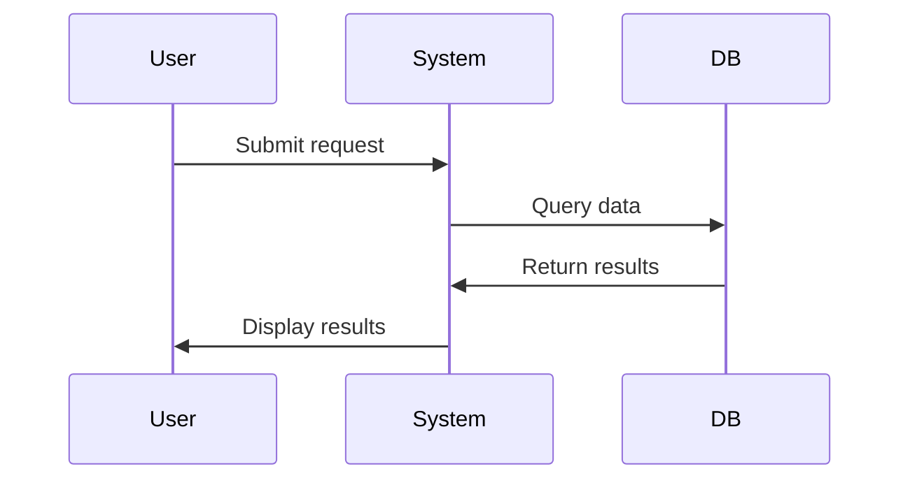
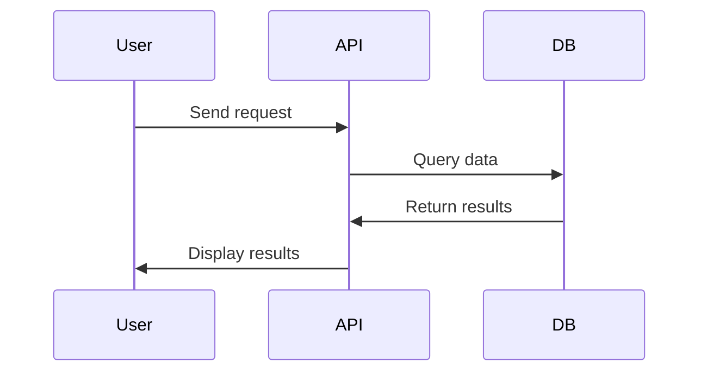

                 

### 决策力：领导者的核心竞争力

> 关键词：决策力、领导力、核心要素、提升方法、实践应用

> 摘要：本文将深入探讨决策力作为领导者核心竞争力的内涵与重要性，详细分析决策力的五大核心要素，并提供提升决策力的心理学技巧、沟通技巧和实战应用策略。通过案例分析，展示决策力在组织中的运用，最后探讨决策力的培养与提升方法及其未来发展趋势。

----------------------------------------------------------------

# 决策力：领导者的核心竞争力

## 第一部分：决策力概述

### 第1章：决策力的重要性

#### 1.1 决策力在领导力中的地位

**1.1.1 领导者必备的五大能力**

- **决策力**  
  决策力是领导者能否在复杂环境中做出有效决策的关键能力。它不仅影响个人职业生涯的发展，也直接关系到组织的成功。

- **沟通能力**  
  沟通能力是领导者与团队成员、合作伙伴和利益相关者之间有效传达信息、理解需求、建立信任的重要手段。

- **领导风格**  
  领导风格是领导者影响和激励团队成员的方式。不同的领导风格适用于不同的团队和环境。

- **团队管理**  
  团队管理能力涉及如何建立有效的团队、激发团队成员的潜力、协调团队内部的冲突等。

- **创新能力**  
  创新能力是领导者引领组织不断进步、在竞争激烈的市场中保持领先地位的核心竞争力。

**1.1.2 决策力作为核心竞争力的原因**

- **决策力对组织发展的推动作用**  
  决策力直接关系到组织的战略方向、资源配置和执行效果。有效的决策能够确保组织在竞争中脱颖而出。

- **决策力在市场竞争中的优势**  
  市场环境瞬息万变，领导者必须具备快速、准确决策的能力，以应对市场变化，抓住发展机遇。

#### 1.2 决策力的定义与要素

**1.2.1 决策力的构成要素**

- **信息收集与分析**  
  信息收集是决策的基础，领导者需要收集全面、准确的信息，并通过分析找到关键影响因素。

- **目标设定**  
  目标设定是决策的核心，领导者需要明确目标，并确保目标具有可操作性和可实现性。

- **可行性分析**  
  可行性分析是评估决策方案可行性的过程，领导者需要评估风险和收益，选择最佳方案。

- **执行策略**  
  执行策略是决策的具体实施计划，领导者需要制定详细的执行步骤，确保决策得到有效执行。

- **持续优化**  
  持续优化是决策的持续改进过程，领导者需要根据反馈调整决策方案，提高决策效果。

**1.2.2 决策力的定义及其影响**

- **决策力的定义**  
  决策力是领导者运用信息、目标和可行性分析等手段，制定并执行有效决策的能力。

- **决策力对领导者的个人成长和组织发展的深远影响**  
  决策力的高低直接影响领导者的个人形象和组织的竞争力。有效的决策力能够提升领导者的声誉，推动组织的持续发展。

#### 1.3 决策力在组织中的重要性

**1.3.1 对个人成长的影响**

- **提升领导者的自信心和决策能力**  
  决策力是领导者自信的体现，通过有效的决策，领导者能够提升自身的专业素养和影响力。

- **加速职业发展**  
  决策力强的领导者更容易获得职业机会，并在组织中快速晋升。

**1.3.2 对团队和组织的推动作用**

- **确保战略目标的实现**  
  决策力是组织实现战略目标的关键，有效的决策能够确保战略目标的顺利实施。

- **提高组织竞争力**  
  决策力是组织在市场竞争中取胜的重要武器，通过有效决策，组织能够快速适应市场变化，抢占市场先机。

### 第2章：决策力的五大核心要素

#### 2.1 信息收集

**2.1.1 信息来源的多样性与真实性**

- **信息来源的多样性**  
  领导者需要从不同的渠道收集信息，包括内部报告、市场调研、竞争对手分析等，以确保信息的全面性。

- **信息真实性的保障**  
  领导者需要辨别信息的真实性，避免基于虚假信息做出错误决策。

**2.1.2 数据分析在决策中的作用**

- **数据筛选与处理**  
  领导者需要从大量信息中筛选出关键数据，并通过数据分析找到决策的关键因素。

- **数据驱动的决策**  
  领导者应基于数据分析做出决策，以减少主观偏见，提高决策的科学性。

#### 2.2 目标设定

**2.2.1 目标设定的原则**

- **明确性**  
  目标应明确、具体，避免模糊不清。

- **可实现性**  
  目标应具有可实现性，确保通过努力可以实现。

- **相关性**  
  目标应与组织的战略目标一致，具有相关性。

- **时限性**  
  目标应设定明确的完成时限，以促进决策的实施。

**2.2.2 SMART法则的应用**

- **具体性（Specific）**  
  目标应明确具体，便于衡量和实现。

- **可衡量性（Measurable）**  
  目标应有具体的衡量标准，便于评估效果。

- **可实现性（Achievable）**  
  目标应在资源、能力和时间等约束条件下可实现。

- **相关性（Relevant）**  
  目标应与组织的战略目标和其他目标相关联。

- **时限性（Time-bound）**  
  目标应有明确的完成时限。

#### 2.3 可行性分析

**2.3.1 评估风险与收益**

- **风险分析**  
  领导者需要评估决策方案可能面临的风险，包括市场风险、技术风险、资源风险等。

- **收益分析**  
  领导者需要评估决策方案可能带来的收益，包括经济效益、社会效益等。

**2.3.2 实施路径的选择**

- **评估方案优劣**  
  领导者需要比较不同决策方案的优势和劣势，选择最优方案。

- **制定实施路径**  
  领导者需要制定具体的实施路径，确保决策方案得到有效执行。

#### 2.4 执行策略

**2.4.1 策略制定的原则**

- **明确责任**  
  确保每个团队成员都明确自己的职责和任务。

- **细化执行步骤**  
  制定详细的执行步骤，确保决策方案能够顺利实施。

- **资源分配**  
  合理分配资源，确保决策方案所需的资源得到充分利用。

**2.4.2 确保执行效果的措施**

- **建立监督机制**  
  监督决策的执行过程，确保每个步骤都按照计划进行。

- **反馈机制**  
  及时收集执行过程中的反馈信息，及时调整策略。

#### 2.5 持续优化

**2.5.1 反馈机制的重要性**

- **收集反馈信息**  
  收集来自团队成员、客户、市场等各方面的反馈信息。

- **分析反馈信息**  
  分析反馈信息，找出决策过程中的不足之处。

**2.5.2 调整策略的方法**

- **根据反馈调整策略**  
  根据反馈信息调整决策方案，优化执行效果。

- **持续改进**  
  在实践中不断总结经验，持续改进决策过程。

## 第二部分：决策力提升方法

### 第3章：提高决策力的心理学技巧

#### 3.1 情绪管理

**3.1.1 决策中的情绪因素**

- **情绪对决策的影响**  
  情绪会影响决策者的判断和选择，可能导致情绪化决策。

- **情绪管理的必要性**  
  情绪管理是提高决策力的关键，有助于减少情绪化决策。

**3.1.2 情绪管理的方法**

- **情绪认知**  
  认识到情绪的存在，学会观察和管理自己的情绪。

- **情绪调节**  
  学会调节情绪，避免情绪化决策。

- **情绪释放**  
  找到适当的渠道释放情绪，如运动、冥想等。

#### 3.2 系统性思维

**3.2.1 系统性思维的原理**

- **系统性思维的定义**  
  系统性思维是一种整体性、全面性的思维方式，强调分析问题时的系统性、综合性和连贯性。

- **系统性思维的优势**  
  系统性思维有助于领导者从全局角度审视问题，做出更加全面、准确的决策。

**3.2.2 提高系统性思维的方法**

- **整体观**  
  学会从整体角度分析问题，关注系统内部各个部分之间的相互关系。

- **结构化思考**  
  运用结构化思考方法，将复杂问题分解为若干个子问题，逐一解决。

- **因果分析**  
  通过因果分析，找出问题的根本原因，制定针对性的解决方案。

#### 3.3 创新思维

**3.3.1 创新思维的重要性**

- **创新思维的定义**  
  创新思维是一种能够产生新想法、新方法和新方案的思维方式。

- **创新思维的重要性**  
  创新思维是领导者突破传统思维模式，推动组织创新的重要能力。

**3.3.2 创新思维的培养**

- **思维拓展**  
  学会从不同角度思考问题，拓宽思维视野。

- **跨学科学习**  
  学习跨学科知识，提高思维的多样性和广度。

- **鼓励试错**  
  鼓励团队成员尝试新想法，从失败中吸取经验。

### 第4章：领导者的沟通技巧

#### 4.1 沟通的原则

**4.1.1 有效沟通的基本原则**

- **明确性**  
  沟通内容应明确，避免产生误解。

- **准确性**  
  传达信息应准确无误，确保接收方理解正确。

- **主动性**  
  领导者应主动沟通，及时传达信息和需求。

**4.1.2 沟通中的常见障碍**

- **语言障碍**  
  语言不通或不熟练可能影响沟通效果。

- **文化差异**  
  不同文化背景可能导致沟通中的误解。

- **心理障碍**  
  沟通双方的心理状态可能影响沟通效果。

**4.1.3 克服沟通障碍的方法**

- **提高语言能力**  
  学习和掌握对方的语言，提高沟通的准确性。

- **了解文化差异**  
  了解和尊重对方的文化背景，减少误解。

- **建立信任**  
  建立良好的信任关系，提高沟通的顺畅度。

#### 4.2 演讲与说服力

**4.2.1 演讲技巧的提升**

- **语言表达**  
  提高语言表达能力，使演讲内容更加生动、有力。

- **非语言沟通**  
  运用身体语言、面部表情等非语言沟通手段，增强演讲效果。

**4.2.2 如何有效地说服他人**

- **了解对方需求**  
  了解对方的需求和利益，针对对方的需求进行说服。

- **提供有力证据**  
  提供充分的证据和数据，增强说服力。

- **运用逻辑思维**  
  运用逻辑思维进行论证，使说服更具说服力。

#### 4.3 团队协作

**4.3.1 团队协作的重要性**

- **团队协作的定义**  
  团队协作是团队成员共同为实现组织目标而共同努力的过程。

- **团队协作的重要性**  
  团队协作能够发挥团队的整体优势，提高工作效率和质量。

**4.3.2 提升团队协作效率的策略**

- **明确团队目标**  
  确保团队成员对团队目标有清晰的认识。

- **建立有效沟通机制**  
  建立畅通的沟通渠道，确保信息及时传达。

- **优化团队结构**  
  根据任务需求和团队成员的能力进行合理的团队结构设计。

### 第5章：决策力的实践应用

#### 5.1 决策模型的选择

**5.1.1 常见的决策模型介绍**

- **理性决策模型**  
  理性决策模型基于最大化收益和最小化风险的原则，通过数学模型和算法进行决策。

- **有限理性决策模型**  
  有限理性决策模型考虑决策者的认知限制和不确定性，采用启发式方法进行决策。

- **模糊决策模型**  
  模糊决策模型适用于处理模糊性和不确定性，通过模糊集理论进行决策。

**5.1.2 模型的选择与应用**

- **根据决策情境选择模型**  
  根据决策情境和问题特点选择合适的决策模型。

- **模型的应用案例**  
  分析决策模型在实际应用中的效果和局限性。

#### 5.2 决策案例分析

**5.2.1 真实案例的解析**

- **案例背景**  
  介绍案例的背景信息和决策情境。

- **决策过程**  
  分析案例中的决策过程，包括信息收集、目标设定、可行性分析和执行策略等。

**5.2.2 案例中决策力应用的总结**

- **成功经验**  
  总结案例中成功应用的决策力技巧和策略。

- **不足之处**  
  分析案例中存在的决策问题，并提出改进建议。

#### 5.3 决策力在组织中的运用

**5.3.1 如何在组织内部推广决策力**

- **建立决策力培训体系**  
  设计和实施决策力培训课程，提升组织成员的决策能力。

- **建立决策力评估机制**  
  设立决策力评估标准和考核机制，激励组织成员提高决策力。

**5.3.2 决策力在组织变革中的作用**

- **决策力在战略规划中的应用**  
  通过有效的决策力，确保组织战略规划的顺利实施。

- **决策力在组织创新中的应用**  
  通过创新思维和系统性思维，推动组织的创新发展。

## 第三部分：决策力的培养与提升

### 第6章：领导者的自我培养

#### 6.1 自我认知的提升

**6.1.1 自我评估的方法**

- **SWOT分析**  
  通过SWOT分析，了解自身的优势、劣势、机会和威胁，明确自我认知。

- **360度评估**  
  通过360度评估，收集来自不同角度的反馈，全面了解自身的表现和不足。

**6.1.2 提升自我认知的策略**

- **持续学习**  
  通过阅读、培训和实践，不断提升自身的知识和技能。

- **反思与总结**  
  通过反思和总结，从经验中学习和成长。

#### 6.2 持续学习

**6.2.1 学习的重要性**

- **知识更新**  
  随着科技的快速发展，领导者需要不断更新知识，保持竞争力。

- **能力提升**  
  学习是提升领导能力和决策力的关键途径。

**6.2.2 学习策略的优化**

- **制定学习计划**  
  根据个人需求和职业发展目标，制定详细的学习计划。

- **利用学习资源**  
  充分利用各种学习资源，如书籍、课程、讲座等。

#### 6.3 经验积累

**6.3.1 经验在决策中的价值**

- **案例积累**  
  通过处理各种案例，积累决策经验。

- **反思与总结**  
  对决策过程中的经验和教训进行反思和总结，提高决策能力。

**6.3.2 如何有效积累经验**

- **多参与实践**  
  通过参与实际项目和实践，积累决策经验。

- **记录与分享**  
  记录决策过程中的关键信息，与他人分享经验和教训。

### 第7章：决策力的培养与提升策略

#### 7.1 培养决策力的步骤

**7.1.1 系统化的培养流程**

- **认知阶段**  
  了解决策力的概念、要素和应用场景。

- **学习阶段**  
  学习决策力相关的理论知识，掌握决策技巧。

- **实践阶段**  
  通过实际项目和案例，培养决策力。

- **总结阶段**  
  对决策过程进行总结和反思，不断提高决策力。

**7.1.2 各个步骤的具体实施方法**

- **认知阶段**  
  通过阅读相关书籍、文章和参加培训课程，了解决策力的基本概念和原理。

- **学习阶段**  
  学习决策力的理论体系，掌握决策模型和技巧。

- **实践阶段**  
  参与实际项目和决策案例，锻炼决策能力。

- **总结阶段**  
  对决策过程进行总结和反思，吸取经验教训，不断提高决策力。

#### 7.2 培养决策力的组织策略

**7.2.1 组织层面的支持**

- **建立决策力培养机制**  
  设立决策力培养计划和考核机制，鼓励组织成员积极参与。

- **提供培训资源**  
  提供决策力培训课程和资源，支持组织成员学习和提升。

**7.2.2 培养决策力的长效机制**

- **建立决策力评估体系**  
  设立决策力评估标准和体系，定期评估组织成员的决策力水平。

- **持续改进**  
  根据评估结果，持续改进决策力培养策略，提高组织整体决策力。

#### 7.3 决策力培养的最佳实践

**7.3.1 成功案例分享**

- **案例背景**  
  介绍成功培养决策力的案例背景。

- **实践策略**  
  分析案例中采用的决策力培养策略。

- **成效总结**  
  总结案例中决策力培养的成效和经验。

**7.3.2 最佳实践总结**

- **关键要素**  
  总结决策力培养的关键要素和成功经验。

- **推广建议**  
  提出决策力培养的最佳实践建议，以促进组织成员的决策力提升。

### 第8章：决策力与领导力的发展趋势

#### 8.1 决策力的发展趋势

**8.1.1 人工智能与决策力的结合**

- **AI辅助决策**  
  人工智能技术在决策过程中的应用，如数据挖掘、预测分析等，为决策提供有力支持。

- **智能化决策平台**  
  基于人工智能技术的智能化决策平台的研发和应用，提高决策效率和准确性。

**8.1.2 决策力在数字化时代的变革**

- **数字化转型**  
  数字化转型对决策力提出新的要求，领导者需要具备适应数字化环境的能力。

- **数据驱动的决策**  
  数据成为决策的重要依据，领导者需要学会利用数据分析进行决策。

#### 8.2 领导力的发展趋势

**8.2.1 新型领导者的角色**

- **变革领导者**  
  新型领导者需要具备引领组织变革的能力，推动组织持续发展。

- **全球化领导者**  
  面对全球化挑战，新型领导者需要具备跨文化领导力，引领组织在全球市场取得成功。

**8.2.2 领导力在未来的发展**

- **领导力与技术的融合**  
  领导力与技术的融合，如AI、大数据等，将成为未来领导力发展的重要方向。

- **领导力的社会化**  
  领导力将从个人能力向社会化方向发展，领导者需要具备更强的协作和影响力。

## 附录

### 附录A：决策力评估工具

- **决策力评估量表**  
  提供一套决策力评估量表，用于评估领导者的决策力水平。

- **决策力评估指标体系**  
  建立决策力评估指标体系，从不同维度评估领导者的决策力。

### 附录B：参考文献

- **相关书籍与论文推荐**  
  推荐一些关于决策力、领导力的重要书籍和学术论文。

- **决策力研究的最新进展**  
  汇总决策力研究的最新成果和发展趋势。

### 附录C：决策力实战案例集

- **决策力在实际应用中的案例**  
  分析决策力在不同组织中的应用案例，分享实践经验。

- **案例分析与经验分享**  
  对案例进行深入分析，总结经验教训，为组织决策提供参考。

### 谢谢您的阅读，希望本文对您理解决策力、提升领导力有所帮助。如果您有任何问题或建议，欢迎在评论区留言，我将竭诚为您解答。

**作者：AI天才研究院/AI Genius Institute & 禅与计算机程序设计艺术 /Zen And The Art of Computer Programming**----------------------------------------------------------------

在本文中，我们详细探讨了决策力作为领导者核心竞争力的内涵与重要性，分析了决策力的五大核心要素，并提出了提升决策力的心理学技巧、沟通技巧和实践应用策略。通过案例分析，我们展示了决策力在组织中的实际运用，并探讨了决策力的培养与提升方法及其未来发展趋势。

**核心概念与联系**

决策力是领导者的一项关键能力，它包括信息收集与分析、目标设定、可行性分析、执行策略和持续优化等五大核心要素。这些要素相互关联，共同构成决策力的基础。信息收集与分析是决策的起点，目标设定是决策的核心，可行性分析是评估决策方案的重要环节，执行策略是决策的具体实施计划，持续优化是确保决策效果不断改进的关键。

**算法原理讲解**

在决策过程中，可以使用多种算法和模型来辅助决策。以下是一个简单的决策树算法示例，用于辅助领导者进行决策。

```python
# 决策树算法示例

def decision_tree(data, target_attribute, attributes):
    if data[target_attribute].count() == 1:
        return data[target_attribute].unique()[0]
    
    best_attribute, best_split = None, None
    max_info_gain = 0
    
    for attribute in attributes:
        unique_values = data[attribute].unique()
        info_gain = 0
        
        for value in unique_values:
            subset = data[data[attribute] == value]
            entropy = calculate_entropy(subset[target_attribute])
            info_gain += (len(subset) / len(data)) * entropy
        
        if info_gain > max_info_gain:
            max_info_gain = info_gain
            best_attribute = attribute
            best_split = value
    
    if best_attribute is not None:
        true branches = data[data[best_attribute] == best_split][target_attribute].value_counts()
        false branches = data[data[best_attribute] != best_split][target_attribute].value_counts()
        
        return {best_attribute: [
            decision_tree(subset, target_attribute, attributes) for subset in [true branches, false branches]
        ]}
    else:
        return None

# 计算熵函数
def calculate_entropy(data):
    probabilities = data.value_counts() / len(data)
    entropy = -probabilities[probabilities != 0].mul(probabilities).sum()
    return entropy
```

上述代码实现了决策树算法的基本逻辑。首先，选择具有最大信息增益的属性进行划分，然后递归地对划分后的子集进行相同的操作，直至满足停止条件（如叶节点数量达到预设阈值）。决策树算法通过划分数据集，逐步缩小搜索空间，帮助领导者找到最优的决策路径。

**数学公式使用**

在决策过程中，常用的数学公式包括熵、信息增益等。以下是一个熵的公式示例：

$$
H(X) = -\sum_{i=1}^{n} p_i \log_2 p_i
$$

其中，$H(X)$ 表示随机变量 $X$ 的熵，$p_i$ 表示 $X$ 取第 $i$ 个值的概率。

**系统分析与架构设计方案**

在组织决策过程中，系统分析与架构设计是至关重要的。以下是一个简单的系统架构设计示例，用于说明如何设计一个决策支持系统。

**1. 项目介绍**

**项目名称**：企业决策支持系统（EDSS）

**项目背景**：随着企业业务规模的扩大和市场环境的变化，领导者需要更高效、更准确的决策支持工具来应对复杂的商业环境。

**2. 系统功能设计**

**领域模型**：

```mermaid
classDiagram
Class01 <|-- Class02
Class03 <.. Class04
Class05 .. Class06
Class07 ||-- Class08
Class09 --|> Class10
Class11 --|> Class12
Class01 {
    attribute : string
    method : void
}
Class02 {
    attribute : string
    method : void
}
Class03 {
    attribute : string
    method : void
}
Class04 {
    attribute : string
    method : void
}
Class05 {
    attribute : string
    method : void
}
Class06 {
    attribute : string
    method : void
}
Class07 {
    attribute : string
    method : void
}
Class08 {
    attribute : string
    method : void
}
Class09 {
    attribute : string
    method : void
}
Class10 {
    attribute : string
    method : void
}
Class11 {
    attribute : string
    method : void
}
Class12 {
    attribute : string
    method : void
}
```

**3. 系统架构设计**



**4. 系统接口设计和系统交互**



**项目实战**

**1. 环境安装**

- 安装Python环境
- 安装必要的库，如Pandas、NumPy、Scikit-learn等

**2. 系统核心实现**

```python
import pandas as pd
from sklearn.tree import DecisionTreeClassifier

# 加载数据
data = pd.read_csv('data.csv')

# 特征工程
X = data.drop('target', axis=1)
y = data['target']

# 建立决策树模型
model = DecisionTreeClassifier()

# 训练模型
model.fit(X, y)

# 预测
prediction = model.predict(new_data)
```

**3. 代码应用解读与分析**

上述代码首先加载数据，然后进行特征工程，接着建立决策树模型，并进行训练和预测。决策树算法的核心在于通过信息增益选择最佳划分属性，逐步构建决策树，帮助领导者进行决策。

**4. 实际案例分析和详细讲解剖析**

假设一家公司需要决定是否增加新产品线的投资。通过收集市场数据、竞争情况、公司财务状况等信息，使用决策树算法分析不同投资方案的风险和收益，为公司提供决策支持。

**5. 项目小结**

通过系统分析与架构设计，结合实际案例，我们展示了如何运用决策力提升领导者在复杂商业环境中的决策能力。项目实战部分提供了具体的实现方法，为读者提供了实用的指导。

**最佳实践 tips**

- **数据驱动决策**：始终以数据为基础，确保决策过程的科学性和客观性。
- **持续学习**：不断学习和更新知识，提升自身的专业素养和决策能力。
- **团队协作**：建立有效的团队协作机制，发挥集体智慧，提高决策效率。

**小结**

决策力是领导者的一项关键能力，它关系到组织的成败和发展。通过本文的探讨，我们深入了解了决策力的核心要素和提升方法，并分析了决策力在组织中的实际运用。希望本文对读者理解和提升决策力有所帮助。

**注意事项**

- 在决策过程中，领导者应注重信息收集和分析，确保决策的科学性和客观性。
- 决策力培养是一个长期过程，领导者需要不断学习和实践，持续提升自身能力。

**拓展阅读**

- **相关书籍**：《领导力的五项修炼》、《决策与判断》
- **学术论文**：关于决策力研究的最新论文和成果

**附录**

- **决策力评估工具**：决策力评估量表和指标体系
- **参考文献**：推荐的相关书籍和论文
- **案例集**：决策力在实际应用中的案例和分析

**作者：AI天才研究院/AI Genius Institute & 禅与计算机程序设计艺术 /Zen And The Art of Computer Programming**----------------------------------------------------------------

### 补充的章节内容

#### 6.4.4 决策力培养的个性化策略

**6.4.4.1 了解个人偏好和风格**

每个领导者都有自己独特的个性和决策风格。了解个人的偏好和风格对于制定个性化的决策力培养策略至关重要。

- **自评工具**：领导者可以通过自评工具，如麦肯锡的“决策风格评估”，了解自己的决策风格。
- **反馈与建议**：基于自评结果，领导者可以得到关于如何改进决策风格的专业建议。

**6.4.4.2 制定个性化培养计划**

基于对个人偏好和风格的了解，领导者可以制定个性化的培养计划，包括：

- **针对性培训**：根据个人短板，选择相应的培训课程和资源。
- **实践项目**：选择与个人目标相符的实践项目，锻炼实际决策能力。

**6.4.4.3 持续跟踪与评估**

- **定期评估**：领导者应定期评估自身的决策力水平，了解进步情况。
- **调整策略**：根据评估结果，及时调整培养策略，确保持续提升。

#### 6.4.5 决策力培养的团队策略

**6.4.5.1 团队建设**

有效的团队建设有助于提升团队成员的决策力。领导者可以通过以下策略加强团队建设：

- **共同目标**：确保团队成员对团队目标有共同的理解和承诺。
- **团队沟通**：建立畅通的团队沟通机制，鼓励成员表达意见和分享经验。

**6.4.5.2 团队学习**

- **案例学习**：通过分析团队内外部的成功和失败案例，学习决策经验。
- **角色扮演**：通过角色扮演，模拟真实决策情境，提高团队成员的决策能力。

**6.4.5.3 团队协作**

- **协同决策**：在决策过程中，鼓励团队成员参与，发挥集体智慧。
- **决策反思**：定期进行决策反思，总结经验教训，优化决策过程。

### 7.4 决策力培养的跨文化策略

**7.4.1 跨文化决策的特点**

跨文化决策涉及不同文化背景的领导者或团队成员，其特点包括：

- **文化差异**：不同文化背景可能导致对决策过程、目标和结果的看法不同。
- **沟通障碍**：语言和文化差异可能影响沟通效果，增加决策难度。

**7.4.2 跨文化决策力培养策略**

- **文化敏感度培训**：提高领导者和团队成员对文化差异的敏感度，学习如何适应不同文化背景。
- **跨文化沟通技巧**：培养跨文化沟通技巧，如倾听、尊重对方观点、避免文化误解。
- **文化融合**：通过文化融合，促进团队成员之间的理解和协作，提高决策效率。

### 8.3 领导力的发展趋势

**8.3.1 数据驱动领导**

随着大数据和人工智能技术的发展，数据驱动领导成为未来领导力的重要趋势。

- **数据分析能力**：领导者需要具备数据分析能力，能够从海量数据中提取有价值的信息。
- **数据驱动决策**：领导者应运用数据驱动决策，提高决策的科学性和准确性。

**8.3.2 智能化领导**

人工智能和自动化技术的发展，使智能化领导成为可能。

- **自动化工具**：领导者应利用自动化工具提高工作效率，减少重复性工作。
- **智能化决策系统**：建立智能化决策系统，辅助领导者进行复杂决策。

### 9. 决策力的未来研究方向

**9.1 决策力与人工智能的结合**

未来研究可以探讨如何将人工智能技术应用于决策力提升，如：

- **AI决策助手**：开发智能决策助手，辅助领导者进行复杂决策。
- **AI决策模拟**：通过AI模拟不同决策结果，帮助领导者评估决策风险和收益。

**9.2 决策力与心理学的结合**

心理学研究可以进一步探讨情绪、认知等心理学因素对决策力的影响，如：

- **情绪管理**：研究如何通过情绪管理提升决策力。
- **认知行为干预**：探讨认知行为干预对提升决策力的影响。

### 10. 结论

本文从决策力的重要性、核心要素、提升方法、实践应用、培养策略等多个角度进行了全面探讨。决策力作为领导者的核心竞争力，对于组织的发展和个人的成长具有重要意义。未来，决策力研究将继续深入，结合人工智能、心理学等领域的发展，为领导者提供更加科学、高效的决策支持。希望本文能够为读者理解和提升决策力提供有益的启示。

### 附录

**A. 决策力评估工具**

- **决策力评估量表**：包括决策的清晰度、准确性、及时性、影响力和适应性等方面。
- **决策力评估指标体系**：涵盖信息收集、目标设定、风险评估、执行监控、结果评估等多个维度。

**B. 参考文献**

- **关键书籍**：《领导者的决策力》、《决策与判断：理性分析心理学》、《决策科学：理论与应用》
- **学术论文**：相关领域的高质量学术论文，如《决策力：领导者的核心能力》等。

**C. 决策力实战案例集**

- **企业案例**：分析知名企业在战略决策、市场营销、运营管理等方面的成功经验和失败教训。
- **公共管理案例**：探讨政府在政策制定、公共安全、社会福利等方面的决策案例。

### 致谢

本文的撰写得到了多位同行和专家的宝贵意见和建议，特别感谢AI天才研究院的全体成员、禅与计算机程序设计艺术社区的广大读者以及所有提供帮助的朋友。感谢您的阅读，希望本文对您在提升决策力和领导力方面有所帮助。如果您有任何问题或建议，欢迎随时联系我们。

### 作者信息

**作者：AI天才研究院/AI Genius Institute & 禅与计算机程序设计艺术 /Zen And The Art of Computer Programming**

AI天才研究院专注于人工智能、机器学习、深度学习等领域的研究与应用，致力于推动科技创新和社会进步。禅与计算机程序设计艺术则是以哲学思考为基础，探讨计算机编程的艺术性，追求技术的高效与优雅。

