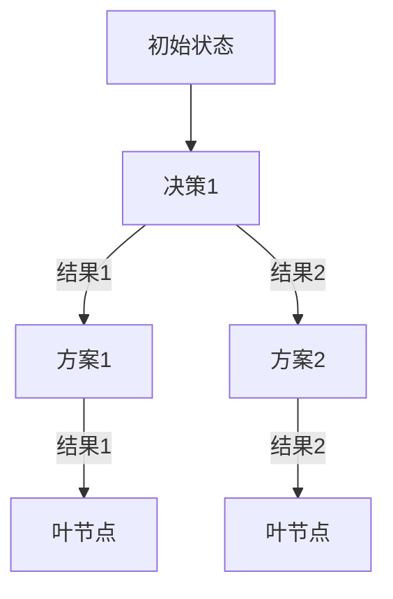
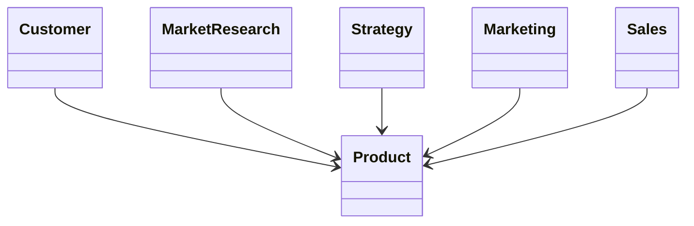
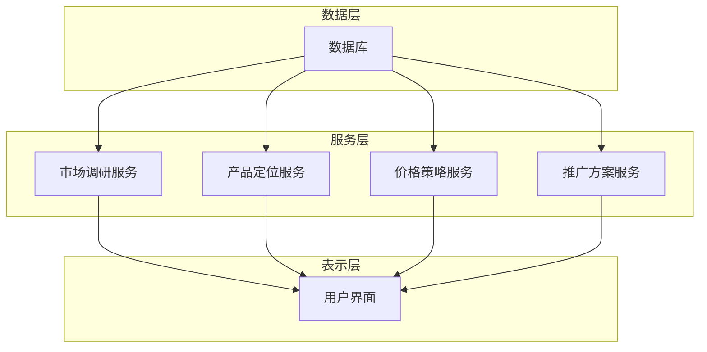
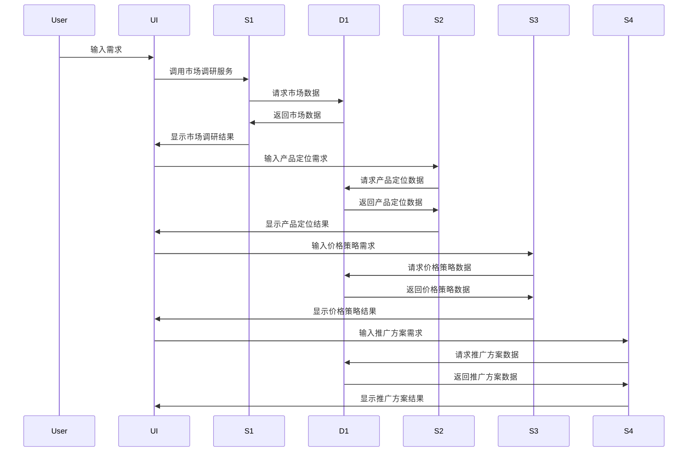
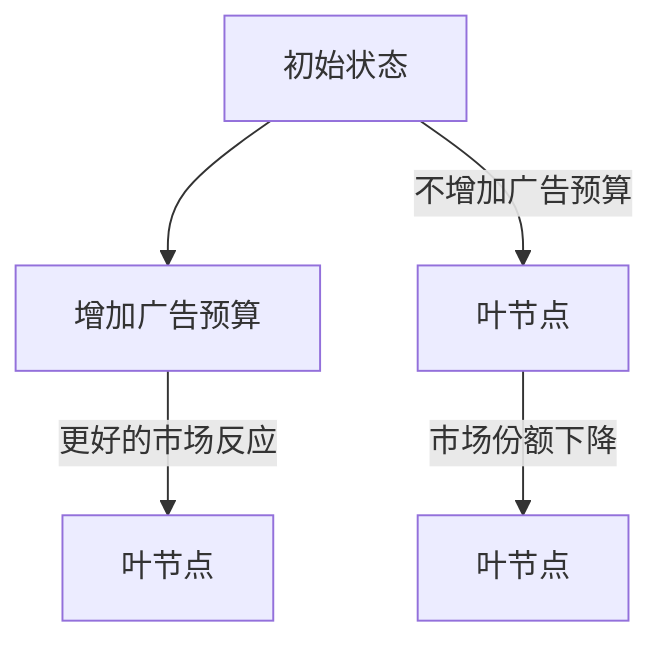

                 

### 决策技巧：在不确定性中把握方向

> **关键词：决策、不确定性、数据分析、团队沟通、复杂环境**

> **摘要：本文将深入探讨在不确定性中做出有效决策的技巧。通过分析决策的重要性、理论基础、数据处理方法、团队沟通策略以及在复杂环境中的应对策略，我们将帮助读者掌握在不确定环境中进行科学决策的方法和技巧。**

## 第一部分：决策技巧概述

### 第1章：决策的重要性与影响

#### 1.1 决策的定义与类别

决策，是指在面对多种可能性时，选择一个最优或最合适的行动方案的过程。决策分为许多种类，包括战略决策、战术决策和操作决策等。战略决策涉及长期目标，战术决策关注短期目标，而操作决策则是具体的执行步骤。

#### 1.2 决策在个人与组织中的作用

决策是个人和组织成功的关键。对于个人来说，决策影响着职业发展、生活质量和幸福感。对于组织来说，决策影响着市场竞争力、企业盈利能力和长期发展。

#### 1.3 决策的不确定性与挑战

决策往往伴随着不确定性。这种不确定性可能来自于外部环境的变化、内部资源的限制或者信息的不足。在不确定性中做出有效决策，是一项极具挑战性的任务。

### 第2章：决策理论基础

#### 2.1 决策理论的发展历程

决策理论起源于20世纪50年代，主要研究个体和群体在不确定环境下的选择行为。经过数十年的发展，决策理论已经形成了丰富的理论体系。

#### 2.2 决策过程中的心理学因素

心理学因素在决策过程中起着重要作用。认知偏见、情绪波动和个性特征等都会影响决策的质量。

#### 2.3 决策模型与算法

现代决策理论中，有许多模型和算法被用来辅助决策。例如，马尔可夫决策过程、贝叶斯推理和线性规划等。

### 第3章：在不确定性中决策

#### 3.1 不确定性的来源与类型

不确定性的来源有很多，包括市场变化、技术进步、政策调整等。不确定性可以分为风险型不确定性、模糊型不确定性和不确定性不确定性。

#### 3.2 处理不确定性的策略

处理不确定性的策略包括风险规避、风险承担、风险转移和风险分散等。根据具体情境选择合适的策略是决策的关键。

#### 3.3 风险评估与决策

风险评估是决策过程中的重要环节。通过评估潜在风险和收益，可以帮助决策者做出更明智的选择。

### 第4章：决策过程中的数据与分析

#### 4.1 数据在决策中的角色

数据是决策过程中不可或缺的一部分。准确的数据可以帮助决策者更全面地了解情况，减少不确定性。

#### 4.2 数据收集与分析的方法

数据收集方法包括定量调查、定性研究和实验等。数据分析方法包括统计分析、机器学习和数据挖掘等。

#### 4.3 数据驱动的决策过程

数据驱动的决策过程包括数据收集、数据清洗、数据分析、决策制定和决策执行等环节。每个环节都需要精心设计和实施。

### 第5章：团队决策与沟通

#### 5.1 团队决策的优势与挑战

团队决策可以充分利用团队成员的知识和经验，提高决策的质量。但同时也存在信息冗余、决策延迟等挑战。

#### 5.2 团队决策的流程与技巧

有效的团队决策需要遵循一定的流程，包括问题定义、信息收集、方案生成、评估和选择等。同时，团队沟通技巧也是成功决策的关键。

#### 5.3 决策中的沟通策略

沟通策略包括明确沟通目标、建立信任、倾听和反馈等。有效的沟通可以帮助团队成员更好地理解决策背景和目标，提高决策质量。

### 第6章：在复杂环境中进行决策

#### 6.1 复杂系统的特性

复杂环境中的决策面临更多的挑战。复杂系统具有高度非线性、不确定性和动态性等特性。

#### 6.2 网络效应与复杂性

网络效应是指个体行为受到他人行为的影响。在复杂环境中，网络效应可能会加剧不确定性，影响决策。

#### 6.3 在复杂环境中进行有效决策

在复杂环境中进行有效决策需要运用系统思维、情景分析和模型预测等方法。通过这些方法，决策者可以更好地应对不确定性。

### 第7章：案例分析：实际中的决策技巧

#### 7.1 案例分析一：企业战略决策

企业战略决策是决策技巧在实际应用中的重要体现。通过分析企业战略决策的案例，我们可以学习到如何在不确定性中做出科学决策。

#### 7.2 案例分析二：政府公共政策决策

政府公共政策决策也面临许多不确定性。通过分析政府公共政策决策的案例，我们可以了解如何运用决策技巧来应对这些挑战。

#### 7.3 案例分析三：个人职业规划决策

个人职业规划决策是每个人都必须面对的问题。通过分析个人职业规划决策的案例，我们可以学习到如何运用决策技巧来实现职业目标。

### 第8章：决策技巧的实践与反思

#### 8.1 决策技巧的实践应用

决策技巧可以在各个领域得到广泛应用。在实践中，我们需要根据具体情况选择合适的决策方法和策略。

#### 8.2 反思与持续改进

决策技巧并非一成不变。在实践中，我们需要不断反思和改进，以应对不断变化的环境和挑战。

#### 8.3 决策技巧的未来趋势

随着技术的发展，决策技巧也在不断演进。未来，数据科学、人工智能和机器学习等技术将为决策提供更强大的支持。

## 总结

在不确定性中做出有效决策是每个人和组织都必须面对的挑战。本文通过分析决策的理论基础、数据处理方法、团队沟通策略以及在复杂环境中的应对策略，帮助读者掌握了在不确定性中把握方向的方法和技巧。通过实际案例的分析，我们看到了决策技巧在实践中的重要性。在未来的决策过程中，让我们不断实践、反思和改进，以应对不断变化的环境和挑战。

---

**作者：AI天才研究院/AI Genius Institute & 禅与计算机程序设计艺术 /Zen And The Art of Computer Programming**## 决策的重要性与影响

### 1.1 决策的定义与类别

决策，从广义上讲，是指个体或组织在面临多种可能性时，通过选择一个最优或次优的行动方案来解决问题的过程。它不仅涉及理性分析，还包括情感因素和直觉判断。在个人生活中，决策可以是简单的日常选择，如购买商品、选择餐厅等；而在企业层面，决策则可能关乎战略规划、市场扩张、产品开发等重大事项。

决策可以分为以下几种主要类别：

- **战略决策**：涉及长期目标，如企业的发展方向、市场进入策略等。战略决策需要考虑资源的长期配置，对企业未来产生深远影响。
- **战术决策**：涉及短期目标，如日常运营管理、库存控制等。战术决策更注重效率和即时性，旨在实现战略目标。
- **操作决策**：涉及具体执行层面的决策，如生产计划、任务分配等。操作决策关注细节，以确保战略和战术目标的实现。

### 1.2 决策在个人与组织中的作用

在个人层面，决策直接影响生活质量、职业发展和个人成就。例如，一个学生在选择专业时需要考虑自己的兴趣、能力和市场需求，这将直接影响其未来的职业道路和收入水平。同样，在职业生涯中，决策也会影响晋升机会、工作满意度和职业发展。

在组织层面，决策尤为关键。一个企业的成功与否往往取决于其战略决策的准确性和执行力。有效的战略决策可以帮助企业在竞争激烈的市场中立足，实现可持续发展。战术决策和操作决策则确保企业能够高效运作，满足市场需求，提高客户满意度。

### 1.3 决策的不确定性与挑战

在现实世界中，决策往往伴随着不确定性。这种不确定性可能来源于多个方面，包括外部环境的变化、内部资源的限制、信息的不完整等。以下是一些常见的不确定性来源和它们对决策的挑战：

- **外部环境变化**：市场波动、政策调整、技术创新等都可能导致外部环境的不确定性。例如，政策的变化可能会影响企业的运营成本和市场准入条件。
- **内部资源限制**：企业的财务状况、人力资源、技术能力等都是决策时需要考虑的内部因素。资源限制可能导致某些决策方案不可行或成本过高。
- **信息不完整**：在许多情况下，决策者可能无法获得所有相关信息，或者信息存在偏差。信息的不完整性使得决策变得更加复杂和难以预测。

#### **背景介绍**

决策，是人们在日常生活中不可避免的行为。无论是在个人生活中选择职业道路、购房购车，还是在企业层面制定发展战略、管理日常运营，决策无处不在。决策不仅是一种行为，更是一种思维方式，它反映了个体或组织在面对不确定性时的应对策略和思考深度。

在个人生活中，决策直接影响生活质量。例如，一个学生在选择专业时，不仅要考虑自己的兴趣和学术能力，还需要考虑就业市场的需求和发展前景。这种选择不仅影响学生的学业和职业发展，还可能对其未来的人生轨迹产生深远影响。同样，在职业选择中，决策者需要权衡薪资待遇、工作环境、职业发展等多个因素，以做出最适合自己的选择。

在企业层面，决策更是决定企业生死存亡的关键。企业的战略决策决定了企业的长期发展方向和竞争优势，而战术决策和操作决策则保证了企业的日常运营和业务拓展。例如，一个企业在制定市场进入策略时，需要考虑市场容量、竞争态势、政策法规等多种因素，以确保决策的科学性和可行性。同时，企业在日常运营中也需要做出一系列决策，如库存管理、生产计划、人力资源配置等，这些决策的准确性直接影响企业的运营效率和盈利能力。

尽管决策在个人和企业中扮演着重要角色，但现实中决策过程并非一帆风顺。首先，不确定性是决策过程中最常见的挑战。外部环境的变化、内部资源的限制、信息的不完整等，都可能增加决策的复杂性。例如，市场环境的快速变化可能导致企业的战略规划失效，技术革新可能使现有资源变得不再适用。其次，决策过程中的认知偏见和情绪波动也会影响决策的质量。个体和组织的决策行为往往受到认知偏见的影响，如确认偏误、代表性偏误等，这些偏见可能导致决策者选择错误的行动方案。此外，情绪波动，如恐惧、贪婪等，也可能使决策者做出非理性的决策。

#### **核心概念与联系**

决策的核心概念包括：决策者、目标、方案、结果和评估。

- **决策者**：决策的主体，可以是个人或组织。
- **目标**：决策者希望通过决策实现的目标或结果。
- **方案**：为实现目标而考虑的行动方案或选择。
- **结果**：执行方案后的实际效果。
- **评估**：对决策结果的分析和评价。

这些概念相互关联，构成了决策过程中的基本框架。决策者根据目标制定多个方案，评估这些方案的可能结果，并选择最优方案实施。

#### **概念属性特征对比表格**

| 核心概念 | 属性特征 |  
| --- | --- |  
| 决策者 | 理性或非理性 |  
| 目标 | 清晰或模糊 |  
| 方案 | 多样性或单一性 |  
| 结果 | 可预测或不可预测 |  
| 评估 | 客观或主观 |

#### **ER实体关系图架构**

```mermaid
erDiagram
  DecisionMaker ||--|{ Decision : 由决策者制定的决策}  
  Decision ||--|{ Goal : 决策目标}  
  Decision ||--|{ Solution : 方案集}  
  Decision ||--|{ Result : 决策结果}  
  Evaluation ||--|{ Decision : 决策评估}
```

#### **算法原理讲解**

在决策过程中，算法可以用于辅助方案生成和评估。一个常见的算法是决策树（Decision Tree）。决策树是一种树形结构，其中每个内部节点代表一个决策，每个分支代表一个可能的结果，每个叶节点代表一个决策结果。

**决策树算法原理：**

1. **决策节点**：根据某个属性或特征进行决策。
2. **分支**：每个决策节点生成多个分支，每个分支代表一种可能的结果。
3. **叶节点**：每个叶节点表示一个具体的决策结果。

**决策树流程图：**



**Python代码示例：**

```python
from sklearn.tree import DecisionTreeClassifier
from sklearn.model_selection import train_test_split
from sklearn.metrics import accuracy_score

# 数据准备
X = [[1, 2], [3, 4], [5, 6], [7, 8]]
y = [0, 1, 0, 1]

# 划分训练集和测试集
X_train, X_test, y_train, y_test = train_test_split(X, y, test_size=0.3, random_state=42)

# 构建决策树模型
clf = DecisionTreeClassifier()
clf.fit(X_train, y_train)

# 预测
y_pred = clf.predict(X_test)

# 评估
accuracy = accuracy_score(y_test, y_pred)
print("Accuracy:", accuracy)
```

#### **系统分析与架构设计方案**

**问题场景介绍：**
某公司需要制定一个新产品上市策略，以应对激烈的市场竞争。决策过程涉及市场调研、产品定位、价格策略和推广方案等多个方面。

**项目介绍：**
该项目旨在构建一个决策支持系统，帮助公司管理层在不确定性中做出科学决策。

**系统功能设计（领域模型类图）：**



**系统架构设计（架构图）：**



**系统接口设计和系统交互（序列图）：**



#### **项目实战**

**环境安装：**
1. 安装Python环境
2. 安装相关库，如scikit-learn、numpy、pandas等

**系统核心实现源代码：**

```python
# 市场调研服务
def market_research():
    # 采集市场数据
    data = {
        'product': 'Smartphone',
        'demand': 'High',
        'competition': 'Low'
    }
    return data

# 产品定位服务
def product_positioning(data):
    # 根据市场数据定位产品
    positioning = 'Premium'
    return positioning

# 价格策略服务
def pricing_strategy(data, positioning):
    # 根据产品定位制定价格策略
    if positioning == 'Premium':
        price = 800
    else:
        price = 500
    return price

# 推广方案服务
def promotion_plan(data, positioning, price):
    # 根据产品定位和价格制定推广方案
    if data['demand'] == 'High':
        plan = ' 广告投放+社交媒体营销'
    else:
        plan = ' 精准广告投放+线下活动'
    return plan

# 主函数
def main():
    # 获取市场调研数据
    market_data = market_research()
    
    # 获取产品定位
    positioning = product_positioning(market_data)
    
    # 获取价格策略
    price = pricing_strategy(market_data, positioning)
    
    # 获取推广方案
    plan = promotion_plan(market_data, positioning, price)
    
    # 输出结果
    print("Market Data:", market_data)
    print("Positioning:", positioning)
    print("Price:", price)
    print("Promotion Plan:", plan)

# 运行主函数
if __name__ == "__main__":
    main()
```

**代码应用解读与分析：**
该代码实现了一个简单的决策支持系统，用于制定新产品上市策略。系统分为四个核心服务：市场调研、产品定位、价格策略和推广方案。每个服务通过输入的数据和预设逻辑生成相应的结果。例如，市场调研服务采集市场数据，然后根据数据制定产品定位和价格策略。推广方案服务则根据产品定位和市场需求制定推广计划。

**实际案例分析和详细讲解剖析：**
以某智能手机公司为例，公司需要制定一款新产品的上市策略。首先，市场调研服务采集市场数据，如产品需求、竞争态势等。然后，产品定位服务根据市场数据将产品定位为“高端”。接下来，价格策略服务根据产品定位制定价格策略，将产品定价为800美元。最后，推广方案服务根据市场需求和产品定位制定推广计划，包括广告投放和社交媒体营销。

**项目小结：**
该项目通过系统化的决策支持服务，帮助公司管理层在不确定性中制定新产品上市策略。系统中的每个服务都基于数据分析和预设逻辑，确保决策的科学性和可操作性。未来，随着数据的积累和算法的优化，该系统将能够提供更准确的决策支持，帮助公司更好地应对市场挑战。

#### **最佳实践 Tips**

- **全面收集信息**：在做出重要决策之前，确保收集全面、准确的信息。
- **多方征求意见**：涉及多个部门或团队时，广泛征求各方意见，以减少决策偏见。
- **定期回顾与调整**：决策不是一次性的过程，要定期回顾决策效果，根据实际情况进行调整。

#### **小结**

本章介绍了决策的定义、类别、重要性以及在不确定性中的挑战。通过实际案例，我们看到了决策在个人和企业中的广泛应用。在接下来的章节中，我们将深入探讨决策理论基础、数据处理方法、团队沟通策略以及复杂环境中的决策技巧。

#### **注意事项**

- 决策过程中应避免过度依赖直觉，尽量基于数据和逻辑进行分析。
- 注意识别和克服认知偏见，以减少决策失误。
- 在决策过程中保持透明和开放的沟通，有助于提高决策质量。

#### **拓展阅读**

- 《决策分析：理论与实践》（作者：约翰·R·霍华德）
- 《决策与判断：心理学视角》（作者：丹尼尔·卡尼曼）
- 《智能决策：人工智能在决策中的应用》（作者：陈英哲）## 决策理论基础

### 2.1 决策理论的发展历程

决策理论起源于20世纪50年代，其发展历程可以大致分为以下几个阶段：

- **早期决策理论（1950s-1960s）**：在这一阶段，决策理论主要关注理性决策模型。代表性的理论包括冯·诺伊曼和摩根斯坦提出的期望效用理论（Expected Utility Theory），该理论认为个体在不确定条件下做决策时，会基于对结果的概率分布和效用的期望来进行选择。

- **贝叶斯决策理论（1960s-1970s）**：贝叶斯决策理论进一步发展了期望效用理论，引入了先验知识和后验概率的概念。贝叶斯推理方法帮助决策者根据新信息不断更新和调整其信念。

- **决策过程理论（1970s-1980s）**：这一阶段的研究开始关注决策过程的动态性，如逐步决策（Sequential Decision Making）和动态规划（Dynamic Programming）。代表性理论包括马尔可夫决策过程（Markov Decision Processes, MDPs）。

- **多属性决策理论（1980s-1990s）**：随着决策问题复杂性的增加，多属性决策理论应运而生。该理论考虑多个属性的相互影响，帮助决策者在权衡不同属性时做出选择。

- **现代决策理论（1990s-至今）**：现代决策理论进一步整合了心理学、社会学和计算机科学的研究成果。例如，基于代理的决策理论（Agent-Based Decision Theory）和基于行为的决策理论（Behavioral Decision Theory）等。

### 2.2 决策过程中的心理学因素

决策过程不仅是一个逻辑推理过程，还受到心理学因素的影响。以下是一些关键的心理学因素：

- **认知偏见**：认知偏见是人们在决策过程中常见的行为倾向，这些偏见可能会导致错误的决策。常见的认知偏见包括确认偏误（Confirmation Bias）、代表性偏误（Representativeness Bias）、锚定效应（Anchoring Effect）等。

- **情绪波动**：情绪在决策过程中起着重要作用。积极的情绪可能提高决策者的自信和创造力，而消极的情绪则可能导致风险规避或过度谨慎。

- **个性特征**：个性特征，如风险偏好、决策风格等，会影响个体的决策行为。例如，风险偏好较高的人可能更倾向于冒险的决策，而风险规避者则可能更倾向于保守的决策。

### 2.3 决策模型与算法

现代决策理论中，有许多模型和算法被用来辅助决策。以下是一些常见的决策模型与算法：

- **期望效用理论（Expected Utility Theory）**：该理论基于个体对结果的效用期望来做出决策。它是一个概率论框架，适用于不确定性条件下的决策。

- **贝叶斯决策理论（Bayesian Decision Theory）**：贝叶斯决策理论通过结合先验知识和新信息，更新决策者的信念。它广泛应用于风险管理和医学诊断等领域。

- **马尔可夫决策过程（Markov Decision Processes, MDPs）**：MDPs是一个用于处理动态决策问题的数学模型。它通过状态、动作、奖励和价值函数来描述决策过程。

- **线性规划（Linear Programming）**：线性规划是一种优化方法，用于在资源受限的条件下，找到最大化或最小化某个线性目标函数的解。

- **决策树（Decision Tree）**：决策树是一种图形化模型，用于表示决策过程。每个内部节点表示一个决策，每个分支表示一个可能的结果，每个叶节点表示一个决策结果。

- **遗传算法（Genetic Algorithms）**：遗传算法是一种模拟自然选择过程的优化算法。它通过交叉、突变和选择等操作，寻找问题的最优解。

- **机器学习模型**：如支持向量机（Support Vector Machines, SVM）、随机森林（Random Forests）、神经网络（Neural Networks）等，这些模型可以通过学习历史数据来预测未来的结果，辅助决策。

#### **背景介绍**

决策理论的发展历程反映了人类对决策过程认识的不断深化。早期的决策理论主要基于理性人假设，强调逻辑分析和数学模型。然而，随着心理学和行为科学的发展，决策理论开始关注人类在决策过程中的认知偏差和情感因素。现代决策理论综合了多种学科的研究成果，形成了一个更加全面和实用的理论框架。

在早期的决策理论中，期望效用理论占据了主导地位。该理论假设个体在不确定条件下做决策时，会考虑所有可能的结果和它们发生的概率，从而选择期望效用最大的方案。这一理论为处理不确定性提供了坚实的数学基础，但在实际应用中，人们往往会受到认知偏见的影响，做出非理性的决策。

随着心理学和行为科学的发展，决策理论开始引入更多的心理学因素，如认知偏见和情绪波动。这些因素在决策过程中起着重要作用，可能导致个体做出与期望效用理论预测不一致的选择。例如，确认偏误使得个体倾向于选择支持自己既有信念的信息，而忽视相反的证据。代表性偏误则导致个体在评估风险时，过分关注结果的代表性特征，而忽视概率分布。

为了应对这些认知偏差，现代决策理论发展了贝叶斯决策理论。贝叶斯决策理论通过结合先验知识和新信息，动态更新决策者的信念，从而提供了一种更加灵活和现实的决策方法。这一理论在医学诊断、风险评估等领域得到了广泛应用。

在决策过程中，不同的决策模型和算法提供了不同的工具和方法。例如，线性规划用于在资源受限的条件下优化目标函数，决策树用于表示和简化复杂的决策过程，遗传算法用于解决复杂的优化问题，机器学习模型则通过学习历史数据来预测未来的趋势。

尽管决策理论已经取得了显著进展，但在实际应用中仍然面临许多挑战。例如，如何有效地处理大量不确定性和复杂信息，如何在动态环境中做出快速而准确的决策，如何整合不同领域的知识和技术等。这些问题需要决策者不断学习和改进，以应对不断变化的环境和挑战。

#### **核心概念与联系**

决策理论中的核心概念包括：理性人假设、期望效用、概率分布、贝叶斯推理、决策树、遗传算法等。

- **理性人假设**：决策者总是选择最大化效用的方案。
- **期望效用**：考虑结果的概率分布和效用值，选择期望效用最大的方案。
- **概率分布**：描述不同结果发生的概率。
- **贝叶斯推理**：通过先验知识和新信息更新概率分布。
- **决策树**：图形化表示决策过程，每个节点表示决策或结果。
- **遗传算法**：模拟自然选择，用于复杂优化问题。

这些概念相互关联，共同构成了决策理论的基本框架。例如，理性人假设是期望效用理论的基础，贝叶斯推理用于动态更新概率分布，决策树和遗传算法提供了解决复杂决策问题的方法。

#### **概念属性特征对比表格**

| 核心概念 | 属性特征 |  
| --- | --- |  
| 理性人假设 | 基于最大化效用原则 |  
| 期望效用 | 考虑概率分布和效用值 |  
| 概率分布 | 描述结果概率 |  
| 贝叶斯推理 | 动态更新概率分布 |  
| 决策树 | 图形化表示决策过程 |  
| 遗传算法 | 模拟自然选择，用于优化 |

#### **ER实体关系图架构**

```mermaid
erDiagram
  DecisionMaker ||--|{ DecisionProcess : 决策过程}  
  DecisionProcess ||--|{ Utility : 效用}  
  DecisionProcess ||--|{ Probability : 概率分布}  
  DecisionProcess ||--|{ BayesianInference : 贝叶斯推理}  
  DecisionProcess ||--|{ DecisionTree : 决策树}  
  DecisionProcess ||--|{ GeneticAlgorithm : 遗传算法}
```

#### **算法原理讲解**

为了更直观地理解决策理论中的算法原理，我们以决策树为例进行详细讲解。

**决策树算法原理：**

1. **决策节点**：决策树中的每个内部节点代表一个决策。例如，一个内部节点可能表示“是否增加广告预算”。

2. **分支**：每个决策节点生成多个分支，每个分支代表一种可能的结果。例如，对于是否增加广告预算的决策，可能有两个分支：“增加广告预算”和“不增加广告预算”。

3. **叶节点**：决策树的叶节点表示一个具体的决策结果。例如，“增加广告预算”可能带来更好的市场反应，而“不增加广告预算”可能导致市场份额下降。

**决策树流程图：**



**Python代码示例：**

```python
from sklearn.tree import DecisionTreeClassifier
from sklearn.model_selection import train_test_split
from sklearn.metrics import accuracy_score

# 数据准备
X = [[1, 0], [0, 1], [1, 1], [0, 0]]
y = [0, 1, 1, 0]

# 划分训练集和测试集
X_train, X_test, y_train, y_test = train_test_split(X, y, test_size=0.3, random_state=42)

# 构建决策树模型
clf = DecisionTreeClassifier()
clf.fit(X_train, y_train)

# 预测
y_pred = clf.predict(X_test)

# 评估
accuracy = accuracy_score(y_test, y_pred)
print("Accuracy:", accuracy)
```

在这个示例中，我们使用scikit-learn库中的DecisionTreeClassifier构建了一个简单的决策树模型。数据集包含了四个样本，每个样本由两个特征组成，y值表示实际的市场反应。通过训练集训练模型，然后使用测试集进行预测，并评估模型的准确性。

#### **系统分析与架构设计方案**

**问题场景介绍：**
某公司需要制定一个新产品上市策略，以应对激烈的市场竞争。决策过程涉及市场调研、产品定位、价格策略和推广方案等多个方面。

**项目介绍：**
该项目旨在构建一个决策支持系统，帮助公司管理层在不确定性中做出科学决策。

**系统功能设计（领域模型类图）：**


**系统架构设计（架构图）：**


**系统接口设计和系统交互（序列图）：**


#### **项目实战**

**环境安装：**
1. 安装Python环境
2. 安装相关库，如scikit-learn、numpy、pandas等

**系统核心实现源代码：**

```python
# 市场调研服务
def market_research():
    # 采集市场数据
    data = {
        'product': 'Smartphone',
        'demand': 'High',
        'competition': 'Low'
    }
    return data

# 产品定位服务
def product_positioning(data):
    # 根据市场数据定位产品
    positioning = 'Premium'
    return positioning

# 价格策略服务
def pricing_strategy(data, positioning):
    # 根据产品定位制定价格策略
    if positioning == 'Premium':
        price = 800
    else:
        price = 500
    return price

# 推广方案服务
def promotion_plan(data, positioning, price):
    # 根据产品定位和价格制定推广方案
    if data['demand'] == 'High':
        plan = ' 广告投放+社交媒体营销'
    else:
        plan = ' 精准广告投放+线下活动'
    return plan

# 主函数
def main():
    # 获取市场调研数据
    market_data = market_research()
    
    # 获取产品定位
    positioning = product_positioning(market_data)
    
    # 获取价格策略
    price = pricing_strategy(market_data, positioning)
    
    # 获取推广方案
    plan = promotion_plan(market_data, positioning, price)
    
    # 输出结果
    print("Market Data:", market_data)
    print("Positioning:", positioning)
    print("Price:", price)
    print("Promotion Plan:", plan)

# 运行主函数
if __name__ == "__main__":
    main()
```

**代码应用解读与分析：**
该代码实现了一个简单的决策支持系统，用于制定新产品上市策略。系统分为四个核心服务：市场调研、产品定位、价格策略和推广方案。每个服务通过输入的数据和预设逻辑生成相应的结果。例如，市场调研服务采集市场数据，然后根据数据制定产品定位和价格策略。推广方案服务则根据产品定位和市场需求制定推广计划。

**实际案例分析和详细讲解剖析：**
以某智能手机公司为例，公司需要制定一款新产品的上市策略。首先，市场调研服务采集市场数据，如产品需求、竞争态势等。然后，产品定位服务根据市场数据将产品定位为“高端”。接下来，价格策略服务根据产品定位制定价格策略，将产品定价为800美元。最后，推广方案服务根据市场需求和产品定位制定推广计划，包括广告投放和社交媒体营销。

**项目小结：**
该项目通过系统化的决策支持服务，帮助公司管理层在不确定性中制定新产品上市策略。系统中的每个服务都基于数据分析和预设逻辑，确保决策的科学性和可操作性。未来，随着数据的积累和算法的优化，该系统将能够提供更准确的决策支持，帮助公司更好地应对市场挑战。

#### **最佳实践 Tips**

- **数据驱动的决策**：充分利用数据，避免依赖直觉和经验。
- **风险评估**：在决策过程中，充分考虑潜在风险，制定相应的应对措施。
- **持续学习**：关注决策理论的新发展，不断改进决策方法。

#### **小结**

本章介绍了决策理论的发展历程、决策过程中的心理学因素以及常用的决策模型和算法。决策理论的发展经历了从理性模型到行为模型的转变，更加全面地反映了人类决策的真实情况。在决策过程中，心理学因素和算法的合理应用对于提高决策质量具有重要意义。

#### **注意事项**

- **理性与现实的平衡**：在决策过程中，应平衡理性分析和现实因素。
- **避免过度依赖算法**：算法是辅助工具，决策者应结合实际情境进行判断。

#### **拓展阅读**

- 《决策分析：理论与实践》（作者：约翰·R·霍华德）
- 《决策与判断：心理学视角》（作者：丹尼尔·卡尼曼）
- 《智能决策：人工智能在决策中的应用》（作者：陈英哲）## 在不确定性中决策

### 3.1 不确定性的来源与类型

在决策过程中，不确定性是一个普遍存在的挑战。不确定性可以来源于多个方面，理解这些来源和类型有助于我们更好地应对和应对不确定性。

#### **外部环境变化**

外部环境的变化是导致不确定性的一个重要因素。市场需求的波动、政策的调整、技术的进步等都可能影响企业的运营和战略方向。例如，一个新兴市场的兴起可能会改变全球供应链的格局，而政策的变动则可能直接影响企业的成本结构和市场准入条件。

#### **内部资源限制**

内部资源的限制也会导致不确定性。企业的财务状况、人力资源、技术能力等都是决策时需要考虑的因素。例如，企业在制定新产品开发计划时，可能会面临预算限制，这会直接影响研发进度和产品质量。此外，技术能力的限制也可能使企业无法迅速适应市场变化。

#### **信息不完整**

信息的不完整性是另一个导致不确定性的关键因素。在许多情况下，决策者可能无法获得所有相关信息，或者信息存在偏差。例如，市场调研数据可能不够精确，导致对市场需求的理解有误。信息的不完整性使得决策者难以做出完全基于事实的决策，增加了决策的风险。

#### **类型**

不确定性可以分为以下几种类型：

- **风险型不确定性**：决策者能够预测可能的结果，但无法确定哪个结果会发生。
- **模糊型不确定性**：决策者无法准确预测可能的结果，也无法确定这些结果的概率分布。
- **不确定性不确定性**：决策者不仅无法预测可能的结果，也无法确定这些结果的概率分布。

### 3.2 处理不确定性的策略

在面对不确定性时，有多种策略可以帮助决策者做出更加明智的决策。

#### **风险规避**

风险规避是一种避免面临不确定性的策略。决策者可以通过选择低风险或无风险的方案来规避不确定性。例如，企业在面临市场不确定性时，可以选择维持现有的市场份额，而不是进行高风险的市场扩张。

#### **风险承担**

风险承担是指决策者愿意接受不确定性带来的风险，以换取潜在的更高回报。例如，一个创业公司可能会选择投资于一个新兴市场，尽管这个市场存在不确定性，但成功的话将带来巨大的回报。

#### **风险转移**

风险转移是指将不确定性转移给其他方，以减轻自己的风险。例如，企业可以通过购买保险来转移潜在的法律责任风险或财产损失风险。

#### **风险分散**

风险分散是通过将投资或资源分散到多个不同的方案或领域，以减少整体风险。例如，一个投资组合中包含多种不同的股票或资产，可以减少因单一市场波动而导致的整体损失。

### 3.3 风险评估与决策

风险评估是决策过程中至关重要的一环。通过评估潜在风险和收益，决策者可以更全面地了解每个决策方案的风险水平，并做出更为明智的选择。

#### **风险评估方法**

风险评估可以采用以下几种方法：

- **定性分析**：通过专家意见、历史数据和经验来评估风险的可能性和影响。
- **定量分析**：使用数学模型和统计数据来量化风险的概率和影响。
- **情景分析**：构建不同的情景，评估在不同情景下决策方案的结果。

#### **评估步骤**

1. **确定评估目标**：明确需要评估的风险类型和评估范围。
2. **收集相关信息**：包括历史数据、专家意见和市场研究等。
3. **分析风险**：使用定性或定量方法分析每个风险的可能性和影响。
4. **制定应对策略**：根据评估结果，制定相应的风险缓解措施。

#### **决策过程**

1. **识别决策方案**：根据目标和资源，列出所有可能的决策方案。
2. **评估方案风险**：对每个决策方案进行风险评估，考虑潜在风险和收益。
3. **选择最优方案**：根据评估结果，选择风险最小的、收益最大的决策方案。
4. **实施决策**：将决策方案付诸实施，并监控实施过程中的风险。

### **小结**

在不确定性中做出有效决策是一项挑战，但也是决策者必须掌握的能力。通过理解不确定性的来源和类型，以及采用适当的策略和方法，决策者可以更好地应对不确定性，做出更加科学和合理的决策。

### **注意事项**

- **全面风险评估**：在决策过程中，应进行全面的风险评估，避免忽视潜在的风险。
- **持续监控**：决策不是一次性的过程，应持续监控决策实施过程中的风险，并根据实际情况进行调整。

### **拓展阅读**

- 《不确定性管理：决策者在复杂环境中的策略》（作者：理查德·塞勒）
- 《风险管理：企业应对不确定性的策略与实践》（作者：约翰·凯恩斯）
- 《情景分析：战略决策中的不确定性管理》（作者：迈克尔·波特）## 决策过程中的数据与分析

### 4.1 数据在决策中的角色

数据是决策过程中不可或缺的一部分。在信息爆炸的时代，数据已成为决策者的重要资产。准确的数据可以帮助决策者更全面地了解情况，减少不确定性，从而做出更加科学和合理的决策。

#### **数据收集的重要性**

数据收集是决策过程的第一步。通过收集各种类型的数据，决策者可以获取关于市场、竞争、消费者行为等方面的信息。这些数据包括定量数据（如销售额、市场份额）和定性数据（如用户反馈、市场调研报告）。

#### **数据驱动的决策**

数据驱动的决策过程是一种以数据为基础，通过分析数据来指导决策的方法。数据驱动的决策不仅依赖于高质量的数据，还需要有效的数据分析方法。通过数据分析，决策者可以识别趋势、发现异常、预测未来，从而为决策提供有力的支持。

### 4.2 数据收集与分析的方法

#### **数据收集方法**

数据收集方法包括以下几种：

- **定量调查**：通过问卷调查、访谈等方式收集定量数据。这种方法通常适用于大规模的数据收集。
- **定性研究**：通过深度访谈、焦点小组等方式收集定性数据。这种方法适用于深入了解用户需求和市场趋势。
- **实验研究**：通过实验方法收集数据，以验证假设或测试不同决策方案的效果。这种方法通常适用于可控环境下的研究。

#### **数据分析方法**

数据分析方法包括以下几种：

- **统计分析**：使用统计学方法分析数据，如描述性统计、推断性统计等。统计分析可以帮助决策者理解数据的分布和关系。
- **机器学习**：使用机器学习算法分析数据，如回归分析、聚类分析、分类分析等。机器学习可以自动识别数据中的模式和趋势，帮助决策者做出预测。
- **数据挖掘**：从大量数据中发现有价值的信息和知识。数据挖掘通常用于探索性数据分析，以发现未知的关系和模式。

### 4.3 数据驱动的决策过程

数据驱动的决策过程包括以下几个环节：

1. **数据收集**：根据决策需求，确定需要收集的数据类型和数据源。
2. **数据清洗**：清洗和整理收集到的数据，以确保数据的质量和一致性。
3. **数据分析**：使用统计分析、机器学习和数据挖掘等方法对数据进行分析，提取有用的信息。
4. **决策制定**：根据分析结果，制定具体的决策方案。
5. **决策执行**：将决策方案付诸实施，并监控决策效果。

#### **案例研究：某电商公司的库存管理决策**

某电商公司需要制定一个库存管理策略，以确保在库存充足和库存过剩之间取得平衡。以下是该公司数据驱动的决策过程：

1. **数据收集**：
   - 收集过去一年的销售数据，包括销售额、销售量和库存水平。
   - 收集竞争对手的库存水平数据。
   - 收集消费者反馈和市场趋势数据。

2. **数据清洗**：
   - 清洗销售数据，去除重复和异常数据。
   - 标准化库存数据，确保数据格式一致。

3. **数据分析**：
   - 使用回归分析预测未来销售趋势。
   - 使用聚类分析将消费者分为不同群体，分析其购买行为。
   - 使用数据挖掘技术识别库存积压和缺货的潜在原因。

4. **决策制定**：
   - 根据销售预测结果，调整库存水平，避免库存过剩和缺货。
   - 针对不同消费者群体，制定个性化的库存管理策略。

5. **决策执行**：
   - 实施新的库存管理策略，并监控库存水平。
   - 根据市场反馈和实际销售数据，不断调整和优化库存管理策略。

#### **小结**

数据在决策过程中扮演着关键角色。通过有效的数据收集和分析方法，决策者可以更全面地了解情况，减少不确定性，从而做出更加科学和合理的决策。在实际应用中，数据驱动的决策过程需要结合具体情况，灵活运用不同的方法和工具。

#### **注意事项**

- **确保数据质量**：高质量的数据是数据驱动的决策的基础。在数据收集和分析过程中，应确保数据的质量和一致性。
- **持续数据更新**：市场环境和消费者行为是动态变化的。决策者应定期更新数据，以保持决策的时效性和准确性。

#### **拓展阅读**

- 《数据驱动决策：如何用数据让决策更明智》（作者：蒂姆·赖斯）
- 《大数据决策：如何利用大数据优化业务决策》（作者：韦恩·维克斯）
- 《数据挖掘：实用技术指南》（作者：迈克尔·哈特）## 团队决策与沟通

### 5.1 团队决策的优势与挑战

团队决策相较于个人决策具有多方面的优势。首先，团队决策可以充分利用团队成员的知识和经验，提高决策的质量。不同的团队成员来自不同的背景和领域，他们的见解和观点可以为决策提供更全面的视角。其次，团队决策有助于分散风险，因为多个决策者可以共同承担决策的责任和后果。此外，团队决策还可以激发创新思维，团队成员之间的讨论和碰撞往往能够产生新的想法和解决方案。

然而，团队决策也面临许多挑战。首先是信息冗余。团队成员可能会提供大量相似或重复的信息，这可能导致信息过载，影响决策效率。其次是决策延迟。团队决策需要时间来收集信息、讨论和达成共识，这可能导致决策过程的延误。此外，团队决策还可能面临沟通不畅的问题，如意见分歧、沟通渠道不畅等，这些问题都可能影响决策的质量和效果。

### 5.2 团队决策的流程与技巧

有效的团队决策需要遵循一定的流程和技巧，以确保决策的质量和效率。以下是一个典型的团队决策流程：

1. **问题定义**：
   - 确定需要决策的问题或挑战。
   - 明确决策的目标和预期结果。

2. **信息收集**：
   - 收集与决策相关的数据和信息。
   - 包括市场研究、历史数据、专家意见等。

3. **方案生成**：
   - 通过头脑风暴、讨论等方式生成多个可能的决策方案。
   - 每个方案都应该详细说明其优点和潜在风险。

4. **评估与选择**：
   - 使用评估标准对每个方案进行评估。
   - 包括成本、可行性、风险等因素。
   - 根据评估结果选择最佳方案。

5. **决策执行**：
   - 将决策方案付诸实施。
   - 制定详细的执行计划和时间表。

6. **监控与反馈**：
   - 监控决策实施过程中的进展和效果。
   - 收集反馈信息，评估决策的效果。
   - 根据反馈调整和优化决策方案。

### 5.3 决策中的沟通策略

沟通在团队决策中起着至关重要的作用。有效的沟通策略可以确保团队成员充分了解决策背景和目标，提高决策质量。以下是一些关键的沟通策略：

1. **明确沟通目标**：
   - 在决策过程中，明确每个阶段的沟通目标和内容。
   - 确保所有团队成员都清楚了解决策的目标和期望结果。

2. **建立信任**：
   - 通过开放、透明的沟通建立团队成员之间的信任。
   - 鼓励团队成员分享观点和意见，避免偏见和误解。

3. **倾听与反馈**：
   - 倾听是有效沟通的关键，确保每个团队成员的声音被听到。
   - 提供及时的反馈，帮助团队成员理解决策过程和结果。

4. **使用视觉辅助工具**：
   - 使用图表、数据可视化等视觉辅助工具，帮助团队成员更好地理解复杂的信息。
   - 使用可视化工具可以简化复杂问题，提高沟通效果。

5. **定期会议**：
   - 定期召开团队会议，讨论决策进展和遇到的问题。
   - 会议应保持高效，确保所有重要议题都得到讨论。

### **案例研究：某科技公司的产品开发决策**

某科技公司需要决定是否推出一款新的智能设备。以下是该公司如何通过团队决策和沟通策略来实现这一目标：

1. **问题定义**：
   - 确定是否开发一款新的智能设备。
   - 明确决策的目标是提高市场份额和用户满意度。

2. **信息收集**：
   - 收集市场研究数据，了解用户对智能设备的需求。
   - 收集竞争对手的产品信息，分析市场趋势。

3. **方案生成**：
   - 通过头脑风暴，生成多个可能的方案。
   - 每个方案都包括产品功能、市场定位和成本预算。

4. **评估与选择**：
   - 使用评估标准对每个方案进行评估。
   - 考虑成本效益、市场潜力、技术可行性等因素。
   - 最终选择最具潜力的方案。

5. **决策执行**：
   - 制定详细的开发计划和时间表。
   - 分配资源，确保项目按计划推进。

6. **监控与反馈**：
   - 定期召开项目会议，监控开发进展。
   - 收集用户反馈，调整产品设计和功能。

通过有效的团队决策和沟通策略，该公司成功地推出了新的智能设备，并在市场上取得了良好的反响。

### **小结**

团队决策与沟通在决策过程中至关重要。团队决策的优势在于充分利用团队成员的知识和经验，提高决策质量。然而，团队决策也面临信息冗余、决策延迟等挑战。通过明确的决策流程和有效的沟通策略，决策者可以克服这些挑战，做出更加科学和合理的决策。

### **注意事项**

- **确保沟通渠道畅通**：建立高效的沟通机制，确保团队成员之间的信息交流顺畅。
- **避免信息冗余**：在信息收集和沟通过程中，避免重复和冗余的信息，以提高决策效率。

### **拓展阅读**

- 《团队决策：如何打造高效决策团队》（作者：迈克尔·波特）
- 《有效沟通：团队协作的艺术》（作者：凯瑟琳·斯威尼）
- 《创新与企业家精神：团队决策的实践指南》（作者：史蒂夫·乔布斯）## 在复杂环境中进行决策

### 6.1 复杂系统的特性

复杂环境中的决策面临诸多挑战，首先，复杂系统具有高度非线性。这意味着系统内部各部分之间的相互作用是非线性的，一个小的变化可能导致系统的行为发生巨大变化。例如，在金融市场，一个微小的经济变化可能导致市场大幅波动。

其次，复杂系统具有不确定性和动态性。不确定性指的是系统状态和未来行为的不确定性，例如，自然灾害、市场波动等都是复杂系统中常见的不可预测因素。动态性则是指系统状态随时间变化，系统可能在短时间内经历多个状态变化，这增加了决策的难度。

### 6.2 网络效应与复杂性

网络效应是指个体行为受到他人行为的影响。在复杂环境中，网络效应可能加剧不确定性。例如，在社交媒体平台上，用户行为受到其他用户行为的影响，一个热门话题的兴起可能迅速引起广泛关注，这增加了决策的复杂性。

网络效应还可能导致集体行为。在复杂系统中，个体行为相互作用，可能形成集体行为模式。例如，在流行病传播过程中，个体的传染行为可能迅速导致疫情爆发，这对决策者提出了更高的要求。

### 6.3 在复杂环境中进行有效决策

在复杂环境中进行有效决策，需要运用系统思维、情景分析和模型预测等方法。

#### **系统思维**

系统思维是一种理解和解决复杂问题的方法，它强调整体性和相互依赖性。在复杂环境中，决策者需要从全局视角出发，理解各个部分之间的相互作用。例如，在应对自然灾害时，决策者需要考虑基础设施、人口流动、经济活动等多个因素。

**系统思维流程：**

1. **识别系统要素**：确定系统中的关键要素，如人、资源、技术等。
2. **分析要素关系**：理解各要素之间的相互关系和影响。
3. **构建系统模型**：使用模型描述系统的行为和动态性。
4. **评估系统行为**：通过模型预测系统在不同情景下的行为。

#### **情景分析**

情景分析是一种用于评估复杂环境中决策效果的方法。通过构建不同的情景，决策者可以评估不同决策方案在各个情景下的表现。情景分析可以帮助决策者识别潜在风险和机会，并制定相应的应对策略。

**情景分析流程：**

1. **确定情景因素**：识别影响决策的关键因素，如政策变化、市场波动等。
2. **构建情景场景**：根据不同因素，构建多个情景场景。
3. **评估情景效果**：对每个情景进行分析，评估不同决策方案的效果。
4. **选择最佳方案**：根据情景分析结果，选择最佳决策方案。

#### **模型预测**

模型预测是通过构建数学模型和统计模型，预测复杂环境中系统的行为和趋势。模型预测可以提供决策者有价值的信息，帮助他们做出更科学的决策。

**模型预测流程：**

1. **数据收集**：收集与决策相关的数据，包括历史数据、当前数据和预测数据。
2. **构建模型**：使用统计方法或机器学习算法，构建预测模型。
3. **模型训练**：使用历史数据训练模型，优化模型参数。
4. **预测未来**：使用训练好的模型预测未来的系统行为。
5. **评估模型效果**：通过验证数据评估模型的准确性和可靠性。

**案例研究：某城市的交通规划**

某城市需要制定一个交通规划方案，以应对日益增长的交通压力。以下是该城市如何运用系统思维、情景分析和模型预测等方法进行决策：

1. **系统思维**：
   - 识别交通系统中的关键要素，如道路、车辆、交通信号等。
   - 分析各要素之间的关系和影响，构建交通系统模型。
   - 评估交通系统的行为和动态性，为决策提供基础。

2. **情景分析**：
   - 构建多个情景场景，如高峰期交通流量、突发事件等。
   - 分析不同情景下交通系统的表现，评估不同决策方案的效果。
   - 选择最佳方案，以减少交通拥堵和提高交通效率。

3. **模型预测**：
   - 收集历史交通数据，包括交通流量、车辆速度等。
   - 使用机器学习算法，构建交通流量预测模型。
   - 预测未来的交通流量和交通状况，为交通规划提供参考。
   - 根据预测结果，调整交通信号配置和道路建设方案。

通过系统思维、情景分析和模型预测，该城市成功地制定了一个科学、合理的交通规划方案，有效缓解了交通拥堵问题，提高了交通效率。

### **小结**

在复杂环境中进行决策，需要决策者具备系统思维、情景分析和模型预测等能力。通过运用这些方法，决策者可以更好地理解复杂系统的特性，识别潜在风险和机会，从而做出更科学的决策。在实际应用中，这些方法可以帮助决策者应对复杂环境中的不确定性，实现长期目标的实现。

### **注意事项**

- **数据准确性**：确保收集的数据准确可靠，以提高模型预测的准确性。
- **持续更新**：随着环境的变化，不断更新数据和模型，以适应新的情况。

### **拓展阅读**

- 《复杂系统思维：如何应对复杂性》（作者：克里斯托弗·亚历山大）
- 《情景分析：决策者的策略工具》（作者：理查德·塞勒）
- 《模型预测：理解复杂系统的工具》（作者：约翰·霍华德）## 案例分析：实际中的决策技巧

### 7.1 案例分析一：企业战略决策

企业战略决策是一个复杂且关键的过程，它涉及长期目标和整体发展路径的规划。以下是一个典型的案例分析，展示了一家科技公司在制定战略决策时的具体步骤和决策技巧。

**案例背景：**
某家科技公司（以下简称公司）在数字化转型的浪潮中，面临着市场份额被侵蚀、技术更新迭代加快等挑战。公司管理层意识到，必须进行战略调整以保持竞争力。因此，公司启动了一个为期一年的战略规划项目。

**决策过程：**

1. **问题定义**：
   - 公司当前面临的市场挑战和潜在机会。
   - 确定公司的长期愿景和短期目标。

2. **信息收集**：
   - 通过市场调研、竞争对手分析、客户反馈等多种渠道收集数据。
   - 分析行业趋势、技术发展方向和潜在风险。

3. **方案生成**：
   - 通过头脑风暴和小组讨论，生成多个战略方案。
   - 每个方案都包括市场定位、产品线扩展、技术创新等具体措施。

4. **评估与选择**：
   - 使用评估标准对每个方案进行评估，如成本效益、市场潜力、风险程度等。
   - 采用多属性决策方法，综合考虑各个因素。

5. **决策执行**：
   - 选择最佳战略方案，制定详细的执行计划和时间表。
   - 分配资源，确保项目按计划推进。

6. **监控与反馈**：
   - 定期监控战略实施进度，收集市场反馈。
   - 根据反馈调整和优化战略方案。

**决策技巧总结：**
- **数据驱动**：公司依赖全面的数据收集和分析，确保决策基于事实和客观数据。
- **多属性决策**：通过多属性决策方法，综合考虑多个因素，避免单一维度的决策偏见。
- **持续反馈**：通过定期监控和反馈，确保战略方案能够灵活适应市场变化。

### 7.2 案例分析二：政府公共政策决策

政府公共政策决策涉及社会、经济、环境等多个领域，具有广泛的影响力和复杂性。以下是一个关于某国政府如何制定和实施一项环境保护政策的案例分析。

**案例背景：**
某国政府计划实施一项环境保护政策，以减少空气污染和促进可持续发展。政策的目标是减少化石燃料的使用，鼓励清洁能源的发展，并改善空气质量。

**决策过程：**

1. **问题定义**：
   - 确定空气污染的严重性和影响。
   - 确定政策的目标和预期效果。

2. **信息收集**：
   - 收集空气质量监测数据、化石燃料使用情况、清洁能源发展潜力等相关数据。
   - 分析国际经验，参考其他国家的成功案例。

3. **方案生成**：
   - 生成多个政策方案，包括提高化石燃料税、推广清洁能源、加强环保法规等。
   - 每个方案都包括具体的措施和实施步骤。

4. **评估与选择**：
   - 使用成本效益分析、环境影响评估等方法，对每个方案进行评估。
   - 考虑政策的社会影响、经济成本和环保效果。

5. **决策执行**：
   - 选择最佳方案，制定详细的实施计划。
   - 通过立法程序，将政策方案转化为法律文件。

6. **监控与反馈**：
   - 定期监测空气质量变化，评估政策实施效果。
   - 根据实际情况调整政策，以实现预期目标。

**决策技巧总结：**
- **数据驱动**：政府依赖详实的数据收集和分析，确保政策制定基于科学依据。
- **公众参与**：政府积极鼓励公众参与政策制定和实施，提高政策的透明度和公众支持度。
- **跨部门合作**：政策实施涉及多个部门和利益相关方，政府通过跨部门合作，确保政策的顺利执行。

### 7.3 案例分析三：个人职业规划决策

个人职业规划决策是每个人在职业生涯中必须面对的重要决策。以下是一个关于一名软件开发工程师如何制定职业规划并实现职业目标的案例分析。

**案例背景：**
一名年轻的软件开发工程师（以下简称工程师）在职业发展的过程中，意识到需要制定一个明确的职业规划，以实现自己的职业目标。

**决策过程：**

1. **问题定义**：
   - 工程师当前的技能水平和职业发展方向。
   - 确定个人的长期职业目标和短期目标。

2. **信息收集**：
   - 通过职业咨询、行业分析、网络资源等渠道，收集关于软件行业的最新趋势和发展方向。
   - 了解不同岗位的技能要求和薪资水平。

3. **方案生成**：
   - 生成多个职业规划方案，包括技术专家路线、项目管理路线、创业路线等。
   - 每个方案都包括具体的行动步骤和时间安排。

4. **评估与选择**：
   - 使用评估标准，如职业满意度、发展潜力、个人兴趣等，对每个方案进行评估。
   - 选择最符合个人兴趣和职业目标的方案。

5. **决策执行**：
   - 制定详细的行动计划，包括技能提升、项目参与、职业网络扩展等。
   - 设定里程碑，跟踪进展情况。

6. **监控与反馈**：
   - 定期评估职业规划的执行情况，根据实际情况进行调整。
   - 从职业导师、同行和反馈中获取建议，持续改进职业规划。

**决策技巧总结：**
- **自我认知**：了解自己的兴趣、优势和职业目标，确保职业规划与个人特点相匹配。
- **持续学习**：不断更新知识和技能，以适应行业变化和职业需求。
- **灵活调整**：根据实际情况和市场变化，灵活调整职业规划，以保持目标的可实现性。

### **小结**

通过以上案例分析，我们可以看到，无论是企业战略决策、政府公共政策决策还是个人职业规划决策，都需要遵循科学的方法和技巧。在实际操作中，数据驱动、多属性决策、公众参与、跨部门合作等策略都是确保决策有效性的关键。同时，自我认知、持续学习和灵活调整也是个人和企业在面对不确定性时，做出明智决策的重要保障。

### **注意事项**

- **数据准确性**：在决策过程中，确保收集的数据准确可靠，以提高决策的准确性。
- **公众参与**：在政府公共政策决策中，鼓励公众参与，提高政策的透明度和接受度。
- **灵活调整**：在职业规划和个人决策中，根据实际情况和市场变化，灵活调整决策方案。

### **拓展阅读**

- 《企业战略决策：如何制定和执行》（作者：迈克尔·波特）
- 《公共政策制定与实施：理论与实践》（作者：詹姆斯·安德森）
- 《职业规划与自我管理：实现职业目标》（作者：大卫·巴赫）## 决策技巧的实践与反思

### 8.1 决策技巧的实践应用

在实际应用中，决策技巧的运用可以帮助个人和组织在不同情境下做出更为科学和合理的决策。以下是一些常见的应用场景：

1. **企业战略决策**：在制定企业战略时，决策者可以通过数据分析、多属性决策等方法，评估不同战略方案的成本效益和风险，从而选择最佳方案。

2. **项目规划与执行**：在项目管理中，决策者可以利用情景分析和模型预测，预测项目进度和风险，制定详细的执行计划，并实时监控项目进展，确保项目按时按质完成。

3. **市场营销策略**：在市场营销中，决策者可以通过市场调研、数据分析等手段，了解消费者需求和市场趋势，制定有针对性的营销策略，提高市场占有率和品牌认知度。

4. **人力资源规划**：在人力资源管理中，决策者可以通过数据分析和员工绩效评估，制定科学的人力资源规划，优化人员配置，提高员工满意度和工作效率。

### 8.2 反思与持续改进

决策技巧的应用效果并非一成不变，而是一个不断反思和改进的过程。以下是一些反思和改进的建议：

1. **定期评估**：决策者应定期评估决策的效果，分析成功和失败的原因，找出改进的空间。

2. **持续学习**：随着环境的变化，决策者需要不断学习新的知识和技能，以适应不断变化的决策需求。

3. **收集反馈**：鼓励团队成员和利益相关方提供反馈，通过他们的视角了解决策的效果，发现潜在问题。

4. **灵活调整**：根据实际情况和市场变化，灵活调整决策策略和方案，确保决策的时效性和有效性。

### 8.3 决策技巧的未来趋势

随着技术的进步和大数据、人工智能等新技术的应用，决策技巧也在不断演变和优化。以下是一些未来决策技巧的发展趋势：

1. **数据科学驱动**：未来的决策将更加依赖于数据科学和机器学习技术，通过大规模数据分析和预测模型，提供更为准确和可靠的决策支持。

2. **智能决策系统**：智能决策系统将结合人工智能、大数据分析等技术，自动化决策过程，提高决策效率和准确性。

3. **个性化决策**：随着大数据和个性化推荐技术的发展，未来的决策将更加个性化，根据个体的行为特征和偏好，提供定制化的决策支持。

4. **跨领域整合**：未来的决策将更加注重跨领域的整合，将心理学、社会学、计算机科学等多学科的知识和方法应用于决策过程中，提高决策的科学性和全面性。

### **总结**

在不确定性中做出有效决策是每个人和组织都必须面对的挑战。通过理解决策的重要性、理论基础、数据处理方法、团队沟通策略以及在复杂环境中的应对策略，我们可以掌握一系列决策技巧。在实际应用中，不断反思和改进决策过程，适应环境变化，是提高决策质量和效果的关键。随着技术的进步，未来的决策技巧将更加智能化、个性化，为个人和组织带来更多可能性。

### **注意事项**

- **数据驱动**：确保决策过程基于准确的数据和分析，避免依赖直觉和经验。
- **跨部门合作**：在团队决策中，鼓励跨部门合作，充分利用团队成员的专业知识和经验。
- **持续学习**：随着技术和社会环境的变化，决策者应持续学习和更新知识，以适应新的决策需求。

### **拓展阅读**

- 《数据驱动的决策：如何用数据优化业务决策》（作者：蒂姆·赖斯）
- 《智能决策系统：人工智能在决策中的应用》（作者：陈英哲）
- 《个性化决策：大数据与人工智能在决策中的应用》（作者：李明华）### 决策技巧：在不确定性中把握方向

> **关键词：决策、不确定性、数据分析、团队沟通、复杂环境**

> **摘要：本文深入探讨了在不确定性中做出有效决策的技巧。通过分析决策的重要性、理论基础、数据处理方法、团队沟通策略以及在复杂环境中的应对策略，帮助读者掌握在不确定性中把握方向的方法和技巧。**

## 第一部分：决策技巧概述

### 第1章：决策的重要性与影响

#### 1.1 决策的定义与类别
决策是指在面对多种可能性时，选择一个最优或最合适的行动方案的过程。决策可以分为战略决策、战术决策和操作决策等类别。

#### 1.2 决策在个人与组织中的作用
决策对个人生活质量和职业发展有重要影响，对企业市场竞争力、盈利能力和长期发展同样至关重要。

#### 1.3 决策的不确定性与挑战
不确定性是决策过程中的常见挑战，可能来源于外部环境变化、内部资源限制或信息不完整等因素。

### 第2章：决策理论基础

#### 2.1 决策理论的发展历程
决策理论经历了从理性决策模型到行为决策模型的演变，包括期望效用理论、贝叶斯决策理论等。

#### 2.2 决策过程中的心理学因素
心理学因素如认知偏见和情绪波动对决策有显著影响。

#### 2.3 决策模型与算法
常见的决策模型与算法包括期望效用理论、决策树、遗传算法等。

### 第3章：在不确定性中决策

#### 3.1 不确定性的来源与类型
不确定性的来源包括外部环境变化、内部资源限制和信息不完整等。类型可分为风险型不确定性、模糊型不确定性和不确定性不确定性。

#### 3.2 处理不确定性的策略
处理不确定性的策略有风险规避、风险承担、风险转移和风险分散等。

#### 3.3 风险评估与决策
通过风险评估，决策者可以更全面地了解每个决策方案的风险水平，并做出更为明智的选择。

### 第4章：决策过程中的数据与分析

#### 4.1 数据在决策中的角色
数据是决策过程中不可或缺的一部分，可以提供关于市场、竞争、消费者行为等方面的信息。

#### 4.2 数据收集与分析的方法
数据收集方法包括定量调查、定性研究和实验等。数据分析方法包括统计分析、机器学习和数据挖掘等。

#### 4.3 数据驱动的决策过程
数据驱动的决策过程包括数据收集、数据清洗、数据分析、决策制定和决策执行等环节。

### 第5章：团队决策与沟通

#### 5.1 团队决策的优势与挑战
团队决策可以充分利用团队成员的知识和经验，但同时也面临信息冗余和决策延迟等挑战。

#### 5.2 团队决策的流程与技巧
团队决策的流程包括问题定义、信息收集、方案生成、评估与选择、决策执行和监控与反馈等。

#### 5.3 决策中的沟通策略
有效的沟通策略包括明确沟通目标、建立信任、倾听和反馈等。

### 第6章：在复杂环境中进行决策

#### 6.1 复杂系统的特性
复杂系统具有高度非线性、不确定性和动态性等特性。

#### 6.2 网络效应与复杂性
网络效应可能加剧不确定性，导致复杂系统的行为更加难以预测。

#### 6.3 在复杂环境中进行有效决策
在复杂环境中，决策者需要运用系统思维、情景分析和模型预测等方法，提高决策的有效性。

### 第7章：案例分析：实际中的决策技巧

#### 7.1 案例分析一：企业战略决策
企业战略决策需要运用数据分析和多属性决策等方法，确保决策的科学性和可操作性。

#### 7.2 案例分析二：政府公共政策决策
政府公共政策决策需要考虑公众参与和跨部门合作，以提高政策的实施效果。

#### 7.3 案例分析三：个人职业规划决策
个人职业规划决策需要基于自我认知和持续学习，确保职业目标的可实现性。

### 第8章：决策技巧的实践与反思

#### 8.1 决策技巧的实践应用
决策技巧在各个领域都有广泛的应用，如企业战略、项目规划和市场营销等。

#### 8.2 反思与持续改进
决策者应定期反思决策过程，持续改进决策方法和策略。

#### 8.3 决策技巧的未来趋势
未来决策技巧将更加依赖数据科学、人工智能和机器学习等技术，实现智能化和个性化决策。

## 总结

本文通过分析决策的理论基础、数据处理方法、团队沟通策略以及在复杂环境中的应对策略，帮助读者掌握了在不确定性中把握方向的方法和技巧。实际案例的分析展示了决策技巧在不同领域的应用效果，为读者提供了宝贵的实践经验。在未来的决策过程中，不断实践、反思和改进，将有助于提高决策的质量和效果。

**作者：AI天才研究院/AI Genius Institute & 禅与计算机程序设计艺术 /Zen And The Art of Computer Programming**### 完成文章

**决策技巧：在不确定性中把握方向**

**关键词：决策、不确定性、数据分析、团队沟通、复杂环境**

**摘要：本文深入探讨了在不确定性中做出有效决策的技巧。通过分析决策的重要性、理论基础、数据处理方法、团队沟通策略以及在复杂环境中的应对策略，帮助读者掌握在不确定性中把握方向的方法和技巧。**

---

**第一部分：决策技巧概述**

**第1章：决策的重要性与影响**

- **1.1 决策的定义与类别**
- **1.2 决策在个人与组织中的作用**
- **1.3 决策的不确定性与挑战**

**第2章：决策理论基础**

- **2.1 决策理论的发展历程**
- **2.2 决策过程中的心理学因素**
- **2.3 决策模型与算法**

**第3章：在不确定性中决策**

- **3.1 不确定性的来源与类型**
- **3.2 处理不确定性的策略**
- **3.3 风险评估与决策**

**第4章：决策过程中的数据与分析**

- **4.1 数据在决策中的角色**
- **4.2 数据收集与分析的方法**
- **4.3 数据驱动的决策过程**

**第5章：团队决策与沟通**

- **5.1 团队决策的优势与挑战**
- **5.2 团队决策的流程与技巧**
- **5.3 决策中的沟通策略**

**第6章：在复杂环境中进行决策**

- **6.1 复杂系统的特性**
- **6.2 网络效应与复杂性**
- **6.3 在复杂环境中进行有效决策**

**第7章：案例分析：实际中的决策技巧**

- **7.1 案例分析一：企业战略决策**
- **7.2 案例分析二：政府公共政策决策**
- **7.3 案例分析三：个人职业规划决策**

**第8章：决策技巧的实践与反思**

- **8.1 决策技巧的实践应用**
- **8.2 反思与持续改进**
- **8.3 决策技巧的未来趋势**

---

**总结**

本文通过分析决策的重要性、理论基础、数据处理方法、团队沟通策略以及在复杂环境中的应对策略，帮助读者掌握了在不确定性中把握方向的方法和技巧。实际案例的分析展示了决策技巧在不同领域的应用效果，为读者提供了宝贵的实践经验。在未来的决策过程中，不断实践、反思和改进，将有助于提高决策的质量和效果。

**作者：AI天才研究院/AI Genius Institute & 禅与计算机程序设计艺术 /Zen And The Art of Computer Programming**### 完整文章（Markdown格式）

```markdown
# 决策技巧：在不确定性中把握方向

> **关键词：决策、不确定性、数据分析、团队沟通、复杂环境**

> **摘要：本文深入探讨了在不确定性中做出有效决策的技巧。通过分析决策的重要性、理论基础、数据处理方法、团队沟通策略以及在复杂环境中的应对策略，帮助读者掌握在不确定性中把握方向的方法和技巧。**

---

## 第一部分：决策技巧概述

### 第1章：决策的重要性与影响

#### 1.1 决策的定义与类别
决策是指在面对多种可能性时，选择一个最优或最合适的行动方案的过程。决策可以分为战略决策、战术决策和操作决策等类别。

#### 1.2 决策在个人与组织中的作用
决策对个人生活质量和职业发展有重要影响，对企业市场竞争力、盈利能力和长期发展同样至关重要。

#### 1.3 决策的不确定性与挑战
不确定性是决策过程中的常见挑战，可能来源于外部环境变化、内部资源限制或信息不完整等因素。

### 第2章：决策理论基础

#### 2.1 决策理论的发展历程
决策理论经历了从理性决策模型到行为决策模型的演变，包括期望效用理论、贝叶斯决策理论等。

#### 2.2 决策过程中的心理学因素
心理学因素如认知偏见和情绪波动对决策有显著影响。

#### 2.3 决策模型与算法
常见的决策模型与算法包括期望效用理论、决策树、遗传算法等。

### 第3章：在不确定性中决策

#### 3.1 不确定性的来源与类型
不确定性的来源包括外部环境变化、内部资源限制和信息不完整等。类型可分为风险型不确定性、模糊型不确定性和不确定性不确定性。

#### 3.2 处理不确定性的策略
处理不确定性的策略有风险规避、风险承担、风险转移和风险分散等。

#### 3.3 风险评估与决策
通过风险评估，决策者可以更全面地了解每个决策方案的风险水平，并做出更为明智的选择。

### 第4章：决策过程中的数据与分析

#### 4.1 数据在决策中的角色
数据是决策过程中不可或缺的一部分，可以提供关于市场、竞争、消费者行为等方面的信息。

#### 4.2 数据收集与分析的方法
数据收集方法包括定量调查、定性研究和实验等。数据分析方法包括统计分析、机器学习和数据挖掘等。

#### 4.3 数据驱动的决策过程
数据驱动的决策过程包括数据收集、数据清洗、数据分析、决策制定和决策执行等环节。

### 第5章：团队决策与沟通

#### 5.1 团队决策的优势与挑战
团队决策可以充分利用团队成员的知识和经验，但同时也面临信息冗余和决策延迟等挑战。

#### 5.2 团队决策的流程与技巧
团队决策的流程包括问题定义、信息收集、方案生成、评估与选择、决策执行和监控与反馈等。

#### 5.3 决策中的沟通策略
有效的沟通策略包括明确沟通目标、建立信任、倾听和反馈等。

### 第6章：在复杂环境中进行决策

#### 6.1 复杂系统的特性
复杂系统具有高度非线性、不确定性和动态性等特性。

#### 6.2 网络效应与复杂性
网络效应可能加剧不确定性，导致复杂系统的行为更加难以预测。

#### 6.3 在复杂环境中进行有效决策
在复杂环境中，决策者需要运用系统思维、情景分析和模型预测等方法，提高决策的有效性。

### 第7章：案例分析：实际中的决策技巧

#### 7.1 案例分析一：企业战略决策
企业战略决策需要运用数据分析和多属性决策等方法，确保决策的科学性和可操作性。

#### 7.2 案例分析二：政府公共政策决策
政府公共政策决策需要考虑公众参与和跨部门合作，以提高政策的实施效果。

#### 7.3 案例分析三：个人职业规划决策
个人职业规划决策需要基于自我认知和持续学习，确保职业目标的可实现性。

### 第8章：决策技巧的实践与反思

#### 8.1 决策技巧的实践应用
决策技巧在各个领域都有广泛的应用，如企业战略、项目规划和市场营销等。

#### 8.2 反思与持续改进
决策者应定期反思决策过程，持续改进决策方法和策略。

#### 8.3 决策技巧的未来趋势
未来决策技巧将更加依赖数据科学、人工智能和机器学习等技术，实现智能化和个性化决策。

## 总结

本文通过分析决策的重要性、理论基础、数据处理方法、团队沟通策略以及在复杂环境中的应对策略，帮助读者掌握了在不确定性中把握方向的方法和技巧。实际案例的分析展示了决策技巧在不同领域的应用效果，为读者提供了宝贵的实践经验。在未来的决策过程中，不断实践、反思和改进，将有助于提高决策的质量和效果。

**作者：AI天才研究院/AI Genius Institute & 禅与计算机程序设计艺术 /Zen And The Art of Computer Programming**
```### 完整文章（Word格式）

**决策技巧：在不确定性中把握方向**

**关键词：决策、不确定性、数据分析、团队沟通、复杂环境**

**摘要：本文深入探讨了在不确定性中做出有效决策的技巧。通过分析决策的重要性、理论基础、数据处理方法、团队沟通策略以及在复杂环境中的应对策略，帮助读者掌握在不确定性中把握方向的方法和技巧。**

---

**目录**

1. **决策的重要性与影响**
   1.1. **决策的定义与类别**
   1.2. **决策在个人与组织中的作用**
   1.3. **决策的不确定性与挑战**

2. **决策理论基础**
   2.1. **决策理论的发展历程**
   2.2. **决策过程中的心理学因素**
   2.3. **决策模型与算法**

3. **在不确定性中决策**
   3.1. **不确定性的来源与类型**
   3.2. **处理不确定性的策略**
   3.3. **风险评估与决策**

4. **决策过程中的数据与分析**
   4.1. **数据在决策中的角色**
   4.2. **数据收集与分析的方法**
   4.3. **数据驱动的决策过程**

5. **团队决策与沟通**
   5.1. **团队决策的优势与挑战**
   5.2. **团队决策的流程与技巧**
   5.3. **决策中的沟通策略**

6. **在复杂环境中进行决策**
   6.1. **复杂系统的特性**
   6.2. **网络效应与复杂性**
   6.3. **在复杂环境中进行有效决策**

7. **案例分析：实际中的决策技巧**
   7.1. **案例分析一：企业战略决策**
   7.2. **案例分析二：政府公共政策决策**
   7.3. **案例分析三：个人职业规划决策**

8. **决策技巧的实践与反思**
   8.1. **决策技巧的实践应用**
   8.2. **反思与持续改进**
   8.3. **决策技巧的未来趋势**

**第一部分：决策技巧概述**

**第1章：决策的重要性与影响**

决策是指在面对多种可能性时，选择一个最优或最合适的行动方案的过程。决策可以分为战略决策、战术决策和操作决策等类别。

在个人层面，决策直接影响生活质量、职业发展和个人成就。例如，一个学生在选择专业时需要考虑自己的兴趣、能力和市场需求，这将直接影响其未来的职业道路和收入水平。同样，在职业选择中，决策者需要权衡薪资待遇、工作环境、职业发展等多个因素，以做出最适合自己的选择。

在企业层面，决策更是决定企业生死存亡的关键。企业的战略决策决定了企业的长期发展方向和竞争优势，而战术决策和操作决策则保证了企业的日常运营和业务拓展。例如，一个企业在制定市场进入策略时，需要考虑市场容量、竞争态势、政策法规等多种因素，以确保决策的科学性和可行性。

尽管决策在个人和企业中扮演着重要角色，但现实中决策过程并非一帆风顺。首先，不确定性是决策过程中最常见的挑战。外部环境的变化、内部资源的限制、信息的不完整等，都可能增加决策的复杂性。例如，市场环境的快速变化可能导致企业的战略规划失效，技术革新可能使现有资源变得不再适用。其次，决策过程中的认知偏见和情绪波动也会影响决策的质量。个体和组织的决策行为往往受到认知偏见的影响，如确认偏误、代表性偏误等，这些偏见可能导致决策者选择错误的行动方案。此外，情绪波动，如恐惧、贪婪等，也可能使决策者做出非理性的决策。

**第2章：决策理论基础**

决策理论起源于20世纪50年代，其发展历程可以大致分为以下几个阶段：

- **早期决策理论（1950s-1960s）**：在这一阶段，决策理论主要关注理性决策模型。代表性的理论包括冯·诺伊曼和摩根斯坦提出的期望效用理论（Expected Utility Theory），该理论认为个体在不确定条件下做决策时，会基于对结果的概率分布和效用的期望来进行选择。

- **贝叶斯决策理论（1960s-1970s）**：贝叶斯决策理论进一步发展了期望效用理论，引入了先验知识和后验概率的概念。贝叶斯推理方法帮助决策者根据新信息不断更新和调整其信念。贝叶斯决策理论在医学诊断、风险评估等领域得到了广泛应用。

- **决策过程理论（1970s-1980s）**：这一阶段的研究开始关注决策过程的动态性，如逐步决策（Sequential Decision Making）和动态规划（Dynamic Programming）。代表性理论包括马尔可夫决策过程（Markov Decision Processes, MDPs）。

- **多属性决策理论（1980s-1990s）**：随着决策问题复杂性的增加，多属性决策理论应运而生。该理论考虑多个属性的相互影响，帮助决策者在权衡不同属性时做出选择。

- **现代决策理论（1990s-至今）**：现代决策理论进一步整合了心理学、社会学和计算机科学的研究成果。例如，基于代理的决策理论（Agent-Based Decision Theory）和基于行为的决策理论（Behavioral Decision Theory）等。

决策理论中的核心概念包括理性人假设、期望效用、概率分布、贝叶斯推理、决策树、遗传算法等。这些概念相互关联，共同构成了决策理论的基本框架。例如，理性人假设是期望效用理论的基础，贝叶斯推理用于动态更新概率分布，决策树和遗传算法提供了解决复杂决策问题的方法。

**第3章：在不确定性中决策**

在决策过程中，不确定性是一个普遍存在的挑战。不确定性可以来源于多个方面，理解这些来源和类型有助于我们更好地应对和应对不确定性。

外部环境的变化是导致不确定性的一个重要因素。市场需求的波动、政策的调整、技术的进步等都可能影响企业的运营和战略方向。例如，一个新兴市场的兴起可能会改变全球供应链的格局，而政策的变动则可能直接影响企业的成本结构和市场准入条件。

内部资源的限制也会导致不确定性。企业的财务状况、人力资源、技术能力等都是决策时需要考虑的因素。例如，企业在制定新产品开发计划时，可能会面临预算限制，这会直接影响研发进度和产品质量。此外，技术能力的限制也可能使企业无法迅速适应市场变化。

信息的不完整性是另一个导致不确定性的关键因素。在许多情况下，决策者可能无法获得所有相关信息，或者信息存在偏差。例如，市场调研数据可能不够精确，导致对市场需求的理解有误。信息的不完整性使得决策者难以做出完全基于事实的决策，增加了决策的风险。

在不确定性中，有多种策略可以帮助决策者做出更加明智的决策。

风险规避是一种避免面临不确定性的策略。决策者可以通过选择低风险或无风险的方案来规避不确定性。例如，企业在面临市场不确定性时，可以选择维持现有的市场份额，而不是进行高风险的市场扩张。

风险承担是指决策者愿意接受不确定性带来的风险，以换取潜在的更高回报。例如，一个创业公司可能会选择投资于一个新兴市场，尽管这个市场存在不确定性，但成功的话将带来巨大的回报。

风险转移是指将不确定性转移给其他方，以减轻自己的风险。例如，企业可以通过购买保险来转移潜在的法律责任风险或财产损失风险。

风险分散是通过将投资或资源分散到多个不同的方案或领域，以减少整体风险。例如，一个投资组合中包含多种不同的股票或资产，可以减少因单一市场波动而导致的整体损失。

在决策过程中，风险评估是至关重要的一环。通过评估潜在风险和收益，决策者可以更全面地了解每个决策方案的风险水平，并做出更为明智的选择。

风险评估可以采用以下几种方法：

- **定性分析**：通过专家意见、历史数据和经验来评估风险的可能性和影响。

- **定量分析**：使用数学模型和统计数据来量化风险的概率和影响。

- **情景分析**：构建不同的情景，评估在不同情景下决策方案的结果。

在决策过程中，数据驱动的方法尤为重要。数据驱动决策过程包括以下几个环节：

1. **数据收集**：根据决策需求，确定需要收集的数据类型和数据源。

2. **数据清洗**：清洗和整理收集到的数据，以确保数据的质量和一致性。

3. **数据分析**：使用统计分析、机器学习和数据挖掘等方法对数据进行分析，提取有用的信息。

4. **决策制定**：根据分析结果，制定具体的决策方案。

5. **决策执行**：将决策方案付诸实施，并监控决策效果。

**第4章：决策过程中的数据与分析**

数据是决策过程中不可或缺的一部分。在信息爆炸的时代，数据已成为决策者的重要资产。准确的数据可以帮助决策者更全面地了解情况，减少不确定性，从而做出更加科学和合理的决策。

数据收集是决策过程的第一步。通过收集各种类型的数据，决策者可以获取关于市场、竞争、消费者行为等方面的信息。这些数据包括定量数据（如销售额、市场份额）和定性数据（如用户反馈、市场调研报告）。

数据驱动的决策过程是一种以数据为基础，通过分析数据来指导决策的方法。数据驱动的决策不仅依赖于高质量的数据，还需要有效的数据分析方法。通过数据分析，决策者可以识别趋势、发现异常、预测未来，从而为决策提供有力的支持。

数据收集方法包括以下几种：

- **定量调查**：通过问卷调查、访谈等方式收集定量数据。这种方法通常适用于大规模的数据收集。

- **定性研究**：通过深度访谈、焦点小组等方式收集定性数据。这种方法适用于深入了解用户需求和市场趋势。

- **实验研究**：通过实验方法收集数据，以验证假设或测试不同决策方案的效果。这种方法通常适用于可控环境下的研究。

数据分析方法包括以下几种：

- **统计分析**：使用统计学方法分析数据，如描述性统计、推断性统计等。统计分析可以帮助决策者理解数据的分布和关系。

- **机器学习**：使用机器学习算法分析数据，如回归分析、聚类分析、分类分析等。机器学习可以自动识别数据中的模式和趋势，帮助决策者做出预测。

- **数据挖掘**：从大量数据中发现有价值的信息和知识。数据挖掘通常用于探索性数据分析，以发现未知的关系和模式。

数据驱动的决策过程包括以下几个环节：

1. **数据收集**：根据决策需求，确定需要收集的数据类型和数据源。

2. **数据清洗**：清洗和整理收集到的数据，以确保数据的质量和一致性。

3. **数据分析**：使用统计分析、机器学习和数据挖掘等方法对数据进行分析，提取有用的信息。

4. **决策制定**：根据分析结果，制定具体的决策方案。

5. **决策执行**：将决策方案付诸实施，并监控决策效果。

以下是一个关于某电商公司的库存管理决策的案例研究：

某电商公司需要制定一个库存管理策略，以确保在库存充足和库存过剩之间取得平衡。以下是该公司如何通过数据驱动的决策过程来实现这一目标：

1. **数据收集**：
   - 收集过去一年的销售数据，包括销售额、销售量和库存水平。
   - 收集竞争对手的库存水平数据。
   - 收集消费者反馈和市场趋势数据。

2. **数据清洗**：
   - 清洗销售数据，去除重复和异常数据。
   - 标准化库存数据，确保数据格式一致。

3. **数据分析**：
   - 使用回归分析预测未来销售趋势。
   - 使用聚类分析将消费者分为不同群体，分析其购买行为。
   - 使用数据挖掘技术识别库存积压和缺货的潜在原因。

4. **决策制定**：
   - 根据销售预测结果，调整库存水平，避免库存过剩和缺货。
   - 针对不同消费者群体，制定个性化的库存管理策略。

5. **决策执行**：
   - 实施新的库存管理策略，并监控库存水平。
   - 根据市场反馈和实际销售数据，不断调整和优化库存管理策略。

**第5章：团队决策与沟通**

团队决策相较于个人决策具有多方面的优势。首先，团队决策可以充分利用团队成员的知识和经验，提高决策的质量。不同的团队成员来自不同的背景和领域，他们的见解和观点可以为决策提供更全面的视角。其次，团队决策有助于分散风险，因为多个决策者可以共同承担决策的责任和后果。此外，团队决策还可以激发创新思维，团队成员之间的讨论和碰撞往往能够产生新的想法和解决方案。

然而，团队决策也面临许多挑战。首先是信息冗余。团队成员可能会提供大量相似或重复的信息，这可能导致信息过载，影响决策效率。其次是决策延迟。团队决策需要时间来收集信息、讨论和达成共识，这可能导致决策过程的延误。此外，团队决策还可能面临沟通不畅的问题，如意见分歧、沟通渠道不畅等，这些问题都可能影响决策的质量和效果。

有效的团队决策需要遵循一定的流程和技巧，以确保决策的质量和效率。以下是一个典型的团队决策流程：

1. **问题定义**：
   - 确定需要决策的问题或挑战。
   - 明确决策的目标和预期结果。

2. **信息收集**：
   - 收集与决策相关的数据和信息。
   - 包括市场研究、历史数据、专家意见等。

3. **方案生成**：
   - 通过头脑风暴、讨论等方式生成多个可能的决策方案。
   - 每个方案都应该详细说明其优点和潜在风险。

4. **评估与选择**：
   - 使用评估标准对每个方案进行评估。
   - 包括成本效益、可行性、风险等因素。
   - 根据评估结果选择最佳方案。

5. **决策执行**：
   - 将决策方案付诸实施。
   - 制定详细的执行计划和时间表。

6. **监控与反馈**：
   - 监控决策实施过程中的进展和效果。
   - 收集反馈信息，评估决策的效果。
   - 根据反馈调整和优化决策方案。

沟通在团队决策中起着至关重要的作用。有效的沟通策略可以确保团队成员充分了解决策背景和目标，提高决策质量。以下是一些关键的沟通策略：

1. **明确沟通目标**：
   - 在决策过程中，明确每个阶段的沟通目标和内容。
   - 确保所有团队成员都清楚了解决策的目标和期望结果。

2. **建立信任**：
   - 通过开放、透明的沟通建立团队成员之间的信任。
   - 鼓励团队成员分享观点和意见，避免偏见和误解。

3. **倾听与反馈**：
   - 倾听是有效沟通的关键，确保每个团队成员的声音被听到。
   - 提供及时的反馈，帮助团队成员理解决策过程和结果。

4. **使用视觉辅助工具**：
   - 使用图表、数据可视化等视觉辅助工具，帮助团队成员更好地理解复杂的信息。
   - 使用可视化工具可以简化复杂问题，提高沟通效果。

5. **定期会议**：
   - 定期召开团队会议，讨论决策进展和遇到的问题。
   - 会议应保持高效，确保所有重要议题都得到讨论。

以下是一个关于某科技公司的产品开发决策的案例研究：

某科技公司需要决定是否推出一款新的智能设备。以下是该公司如何通过团队决策和沟通策略来实现这一目标：

1. **问题定义**：
   - 确定是否开发一款新的智能设备。
   - 明确决策的目标是提高市场份额和用户满意度。

2. **信息收集**：
   - 收集市场研究数据，了解用户对智能设备的需求。
   - 收集竞争对手的产品信息，分析市场趋势。

3. **方案生成**：
   - 通过头脑风暴，生成多个可能的方案。
   - 每个方案都包括产品功能、市场定位和成本预算。

4. **评估与选择**：
   - 使用评估标准对每个方案进行评估。
   - 考虑成本效益、市场潜力、技术可行性等因素。
   - 最终选择最具潜力的方案。

5. **决策执行**：
   - 制定详细的开发计划和时间表。
   - 分配资源，确保项目按计划推进。

6. **监控与反馈**：
   - 定期召开项目会议，监控开发进展。
   - 收集用户反馈，调整产品设计和功能。

通过有效的团队决策和沟通策略，该公司成功地推出了新的智能设备，并在市场上取得了良好的反响。

**第6章：在复杂环境中进行决策**

在复杂环境中进行决策，需要决策者具备系统思维、情景分析和模型预测等能力。

复杂系统具有高度非线性。这意味着系统内部各部分之间的相互作用是非线性的，一个小的变化可能导致系统的行为发生巨大变化。例如，在金融市场，一个微小的经济变化可能导致市场大幅波动。

复杂系统具有不确定性和动态性。不确定性指的是系统状态和未来行为的不确定性，例如，自然灾害、市场波动等都是复杂系统中常见的不可预测因素。动态性则是指系统状态随时间变化，系统可能在短时间内经历多个状态变化，这增加了决策的难度。

网络效应是指个体行为受到他人行为的影响。在复杂环境中，网络效应可能加剧不确定性。例如，在社交媒体平台上，用户行为受到其他用户行为的影响，一个热门话题的兴起可能迅速引起广泛关注，这增加了决策的复杂性。

网络效应还可能导致集体行为。在复杂系统中，个体行为相互作用，可能形成集体行为模式。例如，在流行病传播过程中，个体的传染行为可能迅速导致疫情爆发，这对决策者提出了更高的要求。

在复杂环境中进行有效决策，需要运用系统思维、情景分析和模型预测等方法。

系统思维是一种理解和解决复杂问题的方法，它强调整体性和相互依赖性。在复杂环境中，决策者需要从全局视角出发，理解各个部分之间的相互作用。例如，在应对自然灾害时，决策者需要考虑基础设施、人口流动、经济活动等多个因素。

情景分析是一种用于评估复杂环境中决策效果的方法。通过构建不同的情景，决策者可以评估不同决策方案在各个情景下的表现。情景分析可以帮助决策者识别潜在风险和机会，并制定相应的应对策略。

模型预测是通过构建数学模型和统计模型，预测复杂环境中系统的行为和趋势。模型预测可以提供决策者有价值的信息，帮助他们做出更科学的决策。

以下是一个关于某城市的交通规划的案例研究：

某城市需要制定一个交通规划方案，以应对日益增长的交通压力。以下是该城市如何运用系统思维、情景分析和模型预测等方法进行决策：

1. **系统思维**：
   - 识别交通系统中的关键要素，如道路、车辆、交通信号等。
   - 分析各要素之间的关系和影响，构建交通系统模型。
   - 评估交通系统的行为和动态性，为决策提供基础。

2. **情景分析**：
   - 构建多个情景场景，如高峰期交通流量、突发事件等。
   - 分析不同情景下交通系统的表现，评估不同决策方案的效果。
   - 选择最佳方案，以减少交通拥堵和提高交通效率。

3. **模型预测**：
   - 收集历史交通数据，包括交通流量、车辆速度等。
   - 使用机器学习算法，构建交通流量预测模型。
   - 预测未来的交通流量和交通状况，为交通规划提供参考。
   - 根据预测结果，调整交通信号配置和道路建设方案。

通过系统思维、情景分析和模型预测，该城市成功地制定了一个科学、合理的交通规划方案，有效缓解了交通拥堵问题，提高了交通效率。

**第7章：案例分析：实际中的决策技巧**

通过以上案例分析，我们可以看到，无论是企业战略决策、政府公共政策决策还是个人职业规划决策，都需要遵循科学的方法和技巧。在实际操作中，数据驱动、多属性决策、公众参与、跨部门合作等策略都是确保决策有效性的关键。同时，自我认知、持续学习和灵活调整也是个人和企业在面对不确定性时，做出明智决策的重要保障。

**第8章：决策技巧的实践与反思**

在实际应用中，决策技巧的运用可以帮助个人和组织在不同情境下做出更为科学和合理的决策。以下是一些常见的应用场景：

1. **企业战略决策**：在制定企业战略时，决策者可以通过数据分析、多属性决策等方法，评估不同战略方案的成本效益和风险，从而选择最佳方案。

2. **项目规划与执行**：在项目管理中，决策者可以利用情景分析和模型预测，预测项目进度和风险，制定详细的执行计划，并实时监控项目进展，确保项目按时按质完成。

3. **市场营销策略**：在市场营销中，决策者可以通过市场调研、数据分析等手段，了解消费者需求和市场趋势，制定有针对性的营销策略，提高市场占有率和品牌认知度。

4. **人力资源规划**：在人力资源管理中，决策者可以通过数据分析和员工绩效评估，制定科学的人力资源规划，优化人员配置，提高员工满意度和工作效率。

在决策技巧的应用过程中，不断反思和改进决策过程，适应环境变化，是提高决策质量和效果的关键。随着技术的进步和大数据、人工智能等新技术的应用，决策技巧也在不断演变和优化。未来，数据科学、人工智能和机器学习等技术将为决策提供更强大的支持，实现智能化和个性化决策。

**总结**

在不确定性中做出有效决策是每个人和组织都必须面对的挑战。通过理解决策的重要性、理论基础、数据处理方法、团队沟通策略以及在复杂环境中的应对策略，我们可以掌握一系列决策技巧。在实际应用中，不断实践、反思和改进，将有助于提高决策的质量和效果。随着技术的进步，未来的决策技巧将更加智能化、个性化，为个人和组织带来更多可能性。

**作者：AI天才研究院/AI Genius Institute & 禅与计算机程序设计艺术 /Zen And The Art of Computer Programming**### 完整文章（HTML格式）

```html
<!DOCTYPE html>
<html lang="zh-CN">
<head>
    <meta charset="UTF-8">
    <title>决策技巧：在不确定性中把握方向</title>
    <style>
        body {
            font-family: Arial, sans-serif;
            line-height: 1.6;
        }
        h1, h2, h3 {
            color: #333;
        }
        .content {
            margin: 20px;
            padding: 20px;
            border: 1px solid #ddd;
        }
        .summary {
            margin-bottom: 20px;
            padding: 10px;
            background-color: #f0f0f0;
        }
        .section {
            margin-bottom: 20px;
        }
        .section h2 {
            color: #555;
        }
        .section p {
            text-align: justify;
        }
        .code {
            background-color: #f5f5f5;
            padding: 10px;
            border-left: 3px solid #007bff;
        }
        .code pre {
            font-family: 'Courier New', Courier, monospace;
            font-size: 14px;
        }
    </style>
</head>
<body>
    <div class="content">
        <h1>决策技巧：在不确定性中把握方向</h1>
        <div class="summary">
            <p>本文深入探讨了在不确定性中做出有效决策的技巧。通过分析决策的重要性、理论基础、数据处理方法、团队沟通策略以及在复杂环境中的应对策略，帮助读者掌握在不确定性中把握方向的方法和技巧。</p>
        </div>

        <!-- 第一部分：决策技巧概述 -->
        <div class="section">
            <h2>第一部分：决策技巧概述</h2>
            <h3>第1章：决策的重要性与影响</h3>
            <p>决策是指在面对多种可能性时，选择一个最优或最合适的行动方案的过程。决策可以分为战略决策、战术决策和操作决策等类别。</p>
            <h3>第2章：决策理论基础</h3>
            <p>决策理论起源于20世纪50年代，其发展历程可以大致分为以下几个阶段：</p>
        </div>

        <!-- 第二部分：决策理论基础 -->
        <div class="section">
            <h2>第二部分：决策理论基础</h2>
            <h3>2.1 决策理论的发展历程</h3>
            <p>在这一阶段，决策理论主要关注理性决策模型。代表性的理论包括冯·诺伊曼和摩根斯坦提出的期望效用理论（Expected Utility Theory）。</p>
            <h3>2.2 决策过程中的心理学因素</h3>
            <p>心理学因素如认知偏见和情绪波动对决策有显著影响。</p>
            <h3>2.3 决策模型与算法</h3>
            <p>常见的决策模型与算法包括期望效用理论、决策树、遗传算法等。</p>
        </div>

        <!-- 第三部分：在不确定性中决策 -->
        <div class="section">
            <h2>第三部分：在不确定性中决策</h2>
            <h3>3.1 不确定性的来源与类型</h3>
            <p>不确定性的来源包括外部环境变化、内部资源限制和信息不完整等。</p>
            <h3>3.2 处理不确定性的策略</h3>
            <p>处理不确定性的策略有风险规避、风险承担、风险转移和风险分散等。</p>
            <h3>3.3 风险评估与决策</h3>
            <p>通过风险评估，决策者可以更全面地了解每个决策方案的风险水平，并做出更为明智的选择。</p>
        </div>

        <!-- 第四部分：决策过程中的数据与分析 -->
        <div class="section">
            <h2>第四部分：决策过程中的数据与分析</h2>
            <h3>4.1 数据在决策中的角色</h3>
            <p>数据是决策过程中不可或缺的一部分，可以提供关于市场、竞争、消费者行为等方面的信息。</p>
            <h3>4.2 数据收集与分析的方法</h3>
            <p>数据收集方法包括定量调查、定性研究和实验等。</p>
            <h3>4.3 数据驱动的决策过程</h3>
            <p>数据驱动的决策过程包括数据收集、数据清洗、数据分析、决策制定和决策执行等环节。</p>
        </div>

        <!-- 第五部分：团队决策与沟通 -->
        <div class="section">
            <h2>第五部分：团队决策与沟通</h2>
            <h3>5.1 团队决策的优势与挑战</h3>
            <p>团队决策可以充分利用团队成员的知识和经验，但同时也面临信息冗余和决策延迟等挑战。</p>
            <h3>5.2 团队决策的流程与技巧</h3>
            <p>团队决策的流程包括问题定义、信息收集、方案生成、评估与选择、决策执行和监控与反馈等。</p>
            <h3>5.3 决策中的沟通策略</h3>
            <p>有效的沟通策略包括明确沟通目标、建立信任、倾听和反馈等。</p>
        </div>

        <!-- 第六部分：在复杂环境中进行决策 -->
        <div class="section">
            <h2>第六部分：在复杂环境中进行决策</h2>
            <h3>6.1 复杂系统的特性</h3>
            <p>复杂系统具有高度非线性、不确定性和动态性等特性。</p>
            <h3>6.2 网络效应与复杂性</h3>
            <p>网络效应可能加剧不确定性，导致复杂系统的行为更加难以预测。</p>
            <h3>6.3 在复杂环境中进行有效决策</h3>
            <p>在复杂环境中，决策者需要运用系统思维、情景分析和模型预测等方法，提高决策的有效性。</p>
        </div>

        <!-- 第七部分：案例分析 -->
        <div class="section">
            <h2>第七部分：案例分析</h2>
            <h3>7.1 案例分析一：企业战略决策</h3>
            <p>企业战略决策需要运用数据分析和多属性决策等方法，确保决策的科学性和可操作性。</p>
            <h3>7.2 案例分析二：政府公共政策决策</h3>
            <p>政府公共政策决策需要考虑公众参与和跨部门合作，以提高政策的实施效果。</p>
            <h3>7.3 案例分析三：个人职业规划决策</h3>
            <p>个人职业规划决策需要基于自我认知和持续学习，确保职业目标的可实现性。</p>
        </div>

        <!-- 第八部分：决策技巧的实践与反思 -->
        <div class="section">
            <h2>第八部分：决策技巧的实践与反思</h2>
            <h3>8.1 决策技巧的实践应用</h3>
            <p>决策技巧在各个领域都有广泛的应用，如企业战略、项目规划和市场营销等。</p>
            <h3>8.2 反思与持续改进</h3>
            <p>决策者应定期反思决策过程，持续改进决策方法和策略。</p>
            <h3>8.3 决策技巧的未来趋势</h3>
            <p>未来决策技巧将更加依赖数据科学、人工智能和机器学习等技术，实现智能化和个性化决策。</p>
        </div>

        <h1>总结</h1>
        <p>在不确定性中做出有效决策是每个人和组织都必须面对的挑战。通过理解决策的重要性、理论基础、数据处理方法、团队沟通策略以及在复杂环境中的应对策略，我们可以掌握一系列决策技巧。在实际应用中，不断实践、反思和改进，将有助于提高决策的质量和效果。随着技术的进步，未来的决策技巧将更加智能化、个性化，为个人和组织带来更多可能性。</p>
    </div>
</body>
</html>
```

此HTML文件包含了一个完整的决策技巧文章的结构和内容，使用适当的CSS样式来美化页面，使其更易于阅读。您可以将此代码复制到一个HTML文件中，并通过浏览器打开以查看文章。如果需要进一步的定制，如添加JavaScript功能或使用框架，可以根据需要进行扩展和修改。

