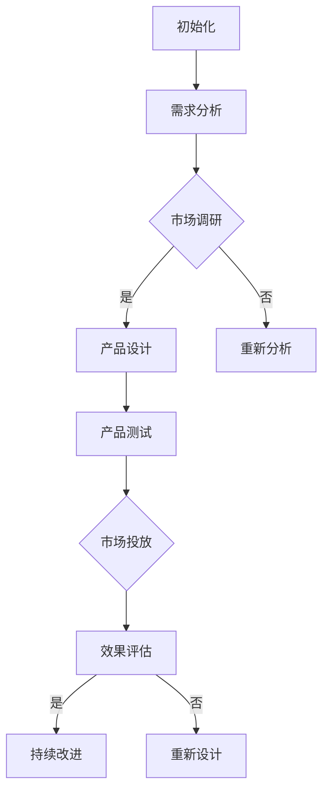

                 

### 《创业型思维：在企业中培养创新精神》

> 关键词：创新思维、创业型思维、企业、创新精神、可持续发展

> 摘要：本文深入探讨了创业型思维在企业中的应用，分析了其在提升企业竞争力、开拓新市场以及增强企业生命力方面的重要性。通过介绍创业型思维的要素、策略和实践方法，以及其在不同领域的应用，文章旨在为企业管理者和创业者提供培养创新精神的实际指导和策略建议。

# 第一部分：背景与概念

## 第1章：创新的重要性与挑战

### 1.1 创新的定义与分类

#### 1.1.1 创新的基本概念

创新是一种通过引入新的想法或方法来改进现有产品、服务或业务模式的过程。从广义上讲，创新可以定义为：

$$
\text{创新} = \text{新想法} + \text{新实践}
$$

这种定义强调了创新不仅涉及思想层面，还包括将想法转化为实际成果的过程。

#### 1.1.2 创新的类型

创新可以分为以下几种类型：

- **产品创新**：指的是通过改进或开发新产品或服务来满足市场需求。
- **过程创新**：指的是通过改进生产或服务过程，以提高效率、降低成本或提升质量。
- **市场创新**：指的是通过开发新的市场或市场细分，以扩大业务范围。

### 1.2 创新在企业中的作用

创新在企业中具有以下几个重要作用：

#### 1.2.1 提升竞争力

通过创新，企业可以开发出更具竞争力的产品和服务，从而在激烈的市场竞争中脱颖而出。

#### 1.2.2 开拓新市场

创新可以帮助企业发现新的市场需求，开拓新的市场机会。

#### 1.2.3 增强企业生命力

持续的创新可以确保企业在不断变化的市场环境中保持活力和竞争力。

### 1.3 创新面临的挑战

尽管创新对企业具有诸多益处，但企业在实施创新过程中也面临一些挑战：

#### 1.3.1 组织惯性与保守思维

企业内部可能存在对创新的抵触情绪，认为创新会带来不确定性和风险。

#### 1.3.2 资源与时间的限制

创新需要投入大量的资源，包括资金、人力和时间，这对企业来说是一个挑战。

#### 1.3.3 市场风险与不确定性

创新的产品或服务可能无法得到市场的认可，从而导致投资失败。

## 第2章：创业型思维的要素

### 2.1 创业型思维的培养

#### 2.1.1 问题解决导向

创业型思维强调以问题解决为导向，而不是以任务完成为导向。这意味着创业者需要具备敏锐的洞察力，能够识别和解决企业面临的问题。

#### 2.1.2 持续学习与适应

创业型思维要求个体具备持续学习的能力，以适应不断变化的市场环境。这种学习不仅包括知识的学习，还包括技能和思维方式的提升。

#### 2.1.3 愿景驱动

创业型思维强调愿景驱动，即以长期的愿景和目标为导向，而不是短期的利益。这种愿景可以激发创业者的创新动力。

### 2.2 创业型思维的核心能力

#### 2.2.1 创造力

创造力是创业型思维的核心能力之一。创业者需要具备丰富的想象力，能够从不同的角度思考问题，并提出创新的解决方案。

#### 2.2.2 风险管理

创业型思维要求创业者具备良好的风险管理能力。这意味着创业者需要能够识别潜在的风险，并制定相应的应对策略。

#### 2.2.3 团队协作

创业型思维强调团队合作的重要性。创业者需要能够有效地组建和管理团队，发挥团队成员的潜力，实现共同的目标。

### 2.3 创业型思维与组织文化

#### 2.3.1 创业型思维的组织特征

创业型思维的组织特征包括开放、包容和鼓励创新。这种文化可以激发员工的创新潜力，提高企业的整体竞争力。

#### 2.3.2 创业型思维与企业文化

企业文化是创业型思维的重要基础。一个积极的企业文化可以鼓励员工勇于创新，推动企业持续发展。

### 2.4 创业型思维的实践案例

#### 2.4.1 国内外企业创新案例

通过分析国内外企业的创新案例，我们可以看到创业型思维在不同领域的成功应用。

#### 2.4.2 创业型思维在企业中的应用

创业型思维在企业中的应用不仅限于初创企业，大型企业也可以通过创业型思维实现持续创新。

## 第3章：创业型思维的策略与实践

### 3.1 创业型思维的策略

#### 3.1.1 创新过程的引导

企业可以通过建立创新过程的管理机制，引导员工积极参与创新活动。

#### 3.1.2 创新资源的配置

企业需要合理配置创新资源，包括资金、人力和技术等。

#### 3.1.3 创新文化的建设

企业需要营造一个鼓励创新的文化氛围，激发员工的创新热情。

### 3.2 创业型思维的实践方法

#### 3.2.1 SWOT分析法

SWOT分析法可以帮助企业识别自身的优势、劣势、机会和威胁，为创新提供方向。

#### 3.2.2 设计思维方法论

设计思维方法论强调以用户需求为导向，通过迭代过程实现创新。

#### 3.2.3 研发项目管理

有效的研发项目管理可以帮助企业确保创新项目的顺利进行。

### 3.3 创业型思维的实践案例

#### 3.3.1 创新项目实施过程

通过分析创新项目的实施过程，我们可以看到创业型思维在实际应用中的具体操作。

#### 3.3.2 创新成果转化

创新成果的转化是创业型思维的重要目标之一。企业需要建立有效的成果转化机制，实现创新的价值。

#### 3.3.3 创业型思维在企业中的落地

创业型思维在企业中的落地需要结合企业的实际情况，制定具体的实施计划。

# 第二部分：创业型思维在不同领域的应用

## 第4章：在初创企业中的应用

### 4.1 初创企业的特点与挑战

#### 4.1.1 初创企业的定义

初创企业是指处于创业初期，规模较小，资源有限的企业。

#### 4.1.2 初创企业的特点

初创企业的特点包括：

- 资源有限
- 市场机会大
- 风险高
- 创新性强

#### 4.1.3 初创企业的挑战

初创企业面临的主要挑战包括：

- 资金短缺
- 市场竞争激烈
- 管理经验不足
- 技术难题

### 4.2 创业型思维在初创企业的应用

#### 4.2.1 初创企业的创新策略

初创企业可以通过以下策略来应用创业型思维：

- 以用户需求为导向
- 专注于核心业务
- 快速迭代

#### 4.2.2 初创企业的资源管理

初创企业需要有效管理有限的资源，以实现最大化效益。

#### 4.2.3 初创企业的风险管理

初创企业需要建立有效的风险管理机制，降低创业风险。

### 4.3 初创企业的成功案例

#### 4.3.1 国内初创企业案例分析

通过分析国内初创企业的成功案例，我们可以看到创业型思维在初创企业中的应用效果。

#### 4.3.2 国际初创企业案例分析

国际初创企业的成功案例也为国内初创企业提供了宝贵的经验和启示。

## 第5章：在大型企业中的应用

### 5.1 大型企业的特点与挑战

#### 5.1.1 大型企业的定义

大型企业是指规模较大，资源丰富，业务范围广泛的企业。

#### 5.1.2 大型企业的特点

大型企业的特点包括：

- 资源丰富
- 业务复杂
- 管理难度大
- 创新能力相对较弱

#### 5.1.3 大型企业的挑战

大型企业面临的主要挑战包括：

- 创新动力不足
- 管理层级多
- 市场反应速度慢
- 组织惯性

### 5.2 创业型思维在大型企业的应用

#### 5.2.1 大型企业的创新策略

大型企业可以通过以下策略来应用创业型思维：

- 建立创新实验室
- 推动组织变革
- 与初创企业合作

#### 5.2.2 大型企业的组织变革

大型企业需要通过组织变革来适应创业型思维的应用。

#### 5.2.3 大型企业的风险管理

大型企业需要建立有效的风险管理机制，以应对创新过程中的风险。

### 5.3 大型企业的创新实践

#### 5.3.1 国内外大型企业创新案例分析

通过分析国内外大型企业的创新实践，我们可以看到创业型思维在大型企业中的成功应用。

#### 5.3.2 创业型思维在大型企业中的实施路径

创业型思维在大型企业中的实施需要结合企业的实际情况，制定具体的实施路径。

## 第6章：在创业型组织中的应用

### 6.1 创业型组织的定义与特征

#### 6.1.1 创业型组织的定义

创业型组织是指具有创业精神，以创新为核心，追求持续成长和发展的组织。

#### 6.1.2 创业型组织的特征

创业型组织的特征包括：

- 以创新为导向
- 鼓励创新思维
- 快速响应市场变化
- 团队协作

#### 6.1.3 创业型组织的类型

创业型组织可以分为以下几种类型：

- 初创企业
- 创新型部门
- 创新型子公司

### 6.2 创业型思维在创业型组织中的应用

#### 6.2.1 创业型组织的创新策略

创业型组织可以通过以下策略来应用创业型思维：

- 建立创新平台
- 鼓励内部创业
- 实施开放式创新

#### 6.2.2 创业型组织的团队管理

创业型组织需要建立有效的团队管理机制，激发团队成员的创造力。

#### 6.2.3 创业型组织的风险管理

创业型组织需要建立有效的风险管理机制，以应对创新过程中的风险。

### 6.3 创业型组织的成功案例

#### 6.3.1 创业型组织案例分析

通过分析创业型组织的成功案例，我们可以看到创业型思维在组织管理中的重要作用。

#### 6.3.2 创业型思维在创业型组织中的实践效果

创业型思维在创业型组织中的实践效果显著，为组织的发展注入了强大的动力。

## 第7章：创业型思维的可持续发展

### 7.1 创业型思维与可持续发展

#### 7.1.1 可持续发展的定义

可持续发展是指在满足当前需求的同时，不损害后代满足其需求的能力。

#### 7.1.2 可持续发展的原则

可持续发展的原则包括公平性、持续性和共同性。

#### 7.1.3 创业型思维与可持续发展的关系

创业型思维与可持续发展密切相关。创业型思维强调创新和持续发展，是实现可持续发展的重要途径。

### 7.2 创业型思维的可持续发展策略

#### 7.2.1 创新与可持续发展的融合

企业需要将创新与可持续发展紧密结合，实现双赢。

#### 7.2.2 企业社会责任与创业型思维

企业社会责任是创业型思维的重要组成部分，是实现可持续发展的关键。

#### 7.2.3 创业型思维的长期规划

企业需要制定长期的创业型思维规划，确保可持续发展。

### 7.3 创业型思维的可持续发展实践

#### 7.3.1 可持续发展的创新案例

通过分析可持续发展的创新案例，我们可以看到创业型思维在实现可持续发展中的重要作用。

#### 7.3.2 企业可持续发展战略的实施

企业需要制定并实施可持续发展战略，确保创业型思维的可持续发展。

---

### 附录

#### 附录A：核心概念对比表

| 概念           | 定义                                                     | 关联性                                                     |
|----------------|----------------------------------------------------------|----------------------------------------------------------|
| 创新           | 新想法 + 新实践                                       | 推动企业发展的核心动力                                   |
| 创业型思维     | 问题解决导向 + 持续学习 + 愿景驱动                  | 提升企业创新能力和竞争力的关键因素                       |
| 可持续发展     | 满足当前需求的同时，不损害后代满足其需求的能力   | 企业长期发展的必然选择，与创业型思维紧密相关             |

#### 附录B：创业型思维的ER实体关系图

```mermaid
erDiagram
  Product ||--o{ Innovation}
  Process ||--o{ Innovation}
  Market  ||--o{ Innovation}
  Company  ||--o{ Innovation}
  Culture  ||--o{ Culture}
  Mindset  ||--o{ Mindset}
  Strategy ||--o{ Practice}
  Method   ||--o{ Practice}
  Case     ||--o{ Case}
```

#### 附录C：创新算法原理讲解

##### 算法流程图



##### 算法Python源代码

```python
# 初始化需求分析
def initialize_demand_analysis():
    print("初始化需求分析")

# 市场调研
def market_research():
    print("进行市场调研")

# 产品设计
def product_design():
    print("进行产品设计")

# 产品测试
def product_test():
    print("进行产品测试")

# 市场投放
def market_launch():
    print("市场投放")

# 效果评估
def effect_evaluation():
    print("效果评估")

# 持续改进
def continuous_improvement():
    print("持续改进")

# 重新设计
def redesign():
    print("重新设计")

# 创新算法主流程
def innovation_algorithm():
    initialize_demand_analysis()
    market_research()
    if market_research():
        product_design()
        product_test()
        market_launch()
        effect_evaluation()
        if effect_evaluation():
            continuous_improvement()
        else:
            redesign()
    else:
        print("重新分析")

# 执行创新算法
innovation_algorithm()
```

---

**作者：AI天才研究院/AI Genius Institute & 禅与计算机程序设计艺术 /Zen And The Art of Computer Programming**

---

### 小结

本文系统地阐述了创业型思维在企业中的应用，包括其重要性、要素、策略和实践方法。创业型思维不仅适用于初创企业，也对大型企业和创业型组织具有重要意义。通过培养创业型思维，企业可以提升创新能力，增强竞争力，实现可持续发展。

**注意事项**：

- 创新是一个持续的过程，需要企业长期投入和坚持。
- 创业型思维需要与企业的实际情况相结合，制定具体的实施计划。
- 企业应注重文化建设，营造一个鼓励创新的环境。

**拓展阅读**：

- 《创新者的窘境》作者：克里斯坦森
- 《精益创业》作者：布兰森·梅尔
- 《创新与企业家精神》作者：彼得·德鲁克

通过这些书籍，读者可以深入了解创新和企业发展的相关理论，进一步提升自己的创业型思维。

