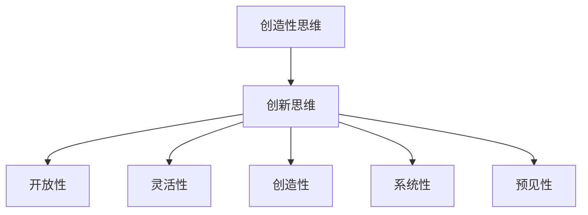
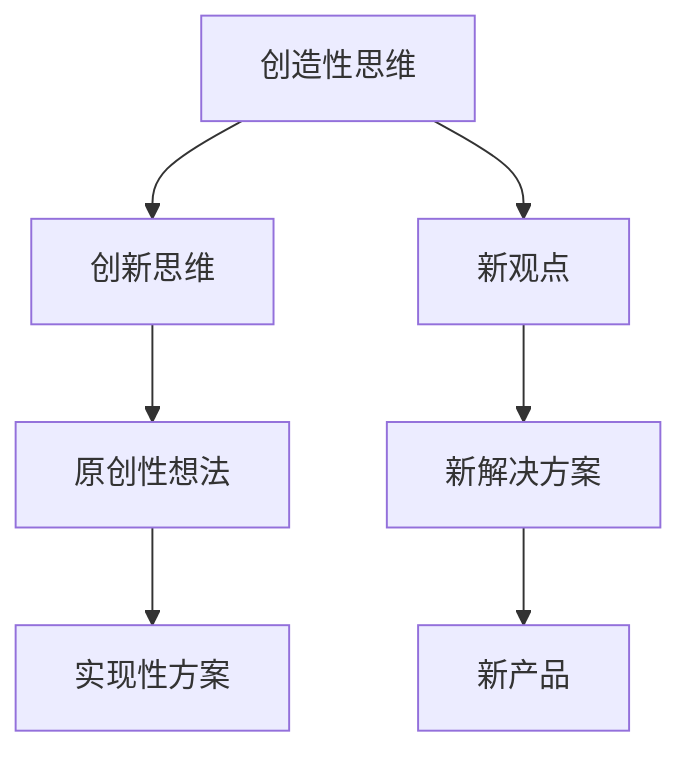

                 

### 引言与背景

创新思维作为现代社会的重要生产力，已经成为推动科技进步、经济发展和社会进步的核心驱动力。在IT行业，创新思维更是企业竞争的制高点。因此，如何培养和激发团队的创新思维，成为企业和组织关注的焦点。《创新思维培养：激发团队创造力的方法》旨在为读者提供系统、实用的创新思维培养方法，帮助团队成员提高创新能力，推动团队整体创造力的提升。

**关键词：创新思维、团队创造力、培养方法**

**摘要：** 本篇文章将围绕创新思维的核心概念、激发团队创造力的方法、实践中的创新思维培养以及创新思维的评估与优化等方面进行深入探讨。通过逻辑清晰、结构紧凑的论述，帮助读者理解创新思维的内涵和重要性，掌握激发团队创造力的技巧，并为实际工作提供指导。

### 目录

1. **引言与背景**
    1.1 书籍的目的与读者对象
    1.2 创新思维的重要性
    1.3 团队创造力培养的背景
2. **创新思维的核心概念**
    2.1 创新思维的定义与特征
    2.2 创新思维的类型
    2.3 创新思维与创造性思维的关系
3. **激发团队创造力的方法**
    3.1 创造力激发的理论基础
    3.2 团队建设与创造力培养
    3.3 创新思维训练方法
    3.4 案例分析：成功团队的创新实践
4. **实践中的创新思维培养**
    4.1 创新思维培养的实施步骤
    4.2 教育机构的创新思维培养
    4.3 企业中的创新思维培养
    4.4 创新思维培养的最佳实践
5. **创新思维的评估与优化**
    5.1 创新思维评估指标
    5.2 创新思维的反馈与改进
    5.3 创新思维的持续培养策略
6. **总结与展望**
    6.1 创新思维培养的总结
    6.2 团队创造力培养的未来发展趋势
    6.3 总结与展望

接下来，我们将逐一探讨这些章节的内容，让读者对创新思维培养有一个全面而深入的理解。

### 1.1 书籍的目的与读者对象

《创新思维培养：激发团队创造力的方法》旨在为广大IT从业者、企业高管、教育培训机构提供一套系统、实用、可操作的创新思维培养方法和策略。本书的核心目标是通过深入分析创新思维的本质、探讨激发团队创造力的方法，帮助读者掌握如何在实际工作中培养和提升创新思维，从而推动团队整体创造力的提升。

**读者对象：**
- IT行业的从业者，特别是软件开发人员、产品经理、项目经理等；
- 企业高管，特别是需要带领团队进行创新和发展的管理人员；
- 教育培训机构，特别是致力于培养学生创新能力和创造力的教育工作者。

**书籍目的：**
1. **理解创新思维的核心概念和特征：** 通过对创新思维的定义、类型及其与创造性思维的关系的深入探讨，帮助读者理解创新思维的内涵和重要性。
2. **掌握激发团队创造力的方法：** 通过分析创造力激发的理论基础、团队建设与创造力培养的方法，提供实用的创新思维训练方法和策略。
3. **实践中的创新思维培养：** 通过介绍创新思维培养的实施步骤、教育机构和企业中的创新思维培养实践，提供具体可行的操作指南。
4. **创新思维的评估与优化：** 通过评估创新思维指标、反馈与改进策略，帮助读者持续优化创新思维培养过程。

通过本书的学习，读者将能够：
- 理解并掌握创新思维的核心概念和方法；
- 学会在团队中培养和激发创新思维；
- 将创新思维应用到实际工作中，提高个人和团队的创造力；
- 通过持续培养和优化，不断提升团队的整体创新能力。

### 1.2 创新思维的重要性

在当今快速变化的IT行业，创新思维已经成为企业持续发展的关键驱动力。它不仅关系到企业的生存和发展，更影响着整个社会的进步。以下将详细阐述创新思维的重要性，并探讨其在IT行业中的具体体现。

**创新思维的定义：** 创新思维是一种能够发现新的观点、新的解决方案、新的产品和服务的能力，它不同于传统的思维方式，强调对现有知识、技术和资源的重新组合和应用。创新思维的核心在于突破常规，寻找新的解决途径。

**创新思维的重要性：**
1. **驱动企业成长：** 创新思维是企业保持竞争力的关键。在技术更新换代速度加快、市场竞争激烈的今天，只有通过持续创新，企业才能在激烈的市场竞争中立于不败之地。创新思维能够帮助企业发现市场需求、优化产品和服务，从而实现企业的持续成长。
2. **提高团队效率：** 创新思维能够激发团队成员的创造力和主动性，提高团队的工作效率。通过创新思维，团队成员可以更灵活地应对挑战，寻找更高效的解决方案，从而提高整体工作效率。
3. **促进个人发展：** 创新思维不仅是企业成功的关键，也是个人职业发展的助力。具备创新思维的人能够在工作中展现出独特的见解和解决问题的能力，从而获得更多的发展机会和晋升空间。
4. **推动社会进步：** 创新思维不仅对企业和个人有益，更是社会进步的重要推动力。通过创新，社会能够解决更多复杂问题，创造更多的价值和福祉。

**创新思维在IT行业的具体体现：**
1. **技术创新：** IT行业以技术创新为核心，创新思维在此领域的体现尤为明显。例如，云计算、大数据、人工智能等新兴技术的出现，都是创新思维的产物。这些技术的不断创新和应用，推动了整个行业的快速发展。
2. **产品创新：** IT行业的产品创新也非常突出。通过创新思维，企业能够不断推出更具竞争力的产品和服务，满足市场和用户的需求。例如，智能手机的兴起、电子商务平台的崛起，都是创新思维在产品创新中的成功案例。
3. **商业模式创新：** 在IT行业，创新思维同样体现在商业模式的创新上。通过创新思维，企业能够找到新的商业模式，实现商业价值的最大化。例如，共享经济、平台经济等新型商业模式的兴起，都是创新思维的成功实践。

**案例研究：**
- **谷歌（Google）**：谷歌以其创新思维而闻名于世。从最初的搜索引擎到后来的云计算、人工智能等，谷歌不断创新，引领着整个IT行业的潮流。
- **苹果（Apple）**：苹果公司通过持续的创新思维，推出了多个革命性的产品，如iPhone、iPad等，不仅改变了人们的生活方式，也推动了整个IT行业的发展。

综上所述，创新思维在IT行业中的重要性不言而喻。它不仅是企业发展的关键，也是社会进步的重要动力。培养和激发创新思维，已经成为企业和个人不可忽视的重要任务。

### 1.3 团队创造力培养的背景

团队创造力培养是现代企业特别是IT行业关注的重点之一。随着技术的快速发展和市场竞争的加剧，企业不仅需要个体具备创新能力，更需要整个团队能够协同合作，共同应对复杂问题，实现创新目标。以下将探讨团队创造力培养的背景、重要性和挑战。

**背景：** 
随着全球化、互联网技术和人工智能的快速发展，企业和组织面临的环境变得更加复杂多变。传统的单打独斗已经无法满足市场需求，团队协作和创造力变得尤为重要。此外，客户对产品和服务的要求也越来越高，企业需要通过创新来提升竞争力，满足不断变化的市场需求。

**重要性：**
1. **提高整体效能：** 团队创造力培养能够激发团队成员的潜力，提高整体团队的效能。通过协同合作，团队成员可以相互补充，共同解决复杂问题，实现创新目标。
2. **增强竞争力：** 具有高度创造力的团队能够迅速响应市场变化，不断推出创新的产品和服务，提高企业的竞争力。
3. **促进个人成长：** 团队创造力培养不仅有利于团队整体发展，也有助于团队成员的个人成长。通过参与创新项目，团队成员可以提升专业技能和解决问题的能力，为个人职业发展奠定基础。

**挑战：**
1. **团队沟通与协作：** 团队创造力培养需要良好的沟通与协作机制。在多元化和复杂的工作环境中，如何确保团队成员之间的有效沟通和协作，是一个重要的挑战。
2. **文化氛围：** 创造力培养需要一种开放、包容和鼓励创新的文化氛围。企业需要营造一个支持创新的氛围，鼓励团队成员敢于尝试、勇于失败。
3. **资源分配：** 团队创造力培养需要充足的资源支持，包括人力、物力和时间。如何在有限的资源下，合理分配并充分利用资源，是一个需要解决的挑战。

**当前趋势：**
1. **多样化团队建设：** 现代企业越来越注重团队多样化，通过吸纳不同背景、经验和技能的成员，实现团队创造力最大化。
2. **创新管理方法：** 企业开始采用更多的创新管理方法，如敏捷开发、跨部门合作等，以激发团队创造力。
3. **持续培训与学习：** 企业重视员工的持续培训和技能提升，通过提供各种学习和培训机会，不断提升团队的整体创新能力。

总之，团队创造力培养在当前背景下具有重要的现实意义。面对复杂多变的市场环境，企业需要通过培养和激发团队创造力，实现持续创新和竞争优势。虽然过程中会遇到各种挑战，但通过有效的管理方法和策略，这些挑战是可以被克服的。

### 2.1 创新思维的定义与特征

创新思维是现代社会发展的核心动力之一，其重要性在多个领域得到了广泛的认可。要深入理解创新思维，我们首先需要明确其定义和特征。

**定义：** 创新思维是一种能够发现新的观点、新的解决方案、新的产品和服务的能力。它强调对现有知识、技术和资源的重新组合和应用，从而创造新的价值。创新思维不仅仅是一种思维方式，更是一种解决问题的方法和策略。

**特征：**
1. **开放性：** 创新思维要求具有开放的思维模式，能够接受不同的观点和想法，不拘泥于传统和常规。这种开放性使得创新思维能够从多个角度审视问题，寻找新的解决途径。
2. **灵活性：** 创新思维强调灵活性，能够在不同情境和条件下迅速调整思维，寻找最佳的解决方案。灵活性使得创新思维能够适应复杂多变的环境，提高解决问题的效率。
3. **创造性：** 创新思维的核心在于创造性，它能够产生新颖的想法和解决方案。创造性使得创新思维在解决问题时能够突破常规，找到独特的解决途径。
4. **系统性：** 创新思维具有系统性，能够从整体上审视问题，分析问题的各个方面和相互作用，从而找到最优的解决方案。系统性使得创新思维能够更全面、更深入地理解问题，提高解决问题的质量。
5. **预见性：** 创新思维具有预见性，能够预测未来的发展趋势和潜在的机会。预见性使得创新思维能够在未来竞争中占据先机，抓住新的机遇。

**与创造性思维的关系：**
创新思维与创造性思维密切相关，但两者并不完全相同。创造性思维是一种更广泛的思维方式，它强调创造新的想法和解决方案，而创新思维则更侧重于将这些创造性想法应用到实际问题和挑战中，产生实际的价值。创新思维是创造性思维的具体体现和实际应用。

**创新思维与创造性思维的关系图：**

通过这张ER实体关系图，我们可以更清晰地看到创新思维和创造性思维之间的联系和区别。创新思维作为创造性思维的具体实现，需要具备开放性、灵活性、创造性、系统性和预见性等特征。

**案例分析：**
- **谷歌的“20%时间”政策：** 谷歌曾经实行过“20%时间”政策，允许员工在日常工作中的20%的时间里自由探索和尝试新的项目。这个政策激发了员工们的创新思维，产生了许多重要的创新，如Gmail和Google News等。
- **3M的“15%时间”项目：** 3M公司也推出了“15%时间”项目，鼓励员工将15%的工作时间用于个人兴趣和创新的探索。这个项目推动了3M公司在多个领域的创新，如著名的粘性便签便是在这个项目中诞生的。

通过以上案例，我们可以看到，创新思维在实际工作中的重要性以及如何通过具体措施来培养和激发创新思维。接下来，我们将进一步探讨创新思维的类型，帮助读者更全面地理解这一核心概念。

### 2.2 创新思维的类型

创新思维不仅仅是产生新想法和解决方案的过程，它还包括多种不同的思维模式和方法。以下我们将探讨几种主要的创新思维类型，并分析它们各自的特点和应用场景。

**1. 横向思维：**
横向思维，也称为横向思考或横向创造性思维，是一种从不同角度、不同维度重新审视问题的方法。它强调跨越传统思维框架，寻找新的关联和解决方案。

**特点：**
- **多样性：** 横向思维能够从多个维度审视问题，产生多样的解决方案。
- **灵活性：** 它能够灵活地结合不同领域的知识和经验，从而找到独特的解决方案。
- **创造性：** 横向思维鼓励创造性思考，能够突破传统框架，找到新颖的解决方案。

**应用场景：**
- **产品创新：** 例如，在设计新型电子产品时，通过横向思维，可以结合不同领域的材料、技术等，创造出全新的产品形态。
- **问题解决：** 在处理复杂问题时，横向思维能够帮助我们从多个角度审视问题，找到更全面的解决方案。

**2. 纵向思维：**
纵向思维，也称为纵向思考或纵向创造性思维，是一种深入分析问题，逐步挖掘问题本质的方法。它强调通过系统化的分析，逐步深入到问题的核心，从而找到根本性的解决方案。

**特点：**
- **系统性：** 纵向思维注重系统化分析，能够逐步深入到问题的各个层面。
- **精确性：** 它能够通过精确的分析，找到问题的根本原因和解决方法。
- **科学性：** 纵向思维强调科学的方法和逻辑，通过逐步分析，找到问题的科学解决方案。

**应用场景：**
- **技术优化：** 在优化技术方案时，通过纵向思维，可以逐步深入到技术细节，找到最优的解决方案。
- **问题诊断：** 在处理技术问题时，通过纵向思维，可以深入分析问题，找到问题的根本原因，从而进行有效的修复。

**3. 逆向思维：**
逆向思维，也称为逆向创造性思维，是一种从问题的反面、逆向思考问题的方法。它强调通过反向思考，发现问题的另一个角度，从而找到新的解决方案。

**特点：**
- **颠覆性：** 逆向思维能够颠覆传统的思维模式，从问题的另一面找到新的解决方案。
- **创新性：** 它能够通过反向思考，激发创新思维，找到新颖的解决方案。
- **反思性：** 逆向思维强调反思和批判，通过反思问题的另一面，发现新的问题和解决方案。

**应用场景：**
- **产品改进：** 例如，在设计产品时，通过逆向思维，可以反思现有的设计，发现潜在的问题和改进空间。
- **战略规划：** 在制定企业战略时，通过逆向思维，可以反思现有的战略，发现潜在的竞争和机会。

**4. 联想思维：**
联想思维，也称为联想创造性思维，是一种通过联想和关联，将不同的事物和概念结合起来，从而产生新的想法和解决方案的方法。

**特点：**
- **广泛性：** 联想思维能够从广泛的角度和领域寻找联系，产生多样化的解决方案。
- **创新性：** 它能够通过联想，发现新的关联和组合，产生新颖的解决方案。
- **灵活性：** 联想思维强调灵活性，能够快速地从一个概念跳到另一个概念，激发创新思维。

**应用场景：**
- **创意设计：** 在进行创意设计时，通过联想思维，可以快速找到新的设计灵感和创意。
- **问题解决：** 在处理问题时，通过联想思维，可以找到不同领域的知识和经验，找到新的解决方案。

通过以上对几种创新思维类型的探讨，我们可以看到，不同的创新思维类型在解决不同类型的问题时具有独特的优势。在实际应用中，我们可以根据问题的特点和需求，灵活运用不同的创新思维方法，从而激发团队的创造力，实现创新目标。

### 2.3 创新思维与创造性思维的关系

创新思维和创造性思维是两个紧密相连但又有所区别的概念。它们共同构成了推动创新活动的重要思维模式，但在具体应用和作用上存在一定的差异。以下我们将深入探讨两者之间的关系、区别以及相互联系。

**关系：**
创新思维和创造性思维是相互依存的。创造性思维是创新思维的基础，它强调从无到有的创造过程，产生新的想法和概念。而创新思维则是在创造性思维的基础上，将这些想法和概念应用到实际问题中，通过具体的方法和策略实现创新。

**区别：**
1. **创造性思维：** 主要关注从零开始，创造新的观点、解决方案或产品。它是一种原创性思考的方式，强调突破常规，寻找新颖独特的想法。
2. **创新思维：** 主要关注将创造性思维中的新观点和解决方案转化为实际应用，解决实际问题。它是一种实现性思考的方式，强调将创意转化为实际价值。

**联系：**
1. **相互补充：** 创新思维和创造性思维在创新过程中相互补充。创造性思维提供新的想法和概念，而创新思维则将这些想法转化为可操作的实际方案。
2. **互动过程：** 创新思维和创造性思维之间存在互动关系。创造性思维产生的创新点需要通过创新思维进行验证和实施，而创新思维在实施过程中又会激发新的创造性思维。

**实际应用案例：**
- **案例1：** 在产品设计过程中，创造性思维可以帮助团队提出多种设计方案，而创新思维则在这些方案中筛选出最具实用性和市场价值的设计，最终实现产品的创新。
- **案例2：** 在解决复杂问题时，创造性思维可以帮助团队找到多种解决方案，而创新思维则通过评估和优化，选择最佳的解决方案，从而实现问题的创新解决。

**ER实体关系图：**

通过上述ER实体关系图，我们可以更清晰地看到创新思维和创造性思维之间的相互作用和联系。创造性思维产生新的观点和解决方案，而创新思维则将这些观点和方案转化为实际应用，从而实现创新。

**总结：**
创新思维和创造性思维在创新过程中各司其职，但又相互依存。创造性思维提供创新的源泉，而创新思维则将这些源泉转化为实际应用，推动创新活动的实现。理解和运用两者的关系，有助于我们在实际工作中更好地激发团队的创新能力，实现持续创新。

### 3.1 创造力激发的理论基础

为了有效激发团队的创造力，我们需要深入了解相关理论，并掌握一系列激发创造力的方法和策略。以下我们将探讨创造力激发的理论基础，包括相关理论和实际应用案例。

**1. 赫伯特·西蒙的“创造力是一种决策过程”理论：**
赫伯特·西蒙认为创造力是一种决策过程，它包括四个阶段：定义问题、提出解决方案、评估方案和选择最佳方案。这一理论强调了创造力是一个系统性过程，而不是偶然的灵光一现。

**实际应用案例：**
- **企业创新项目：** 在企业进行创新项目时，可以按照西蒙的理论，首先定义问题，然后提出多种解决方案，接着评估和选择最佳方案，从而系统地激发团队的创造力。

**2. 斯滕伯格的“三元智力理论”：**
斯滕伯格的“三元智力理论”认为，智力包括分析性智力、创造性智力和应用性智力。创造性智力是其中的一部分，它强调个体在解决问题时的创新性和创造性。

**实际应用案例：**
- **教育培训：** 教育机构可以通过设计创造性课程和实践活动，培养学生的创造性智力，从而激发学生的创造力。

**3. 吉尔福特的心理结构模型：**
吉尔福特认为，智力包括内容、操作和产品三个维度，其中产品维度关注创造力的表现。他认为创造力是一个多维度的结构，不仅包括创新性想法，还包括对想法的应用和实现。

**实际应用案例：**
- **产品开发：** 在产品开发过程中，可以运用吉尔福特的理论，通过多维度的创新，提高产品的创造力和市场竞争力。

**激发创造力的方法和策略：**
1. **提供充足的时间和资源：** 创造力需要时间和资源的支持。企业应该为团队提供充足的时间和资源，让团队成员有足够的时间和资源进行创新探索。
2. **建立开放和包容的文化氛围：** 创造力需要开放和包容的环境。企业应该营造一个鼓励创新、包容失败的文化氛围，让团队成员敢于尝试新想法，勇于挑战现状。
3. **提供多样化的挑战和机会：** 创造力往往在解决复杂问题和面对挑战时得到激发。企业可以通过设置多样化的挑战和机会，激发团队的创造力。
4. **鼓励跨部门和跨领域的合作：** 创造力可以通过跨部门和跨领域的合作得到激发。企业可以鼓励团队成员与其他部门和领域的同事合作，共同解决问题，从而激发团队的创造力。
5. **提供培训和学习机会：** 培训和学习机会可以帮助团队成员提升创造力和解决问题的能力。企业可以定期组织创造力和问题解决能力的培训，帮助团队成员不断提升自己的创造力。

**实际案例：**
- **谷歌的“20%时间”政策：** 谷歌为员工提供20%的时间，让他们自由探索和尝试新的项目。这一政策激发了员工的创造力，产生了许多重要的创新，如Gmail和Google News等。
- **3M的“15%时间”项目：** 3M公司鼓励员工将15%的工作时间用于个人兴趣和创新探索。这一项目推动了3M公司在多个领域的创新，如著名的粘性便签便是在这个项目中诞生的。

通过以上理论和方法的探讨，我们可以看到，创造力激发需要理论基础的支持，同时也需要实际操作的策略。理解和应用这些理论和方法，可以帮助企业有效地激发团队的创造力，推动创新活动。

### 3.2 团队建设与创造力培养

团队建设是激发团队创造力的重要环节。一个高效的团队不仅能够提高工作效率，还能在创新过程中发挥关键作用。以下我们将探讨团队建设的重要性、关键要素以及如何通过有效的团队建设培养团队创造力。

**团队建设的重要性：**
1. **提高工作效率：** 高效的团队能够更迅速地完成工作任务，提高整体工作效率。
2. **促进知识共享：** 团队成员之间的协作可以促进知识的共享和交流，从而激发新的想法和创意。
3. **增强团队凝聚力：** 团队建设有助于增强团队成员之间的信任和合作，提高团队凝聚力。
4. **提升创新力：** 团队建设能够为团队成员提供更好的创新环境，激发团队的创造力，推动创新活动的实现。

**团队建设的关键要素：**
1. **明确的团队目标：** 明确的团队目标是团队建设的基石。团队需要明确共同的目标和愿景，以便在工作和创新过程中保持一致的方向。
2. **良好的沟通机制：** 良好的沟通机制是团队协作和知识共享的前提。团队需要建立有效的沟通渠道和方式，确保信息的流畅传递。
3. **多样化的团队成员：** 多样化的团队成员能够提供不同的视角和经验，促进创新思维的碰撞和融合。
4. **积极的团队氛围：** 积极的团队氛围能够激发团队成员的创造力和主动性，促进团队创新。
5. **合理的资源分配：** 合理的资源配置能够确保团队有足够的资源和支持进行创新探索。

**如何通过团队建设培养团队创造力：**
1. **制定明确的团队目标：** 团队需要明确共同的目标和愿景，以便在工作和创新过程中保持一致的方向。这可以通过定期的团队会议和目标设定活动来实现。
2. **建立有效的沟通机制：** 团队需要建立有效的沟通渠道和方式，确保信息的流畅传递。这可以通过团队内部的邮件、即时通讯工具、会议等方式来实现。
3. **鼓励跨部门和跨领域的合作：** 鼓励团队成员与其他部门和领域的同事合作，可以促进创新思维的碰撞和融合，从而激发团队的创造力。
4. **提供培训和成长机会：** 定期为团队成员提供创造力和问题解决能力的培训，帮助他们提升自己的能力，从而增强团队的整体创新能力。
5. **营造积极的工作氛围：** 营造一个鼓励创新、包容失败的工作氛围，让团队成员敢于尝试新想法，勇于挑战现状。
6. **合理分配资源：** 为团队提供充足的资源和支持，确保团队有足够的资源进行创新探索。

**实际案例：**
- **谷歌的团队建设：** 谷歌通过建立开放和包容的工作环境，鼓励跨部门和跨领域的合作，提供丰富的资源和培训机会，成功地激发了团队的创造力，推动了公司持续的创新和发展。
- **3M的创新团队建设：** 3M公司通过设立“15%时间”项目，鼓励员工将工作时间的一部分用于个人兴趣和创新探索，从而激发了团队的创造力，推动了公司在多个领域的创新。

通过以上探讨，我们可以看到，团队建设在培养团队创造力中扮演着重要角色。通过有效的团队建设，企业可以激发团队的创造力，推动创新活动的实现，从而在激烈的市场竞争中保持竞争优势。

### 3.3 创新思维训练方法

为了提升团队的创新能力，系统化的创新思维训练方法至关重要。以下我们将探讨几种常用的创新思维训练方法，并分析其具体应用和效果。

**1.头脑风暴法：**
头脑风暴法是一种通过集体讨论，迅速产生大量创意的方法。其核心在于鼓励团队成员自由发表意见，不计较创意的好坏，追求数量。

**应用和效果：**
- **应用：** 头脑风暴法适用于团队初期阶段，用于快速生成创意。它可以帮助团队打破常规思维，发现潜在的创新点。
- **效果：** 通过头脑风暴法，团队成员可以互相启发，碰撞出新的创意火花。这种方法能够激发团队的创造力，提高创新效率。

**案例：**
- **谷歌的产品开发：** 在谷歌，每次新产品开发过程中都会进行头脑风暴，团队成员自由发表意见，从而激发出许多创新的产品概念。

**2.六顶思考帽法：**
六顶思考帽法是由爱德华·德·波诺提出的一种思维训练方法，它通过分别佩戴不同颜色的帽子，代表不同的思考方式，进行系统化的思考。

**应用和效果：**
- **应用：** 六顶思考帽法适用于需要深入分析问题的团队。它可以帮助团队成员从不同角度审视问题，避免思维定势。
- **效果：** 通过六顶思考帽法，团队可以更全面地分析问题，提出多样化的解决方案，从而提高创新能力。

**案例：**
- **企业的战略规划：** 在制定企业战略时，企业可以使用六顶思考帽法，从不同角度分析市场、竞争和内部资源，从而制定出更有效的战略。

**3.思维导图法：**
思维导图法是通过图形化的方式，将思维过程和创意内容可视化，从而帮助团队成员更好地理解和组织思考。

**应用和效果：**
- **应用：** 思维导图法适用于需要整理和梳理复杂信息的团队。它可以帮助团队成员清晰地理解问题，找到解决方案。
- **效果：** 通过思维导图法，团队可以更系统地分析问题，梳理思路，从而提高创新效率。

**案例：**
- **项目规划：** 在进行项目规划时，团队可以使用思维导图法，梳理项目需求、目标和步骤，确保项目顺利推进。

**4.情景模拟法：**
情景模拟法是一种通过模拟实际问题场景，让团队成员在实际操作中体验和解决问题的方法。

**应用和效果：**
- **应用：** 情景模拟法适用于需要提升团队应对实际问题能力的团队。它可以帮助团队成员在模拟环境中实践创新思维，提升解决问题的能力。
- **效果：** 通过情景模拟法，团队成员可以在模拟环境中体验到创新的挑战和乐趣，从而激发创造力，提高团队整体应对问题的能力。

**案例：**
- **应急响应训练：** 企业可以通过情景模拟法，模拟各种紧急情况，让团队成员在模拟环境中进行应急响应训练，提升团队应对突发事件的能力。

通过以上对创新思维训练方法的探讨，我们可以看到，不同的训练方法在激发团队创造力方面具有独特的优势和效果。结合实际情况，灵活运用这些方法，可以帮助团队系统化地提升创新能力，实现持续创新。

### 3.4 案例分析：成功团队的创新实践

为了更好地理解如何培养和激发团队的创造力，我们可以通过分析一些成功团队的创新实践案例，从中汲取经验和教训。

**案例1：谷歌的“20%时间”政策**

谷歌的“20%时间”政策是一项著名的创新举措，它允许员工在工作时间的20%内自由探索和尝试新的项目。这一政策激发了谷歌员工的创造力，产生了许多重要的创新成果，如Gmail、Google News等。

**经验与教训：**
- **经验：** 谷歌通过提供时间和资源支持，鼓励员工自由探索，从而激发了团队的创造力。这种开放和包容的文化氛围为员工的创新提供了良好的土壤。
- **教训：** “20%时间”政策并不是一成不变的，谷歌在实施过程中也进行了调整和优化。企业需要根据实际情况，灵活调整创新政策，确保其能够持续激发团队的创造力。

**案例2：3M的“15%时间”项目**

3M公司推出了“15%时间”项目，鼓励员工将工作时间的15%用于个人兴趣和创新探索。这一项目推动了3M公司在多个领域的创新，如著名的粘性便条便是在这个项目中诞生的。

**经验与教训：**
- **经验：** 3M通过为员工提供时间和资源，鼓励他们自由探索，从而激发了团队的创造力。这种开放和包容的文化氛围有助于员工勇于尝试新想法。
- **教训：** 企业在实施类似政策时，需要确保员工有足够的支持和资源，避免创新过程中因资源不足而受挫。

**案例3：苹果公司的“创造力实验室”**

苹果公司在其研发部门设立了“创造力实验室”，为员工提供了一个自由创新的环境。在这个实验室中，员工可以自由地尝试新的技术和想法，不受传统思维的束缚。

**经验与教训：**
- **经验：** 苹果公司通过为员工创造一个自由创新的环境，激发了他们的创造力。这种支持员工自由探索的文化氛围有助于产生创新成果。
- **教训：** 企业在设立类似实验室时，需要确保提供足够的资源和设备支持，确保员工能够顺利开展创新工作。

**案例4：联合利华的“创新工作坊”**

联合利华通过定期组织“创新工作坊”，邀请来自不同部门和领域的员工参与。在工作坊中，员工可以分享自己的创意，并通过团队合作，将创意转化为实际的项目。

**经验与教训：**
- **经验：** 通过创新工作坊，联合利华成功地促进了跨部门和跨领域的合作，激发了团队的创造力。这种合作模式有助于产生多样化的创新成果。
- **教训：** 企业在组织类似活动时，需要确保活动形式丰富多样，以适应不同员工的创新需求。

通过以上案例分析，我们可以看到，成功团队的创新能力培养离不开开放和包容的文化氛围、充足的资源支持和灵活的管理策略。结合这些经验，企业可以更好地培养和激发团队的创造力，推动创新活动。

### 4.1 创新思维培养的实施步骤

为了系统性地培养团队的创新思维，我们需要遵循一系列实施步骤。以下我们将详细讨论这些步骤，并提供具体的执行策略和注意事项。

**步骤1：定义目标和问题**

在培养创新思维的第一步，团队需要明确目标和问题。这包括确定创新的目标是什么，以及当前面临的问题是什么。通过明确目标和问题，团队可以更有针对性地开展创新活动。

**执行策略：**
- **明确创新目标：** 团队可以通过讨论和共识的方式，明确创新的目标。这可以是提高产品竞争力、解决具体问题或探索新的市场机会。
- **识别问题：** 团队需要对当前面临的问题进行深入分析，确保问题定义清晰、具体。可以通过问卷调查、访谈等方式收集团队成员的意见和反馈。

**注意事项：**
- **目标与问题要具体：** 目标和问题必须具体、可度量，以便后续的评估和改进。
- **全员参与：** 确保所有团队成员都参与目标设定和问题识别，以提高团队的共识和积极性。

**步骤2：收集信息和资源**

在明确了目标和问题后，团队需要收集相关的信息和资源。这包括市场研究、竞争对手分析、技术资料等，以便为创新提供充足的数据支持。

**执行策略：**
- **市场调研：** 通过市场调研，了解市场需求和用户反馈，为创新提供市场需求的信息。
- **技术分析：** 分析现有技术和潜在技术，评估其适用性和可行性，为创新提供技术支持。
- **资源整合：** 整合内外部资源，如公司内部的技术和人力资源，以及外部的合作伙伴和顾问资源。

**注意事项：**
- **数据真实可靠：** 确保收集到的数据真实、可靠，避免基于错误信息做出决策。
- **资源优先级：** 根据创新目标和问题，优先考虑关键资源和信息，确保资源的合理利用。

**步骤3：激发创意和思考**

在收集了充分的信息和资源后，团队需要通过多种方式激发创意和思考。这包括头脑风暴、思维导图、六顶思考帽等创新思维训练方法。

**执行策略：**
- **头脑风暴：** 组织团队进行头脑风暴，鼓励成员自由发表意见，不计较创意的好坏，追求创意的数量。
- **思维导图：** 使用思维导图法，将创意和思考过程可视化，帮助团队成员更好地理解和组织思考。
- **六顶思考帽：** 通过六顶思考帽法，从不同角度审视问题，避免思维定势，激发多样化的创意。

**注意事项：**
- **鼓励自由表达：** 营造一个开放和包容的环境，鼓励团队成员自由表达意见，尊重每个成员的创意。
- **多样化方法：** 结合多种创新思维训练方法，避免单一方法带来的思维局限。

**步骤4：筛选和评估创意**

在激发出大量的创意后，团队需要对创意进行筛选和评估，选择最具潜力和可行性的创意进行进一步开发。

**执行策略：**
- **评估标准：** 设定评估标准，如创意的创新性、可行性、市场潜力等，对创意进行综合评估。
- **多轮筛选：** 通过多轮筛选，逐步缩小创意范围，确保最终选择的创意具备较高的可行性。

**注意事项：**
- **客观公正：** 在评估过程中，保持客观公正的态度，避免个人偏见影响评估结果。
- **团队参与：** 确保团队成员参与评估过程，提高团队的共识和决策质量。

**步骤5：实施和迭代**

在确定了最具潜力的创意后，团队需要将其转化为实际项目，进行实施和迭代。这包括制定项目计划、分配任务、执行和监控等环节。

**执行策略：**
- **项目计划：** 制定详细的项目计划，明确项目的目标、任务、时间表和责任人。
- **任务分配：** 根据项目需求，合理分配任务，确保每个成员都有明确的职责和任务。
- **执行和监控：** 在项目实施过程中，定期监控项目进度，确保项目按计划进行。

**注意事项：**
- **灵活调整：** 在项目实施过程中，根据实际情况灵活调整计划，确保项目的顺利推进。
- **持续反馈：** 通过定期反馈和评估，及时发现问题并加以改进，确保项目的持续迭代和优化。

通过以上实施步骤，团队可以系统性地培养创新思维，推动创新活动的实现。在执行过程中，需要注意灵活调整策略，确保创新思维的培养过程高效且持续。

### 4.2 教育机构的创新思维培养

在教育机构中，创新思维的培养是培养学生综合素质和未来竞争力的重要环节。以下我们将探讨教育机构如何通过课程设计、教学方法、实践活动和教师培训等多种途径，有效培养和激发学生的创新思维。

**课程设计：**

课程设计是培养创新思维的基础。教育机构可以通过以下方式优化课程设计：

1. **跨学科整合：** 将不同学科的知识整合到一起，鼓励学生从多个角度分析和解决问题。
2. **项目式学习：** 通过项目式学习，让学生在实际项目中应用所学知识，锻炼解决实际问题的能力。
3. **创新课程：** 开设专门的创新课程，如创意思维、设计思维等，系统性地培养学生的创新思维。

**教学方法：**

教学方法的创新能够有效激发学生的创新思维。以下是一些有效的教学方法：

1. **问题导向学习：** 鼓励学生主动提出问题，通过探究和解决问题，培养创新思维。
2. **探究式教学：** 通过实验、模拟等探究式教学方式，让学生在实践中体验创新过程。
3. **合作学习：** 通过小组合作学习，促进学生之间的思维碰撞和知识共享，激发创新思维。

**实践活动：**

实践活动是学生创新思维培养的重要途径。教育机构可以通过以下方式开展实践活动：

1. **科学竞赛：** 组织学生参与科学竞赛，鼓励他们提出创新的科学解决方案。
2. **创业实践：** 鼓励学生参与创业实践，通过实际操作，锻炼创新能力和创业精神。
3. **科技节：** 通过举办科技节等活动，让学生展示创新成果，激发创新热情。

**教师培训：**

教师的创新意识和教学能力对学生的创新思维培养具有重要影响。以下是一些教师培训的方法：

1. **专业发展课程：** 为教师提供专业发展课程，提升他们的创新教学能力。
2. **工作坊和研讨会：** 组织教师参与创新教学方法的培训和研讨会，分享经验和最佳实践。
3. **示范课：** 通过示范课，让教师观察和学习优秀的教学方法，提高自身教学水平。

**案例：**

- **斯坦福大学：** 斯坦福大学通过跨学科课程设计、项目式学习和创业实践，培养了众多具有创新精神的学生。该校的“设计思维”课程，通过让学生参与实际设计项目，培养他们的创新思维。
- **麻省理工学院（MIT）：** MIT通过“创业实验室”项目，鼓励学生将创新思维应用于创业实践。该项目不仅培养了学生的创新能力，还促进了学校的科研成果转化。

通过以上措施，教育机构可以有效地培养和激发学生的创新思维，为学生的未来发展奠定坚实的基础。

### 4.3 企业中的创新思维培养

在快速变化的商业环境中，企业需要不断创新以保持竞争力。因此，企业中的创新思维培养成为关键任务。以下我们将探讨企业如何通过内部培训、激励机制和跨部门合作等方式，有效培养和激发员工的创新思维。

**内部培训：**

内部培训是提升员工创新思维的重要手段。企业可以通过以下方式进行培训：

1. **创新思维课程：** 设立专门的创新思维课程，教授员工基本的创新方法论，如头脑风暴、思维导图、六顶思考帽等。
2. **行业研讨会：** 定期组织行业研讨会，邀请专家分享最新的行业动态和创新成果，激发员工的创新灵感。
3. **案例研究：** 通过分析成功的企业案例，让员工了解创新实践的具体方法和经验。

**激励机制：**

激励机制能够有效激发员工的创新热情。企业可以通过以下方式建立激励机制：

1. **创新奖励：** 设立创新奖励制度，对提出创新方案且被采纳的员工进行奖励，如奖金、荣誉证书等。
2. **晋升机会：** 为创新表现优秀的员工提供晋升机会，激励他们持续追求创新。
3. **灵活的工作安排：** 提供灵活的工作安排，如弹性工作时间、远程工作等，为员工创造更好的创新环境。

**跨部门合作：**

跨部门合作能够促进创新思维的碰撞和融合。企业可以通过以下方式促进跨部门合作：

1. **团队建设活动：** 定期组织团队建设活动，如团队竞赛、团建活动等，增强团队间的沟通和协作。
2. **跨部门项目：** 推动跨部门项目，让不同背景和技能的员工共同合作，解决复杂问题。
3. **共享资源：** 建立共享资源平台，让不同部门的员工可以便捷地获取所需的信息和资源。

**实际案例：**

- **谷歌的“20%时间”政策：** 谷歌允许员工将20%的工作时间用于个人项目，这一政策激发了员工的创新热情，产生了许多重要的创新产品，如Gmail和Google News。
- **IBM的创新实验室：** IBM设立了创新实验室，为员工提供实验设备和资源，鼓励他们进行创新实验。通过这一举措，IBM在多个领域实现了技术创新。

通过以上措施，企业可以有效地培养和激发员工的创新思维，推动企业持续创新，保持竞争优势。

### 4.4 创新思维培养的最佳实践

在创新思维培养的过程中，最佳实践是企业实现持续创新的关键。以下我们将总结一系列成功的企业和创新实践，并提供具体的实施方法和策略，以供参考。

**1. 谷歌的“20%时间”政策**

**实践：** 谷歌允许员工将20%的工作时间用于个人项目或兴趣探索。

**实施方法：**
- **明确的政策规定：** 设立明确的政策，确保员工了解可以自由探索的时间和范围。
- **资源支持：** 提供必要的资源支持，如技术支持、资金等，确保员工能够顺利开展项目。
- **反馈机制：** 建立反馈机制，定期收集员工的项目反馈，评估项目的进展和成果。

**策略：**
- **灵活调整：** 根据实际情况，灵活调整“20%时间”政策的实施细节，确保其能够持续激发员工的创新热情。
- **鼓励多元化：** 鼓励员工探索多样化的项目，不仅限于技术领域，也可以包括业务模式、产品创新等。

**2. 3M的“15%时间”项目**

**实践：** 3M鼓励员工将15%的工作时间用于个人兴趣和创新探索。

**实施方法：**
- **宽松的时间安排：** 为员工提供宽松的时间安排，确保他们有足够的时间进行创新探索。
- **项目评审：** 设立项目评审机制，对员工的项目进行定期评审，评估项目的创新性和可行性。
- **成果转化：** 鼓励员工将创新成果转化为实际的产品或服务，推动公司的持续创新。

**策略：**
- **持续支持：** 提供持续的支持，包括技术、资金和培训等，确保员工在项目过程中不会遇到资源瓶颈。
- **跨部门合作：** 鼓励跨部门合作，通过不同部门的资源和视角，提高项目的创新性和可行性。

**3. 英特尔的创新孵化器**

**实践：** 英特尔设立了创新孵化器，为员工提供创新项目的实验场地和资源。

**实施方法：**
- **实验场地：** 提供专门的实验场地，确保员工有足够的物理空间进行创新实验。
- **资源支持：** 提供技术、资金和人力资源等支持，确保员工能够顺利开展项目。
- **项目孵化：** 建立项目孵化机制，对孵化项目进行全程跟踪和支持，提高项目的成功率。

**策略：**
- **持续孵化：** 提供持续孵化支持，包括技术培训、市场推广等，确保孵化项目能够成功商业化。
- **开放合作：** 鼓励开放合作，与外部合作伙伴共同孵化项目，提高项目的创新性和市场潜力。

**4. 亚马逊的“蓝天使计划”**

**实践：** 亚马逊通过“蓝天使计划”鼓励员工提出改进建议。

**实施方法：**
- **建议提交：** 提供简便的建议提交渠道，确保员工可以轻松提交改进建议。
- **评估机制：** 建立评估机制，对员工提交的建议进行评估，确保有价值的建议得到实施。
- **奖励机制：** 设立奖励机制，对提出并被采纳的建议进行奖励，激励员工持续提出改进建议。

**策略：**
- **快速响应：** 对员工提交的建议快速响应，确保改进建议能够及时实施。
- **透明公开：** 建立透明公开的评估和奖励机制，增强员工对创新活动的信任和参与度。

通过以上最佳实践，企业可以系统地培养和激发员工的创新思维，推动持续创新，保持竞争优势。

### 5.1 创新思维评估指标

评估创新思维的有效性是确保创新活动持续进行和不断优化的关键。以下我们将探讨一些常用的创新思维评估指标，并详细解释每个指标的含义、计算方法和实际应用。

**1. 创新产出率**

**含义：** 创新产出率是指在一定时间内，团队或个人产生的创新成果数量与总投入时间的比率。

**计算方法：**
\[ \text{创新产出率} = \frac{\text{创新成果数量}}{\text{总投入时间}} \]

**实际应用：** 企业可以通过计算创新产出率，评估团队在创新活动中的效率。高产出率表明团队在有限的时间内产生了较多的创新成果。

**2. 创新质量指数**

**含义：** 创新质量指数是指创新成果的质量与数量之比，反映创新成果的实际价值。

**计算方法：**
\[ \text{创新质量指数} = \frac{\text{高质量创新成果数量}}{\text{总创新成果数量}} \]

**实际应用：** 通过创新质量指数，企业可以评估创新成果的实际应用价值和市场竞争力。高质量的创新成果表明团队在创新过程中注重实际效果。

**3. 创新采纳率**

**含义：** 创新采纳率是指创新成果被采纳并实际应用的比例。

**计算方法：**
\[ \text{创新采纳率} = \frac{\text{被采纳的创新成果数量}}{\text{总创新成果数量}} \]

**实际应用：** 创新采纳率可以评估创新活动的实际效果，高采纳率表明创新成果得到了有效应用，真正转化为企业的竞争优势。

**4. 创新反馈率**

**含义：** 创新反馈率是指创新成果在应用过程中收到反馈的比例。

**计算方法：**
\[ \text{创新反馈率} = \frac{\text{收到反馈的创新成果数量}}{\text{总创新成果数量}} \]

**实际应用：** 创新反馈率有助于企业了解创新成果的实际应用效果，及时调整和优化创新策略。

**5. 创新团队协作指数**

**含义：** 创新团队协作指数是指团队在创新过程中协作效果的量化指标，包括沟通效率、协作精神和团队凝聚力。

**计算方法：**
\[ \text{创新团队协作指数} = \frac{\text{团队总协作得分}}{\text{团队成员数量}} \]

**实际应用：** 创新团队协作指数可以评估团队在创新过程中的协作效果，帮助团队识别协作中的问题和改进点。

**综合评估方法：**

为了全面评估创新思维的成效，企业可以采用综合评估方法，将上述指标进行综合分析。例如，可以通过以下公式计算综合创新思维评估指数：
\[ \text{综合创新思维评估指数} = w_1 \times \text{创新产出率} + w_2 \times \text{创新质量指数} + w_3 \times \text{创新采纳率} + w_4 \times \text{创新反馈率} + w_5 \times \text{创新团队协作指数} \]

其中，\( w_1, w_2, w_3, w_4, w_5 \) 分别为每个指标的权重，根据企业的实际情况和需求进行设定。

通过这些评估指标，企业可以系统地评估创新思维的效果，为创新活动的持续优化提供数据支持。同时，企业也可以根据评估结果，制定针对性的改进策略，不断提升团队的创新能力。

### 5.2 创新思维的反馈与改进

在创新思维培养的过程中，有效的反馈机制是确保创新活动持续优化和改进的关键。以下我们将详细探讨如何建立反馈机制，包括反馈的渠道、方法以及改进措施。

**1. 反馈渠道的建立：**

建立多渠道的反馈机制，确保团队成员能够方便地提供反馈意见。常见的反馈渠道包括：

- **定期会议：** 定期召开团队会议，让团队成员分享创新过程中的心得体会和遇到的问题。
- **意见箱：** 设立意见箱，让团队成员可以匿名提交反馈意见。
- **在线平台：** 通过内部社交平台或邮件系统，建立线上反馈渠道，方便团队成员随时提交反馈。
- **一对一交流：** 管理者应定期与团队成员进行一对一交流，了解他们的反馈和建议。

**2. 反馈方法的优化：**

为了确保反馈的有效性，需要优化反馈方法，使其具有针对性和实用性。以下是一些优化反馈方法的具体措施：

- **结构化反馈：** 设计结构化的反馈模板，确保反馈内容具有系统性，便于分析和处理。
- **匿名反馈：** 保护反馈者的隐私，鼓励团队成员匿名提交反馈，避免因担心报复而抑制真实的反馈。
- **及时反馈：** 对反馈进行及时处理，确保团队成员能够看到他们的反馈意见被重视和采纳。
- **双向反馈：** 鼓励双向反馈，不仅接受成员的反馈，同时也向成员反馈处理结果和改进措施。

**3. 改进措施的实施：**

根据收集到的反馈意见，采取相应的改进措施，确保创新活动的持续优化。以下是一些具体的改进措施：

- **问题分析：** 对反馈中的问题进行详细分析，找出根本原因，制定针对性的解决方案。
- **方案实施：** 根据分析结果，制定并实施改进方案，确保问题得到有效解决。
- **效果评估：** 对改进措施的实施效果进行评估，确保改进方案的有效性，并根据评估结果进行进一步的优化。
- **持续改进：** 建立持续改进机制，定期收集反馈，不断优化创新过程，确保创新活动的长期效果。

**案例研究：**

**谷歌的反馈机制：** 谷歌建立了多层次的反馈机制，包括团队会议、匿名反馈平台和定期的一对一交流。通过这些渠道，谷歌能够及时收集团队成员的反馈意见，并迅速采取改进措施。例如，谷歌的“20%时间”政策在实施过程中，通过不断收集团队成员的反馈，进行多次优化，最终成为公司创新的重要驱动力。

通过以上反馈与改进机制，企业可以确保创新思维的培养过程更加高效和有效，不断提升团队的创新能力。

### 5.3 创新思维的持续培养策略

为了确保团队的创新思维能够持续发展，企业需要制定一系列持续培养策略。以下我们将探讨如何通过系统化的培训、激励机制和跨部门合作等方式，建立创新思维培养的长效机制。

**1. 定期培训：**

定期培训是培养团队创新思维的重要手段。企业可以通过以下方式实施：

- **内部培训：** 组织内部培训课程，邀请专家或内部有经验的员工分享创新经验和成功案例，提高团队成员的创新意识和能力。
- **外部培训：** 鼓励团队成员参加外部培训课程，如创新思维工作坊、研讨会等，获取最新的创新理念和方法。
- **在线学习：** 建立在线学习平台，提供丰富的创新思维学习资源，方便团队成员随时学习。

**2. 激励机制：**

激励机制能够有效激发团队的创新热情。企业可以采取以下激励机制：

- **创新奖励：** 设立创新奖励制度，对提出创新方案并成功实施的团队或个人进行奖励，如奖金、荣誉证书等。
- **晋升机会：** 为创新表现优秀的员工提供晋升机会，激励他们持续追求创新。
- **工作环境：** 营造一个鼓励创新的工作环境，减少对失败的恐惧，让员工敢于尝试新的想法。

**3. 跨部门合作：**

跨部门合作能够促进创新思维的碰撞和融合。企业可以采取以下措施：

- **跨部门项目：** 推动跨部门项目，让不同部门的人才共同参与，解决复杂问题，实现创新突破。
- **共享资源：** 建立资源共享平台，不同部门可以便捷地获取所需的信息和资源，提高创新效率。
- **团队建设：** 通过团队建设活动，增强不同部门之间的沟通和协作，促进创新思维的交流。

**4. 创新文化：**

建立积极向上的创新文化是企业持续培养创新思维的基础。企业可以通过以下方式塑造创新文化：

- **鼓励尝试：** 鼓励员工敢于尝试新想法，勇于挑战现状，营造一种包容失败、鼓励尝试的企业氛围。
- **开放沟通：** 建立开放透明的沟通机制，鼓励员工自由表达意见，为创新提供良好的环境。
- **表彰创新：** 对创新行为进行表彰，树立创新榜样，激发员工的创新热情。

**5. 持续改进：**

创新思维的培养是一个持续的过程，企业需要不断改进和优化创新培养策略。以下是一些持续改进的措施：

- **定期评估：** 定期对创新培养策略进行评估，了解其效果和不足，及时进行调整和优化。
- **反馈机制：** 建立有效的反馈机制，收集团队成员的反馈意见，为改进策略提供参考。
- **持续学习：** 鼓励团队成员持续学习新知识、新技能，不断提升自身的创新能力和素质。

通过以上持续培养策略，企业可以确保团队的创新思维不断发展和提升，为企业的持续创新和竞争优势提供强有力的支持。

### 6.1 创新思维培养的总结

本文围绕创新思维培养的主题，深入探讨了创新思维的定义、特征、类型，以及激发团队创造力的方法、实践和评估。以下是对文章内容的简要总结和关键观点的提炼。

**核心观点：**
1. **创新思维的重要性：** 创新思维是推动企业持续发展和社会进步的关键动力。它不仅关乎企业的竞争力，也关系到个人职业发展和社会福祉。
2. **创新思维的类型：** 创新思维包括横向思维、纵向思维、逆向思维和联想思维等多种类型，每种思维模式在解决问题和创新过程中都有其独特的优势和应用场景。
3. **团队创造力培养：** 团队创造力培养需要通过系统化的团队建设、创新思维训练和有效的激励机制来实现。这包括明确的团队目标、良好的沟通机制、多样化的团队成员、积极的团队氛围和合理的资源分配。
4. **创新思维培养的方法：** 通过内部培训、激励机制和跨部门合作等策略，企业可以持续培养和激发团队的创新能力，建立创新文化，实现持续创新。
5. **创新思维的评估与优化：** 有效的创新思维评估指标和反馈机制有助于企业了解创新活动的效果，及时调整和优化创新策略，确保创新思维的持续培养。

**总结：**
创新思维培养是一个复杂而系统的过程，需要企业从多个方面进行综合考虑和实施。通过本文的探讨，我们不仅理解了创新思维的核心概念和方法，还掌握了如何在实践中培养和激发团队的创造力。未来，企业应继续探索和创新，将创新思维培养融入日常工作中，为企业的持续发展和竞争优势提供有力支持。

### 6.2 团队创造力培养的未来发展趋势

随着科技的不断进步和社会环境的持续变化，团队创造力培养正面临新的机遇和挑战。以下是未来团队创造力培养的一些潜在发展趋势：

**1. 数字化与智能化：** 随着数字化和智能化技术的广泛应用，企业将更加依赖数据分析和人工智能技术来培养团队创造力。通过大数据分析和机器学习模型，企业可以更精准地识别创新机会和优化创新过程。

**2. 个性化培训：** 未来，团队创造力培养将更加注重个性化培训。通过人工智能和个性化学习平台，企业可以为团队成员提供定制化的培训内容和路径，提高培训效果。

**3. 跨学科合作：** 跨学科合作将越来越普遍，企业将鼓励不同学科背景的团队成员合作，通过多学科的交叉融合，激发创新的火花。

**4. 社会网络化：** 社会网络化将促进团队合作和知识共享。企业将利用社交媒体和协作工具，构建更加开放和高效的团队沟通机制，激发团队创造力。

**5. 可持续创新：** 企业将更加注重可持续创新，将社会责任和环境保护纳入创新战略中。通过关注社会和环境的可持续发展，企业可以在创新过程中实现社会价值和经济价值的双重提升。

**6. 个性化激励机制：** 未来，企业将更加注重个性化激励机制，通过灵活的奖励体系和职业发展路径，激发团队成员的创新热情和潜力。

**7. 持续学习与成长：** 企业将鼓励团队成员持续学习和成长，通过建立终身学习文化，不断提升团队的创新能力和适应能力。

通过这些未来发展趋势，企业可以更好地培养和激发团队的创造力，推动持续创新，保持竞争优势。

### 6.3 总结与展望

在本文的总结和展望中，我们回顾了创新思维培养的重要性和具体方法，探讨了团队创造力培养的未来发展趋势。创新思维不仅是企业持续发展的关键，也是推动社会进步的重要动力。为了实现持续创新，企业需要从多个方面进行综合考虑和实施，包括系统化的培训、有效的激励机制、跨部门合作和持续的学习与成长。

展望未来，数字化与智能化技术的应用、跨学科合作、个性化培训、持续学习等将成为团队创造力培养的重要趋势。企业需要不断适应这些变化，积极探索和创新，以保持竞争优势。

最后，我们呼吁广大企业重视创新思维培养，将其纳入日常工作中，通过持续的努力和优化，不断提升团队的创新能力。同时，我们也期待读者能够在实际工作中应用本文所探讨的方法和策略，实现个人和团队的创新突破，共同推动社会的发展和进步。

### 作者信息

**作者：AI天才研究院/AI Genius Institute & 禅与计算机程序设计艺术 /Zen And The Art of Computer Programming**

在人工智能与计算机科学领域，AI天才研究院致力于探索人工智能的边界，推动技术创新和科学发现。而《禅与计算机程序设计艺术》作为一本经典的编程哲学书籍，深入探讨了编程的智慧和艺术的融合。作者以其深厚的专业知识和独特的见解，为读者提供了宝贵的智慧财富。通过本文，作者希望与读者共同探讨创新思维培养的重要性，共同推动团队创造力的发展，实现个人和企业的共同进步。

