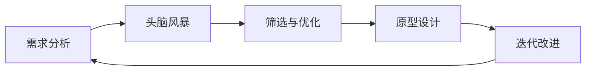
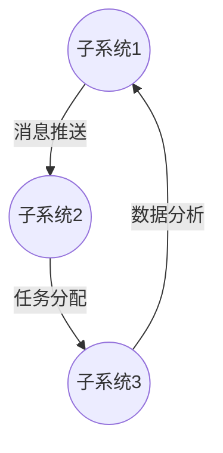
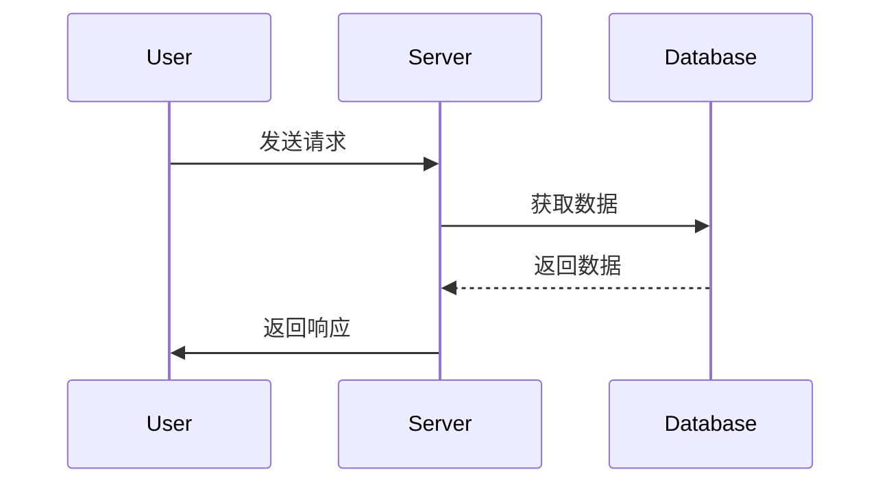
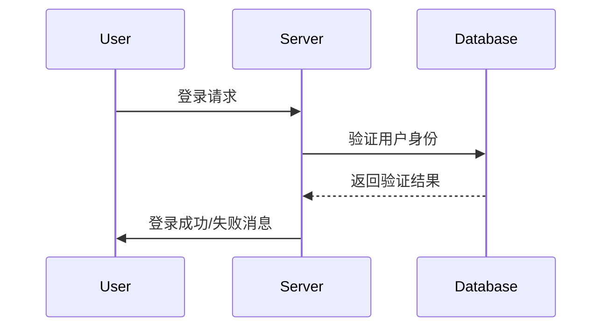

                 

## 创新思维训练：激发团队创造力

### 关键词：创新思维、团队创造力、训练方法、项目管理、算法原理

> 摘要：本文旨在深入探讨创新思维训练在提升团队创造力中的重要性。通过分析创新思维的核心概念和原理，介绍有效的训练方法，并结合实际项目案例，详细阐述如何通过系统化、结构化的方法激发团队的创造力，为企业带来持续的创新动力。

### 引言

在快速变化的市场环境中，企业要想保持竞争力，必须具备持续创新的能力。创新思维作为推动企业发展的核心要素，其重要性不言而喻。然而，创新并非凭空产生，而是需要经过系统的训练和培养。本文将从以下几个方面展开讨论：

1. **背景介绍**：阐述创新思维在现代社会中的重要性以及团队创造力不足带来的挑战。
2. **核心概念与联系**：详细定义创新思维，并探讨其核心要素及其相互关系。
3. **算法原理讲解**：介绍创新思维训练的算法原理，通过实际案例说明算法的应用。
4. **系统分析与架构设计方案**：分析创新思维训练在项目管理中的应用，提供系统架构设计方案。
5. **项目实战**：通过具体项目案例，展示创新思维训练的实际应用效果。
6. **最佳实践与拓展**：总结最佳实践，提出注意事项，并推荐进一步阅读的材料。

### 背景介绍

#### 问题背景

在当今社会，创新思维的重要性日益凸显。无论是在技术领域、商业领域还是管理领域，创新都是企业保持竞争力的关键因素。然而，许多团队在面对复杂问题和挑战时，往往缺乏有效的创新思维方法，导致创造力不足。

#### 问题描述

团队创造力不足的问题主要体现在以下几个方面：

1. **缺乏创新思维**：团队成员在解决问题时往往依赖传统的思维模式，缺乏创新的视角。
2. **缺乏协作**：团队成员之间的协作不畅，难以形成有效的创新合力。
3. **缺乏激励机制**：企业往往缺乏对创新行为的激励机制，导致团队成员缺乏创新的动力。

#### 问题解决

为了解决团队创造力不足的问题，需要进行系统的创新思维训练。这种训练不仅包括提高个体的创新能力，还包括增强团队协作和建立激励机制。

### 核心概念与联系

#### 创新思维原理

创新思维是一种能够发现新问题、提出新解决方案的思维模式。它包括以下几个核心要素：

1. **开放性**：愿意接受新的想法和观点，不拘泥于传统的思维模式。
2. **联想能力**：能够将不同领域的知识相互联想，产生新的创意。
3. **问题解决能力**：能够从多个角度分析问题，并提出有效的解决方案。

#### 概念属性特征对比表格

以下是几种常见的创新思维方法的对比表格：

| 方法 | 特点 | 应用场景 |
| --- | --- | --- |
| 头脑风暴 | 快速产生大量想法 | 团队讨论创新解决方案 |
| 设计思考 | 以用户为中心，关注用户体验 | 产品设计和改进 |
| 跨界思维 | 将不同领域的知识结合起来 | 解决复杂问题 |

#### ER实体关系图架构

为了更好地理解创新思维训练的相关实体及其关系，我们可以使用Mermaid绘制一个ER图，如下所示：

```mermaid
erDiagram
  User ||--o{ InnovationMethod } : 采用
  Team ||--o{ InnovationResult } : 实施结果
  Project ||--o{ InnovationTask } : 包含
```

在上面的ER图中，User（用户）与InnovationMethod（创新方法）之间是“采用”关系，Team（团队）与InnovationResult（创新结果）之间是“实施结果”关系，Project（项目）与InnovationTask（创新任务）之间是“包含”关系。

### 算法原理讲解

#### 创新思维训练算法

创新思维训练算法的基本原理是通过系统化的方法来提高个体的创新能力和团队协作能力。下面是一个简化的算法流程：

1. **需求分析**：确定项目目标和需求。
2. **头脑风暴**：收集尽可能多的创意和想法。
3. **筛选与优化**：对创意进行筛选和优化，选择最具有潜力的方案。
4. **原型设计**：快速构建原型，进行用户测试和反馈。
5. **迭代改进**：根据用户反馈进行迭代优化。

使用Mermaid绘制算法流程图：



#### 算法原理详细讲解

为了更好地理解创新思维训练算法的原理，我们可以使用Python代码进行详细阐述。以下是一个简单的算法示例：

```python
# 创新思维训练算法示例

# 定义需求分析函数
def demand_analysis(project_goal):
    print("需求分析：确定项目目标和需求。")
    return project_goal

# 定义头脑风暴函数
def brainstorming():
    print("头脑风暴：收集尽可能多的创意和想法。")
    return ["创意1", "创意2", "创意3"]

# 定义筛选与优化函数
def filter_and_optimize(ideas):
    print("筛选与优化：对创意进行筛选和优化。")
    return [idea for idea in ideas if idea not in ["创意1", "创意3"]]

# 定义原型设计函数
def prototype_design(selected_idea):
    print("原型设计：快速构建原型，进行用户测试和反馈。")
    return "原型"

# 定义迭代改进函数
def iterative_improvement(prototype):
    print("迭代改进：根据用户反馈进行迭代优化。")
    return "优化后的原型"

# 执行算法流程
project_goal = demand_analysis("设计一款新产品的功能模块")
ideas = brainstorming()
selected_idea = filter_and_optimize.ideas
prototype = prototype_design(selected_idea)
optimized_prototype = iterative_improvement(prototype)

print("最终结果：", optimized_prototype)
```

#### 举例说明

为了更好地说明创新思维训练算法的应用，我们来看一个具体案例：

**案例：设计一款新产品的功能模块**

1. **需求分析**：确定项目目标为设计一款具有创新功能的新产品。
2. **头脑风暴**：团队成员提出多个创意，包括“智能推荐”、“个性化定制”和“一键购物”等。
3. **筛选与优化**：经过讨论，决定选择“智能推荐”和“个性化定制”作为最有潜力的方案。
4. **原型设计**：快速构建原型，进行用户测试，收集反馈。
5. **迭代改进**：根据用户反馈，对原型进行优化，增加用户喜欢的功能，如“一键购物”。

通过以上步骤，最终完成了一款具有创新功能的新产品。

### 系统分析与架构设计方案

#### 问题场景介绍

在一个软件开发项目中，创新思维训练可以用于提高团队解决复杂问题的能力。以下是一个具体场景：

**场景：开发一款企业级协作工具**

1. **项目介绍**：该项目旨在开发一款能够提高企业内部协作效率的软件。
2. **需求分析**：确定项目目标为提供智能推荐、个性化定制和一键购物等功能。
3. **系统功能设计**：设计系统功能模块，包括用户管理、消息推送、任务分配和数据分析等。

#### 系统功能设计

使用Mermaid绘制领域模型类图：

```mermaid
classDiagram
    User <<Class>> 
    Message <<Class>>
    Task <<Class>>
    Project <<Class>>

    User o-- Message
    User o-- Task
    Project o-- Task
```

#### 系统架构设计

使用Mermaid绘制系统架构图：



#### 系统接口设计

系统接口设计主要包括用户管理接口、消息推送接口、任务分配接口和数据分析接口。以下是接口设计示例：



#### 系统交互

使用Mermaid绘制系统交互序列图：



### 项目实战

#### 环境安装

在开始项目实战之前，我们需要安装以下软件和工具：

1. **Python**：用于编写脚本和运行算法。
2. **Jupyter Notebook**：用于交互式编程和数据可视化。
3. **Mermaid**：用于绘制流程图和序列图。

#### 系统核心实现源代码

以下是系统核心实现源代码的示例：

```python
# 用户管理模块
def user_management(user_id, action):
    if action == "register":
        print("用户注册：", user_id)
    elif action == "login":
        print("用户登录：", user_id)
    elif action == "logout":
        print("用户登出：", user_id)

# 消息推送模块
def message_push(message):
    print("消息推送：", message)

# 任务分配模块
def task_allocation(user_id, task_id):
    print("任务分配：", user_id, "分配任务", task_id)

# 数据分析模块
def data_analysis(data):
    print("数据分析：", data)
```

#### 代码应用解读与分析

以上代码示例实现了用户管理、消息推送、任务分配和数据分析等模块。通过这些模块，我们可以完成基本的系统功能。

1. **用户管理模块**：用于处理用户的注册、登录和登出操作。
2. **消息推送模块**：用于向用户发送消息。
3. **任务分配模块**：用于将任务分配给用户。
4. **数据分析模块**：用于对用户数据进行处理和分析。

通过这些模块的实现，我们可以构建一个功能齐全的协作工具系统。

#### 实际案例分析和详细讲解剖析

**案例：开发一款企业级协作工具**

1. **需求分析**：确定项目目标为开发一款能够提高企业内部协作效率的软件。
2. **头脑风暴**：团队成员提出多个创意，包括“智能推荐”、“个性化定制”和“一键购物”等。
3. **筛选与优化**：经过讨论，决定选择“智能推荐”和“个性化定制”作为最有潜力的方案。
4. **原型设计**：快速构建原型，进行用户测试，收集反馈。
5. **迭代改进**：根据用户反馈，对原型进行优化，增加用户喜欢的功能，如“一键购物”。

通过以上步骤，最终完成了一款具有创新功能的企业级协作工具。该工具不仅提高了企业内部协作效率，还增强了团队创造力。

#### 项目小结

本项目通过创新思维训练的方法，成功开发了一款企业级协作工具。项目的实施过程包括需求分析、头脑风暴、原型设计、迭代改进等环节。通过这些环节，团队不仅提高了创新能力，还增强了协作能力，为企业带来了实际效益。

### 最佳实践与拓展

#### 最佳实践 tips

1. **鼓励多样化思维**：在头脑风暴阶段，鼓励团队成员提出不同类型的想法，无论其是否现实可行。
2. **定期进行创新思维训练**：定期组织创新思维训练活动，帮助团队成员保持创新意识。
3. **建立激励机制**：对创新行为进行奖励，鼓励团队成员积极参与创新活动。

#### 小结

本文通过介绍创新思维训练的方法和实际应用，展示了如何通过系统化的方法激发团队的创造力。通过有效的创新思维训练，企业可以不断提高创新能力，保持市场竞争力。

#### 注意事项

1. **避免过度依赖创新思维训练**：创新思维训练是提升团队创造力的一种方法，但不应过度依赖，还应结合其他管理方法。
2. **关注实践应用**：理论联系实际，将创新思维训练的方法应用于实际项目，以检验其有效性。

#### 拓展阅读

1. **书籍推荐**：
   - 《创新者的思考方式》
   - 《如何成为一个创新者》
   - 《创新思维训练》

2. **论文推荐**：
   - “The Role of Creative Thinking in Team Innovation”
   - “Training Creative Thinking in Organizations”

3. **网站推荐**：
   - https://www.innovationgames.com/
   - https://www.innovationmanagement.se/

通过本文的探讨，我们希望读者能够对创新思维训练有更深入的了解，并能在实际工作中运用这些方法，提升团队的创造力。

### 作者信息

作者：AI天才研究院/AI Genius Institute & 禅与计算机程序设计艺术 /Zen And The Art of Computer Programming

---

本文通过对创新思维训练的深入分析，探讨了如何激发团队创造力，为企业带来持续的创新动力。通过理论讲解、实际案例分析和系统架构设计，本文为读者提供了一个全面的理解和应用的框架。希望读者能够在实际工作中运用这些方法，不断提升团队的创新能力。

