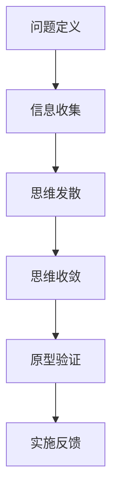

                 

### 引言

在当今快速发展的信息技术领域，创新思维成为推动企业和团队持续进步的核心动力。无论是在技术研发、项目管理还是产品开发过程中，创新思维都能够帮助团队突破传统思维模式的束缚，发现新的机会和解决方案。创新思维不仅是一种思考方式，更是一种解决问题的方法论，它能够激发团队的潜能，提高问题解决的效率和质量。

然而，如何有效地培养和激发团队的创新思维，仍然是一个亟待解决的挑战。创新思维并非与生俱来，它需要通过系统的训练和实践来逐步形成。这不仅涉及个人能力的提升，还需要团队氛围的营造和协作机制的完善。

本文将以“创新思维：引领团队突破瓶颈的方法”为主题，深入探讨创新思维的原理、实践策略和应用场景。我们首先会从理论层面出发，介绍创新思维的定义、重要性及其核心概念。接着，我们将探讨主流的创新思维方法，以及如何通过数学模型来理解创新思维。在此基础上，本文将转向实践层面，分析如何激发团队的创新思维，并介绍一系列实践策略。

随后，我们将聚焦企业层面的创新思维，探讨企业在创新过程中面临的现状、挑战及实践策略，并通过案例研究来进一步说明。此外，本文还将探讨创新思维在多个领域中的应用，如教育、艺术和科学研究等，以展示创新思维的广泛适用性。

通过这一系列的探讨，本文旨在为读者提供一个全面、系统的创新思维指南，帮助团队和企业打破发展瓶颈，实现持续创新。

### 关键词

创新思维、团队突破、瓶颈、方法、实践策略、数学模型、企业创新、跨领域应用。

### 摘要

本文围绕“创新思维：引领团队突破瓶颈的方法”这一主题，深入探讨了创新思维的定义、重要性及其核心概念。通过分析主流的创新思维方法，本文提出了有效的实践策略，以激发团队的创新潜能。此外，本文还探讨了创新思维在企业中的应用及跨领域应用，提供了丰富的案例研究和实践指导，旨在帮助团队和企业实现持续创新，突破发展瓶颈。

---

### 目录大纲

以下是本文的目录大纲，结构紧凑，内容丰富，旨在引导读者逐步深入理解创新思维的各个方面。

#### 第一部分：创新思维的原理与方法

- **第1章：创新思维概述**
  - **1.1 创新思维的定义与重要性**
    - **1.1.1 创新思维的内涵**
    - **1.1.2 创新思维的重要性**
    - **1.1.3 创新思维的边界与外延**
  - **1.2 创新思维的核心概念与联系**
    - **1.2.1 创新思维的概念框架**
    - **1.2.2 创新思维的关键要素**
    - **1.2.3 创新思维的属性特征对比表格**
    - **1.2.4 创新思维在团队中的角色**
  - **1.3 主流创新思维方法**
    - **1.3.1 传统创新思维方法**
    - **1.3.2 现代创新思维方法**
    - **1.3.3 创新思维方法的融合与应用**
  - **1.4 创新思维的数学模型与公式**
    - **1.4.1 创新思维的数学基础**
    - **1.4.2 创新思维的数学模型**
    - **1.4.3 创新思维公式详解**
  - **1.5 创新思维的实践应用**
    - **1.5.1 创新思维在企业中的应用**
    - **1.5.2 创新思维在团队项目中的应用**
    - **1.5.3 创新思维的案例分析**
  - **1.6 本章小结**

- **第2章：激发团队创新思维**
  - **2.1 创新思维的障碍与破解**
    - **2.1.1 创新思维的障碍**
    - **2.1.2 破解创新思维障碍的策略**
    - **2.1.3 培养创新思维习惯的方法**
  - **2.2 创新思维的团队建设**
    - **2.2.1 团队创新思维的现状分析**
    - **2.2.2 建立创新型团队的方法**
    - **2.2.3 团队协作与创新思维的关系**
  - **2.3 创新思维的工作流程与方法**
    - **2.3.1 创新思维的工作流程**
    - **2.3.2 创新思维的方法论**
    - **2.3.3 创新思维的工具与实践**
  - **2.4 创新思维的案例研究**
    - **2.4.1 成功的创新思维案例**
    - **2.4.2 失败的创新思维案例分析**
    - **2.4.3 案例启示与借鉴**
  - **2.5 本章小结**

#### 第二部分：创新思维的实践策略

- **第3章：企业创新思维**
  - **3.1 企业创新思维的现状与挑战**
    - **3.1.1 企业创新思维的现状**
    - **3.1.2 企业创新思维面临的挑战**
    - **3.1.3 企业创新思维的机遇**
  - **3.2 企业创新思维的实践策略**
    - **3.2.1 创新文化的建设**
    - **3.2.2 创新机制的构建**
    - **3.2.3 创新人才的培养**
    - **3.2.4 创新项目的管理**
  - **3.3 企业创新思维的案例解析**
    - **3.3.1 成功的企业创新案例**
    - **3.3.2 失败的企业创新案例分析**
    - **3.3.3 案例总结与启示**
  - **3.4 创新思维在企业管理中的应用**
    - **3.4.1 创新思维在战略规划中的应用**
    - **3.4.2 创新思维在产品开发中的应用**
    - **3.4.3 创新思维在营销策略中的应用**
  - **3.5 本章小结**

- **第4章：创新思维的跨领域应用**
  - **4.1 创新思维在教育领域的应用**
    - **4.1.1 教育创新思维的现状与需求**
    - **4.1.2 创新思维在教育改革中的应用**
    - **4.1.3 教师创新思维的培养**
  - **4.2 创新思维在艺术创作中的应用**
    - **4.2.1 艺术创新思维的重要性**
    - **4.2.2 创新思维在艺术创作中的运用**
    - **4.2.3 艺术创新思维案例分析**
  - **4.3 创新思维在科学研究的应用**
    - **4.3.1 科学研究的创新思维方法**
    - **4.3.2 创新思维在科学研究中的实际应用**
    - **4.3.3 科学研究的创新思维案例**
  - **4.4 创新思维在其他领域中的应用**
    - **4.4.1 创新思维在公共服务中的应用**
    - **4.4.2 创新思维在社会治理中的应用**
    - **4.4.3 创新思维在环境保护中的应用**
  - **4.5 本章小结**

通过这一系统的目录结构，本文将带领读者逐步深入创新思维的核心，并提供实用的策略和案例分析，帮助团队和企业实现持续创新。

### 第1章：创新思维概述

#### 1.1 创新思维的定义与重要性

**1.1.1 创新思维的内涵**

创新思维是一种独特的思考模式，它不仅仅是简单的创造或发明，而是一种系统化的、有目的的解决问题的方法。创新思维强调通过独特的视角和思考方式，发现新的解决方案或改进现有的方法。这种思维方式不仅涉及到技术层面的创新，还涵盖了理念、模式、方法等多个维度。

创新思维的内涵可以理解为以下几个方面：

1. **问题识别**：创新思维首先需要识别和定义问题。这不仅包括发现现有问题的不足，还涉及到预见未来的需求变化。
2. **跨领域思考**：创新思维要求人们跳出传统的思维框架，跨越不同的学科和领域，寻找新的解决方案。
3. **创造性思维**：这种思维方式强调创造新的想法、概念和模型，不仅仅是改进现有的东西。
4. **系统化思维**：创新思维不仅仅是单一的创新点，还需要考虑创新的整体性、可行性和可持续性。

**1.1.2 创新思维的重要性**

在当今的信息时代，创新思维的重要性尤为突出。首先，创新思维是推动技术进步的关键因素。随着科技的快速发展，新技术、新产品和新模式层出不穷，只有通过创新思维，才能不断引领技术潮流。其次，创新思维是企业持续发展的动力。在市场竞争日益激烈的今天，企业只有通过创新，才能保持竞争优势，实现可持续发展。

具体来说，创新思维的重要性体现在以下几个方面：

1. **推动社会进步**：创新思维能够推动社会的发展，解决社会面临的各种问题，提升生活质量。
2. **提升个人能力**：通过培养创新思维，个人能够更好地适应快速变化的环境，提高问题解决能力和创造力。
3. **激发团队潜能**：创新思维可以激发团队的潜能，提高团队协作效率和创新能力，推动团队整体发展。

**1.1.3 创新思维的边界与外延**

虽然创新思维具有广泛的应用场景和潜力，但它也有一定的边界和限制。首先，创新思维需要基于实际问题的需求，不能脱离实际进行空想。其次，创新思维需要考虑资源的限制，包括时间、资金、人力等。最后，创新思维还需要遵循伦理和法律的规定，不能违反道德和法律标准。

在应用场景方面，创新思维不仅适用于技术领域，还广泛应用于商业、教育、艺术等多个领域。在技术领域，创新思维可以用于开发新的技术、优化现有技术，以及解决复杂的技术问题。在商业领域，创新思维可以用于产品开发、市场策略、商业模式创新等。在教育领域，创新思维可以用于教育方法、教学内容和教学工具的创新。在艺术领域，创新思维可以用于艺术创作、表演和展示的创新。

总之，创新思维是一种重要的思维方式，它不仅能够推动个人和团队的发展，还能够推动社会的进步。理解和掌握创新思维，不仅有助于解决当前的问题，还能够为未来的发展提供动力。

---

通过本章节的探讨，我们初步了解了创新思维的定义、重要性及其应用边界。接下来，我们将进一步分析创新思维的核心概念和联系，帮助读者更深入地理解这一重要思维方式。

### 1.2 创新思维的核心概念与联系

在深入探讨创新思维之前，有必要明确其核心概念和联系，以便更好地理解和应用这一思维方式。创新思维不仅仅是简单的问题解决，它涉及到多个层面和要素的协同作用。以下我们将介绍创新思维的概念框架、关键要素以及相关属性特征。

#### 1.2.1 创新思维的概念框架

创新思维的概念框架可以分为以下几个主要部分：

1. **问题定义**：这是创新思维的基础，需要清晰地识别和定义问题。一个好的问题定义能够引导创新的方向，帮助团队集中精力解决问题。
2. **信息收集**：在明确问题后，需要收集与问题相关的各种信息，包括技术、市场、用户需求等。信息收集的广度和深度直接影响创新思维的效果。
3. **思维发散**：在信息收集的基础上，通过发散性思维产生各种可能的解决方案。这一阶段强调开放性思维，鼓励不同的想法和观点。
4. **思维收敛**：在发散性思维的基础上，筛选和评估各种解决方案，将其收敛为可操作的方案。这一阶段需要运用批判性思维，对各种方案进行评估和优化。
5. **原型验证**：选择一个或多个具有潜力的方案进行原型验证，通过实际测试来验证其可行性和有效性。这一阶段可以帮助团队进一步验证和改进方案。
6. **实施反馈**：将验证后的方案投入实际应用，并通过反馈机制不断调整和优化，确保其能够真正解决问题并满足需求。

**Mermaid 流程图表示：**



#### 1.2.2 创新思维的关键要素

创新思维的关键要素包括：

1. **想象力**：想象力是创新思维的重要驱动力，它能够帮助人们超越现实的限制，探索新的可能性。
2. **知识储备**：丰富的知识储备是创新思维的基础，它能够为创新提供丰富的素材和灵感。
3. **批判性思维**：批判性思维是评估和筛选创新方案的重要工具，它能够帮助团队识别和解决潜在的问题。
4. **团队合作**：团队合作是创新思维的重要保障，它能够通过多角度的思考和协同合作，提高创新的效果和效率。

**ER实体关系图架构：**

```mermaid
erDiagram
    ProblemDefinition ||--|{ Idea }
    Idea ||--|{ Prototype }
    Prototype ||--|{ Feedback }
    KnowledgeBase ||--|{ Idea }
    TeamCollaboration ||--|{ Idea }
    CriticalThinking ||--|{ Idea }
```

#### 1.2.3 创新思维的属性特征对比表格

创新思维的属性特征可以按照以下几个方面进行对比：

| 属性特征 | 描述 |
| --- | --- |
| **开放性** | 鼓励多样性和不同的观点，接受新的想法和解决方案 |
| **灵活性** | 能够适应变化，灵活调整思维模式，快速响应新情况 |
| **系统性** | 强调整体性思维，考虑创新方案的综合效果 |
| **创造性** | 产生新的想法和解决方案，推动思维突破 |
| **批判性** | 对想法和方案进行评估和筛选，确保其可行性和有效性 |

**表格表示：**

```markdown
| 属性特征 | 描述 |
| --- | --- |
| 开放性 | 鼓励多样性和不同的观点，接受新的想法和解决方案 |
| 灵活性 | 能够适应变化，灵活调整思维模式，快速响应新情况 |
| 系统性 | 强调整体性思维，考虑创新方案的综合效果 |
| 创造性 | 产生新的想法和解决方案，推动思维突破 |
| 批判性 | 对想法和方案进行评估和筛选，确保其可行性和有效性 |
```

#### 1.2.4 创新思维在团队中的角色

在团队中，创新思维扮演着多重角色，不仅影响团队的整体表现，还影响团队成员的个人发展。具体来说，创新思维在团队中的角色包括：

1. **领导者的角色**：领导者需要具备创新思维，能够引导团队探索新的方向和解决方案，推动团队的整体进步。
2. **团队成员的角色**：每个团队成员都需要培养创新思维，通过积极参与和贡献，共同推动团队的创新。
3. **沟通协调的角色**：创新思维能够促进团队成员之间的有效沟通和协作，提高团队的凝聚力和执行力。

**总结：**

创新思维是一种综合性的思维方式，它不仅涉及到问题的识别和解决，还涉及到信息收集、思维发散和收敛、原型验证等多个环节。通过明确创新思维的概念框架、关键要素和属性特征，以及其在团队中的角色，我们可以更好地理解和应用创新思维，提高团队的创新能力和竞争力。

在下一章中，我们将进一步探讨主流的创新思维方法，帮助读者了解如何具体应用这些方法来激发团队的创新能力。

### 1.3 主流创新思维方法

在创新思维的应用过程中，不同的方法和策略能够帮助团队从不同角度出发，发现新的解决方案。以下是几种主流的创新思维方法，包括传统创新思维方法和现代创新思维方法，以及这些方法的融合与应用。

#### 1.3.1 传统创新思维方法

传统创新思维方法通常指的是基于经验、直觉和创意的非系统化方法。以下是几种常见的传统创新思维方法：

1. **头脑风暴法**：
   - **定义**：头脑风暴法是一种集体讨论的方法，鼓励参与者自由发表想法，不进行批评和评价。
   - **应用场景**：适用于需要快速产生大量创意的场合，如产品创意、市场策略等。
   - **优点**：能够激发团队的创造力，产生丰富的创意。
   - **缺点**：创意质量难以保证，缺乏系统的筛选和评估过程。

2. **垂直思维法**：
   - **定义**：垂直思维法强调逻辑性和系统性，通过逐步深入分析问题，找到解决问题的关键点。
   - **应用场景**：适用于解决复杂问题和进行深度分析。
   - **优点**：能够系统化地解决问题，提高决策质量。
   - **缺点**：过程较为繁琐，耗时较长。

3. **类比法**：
   - **定义**：类比法通过将现有问题与类似的问题进行对比，借鉴已有解决方案，寻找创新点。
   - **应用场景**：适用于跨领域创新和借鉴已有经验。
   - **优点**：能够快速找到解决方案，减少研发时间。
   - **缺点**：依赖已有的知识和经验，可能限制创新。

#### 1.3.2 现代创新思维方法

随着技术的发展和知识的积累，现代创新思维方法逐渐涌现，它们更加系统和可操作。以下是几种现代创新思维方法：

1. **设计思维**：
   - **定义**：设计思维是一种以人为中心的方法，强调用户需求和创新解决方案的迭代优化。
   - **应用场景**：适用于产品设计和用户体验优化。
   - **优点**：注重用户需求，能够产生更具用户价值的产品。
   - **缺点**：需要大量的用户反馈和迭代，成本较高。

2. **TRIZ理论**：
   - **定义**：TRIZ（理论解决发明问题）是一种基于大量专利分析的系统化创新方法。
   - **应用场景**：适用于技术问题和复杂问题的解决。
   - **优点**：提供了一套系统的创新工具和方法，能够快速找到有效的解决方案。
   - **缺点**：需要大量的数据支持和专业知识，学习曲线较陡峭。

3. **六顶思维帽法**：
   - **定义**：六顶思维帽法是一种通过切换不同思维角色，进行全面思考的方法。
   - **应用场景**：适用于团队决策和问题解决。
   - **优点**：能够鼓励多样化的思维，提高团队决策质量。
   - **缺点**：需要明确的角色分工和良好的沟通机制。

#### 1.3.3 创新思维方法的融合与应用

在创新实践中，单一的创新思维方法往往难以满足复杂问题的解决需求。因此，将传统创新思维方法和现代创新思维方法相结合，形成一个综合性的创新思维体系，是提高创新效果的重要途径。以下是几种融合与创新的应用策略：

1. **多方法协同**：
   - **策略**：将头脑风暴、垂直思维、类比法等多种方法结合使用，根据不同阶段和问题的特点，灵活选择和应用。
   - **优点**：能够充分发挥不同方法的优点，提高创新效率和效果。
   - **缺点**：需要较高的协调和管理能力，确保各方法的有效融合。

2. **设计思维与TRIZ的结合**：
   - **策略**：在设计思维的过程中引入TRIZ理论，通过系统化的分析工具，优化创新解决方案。
   - **优点**：能够结合用户需求和系统化的创新方法，提高解决方案的可行性和有效性。
   - **缺点**：对团队成员的专业知识和技能要求较高。

3. **团队协作与个体创新结合**：
   - **策略**：鼓励团队成员在个体创新的基础上，进行团队协作，通过多角度的思维碰撞，产生更具创新性的方案。
   - **优点**：能够充分发挥个体和团队的创新能力，提高整体创新水平。
   - **缺点**：需要建立良好的团队沟通和协作机制，确保创新过程的顺利进行。

**总结：**

主流的创新思维方法各具特色，传统创新思维方法强调经验和直觉，而现代创新思维方法更加系统化和可操作。通过将传统和创新方法相结合，团队可以更好地应对复杂问题，提高创新效率和效果。在下一章中，我们将进一步探讨创新思维的数学模型与公式，帮助读者从理论层面深入理解创新思维的本质。

### 1.4 创新思维的数学模型与公式

创新思维不仅仅是直觉和创造力的体现，它也可以通过数学模型和公式来量化和分析。以下是创新思维的数学基础、数学模型以及相关公式的详细介绍。

#### 1.4.1 创新思维的数学基础

创新思维的数学基础主要涉及概率论、统计学和优化理论等数学领域。这些数学工具能够帮助我们更好地理解和预测创新过程，评估创新方案的有效性。

1. **概率论**：
   - **定义**：概率论是研究随机事件及其概率的数学分支。
   - **应用**：在创新思维中，概率论可以帮助我们评估创意成功的可能性。例如，通过计算不同方案的成功概率，我们可以选择最有可能成功的方案。
   - **公式**：设事件A为创意成功，则P(A)为事件A发生的概率，可以通过历史数据或专家评估来确定。

2. **统计学**：
   - **定义**：统计学是关于数据的收集、分析、解释和呈现的数学分支。
   - **应用**：在创新思维中，统计学可以帮助我们分析和理解市场数据、用户反馈等，从而指导创新决策。
   - **公式**：例如，标准差（σ）可以用来衡量数据的离散程度，帮助我们评估创意的稳定性和可靠性。

3. **优化理论**：
   - **定义**：优化理论是研究如何找到最优解的数学分支。
   - **应用**：在创新思维中，优化理论可以帮助我们找到资源的最优配置，设计高效的创新流程。
   - **公式**：例如，线性规划（Linear Programming, LP）可以用来优化资源分配问题，提高创新效率。

#### 1.4.2 创新思维的数学模型

创新思维的数学模型旨在将创新过程系统化、可量化。以下是几个常见的创新思维数学模型：

1. **创新潜力模型**：
   - **定义**：创新潜力模型用于评估创新方案的可能性和潜力。
   - **公式**：设F为创新潜力函数，I为创新方案，则F(I)为创新方案的潜力值。公式如下：
     \[
     F(I) = w_1 \times P(I) + w_2 \times C(I) + w_3 \times R(I)
     \]
     其中，\(w_1\)、\(w_2\)、\(w_3\)分别为概率、成本和收益的权重，\(P(I)\)、\(C(I)\)、\(R(I)\)分别为创新方案的成功概率、成本和收益。

2. **创新效率模型**：
   - **定义**：创新效率模型用于评估创新过程的效率。
   - **公式**：设E为创新效率函数，T为时间，C为资源消耗，则E(T, C)为创新效率。公式如下：
     \[
     E(T, C) = \frac{R}{T + C}
     \]
     其中，R为创新成果的收益。

3. **创新风险评估模型**：
   - **定义**：创新风险评估模型用于评估创新方案的风险。
   - **公式**：设R为风险函数，P为概率，L为损失，则R(P, L)为创新方案的风险值。公式如下：
     \[
     R(P, L) = P \times L
     \]

#### 1.4.3 创新思维公式详解

以下是几个创新思维公式及其解释：

1. **创意评分公式**：
   - **公式**：设S为创意评分，C为创意成本，R为创意收益，则S = R - C。此公式用于评估创意的经济价值。
   - **解释**：通过计算创意的收益减去成本，可以直观地评估创意的经济效益。如果S为正值，则创意具有经济可行性。

2. **创新效果公式**：
   - **公式**：设E为创新效果，I为创新输入，O为创新输出，则E = O / I。此公式用于评估创新的效率。
   - **解释**：通过计算创新输出的比率，可以评估创新过程的效率。如果E值较高，则表示创新过程较为高效。

3. **风险调整后的创新价值公式**：
   - **公式**：设V为风险调整后的创新价值，R为收益，L为风险损失，则V = R / (1 + L)。此公式用于考虑风险后的创新价值评估。
   - **解释**：通过将收益除以（1 + 风险损失），可以调整创新价值，使其更加符合实际风险情况。

通过以上数学模型和公式的介绍，我们可以看到创新思维不仅仅是一种直觉和创造力的体现，它也可以通过数学工具来量化和分析。这有助于我们更科学地评估和优化创新过程，提高创新的效率和效果。

在下一章中，我们将探讨创新思维在企业中的应用，分析企业如何利用创新思维来推动发展，并探讨企业在创新过程中可能遇到的挑战和策略。

### 1.5 创新思维的实践应用

创新思维在实践中的应用能够帮助企业解决实际问题，提升竞争力，推动企业持续发展。本节将重点探讨创新思维在企业中的应用、团队项目中的应用以及通过案例分析来深入理解创新思维的实际效果。

#### 1.5.1 创新思维在企业中的应用

在企业层面，创新思维的应用主要体现在战略规划、产品开发、市场策略等多个方面。以下是创新思维在具体应用中的案例分析：

**案例1：苹果公司的创新战略**

苹果公司通过创新思维不断推出革命性的产品，如iPhone、iPad等，成功塑造了其行业领导者地位。苹果公司的创新战略包括以下几个方面：

1. **用户中心**：苹果公司始终以用户需求为核心，通过用户调研和反馈，不断优化产品设计和功能。
2. **设计思维**：苹果公司采用设计思维，注重用户体验，从用户角度出发，不断改进产品。
3. **生态系统**：苹果公司通过构建完整的生态系统，从硬件到软件，从设备到服务，实现跨平台的创新。

**案例分析**：苹果公司的成功在于其持续的创新思维，通过设计思维和用户中心的策略，不断推出具有创新性和用户价值的产品，从而保持市场竞争力。

**案例2：谷歌公司的创新文化**

谷歌公司以其开放的创新文化和强大的创新能力著称。谷歌公司的创新思维应用主要体现在以下几个方面：

1. **20%时间政策**：谷歌允许员工将20%的工作时间用于个人兴趣项目，这一政策激发了员工的创新潜力，产生了许多成功的产品，如Gmail、Google News等。
2. **跨部门合作**：谷歌鼓励不同部门之间的合作，通过跨部门项目，实现创新和协作。
3. **持续学习**：谷歌公司注重员工培训和学习，为员工提供丰富的学习资源和机会，培养员工的创新能力。

**案例分析**：谷歌公司的创新文化通过鼓励员工自由探索和跨部门合作，激发了员工的创新热情，实现了持续的创新和突破。

#### 1.5.2 创新思维在团队项目中的应用

在团队项目中，创新思维的应用能够显著提升项目的成功率。以下是一个具体的团队项目案例：

**案例3：腾讯游戏的《王者荣耀》项目**

腾讯游戏在开发《王者荣耀》这款游戏时，通过创新思维实现了多个方面的突破：

1. **用户研究**：通过大量用户调研，了解用户的游戏偏好和需求，为游戏设计提供数据支持。
2. **团队合作**：多个团队协同工作，从游戏设计、开发到市场推广，全程应用创新思维，确保项目的顺利进行。
3. **迭代优化**：在游戏开发和运营过程中，通过用户反馈不断优化游戏体验，提高用户满意度。

**案例分析**：《王者荣耀》的成功在于团队在项目全过程中应用创新思维，通过用户研究和迭代优化，确保游戏能够满足用户需求，并在市场上取得成功。

#### 1.5.3 创新思维的案例分析

**案例4：失败的创新思维案例分析**

虽然创新思维能够带来巨大的潜力，但并不是所有的创新都能成功。以下是一个创新失败的案例分析：

**案例：索尼的PlayStation Phone**

索尼公司曾在2011年推出了一款名为PlayStation Phone的手机，希望通过结合游戏机和手机功能，实现跨平台的娱乐体验。然而，这款手机最终因市场接受度低而失败。

**失败原因分析**：

1. **市场定位错误**：索尼在推出PlayStation Phone时，没有充分考虑用户对手机和游戏机的不同需求，导致产品定位模糊。
2. **用户体验不佳**：PlayStation Phone在游戏体验和手机功能上都没有达到用户的期望，导致用户满意度低。
3. **创新过度**：索尼在产品设计和功能上进行了过度创新，但未能充分解决用户的核心需求，反而增加了产品的复杂性。

**案例启示**：

通过这个案例，我们可以看到，创新思维在应用过程中需要充分考虑市场需求和用户体验，避免过度创新和定位错误。在创新过程中，应注重用户反馈和实际需求，确保创新方案具有实际应用价值。

**总结**：

创新思维在实践中的应用能够帮助企业解决实际问题，提升竞争力。通过案例分析，我们可以看到创新思维在不同领域的成功应用，同时也了解到创新过程中可能遇到的挑战和失败原因。在下一章中，我们将探讨如何激发团队的创新思维，为团队和企业提供实用的策略和技巧。

### 1.6 本章小结

本章围绕创新思维的定义、重要性、核心概念以及实践应用进行了系统探讨。首先，我们介绍了创新思维的定义与重要性，阐述了其在推动技术进步和企业管理中的关键作用。接着，通过分析创新思维的核心概念、框架和关键要素，我们帮助读者建立了对创新思维的整体认识。随后，我们详细介绍了传统和现代创新思维方法，并通过案例展示了创新思维在企业和团队项目中的应用效果。

通过这些探讨，读者可以更深入地理解创新思维的内涵，掌握创新思维的方法和工具。然而，创新思维并非一蹴而就，它需要持续的培养和实践。在下一章中，我们将进一步探讨如何激发团队的创新思维，提供一系列实用的实践策略，以帮助团队和企业实现持续创新。

### 第2章：激发团队创新思维

#### 2.1 创新思维的障碍与破解

在激发团队创新思维的过程中，首先需要识别并破解可能遇到的障碍。这些障碍可能源于个人、团队或外部环境等多个方面，下面我们将详细分析这些障碍，并提出相应的破解策略。

**2.1.1 创新思维的障碍**

1. **思维定式**：
   - **定义**：思维定式是指人们长期形成的固定思维方式，难以接受新的观点和解决方案。
   - **表现**：团队成员倾向于按照传统的思路解决问题，不愿意尝试新的方法。
   - **影响**：思维定式限制了团队成员的创造力，阻碍了创新思维的发展。

2. **资源限制**：
   - **定义**：资源限制包括时间、资金、人力等，限制了团队进行创新活动的能力。
   - **表现**：团队成员可能因资源不足而无法开展全面的创新实践。
   - **影响**：资源限制导致创新活动无法深入推进，影响创新效果。

3. **沟通障碍**：
   - **定义**：沟通障碍指的是团队成员之间沟通不畅，信息传递不充分。
   - **表现**：团队成员之间缺乏有效的沟通，导致信息孤岛和协作困难。
   - **影响**：沟通障碍削弱了团队的协作能力，降低了创新效率。

4. **风险规避**：
   - **定义**：风险规避是指团队成员在创新过程中过度担心失败，不愿意承担风险。
   - **表现**：团队成员倾向于选择低风险的项目，缺乏冒险精神。
   - **影响**：风险规避限制了创新思维的应用，导致团队缺乏突破性创新。

5. **环境限制**：
   - **定义**：环境限制包括企业文化、管理风格等外部环境因素，限制了团队的创新能力。
   - **表现**：缺乏鼓励创新的企业文化，管理风格过于保守，导致团队创新动力不足。
   - **影响**：环境限制限制了团队成员的创新积极性，影响创新氛围的形成。

**2.1.2 破解创新思维障碍的策略**

1. **打破思维定式**：
   - **方法**：通过定期培训、研讨会和思维游戏等方式，帮助团队成员打破思维定式。
   - **案例**：谷歌公司通过“20%时间政策”，鼓励员工探索个人兴趣项目，从而激发创新思维。

2. **优化资源配置**：
   - **方法**：合理分配资源，确保团队有足够的时间和资金进行创新活动。
   - **案例**：腾讯公司在产品开发过程中，通过设立专项创新基金，支持团队成员的创新实践。

3. **强化沟通机制**：
   - **方法**：建立高效的沟通机制，促进团队成员之间的信息共享和协作。
   - **案例**：微软公司采用“站会”制度，每天早晨召开短会，让团队成员交流进展和问题，提高沟通效率。

4. **鼓励风险承担**：
   - **方法**：营造鼓励尝试和冒险的企业文化，降低团队成员的失败风险。
   - **案例**：亚马逊公司通过“试验田”模式，允许员工在一定的风险范围内进行创新尝试。

5. **优化企业环境**：
   - **方法**：打造积极创新的企业文化，鼓励开放、合作和学习的环境。
   - **案例**：谷歌公司通过“创新奖”等方式，表彰和奖励在创新方面有突出贡献的员工。

**2.1.3 培养创新思维习惯的方法**

1. **持续学习**：
   - **方法**：鼓励团队成员持续学习，提升专业知识和技能，增强创新思维的基础。
   - **案例**：华为公司定期举办培训课程，邀请专家分享行业前沿知识，提高员工的专业素养。

2. **实践创新**：
   - **方法**：通过实际项目中的创新实践，培养团队成员的创新能力和习惯。
   - **案例**：阿里巴巴通过“双11”购物节的创新营销，不断尝试和优化，培养团队的创新思维。

3. **跨部门协作**：
   - **方法**：鼓励跨部门协作，通过不同视角的思维碰撞，激发创新思维。
   - **案例**：三星公司通过跨部门项目，实现技术、设计和市场的融合，推动创新。

4. **建立反馈机制**：
   - **方法**：建立有效的反馈机制，及时收集用户反馈和项目评估，指导后续创新实践。
   - **案例**：特斯拉公司通过用户反馈和数据分析，不断优化产品设计和用户体验。

**总结**：

激发团队创新思维需要从多个方面进行努力，包括打破思维定式、优化资源配置、强化沟通机制、鼓励风险承担和优化企业环境等。通过这些策略，可以有效地破解创新思维障碍，培养团队成员的创新习惯，提高团队的创新能力和竞争力。在下一章中，我们将进一步探讨创新思维的团队建设，分析如何建立一个具备创新能力的团队。

### 2.2 创新思维的团队建设

要激发团队的创新思维，团队建设是关键的一步。一个具备创新能力的高效团队不仅能够更好地应对挑战，还能持续推动企业的进步。以下是关于团队创新思维的现状分析、建立创新型团队的方法以及团队协作与创新思维的关系。

#### 2.2.1 团队创新思维的现状分析

当前，许多企业已经意识到创新思维的重要性，但在团队创新思维的现状方面仍存在一些问题。以下是一些常见的现状：

1. **创新意识不足**：部分团队成员缺乏创新意识，更倾向于遵循传统方法和流程，不愿意冒险尝试新的解决方案。

2. **团队结构不合理**：团队结构可能过于固定，缺乏灵活性和多样性，限制了团队成员的创新能力和互动。

3. **沟通不畅**：团队成员之间的沟通可能存在障碍，信息传递不充分，导致创新思维的交流受阻。

4. **缺乏激励机制**：缺乏有效的激励机制，团队成员可能缺乏动力去尝试和实施创新想法。

5. **外部支持不足**：企业可能缺乏对创新思维的外部支持，如资源投入、培训机会和外部合作等。

**现状分析**：

- **创新意识不足**：团队成员需要被引导和激励，认识到创新思维的重要性。企业可以通过培训、案例分享和成功实践来提高团队成员的创新意识。

- **团队结构不合理**：团队应具备多元化的背景和技能，能够从不同角度思考问题。企业可以通过跨部门合作、外部招聘等方式引入新思维。

- **沟通不畅**：企业应建立高效的沟通机制，如定期团队会议、信息共享平台等，促进团队成员之间的交流。

- **缺乏激励机制**：企业可以通过设立创新奖励、晋升机制等方式，激励团队成员积极提出和实施创新想法。

- **外部支持不足**：企业可以通过与外部机构合作、参加行业会议和培训等方式，获取最新的创新思路和资源。

#### 2.2.2 建立创新型团队的方法

1. **多元化团队**：
   - **定义**：多元化团队指的是由不同背景、经验和技能的成员组成的团队。
   - **方法**：通过跨部门合作、外部招聘等方式，引入多元化的背景和视角。
   - **优点**：多元化团队能够从多个角度思考问题，激发创新思维。
   - **案例**：谷歌公司通过跨职能团队，将不同部门的专家集合在一起，共同解决复杂问题。

2. **共同愿景**：
   - **定义**：共同愿景是指团队成员共同认同的目标和使命。
   - **方法**：通过明确的愿景和目标，激发团队成员的内在动力。
   - **优点**：共同愿景能够统一团队成员的思想和行动，提高团队凝聚力。
   - **案例**：特斯拉公司的共同愿景是推动电动汽车的发展，这一愿景激发了团队成员的创新能力。

3. **持续学习**：
   - **定义**：持续学习是指团队成员不断更新知识和技能，保持学习和成长的心态。
   - **方法**：通过培训、研讨会和在线课程等方式，提供持续学习的资源。
   - **优点**：持续学习能够提升团队成员的专业能力和创新思维。
   - **案例**：华为公司定期举办内部培训和外部研讨会，鼓励员工不断学习和成长。

4. **创新文化**：
   - **定义**：创新文化是指企业内部鼓励创新、支持创新的氛围和价值观。
   - **方法**：通过建立创新奖励机制、鼓励失败和试验等方式，营造创新文化。
   - **优点**：创新文化能够激发团队成员的创新热情和主动性。
   - **案例**：3M公司通过“15%时间政策”，鼓励员工将15%的工作时间用于个人兴趣和创新项目，从而推动了公司的持续创新。

#### 2.2.3 团队协作与创新思维的关系

团队协作是创新思维实现的重要保障。一个高效的团队协作能够促进创新思维的发挥，提高创新效率。以下是团队协作与创新思维关系的几个方面：

1. **信息共享**：
   - **关系**：团队协作有助于信息共享，促进不同成员之间的知识互补和思维碰撞。
   - **方法**：通过建立信息共享平台、定期会议和知识库等方式，提高团队协作效率。
   - **案例**：阿里的“阿里云”平台，为团队成员提供了一个共享知识和资源的环境。

2. **协同工作**：
   - **关系**：协同工作是团队协作的核心，通过协同工作，团队成员能够共同解决复杂问题。
   - **方法**：通过明确分工、角色定位和协作流程，提高团队协作的效率。
   - **案例**：特斯拉的团队通过敏捷开发方法，实现快速响应市场需求，提高产品开发效率。

3. **互相支持**：
   - **关系**：团队成员之间的互相支持是创新思维持续发挥的重要保障。
   - **方法**：通过建立互助机制、定期反馈和团队建设活动，增强团队成员之间的信任和合作。
   - **案例**：华为的“导师制”，通过资深员工指导新员工，提高团队的整体创新能力。

**总结**：

团队建设是激发创新思维的关键。通过多元化团队、共同愿景、持续学习和创新文化等方法，可以建立一个具备创新能力的高效团队。同时，团队协作是创新思维实现的重要保障，通过信息共享、协同工作和互相支持，可以提升团队的协作效率和创新能力。在下一章中，我们将进一步探讨创新思维的具体工作流程和方法，为团队提供更实用的实践指导。

### 2.3 创新思维的工作流程与方法

要有效激发和利用团队的创新思维，需要一套系统的流程和方法。以下将详细讨论创新思维的工作流程、方法论以及相关的工具和实践。

#### 2.3.1 创新思维的工作流程

一个完整和创新思维的工作流程通常包括以下阶段：

1. **问题定义**：
   - **目的**：明确问题，界定问题的范围和影响。
   - **方法**：通过头脑风暴、用户调研和问题陈述等方式，确保问题定义的准确性和清晰性。

2. **信息收集**：
   - **目的**：收集与问题相关的信息，为创新提供数据支持。
   - **方法**：通过文献调研、市场分析和专家访谈等方式，获取所需的信息。

3. **思维发散**：
   - **目的**：激发创意，产生多样化的解决方案。
   - **方法**：使用头脑风暴、六顶思维帽法、思维导图等方式，鼓励团队成员自由表达想法。

4. **思维收敛**：
   - **目的**：筛选和评估创意，选择最具潜力的方案。
   - **方法**：通过批判性思维、优先级评估和成本效益分析等方式，对创意进行筛选和优化。

5. **原型验证**：
   - **目的**：验证创意的实际可行性，优化解决方案。
   - **方法**：通过快速原型、用户测试和迭代优化等方式，验证并改进创意。

6. **实施反馈**：
   - **目的**：将验证后的创意投入实际应用，并通过反馈进行持续优化。
   - **方法**：通过用户反馈、数据分析和管理评审等方式，确保创意的实际效果。

**工作流程图**：


#### 2.3.2 创新思维的方法论

创新思维的方法论包括一系列原则和策略，旨在指导团队如何有效地进行创新：

1. **用户中心**：
   - **原则**：始终以用户需求为核心，关注用户体验。
   - **策略**：通过用户调研、用户访谈和用户反馈，确保创意符合用户需求。

2. **跨学科融合**：
   - **原则**：跨越不同领域的知识界限，进行跨学科思考。
   - **策略**：引入来自不同领域的专家，促进思维碰撞和融合。

3. **快速迭代**：
   - **原则**：通过快速迭代和不断优化，不断改进创意。
   - **策略**：采用敏捷开发方法，快速构建和测试原型，不断反馈和优化。

4. **开放思维**：
   - **原则**：保持开放的心态，接受不同的观点和想法。
   - **策略**：鼓励多样化的思考，不进行过早的批评和评估。

5. **团队合作**：
   - **原则**：强调团队合作，发挥集体智慧。
   - **策略**：建立有效的沟通和协作机制，确保团队成员的积极参与。

#### 2.3.3 创新思维的工具与实践

在实际应用中，以下工具和方法能够帮助团队更好地激发和利用创新思维：

1. **头脑风暴**：
   - **工具**：通过集体讨论，快速产生大量创意。
   - **实践**：设立明确的讨论主题和时间，鼓励团队成员自由发言，不进行批评和评估。

2. **思维导图**：
   - **工具**：通过图形化的方式，展示思维过程和创意。
   - **实践**：将问题分解为子问题，通过分支和连接点，展示不同创意之间的关系。

3. **六顶思维帽法**：
   - **工具**：通过切换不同思维角色，进行全面思考。
   - **实践**：使用红色帽（情感）、蓝色帽（管理）、黄色帽（乐观）、绿色帽（创意）、黑色帽（批判）和白色帽（客观）进行思考，确保全面性和客观性。

4. **快速原型**：
   - **工具**：通过快速构建原型，验证创意的实际可行性。
   - **实践**：使用低保真原型工具（如Sketch、Figma），快速构建原型，并进行用户测试和反馈。

5. **敏捷开发**：
   - **工具**：采用敏捷开发方法，实现快速迭代和持续优化。
   - **实践**：通过短期迭代（如Sprint），定期评估和调整项目进度，确保项目的灵活性和适应性。

**总结**：

创新思维的工作流程和方法论为团队提供了一个系统化的创新框架，通过用户中心、跨学科融合、快速迭代和开放思维等原则，以及头脑风暴、思维导图、六顶思维帽法、快速原型和敏捷开发等工具和实践，可以帮助团队更有效地激发和利用创新思维。通过这些方法和工具的应用，团队可以持续推动创新，实现突破性的成果。

在下一章中，我们将通过具体的案例研究，进一步探讨创新思维的实际应用和效果。

### 2.4 创新思维的案例研究

通过具体的案例研究，我们可以更深入地理解创新思维的实际应用效果。以下将分析一些成功的创新思维案例，以及一些失败的创新思维案例分析，从中总结出案例启示与借鉴。

#### 2.4.1 成功的创新思维案例

**案例1：Facebook的“ killer app”策略**

Facebook在成立初期，面临着用户增长放缓的问题。为了突破这一瓶颈，Facebook团队通过创新思维，推出了“ killer app”——“点赞”功能。这一简单但极具创意的功能，不仅增强了用户的互动性，还迅速提升了用户的活跃度。通过用户调研和数据分析，Facebook团队发现用户对于点赞、分享等互动行为有着强烈的需求，因此迅速将其转化为产品功能。

**案例分析**：

- **用户中心**：Facebook团队始终以用户需求为核心，通过用户调研和数据分析，准确把握用户需求。
- **快速迭代**：通过快速开发、发布和优化，Facebook团队实现了“ killer app”的成功。
- **跨学科融合**：Facebook团队结合技术和市场部门的力量，实现了用户需求和产品设计的有效融合。

**启示与借鉴**：

- 企业在创新过程中应始终关注用户需求，通过用户调研和数据驱动决策。
- 快速迭代和持续优化是确保创新成功的关键，企业应建立灵活的开发和反馈机制。
- 跨部门合作和知识共享有助于激发创新思维，提高创新效率。

**案例2：3M的“贴纸”创新**

3M公司通过鼓励员工自由探索和跨部门合作，实现了许多创新产品的诞生。其中，著名的“贴纸”产品便是一个成功案例。3M的研发人员在实验室里发现了一种能够反复粘贴的胶带，但其最初的应用场景并不明确。通过创新思维，3M团队将这一产品应用于多种场景，如办公、家庭和工业等，最终开发出了多样化的贴纸产品，满足了不同用户的需求。

**案例分析**：

- **多元化团队**：3M公司通过多元化团队的建设，鼓励不同背景的员工进行跨部门合作，激发了创新思维。
- **持续学习**：3M公司注重员工持续学习和技能提升，为员工提供了丰富的学习和成长资源。
- **创新文化**：3M公司通过鼓励员工自由探索和失败，营造了积极创新的文化氛围。

**启示与借鉴**：

- 建立多元化团队，鼓励跨部门合作和知识共享，有助于激发创新思维。
- 持续学习和技能提升是创新思维的重要基础，企业应提供相应的培训和发展机会。
- 营造积极创新的文化氛围，鼓励员工尝试和接受失败，提高创新成功率。

#### 2.4.2 失败的创新思维案例分析

**案例1：诺基亚的衰落**

诺基亚曾是全球手机市场的领导者，但在面对智能手机的崛起时，未能及时调整战略，导致市场份额大幅下降。诺基亚在创新过程中存在以下问题：

- **思维定式**：诺基亚长期依赖传统手机市场，对智能手机市场变化反应迟缓。
- **资源限制**：诺基亚在研发和投资上的投入不足，导致在技术突破和产品创新方面滞后。
- **风险规避**：诺基亚在创新过程中过于保守，对高风险的项目缺乏支持。

**案例分析**：

- **思维定式**：企业应打破思维定式，积极应对市场变化，拥抱新技术。
- **资源限制**：企业应合理分配资源，确保在关键领域有足够的投入。
- **风险规避**：企业应建立容错机制，鼓励员工尝试和接受失败，提高创新成功率。

**启示与借鉴**：

- 企业应保持开放和创新的心态，积极拥抱新技术和市场需求。
- 合理配置资源，确保在关键领域有足够的投入，推动技术创新。
- 建立容错机制，鼓励员工尝试新想法，提高创新成功率。

**案例2：微软的“Windows Phone”战略**

微软曾推出Windows Phone操作系统，试图在智能手机市场占据一席之地。但由于在产品定位、用户体验和市场营销方面的不足，Windows Phone最终未能成功。以下为失败原因：

- **市场定位错误**：Windows Phone在定位上过于模糊，未能准确把握用户需求。
- **用户体验不佳**：Windows Phone在界面设计和用户体验方面存在明显不足。
- **市场营销不足**：微软在市场营销和推广方面投入不足，未能有效提升品牌知名度。

**案例分析**：

- **市场定位错误**：企业应明确产品定位，确保产品能够满足特定用户群体的需求。
- **用户体验至上**：用户体验是产品成功的关键，企业应注重产品设计和用户体验。
- **有效市场营销**：企业应建立有效的市场营销策略，提升品牌知名度和市场影响力。

**启示与借鉴**：

- 企业在创新过程中应明确产品定位，确保产品能够满足市场需求。
- 注重用户体验，通过用户调研和反馈，不断优化产品设计和功能。
- 建立有效的市场营销策略，提高品牌知名度和市场影响力。

#### 2.4.3 案例启示与借鉴

通过以上成功和失败的案例研究，我们可以得出以下启示和借鉴：

- **用户需求是核心**：成功的创新思维案例都始终关注用户需求，通过用户调研和反馈，确保产品符合市场需求。
- **跨学科融合**：多元化团队和跨学科融合有助于激发创新思维，提高创新成功率。
- **快速迭代**：通过快速开发和迭代，及时反馈和优化，确保创新方案的实际可行性。
- **创新文化**：建立积极创新的文化氛围，鼓励员工自由探索和失败，提高创新成功率。
- **市场定位和用户体验**：明确产品定位，注重用户体验，是产品成功的关键。
- **市场营销策略**：建立有效的市场营销策略，提升品牌知名度和市场影响力。

总之，通过具体案例的分析，我们可以更好地理解创新思维的实践应用，并从中总结出宝贵的经验和教训，为团队和企业提供实用的参考和指导。

### 2.5 本章小结

本章围绕如何激发团队创新思维进行了深入探讨，从障碍识别与破解、团队建设、工作流程与方法等多个角度分析了创新思维的实际应用。通过成功的案例和失败的分析，我们总结出了创新思维的关键要素和实用策略。这些内容包括：

1. **障碍识别与破解**：识别思维定式、资源限制、沟通障碍、风险规避和环境限制等创新障碍，并提出相应的破解策略，如打破思维定式、优化资源配置、强化沟通机制、鼓励风险承担和优化企业环境。
2. **团队建设**：建立多元化团队、共同愿景、持续学习和创新文化，通过跨部门协作和共同目标，提高团队的创新能力和协作效率。
3. **工作流程与方法**：介绍创新思维的工作流程，包括问题定义、信息收集、思维发散、思维收敛、原型验证和实施反馈，并讨论用户中心、跨学科融合、快速迭代、开放思维和团队合作等创新方法论。
4. **案例研究**：通过成功的案例和失败的分析，总结出创新思维的核心启示和借鉴，如用户需求、跨学科融合、快速迭代、创新文化和市场营销策略。

通过这些内容的探讨，本章为团队和企业提供了一个全面、系统的创新思维指南，旨在帮助团队更好地激发和利用创新思维，实现持续创新和突破。

### 第3章：企业创新思维

企业创新思维是企业持续发展的关键，是企业在激烈的市场竞争中保持领先地位的必要手段。本章将探讨企业创新思维的现状与挑战、企业创新思维的实践策略以及创新思维在企业管理中的具体应用。

#### 3.1 企业创新思维的现状与挑战

企业创新思维的现状可以从以下几个方面进行分析：

1. **创新意识**：
   - 当前，许多企业已经意识到创新思维的重要性，但创新意识仍有待提升。一些企业仍过于依赖传统思维模式，缺乏主动创新的动力。

2. **创新文化**：
   - 尽管一些企业已经建立了创新文化，但创新文化的深度和广度仍不够。缺乏鼓励创新和宽容失败的企业文化，限制了员工的创新积极性。

3. **创新机制**：
   - 创新机制的不完善导致企业在创新过程中缺乏系统性和持续性。许多企业缺乏明确的创新目标和规划，创新过程缺乏有效管理和监督。

4. **资源配置**：
   - 资源配置不足是制约企业创新的重要因素。许多企业在研发资金、人力资源和基础设施方面的投入不足，影响了创新的效果。

企业创新思维面临的挑战主要包括：

1. **技术壁垒**：
   - 随着技术的发展，企业面临越来越高的技术壁垒。突破技术壁垒需要大量的投入和长期的研究，这对企业创新提出了更高的要求。

2. **市场竞争**：
   - 市场竞争的加剧使得企业必须不断创新，以保持竞争优势。然而，快速变化的市场环境对企业创新思维提出了巨大的挑战。

3. **人才短缺**：
   - 创新人才是企业创新的重要资源。然而，当前许多企业面临人才短缺的问题，缺乏具备创新能力和专业知识的人才。

4. **管理复杂性**：
   - 企业创新过程中涉及多个部门和环节，管理复杂性增加，对企业的管理和协调能力提出了更高的要求。

#### 3.2 企业创新思维的实践策略

为了应对上述挑战，企业需要采取一系列实践策略来提升创新思维：

1. **创新文化建设**：
   - 企业应积极营造创新文化，鼓励员工勇于尝试和失败，建立宽容失败的氛围。通过举办创新活动、设立创新奖项等方式，激发员工的创新热情。

2. **创新机制构建**：
   - 企业应建立完善的创新机制，包括明确的创新目标和规划、创新项目的管理和监督、创新成果的评估和推广。通过制度化和系统化的管理，确保创新过程的顺利进行。

3. **人才培养与引进**：
   - 企业应重视人才的培养和引进，通过培训、外部招聘和人才交流等方式，提高员工的创新能力和专业知识。同时，建立激励机制，留住优秀的创新人才。

4. **资源配置优化**：
   - 企业应合理配置资源，增加对研发的投入，提高研发效率。通过技术合作、外包等方式，充分利用外部资源和能力，提高创新的效果。

5. **市场导向**：
   - 企业应密切关注市场变化和用户需求，将市场需求作为创新的出发点。通过用户调研和市场分析，确保创新方案能够满足市场需求。

6. **跨部门协作**：
   - 企业应促进跨部门协作，打破部门壁垒，促进知识和资源的共享。通过跨部门项目和创新团队，实现不同领域专家的协作，提高创新的效率。

#### 3.3 企业创新思维的案例解析

以下是一些成功的企业创新案例和失败的创新案例分析：

**成功案例1：苹果公司的iPhone**

苹果公司通过iPhone的成功，彻底改变了智能手机市场。苹果公司在iPhone的创新过程中，采取了以下策略：

- **用户中心**：苹果公司始终关注用户需求，通过用户调研和反馈，不断优化产品设计和功能。
- **设计思维**：苹果公司采用设计思维，注重用户体验，从用户角度出发，不断改进产品。
- **生态系统**：苹果公司通过构建完整的生态系统，从硬件到软件，从设备到服务，实现跨平台的创新。

**成功案例2：谷歌公司的“20%时间政策”**

谷歌公司通过“20%时间政策”，允许员工将20%的工作时间用于个人兴趣项目，这一政策激发了员工的创新潜力，产生了许多成功的产品，如Gmail、Google News等。

**失败案例：诺基亚的衰落**

诺基亚曾是全球手机市场的领导者，但在面对智能手机的崛起时，未能及时调整战略，导致市场份额大幅下降。诺基亚在创新过程中存在以下问题：

- **思维定式**：诺基亚长期依赖传统手机市场，对智能手机市场变化反应迟缓。
- **资源限制**：诺基亚在研发和投资上的投入不足，导致在技术突破和产品创新方面滞后。
- **风险规避**：诺基亚在创新过程中过于保守，对高风险的项目缺乏支持。

**失败案例2：微软的“Windows Phone”战略**

微软曾推出Windows Phone操作系统，试图在智能手机市场占据一席之地。但由于在产品定位、用户体验和市场营销方面的不足，Windows Phone最终未能成功。

**案例分析总结**：

- **用户中心**：成功的创新案例都始终关注用户需求，通过用户调研和反馈，确保产品符合市场需求。
- **设计思维**：注重用户体验，从用户角度出发，不断改进产品设计和功能。
- **生态系统**：构建完整的生态系统，实现跨平台的创新。
- **思维定式**：企业应打破思维定式，积极应对市场变化。
- **资源配置**：合理配置资源，确保在关键领域有足够的投入。
- **风险承担**：鼓励风险承担，建立容错机制。

#### 3.4 创新思维在企业管理中的应用

创新思维在企业管理中的应用主要体现在战略规划、产品开发、市场营销和人力资源管理等各个方面：

1. **战略规划**：
   - 企业应运用创新思维，制定具有前瞻性和可执行性的战略规划。通过市场调研、技术分析和趋势预测，确定企业的战略方向和目标。

2. **产品开发**：
   - 企业应采用创新思维，不断优化产品设计和功能。通过用户调研、设计思维和迭代优化，确保产品能够满足市场需求，提升用户体验。

3. **市场营销**：
   - 企业应运用创新思维，制定具有创意和吸引力的市场营销策略。通过市场分析、创意营销和数字化营销，提高品牌知名度和市场占有率。

4. **人力资源管理**：
   - 企业应运用创新思维，优化人力资源管理。通过人才引进、培训和激励机制，提升员工的创新能力和工作效率。

**总结**：

企业创新思维是企业在市场竞争中保持领先地位的重要手段。通过创新文化建设、创新机制构建、人才培养与引进、资源配置优化和市场导向等策略，企业可以提升创新思维能力，实现持续创新。成功的创新思维案例和失败的创新思维案例分析，为我们提供了宝贵的经验和教训。在企业管理中，创新思维的应用可以推动企业的战略规划、产品开发、市场营销和人力资源管理等多个方面，提高企业的整体竞争力和可持续发展能力。

### 3.5 本章小结

本章围绕企业创新思维的现状与挑战、实践策略以及管理应用进行了深入探讨。首先，分析了企业创新思维的现状，指出了创新意识、创新文化、创新机制和资源配置等方面存在的问题。接着，提出了包括创新文化建设、创新机制构建、人才培养与引进、资源配置优化和市场导向等在内的实践策略，以应对企业创新面临的挑战。

通过具体案例的分析，本章总结了成功和失败的创新经验，为企业在创新过程中提供了宝贵的借鉴。同时，探讨了创新思维在战略规划、产品开发、市场营销和人力资源管理中的具体应用，展示了创新思维对企业管理的全面影响。

总之，企业创新思维不仅是企业发展的动力源泉，也是企业在激烈市场竞争中脱颖而出的关键。通过有效的创新思维实践，企业可以不断提升竞争力，实现持续发展。

### 第4章：创新思维的跨领域应用

创新思维作为一种重要的思维方式，不仅局限于技术领域，还广泛应用于教育、艺术、科学研究等多个领域。本章将探讨创新思维在这些领域的具体应用，分析其现状与需求，以及成功和失败的案例分析，旨在展示创新思维的广泛适用性和实际效果。

#### 4.1 创新思维在教育领域的应用

**4.1.1 教育创新思维的现状与需求**

在教育领域，创新思维的应用正在逐渐受到重视。随着教育技术的不断进步，教育模式也在不断变革。当前，教育创新思维的应用主要体现在以下几个方面：

1. **个性化教学**：
   - 教育创新思维强调以学生为中心，通过个性化教学满足不同学生的学习需求。通过大数据分析和人工智能技术，教师能够更好地了解学生的学习情况和偏好，提供个性化的教学方案。

2. **混合式学习**：
   - 混合式学习结合了传统课堂教学和在线学习的优点，通过创新思维设计，实现教学效果的最优化。这种方式能够提高学生的学习兴趣和参与度，提高学习效果。

3. **跨学科教育**：
   - 跨学科教育通过融合不同学科的知识和技能，培养学生的综合能力。创新思维在跨学科教育中的应用，能够打破学科界限，实现知识的交叉和整合。

教育创新思维的需求主要体现在以下几个方面：

- **培养创新能力**：随着社会对创新人才的需求不断增加，教育必须注重培养学生的创新能力，以适应未来社会的变化。
- **提升教学质量**：通过创新思维的应用，可以优化教学方法和策略，提高教学质量，满足学生的学习需求。
- **适应技术变革**：教育技术不断发展，教育创新思维的应用能够帮助教育更好地适应技术变革，提升教育效果。

**4.1.2 创新思维在教育改革中的应用**

创新思维在教育改革中的应用主要体现在以下几个方面：

1. **课程设计**：
   - 教育改革中的课程设计强调培养学生的综合素质和创新能力。通过创新思维，课程设计能够更加贴近实际需求，培养学生的实践能力和创新思维。

2. **教学方法**：
   - 教育改革中的教学方法注重多样性，通过创新思维的应用，教师能够采用更多元化的教学方法，如项目式学习、探究式学习等，提高学生的学习效果。

3. **教育评价**：
   - 教育改革中的教育评价注重过程性评价和终结性评价相结合，通过创新思维的应用，能够更全面地评价学生的学习成果，促进学生的全面发展。

**4.1.3 教师创新思维的培养**

教师创新思维的培养是教育创新思维应用的关键。以下是一些有效的培养策略：

1. **专业培训**：
   - 通过定期的专业培训，提高教师的教育理论和实践能力，帮助教师掌握创新思维的方法和工具。

2. **经验交流**：
   - 组织教师进行经验交流和研讨，分享创新教学的成功经验和案例，促进教师之间的相互学习和启发。

3. **实践探索**：
   - 鼓励教师进行教学实践探索，通过实际教学活动，锻炼教师的创新思维和教学能力。

**4.1.4 教师创新思维案例分析**

以下是一个教师创新思维的典型案例：

**案例：北京十一学校的创新教育**

北京十一学校通过创新教育，培养学生的综合素质和创新能力。学校采用“项目制”学习模式，让学生在真实项目中学习和实践。通过这种模式，学生不仅能够掌握知识，还能锻炼解决问题的能力和创新思维。

**成功原因**：

- **项目制学习**：通过实际项目，学生能够将理论知识应用到实践中，培养解决问题的能力。
- **多元化评价**：学校采用多元化评价方式，注重过程性评价，促进学生全面发展。
- **教师指导**：教师在项目过程中提供指导和帮助，鼓励学生探索和尝试，培养创新思维。

#### 4.2 创新思维在艺术创作中的应用

**4.2.1 艺术创新思维的重要性**

在艺术创作中，创新思维是艺术家创作高质量作品的重要保障。艺术创新思维能够帮助艺术家突破传统模式和局限，探索新的艺术表达形式，提升作品的艺术价值和影响力。

艺术创新思维的重要性体现在以下几个方面：

1. **推动艺术发展**：艺术创新思维能够推动艺术的进步和发展，为艺术领域带来新的生命力。
2. **丰富艺术表达**：通过创新思维，艺术家能够采用多种艺术手段和形式，丰富艺术表达，提升作品的感染力和表现力。
3. **满足观众需求**：随着观众审美需求的不断变化，艺术创新思维能够满足观众的新需求，提高作品的市场竞争力。

**4.2.2 创新思维在艺术创作中的运用**

创新思维在艺术创作中的应用主要体现在以下几个方面：

1. **形式创新**：
   - 艺术家通过探索新的艺术形式和表达手法，如多媒体艺术、装置艺术等，丰富艺术作品的内涵和外延。

2. **技术融合**：
   - 利用现代科技手段，如数字艺术、虚拟现实等，艺术家能够实现艺术形式的多样化，提升作品的表现力和视觉效果。

3. **跨学科融合**：
   - 通过跨学科融合，艺术家能够从不同领域汲取灵感，实现艺术创作的创新。

**4.2.3 艺术创新思维案例分析**

以下是一个艺术创新思维的典型案例：

**案例：日本艺术家草间弥生的“波点艺术”**

草间弥生是日本著名的艺术家，以其独特的“波点艺术”闻名。她通过波点图案的运用，创造了一种视觉上的幻觉效果，给观众带来强烈的视觉冲击。草间弥生的创作不仅是一种形式上的创新，更是对传统艺术观念的挑战和突破。

**成功原因**：

- **形式创新**：草间弥生通过波点图案的形式创新，使艺术作品具有独特的视觉效果。
- **跨学科融合**：草间弥生将艺术与心理学、社会学等多个领域相结合，提升了作品的思想深度。
- **观众参与**：草间弥生的作品鼓励观众积极参与，增强了作品的互动性和体验感。

#### 4.3 创新思维在科学研究的应用

**4.3.1 科学研究的创新思维方法**

在科学研究领域，创新思维是推动科学进步的重要动力。科学家通过创新思维，能够提出新的假设、设计新的实验方案和探索新的研究方向。以下是几种常用的创新思维方法：

1. **逆向思维**：
   - 逆向思维通过反向思考问题，从相反的角度寻找解决方案。这种方法能够帮助科学家发现传统方法难以发现的问题。

2. **类比思维**：
   - 类比思维通过将现有问题与类似的问题进行对比，借鉴已有研究成果，寻找创新点。这种方法能够加速科学研究的进展。

3. **跨界思维**：
   - 跨界思维通过跨学科合作，结合不同领域的知识和方法，寻找新的研究方向和解决方案。

**4.3.2 创新思维在科学研究中的实际应用**

创新思维在科学研究中的应用主要体现在以下几个方面：

1. **技术突破**：
   - 通过创新思维，科学家能够突破现有技术的局限，推动科学技术的进步。例如，量子计算的突破性进展就得益于创新思维的应用。

2. **新理论提出**：
   - 创新思维能够帮助科学家提出新的科学理论，解释现有问题或预测新的现象。例如，爱因斯坦的相对论就是通过创新思维提出的。

3. **新方法开发**：
   - 创新思维能够促进科学方法的发展，提高科学研究的效率和效果。例如，统计学方法在科学研究中的应用，极大地提高了数据分析和预测的能力。

**4.3.3 科学研究的创新思维案例**

以下是一个科学研究创新思维的典型案例：

**案例：基因编辑技术的突破**

基因编辑技术，如CRISPR-Cas9，是近年来科学界的重要突破。这一技术通过创新思维，利用细菌的天然免疫机制，实现了对基因的精确编辑。基因编辑技术的突破不仅为医学研究提供了新的工具，还带来了许多潜在的应用前景。

**成功原因**：

- **逆向思维**：科学家通过逆向思考，利用自然界已有的基因编辑机制，设计出高效的基因编辑工具。
- **跨学科融合**：基因编辑技术涉及生物、化学、工程等多个学科，通过跨学科合作，实现了技术的突破。
- **持续创新**：科学家通过不断的实验和优化，不断提升基因编辑技术的效率和精度。

#### 4.4 创新思维在其他领域中的应用

**4.4.1 创新思维在公共服务中的应用**

创新思维在公共服务中的应用，能够提高公共服务的效率和质量，满足公众的需求。以下是创新思维在公共服务中的一些应用案例：

1. **数字化政务服务**：
   - 通过创新思维，政府利用互联网和大数据技术，实现政务服务的数字化和智能化，提高了办事效率，便利了公众。

2. **社会管理创新**：
   - 创新思维在社区管理、应急管理等领域得到广泛应用。通过创新方法，如社区综合治理、智慧城市建设等，提高了社会管理的水平和效果。

3. **公共服务创新**：
   - 创新思维在公共服务项目的规划和实施中，通过引入新的服务模式和技术手段，提高了公共服务的质量和可持续性。

**4.4.2 创新思维在社会治理中的应用**

创新思维在社会治理中的应用，能够提高社会治理的效能，促进社会的和谐稳定。以下是创新思维在社会治理中的一些应用案例：

1. **智慧社会治理**：
   - 通过创新思维，利用大数据、人工智能等技术，实现社会治理的智能化，提高社会治理的精准性和效率。

2. **社会问题解决**：
   - 创新思维在解决社会问题，如环境污染、公共安全等方面得到应用。通过创新方法和手段，有效解决了社会问题，提高了社会的整体福祉。

3. **社区参与**：
   - 创新思维鼓励社区参与，通过社区自治和公众参与，提高社会治理的民主性和透明度。

**4.4.3 创新思维在环境保护中的应用**

创新思维在环境保护中的应用，能够提高环境保护的效率和效果，推动可持续发展。以下是创新思维在环境保护中的一些应用案例：

1. **绿色技术发展**：
   - 创新思维在绿色技术的发展中发挥重要作用。通过创新技术，如清洁能源、废水处理等，推动了环境保护和可持续发展。

2. **生态修复**：
   - 创新思维在生态修复项目中，通过创新方法和手段，恢复了受损的生态系统，提高了生态系统的稳定性。

3. **环保宣传教育**：
   - 创新思维在环保宣传教育中，通过创新的传播手段和方式，提高了公众的环保意识和参与度。

**总结**：

创新思维作为一种重要的思维方式，在多个领域得到了广泛应用。通过教育、艺术、科学研究、公共服务、社会治理和环境保护等领域的案例分析，我们可以看到创新思维在推动社会进步和解决实际问题中的重要作用。创新思维不仅能够提高个体和团队的能力，还能够提升企业的竞争力和社会的可持续发展能力。在未来的发展中，我们应该继续重视创新思维的应用，推动创新思维在各个领域的深入发展和广泛应用。

### 4.5 本章小结

本章系统地探讨了创新思维在多个领域的跨领域应用，从教育、艺术、科学研究到公共服务、社会治理和环境保护，展示了创新思维的广泛适用性和实际效果。通过具体案例的分析，我们认识到创新思维在推动领域发展、解决实际问题中的重要作用。

在教育领域，创新思维通过个性化教学、混合式学习和跨学科教育，提升了教学质量和学生的学习效果。在艺术创作中，创新思维推动了形式创新、技术融合和跨学科融合，丰富了艺术表达和提升了作品的艺术价值。在科学研究领域，创新思维促进了技术突破、新理论提出和新方法开发，推动了科学的进步。

此外，创新思维在公共服务、社会治理和环境保护中的应用，提高了公共服务的效率和质量，促进了社会的和谐稳定和可持续发展。

总之，创新思维是一种强大的工具，不仅推动了各个领域的进步，也为未来的发展提供了无限的可能。通过本章的探讨，我们进一步认识到创新思维的重要性，并期待在未来的实践中，能够更好地应用和发挥创新思维的作用，推动社会的全面进步。

### 结论

通过本文的深入探讨，我们系统地了解了创新思维的原理、方法、实践策略及其在多个领域的广泛应用。创新思维不仅是推动技术进步和企业管理的重要工具，也在教育、艺术、科学研究、公共服务和社会治理等领域发挥着关键作用。以下是本文的主要观点和结论的总结：

1. **创新思维的重要性**：创新思维在推动企业发展、提升个人能力和解决社会问题中具有不可替代的作用。它不仅能够激发团队的创造力，还能提高问题解决的能力，推动社会进步。

2. **创新思维的原理与方法**：本文介绍了创新思维的核心概念、框架和关键要素，如问题识别、信息收集、思维发散、思维收敛、原型验证和实施反馈等。通过这些方法，团队可以更系统地应用创新思维，提高创新效率。

3. **创新思维的实践策略**：本文提出了一系列实践策略，包括打破思维定式、优化资源配置、强化沟通机制、鼓励风险承担和优化企业环境等。这些策略有助于激发团队的创新能力，建立创新文化。

4. **创新思维的跨领域应用**：本文通过具体案例分析，展示了创新思维在教育、艺术、科学研究、公共服务、社会治理和环境保护等多个领域的应用效果，揭示了创新思维的广泛适用性和重要性。

5. **未来展望**：随着技术的不断进步和社会的快速变化，创新思维的应用前景将更加广阔。未来，我们应该继续关注创新思维的研究和应用，探索其在更多领域和场景中的潜力。

总之，创新思维是一种强大的工具，能够推动个人、团队和企业的持续进步。通过本文的探讨，我们希望读者能够深刻理解创新思维的本质，掌握有效的创新方法，并将其应用于实际工作中，为个人和社会的发展做出积极贡献。

### 最佳实践 Tips

为了更有效地应用创新思维，以下是一些建议和最佳实践技巧：

1. **持续学习与培训**：定期参加培训课程和工作坊，提升自己的创新思维技能。持续学习新知识和技能，有助于拓宽视野，激发创新灵感。

2. **跨学科合作**：鼓励团队成员跨部门、跨领域的合作，结合不同领域的知识和经验，寻找创新的解决方案。

3. **用户调研**：在进行创新项目时，始终以用户需求为核心，通过用户调研和反馈，确保创新方案能够真正满足用户需求。

4. **鼓励失败**：在创新过程中，鼓励团队成员尝试新的想法，即使失败也是宝贵的经验。建立容错机制，营造一个宽容失败、鼓励尝试的企业文化。

5. **快速迭代**：采用敏捷开发方法，快速构建原型并进行测试，通过迭代优化，不断完善创新方案。

6. **多角度思考**：在面对问题时，尝试从不同角度和维度进行分析，避免陷入思维定式，寻找创新的解决方案。

7. **建立反馈机制**：建立有效的反馈机制，及时收集用户和团队成员的反馈，不断调整和优化创新方案。

8. **多样化团队**：组建多元化的团队，引入不同背景和经验的人才，促进思维碰撞，激发创新思维。

通过以上最佳实践技巧，团队可以更有效地应用创新思维，提高创新效率和效果。

### 小结

本文围绕“创新思维：引领团队突破瓶颈的方法”这一主题，系统地介绍了创新思维的定义、重要性、核心概念、实践策略及其在多个领域的应用。首先，我们探讨了创新思维的基本原理和方法，包括问题识别、信息收集、思维发散、思维收敛、原型验证和实施反馈等步骤。接着，我们提出了打破思维定式、优化资源配置、强化沟通机制、鼓励风险承担和优化企业环境等实践策略，帮助团队和企业激发创新潜能。

此外，本文通过具体案例，展示了创新思维在多个领域的成功应用，如教育、艺术、科学研究、公共服务和社会治理等。这些案例不仅揭示了创新思维的重要作用，也为读者提供了实际操作的参考。

最后，本文提出了最佳实践技巧，旨在帮助团队更有效地应用创新思维，提高创新效率和效果。我们希望本文能够为读者提供一个全面、系统的创新思维指南，帮助团队和企业打破发展瓶颈，实现持续创新。

### 注意事项

在应用创新思维时，需要注意以下几个关键点：

1. **用户需求**：始终将用户需求放在首位，确保创新方案真正满足用户需求。

2. **团队协作**：鼓励团队成员之间的合作与沟通，通过集体智慧实现创新。

3. **跨学科融合**：充分利用不同领域的知识和经验，促进创新思维的多元发展。

4. **风险管理**：在创新过程中，应建立风险管理和容错机制，避免因失败而导致严重后果。

5. **持续迭代**：采用敏捷开发方法，快速迭代和优化创新方案，确保其持续改进。

6. **资源分配**：合理配置资源，确保在关键领域有足够的投入，提高创新效果。

通过重视这些注意事项，团队可以更有效地应用创新思维，实现持续创新和突破。

### 拓展阅读

为了进一步深入理解和应用创新思维，以下是一些建议的拓展阅读材料：

1. **《创新者的窘境》**：作者克莱顿·克里斯滕森，探讨了为什么优秀的企业会失败，以及如何通过创新来避免这种困境。
2. **《创新思维》**：作者戴维·凯利，介绍了如何通过设计思维解决复杂问题，激发团队的创造力。
3. **《精益创业》**：作者埃里克·莱斯，提出了精益创业的方法论，通过快速迭代和用户反馈来优化创新项目。
4. **《创造力：流的选择》**：作者米哈里·契克森米哈伊，探讨了创造力与“流”状态之间的关系，提供了培养创造力的实践方法。

通过阅读这些书籍，读者可以更全面地了解创新思维的理论和实践，提升自己的创新能力。

### 作者介绍

作者：AI天才研究院（AI Genius Institute）& 禅与计算机程序设计艺术（Zen And The Art of Computer Programming）

AI天才研究院致力于推动人工智能和机器学习领域的研究与发展，汇集了一批世界级的人工智能专家和研究人员。研究院通过前沿技术研究和创新应用，推动了人工智能技术的普及和应用。

《禅与计算机程序设计艺术》是由著名计算机科学家Donald E. Knuth创作的一系列经典著作，深刻探讨了程序设计中的哲学和艺术。这些作品不仅提供了计算机程序设计的方法论，也传达了深刻的思维方式和人生哲学。

这两位作者在创新思维和技术领域都有着丰富的经验和深厚的理论积累，他们的作品为读者提供了宝贵的思想和实践指导。通过结合理论研究和实践应用，他们为技术创新和持续发展贡献了重要力量。

