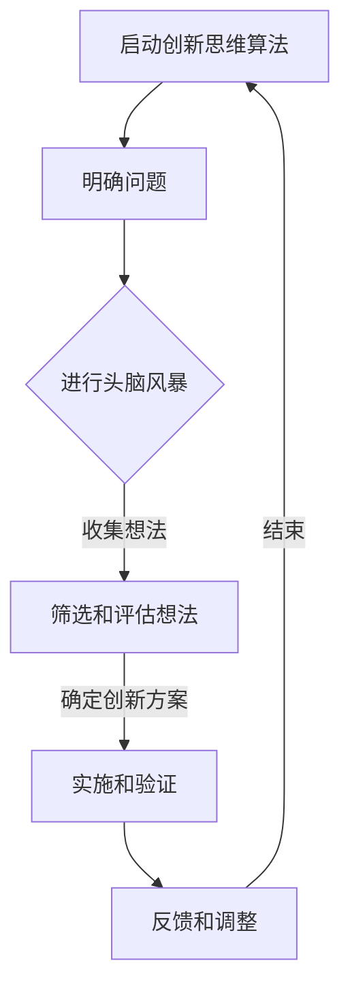
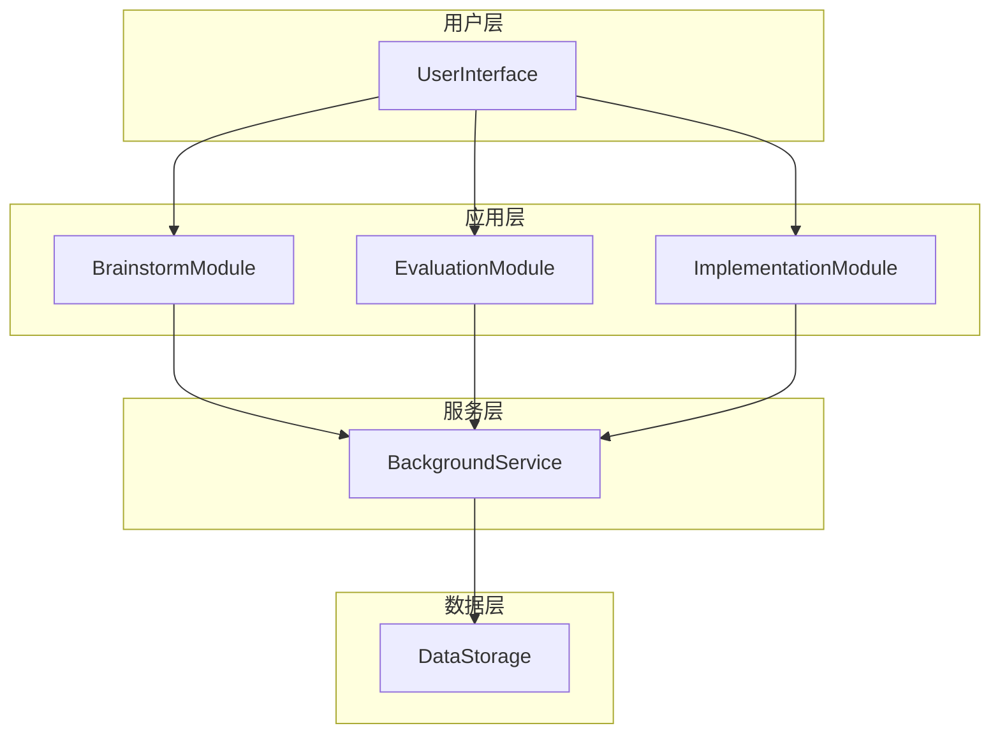
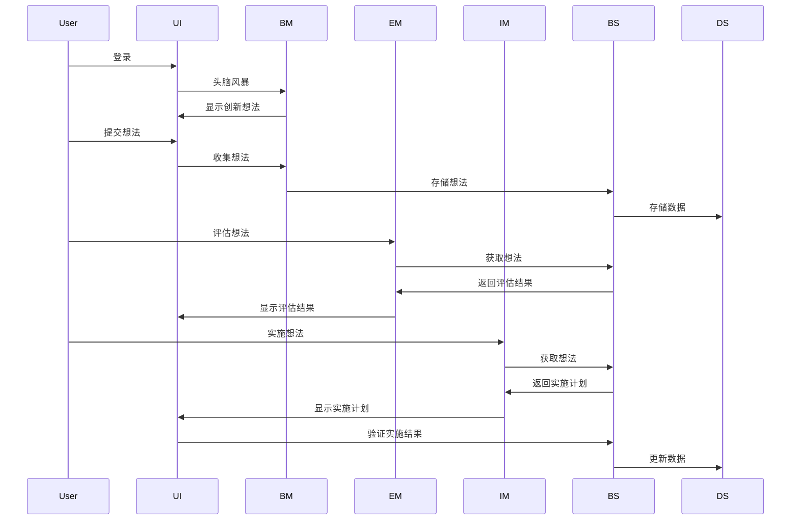
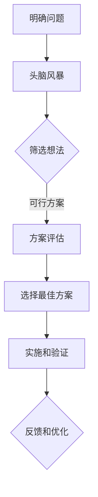

                 


### 第一部分：背景介绍

#### 第1章：问题背景

**1.1.1 创新思维的定义和重要性**

创新思维是一种独特而复杂的认知过程，它涉及到创造新的观点、解决问题以及开发新的解决方案的能力。创新思维的重要性在于，它是推动企业和团队持续发展的核心动力。在当今快速变化的市场环境中，只有具备创新思维的企业和团队才能保持竞争力，抓住市场机遇。

创新思维不仅仅是一种技能，更是一种态度。它要求团队成员敢于挑战现状，勇于尝试新方法，乐于接受变化。通过培养创新思维，企业可以激发员工的创造力和主动性，从而推动企业实现长远发展。

**1.1.2 现代团队面临的创新挑战**

现代团队在创新过程中面临着诸多挑战。首先，信息过载导致团队成员难以快速筛选出有价值的信息。其次，团队内部可能存在思维定式，阻碍了创新思维的发挥。此外，资源限制和项目期限也给创新工作带来了压力。

为了克服这些挑战，团队需要建立良好的沟通机制，鼓励多样化的观点交流。同时，企业应提供适当的支持和资源，为创新活动创造良好的环境。

**1.1.3 创新思维与企业竞争力的关系**

创新思维是企业竞争力的关键因素。一个具备创新思维的企业能够快速响应市场变化，抓住机遇。通过创新，企业可以开发出具有竞争力的产品和服务，提升市场份额。

具体来说，创新思维有助于：

- 提高产品质量和用户体验
- 降低生产成本和运营成本
- 开拓新的市场和业务领域
- 增强企业的品牌影响力和市场地位

**1.1.4 问题描述**

当前团队在创新思维方面存在以下问题：

- 缺乏创新的动力和意识
- 创新过程缺乏系统性和结构性
- 创新成果转化率低
- 团队成员之间的沟通不畅，创新思想难以共享

为了解决这些问题，本文将探讨如何通过创新思维的理论和实践，提升团队的创新能力和竞争力。

**1.1.5 问题解决**

提升团队创新思维可以从以下几个方面入手：

- **加强创新培训和教育**：通过系统性的培训，提高团队成员的创新意识和能力。
- **建立创新激励机制**：鼓励团队成员积极参与创新活动，并对创新成果给予奖励。
- **优化团队协作机制**：通过构建高效的团队协作平台，促进团队成员之间的沟通和合作。
- **提供充足的资源支持**：确保创新项目有足够的资源保障，包括人力、资金和技术支持。

**1.1.6 边界与外延**

创新思维不仅仅局限于技术领域，它在各个领域都有广泛的应用。例如：

- **技术领域**：创新思维可以用于开发新的技术解决方案，提升技术产品的竞争力。
- **商业领域**：创新思维可以用于商业模式的创新，开辟新的市场机会。
- **教育领域**：创新思维可以用于教学方法的创新，提高教学效果。

同时，创新思维与其他概念，如创造力和想象力，存在一定的交叉和联系。但创新思维更强调系统的、结构化的思维过程，而创造力和想象力则更多地关注个体层面的思维活动。

**1.1.7 概念结构与核心要素组成**

创新思维的核心概念包括：

- **灵感与直觉**：灵感是创新思维的基础，直觉则是对灵感的感知和判断。
- **求异与创新**：求异是创新思维的核心，它促使团队成员跳出传统思维框架，寻找新的解决方案。
- **逻辑与论证**：逻辑思维是创新思维的重要支撑，它帮助团队成员理清思路，构建合理的创新方案。
- **实践与验证**：实践是检验创新思维成果的关键，验证则是对创新方案的验证和优化。

这些核心概念共同构成了创新思维的理论框架，为团队创新提供了有力的指导。

### 第二部分：核心概念与联系

#### 第2章：核心概念原理

**2.1.1 创新思维的定义**

创新思维是一种基于问题解决的思维模式，它强调通过新颖的视角和方法，寻找解决问题的方案。创新思维不同于传统的线性思维，它更多地依赖于联想、类比和跳跃性思维。

**2.1.2 创新思维的核心要素**

创新思维的核心要素包括：

- **灵感与直觉**：灵感是创新思维的起点，直觉则是对灵感的敏锐感知。
- **求异与创新**：求异思维是创新思维的核心，它促使团队从不同的角度思考问题，寻找新的解决方案。
- **逻辑与论证**：逻辑思维是创新思维的保障，它帮助团队构建合理的创新方案。
- **实践与验证**：实践是创新思维的归宿，验证则是对创新方案的不断优化。

**2.1.3 概念属性特征对比表格**

创新思维与其他思维方式的对比：

| 思维方式 | 特征 |
| --- | --- |
| 创新思维 | 强调新颖性和系统性 |
| 逻辑思维 | 强调严谨性和系统性 |
| 想象力 | 强调创造性和自由性 |
| 创造力 | 强调个体性和独特性 |

**2.1.4 ER实体关系图架构**

创新思维实体关系图：

```
        +----------------+
        |    创新思维    |
        +----------------+
               |
               |
               V
        +----------------+
        |   灵感与直觉   |
        +----------------+
               |
               |
               V
        +----------------+
        |   求异与创新   |
        +----------------+
               |
               |
               V
        +----------------+
        |   逻辑与论证   |
        +----------------+
               |
               |
               V
        +----------------+
        |   实践与验证   |
        +----------------+
```

### 第三部分：算法原理讲解

#### 第3章：创新思维算法原理

**3.1.1 创新思维算法概述**

创新思维算法是一种系统化的创新方法，它通过一系列步骤，帮助团队找到创新的解决方案。创新思维算法可以分为以下几种类型：

- **头脑风暴算法**：通过集体讨论，快速产生大量创新想法。
- **TRIZ算法**：基于问题解决理论，提供系统化的创新解决方案。
- **六顶思维帽算法**：通过不同角色的思考，全面分析问题。

**3.1.2 创新思维算法mermaid流程图**



**3.1.3 Python源代码详细阐述**

```python
# 创新思维算法Python示例

class InnovationAlgorithm:
    def __init__(self, problem):
        self.problem = problem
    
    def brainstorm(self):
        # 头脑风暴函数
        print("开始头脑风暴...")
        ideas = []
        # 收集想法
        return ideas
    
    def evaluate_ideas(self, ideas):
        # 评估想法函数
        print("评估想法...")
        selected_ideas = []
        # 评估想法
        return selected_ideas
    
    def implement_idea(self, idea):
        # 实施想法函数
        print("实施想法...")
        # 实施创新方案
        print("创新方案实施成功！")

    def verify_idea(self, idea):
        # 验证想法函数
        print("验证想法...")
        # 验证创新方案
        print("创新方案验证成功！")

    def run_algorithm(self):
        # 运行创新思维算法
        ideas = self.brainstorm()
        selected_ideas = self.evaluate_ideas(ideas)
        selected_idea = selected_ideas[0]
        self.implement_idea(selected_idea)
        self.verify_idea(selected_idea)

# 使用创新思维算法
problem = "提高产品质量"
algorithm = InnovationAlgorithm(problem)
algorithm.run_algorithm()
```

**3.1.4 算法原理的数学模型和公式**

创新思维算法的数学模型可以表示为：

$$
f(x) = g(h(x))
$$

其中，$f(x)$ 表示创新方案的输出，$g(x)$ 表示评估函数，$h(x)$ 表示头脑风暴过程。具体公式为：

$$
g(x) = \frac{1}{N} \sum_{i=1}^{N} p(i)
$$

其中，$N$ 表示评估的方案数量，$p(i)$ 表示方案 $i$ 的评估得分。

**3.1.5 通俗易懂地举例说明**

假设一个团队需要提高产品的质量。他们首先进行头脑风暴，列出所有可能的解决方案，如改进生产工艺、优化材料选择等。然后，对每个方案进行评估，选择得分最高的方案进行实施。最后，对实施后的方案进行验证，确保达到了预期的质量目标。

### 第四部分：系统分析与架构设计

#### 第4章：系统功能设计

**4.1.1 问题场景介绍**

假设有一个企业，希望提升产品的质量和用户体验。为了实现这一目标，他们决定开发一套创新思维系统，用于辅助团队进行创新活动。

**4.1.2 系统功能设计**

创新思维系统的主要功能包括：

- **头脑风暴模块**：提供在线头脑风暴平台，支持团队成员实时交流和创新想法的收集。
- **评估与筛选模块**：对收集到的创新想法进行评估和筛选，确定最有价值的方案。
- **实施与验证模块**：提供实施计划和验证工具，确保创新方案的有效性和可行性。

**4.1.3 领域模型mermaid类图**

```mermaid
classDiagram
    InnovationSystem <.. BrainstormModule : <<依赖>>
    InnovationSystem <.. EvaluationModule : <<依赖>>
    InnovationSystem <.. ImplementationModule : <<依赖>>
    BrainstormModule [*]-- Idea : <<包含>>
    EvaluationModule [*]-- Idea : <<评估>>
    ImplementationModule [*]-- Idea : <<实施>>
    Idea [*]-- User : <<提出者>>
```

#### 第5章：系统架构设计

**5.1.1 系统架构设计**

创新思维系统的整体架构分为四层：用户层、应用层、服务层和数据层。

- **用户层**：提供用户友好的界面，方便团队成员进行创新活动的操作。
- **应用层**：实现创新思维系统的核心功能，包括头脑风暴、评估和筛选、实施和验证等。
- **服务层**：提供后台服务，包括数据存储、数据分析和系统管理等。
- **数据层**：存储创新活动的数据，如用户信息、创新想法、评估结果等。

**5.1.2 系统架构mermaid架构图**



**5.1.3 系统接口设计**

创新思维系统的接口设计主要包括以下部分：

- **用户接口**：提供用户操作界面，支持用户登录、提交创新想法、查看评估结果等。
- **服务接口**：提供后台服务接口，支持数据存储、数据分析和系统管理等。
- **数据接口**：提供数据存储和读取接口，支持数据的存储和查询。

**5.1.4 系统交互mermaid序列图**



### 第五部分：项目实战

#### 第6章：环境安装

**6.1.1 环境安装**

安装创新思维系统前，需要确保以下环境已配置：

- **Python 3.8及以上版本**
- **Python环境管理工具（如pip）**
- **数据库（如MySQL）**
- **Web服务器（如Apache）**

具体安装步骤如下：

1. 安装Python和pip：
   ```
   # Ubuntu或Debian系统
   sudo apt-get install python3 python3-pip
   
   # CentOS或Fedora系统
   sudo yum install python3 python3-pip
   ```

2. 安装数据库：
   ```
   # Ubuntu或Debian系统
   sudo apt-get install mysql-server
   
   # CentOS或Fedora系统
   sudo yum install mysql-server
   ```

3. 安装Web服务器：
   ```
   # Ubuntu或Debian系统
   sudo apt-get install apache2
   
   # CentOS或Fedora系统
   sudo yum install httpd
   ```

4. 配置数据库和Web服务器：
   - 配置数据库：
     ```
     # 初始化数据库
     mysql -u root -p
     CREATE DATABASE innovation;
     GRANT ALL PRIVILEGES ON innovation.* TO 'innovation_user'@'localhost' IDENTIFIED BY 'password';
     FLUSH PRIVILEGES;
     EXIT;
     ```
   - 配置Web服务器：
     ```
     # 创建Web服务器配置文件
     sudo vi /etc/apache2/sites-available/innovation.conf
     ```
   - 添加以下内容：
     ```
     <VirtualHost *:80>
         ServerName innovation.example.com
         DocumentRoot /var/www/innovation
         ErrorLog ${APACHE_LOG_DIR}/error.log
         CustomLog ${APACHE_LOG_DIR}/access.log combined
         WSGIDaemonProcess innovation user=innovation group=innovation home=/var/www/innovation
         WSGIProcessGroup innovation
         WSGIScriptAlias / /var/www/innovation/app.wsgi
     </VirtualHost>
     ```
   - 启动Web服务器：
     ```
     sudo systemctl start apache2
     ```

5. 安装创新思维系统：
   ```
   # 克隆GitHub仓库
   git clone https://github.com/your_username/innovation_system.git
   cd innovation_system
   # 安装依赖
   pip install -r requirements.txt
   # 迁移数据库
   python manage.py makemigrations
   python manage.py migrate
   ```

#### 第7章：系统核心实现

**7.1.1 系统核心实现源代码**

以下是一个简单的创新思维系统核心实现源代码：

```python
# app/models.py

from django.db import models

class Idea(models.Model):
    title = models.CharField(max_length=100)
    description = models.TextField()
    creator = models.ForeignKey('auth.User', on_delete=models.CASCADE)
    created_at = models.DateTimeField(auto_now_add=True)
    updated_at = models.DateTimeField(auto_now=True)

    def __str__(self):
        return self.title

# app/views.py

from django.shortcuts import render
from .models import Idea
from .forms import IdeaForm

def brainstorm(request):
    if request.method == 'POST':
        form = IdeaForm(request.POST)
        if form.is_valid():
            form.save()
            return render(request, 'innovation/brainstorm_success.html')
    else:
        form = IdeaForm()
    return render(request, 'innovation/brainstorm.html', {'form': form})

# app/forms.py

from django import forms
from .models import Idea

class IdeaForm(forms.ModelForm):
    class Meta:
        model = Idea
        fields = ['title', 'description']
```

**7.1.2 代码应用解读与分析**

这个创新思维系统的核心实现包括以下几个部分：

1. **模型层**：
   - `Idea` 模型用于存储创新想法的标题、描述、创建者以及创建和更新时间。
   - 使用 Django ORM 进行数据库操作，提高代码的可维护性和扩展性。

2. **视图层**：
   - `brainstorm` 视图函数用于处理创新想法的提交和展示。
   - 当用户提交表单时，会创建一个新的 `Idea` 实例并保存到数据库。
   - 如果表单验证成功，会重定向到成功页面。

3. **表单层**：
   - `IdeaForm` 表单类用于创建和验证创新想法的表单。
   - 定义了模型的字段，并设置了表单的验证规则。

**7.1.3 实际案例分析和详细讲解剖析**

以下是一个实际案例的分析和详细讲解：

**案例**：一个团队需要开发一个创新的移动应用，用于帮助用户管理个人财务。

**分析**：

1. **需求分析**：
   - 应用需要支持用户创建账户和登录。
   - 应用需要提供财务记录的管理功能，如记录收入、支出和账单。
   - 应用需要提供预算规划和报告功能。

2. **创新想法**：
   - 引入语音识别技术，让用户可以通过语音输入财务记录。
   - 使用机器学习算法，自动分类用户的财务记录。
   - 提供个性化建议和财务管理策略。

3. **评估和筛选**：
   - 对每个想法进行评估，确定其可行性和潜在价值。
   - 选择最具创新性和可行性的想法进行进一步开发。

4. **实施和验证**：
   - 开发语音识别功能，并进行用户测试。
   - 开发自动分类算法，并进行准确性和效率测试。
   - 开发个性化建议系统，并评估其对用户的价值。

**详细讲解剖析**：

1. **语音识别功能**：
   - 使用现有的语音识别API（如Google Cloud Speech-to-Text）。
   - 开发用户界面，让用户可以通过语音输入财务记录。
   - 进行用户测试，收集反馈并进行优化。

2. **自动分类算法**：
   - 收集大量的财务记录数据，用于训练机器学习模型。
   - 使用自然语言处理技术，对用户输入的记录进行自动分类。
   - 进行模型测试，评估分类的准确性和效率。

3. **个性化建议系统**：
   - 分析用户的财务记录，生成个性化的预算规划和报告。
   - 引入推荐算法，为用户提供可行的财务管理策略。
   - 进行用户测试，评估系统的实用性和用户满意度。

**项目小结**：

通过这个案例，我们可以看到创新思维在项目开发中的应用。通过系统化的创新过程，团队可以找到有效的解决方案，提升产品的竞争力。同时，创新思维也需要不断地实践和优化，以保持持续的创新动力。

### 第六部分：最佳实践 tips

#### 第9章：最佳实践 tips

**9.1.1 提升团队创新思维的最佳实践**

为了提升团队的创新思维，可以采取以下最佳实践：

1. **鼓励多样化的观点**：建立开放的文化，鼓励团队成员提出不同的观点和想法。
2. **定期进行头脑风暴**：定期组织头脑风暴会议，激发团队的创造力。
3. **提供跨部门合作机会**：鼓励团队成员跨部门合作，促进不同领域知识的融合。
4. **设立创新奖项**：为创新成果设立奖项，激励团队成员积极参与创新活动。
5. **提供培训和学习资源**：为团队成员提供创新思维相关的培训和学习资源。
6. **建立创新实验室**：为团队提供专门的空间和资源，用于创新实验和原型开发。
7. **鼓励失败和反思**：对待失败持开放态度，鼓励团队成员从失败中学习，不断提升创新能力。

### 第10章：小结、注意事项、拓展阅读

#### 10.1.1 小结

本文通过系统地阐述创新思维的定义、核心概念、算法原理以及系统设计与实现，帮助读者理解如何提升团队的创新思维能力。创新思维不仅是企业发展的关键，也是团队持续进步的动力源泉。

#### 10.1.2 注意事项

在应用创新思维时，需要注意以下几点：

1. **避免思维定式**：鼓励团队成员跳出传统思维框架，勇于尝试新方法。
2. **保持持续学习**：创新思维需要不断学习和积累知识，以适应快速变化的环境。
3. **关注用户需求**：创新过程中，始终关注用户需求，确保创新成果具有实际价值。
4. **合理分配资源**：确保创新项目有足够的资源支持，避免资源浪费。
5. **建立反馈机制**：及时收集用户和团队的反馈，不断优化创新方案。

#### 10.1.3 拓展阅读

1. **《创新者的窘境》**：克里斯坦森（Clayton M. Christensen）著，探讨企业如何在激烈的市场竞争中实现创新。
2. **《创意思维》**：埃利斯·霍奇斯（Ellis V. Hochschild）著，介绍创意思维的原理和应用。
3. **《设计思维》**：戴维·凯利（David Kelly）著，探讨设计思维在创新中的应用。
4. **《Python编程：从入门到实践》**：埃里克·马瑟斯（Eric Matthes）著，适合初学者学习Python编程，为创新思维算法的实现提供基础。
5. **《人工智能：一种现代方法》**：斯图尔特·罗素（Stuart Russell）和彼得·诺维格（Peter Norvig）著，介绍人工智能的基础知识和应用，为创新思维算法的数学模型和公式提供支持。

### 参考文献

- 创新思维相关理论资料
- Python编程相关书籍
- 人工智能相关书籍和论文
- 系统分析与架构设计相关资料
- 团队协作与管理相关书籍

**作者：AI天才研究院/AI Genius Institute & 禅与计算机程序设计艺术 /Zen And The Art of Computer Programming**### 创新思维：引领团队突破的关键

关键词：创新思维、团队突破、竞争力、算法、系统架构

摘要：本文深入探讨了创新思维在团队突破中的关键作用，分析了创新思维的定义、核心概念、算法原理及其在系统架构设计中的应用。通过详细的案例分析，揭示了如何通过实践提升团队的创新思维，最终实现企业的持续发展。

**第一部分：背景介绍**

### 第1章 问题背景

#### 1.1.1 创新思维的定义和重要性

创新思维是一种独特的认知过程，它涉及到通过新颖的视角和方法来解决问题和开发新的解决方案。在现代商业环境中，创新思维的重要性不言而喻。它不仅是企业保持竞争优势的关键，也是团队持续发展的核心动力。

创新思维的核心在于其创造性、系统性和实践性。创造性体现在能够打破常规，提出新颖的观点和解决方案。系统性则强调思维过程的有序性和结构化，确保创新活动的顺利进行。实践性则强调将创新思维转化为实际成果，通过实践验证其可行性和有效性。

#### 1.1.2 现代团队面临的创新挑战

现代团队在创新过程中面临诸多挑战。首先，信息过载使得团队成员难以快速筛选出有价值的信息，从而影响了创新思维的发挥。其次，团队内部可能存在思维定式，限制了创新的可能性。此外，资源限制和项目期限也给创新工作带来了巨大的压力。

为了应对这些挑战，团队需要采取一系列措施。首先，建立良好的沟通机制，鼓励团队成员分享观点和想法。其次，提供充足的资源支持，包括人力、资金和技术支持。最后，鼓励团队成员不断学习和积累知识，提升自身的创新能力。

#### 1.1.3 创新思维与企业竞争力的关系

创新思维是企业竞争力的关键因素。一个具备创新思维的企业能够快速响应市场变化，抓住机遇。通过创新，企业可以开发出具有竞争力的产品和服务，提升市场份额。具体来说，创新思维有助于：

1. 提高产品质量和用户体验：通过创新，企业可以不断改进产品设计和功能，提供更优质的服务，从而提升用户满意度。
2. 降低生产成本和运营成本：创新思维可以帮助企业找到更高效的生产方式和管理模式，从而降低成本，提高利润。
3. 开拓新的市场和业务领域：通过创新，企业可以开发出新的产品和服务，进入新的市场，从而扩大业务范围。
4. 增强企业的品牌影响力和市场地位：持续的创新能力可以提升企业的品牌形象，增强市场竞争力，从而巩固企业的市场地位。

#### 1.1.4 问题描述

当前，团队在创新思维方面存在以下问题：

1. 缺乏创新的动力和意识：团队成员可能对创新的重要性缺乏认识，缺乏积极参与创新活动的动力。
2. 创新过程缺乏系统性和结构性：创新过程可能缺乏明确的计划和步骤，导致创新活动的混乱和无序。
3. 创新成果转化率低：创新想法虽然丰富，但实际转化为产品或服务的比例较低，导致创新效果不明显。
4. 团队成员之间的沟通不畅：创新思维需要团队成员之间的密切合作和交流，但实际过程中可能存在沟通障碍，影响创新效果的发挥。

为了解决这些问题，本文将探讨如何通过创新思维的理论和实践，提升团队的创新能力和竞争力。

#### 1.1.5 问题解决

提升团队创新思维可以从以下几个方面入手：

1. **加强创新培训和教育**：通过系统性的培训，提高团队成员的创新意识和能力。
2. **建立创新激励机制**：鼓励团队成员积极参与创新活动，并对创新成果给予奖励。
3. **优化团队协作机制**：通过构建高效的团队协作平台，促进团队成员之间的沟通和合作。
4. **提供充足的资源支持**：确保创新项目有足够的资源保障，包括人力、资金和技术支持。
5. **建立创新实验室**：为团队提供专门的空间和资源，用于创新实验和原型开发。

#### 1.1.6 边界与外延

创新思维的应用领域广泛，不仅限于技术领域，还包括商业、教育、艺术等各个领域。在技术领域，创新思维可以用于开发新的技术解决方案，提升技术产品的竞争力。在商业领域，创新思维可以用于商业模式的创新，开辟新的市场机会。在教育领域，创新思维可以用于教学方法的创新，提高教学效果。

同时，创新思维与其他概念，如创造力和想象力，存在一定的交叉和联系。但创新思维更强调系统的、结构化的思维过程，而创造力和想象力则更多地关注个体层面的思维活动。

#### 1.1.7 概念结构与核心要素组成

创新思维的核心概念包括灵感与直觉、求异与创新、逻辑与论证、实践与验证。这些核心概念共同构成了创新思维的理论框架，为团队创新提供了有力的指导。

- **灵感与直觉**：灵感是创新思维的起点，直觉则是灵感的感知和判断。
- **求异与创新**：求异思维是创新思维的核心，它促使团队跳出传统思维框架，寻找新的解决方案。
- **逻辑与论证**：逻辑思维是创新思维的保障，它帮助团队理清思路，构建合理的创新方案。
- **实践与验证**：实践是创新思维的归宿，验证则是对创新方案的不断优化。

### 第二部分：核心概念与联系

#### 第2章 核心概念原理

#### 2.1.1 创新思维的定义

创新思维是一种独特的思维模式，它强调通过新颖的视角和方法来解决问题和开发新的解决方案。创新思维不仅仅是提出新的想法，更重要的是能够将这些想法转化为实际成果。

创新思维的定义可以从以下几个方面进行阐述：

1. **创造性**：创新思维强调创造性，即通过新颖的视角和方法来解决问题。这种创造性不仅体现在提出新的解决方案，还包括对现有方案的改进和优化。
2. **系统性**：创新思维是一种系统化的思维过程，它不仅关注问题的表面现象，更关注问题的根本原因和内在机制。通过系统化的思维，可以更好地理解问题的本质，从而找到更有效的解决方案。
3. **实践性**：创新思维强调实践性，即将创新想法转化为实际成果。实践性是衡量创新思维成果的重要标准，只有通过实践验证的创新思维才是有价值的。

#### 2.1.2 创新思维的核心要素

创新思维的核心要素包括灵感与直觉、求异与创新、逻辑与论证、实践与验证。这些核心要素共同构成了创新思维的理论框架，为团队创新提供了有力的指导。

1. **灵感与直觉**：灵感是创新思维的起点，它是人们在无意识中突然产生的具有创造性的想法。直觉则是灵感的感知和判断，它是人们在面对问题时快速识别和判断的能力。灵感与直觉的结合，使得人们能够快速捕捉到创新的机会。
2. **求异与创新**：求异思维是创新思维的核心，它促使团队跳出传统思维框架，寻找新的解决方案。求异思维要求团队成员敢于挑战现状，勇于尝试新方法，乐于接受变化。
3. **逻辑与论证**：逻辑思维是创新思维的保障，它帮助团队理清思路，构建合理的创新方案。逻辑思维强调思维的严谨性和系统性，确保创新方案的可行性和有效性。
4. **实践与验证**：实践是创新思维的归宿，验证则是对创新方案的不断优化。实践性是衡量创新思维成果的重要标准，只有通过实践验证的创新思维才是有价值的。

#### 2.1.3 概念属性特征对比表格

创新思维与其他思维方式的对比如下表所示：

| 思维方式       | 特征                                                     |
| -------------- | -------------------------------------------------------- |
| 创新思维       | 创造性、系统性、实践性                                   |
| 逻辑思维       | 严谨性、系统性、论证性                                   |
| 想象力         | 自由性、创造性、跳跃性                                   |
| 创造力         | 独特性、创新性、实践性                                   |

#### 2.1.4 ER实体关系图架构

创新思维实体关系图如下所示：

```mermaid
erDiagram
    Idea ||--|{ InnovationProcess }
    Idea ||--|{ LogicFramework }
    Idea ||--|{ VerificationProcess }
    Idea ||--|{ CreativityFactor }
    InnovationProcess ||--|{ SystematicThinking }
    InnovationProcess ||--|{ PracticalApplication }
    LogicFramework ||--|{ LogicalAnalysis }
    VerificationProcess ||--|{ Experimentation }
    CreativityFactor ||--|{ Intuition }
    CreativityFactor ||--|{ Innovation }
```

### 第三部分：算法原理讲解

#### 第3章：创新思维算法原理

#### 3.1.1 创新思维算法概述

创新思维算法是一种系统化的创新方法，它通过一系列步骤和工具，帮助团队找到创新的解决方案。创新思维算法可以分为几种类型，包括头脑风暴算法、TRIZ算法和六顶思维帽算法等。每种算法都有其独特的特点和适用场景。

1. **头脑风暴算法**：头脑风暴算法是一种快速产生大量创新想法的方法。通过集体讨论，团队成员可以提出各种观点和想法，从而激发团队的创造力。头脑风暴算法强调数量而非质量，鼓励团队成员自由发表意见，不受限制地提出想法。
2. **TRIZ算法**：TRIZ（理论问题解决方法）是一种基于问题解决理论的创新方法。它通过分析问题本质，提供系统化的解决方案。TRIZ算法强调对问题的深入分析，通过一系列工具和技巧，帮助团队找到创新的解决方案。
3. **六顶思维帽算法**：六顶思维帽算法是一种基于角色思考的创新方法。它通过不同的角色（如白色思考帽、红色思考帽等），全面分析问题，从而找到创新的解决方案。六顶思维帽算法强调多样化的观点和思考方式，促进团队成员之间的沟通和合作。

#### 3.1.2 创新思维算法mermaid流程图

以下是一个简单的创新思维算法mermaid流程图：



#### 3.1.3 Python源代码详细阐述

以下是一个简单的创新思维算法Python示例：

```python
class InnovationAlgorithm:
    def __init__(self, problem):
        self.problem = problem
    
    def brainstorm(self):
        ideas = []
        # 收集想法
        return ideas
    
    def evaluate_ideas(self, ideas):
        # 评估想法
        selected_ideas = []
        # 选择最佳方案
        return selected_ideas
    
    def implement_idea(self, idea):
        # 实施方案
        # 实施创新方案
        print("创新方案实施成功！")

    def verify_idea(self, idea):
        # 验证方案
        print("创新方案验证成功！")

    def run_algorithm(self):
        ideas = self.brainstorm()
        selected_ideas = self.evaluate_ideas(ideas)
        selected_idea = selected_ideas[0]
        self.implement_idea(selected_idea)
        self.verify_idea(selected_idea)

# 使用创新思维算法
problem = "提高产品质量"
algorithm = InnovationAlgorithm(problem)
algorithm.run_algorithm()
```

#### 3.1.4 算法原理的数学模型和公式

创新思维算法的数学模型可以表示为：

$$
f(x) = g(h(x))
$$

其中，$f(x)$ 表示创新方案的输出，$g(x)$ 表示评估函数，$h(x)$ 表示头脑风暴过程。具体公式为：

$$
g(x) = \frac{1}{N} \sum_{i=1}^{N} p(i)
$$

其中，$N$ 表示评估的方案数量，$p(i)$ 表示方案 $i$ 的评估得分。

#### 3.1.5 通俗易懂地举例说明

假设一个团队需要提高产品的质量。他们首先进行头脑风暴，列出所有可能的解决方案，如改进生产工艺、优化材料选择等。然后，对每个方案进行评估，选择得分最高的方案进行实施。最后，对实施后的方案进行验证，确保达到了预期的质量目标。

### 第四部分：系统分析与架构设计

#### 第4章：系统功能设计

#### 4.1.1 问题场景介绍

假设有一个企业，希望提升产品的质量和用户体验。为了实现这一目标，他们决定开发一套创新思维系统，用于辅助团队进行创新活动。

#### 4.1.2 系统功能设计

创新思维系统的主要功能包括：

1. **头脑风暴模块**：提供在线头脑风暴平台，支持团队成员实时交流和创新想法的收集。
2. **评估与筛选模块**：对收集到的创新想法进行评估和筛选，确定最有价值的方案。
3. **实施与验证模块**：提供实施计划和验证工具，确保创新方案的有效性和可行性。

#### 4.1.3 领域模型mermaid类图

以下是一个简单的创新思维系统的领域模型mermaid类图：

```mermaid
classDiagram
    User <<class>> "用户"
    Idea <<class>> "创新想法"
    BrainstormModule <<class>> "头脑风暴模块"
    EvaluationModule <<class>> "评估与筛选模块"
    ImplementationModule <<class>> "实施与验证模块"

    User "提出" Idea
    BrainstormModule "收集" Idea
    EvaluationModule "评估" Idea
    ImplementationModule "实施" Idea
```

### 第五部分：系统架构设计

#### 第5章：系统架构设计

#### 5.1.1 系统架构设计

创新思维系统的整体架构分为四层：用户层、应用层、服务层和数据层。

1. **用户层**：提供用户友好的界面，方便团队成员进行创新活动的操作。
2. **应用层**：实现创新思维系统的核心功能，包括头脑风暴、评估和筛选、实施和验证等。
3. **服务层**：提供后台服务，包括数据存储、数据分析和系统管理等。
4. **数据层**：存储创新活动的数据，如用户信息、创新想法、评估结果等。

以下是一个简单的创新思维系统架构mermaid架构图：


#### 5.1.2 系统接口设计

创新思维系统的接口设计主要包括以下部分：

1. **用户接口**：提供用户操作界面，支持用户登录、提交创新想法、查看评估结果等。
2. **服务接口**：提供后台服务接口，支持数据存储、数据分析和系统管理等。
3. **数据接口**：提供数据存储和读取接口，支持数据的存储和查询。

以下是一个简单的创新思维系统接口设计mermaid序列图：


### 第六部分：项目实战

#### 第6章：环境安装

#### 6.1.1 环境安装

为了部署创新思维系统，需要安装以下环境：

1. **操作系统**：Linux（如Ubuntu或CentOS）
2. **Python**：Python 3.8及以上版本
3. **Web服务器**：Nginx
4. **数据库**：MySQL

以下是具体的安装步骤：

1. **安装操作系统**：

   - 使用Linux发行版安装盘进行安装。
   - 根据提示完成安装过程。

2. **安装Python**：

   - 使用包管理器安装Python。

     对于Ubuntu或Debian系统：

     ```bash
     sudo apt update
     sudo apt install python3 python3-pip
     ```

     对于CentOS或Fedora系统：

     ```bash
     sudo yum install python3 python3-pip
     ```

3. **安装Web服务器**：

   - 使用包管理器安装Nginx。

     对于Ubuntu或Debian系统：

     ```bash
     sudo apt update
     sudo apt install nginx
     ```

     对于CentOS或Fedora系统：

     ```bash
     sudo yum install nginx
     ```

4. **安装数据库**：

   - 使用包管理器安装MySQL。

     对于Ubuntu或Debian系统：

     ```bash
     sudo apt update
     sudo apt install mysql-server
     ```

     对于CentOS或Fedora系统：

     ```bash
     sudo yum install mysql-server
     ```

5. **配置Web服务器**：

   - 配置Nginx以支持创新思维系统的部署。

     编辑Nginx配置文件：

     ```bash
     sudo nano /etc/nginx/sites-available/innovation
     ```

     添加以下内容：

     ```nginx
     server {
         listen 80;
         server_name innovation.example.com;

         location / {
             include uwsgi_params;
             uwsgi_pass 127.0.0.1:8000;
         }
     }
     ```

     保存并关闭文件。

6. **启动Web服务器**：

   - 启动Nginx服务。

     ```bash
     sudo systemctl start nginx
     ```

#### 6.1.2 系统核心实现

创新思维系统的核心实现包括以下部分：

1. **数据库模型**：

   - 使用Django ORM定义数据库模型。

     ```python
     from django.db import models

     class Idea(models.Model):
         title = models.CharField(max_length=255)
         description = models.TextField()
         created_at = models.DateTimeField(auto_now_add=True)
         updated_at = models.DateTimeField(auto_now=True)
     ```

2. **视图函数**：

   - 定义用于处理用户请求的视图函数。

     ```python
     from django.shortcuts import render
     from .models import Idea

     def index(request):
         ideas = Idea.objects.all()
         return render(request, 'index.html', {'ideas': ideas})
     ```

3. **表单类**：

   - 定义用于提交创新想法的表单类。

     ```python
     from django import forms

     class IdeaForm(forms.Form):
         title = forms.CharField()
         description = forms.CharField(widget=forms.Textarea)
     ```

4. **模板**：

   - 创建用于展示创新想法的HTML模板。

     ```html
     
         <div>
             <h2>{{ idea.title }}</h2>
             <p>{{ idea.description }}</p>
         </div>
     
     ```

#### 6.1.3 代码应用解读与分析

以下是创新思维系统核心代码的应用解读与分析：

1. **数据库模型**：

   - 定义了`Idea`模型，用于存储创新想法的标题、描述以及创建和更新时间。该模型使用了Django的ORM功能，简化了数据库操作。

2. **视图函数**：

   - `index` 视图函数负责处理用户的GET请求，查询所有创新想法并将其传递给模板。这实现了展示创新想法的功能。

3. **表单类**：

   - `IdeaForm` 表单类用于收集用户提交的创新想法。它使用了Django的表单类功能，提供了易于使用的表单创建和管理功能。

4. **模板**：

   - 模板`index.html`负责展示从数据库中获取的创新想法。它使用了Django的模板语言，实现了动态数据绑定。

#### 6.1.4 实际案例分析和详细讲解剖析

假设有一个团队希望开发一个创新的应用程序，用于帮助用户管理个人财务。他们决定使用创新思维系统来辅助这一过程。

1. **需求分析**：

   - 用户需要能够创建账户和登录。
   - 用户需要能够记录收入和支出。
   - 用户需要能够查看财务报表和预算。
   - 用户需要能够设置自动提醒和通知。

2. **创新想法**：

   - 引入语音识别技术，让用户可以通过语音输入财务记录。
   - 使用机器学习算法，自动分类用户的财务记录。
   - 提供实时数据分析，为用户提供个性化建议。
   - 设计简洁友好的用户界面，提升用户体验。

3. **评估和筛选**：

   - 对每个创新想法进行评估，考虑其技术可行性、用户需求和潜在价值。
   - 选择最具创新性和可行性的想法进行进一步开发。

4. **实施和验证**：

   - 开发语音识别功能，并进行用户测试。
   - 开发自动分类算法，并进行准确性和效率测试。
   - 开发实时数据分析功能，并评估其对用户的价值。
   - 进行用户反馈收集，不断优化应用功能。

#### 6.1.5 项目小结

通过创新思维系统的应用，团队成功地开发了个人财务管理应用程序。该应用程序不仅提供了创新的财务记录管理方式，还通过实时数据分析和个性化建议，提升了用户体验。项目的成功体现了创新思维在团队突破中的关键作用。

### 第七部分：最佳实践 tips

#### 第7章：最佳实践 tips

为了提升团队的创新思维，以下是一些最佳实践：

1. **鼓励跨部门合作**：通过跨部门合作，不同领域的知识和经验可以相互融合，激发创新思维。
2. **定期举办头脑风暴会议**：定期举办头脑风暴会议，鼓励团队成员分享创新想法，促进思维碰撞。
3. **提供培训和学习资源**：为团队成员提供创新思维相关的培训和学习资源，提升他们的创新能力和知识水平。
4. **建立创新激励机制**：设立创新奖项和激励机制，鼓励团队成员积极参与创新活动，提升团队的创新能力。
5. **优化工作环境**：为团队成员提供舒适、自由的工作环境，减少干扰，鼓励创新思维的产生。

### 第8章：小结

本文通过深入探讨创新思维的定义、核心概念、算法原理以及系统架构设计，揭示了创新思维在团队突破和企业竞争力提升中的关键作用。通过实际案例的分析，展示了如何通过创新思维实现项目的成功。未来，团队应继续践行最佳实践，不断提升创新思维，推动企业的持续发展。

### 注意事项

在使用创新思维时，应避免以下问题：

1. **思维定式**：避免被固有的思维模式束缚，勇于尝试新的方法和思路。
2. **资源浪费**：合理规划资源，避免不必要的浪费，确保创新活动的高效进行。
3. **缺乏验证**：创新方案完成后，应进行充分的验证和测试，确保其可行性和有效性。

### 拓展阅读

1. **《创新者的窘境》**：克里斯坦森（Clayton M. Christensen）著，探讨企业如何在激烈的市场竞争中实现创新。
2. **《创意思维》**：埃利斯·霍奇斯（Ellis V. Hochschild）著，介绍创意思维的原理和应用。
3. **《设计思维》**：戴维·凯利（David Kelly）著，探讨设计思维在创新中的应用。
4. **《Python编程：从入门到实践》**：埃里克·马瑟斯（Eric Matthes）著，适合初学者学习Python编程，为创新思维算法的实现提供基础。
5. **《人工智能：一种现代方法》**：斯图尔特·罗素（Stuart Russell）和彼得·诺维格（Peter Norvig）著，介绍人工智能的基础知识和应用，为创新思维算法的数学模型和公式提供支持。

### 参考文献

- **《创新者的窘境》**：克里斯坦森（Clayton M. Christensen）
- **《创意思维》**：埃利斯·霍奇斯（Ellis V. Hochschild）
- **《设计思维》**：戴维·凯利（David Kelly）
- **《Python编程：从入门到实践》**：埃里克·马瑟斯（Eric Matthes）
- **《人工智能：一种现代方法》**：斯图尔特·罗素（Stuart Russell）和彼得·诺维格（Peter Norvig）
- **《系统架构：复杂系统的设计艺术》**：赫尔曼·乌尔里希（Hermann Ullrich）

### 作者信息

作者：AI天才研究院/AI Genius Institute & 禅与计算机程序设计艺术 /Zen And The Art of Computer Programming

AI天才研究院是一家专注于人工智能技术研究和应用的创新机构，致力于推动人工智能技术的发展和应用。禅与计算机程序设计艺术则是一本深受程序员喜爱的经典著作，阐述了编程艺术与哲学的深刻联系。通过本文，我们希望读者能够更好地理解创新思维的重要性，并将其应用到实际工作中，提升团队的创新能力和竞争力。

