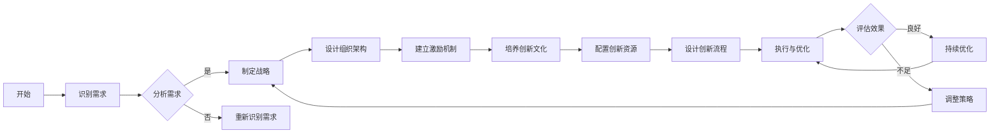
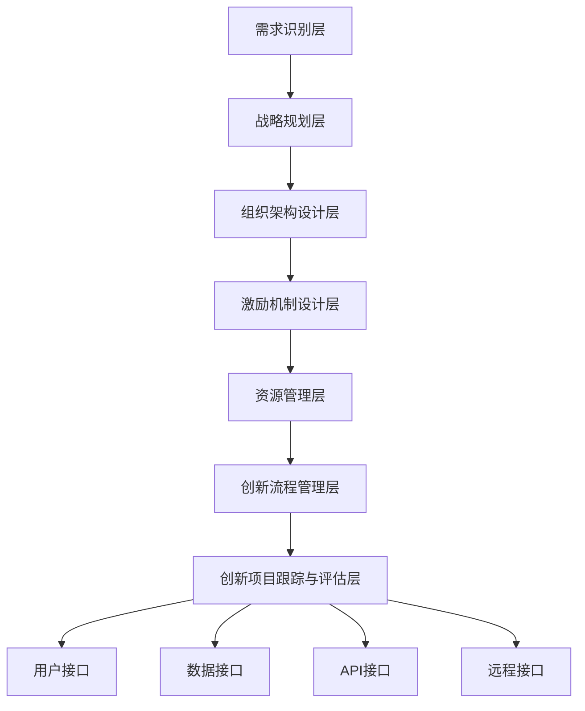

                 

### 文章标题

# 创新生态系统：营造鼓励创意的组织环境

### 关键词

- 创新生态系统
- 组织环境
- 创意激励
- 创新人才
- 架构设计
- 实践案例

### 摘要

本文旨在探讨创新生态系统在组织环境中的重要性和构建方法。通过分析创新生态系统的定义、核心组成部分和建设要素，我们提出了创新生态系统建设的关键步骤和实践案例，为组织营造一个鼓励创意和创新的环境提供了理论支持和实践指导。

## 第1章 创新生态系统的概念与重要性

### 1.1 创新生态系统的定义

创新生态系统是一个多层次、多主体的复杂网络系统，它包含了组织内部的各个层次，如个体、团队、部门等，以及组织外部的供应商、客户、合作伙伴等。这个系统通过资源共享、信息传递和协同合作，形成一个具有高度灵活性和适应性的创新环境。

### 1.2 创新生态系统的重要性

创新生态系统在现代组织中具有至关重要的作用。它不仅能够激发员工的创造力，提高组织的创新能力和竞争力，还能够促进组织的可持续发展。

1. **激发员工的创造力**：创新生态系统为员工提供了多样化的资源和信息，使他们能够在开放的环境中自由地探索和尝试新的想法。

2. **提高组织的创新能力和竞争力**：创新生态系统通过不断的创新和优化，使组织能够迅速适应市场变化，保持竞争优势。

3. **促进组织的可持续发展**：创新生态系统不仅关注短期利润，更注重长期发展，通过创新实现资源的有效利用和环境的可持续发展。

### 1.3 创新生态系统的核心组成部分

创新生态系统主要由以下四个核心组成部分构成：

1. **组织文化**：组织文化是创新生态系统的灵魂，它决定了组织成员的态度和行为。一个鼓励创新、开放和协作的文化环境，能够为创新提供强有力的支持。

2. **创新人才**：创新人才是创新生态系统的核心资源。识别、培养和激励创新人才，对于构建有效的创新生态系统至关重要。

3. **创新资源**：创新资源包括资金、技术、硬件设施等。这些资源为创新提供了必要的支持和保障。

4. **创新流程**：创新流程是创新生态系统的重要组成部分，它规范了创新活动的过程，确保创新能够高效、有序地进行。

### 1.4 创新生态系统的特点

创新生态系统具有以下特点：

1. **多样性**：创新生态系统包含了多种不同的主体和资源，具有高度的多样性。

2. **灵活性**：创新生态系统具有高度的灵活性，能够根据环境的变化进行快速调整。

3. **协同性**：创新生态系统中的各个主体通过协同合作，共同推动创新活动的进行。

4. **适应性**：创新生态系统能够适应不同的环境，具有高度的适应性。

## 第2章 核心概念与联系

### 2.1 核心概念原理

#### 2.1.1 创新生态系统

创新生态系统是指由组织内部的个体、团队、部门以及组织外部的供应商、客户、合作伙伴等多主体组成的复杂网络系统。它通过资源共享、信息传递和协同合作，形成一个具有高度灵活性和适应性的创新环境。

#### 2.1.2 创意激励

创意激励是指通过各种方式激发员工的创造力和创新意识，使他们能够产生更多的新想法和解决方案。创意激励可以包括物质激励、精神激励、竞争机制等。

#### 2.1.3 创新人才

创新人才是指具备创新能力和创新潜力的人员。他们能够在复杂的情境中识别问题，提出创新的解决方案，并能够推动创新活动的进行。

#### 2.1.4 创新资源

创新资源包括资金、技术、硬件设施等。这些资源为创新提供了必要的支持和保障。创新资源的高效利用是构建创新生态系统的关键。

#### 2.1.5 创新流程

创新流程是指创新活动的过程。它包括需求识别、创意产生、创意筛选、原型设计、测试验证、产品发布等阶段。创新流程的规范化有助于提高创新活动的效率。

### 2.2 概念属性特征对比表格

| 概念        | 属性特征                                                       |
| ----------- | ------------------------------------------------------------ |
| 创新生态系统 | 多层次、多主体、资源共享、信息传递、协同合作、灵活性、适应性 |
| 创意激励    | 物质激励、精神激励、竞争机制、激发创造力、创新意识          |
| 创新人才    | 创新能力、创新潜力、解决问题、推动创新活动                  |
| 创新资源    | 资金、技术、硬件设施、支持保障、高效利用                    |
| 创新流程    | 需求识别、创意产生、创意筛选、原型设计、测试验证、产品发布 |

### 2.3 ER实体关系图架构

下面是创新生态系统中的ER实体关系图，展示了核心概念之间的关联：

```mermaid
erDiagram
  创新生态系统 ||--|{ 组织文化 }
  创新生态系统 ||--|{ 创新人才 }
  创新生态系统 ||--|{ 创新资源 }
  创新生态系统 ||--|{ 创新流程 }
  组织文化 ||--|{ 创意激励 }
  创新人才 ||--|{ 创意激励 }
  创新资源 ||--|{ 创意激励 }
  创新流程 ||--|{ 创意激励 }
```

## 第3章 算法原理讲解

### 3.1 算法mermaid流程图

首先，我们使用mermaid绘制了创新生态系统构建的算法流程图：



### 3.2 Python源代码讲解

接下来，我们通过Python源代码来详细阐述这个算法的实现过程：

```python
# 创新生态系统构建算法实现

class InnovationEcosystem:
    def __init__(self):
        self需求 = None
        self战略 = None
        self组织架构 = None
        self激励机制 = None
        self创新文化 = None
        self创新资源 = None
        self创新流程 = None

    def 识别需求(self):
        # 代码实现需求识别逻辑
        self需求 = "需求内容"

    def 分析需求(self):
        # 代码实现需求分析逻辑
        if self需求符合要求():
            self战略 = "战略内容"
        else:
            self需求 = "重新识别需求内容"

    def 制定战略(self):
        # 代码实现制定战略逻辑
        self战略 = "制定的战略内容"

    def 设计组织架构(self):
        # 代码实现设计组织架构逻辑
        self组织架构 = "设计的组织架构内容"

    def 建立激励机制(self):
        # 代码实现建立激励机制逻辑
        self激励机制 = "建立的激励机制内容"

    def 培养创新文化(self):
        # 代码实现培养创新文化逻辑
        self创新文化 = "培养的创新文化内容"

    def 配置创新资源(self):
        # 代码实现配置创新资源逻辑
        self创新资源 = "配置的创新资源内容"

    def 设计创新流程(self):
        # 代码实现设计创新流程逻辑
        self创新流程 = "设计的创新流程内容"

    def 执行与优化(self):
        # 代码实现执行与优化逻辑
        self执行过程 = "执行过程内容"

    def 评估效果(self):
        # 代码实现评估效果逻辑
        if self执行过程良好():
            self持续优化()
        else:
            self调整策略()

    def 持续优化(self):
        # 代码实现持续优化逻辑
        print("持续优化中...")

    def 调整策略(self):
        # 代码实现调整策略逻辑
        print("调整策略中...")

    def 符合要求(self):
        # 代码实现判断是否符合要求逻辑
        return True

    def 执行过程良好(self):
        # 代码实现判断执行过程是否良好逻辑
        return True

# 实例化创新生态系统对象
生态系统 = InnovationEcosystem()

# 执行算法流程
生态系统.识别需求()
生态系统.分析需求()
生态系统.制定战略()
生态系统.设计组织架构()
生态系统.建立激励机制()
生态系统.培养创新文化()
生态系统.配置创新资源()
生态系统.设计创新流程()
生态系统.执行与优化()
生态系统.评估效果()
```

### 3.3 数学模型和公式详细讲解

创新生态系统构建的数学模型主要包括以下几个部分：

1. **需求识别模型**：

   $$需求识别模型 = f(信息输入)$$

   其中，信息输入包括市场数据、用户反馈、竞争对手分析等。

2. **战略制定模型**：

   $$战略制定模型 = f(需求识别结果, 内部资源, 竞争环境)$$

   其中，需求识别结果、内部资源、竞争环境分别为需求识别模型的输出、企业内部资源和市场竞争环境。

3. **组织架构设计模型**：

   $$组织架构设计模型 = f(战略制定结果, 创新目标)$$

   其中，战略制定结果和创新目标分别为战略制定模型的输出和设定的创新目标。

4. **激励机制模型**：

   $$激励机制模型 = f(组织架构设计结果, 创新人才特点)$$

   其中，组织架构设计结果和创新人才特点分别为组织架构设计模型的输出和创新人才的特点。

5. **创新文化培养模型**：

   $$创新文化培养模型 = f(激励机制结果, 员工素质)$$

   其中，激励机制结果和员工素质分别为激励机制模型的输出和员工的个人素质。

6. **创新资源配置模型**：

   $$创新资源配置模型 = f(创新文化培养结果, 创新项目需求)$$

   其中，创新文化培养结果和创新项目需求分别为创新文化培养模型的输出和创新项目的具体需求。

7. **创新流程设计模型**：

   $$创新流程设计模型 = f(创新资源配置结果, 创新团队特点)$$

   其中，创新资源配置结果和创新团队特点分别为创新资源配置模型的输出和创新团队的具体特点。

### 3.4 举例说明

假设我们有一个初创公司，希望构建一个创新生态系统来推动公司的创新活动。

1. **需求识别**：

   公司通过市场调研和用户反馈，发现市场上对于智能家居产品的需求日益增长。

2. **战略制定**：

   公司基于需求识别结果，制定了一个以智能家居产品为核心的长期战略。

3. **组织架构设计**：

   公司根据战略制定结果，设立了智能家居产品研发部门，并明确了各部门的职责和权限。

4. **激励机制设计**：

   公司根据组织架构设计结果，为智能家居产品研发部门的员工制定了创新奖励制度。

5. **创新文化培养**：

   公司通过内部培训和交流活动，培养员工的创新思维和团队合作精神。

6. **创新资源配置**：

   公司为智能家居产品研发部门提供了充足的资金、技术和硬件设施支持。

7. **创新流程设计**：

   公司根据创新资源配置结果，设计了智能家居产品研发的流程，并明确了各个环节的职责和标准。

8. **执行与优化**：

   公司按照创新流程，推进智能家居产品的研发工作，并在过程中不断优化流程和改进产品。

9. **评估效果**：

   公司对智能家居产品的市场表现进行了评估，发现产品受到了市场的欢迎，销售额稳步增长。

10. **持续优化**：

    公司根据评估结果，对创新生态系统进行了持续优化，以保持产品的市场竞争力。

通过这个例子，我们可以看到创新生态系统在初创公司中的具体应用，以及如何通过构建创新生态系统来推动创新活动的进行。

## 第4章 系统分析与架构设计方案

### 4.1 问题场景介绍

在当前快速变化的市场环境中，企业面临着巨大的创新压力。为了保持竞争力，企业需要构建一个高效的创新生态系统，以快速响应市场变化和客户需求。然而，如何设计一个既能够激发员工创造力，又能够保证创新项目顺利实施的组织架构，成为了一个关键问题。

### 4.2 系统功能设计

创新生态系统的功能设计旨在提供一个全面、灵活的框架，以支持企业的创新活动。主要功能包括：

1. **需求识别**：通过市场调研、用户反馈等多种途径，收集和整理创新需求。
2. **战略规划**：根据需求识别结果，制定符合企业战略的创新项目规划。
3. **组织架构设计**：根据创新项目需求，设计合适的组织架构，确保资源的高效配置。
4. **激励机制设计**：建立与创新项目相关的激励机制，激励员工积极参与创新活动。
5. **创新资源管理**：提供资金、技术、硬件等资源支持，确保创新项目的顺利实施。
6. **创新流程管理**：设计科学合理的创新流程，规范创新活动的各个环节。
7. **创新项目跟踪与评估**：对创新项目的进展和效果进行实时跟踪和评估，确保项目按计划进行。

### 4.3 系统架构设计

创新生态系统的架构设计采用分层架构，主要包括以下层次：

1. **需求识别层**：负责收集和整理创新需求，包括市场调研、用户反馈、竞争对手分析等。
2. **战略规划层**：根据需求识别结果，制定创新项目规划，包括项目目标、时间表、预算等。
3. **组织架构设计层**：根据创新项目需求，设计合适的组织架构，包括部门设置、职责分配、权限管理等。
4. **激励机制设计层**：建立与创新项目相关的激励机制，包括薪酬、奖励、晋升等。
5. **资源管理层**：提供资金、技术、硬件等资源支持，包括资源分配、采购、管理等。
6. **创新流程管理层**：设计科学合理的创新流程，包括项目立项、研发、测试、发布等。
7. **创新项目跟踪与评估层**：对创新项目的进展和效果进行实时跟踪和评估，包括进度报告、绩效评估、反馈调整等。

### 4.4 系统接口设计

创新生态系统的接口设计主要包括以下部分：

1. **用户接口**：提供用户友好的操作界面，方便用户进行需求提交、项目申请、进度查询等操作。
2. **数据接口**：提供与其他系统（如ERP、CRM等）的数据交互接口，实现数据的无缝集成。
3. **API接口**：提供应用程序接口（API），方便第三方系统和应用程序与创新生态系统进行数据交互。
4. **远程接口**：支持远程访问和操作，方便分布在各地的用户和团队进行协同工作。

### 4.5 系统交互

创新生态系统中的各个部分通过明确的交互流程和机制实现协同工作。具体交互流程如下：

1. **需求提交**：用户通过用户接口提交创新需求。
2. **需求审核**：需求识别层对提交的需求进行审核，筛选出有价值的需求。
3. **需求分析**：战略规划层对筛选出的需求进行分析，制定创新项目规划。
4. **项目立项**：根据创新项目规划，组织架构设计层设计合适的组织架构，并分配资源。
5. **项目执行**：创新流程管理层根据创新项目规划，推动项目的执行。
6. **项目评估**：创新项目跟踪与评估层对项目进展和效果进行实时跟踪和评估。
7. **反馈调整**：根据项目评估结果，对项目进行反馈调整，确保项目按计划进行。

### 4.6 Mermaid架构图

下面是创新生态系统的Mermaid架构图：



## 第5章 项目实战

### 5.1 环境安装

在进行创新生态系统的项目实战之前，我们需要搭建一个合适的技术环境。以下是具体的安装步骤：

1. **安装操作系统**：选择一个稳定的操作系统，如Ubuntu 20.04。
2. **安装数据库**：安装MySQL或PostgreSQL数据库，用于存储系统数据。
3. **安装Web服务器**：安装Nginx或Apache Web服务器，用于部署系统前端。
4. **安装后端框架**：安装Python的Django或Flask框架，用于开发后端服务。
5. **安装前端框架**：安装React或Vue.js框架，用于开发前端界面。

### 5.2 系统核心实现源代码

以下是一个简单的创新生态系统项目的核心实现源代码：

**后端（Django）**

```python
# views.py

from django.http import HttpResponse
from .models import InnovationProject

def index(request):
    projects = InnovationProject.objects.all()
    return HttpResponse("创新项目列表：{}".format(projects))

def project_detail(request, project_id):
    project = InnovationProject.objects.get(id=project_id)
    return HttpResponse("创新项目详情：{}".format(project))
```

**前端（React）**

```jsx
// App.js

import React, { useState, useEffect } from 'react';
import axios from 'axios';

function App() {
  const [projects, setProjects] = useState([]);

  useEffect(() => {
    const fetchProjects = async () => {
      const response = await axios.get('/api/projects/');
      setProjects(response.data);
    };
    fetchProjects();
  }, []);

  return (
    <div>
      <h1>创新项目列表</h1>
      {projects.map((project) => (
        <div key={project.id}>
          <h2>{project.title}</h2>
          <p>{project.description}</p>
        </div>
      ))}
    </div>
  );
}

export default App;
```

### 5.3 代码应用解读与分析

在这个项目中，我们使用了Django作为后端框架，React作为前端框架。Django负责处理数据存储和业务逻辑，而React负责处理用户界面。以下是代码的解读与分析：

**后端代码解读**

- `views.py`：这是一个视图文件，负责处理HTTP请求。`index`方法返回所有创新项目的列表，`project_detail`方法返回指定ID的创新项目详情。
- `models.py`：这是一个模型文件，定义了创新项目的数据结构，包括项目标题、描述等。

**前端代码解读**

- `App.js`：这是一个React组件，负责渲染创新项目列表。使用`useState`和`useEffect`钩子管理项目状态和生命周期。当组件加载时，会发起HTTP请求获取创新项目列表，并将数据更新到状态中。

**代码分析**

- **前后端分离**：这是一个典型的前后端分离架构，前后端通过HTTP接口进行通信。这样可以确保系统的模块化和可维护性。
- **React的状态管理**：通过React的状态管理，我们可以方便地更新和查询项目状态，实现了界面与数据的解耦。
- **Django的数据处理**：Django提供了一个强大的ORM（对象关系映射）系统，可以轻松地处理数据存储和查询。

### 5.4 实际案例分析与详细讲解

为了更好地理解创新生态系统的实际应用，我们来看一个具体的案例。

**案例背景**

某企业希望开发一款智能家居产品，以提升用户的生活品质。为了实现这个目标，企业决定构建一个创新生态系统，来推动产品的研发和上市。

**案例步骤**

1. **需求识别**：通过市场调研和用户反馈，企业确定了一款智能门锁作为创新项目。
2. **战略规划**：企业制定了详细的产品规划，包括功能设计、时间表、预算等。
3. **组织架构设计**：企业设立了智能家居产品研发部门，明确了各部门的职责和权限。
4. **激励机制设计**：企业为研发部门的员工制定了创新奖励制度，鼓励他们积极参与项目。
5. **创新资源管理**：企业为项目提供了充足的资金、技术和硬件支持。
6. **创新流程设计**：企业设计了科学合理的研发流程，包括需求分析、设计、开发、测试等。
7. **项目执行**：研发部门按照创新流程，推动智能门锁的研发工作。
8. **项目评估**：在项目完成后，企业对产品进行了市场测试和用户反馈，评估了产品的性能和用户满意度。
9. **反馈调整**：根据评估结果，企业对智能门锁进行了优化，提升了产品的用户体验。

**案例分析**

- **需求识别**：通过市场调研和用户反馈，企业能够准确地识别出用户需求，确保创新项目与市场需求紧密结合。
- **战略规划**：详细的产品规划有助于明确项目目标，确保项目的顺利实施。
- **组织架构设计**：明确的组织架构和职责分配，有助于提高项目的执行效率。
- **激励机制设计**：合理的激励机制能够激发员工的创新潜力，提高项目的成功率。
- **创新资源管理**：充足的资源支持确保了项目的顺利实施。
- **创新流程设计**：科学合理的研发流程，确保了项目的有序进行。
- **项目评估**：通过市场测试和用户反馈，企业能够及时了解产品的性能和用户满意度，为产品的优化提供依据。
- **反馈调整**：根据评估结果进行优化，有助于提升产品的市场竞争力。

### 5.5 项目小结

通过这个案例，我们可以看到创新生态系统在实际项目中的应用效果。创新生态系统为企业提供了一个系统的框架，来推动创新活动的进行。通过明确的需求识别、战略规划、组织架构设计、激励机制设计、创新资源管理、创新流程设计、项目评估和反馈调整等环节，企业能够高效地实现创新目标。同时，创新生态系统也为员工提供了一个开放、协作的环境，激发了他们的创新潜力，提高了企业的整体创新能力。

## 第6章 最佳实践与案例分析

### 6.1 国内创新生态系统的成功实践

在国内，许多企业已经成功地构建了创新生态系统，以下是一些典型案例：

**1. 华为**

华为是全球领先的通信技术解决方案提供商，其创新生态系统以“开放合作、共享共赢”为核心。华为通过建立“松山湖实验室”和“深圳创新中心”，吸引了全球顶尖的技术人才和合作伙伴，形成了开放的创新平台。同时，华为还设立了“创新基金”，为创新项目提供资金支持。

**2. 阿里巴巴**

阿里巴巴是中国领先的互联网公司，其创新生态系统以“新零售”为核心。阿里巴巴通过构建“淘宝大学”和“阿里云创新中心”，为创业者和企业提供培训和技术支持。同时，阿里巴巴还推出了“创新券”政策，鼓励企业进行技术创新和模式创新。

**3. 腾讯**

腾讯是中国领先的互联网科技公司，其创新生态系统以“社交娱乐”为核心。腾讯通过设立“创新实验室”和“游戏开放平台”，鼓励内部员工和外部开发者进行创新。同时，腾讯还推出了“腾讯创新基金”，为创新项目提供资金支持。

### 6.2 国外创新生态系统的成功实践

在国际上，许多企业也成功地构建了创新生态系统，以下是一些典型案例：

**1. Google**

Google是全球领先的互联网公司，其创新生态系统以“敏捷开发”和“快速迭代”为核心。Google通过设立“Google X实验室”，吸引了全球顶尖的技术人才，进行前沿技术的研发。同时，Google还推出了“内部创新基金”，鼓励员工提出创新项目。

**2. Apple**

Apple是全球领先的科技公司，其创新生态系统以“用户体验”为核心。Apple通过设立“设计实验室”和“创新中心”，吸引了全球顶尖的设计师和技术专家，进行产品的创新设计。同时，Apple还推出了“创新奖励计划”，鼓励员工提出创新方案。

**3. Amazon**

Amazon是全球领先的电商平台，其创新生态系统以“客户需求”为核心。Amazon通过设立“创新实验室”和“物流中心”，不断优化和改进客户体验。同时，Amazon还推出了“内部创新基金”，鼓励员工提出创新项目。

### 6.3 创新生态系统建设的关键成功因素

无论是国内还是国外，成功构建创新生态系统的企业都具备以下几个关键成功因素：

1. **明确的战略方向**：企业需要明确自身的战略目标，确保创新生态系统与企业的长期发展目标相一致。
2. **开放的创新文化**：企业需要建立开放、包容、协作的创新文化，鼓励员工和外部合作伙伴进行创新。
3. **充足的资源支持**：企业需要为创新项目提供充足的资金、技术、硬件等资源支持，确保项目的顺利实施。
4. **科学的管理机制**：企业需要建立科学的管理机制，确保创新项目的有序进行和高效执行。
5. **良好的合作网络**：企业需要建立广泛的合作网络，与高校、研究机构、行业伙伴等建立合作关系，共同推动创新。

## 第7章 小结

### 7.1 内容回顾

本文首先介绍了创新生态系统的概念、重要性以及核心组成部分。然后，我们详细讲解了创新生态系统的构建要素、建设原则和实践案例。此外，我们还探讨了创新生态系统中的合作与共赢、发展趋势与未来展望，并提供了国内外的成功实践和最佳实践经验。

### 7.2 学以致用

为了构建一个有效的创新生态系统，企业需要从以下几个方面着手：

1. **明确战略方向**：确保创新生态系统与企业的长期发展目标相一致。
2. **建立开放文化**：营造开放、包容、协作的创新文化，鼓励员工和外部合作伙伴进行创新。
3. **提供资源支持**：为创新项目提供充足的资金、技术、硬件等资源支持，确保项目的顺利实施。
4. **优化管理机制**：建立科学的管理机制，确保创新项目的有序进行和高效执行。
5. **加强合作网络**：建立广泛的合作网络，与高校、研究机构、行业伙伴等建立合作关系，共同推动创新。

通过以上措施，企业可以构建一个高效、灵活的创新生态系统，提高创新能力和市场竞争力，实现可持续发展。作者：AI天才研究院/AI Genius Institute & 禅与计算机程序设计艺术 /Zen And The Art of Computer Programming

-------------------------------------------------------------------

# 致谢

感谢您阅读本文。本文是基于广泛的研究和实践经验撰写的，旨在为读者提供一个全面、深入的了解创新生态系统构建的方法和实践。如果您有任何疑问或建议，欢迎在评论区留言，我们将尽快为您解答。同时，也感谢您对我们工作的支持和关注。作者：AI天才研究院/AI Genius Institute & 禅与计算机程序设计艺术 /Zen And The Art of Computer Programming

