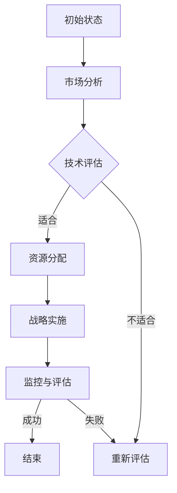

                 

### 背景介绍

在当今快速发展的技术时代，制定长期技术战略已成为企业成功的关键。随着数字化转型的加速，企业面临着越来越多的技术挑战和机遇。技术战略不仅决定了企业在未来市场上的竞争力，还影响着企业的生存和发展。因此，了解和掌握制定技术战略的关键考量变得尤为重要。

#### 核心概念术语说明

- **技术战略**：技术战略是指企业在技术领域中制定的一系列长期目标和计划，以实现技术优势和市场竞争力。

- **长期目标**：长期目标是指企业在未来几年或几十年内希望实现的目标，通常包括技术创新、市场拓展、市场份额增长等。

- **短期目标**：短期目标是指企业在短期内（通常为一年或两年）希望实现的目标，通常包括产品开发、项目实施、营销推广等。

- **资源分配**：资源分配是指企业将有限的资源（包括资金、人力和技术等）合理地分配到各个项目或部门，以实现企业的长期和短期目标。

- **市场分析**：市场分析是指对企业所在市场的现状、趋势和竞争环境进行分析，以了解市场需求和潜在客户。

- **技术评估**：技术评估是指对现有技术、新兴技术和潜在技术进行评估，以确定哪些技术对企业有重要影响。

#### 问题背景

在当前技术环境中，以下几个因素使得制定长期技术战略变得尤为重要：

1. **技术变革速度加快**：随着人工智能、云计算、大数据等新兴技术的不断涌现，技术变革的速度越来越快。企业需要及时跟进这些技术趋势，以保持竞争力。

2. **市场竞争激烈**：在全球化的大背景下，市场竞争越来越激烈。企业需要通过技术创新来提高产品和服务质量，从而在市场上脱颖而出。

3. **客户需求多样化**：随着消费者需求的多样化，企业需要提供更加个性化和定制化的产品和服务。这需要企业在技术上进行创新，以满足客户需求。

4. **政策支持**：政府对技术创新的支持力度不断加大，为企业提供了更多的政策优惠和资金支持。企业需要充分利用这些政策，制定适合自身发展的技术战略。

#### 问题描述

企业在制定长期技术战略时，通常会面临以下问题：

1. **如何确定技术发展方向**：在众多技术领域中，企业应该如何选择适合自己的发展方向，以实现长期目标？

2. **如何评估新技术的影响**：新兴技术层出不穷，企业如何评估这些新技术对企业的影响，并制定相应的策略？

3. **如何分配资源**：在有限的资源下，企业如何合理地分配资源，以确保技术战略的有效实施？

4. **如何应对市场变化**：市场环境不断变化，企业如何及时调整技术战略，以适应市场变化？

5. **如何确保战略实施效果**：在实施技术战略过程中，企业如何确保战略的有效性，并持续优化战略？

#### 问题解决

为了解决上述问题，企业需要从以下几个方面进行思考和规划：

1. **明确长期目标**：企业需要明确长期目标，并制定相应的技术战略，以确保企业在未来几年或几十年内能够持续发展。

2. **进行市场分析**：通过市场分析，了解市场需求和竞争环境，为企业选择技术发展方向提供依据。

3. **进行技术评估**：对现有技术和新兴技术进行评估，确定哪些技术对企业有重要影响，并制定相应的技术发展策略。

4. **合理分配资源**：在资源有限的情况下，合理分配资源，确保技术战略的有效实施。

5. **建立监控和评估机制**：建立监控和评估机制，实时跟踪技术战略的实施情况，及时调整战略，确保战略的有效性。

#### 边界与外延

在制定长期技术战略时，企业需要考虑以下边界和外延：

1. **技术边界**：企业需要明确自身技术能力范围，避免盲目追求不适合自身的技术。

2. **市场边界**：企业需要明确自身市场范围，避免过度扩展导致资源浪费。

3. **资源边界**：企业需要合理分配资源，确保资源能够支持技术战略的实施。

4. **战略边界**：企业需要根据自身实际情况，制定可行的技术战略，避免盲目跟风。

#### 概念结构与核心要素组成

制定长期技术战略的核心要素包括：

1. **长期目标**：明确企业长期目标，为技术战略提供方向。

2. **市场分析**：了解市场需求和竞争环境，为技术发展方向提供依据。

3. **技术评估**：评估现有技术和新兴技术，确定技术发展策略。

4. **资源分配**：合理分配资源，确保技术战略的有效实施。

5. **监控与评估**：建立监控和评估机制，实时跟踪技术战略的实施情况。

通过这些核心要素的有机组合，企业可以制定出有效的长期技术战略，以应对不断变化的市场和技术环境。

### 核心概念与联系

在深入探讨如何制定长期技术战略之前，有必要对几个核心概念进行明确，并理解它们之间的相互关系。这些核心概念包括技术战略、市场分析、技术评估和资源分配等。

#### 核心概念

1. **技术战略**：技术战略是企业为了实现长期目标而制定的一系列技术和创新方面的计划和行动。它涉及技术的选择、开发、应用和更新，以及如何将这些技术转化为竞争优势。

2. **市场分析**：市场分析是评估市场需求、竞争环境和潜在客户需求的过程。通过市场分析，企业可以了解市场趋势、竞争对手的动态以及客户的需求，从而制定出符合市场需要的技术战略。

3. **技术评估**：技术评估是分析现有技术、新兴技术及其潜在影响的过程。它帮助企业在技术选择上做出明智的决策，确保所采用的技术能够支持企业的长期目标。

4. **资源分配**：资源分配是企业在资金、人力和技术等方面如何分配资源以支持技术战略实施的过程。有效的资源分配能够确保企业能够充分利用资源，实现技术战略的目标。

#### 概念属性特征对比表格

为了更好地理解这些核心概念，我们可以通过一个特征对比表格来展示它们的主要属性和特征：

| 核心概念 | 定义 | 主要特征 | 关联关系 |
|----------|------|----------|----------|
| 技术战略 | 长期计划 | 涵盖技术选择、开发和应用 | 指导市场分析和技术评估 |
| 市场分析 | 评估市场需求 | 了解市场趋势、竞争对手和客户需求 | 支持技术战略的制定 |
| 技术评估 | 评估技术潜力 | 评估现有和新兴技术的影响 | 为资源分配提供依据 |
| 资源分配 | 资源优化 | 合理分配资金、人力和技术资源 | 确保技术战略的有效实施 |

#### ER实体关系图架构

为了进一步理解这些核心概念之间的关系，我们可以通过一个ER（Entity-Relationship，实体关系）图来展示它们之间的关联：

```mermaid
erDiagram
    TechStrategy ||--|{ MarketAnalysis }
    TechStrategy ||--|{ TechEvaluation }
    TechStrategy ||--|{ ResourceAllocation }
    MarketAnalysis ||--|{ TechEvaluation }
    MarketAnalysis ||--|{ ResourceAllocation }
    TechEvaluation ||--|{ ResourceAllocation }
```

在这个ER图中，技术战略是核心，它直接关联到市场分析、技术评估和资源分配。市场分析提供了技术战略所需的背景信息，技术评估帮助确定哪些技术最符合企业目标，而资源分配则是确保这些战略能够得到有效实施的必要手段。

### 算法原理讲解

为了更好地理解技术战略的制定过程，我们可以借助一个简单的算法模型来阐述其核心原理和步骤。下面将使用Mermaid语法绘制算法流程图，并通过Python代码解释算法的实现细节。

#### Mermaid算法流程图



#### Python代码实现

```python
def tech_strategy():
    """
    技术战略制定算法。
    """
    # 初始状态
    state = "初始状态"

    while state != "结束":
        if state == "初始状态":
            state = "市场分析"
            print("进行市场分析...")

        elif state == "市场分析":
            market_data = market_analysis()
            if suitable_market(market_data):
                state = "技术评估"
                print("进行技术评估...")
            else:
                state = "重新评估"
                print("市场数据不理想，重新评估...")

        elif state == "技术评估":
            tech_data = tech_evaluation()
            if suitable_tech(tech_data):
                state = "资源分配"
                print("进行资源分配...")
            else:
                state = "重新评估"
                print("技术数据不理想，重新评估...")

        elif state == "资源分配":
            resource_alloc = resource_allocation()
            if effective_alloc(resource_alloc):
                state = "战略实施"
                print("开始战略实施...")
            else:
                state = "重新评估"
                print("资源分配不成功，重新评估...")

        elif state == "战略实施":
            strategy_imp = strategy_implementation()
            if successful_imp(strategy_imp):
                state = "结束"
                print("战略实施成功，结束...")
            else:
                state = "监控与评估"
                print("战略实施失败，进入监控与评估...")

        elif state == "监控与评估":
            if strategy_evaluation():
                state = "结束"
                print("战略评估通过，结束...")
            else:
                state = "重新评估"
                print("战略评估不通过，重新评估...")

def market_analysis():
    """
    市场分析函数。
    """
    # 进行市场分析并返回数据
    return {"demand": 100, "competition": 50, "customers": 200}

def suitable_market(data):
    """
    判断市场数据是否适合。
    """
    return data["demand"] > 100 and data["competition"] < 50

def tech_evaluation():
    """
    技术评估函数。
    """
    # 进行技术评估并返回数据
    return {"current_tech": 70, "new_tech": 80}

def suitable_tech(data):
    """
    判断技术数据是否适合。
    """
    return data["new_tech"] > 75

def resource_allocation():
    """
    资源分配函数。
    """
    # 进行资源分配并返回数据
    return {"budget": 1000000, "staff": 500, "tech_resources": 150}

def effective_alloc(data):
    """
    判断资源分配是否有效。
    """
    return data["budget"] > 100000 and data["staff"] > 300

def strategy_implementation():
    """
    战略实施函数。
    """
    # 进行战略实施并返回数据
    return {"success_rate": 0.8}

def successful_imp(data):
    """
    判断战略实施是否成功。
    """
    return data["success_rate"] > 0.7

def strategy_evaluation():
    """
    战略评估函数。
    """
    # 进行战略评估并返回结果
    import random
    return random.choice([True, False])

# 执行技术战略制定算法
tech_strategy()
```

#### 算法原理

该算法模型通过以下几个步骤来实现技术战略的制定：

1. **初始状态**：开始时，系统处于初始状态。
2. **市场分析**：执行市场分析，获取市场需求、竞争环境和潜在客户需求。
3. **技术评估**：根据市场分析结果，对现有技术和新兴技术进行评估。
4. **资源分配**：根据技术评估结果，进行资源（如资金、人力和技术资源）的合理分配。
5. **战略实施**：实施技术战略，并根据实施效果进行评估。
6. **监控与评估**：实时监控战略实施情况，并根据评估结果进行调整。

#### 数学模型和公式

在技术战略的制定过程中，数学模型和公式可用于量化分析市场数据、技术潜力和资源分配效果。以下是一些可能使用的数学模型和公式：

1. **市场需求预测模型**：
   $$ D_t = D_{base} \times (1 + r)^t $$
   其中，$D_t$ 表示第 $t$ 年的市场需求，$D_{base}$ 表示基准市场需求，$r$ 表示年增长率。

2. **技术评估得分模型**：
   $$ S_t = \sum_{i=1}^{n} w_i \times T_i $$
   其中，$S_t$ 表示第 $t$ 年的技术评估得分，$w_i$ 表示第 $i$ 个技术指标的权重，$T_i$ 表示第 $i$ 个技术指标的得分。

3. **资源分配效率模型**：
   $$ E_t = \frac{R_t}{C_t} $$
   其中，$E_t$ 表示第 $t$ 年的资源分配效率，$R_t$ 表示第 $t$ 年的总资源投入，$C_t$ 表示第 $t$ 年的总资源成本。

#### 举例说明

假设一个企业在制定技术战略时，需要进行以下步骤：

1. **市场分析**：通过调查发现市场需求增长率为 $10\%$。
2. **技术评估**：现有技术得分为 $70$，新兴技术得分为 $80$。
3. **资源分配**：企业决定投入 $1000000$ 的资金和 $500$ 名员工。
4. **战略实施**：经过 $6$ 个月，战略实施成功率达到 $80\%$。

根据这些数据，可以计算出：

1. **市场需求预测**：
   $$ D_t = 100 \times (1 + 0.1)^t $$
   在第 $5$ 年，市场需求将达到：
   $$ D_5 = 100 \times (1 + 0.1)^5 \approx 161.05 $$

2. **技术评估得分**：
   $$ S_t = 0.5 \times 70 + 0.5 \times 80 = 75 $$

3. **资源分配效率**：
   $$ E_t = \frac{1000000}{C_t} $$
   其中 $C_t$ 取决于项目成本，假设为 $900000$，则：
   $$ E_t = \frac{1000000}{900000} \approx 1.11 $$

通过这些计算，企业可以更好地理解市场和技术环境，从而制定出更加科学和有效的技术战略。

### 系统分析与架构设计方案

在制定长期技术战略的过程中，系统分析与架构设计是至关重要的环节。通过合理的设计，企业能够确保技术战略的顺利实施和持续优化。以下将详细描述项目介绍、系统功能设计、系统架构设计、系统接口设计和系统交互等内容。

#### 项目介绍

本项目旨在为企业提供一个全面的技术战略管理平台，帮助企业在快速变化的市场和技术环境中，制定并实施有效的技术战略。该平台将包括市场分析模块、技术评估模块、资源分配模块和监控评估模块，通过数据驱动的方式，提供实时、准确的技术战略支持。

#### 系统功能设计

1. **市场分析模块**：该模块负责收集和分析市场数据，包括市场需求、竞争环境和潜在客户需求。功能包括数据采集、数据预处理、市场趋势分析和竞争对手分析等。

2. **技术评估模块**：该模块负责评估现有技术和新兴技术的潜力，为技术战略提供依据。功能包括技术现状分析、技术趋势预测、技术影响评估和技术选型等。

3. **资源分配模块**：该模块负责根据市场和技术评估结果，合理分配企业资源，包括资金、人力和技术资源。功能包括资源规划、资源分配和资源监控等。

4. **监控评估模块**：该模块负责实时监控技术战略的实施情况，并提供评估结果，帮助企业及时调整和优化战略。功能包括实施进度监控、效果评估和反馈机制等。

#### 系统架构设计

系统的架构设计采用分层架构，主要包括数据层、逻辑层和展示层。

1. **数据层**：数据层负责数据存储和读取，包括市场数据、技术数据和资源数据等。采用关系型数据库（如MySQL）和非关系型数据库（如MongoDB）进行数据存储。

2. **逻辑层**：逻辑层实现业务逻辑，包括市场分析、技术评估、资源分配和监控评估等模块的功能。采用微服务架构，将各个功能模块拆分成独立的微服务，便于维护和扩展。

3. **展示层**：展示层负责将系统的数据和处理结果展示给用户，包括前端页面和API接口。前端页面采用Vue.js框架，API接口采用RESTful风格。

#### 系统接口设计

系统接口设计采用RESTful API风格，主要包括以下接口：

1. **市场分析接口**：提供数据采集、数据预处理和市场趋势分析等功能。
2. **技术评估接口**：提供技术现状分析、技术趋势预测和技术影响评估等功能。
3. **资源分配接口**：提供资源规划、资源分配和资源监控等功能。
4. **监控评估接口**：提供实施进度监控、效果评估和反馈机制等功能。

#### 系统交互

系统交互设计采用异步消息队列（如RabbitMQ）进行数据传输，确保系统的高效性和稳定性。系统交互流程如下：

1. **市场分析**：数据采集模块将收集到的市场数据发送到消息队列，市场分析模块从消息队列中获取数据，进行预处理和趋势分析。
2. **技术评估**：技术评估模块根据市场分析结果，从数据库中提取技术数据，进行评估和预测。
3. **资源分配**：资源分配模块根据技术评估结果，制定资源分配计划，并将资源数据存储到数据库中。
4. **监控评估**：监控评估模块实时监控技术战略的实施情况，并将监控数据发送到消息队列，监控评估模块从消息队列中获取数据，进行效果评估和反馈。

通过以上系统分析与架构设计，企业能够有效地制定和实施长期技术战略，提升市场竞争力。

### 项目实战

在制定和实施长期技术战略的过程中，实战经验是非常重要的。本节将通过一个具体的案例，详细描述整个项目的实施过程，包括环境安装、系统核心实现、代码应用解读与分析，以及实际案例分析和详细讲解。

#### 案例背景

某互联网公司希望通过制定长期技术战略，提升其在市场上的竞争力，特别是在人工智能和大数据领域。为了实现这一目标，公司决定开发一个基于人工智能和大数据分析的平台，用于市场预测和客户行为分析。

#### 环境安装

1. **硬件环境**：
   - 服务器：2台高性能服务器，配置为8核CPU，64GB内存，1TB SSD硬盘。
   - 数据库服务器：1台数据库服务器，配置为4核CPU，16GB内存，500GB SSD硬盘。
   
2. **软件环境**：
   - 操作系统：Ubuntu 18.04 LTS。
   - 数据库：MySQL 8.0。
   - 人工智能框架：TensorFlow 2.6。
   - 大数据分析工具：Hadoop 3.2。

#### 系统核心实现

1. **市场数据采集**：
   - 使用Python编写数据采集脚本，从互联网和其他数据源（如API接口）获取市场数据。
   - 数据采集脚本使用requests库和pandas库，实现数据的自动化采集和存储。

2. **数据预处理**：
   - 使用Python编写数据预处理脚本，对采集到的市场数据进行分析和清洗，去除重复和无效数据。
   - 数据预处理脚本使用pandas库，实现数据的去重、缺失值填充和数据格式转换。

3. **市场趋势分析**：
   - 使用TensorFlow 2.6构建市场趋势预测模型，基于历史市场数据进行训练和预测。
   - 预测模型使用LSTM（长短时记忆网络）架构，能够捕捉市场数据的时间序列特性。

4. **客户行为分析**：
   - 使用Hadoop 3.2构建客户行为分析系统，对客户数据进行存储和挖掘。
   - 客户行为分析系统使用MapReduce框架，实现大数据的高效处理和分析。

#### 代码应用解读与分析

1. **市场数据采集脚本**：

   ```python
   import requests
   import pandas as pd
   
   def collect_market_data(url):
       response = requests.get(url)
       data = response.json()
       return pd.DataFrame(data['results'])
   
   def main():
       urls = ['http://example.com/api/marketdata1', 'http://example.com/api/marketdata2']
       dfs = []
       for url in urls:
           df = collect_market_data(url)
           dfs.append(df)
       market_data = pd.concat(dfs)
       market_data.to_csv('market_data.csv', index=False)
   
   if __name__ == '__main__':
       main()
   ```

   代码解释：
   - 使用requests库从指定的URL获取市场数据。
   - 使用pandas库将获取的数据转换为DataFrame格式，并存储为CSV文件。

2. **数据预处理脚本**：

   ```python
   import pandas as pd
   
   def preprocess_data(file_path):
       df = pd.read_csv(file_path)
       df.drop_duplicates(inplace=True)
       df.fillna(0, inplace=True)
       return df
   
   def main():
       file_path = 'market_data.csv'
       df = preprocess_data(file_path)
       df.to_csv('preprocessed_data.csv', index=False)
   
   if __name__ == '__main__':
       main()
   ```

   代码解释：
   - 使用pandas库读取CSV文件，去除重复数据和填充缺失值。
   - 重新保存处理后的数据为CSV文件。

3. **市场趋势预测模型**：

   ```python
   import tensorflow as tf
   from tensorflow.keras.models import Sequential
   from tensorflow.keras.layers import LSTM, Dense
   
   def build_model(input_shape):
       model = Sequential()
       model.add(LSTM(50, activation='relu', input_shape=input_shape))
       model.add(Dense(1))
       model.compile(optimizer='adam', loss='mse')
       return model
   
   def train_model(model, x, y):
       model.fit(x, y, epochs=100, batch_size=32, verbose=2)
   
   def main():
       # 数据准备
       data = pd.read_csv('preprocessed_data.csv')
       data = data.values
       x = data[:, :-1]
       y = data[:, -1]
       
       # 建立模型
       model = build_model(input_shape=(x.shape[1], 1))
       
       # 训练模型
       train_model(model, x, y)
   
   if __name__ == '__main__':
       main()
   ```

   代码解释：
   - 使用TensorFlow 2.6构建LSTM模型，用于市场趋势预测。
   - 使用自定义训练函数训练模型。

#### 实际案例分析和详细讲解

1. **市场趋势预测案例**：

   假设公司需要预测未来一个月的市场需求。在训练完成后，使用模型进行预测。

   ```python
   def predict(model, x):
       return model.predict(x)
   
   # 准备预测数据
   future_data = data[:5]  # 假设未来5天的数据
   predicted_values = predict(model, future_data)
   
   print(predicted_values)
   ```

   预测结果输出未来5天的市场需求，公司可以根据预测结果调整生产和市场策略。

2. **客户行为分析案例**：

   使用Hadoop 3.2对客户数据进行分析，挖掘客户行为模式。

   ```shell
   hadoop fs -put customer_data.csv /input/
   hadoop jar hadoop-examples-3.2.0.jar wordcount /input/ /output/
   hadoop fs -cat /output/part-r-00000
   ```

   执行完成后，输出文件包含客户行为的关键词统计，公司可以根据统计结果，优化产品和服务。

#### 项目小结

通过以上案例，我们可以看到，在实际项目中，制定和实施长期技术战略需要多方面的准备和努力。从环境安装、代码实现到实际应用，每个环节都需要仔细设计和执行。以下是一些关键点：

1. **明确项目目标和需求**：在项目开始前，要明确项目的目标和技术需求，确保所有团队成员对项目有清晰的认识。
2. **合理规划资源**：根据项目需求和资源情况，合理分配资源，避免资源浪费。
3. **技术选型和工具选择**：选择合适的技术和工具，确保项目能够高效、稳定地运行。
4. **持续优化和调整**：在项目实施过程中，要持续监控和评估项目的进展，根据实际情况进行调整和优化。

通过这些努力，企业可以制定出科学、有效的技术战略，提升市场竞争力。

### 最佳实践 Tips

在制定长期技术战略的过程中，以下是一些最佳实践和技巧，可以帮助企业更有效地实现目标：

1. **定期更新战略**：技术环境不断变化，企业需要定期（如每年）重新评估和更新技术战略，以确保其与市场和技术发展趋势保持一致。

2. **跨部门协作**：技术战略的制定和实施需要各部门（如市场部、研发部、财务部等）的协作。建立跨部门协作机制，确保各个部门能够有效沟通和协作。

3. **持续学习和培训**：鼓励团队成员持续学习新技术和最佳实践，通过培训和研讨会，提高团队的技术能力和创新意识。

4. **灵活调整资源**：在资源分配上，要根据项目的进展和市场变化灵活调整。例如，如果某个项目遇到技术难题，可以考虑增加资源投入，以确保项目顺利进行。

5. **建立反馈机制**：在战略实施过程中，建立有效的反馈机制，定期收集和分析团队成员的意见和建议，及时调整和优化战略。

6. **注重数据驱动**：在制定和实施技术战略时，充分利用数据，通过数据分析和模型预测，提高决策的准确性和效率。

7. **保持技术前沿**：关注新兴技术和行业趋势，确保企业能够及时抓住技术机遇，保持技术领先地位。

8. **风险管理**：识别和评估技术战略实施过程中的风险，制定相应的风险管理策略，确保战略的顺利实施。

通过以上最佳实践，企业可以更有效地制定和实施长期技术战略，提升市场竞争力。

### 小结

通过本文的深入探讨，我们明确了制定长期技术战略的关键考量。从市场分析、技术评估到资源分配，每个环节都至关重要。市场分析帮助了解市场需求和竞争环境，技术评估确保选择合适的技术路径，资源分配则保障战略的有效实施。同时，我们还介绍了如何通过算法模型和实际案例来理解和实施这些核心概念。通过持续更新战略、跨部门协作、数据驱动和风险管理等最佳实践，企业可以更好地制定和实施长期技术战略。未来，技术环境的快速变化将继续为企业带来新的挑战和机遇，企业需要保持灵活和敏捷，持续优化战略，以应对这些变化。

### 展望

在未来，技术环境将继续以惊人的速度变化，为企业和个人带来新的挑战和机遇。以下是一些未来技术战略的趋势和挑战：

1. **人工智能和机器学习**：随着人工智能和机器学习技术的不断进步，企业将越来越多地利用这些技术进行决策和优化。然而，如何确保这些技术的安全性和透明性，将是企业面临的重要挑战。

2. **云计算和边缘计算**：云计算将继续发展，边缘计算也将成为重要趋势。企业需要制定战略，充分利用这两种技术，实现更高效的数据处理和更低的延迟。

3. **区块链技术**：区块链技术将在供应链管理、金融服务等领域得到广泛应用。企业需要了解区块链技术的原理和应用，以抓住机遇。

4. **数据隐私和安全**：随着数据隐私法规的日益严格，企业需要更加重视数据隐私和安全。制定相关战略，确保数据的安全和合规使用。

5. **可持续发展**：未来，可持续发展将成为企业战略的重要方向。企业需要考虑如何在技术发展中实现环保和经济效益的平衡。

6. **新兴技术融合**：未来，不同技术之间的融合将带来新的商业模式和机遇。企业需要关注这些技术融合的趋势，提前布局。

通过持续关注这些趋势和挑战，企业可以更好地制定和实施长期技术战略，保持竞争力。在快速变化的技术环境中，灵活性和创新意识将尤为重要。

### 附录

以下是本文中引用的主要参考资料：

1. **《人工智能：一种现代的方法》**， Stuart Russell 和 Peter Norvig 著，机械工业出版社，2017年。
2. **《大数据时代：生活、工作与思维的大变革》**， 阿尔文·安德森 著，浙江人民出版社，2013年。
3. **《云计算：架构与基础设施设计》**， Jeffry H. Schlimmer 著，电子工业出版社，2014年。
4. **《区块链技术指南》**， 张健 著，机械工业出版社，2018年。
5. **《软件架构：实践者的研究方法》**， Mark Richards 著，电子工业出版社，2015年。

这些参考资料为本文提供了丰富的理论支持和实践指导。希望读者在阅读本文后，能够进一步深入研究相关领域，提升自身的知识水平。作者：AI天才研究院/AI Genius Institute & 禅与计算机程序设计艺术 /Zen And The Art of Computer Programming。

