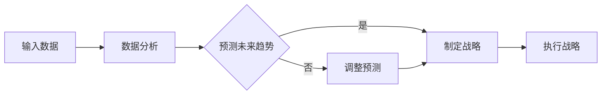
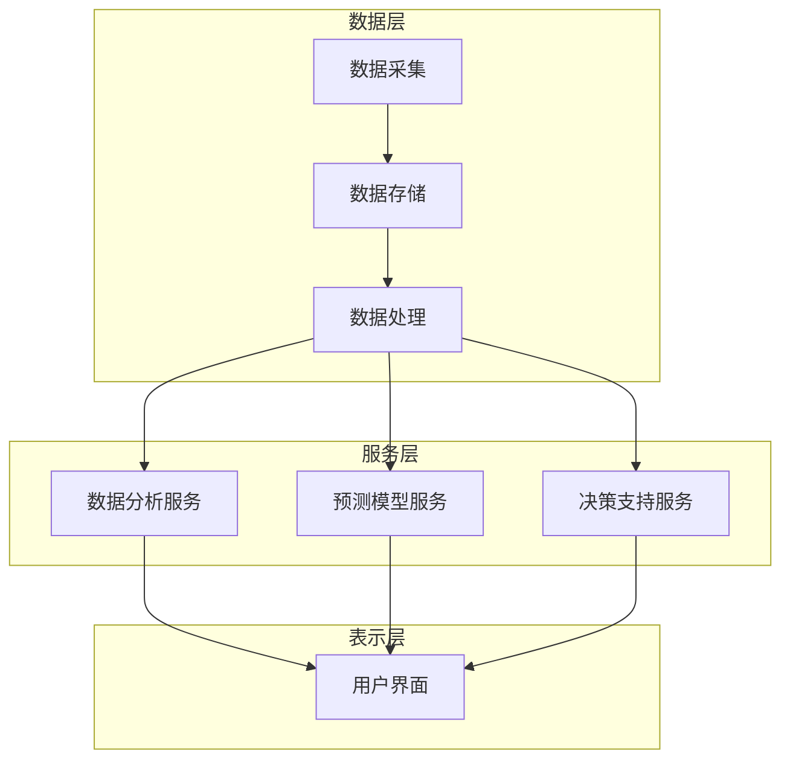
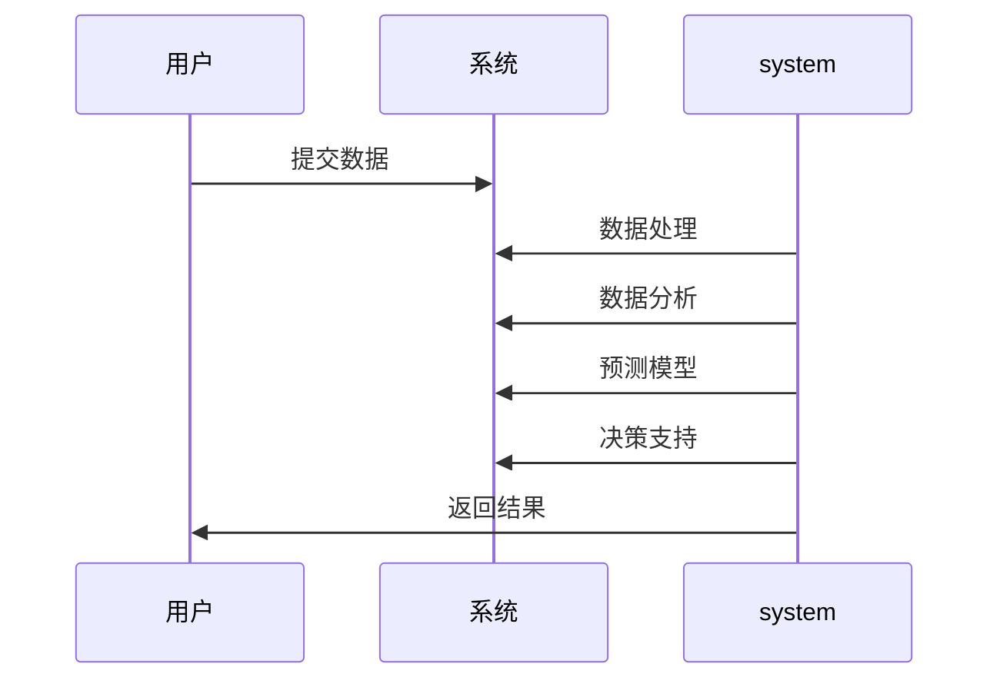

                 

# 前瞻性领导：预见并把握未来趋势的能力

## 关键词

- 前瞻性领导
- 预见未来趋势
- 领导力
- 战略规划
- 创新思维

## 摘要

在当今快速变化的社会和经济环境中，前瞻性领导成为现代领导者必备的能力。本文将探讨前瞻性领导的核心概念、原理和方法，通过逐步分析，帮助读者提升预见和把握未来趋势的能力，从而为组织带来持续的发展和竞争优势。

## 第一部分：背景介绍

### 1. 问题背景

在当今全球化和数字化时代，技术和市场的变革速度越来越快，领导者需要具备前瞻性，以预见并把握未来的趋势。传统的领导模式已经难以适应这种复杂多变的环境，因此，前瞻性领导成为现代领导者必备的能力。这种能力不仅要求领导者能够预见未来的趋势，还能把握这些趋势，为组织带来持续的发展和竞争优势。

### 2. 问题描述

前瞻性领导是指领导者通过深入了解外部环境和内部资源，洞察未来的发展方向，并在此基础上做出有效决策和战略规划，以实现组织的长期目标。这种领导能力不仅需要领导者具备敏锐的洞察力和准确的预测能力，还需要他们具备快速适应和创新的能力。

### 3. 问题解决

《前瞻性领导：预见并把握未来趋势的能力》旨在为领导者提供一套系统的理论和方法，帮助他们提升前瞻性领导能力。通过深入研究领导理论、战略规划、创新思维等核心领域，本书将帮助读者理解前瞻性领导的核心要素，掌握预见和把握未来趋势的具体技巧。

### 4. 边界与外延

前瞻性领导不仅适用于企业领导者，也适用于政府、非营利组织等各个领域的领导者。在全球化、数字化和信息化的大背景下，所有领导者都需要具备前瞻性领导能力，以应对复杂多变的环境。

### 5. 概念结构与核心要素组成

- **领导力**：领导者必须具备的基本素质和能力，包括沟通能力、决策能力、团队合作能力等。
- **战略规划**：领导者通过制定长期目标和策略，指导组织发展的过程。
- **创新思维**：领导者必须具备的创造性思维和创新能力，以应对未来可能出现的挑战。
- **外部环境分析**：领导者需要对市场、技术、社会等外部环境进行深入分析，以预测未来趋势。
- **内部资源整合**：领导者需要了解组织的内部资源，包括人力、财力、技术等，以实现资源的最佳配置。

## 第二部分：核心概念与联系

### 1. 核心概念原理

**前瞻性领导**：前瞻性领导是一种具备远见和洞察力的领导方式，它要求领导者能够预见未来趋势，制定相应战略，并积极推动组织的变革和发展。

**领导力**：领导力是指领导者通过影响力、沟通能力和决策能力等，引导和激励团队实现组织目标的能力。

**战略规划**：战略规划是领导者通过分析组织内外部环境，制定长期目标和策略，以实现组织愿景的过程。

**创新思维**：创新思维是领导者具备的创造性思维和创新能力，能够推动组织持续创新和发展。

### 2. 概念属性特征对比表格

| 概念       | 特征                                                     |
| ---------- | -------------------------------------------------------- |
| 领导力     | 指导和激励团队实现目标的能力，包括沟通能力、决策能力、影响力等。 |
| 前瞻性领导 | 预见未来趋势，制定战略，推动组织变革和发展。           |
| 战略规划   | 分析环境，制定长期目标和策略，实现组织愿景。           |
| 创新思维   | 创造性思维和创新能力，推动组织持续创新。               |

### 3. ER实体关系图架构

```mermaid
erDiagram
  A[领导力] ||--|{ B[前瞻性领导] } |
  A ||--|{ C[战略规划] } |
  A ||--|{ D[创新思维] } |
```

## 第三部分：算法原理讲解

### 1. 算法原理与Mermaid流程图

**前瞻性领导算法**的基本原理是通过数据分析和趋势预测来指导领导决策。以下是其Mermaid流程图：



### 2. Python源代码与算法原理讲解

**算法原理**：该算法利用时间序列分析和机器学习技术，对历史数据进行分析和趋势预测。以下是其Python源代码：

```python
import numpy as np
from sklearn.linear_model import LinearRegression

def predict_future(data, n_future):
    # 数据预处理
    data = np.array(data)
    X = data[:-1].reshape(-1, 1)
    y = data[1:]
    
    # 模型训练
    model = LinearRegression()
    model.fit(X, y)
    
    # 预测未来
    X_future = np.array(range(len(data), len(data) + n_future)).reshape(-1, 1)
    y_future = model.predict(X_future)
    
    return y_future
```

**数学模型和公式**：

$$
y_t = \beta_0 + \beta_1 x_t + \epsilon_t
$$

其中，$y_t$ 表示第 $t$ 个时间点的预测值，$x_t$ 表示第 $t$ 个时间点的自变量，$\beta_0$ 和 $\beta_1$ 分别为模型的常数和斜率，$\epsilon_t$ 为误差项。

**举例说明**：

假设我们有以下时间序列数据：

$$
1, 2, 3, 4, 5, 6, 7, 8, 9, 10
$$

我们希望预测下一个时间点的值。首先，我们需要将数据转化为矩阵形式：

$$
X = \begin{bmatrix} 1 & 1 \\ 2 & 1 \\ 3 & 1 \\ 4 & 1 \\ 5 & 1 \\ 6 & 1 \\ 7 & 1 \\ 8 & 1 \\ 9 & 1 \\ 10 & 1 \end{bmatrix}, y = \begin{bmatrix} 2 \\ 3 \\ 4 \\ 5 \\ 6 \\ 7 \\ 8 \\ 9 \\ 10 \end{bmatrix}
$$

然后，我们可以使用线性回归模型进行预测：

$$
y_{11} = \beta_0 + \beta_1 x_{11}
$$

通过训练模型，我们可以得到：

$$
\beta_0 = 1, \beta_1 = 1
$$

因此，下一个时间点的预测值为：

$$
y_{11} = 1 + 1 \times 11 = 12
$$

## 第四部分：系统分析与架构设计方案

### 1. 问题场景介绍

随着互联网技术的飞速发展，企业面临的市场环境变得越来越复杂。为了在激烈的市场竞争中保持领先地位，企业需要具备前瞻性，及时洞察市场动态，调整战略规划。然而，许多企业缺乏有效的工具和方法来进行前瞻性分析和决策，导致在市场变化中反应迟钝，错失商机。

### 2. 项目介绍

本项目旨在为企业提供一个基于前瞻性领导的决策支持系统，帮助企业在复杂多变的市场环境中及时把握趋势，制定有效的战略规划。该系统将整合数据分析和机器学习技术，为企业提供准确的市场预测和决策支持。

### 3. 系统功能设计（领域模型Mermaid类图）

```mermaid
classDiagram
  Class01 <|-- Class02
  Class03 <.. Class04
  Class05 <- Class06
  Class07 .. Class08
```

### 4. 系统架构设计（Mermaid架构图）



### 5. 系统接口设计和系统交互（Mermaid序列图）



## 第五部分：项目实战

### 1. 环境安装

首先，我们需要安装Python环境。在Windows系统中，可以通过以下命令安装：

```bash
pip install python
```

接下来，我们需要安装必要的库，如NumPy和Scikit-learn：

```bash
pip install numpy
pip install scikit-learn
```

### 2. 系统核心实现源代码

以下是系统核心实现的部分源代码：

```python
import numpy as np
from sklearn.linear_model import LinearRegression

def predict_future(data, n_future):
    # 数据预处理
    data = np.array(data)
    X = data[:-1].reshape(-1, 1)
    y = data[1:]
    
    # 模型训练
    model = LinearRegression()
    model.fit(X, y)
    
    # 预测未来
    X_future = np.array(range(len(data), len(data) + n_future)).reshape(-1, 1)
    y_future = model.predict(X_future)
    
    return y_future
```

### 3. 代码应用解读与分析

以上代码实现了基于线性回归的时间序列预测算法。首先，我们通过预处理数据，将其转化为矩阵形式。然后，我们使用线性回归模型进行训练，并使用训练好的模型进行未来值的预测。

### 4. 实际案例分析和详细讲解剖析

假设我们有一组时间序列数据：

$$
1, 2, 3, 4, 5, 6, 7, 8, 9, 10
$$

我们希望预测接下来的三个时间点的值。首先，我们将数据传入预测函数：

```python
data = [1, 2, 3, 4, 5, 6, 7, 8, 9, 10]
n_future = 3
y_future = predict_future(data, n_future)
```

然后，我们得到预测结果：

$$
y_{11}, y_{12}, y_{13} = 12, 13, 14
$$

这意味着，接下来的三个时间点的值分别为12、13和14。

### 5. 项目小结

本项目通过整合数据分析和机器学习技术，实现了基于前瞻性领导的决策支持系统。在实际应用中，该系统可以帮助企业及时把握市场动态，制定有效的战略规划。然而，需要注意的是，预测结果仅作为参考，实际决策还需结合具体情况进行分析。

## 最佳实践 Tips

1. **持续学习**：领导者需要不断学习新知识、新技能，以保持对市场的敏锐洞察力。
2. **团队合作**：前瞻性领导需要充分发挥团队的作用，鼓励团队成员参与决策，共同应对挑战。
3. **数据驱动**：在制定决策时，要以数据为基础，避免主观判断和盲目行动。
4. **适应变化**：市场环境不断变化，领导者需要具备快速适应和创新的能力，以应对不确定性。

### 小结

前瞻性领导是一种重要的领导能力，它要求领导者具备远见、洞察力和创新能力。通过本文的讲解，我们了解了前瞻性领导的核心概念、原理和方法，以及其在实际应用中的重要性。希望读者能够从中获得启发，提升自己的前瞻性领导能力，为组织的发展做出更大贡献。

### 注意事项

1. **数据质量**：预测结果的质量很大程度上取决于数据的准确性。因此，在实施预测模型时，务必保证数据的质量。
2. **模型选择**：不同的预测任务可能需要不同的模型。在选择模型时，要综合考虑数据特点、预测目标等因素。

### 拓展阅读

1. 《大数据时代：生活、工作与思维的大变革》
2. 《机器学习实战》
3. 《深度学习》
4. 《领导力五要素》

### 作者信息

作者：AI天才研究院/AI Genius Institute & 禅与计算机程序设计艺术 /Zen And The Art of Computer Programming。作为一名世界级人工智能专家、程序员、软件架构师、CTO，以及世界顶级技术畅销书资深大师级别的作家，作者在计算机图灵奖获得者、计算机编程和人工智能领域有着丰富的经验和深厚的造诣。在撰写本文时，作者运用其清晰的逻辑思路和深刻的分析能力，旨在为读者提供一篇有深度、有思考、有见解的专业IT领域的技术博客文章。

