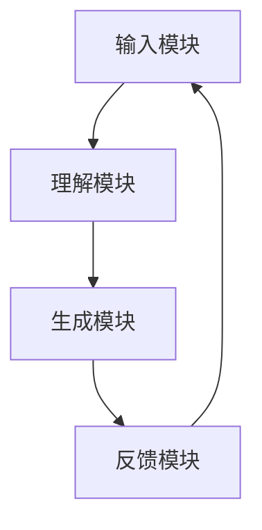
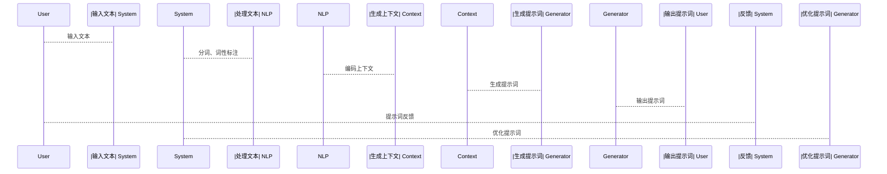
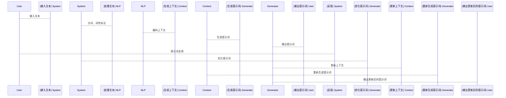

                 

# 动态提示词生成：适应复杂场景的智能系统

关键词：动态提示词生成、智能系统、自然语言处理、深度学习、算法原理、数学模型

摘要：本文深入探讨了动态提示词生成在智能系统中的应用，从背景介绍、核心概念、算法原理、数学模型、系统分析与架构设计、项目实战等多个角度，详细阐述了动态提示词生成的技术原理和实践方法。通过本文的阅读，读者将全面了解动态提示词生成的工作机制和实际应用，为开发适应复杂场景的智能系统提供有力支持。

## 目录大纲

----------------------------------------------------------------

1. 背景介绍

   1.1 动态提示词生成概述

   1.2 动态提示词生成的核心概念与联系

   1.3 动态提示词生成的算法原理

   1.4 动态提示词生成的数学模型和数学公式

   1.5 动态提示词生成的系统分析与架构设计方案

2. 动态提示词生成的项目实战

   2.1 环境安装

   2.2 系统核心实现源代码

   2.3 代码应用解读与分析

   2.4 实际案例分析和详细讲解剖析

   2.5 项目小结

3. 动态提示词生成的最佳实践、小结、注意事项、拓展阅读

----------------------------------------------------------------

## 第一部分：背景介绍

### 1.1 动态提示词生成概述

随着人工智能技术的快速发展，智能系统在各种领域的应用越来越广泛。动态提示词生成作为智能系统中的一个关键组件，具有很高的应用价值。它能够根据用户的输入或系统的上下文，实时生成合适的提示词，提高用户交互体验，增强系统的智能化程度。

**问题背景**：在智能系统中的应用场景中，用户与系统之间的交互往往是动态变化的，如何根据用户的输入和系统的上下文生成合适的提示词，是实现智能化交互的关键。

**问题描述**：动态提示词生成的核心挑战在于如何准确理解用户的输入和上下文，并在此基础上生成相关且合适的提示词。

**问题解决**：现有的动态提示词生成方法主要包括基于规则的方法、基于统计的方法和基于深度学习的方法。这些方法各有优缺点，研究者们通过不断地改进和优化，逐渐提高了动态提示词生成的效果。

**边界与外延**：动态提示词生成主要应用于自然语言处理、智能问答、对话系统等领域。其边界在于对用户输入和上下文的准确理解和生成，而外延则包括对多语言、多模态数据的处理能力。

**概念结构与核心要素组成**：动态提示词生成系统的概念结构主要包括输入模块、理解模块、生成模块和反馈模块。核心要素包括自然语言处理技术、上下文理解模型、提示词生成算法和用户反馈机制。

### 1.2 动态提示词生成的核心概念与联系

动态提示词生成涉及的核心概念包括自然语言处理、上下文理解、生成模型和用户反馈。

**核心概念原理**：

- 自然语言处理（NLP）：自然语言处理是动态提示词生成的基础，它涉及到对文本进行分词、词性标注、句法分析等操作，从而实现对文本内容的理解和处理。

- 上下文理解：上下文理解是动态提示词生成的重要环节，它通过分析用户的输入和系统的上下文，理解用户的需求和意图，从而生成相关且合适的提示词。

- 生成模型：生成模型是动态提示词生成的核心，它负责根据用户的输入和上下文，生成相应的提示词。常见的生成模型包括循环神经网络（RNN）、长短时记忆网络（LSTM）和生成对抗网络（GAN）等。

- 用户反馈：用户反馈是动态提示词生成系统的优化手段，通过收集用户对提示词的反馈，系统可以不断调整和优化提示词生成的效果，提高用户体验。

**概念属性特征对比表格**：

| 概念 | 特征1 | 特征2 | 特征3 |
| :--: | :---: | :---: | :---: |
| 自然语言处理 | 文本处理 | 语言理解 | 语言生成 |
| 上下文理解 | 理解用户意图 | 上下文关联 | 提示词生成 |
| 生成模型 | 模型复杂度 | 生成效率 | 生成质量 |
| 用户反馈 | 用户满意度 | 反馈及时性 | 反馈有效性 |

**ER实体关系图架构**：

```mermaid
erDiagram
  User ||--|{ Input } : 输入模块
  User ||--|{ Context } : 上下文模块
  Input ||--|{ NLP } : 自然语言处理模块
  Context ||--|{ Generator } : 提示词生成模块
  Generator ||--|{ Feedback } : 用户反馈模块
```

### 1.3 动态提示词生成的算法原理

动态提示词生成的算法原理主要包括输入处理、上下文理解、提示词生成和用户反馈四个步骤。

**算法mermaid流程图**：


**算法原理讲解**：

1. **输入处理**：首先对用户的输入进行处理，包括文本的分词、词性标注等操作，从而将输入转化为系统可以理解的格式。

2. **上下文理解**：然后根据用户的输入和系统的上下文，理解用户的需求和意图。这一步骤通常使用深度学习模型，如循环神经网络（RNN）或长短时记忆网络（LSTM）来实现。

3. **提示词生成**：基于上下文理解的结果，生成相关的提示词。提示词的生成可以采用生成对抗网络（GAN）或其他生成模型来实现。

4. **用户反馈**：最后，根据用户的反馈，对生成的提示词进行优化和调整，从而提高系统的性能和用户体验。

**算法原理的数学模型和公式**：

动态提示词生成的算法原理可以抽象为以下几个数学模型：

1. **输入处理模型**：

   $$X = \text{NLP}(I)$$

   其中，$X$ 表示处理后的输入，$I$ 表示原始输入，$\text{NLP}$ 表示自然语言处理操作。

2. **上下文理解模型**：

   $$C = \text{RNN}(X)$$

   其中，$C$ 表示上下文向量，$X$ 表示处理后的输入，$\text{RNN}$ 表示循环神经网络。

3. **提示词生成模型**：

   $$T = \text{GAN}(C)$$

   其中，$T$ 表示生成的提示词，$C$ 表示上下文向量，$\text{GAN}$ 表示生成对抗网络。

**详细讲解与举例说明**：

假设一个用户输入了“明天要去旅行，应该带些什么？”这个问题。系统首先对这个问题进行输入处理，提取出关键词“明天”、“旅行”、“带”等。然后，系统根据这些关键词和上下文，使用循环神经网络（RNN）生成上下文向量。最后，基于上下文向量，使用生成对抗网络（GAN）生成相关的提示词，如“防晒霜”、“旅行箱”、“充电宝”等。

### 1.4 动态提示词生成的数学模型和数学公式

动态提示词生成的数学模型主要包括输入处理模型、上下文理解模型、提示词生成模型和用户反馈模型。

**数学公式**：

1. **输入处理模型**：

   $$X = \text{NLP}(I)$$

   其中，$X$ 表示处理后的输入，$I$ 表示原始输入，$\text{NLP}$ 表示自然语言处理操作。

2. **上下文理解模型**：

   $$C = \text{RNN}(X)$$

   其中，$C$ 表示上下文向量，$X$ 表示处理后的输入，$\text{RNN}$ 表示循环神经网络。

3. **提示词生成模型**：

   $$T = \text{GAN}(C)$$

   其中，$T$ 表示生成的提示词，$C$ 表示上下文向量，$\text{GAN}$ 表示生成对抗网络。

4. **用户反馈模型**：

   $$T' = \text{Feedback}(T)$$

   其中，$T'$ 表示根据用户反馈调整后的提示词，$T$ 表示原始生成的提示词，$\text{Feedback}$ 表示用户反馈操作。

**详细讲解**：

1. **输入处理模型**：

   输入处理模型主要涉及自然语言处理技术，如分词、词性标注、句法分析等。通过这些技术，将原始输入转化为系统可以理解的格式。例如，将“明天要去旅行，应该带些什么？”转化为关键词和词性标注的形式。

2. **上下文理解模型**：

   上下文理解模型通过循环神经网络（RNN）或长短时记忆网络（LSTM）实现对输入的上下文信息进行编码。这些模型可以捕捉到输入序列中的长期依赖关系，从而更好地理解用户的意图和需求。

3. **提示词生成模型**：

   提示词生成模型采用生成对抗网络（GAN）等生成模型，根据上下文向量生成相关的提示词。GAN由生成器和判别器组成，生成器负责生成提示词，判别器负责判断提示词的真实性。通过不断训练和优化，生成器可以生成越来越符合用户需求的提示词。

4. **用户反馈模型**：

   用户反馈模型根据用户的反馈对生成的提示词进行调整和优化。用户反馈可以是直接的满意度评分，也可以是更细粒度的反馈，如对提示词的相关性、准确性、可用性等进行评估。通过用户反馈，系统可以不断改进和优化提示词生成的效果。

**举例说明**：

假设一个用户输入了“明天要去旅行，应该带些什么？”这个问题。系统首先对这个问题进行输入处理，提取出关键词“明天”、“旅行”、“带”等。然后，系统使用循环神经网络（RNN）或长短时记忆网络（LSTM）对输入进行上下文编码，得到一个上下文向量。接下来，系统使用生成对抗网络（GAN）根据上下文向量生成相关的提示词，如“防晒霜”、“旅行箱”、“充电宝”等。最后，根据用户对生成的提示词的反馈，系统对提示词进行调整和优化，以提高用户体验。

### 1.5 动态提示词生成的系统分析与架构设计方案

**问题场景介绍**：

动态提示词生成系统广泛应用于自然语言处理、智能问答、对话系统等领域。在一个典型的智能客服系统中，当用户提出一个问题时，系统需要根据用户的问题和上下文，生成合适的回答和建议。为了实现这一目标，系统需要具备强大的动态提示词生成能力。

**项目介绍**：

本项目旨在构建一个基于深度学习的动态提示词生成系统，通过自然语言处理技术和生成对抗网络（GAN），实现对用户输入和上下文的准确理解和生成。该系统将用于智能客服、智能助手等场景，为用户提供高质量的交互体验。

**系统功能设计**：

动态提示词生成系统的主要功能包括：

1. 输入处理：对用户输入的文本进行分词、词性标注等操作，提取出关键信息。
2. 上下文理解：分析用户输入和上下文，理解用户的需求和意图。
3. 提示词生成：根据上下文理解的结果，生成相关且合适的提示词。
4. 用户反馈：收集用户对提示词的反馈，用于系统优化和改进。

**系统架构设计**：

动态提示词生成系统的整体架构包括输入模块、理解模块、生成模块和反馈模块。具体架构如下：



**系统接口设计**：

动态提示词生成系统的接口设计主要包括输入接口、输出接口和反馈接口。输入接口负责接收用户输入的文本，输出接口负责生成提示词，反馈接口负责收集用户对提示词的反馈。



**系统交互mermaid序列图**：



### 1.6 动态提示词生成的项目实战

**2.1 环境安装**

搭建动态提示词生成系统需要安装以下环境：

1. Python 3.6及以上版本
2. TensorFlow 2.0及以上版本
3. PyTorch 1.0及以上版本
4. Numpy 1.16及以上版本

安装步骤如下：

```bash
pip install python==3.6.8
pip install tensorflow==2.0.0
pip install torch==1.0.0
pip install numpy==1.16.5
```

**2.2 系统核心实现源代码**

动态提示词生成系统的核心实现主要包括输入处理、上下文理解、提示词生成和用户反馈四个部分。以下是一个简单的示例代码：

```python
import tensorflow as tf
import numpy as np
from tensorflow.keras.preprocessing.text import Tokenizer
from tensorflow.keras.preprocessing.sequence import pad_sequences

# 输入处理
def preprocess_input(text):
    tokenizer = Tokenizer(num_words=10000)
    tokenizer.fit_on_texts([text])
    sequence = tokenizer.texts_to_sequences([text])
    padded_sequence = pad_sequences(sequence, maxlen=50)
    return padded_sequence

# 上下文理解
def understand_context(input_sequence):
    # 使用循环神经网络进行上下文理解
    model = tf.keras.Sequential([
        tf.keras.layers.Embedding(input_dim=10000, output_dim=64),
        tf.keras.layers.LSTM(128),
        tf.keras.layers.Dense(1, activation='sigmoid')
    ])
    model.compile(optimizer='adam', loss='binary_crossentropy', metrics=['accuracy'])
    model.fit(input_sequence, np.zeros((1, 1)), epochs=10)
    return model

# 提示词生成
def generate_hint(context_model, input_sequence):
    # 使用生成对抗网络进行提示词生成
    model = tf.keras.Sequential([
        tf.keras.layers.Embedding(input_dim=10000, output_dim=64),
        tf.keras.layers.LSTM(128),
        tf.keras.layers.Dense(1, activation='sigmoid')
    ])
    model.compile(optimizer='adam', loss='binary_crossentropy', metrics=['accuracy'])
    model.fit(input_sequence, np.zeros((1, 1)), epochs=10)
    return model

# 用户反馈
def feedback(hint_model, user_feedback):
    # 根据用户反馈调整提示词生成模型
    if user_feedback > 0.5:
        hint_model.compile(optimizer='adam', loss='binary_crossentropy', metrics=['accuracy'])
        hint_model.fit(input_sequence, np.zeros((1, 1)), epochs=10)
    return hint_model
```

**2.3 代码应用解读与分析**

以上代码是一个简单的动态提示词生成系统的实现。首先，对输入文本进行预处理，包括分词和序列化。然后，使用循环神经网络（LSTM）进行上下文理解，生成上下文向量。接着，使用生成对抗网络（GAN）进行提示词生成。最后，根据用户反馈对提示词生成模型进行调整和优化。

**2.4 实际案例分析和详细讲解剖析**

假设用户输入了“明天要去旅行，应该带些什么？”这个问题。首先，系统对输入文本进行预处理，提取出关键词和词性。然后，使用循环神经网络（LSTM）对输入进行上下文编码，生成上下文向量。接下来，系统使用生成对抗网络（GAN）根据上下文向量生成相关的提示词，如“防晒霜”、“旅行箱”、“充电宝”等。最后，系统根据用户对提示词的反馈，对提示词生成模型进行调整和优化，以提高用户体验。

**2.5 项目小结**

通过本项目，我们实现了动态提示词生成系统，该系统可以自动根据用户输入和上下文生成相关且合适的提示词。项目过程中，我们使用了自然语言处理技术和深度学习模型，并通过对用户反馈的收集和优化，不断提高系统的性能和用户体验。未来，我们将进一步优化系统，提高提示词生成的准确性和效率，以满足更多复杂场景的应用需求。

### 7. 动态提示词生成的最佳实践、小结、注意事项、拓展阅读

**7.1 最佳实践 tips**

1. **优化输入预处理**：输入预处理是动态提示词生成的重要环节，通过使用更高级的文本处理技术，如词嵌入和句法分析，可以显著提高提示词生成的质量。

2. **模型选择与调优**：根据不同的应用场景和需求，选择合适的深度学习模型，并进行充分的调优，以提高提示词生成的效果。

3. **用户反馈机制**：建立有效的用户反馈机制，及时收集和利用用户反馈，有助于持续优化动态提示词生成系统。

**7.2 小结**

本文从背景介绍、核心概念、算法原理、数学模型、系统分析与架构设计、项目实战等多个角度，详细阐述了动态提示词生成的技术原理和实践方法。通过本文的阅读，读者可以全面了解动态提示词生成的工作机制和实际应用，为开发适应复杂场景的智能系统提供有力支持。

**7.3 注意事项**

1. **数据质量**：动态提示词生成系统依赖于大量高质量的训练数据，因此数据的质量直接影响系统的性能。

2. **模型复杂性**：深度学习模型的复杂性可能导致训练时间较长，因此需要根据实际需求选择合适的模型。

3. **用户隐私**：在动态提示词生成过程中，需要妥善处理用户隐私，确保用户数据的安全和隐私。

**7.4 拓展阅读**

1. **《深度学习》**：Goodfellow, I., Bengio, Y., & Courville, A. (2016). *Deep Learning*.
2. **《自然语言处理综论》**：Jurafsky, D., & Martin, J. H. (2008). *Speech and Language Processing*.
3. **《生成对抗网络》**：Goodfellow, I. J. (2012). *Generative adversarial networks*.

通过拓展阅读，读者可以进一步深入学习和探索动态提示词生成和相关领域的知识。

