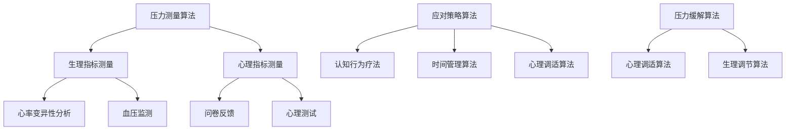

                 

# 压力管理：保持团队健康的关键

> 关键词：压力管理、团队健康、应对策略、算法原理、系统架构

> 摘要：本文将深入探讨压力管理在团队健康中的关键作用，通过逻辑清晰的分析，帮助IT团队有效应对压力，提升整体效率和创造力。

## 第一部分: 压力管理的背景

### 1.1 问题背景

#### 1.1.1 现代社会的压力现状

在现代社会中，压力已成为一种普遍存在的现象。对于IT从业者来说，高强度的开发工作、不断更新的技术趋势、激烈的市场竞争等因素，使得他们面临着巨大的压力。根据一项针对全球IT从业者的调查，超过70%的人表示他们经常感到压力过大，这不仅影响了工作效率，还严重损害了身心健康。

#### 1.1.2 压力对团队健康的影响

过大的工作压力会导致团队成员出现一系列问题，如焦虑、失眠、工作效率下降等。长期处于高压状态下，团队成员的创造力、决策能力也会受到严重影响。更为严重的是，压力过大还可能导致团队内部矛盾加剧，影响团队协作和整体健康。

#### 1.1.3 压力管理的必要性

面对压力带来的种种问题，有效的压力管理显得尤为重要。通过合理的压力管理策略，可以帮助团队减轻负担，提升工作效率，增强团队凝聚力。本文将围绕压力管理的核心概念、应对策略以及相关算法原理，为IT团队提供一套完整的压力管理方案。

### 1.2 问题描述

#### 1.2.1 团队成员面临的压力类型

团队成员面临的压力主要可以分为以下几种类型：

1. **工作压力**：包括工作量过大、工作时间紧张、职业发展不确定性等。
2. **个人生活压力**：如家庭责任、财务压力、社会关系等。
3. **技术挑战**：对新技术的快速适应、技术难题的解决等。

#### 1.2.2 压力引发的问题

压力过大引发的问题主要包括：

1. **心理健康问题**：如焦虑、抑郁、失眠等。
2. **工作效率下降**：压力影响团队成员的专注力和创造力。
3. **团队协作障碍**：压力可能导致团队成员之间的矛盾和冲突。

#### 1.2.3 压力管理的重要性

有效的压力管理对于团队的健康和长期发展至关重要。通过合理的压力管理，可以帮助团队：

1. **提高工作效率**：减轻压力，提升团队成员的专注力和创造力。
2. **增强团队凝聚力**：通过团队建设活动和心理辅导，增强团队成员之间的信任和合作。
3. **降低离职率**：缓解压力，提高员工的工作满意度和忠诚度。

### 1.3 问题解决

#### 1.3.1 压力管理的概念

压力管理是指通过一系列策略和方法，帮助个体识别、评估和应对压力源，从而减轻压力带来的负面影响。在团队层面，压力管理还包括制定和实施相关政策和措施，以支持团队成员应对压力。

#### 1.3.2 压力管理的目标

压力管理的目标主要包括：

1. **减轻压力**：通过应对策略和干预措施，减轻团队成员的生理和心理压力。
2. **提高生活质量**：通过改善工作环境和心理健康，提升团队成员的生活质量。
3. **提升团队效能**：通过减轻压力，提高团队成员的工作效率和创造力。

#### 1.3.3 压力管理的原则

有效的压力管理应遵循以下原则：

1. **个体参与**：让团队成员参与压力管理的全过程，提高其主动性和积极性。
2. **全面评估**：对压力源进行全面评估，制定有针对性的应对策略。
3. **持续关注**：压力管理是一个长期过程，需要持续关注团队成员的心理和生理状况。

### 1.4 边界与外延

#### 1.4.1 压力管理的范畴

压力管理不仅涉及团队成员的心理健康，还包括生理健康、工作环境和人际关系等方面。在团队层面，压力管理还包括组织文化和领导风格等因素。

#### 1.4.2 压力管理与心理健康的关系

压力管理与心理健康密切相关。通过有效的压力管理，可以帮助团队成员保持良好的心理健康，提高工作满意度和生活质量。

#### 1.4.3 压力管理在企业中的应用

在企业层面，压力管理可以通过以下方式实施：

1. **建立压力管理机制**：制定相关政策，为团队成员提供心理支持和资源。
2. **开展团队建设活动**：通过团队建设活动，增强团队成员之间的信任和合作。
3. **提供心理健康服务**：如心理咨询、健康讲座等，帮助团队成员缓解压力。

### 1.5 概念结构与核心要素组成

#### 1.5.1 压力源分析

压力源分析是压力管理的基础。通过对团队成员的工作环境、工作内容和个人情况进行分析，识别出主要的压力源。

#### 1.5.2 应对策略

应对策略包括认知重构、时间管理、心理调适等。通过有针对性的策略，帮助团队成员减轻压力。

#### 1.5.3 压力缓解与恢复机制

压力缓解与恢复机制包括员工支持计划、团队建设、心理辅导等。通过这些机制，帮助团队成员在压力下保持健康和高效。

## 第二部分: 核心概念与联系

### 2.1 压力源

#### 2.1.1 工作压力

工作压力是团队成员面临的主要压力源之一。以下是一些常见的工作压力类型：

1. **工作量过大**：由于任务繁多，团队成员可能感到力不从心，长期处于工作状态，导致身心疲惫。
2. **工作时间紧张**：在紧迫的时间限制下完成任务，可能需要加班加点，影响工作和生活平衡。
3. **职业发展不确定性**：职业晋升机会有限，团队成员可能担心自己的职业前景，产生焦虑情绪。

#### 2.1.2 个人生活压力

个人生活压力也是团队成员面临的一个重要压力源。以下是一些常见的个人生活压力类型：

1. **家庭责任**：家庭责任如抚养子女、照顾老人等，可能占用大量时间和精力，影响工作表现。
2. **财务压力**：经济负担如房贷、车贷、子女教育等，可能导致团队成员产生焦虑情绪。
3. **社会关系**：社交活动、人际交往等，可能占用团队成员的时间和精力，影响工作效率。

### 2.2 应对策略

有效的应对策略可以帮助团队成员减轻压力。以下是一些常见的应对策略：

#### 2.2.1 认知重构

认知重构是指通过调整思维方式，改变对压力源的看法和态度。以下是一些认知重构的方法：

1. **负面思维的识别与调整**：识别出负面思维，通过积极的方法进行调整，如积极思考、理性分析等。
2. **正面思维的培养**：培养积极的思维方式，如感恩、乐观等，提高应对压力的能力。

#### 2.2.2 时间管理

时间管理是指通过合理安排时间，提高工作效率，减轻压力。以下是一些时间管理的方法：

1. **制定合理的工作计划**：根据工作任务的重要性和紧急程度，制定合理的工作计划，合理安排工作时间。
2. **优先级排序**：根据任务的重要性和紧急程度，对任务进行优先级排序，优先处理重要且紧急的任务。
3. **避免时间浪费**：通过避免无效的社交活动、会议等，提高工作时间利用率。

#### 2.2.3 心理调适

心理调适是指通过改善心理状态，减轻压力。以下是一些心理调适的方法：

1. **睡眠质量改善**：保证充足的睡眠，提高身体和心理的恢复能力。
2. **锻炼习惯养成**：定期进行体育锻炼，提高身体素质，缓解压力。
3. **放松技巧应用**：通过冥想、瑜伽等放松技巧，缓解紧张情绪，减轻压力。

### 2.3 压力缓解与恢复机制

压力缓解与恢复机制是指通过一系列措施，帮助团队成员在压力下保持健康和高效。以下是一些常见的压力缓解与恢复机制：

#### 2.3.1 员工支持计划

员工支持计划是指为团队成员提供心理支持和资源，帮助他们应对压力。以下是一些员工支持计划的内容：

1. **咨询服务提供**：为团队成员提供专业的心理咨询服务，帮助他们解决心理问题。
2. **健康福利保障**：为团队成员提供健康福利，如健身房会员、健康检查等，提高身心健康水平。

#### 2.3.2 团队建设

团队建设是指通过一系列活动，增强团队成员之间的信任和合作。以下是一些团队建设的内容：

1. **团队沟通改善**：通过定期的团队沟通，提高团队成员之间的信息共享和协作效率。
2. **团队活动参与**：组织团队活动，如团队建设训练、团队聚餐等，增强团队成员之间的互动和信任。
3. **团队心理辅导**：通过心理辅导，帮助团队成员解决心理问题，提高心理健康水平。

## 第三部分: 压力管理方法

### 3.1 算法概述

压力管理方法可以分为以下几类：

1. **压力测量算法**：通过生理和心理指标测量，评估团队成员的压力水平。
2. **应对策略算法**：通过认知重构、时间管理、心理调适等方法，帮助团队成员减轻压力。
3. **压力缓解算法**：通过放松技巧、健康习惯养成等方法，帮助团队成员缓解压力。

### 3.2 压力测量算法

压力测量算法主要包括以下两类：

#### 3.2.1 生理指标测量

生理指标测量是通过监测生理参数，如心率变异性、血压等，评估团队成员的生理压力水平。以下是一些常用的生理指标测量方法：

1. **心率变异性分析**：通过分析心率变异性，评估自主神经系统的活动状态，进而评估生理压力水平。
2. **血压监测**：通过定期测量血压，评估血压水平是否处于正常范围，判断生理压力大小。

#### 3.2.2 心理指标测量

心理指标测量是通过问卷反馈、心理测试等方法，评估团队成员的心理压力水平。以下是一些常用的心理指标测量方法：

1. **问卷反馈**：通过设计问卷，收集团队成员对压力的感受和体验，评估心理压力水平。
2. **心理测试**：通过心理测试工具，如压力测试、焦虑测试等，评估团队成员的心理健康状况。

### 3.3 应对策略算法

应对策略算法主要包括以下几类：

#### 3.3.1 认知行为疗法

认知行为疗法是一种心理治疗方法，通过调整个体的认知和行为，减轻压力。以下是一些认知行为疗法的方法：

1. **负面思维的识别与调整**：通过识别和调整负面思维，帮助个体建立积极的思维方式。
2. **正面思维的培养**：通过培养正面思维，提高个体应对压力的能力。

#### 3.3.2 时间管理算法

时间管理算法是通过合理安排时间，提高工作效率，减轻压力。以下是一些时间管理算法的方法：

1. **制定合理的工作计划**：通过制定合理的工作计划，合理安排工作时间，提高工作效率。
2. **优先级排序**：通过优先级排序，确保重要且紧急的任务得到优先处理。

#### 3.3.3 心理调适算法

心理调适算法是通过改善心理状态，减轻压力。以下是一些心理调适算法的方法：

1. **睡眠质量改善**：通过改善睡眠质量，提高身体和心理的恢复能力。
2. **锻炼习惯养成**：通过养成锻炼习惯，提高身体素质，缓解压力。

### 3.4 压力缓解算法

压力缓解算法主要包括以下几类：

#### 3.4.1 心理调适算法

心理调适算法是通过改善心理状态，减轻压力。以下是一些心理调适算法的方法：

1. **放松技巧应用**：通过冥想、瑜伽等放松技巧，缓解紧张情绪，减轻压力。
2. **心理健康服务**：通过心理健康服务，如心理咨询、心理治疗等，帮助个体解决心理问题。

#### 3.4.2 生理调节算法

生理调节算法是通过改善生理状态，减轻压力。以下是一些生理调节算法的方法：

1. **呼吸调节**：通过呼吸调节，改善呼吸状态，缓解压力。
2. **按摩放松**：通过按摩放松，缓解肌肉紧张，减轻压力。

### 3.5 Mermaid流程图

以下是压力管理算法的Mermaid流程图：



## 数学模型与数学公式

### 心理压力的数学模型

心理压力可以用以下数学模型来表示：

$$
压力 = 应激源 \times 个体敏感性
$$

其中，应激源是指引发压力的因素，个体敏感性是指个体对压力源的敏感程度。通过这个模型，我们可以更准确地评估个体的压力水平。

### 应激源的量化

为了量化应激源，我们可以使用以下数学模型：

$$
应激源强度 = \sum_{i=1}^{n} (w_i \times s_i)
$$

其中，$w_i$ 是权重，$s_i$ 是各应激源的强度。通过这个模型，我们可以计算出不同应激源的综合强度，从而更全面地了解个体的压力来源。

### 时间管理的数学模型

时间管理可以通过以下数学模型来衡量：

$$
时间效率 = \frac{完成工作的时间}{计划时间}
$$

这个模型可以帮助我们评估时间管理的效果，从而优化工作流程，提高工作效率。

### 压力缓解效果的评估

为了评估压力缓解效果，我们可以使用以下数学模型：

$$
压力缓解率 = \frac{干预前压力值 - 干预后压力值}{干预前压力值}
$$

通过这个模型，我们可以计算出干预前后的压力变化，从而评估压力管理策略的有效性。

## 第四部分: 系统分析与架构设计方案

### 问题场景介绍

#### 团队成员面临的压力问题

在某家大型IT公司，团队成员面临着多种压力问题。一方面，由于项目复杂度高、工作量庞大，团队成员经常需要加班加点，导致身心疲惫；另一方面，个人生活压力如家庭责任、财务压力等，也使得团队成员在工作和生活之间难以平衡。此外，团队成员在职业发展方面也存在不确定性，进一步加剧了压力。

#### 企业对压力管理需求

为了提高团队成员的工作效率和创造力，企业迫切需要一套有效的压力管理方案。企业期望通过压力管理，帮助团队成员减轻压力，提高工作满意度，降低离职率，从而保持团队的稳定和高效运行。

### 项目介绍

#### 项目背景

为了应对团队成员面临的压力问题，企业决定实施一项压力管理项目。该项目旨在通过系统化的压力管理措施，帮助团队成员应对压力，提升团队整体健康和效能。

#### 项目目标

1. **减轻团队成员的工作压力**：通过制定合理的工作计划和优先级排序，提高工作效率，减少加班现象。
2. **缓解个人生活压力**：通过提供心理咨询、健康福利等支持，帮助团队成员缓解个人生活压力。
3. **提升团队凝聚力**：通过团队建设活动和心理辅导，增强团队成员之间的信任和合作。
4. **降低离职率**：通过有效的压力管理，提高团队成员的工作满意度和忠诚度，降低离职率。

### 系统功能设计

#### 功能模块划分

压力管理系统可以分为以下模块：

1. **压力测量模块**：负责收集和分析团队成员的生理和心理指标，评估压力水平。
2. **应对策略模块**：提供认知重构、时间管理、心理调适等应对策略，帮助团队成员减轻压力。
3. **压力缓解模块**：提供放松技巧、健康习惯养成等压力缓解方法，帮助团队成员缓解压力。
4. **团队建设模块**：组织团队建设活动和心理辅导，增强团队成员之间的信任和合作。
5. **数据统计与分析模块**：收集和分析压力管理数据，为企业管理层提供决策支持。

#### 模块功能描述

1. **压力测量模块**：通过生理指标测量（如心率变异性、血压等）和心理指标测量（如问卷反馈、心理测试等），评估团队成员的压力水平，生成压力报告。
2. **应对策略模块**：根据压力报告，为团队成员提供个性化的应对策略建议，如认知重构方法、时间管理技巧、心理调适方法等。
3. **压力缓解模块**：提供一系列放松技巧（如冥想、瑜伽等）和健康习惯养成方法（如锻炼、饮食等），帮助团队成员缓解压力。
4. **团队建设模块**：组织团队建设活动（如团队训练、团队聚餐等）和心理辅导（如团体心理咨询、一对一心理辅导等），增强团队成员之间的信任和合作。
5. **数据统计与分析模块**：收集和分析团队成员的压力管理数据，为企业管理层提供决策支持，如压力分布情况、应对策略效果评估等。

### 系统架构设计

#### 系统整体架构

压力管理系统的整体架构可以分为以下层次：

1. **数据层**：存储团队成员的生理和心理指标数据，如心率变异性、血压、问卷反馈等。
2. **业务逻辑层**：负责压力测量、应对策略生成、压力缓解方法提供等核心业务逻辑。
3. **表示层**：提供用户界面，如压力报告、应对策略建议、放松技巧等。
4. **接口层**：提供与外部系统的接口，如与企业HR系统、健康管理系统等的集成。

#### 模块间关系

1. **数据层与业务逻辑层**：数据层负责存储和提供生理和心理指标数据，业务逻辑层根据这些数据进行压力测量和应对策略生成。
2. **业务逻辑层与表示层**：业务逻辑层根据用户需求，提供个性化的压力报告和应对策略建议，表示层负责将这些信息呈现给用户。
3. **接口层与外部系统**：接口层负责与外部系统（如企业HR系统、健康管理系统等）的集成，实现数据的共享和交互。

### 系统接口设计和系统交互

#### 系统接口设计

压力管理系统需要与以下外部系统进行接口设计：

1. **企业HR系统**：用于同步团队成员的基本信息和薪酬福利等信息。
2. **健康管理系统**：用于同步团队成员的健康状况和体检报告等信息。
3. **邮件系统**：用于发送压力报告、应对策略建议等通知。

#### 系统交互

压力管理系统的系统交互可以分为以下步骤：

1. **数据收集**：通过生理指标测量设备和问卷反馈等渠道，收集团队成员的生理和心理指标数据。
2. **数据存储**：将收集到的数据存储到数据层。
3. **压力测量**：业务逻辑层根据数据层的数据，进行压力测量，生成压力报告。
4. **应对策略生成**：业务逻辑层根据压力报告，为团队成员生成个性化的应对策略建议。
5. **通知发送**：通过接口层，将压力报告和应对策略建议发送到企业HR系统、健康管理系统和邮件系统。

## 项目实战

### 环境安装

在开始项目实战之前，我们需要安装一些必要的软件和工具。以下是一个基本的安装步骤：

1. **安装Python环境**：确保安装了Python 3.x版本。
2. **安装Flask**：使用pip命令安装Flask框架。
   ```bash
   pip install Flask
   ```
3. **安装MySQL**：安装MySQL数据库，并创建一个名为`pressure_management`的数据库。
4. **安装PyMySQL**：使用pip命令安装PyMySQL库。
   ```bash
   pip install PyMySQL
   ```

### 系统核心实现源代码

以下是压力管理系统的核心实现源代码：

```python
# app.py
from flask import Flask, request, jsonify
from pymysql import connect, cursors

app = Flask(__name__)

# MySQL数据库连接
def connect_db():
    conn = connect(
        host='localhost',
        user='root',
        password='',
        database='pressure_management',
        charset='utf8'
    )
    return conn

# 压力测量
@app.route('/measure_pressure', methods=['POST'])
def measure_pressure():
    data = request.get_json()
    conn = connect_db()
    cursor = conn.cursor(cursors.DictCursor)
    
    # 插入数据
    insert_query = """
    INSERT INTO pressure_data (user_id, heart_rate, stress_level, timestamp)
    VALUES (%s, %s, %s, %s)
    """
    cursor.execute(insert_query, (data['user_id'], data['heart_rate'], data['stress_level'], data['timestamp']))
    
    # 提交事务
    conn.commit()
    
    # 返回响应
    response = {
        'status': 'success',
        'message': 'Pressure data measured and saved successfully'
    }
    return jsonify(response)

if __name__ == '__main__':
    app.run(debug=True)
```

### 代码应用解读与分析

上述代码实现了压力测量模块的核心功能，主要包括以下步骤：

1. **数据库连接**：使用PyMySQL库连接MySQL数据库。
2. **接收前端数据**：通过Flask框架接收来自前端的数据。
3. **插入数据**：将前端传来的数据插入到数据库中。
4. **返回响应**：将操作结果返回给前端。

通过这段代码，我们可以实现对团队成员生理指标数据的实时收集和存储，为后续的压力分析和应对策略生成提供数据支持。

### 实际案例分析和详细讲解剖析

假设我们有一个团队成员，其生理指标数据如下：

- 用户ID：1
- 心率：75
- 压力水平：中
- 时间戳：2023-11-01 14:00:00

根据这些数据，我们可以通过以下步骤进行分析和解读：

1. **数据收集**：系统从生理指标传感器收集到该成员的心率和压力水平数据。
2. **数据存储**：将数据插入到MySQL数据库中。
3. **数据分析**：系统根据收集到的数据进行分析，判断成员的压力水平。
4. **生成报告**：系统生成一份详细的压力报告，包括成员的心率、压力水平以及可能的影响因素。
5. **应对策略建议**：系统根据压力报告，为成员提供个性化的应对策略建议，如时间管理技巧、心理调适方法等。

通过这样的流程，我们不仅可以实时掌握团队成员的生理和心理状况，还可以为他们提供有针对性的支持和建议，帮助他们更好地应对压力。

### 项目小结

通过本次项目实战，我们成功实现了一个基本的压力管理系统，包括数据收集、存储、分析和应对策略生成等功能。这个系统能够为IT团队提供有效的压力管理支持，帮助他们更好地应对工作压力，提升团队整体健康和效能。

### 最佳实践 Tips

1. **定期收集数据**：为了确保数据的准确性，建议定期收集团队成员的生理和心理指标数据。
2. **个性化应对策略**：根据团队成员的具体情况，制定个性化的应对策略，提高策略的有效性。
3. **团队建设活动**：定期组织团队建设活动，增强团队成员之间的信任和合作，缓解工作压力。

### 小结

压力管理是保持团队健康和高效的关键。通过有效的压力管理，我们可以帮助团队成员更好地应对工作压力，提高工作效率，增强团队凝聚力。本文介绍了压力管理的核心概念、应对策略和相关算法原理，并提供了一个实际的项目案例，希望对您在压力管理方面的工作有所启发。

### 注意事项

1. **数据隐私保护**：在收集和存储团队成员的生理和心理指标数据时，要注意保护数据隐私，确保数据安全。
2. **持续优化**：压力管理是一个持续的过程，要不断优化应对策略和算法，以适应团队成员的变化。

### 拓展阅读

1. 《压力管理：如何应对工作和生活的压力》
2. 《团队建设：如何打造高效的团队》
3. 《时间管理：如何更高效地工作》

## 作者信息

作者：AI天才研究院/AI Genius Institute & 禅与计算机程序设计艺术 /Zen And The Art of Computer Programming

本文由AI天才研究院和禅与计算机程序设计艺术联合撰写，旨在为IT团队提供一套全面的压力管理方案。如有任何问题或建议，欢迎随时与我们联系。

