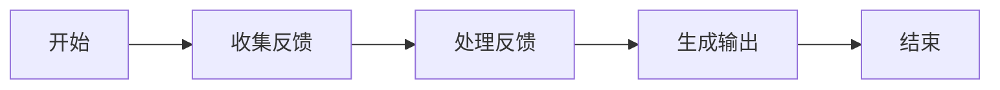
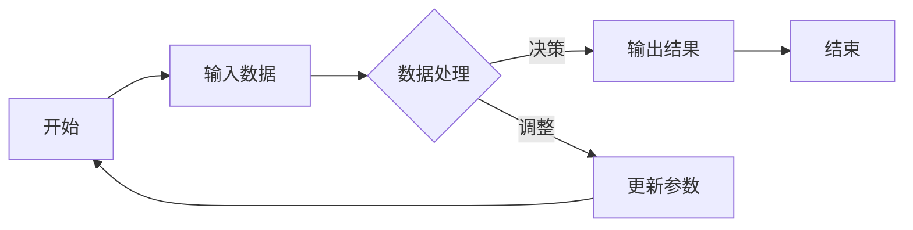

                 


### 第1章 引言：反馈循环的重要性

#### 1.1 问题背景

在当今高速发展的信息技术时代，系统的复杂性和变化速度前所未有。无论是软件开发、系统维护，还是产品迭代，都需要一个有效的机制来确保持续改进和优化。反馈循环，作为一种重要的机制，在这一过程中扮演着至关重要的角色。

##### 1.1.1 问题描述

在现代信息技术系统中，反馈循环的存在是基于以下几个关键问题：

- **质量改进**：如何在快速迭代的过程中保持和提升系统的质量？
- **用户满意度**：如何准确了解用户的需求和反馈，从而提高用户满意度？
- **效率优化**：如何在资源有限的情况下，实现系统运行效率的最大化？

##### 1.1.2 问题解决

传统的解决方案往往依赖于预定的计划和目标，但这种方法在面对复杂多变的环境时显得捉襟见肘。因此，引入反馈循环成为了一种必然的选择。通过不断的收集和分析反馈，系统能够实时调整和优化，从而实现持续改进。

##### 1.1.3 边界与外延

反馈循环不仅适用于技术系统，还广泛应用于管理、商业等领域。其核心在于通过一个闭合的循环机制，使得系统能够在动态环境中不断调整，达到最优状态。

##### 1.1.4 概念结构与核心要素组成

一个完整的反馈循环通常包含以下几个核心要素：

- **反馈源**：提供反馈信息的来源，如用户、系统内部监控等。
- **反馈接收者**：接收反馈信息，并对其进行处理的实体。
- **反馈处理机制**：对反馈信息进行分析、评估和处理的过程。
- **反馈输出**：处理后的反馈结果，用于指导系统的下一步行动。

#### 1.2 核心概念与联系

在深入探讨反馈循环之前，我们需要明确一些核心概念，并理解它们之间的联系。

##### 2.1 反馈循环的定义与特点

**反馈循环**，即在一个系统中，将系统的输出部分反馈回输入部分，从而影响系统的下一步行动。其特点如下：

- **闭合性**：反馈循环必须形成一个闭合环路，使得系统可以从输出中学习并优化输入。
- **实时性**：反馈循环需要快速响应，以适应动态变化的环境。
- **自适应**：系统能够根据反馈进行调整，以实现最优性能。

##### 2.2 反馈循环的主要组成部分

一个典型的反馈循环主要包括以下几个组成部分：

- **反馈源**：提供反馈信息的实体，如用户、传感器等。
- **反馈接收者**：接收并处理反馈信息的实体，如算法、人等。
- **反馈处理机制**：对反馈信息进行分析、评估和处理的机制。
- **反馈输出**：处理后的反馈结果，用于指导系统的下一步行动。

##### 2.3 核心概念属性特征对比表格

| 概念       | 特征1 | 特征2 | 特征3 |
|------------|-------|-------|-------|
| 反馈源     | 动态性 | 全面性 | 可测量性 |
| 反馈接收者 | 及时性 | 准确性 | 智能性 |
| 反馈处理机制 | 分析能力 | 适应能力 | 效率 |
| 反馈输出   | 可操作性 | 可视化 | 指导性 |

##### 2.4 ER实体关系图架构

```mermaid
erDiagram
    FeedSource ||--|{ 反馈接收者 }|| Recipient
    FeedSource ||--|{ 反馈处理机制 }|| ProcessingMechanism
    Recipient ||--|{ 反馈输出 }|| Output
```

通过上述的背景介绍和概念阐述，我们可以清楚地看到反馈循环在信息技术系统中的重要性。在接下来的章节中，我们将深入探讨反馈循环的原理、算法模型以及在企业中的应用，帮助读者全面理解和应用这一重要的机制。让我们一起深入探讨反馈循环的魅力和潜力吧！

### 第2章 核心概念与联系

#### 2.1 反馈循环的定义与特点

**反馈循环**，即在系统中，将系统的输出部分反馈回输入部分，从而影响系统的下一步行动。反馈循环是一种动态调整机制，能够使系统在动态环境中实现持续优化。

##### 2.1.1 反馈循环的概念

反馈循环是一种闭环系统，通过不断收集和分析输出，将结果反馈到输入端，从而影响系统的下一步操作。其基本流程包括以下四个阶段：

1. **输入**：系统开始时接收初始输入。
2. **输出**：系统根据输入进行操作，产生输出结果。
3. **反馈**：将输出结果反馈回系统。
4. **调整**：系统根据反馈结果调整输入，以优化输出。

##### 2.1.2 反馈循环的特点

- **闭合性**：反馈循环必须形成一个闭合环路，使得系统能够从输出中学习并优化输入。
- **实时性**：反馈循环需要快速响应，以适应动态变化的环境。
- **自适应**：系统能够根据反馈进行调整，以实现最优性能。

##### 2.1.3 反馈循环与传统循环的区别

传统循环通常是一种开环系统，其输出不会反馈回输入端，因此无法实现自适应调整。而反馈循环则通过闭合环路实现自适应优化，具有更强的适应能力和鲁棒性。

#### 2.2 反馈循环的主要组成部分

一个典型的反馈循环主要包括以下几个组成部分：

- **反馈源**：提供反馈信息的实体，如用户、传感器等。
- **反馈接收者**：接收并处理反馈信息的实体，如算法、人等。
- **反馈处理机制**：对反馈信息进行分析、评估和处理的机制。
- **反馈输出**：处理后的反馈结果，用于指导系统的下一步行动。

##### 2.2.1 反馈源

反馈源是反馈循环的起点，负责收集系统的输出信息。常见的反馈源包括：

- **用户**：通过用户的使用行为、反馈意见等收集反馈信息。
- **传感器**：通过传感器采集系统的运行数据，如温度、压力等。
- **监控系统**：实时监控系统性能指标，如响应时间、吞吐量等。

##### 2.2.2 反馈接收者

反馈接收者是反馈循环的核心部分，负责接收、处理和响应反馈信息。常见的反馈接收者包括：

- **算法**：通过机器学习、统计分析等方法处理反馈信息，进行模型训练和优化。
- **人**：专业人员对反馈信息进行分析和评估，提出改进建议。

##### 2.2.3 反馈处理机制

反馈处理机制是反馈循环的关键环节，负责对反馈信息进行分析、评估和转换。常见的反馈处理机制包括：

- **数据分析**：通过统计分析和数据挖掘方法，识别反馈信息中的关键指标和趋势。
- **机器学习**：利用机器学习算法，对反馈信息进行训练和预测，优化系统性能。
- **优化算法**：根据反馈信息调整系统参数，实现系统优化。

##### 2.2.4 反馈输出

反馈输出是反馈循环的最终结果，用于指导系统的下一步行动。常见的反馈输出包括：

- **改进建议**：根据反馈信息提出系统优化方案，提高系统性能。
- **决策**：基于反馈信息进行决策，调整系统运行策略。

#### 2.3 核心概念属性特征对比表格

| 概念       | 特征1 | 特征2 | 特征3 |
|------------|-------|-------|-------|
| 反馈源     | 动态性 | 全面性 | 可测量性 |
| 反馈接收者 | 及时性 | 准确性 | 智能性 |
| 反馈处理机制 | 分析能力 | 适应能力 | 效率 |
| 反馈输出   | 可操作性 | 可视化 | 指导性 |

#### 2.4 ER实体关系图架构

```mermaid
erDiagram
    FeedSource ||--|{ 反馈接收者 }|| Recipient
    FeedSource ||--|{ 反馈处理机制 }|| ProcessingMechanism
    Recipient ||--|{ 反馈输出 }|| Output
```

通过上述对反馈循环核心概念的阐述，我们可以更加清晰地理解其工作原理和组成部分。在接下来的章节中，我们将进一步探讨反馈循环的算法原理、数学模型以及在实际应用中的具体案例。让我们继续深入探讨反馈循环的奥秘吧！

### 第3章 反馈循环的算法原理与数学模型

在理解了反馈循环的核心概念和组成部分后，我们需要进一步探讨其算法原理和数学模型。这将帮助我们更好地理解反馈循环的工作机制，并在实际应用中对其进行优化。

#### 3.1 算法原理讲解

反馈循环的算法原理可以概括为以下几个步骤：

1. **输入阶段**：系统接收初始输入，这些输入可以是各种形式的数据，如用户操作、系统指标等。
2. **输出阶段**：系统根据输入数据进行处理，产生输出结果。这些输出结果反映了系统的当前状态或性能。
3. **反馈阶段**：将输出结果反馈回系统，作为下一次输入的一部分。反馈可以是具体的数值、评价或建议。
4. **调整阶段**：系统根据反馈结果进行调整，以优化下一次的输出。这个调整可以是参数的调整、策略的改变或输入数据的优化。

##### 3.1.1 反馈循环的基本算法流程

反馈循环的基本算法流程可以用以下mermaid流程图表示：



在这个流程图中，A表示输入阶段，B表示收集反馈，C表示处理反馈，D表示生成输出，E表示结束。

##### 3.1.2 算法mermaid流程图



在这个改进的流程图中，我们加入了数据处理阶段和调整阶段，以更全面地展示反馈循环的流程。

#### 3.2 反馈循环的数学模型与公式

反馈循环的数学模型可以帮助我们量化反馈对系统的影响，并理解其在系统优化中的应用。一个基本的反馈循环数学模型可以表示为：

$$
\text{反馈循环效果} = f(\text{输入}, \text{反馈})
$$

其中：

- **输入**：系统初始状态或当前状态。
- **反馈**：系统在运行过程中接收到的反馈信息。
- **$f$**：反馈函数，用于计算反馈对系统的影响。

##### 3.2.1 公式讲解

这个公式的含义是：系统的输出效果是由输入和反馈共同决定的。反馈函数$f$描述了输入和反馈之间的映射关系，它可以是线性的或非线性的。以下是一个简化的反馈函数示例：

$$
f(x, \Delta x) = x + k \cdot \Delta x
$$

其中：

- **$x$**：系统的当前状态。
- **$\Delta x$**：反馈信息。
- **$k$**：调整系数，表示反馈对系统状态的影响程度。

这个公式表示，系统状态的变化量$\Delta x$与反馈信息成正比，比例系数为$k$。当$k$大于0时，反馈将使系统状态向好的方向调整；当$k$小于0时，反馈将使系统状态向坏的方向调整。

##### 3.3 算法举例说明

为了更好地理解反馈循环的数学模型，我们来看一个具体的例子。

**例子1：温度控制系统**

假设我们有一个温度控制系统，其目标是保持室内温度在一个特定的范围内。系统的输入是室内外温差，输出是加热或冷却设备的开关状态。反馈是室内温度的实际值。

- **输入**：室内外温差$T_{in}$。
- **输出**：加热或冷却设备的开关状态$S_{out}$。
- **反馈**：室内温度$T_{actual}$。

系统的反馈函数可以表示为：

$$
T_{out} = T_{in} + k \cdot (T_{target} - T_{actual})
$$

其中：

- **$T_{out}$**：系统的输出温度。
- **$T_{target}$**：目标温度。
- **$k$**：调整系数，控制反馈对系统的影响。

当室内温度低于目标温度时，$T_{actual} - T_{target}$为负值，系统会开启加热设备；当室内温度高于目标温度时，$T_{actual} - T_{target}$为正值，系统会开启冷却设备。

**例子2：股票交易策略**

假设我们有一个股票交易系统，其目标是最大化投资回报。系统的输入是股票价格和交易信息，输出是买卖决策。反馈是实际的投资收益。

- **输入**：股票价格$P$、交易信息$I$。
- **输出**：买卖决策$D$。
- **反馈**：投资收益$R$。

系统的反馈函数可以表示为：

$$
R_{next} = P \cdot (1 + r) \cdot D - C \cdot D
$$

其中：

- **$R_{next}$**：下一次投资收益。
- **$r$**：股票价格的波动率。
- **$C$**：交易成本。

系统会根据投资收益的反馈结果，调整买卖策略，以最大化投资回报。

通过这些例子，我们可以看到反馈循环在系统优化中的应用。反馈函数的设计和调整是反馈循环的核心，它决定了系统对反馈的响应方式和调整效果。

#### 3.3 算法举例说明

为了更好地理解反馈循环的数学模型，我们来看一个具体的例子。

**例子1：温度控制系统**

假设我们有一个温度控制系统，其目标是保持室内温度在一个特定的范围内。系统的输入是室内外温差，输出是加热或冷却设备的开关状态。反馈是室内温度的实际值。

- **输入**：室内外温差$T_{in}$。
- **输出**：加热或冷却设备的开关状态$S_{out}$。
- **反馈**：室内温度$T_{actual}$。

系统的反馈函数可以表示为：

$$
T_{out} = T_{in} + k \cdot (T_{target} - T_{actual})
$$

其中：

- **$T_{out}$**：系统的输出温度。
- **$T_{target}$**：目标温度。
- **$k$**：调整系数，控制反馈对系统的影响。

当室内温度低于目标温度时，$T_{actual} - T_{target}$为负值，系统会开启加热设备；当室内温度高于目标温度时，$T_{actual} - T_{target}$为正值，系统会开启冷却设备。

**例子2：股票交易策略**

假设我们有一个股票交易系统，其目标是最大化投资回报。系统的输入是股票价格和交易信息，输出是买卖决策。反馈是实际的投资收益。

- **输入**：股票价格$P$、交易信息$I$。
- **输出**：买卖决策$D$。
- **反馈**：投资收益$R$。

系统的反馈函数可以表示为：

$$
R_{next} = P \cdot (1 + r) \cdot D - C \cdot D
$$

其中：

- **$R_{next}$**：下一次投资收益。
- **$r$**：股票价格的波动率。
- **$C$**：交易成本。

系统会根据投资收益的反馈结果，调整买卖策略，以最大化投资回报。

通过这些例子，我们可以看到反馈循环在系统优化中的应用。反馈函数的设计和调整是反馈循环的核心，它决定了系统对反馈的响应方式和调整效果。

### 第4章 反馈循环在企业中的应用

#### 4.1 企业中反馈循环的应用场景

反馈循环在企业中的应用场景非常广泛，几乎涵盖了企业的各个方面。以下是一些典型的应用场景：

##### 4.1.1 产品开发

在产品开发过程中，反馈循环可以帮助企业更好地理解用户需求，优化产品设计和功能。通过持续收集用户反馈，企业可以及时调整产品方向，避免开发出不符合市场需求的产品。

- **用户调研**：在产品开发的早期阶段，通过用户调研收集用户需求。
- **原型测试**：在产品开发过程中，制作原型并邀请用户测试，收集反馈。
- **迭代优化**：根据用户反馈，对产品进行迭代优化，提高用户体验。

##### 4.1.2 顾客服务

顾客服务是企业的核心业务之一，通过反馈循环，企业可以更好地了解顾客需求，提高服务质量和客户满意度。

- **售后服务**：收集顾客对售后服务的反馈，如响应时间、服务态度等。
- **在线客服**：通过在线客服系统收集用户反馈，及时解决问题。
- **客户满意度调查**：定期进行客户满意度调查，了解客户需求和满意度。

##### 4.1.3 运营优化

在运营过程中，反馈循环可以帮助企业发现运营中的问题，优化运营流程，提高运营效率。

- **数据分析**：通过数据分析，发现运营中的瓶颈和问题。
- **流程优化**：根据反馈结果，对运营流程进行优化，减少不必要的环节。
- **成本控制**：通过反馈循环，监控运营成本，及时发现并解决成本过高的问题。

#### 4.2 成功案例分析

以下是一些企业在反馈循环应用中的成功案例：

##### 4.2.1 案例一：互联网公司的产品迭代

某互联网公司通过引入反馈循环机制，大大提高了产品迭代速度和用户体验。公司采用了以下措施：

- **用户调研**：定期进行用户调研，了解用户需求和偏好。
- **原型测试**：开发原型产品，邀请用户进行测试，收集反馈。
- **敏捷开发**：采用敏捷开发模式，快速迭代，根据用户反馈进行优化。
- **数据分析**：通过数据分析，监控用户行为，了解产品使用情况。

通过这些措施，该公司的产品在市场上取得了巨大的成功，用户满意度显著提高。

##### 4.2.2 案例二：制造业的质量控制

某制造业企业通过建立反馈循环机制，实现了质量控制和管理优化。具体措施如下：

- **生产线监控**：通过传感器和监控系统，实时监控生产线上的各项指标。
- **质量反馈**：将监控数据反馈到质量控制部门，分析质量问题和改进措施。
- **持续改进**：根据质量反馈，对生产流程进行调整，提高产品质量。
- **数据分析**：通过数据分析，监控生产效率和成本，实现运营优化。

通过这些措施，该企业的产品质量得到了显著提升，生产效率也得到了大幅提高。

##### 4.2.3 案例总结

从上述案例中可以看出，反馈循环在企业中的应用效果非常显著。通过及时收集和分析反馈，企业可以快速识别问题并采取相应的改进措施，从而实现持续改进和优化。反馈循环不仅提高了产品质量和用户满意度，还优化了运营流程，提高了生产效率，为企业的发展注入了强大动力。

### 第5章 建立有效的反馈循环机制

在了解了反馈循环的重要性以及在企业中的应用之后，我们接下来将探讨如何建立有效的反馈循环机制。一个有效的反馈循环机制能够确保反馈的及时性、准确性和可操作性，从而帮助企业实现持续改进和优化。

#### 5.1 反馈循环机制的构建原则

为了建立有效的反馈循环机制，我们需要遵循以下原则：

##### 5.1.1 及时性

及时性是反馈循环的核心原则之一。只有及时收集和反馈信息，系统才能快速响应和调整，从而实现持续改进。为此，我们需要确保反馈机制的各个环节都能在短时间内完成。

- **数据采集**：确保数据采集系统的实时性和高效性，避免数据延迟。
- **反馈处理**：建立高效的反馈处理机制，确保反馈信息能够在最短时间内得到处理和分析。
- **反馈响应**：确保反馈结果能够及时传达给相关部门或人员，以便快速采取行动。

##### 5.1.2 全面性

全面性意味着反馈循环需要覆盖系统的各个层面和方面。只有全面收集和分析反馈信息，我们才能全面了解系统的运行状况，发现潜在问题并进行优化。

- **数据来源**：确保反馈来源的多样性，包括用户反馈、内部监控、行业趋势等。
- **反馈内容**：确保反馈内容的全面性，包括系统性能、用户满意度、成本效益等。
- **反馈分析**：对反馈信息进行多维度分析，从不同角度了解系统的运行状况。

##### 5.1.3 可操作性

可操作性是指反馈循环机制需要具备可操作性和实用性。只有可操作性强的反馈循环机制，才能在实际工作中得到有效应用，并产生实际效果。

- **反馈流程**：设计简洁明了的反馈流程，确保每个环节都能顺利进行。
- **反馈工具**：提供便捷的反馈工具，如在线问卷、反馈表单等，方便用户提交反馈。
- **反馈结果**：确保反馈结果能够被相关人员理解和执行，提供具体的改进建议和行动方案。

#### 5.2 反馈循环机制的实施步骤

建立有效的反馈循环机制需要一系列具体的实施步骤，以下是一个基本的实施步骤：

##### 5.2.1 确定反馈目标

首先，我们需要明确反馈循环的目标，即希望通过反馈循环实现什么结果。例如，提高产品质量、提升用户满意度、降低运营成本等。明确反馈目标有助于我们后续的设计和实施。

##### 5.2.2 设计反馈流程

在设计反馈流程时，我们需要考虑以下几个方面：

- **数据采集**：确定哪些数据需要收集，如何收集，以及收集的频率。
- **反馈处理**：确定反馈信息的处理流程，包括数据分析、评估和分类等。
- **反馈响应**：确定反馈结果的处理和响应机制，包括改进措施、执行跟踪等。

##### 5.2.3 建立反馈机制

建立反馈机制包括以下几个方面：

- **反馈工具**：选择合适的反馈工具，如在线问卷、反馈表单等，确保用户可以方便地提交反馈。
- **反馈渠道**：建立多渠道的反馈机制，如线上反馈、线下反馈等，确保反馈信息的全面性和准确性。
- **反馈反馈**：建立反馈的反馈机制，确保反馈结果的及时反馈和沟通。

##### 5.2.4 实施与监控

在建立反馈循环机制后，我们需要对其进行实施和监控：

- **实施**：按照设计好的反馈流程和机制，开始实际操作，确保各个环节的顺利进行。
- **监控**：监控反馈循环的实施情况，及时发现和解决问题，确保反馈机制的有效运行。
- **优化**：根据实施和监控结果，对反馈循环机制进行持续优化，提高其效果和效率。

通过以上步骤，我们可以逐步建立和优化反馈循环机制，实现系统的持续改进和优化。

### 第6章 反馈循环的挑战与解决方案

#### 6.1 反馈循环的挑战

尽管反馈循环在系统优化和改进中具有重要作用，但在实际应用中仍然面临一些挑战。

##### 6.1.1 反馈质量不高

反馈质量不高是反馈循环面临的第一个挑战。如果反馈信息不准确、不全面或不够及时，那么反馈循环的效果将会大打折扣。以下是一些可能导致反馈质量不高的问题：

- **数据收集不完整**：反馈信息来源于系统的各个层面，如果数据收集不完整，反馈信息将不全面。
- **数据延迟**：反馈信息的延迟会导致反馈循环无法及时响应，从而影响系统的调整和优化。
- **数据偏差**：反馈信息可能受到主观偏见或数据偏差的影响，导致反馈结果不准确。

##### 6.1.2 反馈延迟

反馈延迟是反馈循环面临的另一个挑战。及时性是反馈循环的关键原则之一，如果反馈延迟过长，那么系统将无法在最佳时机进行调整和优化。

- **处理延迟**：反馈信息的处理和分析可能需要一定时间，如果处理延迟过长，反馈将无法及时传达。
- **响应延迟**：即使反馈信息得到及时处理，如果响应延迟过长，系统的调整和优化将受到影响。

##### 6.1.3 反馈滥用

反馈滥用是指反馈循环被用于不正当的目的，如操纵数据、恶意攻击等。反馈滥用可能导致系统失去信任和可靠性，影响反馈循环的正常运行。

- **数据篡改**：有人可能故意篡改反馈数据，以获得不正当的利益。
- **恶意攻击**：有人可能利用反馈循环进行恶意攻击，如网络攻击、系统漏洞攻击等。

#### 6.2 解决方案

为了克服反馈循环面临的挑战，我们需要采取一系列解决方案。

##### 6.2.1 提高反馈质量

提高反馈质量是确保反馈循环有效性的关键。以下是一些提高反馈质量的措施：

- **数据完整性**：确保反馈信息来源的完整性，避免数据收集过程中的遗漏和错误。
- **数据验证**：对反馈数据进行验证，确保数据的准确性和可靠性。
- **数据标准化**：对反馈数据进行标准化处理，确保不同数据之间的可比性。

##### 6.2.2 减少反馈延迟

减少反馈延迟是提高反馈循环及时性的关键。以下是一些减少反馈延迟的措施：

- **实时数据处理**：采用实时数据处理技术，确保反馈信息的及时处理和分析。
- **优化反馈流程**：优化反馈流程，减少不必要的环节和处理时间。
- **自动化处理**：采用自动化处理技术，提高反馈信息的处理效率。

##### 6.2.3 防止反馈滥用

防止反馈滥用是确保反馈循环正常运行的重要措施。以下是一些防止反馈滥用的措施：

- **数据安全**：加强数据安全措施，防止数据被篡改或泄露。
- **透明度**：提高反馈流程的透明度，确保反馈信息的公开和公正。
- **监管机制**：建立监管机制，对反馈行为进行监控和审计，防止恶意攻击和滥用。

通过以上措施，我们可以有效地解决反馈循环面临的挑战，确保反馈循环的正常运行和有效性。

### 第7章 反馈循环的最佳实践与未来趋势

#### 7.1 最佳实践

在实际应用中，反馈循环已经得到了广泛的应用，并取得了一定的成果。以下是一些反馈循环的最佳实践：

##### 7.1.1 实践1：产品迭代

在产品开发过程中，通过用户调研、原型测试和数据分析，持续收集用户反馈，并根据反馈结果进行产品迭代。这种做法有助于提高产品的用户满意度，加快产品迭代速度。

##### 7.1.2 实践2：质量控制

在制造业中，通过生产线监控、质量反馈和持续改进，确保产品质量的稳定和提升。这种做法有助于降低生产成本，提高产品竞争力。

##### 7.1.3 实践3：运营优化

在运营过程中，通过数据分析、流程优化和成本控制，不断发现和解决问题，提高运营效率和效益。这种做法有助于企业实现可持续发展。

#### 7.2 未来趋势

随着信息技术的不断发展，反馈循环的应用场景将不断扩展，其发展趋势如下：

##### 7.2.1 人工智能在反馈循环中的应用

人工智能（AI）在反馈循环中的应用将越来越广泛。通过机器学习、深度学习等技术，可以对反馈信息进行更准确、更智能的分析和预测，从而优化系统的性能和效率。

##### 7.2.2 新兴技术在反馈循环中的作用

随着5G、物联网（IoT）等新兴技术的普及，反馈循环将具备更高的实时性和更全面的数据采集能力。这将有助于实现更高效、更精准的反馈循环，为系统的优化提供更强大的支持。

##### 7.2.3 反馈循环的发展方向

未来，反馈循环将朝着更智能化、更自动化的方向发展。通过结合大数据、云计算等技术，反馈循环将具备更强大的数据处理和分析能力，从而实现更高效、更精准的系统优化。

### 第8章 小结与展望

#### 8.1 本书小结

本书系统地介绍了反馈循环的概念、原理、应用和实践。通过深入探讨反馈循环的重要性、核心概念、算法模型以及在企业中的应用，我们了解了如何建立有效的反馈循环机制，并应对其中的挑战。同时，我们还展望了反馈循环的未来发展趋势。

#### 8.2 注意事项

在建立和实施反馈循环机制时，需要注意以下几点：

- 确保反馈信息的准确性和及时性。
- 设计简洁明了的反馈流程和机制。
- 充分利用先进的技术手段，提高反馈处理和分析的效率。
- 定期评估和优化反馈循环机制，确保其持续有效。

#### 8.3 拓展阅读

对于希望深入了解反馈循环的读者，以下书籍和资料可以作为拓展阅读：

- 《反馈循环：持续改进的智慧》
- 《人工智能：一种现代方法》
- 《机器学习：一种算法导论》
- 《精益思想：不断改进，持续创新》

#### 8.4 反馈循环的未来发展

随着信息技术的快速发展，反馈循环在各个领域的应用将越来越广泛。未来，反馈循环将与人工智能、大数据、物联网等新兴技术深度融合，实现更高效、更智能的系统优化。同时，反馈循环的理论和实践也将不断发展和完善，为人类社会的进步和发展做出更大的贡献。

### 作者信息

作者：AI天才研究院/AI Genius Institute & 禅与计算机程序设计艺术 /Zen And The Art of Computer Programming

---

在这篇技术博客文章中，我们系统地介绍了反馈循环的概念、原理和应用。通过深入探讨反馈循环的重要性、核心概念、算法模型以及在企业中的应用，我们了解了如何建立有效的反馈循环机制，并应对其中的挑战。同时，我们还展望了反馈循环的未来发展趋势。

文章首先介绍了反馈循环的核心概念和组成部分，包括反馈源、反馈接收者、反馈处理机制和反馈输出。接着，我们探讨了反馈循环的算法原理和数学模型，并通过具体例子展示了其应用场景。在案例分析部分，我们介绍了企业在反馈循环中的应用实践，包括产品迭代、质量控制、运营优化等。随后，我们提出了建立有效反馈循环机制的步骤和原则，并针对反馈循环面临的挑战提出了解决方案。

在最佳实践与未来趋势部分，我们分享了一些反馈循环的成功实践，并展望了其未来的发展方向。最后，文章进行了小结，并提供了拓展阅读资源。

通过这篇博客文章，读者可以全面了解反馈循环的概念、原理和应用，为在实际工作中建立和优化反馈循环机制提供指导。希望这篇文章能够对您在技术领域的发展有所帮助。

