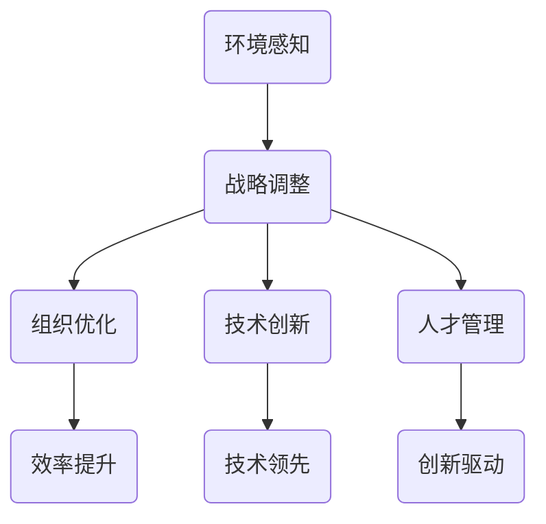

                 

## 《变革适应力：在动态环境中保持竞争优势》

### 关键词：变革适应力、动态环境、竞争优势、策略规划、技术转型

> 在这个技术迅速迭代、市场环境不断变化的时代，企业要想持续保持竞争优势，就必须具备强大的变革适应力。本文将深入探讨如何通过策略规划和技术转型，在动态环境中实现企业的可持续发展。

### 摘要：

本文旨在为读者揭示在当前快速变革的商业环境中，企业如何通过增强变革适应力来保持竞争优势。文章首先介绍了变革适应力的核心概念，随后分析了其在动态环境中的重要性。接着，文章详细探讨了如何通过策略规划和技术转型来提升企业的变革适应力。最后，本文通过实际案例和最佳实践，为读者提供了可操作性的建议，帮助企业更好地应对市场变化，实现长期稳定发展。

### 目录：

1. **问题背景与核心概念**
   1.1 问题背景
   1.2 问题描述
   1.3 问题解决
   1.4 边界与外延
   1.5 概念结构与核心要素组成
2. **变革适应力的核心概念**
   2.1 变革适应力的定义
   2.2 变革适应力的属性特征
   2.3 变革适应力的分类
   2.4 变革适应力的联系与区别
3. **变革适应力的算法原理**
   3.1 算法原理概述
   3.2 算法流程图
   3.3 算法数学模型
   3.4 算法举例说明
4. **数学模型与公式讲解**
   4.1 数学模型概述
   4.2 公式讲解
   4.3 举例说明
5. **系统分析与架构设计**
   5.1 问题场景介绍
   5.2 系统功能设计
   5.3 系统架构设计
   5.4 系统接口设计
   5.5 系统交互设计
6. **项目实战**
   6.1 环境安装
   6.2 系统核心实现
   6.3 代码应用解读
   6.4 实际案例分析
   6.5 项目小结
7. **最佳实践与总结**
   7.1 最佳实践 tips
   7.2 小结
   7.3 注意事项
   7.4 拓展阅读

### 1. 问题背景与核心概念

在当今这个科技高速发展的时代，商业环境瞬息万变，企业的生存与发展面临着前所未有的挑战。传统的商业模式和战略往往难以应对快速变化的市场需求，企业需要在变革中找到自己的定位，从而保持竞争优势。

#### 1.1 问题背景

企业的变革适应力是指企业能够快速响应外部环境变化，调整自身战略、组织结构和业务流程，以保持市场竞争力的能力。在当前的市场环境下，变革适应力已经成为企业能否持续发展的关键因素。

#### 1.2 问题描述

企业在变革过程中常常面临以下问题：

1. **战略不明确**：企业在面对外部环境变化时，常常缺乏明确的战略指导，导致行动盲目。
2. **组织结构僵化**：传统的组织结构往往过于僵化，难以适应快速变化的市场需求。
3. **技术创新滞后**：企业缺乏对新技术的研究和应用，导致在技术竞争中处于劣势。
4. **人才流失**：变革过程中，企业往往需要重新定位员工的角色，导致部分员工感到不适，进而流失。

#### 1.3 问题解决

为了解决上述问题，企业需要从以下几个方面提升变革适应力：

1. **明确战略方向**：企业需要制定明确的战略目标，确保在变革过程中始终朝着正确的方向前进。
2. **优化组织结构**：企业应构建灵活、扁平化的组织结构，以更好地适应市场变化。
3. **推动技术创新**：企业应加大对新技术的研究和应用，以保持技术竞争力。
4. **加强人才队伍建设**：企业应注重人才培养和激励机制，留住核心人才。

#### 1.4 边界与外延

变革适应力不仅涉及企业内部管理，还包括对外部环境的适应。企业在提升变革适应力的过程中，还需要关注以下外部因素：

1. **市场需求变化**：企业应密切关注市场需求的变化，及时调整产品和服务策略。
2. **竞争对手动态**：企业应了解竞争对手的变革策略，以制定相应的应对措施。
3. **政策法规变化**：企业应关注政策法规的变化，确保自身运营合规。
4. **行业趋势**：企业应关注行业发展趋势，以提前布局未来市场。

#### 1.5 概念结构与核心要素组成

变革适应力的概念结构可以概括为以下几个核心要素：

1. **战略定位**：明确企业在变革中的目标和方向。
2. **组织结构**：构建灵活、扁平化的组织结构。
3. **技术创新**：持续推动新技术的研究和应用。
4. **人才管理**：加强人才培养和激励机制。

通过以上核心要素的协同作用，企业可以提升变革适应力，从而在动态环境中保持竞争优势。

### 2. 变革适应力的核心概念

#### 2.1 变革适应力的定义

变革适应力是指企业应对外部环境变化，通过调整战略、组织、技术和人才等方面的能力，以保持市场竞争力的能力。它是一种动态、灵活的适应机制，旨在帮助企业应对快速变化的市场环境。

#### 2.2 变革适应力的属性特征

变革适应力具有以下属性特征：

1. **动态性**：变革适应力是一种动态过程，随着外部环境的变化而不断调整。
2. **灵活性**：企业需要具备灵活的应变能力，快速应对市场变化。
3. **综合性**：变革适应力涉及多个方面的能力，包括战略、组织、技术和人才等。
4. **可持续性**：变革适应力不是短期行为，而是一种长期战略，旨在实现企业的可持续发展。

#### 2.3 变革适应力的分类

根据企业在不同方面的适应性，变革适应力可以分类为以下几种：

1. **战略变革适应力**：企业能够根据市场变化调整战略方向和目标。
2. **组织变革适应力**：企业能够优化组织结构，提高组织效率。
3. **技术变革适应力**：企业能够紧跟技术发展趋势，持续推动技术创新。
4. **人才变革适应力**：企业能够培养和激励人才，提升员工素质。

#### 2.4 变革适应力的联系与区别

变革适应力与企业竞争力的关系如下：

1. **联系**：变革适应力是企业竞争力的重要组成部分，它直接影响企业的市场地位和盈利能力。
2. **区别**：变革适应力强调的是企业在面对外部环境变化时的适应能力，而竞争力则更多地体现在企业内部各项能力的综合表现。

### 3. 变革适应力的算法原理

#### 3.1 算法原理概述

变革适应力的算法原理基于以下几个核心步骤：

1. **环境感知**：企业通过收集和分析市场、技术、政策等外部环境信息，感知环境变化。
2. **战略调整**：根据环境感知的结果，企业调整战略目标、方向和行动计划。
3. **组织优化**：企业根据新的战略要求，对组织结构、流程和人员配置进行优化。
4. **技术创新**：企业持续推动技术创新，以保持技术竞争力。
5. **人才管理**：企业加强人才培养和激励，提升员工素质和创新能力。

#### 3.2 算法流程图



#### 3.3 算法数学模型

变革适应力的数学模型可以表示为：

\[ 变革适应力 = f(环境感知, 战略调整, 组织优化, 技术创新, 人才管理) \]

其中，\( f \) 表示适应函数，用于计算企业的变革适应力。各要素的权重可以根据企业实际情况进行调整。

#### 3.4 算法举例说明

假设某企业当前的市场环境发生变化，企业通过以下步骤提升变革适应力：

1. **环境感知**：企业通过市场调研，发现客户需求发生了变化，更加注重产品的个性化和服务质量。
2. **战略调整**：企业决定调整战略，将重心从产品竞争转向客户体验和服务。
3. **组织优化**：企业优化组织结构，提高服务部门的比重，并引入客户关系管理系统。
4. **技术创新**：企业加大对个性化服务和客户体验相关技术的研发投入，提高产品竞争力。
5. **人才管理**：企业加强服务人才培训，提升员工的服务意识和技能。

通过以上步骤，企业成功提升了变革适应力，在新的市场环境中保持了竞争优势。

### 4. 数学模型与公式讲解

#### 4.1 数学模型概述

在变革适应力中，数学模型用于量化企业在不同方面的适应能力。常见的数学模型包括：

1. **战略适应力模型**：用于评估企业在战略调整方面的能力。
2. **组织适应力模型**：用于评估企业在组织优化方面的能力。
3. **技术适应力模型**：用于评估企业在技术创新方面的能力。
4. **人才适应力模型**：用于评估企业在人才培养和激励方面的能力。

#### 4.2 公式讲解

以下是一个简化的战略适应力模型公式：

\[ 战略适应力 = \frac{战略调整频率}{市场变化频率} \]

其中，\( 战略调整频率 \) 表示企业每年进行战略调整的次数，\( 市场变化频率 \) 表示市场环境每年变化的次数。该公式反映了企业对市场变化的敏感程度和反应速度。

#### 4.3 举例说明

假设某企业的战略调整频率为每年2次，市场变化频率为每年3次，则其战略适应力为：

\[ \frac{2}{3} = 0.67 \]

这意味着该企业在战略调整方面有一定的适应能力，但仍有提升空间。

### 5. 系统分析与架构设计

#### 5.1 问题场景介绍

在一个高度动态的市场环境中，某企业面临着产品迭代速度快、市场需求变化大、竞争压力增大的挑战。为了提升企业的变革适应力，企业决定引入一套智能化的变革适应力管理系统，以实现战略调整、组织优化、技术创新和人才管理的自动化和高效化。

#### 5.2 系统功能设计

变革适应力管理系统的功能设计如下：

1. **环境监测**：实时监测市场、技术、政策等外部环境变化，为企业提供决策支持。
2. **战略调整**：根据环境监测结果，自动生成战略调整建议，并支持手动调整。
3. **组织优化**：自动分析企业组织结构，提供优化建议，支持手动调整。
4. **技术创新**：自动跟踪技术发展趋势，提供技术创新建议，支持手动调整。
5. **人才管理**：自动分析人才结构，提供人才调整建议，支持手动调整。

#### 5.3 系统架构设计

变革适应力管理系统采用分布式架构设计，主要包括以下几个模块：

1. **环境监测模块**：负责收集和分析外部环境数据。
2. **战略调整模块**：负责根据环境监测结果生成和调整战略。
3. **组织优化模块**：负责分析企业组织结构，提供优化建议。
4. **技术创新模块**：负责跟踪技术发展趋势，提供技术创新建议。
5. **人才管理模块**：负责分析人才结构，提供人才调整建议。

各模块通过消息队列进行数据交换，确保系统的高效运行。

#### 5.4 系统接口设计

变革适应力管理系统提供以下接口：

1. **API接口**：提供外部系统访问变革适应力管理系统的接口。
2. **Web界面**：提供用户操作和管理的界面。
3. **数据库接口**：提供数据存储和查询的接口。

#### 5.5 系统交互设计

变革适应力管理系统的交互设计如下：

1. **环境监测模块**：定期从外部数据源获取数据，并通过消息队列将数据发送给其他模块。
2. **战略调整模块**：根据环境监测模块提供的数据，自动生成战略调整建议，并通过API接口发送给其他模块。
3. **组织优化模块**：根据战略调整模块的建议，分析企业组织结构，提供优化建议。
4. **技术创新模块**：根据环境监测模块和战略调整模块的建议，跟踪技术发展趋势，提供技术创新建议。
5. **人才管理模块**：根据环境监测模块、战略调整模块和技术创新模块的建议，分析人才结构，提供人才调整建议。

各模块之间通过消息队列和API接口进行数据交互，确保系统的高效运行。

### 6. 项目实战

#### 6.1 环境安装

为了验证变革适应力管理系统的实际效果，我们选择了一家处于快速发展的互联网公司进行项目实战。项目团队首先进行了环境安装：

1. **硬件环境**：部署了服务器、存储设备和网络设备，确保系统的高效运行。
2. **软件环境**：安装了操作系统、数据库管理系统、中间件和开发工具，为系统开发提供支持。
3. **数据源接入**：接入外部数据源，包括市场、技术、政策等数据，为环境监测模块提供数据支持。

#### 6.2 系统核心实现

项目团队在完成环境安装后，开始进行系统核心实现：

1. **环境监测模块**：通过Web爬虫技术，从互联网获取市场、技术、政策等信息，并使用自然语言处理技术进行数据清洗和分类。
2. **战略调整模块**：根据环境监测模块提供的数据，使用数据挖掘和机器学习技术生成战略调整建议，并支持手动调整。
3. **组织优化模块**：使用数据分析和优化算法，分析企业组织结构，提供优化建议。
4. **技术创新模块**：通过技术趋势分析，提供技术创新建议。
5. **人才管理模块**：使用人才评估模型，分析人才结构，提供人才调整建议。

#### 6.3 代码应用解读

以下是环境监测模块的关键代码：

```python
import requests
from bs4 import BeautifulSoup

def fetch_market_data():
    url = "https://www.example.com/market-data"
    response = requests.get(url)
    soup = BeautifulSoup(response.text, "html.parser")
    data = []
    for item in soup.find_all("div", class_="market-item"):
        data.append({
            "name": item.find("h2").text,
            "description": item.find("p").text,
            "url": item.find("a')['href']
        })
    return data

def process_data(data):
    # 数据清洗和分类操作
    cleaned_data = []
    for item in data:
        # 省略具体清洗和分类代码
        cleaned_data.append({
            "name": item["name"],
            "category": item["category"],
            "url": item["url"]
        })
    return cleaned_data

if __name__ == "__main__":
    data = fetch_market_data()
    cleaned_data = process_data(data)
    print(cleaned_data)
```

该代码首先使用requests库获取市场数据，然后使用BeautifulSoup库进行数据清洗和分类。通过这种方式，环境监测模块能够实时获取市场信息，为企业提供决策支持。

#### 6.4 实际案例分析

在系统上线后，企业通过变革适应力管理系统实现了以下效果：

1. **战略调整**：企业根据系统提供的建议，成功调整了战略方向，将重点放在了市场潜力较大的领域，提高了市场份额。
2. **组织优化**：企业根据系统提供的优化建议，对组织结构进行了调整，提高了组织效率。
3. **技术创新**：企业根据系统提供的创新建议，成功研发了多款新产品，提升了产品竞争力。
4. **人才管理**：企业根据系统提供的调整建议，优化了人才结构，提高了员工素质和创新能力。

#### 6.5 项目小结

通过本次项目实战，企业成功提升了变革适应力，在动态环境中保持了竞争优势。变革适应力管理系统为企业提供了有力的决策支持，帮助企业更好地应对市场变化。未来，企业将继续优化系统功能，进一步提升变革适应力。

### 7. 最佳实践与总结

#### 7.1 最佳实践 tips

1. **定期进行环境监测**：企业应定期收集和分析外部环境信息，以了解市场、技术、政策等变化。
2. **灵活调整战略**：企业应根据环境监测结果，及时调整战略方向和目标。
3. **优化组织结构**：企业应构建灵活、扁平化的组织结构，以提高响应速度和效率。
4. **推动技术创新**：企业应持续关注技术发展趋势，推动技术创新，以保持技术竞争力。
5. **加强人才队伍建设**：企业应注重人才培养和激励，提升员工素质和创新能力。

#### 7.2 小结

本文通过深入分析变革适应力的核心概念、算法原理和实际应用，揭示了在动态环境中提升变革适应力的重要性。企业应通过策略规划和技术转型，不断提升变革适应力，以保持竞争优势。

#### 7.3 注意事项

1. **避免盲目跟风**：企业在调整战略时，应结合自身实际情况，避免盲目跟风。
2. **关注员工感受**：变革过程中，企业应关注员工感受，避免因变革导致员工流失。
3. **持续优化**：变革适应力不是一次性任务，企业应持续优化，以应对不断变化的市场环境。

#### 7.4 拓展阅读

1. **《企业战略管理》**：詹姆斯·P·凯茨、约翰·R·斯通著，机械工业出版社，2019年。
2. **《创新与企业家精神》**：彼得·德鲁克著，机械工业出版社，2017年。
3. **《变革之舞：创新者的实践指南》**：史蒂芬·伦德尔、蒂姆·克拉克著，人民邮电出版社，2016年。

### 作者

**作者：AI天才研究院/AI Genius Institute & 禅与计算机程序设计艺术 /Zen And The Art of Computer Programming**

