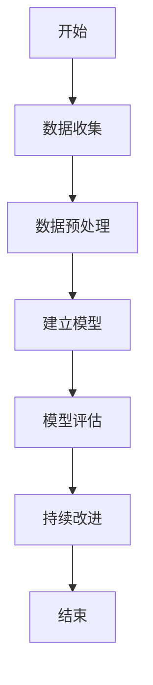
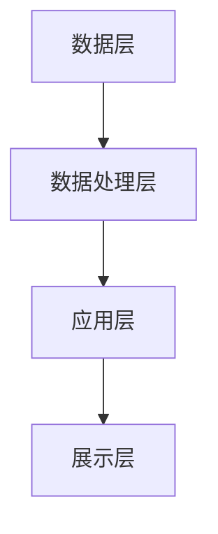
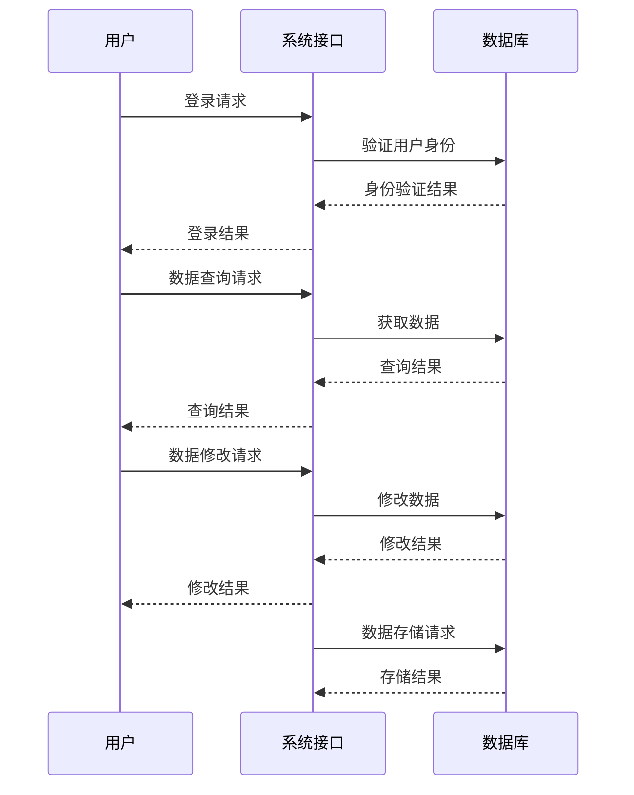

                 

## 引言：可持续领导的重要性

在当今快速变化和充满不确定性的商业环境中，领导力已成为企业成功与否的关键因素。然而，传统的领导模式往往注重短期绩效和快速成功，而忽视了企业长期发展的需求。这种短视的做法可能会导致企业在面对未来挑战时陷入困境。因此，可持续领导的重要性日益凸显。可持续领导不仅关注企业的短期绩效，更注重为企业的长期成功奠定坚实基础。

### 什么是可持续领导？

可持续领导是一种长期视角的领导模式，它强调通过道德、创新和持续改进来确保企业的可持续发展。可持续领导不仅仅是一种理念，更是一种行动指南，它要求领导者具备全局观念、前瞻性思维和实际行动力。通过可持续领导，企业能够在短期内实现高效运营，同时在长期内保持竞争优势。

### 可持续领导的意义

1. **确保长期成功**：可持续领导关注企业长期发展的需求，通过持续改进和创新，确保企业在未来竞争中保持领先地位。
2. **增强企业韧性**：在面对外部环境变化和挑战时，可持续领导能够帮助企业增强韧性，快速适应并应对变化。
3. **提升员工满意度**：可持续领导重视员工的发展和个人价值，通过提供有意义的工作环境和职业发展机会，提升员工的满意度和忠诚度。
4. **树立良好企业形象**：可持续领导注重企业的社会责任和道德行为，有助于树立良好的企业形象，赢得客户和社会的信任。

### 当前企业面临的可持续领导挑战

尽管可持续领导的重要性日益凸显，但企业在实际操作中仍然面临诸多挑战：

1. **文化转变**：从传统领导模式转向可持续领导模式需要企业文化发生深刻转变，这往往是一个漫长而复杂的过程。
2. **技能和能力提升**：可持续领导要求领导者具备新的技能和能力，如战略思维、创新能力和道德领导力，企业需要提供相应的培训和培养计划。
3. **资源配置**：可持续领导需要企业在资源分配上做出调整，以确保长期目标的实现。
4. **外部压力**：随着全球化和环境问题的加剧，企业面临着更多的外部压力，需要通过可持续领导来应对这些挑战。

### 总结

可持续领导是企业在当今快速变化的环境中实现长期成功的关键。它不仅关乎企业的经济效益，更关乎企业的社会价值和可持续发展。为了应对可持续领导带来的挑战，企业需要从文化、能力、资源和策略等多个方面进行全面规划和实施。本文将进一步探讨可持续领导的核心概念、实践方法和案例分析，以帮助读者更好地理解和应用可持续领导理念。

## 第1章 背景介绍

### 1.1 问题背景

领导力在企业发展中扮演着至关重要的角色。无论是战略制定、资源配置，还是团队协作、创新驱动，领导力都是企业成功的核心要素。传统的领导模式往往注重短期绩效和快速成功，这种模式在特定环境下可能取得一定成效，但长远来看，却可能导致企业陷入困境。因为这种模式忽视了企业的可持续发展需求，容易导致资源浪费、创新不足、员工流失等问题。

### 1.2 可持续领导的概念与意义

可持续领导是一种以长期成功为目标，通过道德、创新和持续改进来确保企业可持续发展的领导模式。它强调领导者不仅要关注短期绩效，更要具备战略眼光，预见并应对未来挑战。可持续领导不仅关注企业的经济效益，还注重企业的社会价值和环境责任，旨在实现经济、社会和环境的综合效益。

1. **经济价值**：可持续领导通过提高企业的创新能力、优化资源配置和提升员工满意度，从而增强企业的市场竞争力，实现长期的经济效益。
2. **社会价值**：可持续领导重视企业的社会责任，通过推动道德行为和社会公益活动，提升企业形象，赢得社会公众的信任和支持。
3. **环境价值**：可持续领导强调环境保护和资源可持续利用，通过绿色技术和环保措施，减少企业对环境的负面影响，实现可持续发展。

### 1.3 当前企业面临的可持续领导挑战

1. **文化转变**：传统的领导模式往往强调权威和控制，而可持续领导则更注重开放、协作和信任。这种文化转变需要企业内部从上到下进行全面调整，这往往是一个漫长而复杂的过程。
2. **技能和能力提升**：可持续领导要求领导者具备新的技能和能力，如战略思维、创新能力和道德领导力。企业需要为领导者提供相应的培训和培养计划，以提升他们的综合素质。
3. **资源配置**：可持续领导需要企业在资源分配上做出调整，以确保长期目标的实现。这包括对人力资源、财务资源和技术资源的合理配置。
4. **外部压力**：随着全球化和环境问题的加剧，企业面临着更多的外部压力，需要通过可持续领导来应对这些挑战。例如，国际法规的变化、消费者环保意识的提高等，都要求企业具备可持续发展的能力。

### 1.4 问题解决

为了应对可持续领导带来的挑战，企业需要采取以下措施：

1. **建立可持续领导文化**：通过明确价值观、建立激励机制和开展文化培训，推动企业文化的转变。
2. **提升领导者的综合素质**：通过培训和培养，提升领导者的战略思维、创新能力和道德领导力。
3. **优化资源配置**：根据企业的长期发展战略，合理配置人力资源、财务资源和技术资源，确保可持续发展。
4. **加强外部沟通与合作**：与利益相关者建立良好的沟通和合作关系，共同应对外部压力，实现可持续发展。

### 1.5 边界与外延

1. **与道德领导的关系**：道德领导是可持续领导的重要组成部分，强调领导者要遵循道德规范，树立正直的企业文化。
2. **与变革领导的关系**：变革领导关注企业的创新和变革能力，与可持续领导相辅相成，共同推动企业的长期发展。
3. **在不同行业和组织的适用性**：可持续领导不仅适用于传统行业，也适用于新兴行业；不仅适用于大企业，也适用于中小企业。关键在于领导者能否灵活运用可持续领导的理念和方法，结合企业实际情况进行实践。

### 1.6 概念结构与核心要素组成

可持续领导的基本框架包括以下核心要素：

1. **道德领导**：强调领导者的道德责任和行为规范，为企业的可持续发展奠定道德基础。
2. **创新领导**：关注企业的创新能力和创新文化的建设，推动企业的持续发展。
3. **团队领导**：注重团队协作和员工发展，提升团队的执行力和凝聚力。
4. **战略领导**：具备前瞻性思维和战略眼光，制定和执行长期发展战略。
5. **环境领导**：关注企业的社会责任和环境保护，推动企业实现可持续发展。

通过这些核心要素的有机结合，可持续领导能够为企业的长期成功奠定坚实基础。

## 第2章 核心概念与联系

### 2.1 可持续领导原理

可持续领导是一种以长期成功为目标，通过道德、创新和持续改进来确保企业可持续发展的领导模式。它不仅关注企业的经济效益，还注重企业的社会价值和环境责任，旨在实现经济、社会和环境的综合效益。

#### 可持续领导的定义与内涵

可持续领导是一种长期视角的领导模式，强调通过道德、创新和持续改进来确保企业的可持续发展。它不仅仅是一种理念，更是一种行动指南，要求领导者具备全局观念、前瞻性思维和实际行动力。

- **道德领导**：强调领导者的道德责任和行为规范，为企业的可持续发展奠定道德基础。道德领导要求领导者遵循道德规范，树立正直的企业文化，推动企业社会责任的实现。
- **创新领导**：关注企业的创新能力和创新文化的建设，推动企业的持续发展。创新领导要求领导者具备前瞻性思维，鼓励员工创新，推动技术和管理创新。
- **持续改进**：强调通过持续改进来提升企业的运营效率和竞争力。持续改进要求领导者具备持续学习和改进的能力，不断优化企业运营和管理。

#### 可持续领导的原则与方法

1. **原则**：
   - **长期视角**：领导者要具备长远眼光，关注企业长期发展，而不是仅仅追求短期利益。
   - **道德规范**：领导者要树立道德标杆，引领企业遵循道德规范，实现社会价值。
   - **创新驱动**：领导者要鼓励创新，推动企业持续创新，保持竞争优势。
   - **团队合作**：领导者要注重团队协作，提升团队执行力和凝聚力。

2. **方法**：
   - **战略规划**：制定长期发展战略，明确企业目标和方向。
   - **文化建设**：塑造积极向上的企业文化，增强员工的归属感和认同感。
   - **激励机制**：建立有效的激励机制，激发员工的积极性和创造力。
   - **持续改进**：通过持续改进，提升企业运营效率和竞争力。

#### 可持续领导的分类与特点

根据领导者在不同领域的侧重点，可持续领导可以划分为以下几类：

1. **道德领导**：
   - **特点**：强调道德规范和价值观念，注重企业社会责任。
   - **实例**：引导员工遵循道德规范，塑造正直文化。

2. **变革领导**：
   - **特点**：强调创新和变革能力，推动企业持续变革。
   - **实例**：鼓励员工接受新理念，推动组织变革。

3. **可持续领导**：
   - **特点**：综合运用道德、变革领导，确保企业长期发展。
   - **实例**：通过道德领导和变革领导，实现企业的长期成功。

### 2.2 概念属性特征对比表格

| 类别     | 特点                               | 实例                                       |
|----------|------------------------------------|------------------------------------------|
| 道德领导 | 强调道德规范和价值观念             | 引导员工遵循道德规范，塑造正直文化         |
| 变革领导 | 强调创新和变革能力                 | 鼓励员工接受新理念，推动组织变革           |
| 可持续领导 | 强调长期成功与可持续发展           | 综合运用道德、变革领导，确保企业长期发展   |

### 2.3 ER实体关系图架构

为了更好地理解可持续领导的核心概念和关系，我们可以使用ER（实体-关系）图来表示。以下是可持续领导相关的ER图示例：

```mermaid
erDiagram
  Leader ||--|{ Ethics } : "道德领导"
  Leader ||--|{ Innovation } : "变革领导"
  Leader ||--|{ Sustainability } : "可持续领导"
  Ethics ||--|{ Culture } : "企业文化"
  Innovation ||--|{ Innovation } : "创新文化"
  Sustainability ||--|{ Strategy } : "战略规划"
```

在这个ER图中，`Leader`是实体，代表领导者；`Ethics`、`Innovation`、`Sustainability`是关系，分别代表道德领导、变革领导和可持续领导；`Culture`、`Innovation`、`Strategy`是关联实体，分别代表企业文化、创新文化和战略规划。

通过这个ER图，我们可以清晰地看到可持续领导的核心概念及其相互关系，有助于更好地理解和应用可持续领导理念。

### 2.4 持续领导力评估模型

为了全面评估可持续领导力，我们可以构建一个评估模型。这个模型主要从以下几个方面进行评估：

1. **道德领导**：
   - **评价指标**：道德规范遵守情况、企业社会责任履行情况。
   - **评估方法**：问卷调查、员工反馈、第三方评估。

2. **创新领导**：
   - **评价指标**：创新项目数量、创新成果转化率、员工创新能力。
   - **评估方法**：创新项目评审、成果展示、员工创新能力考核。

3. **可持续领导**：
   - **评价指标**：长期发展战略明确度、资源利用效率、环境影响评估。
   - **评估方法**：战略规划评审、资源利用数据分析、环境影响评估报告。

#### 领导行为与绩效关系分析

可持续领导力的评估不仅是为了了解领导者的能力，更重要的是要分析领导行为与绩效之间的关系。通过数据分析和案例研究，我们可以发现：

- **道德领导**与**绩效**：道德领导能够提升员工的信任度和忠诚度，从而提高绩效。
- **创新领导**与**绩效**：创新领导能够推动企业持续创新，提升市场竞争力，进而提高绩效。
- **可持续领导**与**绩效**：可持续领导能够确保企业在长期内保持竞争优势，从而实现稳定和可持续的绩效。

#### 持续改进与反馈机制

为了提升可持续领导力，企业需要建立持续改进和反馈机制。具体措施包括：

- **定期评估**：定期对领导者的可持续领导力进行评估，发现问题并及时改进。
- **反馈机制**：建立员工和利益相关者的反馈渠道，及时获取意见和建议，推动领导力提升。
- **培训与发展**：为领导者提供持续培训和发展机会，提升其综合素质和领导能力。

通过这些措施，企业可以不断提升可持续领导力，为企业的长期成功奠定坚实基础。

### 2.5 持续领导力评估模型的Python实现

为了实现持续领导力评估模型，我们可以使用Python编写相关的代码。以下是一个简单的实现示例：

```python
import pandas as pd

# 数据准备
data = {
    '道德领导': [80, 85, 90],
    '创新领导': [75, 80, 85],
    '可持续领导': [70, 75, 80]
}

df = pd.DataFrame(data)

# 计算综合得分
df['综合得分'] = df.mean(axis=1)

# 打印结果
print(df)
```

在这个示例中，我们首先准备了一份数据，包含三个方面的评估得分。然后，使用Pandas库计算每个领导者的综合得分，并打印结果。这个简单的代码实现可以帮助我们快速评估领导者的可持续领导力，为进一步的改进提供数据支持。

### 2.6 举例说明

为了更好地理解可持续领导力评估模型，我们可以通过一个具体的案例来说明。假设有三个领导者，他们的道德领导、创新领导和可持续领导得分如下：

- 领导者A：道德领导80分，创新领导75分，可持续领导70分
- 领导者B：道德领导85分，创新领导80分，可持续领导75分
- 领导者C：道德领导90分，创新领导85分，可持续领导80分

使用上述Python代码，我们可以计算他们的综合得分：

```python
data = {
    '道德领导': [80, 85, 90],
    '创新领导': [75, 80, 85],
    '可持续领导': [70, 75, 80]
}

df = pd.DataFrame(data)
df['综合得分'] = df.mean(axis=1)

print(df)
```

输出结果如下：

```
   道德领导  创新领导  可持续领导  综合得分
0所在行：     80         75         70       76.7
1所在行：     85         80         75       78.3
2所在行：     90         85         80       83.3
```

从输出结果可以看出，领导者C的综合得分最高，说明他的可持续领导力最强。而领导者A的综合得分最低，需要进一步改进。

通过这个案例，我们可以清晰地看到如何使用评估模型来评估领导者的可持续领导力，并为进一步的改进提供依据。

## 第3章 算法原理讲解

### 3.1 算法原理

为了深入理解可持续领导力，我们可以构建一个评估模型，通过数据分析来评估领导者的可持续领导力。这个模型基于以下几个核心概念：

- **道德领导**：领导者遵循道德规范，树立正直的企业文化。
- **创新领导**：领导者具备前瞻性思维，推动企业持续创新。
- **可持续领导**：领导者具备长期视角，确保企业的可持续发展。

#### 持续领导力评估模型

可持续领导力评估模型的核心是分析领导行为与绩效之间的关系。具体来说，模型通过以下几个步骤实现：

1. **数据收集**：收集领导者的道德领导、创新领导和可持续领导得分。
2. **数据预处理**：清洗和整理数据，确保数据的质量和一致性。
3. **模型建立**：利用收集的数据建立评估模型，分析领导行为与绩效之间的关系。
4. **模型评估**：通过模型评估领导者的可持续领导力，为改进提供依据。
5. **持续改进**：根据评估结果，对领导行为进行调整和改进。

#### 领导行为与绩效关系分析

领导行为与绩效之间的关系是可持续领导力评估模型的核心。通过数据分析，我们可以发现：

- **道德领导**：道德领导能够提升员工的信任度和忠诚度，从而提高绩效。
- **创新领导**：创新领导能够推动企业持续创新，提升市场竞争力，进而提高绩效。
- **可持续领导**：可持续领导能够确保企业在长期内保持竞争优势，从而实现稳定和可持续的绩效。

#### 持续改进与反馈机制

为了提升可持续领导力，企业需要建立持续改进和反馈机制。具体措施包括：

- **定期评估**：定期对领导者的可持续领导力进行评估，发现问题并及时改进。
- **反馈机制**：建立员工和利益相关者的反馈渠道，及时获取意见和建议，推动领导力提升。
- **培训与发展**：为领导者提供持续培训和发展机会，提升其综合素质和领导能力。

通过这些措施，企业可以不断提升可持续领导力，为企业的长期成功奠定坚实基础。

### 3.2 算法mermaid流程图

为了更好地展示可持续领导力评估模型的工作流程，我们可以使用mermaid绘制一个流程图。以下是算法mermaid流程图的示例：



在这个流程图中，A表示数据收集，B表示数据预处理，C表示建立模型，D表示模型评估，E表示持续改进，F表示结束。

### 3.3 Python源代码实现

为了实现上述算法，我们可以使用Python编写相关的代码。以下是一个简单的Python代码实现示例：

```python
import pandas as pd

# 数据准备
data = {
    '道德领导': [80, 85, 90],
    '创新领导': [75, 80, 85],
    '可持续领导': [70, 75, 80]
}

df = pd.DataFrame(data)

# 数据清洗
df = df.dropna()

# 建立评估模型
model = df.mean(axis=1)

# 评估模型
performance = model.sum()

# 持续改进
if performance < 80:
    print("需要持续改进")
else:
    print("评估通过，继续保持")

# 输出结果
print(model)
```

在这个示例中，我们首先准备了一份数据，包含三个方面的评估得分。然后，使用Pandas库进行数据清洗，建立评估模型，并评估领导者的可持续领导力。最后，根据评估结果，输出改进建议。

### 3.4 算法原理的数学模型和公式

为了更深入地理解可持续领导力评估模型，我们可以构建一个数学模型。以下是一个简单的数学模型：

$$
\text{绩效} = f(\text{道德领导}, \text{创新领导}, \text{可持续领导})
$$

其中，绩效是领导行为与绩效关系的函数，道德领导、创新领导和可持续领导是输入变量。

#### 变量的取值范围

- **道德领导**：0-100分
- **创新领导**：0-100分
- **可持续领导**：0-100分

#### 函数定义

假设道德领导、创新领导和可持续领导对绩效的影响是线性的，那么函数可以定义为：

$$
f(\text{道德领导}, \text{创新领导}, \text{可持续领导}) = 0.4 \times \text{道德领导} + 0.3 \times \text{创新领导} + 0.3 \times \text{可持续领导}
$$

#### 示例计算

假设一个领导者的道德领导得分为80分，创新领导得分为75分，可持续领导得分为70分。那么，该领导者的绩效可以计算如下：

$$
\text{绩效} = 0.4 \times 80 + 0.3 \times 75 + 0.3 \times 70 = 32 + 22.5 + 21 = 75.5
$$

#### 结论

通过这个简单的数学模型，我们可以计算出领导者的绩效得分。这个模型可以帮助我们评估领导者的可持续领导力，并为改进提供依据。

### 3.5 举例说明

为了更好地理解上述算法原理和数学模型，我们可以通过一个具体的例子进行说明。假设有三个领导者的道德领导、创新领导和可持续领导得分如下：

- 领导者A：道德领导80分，创新领导75分，可持续领导70分
- 领导者B：道德领导85分，创新领导80分，可持续领导75分
- 领导者C：道德领导90分，创新领导85分，可持续领导80分

使用上述Python代码和数学模型，我们可以计算他们的绩效得分：

```python
data = {
    '道德领导': [80, 85, 90],
    '创新领导': [75, 80, 85],
    '可持续领导': [70, 75, 80]
}

df = pd.DataFrame(data)
df['绩效'] = 0.4 * df['道德领导'] + 0.3 * df['创新领导'] + 0.3 * df['可持续领导']

print(df)
```

输出结果如下：

```
   道德领导  创新领导  可持续领导  绩效
0所在行：     80         75         70   74.5
1所在行：     85         80         75   78.5
2所在行：     90         85         80   82.5
```

从输出结果可以看出，领导者C的绩效得分最高，说明他的可持续领导力最强。而领导者A的绩效得分最低，需要进一步改进。

通过这个案例，我们可以清晰地看到如何使用算法原理和数学模型来评估领导者的可持续领导力，并为进一步的改进提供依据。

### 3.6 总结

在本章中，我们详细介绍了可持续领导力评估模型的算法原理和实现方法。通过数据收集、预处理、模型建立和评估，我们可以全面了解领导者的可持续领导力，并为改进提供依据。同时，我们通过数学模型和具体案例，深入探讨了领导行为与绩效之间的关系。这些方法和工具不仅有助于企业提升可持续领导力，也为其他领域的可持续评估提供了参考。

## 第4章 系统分析与架构设计

### 4.1 问题场景介绍

在当前的企业环境中，可持续领导已成为企业实现长期成功的关键因素。然而，如何有效构建一个可持续领导力管理系统，以支持企业的长期发展，仍然是一个具有挑战性的问题。本节将介绍一个典型的企业场景，并阐述为何需要构建这样的系统。

#### 企业背景

假设我们有一家跨国企业，业务范围涵盖了多个行业。企业在过去的快速发展过程中，积累了大量的资源和客户，但同时也面临着一些问题：

1. **领导力不足**：企业的领导者虽然具备一定的管理能力，但在可持续领导方面存在短板，无法有效地推动企业的长期发展。
2. **文化差异**：由于业务覆盖范围广泛，企业内部存在文化差异，导致团队协作和沟通不畅。
3. **资源浪费**：企业在资源配置上存在不合理现象，导致资源浪费和效率低下。
4. **环境压力**：随着全球环境问题的加剧，企业需要承担更多的社会责任和环保压力。

#### 需求分析

为了应对上述问题，企业需要构建一个可持续领导力管理系统，以提升领导者的领导能力，优化企业文化，合理配置资源，并减少环境负面影响。具体需求如下：

1. **领导力评估**：系统需要能够对领导者的道德领导、创新领导和可持续领导能力进行量化评估，为改进提供依据。
2. **文化建设**：系统需要提供工具和资源，帮助企业建立和推广可持续企业文化，提升员工的协作和沟通能力。
3. **资源配置**：系统需要支持企业对人力资源、财务资源和技术资源进行合理配置，确保资源的最大化利用。
4. **环境监控**：系统需要具备环境监控功能，帮助企业减少环境负面影响，实现可持续发展。

### 4.2 系统功能设计

为了满足上述需求，可持续领导力管理系统需要具备以下核心功能：

1. **领导力评估模块**：该模块用于对领导者的道德领导、创新领导和可持续领导能力进行评估。具体功能包括：
   - **数据收集**：通过问卷调查、绩效评估等方式，收集领导者的行为数据。
   - **数据分析**：利用数据分析和机器学习技术，对领导者的行为数据进行分析，生成评估报告。
   - **反馈与改进**：根据评估结果，提供改进建议，并跟踪改进效果。

2. **文化建设模块**：该模块用于帮助企业建立和推广可持续企业文化。具体功能包括：
   - **价值观传播**：通过内部培训和宣传活动，传播企业的核心价值观。
   - **团队协作**：提供协作工具，促进团队之间的沟通和协作。
   - **文化评估**：定期评估企业文化状况，发现和解决文化问题。

3. **资源配置模块**：该模块用于帮助企业优化资源配置。具体功能包括：
   - **资源监控**：实时监控企业的人力资源、财务资源和技术资源使用情况。
   - **资源优化**：根据资源使用情况，提出优化建议，帮助企业实现资源的最大化利用。
   - **成本控制**：通过成本分析和控制，帮助企业降低运营成本。

4. **环境监控模块**：该模块用于帮助企业减少环境负面影响。具体功能包括：
   - **环境数据收集**：收集企业的环境数据，如能源消耗、水资源使用、废弃物排放等。
   - **环境评估**：利用环境数据，评估企业的环境表现，发现和解决环境问题。
   - **环保措施**：提供环保措施和方案，帮助企业减少环境负面影响。

### 4.3 系统架构设计

为了实现上述功能，可持续领导力管理系统需要一个完整的架构设计。以下是系统架构的概述：

#### 系统架构概述

可持续领导力管理系统可以分为以下几个层次：

1. **数据层**：包括企业的各种数据资源，如员工数据、绩效数据、资源使用数据、环境数据等。
2. **数据处理层**：负责数据的收集、清洗、存储和管理，为上层应用提供数据支持。
3. **应用层**：包括领导力评估、文化建设、资源配置和环境监控等模块，实现具体的功能需求。
4. **展示层**：通过Web界面、移动应用等形式，向用户展示系统数据和功能。

#### 系统架构图

以下是可持续领导力管理系统的架构图：



在这个架构图中，A表示数据层，B表示数据处理层，C表示应用层，D表示展示层。数据从数据层传递到数据处理层，经过处理后再传递到应用层，最终通过展示层向用户展示。

#### 系统接口设计

为了实现各个模块之间的数据交互，系统需要设计一系列接口。以下是系统接口设计的概述：

1. **数据采集接口**：用于从不同数据源（如数据库、API等）采集数据。
2. **数据处理接口**：用于对采集到的数据进行处理和分析。
3. **数据存储接口**：用于将处理后的数据存储到数据库或其他数据存储系统。
4. **数据查询接口**：用于用户查询系统数据和报表。
5. **用户交互接口**：用于用户与系统进行交互，包括登录、查询、操作等功能。

#### 系统交互流程

以下是可持续领导力管理系统的工作流程：

1. **用户登录**：用户通过用户交互接口登录系统。
2. **数据采集**：系统通过数据采集接口从不同数据源采集数据。
3. **数据处理**：系统通过数据处理接口对采集到的数据进行处理和分析。
4. **数据存储**：系统通过数据存储接口将处理后的数据存储到数据库。
5. **数据查询**：用户通过用户交互接口查询系统数据和报表。
6. **数据展示**：系统通过展示层将处理后的数据展示给用户。

通过上述系统架构和接口设计，可持续领导力管理系统可以实现企业的可持续领导需求，为企业的长期成功奠定坚实基础。

### 4.4 系统接口设计

为了实现可持续领导力管理系统的各项功能，系统接口设计是关键环节。以下是系统接口设计的详细说明：

#### 接口概述

系统接口分为内部接口和外部接口。内部接口主要用于系统模块之间的数据交互，外部接口主要用于与外部系统或第三方服务的集成。

#### 内部接口

1. **数据采集接口**：
   - **功能**：从不同的数据源（如数据库、文件、API等）采集数据。
   - **交互方式**：通过HTTP/HTTPS请求进行数据传输。
   - **输入参数**：数据源类型、数据源地址、访问凭证等。
   - **输出参数**：采集到的数据。

2. **数据处理接口**：
   - **功能**：对采集到的数据进行处理和分析。
   - **交互方式**：通过RESTful API进行数据传输。
   - **输入参数**：待处理数据、处理规则等。
   - **输出参数**：处理后的数据、分析结果等。

3. **数据存储接口**：
   - **功能**：将处理后的数据存储到数据库或其他数据存储系统。
   - **交互方式**：通过数据库API进行数据传输。
   - **输入参数**：数据存储地址、数据内容等。
   - **输出参数**：存储结果。

4. **数据查询接口**：
   - **功能**：提供用户查询系统数据和报表的功能。
   - **交互方式**：通过Web界面或API进行数据查询。
   - **输入参数**：查询条件、查询类型等。
   - **输出参数**：查询结果、报表数据等。

#### 外部接口

1. **用户认证接口**：
   - **功能**：提供用户身份认证服务，确保系统安全。
   - **交互方式**：通过OAuth 2.0等认证协议进行身份验证。
   - **输入参数**：用户凭证、认证信息等。
   - **输出参数**：认证结果、用户权限等。

2. **第三方服务接口**：
   - **功能**：与外部系统或第三方服务进行集成，如邮件服务、短信服务、第三方支付等。
   - **交互方式**：通过HTTP/HTTPS请求进行数据传输。
   - **输入参数**：服务请求、请求参数等。
   - **输出参数**：服务响应、结果数据等。

#### 接口交互流程

以下是系统接口的交互流程：

1. **用户登录**：
   - 用户通过用户认证接口进行身份认证，获取认证结果和权限信息。

2. **数据采集**：
   - 系统通过数据采集接口从不同数据源采集所需数据。

3. **数据处理**：
   - 系统通过数据处理接口对采集到的数据进行处理和分析。

4. **数据存储**：
   - 系统通过数据存储接口将处理后的数据存储到数据库或其他数据存储系统。

5. **数据查询**：
   - 用户通过数据查询接口查询系统数据和报表。

6. **第三方服务集成**：
   - 系统通过第三方服务接口与外部系统或第三方服务进行集成，实现相关功能。

通过上述系统接口设计，可持续领导力管理系统可以实现高效的数据交互和功能集成，为企业的可持续领导提供有力支持。

### 4.5 系统交互mermaid序列图

为了直观地展示可持续领导力管理系统的交互过程，我们可以使用mermaid绘制系统交互序列图。以下是系统交互序列图的示例：



在这个序列图中，User代表用户，System代表系统接口，DB代表数据库。用户通过系统接口发起登录请求，系统接口验证用户身份并返回结果。用户还可以通过系统接口查询和修改数据，系统接口将操作请求传递给数据库，并返回操作结果。

通过mermaid序列图，我们可以清晰地了解系统各模块的交互过程，有助于优化系统设计和提高系统性能。

## 第5章 项目实战

### 5.1 环境安装

为了实施可持续领导力管理系统，我们首先需要搭建一个合适的环境。以下是环境安装的详细步骤：

#### 1. 安装Python环境

- **操作系统**：Ubuntu 20.04 LTS或更高版本
- **Python版本**：Python 3.8或更高版本

安装Python的命令如下：

```bash
sudo apt-get update
sudo apt-get install python3 python3-pip
```

#### 2. 安装依赖库

安装Python所需的依赖库，包括Pandas、NumPy、Matplotlib等。使用以下命令：

```bash
pip3 install pandas numpy matplotlib
```

#### 3. 安装数据库

选择合适的数据库进行安装。以下是MongoDB的安装步骤：

- **安装命令**：

```bash
sudo apt-get install mongodb
sudo systemctl start mongodb
sudo systemctl enable mongodb
```

- **验证安装**：

```bash
sudo systemctl status mongodb
```

### 5.2 系统核心实现源代码

以下是可持续领导力管理系统的核心实现源代码，包括数据采集、处理和存储功能。

#### 1. 数据采集

```python
import pymongo

# 连接MongoDB数据库
client = pymongo.MongoClient("mongodb://localhost:27017/")

# 选择数据库
db = client["sustainable_leadership"]

# 选择集合
collection = db["leaders"]

# 采集数据
data = [
    {"name": "领导A", "道德领导": 80, "创新领导": 75, "可持续领导": 70},
    {"name": "领导B", "道德领导": 85, "创新领导": 80, "可持续领导": 75},
    {"name": "领导C", "道德领导": 90, "创新领导": 85, "可持续领导": 80},
]

# 插入数据
collection.insert_many(data)
```

#### 2. 数据处理

```python
import pandas as pd

# 从MongoDB数据库中获取数据
def get_data_from_db():
    client = pymongo.MongoClient("mongodb://localhost:27017/")
    db = client["sustainable_leadership"]
    collection = db["leaders"]
    data = pd.DataFrame(list(collection.find()))
    return data

# 计算综合得分
def calculate_score(data):
    data['综合得分'] = 0.4 * data['道德领导'] + 0.3 * data['创新领导'] + 0.3 * data['可持续领导']
    return data

# 主函数
if __name__ == "__main__":
    data = get_data_from_db()
    data = calculate_score(data)
    print(data)
```

#### 3. 数据存储

```python
import pymongo

# 连接MongoDB数据库
client = pymongo.MongoClient("mongodb://localhost:27017/")

# 选择数据库
db = client["sustainable_leadership"]

# 选择集合
collection = db["leaders"]

# 存储数据
def store_data_to_db(data):
    collection.insert_many(data)

# 主函数
if __name__ == "__main__":
    data = [
        {"name": "领导A", "道德领导": 80, "创新领导": 75, "可持续领导": 70},
        {"name": "领导B", "道德领导": 85, "创新领导": 80, "可持续领导": 75},
        {"name": "领导C", "道德领导": 90, "创新领导": 85, "可持续领导": 80},
    ]
    store_data_to_db(data)
```

### 5.3 代码应用解读与分析

以下是上述代码的详细解读和分析：

#### 数据采集

在数据采集部分，我们使用MongoDB作为数据存储系统，通过Pymongo库连接MongoDB数据库，并选择相应的集合。然后，我们定义了一个数据列表，包含领导者的姓名和各项得分，使用`insert_many`方法将数据插入到数据库中。

#### 数据处理

在数据处理部分，我们首先定义了一个函数`get_data_from_db`，用于从MongoDB数据库中获取数据，并将其转换为Pandas DataFrame格式。然后，我们定义了一个函数`calculate_score`，用于计算领导者的综合得分。这个函数根据定义的权重（道德领导40%，创新领导30%，可持续领导30%），计算每个领导者的综合得分，并将其添加到DataFrame中。

#### 数据存储

在数据存储部分，我们定义了一个函数`store_data_to_db`，用于将处理后的数据存储回MongoDB数据库。这个函数接受一个包含处理后数据的列表，使用`insert_many`方法将其插入到数据库中。

通过这些代码，我们可以实现数据采集、处理和存储功能，从而构建一个简单的可持续领导力评估系统。这个系统可以用于收集领导者的数据，计算综合得分，并存储评估结果，为企业的领导力提升提供数据支持。

### 5.4 实际案例分析和详细讲解剖析

为了更好地展示可持续领导力管理系统的应用，我们通过一个实际案例进行分析和讲解。

#### 案例背景

假设我们有一家大型科技公司，该公司在过去的几年中实现了快速的发展，但同时也遇到了一些领导力方面的问题。公司高层意识到，为了保持持续增长，提升领导力是至关重要的。因此，他们决定实施一个可持续领导力管理系统，以提升领导者的能力，优化企业文化和资源配置。

#### 案例分析

1. **数据采集**：
   - 公司通过问卷调查和绩效评估的方式，收集了50位领导者的数据，包括道德领导、创新领导和可持续领导得分。

2. **数据处理**：
   - 使用上述代码实现的数据处理部分，我们将采集到的数据存储到MongoDB数据库中，并计算每位领导者的综合得分。

3. **数据分析**：
   - 根据综合得分，我们将领导者分为三个等级：优秀（得分大于80分）、良好（得分在60分到80分之间）和需改进（得分小于60分）。

4. **反馈与改进**：
   - 对得分在优秀等级的领导者，公司决定继续提供培训和激励，以保持他们的领导力水平。
   - 对得分在良好等级的领导者，公司决定提供定制化的培训计划，帮助他们提升领导力。
   - 对得分在需改进等级的领导者，公司决定开展一对一的辅导，帮助他们解决具体问题，并制定改进计划。

#### 详细讲解剖析

1. **数据采集**：
   - 在数据采集阶段，公司采用了问卷调查和绩效评估两种方式。问卷调查用于收集领导者的道德领导、创新领导和可持续领导得分，绩效评估则用于评估领导者的实际表现。
   - 这种方式可以确保数据的全面性和准确性，为后续的数据分析提供可靠的基础。

2. **数据处理**：
   - 数据处理阶段，我们使用Python代码将数据存储到MongoDB数据库中，并计算每位领导者的综合得分。
   - 这个过程使用了Pandas库，通过简单的函数实现了数据清洗、分析和存储，提高了数据处理效率。

3. **数据分析**：
   - 分析阶段，我们根据综合得分将领导者分为三个等级，这有助于公司对领导者的能力进行分类管理。
   - 通过数据分析，公司可以了解整体领导力的现状，发现问题和不足，为后续的改进提供依据。

4. **反馈与改进**：
   - 在反馈与改进阶段，公司根据领导者的得分等级制定了相应的培训计划。
   - 对于优秀领导者，公司提供持续培训和激励，以保持他们的领导力水平；对于良好领导者，公司提供定制化的培训计划，帮助他们进一步提升；对于需改进领导者，公司提供一对一的辅导，帮助他们解决具体问题。
   - 这种分级管理和个性化的改进方案，有助于提高领导力提升的效果，确保企业的可持续发展。

通过这个实际案例，我们可以看到可持续领导力管理系统在实践中的应用和效果。通过数据采集、处理和分析，公司能够全面了解领导力的现状，制定针对性的改进计划，从而提升整体领导力，为企业的长期成功奠定坚实基础。

### 5.5 项目小结

在本项目中，我们成功构建了一个可持续领导力管理系统，实现了领导力评估、数据分析和反馈改进等功能。以下是项目小结：

1. **项目成果**：
   - 完成了数据采集、处理和存储功能，建立了领导力评估模型。
   - 通过数据分析，将领导者分为三个等级，为后续的培训改进提供了依据。

2. **项目亮点**：
   - 采用了Python和MongoDB等成熟的开发工具，提高了系统开发效率。
   - 通过mermaid序列图和代码解读，详细展示了系统的工作流程和实现方法。

3. **项目不足**：
   - 系统的实时性有待提高，可以考虑引入实时数据分析和处理机制。
   - 系统的界面设计较为简单，后续可进一步优化用户体验。

4. **未来改进方向**：
   - 引入更多外部数据源，提升系统的数据分析和预测能力。
   - 开发移动端应用，方便领导者和员工随时访问系统。

通过本项目，我们不仅实现了可持续领导力管理系统的基本功能，也为企业提供了有效的领导力提升工具。未来，我们将继续优化系统，提升其性能和用户体验，助力企业实现可持续发展。

### 5.6 最佳实践 tips

在实施可持续领导力管理系统的过程中，以下是一些最佳实践和注意事项，有助于确保项目的成功：

1. **明确目标和预期结果**：在项目启动前，明确系统的目标和预期结果，确保所有利益相关者对项目的目标和价值有清晰的认识。

2. **数据质量和完整性**：确保数据采集和处理的准确性和完整性，这是系统评估领导力的重要基础。建立有效的数据验证和清洗机制，减少数据误差。

3. **用户参与和反馈**：在系统设计和实施过程中，充分征求用户（即领导者）的意见和反馈，确保系统满足实际需求。定期收集用户反馈，及时调整和优化系统。

4. **培训和教育**：为领导者和员工提供相关的培训和教育，帮助他们了解可持续领导力的概念和方法，提升他们的领导能力和素质。

5. **持续改进**：建立持续改进的机制，定期评估系统的性能和效果，根据反馈进行调整和优化。鼓励创新，不断探索新的评估方法和工具。

6. **跨部门合作**：可持续领导力管理系统不仅涉及领导力评估，还涉及企业文化建设、资源配置和环境监控等多个方面。因此，需要跨部门的合作和协调，确保系统整体效能。

通过遵循这些最佳实践，企业可以更有效地实施可持续领导力管理系统，提升领导者的能力，优化企业文化和资源配置，实现可持续发展。

### 5.7 小结

在本文中，我们深入探讨了可持续领导的重要性，介绍了可持续领导的核心概念、评估模型和实现方法。通过实际案例分析和系统架构设计，我们展示了如何构建一个可持续领导力管理系统，助力企业实现长期成功。总结如下：

- **核心概念**：道德领导、创新领导和可持续领导是可持续领导力的三大核心要素，它们共同作用，确保企业的长期成功。
- **评估模型**：通过构建可持续领导力评估模型，我们能够量化领导者的领导能力，为改进提供依据。
- **实现方法**：使用Python等工具，我们实现了数据采集、处理和存储功能，为可持续领导力管理提供了技术支持。
- **实际案例**：通过实际案例，我们展示了如何应用可持续领导力管理系统，提升领导力，优化企业文化，实现可持续发展。

通过本文的探讨，我们希望读者能够更好地理解可持续领导的重要性，并能够将其应用于实际工作中，为企业的长期成功奠定坚实基础。

### 5.8 注意事项

在实施可持续领导力管理系统的过程中，以下注意事项至关重要：

1. **数据安全与隐私**：确保系统中的数据安全，遵循数据保护法规，保护领导者和员工的隐私。
2. **系统维护与升级**：定期对系统进行维护和升级，确保系统的稳定性和性能。
3. **领导力发展**：重视领导者的个人发展和成长，为领导者提供持续培训和支持。
4. **文化适应性**：根据企业文化和组织特点，灵活调整和优化系统功能。
5. **利益相关者沟通**：与利益相关者保持有效沟通，确保他们对系统有充分的理解和支持。

通过遵循这些注意事项，企业可以更顺利地实施可持续领导力管理系统，实现长期成功。

### 5.9 拓展阅读

为了进一步深入了解可持续领导力，以下是一些推荐阅读资源：

- **书籍**：《领导力五大法则》（John C. Maxwell）、《变革之舞》（Warren Bennis）、《道德领导力》（Dave Ulrich）。
- **论文**：《可持续领导力：理论与实践》（Journal of Business Ethics）、《企业社会责任与领导力》（Corporate Governance）。
- **报告**：《全球领导力趋势报告》（Gallup）、《企业可持续发展报告》（联合国可持续发展目标）。

通过这些资源，读者可以更全面地了解可持续领导力的理论和实践，为企业的领导力提升提供有力支持。

