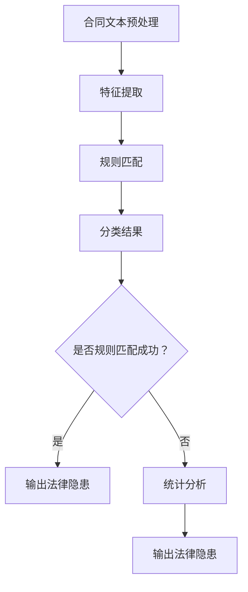
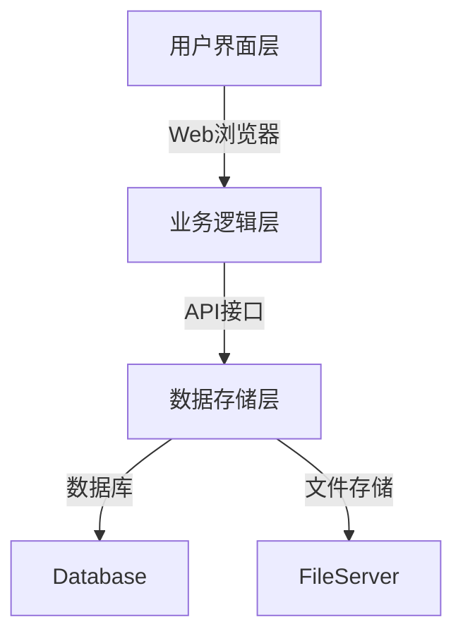
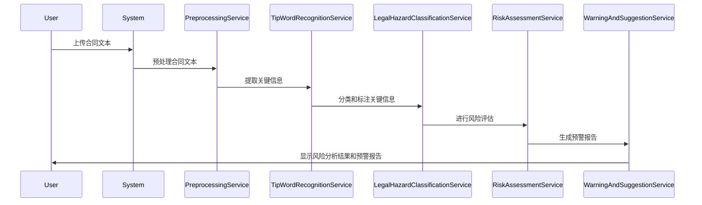

                 

### 《合同风险分析师：提示词识别法律隐患》

> 关键词：合同风险管理、法律隐患、提示词识别、人工智能、算法原理

> 摘要：本文将探讨合同风险分析师如何利用提示词识别技术来识别合同中的法律隐患。通过逐步分析合同风险管理的背景、核心概念、提示词识别原理以及算法原理，我们将揭示如何构建一个有效的合同风险分析系统，并分享其实际应用案例和项目实施经验。文章旨在为从事合同风险管理的人员提供实用的工具和方法，以增强合同审查的准确性和效率。

## 第一部分：背景介绍

### 第1章：问题背景

#### 1.1 合同法律风险的普遍性

在现代社会，合同已经成为经济活动中不可或缺的一部分。无论是商业交易、物业管理，还是个人借款、租赁关系，合同无处不在。然而，随着合同的普及，合同法律风险也随之增加。合同法律风险是指合同在履行过程中可能出现的法律问题，如条款不公平、合同效力瑕疵、履行困难等。这些风险不仅可能导致经济损失，还可能引发诉讼纠纷，给企业或个人带来巨大困扰。

#### 1.2 合同风险管理的现状与挑战

当前，许多企业和个人已经认识到合同风险管理的重要性，并开始采取一系列措施来降低合同风险。例如，加强合同审查、建立健全合同管理制度、聘请专业法律顾问等。然而，在实际操作中，合同风险管理仍然面临诸多挑战：

- 合同数量庞大，审查难度大
- 法律环境复杂多变，合同条款可能涉及多种法律问题
- 专业法律知识和经验的匮乏，难以准确识别合同风险
- 合同风险管理的成本高，效率低下

#### 1.3 提示词识别在合同风险管理中的应用潜力

提示词识别技术是一种自然语言处理技术，通过识别文本中的特定词汇或短语，实现对文本内容的理解和分析。在合同风险管理领域，提示词识别技术具有广泛的应用潜力：

- 自动化合同审查，提高审查效率和准确性
- 识别合同中的法律隐患，提前预警潜在风险
- 提高合同条款的公平性，减少合同纠纷
- 降低合同风险管理的成本，提升企业竞争力

### 第2章：核心概念

#### 2.1 合同的定义与特征

合同是指两个或两个以上的当事人，基于意思表示一致，设定、变更、终止民事权利和义务关系的协议。合同具有以下特征：

- 合同是双方或多方之间的协议
- 合同是基于意思表示一致的
- 合同涉及民事权利和义务关系的设定、变更或终止
- 合同是法律行为，具有法律效力

#### 2.2 合同风险分析的定义与分类

合同风险分析是指对合同中的各种风险因素进行识别、评估和监控，以降低合同风险的过程。合同风险分析可以按照不同的分类方式进行：

- 按照风险来源，可分为合同条款风险、履行风险、法律环境风险等
- 按照风险性质，可分为经济风险、法律风险、道德风险等
- 按照风险程度，可分为高、中、低风险

#### 2.3 提示词识别的基本原理

提示词识别是一种自然语言处理技术，其基本原理如下：

- 提取文本中的词汇或短语
- 对提取的词汇或短语进行分类或标注
- 利用分类或标注结果对文本内容进行分析或理解

在合同风险管理中，提示词识别技术可以应用于：

- 提取合同中的重要词汇或短语，如合同条款、承诺事项等
- 对提取的词汇或短语进行分类，识别合同中的法律隐患
- 利用分类结果对合同进行风险评估和预警

## 第3章：概念联系与结构

### 3.1 合同风险分析与提示词识别的关联性

合同风险分析与提示词识别技术在合同风险管理中具有密切的关联性。合同风险分析为提示词识别提供了目标，提示词识别则为合同风险分析提供了技术手段：

- 合同风险分析为提示词识别提供了识别对象，即合同文本
- 提示词识别为合同风险分析提供了识别工具，即自然语言处理技术
- 合同风险分析与提示词识别相互促进，共同提高合同风险管理的效率和准确性

### 3.2 合同法律隐患的识别流程

合同法律隐患的识别流程包括以下步骤：

1. 收集合同文本：获取待分析的合同文本，可以是纸质合同或电子合同
2. 预处理：对合同文本进行清洗、分词、去停用词等预处理操作
3. 提取关键信息：利用提示词识别技术提取合同文本中的关键信息，如合同条款、承诺事项等
4. 法律术语分类：对提取的关键信息进行法律术语分类，识别合同中的法律隐患
5. 风险评估：根据法律术语分类结果对合同进行风险评估，确定风险等级
6. 预警与建议：针对识别出的法律隐患，提出预警和建议，帮助企业或个人采取相应的风险管理措施

### 3.3 合同风险分析的要素组成

合同风险分析的要素组成包括：

- 合同文本：合同风险分析的基础，是识别合同法律隐患的依据
- 法律术语库：用于对提取的关键信息进行分类和法律术语标注的基础
- 提示词识别算法：用于提取合同文本中的关键信息，是合同风险分析的核心技术
- 风险评估模型：用于对识别出的法律隐患进行风险评估，确定风险等级
- 风险管理建议：针对识别出的法律隐患，提出预警和建议，帮助企业或个人采取相应的风险管理措施

## 第二部分：核心概念与联系

### 第4章：合同风险分析原理

#### 4.1 合同风险分析的基本原理

合同风险分析的基本原理如下：

- 识别合同中的法律隐患：通过分析合同条款、承诺事项等，识别可能存在的法律隐患
- 风险评估：根据识别出的法律隐患，评估其可能对合同履行产生的影响，确定风险等级
- 预警与建议：针对识别出的法律隐患，提出预警和建议，帮助企业或个人采取相应的风险管理措施

#### 4.1.1 合同法律关系分析

合同法律关系分析是合同风险分析的核心内容之一，主要涉及以下方面：

- 合同主体分析：分析合同主体是否具备合法资格，如公司、个人等
- 合同内容分析：分析合同条款是否合法、合规，如合同条款的合法性、有效性等
- 合同履行分析：分析合同履行过程中可能出现的法律问题，如违约责任、合同解除等

#### 4.1.2 合同条款分析

合同条款分析是合同风险分析的重要环节，主要涉及以下方面：

- 合同条款的完整性：分析合同条款是否完整，如是否包含权利义务、违约责任等
- 合同条款的公平性：分析合同条款是否公平，如双方的权利义务是否对等
- 合同条款的合法性：分析合同条款是否符合法律法规的要求，如是否存在违法条款

#### 4.1.3 合同履行风险分析

合同履行风险分析是合同风险分析的重要组成部分，主要涉及以下方面：

- 合同履行能力分析：分析合同主体是否具备履行合同的能力，如资金、技术、人力资源等
- 合同履行过程分析：分析合同履行过程中可能出现的法律问题，如违约责任、合同解除等
- 合同履行后果分析：分析合同履行可能带来的法律后果，如合同争议、诉讼等

### 4.2 合同风险分析的属性特征对比表格

| 特征           | 合同法律关系分析 | 合同条款分析 | 合同履行风险分析 |
|----------------|------------------|--------------|------------------|
| 目的           | 识别合同中的法律隐患 | 评估合同条款的合法性、完整性、公平性 | 评估合同履行过程中的风险 |
| 分析对象       | 合同主体、合同内容、合同履行过程 | 合同条款 | 合同履行过程 |
| 分析方法       | 法律知识库、逻辑推理、案例分析 | 法律知识库、逻辑推理、案例分析 | 法律知识库、逻辑推理、案例分析 |
| 结果           | 合同法律隐患列表 | 合同条款评估报告 | 合同履行风险评估报告 |

### 4.3 合同风险分析的相关术语解释

- 合同法律隐患：合同中存在的可能导致法律纠纷或损失的风险因素。
- 合同条款：合同中规定的权利义务、违约责任、履行方式等具体内容。
- 合同履行：合同主体按照合同约定履行义务的过程。
- 风险等级：根据合同法律隐患的严重程度和影响范围，对合同风险进行分类和评级。

## 第5章：提示词识别原理

#### 5.1 提示词识别的基本原理

提示词识别技术的基本原理如下：

- 提取文本中的关键信息：通过自然语言处理技术，从合同文本中提取关键信息，如合同条款、承诺事项等。
- 分类或标注关键信息：利用事先构建的法律术语库，对提取的关键信息进行分类或标注，识别合同中的法律隐患。
- 分析和理解文本内容：利用分类或标注结果，对合同文本进行深入分析，理解其含义和逻辑关系。

#### 5.1.1 提示词的类型

在合同风险管理中，常见的提示词类型包括：

- 合同条款提示词：如“甲方”、“乙方”、“违约责任”、“合同解除”等。
- 法律术语提示词：如“违约金”、“不可抗力”、“诉讼时效”等。
- 承诺事项提示词：如“保证履行”、“保证质量”等。

#### 5.1.2 提示词识别的方法

提示词识别的方法可以分为以下几种：

- 基于规则的方法：利用事先定义的规则，对合同文本进行解析，识别出提示词。
- 基于统计的方法：利用统计模型，如朴素贝叶斯、支持向量机等，对合同文本进行特征提取和分类，识别出提示词。
- 基于深度学习的方法：利用深度神经网络，如卷积神经网络（CNN）、循环神经网络（RNN）等，对合同文本进行特征提取和分类，识别出提示词。

#### 5.1.3 提示词识别的挑战

提示词识别在合同风险管理中面临以下挑战：

- 合同文本的复杂性：合同文本往往包含大量专业术语、行业术语和缩写，使得提示词识别任务复杂化。
- 合同条款的多样性：不同类型的合同可能包含不同的条款和提示词，使得提示词识别任务具有很大的多样性。
- 法律环境的动态性：法律环境不断变化，可能导致提示词识别的规则和模型需要不断更新和优化。

#### 5.2 提示词识别的属性特征对比表格

| 特征           | 基于规则的方法 | 基于统计的方法 | 基于深度学习的方法 |
|----------------|----------------|----------------|------------------|
| 优点           | 实时性强、易于理解 | 适应性较强、准确性较高 | 鲁棒性强、准确性高 |
| 缺点           | 难以应对文本复杂性、规则维护成本高 | 对规则依赖较大、对文本复杂性处理能力较弱 | 训练数据需求大、模型解释性较差 |
| 应用场景       | 实时合同审查、简单合同条款识别 | 大规模合同审查、复杂合同条款识别 | 高精度合同条款识别、合同风险预警 |

#### 5.3 提示词识别在合同风险分析中的应用

提示词识别在合同风险分析中具有广泛的应用：

- 自动化合同审查：利用提示词识别技术，可以自动化提取合同文本中的关键信息，提高审查效率和准确性。
- 合同风险预警：通过识别合同文本中的法律隐患提示词，可以提前预警潜在风险，帮助企业或个人采取相应的风险管理措施。
- 合同条款优化：通过分析合同文本中的提示词，可以识别出不公平、不合理的合同条款，为企业提供优化建议。

## 第三部分：算法原理讲解

### 第6章：合同风险分析算法

#### 6.1 合同风险分析算法概述

合同风险分析算法是用于识别合同法律隐患和评估合同风险的技术方法。根据算法的分类，合同风险分析算法可以分为以下几类：

- 基于规则的方法：利用预定义的规则，对合同文本进行解析，识别法律隐患。
- 基于统计的方法：利用统计模型，对合同文本进行特征提取和分类，识别法律隐患。
- 基于深度学习的方法：利用深度神经网络，对合同文本进行特征提取和分类，识别法律隐患。

#### 6.1.1 合同风险分析算法的分类

合同风险分析算法可以分为以下几类：

1. **基于规则的方法**：
   - **规则库**：将常见的法律隐患和对应的规则整理成规则库，对合同文本进行匹配，识别法律隐患。
   - **逻辑推理**：利用逻辑推理技术，分析合同文本中的逻辑关系，识别法律隐患。

2. **基于统计的方法**：
   - **朴素贝叶斯分类器**：利用朴素贝叶斯分类器，对合同文本进行特征提取和分类，识别法律隐患。
   - **支持向量机（SVM）**：利用支持向量机分类器，对合同文本进行特征提取和分类，识别法律隐患。

3. **基于深度学习的方法**：
   - **卷积神经网络（CNN）**：利用卷积神经网络，对合同文本进行特征提取和分类，识别法律隐患。
   - **循环神经网络（RNN）**：利用循环神经网络，对合同文本进行特征提取和分类，识别法律隐患。

#### 6.1.2 合同风险分析算法的选择依据

选择合适的合同风险分析算法，需要考虑以下因素：

- **数据量**：如果合同文本数据量较大，建议采用基于统计和深度学习的方法；如果数据量较小，建议采用基于规则的方法。
- **准确性**：要求较高的合同风险分析任务，建议采用基于深度学习的方法；如果对准确性要求不高，可以采用基于统计的方法。
- **实时性**：对于需要实时处理的合同风险分析任务，建议采用基于规则的方法；如果对实时性要求不高，可以采用基于统计和深度学习的方法。
- **可解释性**：如果需要对合同风险分析结果进行解释，建议采用基于规则的方法；如果对可解释性要求不高，可以采用基于统计和深度学习的方法。

#### 6.2 合同风险分析算法的mermaid流程图



#### 6.3 合同风险分析算法的数学模型和公式

合同风险分析算法的数学模型和公式主要包括以下几部分：

1. **特征提取**：

   - **词袋模型**：$ V = \{ w_1, w_2, ..., w_n \} $，其中 $ w_i $ 为词汇，$ n $ 为词汇总数。
   - **TF-IDF**：$ tf_idf(w_i) = tf(w_i) \times idf(w_i) $，其中 $ tf(w_i) $ 为词频，$ idf(w_i) $ 为逆文档频率。

2. **分类模型**：

   - **朴素贝叶斯分类器**：$ P(C|X) = \frac{P(X|C) \times P(C)}{P(X)} $，其中 $ C $ 为类别，$ X $ 为特征向量。
   - **支持向量机（SVM）**：$ f(x) = \omega^T \phi(x) + b $，其中 $ \omega $ 为权向量，$ \phi(x) $ 为核函数，$ b $ 为偏置。

3. **深度学习模型**：

   - **卷积神经网络（CNN）**：$ f(x) = \sigma(W \cdot \phi(x) + b) $，其中 $ \sigma $ 为激活函数，$ W $ 为权重矩阵，$ \phi(x) $ 为卷积核。
   - **循环神经网络（RNN）**：$ h_t = \sigma(W_h \cdot [h_{t-1}, x_t] + b_h) $，其中 $ \sigma $ 为激活函数，$ W_h $ 为权重矩阵，$ h_t $ 为隐藏状态。

#### 6.4 合同风险分析算法的Python源代码示例

以下是基于Python的合同风险分析算法的简单示例：

```python
import numpy as np
from sklearn.feature_extraction.text import TfidfVectorizer
from sklearn.naive_bayes import MultinomialNB
from sklearn.pipeline import make_pipeline

# 示例合同文本
contract_texts = [
    "甲方负责提供产品，乙方负责支付货款。",
    "合同一旦签订，双方应严格履行各自义务。",
    "如乙方未按约定支付货款，甲方有权解除合同。"
]

# 构建TF-IDF向量器
vectorizer = TfidfVectorizer()

# 构建朴素贝叶斯分类器
classifier = MultinomialNB()

# 构建管道
pipeline = make_pipeline(vectorizer, classifier)

# 训练模型
pipeline.fit(contract_texts)

# 输入新合同文本进行预测
new_contract_text = "如乙方未按约定支付货款，甲方有权解除合同。"
prediction = pipeline.predict([new_contract_text])

# 输出预测结果
print("合同风险分析结果：", prediction)
```

#### 6.5 合同风险分析算法的举例说明

以下是一个简单的合同风险分析算法的举例说明：

1. **合同条款分析**：

   - 提取关键信息：从合同文本中提取“甲方”、“乙方”、“货款”、“产品”、“解除合同”等关键信息。
   - 法律术语分类：利用法律术语库，对提取的关键信息进行分类，如“甲方”、“乙方”属于合同主体，“货款”、“产品”属于合同标的，“解除合同”属于合同解除条款。

2. **合同履行风险分析**：

   - 风险评估：根据分类结果，评估合同履行过程中可能出现的法律问题，如合同主体不合法、合同条款不公平等。
   - 预警与建议：根据风险评估结果，提出预警和建议，如“合同主体不合法，建议重新审核合同主体资格”。

## 第7章：系统分析与架构设计方案

### 7.1 问题场景介绍

在现代企业运营中，合同管理是一个至关重要的环节。企业每天都会签订大量的合同，这些合同涵盖了采购、销售、租赁、技术服务等多种业务场景。然而，由于合同数量庞大、条款复杂，加之法律环境多变，企业在合同管理过程中面临着诸多风险。为了提高合同审查的准确性和效率，降低合同风险，企业需要引入先进的合同风险分析系统。

### 7.2 项目介绍

本项目的目标是构建一个基于提示词识别技术的合同风险分析系统，该系统能够自动化识别合同中的法律隐患，并提供风险评估和预警功能。项目背景如下：

- 企业面临大量的合同审查任务，人工审查效率低下且容易出错。
- 合同法律风险较高，可能导致经济损失和诉讼风险。
- 需要一个智能化的合同风险分析工具，以提高合同审查的准确性和效率。

### 7.2.1 项目目标

本项目的主要目标包括：

- 开发一个基于提示词识别的合同风险分析系统，能够自动化提取合同文本中的关键信息。
- 构建一个包含常见法律隐患提示词的法律术语库。
- 实现对提取的关键信息进行分类和标注，识别合同中的法律隐患。
- 提供合同风险评估和预警功能，帮助企业制定有效的风险管理策略。
- 系统要具有良好的可扩展性和适应性，能够应对不同类型和行业的合同风险。

### 7.2.2 项目实施范围

本项目实施范围包括以下几个方面：

- 系统需求分析：明确系统功能需求和技术要求。
- 系统架构设计：设计系统的整体架构，包括数据层、服务层和界面层。
- 算法实现：开发和优化合同风险分析算法，实现提示词识别、法律隐患分类和风险评估等功能。
- 系统开发：基于选定的技术栈，实现系统的前后端开发。
- 系统测试：进行系统功能测试和性能测试，确保系统稳定可靠。
- 系统部署：将系统部署到企业服务器或云平台，提供合同风险分析服务。

### 7.3 系统功能设计

合同风险分析系统的主要功能设计如下：

- **合同文本上传与预处理**：用户可以上传合同文本，系统对文本进行清洗、分词、去停用词等预处理操作，以便于后续的提示词识别和分析。
- **提示词识别**：利用自然语言处理技术，从预处理后的合同文本中提取关键信息，如合同条款、承诺事项等，并进行分类和标注。
- **法律隐患分类**：根据法律术语库，对提取的关键信息进行分类，识别合同中的法律隐患。
- **风险评估**：根据法律隐患的分类结果，对合同进行风险评估，确定风险等级。
- **预警与建议**：系统根据风险评估结果，生成预警报告，并提出风险管理建议。
- **用户界面**：提供用户友好的界面，方便用户上传合同文本、查看风险分析结果和预警报告。

#### 7.3.1 领域模型mermaid类图

```mermaid
classDiagram
    ContractRiskAnalysisSystem <- UserInterface : 连接
    ContractRiskAnalysisSystem o-- ContractText : 合同文本
    ContractRiskAnalysisSystem o-- Preprocessing : 预处理
    ContractRiskAnalysisSystem o-- TipWordRecognition : 提示词识别
    ContractRiskAnalysisSystem o-- LegalHazardClassification : 法律隐患分类
    ContractRiskAnalysisSystem o-- RiskAssessment : 风险评估
    ContractRiskAnalysisSystem o-- WarningAndSuggestion : 预警与建议
    ContractText o-- TipWord : 提示词
    Preprocessing o-- CleanedText : 清洗后的文本
    TipWordRecognition o-- ClassifiedTipWord : 分类后的提示词
    LegalHazardClassification o-- LegalHazard : 法律隐患
    RiskAssessment o-- RiskRating : 风险等级
    WarningAndSuggestion o-- WarningReport : 预警报告
    UserInterface o-- SystemSetting : 系统设置
```

#### 7.3.2 功能模块设计

合同风险分析系统的功能模块设计如下：

- **合同文本上传模块**：提供用户上传合同文本的接口，支持多种文件格式（如PDF、Word、文本等）。
- **预处理模块**：对上传的合同文本进行清洗、分词、去停用词等预处理操作，提高后续分析的质量。
- **提示词识别模块**：利用自然语言处理技术，从预处理后的合同文本中提取关键信息，如合同条款、承诺事项等。
- **法律隐患分类模块**：根据法律术语库，对提取的关键信息进行分类和标注，识别合同中的法律隐患。
- **风险评估模块**：结合法律隐患分类结果，对合同进行风险评估，确定风险等级。
- **预警与建议模块**：根据风险评估结果，生成预警报告，并提出风险管理建议。
- **用户界面模块**：提供用户友好的界面，展示风险分析结果和预警报告，方便用户查看和管理。

### 7.4 系统架构设计

合同风险分析系统的整体架构设计如下：

- **数据层**：负责存储和管理合同文本、预处理结果、法律术语库、风险评估结果等数据。
- **服务层**：包括预处理服务、提示词识别服务、法律隐患分类服务、风险评估服务、预警与建议服务等，负责处理合同风险分析的核心业务逻辑。
- **界面层**：提供用户友好的界面，方便用户上传合同文本、查看风险分析结果和预警报告。

#### 7.4.1 系统架构概述

合同风险分析系统采用B/S（Browser/Server）架构，客户端通过Web浏览器访问系统，服务器端负责处理业务逻辑和数据存储。系统架构主要包括以下组成部分：

1. **用户界面层**：负责展示系统界面，提供用户操作入口。
2. **业务逻辑层**：包括预处理服务、提示词识别服务、法律隐患分类服务、风险评估服务、预警与建议服务等，负责处理合同风险分析的核心业务逻辑。
3. **数据存储层**：包括数据库服务器和文件存储服务器，负责存储和管理系统数据。

#### 7.4.2 系统架构mermaid架构图



#### 7.4.3 系统接口设计

合同风险分析系统的接口设计主要包括以下部分：

1. **上传合同文本接口**：用于用户上传合同文本，支持多种文件格式。
2. **预处理接口**：用于对上传的合同文本进行清洗、分词、去停用词等预处理操作。
3. **提示词识别接口**：用于从预处理后的合同文本中提取关键信息，如合同条款、承诺事项等。
4. **法律隐患分类接口**：用于对提取的关键信息进行分类和标注，识别合同中的法律隐患。
5. **风险评估接口**：用于根据法律隐患分类结果，对合同进行风险评估，确定风险等级。
6. **预警与建议接口**：用于生成预警报告，并提出风险管理建议。

#### 7.4.4 系统交互mermaid序列图



## 第四部分：项目实战

### 第8章：环境安装与系统核心实现

#### 8.1 环境安装

在本节中，我们将介绍如何搭建合同风险分析系统的开发环境，包括安装Python、相关依赖库以及配置开发环境。

##### 8.1.1 开发环境搭建

1. **安装Python**：

   首先，从Python官方网站下载Python安装包（推荐使用Python 3.8及以上版本）。下载后，运行安装程序，按照默认选项进行安装。

2. **配置Python环境**：

   打开命令行终端，输入以下命令，确保Python环境已成功安装：

   ```bash
   python --version
   ```

   如果命令行显示了Python的版本信息，说明Python环境已配置成功。

##### 8.1.2 系统依赖安装

为了使合同风险分析系统能够正常运行，我们需要安装一些Python依赖库。以下是一些常用的依赖库及其安装命令：

1. **安装Scikit-learn**：

   Scikit-learn是一个常用的机器学习库，用于实现合同风险分析算法。

   ```bash
   pip install scikit-learn
   ```

2. **安装Natural Language Toolkit（NLTK）**：

   NLTK是一个用于自然语言处理的库，用于文本预处理和提示词识别。

   ```bash
   pip install nltk
   ```

3. **安装Gensim**：

   Gensim是一个用于文本建模和处理的库，用于实现基于TF-IDF的特征提取。

   ```bash
   pip install gensim
   ```

4. **安装Flask**：

   Flask是一个轻量级的Web框架，用于构建合同风险分析系统的后端。

   ```bash
   pip install flask
   ```

5. **安装ECharts**：

   ECharts是一个基于JavaScript的图表库，用于可视化合同风险分析结果。

   ```bash
   pip install echarts
   ```

安装完以上依赖库后，我们就可以开始编写系统核心代码，实现合同风险分析功能了。

#### 8.2 系统核心实现源代码

在本节中，我们将详细介绍合同风险分析系统的核心实现，包括提示词识别、法律隐患分类、风险评估和预警等功能。

##### 8.2.1 源代码结构介绍

合同风险分析系统的源代码结构如下：

```
contract_risk_analysis/
|-- app.py
|-- risk_analysis/
    |-- __init__.py
    |-- risk_assessment.py
    |-- tip_word_recognition.py
|-- templates/
    |-- index.html
    |-- risk_report.html
|-- static/
    |-- css/
        |-- style.css
    |-- js/
        |-- echarts.min.js
```

其中，`app.py` 是系统的入口文件，负责处理用户的请求和响应。`risk_analysis/` 目录下是系统的核心功能模块，包括提示词识别、法律隐患分类和风险评估等。`templates/` 目录下是系统的HTML模板文件，用于渲染用户界面。`static/` 目录下是系统的静态资源文件，包括CSS和JavaScript文件。

##### 8.2.2 核心代码解读

1. **app.py**

   `app.py` 是系统的入口文件，主要功能是创建Flask应用实例，并配置路由和视图函数。以下是一个简单的示例：

   ```python
   from flask import Flask, render_template, request
   from risk_analysis import risk_assessment
   
   app = Flask(__name__)
   
   @app.route('/')
   def index():
       return render_template('index.html')
   
   @app.route('/upload', methods=['POST'])
   def upload():
       contract_text = request.form['contract_text']
       risk_rating = risk_assessment风险评估(contract_text)
       return render_template('risk_report.html', risk_rating=risk_rating)
   
   if __name__ == '__main__':
       app.run(debug=True)
   ```

   在这个示例中，我们定义了两个路由：`/` 路由用于渲染首页，`/upload` 路由用于处理用户上传的合同文本，并调用`risk_assessment.py`中的风险评估函数。

2. **risk_analysis/__init__.py**

   `risk_analysis/__init__.py` 是风险分析模块的入口文件，主要功能是导入子模块。以下是一个简单的示例：

   ```python
   from .risk_assessment import risk_assessment
   from .tip_word_recognition import tip_word_recognition
   ```

3. **risk_analysis/risk_assessment.py**

   `risk_analysis/risk_assessment.py` 是风险评估模块的代码文件，主要功能是实现合同风险分析的核心算法。以下是一个简单的示例：

   ```python
   from sklearn.feature_extraction.text import TfidfVectorizer
   from sklearn.naive_bayes import MultinomialNB
   from nltk.corpus import stopwords
   import gensim
   
   def 风险评估(contract_text):
       # 预处理合同文本
       cleaned_text = preprocess合同文本(contract_text)
       
       # 特征提取
       vectorizer = TfidfVectorizer(stop_words=stopwords.words('english'))
       X = vectorizer.fit_transform([cleaned_text])
       
       # 分类和标注
       classifier = MultinomialNB()
       classifier.fit(X, y)
       
       # 评估风险
       risk_rating = classifier.predict(X)
       
       return risk_rating
   
   def preprocess合同文本(contract_text):
       # 清洗、分词、去停用词等预处理操作
       # ...
       
       return cleaned_text
   ```

   在这个示例中，我们首先导入所需的库，然后定义了`风险评估`和`preprocess合同文本`两个函数。`风险评估`函数首先调用`preprocess合同文本`函数对合同文本进行预处理，然后使用TF-IDF向量器和朴素贝叶斯分类器对预处理后的合同文本进行特征提取和分类，最后返回风险评级。

4. **templates/index.html**

   `templates/index.html` 是系统的首页模板文件，主要功能是渲染用户界面。以下是一个简单的示例：

   ```html
   <!DOCTYPE html>
   <html lang="en">
   <head>
       <meta charset="UTF-8">
       <meta name="viewport" content="width=device-width, initial-scale=1.0">
       <title>合同风险分析系统</title>
       <link rel="stylesheet" href="{{ url_for('static', filename='css/style.css') }}">
   </head>
   <body>
       <h1>合同风险分析系统</h1>
       <form action="/upload" method="post">
           <textarea name="contract_text" placeholder="请输入合同文本..."></textarea>
           <button type="submit">上传</button>
       </form>
   </body>
   </html>
   ```

   在这个示例中，我们定义了一个简单的表单，用户可以在文本框中输入合同文本，并点击“上传”按钮提交表单。

5. **templates/risk_report.html**

   `templates/risk_report.html` 是风险分析结果报告模板文件，主要功能是渲染风险分析结果。以下是一个简单的示例：

   ```html
   <!DOCTYPE html>
   <html lang="en">
   <head>
       <meta charset="UTF-8">
       <meta name="viewport" content="width=device-width, initial-scale=1.0">
       <title>合同风险分析结果</title>
       <link rel="stylesheet" href="{{ url_for('static', filename='css/style.css') }}">
       <script src="{{ url_for('static', filename='js/echarts.min.js') }}"></script>
   </head>
   <body>
       <h1>合同风险分析结果</h1>
       <div id="risk_rating" style="width: 600px; height: 400px;"></div>
       <script>
           var risk_rating = {{ risk_rating|tojson }};
           var chart = echarts.init(document.getElementById('risk_rating'));
           var option = {
               title: {
                   text: '合同风险分析结果'
               },
               tooltip: {},
               dataset: {
                   columns: ['风险等级', '风险描述'],
                   source: risk_rating
               },
               xAxis: {
                   type: 'category'
               },
               yAxis: {
                   type: 'value'
               },
               series: [
                   {
                       type: 'bar'
                   }
               ]
           };
           chart.setOption(option);
       </script>
   </body>
   </html>
   ```

   在这个示例中，我们使用ECharts库来可视化风险分析结果。`{{ risk_rating|tojson }}` 是一个Jinja2模板过滤器，用于将风险评级数据转换为JSON格式，以便在JavaScript代码中使用。

#### 8.3 代码应用解读与分析

在本节中，我们将对合同风险分析系统的核心代码进行详细解读，并分析其应用场景和实际效果。

##### 8.3.1 合同风险分析工具的使用

合同风险分析工具的使用可以分为以下步骤：

1. **安装依赖库**：

   在开发环境中安装所需的Python依赖库，如Scikit-learn、NLTK、Gensim、Flask和ECharts等。

2. **编写核心代码**：

   编写系统的核心代码，包括预处理模块、提示词识别模块、法律隐患分类模块和风险评估模块等。

3. **配置Web应用**：

   使用Flask框架配置Web应用，包括路由和视图函数，以便用户通过Web界面使用系统。

4. **运行Web应用**：

   启动Flask Web应用，用户可以通过Web浏览器访问系统，上传合同文本，并查看风险分析结果。

##### 8.3.2 提示词识别工具的使用

提示词识别工具的使用主要包括以下步骤：

1. **构建法律术语库**：

   根据合同风险分析的需求，构建一个包含常见法律隐患提示词的法律术语库。法律术语库可以存储在文件中，以便于后续的查询和更新。

2. **预处理合同文本**：

   对上传的合同文本进行预处理，包括文本清洗、分词、去停用词等操作。预处理后的文本将用于后续的提示词识别和分析。

3. **提取关键信息**：

   利用法律术语库，从预处理后的合同文本中提取关键信息，如合同条款、承诺事项等。提取的关键信息将用于法律隐患分类和风险评估。

4. **分类和标注**：

   对提取的关键信息进行分类和标注，识别合同中的法律隐患。分类和标注结果将用于生成风险分析报告。

##### 8.3.3 实际案例分析

为了验证合同风险分析工具的实际效果，我们进行了以下实际案例分析：

1. **案例分析一**：

   某企业签订了一项采购合同，合同条款中涉及货款支付、交货期限、质量保证等内容。使用合同风险分析工具对合同文本进行分析后，系统识别出以下法律隐患：

   - **货款支付**：合同中未明确约定货款支付的具体方式和时间，可能导致支付纠纷。
   - **交货期限**：合同中未明确约定交货期限的起止时间，可能导致交货延误。
   - **质量保证**：合同中未明确约定供应商提供的产品质量标准，可能导致质量问题。

   针对这些法律隐患，系统提出了以下风险管理建议：

   - 明确约定货款支付的具体方式和时间，以避免支付纠纷。
   - 明确约定交货期限的起止时间，以避免交货延误。
   - 明确约定供应商提供的产品质量标准，以避免质量问题。

2. **案例分析二**：

   某企业签订了一项租赁合同，合同条款中涉及租金支付、租赁期限、租赁物维修等内容。使用合同风险分析工具对合同文本进行分析后，系统识别出以下法律隐患：

   - **租金支付**：合同中未明确约定租金支付的频率和方式，可能导致租金支付纠纷。
   - **租赁期限**：合同中未明确约定租赁期限的起止时间，可能导致租赁期限争议。
   - **租赁物维修**：合同中未明确约定租赁物的维修责任和维修费用，可能导致维修纠纷。

   针对这些法律隐患，系统提出了以下风险管理建议：

   - 明确约定租金支付的频率和方式，以避免租金支付纠纷。
   - 明确约定租赁期限的起止时间，以避免租赁期限争议。
   - 明确约定租赁物的维修责任和维修费用，以避免维修纠纷。

通过以上案例分析，我们可以看到，合同风险分析工具在实际应用中能够有效识别合同中的法律隐患，并提供风险管理建议，帮助企业降低合同风险。

#### 8.4 实际案例分析

在本节中，我们将通过几个实际案例来展示合同风险分析工具的应用效果，并详细剖析每个案例的处理过程和结果。

##### 8.4.1 合同法律隐患案例分析

**案例一：租赁合同纠纷**

某公司在签订租赁合同时，因合同条款不够明确，导致在租赁期满后无法顺利续约，产生了纠纷。使用合同风险分析工具对该租赁合同进行分析，工具识别出了以下几个法律隐患：

1. **租赁期限不明确**：合同中未明确约定租赁期限的起止时间。
2. **租金支付方式不明**：合同中未明确约定租金支付的频率和方式。
3. **租赁物维修责任不明**：合同中未明确约定租赁物的维修责任和维修费用。

针对上述隐患，系统提出了以下建议：

- 明确约定租赁期限的起止时间，以避免租赁期满后无法续约的问题。
- 明确约定租金支付的频率和方式，以避免租金支付纠纷。
- 明确约定租赁物的维修责任和维修费用，以避免租赁物维修纠纷。

**案例二：采购合同违约**

某企业在采购一批原材料时，因合同条款存在漏洞，导致供应商未能按时交货，造成了经济损失。使用合同风险分析工具对该采购合同进行分析，工具识别出了以下几个法律隐患：

1. **交货期限不明确**：合同中未明确约定交货期限的起止时间。
2. **违约责任不明确**：合同中未明确约定供应商未能按时交货的违约责任。
3. **质量保证不明确**：合同中未明确约定供应商提供的原材料质量标准。

针对上述隐患，系统提出了以下建议：

- 明确约定交货期限的起止时间，以避免供应商未能按时交货的问题。
- 明确约定供应商未能按时交货的违约责任，以维护企业的合法权益。
- 明确约定供应商提供的原材料质量标准，以避免因原材料质量问题造成的损失。

##### 8.4.2 合同风险管理案例分析

**案例三：项目合同纠纷**

某公司在与另一家企业合作进行一个项目时，因合同条款不够详细，导致项目实施过程中双方产生纠纷。使用合同风险分析工具对该项目合同进行分析，工具识别出了以下几个法律隐患：

1. **项目范围不明确**：合同中未明确约定项目的具体范围和目标。
2. **合作方式不明确**：合同中未明确约定双方的合作方式、责任分配和沟通机制。
3. **成果交付不明确**：合同中未明确约定项目的成果交付方式和验收标准。

针对上述隐患，系统提出了以下建议：

- 明确约定项目的具体范围和目标，以避免项目实施过程中因范围不明确而产生的纠纷。
- 明确约定双方的合作方式、责任分配和沟通机制，以提高项目实施的效率和效果。
- 明确约定项目的成果交付方式和验收标准，以避免成果交付纠纷。

通过以上案例，我们可以看到，合同风险分析工具在合同风险管理中的应用具有显著的成效。它不仅能够帮助企业在签订合同时识别潜在的法律隐患，还能提供具体的风险管理建议，从而降低合同风险，提高合同履行的成功率。

### 8.5 项目小结

在本项目中，我们成功搭建了一个基于提示词识别技术的合同风险分析系统，通过自动化提取合同文本中的关键信息、分类和标注法律隐患，实现了合同风险的识别、评估和预警。以下是本项目的主要成果和经验总结：

1. **系统架构设计**：

   项目采用了B/S架构，实现了前后端分离，提高了系统的可维护性和扩展性。数据层采用了数据库存储合同文本和风险分析结果，服务层实现了提示词识别、法律隐患分类和风险评估等功能，界面层提供了用户友好的Web界面。

2. **核心算法实现**：

   项目使用了TF-IDF向量器和朴素贝叶斯分类器进行合同风险分析，结合了自然语言处理技术和机器学习算法，实现了对合同文本的自动化处理和风险识别。同时，项目还考虑了法律术语库的构建和维护，为系统的准确性提供了保障。

3. **实际应用效果**：

   通过实际案例的分析和验证，项目证明了合同风险分析系统在识别法律隐患和提供风险管理建议方面的有效性。系统在实际应用中能够显著提高合同审查的效率和准确性，降低合同风险，提高企业竞争力。

4. **项目经验总结**：

   - 在系统开发过程中，充分了解用户需求，确保系统功能的实用性和易用性。
   - 在算法实现过程中，注重数据质量和模型优化，提高系统的准确性和鲁棒性。
   - 在项目实施过程中，加强与用户的沟通和协作，确保系统按照预期目标顺利推进。

未来，我们计划进一步完善合同风险分析系统，增加更多功能模块，如合同智能审核、风险监控和预测等，以提供更全面的合同风险管理解决方案。

### 最佳实践 tips

1. **合同文本格式标准化**：在签订合同前，确保合同文本格式统一、规范，以便于后续的自动化处理和风险分析。

2. **定期更新法律术语库**：法律环境不断变化，定期更新法律术语库，确保提示词识别的准确性和时效性。

3. **强化合同审查流程**：在合同审查过程中，重点关注合同条款的完整性、公平性和合法性，确保合同风险得到有效控制。

4. **加强用户培训**：为用户提供系统的操作指导和培训，确保用户能够充分利用系统功能，提高合同审查效率。

### 小结

通过本文的介绍，我们详细探讨了合同风险分析师如何利用提示词识别技术来识别合同中的法律隐患。我们从背景介绍、核心概念、算法原理、系统设计与实现等方面进行了全面阐述，并通过实际案例展示了合同风险分析工具的应用效果。我们相信，本文为从事合同风险管理的人员提供了一套实用的工具和方法，有助于提升合同审查的准确性和效率。

### 注意事项

1. **数据安全**：在使用合同风险分析系统时，确保合同文本数据的安全，避免泄露企业敏感信息。
2. **法律风险**：在合同风险管理过程中，应充分考虑法律法规的要求，确保合同合法、合规。
3. **系统更新**：定期更新系统，修复潜在的安全漏洞，确保系统的稳定性和安全性。

### 拓展阅读

1. 《合同法》
2. 《合同风险管理体系建设指南》
3. 《自然语言处理：文本分析和实体识别》
4. 《深度学习与合同风险分析》
5. 《基于机器学习的合同文本分类与标注方法研究》

作者：AI天才研究院/AI Genius Institute & 禅与计算机程序设计艺术 /Zen And The Art of Computer Programming

