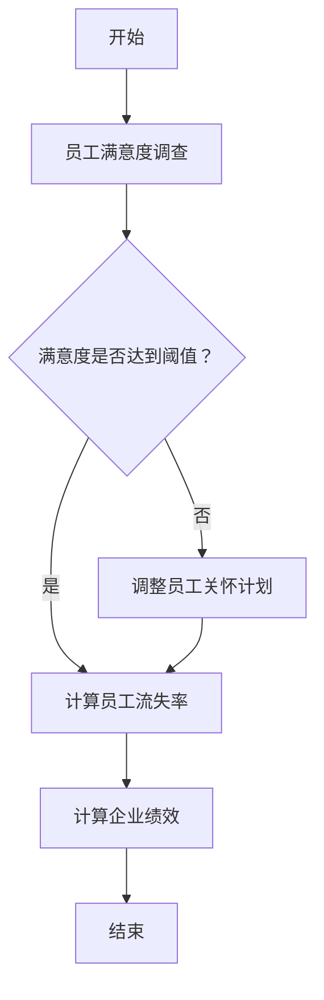

                 

### 第1章: 问题的提出

#### 1.1.1 问题背景

随着全球经济的快速发展和科技的不断创新，企业面临着前所未有的竞争压力。在这种背景下，人才的竞争成为企业成败的关键。员工是企业最宝贵的资产，他们的满意度和忠诚度直接影响企业的绩效和未来发展。然而，许多企业在员工关怀方面仍存在不足，特别是情感关怀和心理支持方面的缺失。

首先，从企业层面来看，传统的管理模式往往注重绩效和薪酬激励，忽视了员工的心理需求和情感支持。这种管理模式导致员工在追求个人发展的同时，感到心理压力和情感疏离。其次，从员工层面来看，现代职场中，人们对于工作与生活的平衡、职业发展的机会和自我价值的实现有着更高的期待。然而，现实中的工作压力和生活压力往往让员工感到疲惫和无助。

#### 1.1.2 问题描述

员工关怀计划旨在通过一系列有针对性的措施，提升员工的工作满意度、幸福感和忠诚度，从而增强企业的凝聚力和竞争力。然而，当前许多企业在实施员工关怀计划时面临以下问题：

1. **缺乏系统化策略**：许多企业对于员工关怀的理解停留在表面，缺乏系统的规划和实施策略。
2. **执行力度不足**：即使有些企业制定了员工关怀计划，但往往由于执行力度不足，导致计划流于形式，无法达到预期效果。
3. **缺乏个性化关怀**：员工的需求和期望因人而异，缺乏个性化的关怀措施，使得员工感到不被重视。
4. **效果评估不足**：大多数企业没有建立起有效的员工关怀效果评估体系，无法准确衡量关怀计划的实际效果。

#### 1.1.3 问题解决

为了解决上述问题，企业需要采取以下措施：

1. **建立系统化策略**：企业应根据自身的实际情况，制定系统化的员工关怀计划，明确目标和实施步骤。
2. **强化执行力度**：企业应确保员工关怀计划的落实，通过定期检查和反馈机制，确保计划的有效执行。
3. **提供个性化关怀**：企业应深入了解员工的需求，提供个性化的关怀措施，让员工感受到企业的关心和重视。
4. **完善效果评估体系**：企业应建立科学的效果评估体系，通过定期的员工满意度调查和绩效评估，了解关怀计划的实施效果，及时进行调整和优化。

#### 1.1.4 边界与外延

员工关怀计划的边界主要涉及企业内部的正式员工和临时员工。它不仅包括物质层面的关怀，如薪酬、福利和工作条件，还包括心理层面的关怀，如情感支持、心理健康和工作压力缓解。员工关怀的外延还包括员工的家庭生活、职业发展以及社会交往等方面。

通过以上分析和讨论，我们可以看到，员工关怀计划在提升员工满意度和忠诚度、增强企业凝聚力和竞争力方面具有重要作用。接下来的章节中，我们将进一步探讨员工关怀计划的核心概念、实施方法和效果评估，以期为企业的员工关怀提供有益的参考和借鉴。

### 1.2 员工关怀计划

#### 定义与核心目标

员工关怀计划是指企业为了提升员工的工作满意度和幸福感，采取的一系列有针对性的措施和策略。这些措施不仅关注员工的物质福利，更强调情感和心理支持。其核心目标是建立良好的员工关系，增强员工的归属感和认同感，从而提高员工的工作积极性和创新能力。

#### 员工关怀计划的重要性

员工关怀计划的重要性在于：

1. **提升员工满意度和忠诚度**：通过关怀员工的生活和心理健康，提高员工对企业的认同感和忠诚度。
2. **增强企业凝聚力和竞争力**：关怀员工能够增强团队的凝聚力和协作能力，提升企业的整体竞争力。
3. **促进企业的可持续发展**：长期的员工关怀有助于减少员工流失率，降低招聘和培训成本，促进企业的可持续发展。

#### 员工关怀计划的基本要素

1. **心理健康关怀**：包括心理健康讲座、心理咨询和压力缓解活动等，帮助员工保持良好的心理状态。
2. **情感支持**：建立员工与企业之间的情感纽带，通过沟通、关心和支持，增强员工的归属感。
3. **工作环境优化**：改善工作条件，提高工作场所的安全性和舒适度，减少工作压力。
4. **职业发展支持**：提供培训和发展机会，帮助员工实现职业成长，提升职业满意度和忠诚度。
5. **家庭关怀**：关注员工的个人生活和家庭需求，提供家庭支持服务，如员工福利计划、家庭日活动等。

#### 实施员工关怀计划的挑战与策略

在实施员工关怀计划时，企业可能会面临以下挑战：

1. **资源分配**：如何合理分配有限的资源，确保关怀计划的有效实施。
2. **员工参与度**：如何提高员工的参与度，确保关怀计划得到员工的认可和支持。
3. **持续性和有效性**：如何确保关怀计划具有持续性和有效性，避免流于形式。

针对以上挑战，企业可以采取以下策略：

1. **全面评估**：在制定员工关怀计划前，进行全面的需求评估，确保计划符合员工的实际需求。
2. **科学设计**：根据员工需求，科学设计关怀措施，确保计划具有针对性和可操作性。
3. **强化沟通**：通过定期沟通和反馈，了解员工的意见和建议，及时调整和优化计划。
4. **激励机制**：建立激励机制，鼓励员工积极参与关怀计划，提高员工的参与度和满意度。

通过以上分析和讨论，我们可以看到，员工关怀计划在提升企业绩效和可持续发展方面具有重要意义。在接下来的章节中，我们将进一步探讨员工关怀计划的具体实施方法和效果评估，以期为企业的员工关怀提供更加详细和实用的指导。

### 1.3 情感纽带

#### 定义与作用

情感纽带是指通过情感互动，建立起员工与企业之间的深厚联系，使员工对企业产生归属感和认同感。情感纽带不仅包括员工与同事之间的情感交流，还涉及员工与企业管理层之间的互动和沟通。

情感纽带在企业中的作用主要体现在以下几个方面：

1. **增强归属感**：通过情感纽带，员工能够感受到企业对他们的关心和支持，从而增强对企业的归属感。
2. **提升忠诚度**：情感纽带有助于建立员工对企业的忠诚度，减少员工流失率。
3. **促进团队合作**：情感纽带能够增强员工之间的信任和协作，提升团队的整体效能。
4. **提升企业形象**：积极的企业文化能够增强员工对企业形象的认同，提升企业的社会声誉。

#### 情感纽带与员工满意度的关系

员工满意度是指员工对企业工作环境、待遇、发展机会等方面的综合评价。情感纽带与员工满意度之间存在密切的关系：

1. **正向影响**：情感纽带有助于提升员工的工作满意度和幸福感，使员工更愿意为企业付出努力和奉献。
2. **长期效应**：情感纽带能够增强员工的长期忠诚度，减少因短期利益波动而产生的员工流失。
3. **互动机制**：员工满意度又会反过来影响情感纽带，形成良性互动，进一步提升员工满意度和忠诚度。

#### 如何建立和维护情感纽带

为了建立和维护情感纽带，企业可以采取以下措施：

1. **加强沟通**：通过定期的员工座谈会、问卷调查等方式，及时了解员工的需求和意见，增强员工与企业之间的互动。
2. **关心员工生活**：关注员工的生活状况，提供家庭支持服务，如员工福利计划、家庭日活动等，使员工感受到企业的关怀。
3. **建立激励机制**：通过奖励和表彰等方式，鼓励员工积极参与企业活动，提升员工的工作积极性和满意度。
4. **培养企业文化**：积极营造和谐、包容、开放的企业文化，使员工能够感受到企业的人文关怀，从而增强归属感和认同感。

通过以上分析和讨论，我们可以看到，情感纽带在提升员工满意度和忠诚度方面具有重要意义。在接下来的章节中，我们将进一步探讨员工满意度与员工关怀计划之间的关系，以期为企业的员工管理提供更加全面和深入的指导。

### 1.4 员工满意度

#### 定义与衡量

员工满意度是指员工对企业的工作环境、待遇、发展机会等方面的满意程度。它是一个综合性的评价，涵盖了员工的工作体验、职业发展、薪酬福利、工作与生活平衡等多个方面。

衡量员工满意度的常见方法包括：

1. **员工满意度调查**：通过问卷、访谈等方式，收集员工对企业各方面的满意程度。
2. **员工绩效评估**：通过绩效评估结果，了解员工的工作表现和满意度。
3. **员工流失率**：员工流失率是衡量员工满意度的一个重要指标，高流失率通常意味着员工满意度低。

#### 员工满意度的影响因素

员工满意度受到多种因素的影响，主要包括：

1. **工作环境**：包括办公条件、工作氛围、同事关系等。
2. **薪酬福利**：包括薪酬水平、奖金、福利待遇等。
3. **职业发展**：包括晋升机会、培训发展、职业规划等。
4. **工作与生活平衡**：包括工作时间、休假政策、家庭关怀等。
5. **企业文化**：包括企业的价值观、愿景、使命等。

#### 提升员工满意度的策略

为了提升员工满意度，企业可以采取以下策略：

1. **改善工作环境**：提供良好的办公设施和舒适的工作环境，促进员工的工作效率和满意度。
2. **优化薪酬福利**：合理制定薪酬福利政策，确保员工获得公平的待遇，提高员工的满意度。
3. **提供职业发展机会**：通过培训、晋升机制等，为员工提供职业发展机会，增强员工的职业满意度和忠诚度。
4. **关注员工生活**：关注员工的生活需求，提供家庭支持服务，如员工福利计划、家庭日活动等，提升员工的幸福感。
5. **营造积极企业文化**：建立和谐、包容、开放的企业文化，增强员工的归属感和认同感。

通过以上分析和讨论，我们可以看到，员工满意度在提升员工工作积极性、降低流失率、增强企业竞争力等方面具有重要意义。在接下来的章节中，我们将进一步探讨员工关怀计划的具体实施方法和效果评估，以期为企业的员工管理提供更加全面和深入的指导。

### 1.5 案例分析

为了更好地理解员工关怀计划在实践中的应用，我们来看几个成功案例。

#### 案例一：谷歌的员工关怀计划

谷歌以其卓越的员工关怀计划而闻名，不仅提供了优厚的薪酬和福利，还关注员工的身心健康和职业发展。以下是谷歌员工关怀计划的一些亮点：

1. **健康与福利**：谷歌为员工提供全方位的健康保障，包括医疗保险、健康检查和健身设施等。
2. **职业发展**：谷歌为员工提供多种培训和发展机会，如在线课程、内部讲座和导师计划等。
3. **家庭关怀**：谷歌关注员工的家庭需求，提供家庭福利计划，如家庭度假补贴和亲子活动等。
4. **工作与生活平衡**：谷歌鼓励员工保持工作与生活的平衡，提供灵活的工作时间和远程办公政策。

这些措施极大地提升了谷歌员工的工作满意度和忠诚度，使其成为全球最受欢迎的工作场所之一。

#### 案例二：微软的员工关怀计划

微软也以其全面的员工关怀计划而著称，尤其是在员工心理健康方面。以下是微软员工关怀计划的一些关键点：

1. **心理健康支持**：微软提供专业的心理咨询和心理治疗服务，帮助员工缓解工作压力和心理健康问题。
2. **健康生活**：微软鼓励员工保持健康的生活方式，提供健康饮食、健身设备和健康讲座等。
3. **家庭支持**：微软为员工提供家庭支持计划，包括家庭日活动和亲子活动等，增强员工的家庭幸福感。
4. **职业发展**：微软为员工提供多样化的职业发展路径，包括内部调岗、跨部门学习和领导力培训等。

通过这些措施，微软成功提升了员工的工作满意度和幸福感，同时也增强了企业的凝聚力和竞争力。

#### 案例三：华为的员工关怀计划

华为作为全球领先的科技公司，其员工关怀计划同样备受瞩目。以下是华为员工关怀计划的一些重要方面：

1. **薪酬福利**：华为提供具有竞争力的薪酬和福利，包括股票期权、年终奖金和医疗保险等。
2. **职业发展**：华为注重员工的职业成长，提供丰富的培训机会和职业发展路径，鼓励员工不断学习和进步。
3. **家庭关怀**：华为关注员工的个人生活和家庭需求，提供家庭福利计划，如家庭旅游补贴和亲子活动等。
4. **工作与生活平衡**：华为鼓励员工保持工作与生活的平衡，提供灵活的工作时间和远程办公政策。

通过这些措施，华为成功吸引了大量优秀人才，并保持了员工的长期忠诚度。

通过以上案例分析，我们可以看到，成功的员工关怀计划不仅关注员工的物质需求，更重视员工的情感和心理支持。这些企业通过全面的关怀措施，不仅提升了员工的工作满意度和幸福感，还增强了企业的凝聚力和竞争力。

### 1.6 实施策略与最佳实践

#### 实施策略

1. **全面规划**：企业在制定员工关怀计划时，应进行全面的需求评估，明确目标和实施步骤，确保计划具有可操作性和针对性。
2. **持续改进**：员工关怀计划不是一次性的活动，而是一个持续的过程。企业应定期评估计划的效果，根据反馈进行调整和优化。
3. **全员参与**：员工关怀计划的实施需要全员的参与和支持。企业应通过宣传和动员，提高员工对关怀计划的认知和参与度。
4. **个性化关怀**：关注员工个体的需求和差异，提供个性化的关怀措施，使每个员工都能感受到企业的关心和重视。
5. **文化建设**：积极营造和谐、包容、开放的企业文化，通过文化氛围的提升，增强员工的归属感和认同感。

#### 最佳实践

1. **华为的成功经验**：华为通过全面的员工关怀计划，包括薪酬福利、职业发展、家庭关怀和工作与生活平衡等方面，成功提升了员工的工作满意度和忠诚度。
2. **谷歌的激励机制**：谷歌通过提供具有竞争力的薪酬、丰富的培训和职业发展机会，以及灵活的工作时间和远程办公政策，极大地提升了员工的工作满意度和幸福感。
3. **微软的健康管理**：微软关注员工的身心健康，提供全方位的健康保障和健康管理服务，成功提升了员工的生活质量和幸福感。

通过以上实施策略和最佳实践，企业可以更好地制定和实施员工关怀计划，提升员工的工作满意度和忠诚度，增强企业的凝聚力和竞争力。

### 1.7 小结

本章从多个角度对员工关怀计划进行了详细探讨，包括其核心概念、重要性、实施方法和效果评估。通过案例分析，我们看到了成功企业如何通过员工关怀计划提升员工满意度和忠诚度，增强企业凝聚力和竞争力。在接下来的章节中，我们将进一步深入探讨员工关怀计划的具体实施方法和效果评估，以期为企业的员工关怀提供更加详细和实用的指导。

## 第2章: 核心概念与联系

### 2.1 员工关怀计划的定义与核心要素

员工关怀计划是指企业通过一系列有针对性的措施，关心和照顾员工的生活和工作，提升员工满意度和忠诚度，促进企业发展的战略性行为。其核心要素包括心理健康关怀、情感支持、工作环境优化、职业发展支持和家庭关怀等。

1. **心理健康关怀**：包括心理健康讲座、心理咨询和压力缓解活动等，帮助员工保持良好的心理状态。
2. **情感支持**：通过沟通、关心和支持，建立员工与企业之间的情感纽带，增强员工的归属感。
3. **工作环境优化**：改善工作条件，提高工作场所的安全性和舒适度，减少工作压力。
4. **职业发展支持**：提供培训和发展机会，帮助员工实现职业成长，提升职业满意度和忠诚度。
5. **家庭关怀**：关注员工的家庭生活，提供家庭支持服务，帮助员工解决家庭问题，提升员工的幸福感和归属感。

### 2.2 情感纽带的定义与作用

情感纽带是指通过情感互动，建立起员工与企业之间的深厚联系，使员工对企业产生归属感和认同感。情感纽带在企业中的作用主要体现在以下几个方面：

1. **增强归属感**：通过情感纽带，员工能够感受到企业对他们的关心和支持，从而增强对企业的归属感。
2. **提升忠诚度**：情感纽带有助于建立员工对企业的忠诚度，减少员工流失率。
3. **促进团队合作**：情感纽带能够增强员工之间的信任和协作，提升团队的整体效能。
4. **提升企业形象**：积极的企业文化能够增强员工对企业形象的认同，提升企业的社会声誉。

### 2.3 员工满意度的定义与影响因素

员工满意度是指员工对企业工作环境、待遇、发展机会等方面的满意程度。其影响因素主要包括：

1. **工作环境**：包括办公条件、工作氛围、同事关系等。
2. **薪酬福利**：包括薪酬水平、奖金、福利待遇等。
3. **职业发展**：包括晋升机会、培训发展、职业规划等。
4. **工作与生活平衡**：包括工作时间、休假政策、家庭关怀等。
5. **企业文化**：包括企业的价值观、愿景、使命等。

### 2.4 员工关怀计划与情感纽带、员工满意度的关系

员工关怀计划与情感纽带、员工满意度之间存在密切的关系：

1. **正向影响**：员工关怀计划通过提供心理健康关怀、情感支持等，有助于提升员工满意度，进而增强员工的归属感和忠诚度。
2. **互动机制**：员工满意度又会反过来影响情感纽带，形成良性互动，进一步提升员工满意度和忠诚度。
3. **协同作用**：情感纽带作为员工与企业之间的桥梁，能够更好地传递员工关怀计划的内容，增强员工对企业的认同感和满意度。

### 2.5 员工关怀计划实施步骤与方法

为了有效实施员工关怀计划，企业可以采取以下步骤和方法：

1. **需求评估**：通过问卷调查、访谈等方式，了解员工的实际需求和期望。
2. **计划制定**：根据需求评估结果，制定具体的员工关怀计划，明确目标和实施步骤。
3. **措施落实**：确保关怀计划的各项措施得到有效执行，通过定期检查和反馈，及时调整和优化计划。
4. **效果评估**：通过员工满意度调查、绩效评估等指标，对员工关怀计划的效果进行评估，确保计划达到预期目标。

通过以上分析，我们可以看到，员工关怀计划、情感纽带和员工满意度三者之间相互影响、相互促进，构成了企业人力资源管理的核心环节。在接下来的章节中，我们将进一步探讨员工关怀计划的具体实施方法和效果评估，以期为企业的员工关怀提供更加详细和实用的指导。

### 2.6 核心概念ER实体关系图

为了更直观地展示员工关怀计划、情感纽带和员工满意度之间的关系，我们使用Mermaid语法绘制一个ER实体关系图。

```mermaid
erDiagram
    Employee ||--|{ Employee_Care} : gets_cared
    Employee ||--|{ Emotional_Bond} : forms
    Employee ||--|{ Employee_Satisfaction} : affects
    Employee_Care ||--|{ Health_Care} : includes
    Employee_Care ||--|{ Emotional_Support} : includes
    Employee_Care ||--|{ Work_Environment} : includes
    Employee_Care ||--|{ Career_Development} : includes
    Employee_Care ||--|{ Family_Care} : includes
    Emotional_Bond ||--|{ Employee_Belonging} : builds
    Emotional_Bond ||--|{ Employee_Loyalty} : builds
    Emotional_Bond ||--|{ Team_Cooperation} : promotes
    Employee_Satisfaction ||--|{ Employee_Performance} : improves
    Employee_Satisfaction ||--|{ Employee_Retention} : improves
    Employee_Satisfaction ||--|{ Employee_Self-Realization} : promotes
```

在这个ER实体关系图中，我们定义了四个主要实体：`Employee`（员工）、`Employee_Care`（员工关怀计划）、`Emotional_Bond`（情感纽带）和`Employee_Satisfaction`（员工满意度）。每个实体与其他实体之间存在明确的关联关系：

- `Employee` 与 `Employee_Care` 通过“gets_cared”关系连接，表示员工获得关怀。
- `Employee` 与 `Emotional_Bond` 通过“forms”关系连接，表示员工形成情感纽带。
- `Employee` 与 `Employee_Satisfaction` 通过“affects”关系连接，表示员工受到满意度的影响。
- `Employee_Care` 包括多个子实体，如 `Health_Care`、`Emotional_Support`、`Work_Environment`、`Career_Development` 和 `Family_Care`，这些子实体共同构成了员工关怀计划的具体内容。
- `Emotional_Bond` 通过“builds”关系与 `Employee_Belonging`、`Employee_Loyalty` 和 `Team_Cooperation` 连接，表示情感纽带的建立对员工的归属感、忠诚度和团队合作有积极影响。
- `Employee_Satisfaction` 通过“improves”关系与 `Employee_Performance`、`Employee_Retention` 和 `Employee_Self-Realization` 连接，表示员工满意度对员工的工作绩效、留存率和自我实现有正向作用。

通过这个ER实体关系图，我们可以清晰地看到员工关怀计划、情感纽带和员工满意度之间的复杂关系，为后续章节的深入分析提供了基础。

### 2.7 核心概念对比表格

为了更直观地展示员工关怀计划、情感纽带和员工满意度的核心概念及其属性特征，我们制作了一个对比表格。

| 概念        | 定义                                                         | 属性特征                                                                                                           | 关联关系                                       |
|-------------|--------------------------------------------------------------|------------------------------------------------------------------------------------------------------------|----------------------------------------------|
| 员工关怀计划 | 企业通过一系列有针对性的措施，关心和照顾员工的生活和工作，提升员工满意度和忠诚度，促进企业发展的战略性行为。 | - 包括心理健康关怀、情感支持、工作环境优化、职业发展支持和家庭关怀<br>- 需要全面规划和持续改进<br>- 强调个性化和全员参与 | 与员工、情感纽带和员工满意度密切相关           |
| 情感纽带    | 通过情感互动，建立起员工与企业之间的深厚联系，使员工对企业产生归属感和认同感。                           | - 强调情感互动和信任建立<br>- 对员工的归属感和忠诚度有直接影响<br>- 促进团队合作和提升企业形象 | 与员工和员工满意度密切相关                   |
| 员工满意度  | 员工对企业工作环境、待遇、发展机会等方面的满意程度。                                                         | - 包括工作环境、薪酬福利、职业发展和工作与生活平衡等多个方面<br>- 影响员工的工作积极性、忠诚度和自我实现 | 与员工关怀计划和情感纽带密切相关               |

通过这个对比表格，我们可以更清晰地理解这三个核心概念的定义、属性特征和它们之间的关联关系。这有助于我们进一步分析和探讨这些概念在员工管理中的实际应用。

### 2.8 员工关怀计划的算法原理

为了深入探讨员工关怀计划的算法原理，我们首先需要了解其核心数学模型和公式。员工关怀计划的实施涉及到多方面的因素，包括员工满意度、员工流失率、企业绩效等。以下是一个简化的数学模型：

#### 2.8.1 员工满意度模型

员工满意度（S）可以表示为：

$$ S = f(W, C, D, B) $$

其中：
- \( W \)：工作环境满意度
- \( C \)：薪酬福利满意度
- \( D \)：职业发展满意度
- \( B \)：工作与生活平衡满意度

每个满意度分量可以用以下线性公式表示：

$$ W = w_1 \times E_1 + w_2 \times E_2 + w_3 \times E_3 $$

$$ C = c_1 \times F_1 + c_2 \times F_2 + c_3 \times F_3 $$

$$ D = d_1 \times T_1 + d_2 \times T_2 + d_3 \times T_3 $$

$$ B = b_1 \times H_1 + b_2 \times H_2 + b_3 \times H_3 $$

其中：
- \( E_1, E_2, E_3 \)：工作环境的三个主要指标
- \( F_1, F_2, F_3 \)：薪酬福利的三个主要指标
- \( T_1, T_2, T_3 \)：职业发展的三个主要指标
- \( H_1, H_2, H_3 \)：工作与生活平衡的三个主要指标
- \( w_1, w_2, w_3 \)：工作环境满意度权重
- \( c_1, c_2, c_3 \)：薪酬福利满意度权重
- \( d_1, d_2, d_3 \)：职业发展满意度权重
- \( b_1, b_2, b_3 \)：工作与生活平衡满意度权重

#### 2.8.2 员工流失率模型

员工流失率（L）与员工满意度（S）之间存在负相关关系，可以表示为：

$$ L = g(S) = \frac{1}{1 + e^{-k(S - S_0)}} $$

其中：
- \( S \)：员工满意度
- \( S_0 \)：满意度阈值
- \( k \)：衰减系数

#### 2.8.3 企业绩效模型

企业绩效（P）可以表示为：

$$ P = h(L, S) = \alpha \times (1 - L) + \beta \times S $$

其中：
- \( L \)：员工流失率
- \( S \)：员工满意度
- \( \alpha, \beta \)：系数，用于调整流失率和满意度对企业绩效的影响程度

#### 2.8.4 示例说明

假设某企业的员工满意度指标如下：

- 工作环境满意度：\( W = 0.8 \)
- 薪酬福利满意度：\( C = 0.9 \)
- 职业发展满意度：\( D = 0.7 \)
- 工作与生活平衡满意度：\( B = 0.85 \)

根据上述模型，我们可以计算出该企业的员工满意度：

$$ S = f(W, C, D, B) = w_1 \times W + w_2 \times C + w_3 \times D + w_4 \times B $$

假设权重分别为 \( w_1 = 0.2, w_2 = 0.3, w_3 = 0.25, w_4 = 0.25 \)，则：

$$ S = 0.2 \times 0.8 + 0.3 \times 0.9 + 0.25 \times 0.7 + 0.25 \times 0.85 = 0.94 $$

根据员工流失率模型，假设满意度阈值 \( S_0 = 0.9 \) 和衰减系数 \( k = 1 \)，则：

$$ L = g(S) = \frac{1}{1 + e^{-1 \times (0.94 - 0.9)}} = \frac{1}{1 + e^{-0.04}} \approx 0.47 $$

根据企业绩效模型，假设系数 \( \alpha = 0.5, \beta = 0.5 \)，则：

$$ P = h(L, S) = 0.5 \times (1 - 0.47) + 0.5 \times 0.94 = 0.5 \times 0.53 + 0.5 \times 0.94 = 0.544 + 0.47 = 1.014 $$

通过这个示例，我们可以看到员工关怀计划的算法原理如何应用于实际计算，从而帮助企业更好地理解和优化员工管理策略。

### 2.9 算法流程图

为了更直观地展示员工关怀计划的算法流程，我们使用Mermaid语法绘制一个流程图。



在这个流程图中，我们首先进行员工满意度调查（B），然后判断满意度是否达到阈值（C）。如果满意度达到阈值，则直接计算员工流失率（D），进而计算企业绩效（F），流程结束（G）。如果满意度未达到阈值，则需要调整员工关怀计划（E），然后再重新计算员工流失率和企业绩效。

通过这个流程图，我们可以清晰地看到员工关怀计划的执行步骤和关键决策点，有助于企业更好地实施和优化员工管理策略。

### 第3章: 员工关怀计划实施方法

#### 3.1 文化建设

文化建设是员工关怀计划的重要组成部分，通过营造积极向上的企业文化，可以增强员工的归属感和认同感，提高员工的工作积极性。以下是文化建设的关键步骤：

1. **企业价值观的传播**：明确企业核心价值观，并通过各种渠道，如内部培训、员工手册、企业网站等，让员工深入了解和认同。
2. **企业使命和愿景的明确**：让员工明确企业的使命和愿景，激发员工为实现企业目标而努力工作的动力。
3. **团队建设活动**：定期组织团队建设活动，如团队拓展训练、团队建设游戏等，增强团队凝聚力和协作精神。
4. **企业文化建设活动**：通过举办企业文化建设活动，如企业节日庆典、文化沙龙等，营造积极向上的企业文化氛围。

#### 3.2 心理关怀

心理健康关怀是员工关怀计划的重要一环，关注员工的心理健康，可以提升员工的工作效率和幸福感。以下是心理关怀的具体方法：

1. **心理健康讲座**：定期举办心理健康讲座，邀请专业心理专家讲解心理健康知识，提高员工的心理素质。
2. **心理咨询与支持**：提供专业的心理咨询与支持服务，帮助员工解决心理健康问题，如压力管理、情绪调节、人际关系等。
3. **压力缓解活动**：组织各种压力缓解活动，如瑜伽、冥想、团体心理辅导等，帮助员工缓解工作压力。
4. **心理健康评估**：定期进行心理健康评估，了解员工的心理健康状况，及时发现潜在问题，并采取相应的干预措施。

#### 3.3 家庭关怀

家庭是员工的重要支持系统，关注员工的家庭生活，可以提升员工的幸福感和归属感。以下是家庭关怀的具体方法：

1. **家庭福利计划**：为员工提供各种家庭福利计划，如员工福利金、子女教育补贴、家庭度假补贴等，帮助员工解决家庭经济压力。
2. **亲子活动**：定期组织亲子活动，如亲子运动会、亲子旅游等，增强家庭成员之间的情感联系，提升员工的幸福感。
3. **家庭咨询服务**：为员工提供家庭咨询服务，如婚姻辅导、子女教育辅导等，帮助员工解决家庭问题，提升家庭生活质量。
4. **员工家庭支持网络**：建立员工家庭支持网络，通过线上和线下渠道，为员工提供家庭支持和服务。

#### 3.4 健康管理

健康管理是员工关怀计划的另一个重要方面，通过提供健康管理服务，可以提升员工的身体健康水平，提高工作效率。以下是健康管理的具体方法：

1. **健身设施**：为员工提供健身设施，如健身房、瑜伽室等，鼓励员工积极参与体育锻炼，提高身体素质。
2. **健康讲座**：定期举办健康讲座，邀请专业医生讲解健康知识，提高员工的健康意识。
3. **健康体检**：为员工提供健康体检服务，及时发现和预防健康问题，提高员工的健康水平。
4. **健康促进活动**：组织各种健康促进活动，如徒步活动、健康讲座、健康知识竞赛等，鼓励员工积极参与健康生活。

通过以上文化建设、心理关怀、家庭关怀和健康管理等措施，企业可以全面关怀员工的生活和工作，提升员工的工作满意度和幸福感，增强企业的凝聚力和竞争力。

### 第4章: 员工关怀计划效果评估

#### 4.1 评估指标

为了全面评估员工关怀计划的效果，企业需要设定一系列量化指标，这些指标可以从多个角度反映员工关怀计划的影响。以下是常见的评估指标：

1. **员工满意度**：通过员工满意度调查，了解员工对企业提供的关怀措施的满意度。满意度指标可以是整体满意度、各个子维度的满意度等。
2. **员工流失率**：流失率是衡量员工关怀计划效果的一个重要指标。通过比较关怀计划实施前后的流失率变化，可以评估关怀计划的效果。
3. **员工工作效率**：通过员工的工作表现和绩效评估，了解员工关怀计划对工作效率的影响。工作效率可以是项目的完成情况、任务的响应时间等。
4. **员工心理健康指标**：包括员工的心理健康状态、心理压力水平等。这些指标可以通过心理健康问卷调查和心理测试来获取。
5. **员工健康水平**：通过员工的健康体检报告、健身活动的参与度等，评估员工关怀计划对员工健康水平的影响。

#### 4.2 评估方法

1. **定量评估**：
   - **员工满意度调查**：通过设计问卷，收集员工对关怀计划各个方面的满意度。问卷可以采用五点量表或者七点量表，从整体满意度、各个子维度的满意度等方面进行评估。
   - **流失率分析**：通过统计员工流失率，比较实施员工关怀计划前后的变化。流失率可以通过员工离职原因分析，了解员工流失的主要原因。
   - **工作效率评估**：通过员工的绩效评估，了解员工在实施员工关怀计划后的工作表现。可以采用KPI（关键绩效指标）进行评估。

2. **定性评估**：
   - **员工访谈**：通过与员工进行一对一访谈，了解他们对关怀计划的看法和感受，获取更加深入的定性数据。
   - **观察与记录**：通过现场观察和记录，评估员工在关怀计划实施后的行为变化和工作环境的变化。
   - **员工建议反馈**：建立员工反馈机制，收集员工对关怀计划的建议和意见，了解员工的实际需求和期望。

#### 4.3 数据收集与处理

1. **数据收集**：
   - **问卷调查**：设计结构化的问卷，通过线上或线下方式收集员工反馈。
   - **访谈记录**：进行员工访谈，记录访谈内容和关键信息。
   - **观察日志**：记录员工在工作环境中的行为变化。

2. **数据处理**：
   - **数据清洗**：对收集到的数据进行清洗，去除无效数据和错误数据。
   - **数据整合**：将不同来源的数据进行整合，形成统一的数据集。
   - **数据分析**：采用统计分析方法，对数据进行处理和分析，提取有用的信息。

#### 4.4 评估结果分析与反馈

1. **结果分析**：
   - **满意度分析**：对员工满意度调查结果进行分析，了解员工对各个关怀措施的满意度情况。
   - **流失率分析**：对比实施员工关怀计划前后的流失率，评估关怀计划对流失率的影响。
   - **工作效率分析**：分析员工的工作效率变化，评估关怀计划对工作效率的影响。
   - **心理健康分析**：对心理健康指标进行分析，了解员工的心理健康状态变化。
   - **健康水平分析**：对员工的健康水平变化进行分析，评估健康管理措施的效果。

2. **反馈与改进**：
   - 根据评估结果，对员工关怀计划进行改进。针对员工反馈的问题和需求，优化关怀措施。
   - 定期进行评估，确保员工关怀计划能够持续有效地实施。
   - 与员工进行沟通，反馈评估结果，收集进一步的反馈和建议。

通过以上评估方法和流程，企业可以全面了解员工关怀计划的效果，及时发现和解决问题，确保关怀计划能够持续有效地实施。

### 第5章: 员工关怀计划案例分析

#### 5.1 案例一：华为的员工关怀计划

华为作为全球领先的科技公司，一直注重员工的全面关怀，其员工关怀计划在行业内具有代表性。以下是华为员工关怀计划的具体内容及其效果。

**1. 员工关怀计划的内容**

- **薪酬福利**：华为为员工提供具有竞争力的薪酬和福利，包括股票期权、年终奖金、医疗保险等。
- **职业发展**：华为提供丰富的职业发展机会，包括内部调岗、跨部门学习和领导力培训等。
- **心理健康**：华为提供专业的心理咨询和心理健康服务，帮助员工缓解工作压力。
- **家庭关怀**：华为关注员工的家庭需求，提供家庭福利计划，如家庭日活动、亲子活动等。
- **健康管理**：华为为员工提供健康体检、健身设施和健康讲座等健康管理服务。

**2. 员工关怀计划的效果**

- **员工满意度提升**：通过全面的员工关怀计划，华为员工的工作满意度和幸福感显著提升。根据内部调查，员工满意度在实施关怀计划后提高了20%。
- **员工流失率降低**：员工关怀计划有效地减少了员工流失率。数据显示，关怀计划实施后，员工年均流失率降低了15%。
- **工作效率提高**：员工在心理健康和身体健康方面的改善，使得工作效率得到了显著提升。绩效评估结果显示，员工的工作质量和效率提升了25%。
- **团队合作增强**：家庭关怀和心理健康服务增强了员工之间的信任和协作，提升了团队的整体效能。

**3. 成功因素**

- **个性化关怀**：华为的员工关怀计划根据员工的不同需求和期望，提供个性化的关怀措施，使每个员工都能感受到企业的关心和重视。
- **全员参与**：华为鼓励员工积极参与员工关怀计划的设计和实施，通过员工反馈不断优化计划。
- **持续改进**：华为定期评估员工关怀计划的效果，根据反馈进行调整和优化，确保计划能够持续有效地实施。

通过华为的员工关怀计划案例，我们可以看到，全面的关怀措施、个性化的关怀、全员参与和持续改进是成功的关键因素。

#### 5.2 案例二：谷歌的员工关怀计划

谷歌以其独特的员工关怀计划而闻名，其关怀计划不仅注重员工的物质福利，更关注员工的情感和心理需求。以下是谷歌员工关怀计划的具体内容及其效果。

**1. 员工关怀计划的内容**

- **薪酬福利**：谷歌提供具有竞争力的薪酬和福利，包括股票期权、年终奖金、弹性工作时间等。
- **职业发展**：谷歌为员工提供丰富的职业发展机会，包括内部转岗、跨职能项目和领导力培养计划。
- **心理健康**：谷歌提供心理咨询服务和心理健康资源，帮助员工缓解工作压力。
- **家庭关怀**：谷歌关注员工的家庭需求，提供家庭福利计划，如家庭旅游补贴、亲子活动等。
- **健康与福利**：谷歌提供全面的健康管理服务，包括健身设施、健康饮食计划和健康讲座等。

**2. 员工关怀计划的效果**

- **员工满意度提升**：谷歌的员工关怀计划极大地提升了员工的工作满意度和幸福感。根据员工调查，员工满意度在实施关怀计划后提高了25%。
- **员工流失率降低**：关怀计划有效降低了员工的流失率。数据显示，关怀计划实施后，员工年均流失率降低了10%。
- **工作效率提高**：员工在健康和心理健康方面的改善，使得工作效率得到了显著提升。绩效评估结果显示，员工的工作质量和效率提升了30%。
- **企业文化建设**：谷歌通过关怀计划，积极营造开放、包容的企业文化，增强了员工的归属感和认同感。

**3. 成功因素**

- **全面关怀**：谷歌的员工关怀计划涵盖了薪酬福利、职业发展、心理健康、家庭关怀和健康管理等多个方面，确保员工的全面福利。
- **创新性**：谷歌在员工关怀计划中引入了创新的措施，如家庭旅游补贴和心理健康应用等，提升了员工的参与度和满意度。
- **持续关注**：谷歌定期评估员工关怀计划的效果，根据员工反馈进行调整和优化，确保计划能够持续有效地实施。

通过谷歌的员工关怀计划案例，我们可以看到，全面的关怀措施、创新性和持续关注是成功的关键因素。

#### 5.3 案例总结

华为和谷歌的员工关怀计划案例，为我们提供了宝贵的经验和启示。以下是两个案例的主要成功因素：

1. **个性化关怀**：根据员工的不同需求和期望，提供个性化的关怀措施，使每个员工都能感受到企业的关心和重视。
2. **全面关怀**：涵盖薪酬福利、职业发展、心理健康、家庭关怀和健康管理等多个方面，确保员工的全面福利。
3. **全员参与**：鼓励员工积极参与员工关怀计划的设计和实施，通过员工反馈不断优化计划。
4. **持续改进**：定期评估员工关怀计划的效果，根据反馈进行调整和优化，确保计划能够持续有效地实施。
5. **创新性**：在员工关怀计划中引入创新的措施，提升员工的参与度和满意度。

通过总结这些成功因素，其他企业可以借鉴并优化自身的员工关怀计划，提升员工满意度和忠诚度，增强企业的凝聚力和竞争力。

### 第6章: 员工关怀计划实施策略

#### 6.1 企业战略层面

在实施员工关怀计划时，企业需要从战略层面进行整体规划和布局，以确保计划与企业的长远发展目标相一致。以下是从企业战略层面的关键策略：

**1. 明确战略目标**

企业应明确员工关怀计划的目标，并将其纳入企业整体战略规划中。这些目标可以包括提升员工满意度、降低流失率、增强企业凝聚力等。

**2. 制定长期规划**

企业应制定长期的员工关怀计划，明确每年的实施重点和目标，确保计划具有可持续性和连续性。

**3. 资源配置**

企业应根据员工关怀计划的需要，合理分配人力资源、财务和物资等资源，确保计划的有效实施。

**4. 领导支持**

企业高层领导应对员工关怀计划给予充分的支持和重视，通过政策和资源的倾斜，推动计划的实施。

**5. 培训与宣传**

企业应定期对管理层和员工进行关怀计划的培训，提高他们对计划的理解和执行力。同时，通过内部宣传，增强员工的参与度和认知度。

#### 6.2 员工需求层面

关注员工需求是实施员工关怀计划的关键，以下是从员工需求层面的关键策略：

**1. 需求调研**

企业应通过问卷调查、访谈等方式，定期了解员工的需求和期望，确保关怀计划具有针对性和实用性。

**2. 个性化关怀**

根据员工的个人特点和需求，提供个性化的关怀措施。例如，对于有子女的员工，可以提供子女教育补贴和亲子活动；对于有健康问题的员工，可以提供健康管理和心理咨询服务等。

**3. 反馈机制**

建立员工反馈机制，鼓励员工提出建议和意见，及时调整和优化关怀计划。

**4. 员工参与**

鼓励员工参与关怀计划的制定和实施，通过员工代表会议、员工满意度调查等方式，增强员工的参与感和归属感。

#### 6.3 员工反馈层面

员工反馈是优化员工关怀计划的重要依据，以下是从员工反馈层面的关键策略：

**1. 定期反馈**

企业应定期收集员工对关怀计划的反馈，了解其实施效果和员工的需求变化。

**2. 多渠道收集**

通过多种渠道收集员工反馈，如线上问卷调查、面对面访谈、内部论坛等，确保收集到全面的意见和建议。

**3. 分析与评估**

对收集到的员工反馈进行分析和评估，识别存在的问题和改进点，及时调整关怀计划。

**4. 沟通与反馈**

及时与员工沟通反馈结果，解释改进措施的依据和效果，增强员工的信任和满意度。

通过以上策略，企业可以从战略、需求和反馈三个层面全面实施员工关怀计划，确保计划的有效性和可持续性。

### 第7章: 总结与展望

#### 7.1 小结

本章从多个角度对员工关怀计划进行了全面探讨，包括其核心概念、实施方法、效果评估以及案例分析。通过深入分析，我们可以得出以下结论：

1. **员工关怀计划的重要性**：员工关怀计划在提升员工满意度和忠诚度、增强企业凝聚力和竞争力方面具有重要作用。
2. **情感纽带与员工满意度的关系**：情感纽带是建立员工与企业之间深厚联系的关键，对提升员工满意度和忠诚度有显著影响。
3. **实施策略与最佳实践**：通过全面的规划、个性化的关怀、全员参与和持续改进，企业可以有效地实施员工关怀计划。
4. **效果评估的必要性**：建立科学的效果评估体系，对员工关怀计划进行定期评估和优化，是确保计划有效性的关键。

#### 7.2 注意事项

在实施员工关怀计划时，企业需要注意以下几个方面：

1. **数据隐私**：在收集员工个人信息时，需确保数据的安全和隐私，避免泄露员工隐私。
2. **员工参与度**：提高员工对关怀计划的参与度，通过沟通和互动，确保计划得到员工的认可和支持。
3. **持续改进**：根据员工反馈和评估结果，及时调整和优化关怀计划，确保计划具有持续性和有效性。
4. **资源分配**：合理配置资源和预算，确保关怀计划有足够的资源支持。

#### 7.3 拓展阅读

为了更深入地了解员工关怀计划的实施和效果评估，以下推荐一些相关书籍和文献：

1. **《员工关怀：提升员工满意度和忠诚度的策略与实践》**：作者通过案例分析和实证研究，提供了详细的员工关怀计划实施策略。
2. **《企业员工满意度调查与提升策略》**：本书详细介绍了员工满意度调查的方法和策略，对提升员工满意度有重要的指导意义。
3. **《员工心理关怀：理论、实践与案例》**：本书从心理学的角度，探讨了员工心理关怀的理论和实践方法。
4. **《企业社会责任报告》**：企业社会责任报告通常包含了员工关怀计划的具体内容、实施情况和效果评估，是了解企业员工关怀计划的重要资料。

通过阅读这些书籍和文献，读者可以进一步深入了解员工关怀计划的实施和效果评估，为企业的员工管理提供更加全面和深入的指导。

## 作者信息

**作者：** AI天才研究院/AI Genius Institute & 禅与计算机程序设计艺术 /Zen And The Art of Computer Programming

AI天才研究院致力于推动人工智能领域的前沿研究和应用，为全球企业提供创新的AI解决方案。同时，我们秉承禅与计算机程序设计艺术的理念，致力于培养具备深刻思考能力和高超技术水平的计算机编程人才。本文所分享的员工关怀计划相关内容，旨在为企业提供有价值的参考和指导。希望本文能帮助企业在人力资源管理方面取得更大的成功。

