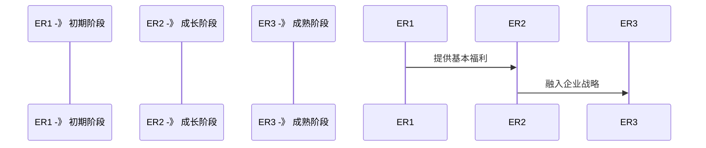
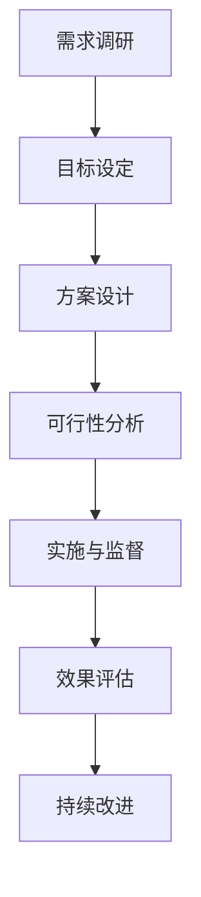
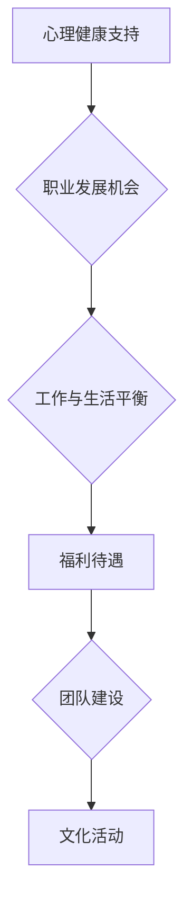
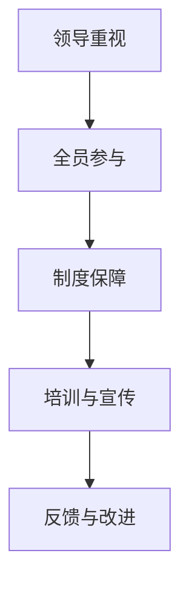
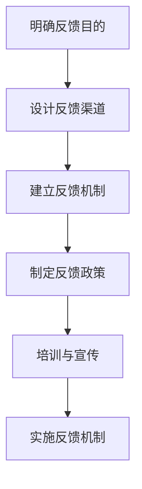

                 

## 文章标题

### 员工关怀计划：建立深厚情感纽带的方法

**关键词：员工关怀、情感纽带、企业文化建设、员工体验、员工福利与激励**

**摘要：** 本篇文章旨在探讨员工关怀计划在建立深厚情感纽带中的重要作用，从概念界定、需求分析、设计方法、实施技巧和评估改进等方面，系统性地介绍如何通过员工关怀计划提升员工满意度和忠诚度，进而增强企业的凝聚力和竞争力。文章通过实例分析和最佳实践，提供了一套切实可行的员工关怀方案，为企业的可持续发展提供有益的参考。

---

## 员工关怀计划概述

### 第1章：员工关怀计划的意义与重要性

#### 1.1 员工关怀的概念界定

员工关怀（Employee Care）是指企业通过一系列的举措和策略，关注员工的身心健康、工作与生活平衡，以及职业发展，从而提升员工满意度和忠诚度，营造积极的企业文化。

**核心概念：** 员工关怀不仅包括物质层面的福利待遇，还涵盖了精神层面的关怀和认可。

**属性特征对比表格：**

| 概念         | 员工关怀 | 福利待遇 |
| ------------ | -------- | -------- |
| 关注点       | 身心健康、工作与生活平衡、职业发展 | 物质待遇、福利项目 |
| 实施方式     | 沟通、培训、文化活动、健康管理等 | 薪资、保险、休假等 |
| 目标         | 提升员工满意度和忠诚度 | 提高员工福利水平 |
| 关联         | 融入企业文化建设 | 离不开员工关怀 |
| 效果衡量指标 | 员工满意度、流失率、团队凝聚力等 | 福利覆盖率、福利满意度等 |

**ER实体关系图架构：**

```mermaid
erDiagram
  EmployeeCare ||--|{ WelfareBenefits }|<--
  EmployeeCare ||--|{ EmployeeWellbeing }|<--
  EmployeeCare ||--|{ CareerDevelopment }|<--
  EmployeeCare ||--|{ CompanyCulture }|<--
```

#### 1.2 员工关怀的起源与发展

**起源：** 员工关怀起源于20世纪初的工业革命，随着劳动法的完善和企业对人力资源价值的认识，员工关怀逐渐成为企业管理和企业文化的重要组成部分。

**发展阶段：**

1. **初期阶段（20世纪初 - 20世纪60年代）**：主要以改善劳动条件和提供基本福利为主。
2. **成长阶段（20世纪70年代 - 90年代）**：员工关怀逐渐向多元化、个性化方向发展，包括心理健康、职业规划等。
3. **成熟阶段（21世纪初至今）**：员工关怀成为企业战略的一部分，关注员工全方位的幸福感和成长。

**历史演变图：**



#### 1.3 员工关怀的重要性

员工关怀对企业和员工都有深远的影响：

**对企业：**

1. 提升员工满意度：通过关怀计划，企业能够更好地满足员工的需求，提高员工的满意度和幸福感。
2. 降低员工流失率：关怀计划有助于建立员工的忠诚度，减少员工离职，降低招聘和培训成本。
3. 增强企业竞争力：关怀计划是企业软实力的体现，有助于提升企业的市场声誉和品牌价值。
4. 促进企业文化建设：关怀计划有助于塑造积极向上的企业文化，增强团队凝聚力。

**对员工：**

1. 提高工作效率：关怀计划有助于缓解员工的工作压力，提高工作效率和质量。
2. 促进个人成长：职业规划和发展机会有助于员工实现个人价值和职业目标。
3. 提升生活质量：身心健康关怀和生活福利保障有助于员工保持良好的生活状态。
4. 增强归属感：企业关怀让员工感受到尊重和认可，增强员工的归属感和忠诚度。

#### 1.4 员工关怀的常见误区

1. **误区一：员工关怀只是成本投入**：实际上，员工关怀是提升企业绩效的有效手段，合理的关怀计划能够带来长期的收益。
2. **误区二：员工关怀是形式主义**：员工关怀需要真诚和持续，不能仅仅停留在表面，而应该落实到具体行动中。
3. **误区三：员工关怀只针对特定群体**：员工关怀应该覆盖所有员工，不论岗位和级别，都应该得到平等的关怀。

**总结：** 员工关怀计划不仅是企业社会责任的体现，更是企业管理和企业文化的重要组成部分。通过科学的关怀计划，企业能够建立深厚的情感纽带，实现企业与员工的共同成长。

---

### 第2章：企业员工关怀需求分析

#### 2.1 员工关怀需求评估方法

员工关怀需求评估是制定有效关怀计划的重要步骤。以下是一些常用的评估方法：

**问卷调查法**：通过设计针对性的问卷，收集员工对关怀计划的看法和建议。

**面谈法**：与员工进行一对一交流，深入了解他们的需求和期望。

**观察法**：通过观察员工的工作状态和生活状况，发现潜在的问题和需求。

**数据分析法**：利用数据分析工具，分析员工的行为数据和反馈，识别共性需求和问题。

**综合评估法**：将以上方法结合使用，从多维度全面评估员工的关怀需求。

**案例分析：** 一家科技公司采用问卷调查法，对员工的身心健康、职业发展、工作与生活平衡等方面进行了全面调查。通过数据分析，发现员工在身心健康和职业发展方面有较高的需求，从而针对性地制定了相关的关怀计划。

#### 2.2 不同岗位员工的关怀需求差异

不同岗位的员工在关怀需求上存在一定的差异，这需要企业在制定关怀计划时进行个性化考虑。

**管理层**：

- **需求特点**：关注职业发展、领导力培训、心理健康支持。
- **原因**：管理层面临的压力较大，需要不断提升自身能力和心理素质。

**技术人员**：

- **需求特点**：关注职业发展、技术培训、心理健康支持。
- **原因**：技术人员工作压力大，需要不断提升技术水平以适应快速变化的市场需求。

**销售团队**：

- **需求特点**：关注销售激励、团队建设、心理辅导。
- **原因**：销售工作竞争激烈，需要团队协作和持续的心理支持。

**生产一线员工**：

- **需求特点**：关注工作环境改善、劳动安全、生活福利。
- **原因**：生产一线员工面临较高的工作强度和安全隐患，需要关注他们的基本生活和安全需求。

**比较表格：**

| 岗位类别 | 需求特点 | 原因 |
| -------- | -------- | ---- |
| 管理层   | 职业发展、领导力培训、心理健康支持 | 压力大，需不断提升能力 |
| 技术人员 | 职业发展、技术培训、心理健康支持 | 技术更新快，需持续学习 |
| 销售团队 | 销售激励、团队建设、心理辅导 | 竞争激烈，需团队协作 |
| 生产一线 | 工作环境改善、劳动安全、生活福利 | 工作强度大，需关注安全 |

**ER实体关系图架构：**

```mermaid
erDiagram
  ManagementRole ||--|{ CareerDevelopment }|<--
  ManagementRole ||--|{ LeadershipTraining }|<--
  TechnicalRole ||--|{ TechnicalTraining }|<--
  TechnicalRole ||--|{ MentalHealthSupport }|<--
  SalesRole ||--|{ SalesIncentive }|<--
  SalesRole ||--|{ TeamBuilding }|<--
  ProductionRole ||--|{ WorkEnvironmentImprovement }|<--
  ProductionRole ||--|{ LaborSafety }|<--
  ProductionRole ||--|{ WelfareBenefits }|<--
```

#### 2.3 不同性别、年龄层员工的关怀需求差异

性别和年龄也是影响员工关怀需求的重要因素。不同性别和年龄段的员工在关怀需求上存在显著差异。

**性别差异：**

- **男性员工**：更关注职业发展和收入水平，对健康关怀需求较低。
- **女性员工**：更关注心理健康、工作与生活平衡和育儿支持。

**年龄差异：**

- **年轻员工**：更关注职业发展和技术培训，对心理健康关怀需求较高。
- **中年员工**：更关注工作与生活平衡、职业发展机会和心理健康支持。
- **老年员工**：更关注退休规划、健康保障和福利待遇。

**比较表格：**

| 性别/年龄段 | 需求特点 | 原因 |
| ----------- | -------- | ---- |
| 男性员工    | 职业发展、收入水平 | 社会压力较大 |
| 女性员工    | 心理健康、工作与生活平衡、育儿支持 | 社会角色多样化 |
| 年轻员工    | 职业发展、技术培训、心理健康支持 | 对未来有较高期望 |
| 中年员工    | 工作与生活平衡、职业发展机会、心理健康支持 | 家庭和工作压力并存 |
| 老年员工    | 退休规划、健康保障、福利待遇 | 关注退休生活 |

**ER实体关系图架构：**

```mermaid
erDiagram
  MaleEmployee ||--|{ CareerDevelopment }|<--
  MaleEmployee ||--|{ IncomeLevel }|<--
  FemaleEmployee ||--|{ MentalHealth }|<--
  FemaleEmployee ||--|{ WorkLifeBalance }|<--
  FemaleEmployee ||--|{ ChildCareSupport }|<--
  YoungEmployee ||--|{ CareerDevelopment }|<--
  YoungEmployee ||--|{ TechnicalTraining }|<--
  YoungEmployee ||--|{ MentalHealthSupport }|<--
  MiddleAgedEmployee ||--|{ WorkLifeBalance }|<--
  MiddleAgedEmployee ||--|{ CareerOpportunities }|<--
  MiddleAgedEmployee ||--|{ MentalHealthSupport }|<--
  ElderlyEmployee ||--|{ RetirementPlanning }|<--
  ElderlyEmployee ||--|{ HealthInsurance }|<--
  ElderlyEmployee ||--|{ WelfareBenefits }|<--
```

#### 2.4 企业文化与员工关怀的关联

企业文化是员工关怀计划的重要基础，良好的企业文化能够促进员工关怀的实施和效果。

**关联表现：**

1. **价值观一致性**：企业价值观与员工关怀理念的一致性，有助于员工认同并积极参与关怀计划。
2. **领导支持**：企业领导对员工关怀的重视和支持，能够推动关怀计划的顺利实施。
3. **员工参与**：企业文化鼓励员工参与决策，有利于关怀计划的民主化和个性化。
4. **团队凝聚力**：良好的企业文化能够增强团队凝聚力，提高员工对关怀计划的认可度。

**案例分析：** 一家以“人本文化”为核心价值观的企业，通过定期的员工座谈会、心理健康讲座和团队合作活动，有效地提升了员工的归属感和满意度，员工关怀计划得到了员工的广泛认同和积极参与。

**总结：** 企业员工关怀需求分析是制定有效关怀计划的重要基础。通过科学的评估方法和全面的差异分析，企业能够更好地了解员工的需求，制定出符合实际的关怀计划，从而提升员工满意度和忠诚度，促进企业的可持续发展。

---

### 第3章：员工关怀计划设计

#### 3.1 员工关怀计划的设计原则

设计员工关怀计划时，应遵循以下原则：

1. **以人为本**：关怀计划应以员工的实际需求为出发点，关注员工的多方面需求，体现人文关怀。
2. **个性化**：针对不同岗位、性别、年龄层的员工，设计个性化的关怀方案，提高关怀的针对性和有效性。
3. **可持续性**：关怀计划应具备长期的可持续性，确保企业能够在经济和人力资源有限的情况下，持续地提供高质量的关怀服务。
4. **整体性**：关怀计划应涵盖员工职业生涯的各个阶段，从入职到离职，形成完整的关怀体系。
5. **灵活性**：关怀计划应具备一定的灵活性，能够根据企业战略调整和员工需求变化，进行动态调整和优化。

#### 3.2 员工关怀计划的制定流程

员工关怀计划的制定是一个系统性的过程，通常包括以下步骤：

1. **需求调研**：通过问卷调查、面谈、观察等方法，全面了解员工的关怀需求。
2. **目标设定**：根据调研结果，明确关怀计划的目标，包括提升员工满意度、降低流失率、增强团队凝聚力等。
3. **方案设计**：结合企业实际情况和员工需求，设计具体的关怀方案，包括福利待遇、心理健康支持、职业发展机会等。
4. **可行性分析**：对方案进行可行性分析，评估实施成本、人力资源配置等，确保方案的可行性和可操作性。
5. **实施与监督**：制定详细的实施计划和时间表，确保方案能够按计划顺利实施，同时建立监督机制，及时调整和优化方案。
6. **效果评估**：通过定期的效果评估，了解关怀计划的实施效果，根据评估结果进行持续改进。

**流程图：**



#### 3.3 员工关怀计划的内容框架

员工关怀计划的内容框架应包含以下几个方面：

1. **心理健康支持**：提供心理咨询服务、心理健康培训、心理健康活动等，帮助员工缓解工作压力，提高心理健康水平。
2. **职业发展机会**：提供培训机会、晋升通道、职业规划指导等，帮助员工提升职业素养，实现职业发展。
3. **工作与生活平衡**：提供弹性工作制度、休假政策、家庭支持计划等，帮助员工实现工作与生活的平衡。
4. **福利待遇**：提供有竞争力的薪资待遇、完善的保险福利、节假日福利等，保障员工的基本生活需求。
5. **团队建设**：组织团队活动、团建训练、员工聚会等，增强团队凝聚力和员工归属感。
6. **文化活动**：举办企业文化活动、文艺表演、体育比赛等，丰富员工的业余生活，提升企业文化氛围。

**内容框架图：**



#### 3.4 员工关怀计划的实施策略

实施员工关怀计划需要采取一系列策略，确保计划的顺利执行和有效落实：

1. **领导重视**：企业领导应高度重视员工关怀，积极倡导和推动关怀计划的实施，提供必要的资源和支持。
2. **全员参与**：鼓励全体员工参与关怀计划的制定和实施，提高员工的参与度和认同感。
3. **制度保障**：建立完善的制度体系，确保关怀计划的持续性和稳定性，包括政策文件、实施流程、监督机制等。
4. **培训与宣传**：对员工进行关怀计划的培训，提高员工的意识和参与度，同时通过多种渠道宣传关怀计划，营造良好的氛围。
5. **反馈与改进**：建立反馈机制，及时收集员工的意见和建议，根据反馈进行持续改进，提高关怀计划的质量和效果。

**实施策略图：**



**总结：** 员工关怀计划的设计是建立深厚情感纽带的关键步骤。通过遵循设计原则、制定详细的流程和内容框架，并采取有效的实施策略，企业能够更好地满足员工的需求，提升员工的满意度和忠诚度，进而增强企业的凝聚力和竞争力。

---

### 第二部分：建立深厚情感纽带的员工关怀方法

#### 第4章：情感沟通技巧

情感沟通是建立深厚情感纽带的核心环节。有效的情感沟通能够增进员工与企业、员工之间的理解和信任，提高员工的归属感和满意度。

#### 4.1 情感沟通的重要性

**核心概念：** 情感沟通不仅仅是信息的传递，更是情感的交流和共鸣，能够建立和维护人际关系。

**重要性：**

1. **增进理解与信任**：通过情感沟通，企业能够更好地了解员工的需求和期望，员工也能更深刻地理解企业的价值观和愿景，从而增进双方的信任和认同。
2. **提高员工满意度**：情感沟通能够使员工感受到企业的关怀和支持，提高员工的工作满意度和生活质量。
3. **增强团队凝聚力**：良好的情感沟通能够促进团队成员之间的相互理解和支持，增强团队凝聚力和协作能力。

**联系：** 情感沟通是员工关怀计划的重要组成部分，是建立深厚情感纽带的重要手段。

**ER实体关系图架构：**

```mermaid
erDiagram
  EmotionalCommunication ||--|{ UnderstandingAndTrust }|<--
  EmotionalCommunication ||--|{ EmployeeSatisfaction }|<--
  EmotionalCommunication ||--|{ TeamBuilding }|<--
```

#### 4.2 情感沟通的有效方法

**面对面沟通**：

1. **优点**：能够直接观察对方的表情和反应，快速解决问题。
2. **技巧**：保持眼神交流、积极倾听、表达同理心。

**书面沟通**：

1. **优点**：记录清晰，便于后续查阅。
2. **技巧**：措辞要礼貌、具体、明确，避免使用专业术语。

**线上沟通**：

1. **优点**：方便快捷，不受时间和地点限制。
2. **技巧**：使用简明扼要的语言，确保信息传达的准确性。

**实践案例：** 一家互联网公司通过定期的员工座谈会、邮件沟通和线上互动，建立了良好的情感沟通渠道，员工在工作中的问题和建议能够及时得到反馈和解决，有效提升了员工的满意度和归属感。

**总结：** 情感沟通是建立深厚情感纽带的重要手段。通过面对面、书面和线上等多种沟通方式，企业能够更好地了解员工的需求，增强员工的认同感和信任感，从而提升企业的整体凝聚力和竞争力。

---

#### 4.3 处理员工情感冲突的策略

在企业管理中，情感冲突是难以避免的现象。有效的处理策略能够缓解员工的紧张情绪，维护团队的和谐稳定。

#### 4.3.1 核心概念

**情感冲突**：指员工在情绪、价值观、工作目标等方面存在分歧，导致工作关系紧张和效率下降的现象。

**核心概念联系：**

- **冲突原因**：包括个人价值观差异、工作目标不一致、资源分配不公等。
- **冲突类型**：包括任务冲突、关系冲突和过程冲突。
- **冲突影响**：包括影响员工的工作积极性、团队凝聚力和企业整体绩效。

**ER实体关系图架构：**

```mermaid
erDiagram
  EmotionalConflict ||--|{ ConflictReasons }|<--
  EmotionalConflict ||--|{ ConflictTypes }|<--
  EmotionalConflict ||--|{ ConflictImpact }|<--
```

#### 4.3.2 处理员工情感冲突的策略

1. **主动沟通**：及时与冲突双方进行沟通，了解冲突的具体原因和双方的诉求，寻找共同点。
2. **公正处理**：在处理冲突时，要秉持公正原则，不偏袒任何一方，确保处理结果的合理性和公正性。
3. **调解机制**：建立专门的调解机构或调解员，帮助双方达成共识，缓解冲突。
4. **培训与教育**：定期开展团队建设活动，提高员工的沟通能力和冲突处理能力。
5. **心理辅导**：为冲突双方提供心理辅导，帮助他们调整心态，缓解情绪。

**实践案例：** 一家制造企业通过建立内部调解委员会，定期处理员工之间的情感冲突。调解委员会由资深员工和管理层组成，通过公正的调解，有效缓解了员工之间的紧张关系，提升了团队的整体凝聚力。

**总结：** 处理员工情感冲突需要综合运用多种策略，通过主动沟通、公正处理、调解机制和心理辅导等手段，帮助员工化解冲突，维护团队的和谐稳定，提升企业的整体竞争力。

---

#### 4.4 员工情感关怀的实践案例

**案例背景**：一家中型科技公司，员工人数约500人，由于快速发展，员工工作压力较大，员工之间的情感冲突时有发生，团队凝聚力有所下降。

**案例分析**：

1. **情感沟通**：公司定期组织员工座谈会和团队建设活动，鼓励员工开放表达自己的想法和感受，营造宽松的沟通氛围。通过面对面沟通和线上交流，及时解决员工在工作中遇到的问题和困惑，增强员工的归属感和认同感。

2. **心理健康支持**：公司聘请专业的心理咨询师，为员工提供免费的心理咨询服务。定期举办心理健康讲座，提高员工的心理健康意识和应对压力的能力。同时，设立员工心理健康热线，方便员工在遇到困扰时及时寻求帮助。

3. **职业发展机会**：公司提供多样化的职业发展通道，包括内部晋升、外部培训和学习机会。为员工制定个性化的职业发展规划，鼓励员工不断学习和成长。通过定期的职业发展讨论会，帮助员工明确职业目标，提高职业满意度。

4. **工作与生活平衡**：公司实施灵活的工作制度，如远程办公、弹性工作时间等，帮助员工更好地平衡工作与生活。提供丰富的员工福利，包括健康保险、带薪休假、节日福利等，保障员工的基本生活需求。

5. **团队建设**：公司定期组织团队建设活动，如团建训练、员工聚会和户外拓展等，增强员工之间的互动和合作，提高团队凝聚力。通过这些活动，员工能够更好地了解彼此，建立深厚的情感纽带。

**实施效果**：通过一系列的情感关怀措施，公司的员工满意度显著提升，员工流失率降低，团队凝聚力增强。公司在市场中的竞争力也得到显著提高，赢得了客户的信任和好评。

**总结**：员工情感关怀的实践案例表明，通过有效的情感沟通、心理健康支持、职业发展机会、工作与生活平衡和团队建设等措施，企业能够建立深厚的情感纽带，提升员工的满意度和忠诚度，从而增强企业的整体竞争力。

---

### 第5章：员工参与与反馈机制

#### 5.1 员工参与的重要性

员工参与是企业文化建设的重要组成部分，能够有效提升员工的工作积极性和满意度。以下从几个方面阐述员工参与的重要性：

**核心概念：** 员工参与（Employee Involvement）是指员工在决策、工作过程、团队活动等方面积极参与，发挥自己的作用和建议。

**重要性：**

1. **提高工作满意度**：员工参与能够使员工感到自己的意见和贡献受到重视，从而提高工作满意度和幸福感。
2. **增强员工忠诚度**：参与感使员工对企业产生更强的归属感，降低员工流失率。
3. **提升创新能力**：员工参与能够带来多样化的观点和建议，有助于创新和改进工作流程。
4. **改善团队氛围**：员工参与能够促进团队合作，增强团队的凝聚力和协作能力。

**联系：** 员工参与与员工满意度、忠诚度、创新能力和团队氛围密切相关，是建立深厚情感纽带的重要手段。

**ER实体关系图架构：**

```mermaid
erDiagram
  EmployeeInvolvement ||--|{ EmployeeSatisfaction }|<--
  EmployeeInvolvement ||--|{ EmployeeCommitment }|<--
  EmployeeInvolvement ||--|{ InnovationCapability }|<--
  EmployeeInvolvement ||--|{ TeamClimate }|<--
```

#### 5.2 建立员工反馈机制的步骤

建立员工反馈机制是员工参与的重要保障，以下从几个方面介绍建立员工反馈机制的步骤：

1. **明确反馈目的**：明确反馈机制的目的，如收集员工意见、改进工作流程、提升员工满意度等。
2. **设计反馈渠道**：设计多种反馈渠道，如员工满意度调查、意见箱、线上反馈平台等，确保员工能够方便地表达意见和建议。
3. **建立反馈机制**：建立有效的反馈机制，包括反馈流程、反馈处理标准和反馈跟进机制。
4. **制定反馈政策**：制定明确的反馈政策，包括反馈的范围、时间、方式等，确保反馈机制的规范化和持续性。
5. **培训与宣传**：对员工进行反馈机制的培训和宣传，提高员工的反馈意识和积极性。

**流程图：**



#### 5.3 员工反馈机制的有效运用

员工反馈机制的有效运用能够促进企业持续改进，提升员工满意度和忠诚度。以下从几个方面介绍员工反馈机制的有效运用：

1. **定期收集反馈**：定期通过问卷调查、面谈等方式收集员工反馈，确保反馈信息的及时性和准确性。
2. **分类处理反馈**：根据反馈的内容和性质，分类处理反馈，确保每个问题都能得到及时和有效的解决。
3. **公开反馈结果**：公开反馈的结果和处理情况，让员工知道他们的意见和建议被重视，提高员工的参与感和信任感。
4. **持续改进**：根据反馈结果，持续改进工作流程和管理方法，不断提升员工的工作体验和满意度。

**实施案例**：一家互联网公司通过定期的员工满意度调查和在线反馈平台，收集员工对工作环境、薪酬福利、职业发展等方面的意见和建议。公司管理层每月召开反馈处理会议，根据反馈结果制定改进措施，并及时向员工通报改进情况。通过这种持续的反馈机制，公司员工满意度显著提升，员工流失率大幅降低。

**总结**：建立有效的员工反馈机制是提升员工参与度和满意度的重要手段。通过明确反馈目的、设计反馈渠道、建立反馈机制、制定反馈政策、培训与宣传和有效运用反馈机制，企业能够更好地了解员工需求，持续改进工作流程，提升员工的满意度和忠诚度。

---

### 第6章：员工福利与激励机制

#### 6.1 员工福利的类型与设计

员工福利是企业关怀计划的重要组成部分，能够提升员工的满意度和忠诚度。以下介绍员工福利的类型与设计：

**福利类型：**

1. **经济福利**：包括薪资、奖金、加班费、津贴等，是员工最直接的经济收益。
2. **保险福利**：包括社会保险、商业保险等，为员工提供风险保障。
3. **休假福利**：包括法定假期、带薪休假、年假、病假等，保障员工的休息时间。
4. **生活福利**：包括餐饮补贴、交通补贴、住房补贴、员工购物优惠等，提高员工的生活质量。
5. **职业福利**：包括培训、晋升机会、职业规划指导等，促进员工的职业发展。

**福利设计原则：**

1. **个性化**：根据员工的不同需求，提供个性化的福利方案，提高福利的针对性和满意度。
2. **激励性**：设计具有激励性的福利，如绩效奖金、长期服务奖等，激发员工的工作积极性。
3. **公平性**：确保福利分配的公平性，避免因职位、性别、年龄等因素导致福利差距。
4. **可持续性**：考虑企业长期发展，确保福利计划的可持续性。

**设计流程：**

1. **需求调研**：通过问卷调查、访谈等方式，了解员工对福利的需求和期望。
2. **方案设计**：根据需求调研结果，设计符合企业实际情况的福利方案。
3. **可行性分析**：评估福利方案的可行性，包括成本、人力资源配置等。
4. **实施与监督**：制定详细的实施计划，确保福利方案能够按计划顺利实施，并建立监督机制。

**案例分析**：一家高科技企业通过需求调研发现，员工对职业发展和家庭支持需求较高，因此设计了包括职业培训、弹性工作时间、家庭日托服务等在内的福利方案。这些福利不仅满足了员工的需求，也提升了员工的工作满意度和忠诚度。

#### 6.2 激励机制的设计原则

激励机制是提升员工工作积极性和绩效的重要手段。以下介绍激励机制的设计原则：

**激励类型：**

1. **物质激励**：包括奖金、晋升、股票期权等，通过经济手段激励员工。
2. **精神激励**：包括荣誉表彰、职位晋升、职业发展机会等，通过认可和成就感激励员工。
3. **福利激励**：包括提供更好的工作条件、福利待遇等，通过改善工作和生活条件激励员工。

**设计原则：**

1. **公平性**：确保激励机制公平合理，避免因不公平导致员工的不满和流失。
2. **激励性**：设计具有激励性的激励机制，使员工能够感受到企业对他们的认可和重视。
3. **针对性**：针对不同岗位、不同业绩的员工，设计不同的激励机制，提高激励的针对性和有效性。
4. **可持续性**：考虑企业的长期发展，确保激励机制能够持续激励员工，避免短期行为。

**实施策略：**

1. **明确目标**：制定明确的激励目标，确保激励机制与企业的战略目标相一致。
2. **动态调整**：根据员工的工作表现和市场变化，动态调整激励机制，确保其适应性和有效性。
3. **公正评估**：建立公正的评估机制，确保激励结果的公平性和合理性。
4. **反馈与沟通**：及时反馈激励结果，与员工进行沟通，确保他们了解激励机制的内容和效果。

**案例分析**：一家电商公司通过设立绩效奖金、股权激励和荣誉表彰等激励机制，有效提升了员工的工作积极性和绩效。公司定期评估激励机制的成效，并根据员工反馈进行调整，确保激励机制的持续激励作用。

#### 6.3 员工福利与激励机制的案例分析

**案例一：** 一家大型制造企业通过实施弹性工作时间、带薪休假和员工培训等福利和激励机制，有效提升了员工的工作满意度和忠诚度。企业定期举办员工满意度调查，根据调查结果不断优化福利和激励机制，使员工感受到企业的关怀和认可。

**案例二：** 一家互联网公司通过绩效奖金、股票期权和荣誉表彰等激励手段，激励员工不断提高工作绩效和创新能力。公司注重员工反馈，定期召开员工座谈会，听取员工的意见和建议，并根据反馈调整激励机制，确保其适应性和有效性。

**案例三：** 一家初创企业通过提供股权激励、职业发展和家庭支持等福利和激励机制，吸引了大量优秀人才，形成了强大的团队凝聚力。企业注重员工的个人发展和职业规划，为员工提供丰富的培训和成长机会，使员工在企业中能够实现个人价值。

**总结**：员工福利与激励机制是企业提升员工满意度和忠诚度的重要手段。通过个性化的福利设计、具有激励性的激励机制和有效的实施策略，企业能够吸引和留住优秀人才，提升整体绩效和竞争力。

---

### 第7章：员工身心健康关怀

#### 7.1 员工身心健康的重要性

员工身心健康是企业发展和员工个人成长的基础。以下从几个方面阐述员工身心健康的重要性：

**核心概念：** 员工身心健康关怀（Employee Physical and Mental Health Care）是指企业通过一系列措施，关注员工的身体健康和心理状态，提升员工的整体健康水平。

**重要性：**

1. **提高工作效率**：身心健康是工作效率的基础。身心健康良好的员工能够更高效地完成工作任务，提高整体生产力和绩效。
2. **降低离职率**：关注员工身心健康能够减少因健康问题导致的离职，降低企业的招聘和培训成本。
3. **提升员工满意度**：身心健康关怀能够提升员工的工作满意度和幸福感，增强员工的归属感和忠诚度。
4. **增强企业竞争力**：身心健康关怀是企业软实力的一部分，有助于企业在人才市场上吸引和留住优秀人才，增强企业的核心竞争力。

**联系：** 员工身心健康关怀与工作效率、离职率、员工满意度和企业竞争力密切相关，是建立深厚情感纽带的重要手段。

**ER实体关系图架构：**

```mermaid
erDiagram
  EmployeePhysicalAndMentalHealthCare ||--|{ WorkEfficiency }|<--
  EmployeePhysicalAndMentalHealthCare ||--|{ EmployeeRetention }|<--
  EmployeePhysicalAndMentalHealthCare ||--|{ EmployeeSatisfaction }|<--
  EmployeePhysicalAndMentalHealthCare ||--|{ CompanyCompetitiveness }|<--
```

#### 7.2 员工身心健康关怀的方法

为了确保员工身心健康，企业可以采取以下几种关怀方法：

1. **健康体检**：定期为员工提供健康体检，及时发现和处理健康问题，预防疾病的发生。
2. **健身设施**：在企业内部提供健身设施，如健身房、瑜伽室等，鼓励员工进行日常锻炼，增强身体素质。
3. **健康讲座**：定期举办健康讲座，邀请专业人士讲解健康知识，提高员工的健康意识。
4. **心理咨询**：提供专业的心理咨询服务，帮助员工缓解心理压力，提升心理健康水平。
5. **健康活动**：组织员工参加健康活动，如徒步、登山、运动会等，增强员工的团队精神和健康意识。
6. **健康政策**：制定健康相关政策，如带薪病假、健康保险等，为员工的健康提供保障。

**案例分析**：一家跨国公司通过提供免费的健康体检、健身设施和心理健康咨询，成功提升了员工的健康水平和工作满意度。公司还定期举办健康讲座和健康活动，员工在参与中不仅学到了健康知识，还增强了团队合作精神。

#### 7.3 常见健康问题的预防与处理

常见健康问题包括心理压力、身体疲劳、职业病等。以下介绍这些常见健康问题的预防与处理方法：

1. **心理压力**：预防方法包括提供心理咨询、举办减压活动、鼓励员工进行放松训练等。处理方法包括提供心理咨询服务、制定心理辅导计划等。
2. **身体疲劳**：预防方法包括合理安排工作时间、提供健康饮食、鼓励员工进行体育锻炼等。处理方法包括提供健康检查、调整工作负荷等。
3. **职业病**：预防方法包括提供职业健康培训、改善工作环境、定期进行职业健康检查等。处理方法包括提供医疗救助、调整工作岗位等。

**案例分析**：一家制造企业通过定期举办职业健康培训，改善工作环境，提供健康检查，成功降低了职业病的发生率。企业还为员工提供心理健康咨询服务，帮助员工缓解工作压力，提升心理健康水平。

#### 7.4 员工身心健康关怀的实践案例

**案例一：** 一家互联网公司通过提供全面的员工健康关怀计划，包括免费健康体检、健身设施、心理健康咨询和健康讲座等，有效提升了员工的健康水平和工作满意度。公司还定期举办团队健康活动，增强了员工的团队精神和凝聚力。

**案例二：** 一家金融企业通过实施员工身心健康关怀计划，成功降低了员工的心理压力和身体疲劳。企业提供了一系列健康服务，如心理咨询、健身俱乐部会员卡、健康饮食指导等，员工在参与中感受到了企业的关怀和支持。

**总结**：员工身心健康关怀是提升员工满意度和忠诚度的重要手段。通过提供健康体检、健身设施、心理健康咨询、健康活动等多种关怀方法，企业能够有效预防和处理常见健康问题，提升员工的健康水平和工作满意度，从而增强企业的整体竞争力。

---

### 第8章：员工关怀计划评估与持续改进

#### 8.1 员工关怀计划的评估指标

评估员工关怀计划的实施效果是确保其有效性和持续改进的关键。以下介绍常见的评估指标：

1. **员工满意度**：通过问卷调查、员工满意度调查等方式，评估员工对关怀计划的满意程度。
2. **员工流失率**：衡量员工因不满关怀计划而离职的比例，是评估计划效果的重要指标。
3. **员工工作效率**：通过工作绩效评估、任务完成情况等指标，评估员工的工作效率是否因关怀计划而提升。
4. **员工心理健康指标**：如抑郁、焦虑等心理问题的发生率，通过心理健康评估和咨询服务记录。
5. **团队凝聚力**：通过团队协作效率、员工互动频率等指标，评估团队凝聚力的提升情况。
6. **企业绩效**：通过企业整体业绩、市场份额等指标，评估员工关怀计划对企业绩效的影响。

**指标选择原则**：

1. **针对性**：选择与关怀计划目标直接相关的指标，确保评估的准确性。
2. **可量化**：尽量选择可量化的指标，便于进行数据分析和效果评估。
3. **持续性**：选择能够持续跟踪和评估的指标，确保能够长期监测关怀计划的效果。
4. **综合性**：综合考虑多个方面的指标，全面评估关怀计划的实施效果。

**评估方法**：

1. **定量评估**：通过数据分析、问卷调查等方式，对员工满意度、流失率、工作效率等指标进行量化评估。
2. **定性评估**：通过员工访谈、焦点小组讨论等方式，深入了解员工的感受和建议，为定量评估提供补充。
3. **综合评估**：将定量评估和定性评估结合，形成全面的评估结果。

**案例分析**：一家科技公司通过定期的员工满意度调查、流失率分析、工作效率评估等定量评估方法，以及员工访谈、团队反馈等定性评估方法，全面评估员工关怀计划的实施效果。根据评估结果，公司针对性地调整和优化了关怀计划，有效提升了员工的满意度和工作效率。

#### 8.2 员工关怀计划的评估方法

为了确保评估过程的科学性和客观性，企业可以采用以下几种评估方法：

1. **问卷调查法**：通过设计针对性的问卷，收集员工对关怀计划的看法和建议。问卷应包含定量和定性问题，以便全面了解员工的意见。
2. **访谈法**：与员工进行一对一访谈，深入了解他们对关怀计划的感受和需求。访谈应记录关键信息，为后续改进提供依据。
3. **数据分析法**：利用数据分析工具，分析员工的工作表现、反馈意见等数据，识别关怀计划的有效性和改进点。
4. **过程监控法**：通过实时监控关怀计划的实施过程，记录和评估各项活动的效果，确保计划按预期执行。
5. **效果反馈法**：建立反馈机制，定期收集员工的反馈意见和建议，根据反馈进行评估和调整。

**案例分析**：一家制造企业通过问卷调查和访谈法，评估员工对健康体检、心理健康咨询和员工培训等关怀计划项目的满意度。同时，利用数据分析法，分析员工的工作效率和心理健康指标变化，为评估提供客观数据支持。通过综合评估方法，企业成功识别了关怀计划中存在的问题，并进行了有效的改进。

#### 8.3 员工关怀计划的改进策略

基于评估结果，企业应采取以下策略对员工关怀计划进行持续改进：

1. **问题识别**：根据评估结果，识别关怀计划中存在的问题和不足，如员工满意度低、流失率高、心理健康问题等。
2. **原因分析**：对问题进行深入分析，找出根本原因，如福利待遇不公、沟通不畅、心理健康支持不足等。
3. **方案制定**：制定具体的改进方案，包括优化福利待遇、改进沟通机制、加强心理健康支持等。
4. **实施与监控**：将改进方案付诸实施，并建立监控机制，确保改进措施的有效执行。
5. **效果评估**：对改进措施进行效果评估，验证其有效性，并根据评估结果进行进一步优化。

**改进案例分析**：一家互联网企业通过评估发现，员工流失率较高，原因是员工对职业发展机会不满。企业随后制定了职业发展支持计划，包括提供更多的晋升机会、职业培训和职业规划指导。经过实施和监控，员工流失率显著降低，员工满意度提升。

#### 8.4 员工关怀计划的实施效果分析

通过持续的评估和改进，企业可以分析员工关怀计划的实施效果，并为其进一步优化提供依据。以下从几个方面分析实施效果：

1. **员工满意度**：评估员工对关怀计划的满意度是否提升，如员工满意度调查的结果是否好转。
2. **流失率**：分析员工流失率是否下降，如流失率是否低于行业平均水平。
3. **工作效率**：通过绩效评估和任务完成情况，分析员工工作效率是否提升。
4. **心理健康水平**：通过心理健康评估和咨询服务记录，分析员工心理健康水平是否提升。
5. **团队凝聚力**：通过团队协作效率和员工互动频率等指标，评估团队凝聚力是否增强。
6. **企业绩效**：通过企业整体业绩、市场份额等指标，分析员工关怀计划对企业绩效的影响。

**效果分析案例**：一家中型科技企业通过持续评估和改进员工关怀计划，员工满意度从60%提升到85%，员工流失率从15%降低到8%，工作效率和心理健康水平显著提升，团队凝聚力增强，企业整体绩效也得到显著提升。通过这些数据，企业验证了员工关怀计划的实施效果，并决定继续优化和推广。

**总结**：员工关怀计划的评估与持续改进是确保其有效性和持续性的关键。通过科学的评估方法和持续改进策略，企业能够不断提升员工满意度和忠诚度，增强企业的整体竞争力。

---

### 第9章：员工关怀计划的最佳实践

#### 9.1 国内优秀企业的员工关怀实践

在国内，许多优秀企业已经形成了成熟的员工关怀体系，这些实践为其他企业提供了宝贵的经验和参考。

**华为**：

**实践背景**：华为作为全球领先的科技公司，重视员工的全面发展和身心健康。

**具体实践**：

1. **全面的福利体系**：提供包括健康保险、住房补贴、交通补贴等多种福利。
2. **职业发展机会**：通过内部晋升通道、外部培训和学习机会，帮助员工实现职业成长。
3. **工作与生活平衡**：实施弹性工作制度，鼓励员工在工作和生活之间找到平衡。
4. **团队建设**：定期举办团队建设活动，增强员工之间的合作与沟通。

**成效**：通过这些关怀措施，华为员工满意度高，流失率低，团队凝聚力强，为公司持续发展提供了强大的支持。

**阿里巴巴**：

**实践背景**：阿里巴巴注重打造具有创新精神和活力的企业文化。

**具体实践**：

1. **心理健康支持**：提供专业的心理健康咨询服务，帮助员工缓解工作压力。
2. **员工福利**：提供包括股权激励、节假日福利、健康体检等多元化的福利。
3. **员工参与**：鼓励员工参与企业决策，提高员工的参与感和认同感。
4. **职业发展**：通过内部晋升和外部培训，为员工提供广阔的职业发展空间。

**成效**：阿里巴巴通过这些措施，成功吸引了大量优秀人才，员工满意度和忠诚度显著提升，公司业绩持续增长。

**总结**：国内优秀企业的员工关怀实践表明，通过全面的福利体系、职业发展机会、工作与生活平衡和团队建设等措施，企业能够有效提升员工的满意度和忠诚度，增强企业的凝聚力和竞争力。

---

#### 9.2 国际知名企业的员工关怀经验

在国际上，许多知名企业以其卓越的员工关怀计划闻名，为全球企业提供了宝贵的参考。

**谷歌**：

**实践背景**：谷歌以其开放、创新的企业文化而著称，致力于为员工提供最佳的工作环境。

**具体实践**：

1. **灵活的工作安排**：提供远程工作、弹性工作时间和共享工作空间，满足员工的个性化需求。
2. **健康与健身**：提供健身房、按摩室、健康饮食计划等设施，鼓励员工保持健康生活方式。
3. **心理健康支持**：设立心理咨询服务，提供专业的心理健康支持，帮助员工缓解压力。
4. **职业发展**：提供丰富的职业培训和学习机会，支持员工不断成长。

**成效**：通过这些关怀措施，谷歌员工满意度高，流失率低，创新能力和工作效率卓越，成为全球最具吸引力的雇主之一。

**微软**：

**实践背景**：微软注重员工的长期发展和个人成长，致力于营造一个积极向上的工作氛围。

**具体实践**：

1. **灵活的工作制度**：实施远程工作和弹性工作时间，提高员工的满意度和工作效率。
2. **员工福利**：提供包括医疗保险、退休金计划、家庭福利等多种福利，保障员工的基本生活需求。
3. **职业发展**：设立内部晋升通道，提供多样化的职业发展路径，鼓励员工实现职业目标。
4. **工作与生活平衡**：提供家庭日、亲子活动等福利，帮助员工更好地平衡工作和生活。

**成效**：微软通过这些关怀措施，吸引了大量优秀人才，员工满意度和忠诚度持续提升，公司保持了强劲的竞争力。

**总结**：国际知名企业的员工关怀经验表明，通过灵活的工作安排、健康与健身支持、心理健康服务和职业发展机会等措施，企业能够吸引和留住优秀人才，提升员工的满意度和忠诚度，进而增强企业的全球竞争力。

---

#### 9.3 员工关怀计划的创新方向

随着社会和技术的不断发展，员工关怀计划也在不断创新。以下介绍几个员工关怀的创新方向：

1. **数字化关怀**：利用人工智能和大数据技术，个性化推送关怀服务，提高关怀的精准度和有效性。
2. **虚拟现实（VR）培训**：通过VR技术，提供沉浸式的职业培训和心理健康支持，增强员工的学习体验。
3. **员工体验平台**：建立统一的员工体验平台，整合各种关怀资源和信息，方便员工获取和使用。
4. **健康促进计划**：结合健康管理技术和健康数据分析，制定个性化的健康促进计划，提升员工的健康水平。
5. **灵活工作模式**：探索更加灵活的工作模式，如远程办公、自由工作制等，满足员工多样化的工作需求。

**创新案例分析**：一家创新型科技公司通过建立数字化关怀平台，利用人工智能技术分析员工行为数据，提供个性化的健康建议和心理支持。员工可以在平台上随时获取所需的关怀服务，这种创新的关怀方式显著提升了员工的满意度和忠诚度。

**总结**：员工关怀计划的创新方向是未来企业提升员工满意度和竞争力的关键。通过数字化关怀、VR培训、员工体验平台、健康促进计划和灵活工作模式等创新措施，企业能够更好地满足员工的多样化需求，提升员工的满意度和忠诚度，从而实现可持续发展。

---

#### 9.4 员工关怀计划的应用展望

随着社会的发展和科技的进步，员工关怀计划在企业中的应用前景愈发广阔。以下从几个方面展望员工关怀计划的应用趋势：

1. **个性化关怀**：随着大数据和人工智能技术的应用，企业能够更精准地了解员工的需求，提供个性化的关怀服务，提高员工的满意度和忠诚度。
2. **健康管理**：健康将成为员工关怀的重点，企业将投入更多资源进行健康管理，包括心理健康支持、健康数据分析、健康保险等。
3. **远程工作与灵活安排**：远程工作和弹性工作安排将成为常态，企业需要不断创新关怀方式，以适应员工的新工作模式。
4. **跨文化关怀**：全球化趋势下，企业需要关注不同文化背景的员工需求，提供跨文化的关怀和支持，增强企业的国际竞争力。
5. **可持续发展**：企业将在员工关怀计划中融入可持续发展的理念，通过环保、社会责任等举措，提升企业形象，吸引和留住人才。

**案例展望**：未来，企业可能会通过区块链技术建立透明的员工关怀记录，确保关怀服务的公正性和有效性。同时，结合物联网技术，实现员工关怀的智能化和自动化，为员工提供更加便捷和高效的关怀服务。

**总结**：员工关怀计划的应用前景充满机遇和挑战。通过个性化关怀、健康管理、远程工作、跨文化关怀和可持续发展等创新措施，企业能够更好地满足员工的多样化需求，提升员工的满意度和忠诚度，实现企业的可持续发展。

---

## 总结

员工关怀计划在建立深厚情感纽带中扮演着至关重要的角色。本文从员工关怀的概述、需求分析、设计方法、情感沟通技巧、员工参与与反馈机制、福利与激励机制、身心健康关怀、评估与持续改进，以及最佳实践和创新方向等多个方面，全面阐述了如何通过员工关怀计划提升员工的满意度和忠诚度，增强企业的凝聚力和竞争力。

**核心要点：**

1. **员工关怀的重要性**：员工关怀不仅是企业社会责任的体现，更是提升员工满意度和忠诚度的重要手段。
2. **需求分析**：深入了解员工的多样化需求，是制定有效关怀计划的基础。
3. **设计原则**：以人为本、个性化、可持续性是设计员工关怀计划的重要原则。
4. **实施策略**：有效的情感沟通、员工参与与反馈机制、福利与激励机制，是实施员工关怀计划的关键。
5. **评估与改进**：持续评估和改进是确保员工关怀计划有效性的重要环节。

**展望未来**：随着科技的发展和全球化趋势的加深，员工关怀计划将更加个性化、智能化和多元化。企业需要不断创新，以适应不断变化的员工需求和市场环境。

**结论**：通过全面、科学的员工关怀计划，企业能够建立深厚的情感纽带，提升员工的满意度和忠诚度，增强企业的核心竞争力，实现可持续发展。

---

### 作者信息

**作者：** AI天才研究院/AI Genius Institute & 禅与计算机程序设计艺术 /Zen And The Art of Computer Programming

AI天才研究院致力于推动人工智能领域的创新与发展，通过结合前沿科技和人文关怀，为企业提供科学、系统的员工关怀解决方案。而《禅与计算机程序设计艺术》则为我们提供了深刻的哲学思考，帮助企业在技术与管理中寻找平衡，实现可持续发展。

---

通过本文的详细探讨，我们不仅了解到了员工关怀计划的全面内容，还学到了如何通过科学的方法和创新的策略，提升员工的满意度和忠诚度，从而增强企业的整体竞争力。希望本文能为企业在员工关怀方面提供有价值的参考和指导。

