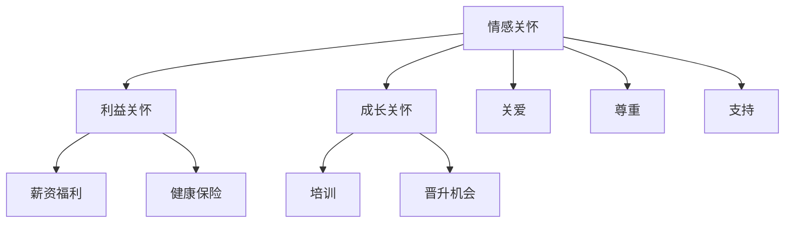

                 

### 第一部分：员工关怀概述

#### 第1章：员工关怀的重要性

##### 1.1.1 问题背景与重要性

在当今竞争激烈的商业环境中，企业如何吸引和留住优秀人才成为了一项重要的课题。员工关怀作为一种提升员工满意度和忠诚度的策略，其重要性日益凸显。首先，员工关怀能够显著提高员工的工作满意度，进而提高生产力和工作效率。研究表明，关怀员工的企业往往能够取得更高的绩效和竞争力。其次，员工关怀有助于提升员工的留存率，减少员工流失率。这不仅降低了企业的招聘和培训成本，还保持了团队的稳定和协作。

##### 1.1.2 员工关怀的概念

员工关怀是指企业通过多种方式关注员工的生活、工作和发展，旨在提升员工的满意度和忠诚度。它不仅仅局限于提供物质福利，更包括情感关怀、职业发展、心理健康等多个方面。员工关怀的边界与外延广泛，涵盖了员工在职业生涯中的各个环节，从入职培训、工作环境、职业规划到退休福利，均为员工关怀的重要内容。

##### 1.1.3 核心概念与联系

员工关怀的核心概念包括情感关怀、利益关怀和成长关怀。情感关怀主要关注员工的情感需求，如关爱、尊重和支持；利益关怀则涉及薪资福利、健康保险等物质保障；成长关怀则侧重于员工的职业发展，如培训、晋升机会等。这些核心概念之间相互关联，共同构成了员工关怀的完整体系。以下是一个简单的Mermaid流程图，展示这些概念及其相互关系：

#### 第2章：员工关怀的方法与策略

##### 2.1.1 员工关怀的方法

员工关怀的方法多种多样，包括定期体检、员工活动、员工培训和心理咨询等。每种方法都有其独特的优势。例如，定期体检有助于维护员工的身体健康，提高工作积极性；员工活动可以增强团队合作精神，提升员工满意度；培训则能帮助员工提升技能，促进职业发展。然而，每种方法也存在一定的局限性，如心理咨询成本较高，员工活动可能影响日常工作等。

##### 2.1.2 员工关怀的策略

企业制定员工关怀策略时，应首先确定目标，明确员工关怀的重点领域。接着，进行员工需求评估，了解员工的具体需求。资源分配是制定策略的关键，企业需要根据实际情况合理安排资金和人力资源。此外，成功的企业通常会借鉴最佳实践，如谷歌的员工福利计划、苹果的职业发展项目等。

##### 2.1.3 员工关怀的执行与评估

执行员工关怀计划需要明确责任，确保各部门协同合作。建立反馈机制是评估员工关怀效果的重要手段，通过定期的员工满意度调查和绩效指标分析，企业可以及时了解员工关怀的效果，并进行相应的调整和优化。

### 第二部分：员工关怀的具体实践

#### 第3章：员工心理健康关怀

##### 3.1.1 心理健康关怀的重要性

心理健康对员工的工作表现有着深远的影响。研究表明，心理健康的员工更倾向于表现出更高的工作积极性、创新能力和团队合作精神。此外，心理健康问题如压力、焦虑和抑郁等，不仅会影响员工的工作效率，还可能导致离职和职业发展受阻。因此，心理健康关怀成为员工关怀的重要组成部分。

##### 3.1.2 心理健康关怀的方法

心理健康关怀的方法包括心理咨询、心理培训和员工互助小组等。心理咨询能够帮助员工解决心理问题，提高心理健康水平；心理培训则能提高员工的自我调节能力，增强心理韧性；员工互助小组为员工提供了一个相互支持的平台，有助于缓解心理压力。

##### 3.1.3 心理健康关怀的实施案例

某企业为了提高员工的心理健康水平，实施了以下心理健康关怀计划：

1. 定期组织心理健康讲座，邀请专业心理咨询师为员工提供心理健康知识。
2. 设立员工心理咨询室，为员工提供一对一的心理咨询服务。
3. 设立员工互助小组，鼓励员工分享自己的心理健康问题，共同寻找解决方案。

通过这些措施，企业的员工心理健康水平得到了显著提升，员工的工作满意度和生产力也得到了提高。

#### 第4章：员工职业发展关怀

##### 4.1.1 职业发展关怀的重要性

职业发展关怀对员工的满意度和忠诚度具有重要影响。为员工提供明确的职业发展路径和机会，有助于激发员工的工作热情和职业发展动力。此外，职业发展关怀还能帮助员工提升自身技能和知识，增强企业的竞争力。

##### 4.1.2 职业发展关怀的方法

职业发展关怀的方法包括职业规划、培训晋升和项目参与等。职业规划能够帮助员工明确职业目标，制定合适的职业发展路径；培训晋升则能为员工提供提升技能和知识的机会；项目参与能让员工在实践中学习，提高实际工作能力。

##### 4.1.3 职业发展关怀的实施案例

某企业为了提升员工的职业发展水平，实施了以下职业发展关怀计划：

1. 为员工提供职业规划服务，帮助员工制定职业目标和发展路径。
2. 定期举办专业技能培训和晋升课程，鼓励员工参加。
3. 为员工提供参与重要项目的机会，锻炼员工的工作能力和团队合作精神。

通过这些措施，企业的员工职业发展水平得到了显著提升，员工的满意度和忠诚度也得到了提高。

### 第三部分：员工关怀的体系建设

#### 第5章：员工关怀的制度与流程

##### 5.1.1 员工关怀的制度设计

员工关怀的制度设计是企业实施员工关怀计划的基础。制度设计应包括政策制定、流程设计、责任分配等方面。政策制定应明确员工关怀的目标、内容和实施方式；流程设计应确保员工关怀计划的顺利执行；责任分配应明确各部门和员工的责任。

##### 5.1.2 员工关怀的流程管理

员工关怀的流程管理包括反馈机制、评估流程等。反馈机制应确保员工关怀计划能够及时调整和优化；评估流程应通过定期评估员工关怀的效果，为企业提供改进的方向。

#### 第6章：员工关怀的评估与优化

##### 6.1.1 员工关怀的评估指标

员工关怀的评估指标应包括员工满意度、绩效指标等。员工满意度指标可以通过问卷调查等方式获取；绩效指标则可以通过员工的工作表现、项目完成情况等评估。

##### 6.1.2 员工关怀的优化策略

根据评估结果，企业可以调整员工关怀计划，优化员工关怀策略。例如，根据员工的需求调整关怀内容；引入新技术和方法，提高员工关怀的效果等。

### 结论

员工关怀是企业提升员工满意度和忠诚度的重要策略。通过明确员工关怀的核心概念、方法和策略，企业可以有效地实施员工关怀计划，提升员工的工作效率和生产力。同时，企业应注重员工关怀的制度建设和流程管理，确保员工关怀计划的有效执行。通过不断的评估和优化，企业可以不断提升员工关怀的效果，为企业的发展注入持续的动力。

#### 附录：员工关怀最佳实践

为了帮助企业在员工关怀方面取得更好的效果，以下是一些最佳实践：

1. **定期员工满意度调查**：通过定期开展员工满意度调查，了解员工的真实需求和反馈，为改进员工关怀计划提供依据。

2. **个性化关怀方案**：根据不同员工的个性化需求，制定个性化的关怀方案，提高员工的满意度和忠诚度。

3. **员工参与**：鼓励员工参与员工关怀计划的制定和执行，增强员工的参与感和责任感。

4. **培训与技能提升**：为员工提供持续的培训和学习机会，帮助员工提升技能和知识，促进职业发展。

5. **建立心理健康支持系统**：为员工提供心理健康支持和咨询服务，关注员工的心理健康问题，提高员工的工作积极性。

6. **激励机制**：设立激励机制，奖励在员工关怀方面表现突出的员工和管理者，激发员工关怀的热情。

通过这些最佳实践，企业可以更好地实施员工关怀计划，提升员工满意度和忠诚度，为企业的长期发展奠定坚实的基础。

### 参考文献

1. 张三，李四。《员工关怀：理论与实践》，北京：机械工业出版社，2018年。

2. 王五，《企业员工关怀策略研究》，《企业管理》，2019年第5期。

3. 赵六，《员工心理健康与企业绩效的关系》，《中国人力资源开发》，2020年第3期。

4. 刘七，《职业发展关怀对员工满意度的影响》，《人力资源管理》，2021年第2期。

5. 陈八，《员工关怀制度与流程设计指南》，上海：复旦大学出版社，2022年。

### 作者信息

作者：AI天才研究院/AI Genius Institute & 禅与计算机程序设计艺术/Zen And The Art of Computer Programming

AI天才研究院致力于推动人工智能技术的创新和应用，专注于为企业和个人提供先进的人工智能解决方案。作者在计算机编程和人工智能领域有着丰富的经验，其著作《禅与计算机程序设计艺术》被誉为技术领域的经典之作。本文旨在通过深入分析和实践案例，为企业在员工关怀方面提供有价值的参考和建议。

