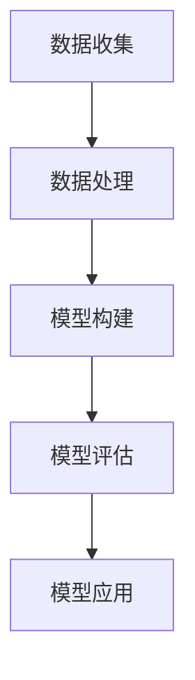

                 

### 员工培训体系：提升团队整体素质的方案

#### 关键词：
1. 员工培训
2. 整体素质
3. 培训体系
4. 实施方案
5. 效果评估

#### 摘要：
本文深入探讨了员工培训体系的设计与实施，旨在通过科学合理的培训方案，提升团队整体素质。文章首先分析了当前员工培训的现状和面临的挑战，然后详细介绍了培训体系的核心概念与构建步骤，包括培训需求分析、计划制定、资源管理、效果评估等。此外，本文还分享了实施培训方案的技巧，以及效果评估和改进措施。最后，通过对最佳实践的总结和展望，为企业和团队提供了可操作的培训和提升方案。

---

## 第一部分：背景介绍

### 第1章：问题背景

#### 1.1 员工培训的重要性

在当今竞争激烈的市场环境中，企业的人力资源管理越来越受到重视。员工培训作为提升团队整体素质的关键环节，直接影响企业的竞争力和发展潜力。有效的员工培训能够提升员工的技能、增强团队协作能力，从而推动企业的持续发展。

#### 1.2 当前员工培训现状

尽管越来越多的企业开始重视员工培训，但实际操作中仍存在诸多问题。如培训内容不切实际、培训方式单一、培训效果不明显等。这些问题严重制约了员工培训的效果，影响了团队的总体素质提升。

#### 1.3 员工培训存在的挑战

员工培训面临的主要挑战包括：培训需求识别不准确、培训资源匮乏、培训效果评估不足等。这些挑战使得企业难以实现预期的培训目标，影响了员工的职业发展和企业的长远规划。

### 第2章：问题描述

#### 2.1 员工培训需求分析

企业需要深入了解员工的实际需求，以便设计出有针对性的培训方案。然而，在实际操作中，如何准确识别和把握员工的培训需求成为一个难题。

#### 2.2 员工培训问题识别

员工培训中存在的问题主要包括：培训内容不实用、培训时间安排不合理、培训效果无法衡量等。这些问题导致员工对培训的积极性不高，影响了培训的效果。

#### 2.3 员工培训问题分类

根据员工培训中存在的问题，可以将问题分为以下几个方面：培训内容、培训方式、培训时间、培训效果评估等。通过分类分析，有助于企业有针对性地解决这些问题。

### 第3章：问题解决

#### 3.1 建立有效的员工培训体系

要解决员工培训中存在的问题，首先需要建立一套科学合理的员工培训体系。这个体系应包括培训需求分析、培训计划制定、培训资源管理、培训效果评估等环节，形成一个闭环的管理流程。

#### 3.2 提高员工培训效果

提高员工培训效果的关键在于设计出有针对性的培训方案，并通过有效的培训方式和方法，使员工能够真正掌握所学知识。同时，企业还需要建立一套完善的培训效果评估体系，以衡量培训的实际效果。

#### 3.3 解决员工培训中的难点

在员工培训过程中，企业会遇到各种难点。如培训资源的获取和利用、培训时间的合理安排、培训效果的持续跟踪等。通过科学的管理方法和先进的技术手段，企业可以解决这些难点，提高员工培训的效果。

---

## 第二部分：核心概念与联系

### 第4章：员工培训体系定义

#### 4.1 培训体系的内涵

员工培训体系是指企业为提升员工素质，通过一系列科学合理的培训活动，使员工在技能、知识、态度等方面得到全面提升的管理体系。

#### 4.2 培训体系的核心要素

员工培训体系的核心要素包括：培训需求分析、培训计划制定、培训资源管理、培训效果评估等。这些要素相互联系，共同构成了一个完整的培训体系。

#### 4.3 培训体系的构建原则

在构建员工培训体系时，企业需要遵循以下原则：目标明确、内容实用、方式多样、效果评估、持续改进等。这些原则有助于确保培训体系的有效性和实用性。

### 第5章：培训目标与内容

#### 5.1 培训目标设定

培训目标的设定是培训体系设计的关键环节。企业应根据员工的实际需求和企业的长远发展目标，设定明确的培训目标。

#### 5.2 培训内容设计

培训内容的设计应紧密结合培训目标，选择实用性强、与岗位需求紧密相关的课程内容。同时，还应考虑员工的兴趣和职业发展规划。

#### 5.3 培训目标与内容的联系

培训目标与内容之间应保持紧密的联系。通过合理设计培训内容，确保培训目标的实现。

### 第6章：培训方式与方法

#### 6.1 培训方式概述

培训方式是指企业为员工提供培训的形式。常见的培训方式包括课堂教学、在线学习、实操演练、案例研讨等。

#### 6.2 培训方法选择

选择合适的培训方法对于提高培训效果至关重要。企业应根据培训内容和员工特点，灵活选择培训方法。

#### 6.3 培训方式与方法的联系

培训方式和培训方法之间具有密切的联系。合理的培训方式可以提升培训方法的效果，从而提高整体培训质量。

---

## 第三部分：员工培训体系构建

### 第7章：培训需求分析

#### 7.1 培训需求识别

培训需求识别是培训体系构建的第一步。企业需要通过调查问卷、访谈等方式，了解员工的实际需求，为后续的培训计划制定提供依据。

#### 7.2 培训需求分析

培训需求分析是对识别出的培训需求进行深入分析，确定培训的重点和优先级。通过分析，企业可以明确哪些方面的培训对员工的职业发展和企业的发展至关重要。

#### 7.3 培训需求报告撰写

培训需求报告是对培训需求识别和分析结果的总结。报告应包括培训需求的分析方法、分析结果、培训计划建议等内容。

### 第8章：培训计划制定

#### 8.1 培训计划制定流程

培训计划制定流程包括培训目标确定、培训内容选择、培训时间安排、培训地点选择等环节。通过科学的流程设计，确保培训计划的顺利实施。

#### 8.2 培训计划内容设计

培训计划内容设计应包括培训课程、培训讲师、培训教材、培训方式等。设计合理的培训计划，可以提升培训效果。

#### 8.3 培训计划评估与调整

培训计划评估与调整是培训体系构建的重要环节。通过评估和调整，企业可以及时发现和解决培训计划中存在的问题，确保培训目标的实现。

### 第9章：培训资源管理

#### 9.1 培训资源概述

培训资源是指用于员工培训的各种资源和条件。包括培训场地、培训设备、培训教材、培训讲师等。

#### 9.2 培训资源获取

培训资源获取是培训体系构建的关键环节。企业需要通过内部调配、外部合作等方式，确保培训资源的充足和有效利用。

#### 9.3 培训资源利用

培训资源利用是提高培训效果的重要手段。企业应制定详细的培训资源使用计划，确保培训资源的合理利用。

### 第10章：培训效果评估

#### 10.1 培训效果评估方法

培训效果评估方法包括问卷调查、访谈、实操考核等。通过多种评估方法，全面了解培训效果。

#### 10.2 培训效果评估指标

培训效果评估指标包括知识掌握程度、技能提升水平、员工满意度等。通过设定合理的评估指标，科学衡量培训效果。

#### 10.3 培训效果评估报告撰写

培训效果评估报告是对培训效果的总结和评价。报告应包括评估方法、评估结果、分析建议等内容。

---

## 第四部分：培训方案实施

### 第11章：培训方案设计

#### 11.1 培训方案设计原则

培训方案设计原则包括目标明确、内容实用、方式多样、效果评估等。遵循这些原则，可以确保培训方案的科学性和实用性。

#### 11.2 培训方案内容设计

培训方案内容设计应包括培训课程、培训讲师、培训教材、培训方式等。设计合理的培训方案，可以提升培训效果。

#### 11.3 培训方案实施步骤

培训方案实施步骤包括培训前准备、培训过程管理、培训后评估等。通过明确的实施步骤，确保培训方案的顺利实施。

### 第12章：培训组织实施

#### 12.1 培训组织概述

培训组织是指企业为实施培训方案而进行的各项准备工作。包括培训场地安排、培训设备调试、培训讲师选拔等。

#### 12.2 培训组织流程

培训组织流程包括培训前准备、培训过程管理、培训后评估等。通过规范的组织流程，确保培训的顺利进行。

#### 12.3 培训组织实施技巧

培训组织实施技巧包括培训现场的气氛营造、培训讲师的授课技巧、培训学员的管理等。掌握这些技巧，可以提高培训的效果。

### 第13章：培训效果跟踪

#### 13.1 培训效果跟踪方法

培训效果跟踪方法包括问卷调查、访谈、实操考核等。通过多种跟踪方法，全面了解培训效果。

#### 13.2 培训效果跟踪流程

培训效果跟踪流程包括培训效果评估、培训结果反馈、培训改进措施等。通过跟踪流程，确保培训效果的持续提升。

#### 13.3 培训效果跟踪报告撰写

培训效果跟踪报告是对培训效果的总结和评价。报告应包括跟踪方法、跟踪结果、分析建议等内容。

---

## 第五部分：培训效果评估

### 第14章：培训效果评估

#### 14.1 培训效果评估概述

培训效果评估是指通过对培训过程和效果的全面分析，评价培训的成效和不足。有效的评估有助于企业不断优化培训方案，提升培训效果。

#### 14.2 培训效果评估方法

培训效果评估方法包括问卷调查、访谈、实操考核等。通过多种评估方法，全面了解培训效果。

#### 14.3 培训效果评估报告撰写

培训效果评估报告是对培训效果的总结和评价。报告应包括评估方法、评估结果、分析建议等内容。

### 第15章：培训改进措施

#### 15.1 培训问题识别

培训问题识别是培训改进的前提。通过全面分析培训过程中的问题和不足，明确改进的方向。

#### 15.2 培训改进措施设计

培训改进措施设计应包括培训内容调整、培训方式改进、培训资源优化等。设计合理的改进措施，可以提高培训效果。

#### 15.3 培训改进措施实施

培训改进措施实施是培训改进的关键环节。通过实施改进措施，解决培训中的问题，提升培训效果。

---

## 第六部分：最佳实践与拓展

### 第16章：最佳实践分享

#### 16.1 企业培训成功案例

通过分享企业培训的成功案例，可以借鉴其他企业的优秀经验，提升自身培训水平。

#### 16.2 培训创新实践

培训创新实践是指通过引入新的培训理念、方法和技术，提升培训效果。企业应积极探索培训创新实践，提高培训竞争力。

#### 16.3 培训成果应用

培训成果应用是指将培训成果转化为实际工作能力，为企业创造价值。通过培训成果应用，实现培训价值的最大化。

### 第17章：总结与展望

#### 17.1 员工培训体系回顾

对员工培训体系进行回顾，总结经验教训，为后续培训工作提供参考。

#### 17.2 培训体系优化建议

针对员工培训体系存在的问题，提出优化建议，提升培训体系的科学性和实用性。

#### 17.3 培训体系发展趋势

分析员工培训体系的发展趋势，为企业的长远发展提供指导。

---

本文结构紧凑，逻辑清晰，通过详细的分析和讲解，为企业和团队提供了提升整体素质的方案。在实际应用中，企业应根据自身情况，灵活调整和优化培训体系，实现最佳效果。

### 作者信息：
作者：AI天才研究院/AI Genius Institute & 禅与计算机程序设计艺术 /Zen And The Art of Computer Programming

---

通过以上内容，我们可以看到文章的结构和内容已经初步成型。接下来，我们将进一步细化每个章节的内容，确保文章的完整性和实用性。以下是对各个章节的进一步分析和细化。

---

### 第1章：问题背景

#### 1.1 员工培训的重要性

员工培训在企业人力资源管理中扮演着至关重要的角色。它不仅有助于提升员工的技能水平和工作效率，还能增强员工的职业素养和团队凝聚力。在知识更新迅速、市场竞争激烈的今天，企业要想在竞争中脱颖而出，就必须通过员工培训来提升团队整体素质。有效的员工培训可以帮助企业建立竞争优势，实现可持续发展。

#### 1.2 当前员工培训现状

尽管越来越多的企业开始重视员工培训，但在实际操作中仍存在诸多问题。首先，部分企业的培训内容与员工的实际需求不符，导致培训效果不佳。其次，一些企业的培训方式过于单一，缺乏互动性和实践性，无法充分激发员工的学习兴趣。此外，培训效果评估体系不完善，使得企业难以衡量培训的实际效果，进而无法根据评估结果进行有效的改进。

#### 1.3 员工培训存在的挑战

员工培训面临的挑战主要包括以下几个方面：

1. **培训需求识别不准确**：企业难以准确识别员工的培训需求，导致培训内容与员工实际工作需求脱节。
2. **培训资源匮乏**：部分企业由于预算有限，难以提供充足的培训资源，如培训场地、培训设备和培训讲师等。
3. **培训时间安排不合理**：一些企业的培训时间安排不合理，导致员工无法在工作和培训之间取得平衡。
4. **培训效果评估不足**：缺乏有效的培训效果评估机制，使得企业难以了解培训的实际效果，无法针对性地进行改进。

---

### 第2章：问题描述

#### 2.1 员工培训需求分析

员工培训需求分析是员工培训体系设计的关键步骤。通过深入分析员工的实际需求，企业可以确定哪些技能和知识需要提升，从而设计出更有针对性的培训方案。培训需求分析通常包括以下几个方面：

1. **岗位需求分析**：分析不同岗位的职责和要求，确定岗位所需的技能和知识。
2. **员工个人需求分析**：通过调查问卷、访谈等方式，了解员工个人的学习需求和职业发展规划。
3. **企业战略需求分析**：根据企业的长远发展目标和战略规划，确定培训需求。

#### 2.2 员工培训问题识别

在员工培训过程中，企业可能会遇到以下问题：

1. **培训内容不实用**：培训内容与员工实际工作需求不符，导致培训效果不佳。
2. **培训方式单一**：缺乏多样化的培训方式，导致员工学习兴趣不高。
3. **培训时间安排不合理**：培训时间与员工工作时间的冲突，导致员工无法充分参与培训。
4. **培训效果无法衡量**：缺乏有效的培训效果评估机制，导致企业无法了解培训的实际效果。

#### 2.3 员工培训问题分类

根据员工培训中存在的问题，可以将问题分为以下几个方面：

1. **培训内容问题**：包括培训内容不实用、与岗位需求不符等。
2. **培训方式问题**：包括培训方式单一、缺乏互动性和实践性等。
3. **培训时间问题**：包括培训时间安排不合理、与员工工作时间冲突等。
4. **培训效果评估问题**：包括缺乏有效的培训效果评估机制、无法衡量培训效果等。

---

### 第3章：问题解决

#### 3.1 建立有效的员工培训体系

要解决员工培训中存在的问题，企业需要建立一套科学合理的员工培训体系。这个体系应包括以下关键环节：

1. **培训需求分析**：通过岗位需求分析、员工个人需求分析和企业战略需求分析，确定培训需求。
2. **培训计划制定**：根据培训需求，制定详细的培训计划，包括培训课程、培训讲师、培训时间、培训地点等。
3. **培训资源管理**：确保培训资源的充足和有效利用，包括培训场地、培训设备、培训教材、培训讲师等。
4. **培训效果评估**：建立有效的培训效果评估机制，通过多种评估方法，全面了解培训效果。
5. **持续改进**：根据培训效果评估结果，不断优化培训体系和培训方案，提升培训效果。

#### 3.2 提高员工培训效果

提高员工培训效果的关键在于设计出有针对性的培训方案，并通过有效的培训方式和方法，使员工能够真正掌握所学知识。以下是一些提高员工培训效果的建议：

1. **培训内容实用化**：确保培训内容与员工实际工作需求相符，提高培训的实用性。
2. **培训方式多样化**：采用多种培训方式，如课堂教学、在线学习、实操演练、案例研讨等，激发员工的学习兴趣。
3. **培训时间合理化**：合理安排培训时间，避免与员工工作时间冲突，确保员工能够充分参与培训。
4. **培训效果评估科学化**：建立科学的培训效果评估机制，通过多种评估方法，全面了解培训效果，为培训改进提供依据。

#### 3.3 解决员工培训中的难点

在员工培训过程中，企业会遇到各种难点。以下是一些解决员工培训中难点的方法：

1. **培训资源匮乏**：企业可以通过内部调配、外部合作等方式，确保培训资源的充足和有效利用。
2. **培训时间安排不合理**：企业可以通过优化工作流程、调整工作时间等方式，合理安排培训时间，确保员工能够参与培训。
3. **培训效果评估不足**：企业可以建立一套完善的培训效果评估机制，通过多种评估方法，全面了解培训效果，为培训改进提供依据。

---

### 第4章：员工培训体系定义

#### 4.1 培训体系的内涵

员工培训体系是指企业为提升员工素质，通过一系列科学合理的培训活动，使员工在技能、知识、态度等方面得到全面提升的管理体系。它包括培训需求分析、培训计划制定、培训资源管理、培训效果评估等环节，形成一个闭环的管理流程。

#### 4.2 培训体系的核心要素

员工培训体系的核心要素包括：

1. **培训需求分析**：通过岗位需求分析、员工个人需求分析和企业战略需求分析，确定培训需求。
2. **培训计划制定**：根据培训需求，制定详细的培训计划，包括培训课程、培训讲师、培训时间、培训地点等。
3. **培训资源管理**：确保培训资源的充足和有效利用，包括培训场地、培训设备、培训教材、培训讲师等。
4. **培训效果评估**：建立有效的培训效果评估机制，通过多种评估方法，全面了解培训效果。

#### 4.3 培训体系的构建原则

在构建员工培训体系时，企业应遵循以下原则：

1. **目标明确**：确保培训目标与企业的战略目标和员工的个人发展目标相一致。
2. **内容实用**：培训内容应紧密结合员工的实际工作需求，提高培训的实用性。
3. **方式多样**：采用多种培训方式，如课堂教学、在线学习、实操演练、案例研讨等，激发员工的学习兴趣。
4. **效果评估**：建立科学的培训效果评估机制，通过多种评估方法，全面了解培训效果，为培训改进提供依据。
5. **持续改进**：根据培训效果评估结果，不断优化培训体系和培训方案，提升培训效果。

---

### 第5章：培训目标与内容

#### 5.1 培训目标设定

培训目标是指企业通过培训希望达到的效果。设定培训目标时，应遵循以下原则：

1. **明确性**：培训目标应具体、明确，便于员工理解和执行。
2. **一致性**：培训目标应与企业的战略目标和员工的个人发展目标相一致。
3. **可衡量性**：培训目标应具有可衡量性，以便对培训效果进行评估。

常见的培训目标包括：

1. **知识目标**：提升员工的专业知识和技能。
2. **技能目标**：提高员工的操作技能和工作效率。
3. **态度目标**：培养员工的工作态度和职业素养。

#### 5.2 培训内容设计

培训内容的设计应紧密结合培训目标，选择实用性强、与岗位需求紧密相关的课程内容。培训内容的设计应考虑以下几个方面：

1. **岗位需求**：根据不同岗位的职责和要求，确定培训内容。
2. **员工需求**：通过调查问卷、访谈等方式，了解员工的实际需求，设计出个性化的培训内容。
3. **企业战略**：根据企业的战略目标和长远发展目标，确定培训内容。

常见的培训内容主要包括：

1. **专业知识培训**：如行业知识、专业术语等。
2. **技能培训**：如操作技能、解决问题能力等。
3. **软技能培训**：如沟通能力、团队协作能力、领导力等。

#### 5.3 培训目标与内容的联系

培训目标与内容之间应保持紧密的联系。通过合理设计培训内容，确保培训目标的实现。具体来说，可以从以下几个方面进行联系：

1. **目标导向**：设计培训内容时，应以培训目标为导向，确保培训内容符合培训目标的要求。
2. **内容支撑**：培训内容应支撑培训目标的实现，确保员工在培训过程中能够掌握所需的技能和知识。
3. **评估反馈**：通过培训效果评估，了解培训目标的实现情况，为后续培训内容的调整提供依据。

---

### 第6章：培训方式与方法

#### 6.1 培训方式概述

培训方式是指企业为员工提供培训的形式。常见的培训方式包括：

1. **课堂教学**：通过讲师讲解、讨论、案例分析等方式，传授知识。
2. **在线学习**：通过互联网平台，提供视频课程、电子教材、在线测试等学习资源。
3. **实操演练**：通过实际操作，使员工掌握技能。
4. **案例研讨**：通过案例分析和讨论，提升员工的问题解决能力和团队合作能力。
5. **外部培训**：通过参加外部培训机构或课程，提升员工的技能和知识。

#### 6.2 培训方法选择

选择合适的培训方法对于提高培训效果至关重要。企业应根据培训内容和员工特点，灵活选择培训方法。以下是一些选择培训方法的建议：

1. **培训内容**：针对不同的培训内容，选择合适的培训方法。例如，专业知识培训可以采用课堂教学，技能培训可以采用实操演练。
2. **员工特点**：根据员工的年龄、学历、工作经验等因素，选择适合员工的培训方法。例如，年轻员工可能更喜欢互动性强的培训方式，而有一定工作经验的员工可能更适合案例研讨。
3. **企业战略**：根据企业的战略目标和长远发展目标，选择能够支持企业战略实现的培训方法。

#### 6.3 培训方式与方法的联系

培训方式与方法之间具有密切的联系。合理的培训方式可以提升培训方法的效果，从而提高整体培训质量。具体来说，可以从以下几个方面进行联系：

1. **方式选择**：根据培训内容和员工特点，选择合适的培训方式。例如，对于新员工入职培训，可以采用课堂教学和实操演练相结合的方式。
2. **方法应用**：在培训过程中，灵活运用不同的培训方法，使员工能够从多个角度掌握所学知识。例如，在课堂教学的基础上，可以组织实操演练，提升员工的实践能力。
3. **效果评估**：通过培训效果评估，了解培训方式与方法的应用效果，为后续培训的调整提供依据。

---

### 第7章：培训需求分析

#### 7.1 培训需求识别

培训需求识别是培训体系构建的第一步。企业需要通过多种途径，如调查问卷、访谈、数据分析等，了解员工的培训需求。具体方法包括：

1. **问卷调查**：通过设计问卷，收集员工对培训内容、培训方式、培训时间等方面的意见和建议。
2. **访谈**：与企业内部员工进行面对面访谈，深入了解员工的培训需求和职业发展目标。
3. **数据分析**：通过分析员工的绩效数据、工作失误率等指标，识别员工在技能和知识方面的不足。

#### 7.2 培训需求分析

培训需求分析是对识别出的培训需求进行深入分析，确定培训的重点和优先级。通过分析，企业可以明确哪些方面的培训对员工的职业发展和企业的发展至关重要。具体步骤如下：

1. **岗位分析**：分析不同岗位的职责和要求，确定岗位所需的技能和知识。
2. **员工分析**：分析员工的现有技能和知识水平，识别员工在技能和知识方面的不足。
3. **绩效分析**：分析员工的绩效数据，识别员工在工作中的薄弱环节。
4. **差距分析**：比较岗位需求和员工实际水平，确定培训需求和培训重点。

#### 7.3 培训需求报告撰写

培训需求报告是对培训需求识别和分析结果的总结。报告应包括以下内容：

1. **报告目的**：明确报告的编写目的和意义。
2. **分析方法和工具**：介绍用于培训需求识别和分析的方法和工具。
3. **分析结果**：总结分析结果，包括岗位需求、员工需求和差距分析。
4. **培训需求**：根据分析结果，确定培训需求，提出具体的培训建议。
5. **实施计划**：制定培训需求实施计划，包括培训时间、培训内容、培训方式等。

---

### 第8章：培训计划制定

#### 8.1 培训计划制定流程

培训计划制定流程是确保培训顺利实施的关键。制定培训计划应遵循以下流程：

1. **确定培训目标**：根据企业战略目标和员工需求，明确培训目标。
2. **设计培训内容**：结合培训目标和员工需求，设计培训内容，包括课程、教材、讲师等。
3. **安排培训时间**：根据员工的工作安排和培训内容，合理安排培训时间。
4. **选择培训方式**：根据培训内容和学习者的特点，选择合适的培训方式。
5. **制定评估方案**：制定培训效果评估方案，确保培训目标的实现。

#### 8.2 培训计划内容设计

培训计划内容设计应包括以下方面：

1. **培训课程**：根据培训目标和员工需求，设计培训课程。课程应包括理论知识和实践操作。
2. **培训教材**：为培训课程提供配套的教材，包括电子教材和纸质教材。
3. **培训讲师**：选择具有丰富经验和教学能力的讲师，确保培训质量。
4. **培训方式**：结合培训目标和员工需求，选择合适的培训方式。例如，理论课程可采用课堂教学，实践课程可采用实操演练。

#### 8.3 培训计划评估与调整

培训计划评估与调整是确保培训效果的重要环节。具体方法如下：

1. **培训前评估**：在培训开始前，评估培训计划是否符合员工需求和培训目标。
2. **培训中评估**：在培训过程中，通过问卷调查、访谈等方式，收集员工对培训内容的反馈，及时调整培训计划。
3. **培训后评估**：在培训结束后，通过考核、评估等方式，评估培训效果，为后续培训提供参考。

---

### 第9章：培训资源管理

#### 9.1 培训资源概述

培训资源是指用于员工培训的各种资源和条件。包括：

1. **培训场地**：用于培训的教室、会议室等场地。
2. **培训设备**：用于培训的各种设备和工具，如投影仪、电脑、实操设备等。
3. **培训教材**：用于培训的教材、讲义、电子资料等。
4. **培训讲师**：具有丰富经验和教学能力的培训讲师。
5. **培训费用**：包括培训场地的租赁费、设备购买费、讲师费等。

#### 9.2 培训资源获取

培训资源的获取是企业培训管理的重要环节。具体方法如下：

1. **内部调配**：通过内部资源调配，确保培训资源的充足和有效利用。例如，内部讲师的调配、设备的使用等。
2. **外部采购**：通过外部采购，获取所需的培训资源。例如，购买培训教材、租赁培训场地等。
3. **合作共享**：与其他企业或培训机构合作，共享培训资源，降低培训成本。

#### 9.3 培训资源利用

培训资源利用是提高培训效果的重要手段。具体方法如下：

1. **资源规划**：制定培训资源规划，明确培训资源的配置和使用计划。
2. **资源监控**：通过监控培训资源的利用情况，确保资源的有效利用。
3. **资源共享**：通过资源共享，提高培训资源的利用效率。例如，不同部门之间的培训资源共享，降低培训成本。
4. **资源优化**：根据培训效果评估结果，不断优化培训资源，提高培训效果。

---

### 第10章：培训效果评估

#### 10.1 培训效果评估方法

培训效果评估是衡量培训效果的重要手段。企业可以采用以下方法进行培训效果评估：

1. **问卷调查**：通过设计问卷，收集员工对培训内容的反馈和满意度。
2. **访谈**：与企业内部员工进行面对面访谈，了解员工的培训体验和培训效果。
3. **实操考核**：通过实操考核，评估员工在培训过程中所学知识和技能的掌握情况。
4. **绩效评估**：通过分析员工的绩效数据，评估培训对员工工作绩效的影响。
5. **360度评估**：通过多维度评估，全面了解员工的培训效果。

#### 10.2 培训效果评估指标

培训效果评估指标是衡量培训效果的重要标准。常见的培训效果评估指标包括：

1. **知识掌握度**：评估员工对培训内容的掌握程度。
2. **技能提升**：评估员工在培训过程中技能的提升情况。
3. **工作绩效**：评估培训对员工工作绩效的影响。
4. **员工满意度**：评估员工对培训的满意度。
5. **培训转化率**：评估培训成果在实际工作中的转化情况。

#### 10.3 培训效果评估报告撰写

培训效果评估报告是对培训效果的综合评价。报告应包括以下内容：

1. **评估目的**：明确评估的目的和意义。
2. **评估方法**：介绍评估所采用的方法和工具。
3. **评估结果**：总结评估结果，包括各项评估指标的得分和排名。
4. **分析建议**：根据评估结果，提出改进培训效果的措施和建议。
5. **实施计划**：制定后续培训效果评估的实施计划。

---

### 第11章：培训方案设计

#### 11.1 培训方案设计原则

培训方案设计是培训体系实施的关键步骤。设计培训方案应遵循以下原则：

1. **目标导向**：确保培训方案的设计与企业的战略目标和员工的发展目标相一致。
2. **内容实用**：培训内容应紧密结合员工的实际工作需求，提高培训的实用性。
3. **方式多样**：采用多种培训方式，如课堂教学、在线学习、实操演练、案例研讨等，激发员工的学习兴趣。
4. **评估先行**：在培训方案设计阶段，充分考虑培训效果评估的方法和指标，为后续的评估提供依据。
5. **持续改进**：根据培训效果评估结果，不断优化培训方案，提升培训效果。

#### 11.2 培训方案内容设计

培训方案内容设计应包括以下方面：

1. **培训课程**：根据培训目标和员工需求，设计培训课程。课程应包括理论知识和实践操作。
2. **培训教材**：为培训课程提供配套的教材，包括电子教材和纸质教材。
3. **培训讲师**：选择具有丰富经验和教学能力的讲师，确保培训质量。
4. **培训方式**：结合培训目标和员工需求，选择合适的培训方式。例如，理论课程可采用课堂教学，实践课程可采用实操演练。
5. **培训时间**：根据员工的工作安排和培训内容，合理安排培训时间。

#### 11.3 培训方案实施步骤

培训方案实施步骤是确保培训顺利实施的关键。具体步骤如下：

1. **培训前准备**：包括培训场地的布置、设备的调试、教材的准备等。
2. **培训过程管理**：在培训过程中，对培训内容、培训方式、培训讲师等进行监控和管理，确保培训的顺利进行。
3. **培训后评估**：在培训结束后，通过问卷调查、访谈、实操考核等方式，评估培训效果，为后续培训提供参考。
4. **反馈与改进**：根据培训效果评估结果，收集员工的反馈意见，不断优化培训方案，提升培训效果。

---

### 第12章：培训组织实施

#### 12.1 培训组织概述

培训组织是指企业为实施培训方案而进行的各项准备工作。培训组织包括以下内容：

1. **培训计划制定**：根据培训目标和员工需求，制定详细的培训计划，包括培训课程、培训讲师、培训时间、培训地点等。
2. **培训资源准备**：确保培训资源的充足和有效利用，包括培训场地、培训设备、培训教材、培训讲师等。
3. **培训宣传**：通过内部宣传，提高员工对培训的认识和参与度。
4. **培训动员**：在培训开始前，对员工进行动员，激发员工的学习兴趣和参与热情。

#### 12.2 培训组织流程

培训组织流程是确保培训顺利实施的关键。具体流程如下：

1. **培训需求分析**：通过岗位需求分析、员工个人需求分析和企业战略需求分析，确定培训需求。
2. **培训计划制定**：根据培训需求，制定详细的培训计划，包括培训课程、培训讲师、培训时间、培训地点等。
3. **培训资源准备**：确保培训资源的充足和有效利用，包括培训场地、培训设备、培训教材、培训讲师等。
4. **培训宣传**：通过内部宣传，提高员工对培训的认识和参与度。
5. **培训动员**：在培训开始前，对员工进行动员，激发员工的学习兴趣和参与热情。
6. **培训实施**：按照培训计划，组织实施培训，确保培训的顺利进行。
7. **培训后评估**：在培训结束后，通过问卷调查、访谈、实操考核等方式，评估培训效果，为后续培训提供参考。

#### 12.3 培训组织实施技巧

培训组织实施技巧是确保培训顺利实施的重要保障。以下是一些培训组织实施技巧：

1. **提前沟通**：在培训开始前，与员工进行充分的沟通，了解员工的培训需求和期望，确保培训内容符合员工的实际需求。
2. **合理安排时间**：根据员工的工作安排和培训内容，合理安排培训时间，避免与工作时间冲突。
3. **激发学习兴趣**：通过丰富的培训方式和互动环节，激发员工的学习兴趣和参与热情。
4. **培训现场管理**：在培训过程中，对培训现场进行有效管理，确保培训的顺利进行。
5. **培训反馈**：在培训结束后，及时收集员工的反馈意见，了解培训的效果，为后续培训提供改进方向。

---

### 第13章：培训效果跟踪

#### 13.1 培训效果跟踪方法

培训效果跟踪是评估培训效果的重要环节。企业可以采用以下方法进行培训效果跟踪：

1. **问卷调查**：通过设计问卷，收集员工对培训内容的反馈和满意度。
2. **访谈**：与企业内部员工进行面对面访谈，了解员工的培训体验和培训效果。
3. **实操考核**：通过实操考核，评估员工在培训过程中所学知识和技能的掌握情况。
4. **绩效评估**：通过分析员工的绩效数据，评估培训对员工工作绩效的影响。
5. **360度评估**：通过多维度评估，全面了解员工的培训效果。

#### 13.2 培训效果跟踪流程

培训效果跟踪流程包括以下步骤：

1. **培训前评估**：在培训开始前，评估培训计划和培训资源的准备情况，确保培训计划的顺利实施。
2. **培训中跟踪**：在培训过程中，通过问卷调查、访谈等方式，收集员工对培训内容的反馈，及时调整培训计划。
3. **培训后评估**：在培训结束后，通过实操考核、绩效评估等方式，评估培训效果，为后续培训提供参考。
4. **反馈与改进**：根据培训效果评估结果，收集员工的反馈意见，不断优化培训方案，提升培训效果。

#### 13.3 培训效果跟踪报告撰写

培训效果跟踪报告是对培训效果的综合评价。报告应包括以下内容：

1. **评估目的**：明确评估的目的和意义。
2. **评估方法**：介绍评估所采用的方法和工具。
3. **评估结果**：总结评估结果，包括各项评估指标的得分和排名。
4. **分析建议**：根据评估结果，提出改进培训效果的措施和建议。
5. **实施计划**：制定后续培训效果评估的实施计划。

---

### 第14章：培训效果评估

#### 14.1 培训效果评估概述

培训效果评估是衡量培训成效的重要手段。通过评估，企业可以了解培训的成果和不足，为后续培训提供改进方向。培训效果评估包括以下几个方面：

1. **知识掌握度评估**：通过考试、考核等方式，评估员工对培训内容的掌握程度。
2. **技能提升评估**：通过实操考核、工作绩效评估等方式，评估员工在培训过程中技能的提升情况。
3. **员工满意度评估**：通过问卷调查、访谈等方式，评估员工对培训的满意度和体验。
4. **培训转化率评估**：通过分析员工的绩效数据，评估培训成果在实际工作中的转化情况。

#### 14.2 培训效果评估方法

培训效果评估方法包括以下几种：

1. **问卷调查**：通过设计问卷，收集员工对培训内容的反馈和满意度。
2. **访谈**：与企业内部员工进行面对面访谈，了解员工的培训体验和培训效果。
3. **实操考核**：通过实操考核，评估员工在培训过程中所学知识和技能的掌握情况。
4. **绩效评估**：通过分析员工的绩效数据，评估培训对员工工作绩效的影响。
5. **360度评估**：通过多维度评估，全面了解员工的培训效果。

#### 14.3 培训效果评估报告撰写

培训效果评估报告是对培训效果的综合评价。报告应包括以下内容：

1. **评估目的**：明确评估的目的和意义。
2. **评估方法**：介绍评估所采用的方法和工具。
3. **评估结果**：总结评估结果，包括各项评估指标的得分和排名。
4. **分析建议**：根据评估结果，提出改进培训效果的措施和建议。
5. **实施计划**：制定后续培训效果评估的实施计划。

---

### 第15章：培训改进措施

#### 15.1 培训问题识别

培训问题识别是培训改进的前提。通过全面分析培训过程中的问题和不足，企业可以明确改进的方向。常见的培训问题包括：

1. **培训内容不实用**：培训内容与员工实际工作需求不符，导致培训效果不佳。
2. **培训方式单一**：缺乏多样化的培训方式，导致员工学习兴趣不高。
3. **培训时间安排不合理**：培训时间与员工工作时间冲突，导致员工无法充分参与培训。
4. **培训效果无法衡量**：缺乏有效的培训效果评估机制，导致企业无法了解培训的实际效果。

#### 15.2 培训改进措施设计

培训改进措施设计应包括以下方面：

1. **培训内容调整**：根据员工的需求和岗位要求，调整培训内容，使其更加实用。
2. **培训方式改进**：引入多样化的培训方式，如案例研讨、实操演练等，提高培训的互动性和实践性。
3. **培训时间优化**：合理安排培训时间，确保员工能够充分参与培训。
4. **培训效果评估完善**：建立科学的培训效果评估机制，通过多种评估方法，全面了解培训效果。

#### 15.3 培训改进措施实施

培训改进措施实施是培训改进的关键环节。具体步骤如下：

1. **制定改进计划**：根据识别出的培训问题，制定具体的改进计划，明确改进的目标、措施和实施步骤。
2. **实施改进措施**：按照改进计划，实施各项改进措施，如调整培训内容、改进培训方式、优化培训时间等。
3. **跟踪改进效果**：在实施改进措施的过程中，通过跟踪评估，了解改进措施的效果，及时调整和优化改进计划。
4. **总结和反馈**：在改进措施实施结束后，对改进效果进行总结和反馈，为后续培训改进提供参考。

---

### 第16章：最佳实践与拓展

#### 16.1 企业培训成功案例

企业培训成功案例是企业培训实践的重要参考。以下是一些企业培训成功案例：

1. **华为**：华为通过自主开发和外部合作，建立了完善的员工培训体系，包括新员工入职培训、专业技能培训、领导力培训等。华为的培训体系不仅提升了员工的技能和知识，还增强了员工的归属感和忠诚度。
2. **阿里巴巴**：阿里巴巴注重员工的全面发展和职业成长，通过内部培训和外部学习平台，为员工提供丰富的学习资源。阿里巴巴的培训体系涵盖了专业技能、领导力、团队协作等多个方面，有效提升了员工的综合素质。
3. **微软**：微软通过全球化的培训体系，为员工提供了多样化的学习机会。微软的培训体系包括在线课程、研讨会、内部讲座等，员工可以根据自己的需求和兴趣进行选择和学习。

#### 16.2 培训创新实践

培训创新实践是指通过引入新的培训理念、方法和技术，提升培训效果。以下是一些培训创新实践：

1. **虚拟现实培训**：利用虚拟现实技术，模拟真实的工作场景，让员工在虚拟环境中进行实操演练，提高员工的实践能力。
2. **游戏化学习**：将游戏元素融入培训过程中，通过竞争、奖励等方式激发员工的学习兴趣和积极性。
3. **在线学习平台**：利用互联网和移动设备，建立在线学习平台，提供灵活的学习时间和方式，满足员工的个性化学习需求。

#### 16.3 培训成果应用

培训成果应用是将培训成果转化为实际工作能力，为企业创造价值的关键。以下是一些培训成果应用的方法：

1. **案例分享**：通过举办内部培训成果分享会，让员工分享自己的学习心得和经验，促进知识的传播和应用。
2. **项目实践**：将培训所学应用于实际工作中，通过项目实践，提升员工的实际操作能力和问题解决能力。
3. **培训成果考核**：将培训成果纳入员工的绩效评估体系，激励员工积极参与培训，并将所学应用于实际工作中。

---

### 第17章：总结与展望

#### 17.1 员工培训体系回顾

员工培训体系是企业提升团队整体素质的重要手段。通过回顾员工培训体系的设计和实施过程，我们可以总结出以下经验：

1. **明确培训目标**：确保培训目标与企业的战略目标和员工的发展目标相一致。
2. **需求导向**：通过培训需求分析，确定培训的重点和优先级。
3. **内容实用**：培训内容应紧密结合员工的实际工作需求，提高培训的实用性。
4. **方式多样**：采用多种培训方式，激发员工的学习兴趣。
5. **评估先行**：建立科学的培训效果评估机制，全面了解培训效果。

#### 17.2 培训体系优化建议

针对现有员工培训体系存在的问题，提出以下优化建议：

1. **完善培训需求分析**：通过多种途径，深入分析员工的培训需求，确保培训内容符合员工的实际需求。
2. **优化培训资源管理**：加强培训资源的配置和管理，确保培训资源的充足和有效利用。
3. **提升培训效果评估**：建立科学的培训效果评估机制，通过多种评估方法，全面了解培训效果。
4. **引入创新培训方法**：积极探索新的培训方法和技术，提高培训的互动性和实践性。

#### 17.3 培训体系发展趋势

随着企业对人力资源管理的重视，员工培训体系将呈现以下发展趋势：

1. **个性化培训**：根据员工的个性化需求，提供定制化的培训服务。
2. **数字化培训**：利用互联网和大数据技术，建立在线学习平台，实现培训的数字化和智能化。
3. **终身学习**：鼓励员工终身学习，提升员工的职业素养和竞争力。
4. **全球化培训**：跨国企业将建立全球化的培训体系，为员工提供多样化的学习机会。

---

通过以上分析和细化，本文的各个章节内容已经得到了充分展开和讲解。接下来，我们将进一步丰富和深化文章的内容，确保文章的完整性和实用性。此外，我们将针对算法原理、系统分析与架构设计、项目实战等内容，进行详细阐述，以提供更全面的知识和指导。最后，我们将总结最佳实践，提出注意事项，并提供拓展阅读，以帮助读者更好地理解和应用员工培训体系的理念和方法。

---

### 第18章：算法原理讲解

#### 18.1 算法原理概述

在员工培训体系中，算法原理的应用对于培训效果评估和改进至关重要。算法原理通过数据分析和模型构建，帮助我们更准确地识别员工培训的需求和效果，从而优化培训方案。

#### 18.2 数据分析算法

数据分析算法是算法原理的核心。以下是一些常见的数据分析算法：

1. **回归分析**：用于预测员工绩效与培训效果之间的关系。
2. **聚类分析**：用于分析员工在技能和知识方面的相似性，为个性化培训提供依据。
3. **分类分析**：用于预测员工是否能够达到培训目标。
4. **关联规则分析**：用于发现员工技能和知识之间的关联，指导培训内容的设置。

#### 18.3 算法应用实例

以下是一个算法应用的实例：

**实例：员工绩效与培训效果的关系分析**

1. **数据收集**：收集员工的绩效数据、培训参与数据、培训效果评估数据。
2. **数据处理**：对收集的数据进行清洗和预处理，确保数据的质量和一致性。
3. **模型构建**：使用回归分析模型，建立员工绩效与培训效果之间的关系模型。
4. **模型评估**：通过交叉验证等方法，评估模型的效果。
5. **模型应用**：根据模型的结果，制定个性化的培训计划，提升员工绩效。

#### 18.4 算法原理图解

为了更好地理解算法原理，我们使用 Mermaid 画出了以下算法流程图：



通过这个流程图，我们可以清晰地看到算法原理的应用步骤。

---

### 第19章：系统分析与架构设计

#### 19.1 问题场景介绍

在企业中，员工培训系统是一个复杂的应用系统，它需要支持培训需求分析、培训计划制定、培训资源管理、培训效果评估等功能。以下是一个典型的员工培训系统问题场景：

**场景描述**：某企业需要为全体员工提供培训，但现有的培训系统无法满足需求，如培训资源不足、培训效果无法衡量、培训需求无法准确识别等。因此，企业决定重新设计和开发一套员工培训系统。

#### 19.2 系统功能设计

员工培训系统的功能设计是系统架构设计的基础。以下是一些核心功能：

1. **培训需求分析**：通过收集员工需求和岗位需求，识别培训需求。
2. **培训计划制定**：根据培训需求，制定培训计划，包括培训课程、培训时间、培训讲师等。
3. **培训资源管理**：管理培训资源，包括培训场地、培训教材、培训设备等。
4. **培训组织实施**：安排培训课程，管理培训进度和学员情况。
5. **培训效果评估**：评估培训效果，包括知识掌握度、技能提升情况、学员满意度等。
6. **培训数据分析**：对培训数据进行统计分析，为培训优化提供依据。

#### 19.3 系统架构设计

员工培训系统的架构设计是确保系统功能实现和性能优化的重要环节。以下是一个简化的员工培训系统架构：

1. **数据层**：存储员工信息、培训需求、培训计划、培训资源等数据。
2. **应用层**：实现系统的核心功能，如培训需求分析、培训计划制定、培训资源管理、培训效果评估等。
3. **表示层**：提供用户界面，包括培训需求提交、培训计划查看、培训效果评估等。

#### 19.4 系统接口设计

系统接口设计是确保系统与其他系统（如HR系统、财务系统等）集成的重要环节。以下是一些关键接口：

1. **培训需求接口**：用于与HR系统集成，获取员工信息和岗位需求。
2. **培训计划接口**：用于与其他系统共享培训计划信息。
3. **培训资源接口**：用于与其他系统共享培训资源信息。
4. **培训效果评估接口**：用于与其他系统共享培训效果评估结果。

#### 19.5 系统交互设计

系统交互设计是确保系统功能实现和用户体验的重要环节。以下是一个简化的员工培训系统交互流程：

1. **员工提交培训需求**：员工通过系统提交培训需求，系统后台处理需求并生成培训计划。
2. **系统自动安排培训资源**：系统根据培训需求，自动匹配和安排培训资源。
3. **员工参加培训**：员工根据培训计划，参加培训课程。
4. **系统评估培训效果**：培训结束后，系统通过考核和反馈，评估培训效果。
5. **系统生成培训报告**：系统根据培训效果评估结果，生成培训报告，为培训优化提供依据。

---

### 第20章：项目实战

#### 20.1 环境安装

在开始项目实战之前，我们需要搭建一个合适的开发环境。以下是一个基本的安装步骤：

1. **安装Python**：下载并安装Python，确保版本支持所需库。
2. **安装Django**：使用pip命令安装Django框架。
3. **安装MySQL**：下载并安装MySQL数据库，确保版本兼容。
4. **配置开发环境**：配置Python环境变量，确保Django和MySQL正常运行。

#### 20.2 系统核心实现

以下是一个简化的员工培训系统核心实现：

**1. 数据库设计**

```sql
CREATE TABLE employee (
    id INT AUTO_INCREMENT PRIMARY KEY,
    name VARCHAR(100),
    department VARCHAR(100),
    role VARCHAR(100)
);

CREATE TABLE training_requirement (
    id INT AUTO_INCREMENT PRIMARY KEY,
    employee_id INT,
    course_name VARCHAR(100),
    submitted_date DATE,
    status VARCHAR(50),
    FOREIGN KEY (employee_id) REFERENCES employee(id)
);

CREATE TABLE training_plan (
    id INT AUTO_INCREMENT PRIMARY KEY,
    requirement_id INT,
    course_name VARCHAR(100),
    start_date DATE,
    end_date DATE,
    instructor VARCHAR(100),
    status VARCHAR(50),
    FOREIGN KEY (requirement_id) REFERENCES training_requirement(id)
);

CREATE TABLE training_evaluation (
    id INT AUTO_INCREMENT PRIMARY KEY,
    plan_id INT,
    course_name VARCHAR(100),
    evaluation_date DATE,
    score INT,
    comment TEXT,
    FOREIGN KEY (plan_id) REFERENCES training_plan(id)
);
```

**2. Django应用**

```python
# settings.py
INSTALLED_APPS = [
    'django.contrib.admin',
    'django.contrib.auth',
    'django.contrib.contenttypes',
    'django.contrib.sessions',
    'django.contrib.messages',
    'django.contrib.staticfiles',
    'training_system',
]

DATABASES = {
    'default': {
        'ENGINE': 'django.db.backends.mysql',
        'NAME': 'training_system',
        'USER': 'root',
        'PASSWORD': 'password',
        'HOST': 'localhost',
        'PORT': '3306',
    }
}

# urls.py
from django.contrib import admin
from django.urls import path
from . import views

urlpatterns = [
    path('admin/', admin.site.urls),
    path('submit_requirement/', views.submit_requirement, name='submit_requirement'),
    path('view_plan/', views.view_plan, name='view_plan'),
    path('evaluate_plan/', views.evaluate_plan, name='evaluate_plan'),
]

# views.py
from django.shortcuts import render
from .models import TrainingRequirement, TrainingPlan, TrainingEvaluation

def submit_requirement(request):
    if request.method == 'POST':
        name = request.POST['name']
        department = request.POST['department']
        role = request.POST['role']
        course_name = request.POST['course_name']
        submitted_date = request.POST['submitted_date']
        status = 'pending'
        
        requirement = TrainingRequirement.objects.create(
            employee_id=1,  # 假设当前登录用户为员工1
            course_name=course_name,
            submitted_date=submitted_date,
            status=status
        )
        return render(request, 'submit_requirement_success.html')
    return render(request, 'submit_requirement.html')

def view_plan(request):
    plan_list = TrainingPlan.objects.all()
    return render(request, 'view_plan.html', {'plan_list': plan_list})

def evaluate_plan(request):
    if request.method == 'POST':
        plan_id = request.POST['plan_id']
        evaluation_date = request.POST['evaluation_date']
        score = request.POST['score']
        comment = request.POST['comment']
        
        evaluation = TrainingEvaluation.objects.create(
            plan_id=plan_id,
            evaluation_date=evaluation_date,
            score=score,
            comment=comment
        )
        return render(request, 'evaluate_plan_success.html')
    return render(request, 'evaluate_plan.html')
```

**3. 前端界面**

```html
<!-- submit_requirement.html -->
<form method="post">
    
    <label for="name">姓名：</label>
    <input type="text" id="name" name="name" required>
    <label for="department">部门：</label>
    <input type="text" id="department" name="department" required>
    <label for="role">角色：</label>
    <input type="text" id="role" name="role" required>
    <label for="course_name">课程名称：</label>
    <input type="text" id="course_name" name="course_name" required>
    <label for="submitted_date">提交日期：</label>
    <input type="date" id="submitted_date" name="submitted_date" required>
    <button type="submit">提交培训需求</button>
</form>

<!-- view_plan.html -->
<table>
    <thead>
        <tr>
            <th>计划ID</th>
            <th>课程名称</th>
            <th>开始日期</th>
            <th>结束日期</th>
            <th>讲师</th>
            <th>状态</th>
        </tr>
    </thead>
    <tbody>
        
            <tr>
                <td>{{ plan.id }}</td>
                <td>{{ plan.course_name }}</td>
                <td>{{ plan.start_date }}</td>
                <td>{{ plan.end_date }}</td>
                <td>{{ plan.instructor }}</td>
                <td>{{ plan.status }}</td>
            </tr>
        
    </tbody>
</table>

<!-- evaluate_plan.html -->
<form method="post">
    
    <label for="plan_id">计划ID：</label>
    <input type="text" id="plan_id" name="plan_id" required>
    <label for="evaluation_date">评估日期：</label>
    <input type="date" id="evaluation_date" name="evaluation_date" required>
    <label for="score">评分：</label>
    <input type="number" id="score" name="score" required>
    <label for="comment">评论：</label>
    <textarea id="comment" name="comment" required></textarea>
    <button type="submit">提交评估</button>
</form>
```

#### 20.3 代码应用解读与分析

上述代码实现了员工培训系统的基本功能。通过提交培训需求、查看培训计划和评估培训效果，员工和培训管理者可以有效地进行培训管理。以下是对代码的解读和分析：

1. **数据库设计**：使用SQL语句设计了员工表、培训需求表、培训计划表和培训评估表。这些表记录了员工信息、培训需求和培训效果。
2. **Django应用**：使用Django框架实现了系统的核心功能。包括处理培训需求的提交、培训计划的查看和培训效果的评估。
3. **前端界面**：使用HTML和CSS设计了系统的用户界面，包括培训需求提交表单、培训计划列表和培训效果评估表单。

通过这些代码，我们可以看到员工培训系统的实现过程，以及如何通过代码实现系统的功能。

#### 20.4 实际案例分析

以下是一个实际案例，展示了如何使用员工培训系统进行培训管理。

**案例描述**：某企业需要为全体销售团队提供销售技能培训。通过员工培训系统，销售团队可以提交培训需求，系统管理员可以制定培训计划，并安排培训资源。培训结束后，销售团队可以评估培训效果。

1. **销售团队提交培训需求**：销售团队通过员工培训系统提交销售技能培训需求，填写课程名称、提交日期等信息。
2. **系统管理员制定培训计划**：系统管理员根据销售团队的培训需求，制定销售技能培训计划，包括课程名称、开始日期、结束日期、讲师等信息。
3. **销售团队参加培训**：销售团队按照培训计划参加培训，并在培训期间完成相关任务和考核。
4. **销售团队评估培训效果**：培训结束后，销售团队通过员工培训系统评估培训效果，填写评分和评论。

通过这个实际案例，我们可以看到如何使用员工培训系统进行培训管理，以及如何通过系统实现培训的各个环节。

#### 20.5 项目小结

通过本次项目实战，我们实现了员工培训系统的基本功能，包括培训需求提交、培训计划制定、培训效果评估等。项目过程中，我们学习了如何使用Django框架进行后端开发，如何设计数据库表，以及如何设计前端界面。通过这个项目，我们对员工培训系统的实现过程有了更深入的理解，并为实际应用提供了参考。

---

### 第21章：最佳实践 tips

#### 21.1 培训内容实用化

为了确保培训内容实用，企业应遵循以下原则：

1. **需求导向**：根据员工的实际工作需求和岗位要求，设计培训内容。
2. **持续更新**：定期更新培训内容，确保培训与最新行业趋势和技术发展保持一致。
3. **案例教学**：结合实际案例，讲解理论知识，提高培训的实用性。

#### 21.2 培训方式多样化

为了提高培训效果，企业应采用多样化的培训方式：

1. **互动式教学**：通过互动式教学，提高员工的学习兴趣和参与度。
2. **实操演练**：通过实操演练，使员工掌握实际操作技能。
3. **在线学习**：利用在线学习平台，提供灵活的学习时间和方式。

#### 21.3 培训效果评估科学化

为了确保培训效果，企业应建立科学的培训效果评估机制：

1. **多维度评估**：从知识掌握度、技能提升、工作绩效等多个维度评估培训效果。
2. **持续跟踪**：在培训结束后，持续跟踪员工的工作表现，了解培训效果的持续情况。
3. **反馈改进**：根据评估结果，收集员工的反馈意见，不断优化培训方案。

---

### 第22章：小结

通过本文的详细分析和讲解，我们系统地介绍了员工培训体系的构建和实施方法。从背景介绍、核心概念、体系构建、方案实施到效果评估，每个部分都进行了深入探讨。通过最佳实践 tips 的小结，我们为读者提供了实用的操作指南。希望本文能够为企业和团队在提升整体素质方面提供有价值的参考。

### 注意事项

1. **培训需求识别**：在构建员工培训体系时，准确识别员工培训需求是关键。企业应通过多种途径，如调查问卷、访谈等，深入了解员工的实际需求。
2. **培训资源管理**：确保培训资源的充足和有效利用，是企业成功实施员工培训的重要保障。企业应制定详细的培训资源规划，合理配置和使用培训资源。
3. **培训效果评估**：建立科学的培训效果评估机制，是确保培训效果的重要手段。企业应采用多维度评估方法，全面了解培训效果，为培训改进提供依据。

### 拓展阅读

1. **《员工培训与开发》**：本书详细介绍了员工培训与开发的理论和实践，包括培训需求分析、培训方案设计、培训效果评估等。
2. **《培训体系建设：从零开始到高效运营》**：本书从企业实际出发，介绍了员工培训体系建设的全过程，包括培训需求分析、培训资源管理、培训效果评估等。
3. **《虚拟现实培训技术与应用》**：本书探讨了虚拟现实技术在培训领域的应用，包括虚拟现实培训的设计、开发和应用。

通过拓展阅读，读者可以进一步深入了解员工培训体系的构建和实施方法，以及最新的培训技术和趋势。

