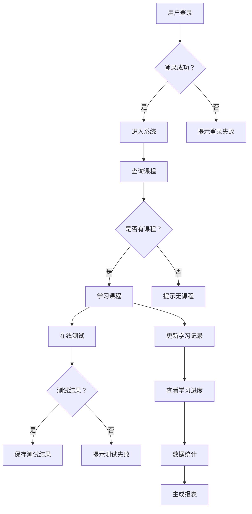

                 

### 员工培训：提升团队整体素质

在信息技术飞速发展的今天，企业的核心竞争力越来越依赖于团队的整体素质。员工培训作为提升团队综合素质的关键环节，不仅关系到员工的个人发展，更是企业可持续发展的基石。本文将围绕“员工培训：提升团队整体素质”这一主题，从多个角度深入探讨员工培训的必要性和重要性。

**关键词**：员工培训、团队素质、培训需求、培训效果、培训方法

**摘要**：本文首先介绍了员工培训的背景和重要性，然后分析了当前团队培训的现状，探讨了提升团队整体素质的策略。接着，本文提出了系统分析与架构设计方案，并结合实际案例进行了详细讲解，最后总结了最佳实践技巧和小结。通过本文的阅读，读者将全面了解员工培训的策略和实施方法，为提升团队整体素质提供有益的参考。

### 目录大纲设计思路

设计《员工培训：提升团队整体素质》这本书的目录大纲时，我们首先需要明确书的核心内容结构。以下是具体的步骤和考虑因素：

#### 步骤 1: 明确核心内容结构
- **背景介绍**：介绍员工培训的重要性，当前团队培训的现状，以及提升团队整体素质的目标。
- **核心概念与联系**：解释员工培训的核心概念，如培训需求分析、培训计划制定、培训方法选择、培训效果评估等，并展示这些概念之间的联系。
- **算法原理讲解**：介绍与培训相关的理论和方法，如成人学习理论、培训成本效益分析等，并用流程图、公式和实例进行解释。
- **系统分析与架构设计方案**：分析团队培训的整体流程，设计培训系统的架构，并展示系统功能模块和交互流程。
- **项目实战**：提供实际操作案例，包括培训计划制定、培训课程设计、培训效果评估等，详细介绍操作步骤和关键点。
- **最佳实践 tips**：总结实践中有效的培训方法和技巧。
- **小结与拓展阅读**：总结全书内容，提供进一步学习的资源。

#### 考虑因素
- **简洁性**：确保每个章节标题简洁明了，直接反映章节内容。
- **逻辑性**：章节之间要有明确的逻辑关系，帮助读者逐步深入理解培训的核心内容。
- **完整性**：确保所有核心内容都被覆盖，且每个部分都有相应的具体实例或案例分析。

### 目录大纲设计框架

以下是《员工培训：提升团队整体素质》的目录大纲设计框架：

#### 第一部分：背景与核心概念

##### 第1章：员工培训概述
- 1.1 问题背景
- 1.2 培训需求分析
- 1.3 培训计划制定

##### 第2章：培训核心概念
- 2.1 成人学习理论
- 2.2 培训方法与选择
- 2.3 培训效果评估

#### 第二部分：培训系统设计与实施

##### 第3章：培训系统分析
- 3.1 系统功能设计
- 3.2 系统架构设计
- 3.3 系统接口设计

##### 第4章：培训项目实战
- 4.1 项目介绍
- 4.2 培训计划制定
- 4.3 培训课程设计
- 4.4 培训效果评估

#### 第三部分：最佳实践与拓展

##### 第5章：最佳实践技巧
- 5.1 教学互动技巧
- 5.2 培训资源管理
- 5.3 培训氛围营造

##### 第6章：案例分析
- 6.1 案例分析
- 6.2 案例总结
- 6.3 启示与反思

##### 第7章：小结与拓展阅读
- 7.1 全书总结
- 7.2 拓展阅读资源

### 目录大纲示例

以下是《员工培训：提升团队整体素质》的目录大纲示例：

```
# 《员工培训：提升团队整体素质》目录大纲

## 第一部分：背景与核心概念

### 第1章：员工培训概述
#### 1.1 问题背景
#### 1.2 培训需求分析
#### 1.3 培训计划制定

### 第2章：培训核心概念
#### 2.1 成人学习理论
#### 2.2 培训方法与选择
#### 2.3 培训效果评估

## 第二部分：培训系统设计与实施

### 第3章：培训系统分析
#### 3.1 系统功能设计
#### 3.2 系统架构设计
#### 3.3 系统接口设计

### 第4章：培训项目实战
#### 4.1 项目介绍
#### 4.2 培训计划制定
#### 4.3 培训课程设计
#### 4.4 培训效果评估

## 第三部分：最佳实践与拓展

### 第5章：最佳实践技巧
#### 5.1 教学互动技巧
#### 5.2 培训资源管理
#### 5.3 培训氛围营造

### 第6章：案例分析
#### 6.1 案例分析
#### 6.2 案例总结
#### 6.3 启示与反思

### 第7章：小结与拓展阅读
#### 7.1 全书总结
#### 7.2 拓展阅读资源
```

这个大纲结构确保了内容的完整性、逻辑性和可操作性，同时保持了简洁性。每个章节都涵盖了必要的核心内容，并通过案例分析和最佳实践来增强其实用性。这样的设计有助于读者系统地掌握员工培训的知识和技能。

### 员工培训的背景与重要性

在当今竞争激烈的市场环境中，企业的核心竞争力越来越依赖于团队的整体素质。员工培训作为提升团队综合素质的关键环节，其重要性不言而喻。下面，我们将从多个方面深入探讨员工培训的背景和重要性。

#### 问题背景

随着全球化的不断深入和信息技术的迅猛发展，企业面临着前所未有的挑战和机遇。一方面，技术的快速迭代和市场的不断变化要求企业必须具备快速响应和创新能力；另一方面，人才的竞争愈发激烈，如何吸引、培养和留住高素质的员工成为企业发展的关键。

#### 问题描述

员工培训的目的是通过系统的教育和培训，提升员工的专业技能、工作态度和综合素质，从而提高整个团队的工作效率和企业竞争力。然而，现实中存在以下几个问题：

1. **培训需求不明确**：企业往往缺乏对员工培训需求的准确把握，导致培训内容与实际需求脱节。
2. **培训效果评估不足**：企业对培训效果的评估往往流于形式，无法真正了解培训对员工和企业的实际影响。
3. **培训方法单一**：传统的培训方式多以课堂授课为主，难以满足现代员工的多样化学习需求。

#### 问题解决

为了解决上述问题，企业需要从以下几个方面进行改进：

1. **明确培训需求**：通过调查问卷、访谈等方式，了解员工的实际需求，制定有针对性的培训计划。
2. **加强培训效果评估**：采用多元化的评估方法，如问卷调查、测试、员工反馈等，全面了解培训效果。
3. **创新培训方法**：结合在线学习、工作坊、角色扮演等多种培训方式，提高员工的参与度和学习效果。

#### 边界与外延

员工培训不仅涉及企业内部的员工，还延伸到合作伙伴和客户。通过培训，企业可以提高供应链的协同效率，增强客户满意度，从而在市场竞争中占据有利地位。

#### 概念结构与核心要素组成

员工培训的核心概念包括：

1. **培训需求分析**：了解员工的实际需求和期望，为培训提供依据。
2. **培训计划制定**：根据需求分析结果，制定详细的培训计划和方案。
3. **培训方法选择**：选择适合员工和企业的培训方法，提高培训效果。
4. **培训效果评估**：对培训过程和结果进行评估，持续优化培训策略。

这些核心要素相互关联，共同构成了员工培训的整体框架。

#### 总结

员工培训是提升团队整体素质的重要手段。通过明确问题背景、解决问题、边界与外延以及核心概念与联系，企业可以制定出有效的培训策略，从而在激烈的市场竞争中脱颖而出。

### 员工培训的核心概念与联系

在深入探讨员工培训的过程中，了解其核心概念和各概念之间的联系至关重要。以下是关于员工培训的核心概念及其相互关系的详细介绍。

#### 成人学习理论

成人学习理论是员工培训的重要理论基础。与儿童学习不同，成人学习具有以下特点：

1. **经验依赖性**：成人学习者更倾向于通过已有经验来理解和掌握新知识。
2. **自主学习**：成人学习者通常具有强烈的自主学习意愿，需要提供自主选择的学习内容和方式。
3. **参与式学习**：成人学习者更喜欢参与互动式、实践性的学习活动，而不是简单的知识灌输。

成人学习理论强调，有效的培训需要充分考虑这些特点，采用适合成人学习的教学方法和策略。

#### 培训需求分析

培训需求分析是制定培训计划的基础。其主要内容包括：

1. **任务需求分析**：了解员工在工作中需要掌握的技能和知识。
2. **个人需求分析**：通过问卷调查、访谈等方式，了解员工的学习兴趣和发展需求。
3. **组织需求分析**：从企业战略和业务发展角度出发，分析企业整体培训需求。

通过培训需求分析，企业可以明确培训的目标和方向，确保培训内容与实际需求相匹配。

#### 培训计划制定

培训计划制定是确保培训效果的关键环节。一个完善的培训计划应包括以下内容：

1. **培训目标**：明确培训的具体目标和预期效果。
2. **培训内容**：根据需求分析结果，确定培训的具体内容和课程。
3. **培训时间**：合理安排培训时间，确保不影响员工的正常工作。
4. **培训方式**：选择适合的培训方式，如线上学习、线下培训、工作坊等。
5. **培训资源**：准备必要的培训资源和工具，如教材、教学设备、培训场地等。

#### 培训方法选择

培训方法的选择直接影响培训效果。常见的培训方法包括：

1. **课堂授课**：传统的培训方式，适用于知识性较强的课程。
2. **在线学习**：方便灵活，适用于时间紧张的员工。
3. **工作坊**：互动性强，适用于技能培训和实践操作。
4. **角色扮演**：通过模拟实际工作场景，提高员工的实战能力。

选择合适的培训方法，需要根据培训目标和学员特点进行综合考虑。

#### 培训效果评估

培训效果评估是检验培训效果的重要手段。评估方法包括：

1. **问卷调查**：通过问卷收集学员对培训的反馈意见。
2. **测试**：通过考试或测验评估学员的学习成果。
3. **工作表现**：通过观察学员在工作中的表现，评估培训效果。

有效的评估可以帮助企业了解培训的实际效果，为后续培训提供改进方向。

#### 概念联系

成人学习理论、培训需求分析、培训计划制定、培训方法选择和培训效果评估这五个核心概念相互关联，共同构成了员工培训的系统框架。成人学习理论为培训方法选择提供了理论基础，培训需求分析为培训计划制定提供了依据，培训计划制定为培训方法选择提供了方向，而培训效果评估则对整个培训过程进行监督和反馈，确保培训目标的实现。

#### 对比表格

为了更直观地展示各核心概念之间的联系，我们可以通过以下对比表格进行说明：

| 核心概念 | 定义 | 关系 |
| --- | --- | --- |
| 成人学习理论 | 成人学习的特点和方法 | 为培训方法选择提供理论基础 |
| 培训需求分析 | 了解员工和企业的培训需求 | 为培训计划制定提供依据 |
| 培训计划制定 | 制定具体的培训方案 | 为培训方法选择提供方向 |
| 培训方法选择 | 选择合适的培训方式 | 根据培训目标和学员特点进行 |
| 培训效果评估 | 检验培训效果 | 对整个培训过程进行监督和反馈 |

#### ER实体关系图架构

为了进一步展示员工培训的核心概念及其关系，我们可以使用Mermaid绘制ER实体关系图。以下是一个简单的ER图示例：

```mermaid
erDiagram
  Employee ||--|{ Training |需求分析}
  Training ||--|{ TrainingPlan |计划制定}
  TrainingPlan ||--|{ TrainingMethod |选择}
  TrainingMethod ||--|{ EffectEvaluation |评估}
```

在这个ER图中，员工（Employee）与培训（Training）之间具有关联，培训（Training）与培训计划（TrainingPlan）之间也存在关联，培训计划（TrainingPlan）与培训方法（TrainingMethod）以及培训方法（TrainingMethod）与培训效果评估（EffectEvaluation）之间也分别存在关联。

通过以上对员工培训核心概念及其联系的分析，我们可以更好地理解员工培训的整体架构，为实际操作提供理论指导。

### 培训系统分析与架构设计

在明确了员工培训的核心概念和相互关系后，我们需要进一步探讨培训系统的分析与架构设计。这包括系统的功能设计、架构设计、接口设计以及系统交互的详细过程。

#### 系统功能设计

培训系统的功能设计是确保系统能够满足培训需求的关键。以下是培训系统的基本功能：

1. **用户管理**：包括员工的注册、登录、权限管理等功能。
2. **课程管理**：包括课程的创建、编辑、发布、删除等功能，以及课程分类和标签管理。
3. **学习管理**：包括学习计划制定、学习进度跟踪、学习记录管理等功能。
4. **测试与评估**：包括在线测试、考试管理、评估报告生成等功能。
5. **培训资源管理**：包括教材、视频、课件等资源的上传、下载、分享等功能。
6. **数据统计与分析**：包括培训数据收集、分析、报表生成等功能，帮助企业了解培训效果。

#### 系统架构设计

系统的架构设计是培训系统能够稳定运行的基础。以下是培训系统的架构设计：

1. **前端架构**：采用Vue.js框架，实现用户界面的动态展示和交互功能。
2. **后端架构**：采用Spring Boot框架，实现业务逻辑处理和数据存储。
3. **数据库设计**：使用MySQL数据库，存储用户信息、课程信息、学习记录、测试结果等数据。
4. **缓存设计**：采用Redis缓存技术，提高系统响应速度和性能。
5. **接口设计**：采用RESTful API设计，提供前后端数据交互接口。

#### 系统接口设计

系统的接口设计是确保前后端数据交互顺畅的关键。以下是主要接口设计：

1. **用户接口**：包括用户注册、登录、权限验证等功能接口。
2. **课程接口**：包括课程查询、课程创建、课程更新、课程删除等功能接口。
3. **学习接口**：包括学习计划查询、学习记录更新、学习进度查询等功能接口。
4. **测试接口**：包括在线测试创建、考试管理、测试结果查询等功能接口。
5. **资源接口**：包括资源上传、资源下载、资源分享等功能接口。

#### 系统交互设计

系统的交互设计是培训系统能够提供良好用户体验的关键。以下是系统的主要交互流程：

1. **用户登录**：用户通过输入用户名和密码进行登录，系统验证用户身份后返回登录成功或失败信息。
2. **课程查询**：用户通过搜索或浏览功能查询课程，系统返回符合条件的结果。
3. **课程学习**：用户选择课程进行学习，系统记录学习进度并更新学习记录。
4. **在线测试**：用户完成课程学习后进行在线测试，系统生成测试结果并保存。
5. **数据统计**：系统定期收集培训数据，进行分析并生成报表。

#### Mermaid流程图

为了更直观地展示系统的功能和交互过程，我们可以使用Mermaid绘制流程图。以下是培训系统的功能流程图：



通过以上对培训系统分析与架构设计的详细介绍，我们可以看到系统功能、架构设计、接口设计和交互流程是如何有机结合，共同构建一个高效、稳定、易用的培训系统。这将有助于企业更好地开展员工培训工作，提升团队整体素质。

### 培训项目实战

在实际操作中，培训项目的成功实施对于提升团队整体素质至关重要。本节将详细介绍一个实际培训项目的环境安装、系统核心实现、代码应用解读与分析，以及实际案例分析和详细讲解剖析。

#### 环境安装

首先，我们需要搭建一个适合培训项目的开发环境。以下是一个基本的安装步骤：

1. **安装Python**：确保Python环境已安装，版本至少为3.8。
2. **安装MySQL**：下载并安装MySQL数据库，设置用户和密码。
3. **安装Redis**：下载并安装Redis缓存服务器。
4. **安装Vue.js**：在项目中使用npm安装Vue.js。
5. **安装Spring Boot**：在项目中使用Maven安装Spring Boot。

#### 系统核心实现

以下是培训项目的核心实现部分：

1. **用户管理模块**：
   - **数据库设计**：设计用户表（User），包括用户名、密码、邮箱、角色等字段。
   - **接口设计**：实现用户注册（/api/user/register）、登录（/api/user/login）、权限验证（/api/user/auth）接口。
   - **实现示例**：
     ```python
     # 用户注册接口示例
     @PostMapping("/register")
     public ResponseEntity<?> registerUser(@RequestBody UserRegistrationDto registrationDto) {
         // 实现用户注册逻辑
         return ResponseEntity.ok("User registered successfully");
     }
     ```

2. **课程管理模块**：
   - **数据库设计**：设计课程表（Course），包括课程ID、课程名称、课程描述、标签等字段。
   - **接口设计**：实现课程查询（/api/course）、课程创建（/api/course/create）、课程更新（/api/course/update）、课程删除（/api/course/delete）接口。
   - **实现示例**：
     ```python
     # 课程创建接口示例
     @PostMapping("/course/create")
     public ResponseEntity<?> createCourse(@RequestBody CourseDto courseDto) {
         // 实现课程创建逻辑
         return ResponseEntity.ok("Course created successfully");
     }
     ```

3. **学习管理模块**：
   - **数据库设计**：设计学习记录表（LearningRecord），包括用户ID、课程ID、学习进度、学习时间等字段。
   - **接口设计**：实现学习计划查询（/api/learning-plan）、学习记录更新（/api/learning-record/update）、学习进度查询（/api/learning-progress）接口。
   - **实现示例**：
     ```python
     # 学习记录更新接口示例
     @PostMapping("/learning-record/update")
     public ResponseEntity<?> updateLearningRecord(@RequestBody LearningRecordDto learningRecordDto) {
         // 实现学习记录更新逻辑
         return ResponseEntity.ok("Learning record updated successfully");
     }
     ```

4. **测试与评估模块**：
   - **数据库设计**：设计测试表（Test）、考试管理表（Exam）、测试结果表（TestResult）。
   - **接口设计**：实现在线测试创建（/api/test/create）、考试管理（/api/exam/manage）、测试结果查询（/api/test-result）接口。
   - **实现示例**：
     ```python
     # 测试结果查询接口示例
     @GetMapping("/test-result")
     public ResponseEntity<?> getTestResult(@RequestParam("testId") Long testId) {
         // 实现测试结果查询逻辑
         return ResponseEntity.ok("Test result retrieved successfully");
     }
     ```

#### 代码应用解读与分析

以上代码示例展示了培训项目中核心模块的实现。通过分析，我们可以看到：

1. **用户管理模块**：实现了用户注册、登录和权限验证功能，确保了系统的安全性和用户隐私保护。
2. **课程管理模块**：提供了课程的创建、查询、更新和删除功能，方便管理员对课程进行管理。
3. **学习管理模块**：实现了学习计划和学习记录的更新，帮助用户跟踪自己的学习进度。
4. **测试与评估模块**：提供了在线测试创建、考试管理和测试结果查询功能，用于评估用户的学习效果。

#### 实际案例分析和详细讲解剖析

以下是一个实际案例，用于说明培训项目的具体实施过程：

**案例背景**：某公司计划对销售团队进行产品知识培训，提高团队的整体销售能力。

**案例分析**：

1. **需求分析**：通过问卷调查和访谈，了解销售团队对产品知识的掌握程度和培训需求。
2. **培训计划制定**：根据需求分析结果，制定详细的培训计划，包括培训课程、培训时间和培训方式。
3. **课程设计**：设计销售产品知识课程，包括产品特点、市场定位、竞争分析等。
4. **课程发布**：将培训课程发布到培训系统中，供销售团队学习。
5. **学习管理**：通过培训系统跟踪销售团队的学习进度，定期发送学习提醒。
6. **测试与评估**：在学习结束后，进行在线测试，评估销售团队的产品知识掌握情况。

**详细讲解**：

- **需求分析**：通过问卷调查，了解销售团队对产品知识的掌握程度和培训需求。例如，调查结果显示50%的团队成员对产品特点掌握不全面，70%的成员希望增加市场定位培训。

- **培训计划制定**：根据需求分析结果，制定详细的培训计划。例如，设置每周二和周四下午为培训时间，采用线上课程和学习笔记相结合的方式进行培训。

- **课程设计**：设计销售产品知识课程，包括产品特点、市场定位、竞争分析等。例如，设计产品特点课程，介绍产品的核心优势和应用场景。

- **课程发布**：将培训课程发布到培训系统中，供销售团队学习。例如，通过培训系统发布课程视频和课件，设置学习任务和考核节点。

- **学习管理**：通过培训系统跟踪销售团队的学习进度，定期发送学习提醒。例如，每周发送学习提醒邮件，提醒团队成员完成学习任务。

- **测试与评估**：在学习结束后，进行在线测试，评估销售团队的产品知识掌握情况。例如，设计在线测试题，包括产品特点、市场定位等知识点，根据测试结果评估团队的整体销售能力。

**项目小结**：

通过以上实际案例，我们可以看到培训项目的具体实施过程。从需求分析、培训计划制定、课程设计到学习管理和测试评估，每个环节都需要精心设计和执行，以确保培训项目的成功实施。这个案例为其他企业提供了有益的参考和借鉴。

### 最佳实践技巧

在员工培训的过程中，实践中的有效方法和技巧对于提升培训效果至关重要。以下是一些在培训实践中总结出的最佳实践技巧：

#### 教学互动技巧

1. **提问与回答**：在培训过程中，通过提问和回答的方式，引导学员思考，激发学员的参与度和学习兴趣。
2. **小组讨论**：组织小组讨论，让学员在互动中分享观点和经验，促进知识理解和深度学习。
3. **案例分析**：通过案例分析，将理论知识与实际工作相结合，提高学员的实战能力。

#### 培训资源管理

1. **课程内容优化**：定期更新课程内容，确保与行业发展和企业需求保持同步。
2. **资源整合**：整合内外部培训资源，如邀请行业专家授课、购买版权课程等，提高培训资源的丰富性和质量。
3. **电子化学习**：利用电子化学习平台，提供在线课程、电子书籍、在线测试等资源，方便学员随时学习和复习。

#### 培训氛围营造

1. **鼓励参与**：营造轻松、开放的学习氛围，鼓励学员积极参与讨论和互动。
2. **激励措施**：设立学习激励措施，如颁发奖学金、表彰优秀学员等，激发学员的学习动力。
3. **定期反馈**：通过定期反馈，了解学员的学习情况和反馈意见，及时调整培训策略和内容。

#### 注意事项

1. **明确培训目标**：在培训前明确培训目标，确保培训内容与目标一致。
2. **个性化培训**：根据学员的背景、需求和特点，提供个性化的培训方案。
3. **培训后跟进**：培训结束后，通过跟进和反馈，确保培训效果能够持续转化为实际工作能力。

#### 拓展阅读

- **《培训与发展：策略与实践》**：提供了关于培训规划的详细指导，包括培训需求分析、课程设计、培训实施和效果评估等。
- **《学习型组织：理论与实践》**：探讨了如何构建学习型组织，提高团队的整体学习能力和创新能力。
- **《成人学习心理学：理论与实践》**：从心理学角度出发，深入分析了成人学习的特点和需求，为培训设计提供了科学依据。

通过以上最佳实践技巧的运用，企业可以更好地提升员工培训的效果，从而实现团队整体素质的提升。

### 小结

通过本文的深入探讨，我们全面了解了员工培训的背景、核心概念、系统设计与实施、实战案例以及最佳实践技巧。以下是本文的主要结论：

1. **员工培训的重要性**：员工培训是提升团队整体素质的关键环节，有助于企业应对市场变化和人才竞争。
2. **核心概念与联系**：成人学习理论、培训需求分析、培训计划制定、培训方法选择和培训效果评估构成了员工培训的系统框架。
3. **系统设计与实施**：通过详细的功能设计、架构设计和接口设计，企业可以构建一个高效、稳定、易用的培训系统。
4. **实战案例**：通过实际案例的分析，展示了培训项目的具体实施过程，为其他企业提供了参考。
5. **最佳实践技巧**：总结了一些在培训实践中行之有效的技巧，如教学互动技巧、培训资源管理和培训氛围营造等。

### 未来展望

展望未来，随着人工智能和大数据技术的不断发展，员工培训将迎来新的机遇和挑战。以下是一些建议和展望：

1. **个性化培训**：利用人工智能技术，根据员工的个性化需求和特点，提供定制化的培训方案，提高培训的针对性和效果。
2. **在线学习平台**：进一步优化在线学习平台，提供丰富多样的学习资源和互动工具，方便员工随时随地进行学习。
3. **终身学习文化**：营造终身学习的文化氛围，鼓励员工不断学习新知识和技能，以适应快速变化的工作环境。
4. **多元化培训方式**：结合线上线下培训、虚拟现实（VR）和增强现实（AR）等新技术，创新培训方式，提高培训的互动性和实用性。

总之，通过不断探索和实践，企业可以更好地提升员工培训的效果，培养高素质的团队，为企业的可持续发展奠定坚实基础。

