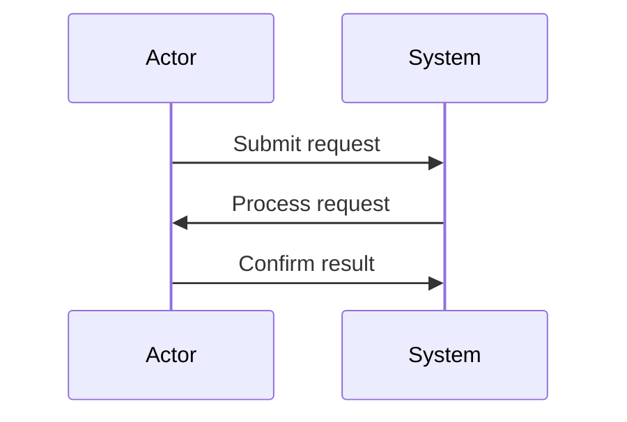

                 

# 团队信任建设：建立高度信任的团队环境

## 关键词
- 团队信任
- 信任建设
- 团队效率
- 团队文化
- 项目实践

## 摘要
本文旨在深入探讨团队信任建设的重要性及其对团队效率和成果的影响。我们将从背景介绍、核心概念、建设策略、维护方法、技术工具、项目实战及最佳实践等方面展开详细讨论，并提供实用的方法和技巧，帮助读者在IT领域中建立和维护一个高度信任的团队环境。

---

## 引言

在现代企业中，团队协作已经成为提高工作效率、推动项目成功的关键因素。而团队信任作为团队协作的核心，其重要性不言而喻。团队信任不仅影响团队成员之间的合作效率，还直接影响团队的整体绩效和项目的成功。然而，在现实工作中，团队信任的建设并非易事，往往面临诸多挑战。

本文将分以下几个部分进行探讨：

1. **问题背景与核心概念**：介绍团队信任的定义、重要性及面临的挑战。
2. **核心概念与原理**：深入探讨团队信任的核心构成要素、原理及其数学模型。
3. **信任建设的方法与实践**：提供具体的策略和步骤，帮助团队建立信任。
4. **信任维护与提升**：探讨如何在团队运行过程中维护和提升信任。
5. **工具与技术**：介绍用于评估和建设团队信任的工具和技术。
6. **项目实战与案例分析**：通过实际项目分享信任建设的过程和成果。
7. **最佳实践与总结**：总结团队信任建设的关键要点，展望未来发展趋势。

---

## 第1章：团队信任的背景与问题

### 1.1 团队信任的定义与边界

团队信任是指团队成员之间基于相互尊重、诚实和透明度所建立的一种信任关系。这种关系使得团队成员能够放心地依赖彼此，共同协作实现团队目标。

**团队信任的边界**：

1. **信任范围**：团队信任是在团队成员之间建立的，其范围限于团队成员之间，不包括外部合作伙伴或其他组织。
2. **信任程度**：团队信任有高有低，不同的团队在不同的阶段可能会有不同的信任水平。
3. **信任对象**：团队信任的对象主要是团队成员的行为和决策，而非个人。

### 1.2 团队信任的重要性

**团队信任的影响**：

1. **沟通效率**：高信任度的团队能够更有效地沟通，减少误解和冲突。
2. **决策效率**：团队成员之间相互信任，能够更快地达成共识，做出决策。
3. **合作效率**：信任使得团队成员更愿意合作，共同解决问题。

**团队信任与绩效的关系**：

1. **团队绩效**：高信任度的团队往往表现出更高的绩效，因为团队成员能够更有效地合作。
2. **组织绩效**：团队信任的提升有助于提高整个组织的绩效，从而实现企业的战略目标。

### 1.3 团队信任的挑战

**内部竞争与信任的冲突**：

1. **资源分配**：团队成员可能会因为资源分配问题产生竞争，影响信任建设。
2. **个人目标与团队目标**：个人目标与团队目标不一致时，可能导致团队成员之间的信任冲突。

**文化和价值观的差异**：

1. **价值观差异**：团队成员来自不同的文化背景，可能会有不同的价值观，影响团队信任建设。
2. **沟通障碍**：不同文化背景的团队成员在沟通时可能会遇到障碍，影响信任建设。

---

## 第2章：团队信任的核心概念与原理

### 2.1 团队信任的构成要素

**信任的基础要素**：

1. **诚实**：团队成员之间的诚实是建立信任的基础。
2. **透明度**：团队决策和工作的透明度能够增强信任。
3. **尊重**：尊重团队成员的意见和决策，能够提升团队信任。

**信任的层次结构**：

1. **初级信任**：基于初次见面时的初步了解和信任。
2. **中级信任**：在长期合作中，通过共同经历和共同解决问题来建立的信任。
3. **高级信任**：团队成员之间无保留的信任，能够信任对方的专业能力和决策。

### 2.2 团队信任的原理

**信任的心理学基础**：

1. **心理安全感**：信任能够提供团队成员心理上的安全感，减少不确定性和恐惧。
2. **信任机制**：信任是一种心理机制，帮助团队成员在不确定的环境中做出决策。

**信任的社会学模型**：

1. **互惠模型**：信任是建立在互惠关系基础上的，双方都有义务和责任去维护这种关系。
2. **社会交换模型**：信任是一种社会交换，团队成员通过相互帮助和合作来建立信任。

### 2.3 团队信任的数学模型

**信任度的量化模型**：

1. **贝叶斯模型**：通过历史数据和统计方法，量化团队信任度。
2. **信任度评分模型**：使用评分系统，对团队成员的信任度进行量化评估。

**信任关系的动态模型**：

1. **信任动态模型**：描述信任关系的形成、发展、维持和破坏过程。
2. **信任反馈模型**：通过反馈机制，不断调整和优化团队信任关系。

---

## 第3章：建立团队信任的策略

### 3.1 培养信任的文化

**文化塑造的途径**：

1. **价值观传播**：通过培训、活动和日常沟通，将信任价值观传递给团队成员。
2. **激励机制**：设立信任激励机制，鼓励团队成员建立和维持信任关系。

**文化评估与改进**：

1. **信任文化评估**：通过问卷调查、访谈等方法，评估团队信任文化现状。
2. **文化改进策略**：根据评估结果，制定针对性的改进措施，提升团队信任水平。

### 3.2 个人信任建设

**自我认知与提升**：

1. **自我反思**：定期进行自我反思，识别自己的信任行为和信任缺失。
2. **能力提升**：通过学习、培训和实际操作，提升自己的专业能力和信任水平。

**情感管理与沟通技巧**：

1. **情感管理**：学会管理自己的情绪，避免情绪化决策和行为。
2. **沟通技巧**：提高沟通能力，通过有效沟通建立信任关系。

### 3.3 团队信任建设实践

**团队信任建设活动的策划与实施**：

1. **活动策划**：根据团队特点和需求，制定信任建设活动计划。
2. **活动实施**：通过团队建设活动，增进团队成员之间的了解和信任。

**团队信任评估与反馈**：

1. **信任评估**：定期进行团队信任评估，了解团队信任现状。
2. **反馈与改进**：根据评估结果，提供反馈和建议，持续改进团队信任建设。

---

## 第4章：维护团队信任的策略

### 4.1 防止信任破坏

**信任破坏的识别**：

1. **行为观察**：通过观察团队成员的行为，识别可能的信任破坏行为。
2. **反馈机制**：建立反馈机制，鼓励团队成员提出信任破坏问题。

**信任修复的方法**：

1. **沟通与道歉**：通过沟通和道歉，解决信任破坏问题。
2. **补救措施**：采取有效的补救措施，恢复信任关系。

### 4.2 提升团队信任水平

**提升信任的长期策略**：

1. **持续培训**：定期进行团队信任培训，提升团队成员的信任意识。
2. **制度建设**：建立完善的信任制度建设，为团队信任提供制度保障。

**提升信任的短期措施**：

1. **团队活动**：通过团队活动，增强团队成员之间的互动和信任。
2. **项目合作**：通过项目合作，促进团队成员之间的信任关系。

---

## 第5章：团队信任工具与技术

### 5.1 信任评估工具

**信任评估问卷**：

1. **问卷设计**：根据团队特点和需求，设计针对性的信任评估问卷。
2. **问卷分析**：通过问卷分析，了解团队信任现状，识别信任问题。

**信任评估量表**：

1. **量表设计**：根据信任评估问卷的结果，设计针对性的信任评估量表。
2. **量表分析**：通过量表分析，量化团队信任水平，提供改进建议。

### 5.2 信任建设技术

**团队建设活动**：

1. **活动策划**：根据团队特点和需求，制定团队建设活动计划。
2. **活动实施**：通过团队建设活动，增强团队成员之间的信任。

**信任培养研讨会**：

1. **研讨会主题**：选择与团队信任相关的主题，引导团队成员深入探讨。
2. **研讨会成果**：通过研讨会，分享信任建设经验和最佳实践。

---

## 第6章：团队信任建设项目实战

### 6.1 实战项目背景

**项目介绍**：

- 项目名称：**“信任之桥”团队信任建设项目**
- 项目目标：通过一系列措施，提升团队成员之间的信任水平，提高团队协作效率。

**项目目标**：

- 提升团队成员的信任意识。
- 改善团队协作氛围。
- 提高团队整体绩效。

### 6.2 系统分析与设计

**系统功能设计（领域模型类图）**：

```mermaid
classDiagram
Class01 <|-- Class02
Class03 : +int x
Class04 : +int y
Class01 <|-|-| Class04
Class05 : #0000FF
Class06 : <<interface>>
Class01 ..|> Class06
Class07 : <<extend>> Class03
Class08 : <<implements>> Class06
Class03 *--|> Class07
Class03 *--|> Class08
```

**系统架构设计（架构图）**：



### 6.3 项目实施与评估

**实施过程**：

1. **需求分析**：与团队成员进行沟通，了解信任问题及其影响。
2. **方案设计**：制定信任建设方案，包括活动安排、培训内容等。
3. **活动实施**：开展团队建设活动和培训，提升团队成员的信任意识。
4. **跟踪评估**：定期进行信任评估，了解项目效果，及时调整方案。

**评估与反馈**：

1. **信任评估**：通过问卷调查和访谈，了解团队成员之间的信任水平。
2. **反馈与改进**：根据评估结果，提供反馈和建议，持续改进信任建设。

---

## 第7章：团队信任建设最佳实践

### 7.1 最佳实践案例分享

**成功案例剖析**：

- **案例1**：“阿里巴巴信任文化建设”项目：通过持续的信任文化建设和实践，显著提升了团队的协作效率和绩效。

**失败案例反思**：

- **案例2**：“某科技企业团队信任危机”事件：由于领导层的不信任和沟通障碍，导致团队信任危机，项目进度严重滞后。

### 7.2 小结与展望

**团队信任建设的关键因素**：

1. **领导层的信任态度**：领导层的态度和行为对团队信任建设至关重要。
2. **沟通与协作**：有效的沟通和协作是建立团队信任的基础。
3. **持续培训与反馈**：定期的培训和反馈能够不断提升团队成员的信任水平。

**未来发展趋势**：

1. **数字化信任建设**：随着数字技术的不断发展，数字化信任建设将成为团队信任建设的重要方向。
2. **跨文化团队信任建设**：在全球化背景下，跨文化团队的信任建设将受到越来越多的关注。

---

## 结语

本文从多个角度探讨了团队信任建设的重要性及其在IT领域中的应用。通过理解团队信任的核心概念、原理和实践方法，我们可以有针对性地开展团队信任建设，提升团队的协作效率和绩效。未来，随着技术的发展和团队结构的多样化，团队信任建设将面临新的挑战和机遇，值得我们进一步研究和实践。

## 作者信息

作者：AI天才研究院/AI Genius Institute & 禅与计算机程序设计艺术 /Zen And The Art of Computer Programming

---

以上内容仅为文章大纲和部分正文示例，实际撰写时需根据要求进一步展开和深化每个章节的内容。在撰写过程中，注意保持逻辑清晰、结构紧凑，并确保文章的完整性和专业性。同时，注意使用markdown格式，以便于文章的排版和阅读。

