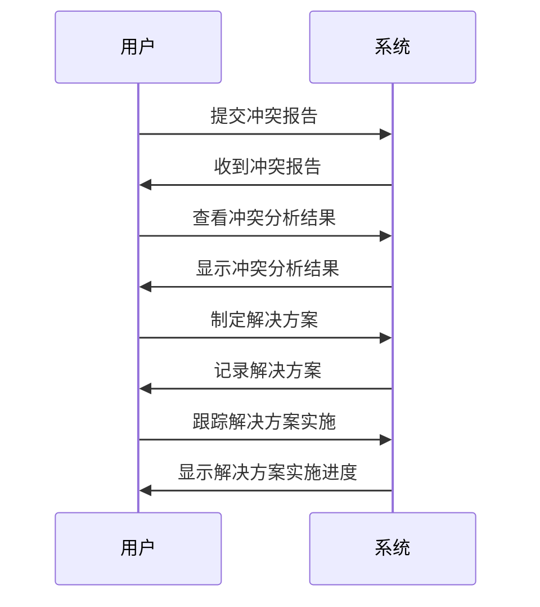

                 


### 团队冲突resolution：从对抗到合作

关键词：团队冲突、冲突管理、团队建设、沟通技巧、解决策略

摘要：本文旨在深入探讨团队冲突的解决策略，从冲突的背景、核心概念、算法原理、数学模型到实际应用，逐步分析团队冲突的根源及其影响，并提出有效的解决方法和实践策略。文章结构紧凑，逻辑清晰，旨在帮助团队领导者和管理者更好地应对和处理团队冲突，促进团队协作和合作，实现团队目标的达成。

### 目录大纲

1. **背景介绍**
   1.1 问题背景
   1.2 团队冲突的描述
   1.3 团队冲突解决的意义

2. **核心概念与联系**
   2.1 冲突管理
   2.2 团队建设
   2.3 沟通技巧
   2.4 核心概念联系

3. **算法原理讲解**
   3.1 心理学原理
   3.2 组织行为学理论
   3.3 决策树算法
   3.4 博弈论模型

4. **数学模型和数学公式**
   4.1 决策树模型的数学模型
   4.2 博弈论的数学模型
   4.3 数学公式详细讲解
   4.4 举例说明

5. **系统分析与架构设计方案**
   5.1 问题场景介绍
   5.2 项目介绍
   5.3 系统功能设计
   5.4 系统架构设计
   5.5 系统接口设计
   5.6 系统交互设计

6. **项目实战**
   6.1 环境安装
   6.2 系统核心实现源代码
   6.3 代码应用解读与分析
   6.4 实际案例分析与讲解
   6.5 项目小结

7. **最佳实践 tips**
   7.1 解决团队冲突的最佳实践
   7.2 小结与展望

### 背景介绍

#### 1.1 问题背景

在当今快速变化和高度竞争的商业环境中，团队协作已经成为实现组织目标的关键因素。然而，团队冲突在各个组织中普遍存在，且对团队效率和生产力产生负面影响。冲突可能源于不同的工作风格、目标差异、沟通不畅、资源分配不均等多种原因。

团队冲突的常见问题包括：

- **沟通障碍**：团队成员之间的沟通不畅导致误解和冲突。
- **目标不一致**：团队内部成员对目标的认知不一致，导致工作方向和努力方向的冲突。
- **资源争夺**：有限的资源导致团队成员之间的争夺和对抗。
- **个性差异**：团队成员的个性和价值观差异引发冲突。

解决团队冲突的重要性在于：

- **提升团队效率**：有效的冲突解决有助于减少内耗，提高团队的工作效率。
- **增强团队凝聚力**：通过解决冲突，增强团队成员之间的信任和协作精神。
- **实现组织目标**：团队冲突的解决有助于确保团队朝着共同的目标努力，提高组织绩效。

#### 1.2 团队冲突的描述

团队冲突是指团队成员在共同工作过程中，由于目标、利益、价值观、工作方式等方面的不一致而产生的争执、对抗和摩擦。这些冲突可能表现为言语上的争执、情绪上的对立、行为上的抵制等。

冲突的类型主要包括：

- **功能冲突**：有益的冲突，可以激发创新和改进。
- **破坏性冲突**：有害的冲突，导致团队分裂、效率低下。
- **垂直冲突**：来自团队内部不同层级之间的冲突。
- **水平冲突**：同一层级团队成员之间的冲突。

#### 1.3 团队冲突解决的意义

解决团队冲突具有多重意义：

- **提高团队协作**：通过解决冲突，增强团队成员之间的沟通和协作，提高团队整体效能。
- **促进个人成长**：冲突解决有助于团队成员认识到自己的不足，促进个人能力和素质的提升。
- **降低组织风险**：有效管理团队冲突可以减少组织内部的紧张和不满情绪，降低潜在的风险。
- **提升组织文化**：积极解决冲突可以建立健康、积极的组织文化，吸引和留住优秀人才。

### 核心概念与联系

#### 2.1 冲突管理

冲突管理是指通过各种方法和策略来识别、处理和解决团队冲突的过程。有效的冲突管理能够降低冲突的负面影响，提升团队的协作效率和凝聚力。

冲突管理的核心概念包括：

- **冲突识别**：及时发现和识别团队中的冲突。
- **冲突分析**：分析冲突的原因和性质，确定冲突的类型。
- **冲突解决**：采取适当的策略和方法来化解冲突。
- **冲突预防**：通过改进管理机制和沟通方式，预防冲突的发生。

#### 2.2 团队建设

团队建设是指通过一系列措施和活动来增强团队凝聚力、协作能力和工作效能。团队建设的目标是培养团队成员之间的信任、沟通和共同目标。

团队建设的核心概念包括：

- **团队目标**：明确团队共同的目标和愿景。
- **团队角色**：明确每个团队成员的角色和责任。
- **团队沟通**：建立有效的沟通机制，确保信息畅通。
- **团队氛围**：营造积极、和谐的团队氛围。

#### 2.3 沟通技巧

沟通技巧是指团队成员在沟通过程中运用的一系列策略和技能，以实现有效沟通和减少冲突。

沟通技巧的核心概念包括：

- **主动倾听**：倾听他人的意见和需求，理解对方的立场。
- **清晰表达**：用准确、简洁的语言表达自己的观点和需求。
- **非语言沟通**：运用肢体语言、表情和语调等非语言元素，增强沟通效果。
- **情绪管理**：在沟通过程中保持冷静，妥善处理情绪问题。

#### 2.4 核心概念联系

冲突管理、团队建设和沟通技巧是解决团队冲突的三大核心概念。它们相互联系、相互影响，共同作用于团队冲突的解决过程。

- **冲突管理与团队建设**：冲突管理是团队建设的一部分，通过有效的冲突管理，可以增强团队凝聚力和协作能力。
- **冲突管理与沟通技巧**：冲突管理依赖于良好的沟通技巧，有效的沟通技巧有助于冲突的及时识别和解决。
- **团队建设与沟通技巧**：团队建设强调沟通的重要性，良好的沟通技巧是团队建设的基础。

### 算法原理讲解

#### 3.1 心理学原理

心理学原理在团队冲突解决中扮演重要角色，通过理解团队成员的心理行为，可以更好地预测和干预冲突。

心理学原理的核心概念包括：

- **需求层次理论**：马斯洛的需求层次理论指出，人们的需求从生理需求、安全需求、社交需求、尊重需求到自我实现需求，层次递增。
- **认知失调理论**：费斯廷格的认知失调理论认为，当个体的认知出现不一致时，会产生紧张和焦虑，个体会采取行动来消除这种失调。
- **情绪智力**：情绪智力是指个体识别、理解、管理自己情绪的能力，以及识别、理解、影响他人情绪的能力。

#### 3.2 组织行为学理论

组织行为学理论关注团队成员的行为和团队动态，提供了理解和解决团队冲突的框架。

组织行为学理论的核心概念包括：

- **团队动力**：团队动力是指团队成员之间的相互作用和影响，包括角色冲突、任务冲突和情感冲突。
- **团队规范**：团队规范是指团队成员共同遵守的行为准则，有助于维护团队秩序和协作。
- **领导风格**：领导风格对团队冲突的解决有着重要影响，不同的领导风格可能导致不同的冲突处理结果。

#### 3.3 决策树算法

决策树算法是一种常用的决策支持工具，适用于分析和解决团队冲突。

决策树算法的核心概念包括：

- **节点**：决策树中的节点表示决策或事件。
- **分支**：决策树中的分支表示决策的选择或结果。
- **叶节点**：决策树中的叶节点表示决策的最终结果。

#### 3.4 博弈论模型

博弈论模型是一种分析决策者之间策略互动的工具，适用于团队冲突的解决。

博弈论模型的核心概念包括：

- **参与方**：博弈论中的参与方可以是个人或团队。
- **策略**：参与方在博弈中采取的行动或决策。
- **结果**：博弈的结果，通常表现为参与方的收益或损失。

### 数学模型和数学公式

#### 4.1 决策树模型的数学模型

决策树模型是一种基于概率论的数学模型，用于分析团队冲突的决策过程。

决策树模型的数学公式包括：

- **期望值**：$$E = \sum_{i=1}^{n} p_i \cdot x_i$$
  - 其中，$E$ 表示期望值，$p_i$ 表示事件 $i$ 发生的概率，$x_i$ 表示事件 $i$ 的收益。

- **条件概率**：$$P(A|B) = \frac{P(A \cap B)}{P(B)}$$
  - 其中，$P(A|B)$ 表示在事件 $B$ 发生的条件下事件 $A$ 发生的概率。

#### 4.2 博弈论的数学模型

博弈论的数学模型主要用于分析团队冲突中的策略选择和结果预测。

博弈论的数学公式包括：

- **纳什均衡**：$$u_i(s_i, s_{-i}) = \max_{s_{-i}} u_i(s_i, s_{-i})$$
  - 其中，$u_i$ 表示参与方 $i$ 在给定策略组合 $(s_i, s_{-i})$ 下的收益。

- **混合策略**：$$\pi_i = \sum_{j=1}^{m} p_j \cdot s_j$$
  - 其中，$\pi_i$ 表示参与方 $i$ 的混合策略，$p_j$ 表示参与方 $i$ 采取策略 $s_j$ 的概率。

### 系统分析与架构设计方案

#### 5.1 问题场景介绍

在一个大型软件开发项目中，团队成员之间经常出现冲突。这些冲突影响了项目的进度和质量，导致团队工作效率低下。为了解决这些问题，需要设计一个有效的团队冲突管理系统，以帮助团队成员更好地协作和沟通。

#### 5.2 项目介绍

本项目旨在设计并实现一个基于Web的团队冲突管理系统。该系统将提供一系列功能，包括冲突报告、冲突分析、冲突解决方案的制定和跟踪等。系统将采用前后端分离的架构，前端负责用户界面设计，后端负责数据处理和业务逻辑实现。

#### 5.3 系统功能设计

系统功能设计包括以下几个方面：

- **用户管理**：管理系统的用户账户，包括用户注册、登录、权限管理等功能。
- **冲突报告**：允许团队成员提交冲突报告，包括冲突的类型、时间、地点、涉及人员、问题描述等。
- **冲突分析**：对提交的冲突报告进行分析，识别冲突的原因和性质。
- **解决方案制定**：根据冲突分析结果，制定相应的解决方案。
- **解决方案跟踪**：跟踪解决方案的实施情况，评估解决方案的效果。

#### 5.4 系统架构设计

系统架构设计采用分层架构，包括表示层、业务逻辑层和数据层。

- **表示层**：负责用户界面的设计，采用HTML、CSS和JavaScript等前端技术实现。
- **业务逻辑层**：负责处理业务逻辑，包括用户管理、冲突报告、冲突分析、解决方案制定和跟踪等功能，采用Python Flask框架实现。
- **数据层**：负责数据存储和管理，采用MySQL数据库。

#### 5.5 系统接口设计

系统接口设计包括API接口和数据库接口。

- **API接口**：提供RESTful API接口，供前端调用，实现数据传输和业务逻辑处理。
- **数据库接口**：采用ORM（对象关系映射）技术，实现数据层与业务逻辑层的交互。

#### 5.6 系统交互设计

系统交互设计采用Mermaid序列图，描述系统的用户操作流程和数据流转。



### 项目实战

#### 6.1 环境安装

在开始项目开发之前，需要安装必要的开发环境和软件。

- **Python环境**：安装Python 3.8及以上版本。
- **Flask环境**：安装Flask框架。
- **MySQL环境**：安装MySQL数据库。

安装命令如下：

```bash
pip install flask
pip install flask-mysql
```

#### 6.2 系统核心实现源代码

以下是一段核心实现源代码，用于处理用户登录功能。

```python
from flask import Flask, request, jsonify
from flask_mysq

