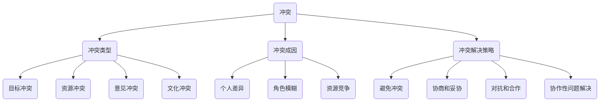
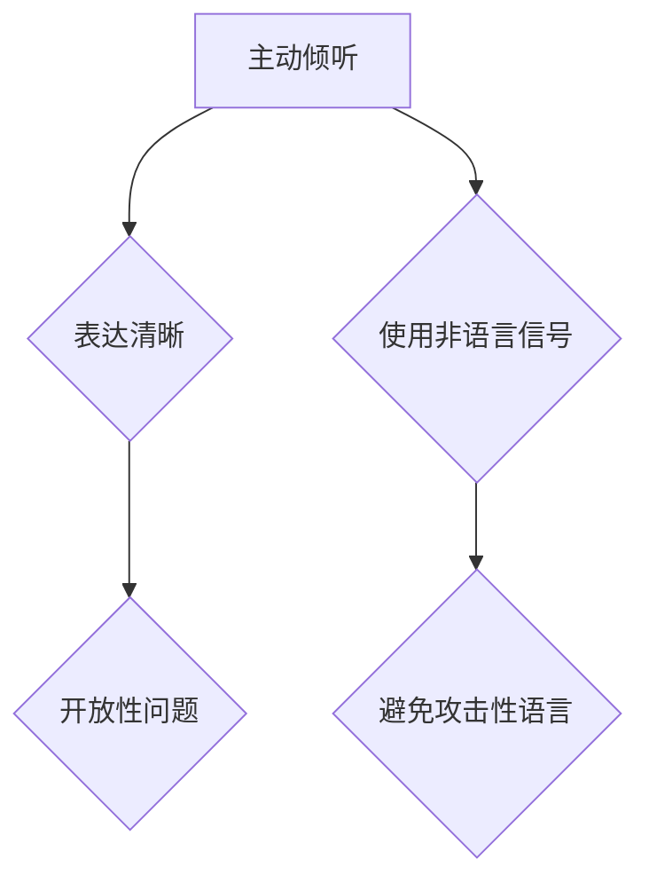

                 

## 文章标题：团队冲突管理：从对抗到建设性对话

关键词：团队冲突、冲突管理、建设性对话、冲突解决策略、沟通技巧

摘要：本文旨在探讨团队冲突管理的有效方法，从对抗到建设性对话的转换。通过分析冲突的成因和影响，介绍多种冲突解决策略，以及如何在沟通中实现建设性对话，帮助团队提高协作效率，实现组织目标。

## 引言

在信息技术飞速发展的今天，团队协作成为了推动项目成功的关键因素。然而，团队中的冲突管理问题却经常成为团队发展的瓶颈。无论是项目进度、资源分配还是意见分歧，冲突如影随形，严重影响了团队的效率和氛围。本文将围绕团队冲突管理，从对抗到建设性对话的转换，探讨如何有效应对团队冲突，提高团队协作水平。

### 什么是团队冲突

团队冲突是指团队成员在观点、意见、利益等方面的不一致，从而导致对立和对抗。冲突可以分为以下几种类型：

1. **目标冲突**：团队成员对项目的目标和方向有不同看法，导致行动上的不一致。
2. **资源冲突**：团队在资源分配上存在矛盾，如人力、财力、时间等。
3. **意见冲突**：团队成员在问题解决方法、技术选型等方面存在分歧。
4. **文化冲突**：团队成员来自不同的文化背景，价值观和沟通方式存在差异。

### 团队冲突的影响

团队冲突对团队和组织的影响是多方面的，包括积极影响和消极影响。

#### 积极影响

1. **创新动力**：适度的冲突可以激发团队成员的思考，促进新观点和创意的产生。
2. **提高决策质量**：通过冲突，团队成员可以更全面地考虑问题，从而做出更高质量的决策。

#### 消极影响

1. **降低团队效率**：冲突会导致团队成员分散注意力，影响项目的进度和质量。
2. **损害团队氛围**：长期的冲突会破坏团队间的信任和合作，导致团队氛围恶化。

### 团队冲突的成因

团队冲突的成因复杂多样，主要包括以下几个方面：

1. **个人差异**：团队成员在性格、背景、经验等方面的差异，容易引发冲突。
2. **角色模糊**：团队成员对角色职责的理解不一致，可能导致冲突。
3. **资源竞争**：团队在资源有限的条件下，竞争资源容易引发冲突。

### 冲突管理的重要性

冲突管理在团队和组织中具有重要意义。首先，有效的冲突管理可以降低冲突的消极影响，提高团队效率。其次，冲突管理有助于建立积极的团队氛围，增强团队凝聚力。最后，冲突管理是组织发展的重要组成部分，有助于实现组织目标。

### 冲突管理的目标

冲突管理的目标主要包括三个方面：

1. **解决冲突**：通过协商、妥协等方法，解决团队中的矛盾和分歧。
2. **转化冲突**：将冲突转化为积极因素，激发团队的创新和活力。
3. **预防冲突**：通过提前预测和防范，减少冲突的发生。

## 冲突解决策略

### 避免冲突

避免冲突是一种常见的冲突解决策略，通过调整团队成员的行为和沟通方式，减少冲突的发生。以下是一些避免冲突的方法：

1. **建立共同目标**：明确团队的目标和愿景，让团队成员明确共同的方向，减少因目标不一致引发的冲突。
2. **加强沟通**：定期召开会议，鼓励团队成员分享想法和意见，增进了解，减少误解和冲突。
3. **明确角色和职责**：确保团队成员对角色和职责有清晰的认识，减少因角色模糊引发的冲突。

### 协商和妥协

协商和妥协是解决冲突的常用策略，通过双方或多方协商，寻求共同点，达成一致。以下是一些协商和妥协的方法：

1. **建立共识**：在冲突发生前，通过沟通和协商，建立共同的目标和价值观，减少冲突的可能性。
2. **倾听和尊重**：在协商过程中，倾听对方的意见和需求，尊重对方的观点，寻求共识。
3. **寻求妥协**：在无法达成一致时，通过妥协和让步，寻找双方都能接受的解决方案。

### 对抗和合作

对抗和合作是冲突解决的两种极端策略。对抗策略适用于冲突严重，需要迅速解决问题的场景；而合作策略则适用于需要长期合作，希望建立良好关系的场景。以下是一些对抗和合作的方法：

1. **对抗**：在必要时，采取坚定的立场，保护自己的权益，通过对抗解决问题。
2. **合作**：通过合作，寻求共同利益，建立良好的合作关系，减少冲突。

### 协作性问题解决

协作性问题解决是一种更加积极的冲突解决策略，通过团队合作，共同解决问题。以下是一些协作性问题解决的方法：

1. **组建团队**：将具有不同背景和技能的成员组成团队，发挥各自优势，共同解决问题。
2. **制定计划**：明确问题，制定详细的解决计划，确保每个团队成员都了解自己的任务和职责。
3. **持续沟通**：在解决问题的过程中，保持持续的沟通，确保团队成员之间的信息共享和协调。

## 有效沟通在冲突管理中的作用

沟通是冲突管理的关键环节，有效的沟通可以减少误解和冲突，促进团队成员之间的理解和合作。以下是一些有效的沟通技巧：

1. **主动倾听**：倾听对方的意见和需求，避免打断和争辩，理解对方的观点。
2. **表达清晰**：用简洁、明确的语言表达自己的想法和观点，避免含糊和模糊的表述。
3. **使用非语言信号**：通过肢体语言、面部表情和眼神交流，传达自己的意图和情感。
4. **开放性问题**：使用开放性问题，鼓励对方表达意见和想法，增进沟通和理解。
5. **避免攻击性语言**：在沟通中，避免使用攻击性语言，尊重对方的观点和感受。

## 实践案例

以下是一个团队冲突管理的实践案例：

在一个软件开发项目中，团队成员在技术选型上产生了严重分歧。部分成员认为应该使用新技术，以提升项目的创新性和竞争力；而另一部分成员则主张使用成熟的技术，以确保项目的稳定性和可靠性。

面对这个问题，项目经理采取了以下策略：

1. **召开会议**：组织了一次团队会议，让双方充分表达自己的观点和理由。
2. **倾听和尊重**：在会议中，项目经理主动倾听双方的意见，尊重他们的观点和需求。
3. **寻求共识**：通过协商和讨论，双方最终达成了一致，决定使用成熟的技术，并计划在下一个项目中引入新技术。

通过这次冲突管理，项目团队成功地避免了冲突的扩大，保持了团队的稳定和合作。

## 总结

团队冲突管理是团队协作中不可忽视的重要环节。通过有效的冲突管理，团队可以减少冲突的负面影响，提高协作效率，实现组织目标。本文介绍了团队冲突的基本概念、影响、成因以及冲突解决策略，并强调了有效沟通在冲突管理中的作用。希望本文能对读者在团队冲突管理方面提供一些启示和帮助。

## 作者信息

作者：AI天才研究院/AI Genius Institute & 禅与计算机程序设计艺术 /Zen And The Art of Computer Programming

AI天才研究院（AI Genius Institute）是一家专注于人工智能研究与应用的机构，致力于推动人工智能技术的发展和普及。同时，作者还是《禅与计算机程序设计艺术》一书的作者，该书以禅宗思想为指导，探讨了计算机程序设计的方法和技巧，深受读者喜爱。

## 后续研究方向

1. **冲突管理模型的构建**：通过实证研究和数据分析，构建一套科学、系统的团队冲突管理模型，为团队冲突管理提供理论支持。
2. **跨文化冲突管理**：随着全球化的推进，跨文化团队越来越普遍。研究跨文化背景下的团队冲突管理策略，对于提高跨文化团队的协作效率具有重要意义。
3. **技术手段在冲突管理中的应用**：探索人工智能、大数据等技术手段在冲突管理中的应用，为团队冲突管理提供新的工具和方法。
4. **个性化冲突管理**：研究如何根据团队成员的个性和需求，制定个性化的冲突管理策略，提高冲突管理的针对性和有效性。

## 扩展阅读

1. **《团队协作与冲突管理》** - [作者：迈克尔·马奎特（Michael Marquardt）]
   本书系统地介绍了团队协作和冲突管理的基本理论和方法，对团队冲突的成因、类型和解决策略进行了详细探讨。

2. **《冲突管理：理论、策略与实践》** - [作者：斯蒂芬·罗宾斯（Stephen P. Robbins）]
   本书从理论和实践两个角度，详细阐述了冲突管理的相关概念、方法和实践案例，对于理解和应对团队冲突具有很高的参考价值。

3. **《非暴力沟通》** - [作者：马歇尔·卢森堡（Marshall B. Rosenberg）]
   本书介绍了非暴力沟通的原理和方法，通过实践非暴力沟通，可以减少冲突，建立和谐的人际关系。

4. **《领导力与团队管理》** - [作者：约翰·P·科特（John P. Kotter）]
   本书从领导力的角度，探讨了团队管理的重要性，以及如何通过有效的领导力来管理和解决团队冲突。

## 总结

团队冲突管理是团队协作中不可忽视的重要环节。通过有效的冲突管理，团队可以减少冲突的负面影响，提高协作效率，实现组织目标。本文介绍了团队冲突的基本概念、影响、成因以及冲突解决策略，并强调了有效沟通在冲突管理中的作用。希望本文能对读者在团队冲突管理方面提供一些启示和帮助。在未来的研究中，我们可以进一步探索冲突管理模型的构建、跨文化冲突管理、技术手段在冲突管理中的应用以及个性化冲突管理等方面，以期为团队冲突管理提供更加全面和有效的解决方案。

## 附录

### 冲突管理策略对比表格

| 策略       | 定义                                                       | 适用场景                                                       | 优点                                                         | 缺点                                                         |
| ---------- | ---------------------------------------------------------- | ---------------------------------------------------------- | ------------------------------------------------------------ | ------------------------------------------------------------ |
| 避免冲突   | 通过调整行为和沟通方式，减少冲突的发生                     | 冲突尚未发生，希望避免冲突                                     | 避免冲突的发生，维护团队和谐                                   | 可能导致问题的累积，不利于问题的根本解决                       |
| 协商和妥协 | 通过双方或多方协商，寻求共同点，达成一致                   | 冲突双方都有一定的意愿和需求，希望通过协商解决问题               | 平衡双方利益，减少冲突对团队的影响                             | 可能导致双方都做出过多的让步，影响决策的效率                   |
| 对抗和合作 | 在必要时，采取坚定的立场，保护自己的权益；在合作中寻求共同利益 | 一方或多方在冲突中持有坚定的立场，希望通过对抗解决问题；在长期合作中，寻求合作共赢 | 解决冲突迅速，保护个人或团队的权益                             | 可能导致冲突升级，损害团队关系；在长期合作中，可能影响合作的基础 |
| 协作性问题解决 | 通过团队合作，共同解决问题                                 | 需要团队成员共同努力，解决问题复杂，涉及多个方面               | 充分发挥团队优势，提高问题解决的效率                           | 需要团队成员有较高的合作意愿和能力，否则可能导致效率低下       |

### 冲突管理ER实体关系图

### 沟通技巧流程图

通过上述附录，我们可以更全面地理解团队冲突管理的方法和技巧，为实际应用提供参考。在实际工作中，可以根据团队的具体情况，选择合适的策略和方法，提高团队协作效率，实现组织目标。同时，我们也需要不断总结和反思，不断完善冲突管理策略，为团队的持续发展提供有力支持。

